cola Report for Consensus Partitioning
==================

**Date**: 2019-12-03 10:52:41 CET, **cola version**: 1.3.2

----------------------------------------------------------------

<style type='text/css'>

body, td, th {
   font-family: Arial,Helvetica,sans-serif;
   background-color: white;
   font-size: 13px;
  max-width: 800px;
  margin: auto;
  margin-left:210px;
  padding: 0px 10px 0px 10px;
  border-left: 1px solid #EEEEEE;
  line-height: 150%;
}

tt, code, pre {
   font-family: 'DejaVu Sans Mono', 'Droid Sans Mono', 'Lucida Console', Consolas, Monaco, 

monospace;
}

h1 {
   font-size:2.2em;
}

h2 {
   font-size:1.8em;
}

h3 {
   font-size:1.4em;
}

h4 {
   font-size:1.0em;
}

h5 {
   font-size:0.9em;
}

h6 {
   font-size:0.8em;
}

a {
  text-decoration: none;
  color: #0366d6;
}

a:hover {
  text-decoration: underline;
}

a:visited {
   color: #0366d6;
}

pre, img {
  max-width: 100%;
}
pre {
  overflow-x: auto;
}
pre code {
   display: block; padding: 0.5em;
}

code {
  font-size: 92%;
  border: 1px solid #ccc;
}

code[class] {
  background-color: #F8F8F8;
}

table, td, th {
  border: 1px solid #ccc;
}

blockquote {
   color:#666666;
   margin:0;
   padding-left: 1em;
   border-left: 0.5em #EEE solid;
}

hr {
   height: 0px;
   border-bottom: none;
   border-top-width: thin;
   border-top-style: dotted;
   border-top-color: #999999;
}

@media print {
   * {
      background: transparent !important;
      color: black !important;
      filter:none !important;
      -ms-filter: none !important;
   }

   body {
      font-size:12pt;
      max-width:100%;
   }

   a, a:visited {
      text-decoration: underline;
   }

   hr {
      visibility: hidden;
      page-break-before: always;
   }

   pre, blockquote {
      padding-right: 1em;
      page-break-inside: avoid;
   }

   tr, img {
      page-break-inside: avoid;
   }

   img {
      max-width: 100% !important;
   }

   @page :left {
      margin: 15mm 20mm 15mm 10mm;
   }

   @page :right {
      margin: 15mm 10mm 15mm 20mm;
   }

   p, h2, h3 {
      orphans: 3; widows: 3;
   }

   h2, h3 {
      page-break-after: avoid;
   }
}
</style>


## Summary


All available functions which can be applied to this `res_list` object:


```r
res_list
```

```
#> A 'ConsensusPartitionList' object with 24 methods.
#>   On a matrix with 51941 rows and 79 columns.
#>   Top rows are extracted by 'SD, CV, MAD, ATC' methods.
#>   Subgroups are detected by 'hclust, kmeans, skmeans, pam, mclust, NMF' method.
#>   Number of partitions are tried for k = 2, 3, 4, 5, 6.
#>   Performed in total 30000 partitions by row resampling.
#> 
#> Following methods can be applied to this 'ConsensusPartitionList' object:
#>  [1] "cola_report"           "collect_classes"       "collect_plots"         "collect_stats"        
#>  [5] "colnames"              "functional_enrichment" "get_anno_col"          "get_anno"             
#>  [9] "get_classes"           "get_matrix"            "get_membership"        "get_stats"            
#> [13] "is_best_k"             "is_stable_k"           "ncol"                  "nrow"                 
#> [17] "rownames"              "show"                  "suggest_best_k"        "test_to_known_factors"
#> [21] "top_rows_heatmap"      "top_rows_overlap"     
#> 
#> You can get result for a single method by, e.g. object["SD", "hclust"] or object["SD:hclust"]
#> or a subset of methods by object[c("SD", "CV")], c("hclust", "kmeans")]
```

The call of `run_all_consensus_partition_methods()` was:


```
#> run_all_consensus_partition_methods(data = mat, mc.cores = 4, anno = anno)
```

Dimension of the input matrix:


```r
mat = get_matrix(res_list)
dim(mat)
```

```
#> [1] 51941    79
```

### Density distribution

The density distribution for each sample is visualized as in one column in the
following heatmap. The clustering is based on the distance which is the
Kolmogorov-Smirnov statistic between two distributions.


```r
library(ComplexHeatmap)
densityHeatmap(mat, top_annotation = HeatmapAnnotation(df = get_anno(res_list), 
    col = get_anno_col(res_list)), ylab = "value", cluster_columns = TRUE, show_column_names = FALSE,
    mc.cores = 4)
```

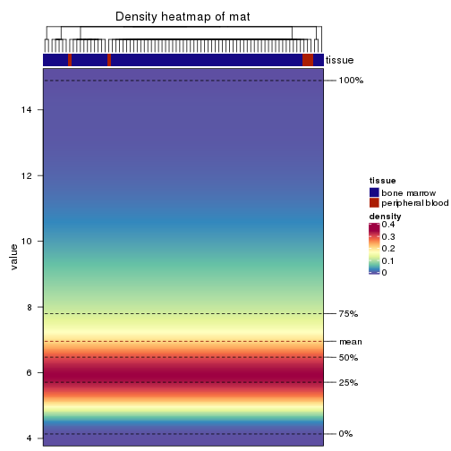


### Suggest the best k


Folowing table shows the best `k` (number of partitions) for each combination
of top-value methods and partition methods. Clicking on the method name in
the table goes to the section for a single combination of methods.

[The cola vignette](http://bioconductor.org/packages/devel/bioc/vignettes/cola/inst/doc/cola.html#toc_13)
explains the definition of the metrics used for determining the best
number of partitions.


```r
suggest_best_k(res_list)
```


|                            | The best k| 1-PAC| Mean silhouette| Concordance|   |Optional k |
|:---------------------------|----------:|-----:|---------------:|-----------:|:--|:----------|
|[ATC:skmeans](#ATC-skmeans) |          3| 0.999|           0.970|       0.985|** |2          |
|[ATC:kmeans](#ATC-kmeans)   |          2| 0.973|           0.951|       0.980|** |           |
|[ATC:NMF](#ATC-NMF)         |          3| 0.967|           0.952|       0.980|** |2          |
|[SD:NMF](#SD-NMF)           |          3| 0.956|           0.908|       0.947|** |           |
|[CV:skmeans](#CV-skmeans)   |          5| 0.943|           0.890|       0.943|*  |2,3        |
|[CV:NMF](#CV-NMF)           |          5| 0.918|           0.870|       0.936|*  |3,4        |
|[SD:pam](#SD-pam)           |          3| 0.910|           0.889|       0.957|*  |           |
|[CV:pam](#CV-pam)           |          6| 0.904|           0.845|       0.939|*  |2,3,5      |
|[SD:skmeans](#SD-skmeans)   |          4| 0.902|           0.768|       0.910|*  |2,3        |
|[MAD:mclust](#MAD-mclust)   |          4| 0.885|           0.880|       0.945|   |           |
|[SD:mclust](#SD-mclust)     |          4| 0.883|           0.878|       0.946|   |           |
|[MAD:pam](#MAD-pam)         |          3| 0.878|           0.893|       0.954|   |           |
|[ATC:pam](#ATC-pam)         |          6| 0.877|           0.875|       0.920|   |           |
|[MAD:NMF](#MAD-NMF)         |          4| 0.872|           0.868|       0.940|   |           |
|[MAD:skmeans](#MAD-skmeans) |          2| 0.870|           0.903|       0.962|   |           |
|[CV:mclust](#CV-mclust)     |          4| 0.853|           0.861|       0.939|   |           |
|[MAD:kmeans](#MAD-kmeans)   |          4| 0.822|           0.826|       0.899|   |           |
|[SD:kmeans](#SD-kmeans)     |          4| 0.800|           0.822|       0.895|   |           |
|[ATC:mclust](#ATC-mclust)   |          4| 0.794|           0.851|       0.927|   |           |
|[ATC:hclust](#ATC-hclust)   |          2| 0.648|           0.839|       0.926|   |           |
|[MAD:hclust](#MAD-hclust)   |          3| 0.617|           0.749|       0.819|   |           |
|[CV:kmeans](#CV-kmeans)     |          2| 0.558|           0.849|       0.917|   |           |
|[CV:hclust](#CV-hclust)     |          3| 0.542|           0.852|       0.884|   |           |
|[SD:hclust](#SD-hclust)     |          3| 0.512|           0.811|       0.869|   |           |

\*\*: 1-PAC > 0.95, \*: 1-PAC > 0.9


### CDF of consensus matrices

Cumulative distribution function curves of consensus matrix for all methods.


```r
collect_plots(res_list, fun = plot_ecdf)
```

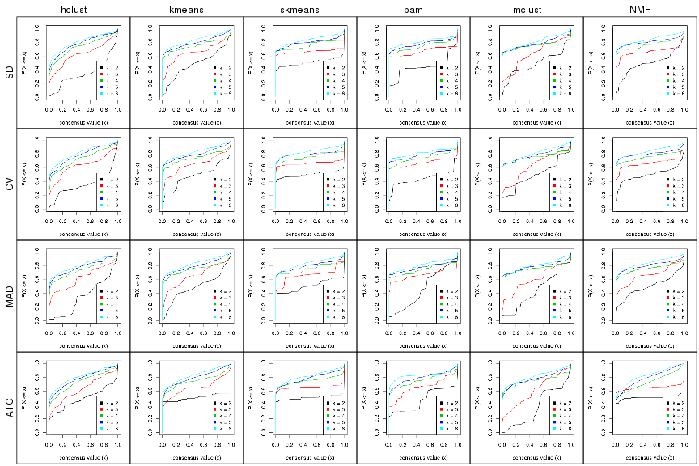


### Consensus heatmap

Consensus heatmaps for all methods. ([What is a consensus heatmap?](http://bioconductor.org/packages/devel/bioc/vignettes/cola/inst/doc/cola.html#toc_9))


<style type='text/css'>


.ui-helper-hidden {
	display: none;
}
.ui-helper-hidden-accessible {
	border: 0;
	clip: rect(0 0 0 0);
	height: 1px;
	margin: -1px;
	overflow: hidden;
	padding: 0;
	position: absolute;
	width: 1px;
}
.ui-helper-reset {
	margin: 0;
	padding: 0;
	border: 0;
	outline: 0;
	line-height: 1.3;
	text-decoration: none;
	font-size: 100%;
	list-style: none;
}
.ui-helper-clearfix:before,
.ui-helper-clearfix:after {
	content: "";
	display: table;
	border-collapse: collapse;
}
.ui-helper-clearfix:after {
	clear: both;
}
.ui-helper-zfix {
	width: 100%;
	height: 100%;
	top: 0;
	left: 0;
	position: absolute;
	opacity: 0;
	filter:Alpha(Opacity=0); 
}

.ui-front {
	z-index: 100;
}


.ui-state-disabled {
	cursor: default !important;
	pointer-events: none;
}


.ui-icon {
	display: inline-block;
	vertical-align: middle;
	margin-top: -.25em;
	position: relative;
	text-indent: -99999px;
	overflow: hidden;
	background-repeat: no-repeat;
}

.ui-widget-icon-block {
	left: 50%;
	margin-left: -8px;
	display: block;
}


.ui-widget-overlay {
	position: fixed;
	top: 0;
	left: 0;
	width: 100%;
	height: 100%;
}
.ui-accordion .ui-accordion-header {
	display: block;
	cursor: pointer;
	position: relative;
	margin: 2px 0 0 0;
	padding: .5em .5em .5em .7em;
	font-size: 100%;
}
.ui-accordion .ui-accordion-content {
	padding: 1em 2.2em;
	border-top: 0;
	overflow: auto;
}
.ui-autocomplete {
	position: absolute;
	top: 0;
	left: 0;
	cursor: default;
}
.ui-menu {
	list-style: none;
	padding: 0;
	margin: 0;
	display: block;
	outline: 0;
}
.ui-menu .ui-menu {
	position: absolute;
}
.ui-menu .ui-menu-item {
	margin: 0;
	cursor: pointer;
	
	list-style-image: url("data:image/gif;base64,R0lGODlhAQABAIAAAAAAAP///yH5BAEAAAAALAAAAAABAAEAAAIBRAA7");
}
.ui-menu .ui-menu-item-wrapper {
	position: relative;
	padding: 3px 1em 3px .4em;
}
.ui-menu .ui-menu-divider {
	margin: 5px 0;
	height: 0;
	font-size: 0;
	line-height: 0;
	border-width: 1px 0 0 0;
}
.ui-menu .ui-state-focus,
.ui-menu .ui-state-active {
	margin: -1px;
}


.ui-menu-icons {
	position: relative;
}
.ui-menu-icons .ui-menu-item-wrapper {
	padding-left: 2em;
}


.ui-menu .ui-icon {
	position: absolute;
	top: 0;
	bottom: 0;
	left: .2em;
	margin: auto 0;
}


.ui-menu .ui-menu-icon {
	left: auto;
	right: 0;
}
.ui-button {
	padding: .4em 1em;
	display: inline-block;
	position: relative;
	line-height: normal;
	margin-right: .1em;
	cursor: pointer;
	vertical-align: middle;
	text-align: center;
	-webkit-user-select: none;
	-moz-user-select: none;
	-ms-user-select: none;
	user-select: none;

	
	overflow: visible;
}

.ui-button,
.ui-button:link,
.ui-button:visited,
.ui-button:hover,
.ui-button:active {
	text-decoration: none;
}


.ui-button-icon-only {
	width: 2em;
	box-sizing: border-box;
	text-indent: -9999px;
	white-space: nowrap;
}


input.ui-button.ui-button-icon-only {
	text-indent: 0;
}


.ui-button-icon-only .ui-icon {
	position: absolute;
	top: 50%;
	left: 50%;
	margin-top: -8px;
	margin-left: -8px;
}

.ui-button.ui-icon-notext .ui-icon {
	padding: 0;
	width: 2.1em;
	height: 2.1em;
	text-indent: -9999px;
	white-space: nowrap;

}

input.ui-button.ui-icon-notext .ui-icon {
	width: auto;
	height: auto;
	text-indent: 0;
	white-space: normal;
	padding: .4em 1em;
}


input.ui-button::-moz-focus-inner,
button.ui-button::-moz-focus-inner {
	border: 0;
	padding: 0;
}
.ui-controlgroup {
	vertical-align: middle;
	display: inline-block;
}
.ui-controlgroup > .ui-controlgroup-item {
	float: left;
	margin-left: 0;
	margin-right: 0;
}
.ui-controlgroup > .ui-controlgroup-item:focus,
.ui-controlgroup > .ui-controlgroup-item.ui-visual-focus {
	z-index: 9999;
}
.ui-controlgroup-vertical > .ui-controlgroup-item {
	display: block;
	float: none;
	width: 100%;
	margin-top: 0;
	margin-bottom: 0;
	text-align: left;
}
.ui-controlgroup-vertical .ui-controlgroup-item {
	box-sizing: border-box;
}
.ui-controlgroup .ui-controlgroup-label {
	padding: .4em 1em;
}
.ui-controlgroup .ui-controlgroup-label span {
	font-size: 80%;
}
.ui-controlgroup-horizontal .ui-controlgroup-label + .ui-controlgroup-item {
	border-left: none;
}
.ui-controlgroup-vertical .ui-controlgroup-label + .ui-controlgroup-item {
	border-top: none;
}
.ui-controlgroup-horizontal .ui-controlgroup-label.ui-widget-content {
	border-right: none;
}
.ui-controlgroup-vertical .ui-controlgroup-label.ui-widget-content {
	border-bottom: none;
}


.ui-controlgroup-vertical .ui-spinner-input {

	
	width: 75%;
	width: calc( 100% - 2.4em );
}
.ui-controlgroup-vertical .ui-spinner .ui-spinner-up {
	border-top-style: solid;
}

.ui-checkboxradio-label .ui-icon-background {
	box-shadow: inset 1px 1px 1px #ccc;
	border-radius: .12em;
	border: none;
}
.ui-checkboxradio-radio-label .ui-icon-background {
	width: 16px;
	height: 16px;
	border-radius: 1em;
	overflow: visible;
	border: none;
}
.ui-checkboxradio-radio-label.ui-checkboxradio-checked .ui-icon,
.ui-checkboxradio-radio-label.ui-checkboxradio-checked:hover .ui-icon {
	background-image: none;
	width: 8px;
	height: 8px;
	border-width: 4px;
	border-style: solid;
}
.ui-checkboxradio-disabled {
	pointer-events: none;
}
.ui-datepicker {
	width: 17em;
	padding: .2em .2em 0;
	display: none;
}
.ui-datepicker .ui-datepicker-header {
	position: relative;
	padding: .2em 0;
}
.ui-datepicker .ui-datepicker-prev,
.ui-datepicker .ui-datepicker-next {
	position: absolute;
	top: 2px;
	width: 1.8em;
	height: 1.8em;
}
.ui-datepicker .ui-datepicker-prev-hover,
.ui-datepicker .ui-datepicker-next-hover {
	top: 1px;
}
.ui-datepicker .ui-datepicker-prev {
	left: 2px;
}
.ui-datepicker .ui-datepicker-next {
	right: 2px;
}
.ui-datepicker .ui-datepicker-prev-hover {
	left: 1px;
}
.ui-datepicker .ui-datepicker-next-hover {
	right: 1px;
}
.ui-datepicker .ui-datepicker-prev span,
.ui-datepicker .ui-datepicker-next span {
	display: block;
	position: absolute;
	left: 50%;
	margin-left: -8px;
	top: 50%;
	margin-top: -8px;
}
.ui-datepicker .ui-datepicker-title {
	margin: 0 2.3em;
	line-height: 1.8em;
	text-align: center;
}
.ui-datepicker .ui-datepicker-title select {
	font-size: 1em;
	margin: 1px 0;
}
.ui-datepicker select.ui-datepicker-month,
.ui-datepicker select.ui-datepicker-year {
	width: 45%;
}
.ui-datepicker table {
	width: 100%;
	font-size: .9em;
	border-collapse: collapse;
	margin: 0 0 .4em;
}
.ui-datepicker th {
	padding: .7em .3em;
	text-align: center;
	font-weight: bold;
	border: 0;
}
.ui-datepicker td {
	border: 0;
	padding: 1px;
}
.ui-datepicker td span,
.ui-datepicker td a {
	display: block;
	padding: .2em;
	text-align: right;
	text-decoration: none;
}
.ui-datepicker .ui-datepicker-buttonpane {
	background-image: none;
	margin: .7em 0 0 0;
	padding: 0 .2em;
	border-left: 0;
	border-right: 0;
	border-bottom: 0;
}
.ui-datepicker .ui-datepicker-buttonpane button {
	float: right;
	margin: .5em .2em .4em;
	cursor: pointer;
	padding: .2em .6em .3em .6em;
	width: auto;
	overflow: visible;
}
.ui-datepicker .ui-datepicker-buttonpane button.ui-datepicker-current {
	float: left;
}


.ui-datepicker.ui-datepicker-multi {
	width: auto;
}
.ui-datepicker-multi .ui-datepicker-group {
	float: left;
}
.ui-datepicker-multi .ui-datepicker-group table {
	width: 95%;
	margin: 0 auto .4em;
}
.ui-datepicker-multi-2 .ui-datepicker-group {
	width: 50%;
}
.ui-datepicker-multi-3 .ui-datepicker-group {
	width: 33.3%;
}
.ui-datepicker-multi-4 .ui-datepicker-group {
	width: 25%;
}
.ui-datepicker-multi .ui-datepicker-group-last .ui-datepicker-header,
.ui-datepicker-multi .ui-datepicker-group-middle .ui-datepicker-header {
	border-left-width: 0;
}
.ui-datepicker-multi .ui-datepicker-buttonpane {
	clear: left;
}
.ui-datepicker-row-break {
	clear: both;
	width: 100%;
	font-size: 0;
}


.ui-datepicker-rtl {
	direction: rtl;
}
.ui-datepicker-rtl .ui-datepicker-prev {
	right: 2px;
	left: auto;
}
.ui-datepicker-rtl .ui-datepicker-next {
	left: 2px;
	right: auto;
}
.ui-datepicker-rtl .ui-datepicker-prev:hover {
	right: 1px;
	left: auto;
}
.ui-datepicker-rtl .ui-datepicker-next:hover {
	left: 1px;
	right: auto;
}
.ui-datepicker-rtl .ui-datepicker-buttonpane {
	clear: right;
}
.ui-datepicker-rtl .ui-datepicker-buttonpane button {
	float: left;
}
.ui-datepicker-rtl .ui-datepicker-buttonpane button.ui-datepicker-current,
.ui-datepicker-rtl .ui-datepicker-group {
	float: right;
}
.ui-datepicker-rtl .ui-datepicker-group-last .ui-datepicker-header,
.ui-datepicker-rtl .ui-datepicker-group-middle .ui-datepicker-header {
	border-right-width: 0;
	border-left-width: 1px;
}


.ui-datepicker .ui-icon {
	display: block;
	text-indent: -99999px;
	overflow: hidden;
	background-repeat: no-repeat;
	left: .5em;
	top: .3em;
}
.ui-dialog {
	position: absolute;
	top: 0;
	left: 0;
	padding: .2em;
	outline: 0;
}
.ui-dialog .ui-dialog-titlebar {
	padding: .4em 1em;
	position: relative;
}
.ui-dialog .ui-dialog-title {
	float: left;
	margin: .1em 0;
	white-space: nowrap;
	width: 90%;
	overflow: hidden;
	text-overflow: ellipsis;
}
.ui-dialog .ui-dialog-titlebar-close {
	position: absolute;
	right: .3em;
	top: 50%;
	width: 20px;
	margin: -10px 0 0 0;
	padding: 1px;
	height: 20px;
}
.ui-dialog .ui-dialog-content {
	position: relative;
	border: 0;
	padding: .5em 1em;
	background: none;
	overflow: auto;
}
.ui-dialog .ui-dialog-buttonpane {
	text-align: left;
	border-width: 1px 0 0 0;
	background-image: none;
	margin-top: .5em;
	padding: .3em 1em .5em .4em;
}
.ui-dialog .ui-dialog-buttonpane .ui-dialog-buttonset {
	float: right;
}
.ui-dialog .ui-dialog-buttonpane button {
	margin: .5em .4em .5em 0;
	cursor: pointer;
}
.ui-dialog .ui-resizable-n {
	height: 2px;
	top: 0;
}
.ui-dialog .ui-resizable-e {
	width: 2px;
	right: 0;
}
.ui-dialog .ui-resizable-s {
	height: 2px;
	bottom: 0;
}
.ui-dialog .ui-resizable-w {
	width: 2px;
	left: 0;
}
.ui-dialog .ui-resizable-se,
.ui-dialog .ui-resizable-sw,
.ui-dialog .ui-resizable-ne,
.ui-dialog .ui-resizable-nw {
	width: 7px;
	height: 7px;
}
.ui-dialog .ui-resizable-se {
	right: 0;
	bottom: 0;
}
.ui-dialog .ui-resizable-sw {
	left: 0;
	bottom: 0;
}
.ui-dialog .ui-resizable-ne {
	right: 0;
	top: 0;
}
.ui-dialog .ui-resizable-nw {
	left: 0;
	top: 0;
}
.ui-draggable .ui-dialog-titlebar {
	cursor: move;
}
.ui-draggable-handle {
	-ms-touch-action: none;
	touch-action: none;
}
.ui-resizable {
	position: relative;
}
.ui-resizable-handle {
	position: absolute;
	font-size: 0.1px;
	display: block;
	-ms-touch-action: none;
	touch-action: none;
}
.ui-resizable-disabled .ui-resizable-handle,
.ui-resizable-autohide .ui-resizable-handle {
	display: none;
}
.ui-resizable-n {
	cursor: n-resize;
	height: 7px;
	width: 100%;
	top: -5px;
	left: 0;
}
.ui-resizable-s {
	cursor: s-resize;
	height: 7px;
	width: 100%;
	bottom: -5px;
	left: 0;
}
.ui-resizable-e {
	cursor: e-resize;
	width: 7px;
	right: -5px;
	top: 0;
	height: 100%;
}
.ui-resizable-w {
	cursor: w-resize;
	width: 7px;
	left: -5px;
	top: 0;
	height: 100%;
}
.ui-resizable-se {
	cursor: se-resize;
	width: 12px;
	height: 12px;
	right: 1px;
	bottom: 1px;
}
.ui-resizable-sw {
	cursor: sw-resize;
	width: 9px;
	height: 9px;
	left: -5px;
	bottom: -5px;
}
.ui-resizable-nw {
	cursor: nw-resize;
	width: 9px;
	height: 9px;
	left: -5px;
	top: -5px;
}
.ui-resizable-ne {
	cursor: ne-resize;
	width: 9px;
	height: 9px;
	right: -5px;
	top: -5px;
}
.ui-progressbar {
	height: 2em;
	text-align: left;
	overflow: hidden;
}
.ui-progressbar .ui-progressbar-value {
	margin: -1px;
	height: 100%;
}
.ui-progressbar .ui-progressbar-overlay {
	background: url("");
	height: 100%;
	filter: alpha(opacity=25); 
	opacity: 0.25;
}
.ui-progressbar-indeterminate .ui-progressbar-value {
	background-image: none;
}
.ui-selectable {
	-ms-touch-action: none;
	touch-action: none;
}
.ui-selectable-helper {
	position: absolute;
	z-index: 100;
	border: 1px dotted black;
}
.ui-selectmenu-menu {
	padding: 0;
	margin: 0;
	position: absolute;
	top: 0;
	left: 0;
	display: none;
}
.ui-selectmenu-menu .ui-menu {
	overflow: auto;
	overflow-x: hidden;
	padding-bottom: 1px;
}
.ui-selectmenu-menu .ui-menu .ui-selectmenu-optgroup {
	font-size: 1em;
	font-weight: bold;
	line-height: 1.5;
	padding: 2px 0.4em;
	margin: 0.5em 0 0 0;
	height: auto;
	border: 0;
}
.ui-selectmenu-open {
	display: block;
}
.ui-selectmenu-text {
	display: block;
	margin-right: 20px;
	overflow: hidden;
	text-overflow: ellipsis;
}
.ui-selectmenu-button.ui-button {
	text-align: left;
	white-space: nowrap;
	width: 14em;
}
.ui-selectmenu-icon.ui-icon {
	float: right;
	margin-top: 0;
}
.ui-slider {
	position: relative;
	text-align: left;
}
.ui-slider .ui-slider-handle {
	position: absolute;
	z-index: 2;
	width: 1.2em;
	height: 1.2em;
	cursor: default;
	-ms-touch-action: none;
	touch-action: none;
}
.ui-slider .ui-slider-range {
	position: absolute;
	z-index: 1;
	font-size: .7em;
	display: block;
	border: 0;
	background-position: 0 0;
}


.ui-slider.ui-state-disabled .ui-slider-handle,
.ui-slider.ui-state-disabled .ui-slider-range {
	filter: inherit;
}

.ui-slider-horizontal {
	height: .8em;
}
.ui-slider-horizontal .ui-slider-handle {
	top: -.3em;
	margin-left: -.6em;
}
.ui-slider-horizontal .ui-slider-range {
	top: 0;
	height: 100%;
}
.ui-slider-horizontal .ui-slider-range-min {
	left: 0;
}
.ui-slider-horizontal .ui-slider-range-max {
	right: 0;
}

.ui-slider-vertical {
	width: .8em;
	height: 100px;
}
.ui-slider-vertical .ui-slider-handle {
	left: -.3em;
	margin-left: 0;
	margin-bottom: -.6em;
}
.ui-slider-vertical .ui-slider-range {
	left: 0;
	width: 100%;
}
.ui-slider-vertical .ui-slider-range-min {
	bottom: 0;
}
.ui-slider-vertical .ui-slider-range-max {
	top: 0;
}
.ui-sortable-handle {
	-ms-touch-action: none;
	touch-action: none;
}
.ui-spinner {
	position: relative;
	display: inline-block;
	overflow: hidden;
	padding: 0;
	vertical-align: middle;
}
.ui-spinner-input {
	border: none;
	background: none;
	color: inherit;
	padding: .222em 0;
	margin: .2em 0;
	vertical-align: middle;
	margin-left: .4em;
	margin-right: 2em;
}
.ui-spinner-button {
	width: 1.6em;
	height: 50%;
	font-size: .5em;
	padding: 0;
	margin: 0;
	text-align: center;
	position: absolute;
	cursor: default;
	display: block;
	overflow: hidden;
	right: 0;
}

.ui-spinner a.ui-spinner-button {
	border-top-style: none;
	border-bottom-style: none;
	border-right-style: none;
}
.ui-spinner-up {
	top: 0;
}
.ui-spinner-down {
	bottom: 0;
}
.ui-tabs {
	position: relative;
	padding: .2em;
}
.ui-tabs .ui-tabs-nav {
	margin: 0;
	padding: .2em .2em 0;
}
.ui-tabs .ui-tabs-nav li {
	list-style: none;
	float: left;
	position: relative;
	top: 0;
	margin: 1px .2em 0 0;
	border-bottom-width: 0;
	padding: 0;
	white-space: nowrap;
}
.ui-tabs .ui-tabs-nav .ui-tabs-anchor {
	float: left;
	padding: .5em 1em;
	text-decoration: none;
}
.ui-tabs .ui-tabs-nav li.ui-tabs-active {
	margin-bottom: -1px;
	padding-bottom: 1px;
}
.ui-tabs .ui-tabs-nav li.ui-tabs-active .ui-tabs-anchor,
.ui-tabs .ui-tabs-nav li.ui-state-disabled .ui-tabs-anchor,
.ui-tabs .ui-tabs-nav li.ui-tabs-loading .ui-tabs-anchor {
	cursor: text;
}
.ui-tabs-collapsible .ui-tabs-nav li.ui-tabs-active .ui-tabs-anchor {
	cursor: pointer;
}
.ui-tabs .ui-tabs-panel {
	display: block;
	border-width: 0;
	padding: 1em 1.4em;
	background: none;
}
.ui-tooltip {
	padding: 8px;
	position: absolute;
	z-index: 9999;
	max-width: 300px;
}
body .ui-tooltip {
	border-width: 2px;
}

.ui-widget {
	font-family: Arial,Helvetica,sans-serif;
	font-size: 1em;
}
.ui-widget .ui-widget {
	font-size: 1em;
}
.ui-widget input,
.ui-widget select,
.ui-widget textarea,
.ui-widget button {
	font-family: Arial,Helvetica,sans-serif;
	font-size: 1em;
}
.ui-widget.ui-widget-content {
	border: 1px solid #c5c5c5;
}
.ui-widget-content {
	border: 1px solid #dddddd;
	background: #ffffff;
	color: #333333;
}
.ui-widget-content a {
	color: #333333;
}
.ui-widget-header {
	border: 1px solid #dddddd;
	background: #e9e9e9;
	color: #333333;
	font-weight: bold;
}
.ui-widget-header a {
	color: #333333;
}


.ui-state-default,
.ui-widget-content .ui-state-default,
.ui-widget-header .ui-state-default,
.ui-button,


html .ui-button.ui-state-disabled:hover,
html .ui-button.ui-state-disabled:active {
	border: 1px solid #c5c5c5;
	background: #f6f6f6;
	font-weight: normal;
	color: #454545;
}
.ui-state-default a,
.ui-state-default a:link,
.ui-state-default a:visited,
a.ui-button,
a:link.ui-button,
a:visited.ui-button,
.ui-button {
	color: #454545;
	text-decoration: none;
}
.ui-state-hover,
.ui-widget-content .ui-state-hover,
.ui-widget-header .ui-state-hover,
.ui-state-focus,
.ui-widget-content .ui-state-focus,
.ui-widget-header .ui-state-focus,
.ui-button:hover,
.ui-button:focus {
	border: 1px solid #cccccc;
	background: #ededed;
	font-weight: normal;
	color: #2b2b2b;
}
.ui-state-hover a,
.ui-state-hover a:hover,
.ui-state-hover a:link,
.ui-state-hover a:visited,
.ui-state-focus a,
.ui-state-focus a:hover,
.ui-state-focus a:link,
.ui-state-focus a:visited,
a.ui-button:hover,
a.ui-button:focus {
	color: #2b2b2b;
	text-decoration: none;
}

.ui-visual-focus {
	box-shadow: 0 0 3px 1px rgb(94, 158, 214);
}
.ui-state-active,
.ui-widget-content .ui-state-active,
.ui-widget-header .ui-state-active,
a.ui-button:active,
.ui-button:active,
.ui-button.ui-state-active:hover {
	border: 1px solid #003eff;
	background: #007fff;
	font-weight: normal;
	color: #ffffff;
}
.ui-icon-background,
.ui-state-active .ui-icon-background {
	border: #003eff;
	background-color: #ffffff;
}
.ui-state-active a,
.ui-state-active a:link,
.ui-state-active a:visited {
	color: #ffffff;
	text-decoration: none;
}


.ui-state-highlight,
.ui-widget-content .ui-state-highlight,
.ui-widget-header .ui-state-highlight {
	border: 1px solid #dad55e;
	background: #fffa90;
	color: #777620;
}
.ui-state-checked {
	border: 1px solid #dad55e;
	background: #fffa90;
}
.ui-state-highlight a,
.ui-widget-content .ui-state-highlight a,
.ui-widget-header .ui-state-highlight a {
	color: #777620;
}
.ui-state-error,
.ui-widget-content .ui-state-error,
.ui-widget-header .ui-state-error {
	border: 1px solid #f1a899;
	background: #fddfdf;
	color: #5f3f3f;
}
.ui-state-error a,
.ui-widget-content .ui-state-error a,
.ui-widget-header .ui-state-error a {
	color: #5f3f3f;
}
.ui-state-error-text,
.ui-widget-content .ui-state-error-text,
.ui-widget-header .ui-state-error-text {
	color: #5f3f3f;
}
.ui-priority-primary,
.ui-widget-content .ui-priority-primary,
.ui-widget-header .ui-priority-primary {
	font-weight: bold;
}
.ui-priority-secondary,
.ui-widget-content .ui-priority-secondary,
.ui-widget-header .ui-priority-secondary {
	opacity: .7;
	filter:Alpha(Opacity=70); 
	font-weight: normal;
}
.ui-state-disabled,
.ui-widget-content .ui-state-disabled,
.ui-widget-header .ui-state-disabled {
	opacity: .35;
	filter:Alpha(Opacity=35); 
	background-image: none;
}
.ui-state-disabled .ui-icon {
	filter:Alpha(Opacity=35); 
}


.ui-icon {
	width: 16px;
	height: 16px;
}
.ui-icon,
.ui-widget-content .ui-icon {
	background-image: url("images/ui-icons_444444_256x240.png");
}
.ui-widget-header .ui-icon {
	background-image: url("images/ui-icons_444444_256x240.png");
}
.ui-state-hover .ui-icon,
.ui-state-focus .ui-icon,
.ui-button:hover .ui-icon,
.ui-button:focus .ui-icon {
	background-image: url("images/ui-icons_555555_256x240.png");
}
.ui-state-active .ui-icon,
.ui-button:active .ui-icon {
	background-image: url("images/ui-icons_ffffff_256x240.png");
}
.ui-state-highlight .ui-icon,
.ui-button .ui-state-highlight.ui-icon {
	background-image: url("images/ui-icons_777620_256x240.png");
}
.ui-state-error .ui-icon,
.ui-state-error-text .ui-icon {
	background-image: url("images/ui-icons_cc0000_256x240.png");
}
.ui-button .ui-icon {
	background-image: url("images/ui-icons_777777_256x240.png");
}


.ui-icon-blank { background-position: 16px 16px; }
.ui-icon-caret-1-n { background-position: 0 0; }
.ui-icon-caret-1-ne { background-position: -16px 0; }
.ui-icon-caret-1-e { background-position: -32px 0; }
.ui-icon-caret-1-se { background-position: -48px 0; }
.ui-icon-caret-1-s { background-position: -65px 0; }
.ui-icon-caret-1-sw { background-position: -80px 0; }
.ui-icon-caret-1-w { background-position: -96px 0; }
.ui-icon-caret-1-nw { background-position: -112px 0; }
.ui-icon-caret-2-n-s { background-position: -128px 0; }
.ui-icon-caret-2-e-w { background-position: -144px 0; }
.ui-icon-triangle-1-n { background-position: 0 -16px; }
.ui-icon-triangle-1-ne { background-position: -16px -16px; }
.ui-icon-triangle-1-e { background-position: -32px -16px; }
.ui-icon-triangle-1-se { background-position: -48px -16px; }
.ui-icon-triangle-1-s { background-position: -65px -16px; }
.ui-icon-triangle-1-sw { background-position: -80px -16px; }
.ui-icon-triangle-1-w { background-position: -96px -16px; }
.ui-icon-triangle-1-nw { background-position: -112px -16px; }
.ui-icon-triangle-2-n-s { background-position: -128px -16px; }
.ui-icon-triangle-2-e-w { background-position: -144px -16px; }
.ui-icon-arrow-1-n { background-position: 0 -32px; }
.ui-icon-arrow-1-ne { background-position: -16px -32px; }
.ui-icon-arrow-1-e { background-position: -32px -32px; }
.ui-icon-arrow-1-se { background-position: -48px -32px; }
.ui-icon-arrow-1-s { background-position: -65px -32px; }
.ui-icon-arrow-1-sw { background-position: -80px -32px; }
.ui-icon-arrow-1-w { background-position: -96px -32px; }
.ui-icon-arrow-1-nw { background-position: -112px -32px; }
.ui-icon-arrow-2-n-s { background-position: -128px -32px; }
.ui-icon-arrow-2-ne-sw { background-position: -144px -32px; }
.ui-icon-arrow-2-e-w { background-position: -160px -32px; }
.ui-icon-arrow-2-se-nw { background-position: -176px -32px; }
.ui-icon-arrowstop-1-n { background-position: -192px -32px; }
.ui-icon-arrowstop-1-e { background-position: -208px -32px; }
.ui-icon-arrowstop-1-s { background-position: -224px -32px; }
.ui-icon-arrowstop-1-w { background-position: -240px -32px; }
.ui-icon-arrowthick-1-n { background-position: 1px -48px; }
.ui-icon-arrowthick-1-ne { background-position: -16px -48px; }
.ui-icon-arrowthick-1-e { background-position: -32px -48px; }
.ui-icon-arrowthick-1-se { background-position: -48px -48px; }
.ui-icon-arrowthick-1-s { background-position: -64px -48px; }
.ui-icon-arrowthick-1-sw { background-position: -80px -48px; }
.ui-icon-arrowthick-1-w { background-position: -96px -48px; }
.ui-icon-arrowthick-1-nw { background-position: -112px -48px; }
.ui-icon-arrowthick-2-n-s { background-position: -128px -48px; }
.ui-icon-arrowthick-2-ne-sw { background-position: -144px -48px; }
.ui-icon-arrowthick-2-e-w { background-position: -160px -48px; }
.ui-icon-arrowthick-2-se-nw { background-position: -176px -48px; }
.ui-icon-arrowthickstop-1-n { background-position: -192px -48px; }
.ui-icon-arrowthickstop-1-e { background-position: -208px -48px; }
.ui-icon-arrowthickstop-1-s { background-position: -224px -48px; }
.ui-icon-arrowthickstop-1-w { background-position: -240px -48px; }
.ui-icon-arrowreturnthick-1-w { background-position: 0 -64px; }
.ui-icon-arrowreturnthick-1-n { background-position: -16px -64px; }
.ui-icon-arrowreturnthick-1-e { background-position: -32px -64px; }
.ui-icon-arrowreturnthick-1-s { background-position: -48px -64px; }
.ui-icon-arrowreturn-1-w { background-position: -64px -64px; }
.ui-icon-arrowreturn-1-n { background-position: -80px -64px; }
.ui-icon-arrowreturn-1-e { background-position: -96px -64px; }
.ui-icon-arrowreturn-1-s { background-position: -112px -64px; }
.ui-icon-arrowrefresh-1-w { background-position: -128px -64px; }
.ui-icon-arrowrefresh-1-n { background-position: -144px -64px; }
.ui-icon-arrowrefresh-1-e { background-position: -160px -64px; }
.ui-icon-arrowrefresh-1-s { background-position: -176px -64px; }
.ui-icon-arrow-4 { background-position: 0 -80px; }
.ui-icon-arrow-4-diag { background-position: -16px -80px; }
.ui-icon-extlink { background-position: -32px -80px; }
.ui-icon-newwin { background-position: -48px -80px; }
.ui-icon-refresh { background-position: -64px -80px; }
.ui-icon-shuffle { background-position: -80px -80px; }
.ui-icon-transfer-e-w { background-position: -96px -80px; }
.ui-icon-transferthick-e-w { background-position: -112px -80px; }
.ui-icon-folder-collapsed { background-position: 0 -96px; }
.ui-icon-folder-open { background-position: -16px -96px; }
.ui-icon-document { background-position: -32px -96px; }
.ui-icon-document-b { background-position: -48px -96px; }
.ui-icon-note { background-position: -64px -96px; }
.ui-icon-mail-closed { background-position: -80px -96px; }
.ui-icon-mail-open { background-position: -96px -96px; }
.ui-icon-suitcase { background-position: -112px -96px; }
.ui-icon-comment { background-position: -128px -96px; }
.ui-icon-person { background-position: -144px -96px; }
.ui-icon-print { background-position: -160px -96px; }
.ui-icon-trash { background-position: -176px -96px; }
.ui-icon-locked { background-position: -192px -96px; }
.ui-icon-unlocked { background-position: -208px -96px; }
.ui-icon-bookmark { background-position: -224px -96px; }
.ui-icon-tag { background-position: -240px -96px; }
.ui-icon-home { background-position: 0 -112px; }
.ui-icon-flag { background-position: -16px -112px; }
.ui-icon-calendar { background-position: -32px -112px; }
.ui-icon-cart { background-position: -48px -112px; }
.ui-icon-pencil { background-position: -64px -112px; }
.ui-icon-clock { background-position: -80px -112px; }
.ui-icon-disk { background-position: -96px -112px; }
.ui-icon-calculator { background-position: -112px -112px; }
.ui-icon-zoomin { background-position: -128px -112px; }
.ui-icon-zoomout { background-position: -144px -112px; }
.ui-icon-search { background-position: -160px -112px; }
.ui-icon-wrench { background-position: -176px -112px; }
.ui-icon-gear { background-position: -192px -112px; }
.ui-icon-heart { background-position: -208px -112px; }
.ui-icon-star { background-position: -224px -112px; }
.ui-icon-link { background-position: -240px -112px; }
.ui-icon-cancel { background-position: 0 -128px; }
.ui-icon-plus { background-position: -16px -128px; }
.ui-icon-plusthick { background-position: -32px -128px; }
.ui-icon-minus { background-position: -48px -128px; }
.ui-icon-minusthick { background-position: -64px -128px; }
.ui-icon-close { background-position: -80px -128px; }
.ui-icon-closethick { background-position: -96px -128px; }
.ui-icon-key { background-position: -112px -128px; }
.ui-icon-lightbulb { background-position: -128px -128px; }
.ui-icon-scissors { background-position: -144px -128px; }
.ui-icon-clipboard { background-position: -160px -128px; }
.ui-icon-copy { background-position: -176px -128px; }
.ui-icon-contact { background-position: -192px -128px; }
.ui-icon-image { background-position: -208px -128px; }
.ui-icon-video { background-position: -224px -128px; }
.ui-icon-script { background-position: -240px -128px; }
.ui-icon-alert { background-position: 0 -144px; }
.ui-icon-info { background-position: -16px -144px; }
.ui-icon-notice { background-position: -32px -144px; }
.ui-icon-help { background-position: -48px -144px; }
.ui-icon-check { background-position: -64px -144px; }
.ui-icon-bullet { background-position: -80px -144px; }
.ui-icon-radio-on { background-position: -96px -144px; }
.ui-icon-radio-off { background-position: -112px -144px; }
.ui-icon-pin-w { background-position: -128px -144px; }
.ui-icon-pin-s { background-position: -144px -144px; }
.ui-icon-play { background-position: 0 -160px; }
.ui-icon-pause { background-position: -16px -160px; }
.ui-icon-seek-next { background-position: -32px -160px; }
.ui-icon-seek-prev { background-position: -48px -160px; }
.ui-icon-seek-end { background-position: -64px -160px; }
.ui-icon-seek-start { background-position: -80px -160px; }

.ui-icon-seek-first { background-position: -80px -160px; }
.ui-icon-stop { background-position: -96px -160px; }
.ui-icon-eject { background-position: -112px -160px; }
.ui-icon-volume-off { background-position: -128px -160px; }
.ui-icon-volume-on { background-position: -144px -160px; }
.ui-icon-power { background-position: 0 -176px; }
.ui-icon-signal-diag { background-position: -16px -176px; }
.ui-icon-signal { background-position: -32px -176px; }
.ui-icon-battery-0 { background-position: -48px -176px; }
.ui-icon-battery-1 { background-position: -64px -176px; }
.ui-icon-battery-2 { background-position: -80px -176px; }
.ui-icon-battery-3 { background-position: -96px -176px; }
.ui-icon-circle-plus { background-position: 0 -192px; }
.ui-icon-circle-minus { background-position: -16px -192px; }
.ui-icon-circle-close { background-position: -32px -192px; }
.ui-icon-circle-triangle-e { background-position: -48px -192px; }
.ui-icon-circle-triangle-s { background-position: -64px -192px; }
.ui-icon-circle-triangle-w { background-position: -80px -192px; }
.ui-icon-circle-triangle-n { background-position: -96px -192px; }
.ui-icon-circle-arrow-e { background-position: -112px -192px; }
.ui-icon-circle-arrow-s { background-position: -128px -192px; }
.ui-icon-circle-arrow-w { background-position: -144px -192px; }
.ui-icon-circle-arrow-n { background-position: -160px -192px; }
.ui-icon-circle-zoomin { background-position: -176px -192px; }
.ui-icon-circle-zoomout { background-position: -192px -192px; }
.ui-icon-circle-check { background-position: -208px -192px; }
.ui-icon-circlesmall-plus { background-position: 0 -208px; }
.ui-icon-circlesmall-minus { background-position: -16px -208px; }
.ui-icon-circlesmall-close { background-position: -32px -208px; }
.ui-icon-squaresmall-plus { background-position: -48px -208px; }
.ui-icon-squaresmall-minus { background-position: -64px -208px; }
.ui-icon-squaresmall-close { background-position: -80px -208px; }
.ui-icon-grip-dotted-vertical { background-position: 0 -224px; }
.ui-icon-grip-dotted-horizontal { background-position: -16px -224px; }
.ui-icon-grip-solid-vertical { background-position: -32px -224px; }
.ui-icon-grip-solid-horizontal { background-position: -48px -224px; }
.ui-icon-gripsmall-diagonal-se { background-position: -64px -224px; }
.ui-icon-grip-diagonal-se { background-position: -80px -224px; }


.ui-corner-all,
.ui-corner-top,
.ui-corner-left,
.ui-corner-tl {
	border-top-left-radius: 3px;
}
.ui-corner-all,
.ui-corner-top,
.ui-corner-right,
.ui-corner-tr {
	border-top-right-radius: 3px;
}
.ui-corner-all,
.ui-corner-bottom,
.ui-corner-left,
.ui-corner-bl {
	border-bottom-left-radius: 3px;
}
.ui-corner-all,
.ui-corner-bottom,
.ui-corner-right,
.ui-corner-br {
	border-bottom-right-radius: 3px;
}


.ui-widget-overlay {
	background: #aaaaaa;
	opacity: .3;
	filter: Alpha(Opacity=30); 
}
.ui-widget-shadow {
	-webkit-box-shadow: 0px 0px 5px #666666;
	box-shadow: 0px 0px 5px #666666;
} 
</style>
<script src='js/jquery-1.12.4.js'></script>
<script src='js/jquery-ui.js'></script>

<script>
$( function() {
	$( '#tabs-collect-consensus-heatmap' ).tabs();
} );
</script>
<div id='tabs-collect-consensus-heatmap'>
<ul>
<li><a href='#tab-collect-consensus-heatmap-1'>k = 2</a></li>
<li><a href='#tab-collect-consensus-heatmap-2'>k = 3</a></li>
<li><a href='#tab-collect-consensus-heatmap-3'>k = 4</a></li>
<li><a href='#tab-collect-consensus-heatmap-4'>k = 5</a></li>
<li><a href='#tab-collect-consensus-heatmap-5'>k = 6</a></li>
</ul>
<div id='tab-collect-consensus-heatmap-1'>
<pre><code class="r">collect_plots(res_list, k = 2, fun = consensus_heatmap, mc.cores = 4)
</code></pre>

<p>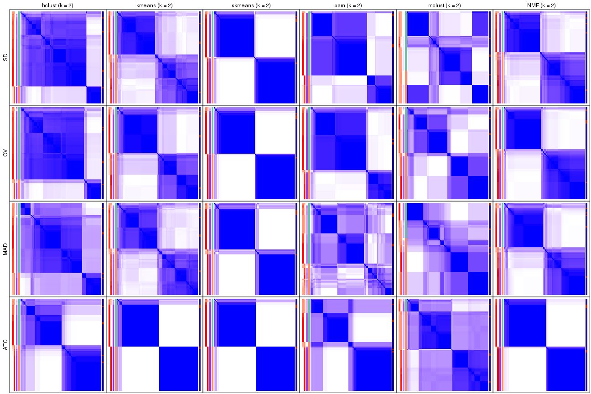</p>

</div>
<div id='tab-collect-consensus-heatmap-2'>
<pre><code class="r">collect_plots(res_list, k = 3, fun = consensus_heatmap, mc.cores = 4)
</code></pre>

<p>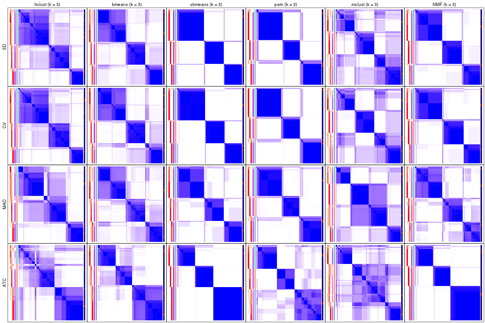</p>

</div>
<div id='tab-collect-consensus-heatmap-3'>
<pre><code class="r">collect_plots(res_list, k = 4, fun = consensus_heatmap, mc.cores = 4)
</code></pre>

<p>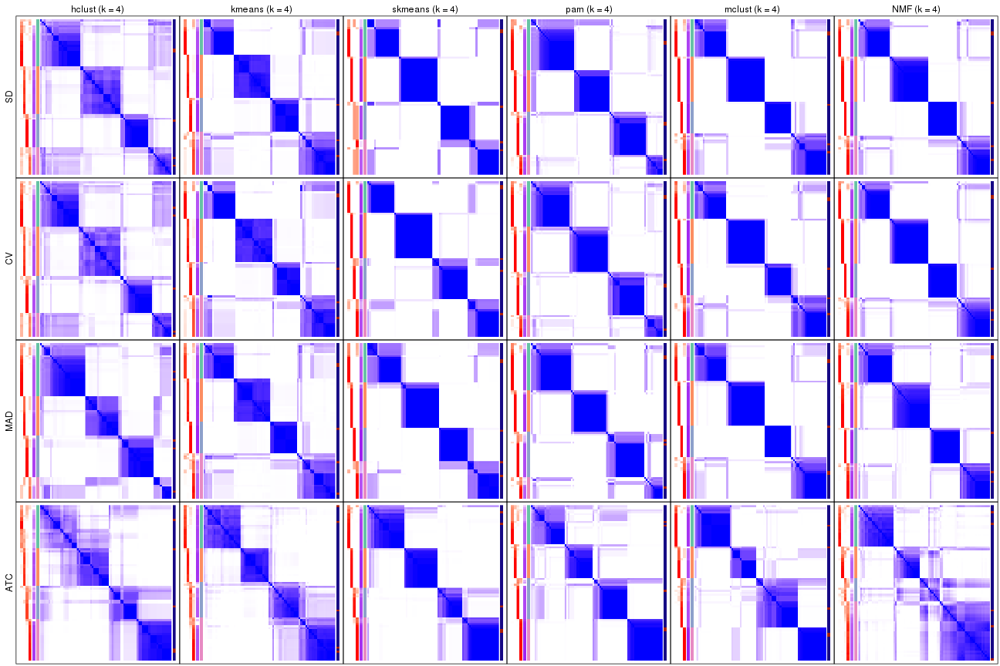</p>

</div>
<div id='tab-collect-consensus-heatmap-4'>
<pre><code class="r">collect_plots(res_list, k = 5, fun = consensus_heatmap, mc.cores = 4)
</code></pre>

<p>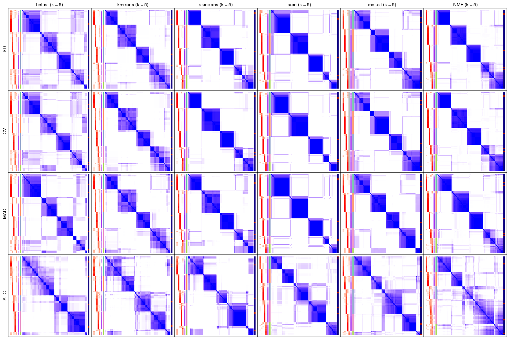</p>

</div>
<div id='tab-collect-consensus-heatmap-5'>
<pre><code class="r">collect_plots(res_list, k = 6, fun = consensus_heatmap, mc.cores = 4)
</code></pre>

<p>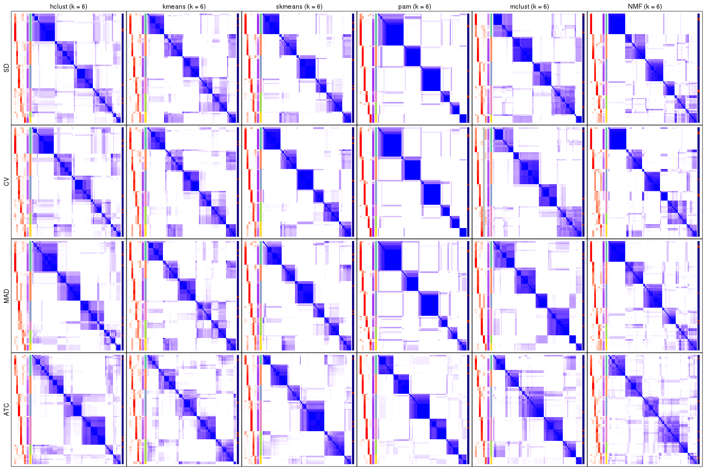</p>

</div>
</div>


### Membership heatmap

Membership heatmaps for all methods. ([What is a membership heatmap?](http://bioconductor.org/packages/devel/bioc/vignettes/cola/inst/doc/cola.html#toc_12))


<script>
$( function() {
	$( '#tabs-collect-membership-heatmap' ).tabs();
} );
</script>
<div id='tabs-collect-membership-heatmap'>
<ul>
<li><a href='#tab-collect-membership-heatmap-1'>k = 2</a></li>
<li><a href='#tab-collect-membership-heatmap-2'>k = 3</a></li>
<li><a href='#tab-collect-membership-heatmap-3'>k = 4</a></li>
<li><a href='#tab-collect-membership-heatmap-4'>k = 5</a></li>
<li><a href='#tab-collect-membership-heatmap-5'>k = 6</a></li>
</ul>
<div id='tab-collect-membership-heatmap-1'>
<pre><code class="r">collect_plots(res_list, k = 2, fun = membership_heatmap, mc.cores = 4)
</code></pre>

<p>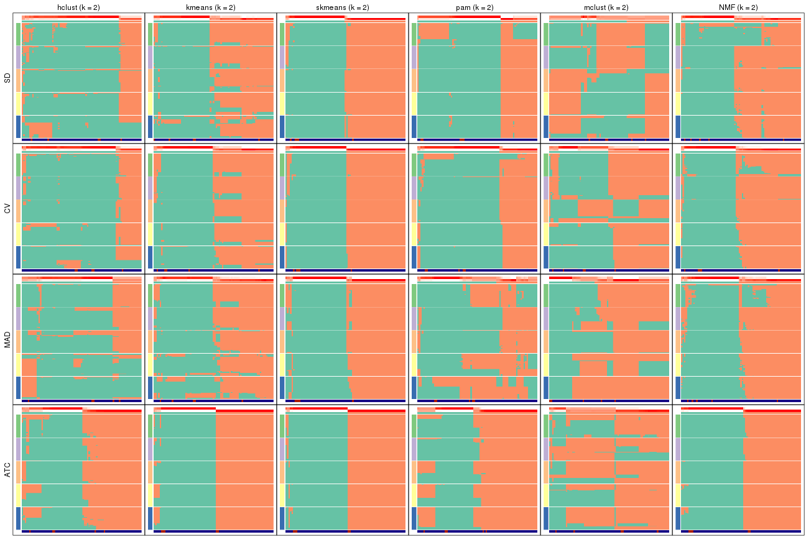</p>

</div>
<div id='tab-collect-membership-heatmap-2'>
<pre><code class="r">collect_plots(res_list, k = 3, fun = membership_heatmap, mc.cores = 4)
</code></pre>

<p>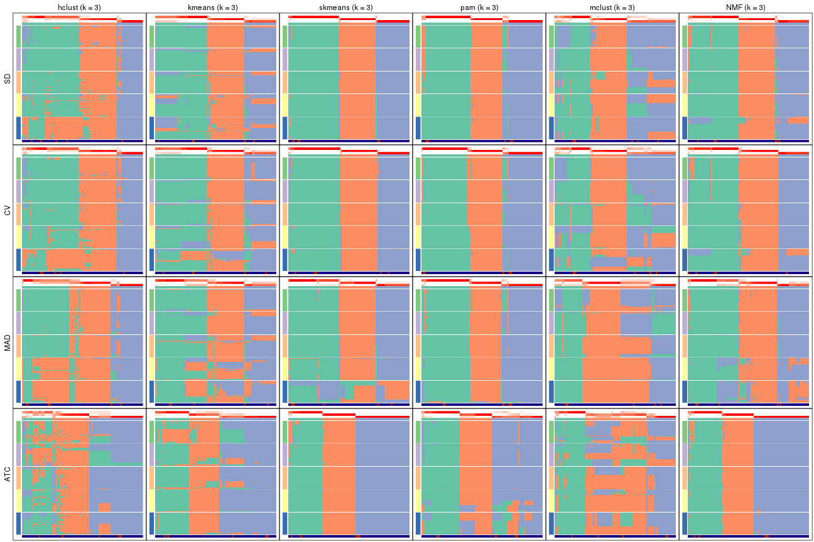</p>

</div>
<div id='tab-collect-membership-heatmap-3'>
<pre><code class="r">collect_plots(res_list, k = 4, fun = membership_heatmap, mc.cores = 4)
</code></pre>

<p>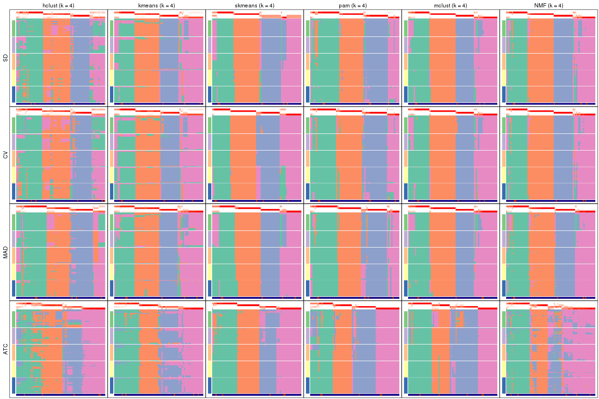</p>

</div>
<div id='tab-collect-membership-heatmap-4'>
<pre><code class="r">collect_plots(res_list, k = 5, fun = membership_heatmap, mc.cores = 4)
</code></pre>

<p>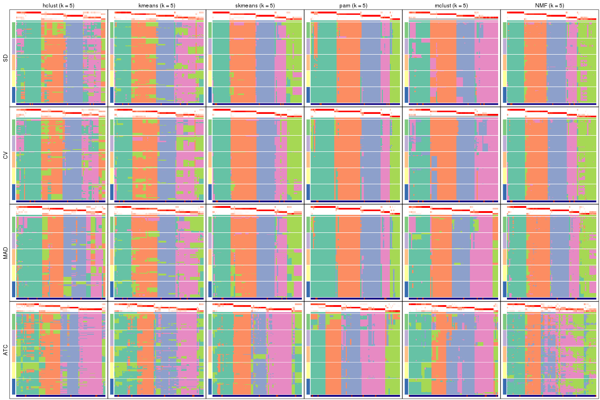</p>

</div>
<div id='tab-collect-membership-heatmap-5'>
<pre><code class="r">collect_plots(res_list, k = 6, fun = membership_heatmap, mc.cores = 4)
</code></pre>

<p>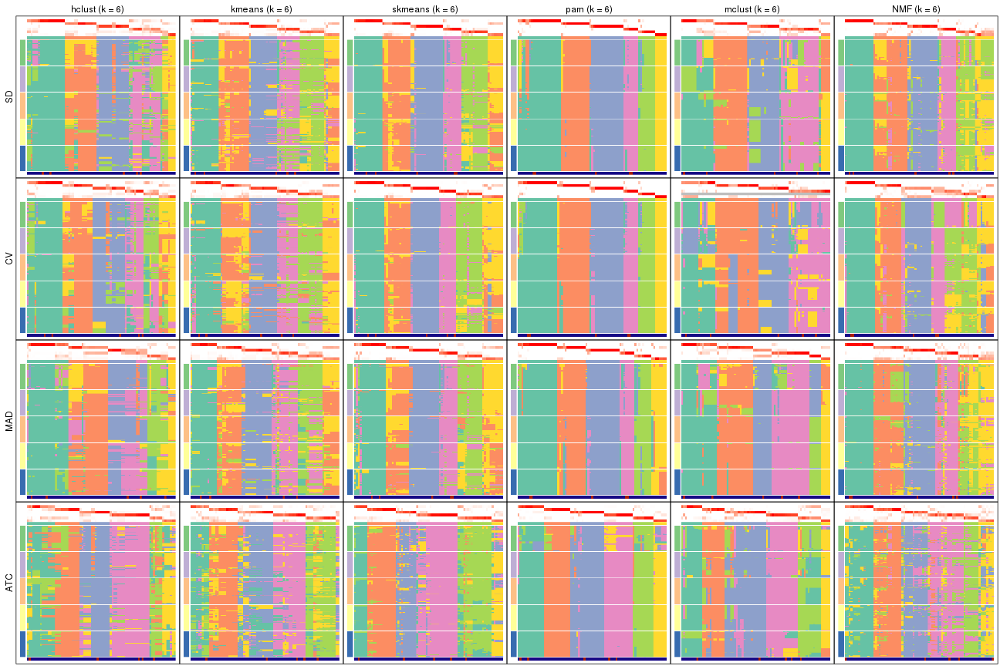</p>

</div>
</div>


### Signature heatmap

Signature heatmaps for all methods. ([What is a signature heatmap?](http://bioconductor.org/packages/devel/bioc/vignettes/cola/inst/doc/cola.html#toc_22))


Note in following heatmaps, rows are scaled.


<script>
$( function() {
	$( '#tabs-collect-get-signatures' ).tabs();
} );
</script>
<div id='tabs-collect-get-signatures'>
<ul>
<li><a href='#tab-collect-get-signatures-1'>k = 2</a></li>
<li><a href='#tab-collect-get-signatures-2'>k = 3</a></li>
<li><a href='#tab-collect-get-signatures-3'>k = 4</a></li>
<li><a href='#tab-collect-get-signatures-4'>k = 5</a></li>
<li><a href='#tab-collect-get-signatures-5'>k = 6</a></li>
</ul>
<div id='tab-collect-get-signatures-1'>
<pre><code class="r">collect_plots(res_list, k = 2, fun = get_signatures, mc.cores = 4)
</code></pre>

<p>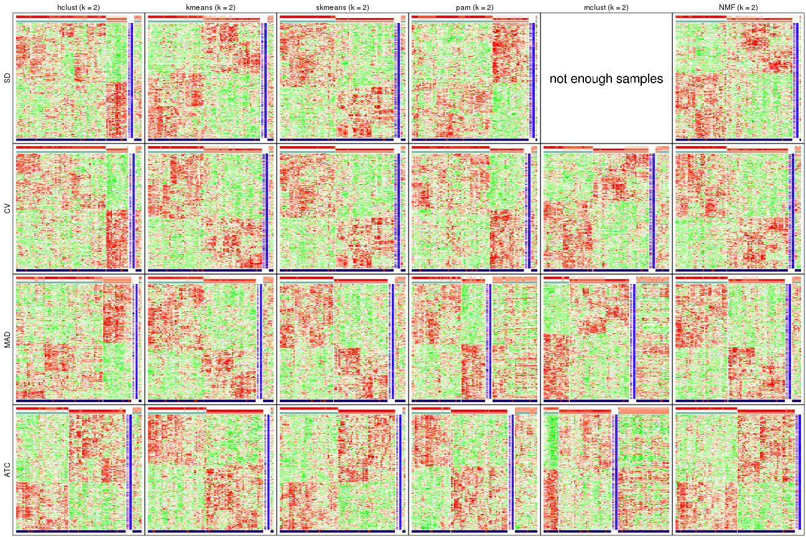</p>

</div>
<div id='tab-collect-get-signatures-2'>
<pre><code class="r">collect_plots(res_list, k = 3, fun = get_signatures, mc.cores = 4)
</code></pre>

<p>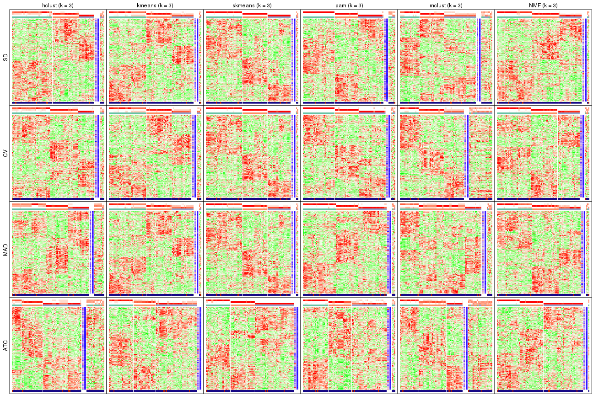</p>

</div>
<div id='tab-collect-get-signatures-3'>
<pre><code class="r">collect_plots(res_list, k = 4, fun = get_signatures, mc.cores = 4)
</code></pre>

<p>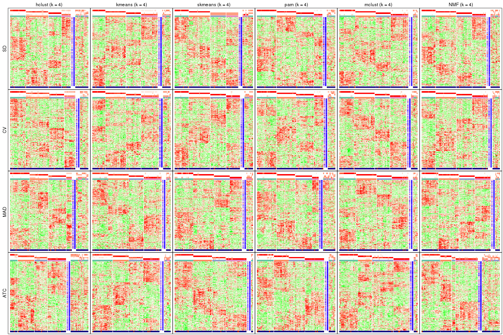</p>

</div>
<div id='tab-collect-get-signatures-4'>
<pre><code class="r">collect_plots(res_list, k = 5, fun = get_signatures, mc.cores = 4)
</code></pre>

<p>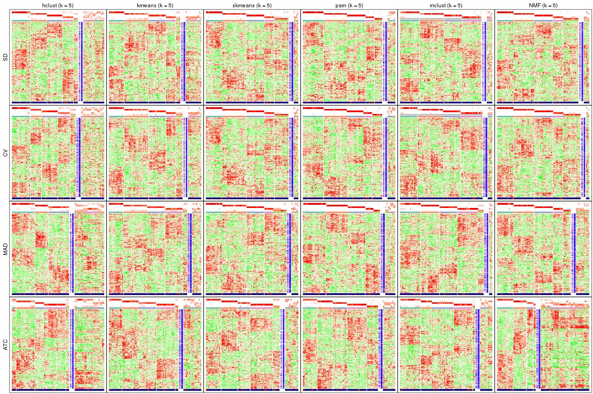</p>

</div>
<div id='tab-collect-get-signatures-5'>
<pre><code class="r">collect_plots(res_list, k = 6, fun = get_signatures, mc.cores = 4)
</code></pre>

<p>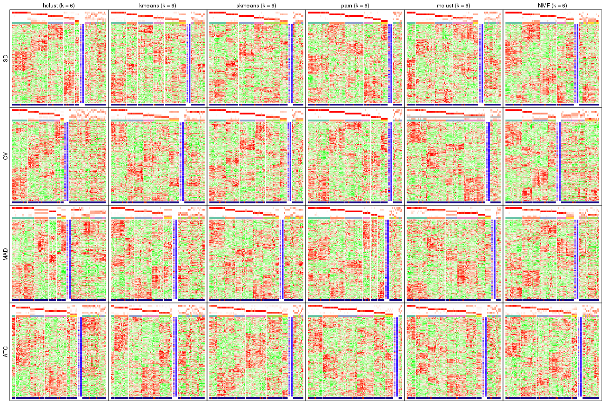</p>

</div>
</div>


### Statistics table

The statistics used for measuring the stability of consensus partitioning.
([How are they
defined?](http://bioconductor.org/packages/devel/bioc/vignettes/cola/inst/doc/cola.html#toc_13))


<script>
$( function() {
	$( '#tabs-get-stats-from-consensus-partition-list' ).tabs();
} );
</script>
<div id='tabs-get-stats-from-consensus-partition-list'>
<ul>
<li><a href='#tab-get-stats-from-consensus-partition-list-1'>k = 2</a></li>
<li><a href='#tab-get-stats-from-consensus-partition-list-2'>k = 3</a></li>
<li><a href='#tab-get-stats-from-consensus-partition-list-3'>k = 4</a></li>
<li><a href='#tab-get-stats-from-consensus-partition-list-4'>k = 5</a></li>
<li><a href='#tab-get-stats-from-consensus-partition-list-5'>k = 6</a></li>
</ul>
<div id='tab-get-stats-from-consensus-partition-list-1'>
<pre><code class="r">get_stats(res_list, k = 2)
</code></pre>

<pre><code>#&gt;             k 1-PAC mean_silhouette concordance area_increased  Rand Jaccard
#&gt; SD:NMF      2 0.570          0.8724       0.908          0.495 0.500   0.500
#&gt; CV:NMF      2 0.855          0.9019       0.951          0.501 0.498   0.498
#&gt; MAD:NMF     2 0.577          0.8330       0.917          0.499 0.494   0.494
#&gt; ATC:NMF     2 1.000          0.9823       0.991          0.506 0.494   0.494
#&gt; SD:skmeans  2 0.973          0.9438       0.977          0.506 0.494   0.494
#&gt; CV:skmeans  2 0.999          0.9538       0.981          0.506 0.494   0.494
#&gt; MAD:skmeans 2 0.870          0.9028       0.962          0.506 0.494   0.494
#&gt; ATC:skmeans 2 1.000          0.9691       0.987          0.507 0.494   0.494
#&gt; SD:mclust   2 0.387          0.0734       0.540          0.494 0.537   0.537
#&gt; CV:mclust   2 0.431          0.7376       0.827          0.499 0.494   0.494
#&gt; MAD:mclust  2 0.271          0.6170       0.815          0.446 0.523   0.523
#&gt; ATC:mclust  2 0.332          0.5475       0.750          0.373 0.757   0.757
#&gt; SD:kmeans   2 0.471          0.8288       0.892          0.487 0.496   0.496
#&gt; CV:kmeans   2 0.558          0.8494       0.917          0.487 0.494   0.494
#&gt; MAD:kmeans  2 0.410          0.8052       0.888          0.492 0.494   0.494
#&gt; ATC:kmeans  2 0.973          0.9513       0.980          0.506 0.494   0.494
#&gt; SD:pam      2 0.495          0.8929       0.924          0.441 0.572   0.572
#&gt; CV:pam      2 0.906          0.8983       0.949          0.445 0.562   0.562
#&gt; MAD:pam     2 0.270          0.4917       0.722          0.466 0.544   0.544
#&gt; ATC:pam     2 0.701          0.7622       0.905          0.474 0.496   0.496
#&gt; SD:hclust   2 0.401          0.8371       0.891          0.350 0.688   0.688
#&gt; CV:hclust   2 0.622          0.8793       0.921          0.351 0.658   0.658
#&gt; MAD:hclust  2 0.323          0.7828       0.816          0.351 0.630   0.630
#&gt; ATC:hclust  2 0.648          0.8395       0.926          0.492 0.494   0.494
</code></pre>

</div>
<div id='tab-get-stats-from-consensus-partition-list-2'>
<pre><code class="r">get_stats(res_list, k = 3)
</code></pre>

<pre><code>#&gt;             k 1-PAC mean_silhouette concordance area_increased  Rand Jaccard
#&gt; SD:NMF      3 0.956           0.908       0.947          0.341 0.774   0.575
#&gt; CV:NMF      3 0.948           0.904       0.946          0.324 0.797   0.610
#&gt; MAD:NMF     3 0.651           0.792       0.874          0.333 0.775   0.574
#&gt; ATC:NMF     3 0.967           0.952       0.980          0.288 0.794   0.606
#&gt; SD:skmeans  3 0.981           0.954       0.982          0.312 0.772   0.569
#&gt; CV:skmeans  3 1.000           0.956       0.981          0.310 0.773   0.573
#&gt; MAD:skmeans 3 0.670           0.880       0.875          0.314 0.759   0.549
#&gt; ATC:skmeans 3 0.999           0.970       0.985          0.295 0.776   0.578
#&gt; SD:mclust   3 0.469           0.679       0.833          0.284 0.640   0.415
#&gt; CV:mclust   3 0.504           0.605       0.767          0.264 0.673   0.433
#&gt; MAD:mclust  3 0.534           0.751       0.809          0.363 0.807   0.655
#&gt; ATC:mclust  3 0.384           0.569       0.762          0.645 0.549   0.428
#&gt; SD:kmeans   3 0.683           0.844       0.871          0.339 0.803   0.618
#&gt; CV:kmeans   3 0.683           0.825       0.851          0.333 0.783   0.586
#&gt; MAD:kmeans  3 0.629           0.763       0.795          0.331 0.781   0.584
#&gt; ATC:kmeans  3 0.689           0.852       0.867          0.291 0.809   0.632
#&gt; SD:pam      3 0.910           0.889       0.957          0.510 0.707   0.511
#&gt; CV:pam      3 0.926           0.912       0.965          0.500 0.731   0.536
#&gt; MAD:pam     3 0.878           0.893       0.954          0.428 0.667   0.449
#&gt; ATC:pam     3 0.563           0.814       0.886          0.398 0.678   0.442
#&gt; SD:hclust   3 0.512           0.811       0.869          0.795 0.650   0.498
#&gt; CV:hclust   3 0.542           0.852       0.884          0.791 0.700   0.544
#&gt; MAD:hclust  3 0.617           0.749       0.819          0.777 0.678   0.499
#&gt; ATC:hclust  3 0.526           0.625       0.793          0.286 0.789   0.598
</code></pre>

</div>
<div id='tab-get-stats-from-consensus-partition-list-3'>
<pre><code class="r">get_stats(res_list, k = 4)
</code></pre>

<pre><code>#&gt;             k 1-PAC mean_silhouette concordance area_increased  Rand Jaccard
#&gt; SD:NMF      4 0.881           0.843       0.936          0.140 0.847   0.582
#&gt; CV:NMF      4 0.900           0.860       0.942          0.140 0.841   0.570
#&gt; MAD:NMF     4 0.872           0.868       0.940          0.137 0.846   0.581
#&gt; ATC:NMF     4 0.685           0.649       0.833          0.127 0.886   0.688
#&gt; SD:skmeans  4 0.902           0.768       0.910          0.139 0.826   0.537
#&gt; CV:skmeans  4 0.878           0.861       0.939          0.140 0.895   0.696
#&gt; MAD:skmeans 4 0.871           0.838       0.927          0.138 0.850   0.588
#&gt; ATC:skmeans 4 0.896           0.895       0.949          0.145 0.886   0.675
#&gt; SD:mclust   4 0.883           0.878       0.946          0.193 0.858   0.606
#&gt; CV:mclust   4 0.853           0.861       0.939          0.196 0.858   0.606
#&gt; MAD:mclust  4 0.885           0.880       0.945          0.245 0.788   0.506
#&gt; ATC:mclust  4 0.794           0.851       0.927          0.226 0.835   0.580
#&gt; SD:kmeans   4 0.800           0.822       0.895          0.150 0.835   0.559
#&gt; CV:kmeans   4 0.763           0.793       0.882          0.151 0.837   0.562
#&gt; MAD:kmeans  4 0.822           0.826       0.899          0.147 0.825   0.541
#&gt; ATC:kmeans  4 0.747           0.798       0.881          0.148 0.862   0.624
#&gt; SD:pam      4 0.870           0.829       0.932          0.112 0.913   0.746
#&gt; CV:pam      4 0.825           0.844       0.931          0.115 0.910   0.734
#&gt; MAD:pam     4 0.843           0.780       0.919          0.117 0.907   0.727
#&gt; ATC:pam     4 0.852           0.822       0.918          0.135 0.738   0.378
#&gt; SD:hclust   4 0.617           0.716       0.835          0.169 0.880   0.672
#&gt; CV:hclust   4 0.642           0.718       0.803          0.160 0.877   0.665
#&gt; MAD:hclust  4 0.731           0.708       0.862          0.176 0.877   0.656
#&gt; ATC:hclust  4 0.605           0.700       0.806          0.165 0.833   0.557
</code></pre>

</div>
<div id='tab-get-stats-from-consensus-partition-list-4'>
<pre><code class="r">get_stats(res_list, k = 5)
</code></pre>

<pre><code>#&gt;             k 1-PAC mean_silhouette concordance area_increased  Rand Jaccard
#&gt; SD:NMF      5 0.900           0.840       0.924         0.0623 0.902   0.637
#&gt; CV:NMF      5 0.918           0.870       0.936         0.0621 0.894   0.615
#&gt; MAD:NMF     5 0.851           0.779       0.898         0.0598 0.903   0.643
#&gt; ATC:NMF     5 0.610           0.487       0.690         0.0772 0.833   0.482
#&gt; SD:skmeans  5 0.883           0.851       0.915         0.0533 0.924   0.710
#&gt; CV:skmeans  5 0.943           0.890       0.943         0.0540 0.939   0.760
#&gt; MAD:skmeans 5 0.857           0.776       0.880         0.0549 0.918   0.688
#&gt; ATC:skmeans 5 0.796           0.693       0.848         0.0501 0.902   0.644
#&gt; SD:mclust   5 0.799           0.804       0.874         0.0364 1.000   1.000
#&gt; CV:mclust   5 0.805           0.799       0.873         0.0367 1.000   1.000
#&gt; MAD:mclust  5 0.855           0.857       0.906         0.0379 0.958   0.834
#&gt; ATC:mclust  5 0.747           0.706       0.839         0.0405 0.980   0.919
#&gt; SD:kmeans   5 0.773           0.719       0.809         0.0627 0.938   0.760
#&gt; CV:kmeans   5 0.775           0.699       0.796         0.0675 0.943   0.775
#&gt; MAD:kmeans  5 0.765           0.715       0.816         0.0600 0.956   0.828
#&gt; ATC:kmeans  5 0.705           0.613       0.783         0.0637 0.906   0.658
#&gt; SD:pam      5 0.890           0.838       0.935         0.0479 0.939   0.777
#&gt; CV:pam      5 0.901           0.849       0.940         0.0478 0.951   0.813
#&gt; MAD:pam     5 0.872           0.819       0.934         0.0388 0.936   0.764
#&gt; ATC:pam     5 0.795           0.775       0.867         0.0595 0.842   0.473
#&gt; SD:hclust   5 0.646           0.638       0.796         0.0582 0.951   0.812
#&gt; CV:hclust   5 0.637           0.586       0.765         0.0718 0.932   0.749
#&gt; MAD:hclust  5 0.732           0.577       0.794         0.0624 0.929   0.748
#&gt; ATC:hclust  5 0.642           0.609       0.762         0.0591 0.981   0.923
</code></pre>

</div>
<div id='tab-get-stats-from-consensus-partition-list-5'>
<pre><code class="r">get_stats(res_list, k = 6)
</code></pre>

<pre><code>#&gt;             k 1-PAC mean_silhouette concordance area_increased  Rand Jaccard
#&gt; SD:NMF      6 0.816           0.659       0.826         0.0404 0.951   0.763
#&gt; CV:NMF      6 0.832           0.498       0.741         0.0422 0.888   0.533
#&gt; MAD:NMF     6 0.796           0.669       0.799         0.0419 0.924   0.659
#&gt; ATC:NMF     6 0.666           0.603       0.776         0.0472 0.853   0.442
#&gt; SD:skmeans  6 0.825           0.735       0.842         0.0457 0.961   0.810
#&gt; CV:skmeans  6 0.876           0.786       0.866         0.0473 0.929   0.675
#&gt; MAD:skmeans 6 0.805           0.679       0.808         0.0437 0.941   0.722
#&gt; ATC:skmeans 6 0.778           0.733       0.846         0.0378 0.958   0.810
#&gt; SD:mclust   6 0.779           0.654       0.799         0.0346 0.941   0.771
#&gt; CV:mclust   6 0.765           0.729       0.774         0.0358 0.987   0.950
#&gt; MAD:mclust  6 0.791           0.825       0.854         0.0279 0.981   0.909
#&gt; ATC:mclust  6 0.756           0.681       0.822         0.0369 0.915   0.659
#&gt; SD:kmeans   6 0.759           0.633       0.765         0.0423 0.917   0.636
#&gt; CV:kmeans   6 0.774           0.650       0.766         0.0413 0.911   0.611
#&gt; MAD:kmeans  6 0.764           0.605       0.742         0.0416 0.901   0.588
#&gt; ATC:kmeans  6 0.703           0.533       0.735         0.0406 0.946   0.761
#&gt; SD:pam      6 0.897           0.834       0.936         0.0439 0.971   0.868
#&gt; CV:pam      6 0.904           0.845       0.939         0.0441 0.967   0.850
#&gt; MAD:pam     6 0.842           0.761       0.907         0.0451 0.957   0.806
#&gt; ATC:pam     6 0.877           0.875       0.920         0.0426 0.899   0.569
#&gt; SD:hclust   6 0.703           0.641       0.758         0.0395 0.964   0.842
#&gt; CV:hclust   6 0.676           0.522       0.756         0.0401 0.939   0.728
#&gt; MAD:hclust  6 0.747           0.540       0.729         0.0360 0.925   0.702
#&gt; ATC:hclust  6 0.667           0.613       0.772         0.0350 0.943   0.754
</code></pre>

</div>
</div>

Following heatmap plots the partition for each combination of methods and the
lightness correspond to the silhouette scores for samples in each method. On
top the consensus subgroup is inferred from all methods by taking the mean
silhouette scores as weight.


<script>
$( function() {
	$( '#tabs-collect-stats-from-consensus-partition-list' ).tabs();
} );
</script>
<div id='tabs-collect-stats-from-consensus-partition-list'>
<ul>
<li><a href='#tab-collect-stats-from-consensus-partition-list-1'>k = 2</a></li>
<li><a href='#tab-collect-stats-from-consensus-partition-list-2'>k = 3</a></li>
<li><a href='#tab-collect-stats-from-consensus-partition-list-3'>k = 4</a></li>
<li><a href='#tab-collect-stats-from-consensus-partition-list-4'>k = 5</a></li>
<li><a href='#tab-collect-stats-from-consensus-partition-list-5'>k = 6</a></li>
</ul>
<div id='tab-collect-stats-from-consensus-partition-list-1'>
<pre><code class="r">collect_stats(res_list, k = 2)
</code></pre>

<p>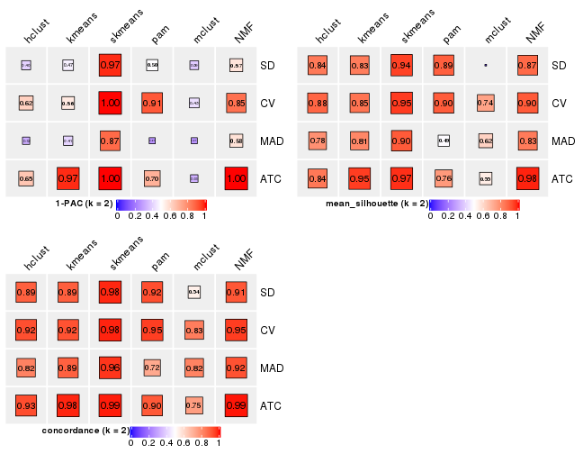</p>

</div>
<div id='tab-collect-stats-from-consensus-partition-list-2'>
<pre><code class="r">collect_stats(res_list, k = 3)
</code></pre>

<p>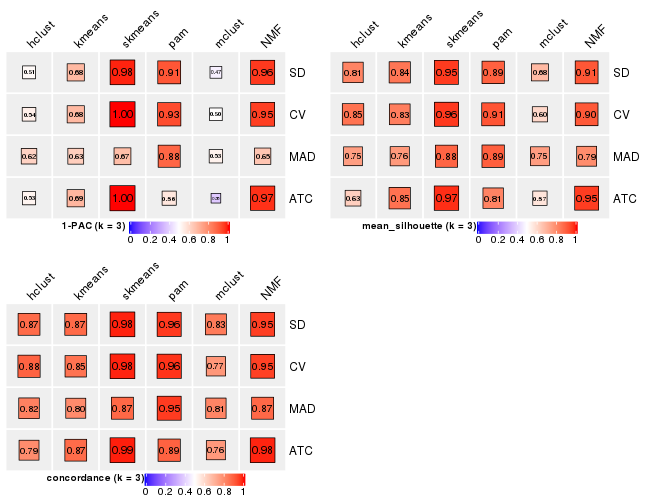</p>

</div>
<div id='tab-collect-stats-from-consensus-partition-list-3'>
<pre><code class="r">collect_stats(res_list, k = 4)
</code></pre>

<p>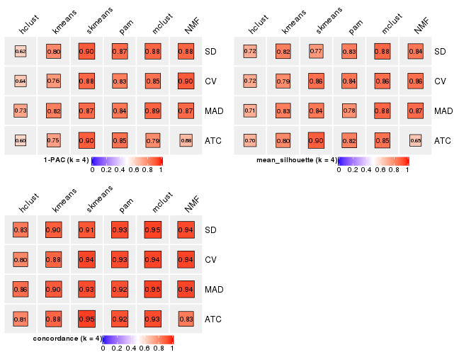</p>

</div>
<div id='tab-collect-stats-from-consensus-partition-list-4'>
<pre><code class="r">collect_stats(res_list, k = 5)
</code></pre>

<p>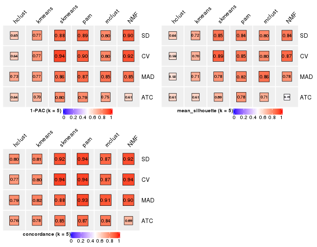</p>

</div>
<div id='tab-collect-stats-from-consensus-partition-list-5'>
<pre><code class="r">collect_stats(res_list, k = 6)
</code></pre>

<p>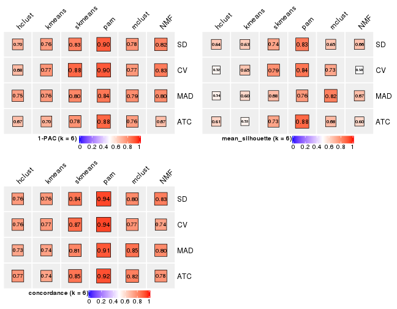</p>

</div>
</div>

### Partition from all methods


Collect partitions from all methods:


<script>
$( function() {
	$( '#tabs-collect-classes-from-consensus-partition-list' ).tabs();
} );
</script>
<div id='tabs-collect-classes-from-consensus-partition-list'>
<ul>
<li><a href='#tab-collect-classes-from-consensus-partition-list-1'>k = 2</a></li>
<li><a href='#tab-collect-classes-from-consensus-partition-list-2'>k = 3</a></li>
<li><a href='#tab-collect-classes-from-consensus-partition-list-3'>k = 4</a></li>
<li><a href='#tab-collect-classes-from-consensus-partition-list-4'>k = 5</a></li>
<li><a href='#tab-collect-classes-from-consensus-partition-list-5'>k = 6</a></li>
</ul>
<div id='tab-collect-classes-from-consensus-partition-list-1'>
<pre><code class="r">collect_classes(res_list, k = 2)
</code></pre>

<p>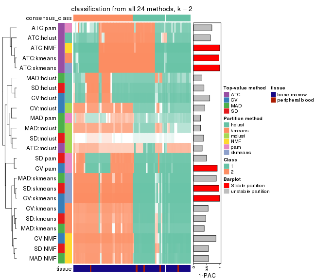</p>

</div>
<div id='tab-collect-classes-from-consensus-partition-list-2'>
<pre><code class="r">collect_classes(res_list, k = 3)
</code></pre>

<p>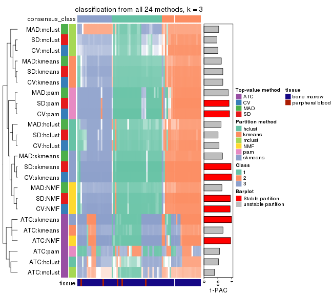</p>

</div>
<div id='tab-collect-classes-from-consensus-partition-list-3'>
<pre><code class="r">collect_classes(res_list, k = 4)
</code></pre>

<p>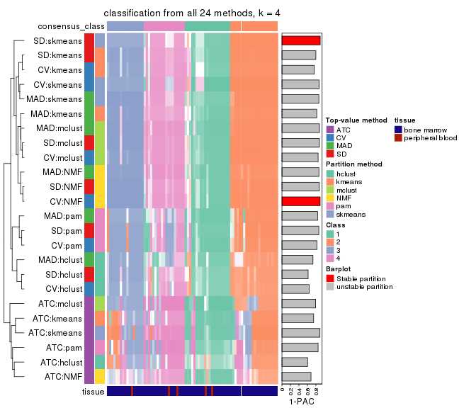</p>

</div>
<div id='tab-collect-classes-from-consensus-partition-list-4'>
<pre><code class="r">collect_classes(res_list, k = 5)
</code></pre>

<p>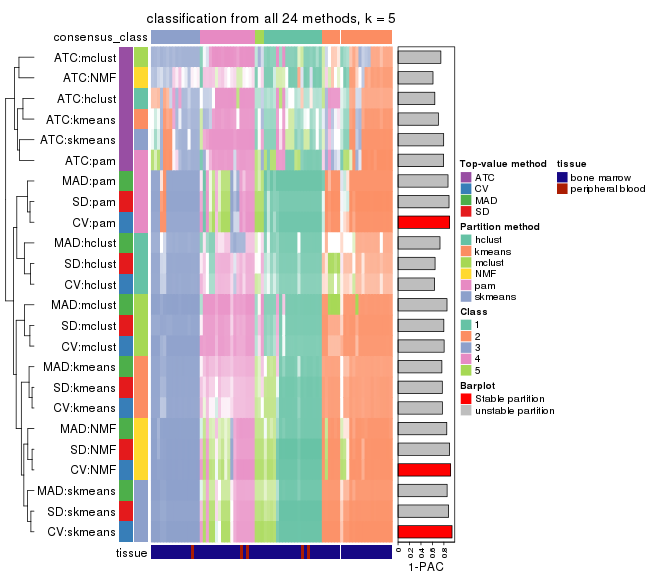</p>

</div>
<div id='tab-collect-classes-from-consensus-partition-list-5'>
<pre><code class="r">collect_classes(res_list, k = 6)
</code></pre>

<p>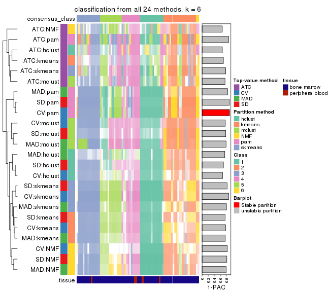</p>

</div>
</div>


### Top rows overlap


Overlap of top rows from different top-row methods:


<script>
$( function() {
	$( '#tabs-top-rows-overlap-by-euler' ).tabs();
} );
</script>
<div id='tabs-top-rows-overlap-by-euler'>
<ul>
<li><a href='#tab-top-rows-overlap-by-euler-1'>top_n = 1000</a></li>
<li><a href='#tab-top-rows-overlap-by-euler-2'>top_n = 2000</a></li>
<li><a href='#tab-top-rows-overlap-by-euler-3'>top_n = 3000</a></li>
<li><a href='#tab-top-rows-overlap-by-euler-4'>top_n = 4000</a></li>
<li><a href='#tab-top-rows-overlap-by-euler-5'>top_n = 5000</a></li>
</ul>
<div id='tab-top-rows-overlap-by-euler-1'>
<pre><code class="r">top_rows_overlap(res_list, top_n = 1000, method = &quot;euler&quot;)
</code></pre>

<p>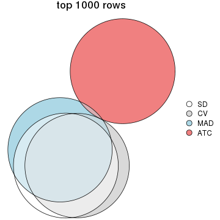</p>

</div>
<div id='tab-top-rows-overlap-by-euler-2'>
<pre><code class="r">top_rows_overlap(res_list, top_n = 2000, method = &quot;euler&quot;)
</code></pre>

<p>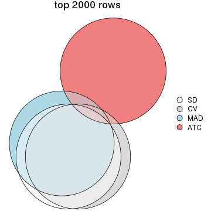</p>

</div>
<div id='tab-top-rows-overlap-by-euler-3'>
<pre><code class="r">top_rows_overlap(res_list, top_n = 3000, method = &quot;euler&quot;)
</code></pre>

<p>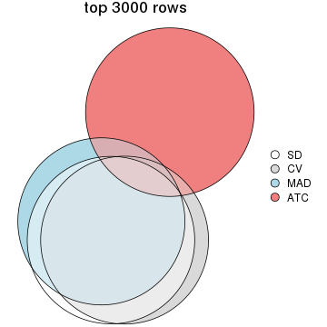</p>

</div>
<div id='tab-top-rows-overlap-by-euler-4'>
<pre><code class="r">top_rows_overlap(res_list, top_n = 4000, method = &quot;euler&quot;)
</code></pre>

<p>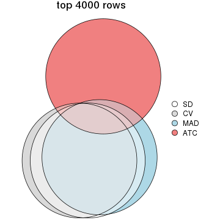</p>

</div>
<div id='tab-top-rows-overlap-by-euler-5'>
<pre><code class="r">top_rows_overlap(res_list, top_n = 5000, method = &quot;euler&quot;)
</code></pre>

<p>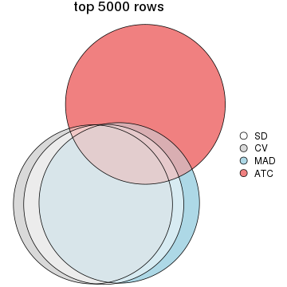</p>

</div>
</div>

Also visualize the correspondance of rankings between different top-row methods:


<script>
$( function() {
	$( '#tabs-top-rows-overlap-by-correspondance' ).tabs();
} );
</script>
<div id='tabs-top-rows-overlap-by-correspondance'>
<ul>
<li><a href='#tab-top-rows-overlap-by-correspondance-1'>top_n = 1000</a></li>
<li><a href='#tab-top-rows-overlap-by-correspondance-2'>top_n = 2000</a></li>
<li><a href='#tab-top-rows-overlap-by-correspondance-3'>top_n = 3000</a></li>
<li><a href='#tab-top-rows-overlap-by-correspondance-4'>top_n = 4000</a></li>
<li><a href='#tab-top-rows-overlap-by-correspondance-5'>top_n = 5000</a></li>
</ul>
<div id='tab-top-rows-overlap-by-correspondance-1'>
<pre><code class="r">top_rows_overlap(res_list, top_n = 1000, method = &quot;correspondance&quot;)
</code></pre>

<p>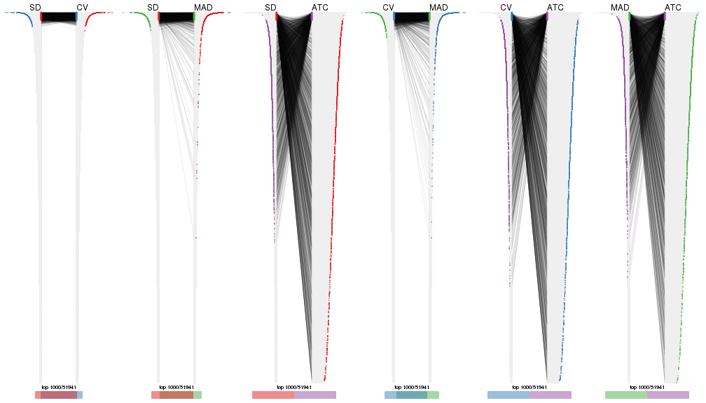</p>

</div>
<div id='tab-top-rows-overlap-by-correspondance-2'>
<pre><code class="r">top_rows_overlap(res_list, top_n = 2000, method = &quot;correspondance&quot;)
</code></pre>

<p>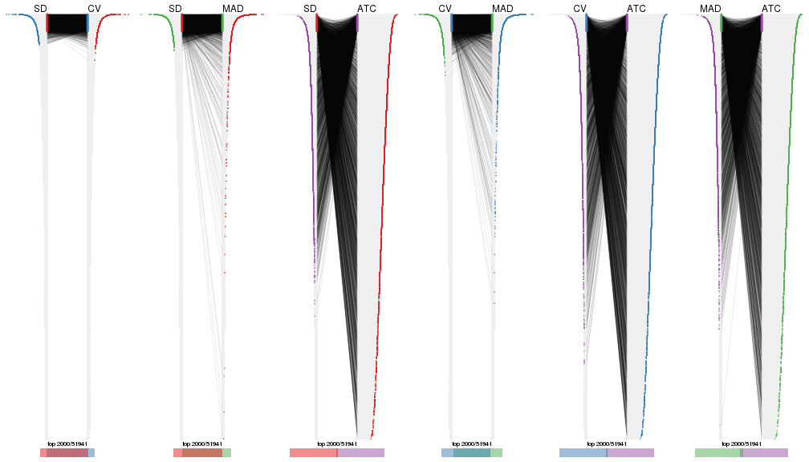</p>

</div>
<div id='tab-top-rows-overlap-by-correspondance-3'>
<pre><code class="r">top_rows_overlap(res_list, top_n = 3000, method = &quot;correspondance&quot;)
</code></pre>

<p>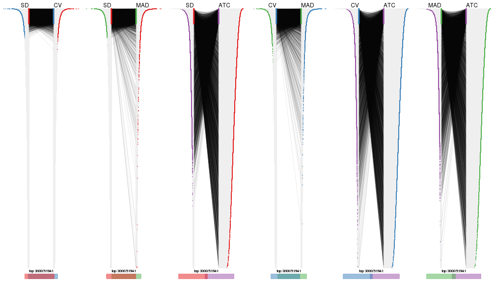</p>

</div>
<div id='tab-top-rows-overlap-by-correspondance-4'>
<pre><code class="r">top_rows_overlap(res_list, top_n = 4000, method = &quot;correspondance&quot;)
</code></pre>

<p>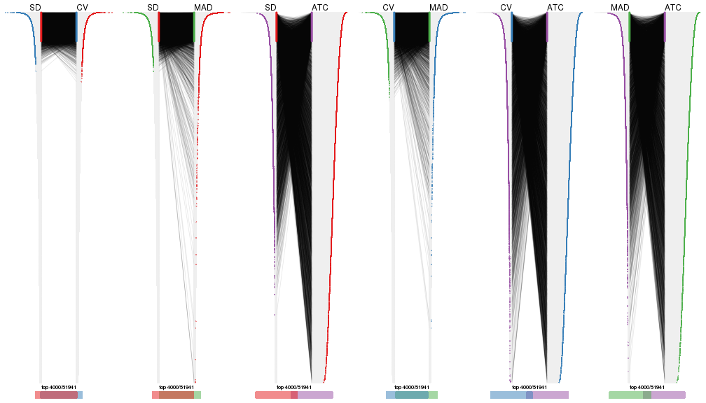</p>

</div>
<div id='tab-top-rows-overlap-by-correspondance-5'>
<pre><code class="r">top_rows_overlap(res_list, top_n = 5000, method = &quot;correspondance&quot;)
</code></pre>

<p>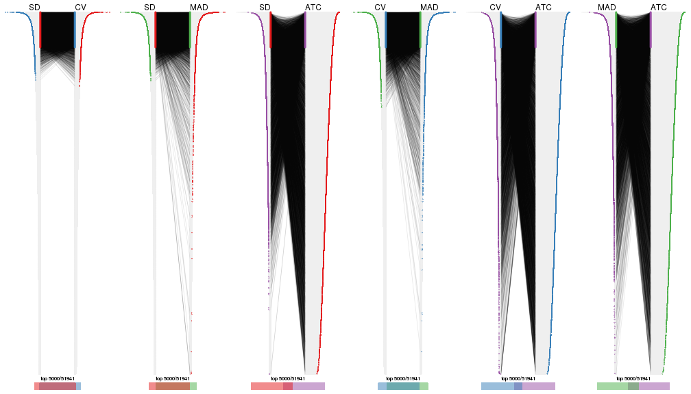</p>

</div>
</div>


Heatmaps of the top rows:


<script>
$( function() {
	$( '#tabs-top-rows-heatmap' ).tabs();
} );
</script>
<div id='tabs-top-rows-heatmap'>
<ul>
<li><a href='#tab-top-rows-heatmap-1'>top_n = 1000</a></li>
<li><a href='#tab-top-rows-heatmap-2'>top_n = 2000</a></li>
<li><a href='#tab-top-rows-heatmap-3'>top_n = 3000</a></li>
<li><a href='#tab-top-rows-heatmap-4'>top_n = 4000</a></li>
<li><a href='#tab-top-rows-heatmap-5'>top_n = 5000</a></li>
</ul>
<div id='tab-top-rows-heatmap-1'>
<pre><code class="r">top_rows_heatmap(res_list, top_n = 1000)
</code></pre>

<p>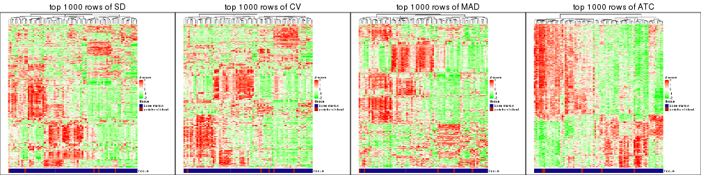</p>

</div>
<div id='tab-top-rows-heatmap-2'>
<pre><code class="r">top_rows_heatmap(res_list, top_n = 2000)
</code></pre>

<p>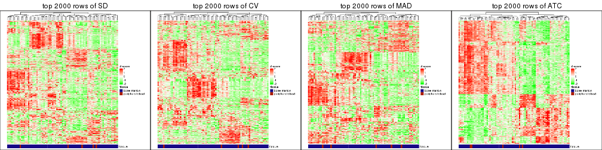</p>

</div>
<div id='tab-top-rows-heatmap-3'>
<pre><code class="r">top_rows_heatmap(res_list, top_n = 3000)
</code></pre>

<p>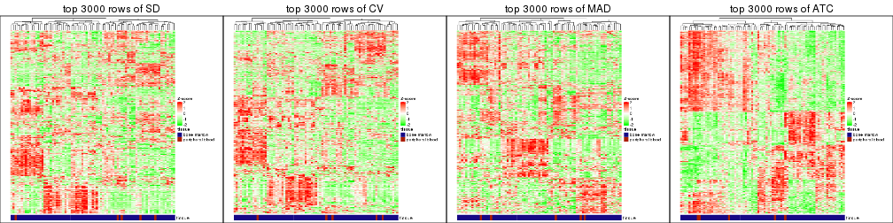</p>

</div>
<div id='tab-top-rows-heatmap-4'>
<pre><code class="r">top_rows_heatmap(res_list, top_n = 4000)
</code></pre>

<p>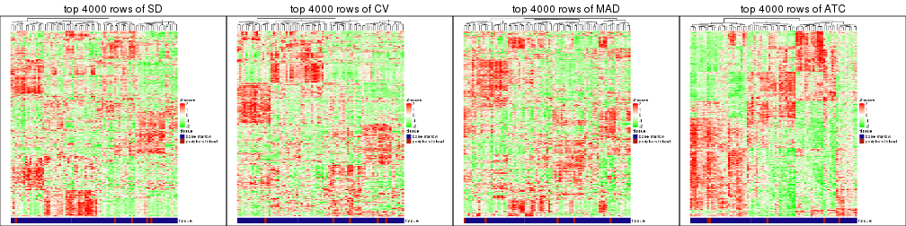</p>

</div>
<div id='tab-top-rows-heatmap-5'>
<pre><code class="r">top_rows_heatmap(res_list, top_n = 5000)
</code></pre>

<p>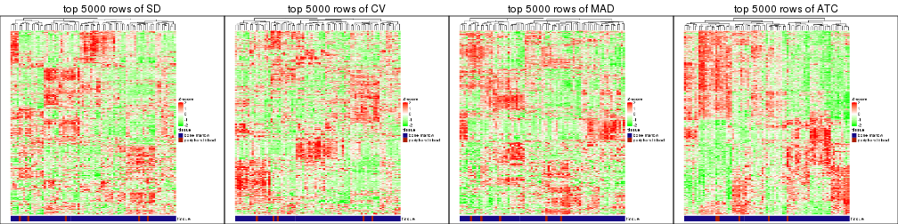</p>

</div>
</div>


### Test to known annotations


Test correlation between subgroups and known annotations. If the known
annotation is numeric, one-way ANOVA test is applied, and if the known
annotation is discrete, chi-squared contingency table test is applied.


<script>
$( function() {
	$( '#tabs-test-to-known-factors-from-consensus-partition-list' ).tabs();
} );
</script>
<div id='tabs-test-to-known-factors-from-consensus-partition-list'>
<ul>
<li><a href='#tab-test-to-known-factors-from-consensus-partition-list-1'>k = 2</a></li>
<li><a href='#tab-test-to-known-factors-from-consensus-partition-list-2'>k = 3</a></li>
<li><a href='#tab-test-to-known-factors-from-consensus-partition-list-3'>k = 4</a></li>
<li><a href='#tab-test-to-known-factors-from-consensus-partition-list-4'>k = 5</a></li>
<li><a href='#tab-test-to-known-factors-from-consensus-partition-list-5'>k = 6</a></li>
</ul>
<div id='tab-test-to-known-factors-from-consensus-partition-list-1'>
<pre><code class="r">test_to_known_factors(res_list, k = 2)
</code></pre>

<pre><code>#&gt;              n tissue(p) k
#&gt; SD:NMF      78     0.218 2
#&gt; CV:NMF      75     0.251 2
#&gt; MAD:NMF     73     0.306 2
#&gt; ATC:NMF     79     1.000 2
#&gt; SD:skmeans  76     0.324 2
#&gt; CV:skmeans  76     0.324 2
#&gt; MAD:skmeans 72     0.354 2
#&gt; ATC:skmeans 77     1.000 2
#&gt; SD:mclust    0        NA 2
#&gt; CV:mclust   70     0.526 2
#&gt; MAD:mclust  57     0.433 2
#&gt; ATC:mclust  45     1.000 2
#&gt; SD:kmeans   75     0.339 2
#&gt; CV:kmeans   76     0.324 2
#&gt; MAD:kmeans  72     0.388 2
#&gt; ATC:kmeans  77     1.000 2
#&gt; SD:pam      78     0.298 2
#&gt; CV:pam      75     0.300 2
#&gt; MAD:pam     49     0.542 2
#&gt; ATC:pam     64     1.000 2
#&gt; SD:hclust   74     1.000 2
#&gt; CV:hclust   75     1.000 2
#&gt; MAD:hclust  77     0.775 2
#&gt; ATC:hclust  73     0.924 2
</code></pre>

</div>
<div id='tab-test-to-known-factors-from-consensus-partition-list-2'>
<pre><code class="r">test_to_known_factors(res_list, k = 3)
</code></pre>

<pre><code>#&gt;              n tissue(p) k
#&gt; SD:NMF      77     0.293 3
#&gt; CV:NMF      75     0.284 3
#&gt; MAD:NMF     76     0.298 3
#&gt; ATC:NMF     78     0.368 3
#&gt; SD:skmeans  77     0.320 3
#&gt; CV:skmeans  77     0.320 3
#&gt; MAD:skmeans 77     0.320 3
#&gt; ATC:skmeans 79     0.356 3
#&gt; SD:mclust   69     0.282 3
#&gt; CV:mclust   58     0.251 3
#&gt; MAD:mclust  74     0.225 3
#&gt; ATC:mclust  57     0.186 3
#&gt; SD:kmeans   77     0.338 3
#&gt; CV:kmeans   75     0.347 3
#&gt; MAD:kmeans  77     0.338 3
#&gt; ATC:kmeans  79     0.400 3
#&gt; SD:pam      73     0.409 3
#&gt; CV:pam      75     0.405 3
#&gt; MAD:pam     76     0.294 3
#&gt; ATC:pam     76     0.358 3
#&gt; SD:hclust   75     0.254 3
#&gt; CV:hclust   75     0.216 3
#&gt; MAD:hclust  70     0.338 3
#&gt; ATC:hclust  63     0.848 3
</code></pre>

</div>
<div id='tab-test-to-known-factors-from-consensus-partition-list-3'>
<pre><code class="r">test_to_known_factors(res_list, k = 4)
</code></pre>

<pre><code>#&gt;              n tissue(p) k
#&gt; SD:NMF      69     0.331 4
#&gt; CV:NMF      71     0.364 4
#&gt; MAD:NMF     74     0.418 4
#&gt; ATC:NMF     60     0.658 4
#&gt; SD:skmeans  68     0.389 4
#&gt; CV:skmeans  70     0.386 4
#&gt; MAD:skmeans 72     0.539 4
#&gt; ATC:skmeans 77     0.564 4
#&gt; SD:mclust   74     0.439 4
#&gt; CV:mclust   72     0.407 4
#&gt; MAD:mclust  74     0.443 4
#&gt; ATC:mclust  75     0.515 4
#&gt; SD:kmeans   70     0.360 4
#&gt; CV:kmeans   71     0.368 4
#&gt; MAD:kmeans  74     0.439 4
#&gt; ATC:kmeans  72     0.591 4
#&gt; SD:pam      70     0.506 4
#&gt; CV:pam      71     0.517 4
#&gt; MAD:pam     66     0.462 4
#&gt; ATC:pam     72     0.588 4
#&gt; SD:hclust   65     0.209 4
#&gt; CV:hclust   70     0.248 4
#&gt; MAD:hclust  66     0.441 4
#&gt; ATC:hclust  60     0.927 4
</code></pre>

</div>
<div id='tab-test-to-known-factors-from-consensus-partition-list-4'>
<pre><code class="r">test_to_known_factors(res_list, k = 5)
</code></pre>

<pre><code>#&gt;              n tissue(p) k
#&gt; SD:NMF      74     0.144 5
#&gt; CV:NMF      76     0.127 5
#&gt; MAD:NMF     67     0.219 5
#&gt; ATC:NMF     35     0.712 5
#&gt; SD:skmeans  75     0.132 5
#&gt; CV:skmeans  75     0.132 5
#&gt; MAD:skmeans 73     0.106 5
#&gt; ATC:skmeans 67     0.714 5
#&gt; SD:mclust   74     0.443 5
#&gt; CV:mclust   75     0.411 5
#&gt; MAD:mclust  76     0.642 5
#&gt; ATC:mclust  68     0.141 5
#&gt; SD:kmeans   65     0.219 5
#&gt; CV:kmeans   67     0.194 5
#&gt; MAD:kmeans  71     0.393 5
#&gt; ATC:kmeans  63     0.710 5
#&gt; SD:pam      72     0.163 5
#&gt; CV:pam      72     0.155 5
#&gt; MAD:pam     70     0.134 5
#&gt; ATC:pam     68     0.476 5
#&gt; SD:hclust   60     0.434 5
#&gt; CV:hclust   58     0.562 5
#&gt; MAD:hclust  52     0.518 5
#&gt; ATC:hclust  52     0.593 5
</code></pre>

</div>
<div id='tab-test-to-known-factors-from-consensus-partition-list-5'>
<pre><code class="r">test_to_known_factors(res_list, k = 6)
</code></pre>

<pre><code>#&gt;              n tissue(p) k
#&gt; SD:NMF      61     0.229 6
#&gt; CV:NMF      45     0.528 6
#&gt; MAD:NMF     61     0.229 6
#&gt; ATC:NMF     64     0.567 6
#&gt; SD:skmeans  70     0.268 6
#&gt; CV:skmeans  69     0.282 6
#&gt; MAD:skmeans 62     0.386 6
#&gt; ATC:skmeans 70     0.772 6
#&gt; SD:mclust   64     0.605 6
#&gt; CV:mclust   70     0.516 6
#&gt; MAD:mclust  75     0.668 6
#&gt; ATC:mclust  67     0.667 6
#&gt; SD:kmeans   67     0.351 6
#&gt; CV:kmeans   61     0.359 6
#&gt; MAD:kmeans  55     0.431 6
#&gt; ATC:kmeans  55     0.606 6
#&gt; SD:pam      71     0.272 6
#&gt; CV:pam      71     0.261 6
#&gt; MAD:pam     68     0.232 6
#&gt; ATC:pam     76     0.422 6
#&gt; SD:hclust   60     0.434 6
#&gt; CV:hclust   46     0.176 6
#&gt; MAD:hclust  48     0.571 6
#&gt; ATC:hclust  58     0.779 6
</code></pre>

</div>
</div>


 
## Results for each method


---------------------------------------------------


### SD:hclust


The object with results only for a single top-value method and a single partition method 
can be extracted as:

```r
res = res_list["SD", "hclust"]
# you can also extract it by
# res = res_list["SD:hclust"]
```

A summary of `res` and all the functions that can be applied to it:

```r
res
```

```
#> A 'ConsensusPartition' object with k = 2, 3, 4, 5, 6.
#>   On a matrix with 51941 rows and 79 columns.
#>   Top rows (1000, 2000, 3000, 4000, 5000) are extracted by 'SD' method.
#>   Subgroups are detected by 'hclust' method.
#>   Performed in total 1250 partitions by row resampling.
#>   Best k for subgroups seems to be 3.
#> 
#> Following methods can be applied to this 'ConsensusPartition' object:
#>  [1] "cola_report"             "collect_classes"         "collect_plots"          
#>  [4] "collect_stats"           "colnames"                "compare_signatures"     
#>  [7] "consensus_heatmap"       "dimension_reduction"     "functional_enrichment"  
#> [10] "get_anno_col"            "get_anno"                "get_classes"            
#> [13] "get_consensus"           "get_matrix"              "get_membership"         
#> [16] "get_param"               "get_signatures"          "get_stats"              
#> [19] "is_best_k"               "is_stable_k"             "membership_heatmap"     
#> [22] "ncol"                    "nrow"                    "plot_ecdf"              
#> [25] "rownames"                "select_partition_number" "show"                   
#> [28] "suggest_best_k"          "test_to_known_factors"
```

`collect_plots()` function collects all the plots made from `res` for all `k` (number of partitions)
into one single page to provide an easy and fast comparison between different `k`.

```r
collect_plots(res)
```

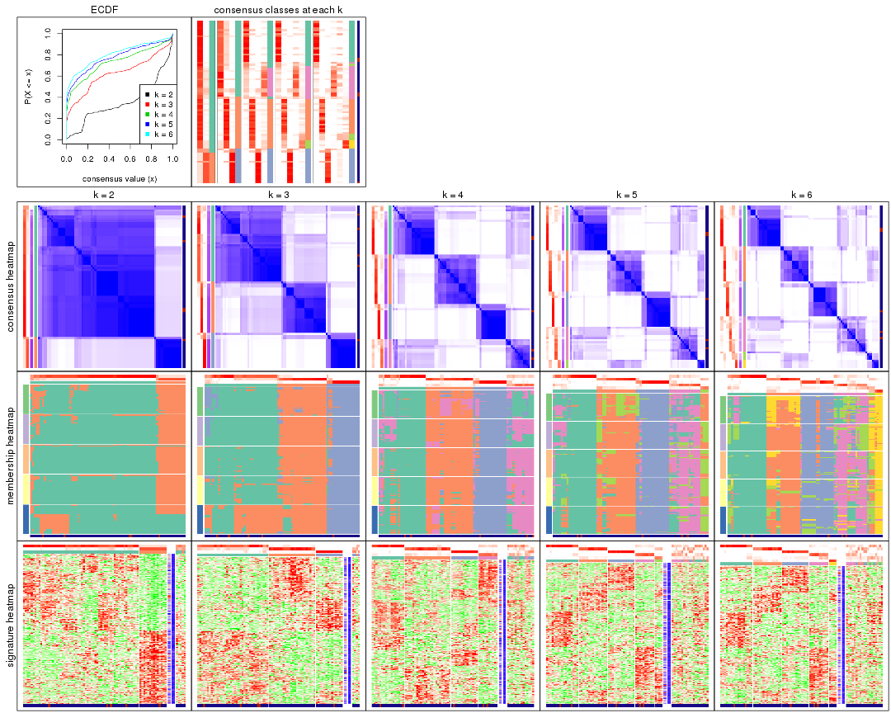

The plots are:

- The first row: a plot of the ECDF (Empirical cumulative distribution
  function) curves of the consensus matrix for each `k` and the heatmap of
  predicted classes for each `k`.
- The second row: heatmaps of the consensus matrix for each `k`.
- The third row: heatmaps of the membership matrix for each `k`.
- The fouth row: heatmaps of the signatures for each `k`.

All the plots in panels can be made by individual functions and they are
plotted later in this section.

`select_partition_number()` produces several plots showing different
statistics for choosing "optimized" `k`. There are following statistics:

- ECDF curves of the consensus matrix for each `k`;
- 1-PAC. [The PAC
  score](https://en.wikipedia.org/wiki/Consensus_clustering#Over-interpretation_potential_of_consensus_clustering)
  measures the proportion of the ambiguous subgrouping.
- Mean silhouette score.
- Concordance. The mean probability of fiting the consensus class ids in all
  partitions.
- Area increased. Denote $A_k$ as the area under the ECDF curve for current
  `k`, the area increased is defined as $A_k - A_{k-1}$.
- Rand index. The percent of pairs of samples that are both in a same cluster
  or both are not in a same cluster in the partition of k and k-1.
- Jaccard index. The ratio of pairs of samples are both in a same cluster in
  the partition of k and k-1 and the pairs of samples are both in a same
  cluster in the partition k or k-1.

The detailed explanations of these statistics can be found in [the cola
vignette](http://bioconductor.org/packages/devel/bioc/vignettes/cola/inst/doc/cola.html#toc_13).

Generally speaking, lower PAC score, higher mean silhouette score or higher
concordance corresponds to better partition. Rand index and Jaccard index
measure how similar the current partition is compared to partition with `k-1`.
If they are too similar, we won't accept `k` is better than `k-1`.

```r
select_partition_number(res)
```

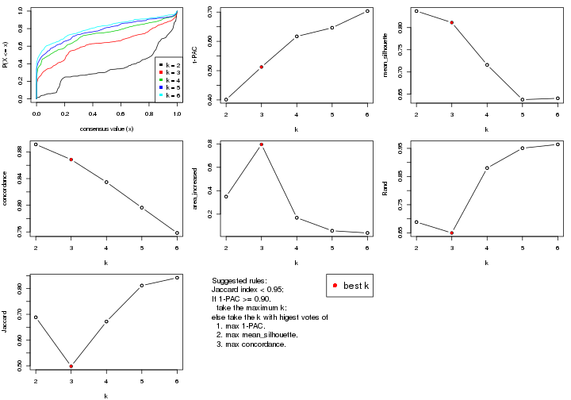

The numeric values for all these statistics can be obtained by `get_stats()`.

```r
get_stats(res)
```

```
#>   k 1-PAC mean_silhouette concordance area_increased  Rand Jaccard
#> 2 2 0.401           0.837       0.891         0.3499 0.688   0.688
#> 3 3 0.512           0.811       0.869         0.7954 0.650   0.498
#> 4 4 0.617           0.716       0.835         0.1694 0.880   0.672
#> 5 5 0.646           0.638       0.796         0.0582 0.951   0.812
#> 6 6 0.703           0.641       0.758         0.0395 0.964   0.842
```

`suggest_best_k()` suggests the best $k$ based on these statistics. The rules are as follows:

- All $k$ with Jaccard index larger than 0.95 are removed because the increase of
  the partition number does not provides enough extra information. If all $k$ are removed,
  the best $k$ is assigned by `NA`.
- For $k$ with 1-PAC larger than 0.9, the maximal $k$ is taken as the "best k". Other $k$ is called "optional k".
- If it does not fit the second rule. The $k$ with the highest vote of highest
  1-PAC, mean silhouette and concordance is taken as the "best k".

```r
suggest_best_k(res)
```

```
#> [1] 3
```


Following shows the table of the partitions (You need to click the **show/hide
code output** link to see it). The membership matrix (columns with name `p*`)
is inferred by
[`clue::cl_consensus()`](https://www.rdocumentation.org/link/cl_consensus?package=clue)
function with the `SE` method. Basically the value in the membership matrix
represents the probability to belong to a certain group. The finall class
label for an item is determined with the group with highest probability it
belongs to.

In `get_classes()` function, the entropy is calculated from the membership
matrix and the silhouette score is calculated from the consensus matrix.


<script>
$( function() {
	$( '#tabs-SD-hclust-get-classes' ).tabs();
} );
</script>
<div id='tabs-SD-hclust-get-classes'>
<ul>
<li><a href='#tab-SD-hclust-get-classes-1'>k = 2</a></li>
<li><a href='#tab-SD-hclust-get-classes-2'>k = 3</a></li>
<li><a href='#tab-SD-hclust-get-classes-3'>k = 4</a></li>
<li><a href='#tab-SD-hclust-get-classes-4'>k = 5</a></li>
<li><a href='#tab-SD-hclust-get-classes-5'>k = 6</a></li>
</ul>

<div id='tab-SD-hclust-get-classes-1'>
<p><a id='tab-SD-hclust-get-classes-1-a' style='color:#0366d6' href='#'>show/hide code output</a></p>
<pre><code class="r">cbind(get_classes(res, k = 2), get_membership(res, k = 2))
</code></pre>

<pre><code>#&gt;           class entropy silhouette    p1    p2
#&gt; GSM316652     2  0.6438      0.965 0.164 0.836
#&gt; GSM316653     1  0.0938      0.896 0.988 0.012
#&gt; GSM316654     1  0.3431      0.883 0.936 0.064
#&gt; GSM316655     1  0.5294      0.849 0.880 0.120
#&gt; GSM316656     1  0.3584      0.885 0.932 0.068
#&gt; GSM316657     1  0.0376      0.897 0.996 0.004
#&gt; GSM316658     1  0.1633      0.895 0.976 0.024
#&gt; GSM316659     1  0.6438      0.821 0.836 0.164
#&gt; GSM316660     1  0.0376      0.897 0.996 0.004
#&gt; GSM316661     1  0.7815      0.774 0.768 0.232
#&gt; GSM316662     2  0.6438      0.965 0.164 0.836
#&gt; GSM316663     1  0.9988     -0.171 0.520 0.480
#&gt; GSM316664     1  0.6048      0.827 0.852 0.148
#&gt; GSM316665     1  0.2778      0.887 0.952 0.048
#&gt; GSM316666     2  0.6438      0.965 0.164 0.836
#&gt; GSM316667     1  0.5737      0.817 0.864 0.136
#&gt; GSM316668     2  0.6438      0.965 0.164 0.836
#&gt; GSM316669     1  0.0938      0.896 0.988 0.012
#&gt; GSM316670     2  1.0000      0.257 0.496 0.504
#&gt; GSM316671     2  0.6438      0.965 0.164 0.836
#&gt; GSM316672     1  0.0376      0.897 0.996 0.004
#&gt; GSM316673     1  0.0376      0.897 0.996 0.004
#&gt; GSM316674     2  0.6438      0.965 0.164 0.836
#&gt; GSM316676     2  0.6623      0.960 0.172 0.828
#&gt; GSM316677     1  0.2948      0.884 0.948 0.052
#&gt; GSM316678     1  0.1633      0.895 0.976 0.024
#&gt; GSM316679     1  0.0376      0.896 0.996 0.004
#&gt; GSM316680     1  0.0376      0.896 0.996 0.004
#&gt; GSM316681     2  0.6438      0.965 0.164 0.836
#&gt; GSM316682     1  0.5946      0.830 0.856 0.144
#&gt; GSM316683     1  0.5946      0.830 0.856 0.144
#&gt; GSM316684     1  0.1633      0.895 0.976 0.024
#&gt; GSM316685     1  0.9996     -0.266 0.512 0.488
#&gt; GSM316686     1  0.5737      0.791 0.864 0.136
#&gt; GSM316687     1  0.8267      0.645 0.740 0.260
#&gt; GSM316688     1  0.6247      0.782 0.844 0.156
#&gt; GSM316689     1  0.0376      0.897 0.996 0.004
#&gt; GSM316690     2  0.6531      0.963 0.168 0.832
#&gt; GSM316691     1  0.5737      0.817 0.864 0.136
#&gt; GSM316692     2  0.6623      0.960 0.172 0.828
#&gt; GSM316693     1  0.6048      0.827 0.852 0.148
#&gt; GSM316694     2  0.6438      0.965 0.164 0.836
#&gt; GSM316696     1  0.0376      0.897 0.996 0.004
#&gt; GSM316697     2  0.6438      0.965 0.164 0.836
#&gt; GSM316698     1  0.1633      0.895 0.976 0.024
#&gt; GSM316699     1  0.3584      0.875 0.932 0.068
#&gt; GSM316700     1  0.5408      0.848 0.876 0.124
#&gt; GSM316701     1  0.5178      0.849 0.884 0.116
#&gt; GSM316703     1  0.6438      0.821 0.836 0.164
#&gt; GSM316704     1  0.6438      0.821 0.836 0.164
#&gt; GSM316705     1  0.0376      0.897 0.996 0.004
#&gt; GSM316706     1  0.6438      0.821 0.836 0.164
#&gt; GSM316707     1  0.1633      0.895 0.976 0.024
#&gt; GSM316708     1  0.1633      0.895 0.976 0.024
#&gt; GSM316709     2  0.6438      0.965 0.164 0.836
#&gt; GSM316710     1  0.7139      0.802 0.804 0.196
#&gt; GSM316711     1  0.1633      0.895 0.976 0.024
#&gt; GSM316713     1  0.0376      0.897 0.996 0.004
#&gt; GSM316714     1  0.9129      0.490 0.672 0.328
#&gt; GSM316715     1  0.0376      0.897 0.996 0.004
#&gt; GSM316716     1  0.3584      0.875 0.932 0.068
#&gt; GSM316717     1  0.0938      0.896 0.988 0.012
#&gt; GSM316718     1  0.1633      0.895 0.976 0.024
#&gt; GSM316719     1  0.0376      0.897 0.996 0.004
#&gt; GSM316720     1  0.0376      0.897 0.996 0.004
#&gt; GSM316721     1  0.3431      0.877 0.936 0.064
#&gt; GSM316722     1  0.0672      0.896 0.992 0.008
#&gt; GSM316723     1  0.1633      0.895 0.976 0.024
#&gt; GSM316724     1  0.1633      0.895 0.976 0.024
#&gt; GSM316726     1  0.3431      0.877 0.936 0.064
#&gt; GSM316727     1  0.0376      0.897 0.996 0.004
#&gt; GSM316728     1  0.9129      0.490 0.672 0.328
#&gt; GSM316729     1  0.1633      0.895 0.976 0.024
#&gt; GSM316730     1  0.1633      0.895 0.976 0.024
#&gt; GSM316675     2  0.6801      0.952 0.180 0.820
#&gt; GSM316695     1  0.0376      0.897 0.996 0.004
#&gt; GSM316702     1  0.8327      0.736 0.736 0.264
#&gt; GSM316712     1  0.0376      0.897 0.996 0.004
#&gt; GSM316725     1  0.6048      0.827 0.852 0.148
</code></pre>

<script>
$('#tab-SD-hclust-get-classes-1-a').parent().next().next().hide();
$('#tab-SD-hclust-get-classes-1-a').click(function(){
  $('#tab-SD-hclust-get-classes-1-a').parent().next().next().toggle();
  return(false);
});
</script>
</div>

<div id='tab-SD-hclust-get-classes-2'>
<p><a id='tab-SD-hclust-get-classes-2-a' style='color:#0366d6' href='#'>show/hide code output</a></p>
<pre><code class="r">cbind(get_classes(res, k = 3), get_membership(res, k = 3))
</code></pre>

<pre><code>#&gt;           class entropy silhouette    p1    p2    p3
#&gt; GSM316652     3  0.0000      0.921 0.000 0.000 1.000
#&gt; GSM316653     1  0.4504      0.857 0.804 0.196 0.000
#&gt; GSM316654     1  0.5635      0.832 0.784 0.180 0.036
#&gt; GSM316655     1  0.4172      0.743 0.840 0.156 0.004
#&gt; GSM316656     2  0.2959      0.861 0.100 0.900 0.000
#&gt; GSM316657     1  0.4887      0.847 0.772 0.228 0.000
#&gt; GSM316658     2  0.0000      0.903 0.000 1.000 0.000
#&gt; GSM316659     2  0.3816      0.800 0.148 0.852 0.000
#&gt; GSM316660     1  0.4605      0.857 0.796 0.204 0.000
#&gt; GSM316661     1  0.4845      0.734 0.844 0.052 0.104
#&gt; GSM316662     3  0.0000      0.921 0.000 0.000 1.000
#&gt; GSM316663     3  0.7228      0.295 0.364 0.036 0.600
#&gt; GSM316664     1  0.0000      0.788 1.000 0.000 0.000
#&gt; GSM316665     2  0.1031      0.901 0.000 0.976 0.024
#&gt; GSM316666     3  0.0000      0.921 0.000 0.000 1.000
#&gt; GSM316667     2  0.6250      0.744 0.104 0.776 0.120
#&gt; GSM316668     3  0.0000      0.921 0.000 0.000 1.000
#&gt; GSM316669     1  0.4504      0.857 0.804 0.196 0.000
#&gt; GSM316670     3  0.6404      0.446 0.012 0.344 0.644
#&gt; GSM316671     3  0.0000      0.921 0.000 0.000 1.000
#&gt; GSM316672     1  0.5905      0.712 0.648 0.352 0.000
#&gt; GSM316673     1  0.4605      0.857 0.796 0.204 0.000
#&gt; GSM316674     3  0.0000      0.921 0.000 0.000 1.000
#&gt; GSM316676     3  0.0475      0.918 0.004 0.004 0.992
#&gt; GSM316677     1  0.3619      0.846 0.864 0.136 0.000
#&gt; GSM316678     2  0.1163      0.898 0.028 0.972 0.000
#&gt; GSM316679     1  0.5560      0.782 0.700 0.300 0.000
#&gt; GSM316680     1  0.5529      0.786 0.704 0.296 0.000
#&gt; GSM316681     3  0.0000      0.921 0.000 0.000 1.000
#&gt; GSM316682     1  0.0237      0.791 0.996 0.004 0.000
#&gt; GSM316683     1  0.0237      0.791 0.996 0.004 0.000
#&gt; GSM316684     2  0.0000      0.903 0.000 1.000 0.000
#&gt; GSM316685     3  0.5988      0.410 0.000 0.368 0.632
#&gt; GSM316686     1  0.7902      0.779 0.660 0.208 0.132
#&gt; GSM316687     1  0.8862      0.628 0.576 0.192 0.232
#&gt; GSM316688     2  0.9161     -0.186 0.388 0.464 0.148
#&gt; GSM316689     1  0.4702      0.854 0.788 0.212 0.000
#&gt; GSM316690     3  0.0237      0.919 0.000 0.004 0.996
#&gt; GSM316691     2  0.6250      0.744 0.104 0.776 0.120
#&gt; GSM316692     3  0.0475      0.918 0.004 0.004 0.992
#&gt; GSM316693     1  0.0000      0.788 1.000 0.000 0.000
#&gt; GSM316694     3  0.0000      0.921 0.000 0.000 1.000
#&gt; GSM316696     1  0.4887      0.847 0.772 0.228 0.000
#&gt; GSM316697     3  0.0000      0.921 0.000 0.000 1.000
#&gt; GSM316698     2  0.1163      0.898 0.028 0.972 0.000
#&gt; GSM316699     2  0.1643      0.894 0.000 0.956 0.044
#&gt; GSM316700     1  0.1711      0.806 0.960 0.032 0.008
#&gt; GSM316701     1  0.1289      0.806 0.968 0.032 0.000
#&gt; GSM316703     2  0.3816      0.800 0.148 0.852 0.000
#&gt; GSM316704     2  0.3816      0.800 0.148 0.852 0.000
#&gt; GSM316705     1  0.4796      0.851 0.780 0.220 0.000
#&gt; GSM316706     2  0.3816      0.800 0.148 0.852 0.000
#&gt; GSM316707     2  0.0000      0.903 0.000 1.000 0.000
#&gt; GSM316708     2  0.1411      0.892 0.036 0.964 0.000
#&gt; GSM316709     3  0.0000      0.921 0.000 0.000 1.000
#&gt; GSM316710     1  0.1753      0.771 0.952 0.000 0.048
#&gt; GSM316711     2  0.0000      0.903 0.000 1.000 0.000
#&gt; GSM316713     1  0.4605      0.857 0.796 0.204 0.000
#&gt; GSM316714     1  0.9192      0.522 0.516 0.176 0.308
#&gt; GSM316715     1  0.4605      0.857 0.796 0.204 0.000
#&gt; GSM316716     2  0.1643      0.894 0.000 0.956 0.044
#&gt; GSM316717     1  0.4504      0.857 0.804 0.196 0.000
#&gt; GSM316718     2  0.1163      0.898 0.028 0.972 0.000
#&gt; GSM316719     1  0.4605      0.857 0.796 0.204 0.000
#&gt; GSM316720     1  0.4605      0.857 0.796 0.204 0.000
#&gt; GSM316721     2  0.1529      0.896 0.000 0.960 0.040
#&gt; GSM316722     1  0.5363      0.808 0.724 0.276 0.000
#&gt; GSM316723     2  0.0000      0.903 0.000 1.000 0.000
#&gt; GSM316724     2  0.0424      0.903 0.008 0.992 0.000
#&gt; GSM316726     2  0.1529      0.896 0.000 0.960 0.040
#&gt; GSM316727     1  0.4605      0.857 0.796 0.204 0.000
#&gt; GSM316728     1  0.9192      0.522 0.516 0.176 0.308
#&gt; GSM316729     2  0.0424      0.903 0.008 0.992 0.000
#&gt; GSM316730     2  0.1163      0.898 0.028 0.972 0.000
#&gt; GSM316675     3  0.0829      0.912 0.012 0.004 0.984
#&gt; GSM316695     1  0.4796      0.851 0.780 0.220 0.000
#&gt; GSM316702     1  0.3267      0.720 0.884 0.000 0.116
#&gt; GSM316712     1  0.4605      0.857 0.796 0.204 0.000
#&gt; GSM316725     1  0.0000      0.788 1.000 0.000 0.000
</code></pre>

<script>
$('#tab-SD-hclust-get-classes-2-a').parent().next().next().hide();
$('#tab-SD-hclust-get-classes-2-a').click(function(){
  $('#tab-SD-hclust-get-classes-2-a').parent().next().next().toggle();
  return(false);
});
</script>
</div>

<div id='tab-SD-hclust-get-classes-3'>
<p><a id='tab-SD-hclust-get-classes-3-a' style='color:#0366d6' href='#'>show/hide code output</a></p>
<pre><code class="r">cbind(get_classes(res, k = 4), get_membership(res, k = 4))
</code></pre>

<pre><code>#&gt;           class entropy silhouette    p1    p2    p3    p4
#&gt; GSM316652     3  0.0000      0.913 0.000 0.000 1.000 0.000
#&gt; GSM316653     1  0.2469      0.720 0.892 0.000 0.000 0.108
#&gt; GSM316654     1  0.6803     -0.264 0.528 0.036 0.036 0.400
#&gt; GSM316655     4  0.7222      0.390 0.396 0.124 0.004 0.476
#&gt; GSM316656     2  0.4035      0.812 0.020 0.804 0.000 0.176
#&gt; GSM316657     1  0.0937      0.775 0.976 0.012 0.000 0.012
#&gt; GSM316658     2  0.1209      0.879 0.004 0.964 0.000 0.032
#&gt; GSM316659     2  0.3975      0.785 0.000 0.760 0.000 0.240
#&gt; GSM316660     1  0.0000      0.782 1.000 0.000 0.000 0.000
#&gt; GSM316661     4  0.7235      0.667 0.276 0.036 0.092 0.596
#&gt; GSM316662     3  0.0000      0.913 0.000 0.000 1.000 0.000
#&gt; GSM316663     3  0.7162      0.253 0.088 0.032 0.592 0.288
#&gt; GSM316664     4  0.4382      0.717 0.296 0.000 0.000 0.704
#&gt; GSM316665     2  0.1985      0.875 0.004 0.940 0.016 0.040
#&gt; GSM316666     3  0.0000      0.913 0.000 0.000 1.000 0.000
#&gt; GSM316667     2  0.8116      0.534 0.196 0.580 0.104 0.120
#&gt; GSM316668     3  0.0000      0.913 0.000 0.000 1.000 0.000
#&gt; GSM316669     1  0.2469      0.720 0.892 0.000 0.000 0.108
#&gt; GSM316670     3  0.6323      0.484 0.004 0.280 0.632 0.084
#&gt; GSM316671     3  0.0000      0.913 0.000 0.000 1.000 0.000
#&gt; GSM316672     1  0.4868      0.438 0.684 0.304 0.000 0.012
#&gt; GSM316673     1  0.0000      0.782 1.000 0.000 0.000 0.000
#&gt; GSM316674     3  0.0000      0.913 0.000 0.000 1.000 0.000
#&gt; GSM316676     3  0.0469      0.909 0.000 0.000 0.988 0.012
#&gt; GSM316677     1  0.4961     -0.152 0.552 0.000 0.000 0.448
#&gt; GSM316678     2  0.2131      0.874 0.032 0.932 0.000 0.036
#&gt; GSM316679     1  0.6341      0.463 0.652 0.212 0.000 0.136
#&gt; GSM316680     1  0.6850      0.381 0.600 0.212 0.000 0.188
#&gt; GSM316681     3  0.0000      0.913 0.000 0.000 1.000 0.000
#&gt; GSM316682     4  0.3982      0.722 0.220 0.004 0.000 0.776
#&gt; GSM316683     4  0.3982      0.722 0.220 0.004 0.000 0.776
#&gt; GSM316684     2  0.0524      0.879 0.004 0.988 0.000 0.008
#&gt; GSM316685     3  0.6162      0.448 0.000 0.304 0.620 0.076
#&gt; GSM316686     1  0.3335      0.624 0.856 0.000 0.128 0.016
#&gt; GSM316687     4  0.8676      0.439 0.308 0.048 0.216 0.428
#&gt; GSM316688     1  0.9658     -0.219 0.312 0.292 0.128 0.268
#&gt; GSM316689     1  0.0376      0.780 0.992 0.004 0.000 0.004
#&gt; GSM316690     3  0.0188      0.912 0.000 0.000 0.996 0.004
#&gt; GSM316691     2  0.8116      0.534 0.196 0.580 0.104 0.120
#&gt; GSM316692     3  0.0469      0.909 0.000 0.000 0.988 0.012
#&gt; GSM316693     4  0.4164      0.733 0.264 0.000 0.000 0.736
#&gt; GSM316694     3  0.0000      0.913 0.000 0.000 1.000 0.000
#&gt; GSM316696     1  0.0937      0.775 0.976 0.012 0.000 0.012
#&gt; GSM316697     3  0.0000      0.913 0.000 0.000 1.000 0.000
#&gt; GSM316698     2  0.2131      0.874 0.032 0.932 0.000 0.036
#&gt; GSM316699     2  0.3198      0.854 0.004 0.884 0.032 0.080
#&gt; GSM316700     4  0.4601      0.722 0.256 0.004 0.008 0.732
#&gt; GSM316701     4  0.4283      0.712 0.256 0.004 0.000 0.740
#&gt; GSM316703     2  0.3873      0.781 0.000 0.772 0.000 0.228
#&gt; GSM316704     2  0.3486      0.800 0.000 0.812 0.000 0.188
#&gt; GSM316705     1  0.0657      0.777 0.984 0.004 0.000 0.012
#&gt; GSM316706     2  0.3907      0.778 0.000 0.768 0.000 0.232
#&gt; GSM316707     2  0.1209      0.879 0.004 0.964 0.000 0.032
#&gt; GSM316708     2  0.2699      0.857 0.068 0.904 0.000 0.028
#&gt; GSM316709     3  0.0000      0.913 0.000 0.000 1.000 0.000
#&gt; GSM316710     4  0.4617      0.729 0.204 0.000 0.032 0.764
#&gt; GSM316711     2  0.1209      0.879 0.004 0.964 0.000 0.032
#&gt; GSM316713     1  0.0000      0.782 1.000 0.000 0.000 0.000
#&gt; GSM316714     4  0.8715      0.399 0.300 0.036 0.292 0.372
#&gt; GSM316715     1  0.0000      0.782 1.000 0.000 0.000 0.000
#&gt; GSM316716     2  0.3198      0.854 0.004 0.884 0.032 0.080
#&gt; GSM316717     1  0.2469      0.720 0.892 0.000 0.000 0.108
#&gt; GSM316718     2  0.2443      0.863 0.060 0.916 0.000 0.024
#&gt; GSM316719     1  0.0000      0.782 1.000 0.000 0.000 0.000
#&gt; GSM316720     1  0.0000      0.782 1.000 0.000 0.000 0.000
#&gt; GSM316721     2  0.3100      0.856 0.004 0.888 0.028 0.080
#&gt; GSM316722     1  0.6260      0.480 0.664 0.192 0.000 0.144
#&gt; GSM316723     2  0.0524      0.879 0.004 0.988 0.000 0.008
#&gt; GSM316724     2  0.2216      0.862 0.000 0.908 0.000 0.092
#&gt; GSM316726     2  0.3100      0.856 0.004 0.888 0.028 0.080
#&gt; GSM316727     1  0.0000      0.782 1.000 0.000 0.000 0.000
#&gt; GSM316728     4  0.8715      0.399 0.300 0.036 0.292 0.372
#&gt; GSM316729     2  0.2216      0.862 0.000 0.908 0.000 0.092
#&gt; GSM316730     2  0.1833      0.875 0.032 0.944 0.000 0.024
#&gt; GSM316675     3  0.0779      0.904 0.004 0.000 0.980 0.016
#&gt; GSM316695     1  0.0657      0.777 0.984 0.004 0.000 0.012
#&gt; GSM316702     4  0.5051      0.688 0.132 0.000 0.100 0.768
#&gt; GSM316712     1  0.0000      0.782 1.000 0.000 0.000 0.000
#&gt; GSM316725     4  0.4164      0.733 0.264 0.000 0.000 0.736
</code></pre>

<script>
$('#tab-SD-hclust-get-classes-3-a').parent().next().next().hide();
$('#tab-SD-hclust-get-classes-3-a').click(function(){
  $('#tab-SD-hclust-get-classes-3-a').parent().next().next().toggle();
  return(false);
});
</script>
</div>

<div id='tab-SD-hclust-get-classes-4'>
<p><a id='tab-SD-hclust-get-classes-4-a' style='color:#0366d6' href='#'>show/hide code output</a></p>
<pre><code class="r">cbind(get_classes(res, k = 5), get_membership(res, k = 5))
</code></pre>

<pre><code>#&gt;           class entropy silhouette    p1    p2    p3    p4    p5
#&gt; GSM316652     3  0.0162     0.9065 0.000 0.000 0.996 0.000 0.004
#&gt; GSM316653     1  0.3656     0.6716 0.784 0.000 0.000 0.196 0.020
#&gt; GSM316654     1  0.6624    -0.3329 0.452 0.008 0.032 0.432 0.076
#&gt; GSM316655     4  0.6644     0.4498 0.276 0.032 0.004 0.564 0.124
#&gt; GSM316656     2  0.6303    -0.1179 0.020 0.488 0.000 0.092 0.400
#&gt; GSM316657     1  0.0798     0.8118 0.976 0.008 0.000 0.000 0.016
#&gt; GSM316658     2  0.0609     0.6698 0.000 0.980 0.000 0.000 0.020
#&gt; GSM316659     5  0.4655     0.9077 0.000 0.328 0.000 0.028 0.644
#&gt; GSM316660     1  0.0000     0.8178 1.000 0.000 0.000 0.000 0.000
#&gt; GSM316661     4  0.5748     0.6570 0.144 0.008 0.068 0.712 0.068
#&gt; GSM316662     3  0.0162     0.9065 0.000 0.000 0.996 0.000 0.004
#&gt; GSM316663     3  0.6309     0.2624 0.028 0.012 0.580 0.312 0.068
#&gt; GSM316664     4  0.5059     0.6325 0.256 0.000 0.000 0.668 0.076
#&gt; GSM316665     2  0.1357     0.6683 0.000 0.948 0.004 0.000 0.048
#&gt; GSM316666     3  0.0162     0.9054 0.000 0.000 0.996 0.000 0.004
#&gt; GSM316667     2  0.7745     0.2129 0.184 0.540 0.072 0.032 0.172
#&gt; GSM316668     3  0.0162     0.9065 0.000 0.000 0.996 0.000 0.004
#&gt; GSM316669     1  0.3656     0.6716 0.784 0.000 0.000 0.196 0.020
#&gt; GSM316670     3  0.5883     0.4296 0.000 0.296 0.596 0.012 0.096
#&gt; GSM316671     3  0.0162     0.9065 0.000 0.000 0.996 0.000 0.004
#&gt; GSM316672     1  0.5113     0.4807 0.684 0.232 0.000 0.004 0.080
#&gt; GSM316673     1  0.0000     0.8178 1.000 0.000 0.000 0.000 0.000
#&gt; GSM316674     3  0.0162     0.9065 0.000 0.000 0.996 0.000 0.004
#&gt; GSM316676     3  0.0865     0.8984 0.000 0.004 0.972 0.000 0.024
#&gt; GSM316677     4  0.5176     0.1836 0.468 0.000 0.000 0.492 0.040
#&gt; GSM316678     2  0.3724     0.5560 0.028 0.788 0.000 0.000 0.184
#&gt; GSM316679     1  0.6844     0.4600 0.600 0.092 0.000 0.164 0.144
#&gt; GSM316680     1  0.7540     0.2638 0.480 0.092 0.000 0.276 0.152
#&gt; GSM316681     3  0.0162     0.9065 0.000 0.000 0.996 0.000 0.004
#&gt; GSM316682     4  0.3037     0.6634 0.100 0.000 0.000 0.860 0.040
#&gt; GSM316683     4  0.3037     0.6634 0.100 0.000 0.000 0.860 0.040
#&gt; GSM316684     2  0.1197     0.6572 0.000 0.952 0.000 0.000 0.048
#&gt; GSM316685     3  0.5639     0.4048 0.000 0.324 0.588 0.004 0.084
#&gt; GSM316686     1  0.3155     0.6808 0.852 0.000 0.120 0.008 0.020
#&gt; GSM316687     4  0.8137     0.4920 0.244 0.024 0.184 0.464 0.084
#&gt; GSM316688     4  0.9553     0.2049 0.252 0.248 0.100 0.276 0.124
#&gt; GSM316689     1  0.0324     0.8167 0.992 0.004 0.000 0.000 0.004
#&gt; GSM316690     3  0.0451     0.9037 0.000 0.004 0.988 0.000 0.008
#&gt; GSM316691     2  0.7773     0.2124 0.184 0.536 0.072 0.032 0.176
#&gt; GSM316692     3  0.0865     0.8984 0.000 0.004 0.972 0.000 0.024
#&gt; GSM316693     4  0.4430     0.6732 0.172 0.000 0.000 0.752 0.076
#&gt; GSM316694     3  0.0162     0.9065 0.000 0.000 0.996 0.000 0.004
#&gt; GSM316696     1  0.0798     0.8118 0.976 0.008 0.000 0.000 0.016
#&gt; GSM316697     3  0.0162     0.9057 0.000 0.000 0.996 0.000 0.004
#&gt; GSM316698     2  0.3724     0.5560 0.028 0.788 0.000 0.000 0.184
#&gt; GSM316699     2  0.2052     0.6427 0.000 0.912 0.004 0.004 0.080
#&gt; GSM316700     4  0.3601     0.6684 0.136 0.000 0.008 0.824 0.032
#&gt; GSM316701     4  0.3477     0.6571 0.136 0.000 0.000 0.824 0.040
#&gt; GSM316703     5  0.4565     0.9157 0.000 0.308 0.000 0.028 0.664
#&gt; GSM316704     5  0.4902     0.7690 0.000 0.408 0.000 0.028 0.564
#&gt; GSM316705     1  0.0566     0.8146 0.984 0.004 0.000 0.000 0.012
#&gt; GSM316706     5  0.4546     0.9119 0.000 0.304 0.000 0.028 0.668
#&gt; GSM316707     2  0.0609     0.6698 0.000 0.980 0.000 0.000 0.020
#&gt; GSM316708     2  0.4354     0.5313 0.068 0.768 0.000 0.004 0.160
#&gt; GSM316709     3  0.0162     0.9057 0.000 0.000 0.996 0.000 0.004
#&gt; GSM316710     4  0.3849     0.6528 0.112 0.000 0.000 0.808 0.080
#&gt; GSM316711     2  0.0609     0.6698 0.000 0.980 0.000 0.000 0.020
#&gt; GSM316713     1  0.0000     0.8178 1.000 0.000 0.000 0.000 0.000
#&gt; GSM316714     4  0.8012     0.4474 0.252 0.008 0.256 0.412 0.072
#&gt; GSM316715     1  0.0000     0.8178 1.000 0.000 0.000 0.000 0.000
#&gt; GSM316716     2  0.2052     0.6427 0.000 0.912 0.004 0.004 0.080
#&gt; GSM316717     1  0.3656     0.6716 0.784 0.000 0.000 0.196 0.020
#&gt; GSM316718     2  0.4191     0.5477 0.060 0.780 0.000 0.004 0.156
#&gt; GSM316719     1  0.0000     0.8178 1.000 0.000 0.000 0.000 0.000
#&gt; GSM316720     1  0.0000     0.8178 1.000 0.000 0.000 0.000 0.000
#&gt; GSM316721     2  0.1768     0.6490 0.000 0.924 0.000 0.004 0.072
#&gt; GSM316722     1  0.6801     0.4532 0.600 0.092 0.000 0.188 0.120
#&gt; GSM316723     2  0.1197     0.6572 0.000 0.952 0.000 0.000 0.048
#&gt; GSM316724     2  0.4622     0.0293 0.000 0.548 0.000 0.012 0.440
#&gt; GSM316726     2  0.1768     0.6490 0.000 0.924 0.000 0.004 0.072
#&gt; GSM316727     1  0.0000     0.8178 1.000 0.000 0.000 0.000 0.000
#&gt; GSM316728     4  0.8012     0.4474 0.252 0.008 0.256 0.412 0.072
#&gt; GSM316729     2  0.4622     0.0293 0.000 0.548 0.000 0.012 0.440
#&gt; GSM316730     2  0.3574     0.5708 0.028 0.804 0.000 0.000 0.168
#&gt; GSM316675     3  0.1153     0.8946 0.000 0.004 0.964 0.008 0.024
#&gt; GSM316695     1  0.0566     0.8146 0.984 0.004 0.000 0.000 0.012
#&gt; GSM316702     4  0.4456     0.6221 0.052 0.000 0.068 0.800 0.080
#&gt; GSM316712     1  0.0000     0.8178 1.000 0.000 0.000 0.000 0.000
#&gt; GSM316725     4  0.4430     0.6732 0.172 0.000 0.000 0.752 0.076
</code></pre>

<script>
$('#tab-SD-hclust-get-classes-4-a').parent().next().next().hide();
$('#tab-SD-hclust-get-classes-4-a').click(function(){
  $('#tab-SD-hclust-get-classes-4-a').parent().next().next().toggle();
  return(false);
});
</script>
</div>

<div id='tab-SD-hclust-get-classes-5'>
<p><a id='tab-SD-hclust-get-classes-5-a' style='color:#0366d6' href='#'>show/hide code output</a></p>
<pre><code class="r">cbind(get_classes(res, k = 6), get_membership(res, k = 6))
</code></pre>

<pre><code>#&gt;           class entropy silhouette    p1    p2    p3    p4    p5    p6
#&gt; GSM316652     3  0.2118      0.834 0.000 0.000 0.888 0.000 0.104 0.008
#&gt; GSM316653     1  0.4382      0.597 0.696 0.000 0.000 0.076 0.228 0.000
#&gt; GSM316654     4  0.6653      0.364 0.380 0.000 0.016 0.416 0.160 0.028
#&gt; GSM316655     4  0.7159      0.382 0.164 0.000 0.004 0.392 0.340 0.100
#&gt; GSM316656     5  0.7314      0.379 0.020 0.252 0.000 0.052 0.364 0.312
#&gt; GSM316657     1  0.0632      0.845 0.976 0.000 0.000 0.000 0.000 0.024
#&gt; GSM316658     2  0.1714      0.756 0.000 0.908 0.000 0.000 0.000 0.092
#&gt; GSM316659     6  0.1926      0.885 0.000 0.068 0.000 0.020 0.000 0.912
#&gt; GSM316660     1  0.0000      0.851 1.000 0.000 0.000 0.000 0.000 0.000
#&gt; GSM316661     4  0.5717      0.557 0.064 0.000 0.044 0.656 0.204 0.032
#&gt; GSM316662     3  0.2118      0.834 0.000 0.000 0.888 0.000 0.104 0.008
#&gt; GSM316663     3  0.6181      0.200 0.000 0.008 0.528 0.308 0.124 0.032
#&gt; GSM316664     4  0.3925      0.522 0.236 0.000 0.000 0.724 0.000 0.040
#&gt; GSM316665     2  0.1753      0.754 0.000 0.912 0.004 0.000 0.000 0.084
#&gt; GSM316666     3  0.0865      0.830 0.000 0.000 0.964 0.000 0.036 0.000
#&gt; GSM316667     2  0.6818      0.339 0.168 0.592 0.032 0.012 0.124 0.072
#&gt; GSM316668     3  0.2118      0.834 0.000 0.000 0.888 0.000 0.104 0.008
#&gt; GSM316669     1  0.4382      0.597 0.696 0.000 0.000 0.076 0.228 0.000
#&gt; GSM316670     3  0.5464      0.347 0.000 0.372 0.524 0.000 0.092 0.012
#&gt; GSM316671     3  0.2118      0.834 0.000 0.000 0.888 0.000 0.104 0.008
#&gt; GSM316672     1  0.5649      0.415 0.656 0.152 0.000 0.000 0.104 0.088
#&gt; GSM316673     1  0.0000      0.851 1.000 0.000 0.000 0.000 0.000 0.000
#&gt; GSM316674     3  0.2118      0.834 0.000 0.000 0.888 0.000 0.104 0.008
#&gt; GSM316676     3  0.1982      0.816 0.000 0.016 0.912 0.000 0.068 0.004
#&gt; GSM316677     4  0.5988      0.228 0.416 0.000 0.000 0.432 0.132 0.020
#&gt; GSM316678     2  0.4603      0.624 0.000 0.644 0.000 0.000 0.068 0.288
#&gt; GSM316679     1  0.5052      0.346 0.544 0.000 0.000 0.052 0.392 0.012
#&gt; GSM316680     5  0.5157     -0.227 0.368 0.000 0.000 0.072 0.552 0.008
#&gt; GSM316681     3  0.2118      0.834 0.000 0.000 0.888 0.000 0.104 0.008
#&gt; GSM316682     4  0.4341      0.521 0.024 0.000 0.000 0.616 0.356 0.004
#&gt; GSM316683     4  0.4341      0.521 0.024 0.000 0.000 0.616 0.356 0.004
#&gt; GSM316684     2  0.2260      0.741 0.000 0.860 0.000 0.000 0.000 0.140
#&gt; GSM316685     3  0.4933      0.321 0.000 0.404 0.536 0.000 0.056 0.004
#&gt; GSM316686     1  0.3007      0.721 0.852 0.012 0.116 0.008 0.008 0.004
#&gt; GSM316687     4  0.7995      0.473 0.200 0.012 0.136 0.452 0.156 0.044
#&gt; GSM316688     4  0.9426      0.169 0.200 0.220 0.056 0.260 0.172 0.092
#&gt; GSM316689     1  0.0260      0.850 0.992 0.000 0.000 0.000 0.000 0.008
#&gt; GSM316690     3  0.1719      0.822 0.000 0.008 0.928 0.000 0.056 0.008
#&gt; GSM316691     2  0.6770      0.338 0.168 0.596 0.032 0.012 0.124 0.068
#&gt; GSM316692     3  0.2039      0.815 0.000 0.016 0.908 0.000 0.072 0.004
#&gt; GSM316693     4  0.3028      0.566 0.104 0.000 0.000 0.848 0.008 0.040
#&gt; GSM316694     3  0.2118      0.834 0.000 0.000 0.888 0.000 0.104 0.008
#&gt; GSM316696     1  0.0632      0.845 0.976 0.000 0.000 0.000 0.000 0.024
#&gt; GSM316697     3  0.0260      0.835 0.000 0.000 0.992 0.000 0.008 0.000
#&gt; GSM316698     2  0.4603      0.624 0.000 0.644 0.000 0.000 0.068 0.288
#&gt; GSM316699     2  0.0291      0.726 0.000 0.992 0.004 0.000 0.000 0.004
#&gt; GSM316700     4  0.4713      0.545 0.056 0.000 0.000 0.620 0.320 0.004
#&gt; GSM316701     4  0.4653      0.522 0.052 0.000 0.000 0.588 0.360 0.000
#&gt; GSM316703     6  0.1616      0.893 0.000 0.048 0.000 0.020 0.000 0.932
#&gt; GSM316704     6  0.3122      0.732 0.000 0.176 0.000 0.020 0.000 0.804
#&gt; GSM316705     1  0.0458      0.848 0.984 0.000 0.000 0.000 0.000 0.016
#&gt; GSM316706     6  0.1549      0.889 0.000 0.044 0.000 0.020 0.000 0.936
#&gt; GSM316707     2  0.1714      0.756 0.000 0.908 0.000 0.000 0.000 0.092
#&gt; GSM316708     2  0.5727      0.573 0.040 0.592 0.000 0.000 0.104 0.264
#&gt; GSM316709     3  0.0260      0.835 0.000 0.000 0.992 0.000 0.008 0.000
#&gt; GSM316710     4  0.1934      0.552 0.044 0.000 0.000 0.916 0.000 0.040
#&gt; GSM316711     2  0.1714      0.756 0.000 0.908 0.000 0.000 0.000 0.092
#&gt; GSM316713     1  0.0000      0.851 1.000 0.000 0.000 0.000 0.000 0.000
#&gt; GSM316714     4  0.7529      0.450 0.200 0.000 0.220 0.452 0.096 0.032
#&gt; GSM316715     1  0.0000      0.851 1.000 0.000 0.000 0.000 0.000 0.000
#&gt; GSM316716     2  0.0291      0.726 0.000 0.992 0.004 0.000 0.000 0.004
#&gt; GSM316717     1  0.4382      0.597 0.696 0.000 0.000 0.076 0.228 0.000
#&gt; GSM316718     2  0.5583      0.590 0.032 0.604 0.000 0.000 0.104 0.260
#&gt; GSM316719     1  0.0000      0.851 1.000 0.000 0.000 0.000 0.000 0.000
#&gt; GSM316720     1  0.0000      0.851 1.000 0.000 0.000 0.000 0.000 0.000
#&gt; GSM316721     2  0.0146      0.732 0.000 0.996 0.000 0.000 0.000 0.004
#&gt; GSM316722     1  0.5380      0.354 0.540 0.000 0.000 0.096 0.356 0.008
#&gt; GSM316723     2  0.2260      0.741 0.000 0.860 0.000 0.000 0.000 0.140
#&gt; GSM316724     5  0.6095      0.426 0.000 0.284 0.000 0.000 0.376 0.340
#&gt; GSM316726     2  0.0146      0.732 0.000 0.996 0.000 0.000 0.000 0.004
#&gt; GSM316727     1  0.0000      0.851 1.000 0.000 0.000 0.000 0.000 0.000
#&gt; GSM316728     4  0.7529      0.450 0.200 0.000 0.220 0.452 0.096 0.032
#&gt; GSM316729     5  0.6095      0.426 0.000 0.284 0.000 0.000 0.376 0.340
#&gt; GSM316730     2  0.4527      0.639 0.000 0.660 0.000 0.000 0.068 0.272
#&gt; GSM316675     3  0.2295      0.811 0.000 0.016 0.900 0.008 0.072 0.004
#&gt; GSM316695     1  0.0458      0.848 0.984 0.000 0.000 0.000 0.000 0.016
#&gt; GSM316702     4  0.2451      0.534 0.004 0.000 0.068 0.888 0.000 0.040
#&gt; GSM316712     1  0.0000      0.851 1.000 0.000 0.000 0.000 0.000 0.000
#&gt; GSM316725     4  0.3028      0.566 0.104 0.000 0.000 0.848 0.008 0.040
</code></pre>

<script>
$('#tab-SD-hclust-get-classes-5-a').parent().next().next().hide();
$('#tab-SD-hclust-get-classes-5-a').click(function(){
  $('#tab-SD-hclust-get-classes-5-a').parent().next().next().toggle();
  return(false);
});
</script>
</div>
</div>

Heatmaps for the consensus matrix. It visualizes the probability of two
samples to be in a same group.


<script>
$( function() {
	$( '#tabs-SD-hclust-consensus-heatmap' ).tabs();
} );
</script>
<div id='tabs-SD-hclust-consensus-heatmap'>
<ul>
<li><a href='#tab-SD-hclust-consensus-heatmap-1'>k = 2</a></li>
<li><a href='#tab-SD-hclust-consensus-heatmap-2'>k = 3</a></li>
<li><a href='#tab-SD-hclust-consensus-heatmap-3'>k = 4</a></li>
<li><a href='#tab-SD-hclust-consensus-heatmap-4'>k = 5</a></li>
<li><a href='#tab-SD-hclust-consensus-heatmap-5'>k = 6</a></li>
</ul>
<div id='tab-SD-hclust-consensus-heatmap-1'>
<pre><code class="r">consensus_heatmap(res, k = 2)
</code></pre>

<p>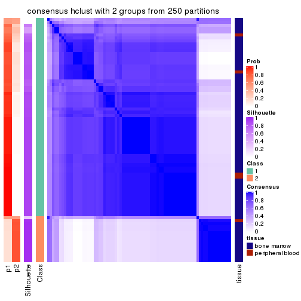</p>

</div>
<div id='tab-SD-hclust-consensus-heatmap-2'>
<pre><code class="r">consensus_heatmap(res, k = 3)
</code></pre>

<p>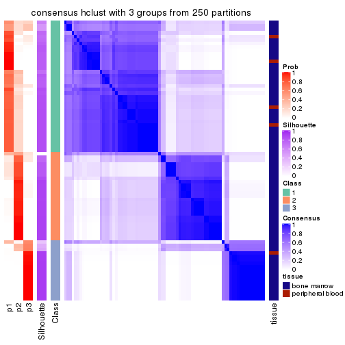</p>

</div>
<div id='tab-SD-hclust-consensus-heatmap-3'>
<pre><code class="r">consensus_heatmap(res, k = 4)
</code></pre>

<p>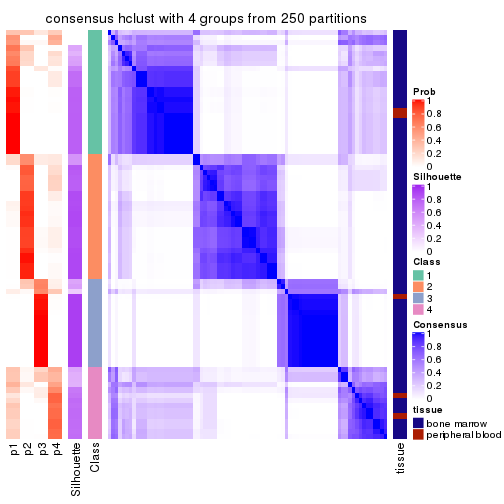</p>

</div>
<div id='tab-SD-hclust-consensus-heatmap-4'>
<pre><code class="r">consensus_heatmap(res, k = 5)
</code></pre>

<p>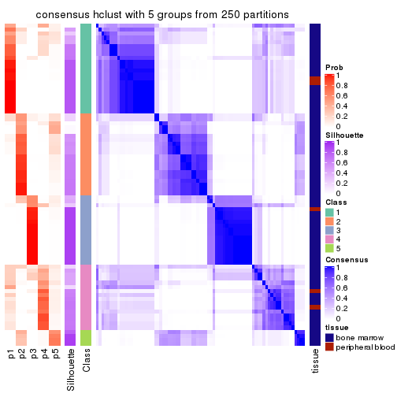</p>

</div>
<div id='tab-SD-hclust-consensus-heatmap-5'>
<pre><code class="r">consensus_heatmap(res, k = 6)
</code></pre>

<p>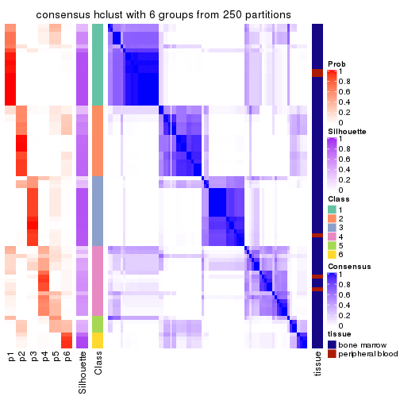</p>

</div>
</div>

Heatmaps for the membership of samples in all partitions to see how consistent they are:


<script>
$( function() {
	$( '#tabs-SD-hclust-membership-heatmap' ).tabs();
} );
</script>
<div id='tabs-SD-hclust-membership-heatmap'>
<ul>
<li><a href='#tab-SD-hclust-membership-heatmap-1'>k = 2</a></li>
<li><a href='#tab-SD-hclust-membership-heatmap-2'>k = 3</a></li>
<li><a href='#tab-SD-hclust-membership-heatmap-3'>k = 4</a></li>
<li><a href='#tab-SD-hclust-membership-heatmap-4'>k = 5</a></li>
<li><a href='#tab-SD-hclust-membership-heatmap-5'>k = 6</a></li>
</ul>
<div id='tab-SD-hclust-membership-heatmap-1'>
<pre><code class="r">membership_heatmap(res, k = 2)
</code></pre>

<p>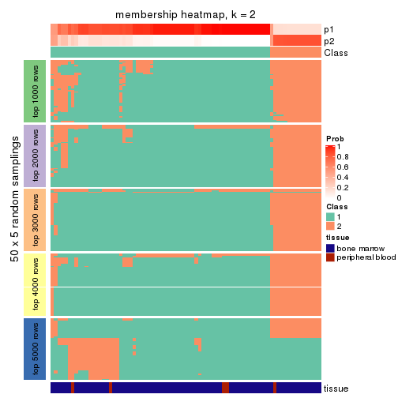</p>

</div>
<div id='tab-SD-hclust-membership-heatmap-2'>
<pre><code class="r">membership_heatmap(res, k = 3)
</code></pre>

<p>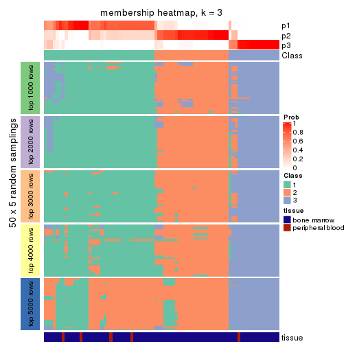</p>

</div>
<div id='tab-SD-hclust-membership-heatmap-3'>
<pre><code class="r">membership_heatmap(res, k = 4)
</code></pre>

<p>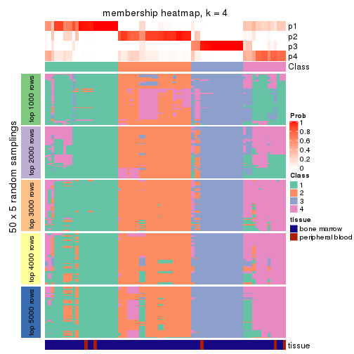</p>

</div>
<div id='tab-SD-hclust-membership-heatmap-4'>
<pre><code class="r">membership_heatmap(res, k = 5)
</code></pre>

<p>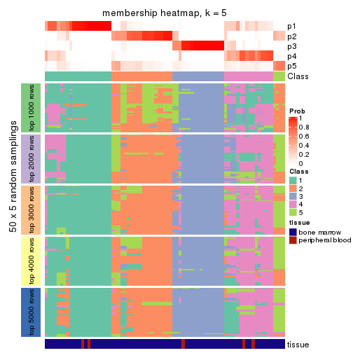</p>

</div>
<div id='tab-SD-hclust-membership-heatmap-5'>
<pre><code class="r">membership_heatmap(res, k = 6)
</code></pre>

<p>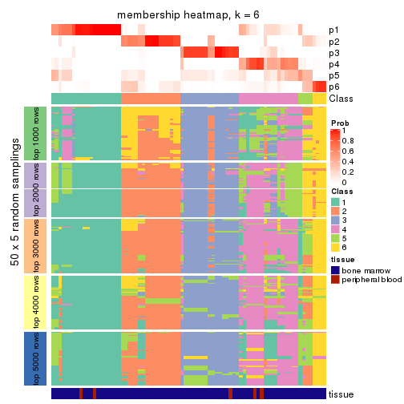</p>

</div>
</div>

As soon as we have had the classes for columns, we can look for signatures
which are significantly different between classes which can be candidate marks
for certain classes. Following are the heatmaps for signatures.


Signature heatmaps where rows are scaled:


<script>
$( function() {
	$( '#tabs-SD-hclust-get-signatures' ).tabs();
} );
</script>
<div id='tabs-SD-hclust-get-signatures'>
<ul>
<li><a href='#tab-SD-hclust-get-signatures-1'>k = 2</a></li>
<li><a href='#tab-SD-hclust-get-signatures-2'>k = 3</a></li>
<li><a href='#tab-SD-hclust-get-signatures-3'>k = 4</a></li>
<li><a href='#tab-SD-hclust-get-signatures-4'>k = 5</a></li>
<li><a href='#tab-SD-hclust-get-signatures-5'>k = 6</a></li>
</ul>
<div id='tab-SD-hclust-get-signatures-1'>
<pre><code class="r">get_signatures(res, k = 2)
</code></pre>

<p>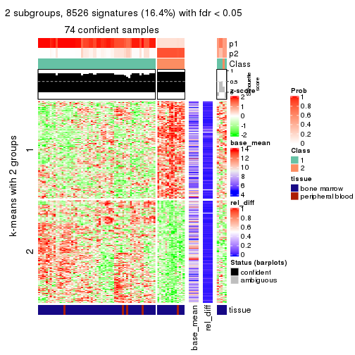</p>

</div>
<div id='tab-SD-hclust-get-signatures-2'>
<pre><code class="r">get_signatures(res, k = 3)
</code></pre>

<p>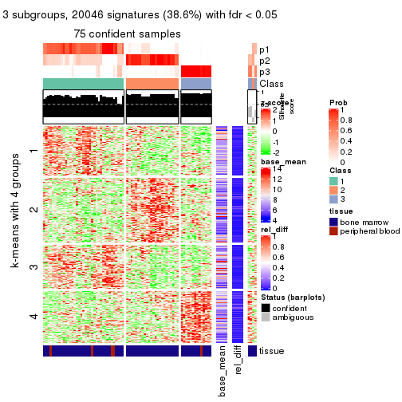</p>

</div>
<div id='tab-SD-hclust-get-signatures-3'>
<pre><code class="r">get_signatures(res, k = 4)
</code></pre>

<p>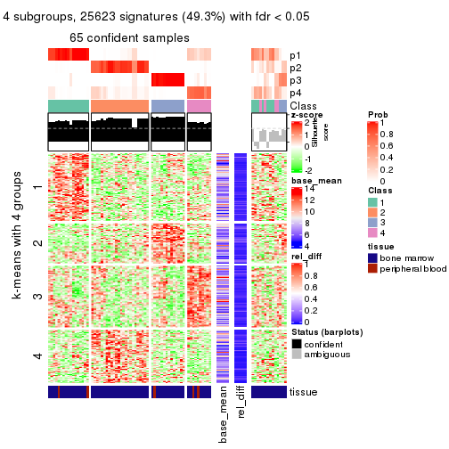</p>

</div>
<div id='tab-SD-hclust-get-signatures-4'>
<pre><code class="r">get_signatures(res, k = 5)
</code></pre>

<p>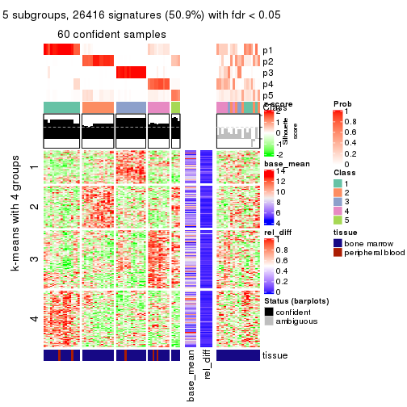</p>

</div>
<div id='tab-SD-hclust-get-signatures-5'>
<pre><code class="r">get_signatures(res, k = 6)
</code></pre>

<p>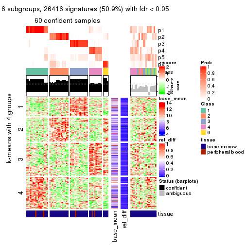</p>

</div>
</div>


Signature heatmaps where rows are not scaled:


<script>
$( function() {
	$( '#tabs-SD-hclust-get-signatures-no-scale' ).tabs();
} );
</script>
<div id='tabs-SD-hclust-get-signatures-no-scale'>
<ul>
<li><a href='#tab-SD-hclust-get-signatures-no-scale-1'>k = 2</a></li>
<li><a href='#tab-SD-hclust-get-signatures-no-scale-2'>k = 3</a></li>
<li><a href='#tab-SD-hclust-get-signatures-no-scale-3'>k = 4</a></li>
<li><a href='#tab-SD-hclust-get-signatures-no-scale-4'>k = 5</a></li>
<li><a href='#tab-SD-hclust-get-signatures-no-scale-5'>k = 6</a></li>
</ul>
<div id='tab-SD-hclust-get-signatures-no-scale-1'>
<pre><code class="r">get_signatures(res, k = 2, scale_rows = FALSE)
</code></pre>

<p>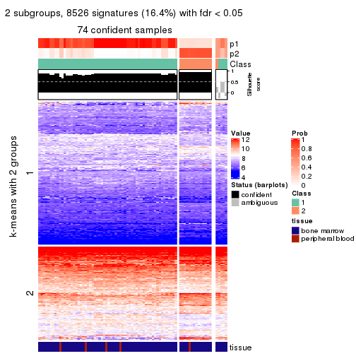</p>

</div>
<div id='tab-SD-hclust-get-signatures-no-scale-2'>
<pre><code class="r">get_signatures(res, k = 3, scale_rows = FALSE)
</code></pre>

<p>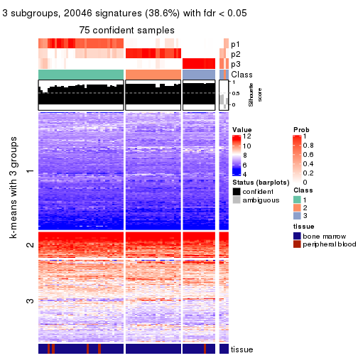</p>

</div>
<div id='tab-SD-hclust-get-signatures-no-scale-3'>
<pre><code class="r">get_signatures(res, k = 4, scale_rows = FALSE)
</code></pre>

<p>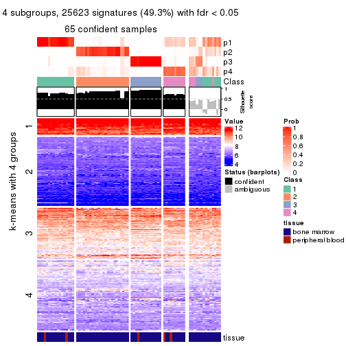</p>

</div>
<div id='tab-SD-hclust-get-signatures-no-scale-4'>
<pre><code class="r">get_signatures(res, k = 5, scale_rows = FALSE)
</code></pre>

<p>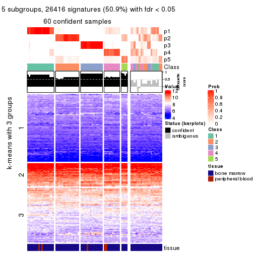</p>

</div>
<div id='tab-SD-hclust-get-signatures-no-scale-5'>
<pre><code class="r">get_signatures(res, k = 6, scale_rows = FALSE)
</code></pre>

<p>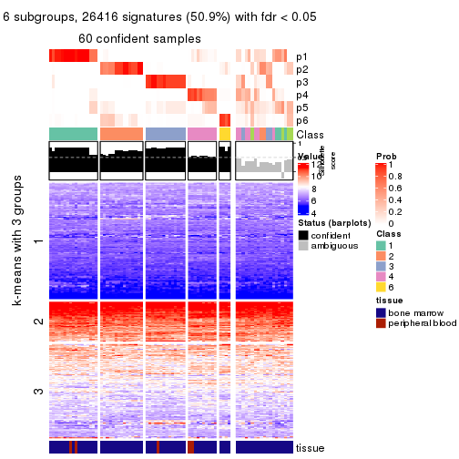</p>

</div>
</div>


Compare the overlap of signatures from different k:

```r
compare_signatures(res)
```

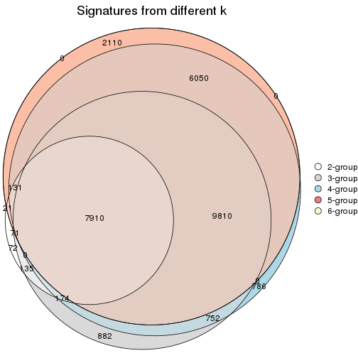

`get_signature()` returns a data frame invisibly. TO get the list of signatures, the function
call should be assigned to a variable explicitly. In following code, if `plot` argument is set
to `FALSE`, no heatmap is plotted while only the differential analysis is performed.

```r
# code only for demonstration
tb = get_signature(res, k = ..., plot = FALSE)
```

An example of the output of `tb` is:

```
#>   which_row         fdr    mean_1    mean_2 scaled_mean_1 scaled_mean_2 km
#> 1        38 0.042760348  8.373488  9.131774    -0.5533452     0.5164555  1
#> 2        40 0.018707592  7.106213  8.469186    -0.6173731     0.5762149  1
#> 3        55 0.019134737 10.221463 11.207825    -0.6159697     0.5749050  1
#> 4        59 0.006059896  5.921854  7.869574    -0.6899429     0.6439467  1
#> 5        60 0.018055526  8.928898 10.211722    -0.6204761     0.5791110  1
#> 6        98 0.009384629 15.714769 14.887706     0.6635654    -0.6193277  2
...
```

The columns in `tb` are:

1. `which_row`: row indices corresponding to the input matrix.
2. `fdr`: FDR for the differential test. 
3. `mean_x`: The mean value in group x.
4. `scaled_mean_x`: The mean value in group x after rows are scaled.
5. `km`: Row groups if k-means clustering is applied to rows.


UMAP plot which shows how samples are separated.


<script>
$( function() {
	$( '#tabs-SD-hclust-dimension-reduction' ).tabs();
} );
</script>
<div id='tabs-SD-hclust-dimension-reduction'>
<ul>
<li><a href='#tab-SD-hclust-dimension-reduction-1'>k = 2</a></li>
<li><a href='#tab-SD-hclust-dimension-reduction-2'>k = 3</a></li>
<li><a href='#tab-SD-hclust-dimension-reduction-3'>k = 4</a></li>
<li><a href='#tab-SD-hclust-dimension-reduction-4'>k = 5</a></li>
<li><a href='#tab-SD-hclust-dimension-reduction-5'>k = 6</a></li>
</ul>
<div id='tab-SD-hclust-dimension-reduction-1'>
<pre><code class="r">dimension_reduction(res, k = 2, method = &quot;UMAP&quot;)
</code></pre>

<p>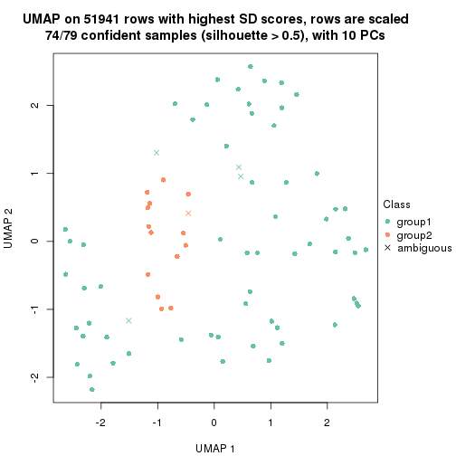</p>

</div>
<div id='tab-SD-hclust-dimension-reduction-2'>
<pre><code class="r">dimension_reduction(res, k = 3, method = &quot;UMAP&quot;)
</code></pre>

<p>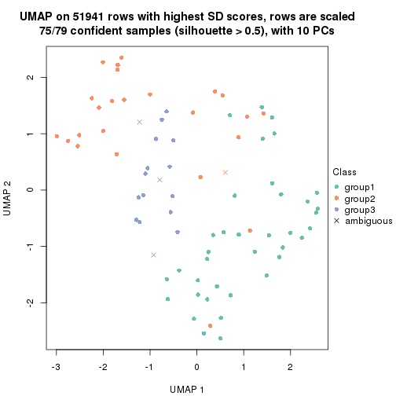</p>

</div>
<div id='tab-SD-hclust-dimension-reduction-3'>
<pre><code class="r">dimension_reduction(res, k = 4, method = &quot;UMAP&quot;)
</code></pre>

<p>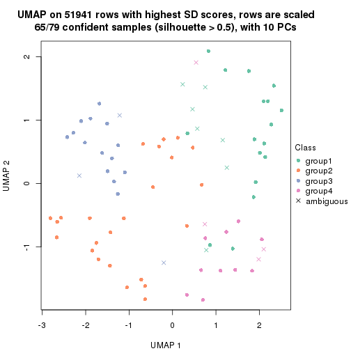</p>

</div>
<div id='tab-SD-hclust-dimension-reduction-4'>
<pre><code class="r">dimension_reduction(res, k = 5, method = &quot;UMAP&quot;)
</code></pre>

<p>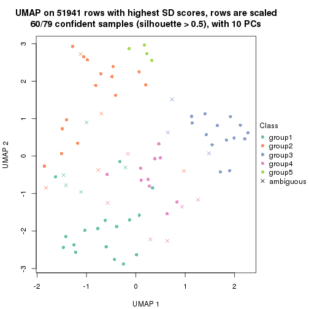</p>

</div>
<div id='tab-SD-hclust-dimension-reduction-5'>
<pre><code class="r">dimension_reduction(res, k = 6, method = &quot;UMAP&quot;)
</code></pre>

<p>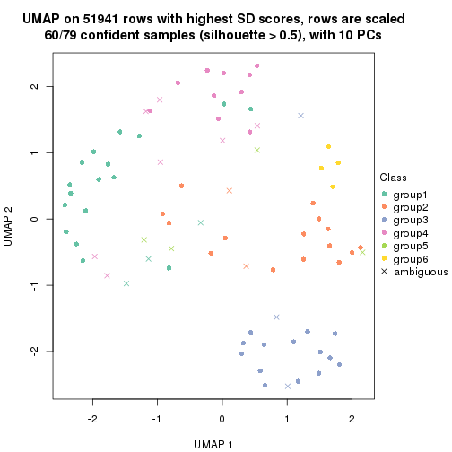</p>

</div>
</div>


Following heatmap shows how subgroups are split when increasing `k`:

```r
collect_classes(res)
```

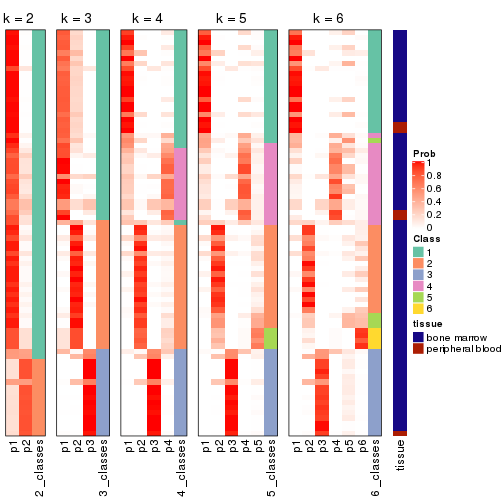


Test correlation between subgroups and known annotations. If the known
annotation is numeric, one-way ANOVA test is applied, and if the known
annotation is discrete, chi-squared contingency table test is applied.

```r
test_to_known_factors(res)
```

```
#>            n tissue(p) k
#> SD:hclust 74     1.000 2
#> SD:hclust 75     0.254 3
#> SD:hclust 65     0.209 4
#> SD:hclust 60     0.434 5
#> SD:hclust 60     0.434 6
```


If matrix rows can be associated to genes, consider to use `GO_Enrichment(res,
...)` to perform function enrichment for the signature genes.


 

---------------------------------------------------


### SD:kmeans


The object with results only for a single top-value method and a single partition method 
can be extracted as:

```r
res = res_list["SD", "kmeans"]
# you can also extract it by
# res = res_list["SD:kmeans"]
```

A summary of `res` and all the functions that can be applied to it:

```r
res
```

```
#> A 'ConsensusPartition' object with k = 2, 3, 4, 5, 6.
#>   On a matrix with 51941 rows and 79 columns.
#>   Top rows (1000, 2000, 3000, 4000, 5000) are extracted by 'SD' method.
#>   Subgroups are detected by 'kmeans' method.
#>   Performed in total 1250 partitions by row resampling.
#>   Best k for subgroups seems to be 4.
#> 
#> Following methods can be applied to this 'ConsensusPartition' object:
#>  [1] "cola_report"             "collect_classes"         "collect_plots"          
#>  [4] "collect_stats"           "colnames"                "compare_signatures"     
#>  [7] "consensus_heatmap"       "dimension_reduction"     "functional_enrichment"  
#> [10] "get_anno_col"            "get_anno"                "get_classes"            
#> [13] "get_consensus"           "get_matrix"              "get_membership"         
#> [16] "get_param"               "get_signatures"          "get_stats"              
#> [19] "is_best_k"               "is_stable_k"             "membership_heatmap"     
#> [22] "ncol"                    "nrow"                    "plot_ecdf"              
#> [25] "rownames"                "select_partition_number" "show"                   
#> [28] "suggest_best_k"          "test_to_known_factors"
```

`collect_plots()` function collects all the plots made from `res` for all `k` (number of partitions)
into one single page to provide an easy and fast comparison between different `k`.

```r
collect_plots(res)
```

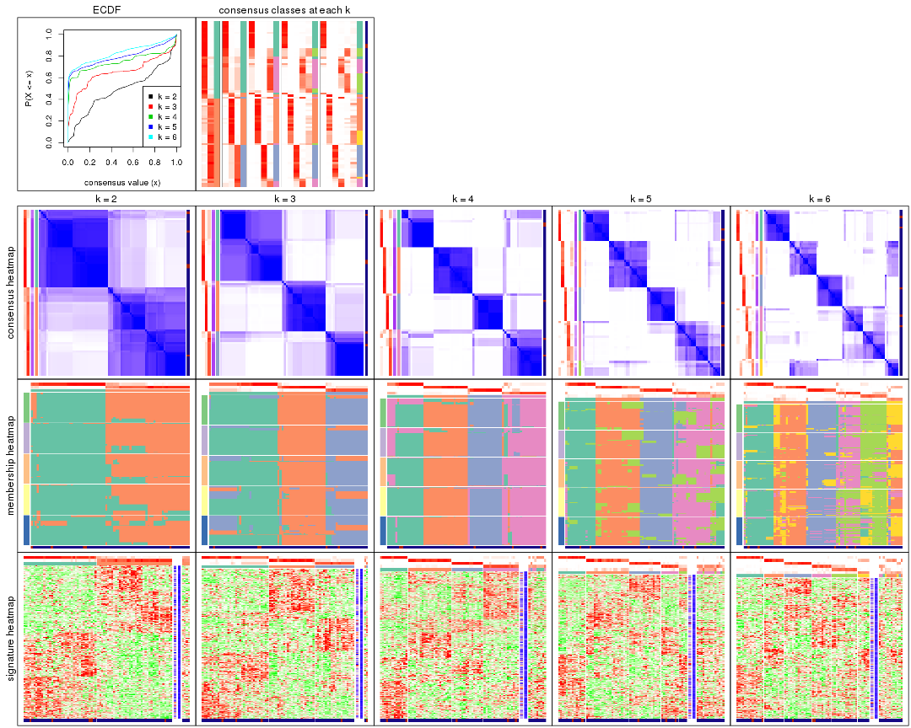

The plots are:

- The first row: a plot of the ECDF (Empirical cumulative distribution
  function) curves of the consensus matrix for each `k` and the heatmap of
  predicted classes for each `k`.
- The second row: heatmaps of the consensus matrix for each `k`.
- The third row: heatmaps of the membership matrix for each `k`.
- The fouth row: heatmaps of the signatures for each `k`.

All the plots in panels can be made by individual functions and they are
plotted later in this section.

`select_partition_number()` produces several plots showing different
statistics for choosing "optimized" `k`. There are following statistics:

- ECDF curves of the consensus matrix for each `k`;
- 1-PAC. [The PAC
  score](https://en.wikipedia.org/wiki/Consensus_clustering#Over-interpretation_potential_of_consensus_clustering)
  measures the proportion of the ambiguous subgrouping.
- Mean silhouette score.
- Concordance. The mean probability of fiting the consensus class ids in all
  partitions.
- Area increased. Denote $A_k$ as the area under the ECDF curve for current
  `k`, the area increased is defined as $A_k - A_{k-1}$.
- Rand index. The percent of pairs of samples that are both in a same cluster
  or both are not in a same cluster in the partition of k and k-1.
- Jaccard index. The ratio of pairs of samples are both in a same cluster in
  the partition of k and k-1 and the pairs of samples are both in a same
  cluster in the partition k or k-1.

The detailed explanations of these statistics can be found in [the cola
vignette](http://bioconductor.org/packages/devel/bioc/vignettes/cola/inst/doc/cola.html#toc_13).

Generally speaking, lower PAC score, higher mean silhouette score or higher
concordance corresponds to better partition. Rand index and Jaccard index
measure how similar the current partition is compared to partition with `k-1`.
If they are too similar, we won't accept `k` is better than `k-1`.

```r
select_partition_number(res)
```

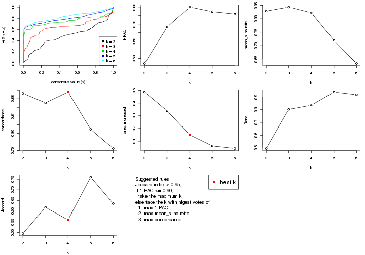

The numeric values for all these statistics can be obtained by `get_stats()`.

```r
get_stats(res)
```

```
#>   k 1-PAC mean_silhouette concordance area_increased  Rand Jaccard
#> 2 2 0.471           0.829       0.892         0.4867 0.496   0.496
#> 3 3 0.683           0.844       0.871         0.3387 0.803   0.618
#> 4 4 0.800           0.822       0.895         0.1499 0.835   0.559
#> 5 5 0.773           0.719       0.809         0.0627 0.938   0.760
#> 6 6 0.759           0.633       0.765         0.0423 0.917   0.636
```

`suggest_best_k()` suggests the best $k$ based on these statistics. The rules are as follows:

- All $k$ with Jaccard index larger than 0.95 are removed because the increase of
  the partition number does not provides enough extra information. If all $k$ are removed,
  the best $k$ is assigned by `NA`.
- For $k$ with 1-PAC larger than 0.9, the maximal $k$ is taken as the "best k". Other $k$ is called "optional k".
- If it does not fit the second rule. The $k$ with the highest vote of highest
  1-PAC, mean silhouette and concordance is taken as the "best k".

```r
suggest_best_k(res)
```

```
#> [1] 4
```


Following shows the table of the partitions (You need to click the **show/hide
code output** link to see it). The membership matrix (columns with name `p*`)
is inferred by
[`clue::cl_consensus()`](https://www.rdocumentation.org/link/cl_consensus?package=clue)
function with the `SE` method. Basically the value in the membership matrix
represents the probability to belong to a certain group. The finall class
label for an item is determined with the group with highest probability it
belongs to.

In `get_classes()` function, the entropy is calculated from the membership
matrix and the silhouette score is calculated from the consensus matrix.


<script>
$( function() {
	$( '#tabs-SD-kmeans-get-classes' ).tabs();
} );
</script>
<div id='tabs-SD-kmeans-get-classes'>
<ul>
<li><a href='#tab-SD-kmeans-get-classes-1'>k = 2</a></li>
<li><a href='#tab-SD-kmeans-get-classes-2'>k = 3</a></li>
<li><a href='#tab-SD-kmeans-get-classes-3'>k = 4</a></li>
<li><a href='#tab-SD-kmeans-get-classes-4'>k = 5</a></li>
<li><a href='#tab-SD-kmeans-get-classes-5'>k = 6</a></li>
</ul>

<div id='tab-SD-kmeans-get-classes-1'>
<p><a id='tab-SD-kmeans-get-classes-1-a' style='color:#0366d6' href='#'>show/hide code output</a></p>
<pre><code class="r">cbind(get_classes(res, k = 2), get_membership(res, k = 2))
</code></pre>

<pre><code>#&gt;           class entropy silhouette    p1    p2
#&gt; GSM316652     2  0.3274      0.827 0.060 0.940
#&gt; GSM316653     1  0.2948      0.934 0.948 0.052
#&gt; GSM316654     1  0.2948      0.934 0.948 0.052
#&gt; GSM316655     1  0.2423      0.938 0.960 0.040
#&gt; GSM316656     1  0.6887      0.711 0.816 0.184
#&gt; GSM316657     1  0.0376      0.944 0.996 0.004
#&gt; GSM316658     2  0.7815      0.783 0.232 0.768
#&gt; GSM316659     2  0.7219      0.793 0.200 0.800
#&gt; GSM316660     1  0.0672      0.945 0.992 0.008
#&gt; GSM316661     1  0.3584      0.924 0.932 0.068
#&gt; GSM316662     2  0.3114      0.827 0.056 0.944
#&gt; GSM316663     2  0.5629      0.819 0.132 0.868
#&gt; GSM316664     1  0.2778      0.934 0.952 0.048
#&gt; GSM316665     2  0.2778      0.821 0.048 0.952
#&gt; GSM316666     2  0.3274      0.827 0.060 0.940
#&gt; GSM316667     2  0.7139      0.803 0.196 0.804
#&gt; GSM316668     2  0.0000      0.821 0.000 1.000
#&gt; GSM316669     1  0.2948      0.934 0.948 0.052
#&gt; GSM316670     2  0.1633      0.825 0.024 0.976
#&gt; GSM316671     2  0.4562      0.827 0.096 0.904
#&gt; GSM316672     1  0.3274      0.888 0.940 0.060
#&gt; GSM316673     1  0.0938      0.943 0.988 0.012
#&gt; GSM316674     2  0.3274      0.827 0.060 0.940
#&gt; GSM316676     2  0.3274      0.827 0.060 0.940
#&gt; GSM316677     1  0.0376      0.945 0.996 0.004
#&gt; GSM316678     2  0.9686      0.559 0.396 0.604
#&gt; GSM316679     1  0.0376      0.944 0.996 0.004
#&gt; GSM316680     1  0.0376      0.944 0.996 0.004
#&gt; GSM316681     2  0.3114      0.828 0.056 0.944
#&gt; GSM316682     1  0.2778      0.935 0.952 0.048
#&gt; GSM316683     1  0.2778      0.935 0.952 0.048
#&gt; GSM316684     2  0.7815      0.783 0.232 0.768
#&gt; GSM316685     2  0.0000      0.821 0.000 1.000
#&gt; GSM316686     1  0.7674      0.698 0.776 0.224
#&gt; GSM316687     2  0.9922      0.290 0.448 0.552
#&gt; GSM316688     2  0.9933      0.492 0.452 0.548
#&gt; GSM316689     1  0.0376      0.944 0.996 0.004
#&gt; GSM316690     2  0.3274      0.827 0.060 0.940
#&gt; GSM316691     2  0.6048      0.816 0.148 0.852
#&gt; GSM316692     2  0.3274      0.827 0.060 0.940
#&gt; GSM316693     1  0.2948      0.934 0.948 0.052
#&gt; GSM316694     2  0.3274      0.827 0.060 0.940
#&gt; GSM316696     1  0.0376      0.944 0.996 0.004
#&gt; GSM316697     2  0.3274      0.827 0.060 0.940
#&gt; GSM316698     2  0.7815      0.783 0.232 0.768
#&gt; GSM316699     2  0.1184      0.823 0.016 0.984
#&gt; GSM316700     1  0.2948      0.934 0.948 0.052
#&gt; GSM316701     1  0.2948      0.934 0.948 0.052
#&gt; GSM316703     2  0.7219      0.793 0.200 0.800
#&gt; GSM316704     2  0.7056      0.793 0.192 0.808
#&gt; GSM316705     1  0.0672      0.944 0.992 0.008
#&gt; GSM316706     1  0.7376      0.704 0.792 0.208
#&gt; GSM316707     2  0.7815      0.783 0.232 0.768
#&gt; GSM316708     2  0.9754      0.532 0.408 0.592
#&gt; GSM316709     2  0.3274      0.827 0.060 0.940
#&gt; GSM316710     1  0.2948      0.934 0.948 0.052
#&gt; GSM316711     2  0.7219      0.793 0.200 0.800
#&gt; GSM316713     1  0.0376      0.945 0.996 0.004
#&gt; GSM316714     2  0.9460      0.438 0.364 0.636
#&gt; GSM316715     1  0.0376      0.944 0.996 0.004
#&gt; GSM316716     2  0.2778      0.821 0.048 0.952
#&gt; GSM316717     1  0.0376      0.944 0.996 0.004
#&gt; GSM316718     2  0.9608      0.581 0.384 0.616
#&gt; GSM316719     1  0.0672      0.945 0.992 0.008
#&gt; GSM316720     1  0.0672      0.945 0.992 0.008
#&gt; GSM316721     2  0.3114      0.823 0.056 0.944
#&gt; GSM316722     1  0.0376      0.944 0.996 0.004
#&gt; GSM316723     2  0.7602      0.791 0.220 0.780
#&gt; GSM316724     2  0.7815      0.783 0.232 0.768
#&gt; GSM316726     2  0.3584      0.824 0.068 0.932
#&gt; GSM316727     1  0.0376      0.944 0.996 0.004
#&gt; GSM316728     2  0.9850      0.351 0.428 0.572
#&gt; GSM316729     1  0.0672      0.944 0.992 0.008
#&gt; GSM316730     2  0.7815      0.783 0.232 0.768
#&gt; GSM316675     2  0.3274      0.827 0.060 0.940
#&gt; GSM316695     1  0.0376      0.944 0.996 0.004
#&gt; GSM316702     1  0.7815      0.712 0.768 0.232
#&gt; GSM316712     1  0.0376      0.944 0.996 0.004
#&gt; GSM316725     1  0.2948      0.934 0.948 0.052
</code></pre>

<script>
$('#tab-SD-kmeans-get-classes-1-a').parent().next().next().hide();
$('#tab-SD-kmeans-get-classes-1-a').click(function(){
  $('#tab-SD-kmeans-get-classes-1-a').parent().next().next().toggle();
  return(false);
});
</script>
</div>

<div id='tab-SD-kmeans-get-classes-2'>
<p><a id='tab-SD-kmeans-get-classes-2-a' style='color:#0366d6' href='#'>show/hide code output</a></p>
<pre><code class="r">cbind(get_classes(res, k = 3), get_membership(res, k = 3))
</code></pre>

<pre><code>#&gt;           class entropy silhouette    p1    p2    p3
#&gt; GSM316652     3  0.4291      0.902 0.000 0.180 0.820
#&gt; GSM316653     1  0.6798      0.821 0.696 0.048 0.256
#&gt; GSM316654     1  0.6798      0.821 0.696 0.048 0.256
#&gt; GSM316655     1  0.6798      0.821 0.696 0.048 0.256
#&gt; GSM316656     1  0.7091      0.819 0.688 0.064 0.248
#&gt; GSM316657     1  0.0424      0.852 0.992 0.008 0.000
#&gt; GSM316658     2  0.0000      0.924 0.000 1.000 0.000
#&gt; GSM316659     2  0.0475      0.923 0.004 0.992 0.004
#&gt; GSM316660     1  0.0424      0.852 0.992 0.008 0.000
#&gt; GSM316661     1  0.6798      0.821 0.696 0.048 0.256
#&gt; GSM316662     3  0.4291      0.902 0.000 0.180 0.820
#&gt; GSM316663     3  0.3637      0.747 0.024 0.084 0.892
#&gt; GSM316664     1  0.3845      0.851 0.872 0.012 0.116
#&gt; GSM316665     2  0.1411      0.902 0.000 0.964 0.036
#&gt; GSM316666     3  0.4291      0.902 0.000 0.180 0.820
#&gt; GSM316667     2  0.0000      0.924 0.000 1.000 0.000
#&gt; GSM316668     3  0.4291      0.902 0.000 0.180 0.820
#&gt; GSM316669     1  0.6798      0.821 0.696 0.048 0.256
#&gt; GSM316670     3  0.4291      0.902 0.000 0.180 0.820
#&gt; GSM316671     3  0.4291      0.902 0.000 0.180 0.820
#&gt; GSM316672     2  0.5926      0.554 0.356 0.644 0.000
#&gt; GSM316673     1  0.0000      0.853 1.000 0.000 0.000
#&gt; GSM316674     3  0.4291      0.902 0.000 0.180 0.820
#&gt; GSM316676     3  0.4291      0.902 0.000 0.180 0.820
#&gt; GSM316677     1  0.3412      0.857 0.876 0.000 0.124
#&gt; GSM316678     2  0.2096      0.891 0.052 0.944 0.004
#&gt; GSM316679     1  0.2384      0.858 0.936 0.008 0.056
#&gt; GSM316680     1  0.2584      0.858 0.928 0.008 0.064
#&gt; GSM316681     3  0.4291      0.902 0.000 0.180 0.820
#&gt; GSM316682     1  0.6798      0.821 0.696 0.048 0.256
#&gt; GSM316683     1  0.6798      0.821 0.696 0.048 0.256
#&gt; GSM316684     2  0.0000      0.924 0.000 1.000 0.000
#&gt; GSM316685     3  0.4702      0.860 0.000 0.212 0.788
#&gt; GSM316686     1  0.7233      0.739 0.672 0.064 0.264
#&gt; GSM316687     3  0.6046      0.612 0.136 0.080 0.784
#&gt; GSM316688     2  0.7742      0.388 0.288 0.632 0.080
#&gt; GSM316689     1  0.0424      0.852 0.992 0.008 0.000
#&gt; GSM316690     3  0.4291      0.902 0.000 0.180 0.820
#&gt; GSM316691     2  0.0424      0.921 0.000 0.992 0.008
#&gt; GSM316692     3  0.4291      0.902 0.000 0.180 0.820
#&gt; GSM316693     1  0.6798      0.821 0.696 0.048 0.256
#&gt; GSM316694     3  0.4291      0.902 0.000 0.180 0.820
#&gt; GSM316696     1  0.0424      0.852 0.992 0.008 0.000
#&gt; GSM316697     3  0.4291      0.902 0.000 0.180 0.820
#&gt; GSM316698     2  0.0661      0.922 0.008 0.988 0.004
#&gt; GSM316699     2  0.1411      0.902 0.000 0.964 0.036
#&gt; GSM316700     1  0.6798      0.821 0.696 0.048 0.256
#&gt; GSM316701     1  0.6798      0.821 0.696 0.048 0.256
#&gt; GSM316703     2  0.0475      0.923 0.004 0.992 0.004
#&gt; GSM316704     2  0.0475      0.923 0.004 0.992 0.004
#&gt; GSM316705     1  0.1525      0.856 0.964 0.004 0.032
#&gt; GSM316706     2  0.4293      0.753 0.004 0.832 0.164
#&gt; GSM316707     2  0.0000      0.924 0.000 1.000 0.000
#&gt; GSM316708     2  0.2860      0.862 0.084 0.912 0.004
#&gt; GSM316709     3  0.4291      0.902 0.000 0.180 0.820
#&gt; GSM316710     1  0.6798      0.821 0.696 0.048 0.256
#&gt; GSM316711     2  0.0475      0.923 0.004 0.992 0.004
#&gt; GSM316713     1  0.0237      0.852 0.996 0.004 0.000
#&gt; GSM316714     3  0.1711      0.777 0.008 0.032 0.960
#&gt; GSM316715     1  0.0424      0.852 0.992 0.008 0.000
#&gt; GSM316716     2  0.1411      0.902 0.000 0.964 0.036
#&gt; GSM316717     1  0.2584      0.858 0.928 0.008 0.064
#&gt; GSM316718     2  0.2200      0.887 0.056 0.940 0.004
#&gt; GSM316719     1  0.0424      0.852 0.992 0.008 0.000
#&gt; GSM316720     1  0.0424      0.852 0.992 0.008 0.000
#&gt; GSM316721     2  0.1163      0.908 0.000 0.972 0.028
#&gt; GSM316722     1  0.2584      0.858 0.928 0.008 0.064
#&gt; GSM316723     2  0.0237      0.923 0.000 0.996 0.004
#&gt; GSM316724     2  0.0237      0.924 0.004 0.996 0.000
#&gt; GSM316726     2  0.1163      0.908 0.000 0.972 0.028
#&gt; GSM316727     1  0.0424      0.852 0.992 0.008 0.000
#&gt; GSM316728     3  0.5787      0.594 0.136 0.068 0.796
#&gt; GSM316729     1  0.6383      0.819 0.768 0.128 0.104
#&gt; GSM316730     2  0.0424      0.922 0.000 0.992 0.008
#&gt; GSM316675     3  0.4291      0.902 0.000 0.180 0.820
#&gt; GSM316695     1  0.0424      0.852 0.992 0.008 0.000
#&gt; GSM316702     3  0.6805      0.213 0.268 0.044 0.688
#&gt; GSM316712     1  0.0424      0.852 0.992 0.008 0.000
#&gt; GSM316725     1  0.6798      0.821 0.696 0.048 0.256
</code></pre>

<script>
$('#tab-SD-kmeans-get-classes-2-a').parent().next().next().hide();
$('#tab-SD-kmeans-get-classes-2-a').click(function(){
  $('#tab-SD-kmeans-get-classes-2-a').parent().next().next().toggle();
  return(false);
});
</script>
</div>

<div id='tab-SD-kmeans-get-classes-3'>
<p><a id='tab-SD-kmeans-get-classes-3-a' style='color:#0366d6' href='#'>show/hide code output</a></p>
<pre><code class="r">cbind(get_classes(res, k = 4), get_membership(res, k = 4))
</code></pre>

<pre><code>#&gt;           class entropy silhouette    p1    p2    p3    p4
#&gt; GSM316652     3  0.0188      0.957 0.000 0.004 0.996 0.000
#&gt; GSM316653     4  0.2860      0.817 0.100 0.004 0.008 0.888
#&gt; GSM316654     4  0.2676      0.818 0.092 0.000 0.012 0.896
#&gt; GSM316655     4  0.2860      0.817 0.100 0.004 0.008 0.888
#&gt; GSM316656     4  0.2402      0.806 0.076 0.012 0.000 0.912
#&gt; GSM316657     1  0.0336      0.863 0.992 0.000 0.000 0.008
#&gt; GSM316658     2  0.1443      0.967 0.004 0.960 0.008 0.028
#&gt; GSM316659     2  0.0779      0.967 0.000 0.980 0.004 0.016
#&gt; GSM316660     1  0.0336      0.863 0.992 0.000 0.000 0.008
#&gt; GSM316661     4  0.2546      0.818 0.092 0.000 0.008 0.900
#&gt; GSM316662     3  0.0188      0.957 0.000 0.004 0.996 0.000
#&gt; GSM316663     4  0.4283      0.629 0.000 0.004 0.256 0.740
#&gt; GSM316664     4  0.5336      0.198 0.496 0.004 0.004 0.496
#&gt; GSM316665     2  0.2456      0.958 0.008 0.916 0.008 0.068
#&gt; GSM316666     3  0.0657      0.955 0.000 0.004 0.984 0.012
#&gt; GSM316667     2  0.2673      0.957 0.008 0.904 0.008 0.080
#&gt; GSM316668     3  0.0188      0.957 0.000 0.004 0.996 0.000
#&gt; GSM316669     4  0.2860      0.817 0.100 0.004 0.008 0.888
#&gt; GSM316670     3  0.3001      0.890 0.008 0.024 0.896 0.072
#&gt; GSM316671     3  0.0188      0.957 0.000 0.004 0.996 0.000
#&gt; GSM316672     1  0.2909      0.755 0.888 0.092 0.000 0.020
#&gt; GSM316673     1  0.0336      0.863 0.992 0.000 0.000 0.008
#&gt; GSM316674     3  0.0188      0.957 0.000 0.004 0.996 0.000
#&gt; GSM316676     3  0.0657      0.955 0.000 0.004 0.984 0.012
#&gt; GSM316677     4  0.3751      0.715 0.196 0.000 0.004 0.800
#&gt; GSM316678     2  0.0376      0.964 0.004 0.992 0.000 0.004
#&gt; GSM316679     1  0.4936      0.417 0.624 0.004 0.000 0.372
#&gt; GSM316680     1  0.5028      0.365 0.596 0.004 0.000 0.400
#&gt; GSM316681     3  0.0188      0.957 0.000 0.004 0.996 0.000
#&gt; GSM316682     4  0.2860      0.817 0.100 0.004 0.008 0.888
#&gt; GSM316683     4  0.2860      0.817 0.100 0.004 0.008 0.888
#&gt; GSM316684     2  0.0672      0.966 0.000 0.984 0.008 0.008
#&gt; GSM316685     3  0.2774      0.889 0.008 0.024 0.908 0.060
#&gt; GSM316686     4  0.5675      0.223 0.472 0.004 0.016 0.508
#&gt; GSM316687     4  0.4551      0.615 0.004 0.004 0.268 0.724
#&gt; GSM316688     4  0.5481      0.426 0.016 0.316 0.012 0.656
#&gt; GSM316689     1  0.0336      0.863 0.992 0.000 0.000 0.008
#&gt; GSM316690     3  0.0657      0.955 0.000 0.004 0.984 0.012
#&gt; GSM316691     2  0.2673      0.957 0.008 0.904 0.008 0.080
#&gt; GSM316692     3  0.0657      0.955 0.000 0.004 0.984 0.012
#&gt; GSM316693     4  0.2861      0.818 0.092 0.004 0.012 0.892
#&gt; GSM316694     3  0.0188      0.957 0.000 0.004 0.996 0.000
#&gt; GSM316696     1  0.0336      0.863 0.992 0.000 0.000 0.008
#&gt; GSM316697     3  0.0188      0.957 0.000 0.004 0.996 0.000
#&gt; GSM316698     2  0.0376      0.964 0.004 0.992 0.000 0.004
#&gt; GSM316699     2  0.2602      0.957 0.008 0.908 0.008 0.076
#&gt; GSM316700     4  0.2731      0.818 0.092 0.004 0.008 0.896
#&gt; GSM316701     4  0.2860      0.817 0.100 0.004 0.008 0.888
#&gt; GSM316703     2  0.0524      0.965 0.000 0.988 0.004 0.008
#&gt; GSM316704     2  0.0524      0.965 0.000 0.988 0.004 0.008
#&gt; GSM316705     1  0.3074      0.704 0.848 0.000 0.000 0.152
#&gt; GSM316706     2  0.0524      0.963 0.000 0.988 0.004 0.008
#&gt; GSM316707     2  0.2380      0.959 0.008 0.920 0.008 0.064
#&gt; GSM316708     2  0.0895      0.963 0.004 0.976 0.000 0.020
#&gt; GSM316709     3  0.0657      0.955 0.000 0.004 0.984 0.012
#&gt; GSM316710     4  0.2861      0.818 0.092 0.004 0.012 0.892
#&gt; GSM316711     2  0.2234      0.960 0.008 0.924 0.004 0.064
#&gt; GSM316713     1  0.0336      0.863 0.992 0.000 0.000 0.008
#&gt; GSM316714     3  0.5016      0.261 0.000 0.004 0.600 0.396
#&gt; GSM316715     1  0.0336      0.863 0.992 0.000 0.000 0.008
#&gt; GSM316716     2  0.2602      0.957 0.008 0.908 0.008 0.076
#&gt; GSM316717     1  0.5016      0.366 0.600 0.004 0.000 0.396
#&gt; GSM316718     2  0.0895      0.963 0.004 0.976 0.000 0.020
#&gt; GSM316719     1  0.0336      0.863 0.992 0.000 0.000 0.008
#&gt; GSM316720     1  0.0336      0.863 0.992 0.000 0.000 0.008
#&gt; GSM316721     2  0.2602      0.957 0.008 0.908 0.008 0.076
#&gt; GSM316722     1  0.5039      0.351 0.592 0.004 0.000 0.404
#&gt; GSM316723     2  0.0672      0.966 0.000 0.984 0.008 0.008
#&gt; GSM316724     2  0.0895      0.964 0.000 0.976 0.004 0.020
#&gt; GSM316726     2  0.2602      0.957 0.008 0.908 0.008 0.076
#&gt; GSM316727     1  0.0336      0.863 0.992 0.000 0.000 0.008
#&gt; GSM316728     4  0.4431      0.635 0.004 0.004 0.252 0.740
#&gt; GSM316729     4  0.7155      0.347 0.168 0.292 0.000 0.540
#&gt; GSM316730     2  0.0188      0.965 0.000 0.996 0.000 0.004
#&gt; GSM316675     3  0.0657      0.955 0.000 0.004 0.984 0.012
#&gt; GSM316695     1  0.0336      0.863 0.992 0.000 0.000 0.008
#&gt; GSM316702     4  0.4499      0.668 0.012 0.004 0.228 0.756
#&gt; GSM316712     1  0.0336      0.863 0.992 0.000 0.000 0.008
#&gt; GSM316725     4  0.2861      0.818 0.092 0.004 0.012 0.892
</code></pre>

<script>
$('#tab-SD-kmeans-get-classes-3-a').parent().next().next().hide();
$('#tab-SD-kmeans-get-classes-3-a').click(function(){
  $('#tab-SD-kmeans-get-classes-3-a').parent().next().next().toggle();
  return(false);
});
</script>
</div>

<div id='tab-SD-kmeans-get-classes-4'>
<p><a id='tab-SD-kmeans-get-classes-4-a' style='color:#0366d6' href='#'>show/hide code output</a></p>
<pre><code class="r">cbind(get_classes(res, k = 5), get_membership(res, k = 5))
</code></pre>

<pre><code>#&gt;           class entropy silhouette    p1    p2    p3    p4    p5
#&gt; GSM316652     3  0.1205    0.93053 0.000 0.004 0.956 0.000 0.040
#&gt; GSM316653     4  0.4575    0.39279 0.008 0.000 0.004 0.596 0.392
#&gt; GSM316654     4  0.2358    0.58430 0.008 0.000 0.000 0.888 0.104
#&gt; GSM316655     4  0.4557    0.26504 0.004 0.000 0.004 0.552 0.440
#&gt; GSM316656     5  0.4015    0.29806 0.000 0.000 0.000 0.348 0.652
#&gt; GSM316657     1  0.0703    0.90768 0.976 0.000 0.000 0.000 0.024
#&gt; GSM316658     2  0.1544    0.84821 0.000 0.932 0.000 0.000 0.068
#&gt; GSM316659     2  0.0510    0.84747 0.000 0.984 0.000 0.000 0.016
#&gt; GSM316660     1  0.0000    0.91031 1.000 0.000 0.000 0.000 0.000
#&gt; GSM316661     4  0.3143    0.54435 0.000 0.000 0.000 0.796 0.204
#&gt; GSM316662     3  0.1124    0.93105 0.000 0.004 0.960 0.000 0.036
#&gt; GSM316663     4  0.3106    0.53384 0.000 0.000 0.140 0.840 0.020
#&gt; GSM316664     4  0.4300   -0.00757 0.476 0.000 0.000 0.524 0.000
#&gt; GSM316665     2  0.3143    0.82948 0.000 0.796 0.000 0.000 0.204
#&gt; GSM316666     3  0.2075    0.92275 0.000 0.004 0.924 0.040 0.032
#&gt; GSM316667     2  0.4060    0.78899 0.000 0.640 0.000 0.000 0.360
#&gt; GSM316668     3  0.1124    0.93105 0.000 0.004 0.960 0.000 0.036
#&gt; GSM316669     4  0.4575    0.39279 0.008 0.000 0.004 0.596 0.392
#&gt; GSM316670     3  0.5067    0.74792 0.000 0.036 0.720 0.044 0.200
#&gt; GSM316671     3  0.1124    0.93105 0.000 0.004 0.960 0.000 0.036
#&gt; GSM316672     1  0.3641    0.77263 0.820 0.060 0.000 0.000 0.120
#&gt; GSM316673     1  0.0324    0.90980 0.992 0.000 0.004 0.004 0.000
#&gt; GSM316674     3  0.1124    0.93105 0.000 0.004 0.960 0.000 0.036
#&gt; GSM316676     3  0.1901    0.92447 0.000 0.004 0.932 0.040 0.024
#&gt; GSM316677     4  0.3916    0.48879 0.092 0.000 0.000 0.804 0.104
#&gt; GSM316678     2  0.1831    0.84431 0.004 0.920 0.000 0.000 0.076
#&gt; GSM316679     5  0.6319    0.62160 0.284 0.000 0.000 0.196 0.520
#&gt; GSM316680     5  0.6166    0.65179 0.244 0.000 0.000 0.200 0.556
#&gt; GSM316681     3  0.1205    0.93053 0.000 0.004 0.956 0.000 0.040
#&gt; GSM316682     4  0.4264    0.40576 0.004 0.000 0.000 0.620 0.376
#&gt; GSM316683     4  0.4264    0.40576 0.004 0.000 0.000 0.620 0.376
#&gt; GSM316684     2  0.0000    0.84419 0.000 1.000 0.000 0.000 0.000
#&gt; GSM316685     3  0.4003    0.75694 0.000 0.036 0.780 0.004 0.180
#&gt; GSM316686     1  0.5425    0.12001 0.508 0.000 0.004 0.440 0.048
#&gt; GSM316687     4  0.3099    0.53510 0.000 0.000 0.124 0.848 0.028
#&gt; GSM316688     5  0.7164   -0.02719 0.024 0.324 0.000 0.224 0.428
#&gt; GSM316689     1  0.0510    0.90922 0.984 0.000 0.000 0.000 0.016
#&gt; GSM316690     3  0.2067    0.92184 0.000 0.004 0.924 0.044 0.028
#&gt; GSM316691     2  0.4060    0.78899 0.000 0.640 0.000 0.000 0.360
#&gt; GSM316692     3  0.1990    0.92324 0.000 0.004 0.928 0.040 0.028
#&gt; GSM316693     4  0.1357    0.59364 0.004 0.000 0.000 0.948 0.048
#&gt; GSM316694     3  0.0955    0.93178 0.000 0.004 0.968 0.000 0.028
#&gt; GSM316696     1  0.0703    0.90768 0.976 0.000 0.000 0.000 0.024
#&gt; GSM316697     3  0.0324    0.93088 0.000 0.004 0.992 0.000 0.004
#&gt; GSM316698     2  0.1671    0.84556 0.000 0.924 0.000 0.000 0.076
#&gt; GSM316699     2  0.3837    0.81404 0.000 0.692 0.000 0.000 0.308
#&gt; GSM316700     4  0.4101    0.41330 0.000 0.000 0.000 0.628 0.372
#&gt; GSM316701     4  0.4359    0.34432 0.004 0.000 0.000 0.584 0.412
#&gt; GSM316703     2  0.0000    0.84419 0.000 1.000 0.000 0.000 0.000
#&gt; GSM316704     2  0.0000    0.84419 0.000 1.000 0.000 0.000 0.000
#&gt; GSM316705     1  0.1739    0.88123 0.940 0.000 0.004 0.032 0.024
#&gt; GSM316706     2  0.0451    0.84064 0.000 0.988 0.000 0.004 0.008
#&gt; GSM316707     2  0.3003    0.83065 0.000 0.812 0.000 0.000 0.188
#&gt; GSM316708     2  0.4088    0.70398 0.008 0.688 0.000 0.000 0.304
#&gt; GSM316709     3  0.1710    0.92562 0.000 0.004 0.940 0.040 0.016
#&gt; GSM316710     4  0.1408    0.59288 0.008 0.000 0.000 0.948 0.044
#&gt; GSM316711     2  0.2813    0.82731 0.000 0.832 0.000 0.000 0.168
#&gt; GSM316713     1  0.0324    0.90980 0.992 0.000 0.004 0.004 0.000
#&gt; GSM316714     4  0.4787    0.22123 0.000 0.000 0.364 0.608 0.028
#&gt; GSM316715     1  0.1638    0.88731 0.932 0.000 0.000 0.004 0.064
#&gt; GSM316716     2  0.3876    0.81196 0.000 0.684 0.000 0.000 0.316
#&gt; GSM316717     5  0.6262    0.64739 0.244 0.000 0.004 0.192 0.560
#&gt; GSM316718     2  0.3980    0.72831 0.008 0.708 0.000 0.000 0.284
#&gt; GSM316719     1  0.1638    0.88731 0.932 0.000 0.000 0.004 0.064
#&gt; GSM316720     1  0.1638    0.88731 0.932 0.000 0.000 0.004 0.064
#&gt; GSM316721     2  0.3876    0.81196 0.000 0.684 0.000 0.000 0.316
#&gt; GSM316722     5  0.6328    0.64556 0.244 0.000 0.000 0.228 0.528
#&gt; GSM316723     2  0.0703    0.85007 0.000 0.976 0.000 0.000 0.024
#&gt; GSM316724     2  0.3109    0.81180 0.000 0.800 0.000 0.000 0.200
#&gt; GSM316726     2  0.3876    0.81196 0.000 0.684 0.000 0.000 0.316
#&gt; GSM316727     1  0.1478    0.88809 0.936 0.000 0.000 0.000 0.064
#&gt; GSM316728     4  0.2795    0.54770 0.000 0.000 0.100 0.872 0.028
#&gt; GSM316729     5  0.5107    0.49595 0.024 0.048 0.000 0.228 0.700
#&gt; GSM316730     2  0.1410    0.84405 0.000 0.940 0.000 0.000 0.060
#&gt; GSM316675     3  0.2067    0.92184 0.000 0.004 0.924 0.044 0.028
#&gt; GSM316695     1  0.0609    0.90864 0.980 0.000 0.000 0.000 0.020
#&gt; GSM316702     4  0.2616    0.54872 0.000 0.000 0.100 0.880 0.020
#&gt; GSM316712     1  0.0000    0.91031 1.000 0.000 0.000 0.000 0.000
#&gt; GSM316725     4  0.1408    0.59288 0.008 0.000 0.000 0.948 0.044
</code></pre>

<script>
$('#tab-SD-kmeans-get-classes-4-a').parent().next().next().hide();
$('#tab-SD-kmeans-get-classes-4-a').click(function(){
  $('#tab-SD-kmeans-get-classes-4-a').parent().next().next().toggle();
  return(false);
});
</script>
</div>

<div id='tab-SD-kmeans-get-classes-5'>
<p><a id='tab-SD-kmeans-get-classes-5-a' style='color:#0366d6' href='#'>show/hide code output</a></p>
<pre><code class="r">cbind(get_classes(res, k = 6), get_membership(res, k = 6))
</code></pre>

<pre><code>#&gt;           class entropy silhouette    p1    p2    p3    p4    p5    p6
#&gt; GSM316652     3  0.0820     0.8758 0.000 0.000 0.972 0.000 0.016 0.012
#&gt; GSM316653     5  0.3915     0.6248 0.004 0.000 0.000 0.288 0.692 0.016
#&gt; GSM316654     4  0.2362     0.7034 0.000 0.000 0.000 0.860 0.136 0.004
#&gt; GSM316655     5  0.3669     0.6661 0.004 0.000 0.000 0.208 0.760 0.028
#&gt; GSM316656     5  0.2784     0.6607 0.000 0.000 0.000 0.028 0.848 0.124
#&gt; GSM316657     1  0.1657     0.8938 0.928 0.000 0.000 0.016 0.000 0.056
#&gt; GSM316658     2  0.1957     0.5924 0.000 0.888 0.000 0.000 0.000 0.112
#&gt; GSM316659     2  0.0632     0.6661 0.000 0.976 0.000 0.000 0.000 0.024
#&gt; GSM316660     1  0.0508     0.8996 0.984 0.000 0.000 0.004 0.000 0.012
#&gt; GSM316661     4  0.4389     0.0191 0.000 0.000 0.000 0.528 0.448 0.024
#&gt; GSM316662     3  0.0914     0.8770 0.000 0.000 0.968 0.000 0.016 0.016
#&gt; GSM316663     4  0.4272     0.6592 0.000 0.000 0.072 0.756 0.020 0.152
#&gt; GSM316664     4  0.4758     0.2142 0.416 0.000 0.000 0.544 0.020 0.020
#&gt; GSM316665     2  0.4580    -0.4253 0.000 0.488 0.000 0.012 0.016 0.484
#&gt; GSM316666     3  0.3561     0.8554 0.000 0.000 0.812 0.056 0.012 0.120
#&gt; GSM316667     6  0.4385     0.5526 0.000 0.328 0.000 0.004 0.032 0.636
#&gt; GSM316668     3  0.0914     0.8770 0.000 0.000 0.968 0.000 0.016 0.016
#&gt; GSM316669     5  0.3915     0.6248 0.004 0.000 0.000 0.288 0.692 0.016
#&gt; GSM316670     6  0.5162    -0.2930 0.000 0.008 0.404 0.036 0.016 0.536
#&gt; GSM316671     3  0.0820     0.8767 0.000 0.000 0.972 0.000 0.016 0.012
#&gt; GSM316672     1  0.5837     0.6663 0.668 0.096 0.000 0.016 0.104 0.116
#&gt; GSM316673     1  0.0692     0.8992 0.976 0.000 0.000 0.004 0.000 0.020
#&gt; GSM316674     3  0.0717     0.8765 0.000 0.000 0.976 0.000 0.016 0.008
#&gt; GSM316676     3  0.3620     0.8551 0.000 0.000 0.808 0.060 0.012 0.120
#&gt; GSM316677     4  0.4373     0.6012 0.068 0.000 0.000 0.756 0.144 0.032
#&gt; GSM316678     2  0.2112     0.6605 0.000 0.896 0.000 0.000 0.016 0.088
#&gt; GSM316679     5  0.4771     0.6055 0.148 0.000 0.000 0.028 0.720 0.104
#&gt; GSM316680     5  0.3792     0.6422 0.112 0.000 0.000 0.000 0.780 0.108
#&gt; GSM316681     3  0.0914     0.8758 0.000 0.000 0.968 0.000 0.016 0.016
#&gt; GSM316682     5  0.3954     0.6235 0.004 0.000 0.000 0.296 0.684 0.016
#&gt; GSM316683     5  0.3935     0.6277 0.004 0.000 0.000 0.292 0.688 0.016
#&gt; GSM316684     2  0.1180     0.6685 0.000 0.960 0.000 0.012 0.016 0.012
#&gt; GSM316685     3  0.4413     0.2207 0.000 0.008 0.496 0.000 0.012 0.484
#&gt; GSM316686     1  0.5866     0.0155 0.440 0.000 0.000 0.412 0.012 0.136
#&gt; GSM316687     4  0.2669     0.7280 0.000 0.000 0.032 0.880 0.016 0.072
#&gt; GSM316688     6  0.7337     0.1274 0.020 0.204 0.000 0.080 0.256 0.440
#&gt; GSM316689     1  0.1657     0.8938 0.928 0.000 0.000 0.016 0.000 0.056
#&gt; GSM316690     3  0.3794     0.8499 0.000 0.000 0.796 0.060 0.016 0.128
#&gt; GSM316691     6  0.4385     0.5526 0.000 0.328 0.000 0.004 0.032 0.636
#&gt; GSM316692     3  0.3703     0.8516 0.000 0.000 0.800 0.060 0.012 0.128
#&gt; GSM316693     4  0.1765     0.7302 0.000 0.000 0.000 0.904 0.096 0.000
#&gt; GSM316694     3  0.0405     0.8794 0.000 0.000 0.988 0.000 0.004 0.008
#&gt; GSM316696     1  0.1657     0.8938 0.928 0.000 0.000 0.016 0.000 0.056
#&gt; GSM316697     3  0.1152     0.8772 0.000 0.000 0.952 0.000 0.004 0.044
#&gt; GSM316698     2  0.2112     0.6605 0.000 0.896 0.000 0.000 0.016 0.088
#&gt; GSM316699     6  0.3789     0.5504 0.000 0.416 0.000 0.000 0.000 0.584
#&gt; GSM316700     5  0.3797     0.6189 0.000 0.000 0.000 0.292 0.692 0.016
#&gt; GSM316701     5  0.3648     0.6590 0.004 0.000 0.000 0.240 0.740 0.016
#&gt; GSM316703     2  0.0000     0.6740 0.000 1.000 0.000 0.000 0.000 0.000
#&gt; GSM316704     2  0.0000     0.6740 0.000 1.000 0.000 0.000 0.000 0.000
#&gt; GSM316705     1  0.2030     0.8864 0.908 0.000 0.000 0.028 0.000 0.064
#&gt; GSM316706     2  0.0291     0.6717 0.000 0.992 0.000 0.004 0.000 0.004
#&gt; GSM316707     2  0.3810    -0.2454 0.000 0.572 0.000 0.000 0.000 0.428
#&gt; GSM316708     2  0.5814     0.2546 0.004 0.516 0.000 0.000 0.200 0.280
#&gt; GSM316709     3  0.3039     0.8626 0.000 0.000 0.848 0.060 0.004 0.088
#&gt; GSM316710     4  0.1765     0.7302 0.000 0.000 0.000 0.904 0.096 0.000
#&gt; GSM316711     2  0.3592    -0.0110 0.000 0.656 0.000 0.000 0.000 0.344
#&gt; GSM316713     1  0.0458     0.8995 0.984 0.000 0.000 0.000 0.000 0.016
#&gt; GSM316714     4  0.4750     0.5700 0.000 0.000 0.176 0.696 0.008 0.120
#&gt; GSM316715     1  0.1320     0.8913 0.948 0.000 0.000 0.000 0.036 0.016
#&gt; GSM316716     6  0.3789     0.5504 0.000 0.416 0.000 0.000 0.000 0.584
#&gt; GSM316717     5  0.3904     0.6491 0.112 0.000 0.000 0.008 0.784 0.096
#&gt; GSM316718     2  0.5793     0.2593 0.004 0.520 0.000 0.000 0.196 0.280
#&gt; GSM316719     1  0.1320     0.8913 0.948 0.000 0.000 0.000 0.036 0.016
#&gt; GSM316720     1  0.1320     0.8913 0.948 0.000 0.000 0.000 0.036 0.016
#&gt; GSM316721     6  0.4317     0.5266 0.000 0.408 0.000 0.004 0.016 0.572
#&gt; GSM316722     5  0.4493     0.6369 0.112 0.000 0.000 0.032 0.752 0.104
#&gt; GSM316723     2  0.2665     0.6243 0.000 0.868 0.000 0.012 0.016 0.104
#&gt; GSM316724     2  0.4976     0.4426 0.000 0.656 0.000 0.012 0.092 0.240
#&gt; GSM316726     6  0.3789     0.5504 0.000 0.416 0.000 0.000 0.000 0.584
#&gt; GSM316727     1  0.1320     0.8913 0.948 0.000 0.000 0.000 0.036 0.016
#&gt; GSM316728     4  0.2515     0.7294 0.000 0.000 0.024 0.888 0.016 0.072
#&gt; GSM316729     5  0.3371     0.6302 0.008 0.008 0.000 0.004 0.788 0.192
#&gt; GSM316730     2  0.1802     0.6634 0.000 0.916 0.000 0.000 0.012 0.072
#&gt; GSM316675     3  0.3794     0.8499 0.000 0.000 0.796 0.060 0.016 0.128
#&gt; GSM316695     1  0.1779     0.8922 0.920 0.000 0.000 0.016 0.000 0.064
#&gt; GSM316702     4  0.1710     0.7407 0.000 0.000 0.028 0.936 0.016 0.020
#&gt; GSM316712     1  0.0260     0.8998 0.992 0.000 0.000 0.000 0.000 0.008
#&gt; GSM316725     4  0.1765     0.7302 0.000 0.000 0.000 0.904 0.096 0.000
</code></pre>

<script>
$('#tab-SD-kmeans-get-classes-5-a').parent().next().next().hide();
$('#tab-SD-kmeans-get-classes-5-a').click(function(){
  $('#tab-SD-kmeans-get-classes-5-a').parent().next().next().toggle();
  return(false);
});
</script>
</div>
</div>

Heatmaps for the consensus matrix. It visualizes the probability of two
samples to be in a same group.


<script>
$( function() {
	$( '#tabs-SD-kmeans-consensus-heatmap' ).tabs();
} );
</script>
<div id='tabs-SD-kmeans-consensus-heatmap'>
<ul>
<li><a href='#tab-SD-kmeans-consensus-heatmap-1'>k = 2</a></li>
<li><a href='#tab-SD-kmeans-consensus-heatmap-2'>k = 3</a></li>
<li><a href='#tab-SD-kmeans-consensus-heatmap-3'>k = 4</a></li>
<li><a href='#tab-SD-kmeans-consensus-heatmap-4'>k = 5</a></li>
<li><a href='#tab-SD-kmeans-consensus-heatmap-5'>k = 6</a></li>
</ul>
<div id='tab-SD-kmeans-consensus-heatmap-1'>
<pre><code class="r">consensus_heatmap(res, k = 2)
</code></pre>

<p>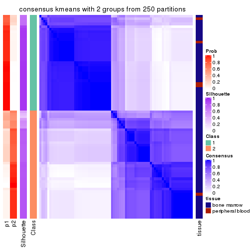</p>

</div>
<div id='tab-SD-kmeans-consensus-heatmap-2'>
<pre><code class="r">consensus_heatmap(res, k = 3)
</code></pre>

<p>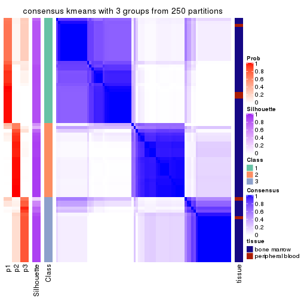</p>

</div>
<div id='tab-SD-kmeans-consensus-heatmap-3'>
<pre><code class="r">consensus_heatmap(res, k = 4)
</code></pre>

<p>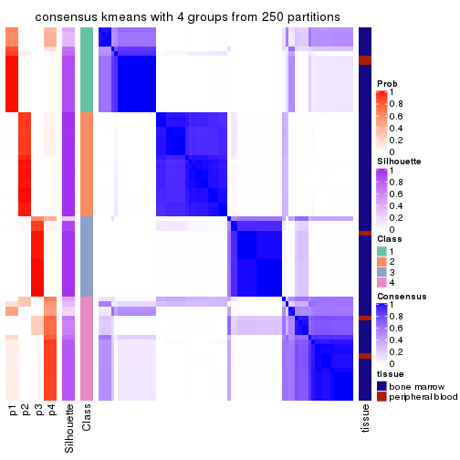</p>

</div>
<div id='tab-SD-kmeans-consensus-heatmap-4'>
<pre><code class="r">consensus_heatmap(res, k = 5)
</code></pre>

<p>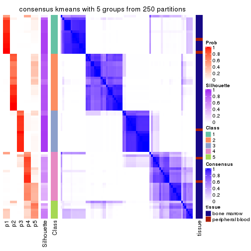</p>

</div>
<div id='tab-SD-kmeans-consensus-heatmap-5'>
<pre><code class="r">consensus_heatmap(res, k = 6)
</code></pre>

<p>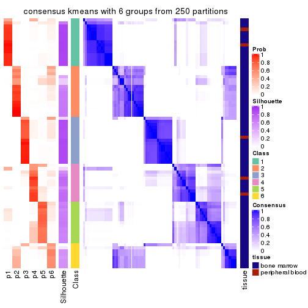</p>

</div>
</div>

Heatmaps for the membership of samples in all partitions to see how consistent they are:


<script>
$( function() {
	$( '#tabs-SD-kmeans-membership-heatmap' ).tabs();
} );
</script>
<div id='tabs-SD-kmeans-membership-heatmap'>
<ul>
<li><a href='#tab-SD-kmeans-membership-heatmap-1'>k = 2</a></li>
<li><a href='#tab-SD-kmeans-membership-heatmap-2'>k = 3</a></li>
<li><a href='#tab-SD-kmeans-membership-heatmap-3'>k = 4</a></li>
<li><a href='#tab-SD-kmeans-membership-heatmap-4'>k = 5</a></li>
<li><a href='#tab-SD-kmeans-membership-heatmap-5'>k = 6</a></li>
</ul>
<div id='tab-SD-kmeans-membership-heatmap-1'>
<pre><code class="r">membership_heatmap(res, k = 2)
</code></pre>

<p>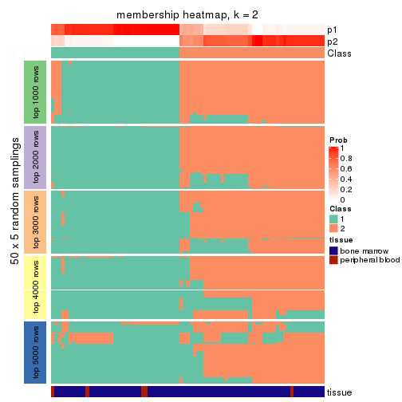</p>

</div>
<div id='tab-SD-kmeans-membership-heatmap-2'>
<pre><code class="r">membership_heatmap(res, k = 3)
</code></pre>

<p>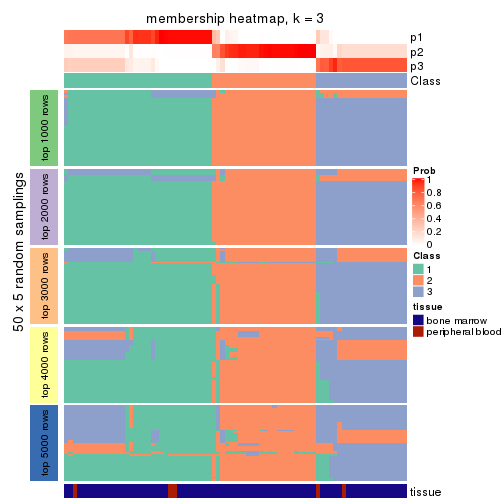</p>

</div>
<div id='tab-SD-kmeans-membership-heatmap-3'>
<pre><code class="r">membership_heatmap(res, k = 4)
</code></pre>

<p>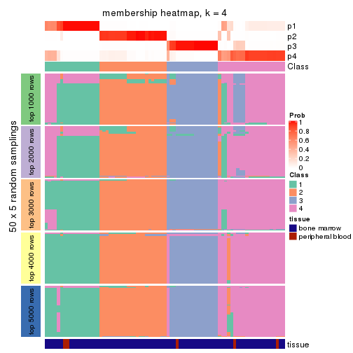</p>

</div>
<div id='tab-SD-kmeans-membership-heatmap-4'>
<pre><code class="r">membership_heatmap(res, k = 5)
</code></pre>

<p>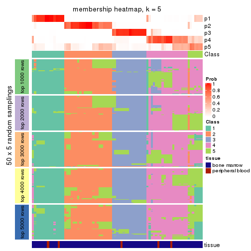</p>

</div>
<div id='tab-SD-kmeans-membership-heatmap-5'>
<pre><code class="r">membership_heatmap(res, k = 6)
</code></pre>

<p>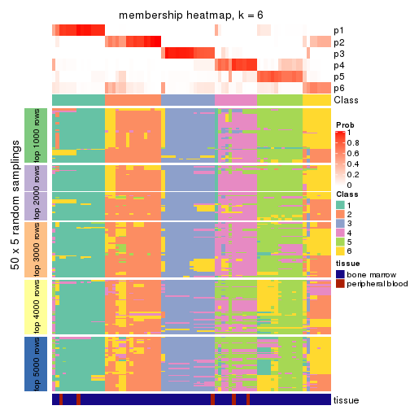</p>

</div>
</div>

As soon as we have had the classes for columns, we can look for signatures
which are significantly different between classes which can be candidate marks
for certain classes. Following are the heatmaps for signatures.


Signature heatmaps where rows are scaled:


<script>
$( function() {
	$( '#tabs-SD-kmeans-get-signatures' ).tabs();
} );
</script>
<div id='tabs-SD-kmeans-get-signatures'>
<ul>
<li><a href='#tab-SD-kmeans-get-signatures-1'>k = 2</a></li>
<li><a href='#tab-SD-kmeans-get-signatures-2'>k = 3</a></li>
<li><a href='#tab-SD-kmeans-get-signatures-3'>k = 4</a></li>
<li><a href='#tab-SD-kmeans-get-signatures-4'>k = 5</a></li>
<li><a href='#tab-SD-kmeans-get-signatures-5'>k = 6</a></li>
</ul>
<div id='tab-SD-kmeans-get-signatures-1'>
<pre><code class="r">get_signatures(res, k = 2)
</code></pre>

<p>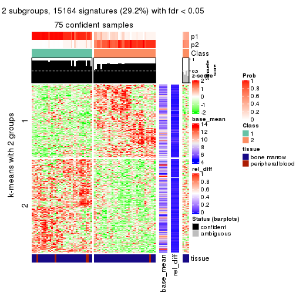</p>

</div>
<div id='tab-SD-kmeans-get-signatures-2'>
<pre><code class="r">get_signatures(res, k = 3)
</code></pre>

<p>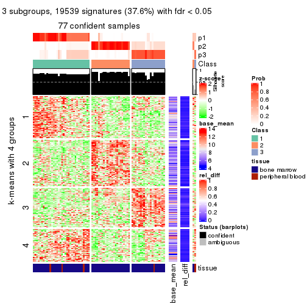</p>

</div>
<div id='tab-SD-kmeans-get-signatures-3'>
<pre><code class="r">get_signatures(res, k = 4)
</code></pre>

<p>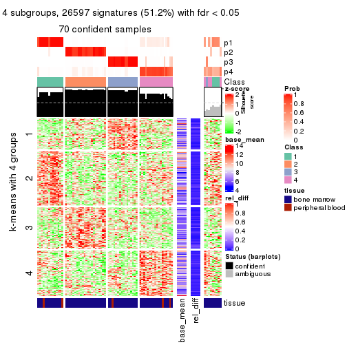</p>

</div>
<div id='tab-SD-kmeans-get-signatures-4'>
<pre><code class="r">get_signatures(res, k = 5)
</code></pre>

<p>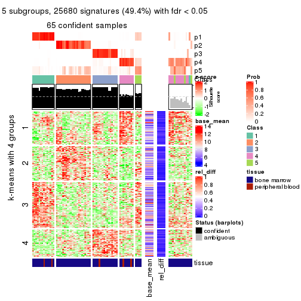</p>

</div>
<div id='tab-SD-kmeans-get-signatures-5'>
<pre><code class="r">get_signatures(res, k = 6)
</code></pre>

<p>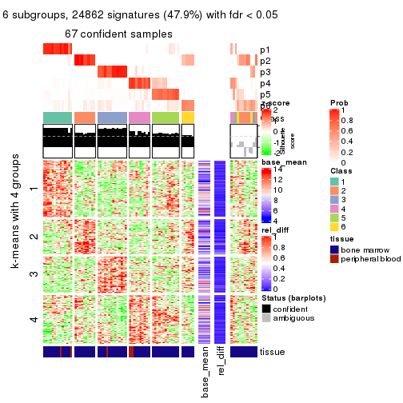</p>

</div>
</div>


Signature heatmaps where rows are not scaled:


<script>
$( function() {
	$( '#tabs-SD-kmeans-get-signatures-no-scale' ).tabs();
} );
</script>
<div id='tabs-SD-kmeans-get-signatures-no-scale'>
<ul>
<li><a href='#tab-SD-kmeans-get-signatures-no-scale-1'>k = 2</a></li>
<li><a href='#tab-SD-kmeans-get-signatures-no-scale-2'>k = 3</a></li>
<li><a href='#tab-SD-kmeans-get-signatures-no-scale-3'>k = 4</a></li>
<li><a href='#tab-SD-kmeans-get-signatures-no-scale-4'>k = 5</a></li>
<li><a href='#tab-SD-kmeans-get-signatures-no-scale-5'>k = 6</a></li>
</ul>
<div id='tab-SD-kmeans-get-signatures-no-scale-1'>
<pre><code class="r">get_signatures(res, k = 2, scale_rows = FALSE)
</code></pre>

<p>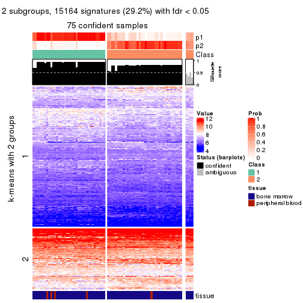</p>

</div>
<div id='tab-SD-kmeans-get-signatures-no-scale-2'>
<pre><code class="r">get_signatures(res, k = 3, scale_rows = FALSE)
</code></pre>

<p>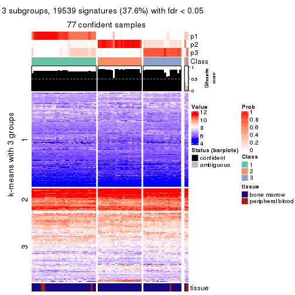</p>

</div>
<div id='tab-SD-kmeans-get-signatures-no-scale-3'>
<pre><code class="r">get_signatures(res, k = 4, scale_rows = FALSE)
</code></pre>

<p>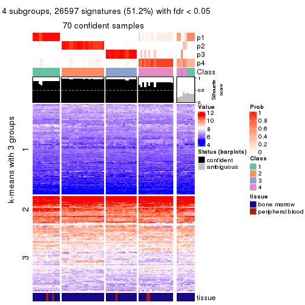</p>

</div>
<div id='tab-SD-kmeans-get-signatures-no-scale-4'>
<pre><code class="r">get_signatures(res, k = 5, scale_rows = FALSE)
</code></pre>

<p>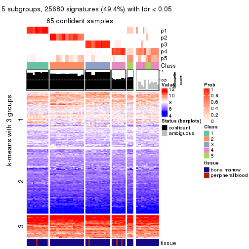</p>

</div>
<div id='tab-SD-kmeans-get-signatures-no-scale-5'>
<pre><code class="r">get_signatures(res, k = 6, scale_rows = FALSE)
</code></pre>

<p>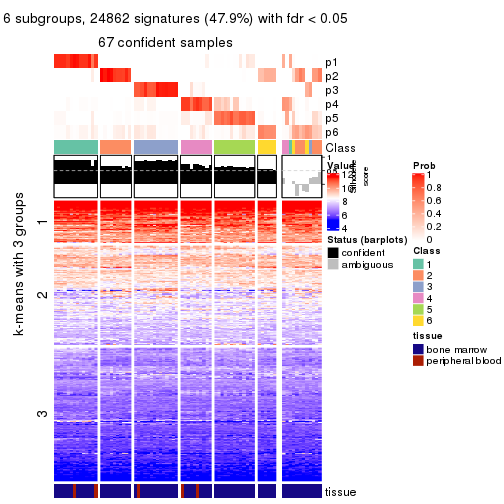</p>

</div>
</div>


Compare the overlap of signatures from different k:

```r
compare_signatures(res)
```

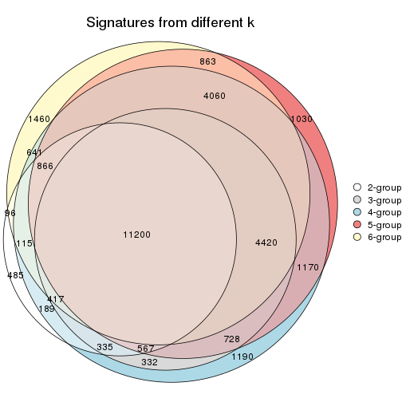

`get_signature()` returns a data frame invisibly. TO get the list of signatures, the function
call should be assigned to a variable explicitly. In following code, if `plot` argument is set
to `FALSE`, no heatmap is plotted while only the differential analysis is performed.

```r
# code only for demonstration
tb = get_signature(res, k = ..., plot = FALSE)
```

An example of the output of `tb` is:

```
#>   which_row         fdr    mean_1    mean_2 scaled_mean_1 scaled_mean_2 km
#> 1        38 0.042760348  8.373488  9.131774    -0.5533452     0.5164555  1
#> 2        40 0.018707592  7.106213  8.469186    -0.6173731     0.5762149  1
#> 3        55 0.019134737 10.221463 11.207825    -0.6159697     0.5749050  1
#> 4        59 0.006059896  5.921854  7.869574    -0.6899429     0.6439467  1
#> 5        60 0.018055526  8.928898 10.211722    -0.6204761     0.5791110  1
#> 6        98 0.009384629 15.714769 14.887706     0.6635654    -0.6193277  2
...
```

The columns in `tb` are:

1. `which_row`: row indices corresponding to the input matrix.
2. `fdr`: FDR for the differential test. 
3. `mean_x`: The mean value in group x.
4. `scaled_mean_x`: The mean value in group x after rows are scaled.
5. `km`: Row groups if k-means clustering is applied to rows.


UMAP plot which shows how samples are separated.


<script>
$( function() {
	$( '#tabs-SD-kmeans-dimension-reduction' ).tabs();
} );
</script>
<div id='tabs-SD-kmeans-dimension-reduction'>
<ul>
<li><a href='#tab-SD-kmeans-dimension-reduction-1'>k = 2</a></li>
<li><a href='#tab-SD-kmeans-dimension-reduction-2'>k = 3</a></li>
<li><a href='#tab-SD-kmeans-dimension-reduction-3'>k = 4</a></li>
<li><a href='#tab-SD-kmeans-dimension-reduction-4'>k = 5</a></li>
<li><a href='#tab-SD-kmeans-dimension-reduction-5'>k = 6</a></li>
</ul>
<div id='tab-SD-kmeans-dimension-reduction-1'>
<pre><code class="r">dimension_reduction(res, k = 2, method = &quot;UMAP&quot;)
</code></pre>

<p>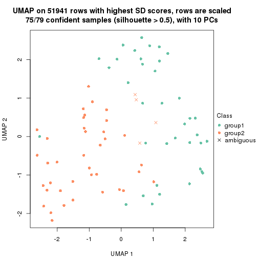</p>

</div>
<div id='tab-SD-kmeans-dimension-reduction-2'>
<pre><code class="r">dimension_reduction(res, k = 3, method = &quot;UMAP&quot;)
</code></pre>

<p>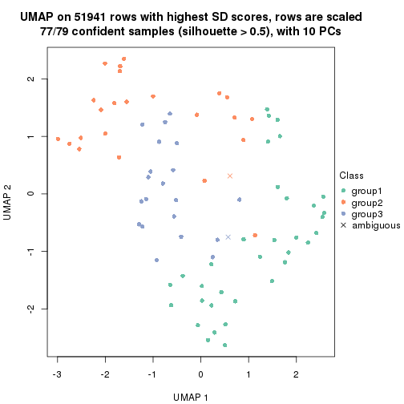</p>

</div>
<div id='tab-SD-kmeans-dimension-reduction-3'>
<pre><code class="r">dimension_reduction(res, k = 4, method = &quot;UMAP&quot;)
</code></pre>

<p>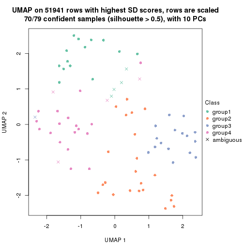</p>

</div>
<div id='tab-SD-kmeans-dimension-reduction-4'>
<pre><code class="r">dimension_reduction(res, k = 5, method = &quot;UMAP&quot;)
</code></pre>

<p>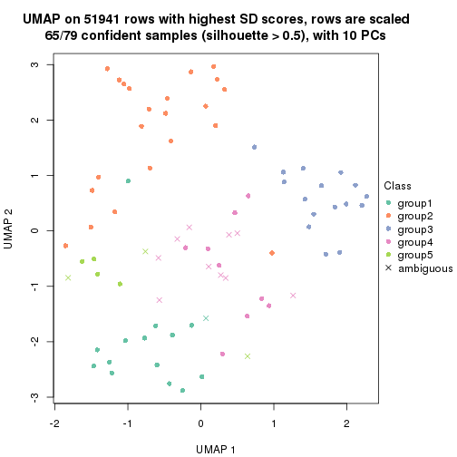</p>

</div>
<div id='tab-SD-kmeans-dimension-reduction-5'>
<pre><code class="r">dimension_reduction(res, k = 6, method = &quot;UMAP&quot;)
</code></pre>

<p>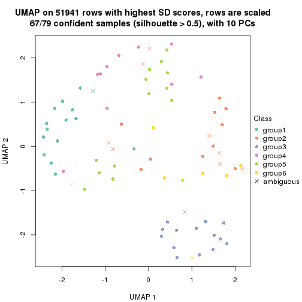</p>

</div>
</div>


Following heatmap shows how subgroups are split when increasing `k`:

```r
collect_classes(res)
```

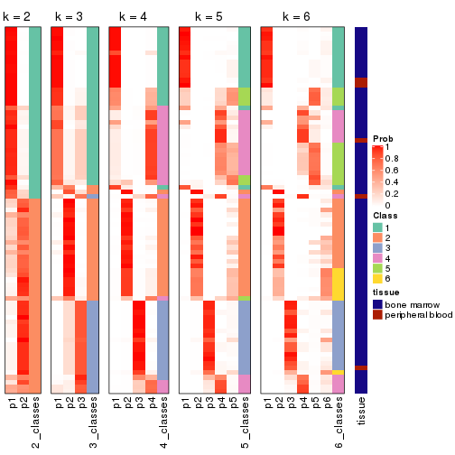


Test correlation between subgroups and known annotations. If the known
annotation is numeric, one-way ANOVA test is applied, and if the known
annotation is discrete, chi-squared contingency table test is applied.

```r
test_to_known_factors(res)
```

```
#>            n tissue(p) k
#> SD:kmeans 75     0.339 2
#> SD:kmeans 77     0.338 3
#> SD:kmeans 70     0.360 4
#> SD:kmeans 65     0.219 5
#> SD:kmeans 67     0.351 6
```


If matrix rows can be associated to genes, consider to use `GO_Enrichment(res,
...)` to perform function enrichment for the signature genes.


 

---------------------------------------------------


### SD:skmeans*


The object with results only for a single top-value method and a single partition method 
can be extracted as:

```r
res = res_list["SD", "skmeans"]
# you can also extract it by
# res = res_list["SD:skmeans"]
```

A summary of `res` and all the functions that can be applied to it:

```r
res
```

```
#> A 'ConsensusPartition' object with k = 2, 3, 4, 5, 6.
#>   On a matrix with 51941 rows and 79 columns.
#>   Top rows (1000, 2000, 3000, 4000, 5000) are extracted by 'SD' method.
#>   Subgroups are detected by 'skmeans' method.
#>   Performed in total 1250 partitions by row resampling.
#>   Best k for subgroups seems to be 4.
#> 
#> Following methods can be applied to this 'ConsensusPartition' object:
#>  [1] "cola_report"             "collect_classes"         "collect_plots"          
#>  [4] "collect_stats"           "colnames"                "compare_signatures"     
#>  [7] "consensus_heatmap"       "dimension_reduction"     "functional_enrichment"  
#> [10] "get_anno_col"            "get_anno"                "get_classes"            
#> [13] "get_consensus"           "get_matrix"              "get_membership"         
#> [16] "get_param"               "get_signatures"          "get_stats"              
#> [19] "is_best_k"               "is_stable_k"             "membership_heatmap"     
#> [22] "ncol"                    "nrow"                    "plot_ecdf"              
#> [25] "rownames"                "select_partition_number" "show"                   
#> [28] "suggest_best_k"          "test_to_known_factors"
```

`collect_plots()` function collects all the plots made from `res` for all `k` (number of partitions)
into one single page to provide an easy and fast comparison between different `k`.

```r
collect_plots(res)
```

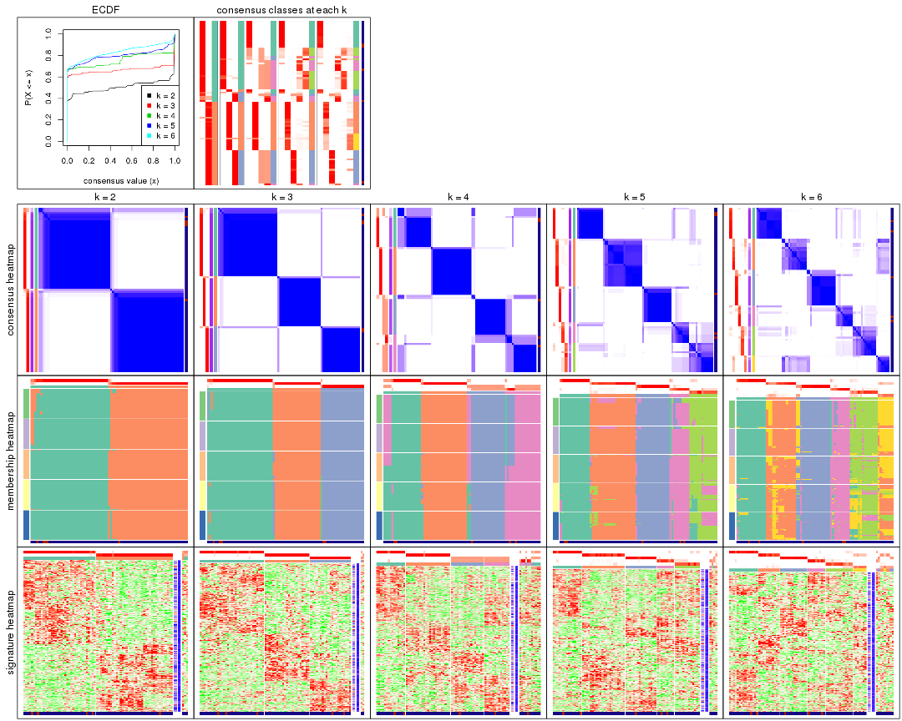

The plots are:

- The first row: a plot of the ECDF (Empirical cumulative distribution
  function) curves of the consensus matrix for each `k` and the heatmap of
  predicted classes for each `k`.
- The second row: heatmaps of the consensus matrix for each `k`.
- The third row: heatmaps of the membership matrix for each `k`.
- The fouth row: heatmaps of the signatures for each `k`.

All the plots in panels can be made by individual functions and they are
plotted later in this section.

`select_partition_number()` produces several plots showing different
statistics for choosing "optimized" `k`. There are following statistics:

- ECDF curves of the consensus matrix for each `k`;
- 1-PAC. [The PAC
  score](https://en.wikipedia.org/wiki/Consensus_clustering#Over-interpretation_potential_of_consensus_clustering)
  measures the proportion of the ambiguous subgrouping.
- Mean silhouette score.
- Concordance. The mean probability of fiting the consensus class ids in all
  partitions.
- Area increased. Denote $A_k$ as the area under the ECDF curve for current
  `k`, the area increased is defined as $A_k - A_{k-1}$.
- Rand index. The percent of pairs of samples that are both in a same cluster
  or both are not in a same cluster in the partition of k and k-1.
- Jaccard index. The ratio of pairs of samples are both in a same cluster in
  the partition of k and k-1 and the pairs of samples are both in a same
  cluster in the partition k or k-1.

The detailed explanations of these statistics can be found in [the cola
vignette](http://bioconductor.org/packages/devel/bioc/vignettes/cola/inst/doc/cola.html#toc_13).

Generally speaking, lower PAC score, higher mean silhouette score or higher
concordance corresponds to better partition. Rand index and Jaccard index
measure how similar the current partition is compared to partition with `k-1`.
If they are too similar, we won't accept `k` is better than `k-1`.

```r
select_partition_number(res)
```

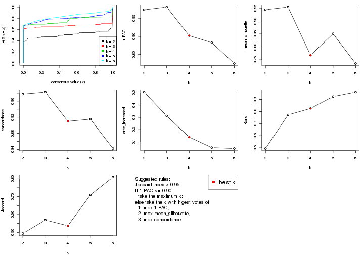

The numeric values for all these statistics can be obtained by `get_stats()`.

```r
get_stats(res)
```

```
#>   k 1-PAC mean_silhouette concordance area_increased  Rand Jaccard
#> 2 2 0.973           0.944       0.977         0.5063 0.494   0.494
#> 3 3 0.981           0.954       0.982         0.3120 0.772   0.569
#> 4 4 0.902           0.768       0.910         0.1387 0.826   0.537
#> 5 5 0.883           0.851       0.915         0.0533 0.924   0.710
#> 6 6 0.825           0.735       0.842         0.0457 0.961   0.810
```

`suggest_best_k()` suggests the best $k$ based on these statistics. The rules are as follows:

- All $k$ with Jaccard index larger than 0.95 are removed because the increase of
  the partition number does not provides enough extra information. If all $k$ are removed,
  the best $k$ is assigned by `NA`.
- For $k$ with 1-PAC larger than 0.9, the maximal $k$ is taken as the "best k". Other $k$ is called "optional k".
- If it does not fit the second rule. The $k$ with the highest vote of highest
  1-PAC, mean silhouette and concordance is taken as the "best k".

```r
suggest_best_k(res)
```

```
#> [1] 4
#> attr(,"optional")
#> [1] 2 3
```

There is also optional best $k$ = 2 3 that is worth to check.

Following shows the table of the partitions (You need to click the **show/hide
code output** link to see it). The membership matrix (columns with name `p*`)
is inferred by
[`clue::cl_consensus()`](https://www.rdocumentation.org/link/cl_consensus?package=clue)
function with the `SE` method. Basically the value in the membership matrix
represents the probability to belong to a certain group. The finall class
label for an item is determined with the group with highest probability it
belongs to.

In `get_classes()` function, the entropy is calculated from the membership
matrix and the silhouette score is calculated from the consensus matrix.


<script>
$( function() {
	$( '#tabs-SD-skmeans-get-classes' ).tabs();
} );
</script>
<div id='tabs-SD-skmeans-get-classes'>
<ul>
<li><a href='#tab-SD-skmeans-get-classes-1'>k = 2</a></li>
<li><a href='#tab-SD-skmeans-get-classes-2'>k = 3</a></li>
<li><a href='#tab-SD-skmeans-get-classes-3'>k = 4</a></li>
<li><a href='#tab-SD-skmeans-get-classes-4'>k = 5</a></li>
<li><a href='#tab-SD-skmeans-get-classes-5'>k = 6</a></li>
</ul>

<div id='tab-SD-skmeans-get-classes-1'>
<p><a id='tab-SD-skmeans-get-classes-1-a' style='color:#0366d6' href='#'>show/hide code output</a></p>
<pre><code class="r">cbind(get_classes(res, k = 2), get_membership(res, k = 2))
</code></pre>

<pre><code>#&gt;           class entropy silhouette    p1    p2
#&gt; GSM316652     2  0.0000      0.980 0.000 1.000
#&gt; GSM316653     1  0.0000      0.972 1.000 0.000
#&gt; GSM316654     1  0.0000      0.972 1.000 0.000
#&gt; GSM316655     1  0.0000      0.972 1.000 0.000
#&gt; GSM316656     1  0.2423      0.939 0.960 0.040
#&gt; GSM316657     1  0.0000      0.972 1.000 0.000
#&gt; GSM316658     2  0.0000      0.980 0.000 1.000
#&gt; GSM316659     2  0.0000      0.980 0.000 1.000
#&gt; GSM316660     1  0.0000      0.972 1.000 0.000
#&gt; GSM316661     1  0.0000      0.972 1.000 0.000
#&gt; GSM316662     2  0.0000      0.980 0.000 1.000
#&gt; GSM316663     2  0.0000      0.980 0.000 1.000
#&gt; GSM316664     1  0.0000      0.972 1.000 0.000
#&gt; GSM316665     2  0.0000      0.980 0.000 1.000
#&gt; GSM316666     2  0.0000      0.980 0.000 1.000
#&gt; GSM316667     2  0.0000      0.980 0.000 1.000
#&gt; GSM316668     2  0.0000      0.980 0.000 1.000
#&gt; GSM316669     1  0.0000      0.972 1.000 0.000
#&gt; GSM316670     2  0.0000      0.980 0.000 1.000
#&gt; GSM316671     2  0.0000      0.980 0.000 1.000
#&gt; GSM316672     1  0.0000      0.972 1.000 0.000
#&gt; GSM316673     1  0.0000      0.972 1.000 0.000
#&gt; GSM316674     2  0.0000      0.980 0.000 1.000
#&gt; GSM316676     2  0.0000      0.980 0.000 1.000
#&gt; GSM316677     1  0.0000      0.972 1.000 0.000
#&gt; GSM316678     2  0.2603      0.940 0.044 0.956
#&gt; GSM316679     1  0.0000      0.972 1.000 0.000
#&gt; GSM316680     1  0.0000      0.972 1.000 0.000
#&gt; GSM316681     2  0.0000      0.980 0.000 1.000
#&gt; GSM316682     1  0.0000      0.972 1.000 0.000
#&gt; GSM316683     1  0.0000      0.972 1.000 0.000
#&gt; GSM316684     2  0.0000      0.980 0.000 1.000
#&gt; GSM316685     2  0.0000      0.980 0.000 1.000
#&gt; GSM316686     1  0.6148      0.814 0.848 0.152
#&gt; GSM316687     1  0.9661      0.373 0.608 0.392
#&gt; GSM316688     2  0.7219      0.735 0.200 0.800
#&gt; GSM316689     1  0.0000      0.972 1.000 0.000
#&gt; GSM316690     2  0.0000      0.980 0.000 1.000
#&gt; GSM316691     2  0.0000      0.980 0.000 1.000
#&gt; GSM316692     2  0.0000      0.980 0.000 1.000
#&gt; GSM316693     1  0.0000      0.972 1.000 0.000
#&gt; GSM316694     2  0.0000      0.980 0.000 1.000
#&gt; GSM316696     1  0.0000      0.972 1.000 0.000
#&gt; GSM316697     2  0.0000      0.980 0.000 1.000
#&gt; GSM316698     2  0.0000      0.980 0.000 1.000
#&gt; GSM316699     2  0.0000      0.980 0.000 1.000
#&gt; GSM316700     1  0.0000      0.972 1.000 0.000
#&gt; GSM316701     1  0.0000      0.972 1.000 0.000
#&gt; GSM316703     2  0.0000      0.980 0.000 1.000
#&gt; GSM316704     2  0.0000      0.980 0.000 1.000
#&gt; GSM316705     1  0.0000      0.972 1.000 0.000
#&gt; GSM316706     2  0.9922      0.183 0.448 0.552
#&gt; GSM316707     2  0.0000      0.980 0.000 1.000
#&gt; GSM316708     2  0.2603      0.940 0.044 0.956
#&gt; GSM316709     2  0.0000      0.980 0.000 1.000
#&gt; GSM316710     1  0.0000      0.972 1.000 0.000
#&gt; GSM316711     2  0.0000      0.980 0.000 1.000
#&gt; GSM316713     1  0.0000      0.972 1.000 0.000
#&gt; GSM316714     1  0.2778      0.932 0.952 0.048
#&gt; GSM316715     1  0.0000      0.972 1.000 0.000
#&gt; GSM316716     2  0.0000      0.980 0.000 1.000
#&gt; GSM316717     1  0.0000      0.972 1.000 0.000
#&gt; GSM316718     2  0.0672      0.973 0.008 0.992
#&gt; GSM316719     1  0.0000      0.972 1.000 0.000
#&gt; GSM316720     1  0.0000      0.972 1.000 0.000
#&gt; GSM316721     2  0.0000      0.980 0.000 1.000
#&gt; GSM316722     1  0.0000      0.972 1.000 0.000
#&gt; GSM316723     2  0.0000      0.980 0.000 1.000
#&gt; GSM316724     2  0.0000      0.980 0.000 1.000
#&gt; GSM316726     2  0.0000      0.980 0.000 1.000
#&gt; GSM316727     1  0.0000      0.972 1.000 0.000
#&gt; GSM316728     1  0.9580      0.405 0.620 0.380
#&gt; GSM316729     1  0.0000      0.972 1.000 0.000
#&gt; GSM316730     2  0.0000      0.980 0.000 1.000
#&gt; GSM316675     2  0.0000      0.980 0.000 1.000
#&gt; GSM316695     1  0.0000      0.972 1.000 0.000
#&gt; GSM316702     1  0.1843      0.949 0.972 0.028
#&gt; GSM316712     1  0.0000      0.972 1.000 0.000
#&gt; GSM316725     1  0.0000      0.972 1.000 0.000
</code></pre>

<script>
$('#tab-SD-skmeans-get-classes-1-a').parent().next().next().hide();
$('#tab-SD-skmeans-get-classes-1-a').click(function(){
  $('#tab-SD-skmeans-get-classes-1-a').parent().next().next().toggle();
  return(false);
});
</script>
</div>

<div id='tab-SD-skmeans-get-classes-2'>
<p><a id='tab-SD-skmeans-get-classes-2-a' style='color:#0366d6' href='#'>show/hide code output</a></p>
<pre><code class="r">cbind(get_classes(res, k = 3), get_membership(res, k = 3))
</code></pre>

<pre><code>#&gt;           class entropy silhouette    p1    p2    p3
#&gt; GSM316652     3  0.0000     0.9773 0.000 0.000 1.000
#&gt; GSM316653     1  0.0000     0.9848 1.000 0.000 0.000
#&gt; GSM316654     1  0.0000     0.9848 1.000 0.000 0.000
#&gt; GSM316655     1  0.0000     0.9848 1.000 0.000 0.000
#&gt; GSM316656     1  0.3412     0.8583 0.876 0.124 0.000
#&gt; GSM316657     1  0.0000     0.9848 1.000 0.000 0.000
#&gt; GSM316658     2  0.0000     0.9787 0.000 1.000 0.000
#&gt; GSM316659     2  0.0000     0.9787 0.000 1.000 0.000
#&gt; GSM316660     1  0.0000     0.9848 1.000 0.000 0.000
#&gt; GSM316661     1  0.4452     0.7592 0.808 0.000 0.192
#&gt; GSM316662     3  0.0000     0.9773 0.000 0.000 1.000
#&gt; GSM316663     3  0.0000     0.9773 0.000 0.000 1.000
#&gt; GSM316664     1  0.0000     0.9848 1.000 0.000 0.000
#&gt; GSM316665     2  0.0000     0.9787 0.000 1.000 0.000
#&gt; GSM316666     3  0.0000     0.9773 0.000 0.000 1.000
#&gt; GSM316667     2  0.0000     0.9787 0.000 1.000 0.000
#&gt; GSM316668     3  0.0000     0.9773 0.000 0.000 1.000
#&gt; GSM316669     1  0.0000     0.9848 1.000 0.000 0.000
#&gt; GSM316670     3  0.0000     0.9773 0.000 0.000 1.000
#&gt; GSM316671     3  0.0000     0.9773 0.000 0.000 1.000
#&gt; GSM316672     2  0.0237     0.9748 0.004 0.996 0.000
#&gt; GSM316673     1  0.0000     0.9848 1.000 0.000 0.000
#&gt; GSM316674     3  0.0000     0.9773 0.000 0.000 1.000
#&gt; GSM316676     3  0.0000     0.9773 0.000 0.000 1.000
#&gt; GSM316677     1  0.0000     0.9848 1.000 0.000 0.000
#&gt; GSM316678     2  0.0000     0.9787 0.000 1.000 0.000
#&gt; GSM316679     1  0.0000     0.9848 1.000 0.000 0.000
#&gt; GSM316680     1  0.0000     0.9848 1.000 0.000 0.000
#&gt; GSM316681     3  0.0000     0.9773 0.000 0.000 1.000
#&gt; GSM316682     1  0.0000     0.9848 1.000 0.000 0.000
#&gt; GSM316683     1  0.0000     0.9848 1.000 0.000 0.000
#&gt; GSM316684     2  0.0000     0.9787 0.000 1.000 0.000
#&gt; GSM316685     3  0.0000     0.9773 0.000 0.000 1.000
#&gt; GSM316686     3  0.6192     0.2540 0.420 0.000 0.580
#&gt; GSM316687     3  0.0000     0.9773 0.000 0.000 1.000
#&gt; GSM316688     2  0.7575     0.0962 0.040 0.504 0.456
#&gt; GSM316689     1  0.0000     0.9848 1.000 0.000 0.000
#&gt; GSM316690     3  0.0000     0.9773 0.000 0.000 1.000
#&gt; GSM316691     2  0.0000     0.9787 0.000 1.000 0.000
#&gt; GSM316692     3  0.0000     0.9773 0.000 0.000 1.000
#&gt; GSM316693     1  0.0237     0.9817 0.996 0.000 0.004
#&gt; GSM316694     3  0.0000     0.9773 0.000 0.000 1.000
#&gt; GSM316696     1  0.0000     0.9848 1.000 0.000 0.000
#&gt; GSM316697     3  0.0000     0.9773 0.000 0.000 1.000
#&gt; GSM316698     2  0.0000     0.9787 0.000 1.000 0.000
#&gt; GSM316699     2  0.0000     0.9787 0.000 1.000 0.000
#&gt; GSM316700     1  0.0000     0.9848 1.000 0.000 0.000
#&gt; GSM316701     1  0.0000     0.9848 1.000 0.000 0.000
#&gt; GSM316703     2  0.0000     0.9787 0.000 1.000 0.000
#&gt; GSM316704     2  0.0000     0.9787 0.000 1.000 0.000
#&gt; GSM316705     1  0.0000     0.9848 1.000 0.000 0.000
#&gt; GSM316706     2  0.0000     0.9787 0.000 1.000 0.000
#&gt; GSM316707     2  0.0000     0.9787 0.000 1.000 0.000
#&gt; GSM316708     2  0.0000     0.9787 0.000 1.000 0.000
#&gt; GSM316709     3  0.0000     0.9773 0.000 0.000 1.000
#&gt; GSM316710     1  0.0237     0.9817 0.996 0.000 0.004
#&gt; GSM316711     2  0.0000     0.9787 0.000 1.000 0.000
#&gt; GSM316713     1  0.0000     0.9848 1.000 0.000 0.000
#&gt; GSM316714     3  0.0000     0.9773 0.000 0.000 1.000
#&gt; GSM316715     1  0.0000     0.9848 1.000 0.000 0.000
#&gt; GSM316716     2  0.0000     0.9787 0.000 1.000 0.000
#&gt; GSM316717     1  0.0000     0.9848 1.000 0.000 0.000
#&gt; GSM316718     2  0.0000     0.9787 0.000 1.000 0.000
#&gt; GSM316719     1  0.0000     0.9848 1.000 0.000 0.000
#&gt; GSM316720     1  0.0000     0.9848 1.000 0.000 0.000
#&gt; GSM316721     2  0.0000     0.9787 0.000 1.000 0.000
#&gt; GSM316722     1  0.0000     0.9848 1.000 0.000 0.000
#&gt; GSM316723     2  0.0000     0.9787 0.000 1.000 0.000
#&gt; GSM316724     2  0.0000     0.9787 0.000 1.000 0.000
#&gt; GSM316726     2  0.0000     0.9787 0.000 1.000 0.000
#&gt; GSM316727     1  0.0000     0.9848 1.000 0.000 0.000
#&gt; GSM316728     3  0.0000     0.9773 0.000 0.000 1.000
#&gt; GSM316729     1  0.3686     0.8359 0.860 0.140 0.000
#&gt; GSM316730     2  0.0000     0.9787 0.000 1.000 0.000
#&gt; GSM316675     3  0.0000     0.9773 0.000 0.000 1.000
#&gt; GSM316695     1  0.0000     0.9848 1.000 0.000 0.000
#&gt; GSM316702     3  0.0000     0.9773 0.000 0.000 1.000
#&gt; GSM316712     1  0.0000     0.9848 1.000 0.000 0.000
#&gt; GSM316725     1  0.0237     0.9817 0.996 0.000 0.004
</code></pre>

<script>
$('#tab-SD-skmeans-get-classes-2-a').parent().next().next().hide();
$('#tab-SD-skmeans-get-classes-2-a').click(function(){
  $('#tab-SD-skmeans-get-classes-2-a').parent().next().next().toggle();
  return(false);
});
</script>
</div>

<div id='tab-SD-skmeans-get-classes-3'>
<p><a id='tab-SD-skmeans-get-classes-3-a' style='color:#0366d6' href='#'>show/hide code output</a></p>
<pre><code class="r">cbind(get_classes(res, k = 4), get_membership(res, k = 4))
</code></pre>

<pre><code>#&gt;           class entropy silhouette    p1    p2    p3    p4
#&gt; GSM316652     3   0.500    0.88006 0.000 0.000 0.512 0.488
#&gt; GSM316653     4   0.500    0.80584 0.000 0.000 0.488 0.512
#&gt; GSM316654     4   0.500    0.80584 0.000 0.000 0.488 0.512
#&gt; GSM316655     4   0.500    0.80584 0.000 0.000 0.488 0.512
#&gt; GSM316656     4   0.500    0.80584 0.000 0.000 0.488 0.512
#&gt; GSM316657     1   0.000    0.85772 1.000 0.000 0.000 0.000
#&gt; GSM316658     2   0.000    0.98482 0.000 1.000 0.000 0.000
#&gt; GSM316659     2   0.000    0.98482 0.000 1.000 0.000 0.000
#&gt; GSM316660     1   0.000    0.85772 1.000 0.000 0.000 0.000
#&gt; GSM316661     4   0.500    0.80584 0.000 0.000 0.488 0.512
#&gt; GSM316662     3   0.500    0.88006 0.000 0.000 0.512 0.488
#&gt; GSM316663     4   0.000    0.16650 0.000 0.000 0.000 1.000
#&gt; GSM316664     4   0.500   -0.00143 0.488 0.000 0.000 0.512
#&gt; GSM316665     2   0.000    0.98482 0.000 1.000 0.000 0.000
#&gt; GSM316666     3   0.500    0.88006 0.000 0.000 0.512 0.488
#&gt; GSM316667     2   0.000    0.98482 0.000 1.000 0.000 0.000
#&gt; GSM316668     3   0.500    0.88006 0.000 0.000 0.512 0.488
#&gt; GSM316669     4   0.500    0.80584 0.000 0.000 0.488 0.512
#&gt; GSM316670     3   0.500    0.88006 0.000 0.000 0.512 0.488
#&gt; GSM316671     3   0.500    0.88006 0.000 0.000 0.512 0.488
#&gt; GSM316672     1   0.000    0.85772 1.000 0.000 0.000 0.000
#&gt; GSM316673     1   0.000    0.85772 1.000 0.000 0.000 0.000
#&gt; GSM316674     3   0.500    0.88006 0.000 0.000 0.512 0.488
#&gt; GSM316676     3   0.500    0.88006 0.000 0.000 0.512 0.488
#&gt; GSM316677     3   0.704   -0.47224 0.388 0.000 0.488 0.124
#&gt; GSM316678     2   0.000    0.98482 0.000 1.000 0.000 0.000
#&gt; GSM316679     1   0.500    0.27906 0.512 0.000 0.488 0.000
#&gt; GSM316680     1   0.500    0.27906 0.512 0.000 0.488 0.000
#&gt; GSM316681     3   0.500    0.88006 0.000 0.000 0.512 0.488
#&gt; GSM316682     4   0.500    0.80584 0.000 0.000 0.488 0.512
#&gt; GSM316683     4   0.500    0.80584 0.000 0.000 0.488 0.512
#&gt; GSM316684     2   0.000    0.98482 0.000 1.000 0.000 0.000
#&gt; GSM316685     3   0.500    0.88006 0.000 0.000 0.512 0.488
#&gt; GSM316686     1   0.419    0.51531 0.732 0.000 0.000 0.268
#&gt; GSM316687     4   0.253   -0.17580 0.000 0.000 0.112 0.888
#&gt; GSM316688     2   0.631    0.52664 0.256 0.656 0.076 0.012
#&gt; GSM316689     1   0.000    0.85772 1.000 0.000 0.000 0.000
#&gt; GSM316690     3   0.500    0.88006 0.000 0.000 0.512 0.488
#&gt; GSM316691     2   0.000    0.98482 0.000 1.000 0.000 0.000
#&gt; GSM316692     3   0.500    0.88006 0.000 0.000 0.512 0.488
#&gt; GSM316693     4   0.500    0.80584 0.000 0.000 0.488 0.512
#&gt; GSM316694     3   0.500    0.88006 0.000 0.000 0.512 0.488
#&gt; GSM316696     1   0.000    0.85772 1.000 0.000 0.000 0.000
#&gt; GSM316697     3   0.500    0.88006 0.000 0.000 0.512 0.488
#&gt; GSM316698     2   0.000    0.98482 0.000 1.000 0.000 0.000
#&gt; GSM316699     2   0.000    0.98482 0.000 1.000 0.000 0.000
#&gt; GSM316700     4   0.500    0.80584 0.000 0.000 0.488 0.512
#&gt; GSM316701     4   0.500    0.80584 0.000 0.000 0.488 0.512
#&gt; GSM316703     2   0.000    0.98482 0.000 1.000 0.000 0.000
#&gt; GSM316704     2   0.000    0.98482 0.000 1.000 0.000 0.000
#&gt; GSM316705     1   0.000    0.85772 1.000 0.000 0.000 0.000
#&gt; GSM316706     2   0.000    0.98482 0.000 1.000 0.000 0.000
#&gt; GSM316707     2   0.000    0.98482 0.000 1.000 0.000 0.000
#&gt; GSM316708     2   0.000    0.98482 0.000 1.000 0.000 0.000
#&gt; GSM316709     3   0.500    0.88006 0.000 0.000 0.512 0.488
#&gt; GSM316710     4   0.500    0.80584 0.000 0.000 0.488 0.512
#&gt; GSM316711     2   0.000    0.98482 0.000 1.000 0.000 0.000
#&gt; GSM316713     1   0.000    0.85772 1.000 0.000 0.000 0.000
#&gt; GSM316714     3   0.500    0.88006 0.000 0.000 0.512 0.488
#&gt; GSM316715     1   0.000    0.85772 1.000 0.000 0.000 0.000
#&gt; GSM316716     2   0.000    0.98482 0.000 1.000 0.000 0.000
#&gt; GSM316717     1   0.500    0.27906 0.512 0.000 0.488 0.000
#&gt; GSM316718     2   0.000    0.98482 0.000 1.000 0.000 0.000
#&gt; GSM316719     1   0.000    0.85772 1.000 0.000 0.000 0.000
#&gt; GSM316720     1   0.000    0.85772 1.000 0.000 0.000 0.000
#&gt; GSM316721     2   0.000    0.98482 0.000 1.000 0.000 0.000
#&gt; GSM316722     1   0.500    0.27906 0.512 0.000 0.488 0.000
#&gt; GSM316723     2   0.000    0.98482 0.000 1.000 0.000 0.000
#&gt; GSM316724     2   0.000    0.98482 0.000 1.000 0.000 0.000
#&gt; GSM316726     2   0.000    0.98482 0.000 1.000 0.000 0.000
#&gt; GSM316727     1   0.000    0.85772 1.000 0.000 0.000 0.000
#&gt; GSM316728     4   0.000    0.16650 0.000 0.000 0.000 1.000
#&gt; GSM316729     3   0.822   -0.47788 0.336 0.068 0.488 0.108
#&gt; GSM316730     2   0.000    0.98482 0.000 1.000 0.000 0.000
#&gt; GSM316675     3   0.500    0.88006 0.000 0.000 0.512 0.488
#&gt; GSM316695     1   0.000    0.85772 1.000 0.000 0.000 0.000
#&gt; GSM316702     4   0.000    0.16650 0.000 0.000 0.000 1.000
#&gt; GSM316712     1   0.000    0.85772 1.000 0.000 0.000 0.000
#&gt; GSM316725     4   0.500    0.80584 0.000 0.000 0.488 0.512
</code></pre>

<script>
$('#tab-SD-skmeans-get-classes-3-a').parent().next().next().hide();
$('#tab-SD-skmeans-get-classes-3-a').click(function(){
  $('#tab-SD-skmeans-get-classes-3-a').parent().next().next().toggle();
  return(false);
});
</script>
</div>

<div id='tab-SD-skmeans-get-classes-4'>
<p><a id='tab-SD-skmeans-get-classes-4-a' style='color:#0366d6' href='#'>show/hide code output</a></p>
<pre><code class="r">cbind(get_classes(res, k = 5), get_membership(res, k = 5))
</code></pre>

<pre><code>#&gt;           class entropy silhouette    p1    p2    p3    p4    p5
#&gt; GSM316652     3  0.0000     0.9576 0.000 0.000 1.000 0.000 0.000
#&gt; GSM316653     5  0.3039     0.7805 0.000 0.000 0.000 0.192 0.808
#&gt; GSM316654     4  0.1544     0.8048 0.000 0.000 0.000 0.932 0.068
#&gt; GSM316655     5  0.3039     0.7805 0.000 0.000 0.000 0.192 0.808
#&gt; GSM316656     5  0.0290     0.7370 0.000 0.000 0.000 0.008 0.992
#&gt; GSM316657     1  0.0000     0.9813 1.000 0.000 0.000 0.000 0.000
#&gt; GSM316658     2  0.0324     0.9339 0.000 0.992 0.000 0.004 0.004
#&gt; GSM316659     2  0.0000     0.9338 0.000 1.000 0.000 0.000 0.000
#&gt; GSM316660     1  0.0000     0.9813 1.000 0.000 0.000 0.000 0.000
#&gt; GSM316661     5  0.4268     0.3343 0.000 0.000 0.000 0.444 0.556
#&gt; GSM316662     3  0.0000     0.9576 0.000 0.000 1.000 0.000 0.000
#&gt; GSM316663     4  0.3274     0.6811 0.000 0.000 0.220 0.780 0.000
#&gt; GSM316664     4  0.4210     0.3203 0.412 0.000 0.000 0.588 0.000
#&gt; GSM316665     2  0.1571     0.9274 0.000 0.936 0.000 0.060 0.004
#&gt; GSM316666     3  0.0000     0.9576 0.000 0.000 1.000 0.000 0.000
#&gt; GSM316667     2  0.2278     0.9249 0.000 0.908 0.000 0.060 0.032
#&gt; GSM316668     3  0.0000     0.9576 0.000 0.000 1.000 0.000 0.000
#&gt; GSM316669     5  0.3039     0.7805 0.000 0.000 0.000 0.192 0.808
#&gt; GSM316670     3  0.1571     0.8999 0.000 0.000 0.936 0.060 0.004
#&gt; GSM316671     3  0.0000     0.9576 0.000 0.000 1.000 0.000 0.000
#&gt; GSM316672     1  0.0451     0.9704 0.988 0.004 0.000 0.000 0.008
#&gt; GSM316673     1  0.0000     0.9813 1.000 0.000 0.000 0.000 0.000
#&gt; GSM316674     3  0.0000     0.9576 0.000 0.000 1.000 0.000 0.000
#&gt; GSM316676     3  0.0000     0.9576 0.000 0.000 1.000 0.000 0.000
#&gt; GSM316677     4  0.5013     0.5287 0.240 0.000 0.000 0.680 0.080
#&gt; GSM316678     2  0.0162     0.9335 0.000 0.996 0.000 0.000 0.004
#&gt; GSM316679     5  0.4243     0.5802 0.264 0.000 0.000 0.024 0.712
#&gt; GSM316680     5  0.3274     0.6404 0.220 0.000 0.000 0.000 0.780
#&gt; GSM316681     3  0.0000     0.9576 0.000 0.000 1.000 0.000 0.000
#&gt; GSM316682     5  0.3039     0.7805 0.000 0.000 0.000 0.192 0.808
#&gt; GSM316683     5  0.3003     0.7810 0.000 0.000 0.000 0.188 0.812
#&gt; GSM316684     2  0.0000     0.9338 0.000 1.000 0.000 0.000 0.000
#&gt; GSM316685     3  0.1571     0.8999 0.000 0.000 0.936 0.060 0.004
#&gt; GSM316686     1  0.3143     0.6899 0.796 0.000 0.000 0.204 0.000
#&gt; GSM316687     4  0.2230     0.7800 0.000 0.000 0.116 0.884 0.000
#&gt; GSM316688     2  0.8584     0.4059 0.148 0.492 0.084 0.112 0.164
#&gt; GSM316689     1  0.0000     0.9813 1.000 0.000 0.000 0.000 0.000
#&gt; GSM316690     3  0.0000     0.9576 0.000 0.000 1.000 0.000 0.000
#&gt; GSM316691     2  0.2278     0.9249 0.000 0.908 0.000 0.060 0.032
#&gt; GSM316692     3  0.0000     0.9576 0.000 0.000 1.000 0.000 0.000
#&gt; GSM316693     4  0.1410     0.8102 0.000 0.000 0.000 0.940 0.060
#&gt; GSM316694     3  0.0000     0.9576 0.000 0.000 1.000 0.000 0.000
#&gt; GSM316696     1  0.0000     0.9813 1.000 0.000 0.000 0.000 0.000
#&gt; GSM316697     3  0.0000     0.9576 0.000 0.000 1.000 0.000 0.000
#&gt; GSM316698     2  0.0162     0.9335 0.000 0.996 0.000 0.000 0.004
#&gt; GSM316699     2  0.2104     0.9261 0.000 0.916 0.000 0.060 0.024
#&gt; GSM316700     5  0.3039     0.7805 0.000 0.000 0.000 0.192 0.808
#&gt; GSM316701     5  0.2966     0.7811 0.000 0.000 0.000 0.184 0.816
#&gt; GSM316703     2  0.0162     0.9335 0.000 0.996 0.000 0.000 0.004
#&gt; GSM316704     2  0.0162     0.9335 0.000 0.996 0.000 0.000 0.004
#&gt; GSM316705     1  0.0000     0.9813 1.000 0.000 0.000 0.000 0.000
#&gt; GSM316706     2  0.0162     0.9335 0.000 0.996 0.000 0.000 0.004
#&gt; GSM316707     2  0.1571     0.9274 0.000 0.936 0.000 0.060 0.004
#&gt; GSM316708     2  0.2966     0.8202 0.000 0.816 0.000 0.000 0.184
#&gt; GSM316709     3  0.0000     0.9576 0.000 0.000 1.000 0.000 0.000
#&gt; GSM316710     4  0.1410     0.8102 0.000 0.000 0.000 0.940 0.060
#&gt; GSM316711     2  0.1571     0.9274 0.000 0.936 0.000 0.060 0.004
#&gt; GSM316713     1  0.0000     0.9813 1.000 0.000 0.000 0.000 0.000
#&gt; GSM316714     3  0.4305    -0.0112 0.000 0.000 0.512 0.488 0.000
#&gt; GSM316715     1  0.0000     0.9813 1.000 0.000 0.000 0.000 0.000
#&gt; GSM316716     2  0.2278     0.9249 0.000 0.908 0.000 0.060 0.032
#&gt; GSM316717     5  0.2648     0.6904 0.152 0.000 0.000 0.000 0.848
#&gt; GSM316718     2  0.2891     0.8282 0.000 0.824 0.000 0.000 0.176
#&gt; GSM316719     1  0.0000     0.9813 1.000 0.000 0.000 0.000 0.000
#&gt; GSM316720     1  0.0000     0.9813 1.000 0.000 0.000 0.000 0.000
#&gt; GSM316721     2  0.2278     0.9249 0.000 0.908 0.000 0.060 0.032
#&gt; GSM316722     5  0.4364     0.6146 0.216 0.000 0.000 0.048 0.736
#&gt; GSM316723     2  0.0000     0.9338 0.000 1.000 0.000 0.000 0.000
#&gt; GSM316724     2  0.1671     0.9080 0.000 0.924 0.000 0.000 0.076
#&gt; GSM316726     2  0.2278     0.9249 0.000 0.908 0.000 0.060 0.032
#&gt; GSM316727     1  0.0000     0.9813 1.000 0.000 0.000 0.000 0.000
#&gt; GSM316728     4  0.1410     0.8124 0.000 0.000 0.060 0.940 0.000
#&gt; GSM316729     5  0.0486     0.7353 0.004 0.004 0.000 0.004 0.988
#&gt; GSM316730     2  0.0162     0.9335 0.000 0.996 0.000 0.000 0.004
#&gt; GSM316675     3  0.0000     0.9576 0.000 0.000 1.000 0.000 0.000
#&gt; GSM316695     1  0.0000     0.9813 1.000 0.000 0.000 0.000 0.000
#&gt; GSM316702     4  0.1410     0.8124 0.000 0.000 0.060 0.940 0.000
#&gt; GSM316712     1  0.0000     0.9813 1.000 0.000 0.000 0.000 0.000
#&gt; GSM316725     4  0.1410     0.8102 0.000 0.000 0.000 0.940 0.060
</code></pre>

<script>
$('#tab-SD-skmeans-get-classes-4-a').parent().next().next().hide();
$('#tab-SD-skmeans-get-classes-4-a').click(function(){
  $('#tab-SD-skmeans-get-classes-4-a').parent().next().next().toggle();
  return(false);
});
</script>
</div>

<div id='tab-SD-skmeans-get-classes-5'>
<p><a id='tab-SD-skmeans-get-classes-5-a' style='color:#0366d6' href='#'>show/hide code output</a></p>
<pre><code class="r">cbind(get_classes(res, k = 6), get_membership(res, k = 6))
</code></pre>

<pre><code>#&gt;           class entropy silhouette    p1    p2    p3    p4    p5    p6
#&gt; GSM316652     3  0.0000      0.901 0.000 0.000 1.000 0.000 0.000 0.000
#&gt; GSM316653     5  0.2250      0.793 0.000 0.000 0.000 0.092 0.888 0.020
#&gt; GSM316654     4  0.1225      0.821 0.000 0.000 0.000 0.952 0.036 0.012
#&gt; GSM316655     5  0.2361      0.794 0.000 0.000 0.000 0.088 0.884 0.028
#&gt; GSM316656     5  0.1075      0.772 0.000 0.000 0.000 0.000 0.952 0.048
#&gt; GSM316657     1  0.0260      0.970 0.992 0.000 0.000 0.000 0.000 0.008
#&gt; GSM316658     2  0.2300      0.562 0.000 0.856 0.000 0.000 0.000 0.144
#&gt; GSM316659     2  0.1007      0.699 0.000 0.956 0.000 0.000 0.000 0.044
#&gt; GSM316660     1  0.0000      0.971 1.000 0.000 0.000 0.000 0.000 0.000
#&gt; GSM316661     5  0.3575      0.567 0.000 0.000 0.000 0.284 0.708 0.008
#&gt; GSM316662     3  0.0000      0.901 0.000 0.000 1.000 0.000 0.000 0.000
#&gt; GSM316663     4  0.3766      0.670 0.000 0.004 0.224 0.748 0.004 0.020
#&gt; GSM316664     4  0.3907      0.320 0.408 0.000 0.000 0.588 0.004 0.000
#&gt; GSM316665     6  0.3851      0.597 0.000 0.460 0.000 0.000 0.000 0.540
#&gt; GSM316666     3  0.0405      0.899 0.000 0.000 0.988 0.004 0.000 0.008
#&gt; GSM316667     6  0.3330      0.820 0.000 0.284 0.000 0.000 0.000 0.716
#&gt; GSM316668     3  0.0000      0.901 0.000 0.000 1.000 0.000 0.000 0.000
#&gt; GSM316669     5  0.2250      0.793 0.000 0.000 0.000 0.092 0.888 0.020
#&gt; GSM316670     3  0.3868      0.156 0.000 0.000 0.508 0.000 0.000 0.492
#&gt; GSM316671     3  0.0000      0.901 0.000 0.000 1.000 0.000 0.000 0.000
#&gt; GSM316672     1  0.1453      0.943 0.944 0.008 0.000 0.000 0.008 0.040
#&gt; GSM316673     1  0.0000      0.971 1.000 0.000 0.000 0.000 0.000 0.000
#&gt; GSM316674     3  0.0000      0.901 0.000 0.000 1.000 0.000 0.000 0.000
#&gt; GSM316676     3  0.0405      0.899 0.000 0.000 0.988 0.004 0.000 0.008
#&gt; GSM316677     4  0.4214      0.630 0.164 0.000 0.000 0.756 0.020 0.060
#&gt; GSM316678     2  0.1908      0.710 0.000 0.900 0.000 0.000 0.004 0.096
#&gt; GSM316679     5  0.6527      0.516 0.212 0.000 0.000 0.056 0.508 0.224
#&gt; GSM316680     5  0.4780      0.650 0.112 0.000 0.000 0.000 0.660 0.228
#&gt; GSM316681     3  0.0000      0.901 0.000 0.000 1.000 0.000 0.000 0.000
#&gt; GSM316682     5  0.1765      0.792 0.000 0.000 0.000 0.096 0.904 0.000
#&gt; GSM316683     5  0.1714      0.793 0.000 0.000 0.000 0.092 0.908 0.000
#&gt; GSM316684     2  0.0260      0.728 0.000 0.992 0.000 0.000 0.000 0.008
#&gt; GSM316685     3  0.3864      0.181 0.000 0.000 0.520 0.000 0.000 0.480
#&gt; GSM316686     1  0.2814      0.754 0.820 0.000 0.000 0.172 0.000 0.008
#&gt; GSM316687     4  0.2520      0.753 0.000 0.000 0.152 0.844 0.000 0.004
#&gt; GSM316688     6  0.5909      0.149 0.036 0.236 0.016 0.016 0.064 0.632
#&gt; GSM316689     1  0.0146      0.971 0.996 0.000 0.000 0.000 0.000 0.004
#&gt; GSM316690     3  0.0405      0.899 0.000 0.000 0.988 0.004 0.000 0.008
#&gt; GSM316691     6  0.3351      0.822 0.000 0.288 0.000 0.000 0.000 0.712
#&gt; GSM316692     3  0.0405      0.899 0.000 0.000 0.988 0.004 0.000 0.008
#&gt; GSM316693     4  0.0146      0.843 0.000 0.000 0.000 0.996 0.004 0.000
#&gt; GSM316694     3  0.0000      0.901 0.000 0.000 1.000 0.000 0.000 0.000
#&gt; GSM316696     1  0.0260      0.970 0.992 0.000 0.000 0.000 0.000 0.008
#&gt; GSM316697     3  0.0000      0.901 0.000 0.000 1.000 0.000 0.000 0.000
#&gt; GSM316698     2  0.1908      0.712 0.000 0.900 0.000 0.000 0.004 0.096
#&gt; GSM316699     6  0.3659      0.771 0.000 0.364 0.000 0.000 0.000 0.636
#&gt; GSM316700     5  0.1765      0.792 0.000 0.000 0.000 0.096 0.904 0.000
#&gt; GSM316701     5  0.1444      0.795 0.000 0.000 0.000 0.072 0.928 0.000
#&gt; GSM316703     2  0.0000      0.729 0.000 1.000 0.000 0.000 0.000 0.000
#&gt; GSM316704     2  0.0146      0.728 0.000 0.996 0.000 0.000 0.000 0.004
#&gt; GSM316705     1  0.0260      0.970 0.992 0.000 0.000 0.000 0.000 0.008
#&gt; GSM316706     2  0.0000      0.729 0.000 1.000 0.000 0.000 0.000 0.000
#&gt; GSM316707     2  0.3838     -0.435 0.000 0.552 0.000 0.000 0.000 0.448
#&gt; GSM316708     2  0.5029      0.375 0.000 0.544 0.000 0.000 0.080 0.376
#&gt; GSM316709     3  0.0000      0.901 0.000 0.000 1.000 0.000 0.000 0.000
#&gt; GSM316710     4  0.0146      0.843 0.000 0.000 0.000 0.996 0.004 0.000
#&gt; GSM316711     2  0.3774     -0.349 0.000 0.592 0.000 0.000 0.000 0.408
#&gt; GSM316713     1  0.0000      0.971 1.000 0.000 0.000 0.000 0.000 0.000
#&gt; GSM316714     3  0.3899      0.216 0.000 0.000 0.592 0.404 0.000 0.004
#&gt; GSM316715     1  0.0713      0.962 0.972 0.000 0.000 0.000 0.000 0.028
#&gt; GSM316716     6  0.3446      0.827 0.000 0.308 0.000 0.000 0.000 0.692
#&gt; GSM316717     5  0.4416      0.688 0.124 0.000 0.000 0.000 0.716 0.160
#&gt; GSM316718     2  0.4911      0.378 0.000 0.548 0.000 0.000 0.068 0.384
#&gt; GSM316719     1  0.0713      0.962 0.972 0.000 0.000 0.000 0.000 0.028
#&gt; GSM316720     1  0.0713      0.962 0.972 0.000 0.000 0.000 0.000 0.028
#&gt; GSM316721     6  0.3428      0.827 0.000 0.304 0.000 0.000 0.000 0.696
#&gt; GSM316722     5  0.6609      0.542 0.120 0.000 0.000 0.124 0.532 0.224
#&gt; GSM316723     2  0.1141      0.709 0.000 0.948 0.000 0.000 0.000 0.052
#&gt; GSM316724     2  0.3370      0.638 0.000 0.804 0.000 0.000 0.048 0.148
#&gt; GSM316726     6  0.3428      0.828 0.000 0.304 0.000 0.000 0.000 0.696
#&gt; GSM316727     1  0.0713      0.962 0.972 0.000 0.000 0.000 0.000 0.028
#&gt; GSM316728     4  0.0405      0.842 0.000 0.000 0.008 0.988 0.000 0.004
#&gt; GSM316729     5  0.3163      0.702 0.000 0.004 0.000 0.000 0.764 0.232
#&gt; GSM316730     2  0.1644      0.713 0.000 0.920 0.000 0.000 0.004 0.076
#&gt; GSM316675     3  0.0405      0.899 0.000 0.000 0.988 0.004 0.000 0.008
#&gt; GSM316695     1  0.0260      0.970 0.992 0.000 0.000 0.000 0.000 0.008
#&gt; GSM316702     4  0.0291      0.843 0.000 0.000 0.004 0.992 0.000 0.004
#&gt; GSM316712     1  0.0000      0.971 1.000 0.000 0.000 0.000 0.000 0.000
#&gt; GSM316725     4  0.0146      0.843 0.000 0.000 0.000 0.996 0.004 0.000
</code></pre>

<script>
$('#tab-SD-skmeans-get-classes-5-a').parent().next().next().hide();
$('#tab-SD-skmeans-get-classes-5-a').click(function(){
  $('#tab-SD-skmeans-get-classes-5-a').parent().next().next().toggle();
  return(false);
});
</script>
</div>
</div>

Heatmaps for the consensus matrix. It visualizes the probability of two
samples to be in a same group.


<script>
$( function() {
	$( '#tabs-SD-skmeans-consensus-heatmap' ).tabs();
} );
</script>
<div id='tabs-SD-skmeans-consensus-heatmap'>
<ul>
<li><a href='#tab-SD-skmeans-consensus-heatmap-1'>k = 2</a></li>
<li><a href='#tab-SD-skmeans-consensus-heatmap-2'>k = 3</a></li>
<li><a href='#tab-SD-skmeans-consensus-heatmap-3'>k = 4</a></li>
<li><a href='#tab-SD-skmeans-consensus-heatmap-4'>k = 5</a></li>
<li><a href='#tab-SD-skmeans-consensus-heatmap-5'>k = 6</a></li>
</ul>
<div id='tab-SD-skmeans-consensus-heatmap-1'>
<pre><code class="r">consensus_heatmap(res, k = 2)
</code></pre>

<p>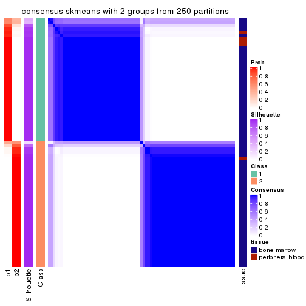</p>

</div>
<div id='tab-SD-skmeans-consensus-heatmap-2'>
<pre><code class="r">consensus_heatmap(res, k = 3)
</code></pre>

<p>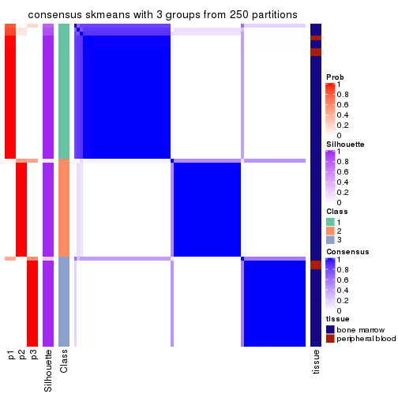</p>

</div>
<div id='tab-SD-skmeans-consensus-heatmap-3'>
<pre><code class="r">consensus_heatmap(res, k = 4)
</code></pre>

<p>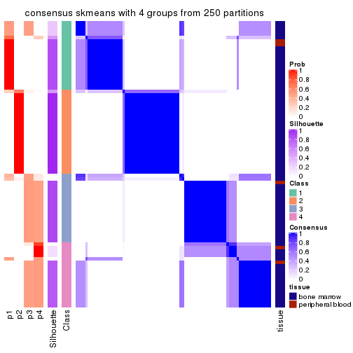</p>

</div>
<div id='tab-SD-skmeans-consensus-heatmap-4'>
<pre><code class="r">consensus_heatmap(res, k = 5)
</code></pre>

<p>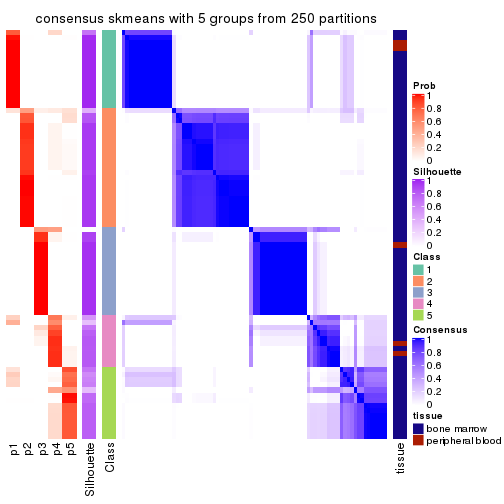</p>

</div>
<div id='tab-SD-skmeans-consensus-heatmap-5'>
<pre><code class="r">consensus_heatmap(res, k = 6)
</code></pre>

<p>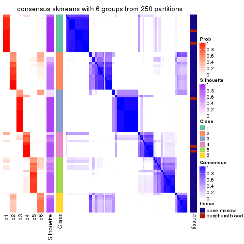</p>

</div>
</div>

Heatmaps for the membership of samples in all partitions to see how consistent they are:


<script>
$( function() {
	$( '#tabs-SD-skmeans-membership-heatmap' ).tabs();
} );
</script>
<div id='tabs-SD-skmeans-membership-heatmap'>
<ul>
<li><a href='#tab-SD-skmeans-membership-heatmap-1'>k = 2</a></li>
<li><a href='#tab-SD-skmeans-membership-heatmap-2'>k = 3</a></li>
<li><a href='#tab-SD-skmeans-membership-heatmap-3'>k = 4</a></li>
<li><a href='#tab-SD-skmeans-membership-heatmap-4'>k = 5</a></li>
<li><a href='#tab-SD-skmeans-membership-heatmap-5'>k = 6</a></li>
</ul>
<div id='tab-SD-skmeans-membership-heatmap-1'>
<pre><code class="r">membership_heatmap(res, k = 2)
</code></pre>

<p>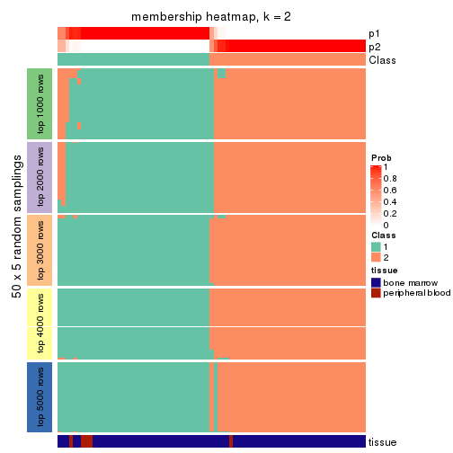</p>

</div>
<div id='tab-SD-skmeans-membership-heatmap-2'>
<pre><code class="r">membership_heatmap(res, k = 3)
</code></pre>

<p>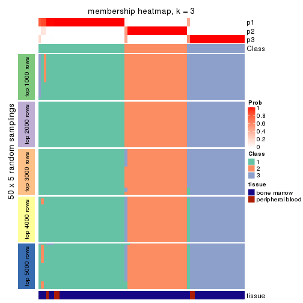</p>

</div>
<div id='tab-SD-skmeans-membership-heatmap-3'>
<pre><code class="r">membership_heatmap(res, k = 4)
</code></pre>

<p>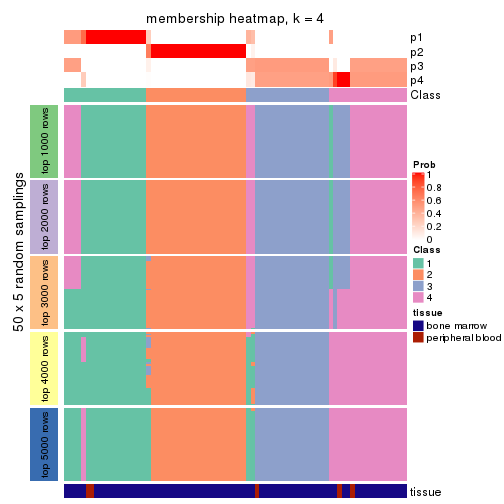</p>

</div>
<div id='tab-SD-skmeans-membership-heatmap-4'>
<pre><code class="r">membership_heatmap(res, k = 5)
</code></pre>

<p>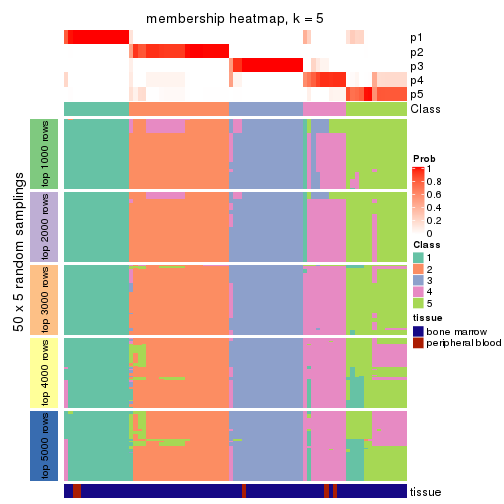</p>

</div>
<div id='tab-SD-skmeans-membership-heatmap-5'>
<pre><code class="r">membership_heatmap(res, k = 6)
</code></pre>

<p>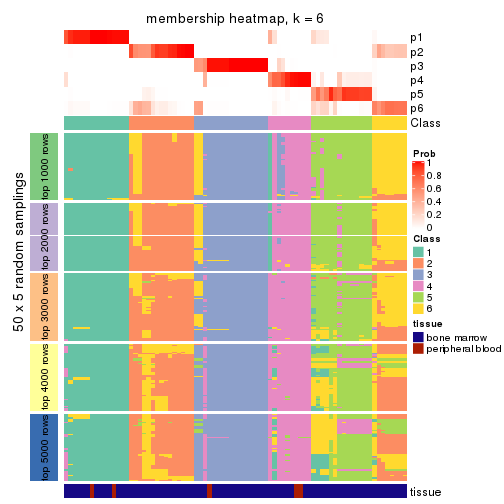</p>

</div>
</div>

As soon as we have had the classes for columns, we can look for signatures
which are significantly different between classes which can be candidate marks
for certain classes. Following are the heatmaps for signatures.


Signature heatmaps where rows are scaled:


<script>
$( function() {
	$( '#tabs-SD-skmeans-get-signatures' ).tabs();
} );
</script>
<div id='tabs-SD-skmeans-get-signatures'>
<ul>
<li><a href='#tab-SD-skmeans-get-signatures-1'>k = 2</a></li>
<li><a href='#tab-SD-skmeans-get-signatures-2'>k = 3</a></li>
<li><a href='#tab-SD-skmeans-get-signatures-3'>k = 4</a></li>
<li><a href='#tab-SD-skmeans-get-signatures-4'>k = 5</a></li>
<li><a href='#tab-SD-skmeans-get-signatures-5'>k = 6</a></li>
</ul>
<div id='tab-SD-skmeans-get-signatures-1'>
<pre><code class="r">get_signatures(res, k = 2)
</code></pre>

<p>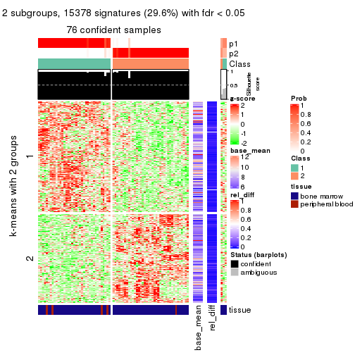</p>

</div>
<div id='tab-SD-skmeans-get-signatures-2'>
<pre><code class="r">get_signatures(res, k = 3)
</code></pre>

<p>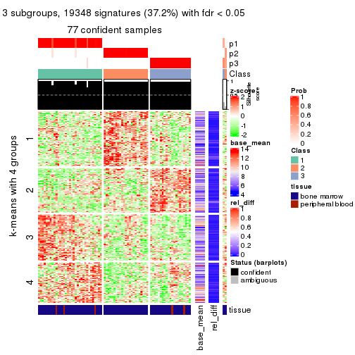</p>

</div>
<div id='tab-SD-skmeans-get-signatures-3'>
<pre><code class="r">get_signatures(res, k = 4)
</code></pre>

<p>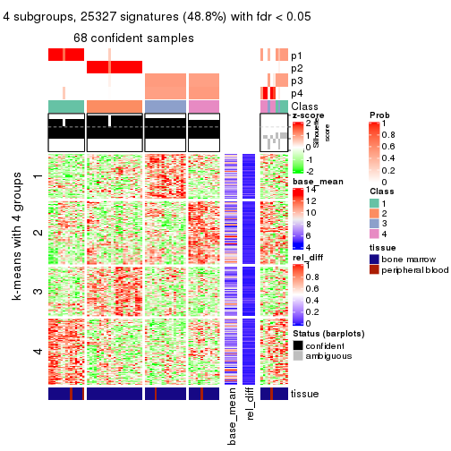</p>

</div>
<div id='tab-SD-skmeans-get-signatures-4'>
<pre><code class="r">get_signatures(res, k = 5)
</code></pre>

<p>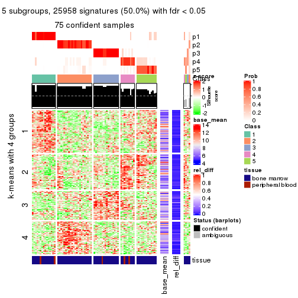</p>

</div>
<div id='tab-SD-skmeans-get-signatures-5'>
<pre><code class="r">get_signatures(res, k = 6)
</code></pre>

<p>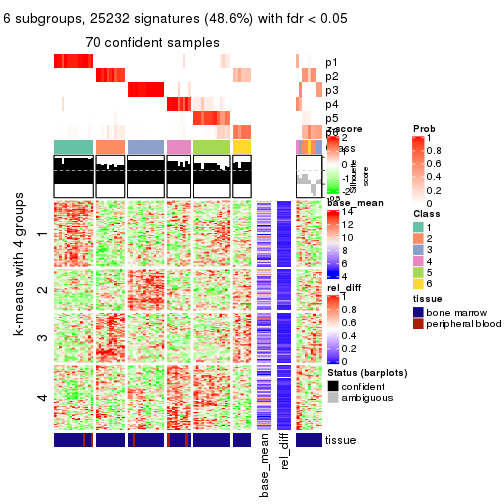</p>

</div>
</div>


Signature heatmaps where rows are not scaled:


<script>
$( function() {
	$( '#tabs-SD-skmeans-get-signatures-no-scale' ).tabs();
} );
</script>
<div id='tabs-SD-skmeans-get-signatures-no-scale'>
<ul>
<li><a href='#tab-SD-skmeans-get-signatures-no-scale-1'>k = 2</a></li>
<li><a href='#tab-SD-skmeans-get-signatures-no-scale-2'>k = 3</a></li>
<li><a href='#tab-SD-skmeans-get-signatures-no-scale-3'>k = 4</a></li>
<li><a href='#tab-SD-skmeans-get-signatures-no-scale-4'>k = 5</a></li>
<li><a href='#tab-SD-skmeans-get-signatures-no-scale-5'>k = 6</a></li>
</ul>
<div id='tab-SD-skmeans-get-signatures-no-scale-1'>
<pre><code class="r">get_signatures(res, k = 2, scale_rows = FALSE)
</code></pre>

<p>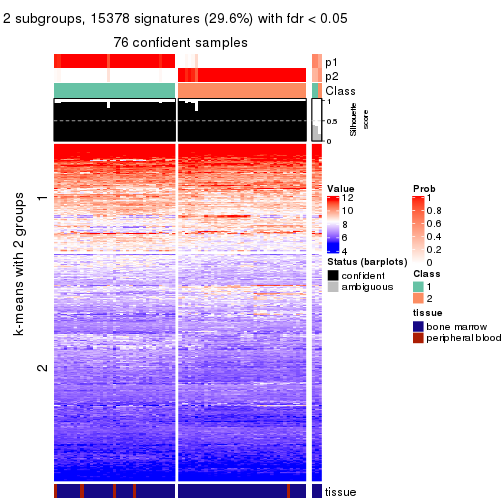</p>

</div>
<div id='tab-SD-skmeans-get-signatures-no-scale-2'>
<pre><code class="r">get_signatures(res, k = 3, scale_rows = FALSE)
</code></pre>

<p>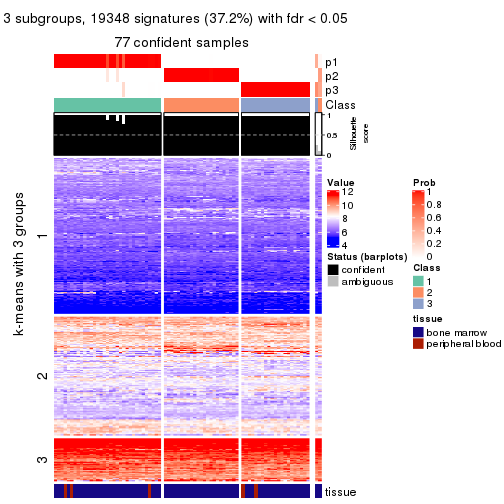</p>

</div>
<div id='tab-SD-skmeans-get-signatures-no-scale-3'>
<pre><code class="r">get_signatures(res, k = 4, scale_rows = FALSE)
</code></pre>

<p>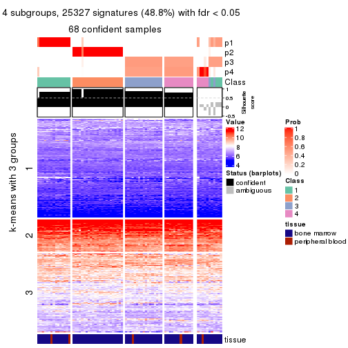</p>

</div>
<div id='tab-SD-skmeans-get-signatures-no-scale-4'>
<pre><code class="r">get_signatures(res, k = 5, scale_rows = FALSE)
</code></pre>

<p>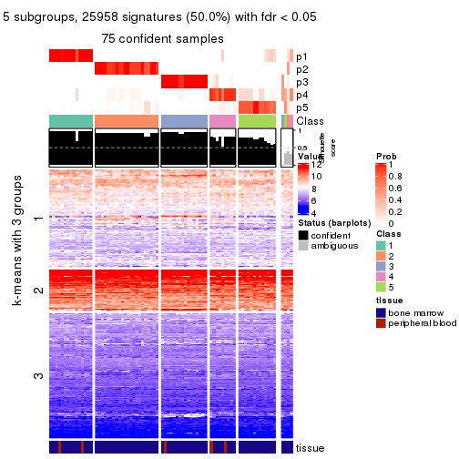</p>

</div>
<div id='tab-SD-skmeans-get-signatures-no-scale-5'>
<pre><code class="r">get_signatures(res, k = 6, scale_rows = FALSE)
</code></pre>

<p>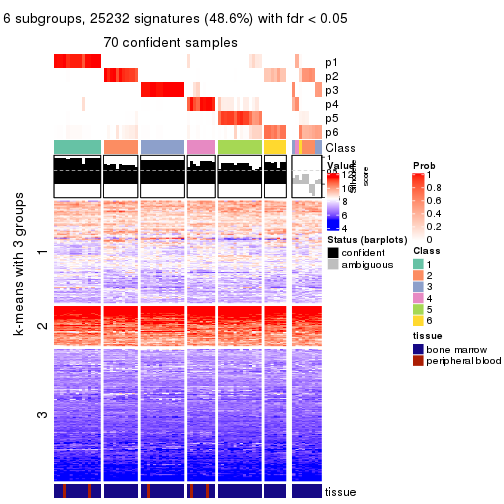</p>

</div>
</div>


Compare the overlap of signatures from different k:

```r
compare_signatures(res)
```

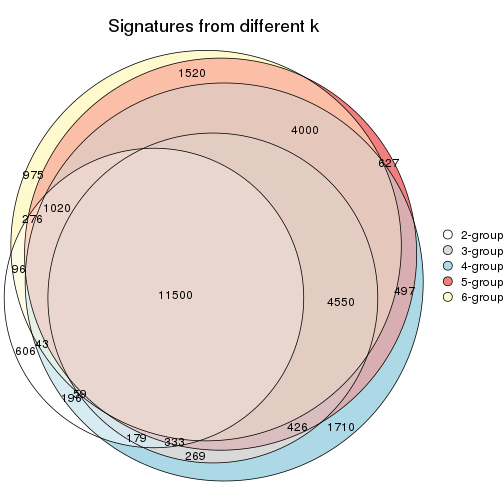

`get_signature()` returns a data frame invisibly. TO get the list of signatures, the function
call should be assigned to a variable explicitly. In following code, if `plot` argument is set
to `FALSE`, no heatmap is plotted while only the differential analysis is performed.

```r
# code only for demonstration
tb = get_signature(res, k = ..., plot = FALSE)
```

An example of the output of `tb` is:

```
#>   which_row         fdr    mean_1    mean_2 scaled_mean_1 scaled_mean_2 km
#> 1        38 0.042760348  8.373488  9.131774    -0.5533452     0.5164555  1
#> 2        40 0.018707592  7.106213  8.469186    -0.6173731     0.5762149  1
#> 3        55 0.019134737 10.221463 11.207825    -0.6159697     0.5749050  1
#> 4        59 0.006059896  5.921854  7.869574    -0.6899429     0.6439467  1
#> 5        60 0.018055526  8.928898 10.211722    -0.6204761     0.5791110  1
#> 6        98 0.009384629 15.714769 14.887706     0.6635654    -0.6193277  2
...
```

The columns in `tb` are:

1. `which_row`: row indices corresponding to the input matrix.
2. `fdr`: FDR for the differential test. 
3. `mean_x`: The mean value in group x.
4. `scaled_mean_x`: The mean value in group x after rows are scaled.
5. `km`: Row groups if k-means clustering is applied to rows.


UMAP plot which shows how samples are separated.


<script>
$( function() {
	$( '#tabs-SD-skmeans-dimension-reduction' ).tabs();
} );
</script>
<div id='tabs-SD-skmeans-dimension-reduction'>
<ul>
<li><a href='#tab-SD-skmeans-dimension-reduction-1'>k = 2</a></li>
<li><a href='#tab-SD-skmeans-dimension-reduction-2'>k = 3</a></li>
<li><a href='#tab-SD-skmeans-dimension-reduction-3'>k = 4</a></li>
<li><a href='#tab-SD-skmeans-dimension-reduction-4'>k = 5</a></li>
<li><a href='#tab-SD-skmeans-dimension-reduction-5'>k = 6</a></li>
</ul>
<div id='tab-SD-skmeans-dimension-reduction-1'>
<pre><code class="r">dimension_reduction(res, k = 2, method = &quot;UMAP&quot;)
</code></pre>

<p>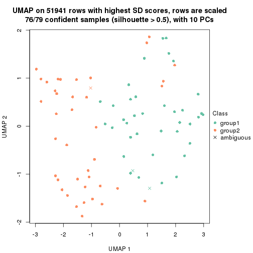</p>

</div>
<div id='tab-SD-skmeans-dimension-reduction-2'>
<pre><code class="r">dimension_reduction(res, k = 3, method = &quot;UMAP&quot;)
</code></pre>

<p>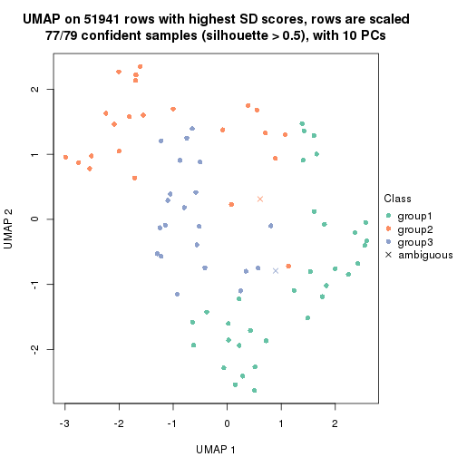</p>

</div>
<div id='tab-SD-skmeans-dimension-reduction-3'>
<pre><code class="r">dimension_reduction(res, k = 4, method = &quot;UMAP&quot;)
</code></pre>

<p>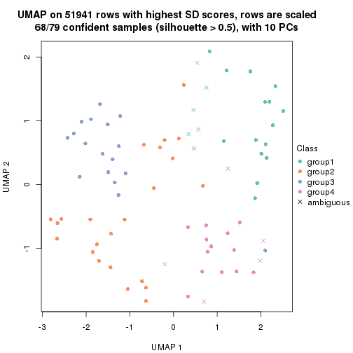</p>

</div>
<div id='tab-SD-skmeans-dimension-reduction-4'>
<pre><code class="r">dimension_reduction(res, k = 5, method = &quot;UMAP&quot;)
</code></pre>

<p>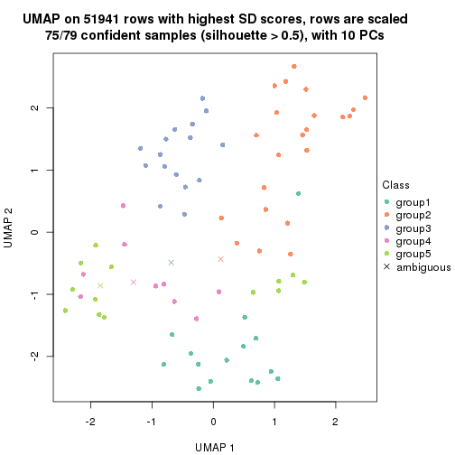</p>

</div>
<div id='tab-SD-skmeans-dimension-reduction-5'>
<pre><code class="r">dimension_reduction(res, k = 6, method = &quot;UMAP&quot;)
</code></pre>

<p>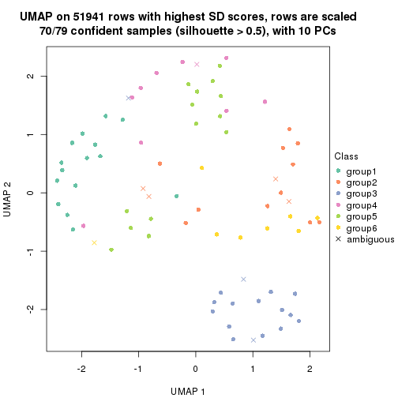</p>

</div>
</div>


Following heatmap shows how subgroups are split when increasing `k`:

```r
collect_classes(res)
```

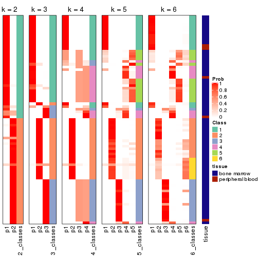


Test correlation between subgroups and known annotations. If the known
annotation is numeric, one-way ANOVA test is applied, and if the known
annotation is discrete, chi-squared contingency table test is applied.

```r
test_to_known_factors(res)
```

```
#>             n tissue(p) k
#> SD:skmeans 76     0.324 2
#> SD:skmeans 77     0.320 3
#> SD:skmeans 68     0.389 4
#> SD:skmeans 75     0.132 5
#> SD:skmeans 70     0.268 6
```


If matrix rows can be associated to genes, consider to use `GO_Enrichment(res,
...)` to perform function enrichment for the signature genes.


 

---------------------------------------------------


### SD:pam*


The object with results only for a single top-value method and a single partition method 
can be extracted as:

```r
res = res_list["SD", "pam"]
# you can also extract it by
# res = res_list["SD:pam"]
```

A summary of `res` and all the functions that can be applied to it:

```r
res
```

```
#> A 'ConsensusPartition' object with k = 2, 3, 4, 5, 6.
#>   On a matrix with 51941 rows and 79 columns.
#>   Top rows (1000, 2000, 3000, 4000, 5000) are extracted by 'SD' method.
#>   Subgroups are detected by 'pam' method.
#>   Performed in total 1250 partitions by row resampling.
#>   Best k for subgroups seems to be 3.
#> 
#> Following methods can be applied to this 'ConsensusPartition' object:
#>  [1] "cola_report"             "collect_classes"         "collect_plots"          
#>  [4] "collect_stats"           "colnames"                "compare_signatures"     
#>  [7] "consensus_heatmap"       "dimension_reduction"     "functional_enrichment"  
#> [10] "get_anno_col"            "get_anno"                "get_classes"            
#> [13] "get_consensus"           "get_matrix"              "get_membership"         
#> [16] "get_param"               "get_signatures"          "get_stats"              
#> [19] "is_best_k"               "is_stable_k"             "membership_heatmap"     
#> [22] "ncol"                    "nrow"                    "plot_ecdf"              
#> [25] "rownames"                "select_partition_number" "show"                   
#> [28] "suggest_best_k"          "test_to_known_factors"
```

`collect_plots()` function collects all the plots made from `res` for all `k` (number of partitions)
into one single page to provide an easy and fast comparison between different `k`.

```r
collect_plots(res)
```

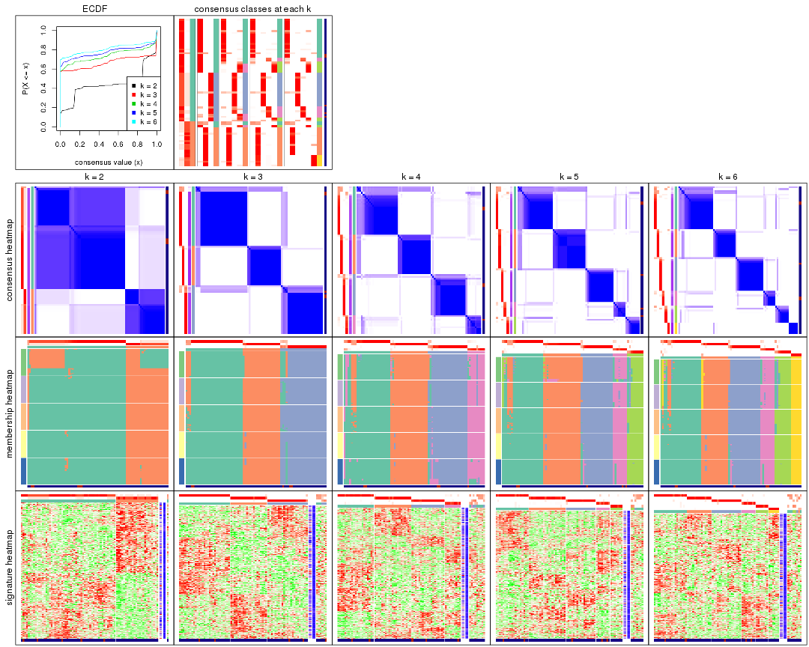

The plots are:

- The first row: a plot of the ECDF (Empirical cumulative distribution
  function) curves of the consensus matrix for each `k` and the heatmap of
  predicted classes for each `k`.
- The second row: heatmaps of the consensus matrix for each `k`.
- The third row: heatmaps of the membership matrix for each `k`.
- The fouth row: heatmaps of the signatures for each `k`.

All the plots in panels can be made by individual functions and they are
plotted later in this section.

`select_partition_number()` produces several plots showing different
statistics for choosing "optimized" `k`. There are following statistics:

- ECDF curves of the consensus matrix for each `k`;
- 1-PAC. [The PAC
  score](https://en.wikipedia.org/wiki/Consensus_clustering#Over-interpretation_potential_of_consensus_clustering)
  measures the proportion of the ambiguous subgrouping.
- Mean silhouette score.
- Concordance. The mean probability of fiting the consensus class ids in all
  partitions.
- Area increased. Denote $A_k$ as the area under the ECDF curve for current
  `k`, the area increased is defined as $A_k - A_{k-1}$.
- Rand index. The percent of pairs of samples that are both in a same cluster
  or both are not in a same cluster in the partition of k and k-1.
- Jaccard index. The ratio of pairs of samples are both in a same cluster in
  the partition of k and k-1 and the pairs of samples are both in a same
  cluster in the partition k or k-1.

The detailed explanations of these statistics can be found in [the cola
vignette](http://bioconductor.org/packages/devel/bioc/vignettes/cola/inst/doc/cola.html#toc_13).

Generally speaking, lower PAC score, higher mean silhouette score or higher
concordance corresponds to better partition. Rand index and Jaccard index
measure how similar the current partition is compared to partition with `k-1`.
If they are too similar, we won't accept `k` is better than `k-1`.

```r
select_partition_number(res)
```

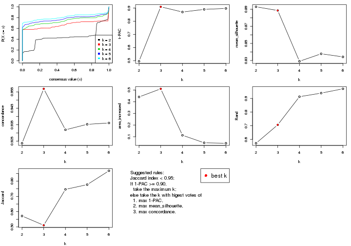

The numeric values for all these statistics can be obtained by `get_stats()`.

```r
get_stats(res)
```

```
#>   k 1-PAC mean_silhouette concordance area_increased  Rand Jaccard
#> 2 2 0.495           0.893       0.924         0.4408 0.572   0.572
#> 3 3 0.910           0.889       0.957         0.5105 0.707   0.511
#> 4 4 0.870           0.829       0.932         0.1125 0.913   0.746
#> 5 5 0.890           0.838       0.935         0.0479 0.939   0.777
#> 6 6 0.897           0.834       0.936         0.0439 0.971   0.868
```

`suggest_best_k()` suggests the best $k$ based on these statistics. The rules are as follows:

- All $k$ with Jaccard index larger than 0.95 are removed because the increase of
  the partition number does not provides enough extra information. If all $k$ are removed,
  the best $k$ is assigned by `NA`.
- For $k$ with 1-PAC larger than 0.9, the maximal $k$ is taken as the "best k". Other $k$ is called "optional k".
- If it does not fit the second rule. The $k$ with the highest vote of highest
  1-PAC, mean silhouette and concordance is taken as the "best k".

```r
suggest_best_k(res)
```

```
#> [1] 3
```


Following shows the table of the partitions (You need to click the **show/hide
code output** link to see it). The membership matrix (columns with name `p*`)
is inferred by
[`clue::cl_consensus()`](https://www.rdocumentation.org/link/cl_consensus?package=clue)
function with the `SE` method. Basically the value in the membership matrix
represents the probability to belong to a certain group. The finall class
label for an item is determined with the group with highest probability it
belongs to.

In `get_classes()` function, the entropy is calculated from the membership
matrix and the silhouette score is calculated from the consensus matrix.


<script>
$( function() {
	$( '#tabs-SD-pam-get-classes' ).tabs();
} );
</script>
<div id='tabs-SD-pam-get-classes'>
<ul>
<li><a href='#tab-SD-pam-get-classes-1'>k = 2</a></li>
<li><a href='#tab-SD-pam-get-classes-2'>k = 3</a></li>
<li><a href='#tab-SD-pam-get-classes-3'>k = 4</a></li>
<li><a href='#tab-SD-pam-get-classes-4'>k = 5</a></li>
<li><a href='#tab-SD-pam-get-classes-5'>k = 6</a></li>
</ul>

<div id='tab-SD-pam-get-classes-1'>
<p><a id='tab-SD-pam-get-classes-1-a' style='color:#0366d6' href='#'>show/hide code output</a></p>
<pre><code class="r">cbind(get_classes(res, k = 2), get_membership(res, k = 2))
</code></pre>

<pre><code>#&gt;           class entropy silhouette    p1    p2
#&gt; GSM316652     1  0.5946      0.881 0.856 0.144
#&gt; GSM316653     1  0.0000      0.922 1.000 0.000
#&gt; GSM316654     1  0.0000      0.922 1.000 0.000
#&gt; GSM316655     1  0.3274      0.876 0.940 0.060
#&gt; GSM316656     1  0.4939      0.836 0.892 0.108
#&gt; GSM316657     1  0.0000      0.922 1.000 0.000
#&gt; GSM316658     2  0.5946      0.935 0.144 0.856
#&gt; GSM316659     2  0.5629      0.933 0.132 0.868
#&gt; GSM316660     1  0.0000      0.922 1.000 0.000
#&gt; GSM316661     1  0.0672      0.920 0.992 0.008
#&gt; GSM316662     1  0.5946      0.881 0.856 0.144
#&gt; GSM316663     1  0.5946      0.881 0.856 0.144
#&gt; GSM316664     1  0.0000      0.922 1.000 0.000
#&gt; GSM316665     2  0.0000      0.882 0.000 1.000
#&gt; GSM316666     1  0.5946      0.881 0.856 0.144
#&gt; GSM316667     2  0.5946      0.935 0.144 0.856
#&gt; GSM316668     1  0.5946      0.881 0.856 0.144
#&gt; GSM316669     1  0.0000      0.922 1.000 0.000
#&gt; GSM316670     2  0.0000      0.882 0.000 1.000
#&gt; GSM316671     1  0.5946      0.881 0.856 0.144
#&gt; GSM316672     1  0.0000      0.922 1.000 0.000
#&gt; GSM316673     1  0.0000      0.922 1.000 0.000
#&gt; GSM316674     1  0.5946      0.881 0.856 0.144
#&gt; GSM316676     1  0.5946      0.881 0.856 0.144
#&gt; GSM316677     1  0.0000      0.922 1.000 0.000
#&gt; GSM316678     2  0.5946      0.935 0.144 0.856
#&gt; GSM316679     1  0.0000      0.922 1.000 0.000
#&gt; GSM316680     1  0.2043      0.901 0.968 0.032
#&gt; GSM316681     1  0.5946      0.881 0.856 0.144
#&gt; GSM316682     1  0.1184      0.912 0.984 0.016
#&gt; GSM316683     1  0.0000      0.922 1.000 0.000
#&gt; GSM316684     2  0.5946      0.935 0.144 0.856
#&gt; GSM316685     2  0.0000      0.882 0.000 1.000
#&gt; GSM316686     1  0.0000      0.922 1.000 0.000
#&gt; GSM316687     1  0.5946      0.881 0.856 0.144
#&gt; GSM316688     1  0.5946      0.880 0.856 0.144
#&gt; GSM316689     1  0.0000      0.922 1.000 0.000
#&gt; GSM316690     1  0.5946      0.881 0.856 0.144
#&gt; GSM316691     2  0.0000      0.882 0.000 1.000
#&gt; GSM316692     1  0.5946      0.881 0.856 0.144
#&gt; GSM316693     1  0.0000      0.922 1.000 0.000
#&gt; GSM316694     1  0.5946      0.881 0.856 0.144
#&gt; GSM316696     1  0.0000      0.922 1.000 0.000
#&gt; GSM316697     1  0.5946      0.881 0.856 0.144
#&gt; GSM316698     2  0.5946      0.935 0.144 0.856
#&gt; GSM316699     2  0.0000      0.882 0.000 1.000
#&gt; GSM316700     1  0.0000      0.922 1.000 0.000
#&gt; GSM316701     1  0.0000      0.922 1.000 0.000
#&gt; GSM316703     2  0.7674      0.853 0.224 0.776
#&gt; GSM316704     2  0.5946      0.935 0.144 0.856
#&gt; GSM316705     1  0.0000      0.922 1.000 0.000
#&gt; GSM316706     2  0.5946      0.935 0.144 0.856
#&gt; GSM316707     2  0.5629      0.933 0.132 0.868
#&gt; GSM316708     2  0.5946      0.935 0.144 0.856
#&gt; GSM316709     1  0.5946      0.881 0.856 0.144
#&gt; GSM316710     1  0.0672      0.920 0.992 0.008
#&gt; GSM316711     2  0.5946      0.935 0.144 0.856
#&gt; GSM316713     1  0.0000      0.922 1.000 0.000
#&gt; GSM316714     1  0.5946      0.881 0.856 0.144
#&gt; GSM316715     1  0.0000      0.922 1.000 0.000
#&gt; GSM316716     2  0.0000      0.882 0.000 1.000
#&gt; GSM316717     1  0.0000      0.922 1.000 0.000
#&gt; GSM316718     2  0.5946      0.935 0.144 0.856
#&gt; GSM316719     1  0.0000      0.922 1.000 0.000
#&gt; GSM316720     1  0.0000      0.922 1.000 0.000
#&gt; GSM316721     2  0.0000      0.882 0.000 1.000
#&gt; GSM316722     1  0.4562      0.838 0.904 0.096
#&gt; GSM316723     2  0.5842      0.935 0.140 0.860
#&gt; GSM316724     2  0.5946      0.935 0.144 0.856
#&gt; GSM316726     2  0.0672      0.886 0.008 0.992
#&gt; GSM316727     1  0.0000      0.922 1.000 0.000
#&gt; GSM316728     1  0.5946      0.881 0.856 0.144
#&gt; GSM316729     2  0.5946      0.935 0.144 0.856
#&gt; GSM316730     1  0.9944     -0.106 0.544 0.456
#&gt; GSM316675     1  0.5946      0.881 0.856 0.144
#&gt; GSM316695     1  0.0000      0.922 1.000 0.000
#&gt; GSM316702     1  0.5946      0.881 0.856 0.144
#&gt; GSM316712     1  0.0000      0.922 1.000 0.000
#&gt; GSM316725     1  0.0000      0.922 1.000 0.000
</code></pre>

<script>
$('#tab-SD-pam-get-classes-1-a').parent().next().next().hide();
$('#tab-SD-pam-get-classes-1-a').click(function(){
  $('#tab-SD-pam-get-classes-1-a').parent().next().next().toggle();
  return(false);
});
</script>
</div>

<div id='tab-SD-pam-get-classes-2'>
<p><a id='tab-SD-pam-get-classes-2-a' style='color:#0366d6' href='#'>show/hide code output</a></p>
<pre><code class="r">cbind(get_classes(res, k = 3), get_membership(res, k = 3))
</code></pre>

<pre><code>#&gt;           class entropy silhouette    p1    p2    p3
#&gt; GSM316652     3  0.0000     0.9287 0.000 0.000 1.000
#&gt; GSM316653     1  0.0000     0.9507 1.000 0.000 0.000
#&gt; GSM316654     3  0.6026     0.4526 0.376 0.000 0.624
#&gt; GSM316655     1  0.0000     0.9507 1.000 0.000 0.000
#&gt; GSM316656     3  0.0000     0.9287 0.000 0.000 1.000
#&gt; GSM316657     1  0.0000     0.9507 1.000 0.000 0.000
#&gt; GSM316658     2  0.0000     0.9829 0.000 1.000 0.000
#&gt; GSM316659     2  0.0000     0.9829 0.000 1.000 0.000
#&gt; GSM316660     1  0.0000     0.9507 1.000 0.000 0.000
#&gt; GSM316661     3  0.0000     0.9287 0.000 0.000 1.000
#&gt; GSM316662     3  0.0000     0.9287 0.000 0.000 1.000
#&gt; GSM316663     3  0.0000     0.9287 0.000 0.000 1.000
#&gt; GSM316664     1  0.0000     0.9507 1.000 0.000 0.000
#&gt; GSM316665     2  0.0000     0.9829 0.000 1.000 0.000
#&gt; GSM316666     3  0.0000     0.9287 0.000 0.000 1.000
#&gt; GSM316667     2  0.0000     0.9829 0.000 1.000 0.000
#&gt; GSM316668     3  0.0000     0.9287 0.000 0.000 1.000
#&gt; GSM316669     1  0.0000     0.9507 1.000 0.000 0.000
#&gt; GSM316670     2  0.3551     0.8383 0.000 0.868 0.132
#&gt; GSM316671     3  0.0000     0.9287 0.000 0.000 1.000
#&gt; GSM316672     1  0.0000     0.9507 1.000 0.000 0.000
#&gt; GSM316673     1  0.0000     0.9507 1.000 0.000 0.000
#&gt; GSM316674     3  0.0000     0.9287 0.000 0.000 1.000
#&gt; GSM316676     3  0.0000     0.9287 0.000 0.000 1.000
#&gt; GSM316677     1  0.0000     0.9507 1.000 0.000 0.000
#&gt; GSM316678     2  0.0000     0.9829 0.000 1.000 0.000
#&gt; GSM316679     1  0.0000     0.9507 1.000 0.000 0.000
#&gt; GSM316680     1  0.0000     0.9507 1.000 0.000 0.000
#&gt; GSM316681     3  0.0000     0.9287 0.000 0.000 1.000
#&gt; GSM316682     1  0.0000     0.9507 1.000 0.000 0.000
#&gt; GSM316683     1  0.0000     0.9507 1.000 0.000 0.000
#&gt; GSM316684     2  0.0000     0.9829 0.000 1.000 0.000
#&gt; GSM316685     2  0.0000     0.9829 0.000 1.000 0.000
#&gt; GSM316686     1  0.0000     0.9507 1.000 0.000 0.000
#&gt; GSM316687     3  0.0000     0.9287 0.000 0.000 1.000
#&gt; GSM316688     3  0.9606     0.1944 0.340 0.212 0.448
#&gt; GSM316689     1  0.0000     0.9507 1.000 0.000 0.000
#&gt; GSM316690     3  0.0000     0.9287 0.000 0.000 1.000
#&gt; GSM316691     2  0.0000     0.9829 0.000 1.000 0.000
#&gt; GSM316692     3  0.0000     0.9287 0.000 0.000 1.000
#&gt; GSM316693     3  0.5733     0.5524 0.324 0.000 0.676
#&gt; GSM316694     3  0.0000     0.9287 0.000 0.000 1.000
#&gt; GSM316696     1  0.0000     0.9507 1.000 0.000 0.000
#&gt; GSM316697     3  0.0000     0.9287 0.000 0.000 1.000
#&gt; GSM316698     2  0.0000     0.9829 0.000 1.000 0.000
#&gt; GSM316699     2  0.0000     0.9829 0.000 1.000 0.000
#&gt; GSM316700     1  0.0000     0.9507 1.000 0.000 0.000
#&gt; GSM316701     1  0.0000     0.9507 1.000 0.000 0.000
#&gt; GSM316703     2  0.0000     0.9829 0.000 1.000 0.000
#&gt; GSM316704     2  0.0000     0.9829 0.000 1.000 0.000
#&gt; GSM316705     1  0.0000     0.9507 1.000 0.000 0.000
#&gt; GSM316706     2  0.4235     0.7619 0.176 0.824 0.000
#&gt; GSM316707     2  0.0000     0.9829 0.000 1.000 0.000
#&gt; GSM316708     1  0.6252     0.2241 0.556 0.444 0.000
#&gt; GSM316709     3  0.0000     0.9287 0.000 0.000 1.000
#&gt; GSM316710     3  0.0237     0.9257 0.004 0.000 0.996
#&gt; GSM316711     2  0.0000     0.9829 0.000 1.000 0.000
#&gt; GSM316713     1  0.0000     0.9507 1.000 0.000 0.000
#&gt; GSM316714     3  0.0000     0.9287 0.000 0.000 1.000
#&gt; GSM316715     1  0.0000     0.9507 1.000 0.000 0.000
#&gt; GSM316716     2  0.0000     0.9829 0.000 1.000 0.000
#&gt; GSM316717     1  0.0000     0.9507 1.000 0.000 0.000
#&gt; GSM316718     1  0.6308     0.0699 0.508 0.492 0.000
#&gt; GSM316719     1  0.0000     0.9507 1.000 0.000 0.000
#&gt; GSM316720     1  0.0000     0.9507 1.000 0.000 0.000
#&gt; GSM316721     2  0.0000     0.9829 0.000 1.000 0.000
#&gt; GSM316722     1  0.0000     0.9507 1.000 0.000 0.000
#&gt; GSM316723     2  0.0000     0.9829 0.000 1.000 0.000
#&gt; GSM316724     2  0.0000     0.9829 0.000 1.000 0.000
#&gt; GSM316726     2  0.0000     0.9829 0.000 1.000 0.000
#&gt; GSM316727     1  0.0000     0.9507 1.000 0.000 0.000
#&gt; GSM316728     3  0.0000     0.9287 0.000 0.000 1.000
#&gt; GSM316729     1  0.0000     0.9507 1.000 0.000 0.000
#&gt; GSM316730     1  0.6308     0.0692 0.508 0.492 0.000
#&gt; GSM316675     3  0.0000     0.9287 0.000 0.000 1.000
#&gt; GSM316695     1  0.0000     0.9507 1.000 0.000 0.000
#&gt; GSM316702     3  0.0000     0.9287 0.000 0.000 1.000
#&gt; GSM316712     1  0.0000     0.9507 1.000 0.000 0.000
#&gt; GSM316725     3  0.6180     0.3596 0.416 0.000 0.584
</code></pre>

<script>
$('#tab-SD-pam-get-classes-2-a').parent().next().next().hide();
$('#tab-SD-pam-get-classes-2-a').click(function(){
  $('#tab-SD-pam-get-classes-2-a').parent().next().next().toggle();
  return(false);
});
</script>
</div>

<div id='tab-SD-pam-get-classes-3'>
<p><a id='tab-SD-pam-get-classes-3-a' style='color:#0366d6' href='#'>show/hide code output</a></p>
<pre><code class="r">cbind(get_classes(res, k = 4), get_membership(res, k = 4))
</code></pre>

<pre><code>#&gt;           class entropy silhouette    p1    p2    p3    p4
#&gt; GSM316652     3  0.0000     0.9201 0.000 0.000 1.000 0.000
#&gt; GSM316653     1  0.4992    -0.0567 0.524 0.000 0.000 0.476
#&gt; GSM316654     3  0.6310     0.3669 0.352 0.000 0.576 0.072
#&gt; GSM316655     1  0.0817     0.8611 0.976 0.000 0.000 0.024
#&gt; GSM316656     4  0.1792     0.8647 0.000 0.000 0.068 0.932
#&gt; GSM316657     1  0.0000     0.8768 1.000 0.000 0.000 0.000
#&gt; GSM316658     2  0.0000     0.9762 0.000 1.000 0.000 0.000
#&gt; GSM316659     2  0.0000     0.9762 0.000 1.000 0.000 0.000
#&gt; GSM316660     1  0.0000     0.8768 1.000 0.000 0.000 0.000
#&gt; GSM316661     4  0.4907     0.2578 0.000 0.000 0.420 0.580
#&gt; GSM316662     3  0.0000     0.9201 0.000 0.000 1.000 0.000
#&gt; GSM316663     3  0.1792     0.8750 0.000 0.000 0.932 0.068
#&gt; GSM316664     1  0.1792     0.8270 0.932 0.000 0.000 0.068
#&gt; GSM316665     2  0.0000     0.9762 0.000 1.000 0.000 0.000
#&gt; GSM316666     3  0.0000     0.9201 0.000 0.000 1.000 0.000
#&gt; GSM316667     2  0.0000     0.9762 0.000 1.000 0.000 0.000
#&gt; GSM316668     3  0.0000     0.9201 0.000 0.000 1.000 0.000
#&gt; GSM316669     4  0.2704     0.8404 0.124 0.000 0.000 0.876
#&gt; GSM316670     2  0.2814     0.8300 0.000 0.868 0.132 0.000
#&gt; GSM316671     3  0.0000     0.9201 0.000 0.000 1.000 0.000
#&gt; GSM316672     1  0.0000     0.8768 1.000 0.000 0.000 0.000
#&gt; GSM316673     1  0.0000     0.8768 1.000 0.000 0.000 0.000
#&gt; GSM316674     3  0.0000     0.9201 0.000 0.000 1.000 0.000
#&gt; GSM316676     3  0.0000     0.9201 0.000 0.000 1.000 0.000
#&gt; GSM316677     1  0.0469     0.8698 0.988 0.000 0.000 0.012
#&gt; GSM316678     2  0.0000     0.9762 0.000 1.000 0.000 0.000
#&gt; GSM316679     1  0.0000     0.8768 1.000 0.000 0.000 0.000
#&gt; GSM316680     1  0.4855     0.3411 0.600 0.000 0.000 0.400
#&gt; GSM316681     3  0.0000     0.9201 0.000 0.000 1.000 0.000
#&gt; GSM316682     4  0.0000     0.8903 0.000 0.000 0.000 1.000
#&gt; GSM316683     4  0.0000     0.8903 0.000 0.000 0.000 1.000
#&gt; GSM316684     2  0.0000     0.9762 0.000 1.000 0.000 0.000
#&gt; GSM316685     2  0.0000     0.9762 0.000 1.000 0.000 0.000
#&gt; GSM316686     1  0.1211     0.8474 0.960 0.000 0.040 0.000
#&gt; GSM316687     3  0.0000     0.9201 0.000 0.000 1.000 0.000
#&gt; GSM316688     3  0.8239     0.1736 0.316 0.212 0.448 0.024
#&gt; GSM316689     1  0.0000     0.8768 1.000 0.000 0.000 0.000
#&gt; GSM316690     3  0.0000     0.9201 0.000 0.000 1.000 0.000
#&gt; GSM316691     2  0.0000     0.9762 0.000 1.000 0.000 0.000
#&gt; GSM316692     3  0.0000     0.9201 0.000 0.000 1.000 0.000
#&gt; GSM316693     4  0.0000     0.8903 0.000 0.000 0.000 1.000
#&gt; GSM316694     3  0.0000     0.9201 0.000 0.000 1.000 0.000
#&gt; GSM316696     1  0.0000     0.8768 1.000 0.000 0.000 0.000
#&gt; GSM316697     3  0.0000     0.9201 0.000 0.000 1.000 0.000
#&gt; GSM316698     2  0.0000     0.9762 0.000 1.000 0.000 0.000
#&gt; GSM316699     2  0.0000     0.9762 0.000 1.000 0.000 0.000
#&gt; GSM316700     4  0.1302     0.8906 0.044 0.000 0.000 0.956
#&gt; GSM316701     4  0.1302     0.8906 0.044 0.000 0.000 0.956
#&gt; GSM316703     2  0.0000     0.9762 0.000 1.000 0.000 0.000
#&gt; GSM316704     2  0.0000     0.9762 0.000 1.000 0.000 0.000
#&gt; GSM316705     1  0.0000     0.8768 1.000 0.000 0.000 0.000
#&gt; GSM316706     2  0.2973     0.7995 0.144 0.856 0.000 0.000
#&gt; GSM316707     2  0.0000     0.9762 0.000 1.000 0.000 0.000
#&gt; GSM316708     1  0.4955     0.2595 0.556 0.444 0.000 0.000
#&gt; GSM316709     3  0.0000     0.9201 0.000 0.000 1.000 0.000
#&gt; GSM316710     3  0.4781     0.4656 0.004 0.000 0.660 0.336
#&gt; GSM316711     2  0.0000     0.9762 0.000 1.000 0.000 0.000
#&gt; GSM316713     1  0.0000     0.8768 1.000 0.000 0.000 0.000
#&gt; GSM316714     3  0.0000     0.9201 0.000 0.000 1.000 0.000
#&gt; GSM316715     1  0.0000     0.8768 1.000 0.000 0.000 0.000
#&gt; GSM316716     2  0.0000     0.9762 0.000 1.000 0.000 0.000
#&gt; GSM316717     1  0.0707     0.8663 0.980 0.000 0.000 0.020
#&gt; GSM316718     1  0.4999     0.1144 0.508 0.492 0.000 0.000
#&gt; GSM316719     1  0.0000     0.8768 1.000 0.000 0.000 0.000
#&gt; GSM316720     1  0.0000     0.8768 1.000 0.000 0.000 0.000
#&gt; GSM316721     2  0.0000     0.9762 0.000 1.000 0.000 0.000
#&gt; GSM316722     1  0.2345     0.8028 0.900 0.000 0.000 0.100
#&gt; GSM316723     2  0.0000     0.9762 0.000 1.000 0.000 0.000
#&gt; GSM316724     2  0.2814     0.8402 0.000 0.868 0.000 0.132
#&gt; GSM316726     2  0.0000     0.9762 0.000 1.000 0.000 0.000
#&gt; GSM316727     1  0.0000     0.8768 1.000 0.000 0.000 0.000
#&gt; GSM316728     3  0.1302     0.8918 0.000 0.000 0.956 0.044
#&gt; GSM316729     4  0.1792     0.8768 0.068 0.000 0.000 0.932
#&gt; GSM316730     1  0.4999     0.1127 0.508 0.492 0.000 0.000
#&gt; GSM316675     3  0.0000     0.9201 0.000 0.000 1.000 0.000
#&gt; GSM316695     1  0.0000     0.8768 1.000 0.000 0.000 0.000
#&gt; GSM316702     3  0.1792     0.8750 0.000 0.000 0.932 0.068
#&gt; GSM316712     1  0.0000     0.8768 1.000 0.000 0.000 0.000
#&gt; GSM316725     4  0.2921     0.8004 0.140 0.000 0.000 0.860
</code></pre>

<script>
$('#tab-SD-pam-get-classes-3-a').parent().next().next().hide();
$('#tab-SD-pam-get-classes-3-a').click(function(){
  $('#tab-SD-pam-get-classes-3-a').parent().next().next().toggle();
  return(false);
});
</script>
</div>

<div id='tab-SD-pam-get-classes-4'>
<p><a id='tab-SD-pam-get-classes-4-a' style='color:#0366d6' href='#'>show/hide code output</a></p>
<pre><code class="r">cbind(get_classes(res, k = 5), get_membership(res, k = 5))
</code></pre>

<pre><code>#&gt;           class entropy silhouette    p1    p2    p3    p4    p5
#&gt; GSM316652     3  0.0000      0.947 0.000 0.000 1.000 0.000 0.000
#&gt; GSM316653     5  0.4302      0.164 0.480 0.000 0.000 0.000 0.520
#&gt; GSM316654     4  0.0703      0.876 0.024 0.000 0.000 0.976 0.000
#&gt; GSM316655     1  0.0609      0.865 0.980 0.020 0.000 0.000 0.000
#&gt; GSM316656     5  0.0404      0.827 0.000 0.000 0.012 0.000 0.988
#&gt; GSM316657     1  0.0000      0.878 1.000 0.000 0.000 0.000 0.000
#&gt; GSM316658     2  0.0000      0.975 0.000 1.000 0.000 0.000 0.000
#&gt; GSM316659     2  0.0000      0.975 0.000 1.000 0.000 0.000 0.000
#&gt; GSM316660     1  0.0000      0.878 1.000 0.000 0.000 0.000 0.000
#&gt; GSM316661     5  0.4505      0.321 0.000 0.000 0.384 0.012 0.604
#&gt; GSM316662     3  0.0000      0.947 0.000 0.000 1.000 0.000 0.000
#&gt; GSM316663     3  0.3242      0.695 0.000 0.000 0.784 0.216 0.000
#&gt; GSM316664     4  0.3424      0.679 0.240 0.000 0.000 0.760 0.000
#&gt; GSM316665     2  0.0703      0.968 0.000 0.976 0.000 0.024 0.000
#&gt; GSM316666     3  0.0000      0.947 0.000 0.000 1.000 0.000 0.000
#&gt; GSM316667     2  0.0000      0.975 0.000 1.000 0.000 0.000 0.000
#&gt; GSM316668     3  0.0000      0.947 0.000 0.000 1.000 0.000 0.000
#&gt; GSM316669     5  0.1851      0.766 0.088 0.000 0.000 0.000 0.912
#&gt; GSM316670     2  0.2424      0.832 0.000 0.868 0.132 0.000 0.000
#&gt; GSM316671     3  0.0000      0.947 0.000 0.000 1.000 0.000 0.000
#&gt; GSM316672     1  0.0000      0.878 1.000 0.000 0.000 0.000 0.000
#&gt; GSM316673     1  0.0000      0.878 1.000 0.000 0.000 0.000 0.000
#&gt; GSM316674     3  0.0000      0.947 0.000 0.000 1.000 0.000 0.000
#&gt; GSM316676     3  0.0000      0.947 0.000 0.000 1.000 0.000 0.000
#&gt; GSM316677     4  0.3039      0.714 0.192 0.000 0.000 0.808 0.000
#&gt; GSM316678     2  0.0404      0.972 0.000 0.988 0.000 0.012 0.000
#&gt; GSM316679     1  0.0000      0.878 1.000 0.000 0.000 0.000 0.000
#&gt; GSM316680     1  0.4182      0.353 0.600 0.000 0.000 0.000 0.400
#&gt; GSM316681     3  0.0000      0.947 0.000 0.000 1.000 0.000 0.000
#&gt; GSM316682     5  0.0000      0.835 0.000 0.000 0.000 0.000 1.000
#&gt; GSM316683     5  0.0000      0.835 0.000 0.000 0.000 0.000 1.000
#&gt; GSM316684     2  0.0703      0.968 0.000 0.976 0.000 0.024 0.000
#&gt; GSM316685     2  0.0000      0.975 0.000 1.000 0.000 0.000 0.000
#&gt; GSM316686     1  0.2074      0.785 0.896 0.000 0.104 0.000 0.000
#&gt; GSM316687     3  0.0609      0.931 0.000 0.000 0.980 0.020 0.000
#&gt; GSM316688     3  0.6557      0.104 0.340 0.212 0.448 0.000 0.000
#&gt; GSM316689     1  0.0000      0.878 1.000 0.000 0.000 0.000 0.000
#&gt; GSM316690     3  0.0000      0.947 0.000 0.000 1.000 0.000 0.000
#&gt; GSM316691     2  0.0000      0.975 0.000 1.000 0.000 0.000 0.000
#&gt; GSM316692     3  0.0000      0.947 0.000 0.000 1.000 0.000 0.000
#&gt; GSM316693     4  0.0703      0.868 0.000 0.000 0.000 0.976 0.024
#&gt; GSM316694     3  0.0000      0.947 0.000 0.000 1.000 0.000 0.000
#&gt; GSM316696     1  0.0000      0.878 1.000 0.000 0.000 0.000 0.000
#&gt; GSM316697     3  0.0000      0.947 0.000 0.000 1.000 0.000 0.000
#&gt; GSM316698     2  0.0000      0.975 0.000 1.000 0.000 0.000 0.000
#&gt; GSM316699     2  0.0000      0.975 0.000 1.000 0.000 0.000 0.000
#&gt; GSM316700     5  0.0000      0.835 0.000 0.000 0.000 0.000 1.000
#&gt; GSM316701     5  0.0000      0.835 0.000 0.000 0.000 0.000 1.000
#&gt; GSM316703     2  0.0703      0.968 0.000 0.976 0.000 0.024 0.000
#&gt; GSM316704     2  0.0703      0.968 0.000 0.976 0.000 0.024 0.000
#&gt; GSM316705     1  0.0000      0.878 1.000 0.000 0.000 0.000 0.000
#&gt; GSM316706     2  0.2300      0.893 0.072 0.904 0.000 0.024 0.000
#&gt; GSM316707     2  0.0000      0.975 0.000 1.000 0.000 0.000 0.000
#&gt; GSM316708     1  0.4268      0.291 0.556 0.444 0.000 0.000 0.000
#&gt; GSM316709     3  0.0000      0.947 0.000 0.000 1.000 0.000 0.000
#&gt; GSM316710     4  0.0703      0.874 0.000 0.000 0.024 0.976 0.000
#&gt; GSM316711     2  0.0000      0.975 0.000 1.000 0.000 0.000 0.000
#&gt; GSM316713     1  0.0000      0.878 1.000 0.000 0.000 0.000 0.000
#&gt; GSM316714     3  0.0000      0.947 0.000 0.000 1.000 0.000 0.000
#&gt; GSM316715     1  0.0000      0.878 1.000 0.000 0.000 0.000 0.000
#&gt; GSM316716     2  0.0000      0.975 0.000 1.000 0.000 0.000 0.000
#&gt; GSM316717     1  0.1341      0.841 0.944 0.000 0.000 0.000 0.056
#&gt; GSM316718     1  0.4306      0.150 0.508 0.492 0.000 0.000 0.000
#&gt; GSM316719     1  0.0000      0.878 1.000 0.000 0.000 0.000 0.000
#&gt; GSM316720     1  0.0000      0.878 1.000 0.000 0.000 0.000 0.000
#&gt; GSM316721     2  0.0000      0.975 0.000 1.000 0.000 0.000 0.000
#&gt; GSM316722     1  0.3301      0.767 0.848 0.000 0.000 0.080 0.072
#&gt; GSM316723     2  0.0703      0.968 0.000 0.976 0.000 0.024 0.000
#&gt; GSM316724     2  0.2813      0.863 0.000 0.868 0.000 0.024 0.108
#&gt; GSM316726     2  0.0000      0.975 0.000 1.000 0.000 0.000 0.000
#&gt; GSM316727     1  0.0000      0.878 1.000 0.000 0.000 0.000 0.000
#&gt; GSM316728     4  0.2561      0.767 0.000 0.000 0.144 0.856 0.000
#&gt; GSM316729     5  0.0000      0.835 0.000 0.000 0.000 0.000 1.000
#&gt; GSM316730     1  0.4904      0.147 0.504 0.472 0.000 0.024 0.000
#&gt; GSM316675     3  0.0000      0.947 0.000 0.000 1.000 0.000 0.000
#&gt; GSM316695     1  0.0000      0.878 1.000 0.000 0.000 0.000 0.000
#&gt; GSM316702     4  0.0703      0.874 0.000 0.000 0.024 0.976 0.000
#&gt; GSM316712     1  0.0000      0.878 1.000 0.000 0.000 0.000 0.000
#&gt; GSM316725     4  0.0771      0.876 0.020 0.000 0.000 0.976 0.004
</code></pre>

<script>
$('#tab-SD-pam-get-classes-4-a').parent().next().next().hide();
$('#tab-SD-pam-get-classes-4-a').click(function(){
  $('#tab-SD-pam-get-classes-4-a').parent().next().next().toggle();
  return(false);
});
</script>
</div>

<div id='tab-SD-pam-get-classes-5'>
<p><a id='tab-SD-pam-get-classes-5-a' style='color:#0366d6' href='#'>show/hide code output</a></p>
<pre><code class="r">cbind(get_classes(res, k = 6), get_membership(res, k = 6))
</code></pre>

<pre><code>#&gt;           class entropy silhouette    p1    p2    p3    p4    p5    p6
#&gt; GSM316652     3  0.0000      0.948 0.000 0.000 1.000 0.000 0.000 0.000
#&gt; GSM316653     5  0.3864      0.151 0.480 0.000 0.000 0.000 0.520 0.000
#&gt; GSM316654     4  0.0000      0.890 0.000 0.000 0.000 1.000 0.000 0.000
#&gt; GSM316655     1  0.0547      0.876 0.980 0.020 0.000 0.000 0.000 0.000
#&gt; GSM316656     5  0.0363      0.827 0.000 0.000 0.012 0.000 0.988 0.000
#&gt; GSM316657     1  0.0000      0.888 1.000 0.000 0.000 0.000 0.000 0.000
#&gt; GSM316658     2  0.0000      0.955 0.000 1.000 0.000 0.000 0.000 0.000
#&gt; GSM316659     2  0.0000      0.955 0.000 1.000 0.000 0.000 0.000 0.000
#&gt; GSM316660     1  0.0000      0.888 1.000 0.000 0.000 0.000 0.000 0.000
#&gt; GSM316661     5  0.4047      0.322 0.000 0.000 0.384 0.012 0.604 0.000
#&gt; GSM316662     3  0.0000      0.948 0.000 0.000 1.000 0.000 0.000 0.000
#&gt; GSM316663     3  0.2912      0.701 0.000 0.000 0.784 0.216 0.000 0.000
#&gt; GSM316664     4  0.3076      0.664 0.240 0.000 0.000 0.760 0.000 0.000
#&gt; GSM316665     6  0.0000      1.000 0.000 0.000 0.000 0.000 0.000 1.000
#&gt; GSM316666     3  0.0000      0.948 0.000 0.000 1.000 0.000 0.000 0.000
#&gt; GSM316667     2  0.0000      0.955 0.000 1.000 0.000 0.000 0.000 0.000
#&gt; GSM316668     3  0.0000      0.948 0.000 0.000 1.000 0.000 0.000 0.000
#&gt; GSM316669     5  0.1714      0.766 0.092 0.000 0.000 0.000 0.908 0.000
#&gt; GSM316670     2  0.2178      0.806 0.000 0.868 0.132 0.000 0.000 0.000
#&gt; GSM316671     3  0.0000      0.948 0.000 0.000 1.000 0.000 0.000 0.000
#&gt; GSM316672     1  0.0000      0.888 1.000 0.000 0.000 0.000 0.000 0.000
#&gt; GSM316673     1  0.0000      0.888 1.000 0.000 0.000 0.000 0.000 0.000
#&gt; GSM316674     3  0.0000      0.948 0.000 0.000 1.000 0.000 0.000 0.000
#&gt; GSM316676     3  0.0000      0.948 0.000 0.000 1.000 0.000 0.000 0.000
#&gt; GSM316677     4  0.2527      0.723 0.168 0.000 0.000 0.832 0.000 0.000
#&gt; GSM316678     2  0.0790      0.928 0.000 0.968 0.000 0.000 0.000 0.032
#&gt; GSM316679     1  0.0000      0.888 1.000 0.000 0.000 0.000 0.000 0.000
#&gt; GSM316680     1  0.3756      0.375 0.600 0.000 0.000 0.000 0.400 0.000
#&gt; GSM316681     3  0.0000      0.948 0.000 0.000 1.000 0.000 0.000 0.000
#&gt; GSM316682     5  0.0000      0.834 0.000 0.000 0.000 0.000 1.000 0.000
#&gt; GSM316683     5  0.0000      0.834 0.000 0.000 0.000 0.000 1.000 0.000
#&gt; GSM316684     6  0.0000      1.000 0.000 0.000 0.000 0.000 0.000 1.000
#&gt; GSM316685     2  0.0000      0.955 0.000 1.000 0.000 0.000 0.000 0.000
#&gt; GSM316686     1  0.2003      0.783 0.884 0.000 0.116 0.000 0.000 0.000
#&gt; GSM316687     3  0.0547      0.932 0.000 0.000 0.980 0.020 0.000 0.000
#&gt; GSM316688     3  0.5890      0.113 0.340 0.212 0.448 0.000 0.000 0.000
#&gt; GSM316689     1  0.0000      0.888 1.000 0.000 0.000 0.000 0.000 0.000
#&gt; GSM316690     3  0.0000      0.948 0.000 0.000 1.000 0.000 0.000 0.000
#&gt; GSM316691     2  0.0000      0.955 0.000 1.000 0.000 0.000 0.000 0.000
#&gt; GSM316692     3  0.0000      0.948 0.000 0.000 1.000 0.000 0.000 0.000
#&gt; GSM316693     4  0.0000      0.890 0.000 0.000 0.000 1.000 0.000 0.000
#&gt; GSM316694     3  0.0000      0.948 0.000 0.000 1.000 0.000 0.000 0.000
#&gt; GSM316696     1  0.0000      0.888 1.000 0.000 0.000 0.000 0.000 0.000
#&gt; GSM316697     3  0.0000      0.948 0.000 0.000 1.000 0.000 0.000 0.000
#&gt; GSM316698     2  0.0000      0.955 0.000 1.000 0.000 0.000 0.000 0.000
#&gt; GSM316699     2  0.0000      0.955 0.000 1.000 0.000 0.000 0.000 0.000
#&gt; GSM316700     5  0.0000      0.834 0.000 0.000 0.000 0.000 1.000 0.000
#&gt; GSM316701     5  0.0000      0.834 0.000 0.000 0.000 0.000 1.000 0.000
#&gt; GSM316703     6  0.0000      1.000 0.000 0.000 0.000 0.000 0.000 1.000
#&gt; GSM316704     2  0.3756      0.294 0.000 0.600 0.000 0.000 0.000 0.400
#&gt; GSM316705     1  0.0000      0.888 1.000 0.000 0.000 0.000 0.000 0.000
#&gt; GSM316706     6  0.0000      1.000 0.000 0.000 0.000 0.000 0.000 1.000
#&gt; GSM316707     2  0.0000      0.955 0.000 1.000 0.000 0.000 0.000 0.000
#&gt; GSM316708     1  0.3833      0.283 0.556 0.444 0.000 0.000 0.000 0.000
#&gt; GSM316709     3  0.0000      0.948 0.000 0.000 1.000 0.000 0.000 0.000
#&gt; GSM316710     4  0.0000      0.890 0.000 0.000 0.000 1.000 0.000 0.000
#&gt; GSM316711     2  0.0000      0.955 0.000 1.000 0.000 0.000 0.000 0.000
#&gt; GSM316713     1  0.0000      0.888 1.000 0.000 0.000 0.000 0.000 0.000
#&gt; GSM316714     3  0.0000      0.948 0.000 0.000 1.000 0.000 0.000 0.000
#&gt; GSM316715     1  0.0000      0.888 1.000 0.000 0.000 0.000 0.000 0.000
#&gt; GSM316716     2  0.0000      0.955 0.000 1.000 0.000 0.000 0.000 0.000
#&gt; GSM316717     1  0.1204      0.851 0.944 0.000 0.000 0.000 0.056 0.000
#&gt; GSM316718     1  0.3868      0.142 0.508 0.492 0.000 0.000 0.000 0.000
#&gt; GSM316719     1  0.0000      0.888 1.000 0.000 0.000 0.000 0.000 0.000
#&gt; GSM316720     1  0.0000      0.888 1.000 0.000 0.000 0.000 0.000 0.000
#&gt; GSM316721     2  0.0000      0.955 0.000 1.000 0.000 0.000 0.000 0.000
#&gt; GSM316722     1  0.3017      0.777 0.844 0.000 0.000 0.084 0.072 0.000
#&gt; GSM316723     6  0.0000      1.000 0.000 0.000 0.000 0.000 0.000 1.000
#&gt; GSM316724     6  0.0000      1.000 0.000 0.000 0.000 0.000 0.000 1.000
#&gt; GSM316726     2  0.0000      0.955 0.000 1.000 0.000 0.000 0.000 0.000
#&gt; GSM316727     1  0.0000      0.888 1.000 0.000 0.000 0.000 0.000 0.000
#&gt; GSM316728     4  0.2135      0.773 0.000 0.000 0.128 0.872 0.000 0.000
#&gt; GSM316729     5  0.0000      0.834 0.000 0.000 0.000 0.000 1.000 0.000
#&gt; GSM316730     1  0.5432      0.199 0.500 0.124 0.000 0.000 0.000 0.376
#&gt; GSM316675     3  0.0000      0.948 0.000 0.000 1.000 0.000 0.000 0.000
#&gt; GSM316695     1  0.0000      0.888 1.000 0.000 0.000 0.000 0.000 0.000
#&gt; GSM316702     4  0.0000      0.890 0.000 0.000 0.000 1.000 0.000 0.000
#&gt; GSM316712     1  0.0000      0.888 1.000 0.000 0.000 0.000 0.000 0.000
#&gt; GSM316725     4  0.0000      0.890 0.000 0.000 0.000 1.000 0.000 0.000
</code></pre>

<script>
$('#tab-SD-pam-get-classes-5-a').parent().next().next().hide();
$('#tab-SD-pam-get-classes-5-a').click(function(){
  $('#tab-SD-pam-get-classes-5-a').parent().next().next().toggle();
  return(false);
});
</script>
</div>
</div>

Heatmaps for the consensus matrix. It visualizes the probability of two
samples to be in a same group.


<script>
$( function() {
	$( '#tabs-SD-pam-consensus-heatmap' ).tabs();
} );
</script>
<div id='tabs-SD-pam-consensus-heatmap'>
<ul>
<li><a href='#tab-SD-pam-consensus-heatmap-1'>k = 2</a></li>
<li><a href='#tab-SD-pam-consensus-heatmap-2'>k = 3</a></li>
<li><a href='#tab-SD-pam-consensus-heatmap-3'>k = 4</a></li>
<li><a href='#tab-SD-pam-consensus-heatmap-4'>k = 5</a></li>
<li><a href='#tab-SD-pam-consensus-heatmap-5'>k = 6</a></li>
</ul>
<div id='tab-SD-pam-consensus-heatmap-1'>
<pre><code class="r">consensus_heatmap(res, k = 2)
</code></pre>

<p>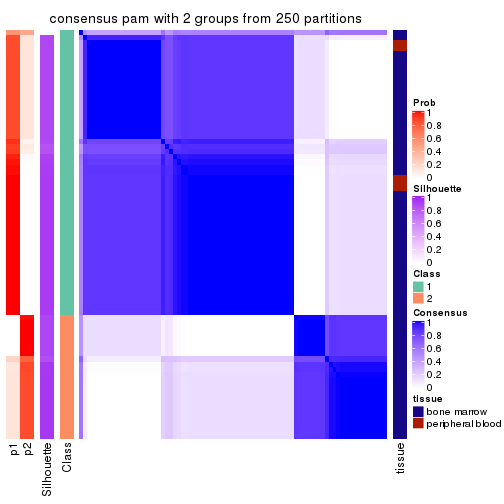</p>

</div>
<div id='tab-SD-pam-consensus-heatmap-2'>
<pre><code class="r">consensus_heatmap(res, k = 3)
</code></pre>

<p>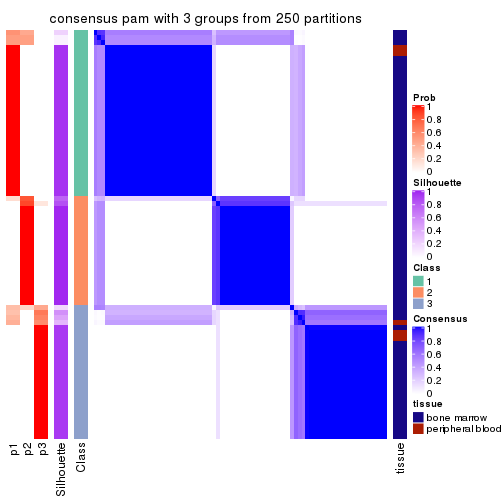</p>

</div>
<div id='tab-SD-pam-consensus-heatmap-3'>
<pre><code class="r">consensus_heatmap(res, k = 4)
</code></pre>

<p>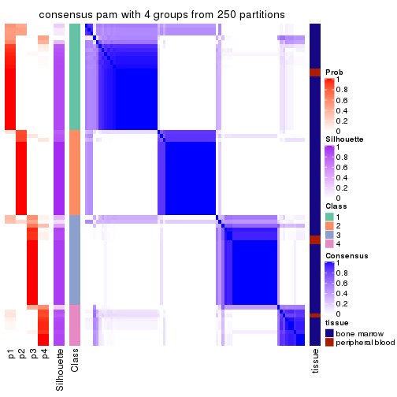</p>

</div>
<div id='tab-SD-pam-consensus-heatmap-4'>
<pre><code class="r">consensus_heatmap(res, k = 5)
</code></pre>

<p>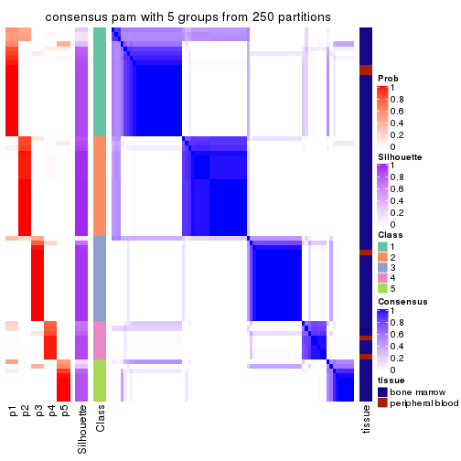</p>

</div>
<div id='tab-SD-pam-consensus-heatmap-5'>
<pre><code class="r">consensus_heatmap(res, k = 6)
</code></pre>

<p>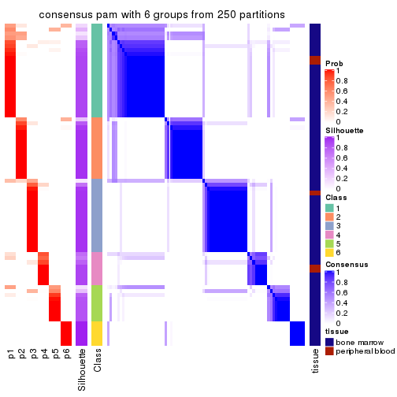</p>

</div>
</div>

Heatmaps for the membership of samples in all partitions to see how consistent they are:


<script>
$( function() {
	$( '#tabs-SD-pam-membership-heatmap' ).tabs();
} );
</script>
<div id='tabs-SD-pam-membership-heatmap'>
<ul>
<li><a href='#tab-SD-pam-membership-heatmap-1'>k = 2</a></li>
<li><a href='#tab-SD-pam-membership-heatmap-2'>k = 3</a></li>
<li><a href='#tab-SD-pam-membership-heatmap-3'>k = 4</a></li>
<li><a href='#tab-SD-pam-membership-heatmap-4'>k = 5</a></li>
<li><a href='#tab-SD-pam-membership-heatmap-5'>k = 6</a></li>
</ul>
<div id='tab-SD-pam-membership-heatmap-1'>
<pre><code class="r">membership_heatmap(res, k = 2)
</code></pre>

<p>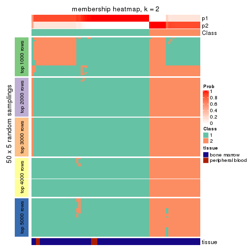</p>

</div>
<div id='tab-SD-pam-membership-heatmap-2'>
<pre><code class="r">membership_heatmap(res, k = 3)
</code></pre>

<p>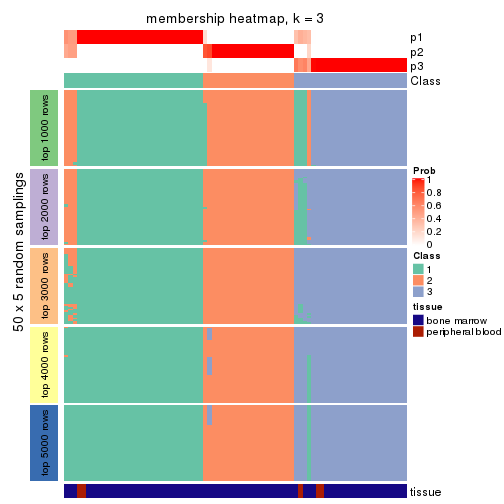</p>

</div>
<div id='tab-SD-pam-membership-heatmap-3'>
<pre><code class="r">membership_heatmap(res, k = 4)
</code></pre>

<p>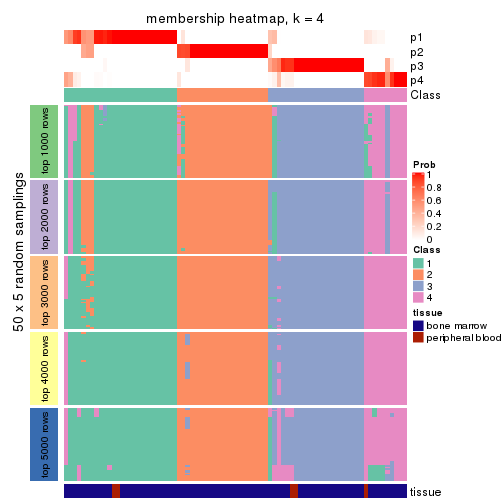</p>

</div>
<div id='tab-SD-pam-membership-heatmap-4'>
<pre><code class="r">membership_heatmap(res, k = 5)
</code></pre>

<p>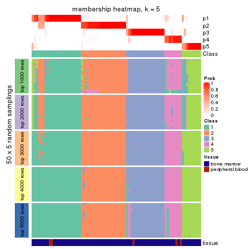</p>

</div>
<div id='tab-SD-pam-membership-heatmap-5'>
<pre><code class="r">membership_heatmap(res, k = 6)
</code></pre>

<p>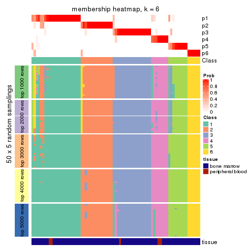</p>

</div>
</div>

As soon as we have had the classes for columns, we can look for signatures
which are significantly different between classes which can be candidate marks
for certain classes. Following are the heatmaps for signatures.


Signature heatmaps where rows are scaled:


<script>
$( function() {
	$( '#tabs-SD-pam-get-signatures' ).tabs();
} );
</script>
<div id='tabs-SD-pam-get-signatures'>
<ul>
<li><a href='#tab-SD-pam-get-signatures-1'>k = 2</a></li>
<li><a href='#tab-SD-pam-get-signatures-2'>k = 3</a></li>
<li><a href='#tab-SD-pam-get-signatures-3'>k = 4</a></li>
<li><a href='#tab-SD-pam-get-signatures-4'>k = 5</a></li>
<li><a href='#tab-SD-pam-get-signatures-5'>k = 6</a></li>
</ul>
<div id='tab-SD-pam-get-signatures-1'>
<pre><code class="r">get_signatures(res, k = 2)
</code></pre>

<p>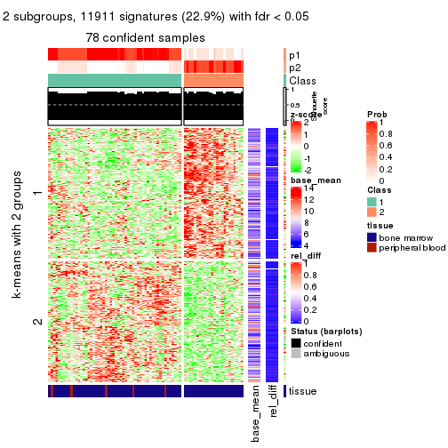</p>

</div>
<div id='tab-SD-pam-get-signatures-2'>
<pre><code class="r">get_signatures(res, k = 3)
</code></pre>

<p>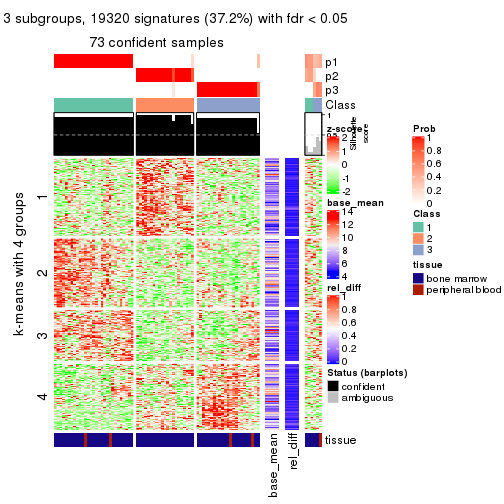</p>

</div>
<div id='tab-SD-pam-get-signatures-3'>
<pre><code class="r">get_signatures(res, k = 4)
</code></pre>

<p>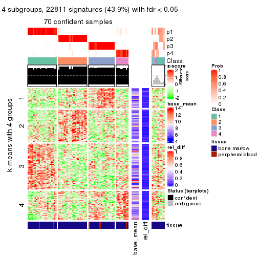</p>

</div>
<div id='tab-SD-pam-get-signatures-4'>
<pre><code class="r">get_signatures(res, k = 5)
</code></pre>

<p>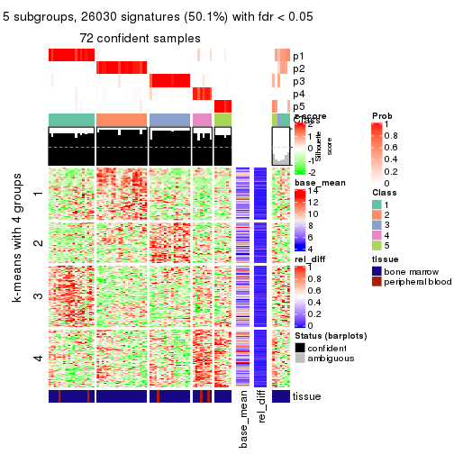</p>

</div>
<div id='tab-SD-pam-get-signatures-5'>
<pre><code class="r">get_signatures(res, k = 6)
</code></pre>

<p>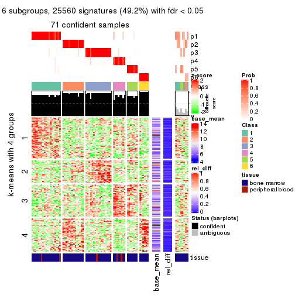</p>

</div>
</div>


Signature heatmaps where rows are not scaled:


<script>
$( function() {
	$( '#tabs-SD-pam-get-signatures-no-scale' ).tabs();
} );
</script>
<div id='tabs-SD-pam-get-signatures-no-scale'>
<ul>
<li><a href='#tab-SD-pam-get-signatures-no-scale-1'>k = 2</a></li>
<li><a href='#tab-SD-pam-get-signatures-no-scale-2'>k = 3</a></li>
<li><a href='#tab-SD-pam-get-signatures-no-scale-3'>k = 4</a></li>
<li><a href='#tab-SD-pam-get-signatures-no-scale-4'>k = 5</a></li>
<li><a href='#tab-SD-pam-get-signatures-no-scale-5'>k = 6</a></li>
</ul>
<div id='tab-SD-pam-get-signatures-no-scale-1'>
<pre><code class="r">get_signatures(res, k = 2, scale_rows = FALSE)
</code></pre>

<p>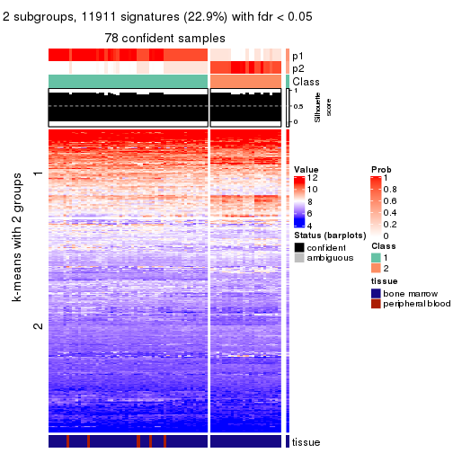</p>

</div>
<div id='tab-SD-pam-get-signatures-no-scale-2'>
<pre><code class="r">get_signatures(res, k = 3, scale_rows = FALSE)
</code></pre>

<p>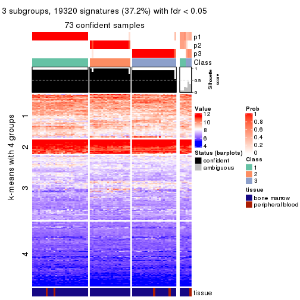</p>

</div>
<div id='tab-SD-pam-get-signatures-no-scale-3'>
<pre><code class="r">get_signatures(res, k = 4, scale_rows = FALSE)
</code></pre>

<p>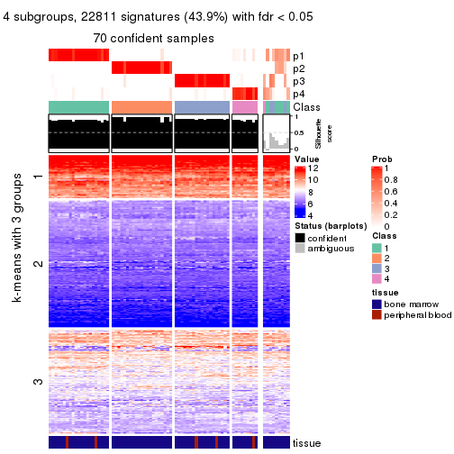</p>

</div>
<div id='tab-SD-pam-get-signatures-no-scale-4'>
<pre><code class="r">get_signatures(res, k = 5, scale_rows = FALSE)
</code></pre>

<p>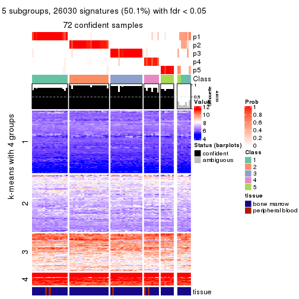</p>

</div>
<div id='tab-SD-pam-get-signatures-no-scale-5'>
<pre><code class="r">get_signatures(res, k = 6, scale_rows = FALSE)
</code></pre>

<p>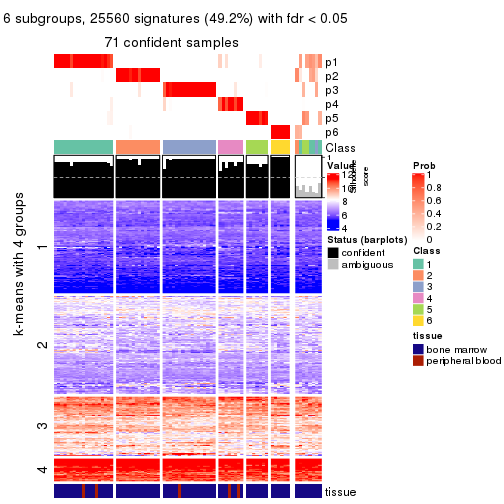</p>

</div>
</div>


Compare the overlap of signatures from different k:

```r
compare_signatures(res)
```

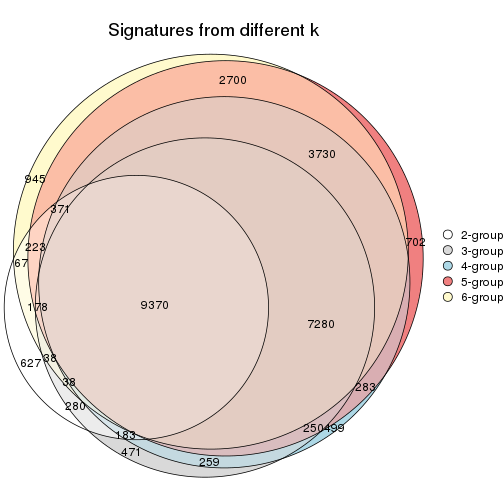

`get_signature()` returns a data frame invisibly. TO get the list of signatures, the function
call should be assigned to a variable explicitly. In following code, if `plot` argument is set
to `FALSE`, no heatmap is plotted while only the differential analysis is performed.

```r
# code only for demonstration
tb = get_signature(res, k = ..., plot = FALSE)
```

An example of the output of `tb` is:

```
#>   which_row         fdr    mean_1    mean_2 scaled_mean_1 scaled_mean_2 km
#> 1        38 0.042760348  8.373488  9.131774    -0.5533452     0.5164555  1
#> 2        40 0.018707592  7.106213  8.469186    -0.6173731     0.5762149  1
#> 3        55 0.019134737 10.221463 11.207825    -0.6159697     0.5749050  1
#> 4        59 0.006059896  5.921854  7.869574    -0.6899429     0.6439467  1
#> 5        60 0.018055526  8.928898 10.211722    -0.6204761     0.5791110  1
#> 6        98 0.009384629 15.714769 14.887706     0.6635654    -0.6193277  2
...
```

The columns in `tb` are:

1. `which_row`: row indices corresponding to the input matrix.
2. `fdr`: FDR for the differential test. 
3. `mean_x`: The mean value in group x.
4. `scaled_mean_x`: The mean value in group x after rows are scaled.
5. `km`: Row groups if k-means clustering is applied to rows.


UMAP plot which shows how samples are separated.


<script>
$( function() {
	$( '#tabs-SD-pam-dimension-reduction' ).tabs();
} );
</script>
<div id='tabs-SD-pam-dimension-reduction'>
<ul>
<li><a href='#tab-SD-pam-dimension-reduction-1'>k = 2</a></li>
<li><a href='#tab-SD-pam-dimension-reduction-2'>k = 3</a></li>
<li><a href='#tab-SD-pam-dimension-reduction-3'>k = 4</a></li>
<li><a href='#tab-SD-pam-dimension-reduction-4'>k = 5</a></li>
<li><a href='#tab-SD-pam-dimension-reduction-5'>k = 6</a></li>
</ul>
<div id='tab-SD-pam-dimension-reduction-1'>
<pre><code class="r">dimension_reduction(res, k = 2, method = &quot;UMAP&quot;)
</code></pre>

<p>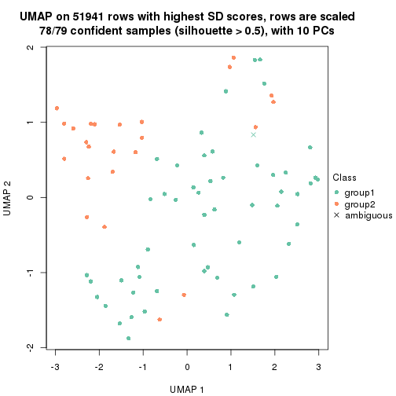</p>

</div>
<div id='tab-SD-pam-dimension-reduction-2'>
<pre><code class="r">dimension_reduction(res, k = 3, method = &quot;UMAP&quot;)
</code></pre>

<p>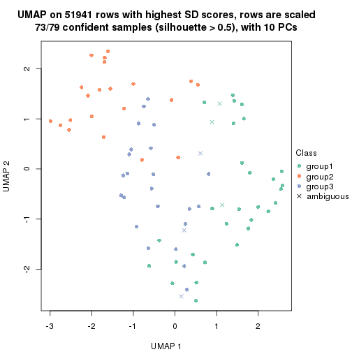</p>

</div>
<div id='tab-SD-pam-dimension-reduction-3'>
<pre><code class="r">dimension_reduction(res, k = 4, method = &quot;UMAP&quot;)
</code></pre>

<p>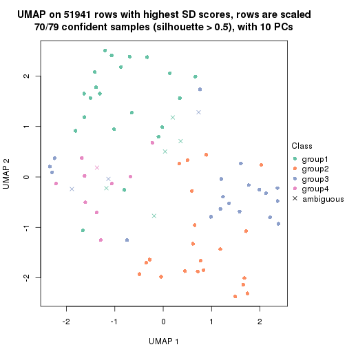</p>

</div>
<div id='tab-SD-pam-dimension-reduction-4'>
<pre><code class="r">dimension_reduction(res, k = 5, method = &quot;UMAP&quot;)
</code></pre>

<p>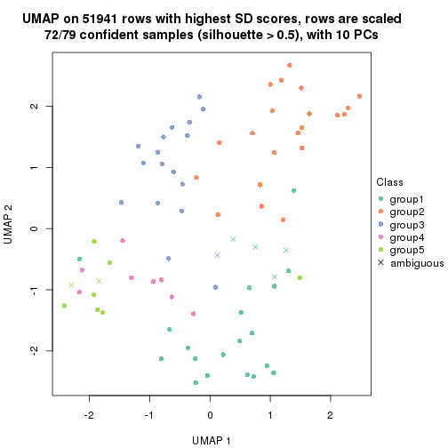</p>

</div>
<div id='tab-SD-pam-dimension-reduction-5'>
<pre><code class="r">dimension_reduction(res, k = 6, method = &quot;UMAP&quot;)
</code></pre>

<p>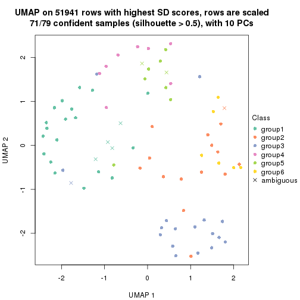</p>

</div>
</div>


Following heatmap shows how subgroups are split when increasing `k`:

```r
collect_classes(res)
```

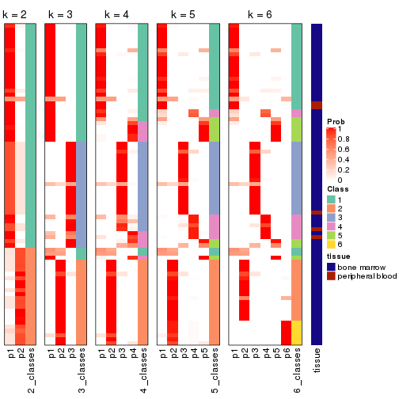


Test correlation between subgroups and known annotations. If the known
annotation is numeric, one-way ANOVA test is applied, and if the known
annotation is discrete, chi-squared contingency table test is applied.

```r
test_to_known_factors(res)
```

```
#>         n tissue(p) k
#> SD:pam 78     0.298 2
#> SD:pam 73     0.409 3
#> SD:pam 70     0.506 4
#> SD:pam 72     0.163 5
#> SD:pam 71     0.272 6
```


If matrix rows can be associated to genes, consider to use `GO_Enrichment(res,
...)` to perform function enrichment for the signature genes.


 

---------------------------------------------------


### SD:mclust


The object with results only for a single top-value method and a single partition method 
can be extracted as:

```r
res = res_list["SD", "mclust"]
# you can also extract it by
# res = res_list["SD:mclust"]
```

A summary of `res` and all the functions that can be applied to it:

```r
res
```

```
#> A 'ConsensusPartition' object with k = 2, 3, 4, 5, 6.
#>   On a matrix with 51941 rows and 79 columns.
#>   Top rows (1000, 2000, 3000, 4000, 5000) are extracted by 'SD' method.
#>   Subgroups are detected by 'mclust' method.
#>   Performed in total 1250 partitions by row resampling.
#>   Best k for subgroups seems to be 4.
#> 
#> Following methods can be applied to this 'ConsensusPartition' object:
#>  [1] "cola_report"             "collect_classes"         "collect_plots"          
#>  [4] "collect_stats"           "colnames"                "compare_signatures"     
#>  [7] "consensus_heatmap"       "dimension_reduction"     "functional_enrichment"  
#> [10] "get_anno_col"            "get_anno"                "get_classes"            
#> [13] "get_consensus"           "get_matrix"              "get_membership"         
#> [16] "get_param"               "get_signatures"          "get_stats"              
#> [19] "is_best_k"               "is_stable_k"             "membership_heatmap"     
#> [22] "ncol"                    "nrow"                    "plot_ecdf"              
#> [25] "rownames"                "select_partition_number" "show"                   
#> [28] "suggest_best_k"          "test_to_known_factors"
```

`collect_plots()` function collects all the plots made from `res` for all `k` (number of partitions)
into one single page to provide an easy and fast comparison between different `k`.

```r
collect_plots(res)
```

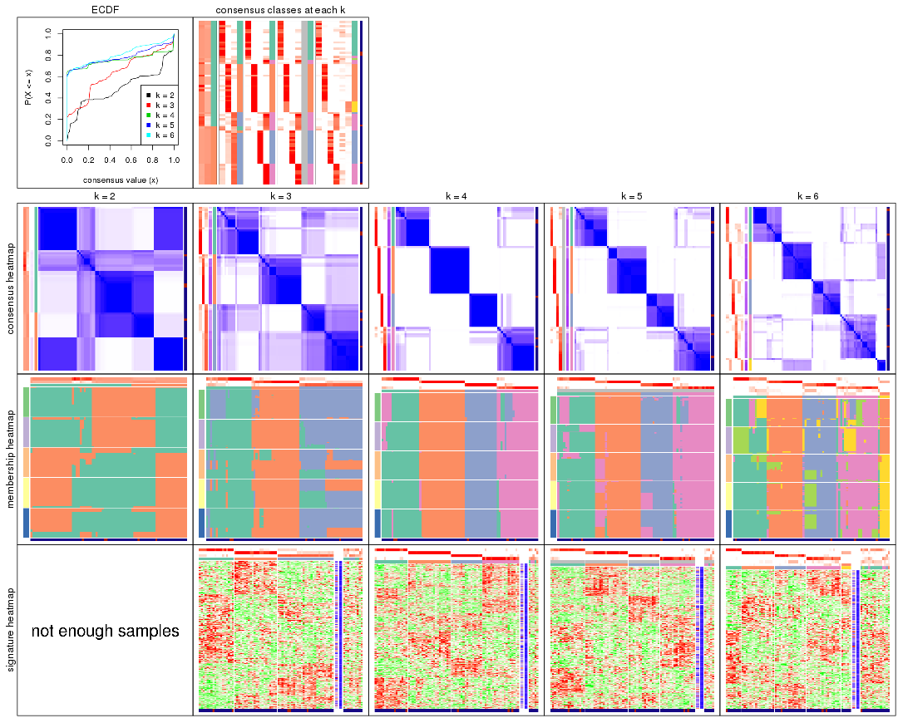

The plots are:

- The first row: a plot of the ECDF (Empirical cumulative distribution
  function) curves of the consensus matrix for each `k` and the heatmap of
  predicted classes for each `k`.
- The second row: heatmaps of the consensus matrix for each `k`.
- The third row: heatmaps of the membership matrix for each `k`.
- The fouth row: heatmaps of the signatures for each `k`.

All the plots in panels can be made by individual functions and they are
plotted later in this section.

`select_partition_number()` produces several plots showing different
statistics for choosing "optimized" `k`. There are following statistics:

- ECDF curves of the consensus matrix for each `k`;
- 1-PAC. [The PAC
  score](https://en.wikipedia.org/wiki/Consensus_clustering#Over-interpretation_potential_of_consensus_clustering)
  measures the proportion of the ambiguous subgrouping.
- Mean silhouette score.
- Concordance. The mean probability of fiting the consensus class ids in all
  partitions.
- Area increased. Denote $A_k$ as the area under the ECDF curve for current
  `k`, the area increased is defined as $A_k - A_{k-1}$.
- Rand index. The percent of pairs of samples that are both in a same cluster
  or both are not in a same cluster in the partition of k and k-1.
- Jaccard index. The ratio of pairs of samples are both in a same cluster in
  the partition of k and k-1 and the pairs of samples are both in a same
  cluster in the partition k or k-1.

The detailed explanations of these statistics can be found in [the cola
vignette](http://bioconductor.org/packages/devel/bioc/vignettes/cola/inst/doc/cola.html#toc_13).

Generally speaking, lower PAC score, higher mean silhouette score or higher
concordance corresponds to better partition. Rand index and Jaccard index
measure how similar the current partition is compared to partition with `k-1`.
If they are too similar, we won't accept `k` is better than `k-1`.

```r
select_partition_number(res)
```

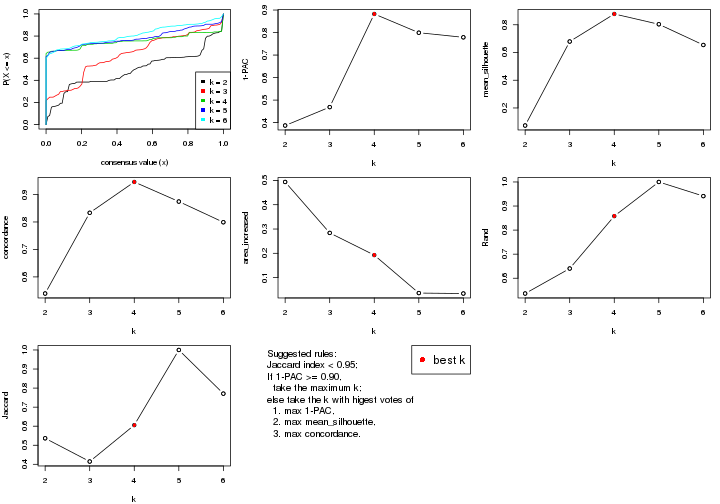

The numeric values for all these statistics can be obtained by `get_stats()`.

```r
get_stats(res)
```

```
#>   k 1-PAC mean_silhouette concordance area_increased  Rand Jaccard
#> 2 2 0.387          0.0734       0.540         0.4936 0.537   0.537
#> 3 3 0.469          0.6792       0.833         0.2839 0.640   0.415
#> 4 4 0.883          0.8778       0.946         0.1927 0.858   0.606
#> 5 5 0.799          0.8036       0.874         0.0364 1.000   1.000
#> 6 6 0.779          0.6541       0.799         0.0346 0.941   0.771
```

`suggest_best_k()` suggests the best $k$ based on these statistics. The rules are as follows:

- All $k$ with Jaccard index larger than 0.95 are removed because the increase of
  the partition number does not provides enough extra information. If all $k$ are removed,
  the best $k$ is assigned by `NA`.
- For $k$ with 1-PAC larger than 0.9, the maximal $k$ is taken as the "best k". Other $k$ is called "optional k".
- If it does not fit the second rule. The $k$ with the highest vote of highest
  1-PAC, mean silhouette and concordance is taken as the "best k".

```r
suggest_best_k(res)
```

```
#> [1] 4
```


Following shows the table of the partitions (You need to click the **show/hide
code output** link to see it). The membership matrix (columns with name `p*`)
is inferred by
[`clue::cl_consensus()`](https://www.rdocumentation.org/link/cl_consensus?package=clue)
function with the `SE` method. Basically the value in the membership matrix
represents the probability to belong to a certain group. The finall class
label for an item is determined with the group with highest probability it
belongs to.

In `get_classes()` function, the entropy is calculated from the membership
matrix and the silhouette score is calculated from the consensus matrix.


<script>
$( function() {
	$( '#tabs-SD-mclust-get-classes' ).tabs();
} );
</script>
<div id='tabs-SD-mclust-get-classes'>
<ul>
<li><a href='#tab-SD-mclust-get-classes-1'>k = 2</a></li>
<li><a href='#tab-SD-mclust-get-classes-2'>k = 3</a></li>
<li><a href='#tab-SD-mclust-get-classes-3'>k = 4</a></li>
<li><a href='#tab-SD-mclust-get-classes-4'>k = 5</a></li>
<li><a href='#tab-SD-mclust-get-classes-5'>k = 6</a></li>
</ul>

<div id='tab-SD-mclust-get-classes-1'>
<p><a id='tab-SD-mclust-get-classes-1-a' style='color:#0366d6' href='#'>show/hide code output</a></p>
<pre><code class="r">cbind(get_classes(res, k = 2), get_membership(res, k = 2))
</code></pre>

<pre><code>#&gt;           class entropy silhouette    p1    p2
#&gt; GSM316652     2  0.9998     0.1990 0.492 0.508
#&gt; GSM316653     2  0.9881    -0.0555 0.436 0.564
#&gt; GSM316654     2  0.9881    -0.0555 0.436 0.564
#&gt; GSM316655     1  0.9963     0.1463 0.536 0.464
#&gt; GSM316656     1  0.5629     0.1461 0.868 0.132
#&gt; GSM316657     1  0.9988     0.1547 0.520 0.480
#&gt; GSM316658     1  0.9775    -0.0292 0.588 0.412
#&gt; GSM316659     1  0.9775    -0.0292 0.588 0.412
#&gt; GSM316660     1  0.9996     0.1586 0.512 0.488
#&gt; GSM316661     1  0.9286     0.0936 0.656 0.344
#&gt; GSM316662     2  0.9998     0.1990 0.492 0.508
#&gt; GSM316663     1  0.4815     0.1007 0.896 0.104
#&gt; GSM316664     2  0.9896    -0.0610 0.440 0.560
#&gt; GSM316665     1  0.9775    -0.0292 0.588 0.412
#&gt; GSM316666     2  0.9998     0.1990 0.492 0.508
#&gt; GSM316667     1  0.9754    -0.0337 0.592 0.408
#&gt; GSM316668     2  0.9998     0.1990 0.492 0.508
#&gt; GSM316669     2  0.9881    -0.0555 0.436 0.564
#&gt; GSM316670     2  0.9998     0.1990 0.492 0.508
#&gt; GSM316671     2  0.9998     0.1990 0.492 0.508
#&gt; GSM316672     1  0.9833     0.1397 0.576 0.424
#&gt; GSM316673     1  0.9963     0.1463 0.536 0.464
#&gt; GSM316674     2  0.9998     0.1990 0.492 0.508
#&gt; GSM316676     2  0.9998     0.1990 0.492 0.508
#&gt; GSM316677     2  0.9993    -0.1269 0.484 0.516
#&gt; GSM316678     1  0.9775    -0.0292 0.588 0.412
#&gt; GSM316679     1  0.9996     0.1586 0.512 0.488
#&gt; GSM316680     1  0.9996     0.1586 0.512 0.488
#&gt; GSM316681     2  0.9998     0.1990 0.492 0.508
#&gt; GSM316682     2  0.9881    -0.0555 0.436 0.564
#&gt; GSM316683     2  0.9881    -0.0555 0.436 0.564
#&gt; GSM316684     1  0.9775    -0.0292 0.588 0.412
#&gt; GSM316685     2  0.9998     0.1990 0.492 0.508
#&gt; GSM316686     1  0.6148     0.1190 0.848 0.152
#&gt; GSM316687     1  0.4815     0.1007 0.896 0.104
#&gt; GSM316688     1  0.4022     0.1087 0.920 0.080
#&gt; GSM316689     1  0.9996     0.1586 0.512 0.488
#&gt; GSM316690     2  0.9998     0.1990 0.492 0.508
#&gt; GSM316691     1  0.9754    -0.0337 0.592 0.408
#&gt; GSM316692     2  0.9998     0.1990 0.492 0.508
#&gt; GSM316693     2  0.9881    -0.0555 0.436 0.564
#&gt; GSM316694     2  0.9998     0.1990 0.492 0.508
#&gt; GSM316696     1  0.9996     0.1586 0.512 0.488
#&gt; GSM316697     2  0.9998     0.1990 0.492 0.508
#&gt; GSM316698     1  0.9775    -0.0292 0.588 0.412
#&gt; GSM316699     1  0.9775    -0.0292 0.588 0.412
#&gt; GSM316700     2  0.9909    -0.0603 0.444 0.556
#&gt; GSM316701     2  0.9881    -0.0555 0.436 0.564
#&gt; GSM316703     1  0.9775    -0.0292 0.588 0.412
#&gt; GSM316704     1  0.9775    -0.0292 0.588 0.412
#&gt; GSM316705     1  1.0000     0.1076 0.504 0.496
#&gt; GSM316706     1  0.9775    -0.0292 0.588 0.412
#&gt; GSM316707     1  0.9775    -0.0292 0.588 0.412
#&gt; GSM316708     1  0.0376     0.1361 0.996 0.004
#&gt; GSM316709     2  0.9998     0.1990 0.492 0.508
#&gt; GSM316710     2  0.9881    -0.0555 0.436 0.564
#&gt; GSM316711     1  0.9775    -0.0292 0.588 0.412
#&gt; GSM316713     1  0.9996     0.1586 0.512 0.488
#&gt; GSM316714     1  0.9998    -0.2219 0.508 0.492
#&gt; GSM316715     1  0.9996     0.1586 0.512 0.488
#&gt; GSM316716     1  0.9775    -0.0292 0.588 0.412
#&gt; GSM316717     1  0.9996     0.1586 0.512 0.488
#&gt; GSM316718     1  0.4161     0.1084 0.916 0.084
#&gt; GSM316719     1  0.9996     0.1586 0.512 0.488
#&gt; GSM316720     1  0.9996     0.1586 0.512 0.488
#&gt; GSM316721     1  0.9775    -0.0292 0.588 0.412
#&gt; GSM316722     1  0.9996     0.1586 0.512 0.488
#&gt; GSM316723     1  0.9775    -0.0292 0.588 0.412
#&gt; GSM316724     1  0.9775    -0.0292 0.588 0.412
#&gt; GSM316726     1  0.9775    -0.0292 0.588 0.412
#&gt; GSM316727     1  0.9996     0.1586 0.512 0.488
#&gt; GSM316728     1  0.4815     0.1007 0.896 0.104
#&gt; GSM316729     1  0.9815     0.1391 0.580 0.420
#&gt; GSM316730     1  0.9775    -0.0292 0.588 0.412
#&gt; GSM316675     2  0.9998     0.1990 0.492 0.508
#&gt; GSM316695     1  0.9996     0.1586 0.512 0.488
#&gt; GSM316702     1  0.7299     0.1112 0.796 0.204
#&gt; GSM316712     1  0.9996     0.1586 0.512 0.488
#&gt; GSM316725     2  0.9881    -0.0555 0.436 0.564
</code></pre>

<script>
$('#tab-SD-mclust-get-classes-1-a').parent().next().next().hide();
$('#tab-SD-mclust-get-classes-1-a').click(function(){
  $('#tab-SD-mclust-get-classes-1-a').parent().next().next().toggle();
  return(false);
});
</script>
</div>

<div id='tab-SD-mclust-get-classes-2'>
<p><a id='tab-SD-mclust-get-classes-2-a' style='color:#0366d6' href='#'>show/hide code output</a></p>
<pre><code class="r">cbind(get_classes(res, k = 3), get_membership(res, k = 3))
</code></pre>

<pre><code>#&gt;           class entropy silhouette    p1    p2    p3
#&gt; GSM316652     3  0.4702     0.7326 0.000 0.212 0.788
#&gt; GSM316653     3  0.6008     0.1626 0.372 0.000 0.628
#&gt; GSM316654     3  0.4796     0.5245 0.220 0.000 0.780
#&gt; GSM316655     1  0.6168     0.4690 0.588 0.000 0.412
#&gt; GSM316656     1  0.9669    -0.2460 0.408 0.212 0.380
#&gt; GSM316657     1  0.0000     0.8000 1.000 0.000 0.000
#&gt; GSM316658     2  0.0000     0.8961 0.000 1.000 0.000
#&gt; GSM316659     2  0.0000     0.8961 0.000 1.000 0.000
#&gt; GSM316660     1  0.0000     0.8000 1.000 0.000 0.000
#&gt; GSM316661     3  0.4605     0.5429 0.204 0.000 0.796
#&gt; GSM316662     3  0.5529     0.6416 0.000 0.296 0.704
#&gt; GSM316663     3  0.5414     0.7334 0.016 0.212 0.772
#&gt; GSM316664     1  0.6192     0.3432 0.580 0.000 0.420
#&gt; GSM316665     2  0.0000     0.8961 0.000 1.000 0.000
#&gt; GSM316666     3  0.4702     0.7326 0.000 0.212 0.788
#&gt; GSM316667     2  0.4892     0.7694 0.048 0.840 0.112
#&gt; GSM316668     3  0.5529     0.6416 0.000 0.296 0.704
#&gt; GSM316669     3  0.5810     0.2728 0.336 0.000 0.664
#&gt; GSM316670     3  0.5465     0.6526 0.000 0.288 0.712
#&gt; GSM316671     3  0.4750     0.7309 0.000 0.216 0.784
#&gt; GSM316672     1  0.5497     0.4214 0.708 0.292 0.000
#&gt; GSM316673     1  0.0000     0.8000 1.000 0.000 0.000
#&gt; GSM316674     3  0.4796     0.7275 0.000 0.220 0.780
#&gt; GSM316676     3  0.4796     0.7275 0.000 0.220 0.780
#&gt; GSM316677     1  0.5859     0.5080 0.656 0.000 0.344
#&gt; GSM316678     2  0.2448     0.8642 0.076 0.924 0.000
#&gt; GSM316679     1  0.4555     0.6842 0.800 0.000 0.200
#&gt; GSM316680     1  0.4555     0.6842 0.800 0.000 0.200
#&gt; GSM316681     3  0.4750     0.7309 0.000 0.216 0.784
#&gt; GSM316682     3  0.4702     0.5363 0.212 0.000 0.788
#&gt; GSM316683     3  0.4702     0.5363 0.212 0.000 0.788
#&gt; GSM316684     2  0.0000     0.8961 0.000 1.000 0.000
#&gt; GSM316685     2  0.6026     0.2801 0.000 0.624 0.376
#&gt; GSM316686     3  0.7824     0.2946 0.356 0.064 0.580
#&gt; GSM316687     3  0.5598     0.7112 0.052 0.148 0.800
#&gt; GSM316688     2  0.9541    -0.0427 0.384 0.424 0.192
#&gt; GSM316689     1  0.0000     0.8000 1.000 0.000 0.000
#&gt; GSM316690     3  0.4702     0.7326 0.000 0.212 0.788
#&gt; GSM316691     2  0.3941     0.7103 0.000 0.844 0.156
#&gt; GSM316692     3  0.4796     0.7275 0.000 0.220 0.780
#&gt; GSM316693     3  0.4702     0.5363 0.212 0.000 0.788
#&gt; GSM316694     3  0.4796     0.7275 0.000 0.220 0.780
#&gt; GSM316696     1  0.0000     0.8000 1.000 0.000 0.000
#&gt; GSM316697     3  0.4702     0.7326 0.000 0.212 0.788
#&gt; GSM316698     2  0.2448     0.8642 0.076 0.924 0.000
#&gt; GSM316699     2  0.0000     0.8961 0.000 1.000 0.000
#&gt; GSM316700     3  0.4702     0.5363 0.212 0.000 0.788
#&gt; GSM316701     3  0.4887     0.5127 0.228 0.000 0.772
#&gt; GSM316703     2  0.0000     0.8961 0.000 1.000 0.000
#&gt; GSM316704     2  0.0000     0.8961 0.000 1.000 0.000
#&gt; GSM316705     1  0.5178     0.6365 0.744 0.000 0.256
#&gt; GSM316706     2  0.0592     0.8915 0.012 0.988 0.000
#&gt; GSM316707     2  0.0000     0.8961 0.000 1.000 0.000
#&gt; GSM316708     2  0.4654     0.7304 0.208 0.792 0.000
#&gt; GSM316709     3  0.4702     0.7326 0.000 0.212 0.788
#&gt; GSM316710     3  0.4702     0.5363 0.212 0.000 0.788
#&gt; GSM316711     2  0.0000     0.8961 0.000 1.000 0.000
#&gt; GSM316713     1  0.0000     0.8000 1.000 0.000 0.000
#&gt; GSM316714     3  0.5109     0.7336 0.008 0.212 0.780
#&gt; GSM316715     1  0.0000     0.8000 1.000 0.000 0.000
#&gt; GSM316716     2  0.0000     0.8961 0.000 1.000 0.000
#&gt; GSM316717     1  0.4555     0.6842 0.800 0.000 0.200
#&gt; GSM316718     2  0.4504     0.7466 0.196 0.804 0.000
#&gt; GSM316719     1  0.1964     0.7800 0.944 0.000 0.056
#&gt; GSM316720     1  0.0000     0.8000 1.000 0.000 0.000
#&gt; GSM316721     2  0.0000     0.8961 0.000 1.000 0.000
#&gt; GSM316722     1  0.4555     0.6842 0.800 0.000 0.200
#&gt; GSM316723     2  0.0237     0.8950 0.004 0.996 0.000
#&gt; GSM316724     2  0.2448     0.8642 0.076 0.924 0.000
#&gt; GSM316726     2  0.0000     0.8961 0.000 1.000 0.000
#&gt; GSM316727     1  0.0000     0.8000 1.000 0.000 0.000
#&gt; GSM316728     3  0.5414     0.7334 0.016 0.212 0.772
#&gt; GSM316729     1  0.8765     0.3115 0.588 0.212 0.200
#&gt; GSM316730     2  0.2448     0.8642 0.076 0.924 0.000
#&gt; GSM316675     3  0.4796     0.7275 0.000 0.220 0.780
#&gt; GSM316695     1  0.0000     0.8000 1.000 0.000 0.000
#&gt; GSM316702     3  0.4465     0.5659 0.176 0.004 0.820
#&gt; GSM316712     1  0.0000     0.8000 1.000 0.000 0.000
#&gt; GSM316725     3  0.4702     0.5363 0.212 0.000 0.788
</code></pre>

<script>
$('#tab-SD-mclust-get-classes-2-a').parent().next().next().hide();
$('#tab-SD-mclust-get-classes-2-a').click(function(){
  $('#tab-SD-mclust-get-classes-2-a').parent().next().next().toggle();
  return(false);
});
</script>
</div>

<div id='tab-SD-mclust-get-classes-3'>
<p><a id='tab-SD-mclust-get-classes-3-a' style='color:#0366d6' href='#'>show/hide code output</a></p>
<pre><code class="r">cbind(get_classes(res, k = 4), get_membership(res, k = 4))
</code></pre>

<pre><code>#&gt;           class entropy silhouette    p1    p2    p3    p4
#&gt; GSM316652     3  0.0000      0.998 0.000 0.000 1.000 0.000
#&gt; GSM316653     4  0.0000      0.873 0.000 0.000 0.000 1.000
#&gt; GSM316654     4  0.0000      0.873 0.000 0.000 0.000 1.000
#&gt; GSM316655     4  0.0000      0.873 0.000 0.000 0.000 1.000
#&gt; GSM316656     4  0.3810      0.660 0.188 0.008 0.000 0.804
#&gt; GSM316657     1  0.0000      0.895 1.000 0.000 0.000 0.000
#&gt; GSM316658     2  0.0000      0.982 0.000 1.000 0.000 0.000
#&gt; GSM316659     2  0.0000      0.982 0.000 1.000 0.000 0.000
#&gt; GSM316660     1  0.0000      0.895 1.000 0.000 0.000 0.000
#&gt; GSM316661     4  0.0000      0.873 0.000 0.000 0.000 1.000
#&gt; GSM316662     3  0.0000      0.998 0.000 0.000 1.000 0.000
#&gt; GSM316663     4  0.1474      0.850 0.000 0.000 0.052 0.948
#&gt; GSM316664     4  0.4164      0.632 0.264 0.000 0.000 0.736
#&gt; GSM316665     2  0.0000      0.982 0.000 1.000 0.000 0.000
#&gt; GSM316666     3  0.0000      0.998 0.000 0.000 1.000 0.000
#&gt; GSM316667     2  0.0000      0.982 0.000 1.000 0.000 0.000
#&gt; GSM316668     3  0.0000      0.998 0.000 0.000 1.000 0.000
#&gt; GSM316669     4  0.0000      0.873 0.000 0.000 0.000 1.000
#&gt; GSM316670     3  0.0000      0.998 0.000 0.000 1.000 0.000
#&gt; GSM316671     3  0.0000      0.998 0.000 0.000 1.000 0.000
#&gt; GSM316672     1  0.0000      0.895 1.000 0.000 0.000 0.000
#&gt; GSM316673     1  0.0000      0.895 1.000 0.000 0.000 0.000
#&gt; GSM316674     3  0.0000      0.998 0.000 0.000 1.000 0.000
#&gt; GSM316676     3  0.0000      0.998 0.000 0.000 1.000 0.000
#&gt; GSM316677     4  0.4855      0.158 0.400 0.000 0.000 0.600
#&gt; GSM316678     2  0.0000      0.982 0.000 1.000 0.000 0.000
#&gt; GSM316679     1  0.3610      0.755 0.800 0.000 0.000 0.200
#&gt; GSM316680     1  0.4331      0.652 0.712 0.000 0.000 0.288
#&gt; GSM316681     3  0.0000      0.998 0.000 0.000 1.000 0.000
#&gt; GSM316682     4  0.0000      0.873 0.000 0.000 0.000 1.000
#&gt; GSM316683     4  0.0000      0.873 0.000 0.000 0.000 1.000
#&gt; GSM316684     2  0.0000      0.982 0.000 1.000 0.000 0.000
#&gt; GSM316685     3  0.0921      0.965 0.000 0.028 0.972 0.000
#&gt; GSM316686     4  0.3610      0.715 0.200 0.000 0.000 0.800
#&gt; GSM316687     4  0.3610      0.743 0.000 0.000 0.200 0.800
#&gt; GSM316688     2  0.6991      0.407 0.188 0.580 0.000 0.232
#&gt; GSM316689     1  0.0000      0.895 1.000 0.000 0.000 0.000
#&gt; GSM316690     3  0.0000      0.998 0.000 0.000 1.000 0.000
#&gt; GSM316691     2  0.0000      0.982 0.000 1.000 0.000 0.000
#&gt; GSM316692     3  0.0000      0.998 0.000 0.000 1.000 0.000
#&gt; GSM316693     4  0.0000      0.873 0.000 0.000 0.000 1.000
#&gt; GSM316694     3  0.0000      0.998 0.000 0.000 1.000 0.000
#&gt; GSM316696     1  0.0000      0.895 1.000 0.000 0.000 0.000
#&gt; GSM316697     3  0.0000      0.998 0.000 0.000 1.000 0.000
#&gt; GSM316698     2  0.0000      0.982 0.000 1.000 0.000 0.000
#&gt; GSM316699     2  0.0000      0.982 0.000 1.000 0.000 0.000
#&gt; GSM316700     4  0.0000      0.873 0.000 0.000 0.000 1.000
#&gt; GSM316701     4  0.0000      0.873 0.000 0.000 0.000 1.000
#&gt; GSM316703     2  0.0000      0.982 0.000 1.000 0.000 0.000
#&gt; GSM316704     2  0.0000      0.982 0.000 1.000 0.000 0.000
#&gt; GSM316705     1  0.3837      0.640 0.776 0.000 0.000 0.224
#&gt; GSM316706     2  0.0000      0.982 0.000 1.000 0.000 0.000
#&gt; GSM316707     2  0.0000      0.982 0.000 1.000 0.000 0.000
#&gt; GSM316708     2  0.0336      0.974 0.008 0.992 0.000 0.000
#&gt; GSM316709     3  0.0000      0.998 0.000 0.000 1.000 0.000
#&gt; GSM316710     4  0.0000      0.873 0.000 0.000 0.000 1.000
#&gt; GSM316711     2  0.0000      0.982 0.000 1.000 0.000 0.000
#&gt; GSM316713     1  0.0000      0.895 1.000 0.000 0.000 0.000
#&gt; GSM316714     4  0.4925      0.319 0.000 0.000 0.428 0.572
#&gt; GSM316715     1  0.0000      0.895 1.000 0.000 0.000 0.000
#&gt; GSM316716     2  0.0000      0.982 0.000 1.000 0.000 0.000
#&gt; GSM316717     1  0.3610      0.755 0.800 0.000 0.000 0.200
#&gt; GSM316718     2  0.0000      0.982 0.000 1.000 0.000 0.000
#&gt; GSM316719     1  0.0000      0.895 1.000 0.000 0.000 0.000
#&gt; GSM316720     1  0.0000      0.895 1.000 0.000 0.000 0.000
#&gt; GSM316721     2  0.0000      0.982 0.000 1.000 0.000 0.000
#&gt; GSM316722     1  0.4790      0.495 0.620 0.000 0.000 0.380
#&gt; GSM316723     2  0.0000      0.982 0.000 1.000 0.000 0.000
#&gt; GSM316724     2  0.0000      0.982 0.000 1.000 0.000 0.000
#&gt; GSM316726     2  0.0000      0.982 0.000 1.000 0.000 0.000
#&gt; GSM316727     1  0.0000      0.895 1.000 0.000 0.000 0.000
#&gt; GSM316728     4  0.3610      0.743 0.000 0.000 0.200 0.800
#&gt; GSM316729     1  0.4855      0.451 0.600 0.000 0.000 0.400
#&gt; GSM316730     2  0.0000      0.982 0.000 1.000 0.000 0.000
#&gt; GSM316675     3  0.0000      0.998 0.000 0.000 1.000 0.000
#&gt; GSM316695     1  0.0000      0.895 1.000 0.000 0.000 0.000
#&gt; GSM316702     4  0.3610      0.743 0.000 0.000 0.200 0.800
#&gt; GSM316712     1  0.0000      0.895 1.000 0.000 0.000 0.000
#&gt; GSM316725     4  0.0000      0.873 0.000 0.000 0.000 1.000
</code></pre>

<script>
$('#tab-SD-mclust-get-classes-3-a').parent().next().next().hide();
$('#tab-SD-mclust-get-classes-3-a').click(function(){
  $('#tab-SD-mclust-get-classes-3-a').parent().next().next().toggle();
  return(false);
});
</script>
</div>

<div id='tab-SD-mclust-get-classes-4'>
<p><a id='tab-SD-mclust-get-classes-4-a' style='color:#0366d6' href='#'>show/hide code output</a></p>
<pre><code class="r">cbind(get_classes(res, k = 5), get_membership(res, k = 5))
</code></pre>

<pre><code>#&gt;           class entropy silhouette    p1    p2    p3    p4 p5
#&gt; GSM316652     3  0.3109     0.8876 0.000 0.000 0.800 0.000 NA
#&gt; GSM316653     4  0.0000     0.8278 0.000 0.000 0.000 1.000 NA
#&gt; GSM316654     4  0.0000     0.8278 0.000 0.000 0.000 1.000 NA
#&gt; GSM316655     4  0.1043     0.8190 0.000 0.000 0.000 0.960 NA
#&gt; GSM316656     4  0.7113     0.4928 0.144 0.108 0.000 0.572 NA
#&gt; GSM316657     1  0.1544     0.8509 0.932 0.000 0.000 0.000 NA
#&gt; GSM316658     2  0.0000     0.9101 0.000 1.000 0.000 0.000 NA
#&gt; GSM316659     2  0.4015     0.7260 0.000 0.652 0.000 0.000 NA
#&gt; GSM316660     1  0.0963     0.8591 0.964 0.000 0.000 0.000 NA
#&gt; GSM316661     4  0.0162     0.8277 0.000 0.000 0.000 0.996 NA
#&gt; GSM316662     3  0.3143     0.8873 0.000 0.000 0.796 0.000 NA
#&gt; GSM316663     4  0.2329     0.7966 0.000 0.000 0.000 0.876 NA
#&gt; GSM316664     4  0.3366     0.6771 0.232 0.000 0.000 0.768 NA
#&gt; GSM316665     2  0.0290     0.9075 0.000 0.992 0.000 0.000 NA
#&gt; GSM316666     3  0.0000     0.9301 0.000 0.000 1.000 0.000 NA
#&gt; GSM316667     2  0.0162     0.9095 0.000 0.996 0.000 0.000 NA
#&gt; GSM316668     3  0.3143     0.8873 0.000 0.000 0.796 0.000 NA
#&gt; GSM316669     4  0.0000     0.8278 0.000 0.000 0.000 1.000 NA
#&gt; GSM316670     3  0.0865     0.9223 0.000 0.004 0.972 0.000 NA
#&gt; GSM316671     3  0.3242     0.8817 0.000 0.000 0.784 0.000 NA
#&gt; GSM316672     1  0.1942     0.8467 0.920 0.012 0.000 0.000 NA
#&gt; GSM316673     1  0.1364     0.8567 0.952 0.000 0.000 0.012 NA
#&gt; GSM316674     3  0.3109     0.8876 0.000 0.000 0.800 0.000 NA
#&gt; GSM316676     3  0.0000     0.9301 0.000 0.000 1.000 0.000 NA
#&gt; GSM316677     4  0.4150     0.1260 0.388 0.000 0.000 0.612 NA
#&gt; GSM316678     2  0.0290     0.9087 0.000 0.992 0.000 0.000 NA
#&gt; GSM316679     1  0.3944     0.7325 0.768 0.000 0.000 0.200 NA
#&gt; GSM316680     1  0.5358     0.6754 0.648 0.000 0.000 0.104 NA
#&gt; GSM316681     3  0.3109     0.8876 0.000 0.000 0.800 0.000 NA
#&gt; GSM316682     4  0.2891     0.7866 0.000 0.000 0.000 0.824 NA
#&gt; GSM316683     4  0.2891     0.7866 0.000 0.000 0.000 0.824 NA
#&gt; GSM316684     2  0.0000     0.9101 0.000 1.000 0.000 0.000 NA
#&gt; GSM316685     3  0.0898     0.9161 0.000 0.020 0.972 0.000 NA
#&gt; GSM316686     4  0.5392     0.6608 0.192 0.000 0.000 0.664 NA
#&gt; GSM316687     4  0.5127     0.6925 0.000 0.000 0.184 0.692 NA
#&gt; GSM316688     2  0.7486     0.3768 0.148 0.532 0.000 0.164 NA
#&gt; GSM316689     1  0.1544     0.8509 0.932 0.000 0.000 0.000 NA
#&gt; GSM316690     3  0.0510     0.9255 0.000 0.000 0.984 0.000 NA
#&gt; GSM316691     2  0.0162     0.9095 0.000 0.996 0.000 0.000 NA
#&gt; GSM316692     3  0.0162     0.9295 0.000 0.000 0.996 0.000 NA
#&gt; GSM316693     4  0.0290     0.8271 0.000 0.000 0.000 0.992 NA
#&gt; GSM316694     3  0.0000     0.9301 0.000 0.000 1.000 0.000 NA
#&gt; GSM316696     1  0.1544     0.8509 0.932 0.000 0.000 0.000 NA
#&gt; GSM316697     3  0.0000     0.9301 0.000 0.000 1.000 0.000 NA
#&gt; GSM316698     2  0.0290     0.9087 0.000 0.992 0.000 0.000 NA
#&gt; GSM316699     2  0.0000     0.9101 0.000 1.000 0.000 0.000 NA
#&gt; GSM316700     4  0.0000     0.8278 0.000 0.000 0.000 1.000 NA
#&gt; GSM316701     4  0.2891     0.7866 0.000 0.000 0.000 0.824 NA
#&gt; GSM316703     2  0.4015     0.7260 0.000 0.652 0.000 0.000 NA
#&gt; GSM316704     2  0.4015     0.7260 0.000 0.652 0.000 0.000 NA
#&gt; GSM316705     1  0.5314     0.0603 0.528 0.000 0.000 0.420 NA
#&gt; GSM316706     2  0.4045     0.7240 0.000 0.644 0.000 0.000 NA
#&gt; GSM316707     2  0.0000     0.9101 0.000 1.000 0.000 0.000 NA
#&gt; GSM316708     2  0.1444     0.8802 0.012 0.948 0.000 0.000 NA
#&gt; GSM316709     3  0.0000     0.9301 0.000 0.000 1.000 0.000 NA
#&gt; GSM316710     4  0.0000     0.8278 0.000 0.000 0.000 1.000 NA
#&gt; GSM316711     2  0.4015     0.7260 0.000 0.652 0.000 0.000 NA
#&gt; GSM316713     1  0.0963     0.8591 0.964 0.000 0.000 0.000 NA
#&gt; GSM316714     4  0.5953     0.3641 0.000 0.000 0.384 0.504 NA
#&gt; GSM316715     1  0.0963     0.8591 0.964 0.000 0.000 0.000 NA
#&gt; GSM316716     2  0.0000     0.9101 0.000 1.000 0.000 0.000 NA
#&gt; GSM316717     1  0.3596     0.7346 0.784 0.000 0.000 0.200 NA
#&gt; GSM316718     2  0.0290     0.9087 0.000 0.992 0.000 0.000 NA
#&gt; GSM316719     1  0.0963     0.8591 0.964 0.000 0.000 0.000 NA
#&gt; GSM316720     1  0.0963     0.8591 0.964 0.000 0.000 0.000 NA
#&gt; GSM316721     2  0.0000     0.9101 0.000 1.000 0.000 0.000 NA
#&gt; GSM316722     1  0.5114     0.5523 0.608 0.000 0.000 0.340 NA
#&gt; GSM316723     2  0.0000     0.9101 0.000 1.000 0.000 0.000 NA
#&gt; GSM316724     2  0.0000     0.9101 0.000 1.000 0.000 0.000 NA
#&gt; GSM316726     2  0.0000     0.9101 0.000 1.000 0.000 0.000 NA
#&gt; GSM316727     1  0.0963     0.8591 0.964 0.000 0.000 0.000 NA
#&gt; GSM316728     4  0.5127     0.6925 0.000 0.000 0.184 0.692 NA
#&gt; GSM316729     1  0.7075     0.5420 0.540 0.056 0.000 0.184 NA
#&gt; GSM316730     2  0.0290     0.9087 0.000 0.992 0.000 0.000 NA
#&gt; GSM316675     3  0.0162     0.9295 0.000 0.000 0.996 0.000 NA
#&gt; GSM316695     1  0.1544     0.8509 0.932 0.000 0.000 0.000 NA
#&gt; GSM316702     4  0.4761     0.7316 0.000 0.000 0.144 0.732 NA
#&gt; GSM316712     1  0.0963     0.8591 0.964 0.000 0.000 0.000 NA
#&gt; GSM316725     4  0.0290     0.8271 0.000 0.000 0.000 0.992 NA
</code></pre>

<script>
$('#tab-SD-mclust-get-classes-4-a').parent().next().next().hide();
$('#tab-SD-mclust-get-classes-4-a').click(function(){
  $('#tab-SD-mclust-get-classes-4-a').parent().next().next().toggle();
  return(false);
});
</script>
</div>

<div id='tab-SD-mclust-get-classes-5'>
<p><a id='tab-SD-mclust-get-classes-5-a' style='color:#0366d6' href='#'>show/hide code output</a></p>
<pre><code class="r">cbind(get_classes(res, k = 6), get_membership(res, k = 6))
</code></pre>

<pre><code>#&gt;           class entropy silhouette    p1    p2    p3    p4    p5    p6
#&gt; GSM316652     3  0.3647    0.73525 0.000 0.000 0.640 0.000 0.360 0.000
#&gt; GSM316653     4  0.0458    0.74180 0.000 0.000 0.000 0.984 0.016 0.000
#&gt; GSM316654     4  0.0458    0.74180 0.000 0.000 0.000 0.984 0.016 0.000
#&gt; GSM316655     4  0.2668    0.67723 0.000 0.000 0.000 0.828 0.168 0.004
#&gt; GSM316656     4  0.7521    0.29817 0.032 0.148 0.000 0.480 0.168 0.172
#&gt; GSM316657     1  0.5146    0.38903 0.616 0.000 0.000 0.000 0.236 0.148
#&gt; GSM316658     2  0.1267    0.82307 0.000 0.940 0.000 0.000 0.000 0.060
#&gt; GSM316659     6  0.3765    0.97406 0.000 0.404 0.000 0.000 0.000 0.596
#&gt; GSM316660     1  0.0000    0.58908 1.000 0.000 0.000 0.000 0.000 0.000
#&gt; GSM316661     4  0.1334    0.74471 0.000 0.000 0.000 0.948 0.020 0.032
#&gt; GSM316662     3  0.3874    0.73484 0.000 0.000 0.636 0.000 0.356 0.008
#&gt; GSM316663     4  0.3792    0.68370 0.000 0.004 0.020 0.744 0.004 0.228
#&gt; GSM316664     4  0.4738    0.62721 0.200 0.000 0.000 0.684 0.112 0.004
#&gt; GSM316665     2  0.0547    0.87953 0.000 0.980 0.000 0.000 0.000 0.020
#&gt; GSM316666     3  0.0146    0.81744 0.000 0.000 0.996 0.000 0.004 0.000
#&gt; GSM316667     2  0.1913    0.85012 0.000 0.908 0.000 0.000 0.080 0.012
#&gt; GSM316668     3  0.3874    0.73484 0.000 0.000 0.636 0.000 0.356 0.008
#&gt; GSM316669     4  0.0458    0.74180 0.000 0.000 0.000 0.984 0.016 0.000
#&gt; GSM316670     3  0.2163    0.77251 0.000 0.016 0.892 0.000 0.000 0.092
#&gt; GSM316671     3  0.4732    0.71072 0.000 0.004 0.588 0.000 0.360 0.048
#&gt; GSM316672     1  0.6297   -0.06217 0.524 0.048 0.000 0.000 0.272 0.156
#&gt; GSM316673     1  0.1075    0.54539 0.952 0.000 0.000 0.048 0.000 0.000
#&gt; GSM316674     3  0.3634    0.73717 0.000 0.000 0.644 0.000 0.356 0.000
#&gt; GSM316676     3  0.0146    0.81747 0.000 0.000 0.996 0.000 0.000 0.004
#&gt; GSM316677     4  0.4131   -0.03016 0.384 0.000 0.000 0.600 0.016 0.000
#&gt; GSM316678     2  0.1858    0.85429 0.000 0.912 0.000 0.000 0.076 0.012
#&gt; GSM316679     1  0.5689    0.21833 0.564 0.000 0.000 0.192 0.236 0.008
#&gt; GSM316680     1  0.4372    0.04334 0.544 0.000 0.000 0.024 0.432 0.000
#&gt; GSM316681     3  0.3647    0.73525 0.000 0.000 0.640 0.000 0.360 0.000
#&gt; GSM316682     4  0.3409    0.66980 0.000 0.000 0.000 0.700 0.300 0.000
#&gt; GSM316683     4  0.3428    0.66979 0.000 0.000 0.000 0.696 0.304 0.000
#&gt; GSM316684     2  0.0146    0.88811 0.000 0.996 0.000 0.000 0.000 0.004
#&gt; GSM316685     3  0.1594    0.77619 0.000 0.052 0.932 0.000 0.000 0.016
#&gt; GSM316686     4  0.5453    0.59817 0.060 0.000 0.012 0.604 0.024 0.300
#&gt; GSM316687     4  0.5261    0.61057 0.000 0.000 0.160 0.620 0.004 0.216
#&gt; GSM316688     2  0.7438    0.08266 0.072 0.520 0.000 0.132 0.100 0.176
#&gt; GSM316689     1  0.5146    0.38903 0.616 0.000 0.000 0.000 0.236 0.148
#&gt; GSM316690     3  0.1364    0.80210 0.000 0.004 0.944 0.000 0.004 0.048
#&gt; GSM316691     2  0.2006    0.84721 0.000 0.904 0.000 0.000 0.080 0.016
#&gt; GSM316692     3  0.0260    0.81728 0.000 0.000 0.992 0.000 0.000 0.008
#&gt; GSM316693     4  0.1863    0.72293 0.000 0.000 0.000 0.896 0.104 0.000
#&gt; GSM316694     3  0.0260    0.81728 0.000 0.000 0.992 0.000 0.000 0.008
#&gt; GSM316696     1  0.5146    0.38903 0.616 0.000 0.000 0.000 0.236 0.148
#&gt; GSM316697     3  0.1141    0.81617 0.000 0.000 0.948 0.000 0.052 0.000
#&gt; GSM316698     2  0.0405    0.88851 0.000 0.988 0.000 0.000 0.004 0.008
#&gt; GSM316699     2  0.0260    0.88703 0.000 0.992 0.000 0.000 0.000 0.008
#&gt; GSM316700     4  0.1141    0.74512 0.000 0.000 0.000 0.948 0.052 0.000
#&gt; GSM316701     4  0.2941    0.70309 0.000 0.000 0.000 0.780 0.220 0.000
#&gt; GSM316703     6  0.3765    0.97406 0.000 0.404 0.000 0.000 0.000 0.596
#&gt; GSM316704     6  0.3765    0.97406 0.000 0.404 0.000 0.000 0.000 0.596
#&gt; GSM316705     4  0.7174    0.09025 0.200 0.000 0.000 0.452 0.200 0.148
#&gt; GSM316706     6  0.3833    0.89657 0.000 0.444 0.000 0.000 0.000 0.556
#&gt; GSM316707     2  0.0000    0.88879 0.000 1.000 0.000 0.000 0.000 0.000
#&gt; GSM316708     2  0.2070    0.83887 0.000 0.896 0.000 0.000 0.092 0.012
#&gt; GSM316709     3  0.0146    0.81744 0.000 0.000 0.996 0.000 0.004 0.000
#&gt; GSM316710     4  0.1714    0.72671 0.000 0.000 0.000 0.908 0.092 0.000
#&gt; GSM316711     6  0.3774    0.97056 0.000 0.408 0.000 0.000 0.000 0.592
#&gt; GSM316713     1  0.0000    0.58908 1.000 0.000 0.000 0.000 0.000 0.000
#&gt; GSM316714     3  0.5857    0.00367 0.000 0.000 0.480 0.336 0.004 0.180
#&gt; GSM316715     1  0.0000    0.58908 1.000 0.000 0.000 0.000 0.000 0.000
#&gt; GSM316716     2  0.0260    0.88703 0.000 0.992 0.000 0.000 0.000 0.008
#&gt; GSM316717     1  0.5333    0.24899 0.612 0.000 0.000 0.204 0.180 0.004
#&gt; GSM316718     2  0.1866    0.84885 0.000 0.908 0.000 0.000 0.084 0.008
#&gt; GSM316719     1  0.0000    0.58908 1.000 0.000 0.000 0.000 0.000 0.000
#&gt; GSM316720     1  0.0000    0.58908 1.000 0.000 0.000 0.000 0.000 0.000
#&gt; GSM316721     2  0.0260    0.88703 0.000 0.992 0.000 0.000 0.000 0.008
#&gt; GSM316722     1  0.5711    0.14104 0.544 0.000 0.000 0.248 0.204 0.004
#&gt; GSM316723     2  0.0146    0.88811 0.000 0.996 0.000 0.000 0.000 0.004
#&gt; GSM316724     2  0.0000    0.88879 0.000 1.000 0.000 0.000 0.000 0.000
#&gt; GSM316726     2  0.0000    0.88879 0.000 1.000 0.000 0.000 0.000 0.000
#&gt; GSM316727     1  0.0000    0.58908 1.000 0.000 0.000 0.000 0.000 0.000
#&gt; GSM316728     4  0.5246    0.61235 0.000 0.000 0.152 0.620 0.004 0.224
#&gt; GSM316729     5  0.6755    0.00000 0.352 0.148 0.000 0.048 0.440 0.012
#&gt; GSM316730     2  0.1584    0.86318 0.000 0.928 0.000 0.000 0.064 0.008
#&gt; GSM316675     3  0.0260    0.81728 0.000 0.000 0.992 0.000 0.000 0.008
#&gt; GSM316695     1  0.5146    0.38903 0.616 0.000 0.000 0.000 0.236 0.148
#&gt; GSM316702     4  0.5044    0.63021 0.000 0.000 0.128 0.644 0.004 0.224
#&gt; GSM316712     1  0.0000    0.58908 1.000 0.000 0.000 0.000 0.000 0.000
#&gt; GSM316725     4  0.1814    0.72370 0.000 0.000 0.000 0.900 0.100 0.000
</code></pre>

<script>
$('#tab-SD-mclust-get-classes-5-a').parent().next().next().hide();
$('#tab-SD-mclust-get-classes-5-a').click(function(){
  $('#tab-SD-mclust-get-classes-5-a').parent().next().next().toggle();
  return(false);
});
</script>
</div>
</div>

Heatmaps for the consensus matrix. It visualizes the probability of two
samples to be in a same group.


<script>
$( function() {
	$( '#tabs-SD-mclust-consensus-heatmap' ).tabs();
} );
</script>
<div id='tabs-SD-mclust-consensus-heatmap'>
<ul>
<li><a href='#tab-SD-mclust-consensus-heatmap-1'>k = 2</a></li>
<li><a href='#tab-SD-mclust-consensus-heatmap-2'>k = 3</a></li>
<li><a href='#tab-SD-mclust-consensus-heatmap-3'>k = 4</a></li>
<li><a href='#tab-SD-mclust-consensus-heatmap-4'>k = 5</a></li>
<li><a href='#tab-SD-mclust-consensus-heatmap-5'>k = 6</a></li>
</ul>
<div id='tab-SD-mclust-consensus-heatmap-1'>
<pre><code class="r">consensus_heatmap(res, k = 2)
</code></pre>

<p>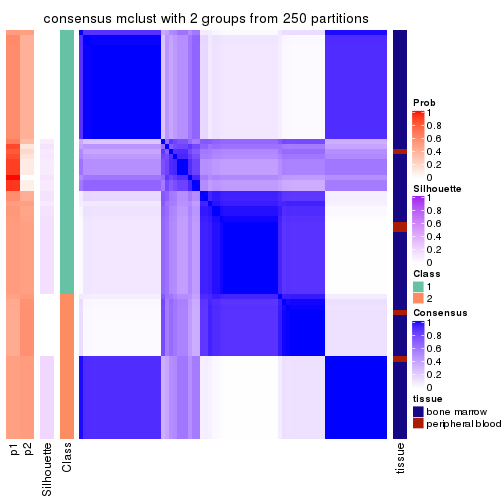</p>

</div>
<div id='tab-SD-mclust-consensus-heatmap-2'>
<pre><code class="r">consensus_heatmap(res, k = 3)
</code></pre>

<p>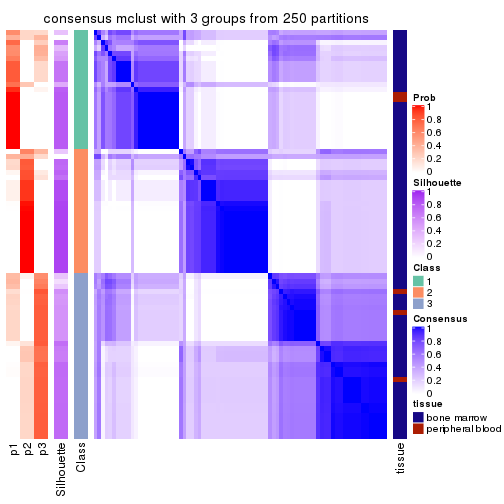</p>

</div>
<div id='tab-SD-mclust-consensus-heatmap-3'>
<pre><code class="r">consensus_heatmap(res, k = 4)
</code></pre>

<p>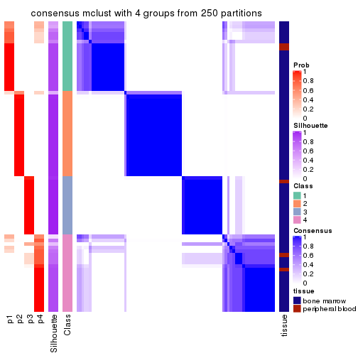</p>

</div>
<div id='tab-SD-mclust-consensus-heatmap-4'>
<pre><code class="r">consensus_heatmap(res, k = 5)
</code></pre>

<p>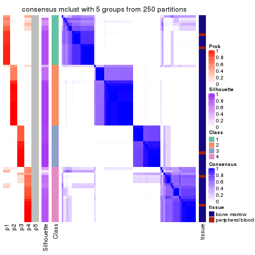</p>

</div>
<div id='tab-SD-mclust-consensus-heatmap-5'>
<pre><code class="r">consensus_heatmap(res, k = 6)
</code></pre>

<p>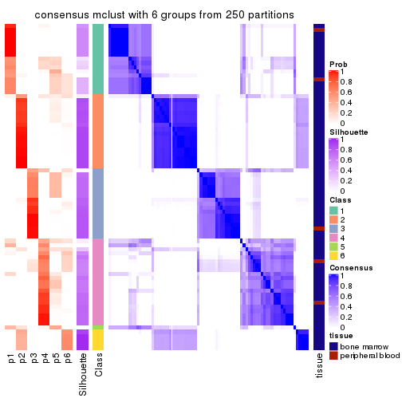</p>

</div>
</div>

Heatmaps for the membership of samples in all partitions to see how consistent they are:


<script>
$( function() {
	$( '#tabs-SD-mclust-membership-heatmap' ).tabs();
} );
</script>
<div id='tabs-SD-mclust-membership-heatmap'>
<ul>
<li><a href='#tab-SD-mclust-membership-heatmap-1'>k = 2</a></li>
<li><a href='#tab-SD-mclust-membership-heatmap-2'>k = 3</a></li>
<li><a href='#tab-SD-mclust-membership-heatmap-3'>k = 4</a></li>
<li><a href='#tab-SD-mclust-membership-heatmap-4'>k = 5</a></li>
<li><a href='#tab-SD-mclust-membership-heatmap-5'>k = 6</a></li>
</ul>
<div id='tab-SD-mclust-membership-heatmap-1'>
<pre><code class="r">membership_heatmap(res, k = 2)
</code></pre>

<p>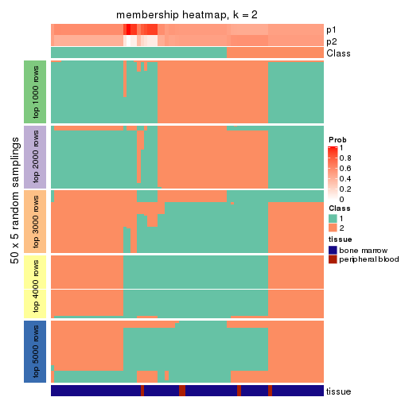</p>

</div>
<div id='tab-SD-mclust-membership-heatmap-2'>
<pre><code class="r">membership_heatmap(res, k = 3)
</code></pre>

<p>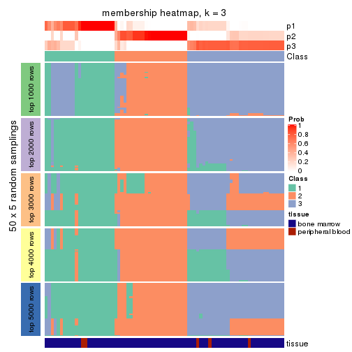</p>

</div>
<div id='tab-SD-mclust-membership-heatmap-3'>
<pre><code class="r">membership_heatmap(res, k = 4)
</code></pre>

<p>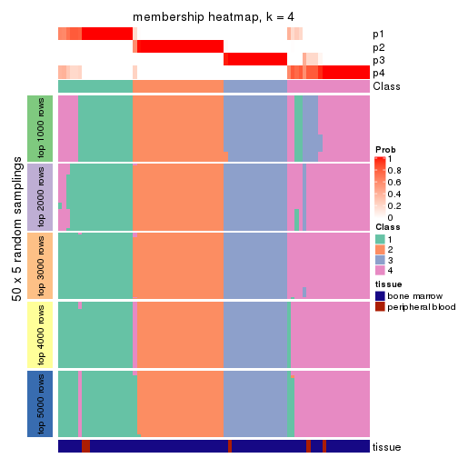</p>

</div>
<div id='tab-SD-mclust-membership-heatmap-4'>
<pre><code class="r">membership_heatmap(res, k = 5)
</code></pre>

<p>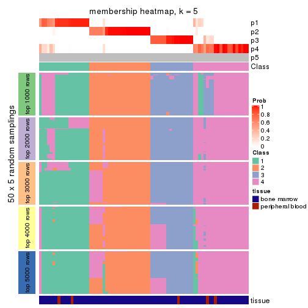</p>

</div>
<div id='tab-SD-mclust-membership-heatmap-5'>
<pre><code class="r">membership_heatmap(res, k = 6)
</code></pre>

<p>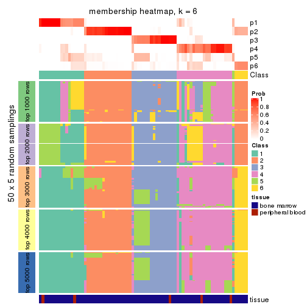</p>

</div>
</div>

As soon as we have had the classes for columns, we can look for signatures
which are significantly different between classes which can be candidate marks
for certain classes. Following are the heatmaps for signatures.


Signature heatmaps where rows are scaled:


<script>
$( function() {
	$( '#tabs-SD-mclust-get-signatures' ).tabs();
} );
</script>
<div id='tabs-SD-mclust-get-signatures'>
<ul>
<li><a href='#tab-SD-mclust-get-signatures-1'>k = 2</a></li>
<li><a href='#tab-SD-mclust-get-signatures-2'>k = 3</a></li>
<li><a href='#tab-SD-mclust-get-signatures-3'>k = 4</a></li>
<li><a href='#tab-SD-mclust-get-signatures-4'>k = 5</a></li>
<li><a href='#tab-SD-mclust-get-signatures-5'>k = 6</a></li>
</ul>
<div id='tab-SD-mclust-get-signatures-1'>
<pre><code class="r">get_signatures(res, k = 2)
</code></pre>

<p></p>

</div>
<div id='tab-SD-mclust-get-signatures-2'>
<pre><code class="r">get_signatures(res, k = 3)
</code></pre>

<p>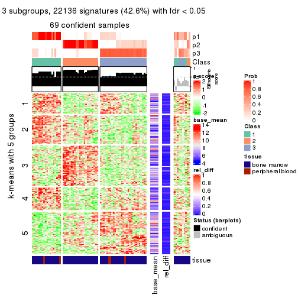</p>

</div>
<div id='tab-SD-mclust-get-signatures-3'>
<pre><code class="r">get_signatures(res, k = 4)
</code></pre>

<p>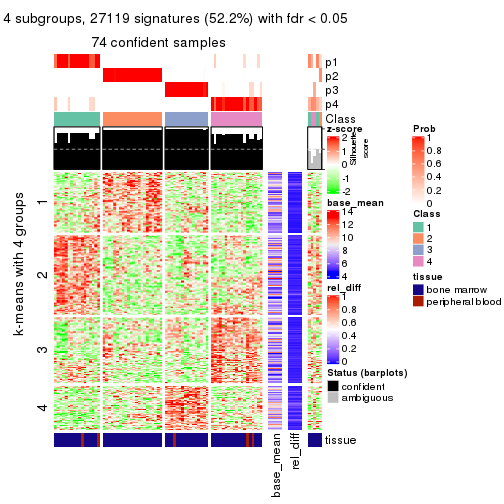</p>

</div>
<div id='tab-SD-mclust-get-signatures-4'>
<pre><code class="r">get_signatures(res, k = 5)
</code></pre>

<p>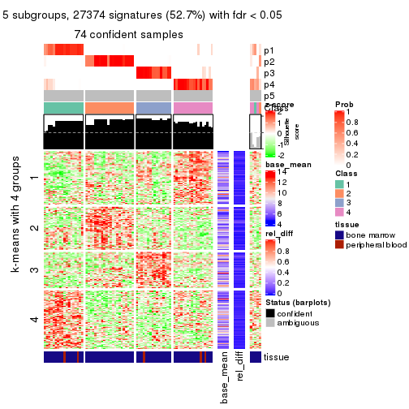</p>

</div>
<div id='tab-SD-mclust-get-signatures-5'>
<pre><code class="r">get_signatures(res, k = 6)
</code></pre>

<p>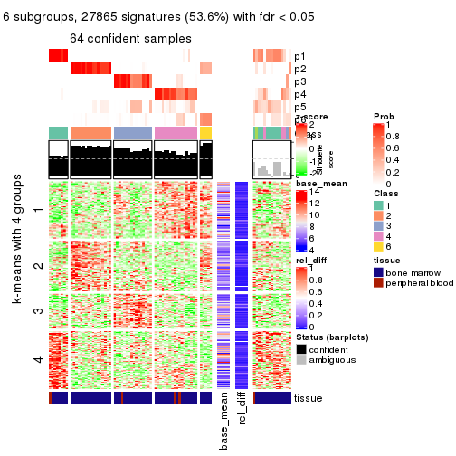</p>

</div>
</div>


Signature heatmaps where rows are not scaled:


<script>
$( function() {
	$( '#tabs-SD-mclust-get-signatures-no-scale' ).tabs();
} );
</script>
<div id='tabs-SD-mclust-get-signatures-no-scale'>
<ul>
<li><a href='#tab-SD-mclust-get-signatures-no-scale-1'>k = 2</a></li>
<li><a href='#tab-SD-mclust-get-signatures-no-scale-2'>k = 3</a></li>
<li><a href='#tab-SD-mclust-get-signatures-no-scale-3'>k = 4</a></li>
<li><a href='#tab-SD-mclust-get-signatures-no-scale-4'>k = 5</a></li>
<li><a href='#tab-SD-mclust-get-signatures-no-scale-5'>k = 6</a></li>
</ul>
<div id='tab-SD-mclust-get-signatures-no-scale-1'>
<pre><code class="r">get_signatures(res, k = 2, scale_rows = FALSE)
</code></pre>

<p></p>

</div>
<div id='tab-SD-mclust-get-signatures-no-scale-2'>
<pre><code class="r">get_signatures(res, k = 3, scale_rows = FALSE)
</code></pre>

<p>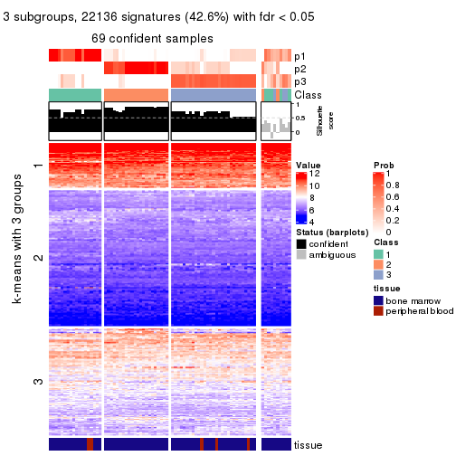</p>

</div>
<div id='tab-SD-mclust-get-signatures-no-scale-3'>
<pre><code class="r">get_signatures(res, k = 4, scale_rows = FALSE)
</code></pre>

<p>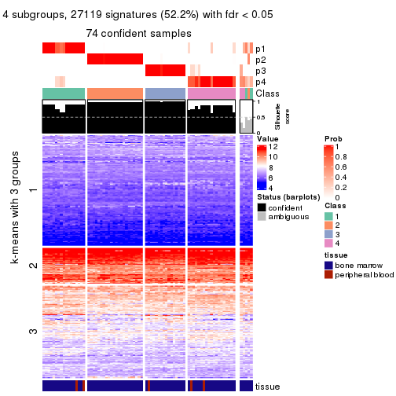</p>

</div>
<div id='tab-SD-mclust-get-signatures-no-scale-4'>
<pre><code class="r">get_signatures(res, k = 5, scale_rows = FALSE)
</code></pre>

<p>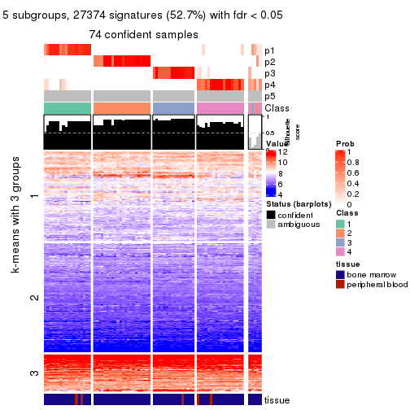</p>

</div>
<div id='tab-SD-mclust-get-signatures-no-scale-5'>
<pre><code class="r">get_signatures(res, k = 6, scale_rows = FALSE)
</code></pre>

<p>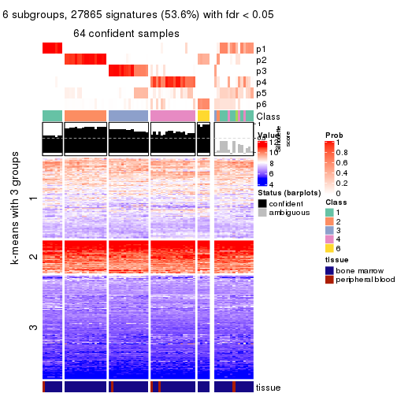</p>

</div>
</div>


Compare the overlap of signatures from different k:

```r
compare_signatures(res)
```

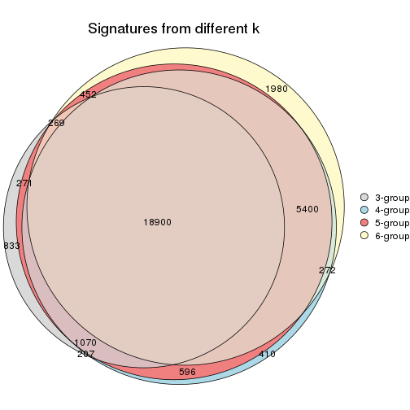

`get_signature()` returns a data frame invisibly. TO get the list of signatures, the function
call should be assigned to a variable explicitly. In following code, if `plot` argument is set
to `FALSE`, no heatmap is plotted while only the differential analysis is performed.

```r
# code only for demonstration
tb = get_signature(res, k = ..., plot = FALSE)
```

An example of the output of `tb` is:

```
#>   which_row         fdr    mean_1    mean_2 scaled_mean_1 scaled_mean_2 km
#> 1        38 0.042760348  8.373488  9.131774    -0.5533452     0.5164555  1
#> 2        40 0.018707592  7.106213  8.469186    -0.6173731     0.5762149  1
#> 3        55 0.019134737 10.221463 11.207825    -0.6159697     0.5749050  1
#> 4        59 0.006059896  5.921854  7.869574    -0.6899429     0.6439467  1
#> 5        60 0.018055526  8.928898 10.211722    -0.6204761     0.5791110  1
#> 6        98 0.009384629 15.714769 14.887706     0.6635654    -0.6193277  2
...
```

The columns in `tb` are:

1. `which_row`: row indices corresponding to the input matrix.
2. `fdr`: FDR for the differential test. 
3. `mean_x`: The mean value in group x.
4. `scaled_mean_x`: The mean value in group x after rows are scaled.
5. `km`: Row groups if k-means clustering is applied to rows.


UMAP plot which shows how samples are separated.


<script>
$( function() {
	$( '#tabs-SD-mclust-dimension-reduction' ).tabs();
} );
</script>
<div id='tabs-SD-mclust-dimension-reduction'>
<ul>
<li><a href='#tab-SD-mclust-dimension-reduction-1'>k = 2</a></li>
<li><a href='#tab-SD-mclust-dimension-reduction-2'>k = 3</a></li>
<li><a href='#tab-SD-mclust-dimension-reduction-3'>k = 4</a></li>
<li><a href='#tab-SD-mclust-dimension-reduction-4'>k = 5</a></li>
<li><a href='#tab-SD-mclust-dimension-reduction-5'>k = 6</a></li>
</ul>
<div id='tab-SD-mclust-dimension-reduction-1'>
<pre><code class="r">dimension_reduction(res, k = 2, method = &quot;UMAP&quot;)
</code></pre>

<p>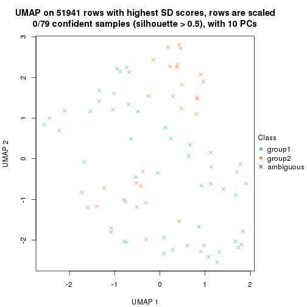</p>

</div>
<div id='tab-SD-mclust-dimension-reduction-2'>
<pre><code class="r">dimension_reduction(res, k = 3, method = &quot;UMAP&quot;)
</code></pre>

<p>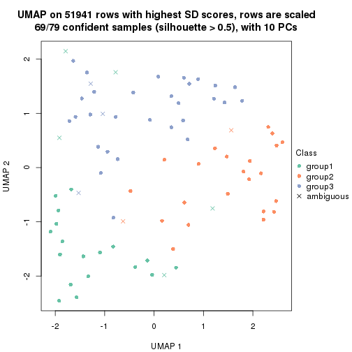</p>

</div>
<div id='tab-SD-mclust-dimension-reduction-3'>
<pre><code class="r">dimension_reduction(res, k = 4, method = &quot;UMAP&quot;)
</code></pre>

<p>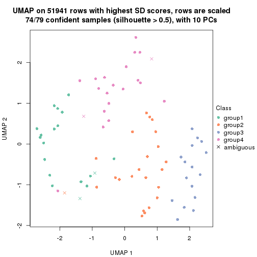</p>

</div>
<div id='tab-SD-mclust-dimension-reduction-4'>
<pre><code class="r">dimension_reduction(res, k = 5, method = &quot;UMAP&quot;)
</code></pre>

<p>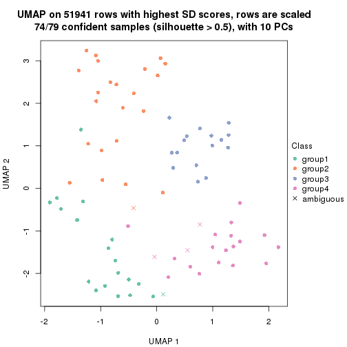</p>

</div>
<div id='tab-SD-mclust-dimension-reduction-5'>
<pre><code class="r">dimension_reduction(res, k = 6, method = &quot;UMAP&quot;)
</code></pre>

<p>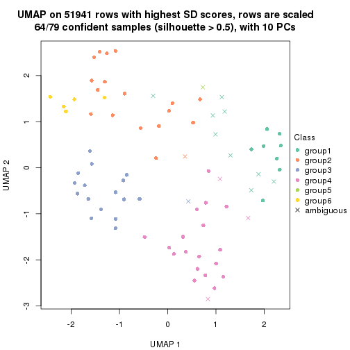</p>

</div>
</div>


Following heatmap shows how subgroups are split when increasing `k`:

```r
collect_classes(res)
```

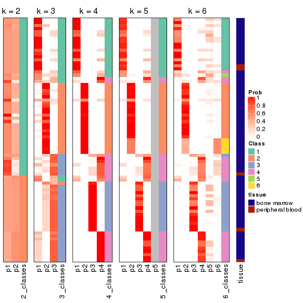


Test correlation between subgroups and known annotations. If the known
annotation is numeric, one-way ANOVA test is applied, and if the known
annotation is discrete, chi-squared contingency table test is applied.

```r
test_to_known_factors(res)
```

```
#>            n tissue(p) k
#> SD:mclust  0        NA 2
#> SD:mclust 69     0.282 3
#> SD:mclust 74     0.439 4
#> SD:mclust 74     0.443 5
#> SD:mclust 64     0.605 6
```


If matrix rows can be associated to genes, consider to use `GO_Enrichment(res,
...)` to perform function enrichment for the signature genes.


 

---------------------------------------------------


### SD:NMF**


The object with results only for a single top-value method and a single partition method 
can be extracted as:

```r
res = res_list["SD", "NMF"]
# you can also extract it by
# res = res_list["SD:NMF"]
```

A summary of `res` and all the functions that can be applied to it:

```r
res
```

```
#> A 'ConsensusPartition' object with k = 2, 3, 4, 5, 6.
#>   On a matrix with 51941 rows and 79 columns.
#>   Top rows (1000, 2000, 3000, 4000, 5000) are extracted by 'SD' method.
#>   Subgroups are detected by 'NMF' method.
#>   Performed in total 1250 partitions by row resampling.
#>   Best k for subgroups seems to be 3.
#> 
#> Following methods can be applied to this 'ConsensusPartition' object:
#>  [1] "cola_report"             "collect_classes"         "collect_plots"          
#>  [4] "collect_stats"           "colnames"                "compare_signatures"     
#>  [7] "consensus_heatmap"       "dimension_reduction"     "functional_enrichment"  
#> [10] "get_anno_col"            "get_anno"                "get_classes"            
#> [13] "get_consensus"           "get_matrix"              "get_membership"         
#> [16] "get_param"               "get_signatures"          "get_stats"              
#> [19] "is_best_k"               "is_stable_k"             "membership_heatmap"     
#> [22] "ncol"                    "nrow"                    "plot_ecdf"              
#> [25] "rownames"                "select_partition_number" "show"                   
#> [28] "suggest_best_k"          "test_to_known_factors"
```

`collect_plots()` function collects all the plots made from `res` for all `k` (number of partitions)
into one single page to provide an easy and fast comparison between different `k`.

```r
collect_plots(res)
```

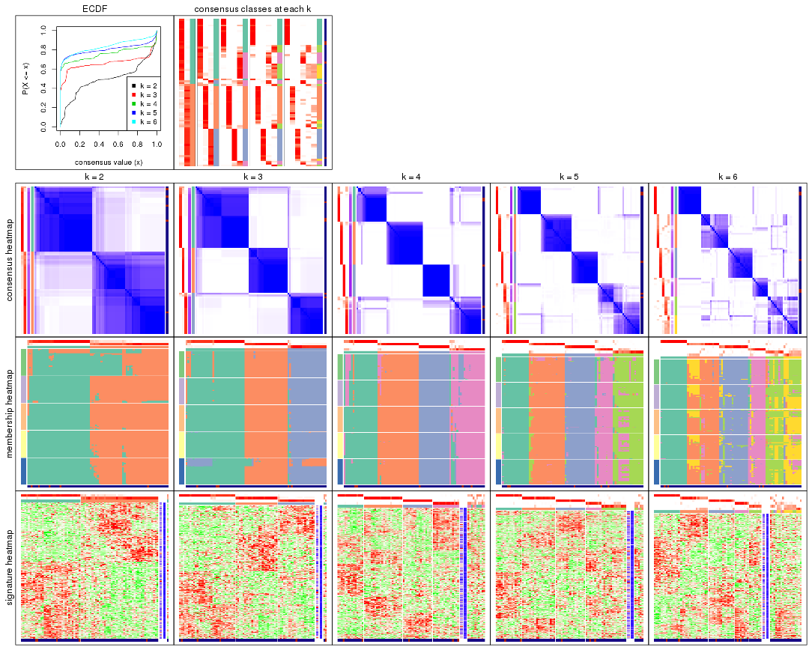

The plots are:

- The first row: a plot of the ECDF (Empirical cumulative distribution
  function) curves of the consensus matrix for each `k` and the heatmap of
  predicted classes for each `k`.
- The second row: heatmaps of the consensus matrix for each `k`.
- The third row: heatmaps of the membership matrix for each `k`.
- The fouth row: heatmaps of the signatures for each `k`.

All the plots in panels can be made by individual functions and they are
plotted later in this section.

`select_partition_number()` produces several plots showing different
statistics for choosing "optimized" `k`. There are following statistics:

- ECDF curves of the consensus matrix for each `k`;
- 1-PAC. [The PAC
  score](https://en.wikipedia.org/wiki/Consensus_clustering#Over-interpretation_potential_of_consensus_clustering)
  measures the proportion of the ambiguous subgrouping.
- Mean silhouette score.
- Concordance. The mean probability of fiting the consensus class ids in all
  partitions.
- Area increased. Denote $A_k$ as the area under the ECDF curve for current
  `k`, the area increased is defined as $A_k - A_{k-1}$.
- Rand index. The percent of pairs of samples that are both in a same cluster
  or both are not in a same cluster in the partition of k and k-1.
- Jaccard index. The ratio of pairs of samples are both in a same cluster in
  the partition of k and k-1 and the pairs of samples are both in a same
  cluster in the partition k or k-1.

The detailed explanations of these statistics can be found in [the cola
vignette](http://bioconductor.org/packages/devel/bioc/vignettes/cola/inst/doc/cola.html#toc_13).

Generally speaking, lower PAC score, higher mean silhouette score or higher
concordance corresponds to better partition. Rand index and Jaccard index
measure how similar the current partition is compared to partition with `k-1`.
If they are too similar, we won't accept `k` is better than `k-1`.

```r
select_partition_number(res)
```

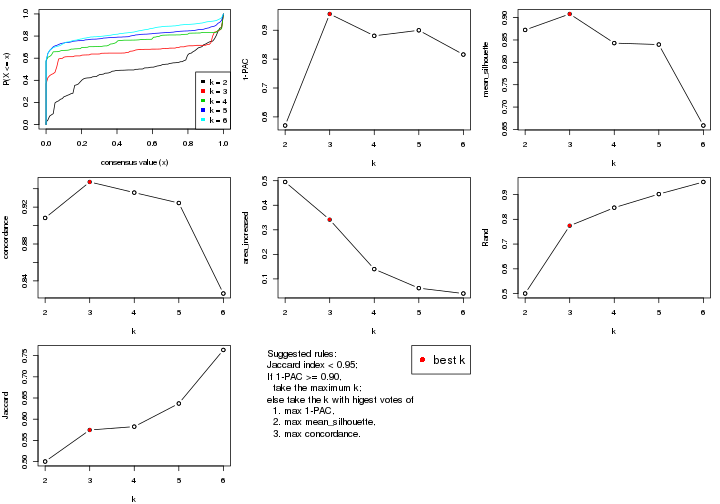

The numeric values for all these statistics can be obtained by `get_stats()`.

```r
get_stats(res)
```

```
#>   k 1-PAC mean_silhouette concordance area_increased  Rand Jaccard
#> 2 2 0.570           0.872       0.908         0.4949 0.500   0.500
#> 3 3 0.956           0.908       0.947         0.3413 0.774   0.575
#> 4 4 0.881           0.843       0.936         0.1398 0.847   0.582
#> 5 5 0.900           0.840       0.924         0.0623 0.902   0.637
#> 6 6 0.816           0.659       0.826         0.0404 0.951   0.763
```

`suggest_best_k()` suggests the best $k$ based on these statistics. The rules are as follows:

- All $k$ with Jaccard index larger than 0.95 are removed because the increase of
  the partition number does not provides enough extra information. If all $k$ are removed,
  the best $k$ is assigned by `NA`.
- For $k$ with 1-PAC larger than 0.9, the maximal $k$ is taken as the "best k". Other $k$ is called "optional k".
- If it does not fit the second rule. The $k$ with the highest vote of highest
  1-PAC, mean silhouette and concordance is taken as the "best k".

```r
suggest_best_k(res)
```

```
#> [1] 3
```


Following shows the table of the partitions (You need to click the **show/hide
code output** link to see it). The membership matrix (columns with name `p*`)
is inferred by
[`clue::cl_consensus()`](https://www.rdocumentation.org/link/cl_consensus?package=clue)
function with the `SE` method. Basically the value in the membership matrix
represents the probability to belong to a certain group. The finall class
label for an item is determined with the group with highest probability it
belongs to.

In `get_classes()` function, the entropy is calculated from the membership
matrix and the silhouette score is calculated from the consensus matrix.


<script>
$( function() {
	$( '#tabs-SD-NMF-get-classes' ).tabs();
} );
</script>
<div id='tabs-SD-NMF-get-classes'>
<ul>
<li><a href='#tab-SD-NMF-get-classes-1'>k = 2</a></li>
<li><a href='#tab-SD-NMF-get-classes-2'>k = 3</a></li>
<li><a href='#tab-SD-NMF-get-classes-3'>k = 4</a></li>
<li><a href='#tab-SD-NMF-get-classes-4'>k = 5</a></li>
<li><a href='#tab-SD-NMF-get-classes-5'>k = 6</a></li>
</ul>

<div id='tab-SD-NMF-get-classes-1'>
<p><a id='tab-SD-NMF-get-classes-1-a' style='color:#0366d6' href='#'>show/hide code output</a></p>
<pre><code class="r">cbind(get_classes(res, k = 2), get_membership(res, k = 2))
</code></pre>

<pre><code>#&gt;           class entropy silhouette    p1    p2
#&gt; GSM316652     2  0.2778      0.876 0.048 0.952
#&gt; GSM316653     1  0.0000      0.959 1.000 0.000
#&gt; GSM316654     1  0.0376      0.957 0.996 0.004
#&gt; GSM316655     1  0.2043      0.942 0.968 0.032
#&gt; GSM316656     2  0.4562      0.876 0.096 0.904
#&gt; GSM316657     1  0.2778      0.928 0.952 0.048
#&gt; GSM316658     2  0.6247      0.854 0.156 0.844
#&gt; GSM316659     2  0.6247      0.854 0.156 0.844
#&gt; GSM316660     1  0.0000      0.959 1.000 0.000
#&gt; GSM316661     1  0.6048      0.807 0.852 0.148
#&gt; GSM316662     2  0.2603      0.876 0.044 0.956
#&gt; GSM316663     2  0.2778      0.876 0.048 0.952
#&gt; GSM316664     1  0.0000      0.959 1.000 0.000
#&gt; GSM316665     2  0.0000      0.872 0.000 1.000
#&gt; GSM316666     2  0.2778      0.876 0.048 0.952
#&gt; GSM316667     2  0.5629      0.862 0.132 0.868
#&gt; GSM316668     2  0.2603      0.876 0.044 0.956
#&gt; GSM316669     1  0.0000      0.959 1.000 0.000
#&gt; GSM316670     2  0.0938      0.874 0.012 0.988
#&gt; GSM316671     2  0.2778      0.876 0.048 0.952
#&gt; GSM316672     1  0.2778      0.928 0.952 0.048
#&gt; GSM316673     1  0.0000      0.959 1.000 0.000
#&gt; GSM316674     2  0.2778      0.876 0.048 0.952
#&gt; GSM316676     2  0.2778      0.876 0.048 0.952
#&gt; GSM316677     1  0.0000      0.959 1.000 0.000
#&gt; GSM316678     2  0.6887      0.834 0.184 0.816
#&gt; GSM316679     1  0.1633      0.947 0.976 0.024
#&gt; GSM316680     1  0.2778      0.928 0.952 0.048
#&gt; GSM316681     2  0.2778      0.876 0.048 0.952
#&gt; GSM316682     1  0.2043      0.942 0.968 0.032
#&gt; GSM316683     1  0.2043      0.942 0.968 0.032
#&gt; GSM316684     2  0.6247      0.854 0.156 0.844
#&gt; GSM316685     2  0.0000      0.872 0.000 1.000
#&gt; GSM316686     1  0.0376      0.957 0.996 0.004
#&gt; GSM316687     1  0.9933      0.160 0.548 0.452
#&gt; GSM316688     2  0.9427      0.603 0.360 0.640
#&gt; GSM316689     1  0.0000      0.959 1.000 0.000
#&gt; GSM316690     2  0.2778      0.876 0.048 0.952
#&gt; GSM316691     2  0.3879      0.875 0.076 0.924
#&gt; GSM316692     2  0.2603      0.876 0.044 0.956
#&gt; GSM316693     1  0.0000      0.959 1.000 0.000
#&gt; GSM316694     2  0.2778      0.876 0.048 0.952
#&gt; GSM316696     1  0.2043      0.942 0.968 0.032
#&gt; GSM316697     2  0.2778      0.876 0.048 0.952
#&gt; GSM316698     2  0.6343      0.851 0.160 0.840
#&gt; GSM316699     2  0.0376      0.873 0.004 0.996
#&gt; GSM316700     1  0.1843      0.939 0.972 0.028
#&gt; GSM316701     1  0.0000      0.959 1.000 0.000
#&gt; GSM316703     2  0.6343      0.851 0.160 0.840
#&gt; GSM316704     2  0.6343      0.851 0.160 0.840
#&gt; GSM316705     1  0.0376      0.957 0.996 0.004
#&gt; GSM316706     2  0.8763      0.710 0.296 0.704
#&gt; GSM316707     2  0.6247      0.854 0.156 0.844
#&gt; GSM316708     2  0.9170      0.652 0.332 0.668
#&gt; GSM316709     2  0.2778      0.876 0.048 0.952
#&gt; GSM316710     1  0.2948      0.916 0.948 0.052
#&gt; GSM316711     2  0.6247      0.854 0.156 0.844
#&gt; GSM316713     1  0.0000      0.959 1.000 0.000
#&gt; GSM316714     2  0.8713      0.623 0.292 0.708
#&gt; GSM316715     1  0.0000      0.959 1.000 0.000
#&gt; GSM316716     2  0.0672      0.874 0.008 0.992
#&gt; GSM316717     1  0.0000      0.959 1.000 0.000
#&gt; GSM316718     2  0.8267      0.758 0.260 0.740
#&gt; GSM316719     1  0.0000      0.959 1.000 0.000
#&gt; GSM316720     1  0.0000      0.959 1.000 0.000
#&gt; GSM316721     2  0.2603      0.877 0.044 0.956
#&gt; GSM316722     1  0.0000      0.959 1.000 0.000
#&gt; GSM316723     2  0.6148      0.855 0.152 0.848
#&gt; GSM316724     2  0.6247      0.854 0.156 0.844
#&gt; GSM316726     2  0.3584      0.876 0.068 0.932
#&gt; GSM316727     1  0.0000      0.959 1.000 0.000
#&gt; GSM316728     2  0.7139      0.768 0.196 0.804
#&gt; GSM316729     2  0.9491      0.580 0.368 0.632
#&gt; GSM316730     2  0.6343      0.851 0.160 0.840
#&gt; GSM316675     2  0.2778      0.876 0.048 0.952
#&gt; GSM316695     1  0.1633      0.947 0.976 0.024
#&gt; GSM316702     1  0.6531      0.784 0.832 0.168
#&gt; GSM316712     1  0.0000      0.959 1.000 0.000
#&gt; GSM316725     1  0.2423      0.928 0.960 0.040
</code></pre>

<script>
$('#tab-SD-NMF-get-classes-1-a').parent().next().next().hide();
$('#tab-SD-NMF-get-classes-1-a').click(function(){
  $('#tab-SD-NMF-get-classes-1-a').parent().next().next().toggle();
  return(false);
});
</script>
</div>

<div id='tab-SD-NMF-get-classes-2'>
<p><a id='tab-SD-NMF-get-classes-2-a' style='color:#0366d6' href='#'>show/hide code output</a></p>
<pre><code class="r">cbind(get_classes(res, k = 3), get_membership(res, k = 3))
</code></pre>

<pre><code>#&gt;           class entropy silhouette    p1    p2    p3
#&gt; GSM316652     3  0.2165      0.935 0.000 0.064 0.936
#&gt; GSM316653     1  0.2165      0.927 0.936 0.000 0.064
#&gt; GSM316654     1  0.2261      0.925 0.932 0.000 0.068
#&gt; GSM316655     1  0.1989      0.931 0.948 0.004 0.048
#&gt; GSM316656     3  0.8181      0.506 0.096 0.312 0.592
#&gt; GSM316657     1  0.0000      0.938 1.000 0.000 0.000
#&gt; GSM316658     2  0.0000      0.981 0.000 1.000 0.000
#&gt; GSM316659     2  0.0000      0.981 0.000 1.000 0.000
#&gt; GSM316660     1  0.0000      0.938 1.000 0.000 0.000
#&gt; GSM316661     1  0.2796      0.911 0.908 0.000 0.092
#&gt; GSM316662     3  0.2261      0.932 0.000 0.068 0.932
#&gt; GSM316663     3  0.0000      0.911 0.000 0.000 1.000
#&gt; GSM316664     1  0.2165      0.927 0.936 0.000 0.064
#&gt; GSM316665     2  0.1529      0.943 0.000 0.960 0.040
#&gt; GSM316666     3  0.2066      0.935 0.000 0.060 0.940
#&gt; GSM316667     2  0.0000      0.981 0.000 1.000 0.000
#&gt; GSM316668     3  0.2165      0.935 0.000 0.064 0.936
#&gt; GSM316669     1  0.2165      0.927 0.936 0.000 0.064
#&gt; GSM316670     3  0.2165      0.935 0.000 0.064 0.936
#&gt; GSM316671     3  0.2165      0.935 0.000 0.064 0.936
#&gt; GSM316672     2  0.2165      0.934 0.064 0.936 0.000
#&gt; GSM316673     1  0.0000      0.938 1.000 0.000 0.000
#&gt; GSM316674     3  0.2165      0.935 0.000 0.064 0.936
#&gt; GSM316676     3  0.2165      0.935 0.000 0.064 0.936
#&gt; GSM316677     1  0.0000      0.938 1.000 0.000 0.000
#&gt; GSM316678     2  0.0424      0.977 0.008 0.992 0.000
#&gt; GSM316679     1  0.0000      0.938 1.000 0.000 0.000
#&gt; GSM316680     1  0.5058      0.679 0.756 0.244 0.000
#&gt; GSM316681     3  0.2165      0.935 0.000 0.064 0.936
#&gt; GSM316682     1  0.6585      0.741 0.736 0.200 0.064
#&gt; GSM316683     1  0.6004      0.798 0.780 0.156 0.064
#&gt; GSM316684     2  0.0000      0.981 0.000 1.000 0.000
#&gt; GSM316685     3  0.2261      0.933 0.000 0.068 0.932
#&gt; GSM316686     1  0.2165      0.927 0.936 0.000 0.064
#&gt; GSM316687     3  0.0000      0.911 0.000 0.000 1.000
#&gt; GSM316688     1  0.7289      0.111 0.504 0.468 0.028
#&gt; GSM316689     1  0.0000      0.938 1.000 0.000 0.000
#&gt; GSM316690     3  0.0000      0.911 0.000 0.000 1.000
#&gt; GSM316691     2  0.0000      0.981 0.000 1.000 0.000
#&gt; GSM316692     3  0.1860      0.934 0.000 0.052 0.948
#&gt; GSM316693     1  0.2261      0.925 0.932 0.000 0.068
#&gt; GSM316694     3  0.2165      0.935 0.000 0.064 0.936
#&gt; GSM316696     1  0.0000      0.938 1.000 0.000 0.000
#&gt; GSM316697     3  0.1964      0.935 0.000 0.056 0.944
#&gt; GSM316698     2  0.0000      0.981 0.000 1.000 0.000
#&gt; GSM316699     2  0.0000      0.981 0.000 1.000 0.000
#&gt; GSM316700     1  0.2356      0.924 0.928 0.000 0.072
#&gt; GSM316701     1  0.2165      0.927 0.936 0.000 0.064
#&gt; GSM316703     2  0.0424      0.977 0.000 0.992 0.008
#&gt; GSM316704     2  0.0747      0.971 0.000 0.984 0.016
#&gt; GSM316705     1  0.0237      0.938 0.996 0.000 0.004
#&gt; GSM316706     2  0.2066      0.931 0.000 0.940 0.060
#&gt; GSM316707     2  0.0000      0.981 0.000 1.000 0.000
#&gt; GSM316708     2  0.2066      0.938 0.060 0.940 0.000
#&gt; GSM316709     3  0.1753      0.933 0.000 0.048 0.952
#&gt; GSM316710     1  0.2356      0.924 0.928 0.000 0.072
#&gt; GSM316711     2  0.0000      0.981 0.000 1.000 0.000
#&gt; GSM316713     1  0.0000      0.938 1.000 0.000 0.000
#&gt; GSM316714     3  0.0000      0.911 0.000 0.000 1.000
#&gt; GSM316715     1  0.0000      0.938 1.000 0.000 0.000
#&gt; GSM316716     2  0.0000      0.981 0.000 1.000 0.000
#&gt; GSM316717     1  0.0000      0.938 1.000 0.000 0.000
#&gt; GSM316718     2  0.1964      0.941 0.056 0.944 0.000
#&gt; GSM316719     1  0.0000      0.938 1.000 0.000 0.000
#&gt; GSM316720     1  0.0000      0.938 1.000 0.000 0.000
#&gt; GSM316721     2  0.0000      0.981 0.000 1.000 0.000
#&gt; GSM316722     1  0.0000      0.938 1.000 0.000 0.000
#&gt; GSM316723     2  0.0000      0.981 0.000 1.000 0.000
#&gt; GSM316724     2  0.0000      0.981 0.000 1.000 0.000
#&gt; GSM316726     2  0.0000      0.981 0.000 1.000 0.000
#&gt; GSM316727     1  0.0000      0.938 1.000 0.000 0.000
#&gt; GSM316728     3  0.0000      0.911 0.000 0.000 1.000
#&gt; GSM316729     2  0.2066      0.938 0.060 0.940 0.000
#&gt; GSM316730     2  0.0000      0.981 0.000 1.000 0.000
#&gt; GSM316675     3  0.1163      0.925 0.000 0.028 0.972
#&gt; GSM316695     1  0.0000      0.938 1.000 0.000 0.000
#&gt; GSM316702     3  0.6260      0.028 0.448 0.000 0.552
#&gt; GSM316712     1  0.0000      0.938 1.000 0.000 0.000
#&gt; GSM316725     1  0.2356      0.924 0.928 0.000 0.072
</code></pre>

<script>
$('#tab-SD-NMF-get-classes-2-a').parent().next().next().hide();
$('#tab-SD-NMF-get-classes-2-a').click(function(){
  $('#tab-SD-NMF-get-classes-2-a').parent().next().next().toggle();
  return(false);
});
</script>
</div>

<div id='tab-SD-NMF-get-classes-3'>
<p><a id='tab-SD-NMF-get-classes-3-a' style='color:#0366d6' href='#'>show/hide code output</a></p>
<pre><code class="r">cbind(get_classes(res, k = 4), get_membership(res, k = 4))
</code></pre>

<pre><code>#&gt;           class entropy silhouette    p1    p2    p3    p4
#&gt; GSM316652     3  0.0000     1.0000 0.000 0.000 1.000 0.000
#&gt; GSM316653     4  0.0336     0.8368 0.008 0.000 0.000 0.992
#&gt; GSM316654     4  0.1022     0.8241 0.032 0.000 0.000 0.968
#&gt; GSM316655     4  0.1022     0.8214 0.032 0.000 0.000 0.968
#&gt; GSM316656     4  0.6652     0.2561 0.032 0.032 0.404 0.532
#&gt; GSM316657     1  0.0000     0.8877 1.000 0.000 0.000 0.000
#&gt; GSM316658     2  0.0000     0.9682 0.000 1.000 0.000 0.000
#&gt; GSM316659     2  0.0000     0.9682 0.000 1.000 0.000 0.000
#&gt; GSM316660     1  0.0000     0.8877 1.000 0.000 0.000 0.000
#&gt; GSM316661     4  0.0000     0.8391 0.000 0.000 0.000 1.000
#&gt; GSM316662     3  0.0000     1.0000 0.000 0.000 1.000 0.000
#&gt; GSM316663     4  0.0817     0.8307 0.000 0.000 0.024 0.976
#&gt; GSM316664     4  0.4855     0.2991 0.400 0.000 0.000 0.600
#&gt; GSM316665     2  0.0817     0.9493 0.000 0.976 0.024 0.000
#&gt; GSM316666     3  0.0000     1.0000 0.000 0.000 1.000 0.000
#&gt; GSM316667     2  0.0188     0.9660 0.000 0.996 0.000 0.004
#&gt; GSM316668     3  0.0000     1.0000 0.000 0.000 1.000 0.000
#&gt; GSM316669     4  0.0188     0.8382 0.004 0.000 0.000 0.996
#&gt; GSM316670     3  0.0000     1.0000 0.000 0.000 1.000 0.000
#&gt; GSM316671     3  0.0000     1.0000 0.000 0.000 1.000 0.000
#&gt; GSM316672     1  0.4697     0.4440 0.644 0.356 0.000 0.000
#&gt; GSM316673     1  0.0000     0.8877 1.000 0.000 0.000 0.000
#&gt; GSM316674     3  0.0000     1.0000 0.000 0.000 1.000 0.000
#&gt; GSM316676     3  0.0000     1.0000 0.000 0.000 1.000 0.000
#&gt; GSM316677     4  0.4697     0.3648 0.356 0.000 0.000 0.644
#&gt; GSM316678     2  0.0000     0.9682 0.000 1.000 0.000 0.000
#&gt; GSM316679     1  0.0000     0.8877 1.000 0.000 0.000 0.000
#&gt; GSM316680     1  0.5016     0.3393 0.600 0.004 0.000 0.396
#&gt; GSM316681     3  0.0000     1.0000 0.000 0.000 1.000 0.000
#&gt; GSM316682     4  0.0000     0.8391 0.000 0.000 0.000 1.000
#&gt; GSM316683     4  0.0000     0.8391 0.000 0.000 0.000 1.000
#&gt; GSM316684     2  0.0000     0.9682 0.000 1.000 0.000 0.000
#&gt; GSM316685     3  0.0000     1.0000 0.000 0.000 1.000 0.000
#&gt; GSM316686     1  0.4790     0.2885 0.620 0.000 0.000 0.380
#&gt; GSM316687     4  0.4661     0.4726 0.000 0.000 0.348 0.652
#&gt; GSM316688     4  0.8581    -0.0309 0.384 0.132 0.072 0.412
#&gt; GSM316689     1  0.0000     0.8877 1.000 0.000 0.000 0.000
#&gt; GSM316690     3  0.0000     1.0000 0.000 0.000 1.000 0.000
#&gt; GSM316691     2  0.3528     0.7528 0.000 0.808 0.000 0.192
#&gt; GSM316692     3  0.0000     1.0000 0.000 0.000 1.000 0.000
#&gt; GSM316693     4  0.0000     0.8391 0.000 0.000 0.000 1.000
#&gt; GSM316694     3  0.0000     1.0000 0.000 0.000 1.000 0.000
#&gt; GSM316696     1  0.0000     0.8877 1.000 0.000 0.000 0.000
#&gt; GSM316697     3  0.0000     1.0000 0.000 0.000 1.000 0.000
#&gt; GSM316698     2  0.0000     0.9682 0.000 1.000 0.000 0.000
#&gt; GSM316699     2  0.0188     0.9658 0.000 0.996 0.004 0.000
#&gt; GSM316700     4  0.0000     0.8391 0.000 0.000 0.000 1.000
#&gt; GSM316701     4  0.0000     0.8391 0.000 0.000 0.000 1.000
#&gt; GSM316703     2  0.0000     0.9682 0.000 1.000 0.000 0.000
#&gt; GSM316704     2  0.0592     0.9566 0.000 0.984 0.000 0.016
#&gt; GSM316705     1  0.1211     0.8570 0.960 0.000 0.000 0.040
#&gt; GSM316706     2  0.0000     0.9682 0.000 1.000 0.000 0.000
#&gt; GSM316707     2  0.0000     0.9682 0.000 1.000 0.000 0.000
#&gt; GSM316708     2  0.0188     0.9657 0.004 0.996 0.000 0.000
#&gt; GSM316709     3  0.0000     1.0000 0.000 0.000 1.000 0.000
#&gt; GSM316710     4  0.0000     0.8391 0.000 0.000 0.000 1.000
#&gt; GSM316711     2  0.0000     0.9682 0.000 1.000 0.000 0.000
#&gt; GSM316713     1  0.0000     0.8877 1.000 0.000 0.000 0.000
#&gt; GSM316714     3  0.0000     1.0000 0.000 0.000 1.000 0.000
#&gt; GSM316715     1  0.0000     0.8877 1.000 0.000 0.000 0.000
#&gt; GSM316716     2  0.0000     0.9682 0.000 1.000 0.000 0.000
#&gt; GSM316717     1  0.2760     0.7789 0.872 0.000 0.000 0.128
#&gt; GSM316718     2  0.1022     0.9431 0.000 0.968 0.000 0.032
#&gt; GSM316719     1  0.0000     0.8877 1.000 0.000 0.000 0.000
#&gt; GSM316720     1  0.0000     0.8877 1.000 0.000 0.000 0.000
#&gt; GSM316721     2  0.0000     0.9682 0.000 1.000 0.000 0.000
#&gt; GSM316722     1  0.4855     0.3344 0.600 0.000 0.000 0.400
#&gt; GSM316723     2  0.0000     0.9682 0.000 1.000 0.000 0.000
#&gt; GSM316724     2  0.0000     0.9682 0.000 1.000 0.000 0.000
#&gt; GSM316726     2  0.0000     0.9682 0.000 1.000 0.000 0.000
#&gt; GSM316727     1  0.0000     0.8877 1.000 0.000 0.000 0.000
#&gt; GSM316728     4  0.3942     0.6556 0.000 0.000 0.236 0.764
#&gt; GSM316729     2  0.6338     0.4101 0.084 0.600 0.000 0.316
#&gt; GSM316730     2  0.0000     0.9682 0.000 1.000 0.000 0.000
#&gt; GSM316675     3  0.0000     1.0000 0.000 0.000 1.000 0.000
#&gt; GSM316695     1  0.0000     0.8877 1.000 0.000 0.000 0.000
#&gt; GSM316702     4  0.3610     0.6986 0.000 0.000 0.200 0.800
#&gt; GSM316712     1  0.0000     0.8877 1.000 0.000 0.000 0.000
#&gt; GSM316725     4  0.0000     0.8391 0.000 0.000 0.000 1.000
</code></pre>

<script>
$('#tab-SD-NMF-get-classes-3-a').parent().next().next().hide();
$('#tab-SD-NMF-get-classes-3-a').click(function(){
  $('#tab-SD-NMF-get-classes-3-a').parent().next().next().toggle();
  return(false);
});
</script>
</div>

<div id='tab-SD-NMF-get-classes-4'>
<p><a id='tab-SD-NMF-get-classes-4-a' style='color:#0366d6' href='#'>show/hide code output</a></p>
<pre><code class="r">cbind(get_classes(res, k = 5), get_membership(res, k = 5))
</code></pre>

<pre><code>#&gt;           class entropy silhouette    p1    p2    p3    p4    p5
#&gt; GSM316652     3  0.0000     0.9787 0.000 0.000 1.000 0.000 0.000
#&gt; GSM316653     5  0.3857     0.5728 0.000 0.000 0.000 0.312 0.688
#&gt; GSM316654     4  0.1478     0.7966 0.000 0.000 0.000 0.936 0.064
#&gt; GSM316655     5  0.0510     0.7631 0.000 0.000 0.000 0.016 0.984
#&gt; GSM316656     5  0.0162     0.7616 0.000 0.000 0.000 0.004 0.996
#&gt; GSM316657     1  0.0000     0.9841 1.000 0.000 0.000 0.000 0.000
#&gt; GSM316658     2  0.0290     0.9399 0.000 0.992 0.000 0.008 0.000
#&gt; GSM316659     2  0.0290     0.9402 0.000 0.992 0.000 0.008 0.000
#&gt; GSM316660     1  0.0000     0.9841 1.000 0.000 0.000 0.000 0.000
#&gt; GSM316661     5  0.4182     0.4306 0.000 0.000 0.000 0.400 0.600
#&gt; GSM316662     3  0.0000     0.9787 0.000 0.000 1.000 0.000 0.000
#&gt; GSM316663     4  0.3687     0.6572 0.000 0.000 0.028 0.792 0.180
#&gt; GSM316664     4  0.4297     0.1430 0.472 0.000 0.000 0.528 0.000
#&gt; GSM316665     2  0.0609     0.9336 0.000 0.980 0.020 0.000 0.000
#&gt; GSM316666     3  0.0162     0.9776 0.000 0.000 0.996 0.004 0.000
#&gt; GSM316667     2  0.4302     0.6649 0.000 0.720 0.000 0.032 0.248
#&gt; GSM316668     3  0.0000     0.9787 0.000 0.000 1.000 0.000 0.000
#&gt; GSM316669     5  0.3949     0.5433 0.000 0.000 0.000 0.332 0.668
#&gt; GSM316670     3  0.1331     0.9487 0.000 0.000 0.952 0.040 0.008
#&gt; GSM316671     3  0.2605     0.8251 0.000 0.000 0.852 0.000 0.148
#&gt; GSM316672     1  0.1671     0.8971 0.924 0.076 0.000 0.000 0.000
#&gt; GSM316673     1  0.0000     0.9841 1.000 0.000 0.000 0.000 0.000
#&gt; GSM316674     3  0.0000     0.9787 0.000 0.000 1.000 0.000 0.000
#&gt; GSM316676     3  0.0000     0.9787 0.000 0.000 1.000 0.000 0.000
#&gt; GSM316677     4  0.4558     0.6314 0.216 0.000 0.000 0.724 0.060
#&gt; GSM316678     2  0.0000     0.9394 0.000 1.000 0.000 0.000 0.000
#&gt; GSM316679     5  0.5475     0.3751 0.320 0.000 0.000 0.084 0.596
#&gt; GSM316680     5  0.0451     0.7610 0.008 0.000 0.000 0.004 0.988
#&gt; GSM316681     3  0.0000     0.9787 0.000 0.000 1.000 0.000 0.000
#&gt; GSM316682     5  0.4297     0.2480 0.000 0.000 0.000 0.472 0.528
#&gt; GSM316683     5  0.4074     0.5023 0.000 0.000 0.000 0.364 0.636
#&gt; GSM316684     2  0.0000     0.9394 0.000 1.000 0.000 0.000 0.000
#&gt; GSM316685     3  0.0865     0.9598 0.000 0.000 0.972 0.024 0.004
#&gt; GSM316686     1  0.2074     0.8726 0.896 0.000 0.000 0.104 0.000
#&gt; GSM316687     4  0.1478     0.8103 0.000 0.000 0.064 0.936 0.000
#&gt; GSM316688     5  0.1831     0.7402 0.000 0.000 0.004 0.076 0.920
#&gt; GSM316689     1  0.0000     0.9841 1.000 0.000 0.000 0.000 0.000
#&gt; GSM316690     3  0.0451     0.9738 0.000 0.000 0.988 0.004 0.008
#&gt; GSM316691     5  0.1399     0.7510 0.000 0.020 0.000 0.028 0.952
#&gt; GSM316692     3  0.0162     0.9776 0.000 0.000 0.996 0.004 0.000
#&gt; GSM316693     4  0.0880     0.8297 0.000 0.000 0.000 0.968 0.032
#&gt; GSM316694     3  0.0000     0.9787 0.000 0.000 1.000 0.000 0.000
#&gt; GSM316696     1  0.0000     0.9841 1.000 0.000 0.000 0.000 0.000
#&gt; GSM316697     3  0.0000     0.9787 0.000 0.000 1.000 0.000 0.000
#&gt; GSM316698     2  0.0000     0.9394 0.000 1.000 0.000 0.000 0.000
#&gt; GSM316699     2  0.0566     0.9392 0.000 0.984 0.000 0.012 0.004
#&gt; GSM316700     5  0.3508     0.6317 0.000 0.000 0.000 0.252 0.748
#&gt; GSM316701     5  0.0703     0.7622 0.000 0.000 0.000 0.024 0.976
#&gt; GSM316703     2  0.0404     0.9379 0.000 0.988 0.000 0.012 0.000
#&gt; GSM316704     2  0.0510     0.9360 0.000 0.984 0.000 0.016 0.000
#&gt; GSM316705     1  0.0290     0.9774 0.992 0.000 0.000 0.008 0.000
#&gt; GSM316706     2  0.0404     0.9376 0.000 0.988 0.000 0.012 0.000
#&gt; GSM316707     2  0.0955     0.9344 0.000 0.968 0.000 0.028 0.004
#&gt; GSM316708     2  0.4452     0.0997 0.004 0.500 0.000 0.000 0.496
#&gt; GSM316709     3  0.0000     0.9787 0.000 0.000 1.000 0.000 0.000
#&gt; GSM316710     4  0.0880     0.8297 0.000 0.000 0.000 0.968 0.032
#&gt; GSM316711     2  0.0955     0.9344 0.000 0.968 0.000 0.028 0.004
#&gt; GSM316713     1  0.0000     0.9841 1.000 0.000 0.000 0.000 0.000
#&gt; GSM316714     3  0.1732     0.9105 0.000 0.000 0.920 0.080 0.000
#&gt; GSM316715     1  0.0000     0.9841 1.000 0.000 0.000 0.000 0.000
#&gt; GSM316716     2  0.1059     0.9348 0.000 0.968 0.008 0.020 0.004
#&gt; GSM316717     5  0.1197     0.7461 0.048 0.000 0.000 0.000 0.952
#&gt; GSM316718     5  0.2605     0.6593 0.000 0.148 0.000 0.000 0.852
#&gt; GSM316719     1  0.0000     0.9841 1.000 0.000 0.000 0.000 0.000
#&gt; GSM316720     1  0.0000     0.9841 1.000 0.000 0.000 0.000 0.000
#&gt; GSM316721     2  0.0955     0.9344 0.000 0.968 0.000 0.028 0.004
#&gt; GSM316722     5  0.3093     0.6596 0.008 0.000 0.000 0.168 0.824
#&gt; GSM316723     2  0.0000     0.9394 0.000 1.000 0.000 0.000 0.000
#&gt; GSM316724     2  0.1908     0.8745 0.000 0.908 0.000 0.000 0.092
#&gt; GSM316726     2  0.1041     0.9325 0.000 0.964 0.000 0.032 0.004
#&gt; GSM316727     1  0.0000     0.9841 1.000 0.000 0.000 0.000 0.000
#&gt; GSM316728     4  0.0794     0.8273 0.000 0.000 0.028 0.972 0.000
#&gt; GSM316729     5  0.0162     0.7616 0.000 0.000 0.000 0.004 0.996
#&gt; GSM316730     2  0.0290     0.9383 0.000 0.992 0.000 0.000 0.008
#&gt; GSM316675     3  0.0162     0.9776 0.000 0.000 0.996 0.004 0.000
#&gt; GSM316695     1  0.0000     0.9841 1.000 0.000 0.000 0.000 0.000
#&gt; GSM316702     4  0.1041     0.8305 0.000 0.000 0.032 0.964 0.004
#&gt; GSM316712     1  0.0000     0.9841 1.000 0.000 0.000 0.000 0.000
#&gt; GSM316725     4  0.0290     0.8303 0.000 0.000 0.000 0.992 0.008
</code></pre>

<script>
$('#tab-SD-NMF-get-classes-4-a').parent().next().next().hide();
$('#tab-SD-NMF-get-classes-4-a').click(function(){
  $('#tab-SD-NMF-get-classes-4-a').parent().next().next().toggle();
  return(false);
});
</script>
</div>

<div id='tab-SD-NMF-get-classes-5'>
<p><a id='tab-SD-NMF-get-classes-5-a' style='color:#0366d6' href='#'>show/hide code output</a></p>
<pre><code class="r">cbind(get_classes(res, k = 6), get_membership(res, k = 6))
</code></pre>

<pre><code>#&gt;           class entropy silhouette    p1    p2    p3    p4    p5    p6
#&gt; GSM316652     3  0.0935     0.8888 0.000 0.000 0.964 0.000 0.032 0.004
#&gt; GSM316653     6  0.5307     0.4030 0.000 0.000 0.000 0.108 0.380 0.512
#&gt; GSM316654     4  0.3373     0.6323 0.000 0.000 0.000 0.744 0.008 0.248
#&gt; GSM316655     6  0.4095     0.2156 0.000 0.000 0.000 0.008 0.480 0.512
#&gt; GSM316656     5  0.3955    -0.2030 0.000 0.000 0.000 0.004 0.560 0.436
#&gt; GSM316657     1  0.0000     0.9966 1.000 0.000 0.000 0.000 0.000 0.000
#&gt; GSM316658     2  0.2454     0.7264 0.000 0.840 0.000 0.000 0.000 0.160
#&gt; GSM316659     2  0.0713     0.7448 0.000 0.972 0.000 0.000 0.000 0.028
#&gt; GSM316660     1  0.0000     0.9966 1.000 0.000 0.000 0.000 0.000 0.000
#&gt; GSM316661     6  0.5554     0.4006 0.000 0.000 0.000 0.136 0.408 0.456
#&gt; GSM316662     3  0.2006     0.8371 0.000 0.000 0.892 0.000 0.104 0.004
#&gt; GSM316663     4  0.6460     0.1155 0.000 0.000 0.072 0.516 0.136 0.276
#&gt; GSM316664     4  0.3774     0.3026 0.408 0.000 0.000 0.592 0.000 0.000
#&gt; GSM316665     2  0.1910     0.7023 0.000 0.892 0.108 0.000 0.000 0.000
#&gt; GSM316666     3  0.1075     0.8867 0.000 0.000 0.952 0.000 0.000 0.048
#&gt; GSM316667     6  0.2823    -0.0598 0.000 0.204 0.000 0.000 0.000 0.796
#&gt; GSM316668     3  0.0405     0.8973 0.000 0.000 0.988 0.000 0.008 0.004
#&gt; GSM316669     6  0.5029     0.4121 0.000 0.000 0.000 0.092 0.328 0.580
#&gt; GSM316670     6  0.3868    -0.4017 0.000 0.000 0.492 0.000 0.000 0.508
#&gt; GSM316671     3  0.3961     0.2885 0.000 0.000 0.556 0.000 0.440 0.004
#&gt; GSM316672     1  0.0260     0.9880 0.992 0.008 0.000 0.000 0.000 0.000
#&gt; GSM316673     1  0.0146     0.9942 0.996 0.000 0.000 0.004 0.000 0.000
#&gt; GSM316674     3  0.0000     0.8984 0.000 0.000 1.000 0.000 0.000 0.000
#&gt; GSM316676     3  0.0363     0.8974 0.000 0.000 0.988 0.000 0.000 0.012
#&gt; GSM316677     4  0.2190     0.7834 0.040 0.000 0.000 0.900 0.060 0.000
#&gt; GSM316678     2  0.1007     0.7260 0.000 0.956 0.000 0.000 0.044 0.000
#&gt; GSM316679     5  0.3871     0.5135 0.084 0.000 0.000 0.148 0.768 0.000
#&gt; GSM316680     5  0.2362     0.5101 0.000 0.000 0.000 0.004 0.860 0.136
#&gt; GSM316681     3  0.0692     0.8945 0.000 0.000 0.976 0.000 0.020 0.004
#&gt; GSM316682     6  0.5957     0.3707 0.000 0.000 0.000 0.228 0.344 0.428
#&gt; GSM316683     6  0.5627     0.4004 0.000 0.000 0.000 0.148 0.400 0.452
#&gt; GSM316684     2  0.0000     0.7421 0.000 1.000 0.000 0.000 0.000 0.000
#&gt; GSM316685     3  0.3706     0.5079 0.000 0.000 0.620 0.000 0.000 0.380
#&gt; GSM316686     1  0.0713     0.9708 0.972 0.000 0.000 0.028 0.000 0.000
#&gt; GSM316687     4  0.0508     0.8296 0.000 0.000 0.012 0.984 0.004 0.000
#&gt; GSM316688     5  0.3699     0.5005 0.000 0.000 0.008 0.032 0.772 0.188
#&gt; GSM316689     1  0.0000     0.9966 1.000 0.000 0.000 0.000 0.000 0.000
#&gt; GSM316690     3  0.3175     0.7016 0.000 0.000 0.744 0.000 0.000 0.256
#&gt; GSM316691     6  0.1075     0.2441 0.000 0.000 0.000 0.000 0.048 0.952
#&gt; GSM316692     3  0.0713     0.8942 0.000 0.000 0.972 0.000 0.000 0.028
#&gt; GSM316693     4  0.0146     0.8317 0.000 0.000 0.000 0.996 0.000 0.004
#&gt; GSM316694     3  0.0146     0.8982 0.000 0.000 0.996 0.000 0.000 0.004
#&gt; GSM316696     1  0.0000     0.9966 1.000 0.000 0.000 0.000 0.000 0.000
#&gt; GSM316697     3  0.0146     0.8983 0.000 0.000 0.996 0.000 0.000 0.004
#&gt; GSM316698     2  0.0405     0.7421 0.000 0.988 0.000 0.000 0.008 0.004
#&gt; GSM316699     2  0.3817     0.6081 0.000 0.568 0.000 0.000 0.000 0.432
#&gt; GSM316700     6  0.5152     0.3564 0.000 0.000 0.000 0.084 0.448 0.468
#&gt; GSM316701     5  0.4161    -0.2626 0.000 0.000 0.000 0.012 0.540 0.448
#&gt; GSM316703     2  0.3706     0.2620 0.000 0.620 0.000 0.380 0.000 0.000
#&gt; GSM316704     2  0.0146     0.7427 0.000 0.996 0.000 0.004 0.000 0.000
#&gt; GSM316705     1  0.0000     0.9966 1.000 0.000 0.000 0.000 0.000 0.000
#&gt; GSM316706     2  0.3050     0.5332 0.000 0.764 0.000 0.236 0.000 0.000
#&gt; GSM316707     2  0.3797     0.6163 0.000 0.580 0.000 0.000 0.000 0.420
#&gt; GSM316708     5  0.3835     0.3710 0.000 0.320 0.000 0.000 0.668 0.012
#&gt; GSM316709     3  0.0291     0.8979 0.000 0.000 0.992 0.000 0.004 0.004
#&gt; GSM316710     4  0.0000     0.8322 0.000 0.000 0.000 1.000 0.000 0.000
#&gt; GSM316711     2  0.3838     0.5958 0.000 0.552 0.000 0.000 0.000 0.448
#&gt; GSM316713     1  0.0000     0.9966 1.000 0.000 0.000 0.000 0.000 0.000
#&gt; GSM316714     3  0.2237     0.8534 0.000 0.000 0.896 0.068 0.000 0.036
#&gt; GSM316715     1  0.0000     0.9966 1.000 0.000 0.000 0.000 0.000 0.000
#&gt; GSM316716     2  0.3843     0.5890 0.000 0.548 0.000 0.000 0.000 0.452
#&gt; GSM316717     5  0.2664     0.5386 0.016 0.000 0.000 0.000 0.848 0.136
#&gt; GSM316718     5  0.3520     0.5271 0.000 0.100 0.000 0.000 0.804 0.096
#&gt; GSM316719     1  0.0000     0.9966 1.000 0.000 0.000 0.000 0.000 0.000
#&gt; GSM316720     1  0.0000     0.9966 1.000 0.000 0.000 0.000 0.000 0.000
#&gt; GSM316721     2  0.3706     0.6394 0.000 0.620 0.000 0.000 0.000 0.380
#&gt; GSM316722     5  0.2772     0.5364 0.000 0.000 0.000 0.180 0.816 0.004
#&gt; GSM316723     2  0.0000     0.7421 0.000 1.000 0.000 0.000 0.000 0.000
#&gt; GSM316724     2  0.3807     0.2898 0.000 0.628 0.000 0.000 0.368 0.004
#&gt; GSM316726     2  0.3847     0.5885 0.000 0.544 0.000 0.000 0.000 0.456
#&gt; GSM316727     1  0.0000     0.9966 1.000 0.000 0.000 0.000 0.000 0.000
#&gt; GSM316728     4  0.0622     0.8297 0.000 0.000 0.008 0.980 0.000 0.012
#&gt; GSM316729     5  0.1152     0.5739 0.000 0.000 0.000 0.004 0.952 0.044
#&gt; GSM316730     2  0.0603     0.7380 0.000 0.980 0.000 0.000 0.016 0.004
#&gt; GSM316675     3  0.0790     0.8931 0.000 0.000 0.968 0.000 0.000 0.032
#&gt; GSM316695     1  0.0146     0.9942 0.996 0.000 0.000 0.004 0.000 0.000
#&gt; GSM316702     4  0.0146     0.8323 0.000 0.000 0.004 0.996 0.000 0.000
#&gt; GSM316712     1  0.0000     0.9966 1.000 0.000 0.000 0.000 0.000 0.000
#&gt; GSM316725     4  0.0260     0.8322 0.000 0.000 0.000 0.992 0.000 0.008
</code></pre>

<script>
$('#tab-SD-NMF-get-classes-5-a').parent().next().next().hide();
$('#tab-SD-NMF-get-classes-5-a').click(function(){
  $('#tab-SD-NMF-get-classes-5-a').parent().next().next().toggle();
  return(false);
});
</script>
</div>
</div>

Heatmaps for the consensus matrix. It visualizes the probability of two
samples to be in a same group.


<script>
$( function() {
	$( '#tabs-SD-NMF-consensus-heatmap' ).tabs();
} );
</script>
<div id='tabs-SD-NMF-consensus-heatmap'>
<ul>
<li><a href='#tab-SD-NMF-consensus-heatmap-1'>k = 2</a></li>
<li><a href='#tab-SD-NMF-consensus-heatmap-2'>k = 3</a></li>
<li><a href='#tab-SD-NMF-consensus-heatmap-3'>k = 4</a></li>
<li><a href='#tab-SD-NMF-consensus-heatmap-4'>k = 5</a></li>
<li><a href='#tab-SD-NMF-consensus-heatmap-5'>k = 6</a></li>
</ul>
<div id='tab-SD-NMF-consensus-heatmap-1'>
<pre><code class="r">consensus_heatmap(res, k = 2)
</code></pre>

<p>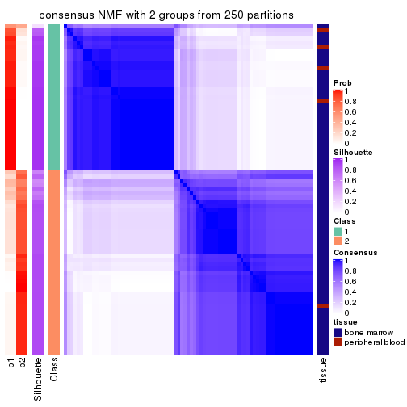</p>

</div>
<div id='tab-SD-NMF-consensus-heatmap-2'>
<pre><code class="r">consensus_heatmap(res, k = 3)
</code></pre>

<p>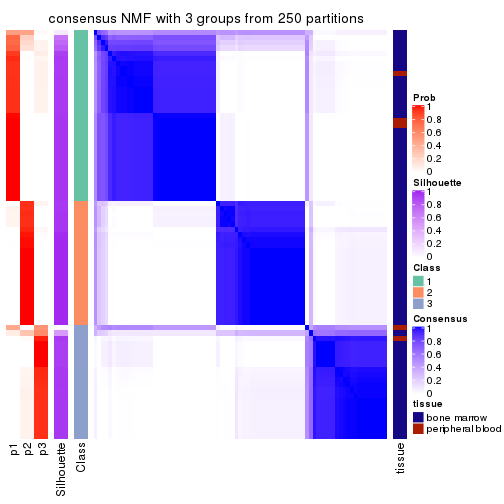</p>

</div>
<div id='tab-SD-NMF-consensus-heatmap-3'>
<pre><code class="r">consensus_heatmap(res, k = 4)
</code></pre>

<p>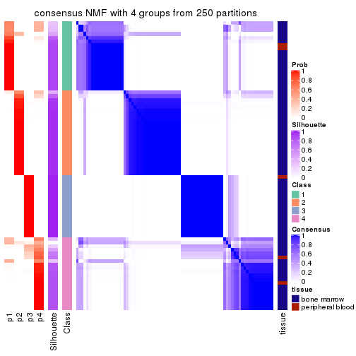</p>

</div>
<div id='tab-SD-NMF-consensus-heatmap-4'>
<pre><code class="r">consensus_heatmap(res, k = 5)
</code></pre>

<p>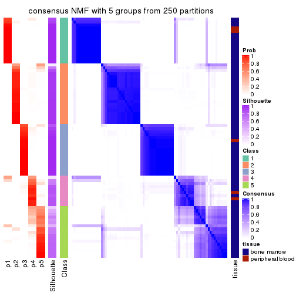</p>

</div>
<div id='tab-SD-NMF-consensus-heatmap-5'>
<pre><code class="r">consensus_heatmap(res, k = 6)
</code></pre>

<p>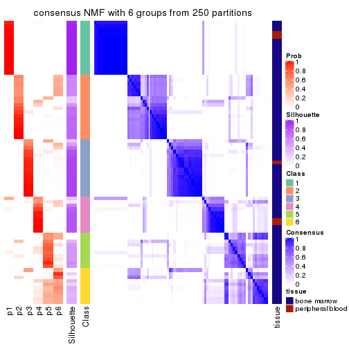</p>

</div>
</div>

Heatmaps for the membership of samples in all partitions to see how consistent they are:


<script>
$( function() {
	$( '#tabs-SD-NMF-membership-heatmap' ).tabs();
} );
</script>
<div id='tabs-SD-NMF-membership-heatmap'>
<ul>
<li><a href='#tab-SD-NMF-membership-heatmap-1'>k = 2</a></li>
<li><a href='#tab-SD-NMF-membership-heatmap-2'>k = 3</a></li>
<li><a href='#tab-SD-NMF-membership-heatmap-3'>k = 4</a></li>
<li><a href='#tab-SD-NMF-membership-heatmap-4'>k = 5</a></li>
<li><a href='#tab-SD-NMF-membership-heatmap-5'>k = 6</a></li>
</ul>
<div id='tab-SD-NMF-membership-heatmap-1'>
<pre><code class="r">membership_heatmap(res, k = 2)
</code></pre>

<p>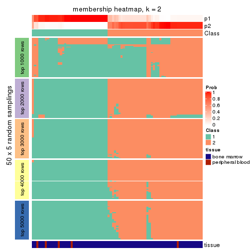</p>

</div>
<div id='tab-SD-NMF-membership-heatmap-2'>
<pre><code class="r">membership_heatmap(res, k = 3)
</code></pre>

<p>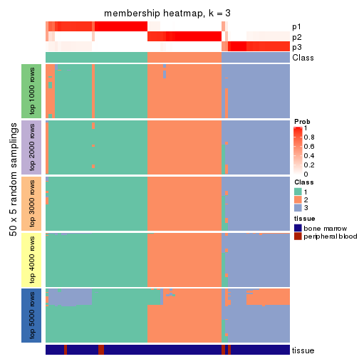</p>

</div>
<div id='tab-SD-NMF-membership-heatmap-3'>
<pre><code class="r">membership_heatmap(res, k = 4)
</code></pre>

<p>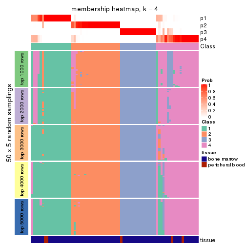</p>

</div>
<div id='tab-SD-NMF-membership-heatmap-4'>
<pre><code class="r">membership_heatmap(res, k = 5)
</code></pre>

<p>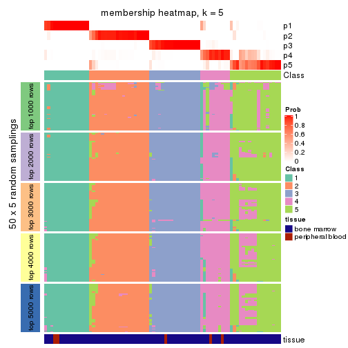</p>

</div>
<div id='tab-SD-NMF-membership-heatmap-5'>
<pre><code class="r">membership_heatmap(res, k = 6)
</code></pre>

<p>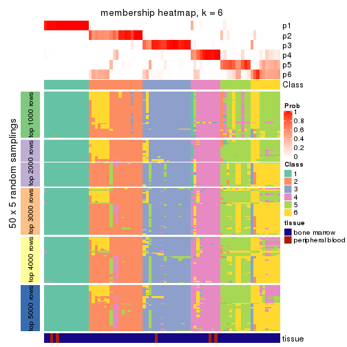</p>

</div>
</div>

As soon as we have had the classes for columns, we can look for signatures
which are significantly different between classes which can be candidate marks
for certain classes. Following are the heatmaps for signatures.


Signature heatmaps where rows are scaled:


<script>
$( function() {
	$( '#tabs-SD-NMF-get-signatures' ).tabs();
} );
</script>
<div id='tabs-SD-NMF-get-signatures'>
<ul>
<li><a href='#tab-SD-NMF-get-signatures-1'>k = 2</a></li>
<li><a href='#tab-SD-NMF-get-signatures-2'>k = 3</a></li>
<li><a href='#tab-SD-NMF-get-signatures-3'>k = 4</a></li>
<li><a href='#tab-SD-NMF-get-signatures-4'>k = 5</a></li>
<li><a href='#tab-SD-NMF-get-signatures-5'>k = 6</a></li>
</ul>
<div id='tab-SD-NMF-get-signatures-1'>
<pre><code class="r">get_signatures(res, k = 2)
</code></pre>

<p>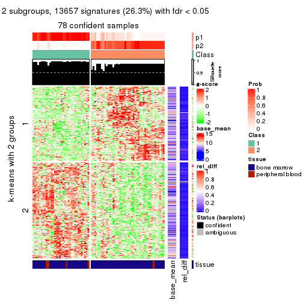</p>

</div>
<div id='tab-SD-NMF-get-signatures-2'>
<pre><code class="r">get_signatures(res, k = 3)
</code></pre>

<p>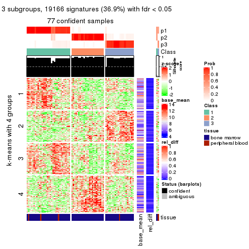</p>

</div>
<div id='tab-SD-NMF-get-signatures-3'>
<pre><code class="r">get_signatures(res, k = 4)
</code></pre>

<p>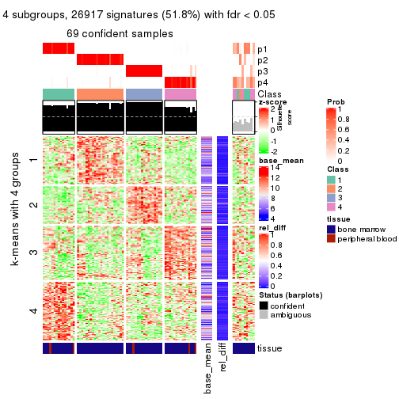</p>

</div>
<div id='tab-SD-NMF-get-signatures-4'>
<pre><code class="r">get_signatures(res, k = 5)
</code></pre>

<p>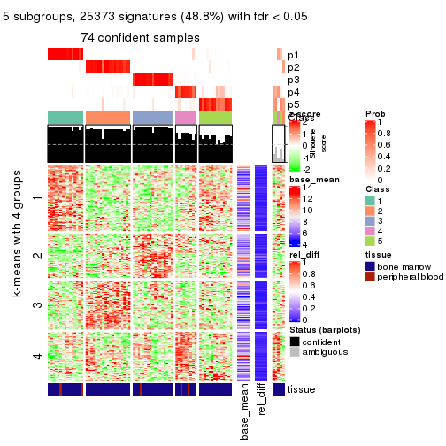</p>

</div>
<div id='tab-SD-NMF-get-signatures-5'>
<pre><code class="r">get_signatures(res, k = 6)
</code></pre>

<p>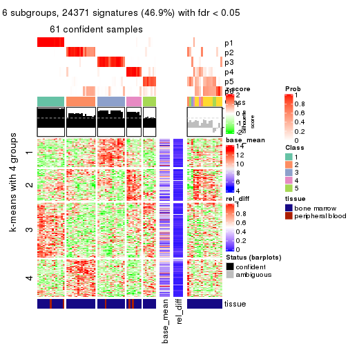</p>

</div>
</div>


Signature heatmaps where rows are not scaled:


<script>
$( function() {
	$( '#tabs-SD-NMF-get-signatures-no-scale' ).tabs();
} );
</script>
<div id='tabs-SD-NMF-get-signatures-no-scale'>
<ul>
<li><a href='#tab-SD-NMF-get-signatures-no-scale-1'>k = 2</a></li>
<li><a href='#tab-SD-NMF-get-signatures-no-scale-2'>k = 3</a></li>
<li><a href='#tab-SD-NMF-get-signatures-no-scale-3'>k = 4</a></li>
<li><a href='#tab-SD-NMF-get-signatures-no-scale-4'>k = 5</a></li>
<li><a href='#tab-SD-NMF-get-signatures-no-scale-5'>k = 6</a></li>
</ul>
<div id='tab-SD-NMF-get-signatures-no-scale-1'>
<pre><code class="r">get_signatures(res, k = 2, scale_rows = FALSE)
</code></pre>

<p>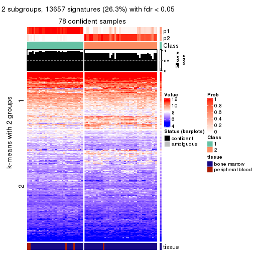</p>

</div>
<div id='tab-SD-NMF-get-signatures-no-scale-2'>
<pre><code class="r">get_signatures(res, k = 3, scale_rows = FALSE)
</code></pre>

<p>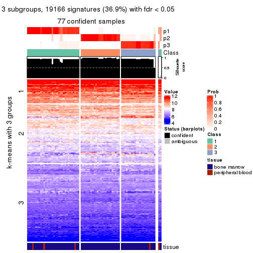</p>

</div>
<div id='tab-SD-NMF-get-signatures-no-scale-3'>
<pre><code class="r">get_signatures(res, k = 4, scale_rows = FALSE)
</code></pre>

<p>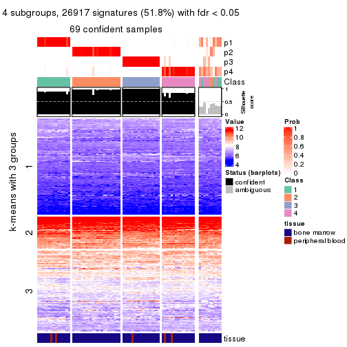</p>

</div>
<div id='tab-SD-NMF-get-signatures-no-scale-4'>
<pre><code class="r">get_signatures(res, k = 5, scale_rows = FALSE)
</code></pre>

<p>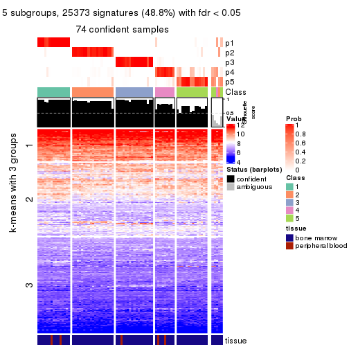</p>

</div>
<div id='tab-SD-NMF-get-signatures-no-scale-5'>
<pre><code class="r">get_signatures(res, k = 6, scale_rows = FALSE)
</code></pre>

<p>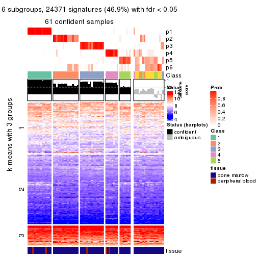</p>

</div>
</div>


Compare the overlap of signatures from different k:

```r
compare_signatures(res)
```

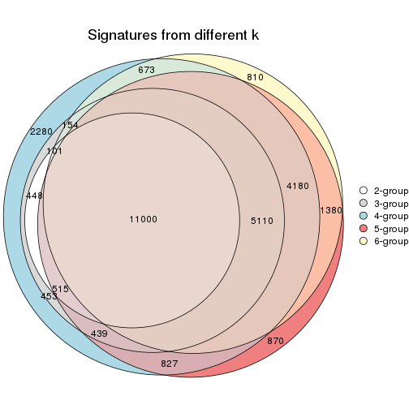

`get_signature()` returns a data frame invisibly. TO get the list of signatures, the function
call should be assigned to a variable explicitly. In following code, if `plot` argument is set
to `FALSE`, no heatmap is plotted while only the differential analysis is performed.

```r
# code only for demonstration
tb = get_signature(res, k = ..., plot = FALSE)
```

An example of the output of `tb` is:

```
#>   which_row         fdr    mean_1    mean_2 scaled_mean_1 scaled_mean_2 km
#> 1        38 0.042760348  8.373488  9.131774    -0.5533452     0.5164555  1
#> 2        40 0.018707592  7.106213  8.469186    -0.6173731     0.5762149  1
#> 3        55 0.019134737 10.221463 11.207825    -0.6159697     0.5749050  1
#> 4        59 0.006059896  5.921854  7.869574    -0.6899429     0.6439467  1
#> 5        60 0.018055526  8.928898 10.211722    -0.6204761     0.5791110  1
#> 6        98 0.009384629 15.714769 14.887706     0.6635654    -0.6193277  2
...
```

The columns in `tb` are:

1. `which_row`: row indices corresponding to the input matrix.
2. `fdr`: FDR for the differential test. 
3. `mean_x`: The mean value in group x.
4. `scaled_mean_x`: The mean value in group x after rows are scaled.
5. `km`: Row groups if k-means clustering is applied to rows.


UMAP plot which shows how samples are separated.


<script>
$( function() {
	$( '#tabs-SD-NMF-dimension-reduction' ).tabs();
} );
</script>
<div id='tabs-SD-NMF-dimension-reduction'>
<ul>
<li><a href='#tab-SD-NMF-dimension-reduction-1'>k = 2</a></li>
<li><a href='#tab-SD-NMF-dimension-reduction-2'>k = 3</a></li>
<li><a href='#tab-SD-NMF-dimension-reduction-3'>k = 4</a></li>
<li><a href='#tab-SD-NMF-dimension-reduction-4'>k = 5</a></li>
<li><a href='#tab-SD-NMF-dimension-reduction-5'>k = 6</a></li>
</ul>
<div id='tab-SD-NMF-dimension-reduction-1'>
<pre><code class="r">dimension_reduction(res, k = 2, method = &quot;UMAP&quot;)
</code></pre>

<p>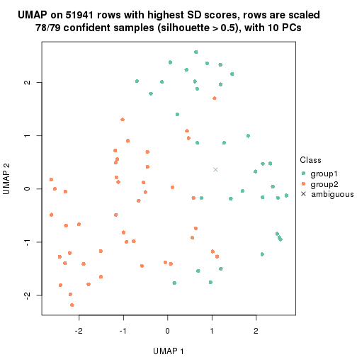</p>

</div>
<div id='tab-SD-NMF-dimension-reduction-2'>
<pre><code class="r">dimension_reduction(res, k = 3, method = &quot;UMAP&quot;)
</code></pre>

<p>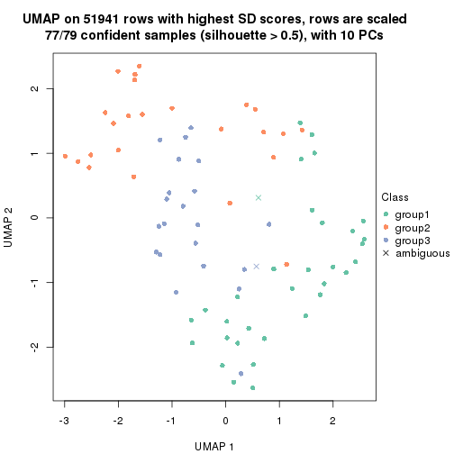</p>

</div>
<div id='tab-SD-NMF-dimension-reduction-3'>
<pre><code class="r">dimension_reduction(res, k = 4, method = &quot;UMAP&quot;)
</code></pre>

<p>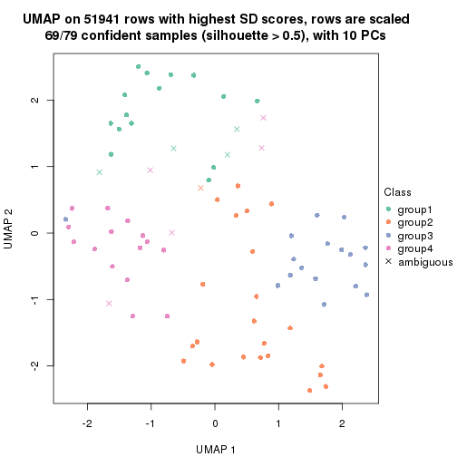</p>

</div>
<div id='tab-SD-NMF-dimension-reduction-4'>
<pre><code class="r">dimension_reduction(res, k = 5, method = &quot;UMAP&quot;)
</code></pre>

<p>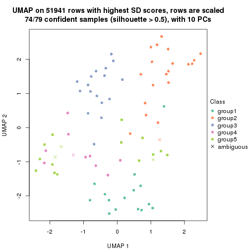</p>

</div>
<div id='tab-SD-NMF-dimension-reduction-5'>
<pre><code class="r">dimension_reduction(res, k = 6, method = &quot;UMAP&quot;)
</code></pre>

<p>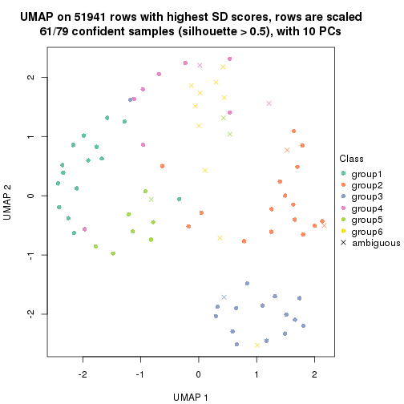</p>

</div>
</div>


Following heatmap shows how subgroups are split when increasing `k`:

```r
collect_classes(res)
```

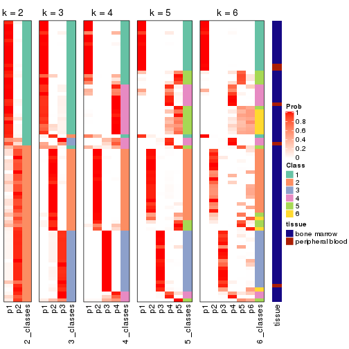


Test correlation between subgroups and known annotations. If the known
annotation is numeric, one-way ANOVA test is applied, and if the known
annotation is discrete, chi-squared contingency table test is applied.

```r
test_to_known_factors(res)
```

```
#>         n tissue(p) k
#> SD:NMF 78     0.218 2
#> SD:NMF 77     0.293 3
#> SD:NMF 69     0.331 4
#> SD:NMF 74     0.144 5
#> SD:NMF 61     0.229 6
```


If matrix rows can be associated to genes, consider to use `GO_Enrichment(res,
...)` to perform function enrichment for the signature genes.


 

---------------------------------------------------


### CV:hclust


The object with results only for a single top-value method and a single partition method 
can be extracted as:

```r
res = res_list["CV", "hclust"]
# you can also extract it by
# res = res_list["CV:hclust"]
```

A summary of `res` and all the functions that can be applied to it:

```r
res
```

```
#> A 'ConsensusPartition' object with k = 2, 3, 4, 5, 6.
#>   On a matrix with 51941 rows and 79 columns.
#>   Top rows (1000, 2000, 3000, 4000, 5000) are extracted by 'CV' method.
#>   Subgroups are detected by 'hclust' method.
#>   Performed in total 1250 partitions by row resampling.
#>   Best k for subgroups seems to be 3.
#> 
#> Following methods can be applied to this 'ConsensusPartition' object:
#>  [1] "cola_report"             "collect_classes"         "collect_plots"          
#>  [4] "collect_stats"           "colnames"                "compare_signatures"     
#>  [7] "consensus_heatmap"       "dimension_reduction"     "functional_enrichment"  
#> [10] "get_anno_col"            "get_anno"                "get_classes"            
#> [13] "get_consensus"           "get_matrix"              "get_membership"         
#> [16] "get_param"               "get_signatures"          "get_stats"              
#> [19] "is_best_k"               "is_stable_k"             "membership_heatmap"     
#> [22] "ncol"                    "nrow"                    "plot_ecdf"              
#> [25] "rownames"                "select_partition_number" "show"                   
#> [28] "suggest_best_k"          "test_to_known_factors"
```

`collect_plots()` function collects all the plots made from `res` for all `k` (number of partitions)
into one single page to provide an easy and fast comparison between different `k`.

```r
collect_plots(res)
```

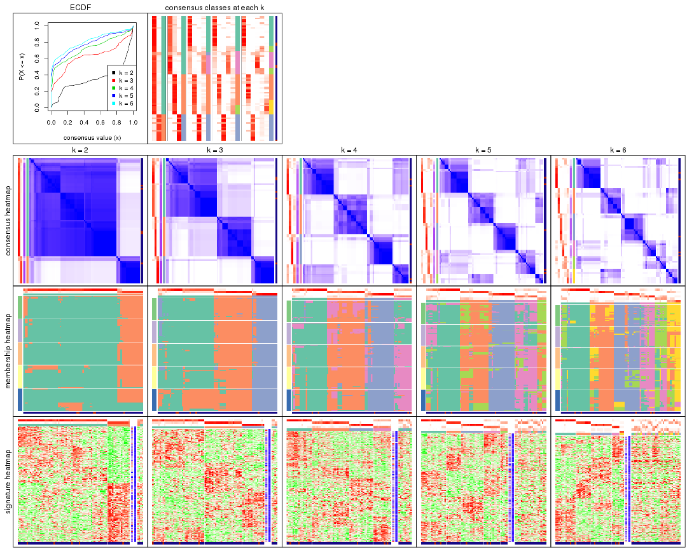

The plots are:

- The first row: a plot of the ECDF (Empirical cumulative distribution
  function) curves of the consensus matrix for each `k` and the heatmap of
  predicted classes for each `k`.
- The second row: heatmaps of the consensus matrix for each `k`.
- The third row: heatmaps of the membership matrix for each `k`.
- The fouth row: heatmaps of the signatures for each `k`.

All the plots in panels can be made by individual functions and they are
plotted later in this section.

`select_partition_number()` produces several plots showing different
statistics for choosing "optimized" `k`. There are following statistics:

- ECDF curves of the consensus matrix for each `k`;
- 1-PAC. [The PAC
  score](https://en.wikipedia.org/wiki/Consensus_clustering#Over-interpretation_potential_of_consensus_clustering)
  measures the proportion of the ambiguous subgrouping.
- Mean silhouette score.
- Concordance. The mean probability of fiting the consensus class ids in all
  partitions.
- Area increased. Denote $A_k$ as the area under the ECDF curve for current
  `k`, the area increased is defined as $A_k - A_{k-1}$.
- Rand index. The percent of pairs of samples that are both in a same cluster
  or both are not in a same cluster in the partition of k and k-1.
- Jaccard index. The ratio of pairs of samples are both in a same cluster in
  the partition of k and k-1 and the pairs of samples are both in a same
  cluster in the partition k or k-1.

The detailed explanations of these statistics can be found in [the cola
vignette](http://bioconductor.org/packages/devel/bioc/vignettes/cola/inst/doc/cola.html#toc_13).

Generally speaking, lower PAC score, higher mean silhouette score or higher
concordance corresponds to better partition. Rand index and Jaccard index
measure how similar the current partition is compared to partition with `k-1`.
If they are too similar, we won't accept `k` is better than `k-1`.

```r
select_partition_number(res)
```

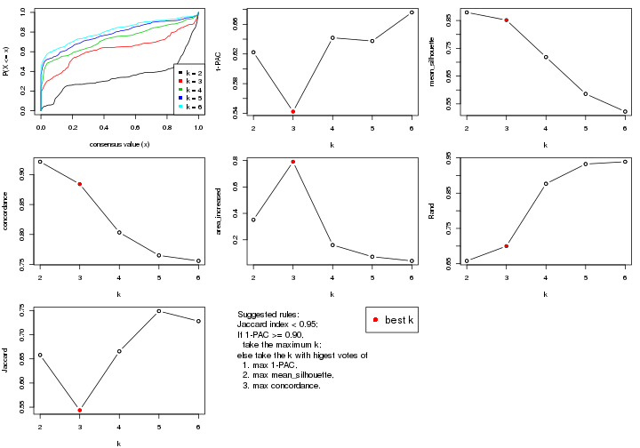

The numeric values for all these statistics can be obtained by `get_stats()`.

```r
get_stats(res)
```

```
#>   k 1-PAC mean_silhouette concordance area_increased  Rand Jaccard
#> 2 2 0.622           0.879       0.921         0.3513 0.658   0.658
#> 3 3 0.542           0.852       0.884         0.7909 0.700   0.544
#> 4 4 0.642           0.718       0.803         0.1603 0.877   0.665
#> 5 5 0.637           0.586       0.765         0.0718 0.932   0.749
#> 6 6 0.676           0.522       0.756         0.0401 0.939   0.728
```

`suggest_best_k()` suggests the best $k$ based on these statistics. The rules are as follows:

- All $k$ with Jaccard index larger than 0.95 are removed because the increase of
  the partition number does not provides enough extra information. If all $k$ are removed,
  the best $k$ is assigned by `NA`.
- For $k$ with 1-PAC larger than 0.9, the maximal $k$ is taken as the "best k". Other $k$ is called "optional k".
- If it does not fit the second rule. The $k$ with the highest vote of highest
  1-PAC, mean silhouette and concordance is taken as the "best k".

```r
suggest_best_k(res)
```

```
#> [1] 3
```


Following shows the table of the partitions (You need to click the **show/hide
code output** link to see it). The membership matrix (columns with name `p*`)
is inferred by
[`clue::cl_consensus()`](https://www.rdocumentation.org/link/cl_consensus?package=clue)
function with the `SE` method. Basically the value in the membership matrix
represents the probability to belong to a certain group. The finall class
label for an item is determined with the group with highest probability it
belongs to.

In `get_classes()` function, the entropy is calculated from the membership
matrix and the silhouette score is calculated from the consensus matrix.


<script>
$( function() {
	$( '#tabs-CV-hclust-get-classes' ).tabs();
} );
</script>
<div id='tabs-CV-hclust-get-classes'>
<ul>
<li><a href='#tab-CV-hclust-get-classes-1'>k = 2</a></li>
<li><a href='#tab-CV-hclust-get-classes-2'>k = 3</a></li>
<li><a href='#tab-CV-hclust-get-classes-3'>k = 4</a></li>
<li><a href='#tab-CV-hclust-get-classes-4'>k = 5</a></li>
<li><a href='#tab-CV-hclust-get-classes-5'>k = 6</a></li>
</ul>

<div id='tab-CV-hclust-get-classes-1'>
<p><a id='tab-CV-hclust-get-classes-1-a' style='color:#0366d6' href='#'>show/hide code output</a></p>
<pre><code class="r">cbind(get_classes(res, k = 2), get_membership(res, k = 2))
</code></pre>

<pre><code>#&gt;           class entropy silhouette    p1    p2
#&gt; GSM316652     2  0.4161      0.924 0.084 0.916
#&gt; GSM316653     1  0.0376      0.932 0.996 0.004
#&gt; GSM316654     1  0.2948      0.919 0.948 0.052
#&gt; GSM316655     1  0.2948      0.913 0.948 0.052
#&gt; GSM316656     1  0.0376      0.931 0.996 0.004
#&gt; GSM316657     1  0.0376      0.932 0.996 0.004
#&gt; GSM316658     1  0.2778      0.921 0.952 0.048
#&gt; GSM316659     1  0.4298      0.892 0.912 0.088
#&gt; GSM316660     1  0.0376      0.932 0.996 0.004
#&gt; GSM316661     1  0.5519      0.877 0.872 0.128
#&gt; GSM316662     2  0.4161      0.924 0.084 0.916
#&gt; GSM316663     2  0.9286      0.582 0.344 0.656
#&gt; GSM316664     1  0.4298      0.891 0.912 0.088
#&gt; GSM316665     1  0.2948      0.919 0.948 0.052
#&gt; GSM316666     2  0.4161      0.924 0.084 0.916
#&gt; GSM316667     1  0.4022      0.898 0.920 0.080
#&gt; GSM316668     2  0.4161      0.924 0.084 0.916
#&gt; GSM316669     1  0.0376      0.932 0.996 0.004
#&gt; GSM316670     2  0.9881      0.389 0.436 0.564
#&gt; GSM316671     2  0.4161      0.924 0.084 0.916
#&gt; GSM316672     1  0.1414      0.931 0.980 0.020
#&gt; GSM316673     1  0.0376      0.932 0.996 0.004
#&gt; GSM316674     2  0.4161      0.924 0.084 0.916
#&gt; GSM316676     2  0.4431      0.921 0.092 0.908
#&gt; GSM316677     1  0.3114      0.911 0.944 0.056
#&gt; GSM316678     1  0.2423      0.924 0.960 0.040
#&gt; GSM316679     1  0.1633      0.930 0.976 0.024
#&gt; GSM316680     1  0.1633      0.930 0.976 0.024
#&gt; GSM316681     2  0.4161      0.924 0.084 0.916
#&gt; GSM316682     1  0.3879      0.900 0.924 0.076
#&gt; GSM316683     1  0.3879      0.900 0.924 0.076
#&gt; GSM316684     1  0.2948      0.919 0.948 0.052
#&gt; GSM316685     2  0.9896      0.380 0.440 0.560
#&gt; GSM316686     1  0.7139      0.723 0.804 0.196
#&gt; GSM316687     1  0.6343      0.831 0.840 0.160
#&gt; GSM316688     1  0.4939      0.867 0.892 0.108
#&gt; GSM316689     1  0.0376      0.932 0.996 0.004
#&gt; GSM316690     2  0.5059      0.905 0.112 0.888
#&gt; GSM316691     1  0.5408      0.850 0.876 0.124
#&gt; GSM316692     2  0.4431      0.921 0.092 0.908
#&gt; GSM316693     1  0.4298      0.891 0.912 0.088
#&gt; GSM316694     2  0.4161      0.924 0.084 0.916
#&gt; GSM316696     1  0.0376      0.932 0.996 0.004
#&gt; GSM316697     2  0.4161      0.924 0.084 0.916
#&gt; GSM316698     1  0.2423      0.924 0.960 0.040
#&gt; GSM316699     1  0.3431      0.912 0.936 0.064
#&gt; GSM316700     1  0.4022      0.910 0.920 0.080
#&gt; GSM316701     1  0.1184      0.929 0.984 0.016
#&gt; GSM316703     1  0.4298      0.892 0.912 0.088
#&gt; GSM316704     1  0.4298      0.892 0.912 0.088
#&gt; GSM316705     1  0.0376      0.932 0.996 0.004
#&gt; GSM316706     1  0.4161      0.891 0.916 0.084
#&gt; GSM316707     1  0.2778      0.921 0.952 0.048
#&gt; GSM316708     1  0.2423      0.924 0.960 0.040
#&gt; GSM316709     2  0.4161      0.924 0.084 0.916
#&gt; GSM316710     1  0.4431      0.890 0.908 0.092
#&gt; GSM316711     1  0.2778      0.921 0.952 0.048
#&gt; GSM316713     1  0.0376      0.932 0.996 0.004
#&gt; GSM316714     1  0.9661      0.267 0.608 0.392
#&gt; GSM316715     1  0.0376      0.932 0.996 0.004
#&gt; GSM316716     1  0.3431      0.912 0.936 0.064
#&gt; GSM316717     1  0.0376      0.932 0.996 0.004
#&gt; GSM316718     1  0.2423      0.924 0.960 0.040
#&gt; GSM316719     1  0.0376      0.932 0.996 0.004
#&gt; GSM316720     1  0.0376      0.932 0.996 0.004
#&gt; GSM316721     1  0.3431      0.912 0.936 0.064
#&gt; GSM316722     1  0.1633      0.930 0.976 0.024
#&gt; GSM316723     1  0.2948      0.919 0.948 0.052
#&gt; GSM316724     1  0.2236      0.925 0.964 0.036
#&gt; GSM316726     1  0.3431      0.912 0.936 0.064
#&gt; GSM316727     1  0.0376      0.932 0.996 0.004
#&gt; GSM316728     1  0.9608      0.292 0.616 0.384
#&gt; GSM316729     1  0.2236      0.925 0.964 0.036
#&gt; GSM316730     1  0.2423      0.924 0.960 0.040
#&gt; GSM316675     2  0.4431      0.921 0.092 0.908
#&gt; GSM316695     1  0.0376      0.932 0.996 0.004
#&gt; GSM316702     1  0.4431      0.890 0.908 0.092
#&gt; GSM316712     1  0.0376      0.932 0.996 0.004
#&gt; GSM316725     1  0.4298      0.891 0.912 0.088
</code></pre>

<script>
$('#tab-CV-hclust-get-classes-1-a').parent().next().next().hide();
$('#tab-CV-hclust-get-classes-1-a').click(function(){
  $('#tab-CV-hclust-get-classes-1-a').parent().next().next().toggle();
  return(false);
});
</script>
</div>

<div id='tab-CV-hclust-get-classes-2'>
<p><a id='tab-CV-hclust-get-classes-2-a' style='color:#0366d6' href='#'>show/hide code output</a></p>
<pre><code class="r">cbind(get_classes(res, k = 3), get_membership(res, k = 3))
</code></pre>

<pre><code>#&gt;           class entropy silhouette    p1    p2    p3
#&gt; GSM316652     3  0.0000      0.930 0.000 0.000 1.000
#&gt; GSM316653     1  0.4235      0.873 0.824 0.176 0.000
#&gt; GSM316654     1  0.5180      0.861 0.812 0.156 0.032
#&gt; GSM316655     1  0.5431      0.592 0.716 0.284 0.000
#&gt; GSM316656     2  0.3192      0.855 0.112 0.888 0.000
#&gt; GSM316657     1  0.4555      0.863 0.800 0.200 0.000
#&gt; GSM316658     2  0.0424      0.944 0.000 0.992 0.008
#&gt; GSM316659     2  0.3482      0.878 0.128 0.872 0.000
#&gt; GSM316660     1  0.4235      0.873 0.824 0.176 0.000
#&gt; GSM316661     1  0.4838      0.795 0.848 0.076 0.076
#&gt; GSM316662     3  0.0000      0.930 0.000 0.000 1.000
#&gt; GSM316663     3  0.6211      0.623 0.228 0.036 0.736
#&gt; GSM316664     1  0.0000      0.818 1.000 0.000 0.000
#&gt; GSM316665     2  0.0592      0.944 0.000 0.988 0.012
#&gt; GSM316666     3  0.0000      0.930 0.000 0.000 1.000
#&gt; GSM316667     2  0.3993      0.879 0.064 0.884 0.052
#&gt; GSM316668     3  0.0000      0.930 0.000 0.000 1.000
#&gt; GSM316669     1  0.4235      0.873 0.824 0.176 0.000
#&gt; GSM316670     3  0.6726      0.480 0.024 0.332 0.644
#&gt; GSM316671     3  0.0000      0.930 0.000 0.000 1.000
#&gt; GSM316672     1  0.5988      0.670 0.632 0.368 0.000
#&gt; GSM316673     1  0.4235      0.873 0.824 0.176 0.000
#&gt; GSM316674     3  0.0000      0.930 0.000 0.000 1.000
#&gt; GSM316676     3  0.0592      0.926 0.000 0.012 0.988
#&gt; GSM316677     1  0.2165      0.847 0.936 0.064 0.000
#&gt; GSM316678     2  0.0237      0.944 0.004 0.996 0.000
#&gt; GSM316679     1  0.5178      0.826 0.744 0.256 0.000
#&gt; GSM316680     1  0.5216      0.823 0.740 0.260 0.000
#&gt; GSM316681     3  0.0000      0.930 0.000 0.000 1.000
#&gt; GSM316682     1  0.1031      0.823 0.976 0.024 0.000
#&gt; GSM316683     1  0.1031      0.823 0.976 0.024 0.000
#&gt; GSM316684     2  0.0592      0.944 0.000 0.988 0.012
#&gt; GSM316685     3  0.5948      0.446 0.000 0.360 0.640
#&gt; GSM316686     1  0.8442      0.722 0.620 0.188 0.192
#&gt; GSM316687     1  0.6031      0.797 0.788 0.096 0.116
#&gt; GSM316688     2  0.5915      0.767 0.128 0.792 0.080
#&gt; GSM316689     1  0.4235      0.873 0.824 0.176 0.000
#&gt; GSM316690     3  0.1289      0.912 0.000 0.032 0.968
#&gt; GSM316691     2  0.5423      0.818 0.084 0.820 0.096
#&gt; GSM316692     3  0.0592      0.926 0.000 0.012 0.988
#&gt; GSM316693     1  0.0000      0.818 1.000 0.000 0.000
#&gt; GSM316694     3  0.0000      0.930 0.000 0.000 1.000
#&gt; GSM316696     1  0.4555      0.863 0.800 0.200 0.000
#&gt; GSM316697     3  0.0000      0.930 0.000 0.000 1.000
#&gt; GSM316698     2  0.0237      0.944 0.004 0.996 0.000
#&gt; GSM316699     2  0.1031      0.941 0.000 0.976 0.024
#&gt; GSM316700     1  0.3406      0.823 0.904 0.068 0.028
#&gt; GSM316701     1  0.2625      0.847 0.916 0.084 0.000
#&gt; GSM316703     2  0.3482      0.878 0.128 0.872 0.000
#&gt; GSM316704     2  0.3482      0.878 0.128 0.872 0.000
#&gt; GSM316705     1  0.4555      0.863 0.800 0.200 0.000
#&gt; GSM316706     2  0.3551      0.877 0.132 0.868 0.000
#&gt; GSM316707     2  0.0424      0.944 0.000 0.992 0.008
#&gt; GSM316708     2  0.0592      0.942 0.012 0.988 0.000
#&gt; GSM316709     3  0.0000      0.930 0.000 0.000 1.000
#&gt; GSM316710     1  0.0237      0.817 0.996 0.000 0.004
#&gt; GSM316711     2  0.0424      0.944 0.000 0.992 0.008
#&gt; GSM316713     1  0.4235      0.873 0.824 0.176 0.000
#&gt; GSM316714     1  0.9188      0.381 0.468 0.152 0.380
#&gt; GSM316715     1  0.4235      0.873 0.824 0.176 0.000
#&gt; GSM316716     2  0.1031      0.941 0.000 0.976 0.024
#&gt; GSM316717     1  0.4235      0.873 0.824 0.176 0.000
#&gt; GSM316718     2  0.0592      0.942 0.012 0.988 0.000
#&gt; GSM316719     1  0.4235      0.873 0.824 0.176 0.000
#&gt; GSM316720     1  0.4235      0.873 0.824 0.176 0.000
#&gt; GSM316721     2  0.1031      0.941 0.000 0.976 0.024
#&gt; GSM316722     1  0.5138      0.829 0.748 0.252 0.000
#&gt; GSM316723     2  0.0592      0.944 0.000 0.988 0.012
#&gt; GSM316724     2  0.0592      0.942 0.012 0.988 0.000
#&gt; GSM316726     2  0.1031      0.941 0.000 0.976 0.024
#&gt; GSM316727     1  0.4235      0.873 0.824 0.176 0.000
#&gt; GSM316728     1  0.9171      0.401 0.476 0.152 0.372
#&gt; GSM316729     2  0.0592      0.942 0.012 0.988 0.000
#&gt; GSM316730     2  0.0237      0.944 0.004 0.996 0.000
#&gt; GSM316675     3  0.0592      0.926 0.000 0.012 0.988
#&gt; GSM316695     1  0.4555      0.863 0.800 0.200 0.000
#&gt; GSM316702     1  0.0237      0.817 0.996 0.000 0.004
#&gt; GSM316712     1  0.4235      0.873 0.824 0.176 0.000
#&gt; GSM316725     1  0.0000      0.818 1.000 0.000 0.000
</code></pre>

<script>
$('#tab-CV-hclust-get-classes-2-a').parent().next().next().hide();
$('#tab-CV-hclust-get-classes-2-a').click(function(){
  $('#tab-CV-hclust-get-classes-2-a').parent().next().next().toggle();
  return(false);
});
</script>
</div>

<div id='tab-CV-hclust-get-classes-3'>
<p><a id='tab-CV-hclust-get-classes-3-a' style='color:#0366d6' href='#'>show/hide code output</a></p>
<pre><code class="r">cbind(get_classes(res, k = 4), get_membership(res, k = 4))
</code></pre>

<pre><code>#&gt;           class entropy silhouette    p1    p2    p3    p4
#&gt; GSM316652     3  0.0000    0.86543 0.000 0.000 1.000 0.000
#&gt; GSM316653     1  0.2081    0.72609 0.916 0.000 0.000 0.084
#&gt; GSM316654     1  0.5634   -0.00544 0.664 0.008 0.032 0.296
#&gt; GSM316655     1  0.7808   -0.38209 0.400 0.256 0.000 0.344
#&gt; GSM316656     2  0.6133    0.70227 0.124 0.672 0.000 0.204
#&gt; GSM316657     1  0.1004    0.77171 0.972 0.004 0.000 0.024
#&gt; GSM316658     2  0.3071    0.86006 0.012 0.884 0.008 0.096
#&gt; GSM316659     2  0.4356    0.75286 0.000 0.708 0.000 0.292
#&gt; GSM316660     1  0.0188    0.77894 0.996 0.000 0.000 0.004
#&gt; GSM316661     4  0.7137    0.76135 0.324 0.040 0.064 0.572
#&gt; GSM316662     3  0.0000    0.86543 0.000 0.000 1.000 0.000
#&gt; GSM316663     3  0.5538    0.62964 0.028 0.024 0.716 0.232
#&gt; GSM316664     4  0.4830    0.84479 0.392 0.000 0.000 0.608
#&gt; GSM316665     2  0.1509    0.86374 0.012 0.960 0.008 0.020
#&gt; GSM316666     3  0.0000    0.86543 0.000 0.000 1.000 0.000
#&gt; GSM316667     2  0.6613    0.68362 0.176 0.688 0.040 0.096
#&gt; GSM316668     3  0.0000    0.86543 0.000 0.000 1.000 0.000
#&gt; GSM316669     1  0.2081    0.72609 0.916 0.000 0.000 0.084
#&gt; GSM316670     3  0.6862    0.51731 0.012 0.236 0.624 0.128
#&gt; GSM316671     3  0.0000    0.86543 0.000 0.000 1.000 0.000
#&gt; GSM316672     1  0.5331    0.31596 0.644 0.332 0.000 0.024
#&gt; GSM316673     1  0.0188    0.77894 0.996 0.000 0.000 0.004
#&gt; GSM316674     3  0.0000    0.86543 0.000 0.000 1.000 0.000
#&gt; GSM316676     3  0.1004    0.85925 0.000 0.004 0.972 0.024
#&gt; GSM316677     4  0.4948    0.78234 0.440 0.000 0.000 0.560
#&gt; GSM316678     2  0.2450    0.85490 0.016 0.912 0.000 0.072
#&gt; GSM316679     1  0.5750    0.46031 0.696 0.216 0.000 0.088
#&gt; GSM316680     1  0.6941    0.21914 0.588 0.220 0.000 0.192
#&gt; GSM316681     3  0.0000    0.86543 0.000 0.000 1.000 0.000
#&gt; GSM316682     4  0.5213    0.82452 0.328 0.020 0.000 0.652
#&gt; GSM316683     4  0.5213    0.82452 0.328 0.020 0.000 0.652
#&gt; GSM316684     2  0.1509    0.86374 0.012 0.960 0.008 0.020
#&gt; GSM316685     3  0.6521    0.49064 0.000 0.256 0.620 0.124
#&gt; GSM316686     1  0.4364    0.50184 0.792 0.004 0.180 0.024
#&gt; GSM316687     4  0.7366    0.60439 0.428 0.012 0.112 0.448
#&gt; GSM316688     2  0.6741    0.57449 0.244 0.648 0.072 0.036
#&gt; GSM316689     1  0.0000    0.78064 1.000 0.000 0.000 0.000
#&gt; GSM316690     3  0.1724    0.84753 0.000 0.020 0.948 0.032
#&gt; GSM316691     2  0.7890    0.60071 0.188 0.596 0.076 0.140
#&gt; GSM316692     3  0.1004    0.85925 0.000 0.004 0.972 0.024
#&gt; GSM316693     4  0.4761    0.85194 0.372 0.000 0.000 0.628
#&gt; GSM316694     3  0.0000    0.86543 0.000 0.000 1.000 0.000
#&gt; GSM316696     1  0.1004    0.77171 0.972 0.004 0.000 0.024
#&gt; GSM316697     3  0.0188    0.86492 0.000 0.000 0.996 0.004
#&gt; GSM316698     2  0.2450    0.85490 0.016 0.912 0.000 0.072
#&gt; GSM316699     2  0.3504    0.83907 0.012 0.860 0.012 0.116
#&gt; GSM316700     4  0.6058    0.80710 0.316 0.036 0.016 0.632
#&gt; GSM316701     4  0.5600    0.62957 0.468 0.020 0.000 0.512
#&gt; GSM316703     2  0.4356    0.75286 0.000 0.708 0.000 0.292
#&gt; GSM316704     2  0.3444    0.81052 0.000 0.816 0.000 0.184
#&gt; GSM316705     1  0.1109    0.77169 0.968 0.004 0.000 0.028
#&gt; GSM316706     2  0.4406    0.74716 0.000 0.700 0.000 0.300
#&gt; GSM316707     2  0.3071    0.86006 0.012 0.884 0.008 0.096
#&gt; GSM316708     2  0.1151    0.86280 0.024 0.968 0.000 0.008
#&gt; GSM316709     3  0.0188    0.86492 0.000 0.000 0.996 0.004
#&gt; GSM316710     4  0.4730    0.85103 0.364 0.000 0.000 0.636
#&gt; GSM316711     2  0.3071    0.86006 0.012 0.884 0.008 0.096
#&gt; GSM316713     1  0.0188    0.77894 0.996 0.000 0.000 0.004
#&gt; GSM316714     3  0.8146   -0.17489 0.276 0.008 0.364 0.352
#&gt; GSM316715     1  0.0000    0.78064 1.000 0.000 0.000 0.000
#&gt; GSM316716     2  0.3504    0.83907 0.012 0.860 0.012 0.116
#&gt; GSM316717     1  0.2081    0.72609 0.916 0.000 0.000 0.084
#&gt; GSM316718     2  0.1151    0.86323 0.024 0.968 0.000 0.008
#&gt; GSM316719     1  0.0000    0.78064 1.000 0.000 0.000 0.000
#&gt; GSM316720     1  0.0000    0.78064 1.000 0.000 0.000 0.000
#&gt; GSM316721     2  0.3263    0.84384 0.012 0.876 0.012 0.100
#&gt; GSM316722     1  0.5775    0.45417 0.696 0.212 0.000 0.092
#&gt; GSM316723     2  0.1509    0.86374 0.012 0.960 0.008 0.020
#&gt; GSM316724     2  0.3444    0.80901 0.000 0.816 0.000 0.184
#&gt; GSM316726     2  0.3263    0.84384 0.012 0.876 0.012 0.100
#&gt; GSM316727     1  0.0000    0.78064 1.000 0.000 0.000 0.000
#&gt; GSM316728     3  0.8161   -0.20092 0.284 0.008 0.356 0.352
#&gt; GSM316729     2  0.3444    0.80901 0.000 0.816 0.000 0.184
#&gt; GSM316730     2  0.2142    0.85971 0.016 0.928 0.000 0.056
#&gt; GSM316675     3  0.1109    0.85807 0.000 0.004 0.968 0.028
#&gt; GSM316695     1  0.1109    0.77169 0.968 0.004 0.000 0.028
#&gt; GSM316702     4  0.4730    0.85103 0.364 0.000 0.000 0.636
#&gt; GSM316712     1  0.0000    0.78064 1.000 0.000 0.000 0.000
#&gt; GSM316725     4  0.4761    0.85194 0.372 0.000 0.000 0.628
</code></pre>

<script>
$('#tab-CV-hclust-get-classes-3-a').parent().next().next().hide();
$('#tab-CV-hclust-get-classes-3-a').click(function(){
  $('#tab-CV-hclust-get-classes-3-a').parent().next().next().toggle();
  return(false);
});
</script>
</div>

<div id='tab-CV-hclust-get-classes-4'>
<p><a id='tab-CV-hclust-get-classes-4-a' style='color:#0366d6' href='#'>show/hide code output</a></p>
<pre><code class="r">cbind(get_classes(res, k = 5), get_membership(res, k = 5))
</code></pre>

<pre><code>#&gt;           class entropy silhouette    p1    p2    p3    p4    p5
#&gt; GSM316652     3  0.0290     0.8990 0.000 0.000 0.992 0.000 0.008
#&gt; GSM316653     1  0.4479     0.5508 0.700 0.000 0.000 0.264 0.036
#&gt; GSM316654     1  0.5903    -0.1409 0.468 0.004 0.008 0.456 0.064
#&gt; GSM316655     4  0.7581     0.3912 0.184 0.112 0.000 0.508 0.196
#&gt; GSM316656     5  0.6461     0.4504 0.128 0.400 0.000 0.012 0.460
#&gt; GSM316657     1  0.0703     0.7614 0.976 0.000 0.000 0.000 0.024
#&gt; GSM316658     2  0.1270     0.5746 0.000 0.948 0.000 0.000 0.052
#&gt; GSM316659     5  0.5861     0.6014 0.000 0.400 0.000 0.100 0.500
#&gt; GSM316660     1  0.0290     0.7661 0.992 0.000 0.000 0.008 0.000
#&gt; GSM316661     4  0.5507     0.6182 0.108 0.020 0.024 0.732 0.116
#&gt; GSM316662     3  0.0290     0.8990 0.000 0.000 0.992 0.000 0.008
#&gt; GSM316663     3  0.6008     0.5598 0.008 0.028 0.648 0.232 0.084
#&gt; GSM316664     4  0.4252     0.5705 0.340 0.000 0.000 0.652 0.008
#&gt; GSM316665     2  0.1478     0.5696 0.000 0.936 0.000 0.000 0.064
#&gt; GSM316666     3  0.0000     0.8984 0.000 0.000 1.000 0.000 0.000
#&gt; GSM316667     2  0.6290     0.3001 0.168 0.600 0.012 0.004 0.216
#&gt; GSM316668     3  0.0290     0.8990 0.000 0.000 0.992 0.000 0.008
#&gt; GSM316669     1  0.4479     0.5508 0.700 0.000 0.000 0.264 0.036
#&gt; GSM316670     3  0.6421     0.4971 0.000 0.276 0.568 0.024 0.132
#&gt; GSM316671     3  0.0290     0.8990 0.000 0.000 0.992 0.000 0.008
#&gt; GSM316672     1  0.5668     0.3557 0.632 0.196 0.000 0.000 0.172
#&gt; GSM316673     1  0.0290     0.7661 0.992 0.000 0.000 0.008 0.000
#&gt; GSM316674     3  0.0290     0.8990 0.000 0.000 0.992 0.000 0.008
#&gt; GSM316676     3  0.2173     0.8794 0.000 0.012 0.920 0.016 0.052
#&gt; GSM316677     4  0.3814     0.6200 0.276 0.000 0.000 0.720 0.004
#&gt; GSM316678     2  0.4088     0.2208 0.000 0.632 0.000 0.000 0.368
#&gt; GSM316679     1  0.6680     0.3201 0.500 0.008 0.000 0.252 0.240
#&gt; GSM316680     1  0.7024     0.0778 0.372 0.008 0.000 0.284 0.336
#&gt; GSM316681     3  0.0290     0.8990 0.000 0.000 0.992 0.000 0.008
#&gt; GSM316682     4  0.4696     0.5938 0.108 0.000 0.000 0.736 0.156
#&gt; GSM316683     4  0.4696     0.5938 0.108 0.000 0.000 0.736 0.156
#&gt; GSM316684     2  0.1478     0.5696 0.000 0.936 0.000 0.000 0.064
#&gt; GSM316685     3  0.5820     0.4866 0.000 0.308 0.572 0.000 0.120
#&gt; GSM316686     1  0.4116     0.5572 0.792 0.012 0.164 0.024 0.008
#&gt; GSM316687     4  0.6390     0.5574 0.280 0.004 0.080 0.592 0.044
#&gt; GSM316688     2  0.7741     0.1355 0.196 0.496 0.020 0.056 0.232
#&gt; GSM316689     1  0.0162     0.7676 0.996 0.000 0.000 0.004 0.000
#&gt; GSM316690     3  0.2523     0.8735 0.000 0.028 0.908 0.024 0.040
#&gt; GSM316691     2  0.6994     0.2512 0.168 0.564 0.020 0.024 0.224
#&gt; GSM316692     3  0.2173     0.8794 0.000 0.012 0.920 0.016 0.052
#&gt; GSM316693     4  0.3455     0.6576 0.208 0.000 0.000 0.784 0.008
#&gt; GSM316694     3  0.0290     0.8990 0.000 0.000 0.992 0.000 0.008
#&gt; GSM316696     1  0.0703     0.7614 0.976 0.000 0.000 0.000 0.024
#&gt; GSM316697     3  0.0703     0.8957 0.000 0.000 0.976 0.000 0.024
#&gt; GSM316698     2  0.4088     0.2208 0.000 0.632 0.000 0.000 0.368
#&gt; GSM316699     2  0.1478     0.5690 0.000 0.936 0.000 0.000 0.064
#&gt; GSM316700     4  0.5382     0.6027 0.108 0.020 0.004 0.716 0.152
#&gt; GSM316701     4  0.5866     0.4373 0.248 0.000 0.000 0.596 0.156
#&gt; GSM316703     5  0.5861     0.6014 0.000 0.400 0.000 0.100 0.500
#&gt; GSM316704     2  0.5783    -0.3022 0.000 0.540 0.000 0.100 0.360
#&gt; GSM316705     1  0.0865     0.7613 0.972 0.000 0.000 0.004 0.024
#&gt; GSM316706     5  0.5849     0.6055 0.000 0.392 0.000 0.100 0.508
#&gt; GSM316707     2  0.1270     0.5746 0.000 0.948 0.000 0.000 0.052
#&gt; GSM316708     2  0.4122     0.3728 0.004 0.688 0.000 0.004 0.304
#&gt; GSM316709     3  0.0703     0.8957 0.000 0.000 0.976 0.000 0.024
#&gt; GSM316710     4  0.3388     0.6589 0.200 0.000 0.000 0.792 0.008
#&gt; GSM316711     2  0.1270     0.5746 0.000 0.948 0.000 0.000 0.052
#&gt; GSM316713     1  0.0290     0.7661 0.992 0.000 0.000 0.008 0.000
#&gt; GSM316714     4  0.7950     0.3241 0.260 0.004 0.312 0.360 0.064
#&gt; GSM316715     1  0.0162     0.7676 0.996 0.000 0.000 0.004 0.000
#&gt; GSM316716     2  0.1478     0.5690 0.000 0.936 0.000 0.000 0.064
#&gt; GSM316717     1  0.4479     0.5508 0.700 0.000 0.000 0.264 0.036
#&gt; GSM316718     2  0.4081     0.3862 0.004 0.696 0.000 0.004 0.296
#&gt; GSM316719     1  0.0162     0.7676 0.996 0.000 0.000 0.004 0.000
#&gt; GSM316720     1  0.0162     0.7676 0.996 0.000 0.000 0.004 0.000
#&gt; GSM316721     2  0.1478     0.5738 0.000 0.936 0.000 0.000 0.064
#&gt; GSM316722     1  0.6797     0.2710 0.468 0.008 0.000 0.284 0.240
#&gt; GSM316723     2  0.1478     0.5696 0.000 0.936 0.000 0.000 0.064
#&gt; GSM316724     5  0.4557     0.5385 0.004 0.440 0.000 0.004 0.552
#&gt; GSM316726     2  0.1478     0.5738 0.000 0.936 0.000 0.000 0.064
#&gt; GSM316727     1  0.0162     0.7676 0.996 0.000 0.000 0.004 0.000
#&gt; GSM316728     4  0.7950     0.3403 0.264 0.004 0.304 0.364 0.064
#&gt; GSM316729     5  0.4557     0.5385 0.004 0.440 0.000 0.004 0.552
#&gt; GSM316730     2  0.3999     0.2878 0.000 0.656 0.000 0.000 0.344
#&gt; GSM316675     3  0.2341     0.8761 0.000 0.012 0.912 0.020 0.056
#&gt; GSM316695     1  0.0865     0.7613 0.972 0.000 0.000 0.004 0.024
#&gt; GSM316702     4  0.3388     0.6589 0.200 0.000 0.000 0.792 0.008
#&gt; GSM316712     1  0.0162     0.7676 0.996 0.000 0.000 0.004 0.000
#&gt; GSM316725     4  0.3455     0.6576 0.208 0.000 0.000 0.784 0.008
</code></pre>

<script>
$('#tab-CV-hclust-get-classes-4-a').parent().next().next().hide();
$('#tab-CV-hclust-get-classes-4-a').click(function(){
  $('#tab-CV-hclust-get-classes-4-a').parent().next().next().toggle();
  return(false);
});
</script>
</div>

<div id='tab-CV-hclust-get-classes-5'>
<p><a id='tab-CV-hclust-get-classes-5-a' style='color:#0366d6' href='#'>show/hide code output</a></p>
<pre><code class="r">cbind(get_classes(res, k = 6), get_membership(res, k = 6))
</code></pre>

<pre><code>#&gt;           class entropy silhouette    p1    p2    p3    p4    p5    p6
#&gt; GSM316652     3  0.2712    0.80789 0.000 0.000 0.864 0.000 0.088 0.048
#&gt; GSM316653     1  0.3945    0.23304 0.612 0.000 0.000 0.008 0.380 0.000
#&gt; GSM316654     1  0.6158   -0.29565 0.380 0.000 0.000 0.368 0.248 0.004
#&gt; GSM316655     5  0.7399    0.32462 0.096 0.012 0.000 0.276 0.408 0.208
#&gt; GSM316656     6  0.7388    0.32672 0.120 0.296 0.000 0.004 0.196 0.384
#&gt; GSM316657     1  0.0777    0.80242 0.972 0.000 0.000 0.000 0.004 0.024
#&gt; GSM316658     2  0.1863    0.62609 0.000 0.896 0.000 0.000 0.000 0.104
#&gt; GSM316659     6  0.2685    0.54696 0.000 0.060 0.000 0.072 0.000 0.868
#&gt; GSM316660     1  0.0146    0.80996 0.996 0.000 0.000 0.004 0.000 0.000
#&gt; GSM316661     4  0.4973   -0.11268 0.040 0.000 0.004 0.528 0.420 0.008
#&gt; GSM316662     3  0.2712    0.80789 0.000 0.000 0.864 0.000 0.088 0.048
#&gt; GSM316663     3  0.5868    0.45382 0.000 0.012 0.608 0.216 0.140 0.024
#&gt; GSM316664     4  0.2823    0.49214 0.204 0.000 0.000 0.796 0.000 0.000
#&gt; GSM316665     2  0.2178    0.61376 0.000 0.868 0.000 0.000 0.000 0.132
#&gt; GSM316666     3  0.2163    0.79921 0.000 0.000 0.892 0.000 0.092 0.016
#&gt; GSM316667     2  0.6229    0.29325 0.168 0.584 0.004 0.000 0.060 0.184
#&gt; GSM316668     3  0.2712    0.80789 0.000 0.000 0.864 0.000 0.088 0.048
#&gt; GSM316669     1  0.3945    0.23304 0.612 0.000 0.000 0.008 0.380 0.000
#&gt; GSM316670     3  0.6073    0.38276 0.000 0.328 0.516 0.004 0.124 0.028
#&gt; GSM316671     3  0.2712    0.80789 0.000 0.000 0.864 0.000 0.088 0.048
#&gt; GSM316672     1  0.5828    0.32451 0.628 0.152 0.000 0.000 0.064 0.156
#&gt; GSM316673     1  0.0146    0.80996 0.996 0.000 0.000 0.004 0.000 0.000
#&gt; GSM316674     3  0.2712    0.80789 0.000 0.000 0.864 0.000 0.088 0.048
#&gt; GSM316676     3  0.2711    0.78055 0.000 0.000 0.860 0.012 0.116 0.012
#&gt; GSM316677     4  0.2605    0.58345 0.108 0.000 0.000 0.864 0.028 0.000
#&gt; GSM316678     6  0.4992   -0.08386 0.000 0.464 0.000 0.000 0.068 0.468
#&gt; GSM316679     5  0.5300    0.10805 0.448 0.000 0.000 0.028 0.480 0.044
#&gt; GSM316680     5  0.4390    0.40197 0.284 0.000 0.000 0.004 0.668 0.044
#&gt; GSM316681     3  0.2712    0.80789 0.000 0.000 0.864 0.000 0.088 0.048
#&gt; GSM316682     5  0.4372    0.33105 0.024 0.000 0.000 0.432 0.544 0.000
#&gt; GSM316683     5  0.4372    0.33105 0.024 0.000 0.000 0.432 0.544 0.000
#&gt; GSM316684     2  0.2178    0.61376 0.000 0.868 0.000 0.000 0.000 0.132
#&gt; GSM316685     3  0.5596    0.36668 0.000 0.364 0.528 0.000 0.084 0.024
#&gt; GSM316686     1  0.3727    0.58920 0.792 0.004 0.160 0.020 0.024 0.000
#&gt; GSM316687     4  0.5433    0.49817 0.148 0.004 0.076 0.692 0.076 0.004
#&gt; GSM316688     2  0.8137    0.11717 0.184 0.380 0.020 0.028 0.112 0.276
#&gt; GSM316689     1  0.0000    0.81108 1.000 0.000 0.000 0.000 0.000 0.000
#&gt; GSM316690     3  0.3457    0.76777 0.000 0.012 0.828 0.024 0.120 0.016
#&gt; GSM316691     2  0.6915    0.25604 0.168 0.556 0.020 0.004 0.092 0.160
#&gt; GSM316692     3  0.2711    0.78055 0.000 0.000 0.860 0.012 0.116 0.012
#&gt; GSM316693     4  0.0790    0.62620 0.032 0.000 0.000 0.968 0.000 0.000
#&gt; GSM316694     3  0.2712    0.80789 0.000 0.000 0.864 0.000 0.088 0.048
#&gt; GSM316696     1  0.0777    0.80242 0.972 0.000 0.000 0.000 0.004 0.024
#&gt; GSM316697     3  0.0363    0.80939 0.000 0.000 0.988 0.000 0.012 0.000
#&gt; GSM316698     6  0.4992   -0.08386 0.000 0.464 0.000 0.000 0.068 0.468
#&gt; GSM316699     2  0.0000    0.62698 0.000 1.000 0.000 0.000 0.000 0.000
#&gt; GSM316700     5  0.4529    0.23930 0.032 0.000 0.000 0.460 0.508 0.000
#&gt; GSM316701     5  0.5482    0.42732 0.160 0.000 0.000 0.292 0.548 0.000
#&gt; GSM316703     6  0.2685    0.54696 0.000 0.060 0.000 0.072 0.000 0.868
#&gt; GSM316704     6  0.4473    0.39373 0.000 0.252 0.000 0.072 0.000 0.676
#&gt; GSM316705     1  0.0922    0.80235 0.968 0.000 0.000 0.004 0.004 0.024
#&gt; GSM316706     6  0.2563    0.54497 0.000 0.052 0.000 0.072 0.000 0.876
#&gt; GSM316707     2  0.1863    0.62609 0.000 0.896 0.000 0.000 0.000 0.104
#&gt; GSM316708     2  0.5152    0.14956 0.000 0.536 0.000 0.008 0.068 0.388
#&gt; GSM316709     3  0.0363    0.80939 0.000 0.000 0.988 0.000 0.012 0.000
#&gt; GSM316710     4  0.0632    0.62541 0.024 0.000 0.000 0.976 0.000 0.000
#&gt; GSM316711     2  0.1863    0.62609 0.000 0.896 0.000 0.000 0.000 0.104
#&gt; GSM316713     1  0.0146    0.80996 0.996 0.000 0.000 0.004 0.000 0.000
#&gt; GSM316714     4  0.7309    0.28655 0.216 0.000 0.316 0.376 0.084 0.008
#&gt; GSM316715     1  0.0000    0.81108 1.000 0.000 0.000 0.000 0.000 0.000
#&gt; GSM316716     2  0.0000    0.62698 0.000 1.000 0.000 0.000 0.000 0.000
#&gt; GSM316717     1  0.3945    0.23304 0.612 0.000 0.000 0.008 0.380 0.000
#&gt; GSM316718     2  0.5136    0.17031 0.000 0.544 0.000 0.008 0.068 0.380
#&gt; GSM316719     1  0.0000    0.81108 1.000 0.000 0.000 0.000 0.000 0.000
#&gt; GSM316720     1  0.0000    0.81108 1.000 0.000 0.000 0.000 0.000 0.000
#&gt; GSM316721     2  0.0458    0.63072 0.000 0.984 0.000 0.000 0.000 0.016
#&gt; GSM316722     5  0.6138    0.16629 0.420 0.000 0.000 0.104 0.432 0.044
#&gt; GSM316723     2  0.2178    0.61376 0.000 0.868 0.000 0.000 0.000 0.132
#&gt; GSM316724     6  0.5990    0.38691 0.000 0.324 0.000 0.004 0.212 0.460
#&gt; GSM316726     2  0.0458    0.63072 0.000 0.984 0.000 0.000 0.000 0.016
#&gt; GSM316727     1  0.0000    0.81108 1.000 0.000 0.000 0.000 0.000 0.000
#&gt; GSM316728     4  0.7300    0.29171 0.216 0.000 0.308 0.384 0.084 0.008
#&gt; GSM316729     6  0.5990    0.38691 0.000 0.324 0.000 0.004 0.212 0.460
#&gt; GSM316730     2  0.4988   -0.00987 0.000 0.484 0.000 0.000 0.068 0.448
#&gt; GSM316675     3  0.2989    0.77523 0.000 0.004 0.848 0.016 0.120 0.012
#&gt; GSM316695     1  0.0922    0.80235 0.968 0.000 0.000 0.004 0.004 0.024
#&gt; GSM316702     4  0.0632    0.62541 0.024 0.000 0.000 0.976 0.000 0.000
#&gt; GSM316712     1  0.0000    0.81108 1.000 0.000 0.000 0.000 0.000 0.000
#&gt; GSM316725     4  0.0790    0.62620 0.032 0.000 0.000 0.968 0.000 0.000
</code></pre>

<script>
$('#tab-CV-hclust-get-classes-5-a').parent().next().next().hide();
$('#tab-CV-hclust-get-classes-5-a').click(function(){
  $('#tab-CV-hclust-get-classes-5-a').parent().next().next().toggle();
  return(false);
});
</script>
</div>
</div>

Heatmaps for the consensus matrix. It visualizes the probability of two
samples to be in a same group.


<script>
$( function() {
	$( '#tabs-CV-hclust-consensus-heatmap' ).tabs();
} );
</script>
<div id='tabs-CV-hclust-consensus-heatmap'>
<ul>
<li><a href='#tab-CV-hclust-consensus-heatmap-1'>k = 2</a></li>
<li><a href='#tab-CV-hclust-consensus-heatmap-2'>k = 3</a></li>
<li><a href='#tab-CV-hclust-consensus-heatmap-3'>k = 4</a></li>
<li><a href='#tab-CV-hclust-consensus-heatmap-4'>k = 5</a></li>
<li><a href='#tab-CV-hclust-consensus-heatmap-5'>k = 6</a></li>
</ul>
<div id='tab-CV-hclust-consensus-heatmap-1'>
<pre><code class="r">consensus_heatmap(res, k = 2)
</code></pre>

<p>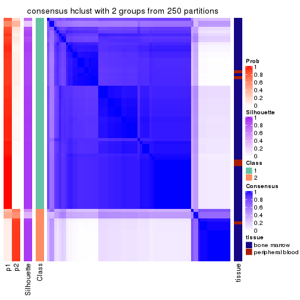</p>

</div>
<div id='tab-CV-hclust-consensus-heatmap-2'>
<pre><code class="r">consensus_heatmap(res, k = 3)
</code></pre>

<p>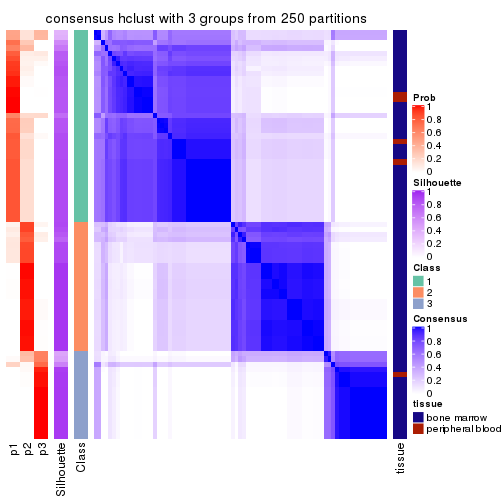</p>

</div>
<div id='tab-CV-hclust-consensus-heatmap-3'>
<pre><code class="r">consensus_heatmap(res, k = 4)
</code></pre>

<p>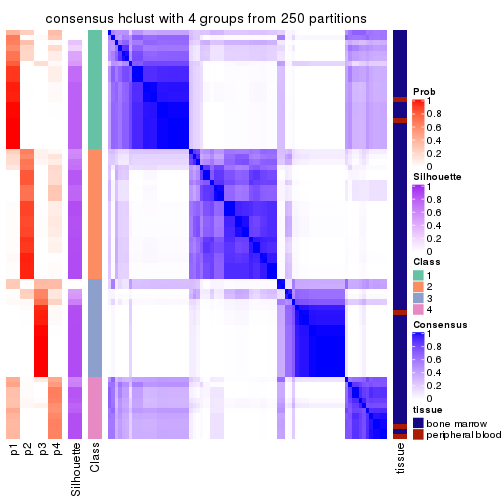</p>

</div>
<div id='tab-CV-hclust-consensus-heatmap-4'>
<pre><code class="r">consensus_heatmap(res, k = 5)
</code></pre>

<p>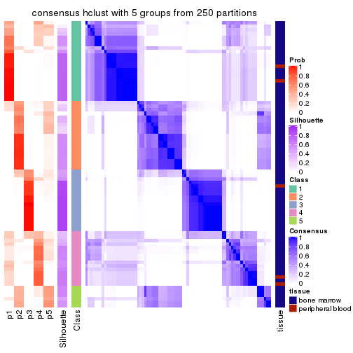</p>

</div>
<div id='tab-CV-hclust-consensus-heatmap-5'>
<pre><code class="r">consensus_heatmap(res, k = 6)
</code></pre>

<p>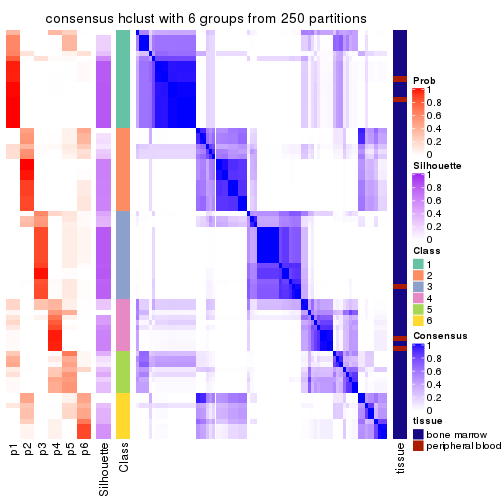</p>

</div>
</div>

Heatmaps for the membership of samples in all partitions to see how consistent they are:


<script>
$( function() {
	$( '#tabs-CV-hclust-membership-heatmap' ).tabs();
} );
</script>
<div id='tabs-CV-hclust-membership-heatmap'>
<ul>
<li><a href='#tab-CV-hclust-membership-heatmap-1'>k = 2</a></li>
<li><a href='#tab-CV-hclust-membership-heatmap-2'>k = 3</a></li>
<li><a href='#tab-CV-hclust-membership-heatmap-3'>k = 4</a></li>
<li><a href='#tab-CV-hclust-membership-heatmap-4'>k = 5</a></li>
<li><a href='#tab-CV-hclust-membership-heatmap-5'>k = 6</a></li>
</ul>
<div id='tab-CV-hclust-membership-heatmap-1'>
<pre><code class="r">membership_heatmap(res, k = 2)
</code></pre>

<p>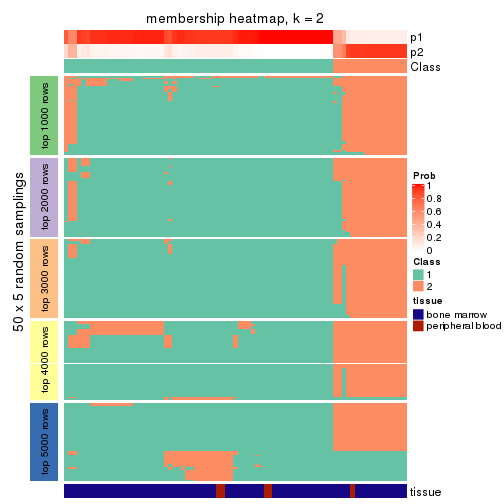</p>

</div>
<div id='tab-CV-hclust-membership-heatmap-2'>
<pre><code class="r">membership_heatmap(res, k = 3)
</code></pre>

<p>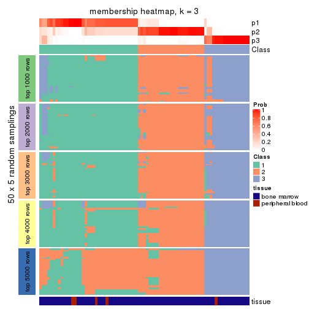</p>

</div>
<div id='tab-CV-hclust-membership-heatmap-3'>
<pre><code class="r">membership_heatmap(res, k = 4)
</code></pre>

<p>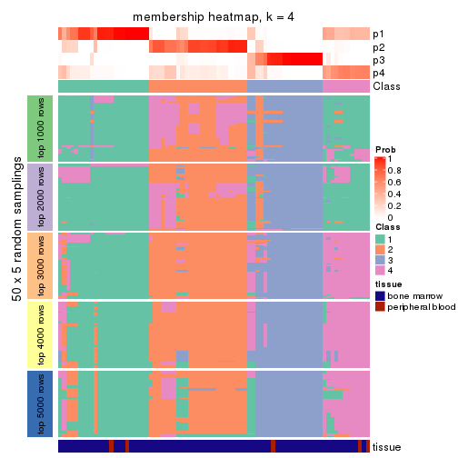</p>

</div>
<div id='tab-CV-hclust-membership-heatmap-4'>
<pre><code class="r">membership_heatmap(res, k = 5)
</code></pre>

<p>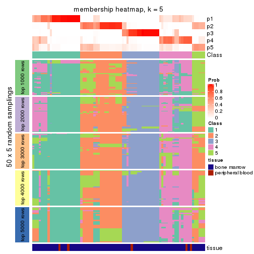</p>

</div>
<div id='tab-CV-hclust-membership-heatmap-5'>
<pre><code class="r">membership_heatmap(res, k = 6)
</code></pre>

<p>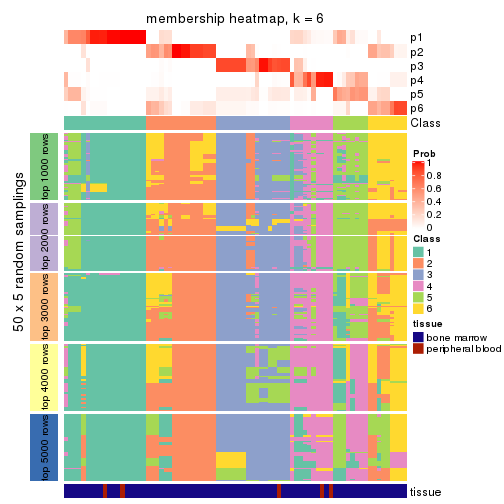</p>

</div>
</div>

As soon as we have had the classes for columns, we can look for signatures
which are significantly different between classes which can be candidate marks
for certain classes. Following are the heatmaps for signatures.


Signature heatmaps where rows are scaled:


<script>
$( function() {
	$( '#tabs-CV-hclust-get-signatures' ).tabs();
} );
</script>
<div id='tabs-CV-hclust-get-signatures'>
<ul>
<li><a href='#tab-CV-hclust-get-signatures-1'>k = 2</a></li>
<li><a href='#tab-CV-hclust-get-signatures-2'>k = 3</a></li>
<li><a href='#tab-CV-hclust-get-signatures-3'>k = 4</a></li>
<li><a href='#tab-CV-hclust-get-signatures-4'>k = 5</a></li>
<li><a href='#tab-CV-hclust-get-signatures-5'>k = 6</a></li>
</ul>
<div id='tab-CV-hclust-get-signatures-1'>
<pre><code class="r">get_signatures(res, k = 2)
</code></pre>

<p>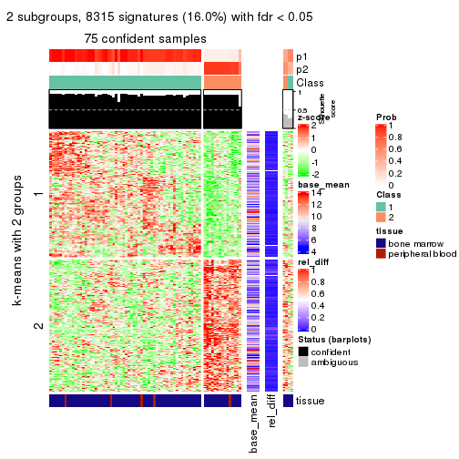</p>

</div>
<div id='tab-CV-hclust-get-signatures-2'>
<pre><code class="r">get_signatures(res, k = 3)
</code></pre>

<p>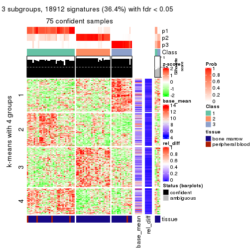</p>

</div>
<div id='tab-CV-hclust-get-signatures-3'>
<pre><code class="r">get_signatures(res, k = 4)
</code></pre>

<p>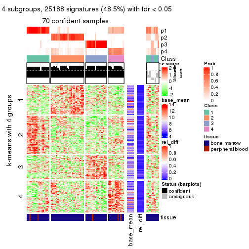</p>

</div>
<div id='tab-CV-hclust-get-signatures-4'>
<pre><code class="r">get_signatures(res, k = 5)
</code></pre>

<p>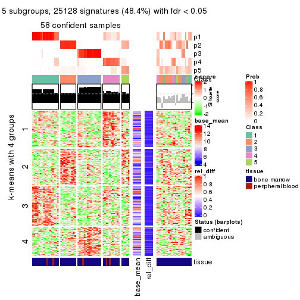</p>

</div>
<div id='tab-CV-hclust-get-signatures-5'>
<pre><code class="r">get_signatures(res, k = 6)
</code></pre>

<p>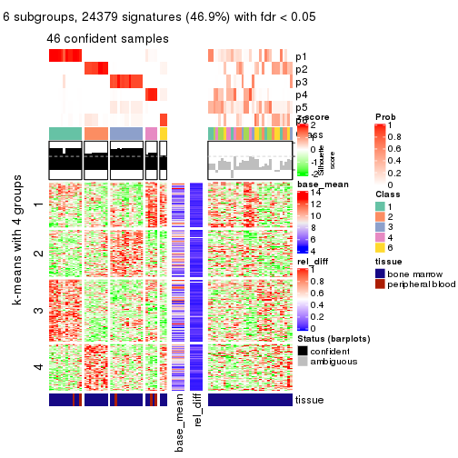</p>

</div>
</div>


Signature heatmaps where rows are not scaled:


<script>
$( function() {
	$( '#tabs-CV-hclust-get-signatures-no-scale' ).tabs();
} );
</script>
<div id='tabs-CV-hclust-get-signatures-no-scale'>
<ul>
<li><a href='#tab-CV-hclust-get-signatures-no-scale-1'>k = 2</a></li>
<li><a href='#tab-CV-hclust-get-signatures-no-scale-2'>k = 3</a></li>
<li><a href='#tab-CV-hclust-get-signatures-no-scale-3'>k = 4</a></li>
<li><a href='#tab-CV-hclust-get-signatures-no-scale-4'>k = 5</a></li>
<li><a href='#tab-CV-hclust-get-signatures-no-scale-5'>k = 6</a></li>
</ul>
<div id='tab-CV-hclust-get-signatures-no-scale-1'>
<pre><code class="r">get_signatures(res, k = 2, scale_rows = FALSE)
</code></pre>

<p>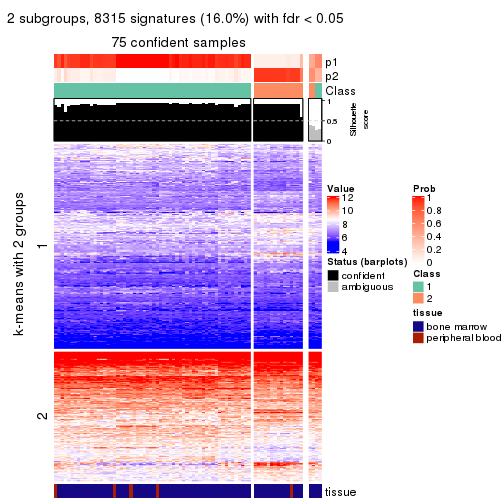</p>

</div>
<div id='tab-CV-hclust-get-signatures-no-scale-2'>
<pre><code class="r">get_signatures(res, k = 3, scale_rows = FALSE)
</code></pre>

<p>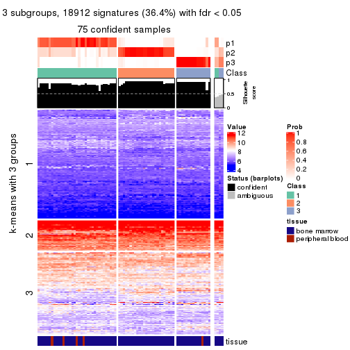</p>

</div>
<div id='tab-CV-hclust-get-signatures-no-scale-3'>
<pre><code class="r">get_signatures(res, k = 4, scale_rows = FALSE)
</code></pre>

<p>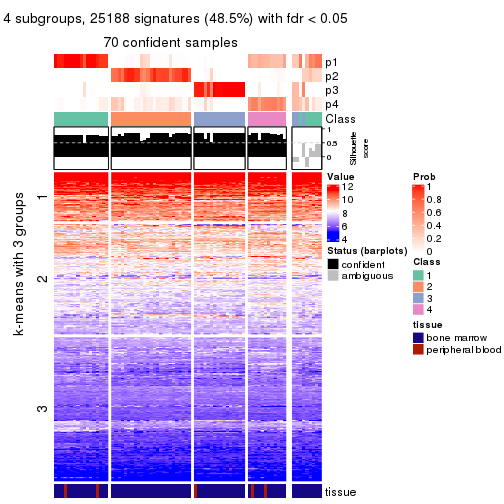</p>

</div>
<div id='tab-CV-hclust-get-signatures-no-scale-4'>
<pre><code class="r">get_signatures(res, k = 5, scale_rows = FALSE)
</code></pre>

<p>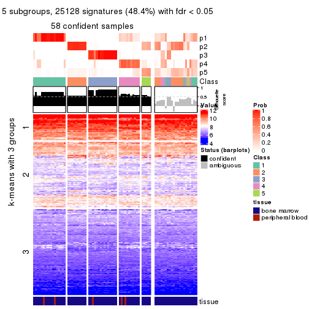</p>

</div>
<div id='tab-CV-hclust-get-signatures-no-scale-5'>
<pre><code class="r">get_signatures(res, k = 6, scale_rows = FALSE)
</code></pre>

<p>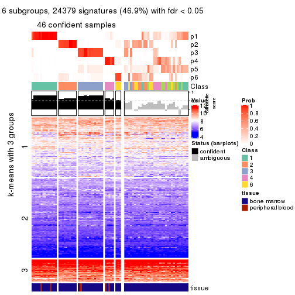</p>

</div>
</div>


Compare the overlap of signatures from different k:

```r
compare_signatures(res)
```

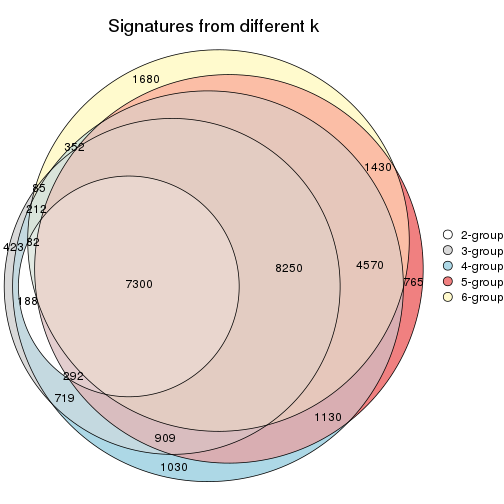

`get_signature()` returns a data frame invisibly. TO get the list of signatures, the function
call should be assigned to a variable explicitly. In following code, if `plot` argument is set
to `FALSE`, no heatmap is plotted while only the differential analysis is performed.

```r
# code only for demonstration
tb = get_signature(res, k = ..., plot = FALSE)
```

An example of the output of `tb` is:

```
#>   which_row         fdr    mean_1    mean_2 scaled_mean_1 scaled_mean_2 km
#> 1        38 0.042760348  8.373488  9.131774    -0.5533452     0.5164555  1
#> 2        40 0.018707592  7.106213  8.469186    -0.6173731     0.5762149  1
#> 3        55 0.019134737 10.221463 11.207825    -0.6159697     0.5749050  1
#> 4        59 0.006059896  5.921854  7.869574    -0.6899429     0.6439467  1
#> 5        60 0.018055526  8.928898 10.211722    -0.6204761     0.5791110  1
#> 6        98 0.009384629 15.714769 14.887706     0.6635654    -0.6193277  2
...
```

The columns in `tb` are:

1. `which_row`: row indices corresponding to the input matrix.
2. `fdr`: FDR for the differential test. 
3. `mean_x`: The mean value in group x.
4. `scaled_mean_x`: The mean value in group x after rows are scaled.
5. `km`: Row groups if k-means clustering is applied to rows.


UMAP plot which shows how samples are separated.


<script>
$( function() {
	$( '#tabs-CV-hclust-dimension-reduction' ).tabs();
} );
</script>
<div id='tabs-CV-hclust-dimension-reduction'>
<ul>
<li><a href='#tab-CV-hclust-dimension-reduction-1'>k = 2</a></li>
<li><a href='#tab-CV-hclust-dimension-reduction-2'>k = 3</a></li>
<li><a href='#tab-CV-hclust-dimension-reduction-3'>k = 4</a></li>
<li><a href='#tab-CV-hclust-dimension-reduction-4'>k = 5</a></li>
<li><a href='#tab-CV-hclust-dimension-reduction-5'>k = 6</a></li>
</ul>
<div id='tab-CV-hclust-dimension-reduction-1'>
<pre><code class="r">dimension_reduction(res, k = 2, method = &quot;UMAP&quot;)
</code></pre>

<p>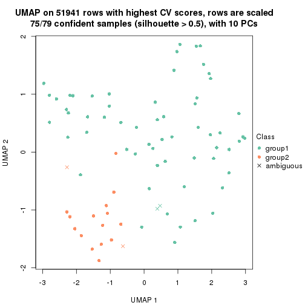</p>

</div>
<div id='tab-CV-hclust-dimension-reduction-2'>
<pre><code class="r">dimension_reduction(res, k = 3, method = &quot;UMAP&quot;)
</code></pre>

<p>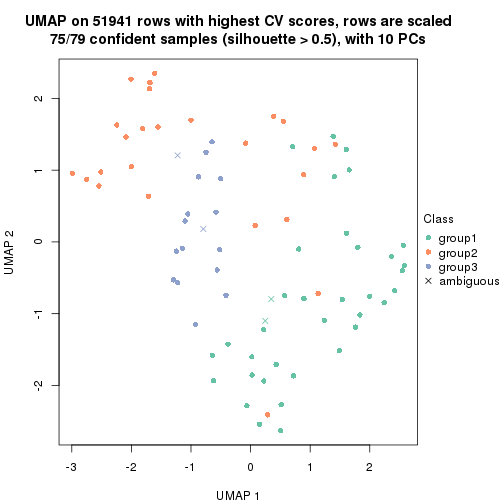</p>

</div>
<div id='tab-CV-hclust-dimension-reduction-3'>
<pre><code class="r">dimension_reduction(res, k = 4, method = &quot;UMAP&quot;)
</code></pre>

<p>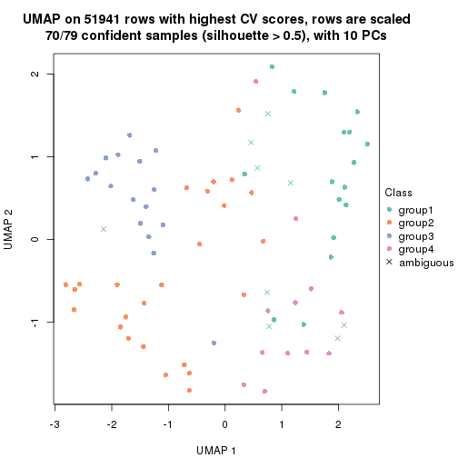</p>

</div>
<div id='tab-CV-hclust-dimension-reduction-4'>
<pre><code class="r">dimension_reduction(res, k = 5, method = &quot;UMAP&quot;)
</code></pre>

<p>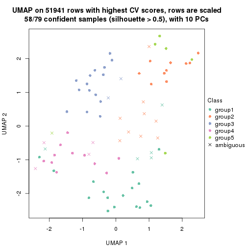</p>

</div>
<div id='tab-CV-hclust-dimension-reduction-5'>
<pre><code class="r">dimension_reduction(res, k = 6, method = &quot;UMAP&quot;)
</code></pre>

<p>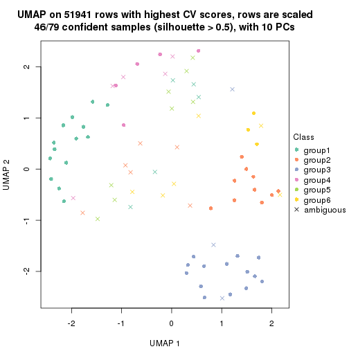</p>

</div>
</div>


Following heatmap shows how subgroups are split when increasing `k`:

```r
collect_classes(res)
```

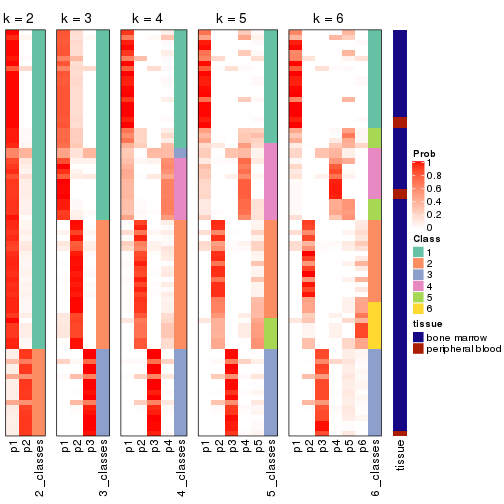


Test correlation between subgroups and known annotations. If the known
annotation is numeric, one-way ANOVA test is applied, and if the known
annotation is discrete, chi-squared contingency table test is applied.

```r
test_to_known_factors(res)
```

```
#>            n tissue(p) k
#> CV:hclust 75     1.000 2
#> CV:hclust 75     0.216 3
#> CV:hclust 70     0.248 4
#> CV:hclust 58     0.562 5
#> CV:hclust 46     0.176 6
```


If matrix rows can be associated to genes, consider to use `GO_Enrichment(res,
...)` to perform function enrichment for the signature genes.


 

---------------------------------------------------


### CV:kmeans


The object with results only for a single top-value method and a single partition method 
can be extracted as:

```r
res = res_list["CV", "kmeans"]
# you can also extract it by
# res = res_list["CV:kmeans"]
```

A summary of `res` and all the functions that can be applied to it:

```r
res
```

```
#> A 'ConsensusPartition' object with k = 2, 3, 4, 5, 6.
#>   On a matrix with 51941 rows and 79 columns.
#>   Top rows (1000, 2000, 3000, 4000, 5000) are extracted by 'CV' method.
#>   Subgroups are detected by 'kmeans' method.
#>   Performed in total 1250 partitions by row resampling.
#>   Best k for subgroups seems to be 2.
#> 
#> Following methods can be applied to this 'ConsensusPartition' object:
#>  [1] "cola_report"             "collect_classes"         "collect_plots"          
#>  [4] "collect_stats"           "colnames"                "compare_signatures"     
#>  [7] "consensus_heatmap"       "dimension_reduction"     "functional_enrichment"  
#> [10] "get_anno_col"            "get_anno"                "get_classes"            
#> [13] "get_consensus"           "get_matrix"              "get_membership"         
#> [16] "get_param"               "get_signatures"          "get_stats"              
#> [19] "is_best_k"               "is_stable_k"             "membership_heatmap"     
#> [22] "ncol"                    "nrow"                    "plot_ecdf"              
#> [25] "rownames"                "select_partition_number" "show"                   
#> [28] "suggest_best_k"          "test_to_known_factors"
```

`collect_plots()` function collects all the plots made from `res` for all `k` (number of partitions)
into one single page to provide an easy and fast comparison between different `k`.

```r
collect_plots(res)
```

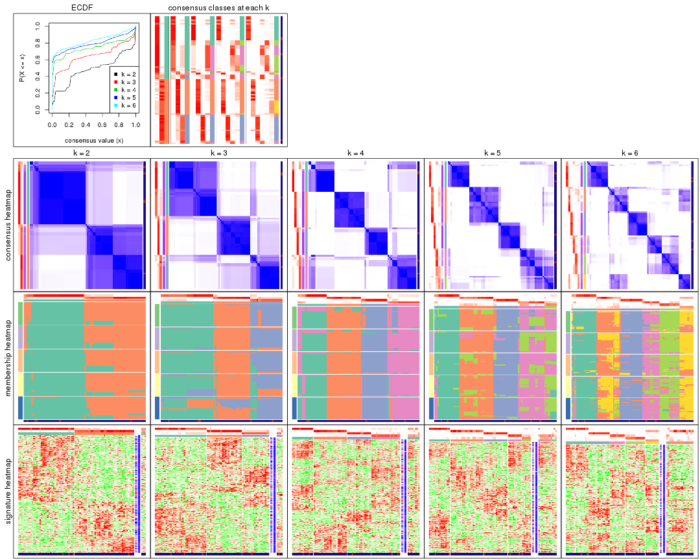

The plots are:

- The first row: a plot of the ECDF (Empirical cumulative distribution
  function) curves of the consensus matrix for each `k` and the heatmap of
  predicted classes for each `k`.
- The second row: heatmaps of the consensus matrix for each `k`.
- The third row: heatmaps of the membership matrix for each `k`.
- The fouth row: heatmaps of the signatures for each `k`.

All the plots in panels can be made by individual functions and they are
plotted later in this section.

`select_partition_number()` produces several plots showing different
statistics for choosing "optimized" `k`. There are following statistics:

- ECDF curves of the consensus matrix for each `k`;
- 1-PAC. [The PAC
  score](https://en.wikipedia.org/wiki/Consensus_clustering#Over-interpretation_potential_of_consensus_clustering)
  measures the proportion of the ambiguous subgrouping.
- Mean silhouette score.
- Concordance. The mean probability of fiting the consensus class ids in all
  partitions.
- Area increased. Denote $A_k$ as the area under the ECDF curve for current
  `k`, the area increased is defined as $A_k - A_{k-1}$.
- Rand index. The percent of pairs of samples that are both in a same cluster
  or both are not in a same cluster in the partition of k and k-1.
- Jaccard index. The ratio of pairs of samples are both in a same cluster in
  the partition of k and k-1 and the pairs of samples are both in a same
  cluster in the partition k or k-1.

The detailed explanations of these statistics can be found in [the cola
vignette](http://bioconductor.org/packages/devel/bioc/vignettes/cola/inst/doc/cola.html#toc_13).

Generally speaking, lower PAC score, higher mean silhouette score or higher
concordance corresponds to better partition. Rand index and Jaccard index
measure how similar the current partition is compared to partition with `k-1`.
If they are too similar, we won't accept `k` is better than `k-1`.

```r
select_partition_number(res)
```

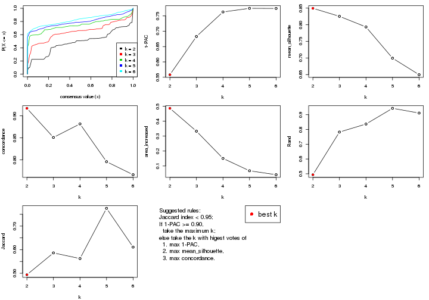

The numeric values for all these statistics can be obtained by `get_stats()`.

```r
get_stats(res)
```

```
#>   k 1-PAC mean_silhouette concordance area_increased  Rand Jaccard
#> 2 2 0.558           0.849       0.917         0.4866 0.494   0.494
#> 3 3 0.683           0.825       0.851         0.3331 0.783   0.586
#> 4 4 0.763           0.793       0.882         0.1507 0.837   0.562
#> 5 5 0.775           0.699       0.796         0.0675 0.943   0.775
#> 6 6 0.774           0.650       0.766         0.0413 0.911   0.611
```

`suggest_best_k()` suggests the best $k$ based on these statistics. The rules are as follows:

- All $k$ with Jaccard index larger than 0.95 are removed because the increase of
  the partition number does not provides enough extra information. If all $k$ are removed,
  the best $k$ is assigned by `NA`.
- For $k$ with 1-PAC larger than 0.9, the maximal $k$ is taken as the "best k". Other $k$ is called "optional k".
- If it does not fit the second rule. The $k$ with the highest vote of highest
  1-PAC, mean silhouette and concordance is taken as the "best k".

```r
suggest_best_k(res)
```

```
#> [1] 2
```


Following shows the table of the partitions (You need to click the **show/hide
code output** link to see it). The membership matrix (columns with name `p*`)
is inferred by
[`clue::cl_consensus()`](https://www.rdocumentation.org/link/cl_consensus?package=clue)
function with the `SE` method. Basically the value in the membership matrix
represents the probability to belong to a certain group. The finall class
label for an item is determined with the group with highest probability it
belongs to.

In `get_classes()` function, the entropy is calculated from the membership
matrix and the silhouette score is calculated from the consensus matrix.


<script>
$( function() {
	$( '#tabs-CV-kmeans-get-classes' ).tabs();
} );
</script>
<div id='tabs-CV-kmeans-get-classes'>
<ul>
<li><a href='#tab-CV-kmeans-get-classes-1'>k = 2</a></li>
<li><a href='#tab-CV-kmeans-get-classes-2'>k = 3</a></li>
<li><a href='#tab-CV-kmeans-get-classes-3'>k = 4</a></li>
<li><a href='#tab-CV-kmeans-get-classes-4'>k = 5</a></li>
<li><a href='#tab-CV-kmeans-get-classes-5'>k = 6</a></li>
</ul>

<div id='tab-CV-kmeans-get-classes-1'>
<p><a id='tab-CV-kmeans-get-classes-1-a' style='color:#0366d6' href='#'>show/hide code output</a></p>
<pre><code class="r">cbind(get_classes(res, k = 2), get_membership(res, k = 2))
</code></pre>

<pre><code>#&gt;           class entropy silhouette    p1    p2
#&gt; GSM316652     2  0.2236     0.8632 0.036 0.964
#&gt; GSM316653     1  0.0000     0.9460 1.000 0.000
#&gt; GSM316654     1  0.0000     0.9460 1.000 0.000
#&gt; GSM316655     1  0.0000     0.9460 1.000 0.000
#&gt; GSM316656     1  0.6623     0.7528 0.828 0.172
#&gt; GSM316657     1  0.0672     0.9460 0.992 0.008
#&gt; GSM316658     2  0.7453     0.8147 0.212 0.788
#&gt; GSM316659     2  0.7528     0.8147 0.216 0.784
#&gt; GSM316660     1  0.0672     0.9460 0.992 0.008
#&gt; GSM316661     1  0.0000     0.9460 1.000 0.000
#&gt; GSM316662     2  0.0000     0.8610 0.000 1.000
#&gt; GSM316663     2  0.6531     0.8360 0.168 0.832
#&gt; GSM316664     1  0.0000     0.9460 1.000 0.000
#&gt; GSM316665     2  0.0000     0.8610 0.000 1.000
#&gt; GSM316666     2  0.2236     0.8632 0.036 0.964
#&gt; GSM316667     2  0.7453     0.8147 0.212 0.788
#&gt; GSM316668     2  0.0000     0.8610 0.000 1.000
#&gt; GSM316669     1  0.0000     0.9460 1.000 0.000
#&gt; GSM316670     2  0.0672     0.8600 0.008 0.992
#&gt; GSM316671     2  0.1843     0.8635 0.028 0.972
#&gt; GSM316672     1  0.2236     0.9198 0.964 0.036
#&gt; GSM316673     1  0.0000     0.9460 1.000 0.000
#&gt; GSM316674     2  0.2236     0.8632 0.036 0.964
#&gt; GSM316676     2  0.2236     0.8632 0.036 0.964
#&gt; GSM316677     1  0.0000     0.9460 1.000 0.000
#&gt; GSM316678     2  0.7528     0.8114 0.216 0.784
#&gt; GSM316679     1  0.0672     0.9460 0.992 0.008
#&gt; GSM316680     1  0.0672     0.9460 0.992 0.008
#&gt; GSM316681     2  0.1843     0.8635 0.028 0.972
#&gt; GSM316682     1  0.0000     0.9460 1.000 0.000
#&gt; GSM316683     1  0.0000     0.9460 1.000 0.000
#&gt; GSM316684     2  0.7453     0.8147 0.212 0.788
#&gt; GSM316685     2  0.0000     0.8610 0.000 1.000
#&gt; GSM316686     1  0.6438     0.7541 0.836 0.164
#&gt; GSM316687     1  0.9833     0.1799 0.576 0.424
#&gt; GSM316688     2  0.9248     0.6487 0.340 0.660
#&gt; GSM316689     1  0.0672     0.9460 0.992 0.008
#&gt; GSM316690     2  0.2236     0.8632 0.036 0.964
#&gt; GSM316691     2  0.6343     0.8361 0.160 0.840
#&gt; GSM316692     2  0.2236     0.8632 0.036 0.964
#&gt; GSM316693     1  0.0000     0.9460 1.000 0.000
#&gt; GSM316694     2  0.2236     0.8632 0.036 0.964
#&gt; GSM316696     1  0.0672     0.9460 0.992 0.008
#&gt; GSM316697     2  0.2236     0.8632 0.036 0.964
#&gt; GSM316698     2  0.7453     0.8147 0.212 0.788
#&gt; GSM316699     2  0.0000     0.8610 0.000 1.000
#&gt; GSM316700     1  0.0000     0.9460 1.000 0.000
#&gt; GSM316701     1  0.0000     0.9460 1.000 0.000
#&gt; GSM316703     2  0.7528     0.8147 0.216 0.784
#&gt; GSM316704     2  0.7528     0.8147 0.216 0.784
#&gt; GSM316705     1  0.0000     0.9460 1.000 0.000
#&gt; GSM316706     1  0.7056     0.7179 0.808 0.192
#&gt; GSM316707     2  0.7453     0.8147 0.212 0.788
#&gt; GSM316708     2  0.8327     0.7537 0.264 0.736
#&gt; GSM316709     2  0.2236     0.8632 0.036 0.964
#&gt; GSM316710     1  0.0000     0.9460 1.000 0.000
#&gt; GSM316711     2  0.7528     0.8147 0.216 0.784
#&gt; GSM316713     1  0.0376     0.9460 0.996 0.004
#&gt; GSM316714     2  0.9954     0.0797 0.460 0.540
#&gt; GSM316715     1  0.0672     0.9460 0.992 0.008
#&gt; GSM316716     2  0.0000     0.8610 0.000 1.000
#&gt; GSM316717     1  0.0672     0.9460 0.992 0.008
#&gt; GSM316718     2  0.8327     0.7537 0.264 0.736
#&gt; GSM316719     1  0.0672     0.9460 0.992 0.008
#&gt; GSM316720     1  0.0672     0.9460 0.992 0.008
#&gt; GSM316721     2  0.0000     0.8610 0.000 1.000
#&gt; GSM316722     1  0.0672     0.9460 0.992 0.008
#&gt; GSM316723     2  0.6438     0.8347 0.164 0.836
#&gt; GSM316724     2  0.7453     0.8147 0.212 0.788
#&gt; GSM316726     2  0.0000     0.8610 0.000 1.000
#&gt; GSM316727     1  0.0672     0.9460 0.992 0.008
#&gt; GSM316728     1  0.9833     0.1799 0.576 0.424
#&gt; GSM316729     1  0.0672     0.9460 0.992 0.008
#&gt; GSM316730     2  0.7453     0.8147 0.212 0.788
#&gt; GSM316675     2  0.2236     0.8632 0.036 0.964
#&gt; GSM316695     1  0.0672     0.9460 0.992 0.008
#&gt; GSM316702     1  0.7528     0.7028 0.784 0.216
#&gt; GSM316712     1  0.0672     0.9460 0.992 0.008
#&gt; GSM316725     1  0.0000     0.9460 1.000 0.000
</code></pre>

<script>
$('#tab-CV-kmeans-get-classes-1-a').parent().next().next().hide();
$('#tab-CV-kmeans-get-classes-1-a').click(function(){
  $('#tab-CV-kmeans-get-classes-1-a').parent().next().next().toggle();
  return(false);
});
</script>
</div>

<div id='tab-CV-kmeans-get-classes-2'>
<p><a id='tab-CV-kmeans-get-classes-2-a' style='color:#0366d6' href='#'>show/hide code output</a></p>
<pre><code class="r">cbind(get_classes(res, k = 3), get_membership(res, k = 3))
</code></pre>

<pre><code>#&gt;           class entropy silhouette    p1    p2    p3
#&gt; GSM316652     3  0.4796     0.8399 0.000 0.220 0.780
#&gt; GSM316653     1  0.5881     0.8454 0.728 0.016 0.256
#&gt; GSM316654     1  0.5881     0.8454 0.728 0.016 0.256
#&gt; GSM316655     1  0.5881     0.8454 0.728 0.016 0.256
#&gt; GSM316656     1  0.7059     0.8147 0.716 0.092 0.192
#&gt; GSM316657     1  0.0592     0.8601 0.988 0.012 0.000
#&gt; GSM316658     2  0.0000     0.9296 0.000 1.000 0.000
#&gt; GSM316659     2  0.0848     0.9265 0.008 0.984 0.008
#&gt; GSM316660     1  0.0592     0.8601 0.988 0.012 0.000
#&gt; GSM316661     1  0.5881     0.8454 0.728 0.016 0.256
#&gt; GSM316662     3  0.4796     0.8399 0.000 0.220 0.780
#&gt; GSM316663     3  0.6151     0.5135 0.180 0.056 0.764
#&gt; GSM316664     1  0.3941     0.8597 0.844 0.000 0.156
#&gt; GSM316665     2  0.0892     0.9162 0.000 0.980 0.020
#&gt; GSM316666     3  0.4750     0.8409 0.000 0.216 0.784
#&gt; GSM316667     2  0.0000     0.9296 0.000 1.000 0.000
#&gt; GSM316668     3  0.4796     0.8399 0.000 0.220 0.780
#&gt; GSM316669     1  0.5881     0.8454 0.728 0.016 0.256
#&gt; GSM316670     3  0.5968     0.6494 0.000 0.364 0.636
#&gt; GSM316671     3  0.4796     0.8399 0.000 0.220 0.780
#&gt; GSM316672     2  0.5859     0.5400 0.344 0.656 0.000
#&gt; GSM316673     1  0.0000     0.8615 1.000 0.000 0.000
#&gt; GSM316674     3  0.4796     0.8399 0.000 0.220 0.780
#&gt; GSM316676     3  0.4750     0.8409 0.000 0.216 0.784
#&gt; GSM316677     1  0.4654     0.8590 0.792 0.000 0.208
#&gt; GSM316678     2  0.1015     0.9241 0.008 0.980 0.012
#&gt; GSM316679     1  0.2749     0.8672 0.924 0.012 0.064
#&gt; GSM316680     1  0.2749     0.8672 0.924 0.012 0.064
#&gt; GSM316681     3  0.4796     0.8399 0.000 0.220 0.780
#&gt; GSM316682     1  0.5881     0.8454 0.728 0.016 0.256
#&gt; GSM316683     1  0.5881     0.8454 0.728 0.016 0.256
#&gt; GSM316684     2  0.0000     0.9296 0.000 1.000 0.000
#&gt; GSM316685     3  0.6126     0.5791 0.000 0.400 0.600
#&gt; GSM316686     1  0.5356     0.8457 0.784 0.020 0.196
#&gt; GSM316687     3  0.5967     0.4049 0.216 0.032 0.752
#&gt; GSM316688     2  0.6820     0.4792 0.248 0.700 0.052
#&gt; GSM316689     1  0.0592     0.8601 0.988 0.012 0.000
#&gt; GSM316690     3  0.4750     0.8409 0.000 0.216 0.784
#&gt; GSM316691     2  0.0237     0.9297 0.000 0.996 0.004
#&gt; GSM316692     3  0.4750     0.8409 0.000 0.216 0.784
#&gt; GSM316693     1  0.5881     0.8454 0.728 0.016 0.256
#&gt; GSM316694     3  0.4796     0.8399 0.000 0.220 0.780
#&gt; GSM316696     1  0.0592     0.8601 0.988 0.012 0.000
#&gt; GSM316697     3  0.4750     0.8409 0.000 0.216 0.784
#&gt; GSM316698     2  0.1015     0.9241 0.008 0.980 0.012
#&gt; GSM316699     2  0.0892     0.9162 0.000 0.980 0.020
#&gt; GSM316700     1  0.5881     0.8454 0.728 0.016 0.256
#&gt; GSM316701     1  0.5881     0.8454 0.728 0.016 0.256
#&gt; GSM316703     2  0.0848     0.9265 0.008 0.984 0.008
#&gt; GSM316704     2  0.0848     0.9265 0.008 0.984 0.008
#&gt; GSM316705     1  0.0424     0.8628 0.992 0.000 0.008
#&gt; GSM316706     2  0.4808     0.7078 0.008 0.804 0.188
#&gt; GSM316707     2  0.0000     0.9296 0.000 1.000 0.000
#&gt; GSM316708     2  0.2446     0.8822 0.052 0.936 0.012
#&gt; GSM316709     3  0.4750     0.8409 0.000 0.216 0.784
#&gt; GSM316710     1  0.5881     0.8454 0.728 0.016 0.256
#&gt; GSM316711     2  0.0848     0.9265 0.008 0.984 0.008
#&gt; GSM316713     1  0.0424     0.8606 0.992 0.008 0.000
#&gt; GSM316714     3  0.1337     0.6895 0.012 0.016 0.972
#&gt; GSM316715     1  0.0592     0.8601 0.988 0.012 0.000
#&gt; GSM316716     2  0.0892     0.9162 0.000 0.980 0.020
#&gt; GSM316717     1  0.2749     0.8672 0.924 0.012 0.064
#&gt; GSM316718     2  0.1751     0.9077 0.028 0.960 0.012
#&gt; GSM316719     1  0.0592     0.8601 0.988 0.012 0.000
#&gt; GSM316720     1  0.0592     0.8601 0.988 0.012 0.000
#&gt; GSM316721     2  0.0424     0.9247 0.000 0.992 0.008
#&gt; GSM316722     1  0.2749     0.8672 0.924 0.012 0.064
#&gt; GSM316723     2  0.0000     0.9296 0.000 1.000 0.000
#&gt; GSM316724     2  0.0424     0.9285 0.000 0.992 0.008
#&gt; GSM316726     2  0.0424     0.9247 0.000 0.992 0.008
#&gt; GSM316727     1  0.0592     0.8601 0.988 0.012 0.000
#&gt; GSM316728     3  0.5849     0.3972 0.216 0.028 0.756
#&gt; GSM316729     1  0.6286     0.8408 0.772 0.092 0.136
#&gt; GSM316730     2  0.0892     0.9241 0.000 0.980 0.020
#&gt; GSM316675     3  0.4750     0.8409 0.000 0.216 0.784
#&gt; GSM316695     1  0.0592     0.8601 0.988 0.012 0.000
#&gt; GSM316702     3  0.6501     0.0784 0.316 0.020 0.664
#&gt; GSM316712     1  0.0592     0.8601 0.988 0.012 0.000
#&gt; GSM316725     1  0.5881     0.8454 0.728 0.016 0.256
</code></pre>

<script>
$('#tab-CV-kmeans-get-classes-2-a').parent().next().next().hide();
$('#tab-CV-kmeans-get-classes-2-a').click(function(){
  $('#tab-CV-kmeans-get-classes-2-a').parent().next().next().toggle();
  return(false);
});
</script>
</div>

<div id='tab-CV-kmeans-get-classes-3'>
<p><a id='tab-CV-kmeans-get-classes-3-a' style='color:#0366d6' href='#'>show/hide code output</a></p>
<pre><code class="r">cbind(get_classes(res, k = 4), get_membership(res, k = 4))
</code></pre>

<pre><code>#&gt;           class entropy silhouette    p1    p2    p3    p4
#&gt; GSM316652     3  0.0469     0.9373 0.000 0.012 0.988 0.000
#&gt; GSM316653     4  0.3257     0.8262 0.152 0.004 0.000 0.844
#&gt; GSM316654     4  0.3196     0.8290 0.136 0.000 0.008 0.856
#&gt; GSM316655     4  0.3257     0.8262 0.152 0.004 0.000 0.844
#&gt; GSM316656     4  0.2654     0.8142 0.108 0.004 0.000 0.888
#&gt; GSM316657     1  0.0000     0.8300 1.000 0.000 0.000 0.000
#&gt; GSM316658     2  0.1824     0.9567 0.000 0.936 0.004 0.060
#&gt; GSM316659     2  0.1109     0.9595 0.000 0.968 0.004 0.028
#&gt; GSM316660     1  0.0000     0.8300 1.000 0.000 0.000 0.000
#&gt; GSM316661     4  0.2760     0.8297 0.128 0.000 0.000 0.872
#&gt; GSM316662     3  0.0657     0.9358 0.000 0.012 0.984 0.004
#&gt; GSM316663     4  0.4898     0.6270 0.016 0.004 0.264 0.716
#&gt; GSM316664     1  0.5110     0.2647 0.636 0.000 0.012 0.352
#&gt; GSM316665     2  0.2266     0.9524 0.000 0.912 0.004 0.084
#&gt; GSM316666     3  0.1059     0.9360 0.000 0.012 0.972 0.016
#&gt; GSM316667     2  0.2773     0.9505 0.000 0.880 0.004 0.116
#&gt; GSM316668     3  0.0469     0.9373 0.000 0.012 0.988 0.000
#&gt; GSM316669     4  0.3257     0.8262 0.152 0.004 0.000 0.844
#&gt; GSM316670     3  0.5140     0.7354 0.000 0.144 0.760 0.096
#&gt; GSM316671     3  0.0657     0.9358 0.000 0.012 0.984 0.004
#&gt; GSM316672     1  0.3279     0.7057 0.872 0.096 0.000 0.032
#&gt; GSM316673     1  0.0000     0.8300 1.000 0.000 0.000 0.000
#&gt; GSM316674     3  0.0469     0.9373 0.000 0.012 0.988 0.000
#&gt; GSM316676     3  0.1059     0.9360 0.000 0.012 0.972 0.016
#&gt; GSM316677     4  0.3324     0.8283 0.136 0.000 0.012 0.852
#&gt; GSM316678     2  0.0592     0.9563 0.000 0.984 0.000 0.016
#&gt; GSM316679     1  0.5167    -0.1025 0.508 0.004 0.000 0.488
#&gt; GSM316680     4  0.5168     0.0201 0.496 0.004 0.000 0.500
#&gt; GSM316681     3  0.0469     0.9373 0.000 0.012 0.988 0.000
#&gt; GSM316682     4  0.3257     0.8262 0.152 0.004 0.000 0.844
#&gt; GSM316683     4  0.3257     0.8262 0.152 0.004 0.000 0.844
#&gt; GSM316684     2  0.0188     0.9570 0.000 0.996 0.004 0.000
#&gt; GSM316685     3  0.5140     0.7314 0.000 0.144 0.760 0.096
#&gt; GSM316686     1  0.4950     0.2577 0.620 0.000 0.004 0.376
#&gt; GSM316687     4  0.4955     0.6258 0.024 0.000 0.268 0.708
#&gt; GSM316688     4  0.5349     0.3845 0.024 0.336 0.000 0.640
#&gt; GSM316689     1  0.0000     0.8300 1.000 0.000 0.000 0.000
#&gt; GSM316690     3  0.1059     0.9360 0.000 0.012 0.972 0.016
#&gt; GSM316691     2  0.2773     0.9505 0.000 0.880 0.004 0.116
#&gt; GSM316692     3  0.1059     0.9360 0.000 0.012 0.972 0.016
#&gt; GSM316693     4  0.3390     0.8284 0.132 0.000 0.016 0.852
#&gt; GSM316694     3  0.0469     0.9373 0.000 0.012 0.988 0.000
#&gt; GSM316696     1  0.0000     0.8300 1.000 0.000 0.000 0.000
#&gt; GSM316697     3  0.0469     0.9373 0.000 0.012 0.988 0.000
#&gt; GSM316698     2  0.0592     0.9563 0.000 0.984 0.000 0.016
#&gt; GSM316699     2  0.2654     0.9514 0.000 0.888 0.004 0.108
#&gt; GSM316700     4  0.3157     0.8280 0.144 0.004 0.000 0.852
#&gt; GSM316701     4  0.3257     0.8262 0.152 0.004 0.000 0.844
#&gt; GSM316703     2  0.0188     0.9570 0.000 0.996 0.004 0.000
#&gt; GSM316704     2  0.0188     0.9570 0.000 0.996 0.004 0.000
#&gt; GSM316705     1  0.0000     0.8300 1.000 0.000 0.000 0.000
#&gt; GSM316706     2  0.0469     0.9509 0.000 0.988 0.012 0.000
#&gt; GSM316707     2  0.2197     0.9523 0.000 0.916 0.004 0.080
#&gt; GSM316708     2  0.1118     0.9550 0.000 0.964 0.000 0.036
#&gt; GSM316709     3  0.1059     0.9360 0.000 0.012 0.972 0.016
#&gt; GSM316710     4  0.3390     0.8284 0.132 0.000 0.016 0.852
#&gt; GSM316711     2  0.2197     0.9523 0.000 0.916 0.004 0.080
#&gt; GSM316713     1  0.0000     0.8300 1.000 0.000 0.000 0.000
#&gt; GSM316714     3  0.4830     0.2957 0.000 0.000 0.608 0.392
#&gt; GSM316715     1  0.0000     0.8300 1.000 0.000 0.000 0.000
#&gt; GSM316716     2  0.2654     0.9514 0.000 0.888 0.004 0.108
#&gt; GSM316717     1  0.5168    -0.1108 0.504 0.004 0.000 0.492
#&gt; GSM316718     2  0.1118     0.9550 0.000 0.964 0.000 0.036
#&gt; GSM316719     1  0.0000     0.8300 1.000 0.000 0.000 0.000
#&gt; GSM316720     1  0.0000     0.8300 1.000 0.000 0.000 0.000
#&gt; GSM316721     2  0.2654     0.9514 0.000 0.888 0.004 0.108
#&gt; GSM316722     1  0.5167    -0.1025 0.508 0.004 0.000 0.488
#&gt; GSM316723     2  0.0376     0.9579 0.000 0.992 0.004 0.004
#&gt; GSM316724     2  0.1118     0.9550 0.000 0.964 0.000 0.036
#&gt; GSM316726     2  0.2654     0.9514 0.000 0.888 0.004 0.108
#&gt; GSM316727     1  0.0000     0.8300 1.000 0.000 0.000 0.000
#&gt; GSM316728     4  0.4955     0.6258 0.024 0.000 0.268 0.708
#&gt; GSM316729     4  0.6033     0.5792 0.116 0.204 0.000 0.680
#&gt; GSM316730     2  0.0592     0.9563 0.000 0.984 0.000 0.016
#&gt; GSM316675     3  0.1059     0.9360 0.000 0.012 0.972 0.016
#&gt; GSM316695     1  0.0000     0.8300 1.000 0.000 0.000 0.000
#&gt; GSM316702     4  0.5074     0.6632 0.040 0.000 0.236 0.724
#&gt; GSM316712     1  0.0000     0.8300 1.000 0.000 0.000 0.000
#&gt; GSM316725     4  0.3390     0.8284 0.132 0.000 0.016 0.852
</code></pre>

<script>
$('#tab-CV-kmeans-get-classes-3-a').parent().next().next().hide();
$('#tab-CV-kmeans-get-classes-3-a').click(function(){
  $('#tab-CV-kmeans-get-classes-3-a').parent().next().next().toggle();
  return(false);
});
</script>
</div>

<div id='tab-CV-kmeans-get-classes-4'>
<p><a id='tab-CV-kmeans-get-classes-4-a' style='color:#0366d6' href='#'>show/hide code output</a></p>
<pre><code class="r">cbind(get_classes(res, k = 5), get_membership(res, k = 5))
</code></pre>

<pre><code>#&gt;           class entropy silhouette    p1    p2    p3    p4    p5
#&gt; GSM316652     3  0.0703      0.922 0.000 0.000 0.976 0.000 0.024
#&gt; GSM316653     4  0.4855      0.105 0.024 0.000 0.000 0.552 0.424
#&gt; GSM316654     4  0.2763      0.527 0.004 0.000 0.000 0.848 0.148
#&gt; GSM316655     5  0.4803      0.218 0.020 0.000 0.000 0.444 0.536
#&gt; GSM316656     5  0.4339      0.506 0.012 0.000 0.000 0.336 0.652
#&gt; GSM316657     1  0.0963      0.898 0.964 0.000 0.000 0.000 0.036
#&gt; GSM316658     2  0.2179      0.846 0.000 0.888 0.000 0.000 0.112
#&gt; GSM316659     2  0.1043      0.850 0.000 0.960 0.000 0.000 0.040
#&gt; GSM316660     1  0.0000      0.902 1.000 0.000 0.000 0.000 0.000
#&gt; GSM316661     4  0.3550      0.444 0.004 0.000 0.000 0.760 0.236
#&gt; GSM316662     3  0.0880      0.921 0.000 0.000 0.968 0.000 0.032
#&gt; GSM316663     4  0.2561      0.547 0.000 0.000 0.096 0.884 0.020
#&gt; GSM316664     1  0.4410      0.273 0.556 0.000 0.000 0.440 0.004
#&gt; GSM316665     2  0.3242      0.830 0.000 0.784 0.000 0.000 0.216
#&gt; GSM316666     3  0.1549      0.914 0.000 0.000 0.944 0.040 0.016
#&gt; GSM316667     2  0.4171      0.769 0.000 0.604 0.000 0.000 0.396
#&gt; GSM316668     3  0.0794      0.921 0.000 0.000 0.972 0.000 0.028
#&gt; GSM316669     4  0.4855      0.105 0.024 0.000 0.000 0.552 0.424
#&gt; GSM316670     3  0.6257      0.581 0.000 0.116 0.616 0.036 0.232
#&gt; GSM316671     3  0.0880      0.921 0.000 0.000 0.968 0.000 0.032
#&gt; GSM316672     1  0.4541      0.698 0.744 0.084 0.000 0.000 0.172
#&gt; GSM316673     1  0.0000      0.902 1.000 0.000 0.000 0.000 0.000
#&gt; GSM316674     3  0.0794      0.921 0.000 0.000 0.972 0.000 0.028
#&gt; GSM316676     3  0.1364      0.916 0.000 0.000 0.952 0.036 0.012
#&gt; GSM316677     4  0.1571      0.579 0.004 0.000 0.000 0.936 0.060
#&gt; GSM316678     2  0.1341      0.840 0.000 0.944 0.000 0.000 0.056
#&gt; GSM316679     5  0.5856      0.663 0.172 0.000 0.000 0.224 0.604
#&gt; GSM316680     5  0.5824      0.666 0.168 0.000 0.000 0.224 0.608
#&gt; GSM316681     3  0.0703      0.922 0.000 0.000 0.976 0.000 0.024
#&gt; GSM316682     4  0.4760      0.130 0.020 0.000 0.000 0.564 0.416
#&gt; GSM316683     4  0.4767      0.122 0.020 0.000 0.000 0.560 0.420
#&gt; GSM316684     2  0.0000      0.845 0.000 1.000 0.000 0.000 0.000
#&gt; GSM316685     3  0.5753      0.588 0.000 0.116 0.652 0.016 0.216
#&gt; GSM316686     1  0.5142      0.466 0.600 0.000 0.000 0.348 0.052
#&gt; GSM316687     4  0.2519      0.547 0.000 0.000 0.100 0.884 0.016
#&gt; GSM316688     5  0.6593     -0.117 0.000 0.352 0.000 0.216 0.432
#&gt; GSM316689     1  0.0794      0.900 0.972 0.000 0.000 0.000 0.028
#&gt; GSM316690     3  0.1725      0.912 0.000 0.000 0.936 0.044 0.020
#&gt; GSM316691     2  0.4138      0.777 0.000 0.616 0.000 0.000 0.384
#&gt; GSM316692     3  0.1626      0.912 0.000 0.000 0.940 0.044 0.016
#&gt; GSM316693     4  0.1205      0.584 0.004 0.000 0.000 0.956 0.040
#&gt; GSM316694     3  0.0703      0.922 0.000 0.000 0.976 0.000 0.024
#&gt; GSM316696     1  0.0963      0.898 0.964 0.000 0.000 0.000 0.036
#&gt; GSM316697     3  0.0000      0.922 0.000 0.000 1.000 0.000 0.000
#&gt; GSM316698     2  0.1341      0.840 0.000 0.944 0.000 0.000 0.056
#&gt; GSM316699     2  0.3837      0.815 0.000 0.692 0.000 0.000 0.308
#&gt; GSM316700     4  0.4590      0.138 0.012 0.000 0.000 0.568 0.420
#&gt; GSM316701     4  0.4827     -0.127 0.020 0.000 0.000 0.504 0.476
#&gt; GSM316703     2  0.0000      0.845 0.000 1.000 0.000 0.000 0.000
#&gt; GSM316704     2  0.0000      0.845 0.000 1.000 0.000 0.000 0.000
#&gt; GSM316705     1  0.0963      0.898 0.964 0.000 0.000 0.000 0.036
#&gt; GSM316706     2  0.0609      0.839 0.000 0.980 0.000 0.000 0.020
#&gt; GSM316707     2  0.3210      0.828 0.000 0.788 0.000 0.000 0.212
#&gt; GSM316708     2  0.3636      0.730 0.000 0.728 0.000 0.000 0.272
#&gt; GSM316709     3  0.1364      0.916 0.000 0.000 0.952 0.036 0.012
#&gt; GSM316710     4  0.1205      0.584 0.004 0.000 0.000 0.956 0.040
#&gt; GSM316711     2  0.3109      0.828 0.000 0.800 0.000 0.000 0.200
#&gt; GSM316713     1  0.0000      0.902 1.000 0.000 0.000 0.000 0.000
#&gt; GSM316714     4  0.4366      0.307 0.000 0.000 0.320 0.664 0.016
#&gt; GSM316715     1  0.0880      0.894 0.968 0.000 0.000 0.000 0.032
#&gt; GSM316716     2  0.3837      0.815 0.000 0.692 0.000 0.000 0.308
#&gt; GSM316717     5  0.5934      0.661 0.176 0.000 0.000 0.232 0.592
#&gt; GSM316718     2  0.3612      0.742 0.000 0.732 0.000 0.000 0.268
#&gt; GSM316719     1  0.0880      0.894 0.968 0.000 0.000 0.000 0.032
#&gt; GSM316720     1  0.0880      0.894 0.968 0.000 0.000 0.000 0.032
#&gt; GSM316721     2  0.3837      0.815 0.000 0.692 0.000 0.000 0.308
#&gt; GSM316722     5  0.5931      0.658 0.164 0.000 0.000 0.248 0.588
#&gt; GSM316723     2  0.0510      0.848 0.000 0.984 0.000 0.000 0.016
#&gt; GSM316724     2  0.3003      0.802 0.000 0.812 0.000 0.000 0.188
#&gt; GSM316726     2  0.3837      0.815 0.000 0.692 0.000 0.000 0.308
#&gt; GSM316727     1  0.0880      0.894 0.968 0.000 0.000 0.000 0.032
#&gt; GSM316728     4  0.2519      0.547 0.000 0.000 0.100 0.884 0.016
#&gt; GSM316729     5  0.4996      0.580 0.020 0.036 0.000 0.256 0.688
#&gt; GSM316730     2  0.1341      0.840 0.000 0.944 0.000 0.000 0.056
#&gt; GSM316675     3  0.1626      0.912 0.000 0.000 0.940 0.044 0.016
#&gt; GSM316695     1  0.0963      0.898 0.964 0.000 0.000 0.000 0.036
#&gt; GSM316702     4  0.2519      0.547 0.000 0.000 0.100 0.884 0.016
#&gt; GSM316712     1  0.0000      0.902 1.000 0.000 0.000 0.000 0.000
#&gt; GSM316725     4  0.1205      0.584 0.004 0.000 0.000 0.956 0.040
</code></pre>

<script>
$('#tab-CV-kmeans-get-classes-4-a').parent().next().next().hide();
$('#tab-CV-kmeans-get-classes-4-a').click(function(){
  $('#tab-CV-kmeans-get-classes-4-a').parent().next().next().toggle();
  return(false);
});
</script>
</div>

<div id='tab-CV-kmeans-get-classes-5'>
<p><a id='tab-CV-kmeans-get-classes-5-a' style='color:#0366d6' href='#'>show/hide code output</a></p>
<pre><code class="r">cbind(get_classes(res, k = 6), get_membership(res, k = 6))
</code></pre>

<pre><code>#&gt;           class entropy silhouette    p1    p2    p3    p4    p5    p6
#&gt; GSM316652     3  0.1462     0.8890 0.000 0.000 0.936 0.000 0.008 0.056
#&gt; GSM316653     5  0.4151     0.6805 0.000 0.000 0.000 0.276 0.684 0.040
#&gt; GSM316654     4  0.3481     0.7023 0.000 0.000 0.000 0.776 0.192 0.032
#&gt; GSM316655     5  0.3455     0.7392 0.000 0.000 0.000 0.144 0.800 0.056
#&gt; GSM316656     5  0.2565     0.7419 0.000 0.028 0.000 0.040 0.892 0.040
#&gt; GSM316657     1  0.1500     0.8734 0.936 0.000 0.000 0.012 0.000 0.052
#&gt; GSM316658     2  0.3592    -0.2811 0.000 0.656 0.000 0.000 0.000 0.344
#&gt; GSM316659     6  0.3996     0.7453 0.000 0.484 0.000 0.004 0.000 0.512
#&gt; GSM316660     1  0.0405     0.8774 0.988 0.000 0.000 0.004 0.000 0.008
#&gt; GSM316661     4  0.4219     0.2003 0.000 0.000 0.000 0.592 0.388 0.020
#&gt; GSM316662     3  0.1462     0.8890 0.000 0.000 0.936 0.000 0.008 0.056
#&gt; GSM316663     4  0.3591     0.7539 0.000 0.000 0.064 0.816 0.016 0.104
#&gt; GSM316664     1  0.4559     0.1483 0.512 0.000 0.000 0.460 0.008 0.020
#&gt; GSM316665     2  0.3030     0.2750 0.000 0.816 0.000 0.008 0.008 0.168
#&gt; GSM316666     3  0.2199     0.8716 0.000 0.000 0.892 0.020 0.000 0.088
#&gt; GSM316667     2  0.3156     0.4528 0.000 0.852 0.000 0.020 0.056 0.072
#&gt; GSM316668     3  0.1462     0.8890 0.000 0.000 0.936 0.000 0.008 0.056
#&gt; GSM316669     5  0.4151     0.6805 0.000 0.000 0.000 0.276 0.684 0.040
#&gt; GSM316670     2  0.5902    -0.1350 0.000 0.464 0.400 0.024 0.000 0.112
#&gt; GSM316671     3  0.1462     0.8890 0.000 0.000 0.936 0.000 0.008 0.056
#&gt; GSM316672     1  0.6496     0.5092 0.560 0.036 0.000 0.024 0.176 0.204
#&gt; GSM316673     1  0.0725     0.8767 0.976 0.000 0.000 0.012 0.000 0.012
#&gt; GSM316674     3  0.1462     0.8890 0.000 0.000 0.936 0.000 0.008 0.056
#&gt; GSM316676     3  0.2255     0.8711 0.000 0.000 0.892 0.028 0.000 0.080
#&gt; GSM316677     4  0.2398     0.7951 0.000 0.000 0.000 0.876 0.104 0.020
#&gt; GSM316678     6  0.5178     0.7058 0.000 0.424 0.000 0.016 0.052 0.508
#&gt; GSM316679     5  0.2772     0.7129 0.040 0.000 0.000 0.004 0.864 0.092
#&gt; GSM316680     5  0.2432     0.7296 0.028 0.004 0.000 0.004 0.892 0.072
#&gt; GSM316681     3  0.1462     0.8890 0.000 0.000 0.936 0.000 0.008 0.056
#&gt; GSM316682     5  0.3690     0.6605 0.000 0.000 0.000 0.308 0.684 0.008
#&gt; GSM316683     5  0.3690     0.6605 0.000 0.000 0.000 0.308 0.684 0.008
#&gt; GSM316684     6  0.4285     0.8088 0.000 0.432 0.000 0.008 0.008 0.552
#&gt; GSM316685     3  0.4758     0.0866 0.000 0.476 0.476 0.000 0.000 0.048
#&gt; GSM316686     1  0.5108     0.5472 0.620 0.000 0.000 0.264 0.004 0.112
#&gt; GSM316687     4  0.2649     0.7934 0.000 0.000 0.048 0.884 0.016 0.052
#&gt; GSM316688     2  0.6958     0.1649 0.000 0.436 0.000 0.088 0.292 0.184
#&gt; GSM316689     1  0.1434     0.8743 0.940 0.000 0.000 0.012 0.000 0.048
#&gt; GSM316690     3  0.2586     0.8609 0.000 0.000 0.868 0.032 0.000 0.100
#&gt; GSM316691     2  0.2879     0.4585 0.000 0.868 0.000 0.016 0.044 0.072
#&gt; GSM316692     3  0.2510     0.8631 0.000 0.000 0.872 0.028 0.000 0.100
#&gt; GSM316693     4  0.2301     0.8007 0.000 0.000 0.000 0.884 0.096 0.020
#&gt; GSM316694     3  0.1204     0.8894 0.000 0.000 0.944 0.000 0.000 0.056
#&gt; GSM316696     1  0.1500     0.8734 0.936 0.000 0.000 0.012 0.000 0.052
#&gt; GSM316697     3  0.0260     0.8869 0.000 0.000 0.992 0.000 0.000 0.008
#&gt; GSM316698     6  0.5178     0.7058 0.000 0.424 0.000 0.016 0.052 0.508
#&gt; GSM316699     2  0.0146     0.4713 0.000 0.996 0.000 0.000 0.000 0.004
#&gt; GSM316700     5  0.3816     0.6620 0.000 0.000 0.000 0.296 0.688 0.016
#&gt; GSM316701     5  0.3271     0.7170 0.000 0.000 0.000 0.232 0.760 0.008
#&gt; GSM316703     6  0.3955     0.8160 0.000 0.436 0.000 0.004 0.000 0.560
#&gt; GSM316704     6  0.4057     0.8182 0.000 0.436 0.000 0.008 0.000 0.556
#&gt; GSM316705     1  0.1719     0.8717 0.924 0.000 0.000 0.016 0.000 0.060
#&gt; GSM316706     6  0.3923     0.8031 0.000 0.416 0.000 0.004 0.000 0.580
#&gt; GSM316707     2  0.2178     0.3301 0.000 0.868 0.000 0.000 0.000 0.132
#&gt; GSM316708     2  0.6335    -0.1705 0.000 0.428 0.000 0.020 0.208 0.344
#&gt; GSM316709     3  0.1908     0.8766 0.000 0.000 0.916 0.028 0.000 0.056
#&gt; GSM316710     4  0.2301     0.8007 0.000 0.000 0.000 0.884 0.096 0.020
#&gt; GSM316711     2  0.3151     0.0776 0.000 0.748 0.000 0.000 0.000 0.252
#&gt; GSM316713     1  0.0458     0.8772 0.984 0.000 0.000 0.000 0.000 0.016
#&gt; GSM316714     4  0.4616     0.5936 0.000 0.000 0.236 0.680 0.004 0.080
#&gt; GSM316715     1  0.2001     0.8606 0.912 0.000 0.000 0.000 0.040 0.048
#&gt; GSM316716     2  0.0000     0.4728 0.000 1.000 0.000 0.000 0.000 0.000
#&gt; GSM316717     5  0.2594     0.7345 0.028 0.000 0.000 0.016 0.884 0.072
#&gt; GSM316718     2  0.6375    -0.1587 0.000 0.436 0.000 0.024 0.204 0.336
#&gt; GSM316719     1  0.2001     0.8606 0.912 0.000 0.000 0.000 0.040 0.048
#&gt; GSM316720     1  0.2001     0.8606 0.912 0.000 0.000 0.000 0.040 0.048
#&gt; GSM316721     2  0.0622     0.4686 0.000 0.980 0.000 0.000 0.008 0.012
#&gt; GSM316722     5  0.3145     0.7265 0.028 0.004 0.000 0.028 0.856 0.084
#&gt; GSM316723     6  0.4326     0.7577 0.000 0.484 0.000 0.008 0.008 0.500
#&gt; GSM316724     2  0.5884    -0.3903 0.000 0.472 0.000 0.012 0.144 0.372
#&gt; GSM316726     2  0.0000     0.4728 0.000 1.000 0.000 0.000 0.000 0.000
#&gt; GSM316727     1  0.2001     0.8606 0.912 0.000 0.000 0.000 0.040 0.048
#&gt; GSM316728     4  0.2649     0.7934 0.000 0.000 0.048 0.884 0.016 0.052
#&gt; GSM316729     5  0.2479     0.7306 0.000 0.028 0.000 0.016 0.892 0.064
#&gt; GSM316730     6  0.5159     0.7141 0.000 0.408 0.000 0.016 0.052 0.524
#&gt; GSM316675     3  0.2586     0.8609 0.000 0.000 0.868 0.032 0.000 0.100
#&gt; GSM316695     1  0.1719     0.8717 0.924 0.000 0.000 0.016 0.000 0.060
#&gt; GSM316702     4  0.1887     0.7997 0.000 0.000 0.048 0.924 0.012 0.016
#&gt; GSM316712     1  0.0260     0.8774 0.992 0.000 0.000 0.000 0.000 0.008
#&gt; GSM316725     4  0.2301     0.8007 0.000 0.000 0.000 0.884 0.096 0.020
</code></pre>

<script>
$('#tab-CV-kmeans-get-classes-5-a').parent().next().next().hide();
$('#tab-CV-kmeans-get-classes-5-a').click(function(){
  $('#tab-CV-kmeans-get-classes-5-a').parent().next().next().toggle();
  return(false);
});
</script>
</div>
</div>

Heatmaps for the consensus matrix. It visualizes the probability of two
samples to be in a same group.


<script>
$( function() {
	$( '#tabs-CV-kmeans-consensus-heatmap' ).tabs();
} );
</script>
<div id='tabs-CV-kmeans-consensus-heatmap'>
<ul>
<li><a href='#tab-CV-kmeans-consensus-heatmap-1'>k = 2</a></li>
<li><a href='#tab-CV-kmeans-consensus-heatmap-2'>k = 3</a></li>
<li><a href='#tab-CV-kmeans-consensus-heatmap-3'>k = 4</a></li>
<li><a href='#tab-CV-kmeans-consensus-heatmap-4'>k = 5</a></li>
<li><a href='#tab-CV-kmeans-consensus-heatmap-5'>k = 6</a></li>
</ul>
<div id='tab-CV-kmeans-consensus-heatmap-1'>
<pre><code class="r">consensus_heatmap(res, k = 2)
</code></pre>

<p>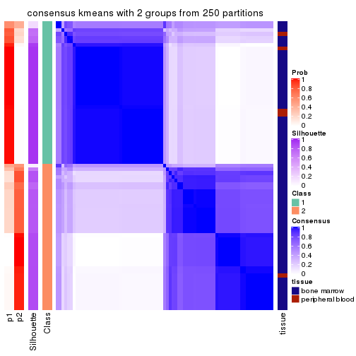</p>

</div>
<div id='tab-CV-kmeans-consensus-heatmap-2'>
<pre><code class="r">consensus_heatmap(res, k = 3)
</code></pre>

<p>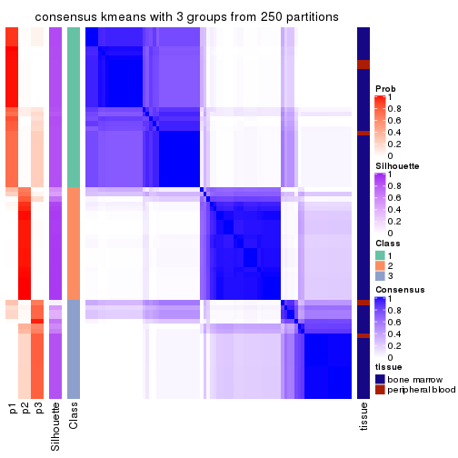</p>

</div>
<div id='tab-CV-kmeans-consensus-heatmap-3'>
<pre><code class="r">consensus_heatmap(res, k = 4)
</code></pre>

<p>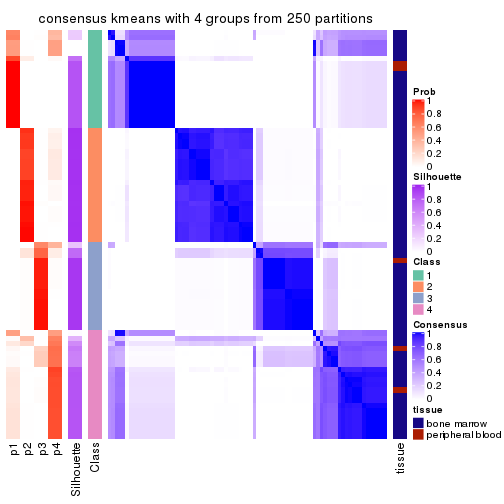</p>

</div>
<div id='tab-CV-kmeans-consensus-heatmap-4'>
<pre><code class="r">consensus_heatmap(res, k = 5)
</code></pre>

<p>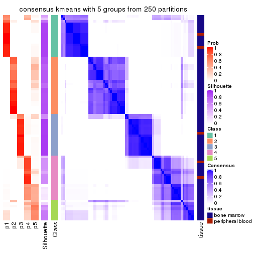</p>

</div>
<div id='tab-CV-kmeans-consensus-heatmap-5'>
<pre><code class="r">consensus_heatmap(res, k = 6)
</code></pre>

<p>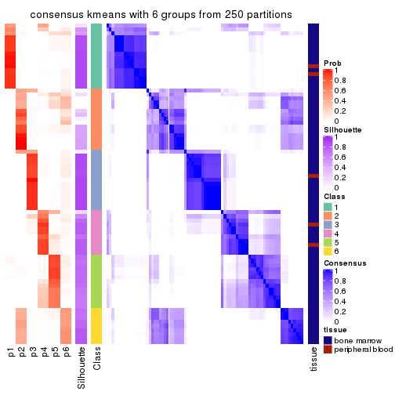</p>

</div>
</div>

Heatmaps for the membership of samples in all partitions to see how consistent they are:


<script>
$( function() {
	$( '#tabs-CV-kmeans-membership-heatmap' ).tabs();
} );
</script>
<div id='tabs-CV-kmeans-membership-heatmap'>
<ul>
<li><a href='#tab-CV-kmeans-membership-heatmap-1'>k = 2</a></li>
<li><a href='#tab-CV-kmeans-membership-heatmap-2'>k = 3</a></li>
<li><a href='#tab-CV-kmeans-membership-heatmap-3'>k = 4</a></li>
<li><a href='#tab-CV-kmeans-membership-heatmap-4'>k = 5</a></li>
<li><a href='#tab-CV-kmeans-membership-heatmap-5'>k = 6</a></li>
</ul>
<div id='tab-CV-kmeans-membership-heatmap-1'>
<pre><code class="r">membership_heatmap(res, k = 2)
</code></pre>

<p>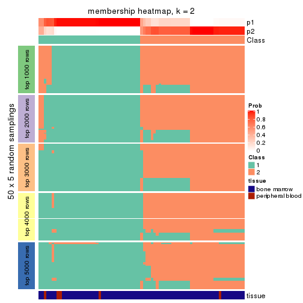</p>

</div>
<div id='tab-CV-kmeans-membership-heatmap-2'>
<pre><code class="r">membership_heatmap(res, k = 3)
</code></pre>

<p>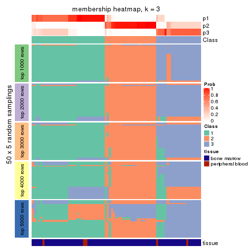</p>

</div>
<div id='tab-CV-kmeans-membership-heatmap-3'>
<pre><code class="r">membership_heatmap(res, k = 4)
</code></pre>

<p>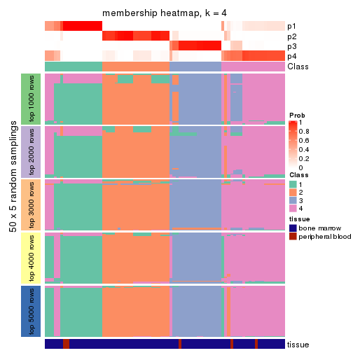</p>

</div>
<div id='tab-CV-kmeans-membership-heatmap-4'>
<pre><code class="r">membership_heatmap(res, k = 5)
</code></pre>

<p>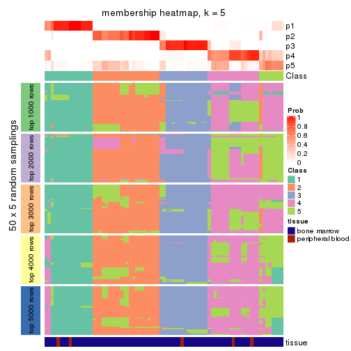</p>

</div>
<div id='tab-CV-kmeans-membership-heatmap-5'>
<pre><code class="r">membership_heatmap(res, k = 6)
</code></pre>

<p>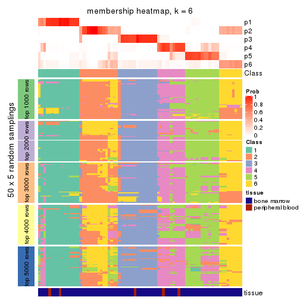</p>

</div>
</div>

As soon as we have had the classes for columns, we can look for signatures
which are significantly different between classes which can be candidate marks
for certain classes. Following are the heatmaps for signatures.


Signature heatmaps where rows are scaled:


<script>
$( function() {
	$( '#tabs-CV-kmeans-get-signatures' ).tabs();
} );
</script>
<div id='tabs-CV-kmeans-get-signatures'>
<ul>
<li><a href='#tab-CV-kmeans-get-signatures-1'>k = 2</a></li>
<li><a href='#tab-CV-kmeans-get-signatures-2'>k = 3</a></li>
<li><a href='#tab-CV-kmeans-get-signatures-3'>k = 4</a></li>
<li><a href='#tab-CV-kmeans-get-signatures-4'>k = 5</a></li>
<li><a href='#tab-CV-kmeans-get-signatures-5'>k = 6</a></li>
</ul>
<div id='tab-CV-kmeans-get-signatures-1'>
<pre><code class="r">get_signatures(res, k = 2)
</code></pre>

<p>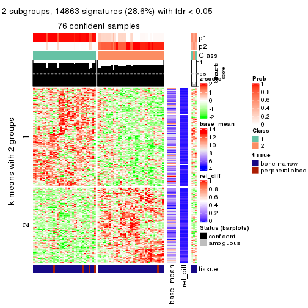</p>

</div>
<div id='tab-CV-kmeans-get-signatures-2'>
<pre><code class="r">get_signatures(res, k = 3)
</code></pre>

<p>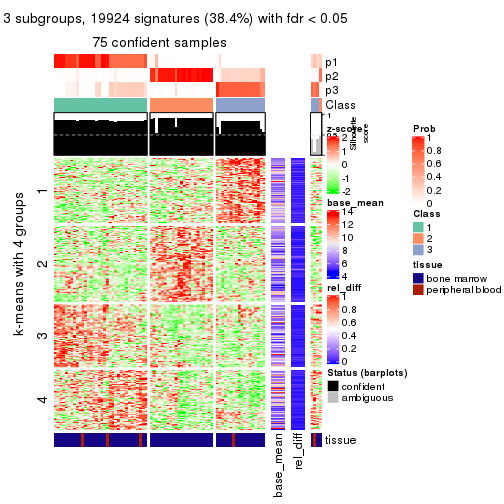</p>

</div>
<div id='tab-CV-kmeans-get-signatures-3'>
<pre><code class="r">get_signatures(res, k = 4)
</code></pre>

<p>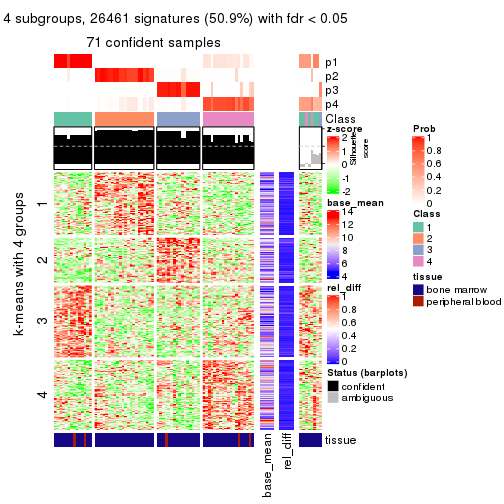</p>

</div>
<div id='tab-CV-kmeans-get-signatures-4'>
<pre><code class="r">get_signatures(res, k = 5)
</code></pre>

<p>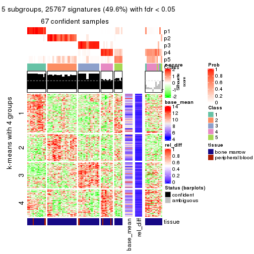</p>

</div>
<div id='tab-CV-kmeans-get-signatures-5'>
<pre><code class="r">get_signatures(res, k = 6)
</code></pre>

<p>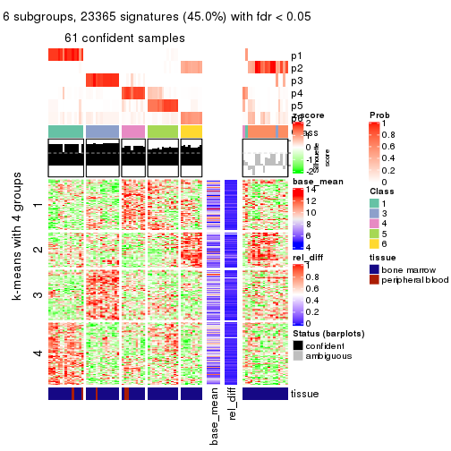</p>

</div>
</div>


Signature heatmaps where rows are not scaled:


<script>
$( function() {
	$( '#tabs-CV-kmeans-get-signatures-no-scale' ).tabs();
} );
</script>
<div id='tabs-CV-kmeans-get-signatures-no-scale'>
<ul>
<li><a href='#tab-CV-kmeans-get-signatures-no-scale-1'>k = 2</a></li>
<li><a href='#tab-CV-kmeans-get-signatures-no-scale-2'>k = 3</a></li>
<li><a href='#tab-CV-kmeans-get-signatures-no-scale-3'>k = 4</a></li>
<li><a href='#tab-CV-kmeans-get-signatures-no-scale-4'>k = 5</a></li>
<li><a href='#tab-CV-kmeans-get-signatures-no-scale-5'>k = 6</a></li>
</ul>
<div id='tab-CV-kmeans-get-signatures-no-scale-1'>
<pre><code class="r">get_signatures(res, k = 2, scale_rows = FALSE)
</code></pre>

<p>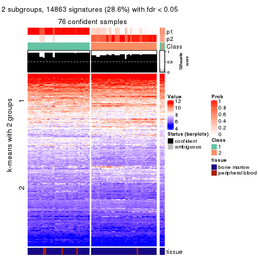</p>

</div>
<div id='tab-CV-kmeans-get-signatures-no-scale-2'>
<pre><code class="r">get_signatures(res, k = 3, scale_rows = FALSE)
</code></pre>

<p>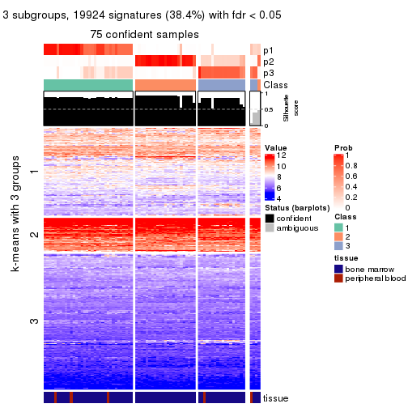</p>

</div>
<div id='tab-CV-kmeans-get-signatures-no-scale-3'>
<pre><code class="r">get_signatures(res, k = 4, scale_rows = FALSE)
</code></pre>

<p>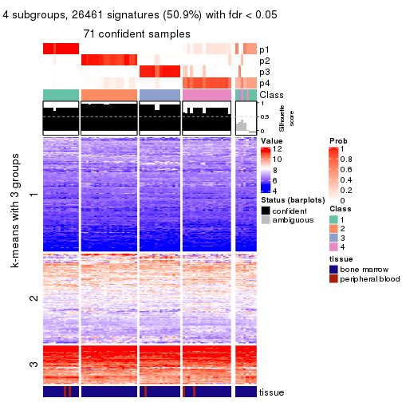</p>

</div>
<div id='tab-CV-kmeans-get-signatures-no-scale-4'>
<pre><code class="r">get_signatures(res, k = 5, scale_rows = FALSE)
</code></pre>

<p>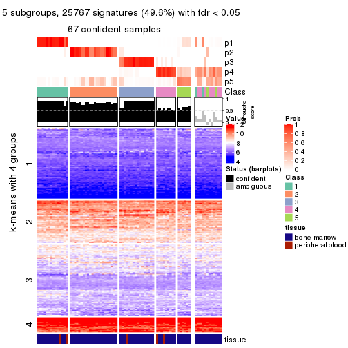</p>

</div>
<div id='tab-CV-kmeans-get-signatures-no-scale-5'>
<pre><code class="r">get_signatures(res, k = 6, scale_rows = FALSE)
</code></pre>

<p>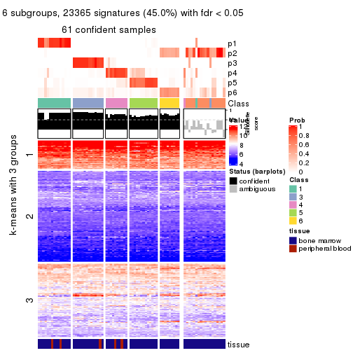</p>

</div>
</div>


Compare the overlap of signatures from different k:

```r
compare_signatures(res)
```

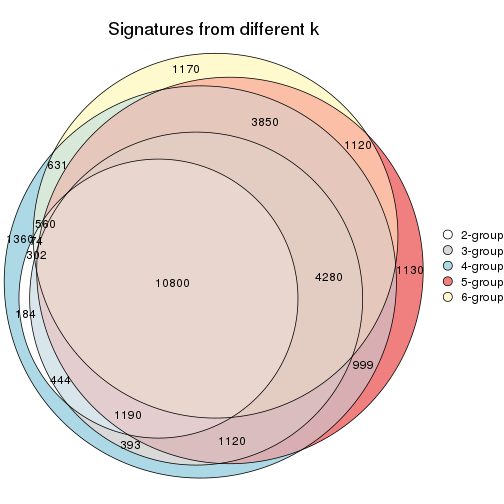

`get_signature()` returns a data frame invisibly. TO get the list of signatures, the function
call should be assigned to a variable explicitly. In following code, if `plot` argument is set
to `FALSE`, no heatmap is plotted while only the differential analysis is performed.

```r
# code only for demonstration
tb = get_signature(res, k = ..., plot = FALSE)
```

An example of the output of `tb` is:

```
#>   which_row         fdr    mean_1    mean_2 scaled_mean_1 scaled_mean_2 km
#> 1        38 0.042760348  8.373488  9.131774    -0.5533452     0.5164555  1
#> 2        40 0.018707592  7.106213  8.469186    -0.6173731     0.5762149  1
#> 3        55 0.019134737 10.221463 11.207825    -0.6159697     0.5749050  1
#> 4        59 0.006059896  5.921854  7.869574    -0.6899429     0.6439467  1
#> 5        60 0.018055526  8.928898 10.211722    -0.6204761     0.5791110  1
#> 6        98 0.009384629 15.714769 14.887706     0.6635654    -0.6193277  2
...
```

The columns in `tb` are:

1. `which_row`: row indices corresponding to the input matrix.
2. `fdr`: FDR for the differential test. 
3. `mean_x`: The mean value in group x.
4. `scaled_mean_x`: The mean value in group x after rows are scaled.
5. `km`: Row groups if k-means clustering is applied to rows.


UMAP plot which shows how samples are separated.


<script>
$( function() {
	$( '#tabs-CV-kmeans-dimension-reduction' ).tabs();
} );
</script>
<div id='tabs-CV-kmeans-dimension-reduction'>
<ul>
<li><a href='#tab-CV-kmeans-dimension-reduction-1'>k = 2</a></li>
<li><a href='#tab-CV-kmeans-dimension-reduction-2'>k = 3</a></li>
<li><a href='#tab-CV-kmeans-dimension-reduction-3'>k = 4</a></li>
<li><a href='#tab-CV-kmeans-dimension-reduction-4'>k = 5</a></li>
<li><a href='#tab-CV-kmeans-dimension-reduction-5'>k = 6</a></li>
</ul>
<div id='tab-CV-kmeans-dimension-reduction-1'>
<pre><code class="r">dimension_reduction(res, k = 2, method = &quot;UMAP&quot;)
</code></pre>

<p>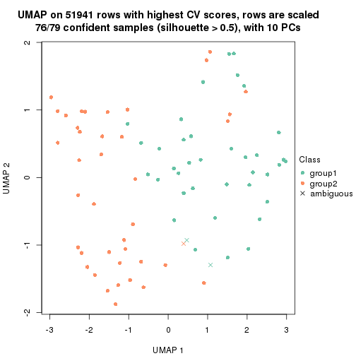</p>

</div>
<div id='tab-CV-kmeans-dimension-reduction-2'>
<pre><code class="r">dimension_reduction(res, k = 3, method = &quot;UMAP&quot;)
</code></pre>

<p>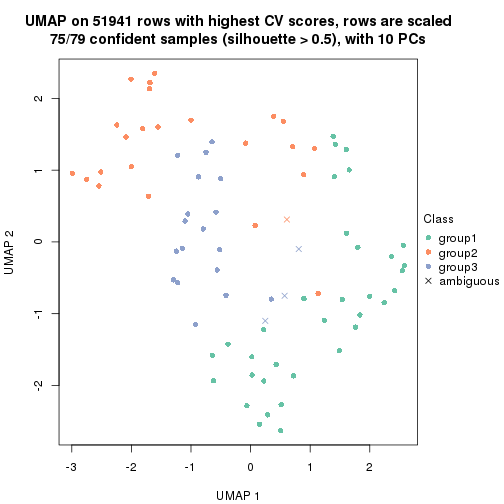</p>

</div>
<div id='tab-CV-kmeans-dimension-reduction-3'>
<pre><code class="r">dimension_reduction(res, k = 4, method = &quot;UMAP&quot;)
</code></pre>

<p>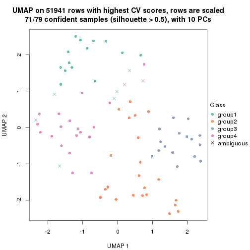</p>

</div>
<div id='tab-CV-kmeans-dimension-reduction-4'>
<pre><code class="r">dimension_reduction(res, k = 5, method = &quot;UMAP&quot;)
</code></pre>

<p>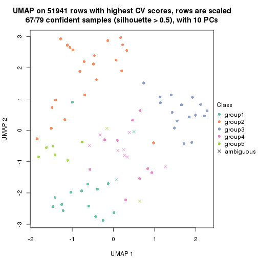</p>

</div>
<div id='tab-CV-kmeans-dimension-reduction-5'>
<pre><code class="r">dimension_reduction(res, k = 6, method = &quot;UMAP&quot;)
</code></pre>

<p>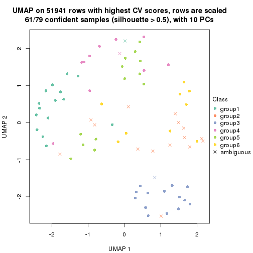</p>

</div>
</div>


Following heatmap shows how subgroups are split when increasing `k`:

```r
collect_classes(res)
```

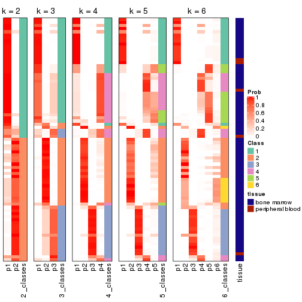


Test correlation between subgroups and known annotations. If the known
annotation is numeric, one-way ANOVA test is applied, and if the known
annotation is discrete, chi-squared contingency table test is applied.

```r
test_to_known_factors(res)
```

```
#>            n tissue(p) k
#> CV:kmeans 76     0.324 2
#> CV:kmeans 75     0.347 3
#> CV:kmeans 71     0.368 4
#> CV:kmeans 67     0.194 5
#> CV:kmeans 61     0.359 6
```


If matrix rows can be associated to genes, consider to use `GO_Enrichment(res,
...)` to perform function enrichment for the signature genes.


 

---------------------------------------------------


### CV:skmeans*


The object with results only for a single top-value method and a single partition method 
can be extracted as:

```r
res = res_list["CV", "skmeans"]
# you can also extract it by
# res = res_list["CV:skmeans"]
```

A summary of `res` and all the functions that can be applied to it:

```r
res
```

```
#> A 'ConsensusPartition' object with k = 2, 3, 4, 5, 6.
#>   On a matrix with 51941 rows and 79 columns.
#>   Top rows (1000, 2000, 3000, 4000, 5000) are extracted by 'CV' method.
#>   Subgroups are detected by 'skmeans' method.
#>   Performed in total 1250 partitions by row resampling.
#>   Best k for subgroups seems to be 5.
#> 
#> Following methods can be applied to this 'ConsensusPartition' object:
#>  [1] "cola_report"             "collect_classes"         "collect_plots"          
#>  [4] "collect_stats"           "colnames"                "compare_signatures"     
#>  [7] "consensus_heatmap"       "dimension_reduction"     "functional_enrichment"  
#> [10] "get_anno_col"            "get_anno"                "get_classes"            
#> [13] "get_consensus"           "get_matrix"              "get_membership"         
#> [16] "get_param"               "get_signatures"          "get_stats"              
#> [19] "is_best_k"               "is_stable_k"             "membership_heatmap"     
#> [22] "ncol"                    "nrow"                    "plot_ecdf"              
#> [25] "rownames"                "select_partition_number" "show"                   
#> [28] "suggest_best_k"          "test_to_known_factors"
```

`collect_plots()` function collects all the plots made from `res` for all `k` (number of partitions)
into one single page to provide an easy and fast comparison between different `k`.

```r
collect_plots(res)
```

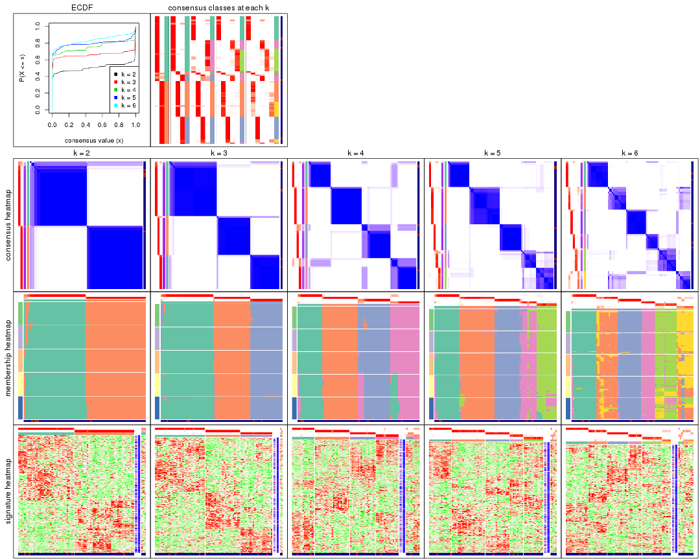

The plots are:

- The first row: a plot of the ECDF (Empirical cumulative distribution
  function) curves of the consensus matrix for each `k` and the heatmap of
  predicted classes for each `k`.
- The second row: heatmaps of the consensus matrix for each `k`.
- The third row: heatmaps of the membership matrix for each `k`.
- The fouth row: heatmaps of the signatures for each `k`.

All the plots in panels can be made by individual functions and they are
plotted later in this section.

`select_partition_number()` produces several plots showing different
statistics for choosing "optimized" `k`. There are following statistics:

- ECDF curves of the consensus matrix for each `k`;
- 1-PAC. [The PAC
  score](https://en.wikipedia.org/wiki/Consensus_clustering#Over-interpretation_potential_of_consensus_clustering)
  measures the proportion of the ambiguous subgrouping.
- Mean silhouette score.
- Concordance. The mean probability of fiting the consensus class ids in all
  partitions.
- Area increased. Denote $A_k$ as the area under the ECDF curve for current
  `k`, the area increased is defined as $A_k - A_{k-1}$.
- Rand index. The percent of pairs of samples that are both in a same cluster
  or both are not in a same cluster in the partition of k and k-1.
- Jaccard index. The ratio of pairs of samples are both in a same cluster in
  the partition of k and k-1 and the pairs of samples are both in a same
  cluster in the partition k or k-1.

The detailed explanations of these statistics can be found in [the cola
vignette](http://bioconductor.org/packages/devel/bioc/vignettes/cola/inst/doc/cola.html#toc_13).

Generally speaking, lower PAC score, higher mean silhouette score or higher
concordance corresponds to better partition. Rand index and Jaccard index
measure how similar the current partition is compared to partition with `k-1`.
If they are too similar, we won't accept `k` is better than `k-1`.

```r
select_partition_number(res)
```

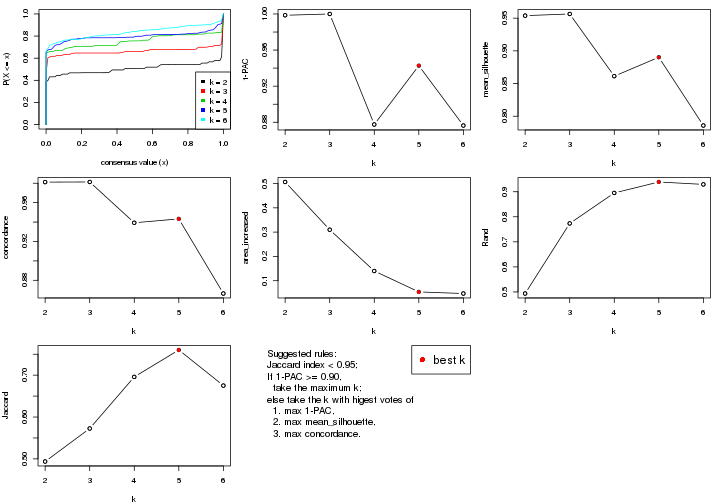

The numeric values for all these statistics can be obtained by `get_stats()`.

```r
get_stats(res)
```

```
#>   k 1-PAC mean_silhouette concordance area_increased  Rand Jaccard
#> 2 2 0.999           0.954       0.981         0.5064 0.494   0.494
#> 3 3 1.000           0.956       0.981         0.3099 0.773   0.573
#> 4 4 0.878           0.861       0.939         0.1399 0.895   0.696
#> 5 5 0.943           0.890       0.943         0.0540 0.939   0.760
#> 6 6 0.876           0.786       0.866         0.0473 0.929   0.675
```

`suggest_best_k()` suggests the best $k$ based on these statistics. The rules are as follows:

- All $k$ with Jaccard index larger than 0.95 are removed because the increase of
  the partition number does not provides enough extra information. If all $k$ are removed,
  the best $k$ is assigned by `NA`.
- For $k$ with 1-PAC larger than 0.9, the maximal $k$ is taken as the "best k". Other $k$ is called "optional k".
- If it does not fit the second rule. The $k$ with the highest vote of highest
  1-PAC, mean silhouette and concordance is taken as the "best k".

```r
suggest_best_k(res)
```

```
#> [1] 5
#> attr(,"optional")
#> [1] 2 3
```

There is also optional best $k$ = 2 3 that is worth to check.

Following shows the table of the partitions (You need to click the **show/hide
code output** link to see it). The membership matrix (columns with name `p*`)
is inferred by
[`clue::cl_consensus()`](https://www.rdocumentation.org/link/cl_consensus?package=clue)
function with the `SE` method. Basically the value in the membership matrix
represents the probability to belong to a certain group. The finall class
label for an item is determined with the group with highest probability it
belongs to.

In `get_classes()` function, the entropy is calculated from the membership
matrix and the silhouette score is calculated from the consensus matrix.


<script>
$( function() {
	$( '#tabs-CV-skmeans-get-classes' ).tabs();
} );
</script>
<div id='tabs-CV-skmeans-get-classes'>
<ul>
<li><a href='#tab-CV-skmeans-get-classes-1'>k = 2</a></li>
<li><a href='#tab-CV-skmeans-get-classes-2'>k = 3</a></li>
<li><a href='#tab-CV-skmeans-get-classes-3'>k = 4</a></li>
<li><a href='#tab-CV-skmeans-get-classes-4'>k = 5</a></li>
<li><a href='#tab-CV-skmeans-get-classes-5'>k = 6</a></li>
</ul>

<div id='tab-CV-skmeans-get-classes-1'>
<p><a id='tab-CV-skmeans-get-classes-1-a' style='color:#0366d6' href='#'>show/hide code output</a></p>
<pre><code class="r">cbind(get_classes(res, k = 2), get_membership(res, k = 2))
</code></pre>

<pre><code>#&gt;           class entropy silhouette    p1    p2
#&gt; GSM316652     2  0.0000      0.996 0.000 1.000
#&gt; GSM316653     1  0.0000      0.965 1.000 0.000
#&gt; GSM316654     1  0.0000      0.965 1.000 0.000
#&gt; GSM316655     1  0.0000      0.965 1.000 0.000
#&gt; GSM316656     1  0.4298      0.884 0.912 0.088
#&gt; GSM316657     1  0.0000      0.965 1.000 0.000
#&gt; GSM316658     2  0.0000      0.996 0.000 1.000
#&gt; GSM316659     2  0.0000      0.996 0.000 1.000
#&gt; GSM316660     1  0.0000      0.965 1.000 0.000
#&gt; GSM316661     1  0.0000      0.965 1.000 0.000
#&gt; GSM316662     2  0.0000      0.996 0.000 1.000
#&gt; GSM316663     2  0.0000      0.996 0.000 1.000
#&gt; GSM316664     1  0.0000      0.965 1.000 0.000
#&gt; GSM316665     2  0.0000      0.996 0.000 1.000
#&gt; GSM316666     2  0.0000      0.996 0.000 1.000
#&gt; GSM316667     2  0.0000      0.996 0.000 1.000
#&gt; GSM316668     2  0.0000      0.996 0.000 1.000
#&gt; GSM316669     1  0.0000      0.965 1.000 0.000
#&gt; GSM316670     2  0.0000      0.996 0.000 1.000
#&gt; GSM316671     2  0.0000      0.996 0.000 1.000
#&gt; GSM316672     1  0.0000      0.965 1.000 0.000
#&gt; GSM316673     1  0.0000      0.965 1.000 0.000
#&gt; GSM316674     2  0.0000      0.996 0.000 1.000
#&gt; GSM316676     2  0.0000      0.996 0.000 1.000
#&gt; GSM316677     1  0.0000      0.965 1.000 0.000
#&gt; GSM316678     2  0.1184      0.980 0.016 0.984
#&gt; GSM316679     1  0.0000      0.965 1.000 0.000
#&gt; GSM316680     1  0.0000      0.965 1.000 0.000
#&gt; GSM316681     2  0.0000      0.996 0.000 1.000
#&gt; GSM316682     1  0.0000      0.965 1.000 0.000
#&gt; GSM316683     1  0.0000      0.965 1.000 0.000
#&gt; GSM316684     2  0.0000      0.996 0.000 1.000
#&gt; GSM316685     2  0.0000      0.996 0.000 1.000
#&gt; GSM316686     1  0.1184      0.953 0.984 0.016
#&gt; GSM316687     1  0.9491      0.445 0.632 0.368
#&gt; GSM316688     2  0.5408      0.850 0.124 0.876
#&gt; GSM316689     1  0.0000      0.965 1.000 0.000
#&gt; GSM316690     2  0.0000      0.996 0.000 1.000
#&gt; GSM316691     2  0.0000      0.996 0.000 1.000
#&gt; GSM316692     2  0.0000      0.996 0.000 1.000
#&gt; GSM316693     1  0.0000      0.965 1.000 0.000
#&gt; GSM316694     2  0.0000      0.996 0.000 1.000
#&gt; GSM316696     1  0.0000      0.965 1.000 0.000
#&gt; GSM316697     2  0.0000      0.996 0.000 1.000
#&gt; GSM316698     2  0.0000      0.996 0.000 1.000
#&gt; GSM316699     2  0.0000      0.996 0.000 1.000
#&gt; GSM316700     1  0.0000      0.965 1.000 0.000
#&gt; GSM316701     1  0.0000      0.965 1.000 0.000
#&gt; GSM316703     2  0.0000      0.996 0.000 1.000
#&gt; GSM316704     2  0.0000      0.996 0.000 1.000
#&gt; GSM316705     1  0.0000      0.965 1.000 0.000
#&gt; GSM316706     1  0.9909      0.216 0.556 0.444
#&gt; GSM316707     2  0.0000      0.996 0.000 1.000
#&gt; GSM316708     2  0.0672      0.988 0.008 0.992
#&gt; GSM316709     2  0.0000      0.996 0.000 1.000
#&gt; GSM316710     1  0.0000      0.965 1.000 0.000
#&gt; GSM316711     2  0.0000      0.996 0.000 1.000
#&gt; GSM316713     1  0.0000      0.965 1.000 0.000
#&gt; GSM316714     1  0.2948      0.922 0.948 0.052
#&gt; GSM316715     1  0.0000      0.965 1.000 0.000
#&gt; GSM316716     2  0.0000      0.996 0.000 1.000
#&gt; GSM316717     1  0.0000      0.965 1.000 0.000
#&gt; GSM316718     2  0.0000      0.996 0.000 1.000
#&gt; GSM316719     1  0.0000      0.965 1.000 0.000
#&gt; GSM316720     1  0.0000      0.965 1.000 0.000
#&gt; GSM316721     2  0.0000      0.996 0.000 1.000
#&gt; GSM316722     1  0.0000      0.965 1.000 0.000
#&gt; GSM316723     2  0.0000      0.996 0.000 1.000
#&gt; GSM316724     2  0.0000      0.996 0.000 1.000
#&gt; GSM316726     2  0.0000      0.996 0.000 1.000
#&gt; GSM316727     1  0.0000      0.965 1.000 0.000
#&gt; GSM316728     1  0.9427      0.463 0.640 0.360
#&gt; GSM316729     1  0.0000      0.965 1.000 0.000
#&gt; GSM316730     2  0.0000      0.996 0.000 1.000
#&gt; GSM316675     2  0.0000      0.996 0.000 1.000
#&gt; GSM316695     1  0.0000      0.965 1.000 0.000
#&gt; GSM316702     1  0.0938      0.956 0.988 0.012
#&gt; GSM316712     1  0.0000      0.965 1.000 0.000
#&gt; GSM316725     1  0.0000      0.965 1.000 0.000
</code></pre>

<script>
$('#tab-CV-skmeans-get-classes-1-a').parent().next().next().hide();
$('#tab-CV-skmeans-get-classes-1-a').click(function(){
  $('#tab-CV-skmeans-get-classes-1-a').parent().next().next().toggle();
  return(false);
});
</script>
</div>

<div id='tab-CV-skmeans-get-classes-2'>
<p><a id='tab-CV-skmeans-get-classes-2-a' style='color:#0366d6' href='#'>show/hide code output</a></p>
<pre><code class="r">cbind(get_classes(res, k = 3), get_membership(res, k = 3))
</code></pre>

<pre><code>#&gt;           class entropy silhouette    p1    p2    p3
#&gt; GSM316652     3  0.0237      0.993 0.000 0.004 0.996
#&gt; GSM316653     1  0.0237      0.975 0.996 0.000 0.004
#&gt; GSM316654     1  0.0237      0.975 0.996 0.000 0.004
#&gt; GSM316655     1  0.0237      0.975 0.996 0.000 0.004
#&gt; GSM316656     1  0.4099      0.830 0.852 0.140 0.008
#&gt; GSM316657     1  0.0000      0.975 1.000 0.000 0.000
#&gt; GSM316658     2  0.0000      0.979 0.000 1.000 0.000
#&gt; GSM316659     2  0.0000      0.979 0.000 1.000 0.000
#&gt; GSM316660     1  0.0000      0.975 1.000 0.000 0.000
#&gt; GSM316661     1  0.3879      0.823 0.848 0.000 0.152
#&gt; GSM316662     3  0.0237      0.993 0.000 0.004 0.996
#&gt; GSM316663     3  0.0000      0.991 0.000 0.000 1.000
#&gt; GSM316664     1  0.0237      0.975 0.996 0.000 0.004
#&gt; GSM316665     2  0.0000      0.979 0.000 1.000 0.000
#&gt; GSM316666     3  0.0237      0.993 0.000 0.004 0.996
#&gt; GSM316667     2  0.0000      0.979 0.000 1.000 0.000
#&gt; GSM316668     3  0.0237      0.993 0.000 0.004 0.996
#&gt; GSM316669     1  0.0237      0.975 0.996 0.000 0.004
#&gt; GSM316670     3  0.1031      0.976 0.000 0.024 0.976
#&gt; GSM316671     3  0.0237      0.993 0.000 0.004 0.996
#&gt; GSM316672     2  0.0592      0.969 0.012 0.988 0.000
#&gt; GSM316673     1  0.0000      0.975 1.000 0.000 0.000
#&gt; GSM316674     3  0.0237      0.993 0.000 0.004 0.996
#&gt; GSM316676     3  0.0237      0.993 0.000 0.004 0.996
#&gt; GSM316677     1  0.0237      0.975 0.996 0.000 0.004
#&gt; GSM316678     2  0.0237      0.976 0.004 0.996 0.000
#&gt; GSM316679     1  0.0000      0.975 1.000 0.000 0.000
#&gt; GSM316680     1  0.0000      0.975 1.000 0.000 0.000
#&gt; GSM316681     3  0.0237      0.993 0.000 0.004 0.996
#&gt; GSM316682     1  0.0237      0.975 0.996 0.000 0.004
#&gt; GSM316683     1  0.0237      0.975 0.996 0.000 0.004
#&gt; GSM316684     2  0.0000      0.979 0.000 1.000 0.000
#&gt; GSM316685     3  0.2796      0.900 0.000 0.092 0.908
#&gt; GSM316686     1  0.6192      0.309 0.580 0.000 0.420
#&gt; GSM316687     3  0.0000      0.991 0.000 0.000 1.000
#&gt; GSM316688     2  0.6468      0.189 0.004 0.552 0.444
#&gt; GSM316689     1  0.0000      0.975 1.000 0.000 0.000
#&gt; GSM316690     3  0.0237      0.993 0.000 0.004 0.996
#&gt; GSM316691     2  0.0000      0.979 0.000 1.000 0.000
#&gt; GSM316692     3  0.0237      0.993 0.000 0.004 0.996
#&gt; GSM316693     1  0.0237      0.975 0.996 0.000 0.004
#&gt; GSM316694     3  0.0237      0.993 0.000 0.004 0.996
#&gt; GSM316696     1  0.0000      0.975 1.000 0.000 0.000
#&gt; GSM316697     3  0.0237      0.993 0.000 0.004 0.996
#&gt; GSM316698     2  0.0000      0.979 0.000 1.000 0.000
#&gt; GSM316699     2  0.0000      0.979 0.000 1.000 0.000
#&gt; GSM316700     1  0.0237      0.975 0.996 0.000 0.004
#&gt; GSM316701     1  0.0237      0.975 0.996 0.000 0.004
#&gt; GSM316703     2  0.0000      0.979 0.000 1.000 0.000
#&gt; GSM316704     2  0.0000      0.979 0.000 1.000 0.000
#&gt; GSM316705     1  0.0000      0.975 1.000 0.000 0.000
#&gt; GSM316706     2  0.0237      0.976 0.000 0.996 0.004
#&gt; GSM316707     2  0.0000      0.979 0.000 1.000 0.000
#&gt; GSM316708     2  0.0237      0.976 0.004 0.996 0.000
#&gt; GSM316709     3  0.0237      0.993 0.000 0.004 0.996
#&gt; GSM316710     1  0.0237      0.975 0.996 0.000 0.004
#&gt; GSM316711     2  0.0000      0.979 0.000 1.000 0.000
#&gt; GSM316713     1  0.0000      0.975 1.000 0.000 0.000
#&gt; GSM316714     3  0.0000      0.991 0.000 0.000 1.000
#&gt; GSM316715     1  0.0000      0.975 1.000 0.000 0.000
#&gt; GSM316716     2  0.0000      0.979 0.000 1.000 0.000
#&gt; GSM316717     1  0.0000      0.975 1.000 0.000 0.000
#&gt; GSM316718     2  0.0237      0.976 0.004 0.996 0.000
#&gt; GSM316719     1  0.0000      0.975 1.000 0.000 0.000
#&gt; GSM316720     1  0.0000      0.975 1.000 0.000 0.000
#&gt; GSM316721     2  0.0000      0.979 0.000 1.000 0.000
#&gt; GSM316722     1  0.0000      0.975 1.000 0.000 0.000
#&gt; GSM316723     2  0.0000      0.979 0.000 1.000 0.000
#&gt; GSM316724     2  0.0000      0.979 0.000 1.000 0.000
#&gt; GSM316726     2  0.0000      0.979 0.000 1.000 0.000
#&gt; GSM316727     1  0.0000      0.975 1.000 0.000 0.000
#&gt; GSM316728     3  0.0000      0.991 0.000 0.000 1.000
#&gt; GSM316729     1  0.1964      0.926 0.944 0.056 0.000
#&gt; GSM316730     2  0.0000      0.979 0.000 1.000 0.000
#&gt; GSM316675     3  0.0237      0.993 0.000 0.004 0.996
#&gt; GSM316695     1  0.0000      0.975 1.000 0.000 0.000
#&gt; GSM316702     3  0.0000      0.991 0.000 0.000 1.000
#&gt; GSM316712     1  0.0000      0.975 1.000 0.000 0.000
#&gt; GSM316725     1  0.0237      0.975 0.996 0.000 0.004
</code></pre>

<script>
$('#tab-CV-skmeans-get-classes-2-a').parent().next().next().hide();
$('#tab-CV-skmeans-get-classes-2-a').click(function(){
  $('#tab-CV-skmeans-get-classes-2-a').parent().next().next().toggle();
  return(false);
});
</script>
</div>

<div id='tab-CV-skmeans-get-classes-3'>
<p><a id='tab-CV-skmeans-get-classes-3-a' style='color:#0366d6' href='#'>show/hide code output</a></p>
<pre><code class="r">cbind(get_classes(res, k = 4), get_membership(res, k = 4))
</code></pre>

<pre><code>#&gt;           class entropy silhouette    p1    p2    p3    p4
#&gt; GSM316652     3  0.0000      0.903 0.000 0.000 1.000 0.000
#&gt; GSM316653     4  0.0000      0.865 0.000 0.000 0.000 1.000
#&gt; GSM316654     4  0.0000      0.865 0.000 0.000 0.000 1.000
#&gt; GSM316655     4  0.0188      0.863 0.004 0.000 0.000 0.996
#&gt; GSM316656     4  0.0000      0.865 0.000 0.000 0.000 1.000
#&gt; GSM316657     1  0.0000      0.954 1.000 0.000 0.000 0.000
#&gt; GSM316658     2  0.0000      0.988 0.000 1.000 0.000 0.000
#&gt; GSM316659     2  0.0000      0.988 0.000 1.000 0.000 0.000
#&gt; GSM316660     1  0.0000      0.954 1.000 0.000 0.000 0.000
#&gt; GSM316661     4  0.0000      0.865 0.000 0.000 0.000 1.000
#&gt; GSM316662     3  0.0000      0.903 0.000 0.000 1.000 0.000
#&gt; GSM316663     3  0.4898      0.438 0.000 0.000 0.584 0.416
#&gt; GSM316664     1  0.4866      0.277 0.596 0.000 0.000 0.404
#&gt; GSM316665     2  0.0000      0.988 0.000 1.000 0.000 0.000
#&gt; GSM316666     3  0.0000      0.903 0.000 0.000 1.000 0.000
#&gt; GSM316667     2  0.0000      0.988 0.000 1.000 0.000 0.000
#&gt; GSM316668     3  0.0000      0.903 0.000 0.000 1.000 0.000
#&gt; GSM316669     4  0.0000      0.865 0.000 0.000 0.000 1.000
#&gt; GSM316670     3  0.1389      0.865 0.000 0.048 0.952 0.000
#&gt; GSM316671     3  0.0000      0.903 0.000 0.000 1.000 0.000
#&gt; GSM316672     1  0.0000      0.954 1.000 0.000 0.000 0.000
#&gt; GSM316673     1  0.0000      0.954 1.000 0.000 0.000 0.000
#&gt; GSM316674     3  0.0000      0.903 0.000 0.000 1.000 0.000
#&gt; GSM316676     3  0.0000      0.903 0.000 0.000 1.000 0.000
#&gt; GSM316677     4  0.2469      0.793 0.108 0.000 0.000 0.892
#&gt; GSM316678     2  0.0000      0.988 0.000 1.000 0.000 0.000
#&gt; GSM316679     4  0.4898      0.420 0.416 0.000 0.000 0.584
#&gt; GSM316680     4  0.4888      0.428 0.412 0.000 0.000 0.588
#&gt; GSM316681     3  0.0000      0.903 0.000 0.000 1.000 0.000
#&gt; GSM316682     4  0.0000      0.865 0.000 0.000 0.000 1.000
#&gt; GSM316683     4  0.0000      0.865 0.000 0.000 0.000 1.000
#&gt; GSM316684     2  0.0000      0.988 0.000 1.000 0.000 0.000
#&gt; GSM316685     3  0.2281      0.821 0.000 0.096 0.904 0.000
#&gt; GSM316686     1  0.3074      0.769 0.848 0.000 0.000 0.152
#&gt; GSM316687     3  0.4843      0.473 0.000 0.000 0.604 0.396
#&gt; GSM316688     2  0.6015      0.671 0.148 0.716 0.124 0.012
#&gt; GSM316689     1  0.0000      0.954 1.000 0.000 0.000 0.000
#&gt; GSM316690     3  0.0000      0.903 0.000 0.000 1.000 0.000
#&gt; GSM316691     2  0.0000      0.988 0.000 1.000 0.000 0.000
#&gt; GSM316692     3  0.0000      0.903 0.000 0.000 1.000 0.000
#&gt; GSM316693     4  0.0000      0.865 0.000 0.000 0.000 1.000
#&gt; GSM316694     3  0.0000      0.903 0.000 0.000 1.000 0.000
#&gt; GSM316696     1  0.0000      0.954 1.000 0.000 0.000 0.000
#&gt; GSM316697     3  0.0000      0.903 0.000 0.000 1.000 0.000
#&gt; GSM316698     2  0.0000      0.988 0.000 1.000 0.000 0.000
#&gt; GSM316699     2  0.0000      0.988 0.000 1.000 0.000 0.000
#&gt; GSM316700     4  0.0000      0.865 0.000 0.000 0.000 1.000
#&gt; GSM316701     4  0.0000      0.865 0.000 0.000 0.000 1.000
#&gt; GSM316703     2  0.0000      0.988 0.000 1.000 0.000 0.000
#&gt; GSM316704     2  0.0000      0.988 0.000 1.000 0.000 0.000
#&gt; GSM316705     1  0.0000      0.954 1.000 0.000 0.000 0.000
#&gt; GSM316706     2  0.0000      0.988 0.000 1.000 0.000 0.000
#&gt; GSM316707     2  0.0000      0.988 0.000 1.000 0.000 0.000
#&gt; GSM316708     2  0.0000      0.988 0.000 1.000 0.000 0.000
#&gt; GSM316709     3  0.0000      0.903 0.000 0.000 1.000 0.000
#&gt; GSM316710     4  0.0000      0.865 0.000 0.000 0.000 1.000
#&gt; GSM316711     2  0.0000      0.988 0.000 1.000 0.000 0.000
#&gt; GSM316713     1  0.0000      0.954 1.000 0.000 0.000 0.000
#&gt; GSM316714     3  0.0000      0.903 0.000 0.000 1.000 0.000
#&gt; GSM316715     1  0.0000      0.954 1.000 0.000 0.000 0.000
#&gt; GSM316716     2  0.0000      0.988 0.000 1.000 0.000 0.000
#&gt; GSM316717     4  0.4888      0.428 0.412 0.000 0.000 0.588
#&gt; GSM316718     2  0.0000      0.988 0.000 1.000 0.000 0.000
#&gt; GSM316719     1  0.0000      0.954 1.000 0.000 0.000 0.000
#&gt; GSM316720     1  0.0000      0.954 1.000 0.000 0.000 0.000
#&gt; GSM316721     2  0.0000      0.988 0.000 1.000 0.000 0.000
#&gt; GSM316722     4  0.4877      0.436 0.408 0.000 0.000 0.592
#&gt; GSM316723     2  0.0000      0.988 0.000 1.000 0.000 0.000
#&gt; GSM316724     2  0.0000      0.988 0.000 1.000 0.000 0.000
#&gt; GSM316726     2  0.0000      0.988 0.000 1.000 0.000 0.000
#&gt; GSM316727     1  0.0000      0.954 1.000 0.000 0.000 0.000
#&gt; GSM316728     3  0.4888      0.446 0.000 0.000 0.588 0.412
#&gt; GSM316729     4  0.6351      0.545 0.268 0.104 0.000 0.628
#&gt; GSM316730     2  0.0000      0.988 0.000 1.000 0.000 0.000
#&gt; GSM316675     3  0.0000      0.903 0.000 0.000 1.000 0.000
#&gt; GSM316695     1  0.0000      0.954 1.000 0.000 0.000 0.000
#&gt; GSM316702     3  0.4972      0.348 0.000 0.000 0.544 0.456
#&gt; GSM316712     1  0.0000      0.954 1.000 0.000 0.000 0.000
#&gt; GSM316725     4  0.0000      0.865 0.000 0.000 0.000 1.000
</code></pre>

<script>
$('#tab-CV-skmeans-get-classes-3-a').parent().next().next().hide();
$('#tab-CV-skmeans-get-classes-3-a').click(function(){
  $('#tab-CV-skmeans-get-classes-3-a').parent().next().next().toggle();
  return(false);
});
</script>
</div>

<div id='tab-CV-skmeans-get-classes-4'>
<p><a id='tab-CV-skmeans-get-classes-4-a' style='color:#0366d6' href='#'>show/hide code output</a></p>
<pre><code class="r">cbind(get_classes(res, k = 5), get_membership(res, k = 5))
</code></pre>

<pre><code>#&gt;           class entropy silhouette    p1    p2    p3    p4    p5
#&gt; GSM316652     3  0.0000     0.9918 0.000 0.000 1.000 0.000 0.000
#&gt; GSM316653     5  0.2020     0.8975 0.000 0.000 0.000 0.100 0.900
#&gt; GSM316654     4  0.1851     0.8036 0.000 0.000 0.000 0.912 0.088
#&gt; GSM316655     5  0.1908     0.8993 0.000 0.000 0.000 0.092 0.908
#&gt; GSM316656     5  0.0162     0.8833 0.000 0.000 0.000 0.004 0.996
#&gt; GSM316657     1  0.0000     0.9619 1.000 0.000 0.000 0.000 0.000
#&gt; GSM316658     2  0.0771     0.9574 0.000 0.976 0.000 0.020 0.004
#&gt; GSM316659     2  0.0162     0.9575 0.000 0.996 0.000 0.004 0.000
#&gt; GSM316660     1  0.0000     0.9619 1.000 0.000 0.000 0.000 0.000
#&gt; GSM316661     4  0.4307    -0.1184 0.000 0.000 0.000 0.500 0.500
#&gt; GSM316662     3  0.0000     0.9918 0.000 0.000 1.000 0.000 0.000
#&gt; GSM316663     4  0.3430     0.6994 0.000 0.000 0.220 0.776 0.004
#&gt; GSM316664     1  0.4273     0.1931 0.552 0.000 0.000 0.448 0.000
#&gt; GSM316665     2  0.1124     0.9557 0.000 0.960 0.000 0.036 0.004
#&gt; GSM316666     3  0.0000     0.9918 0.000 0.000 1.000 0.000 0.000
#&gt; GSM316667     2  0.1205     0.9548 0.000 0.956 0.000 0.040 0.004
#&gt; GSM316668     3  0.0000     0.9918 0.000 0.000 1.000 0.000 0.000
#&gt; GSM316669     5  0.2020     0.8975 0.000 0.000 0.000 0.100 0.900
#&gt; GSM316670     3  0.1492     0.9414 0.000 0.008 0.948 0.040 0.004
#&gt; GSM316671     3  0.0000     0.9918 0.000 0.000 1.000 0.000 0.000
#&gt; GSM316672     1  0.0162     0.9588 0.996 0.000 0.000 0.000 0.004
#&gt; GSM316673     1  0.0000     0.9619 1.000 0.000 0.000 0.000 0.000
#&gt; GSM316674     3  0.0000     0.9918 0.000 0.000 1.000 0.000 0.000
#&gt; GSM316676     3  0.0000     0.9918 0.000 0.000 1.000 0.000 0.000
#&gt; GSM316677     4  0.1648     0.8217 0.020 0.000 0.000 0.940 0.040
#&gt; GSM316678     2  0.0000     0.9572 0.000 1.000 0.000 0.000 0.000
#&gt; GSM316679     5  0.2389     0.8210 0.116 0.000 0.000 0.004 0.880
#&gt; GSM316680     5  0.1732     0.8531 0.080 0.000 0.000 0.000 0.920
#&gt; GSM316681     3  0.0000     0.9918 0.000 0.000 1.000 0.000 0.000
#&gt; GSM316682     5  0.2424     0.8805 0.000 0.000 0.000 0.132 0.868
#&gt; GSM316683     5  0.2424     0.8805 0.000 0.000 0.000 0.132 0.868
#&gt; GSM316684     2  0.0000     0.9572 0.000 1.000 0.000 0.000 0.000
#&gt; GSM316685     3  0.1492     0.9414 0.000 0.008 0.948 0.040 0.004
#&gt; GSM316686     1  0.1851     0.8742 0.912 0.000 0.000 0.088 0.000
#&gt; GSM316687     4  0.1197     0.8264 0.000 0.000 0.048 0.952 0.000
#&gt; GSM316688     2  0.7788     0.4869 0.044 0.560 0.092 0.164 0.140
#&gt; GSM316689     1  0.0000     0.9619 1.000 0.000 0.000 0.000 0.000
#&gt; GSM316690     3  0.0000     0.9918 0.000 0.000 1.000 0.000 0.000
#&gt; GSM316691     2  0.1205     0.9548 0.000 0.956 0.000 0.040 0.004
#&gt; GSM316692     3  0.0000     0.9918 0.000 0.000 1.000 0.000 0.000
#&gt; GSM316693     4  0.1043     0.8301 0.000 0.000 0.000 0.960 0.040
#&gt; GSM316694     3  0.0000     0.9918 0.000 0.000 1.000 0.000 0.000
#&gt; GSM316696     1  0.0000     0.9619 1.000 0.000 0.000 0.000 0.000
#&gt; GSM316697     3  0.0000     0.9918 0.000 0.000 1.000 0.000 0.000
#&gt; GSM316698     2  0.0000     0.9572 0.000 1.000 0.000 0.000 0.000
#&gt; GSM316699     2  0.1205     0.9548 0.000 0.956 0.000 0.040 0.004
#&gt; GSM316700     5  0.2424     0.8805 0.000 0.000 0.000 0.132 0.868
#&gt; GSM316701     5  0.1965     0.8988 0.000 0.000 0.000 0.096 0.904
#&gt; GSM316703     2  0.0000     0.9572 0.000 1.000 0.000 0.000 0.000
#&gt; GSM316704     2  0.0000     0.9572 0.000 1.000 0.000 0.000 0.000
#&gt; GSM316705     1  0.0000     0.9619 1.000 0.000 0.000 0.000 0.000
#&gt; GSM316706     2  0.0000     0.9572 0.000 1.000 0.000 0.000 0.000
#&gt; GSM316707     2  0.1041     0.9564 0.000 0.964 0.000 0.032 0.004
#&gt; GSM316708     2  0.1965     0.8940 0.000 0.904 0.000 0.000 0.096
#&gt; GSM316709     3  0.0000     0.9918 0.000 0.000 1.000 0.000 0.000
#&gt; GSM316710     4  0.1043     0.8301 0.000 0.000 0.000 0.960 0.040
#&gt; GSM316711     2  0.1041     0.9564 0.000 0.964 0.000 0.032 0.004
#&gt; GSM316713     1  0.0000     0.9619 1.000 0.000 0.000 0.000 0.000
#&gt; GSM316714     4  0.4307     0.0707 0.000 0.000 0.496 0.504 0.000
#&gt; GSM316715     1  0.0000     0.9619 1.000 0.000 0.000 0.000 0.000
#&gt; GSM316716     2  0.1205     0.9548 0.000 0.956 0.000 0.040 0.004
#&gt; GSM316717     5  0.1197     0.8714 0.048 0.000 0.000 0.000 0.952
#&gt; GSM316718     2  0.1908     0.8974 0.000 0.908 0.000 0.000 0.092
#&gt; GSM316719     1  0.0000     0.9619 1.000 0.000 0.000 0.000 0.000
#&gt; GSM316720     1  0.0000     0.9619 1.000 0.000 0.000 0.000 0.000
#&gt; GSM316721     2  0.1205     0.9548 0.000 0.956 0.000 0.040 0.004
#&gt; GSM316722     5  0.2654     0.8373 0.084 0.000 0.000 0.032 0.884
#&gt; GSM316723     2  0.0000     0.9572 0.000 1.000 0.000 0.000 0.000
#&gt; GSM316724     2  0.0963     0.9397 0.000 0.964 0.000 0.000 0.036
#&gt; GSM316726     2  0.1205     0.9548 0.000 0.956 0.000 0.040 0.004
#&gt; GSM316727     1  0.0000     0.9619 1.000 0.000 0.000 0.000 0.000
#&gt; GSM316728     4  0.1124     0.8309 0.000 0.000 0.036 0.960 0.004
#&gt; GSM316729     5  0.0162     0.8818 0.000 0.004 0.000 0.000 0.996
#&gt; GSM316730     2  0.0000     0.9572 0.000 1.000 0.000 0.000 0.000
#&gt; GSM316675     3  0.0000     0.9918 0.000 0.000 1.000 0.000 0.000
#&gt; GSM316695     1  0.0000     0.9619 1.000 0.000 0.000 0.000 0.000
#&gt; GSM316702     4  0.1124     0.8309 0.000 0.000 0.036 0.960 0.004
#&gt; GSM316712     1  0.0000     0.9619 1.000 0.000 0.000 0.000 0.000
#&gt; GSM316725     4  0.1043     0.8301 0.000 0.000 0.000 0.960 0.040
</code></pre>

<script>
$('#tab-CV-skmeans-get-classes-4-a').parent().next().next().hide();
$('#tab-CV-skmeans-get-classes-4-a').click(function(){
  $('#tab-CV-skmeans-get-classes-4-a').parent().next().next().toggle();
  return(false);
});
</script>
</div>

<div id='tab-CV-skmeans-get-classes-5'>
<p><a id='tab-CV-skmeans-get-classes-5-a' style='color:#0366d6' href='#'>show/hide code output</a></p>
<pre><code class="r">cbind(get_classes(res, k = 6), get_membership(res, k = 6))
</code></pre>

<pre><code>#&gt;           class entropy silhouette    p1    p2    p3    p4    p5    p6
#&gt; GSM316652     3  0.0146     0.9701 0.000 0.000 0.996 0.000 0.000 0.004
#&gt; GSM316653     5  0.1812     0.8442 0.000 0.000 0.000 0.080 0.912 0.008
#&gt; GSM316654     4  0.1895     0.8865 0.000 0.000 0.000 0.912 0.072 0.016
#&gt; GSM316655     5  0.1802     0.8465 0.000 0.000 0.000 0.072 0.916 0.012
#&gt; GSM316656     5  0.1610     0.8324 0.000 0.000 0.000 0.000 0.916 0.084
#&gt; GSM316657     1  0.0260     0.9562 0.992 0.000 0.000 0.000 0.000 0.008
#&gt; GSM316658     2  0.2969     0.5012 0.000 0.776 0.000 0.000 0.000 0.224
#&gt; GSM316659     2  0.1444     0.7470 0.000 0.928 0.000 0.000 0.000 0.072
#&gt; GSM316660     1  0.0000     0.9570 1.000 0.000 0.000 0.000 0.000 0.000
#&gt; GSM316661     5  0.3975     0.2101 0.000 0.000 0.000 0.452 0.544 0.004
#&gt; GSM316662     3  0.0146     0.9701 0.000 0.000 0.996 0.000 0.000 0.004
#&gt; GSM316663     4  0.3720     0.7103 0.000 0.000 0.208 0.760 0.020 0.012
#&gt; GSM316664     1  0.3866     0.0458 0.516 0.000 0.000 0.484 0.000 0.000
#&gt; GSM316665     6  0.3854     0.4297 0.000 0.464 0.000 0.000 0.000 0.536
#&gt; GSM316666     3  0.0000     0.9705 0.000 0.000 1.000 0.000 0.000 0.000
#&gt; GSM316667     6  0.3023     0.6951 0.000 0.232 0.000 0.000 0.000 0.768
#&gt; GSM316668     3  0.0146     0.9701 0.000 0.000 0.996 0.000 0.000 0.004
#&gt; GSM316669     5  0.1812     0.8442 0.000 0.000 0.000 0.080 0.912 0.008
#&gt; GSM316670     6  0.3937     0.2707 0.000 0.004 0.424 0.000 0.000 0.572
#&gt; GSM316671     3  0.0146     0.9701 0.000 0.000 0.996 0.000 0.000 0.004
#&gt; GSM316672     1  0.1364     0.9311 0.952 0.012 0.000 0.000 0.016 0.020
#&gt; GSM316673     1  0.0000     0.9570 1.000 0.000 0.000 0.000 0.000 0.000
#&gt; GSM316674     3  0.0146     0.9701 0.000 0.000 0.996 0.000 0.000 0.004
#&gt; GSM316676     3  0.0000     0.9705 0.000 0.000 1.000 0.000 0.000 0.000
#&gt; GSM316677     4  0.0806     0.9379 0.008 0.000 0.000 0.972 0.000 0.020
#&gt; GSM316678     2  0.1204     0.7827 0.000 0.944 0.000 0.000 0.000 0.056
#&gt; GSM316679     5  0.3896     0.7673 0.056 0.000 0.000 0.000 0.748 0.196
#&gt; GSM316680     5  0.3168     0.7941 0.016 0.000 0.000 0.000 0.792 0.192
#&gt; GSM316681     3  0.0000     0.9705 0.000 0.000 1.000 0.000 0.000 0.000
#&gt; GSM316682     5  0.2070     0.8355 0.000 0.000 0.000 0.100 0.892 0.008
#&gt; GSM316683     5  0.2020     0.8376 0.000 0.000 0.000 0.096 0.896 0.008
#&gt; GSM316684     2  0.0363     0.7899 0.000 0.988 0.000 0.000 0.000 0.012
#&gt; GSM316685     6  0.3944     0.2642 0.000 0.004 0.428 0.000 0.000 0.568
#&gt; GSM316686     1  0.1196     0.9252 0.952 0.000 0.000 0.040 0.000 0.008
#&gt; GSM316687     4  0.0363     0.9427 0.000 0.000 0.012 0.988 0.000 0.000
#&gt; GSM316688     6  0.5717     0.2549 0.016 0.240 0.008 0.048 0.048 0.640
#&gt; GSM316689     1  0.0260     0.9562 0.992 0.000 0.000 0.000 0.000 0.008
#&gt; GSM316690     3  0.0260     0.9657 0.000 0.000 0.992 0.000 0.000 0.008
#&gt; GSM316691     6  0.3023     0.6951 0.000 0.232 0.000 0.000 0.000 0.768
#&gt; GSM316692     3  0.0000     0.9705 0.000 0.000 1.000 0.000 0.000 0.000
#&gt; GSM316693     4  0.0260     0.9475 0.000 0.000 0.000 0.992 0.000 0.008
#&gt; GSM316694     3  0.0146     0.9701 0.000 0.000 0.996 0.000 0.000 0.004
#&gt; GSM316696     1  0.0260     0.9562 0.992 0.000 0.000 0.000 0.000 0.008
#&gt; GSM316697     3  0.0000     0.9705 0.000 0.000 1.000 0.000 0.000 0.000
#&gt; GSM316698     2  0.1327     0.7842 0.000 0.936 0.000 0.000 0.000 0.064
#&gt; GSM316699     6  0.3409     0.6611 0.000 0.300 0.000 0.000 0.000 0.700
#&gt; GSM316700     5  0.1908     0.8369 0.000 0.000 0.000 0.096 0.900 0.004
#&gt; GSM316701     5  0.1285     0.8467 0.000 0.000 0.000 0.052 0.944 0.004
#&gt; GSM316703     2  0.0000     0.7924 0.000 1.000 0.000 0.000 0.000 0.000
#&gt; GSM316704     2  0.0363     0.7911 0.000 0.988 0.000 0.000 0.000 0.012
#&gt; GSM316705     1  0.0260     0.9562 0.992 0.000 0.000 0.000 0.000 0.008
#&gt; GSM316706     2  0.0146     0.7921 0.000 0.996 0.000 0.000 0.000 0.004
#&gt; GSM316707     6  0.3862     0.3946 0.000 0.476 0.000 0.000 0.000 0.524
#&gt; GSM316708     2  0.4795     0.4988 0.000 0.604 0.000 0.000 0.072 0.324
#&gt; GSM316709     3  0.0000     0.9705 0.000 0.000 1.000 0.000 0.000 0.000
#&gt; GSM316710     4  0.0000     0.9479 0.000 0.000 0.000 1.000 0.000 0.000
#&gt; GSM316711     2  0.3866    -0.4080 0.000 0.516 0.000 0.000 0.000 0.484
#&gt; GSM316713     1  0.0000     0.9570 1.000 0.000 0.000 0.000 0.000 0.000
#&gt; GSM316714     3  0.3684     0.4550 0.000 0.000 0.664 0.332 0.000 0.004
#&gt; GSM316715     1  0.0260     0.9556 0.992 0.000 0.000 0.000 0.000 0.008
#&gt; GSM316716     6  0.3175     0.6953 0.000 0.256 0.000 0.000 0.000 0.744
#&gt; GSM316717     5  0.2572     0.8196 0.012 0.000 0.000 0.000 0.852 0.136
#&gt; GSM316718     2  0.4497     0.5288 0.000 0.624 0.000 0.000 0.048 0.328
#&gt; GSM316719     1  0.0260     0.9556 0.992 0.000 0.000 0.000 0.000 0.008
#&gt; GSM316720     1  0.0260     0.9556 0.992 0.000 0.000 0.000 0.000 0.008
#&gt; GSM316721     6  0.3198     0.6948 0.000 0.260 0.000 0.000 0.000 0.740
#&gt; GSM316722     5  0.4166     0.7686 0.020 0.000 0.000 0.040 0.744 0.196
#&gt; GSM316723     2  0.1267     0.7698 0.000 0.940 0.000 0.000 0.000 0.060
#&gt; GSM316724     2  0.3578     0.6874 0.000 0.784 0.000 0.000 0.052 0.164
#&gt; GSM316726     6  0.3126     0.6969 0.000 0.248 0.000 0.000 0.000 0.752
#&gt; GSM316727     1  0.0260     0.9556 0.992 0.000 0.000 0.000 0.000 0.008
#&gt; GSM316728     4  0.0146     0.9474 0.000 0.000 0.000 0.996 0.000 0.004
#&gt; GSM316729     5  0.2454     0.8135 0.000 0.000 0.000 0.000 0.840 0.160
#&gt; GSM316730     2  0.1204     0.7842 0.000 0.944 0.000 0.000 0.000 0.056
#&gt; GSM316675     3  0.0000     0.9705 0.000 0.000 1.000 0.000 0.000 0.000
#&gt; GSM316695     1  0.0146     0.9568 0.996 0.000 0.000 0.000 0.000 0.004
#&gt; GSM316702     4  0.0000     0.9479 0.000 0.000 0.000 1.000 0.000 0.000
#&gt; GSM316712     1  0.0000     0.9570 1.000 0.000 0.000 0.000 0.000 0.000
#&gt; GSM316725     4  0.0260     0.9475 0.000 0.000 0.000 0.992 0.000 0.008
</code></pre>

<script>
$('#tab-CV-skmeans-get-classes-5-a').parent().next().next().hide();
$('#tab-CV-skmeans-get-classes-5-a').click(function(){
  $('#tab-CV-skmeans-get-classes-5-a').parent().next().next().toggle();
  return(false);
});
</script>
</div>
</div>

Heatmaps for the consensus matrix. It visualizes the probability of two
samples to be in a same group.


<script>
$( function() {
	$( '#tabs-CV-skmeans-consensus-heatmap' ).tabs();
} );
</script>
<div id='tabs-CV-skmeans-consensus-heatmap'>
<ul>
<li><a href='#tab-CV-skmeans-consensus-heatmap-1'>k = 2</a></li>
<li><a href='#tab-CV-skmeans-consensus-heatmap-2'>k = 3</a></li>
<li><a href='#tab-CV-skmeans-consensus-heatmap-3'>k = 4</a></li>
<li><a href='#tab-CV-skmeans-consensus-heatmap-4'>k = 5</a></li>
<li><a href='#tab-CV-skmeans-consensus-heatmap-5'>k = 6</a></li>
</ul>
<div id='tab-CV-skmeans-consensus-heatmap-1'>
<pre><code class="r">consensus_heatmap(res, k = 2)
</code></pre>

<p>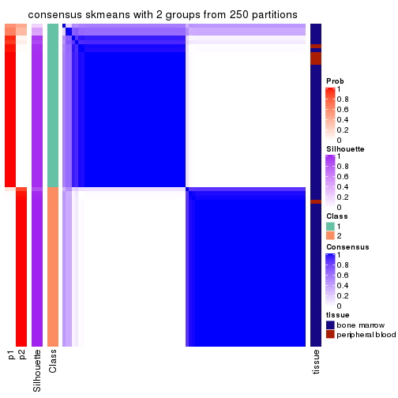</p>

</div>
<div id='tab-CV-skmeans-consensus-heatmap-2'>
<pre><code class="r">consensus_heatmap(res, k = 3)
</code></pre>

<p>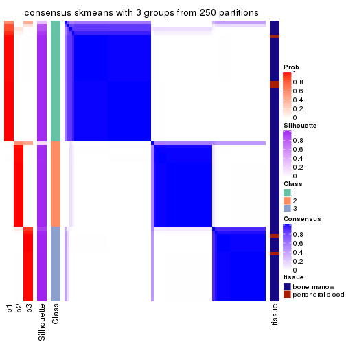</p>

</div>
<div id='tab-CV-skmeans-consensus-heatmap-3'>
<pre><code class="r">consensus_heatmap(res, k = 4)
</code></pre>

<p>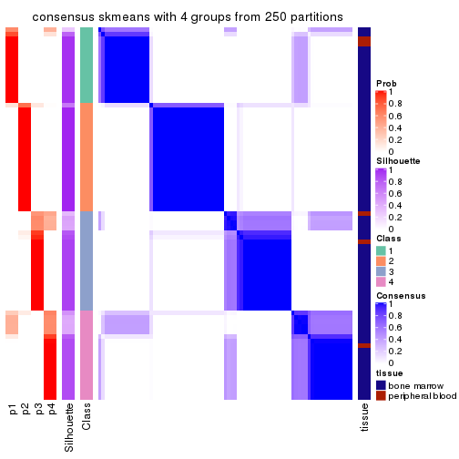</p>

</div>
<div id='tab-CV-skmeans-consensus-heatmap-4'>
<pre><code class="r">consensus_heatmap(res, k = 5)
</code></pre>

<p>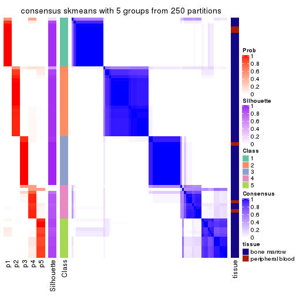</p>

</div>
<div id='tab-CV-skmeans-consensus-heatmap-5'>
<pre><code class="r">consensus_heatmap(res, k = 6)
</code></pre>

<p>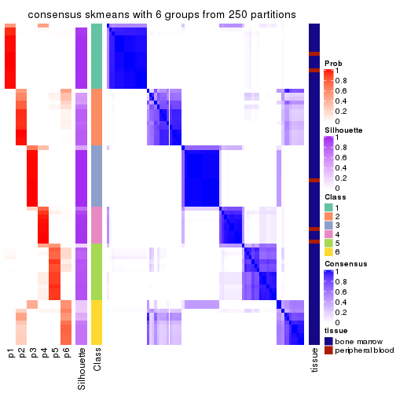</p>

</div>
</div>

Heatmaps for the membership of samples in all partitions to see how consistent they are:


<script>
$( function() {
	$( '#tabs-CV-skmeans-membership-heatmap' ).tabs();
} );
</script>
<div id='tabs-CV-skmeans-membership-heatmap'>
<ul>
<li><a href='#tab-CV-skmeans-membership-heatmap-1'>k = 2</a></li>
<li><a href='#tab-CV-skmeans-membership-heatmap-2'>k = 3</a></li>
<li><a href='#tab-CV-skmeans-membership-heatmap-3'>k = 4</a></li>
<li><a href='#tab-CV-skmeans-membership-heatmap-4'>k = 5</a></li>
<li><a href='#tab-CV-skmeans-membership-heatmap-5'>k = 6</a></li>
</ul>
<div id='tab-CV-skmeans-membership-heatmap-1'>
<pre><code class="r">membership_heatmap(res, k = 2)
</code></pre>

<p>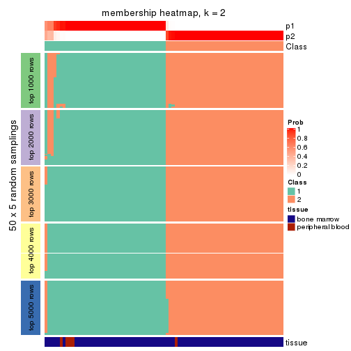</p>

</div>
<div id='tab-CV-skmeans-membership-heatmap-2'>
<pre><code class="r">membership_heatmap(res, k = 3)
</code></pre>

<p>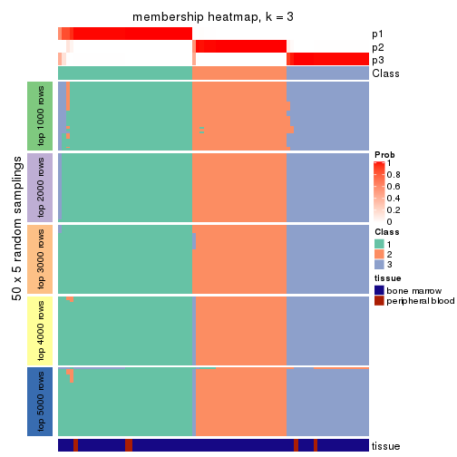</p>

</div>
<div id='tab-CV-skmeans-membership-heatmap-3'>
<pre><code class="r">membership_heatmap(res, k = 4)
</code></pre>

<p>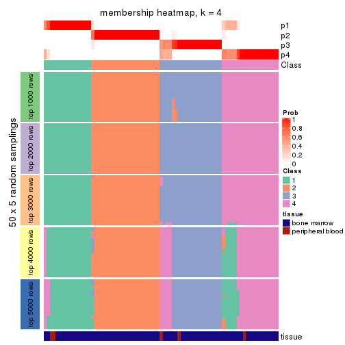</p>

</div>
<div id='tab-CV-skmeans-membership-heatmap-4'>
<pre><code class="r">membership_heatmap(res, k = 5)
</code></pre>

<p>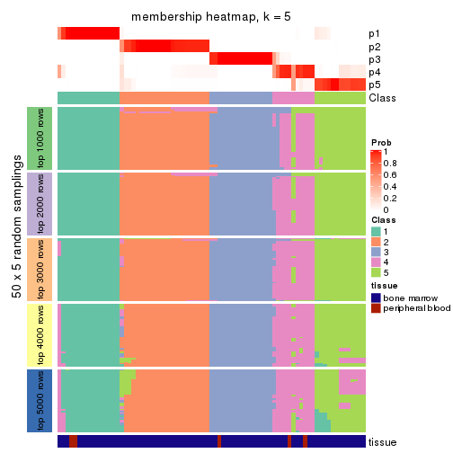</p>

</div>
<div id='tab-CV-skmeans-membership-heatmap-5'>
<pre><code class="r">membership_heatmap(res, k = 6)
</code></pre>

<p>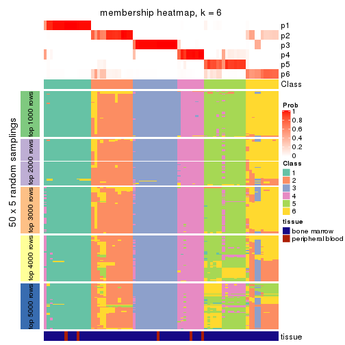</p>

</div>
</div>

As soon as we have had the classes for columns, we can look for signatures
which are significantly different between classes which can be candidate marks
for certain classes. Following are the heatmaps for signatures.


Signature heatmaps where rows are scaled:


<script>
$( function() {
	$( '#tabs-CV-skmeans-get-signatures' ).tabs();
} );
</script>
<div id='tabs-CV-skmeans-get-signatures'>
<ul>
<li><a href='#tab-CV-skmeans-get-signatures-1'>k = 2</a></li>
<li><a href='#tab-CV-skmeans-get-signatures-2'>k = 3</a></li>
<li><a href='#tab-CV-skmeans-get-signatures-3'>k = 4</a></li>
<li><a href='#tab-CV-skmeans-get-signatures-4'>k = 5</a></li>
<li><a href='#tab-CV-skmeans-get-signatures-5'>k = 6</a></li>
</ul>
<div id='tab-CV-skmeans-get-signatures-1'>
<pre><code class="r">get_signatures(res, k = 2)
</code></pre>

<p>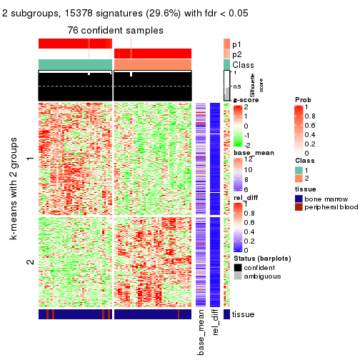</p>

</div>
<div id='tab-CV-skmeans-get-signatures-2'>
<pre><code class="r">get_signatures(res, k = 3)
</code></pre>

<p>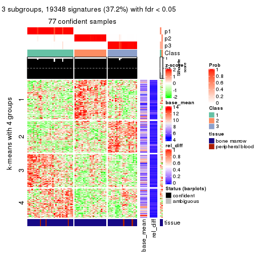</p>

</div>
<div id='tab-CV-skmeans-get-signatures-3'>
<pre><code class="r">get_signatures(res, k = 4)
</code></pre>

<p>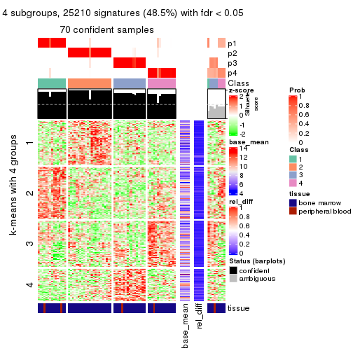</p>

</div>
<div id='tab-CV-skmeans-get-signatures-4'>
<pre><code class="r">get_signatures(res, k = 5)
</code></pre>

<p>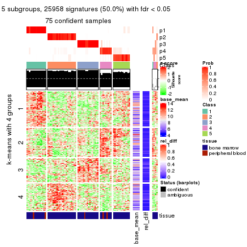</p>

</div>
<div id='tab-CV-skmeans-get-signatures-5'>
<pre><code class="r">get_signatures(res, k = 6)
</code></pre>

<p>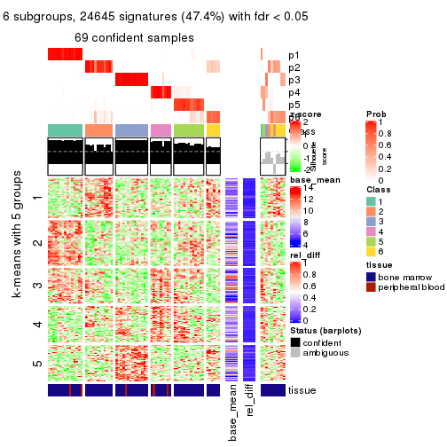</p>

</div>
</div>


Signature heatmaps where rows are not scaled:


<script>
$( function() {
	$( '#tabs-CV-skmeans-get-signatures-no-scale' ).tabs();
} );
</script>
<div id='tabs-CV-skmeans-get-signatures-no-scale'>
<ul>
<li><a href='#tab-CV-skmeans-get-signatures-no-scale-1'>k = 2</a></li>
<li><a href='#tab-CV-skmeans-get-signatures-no-scale-2'>k = 3</a></li>
<li><a href='#tab-CV-skmeans-get-signatures-no-scale-3'>k = 4</a></li>
<li><a href='#tab-CV-skmeans-get-signatures-no-scale-4'>k = 5</a></li>
<li><a href='#tab-CV-skmeans-get-signatures-no-scale-5'>k = 6</a></li>
</ul>
<div id='tab-CV-skmeans-get-signatures-no-scale-1'>
<pre><code class="r">get_signatures(res, k = 2, scale_rows = FALSE)
</code></pre>

<p>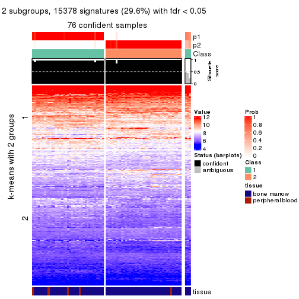</p>

</div>
<div id='tab-CV-skmeans-get-signatures-no-scale-2'>
<pre><code class="r">get_signatures(res, k = 3, scale_rows = FALSE)
</code></pre>

<p>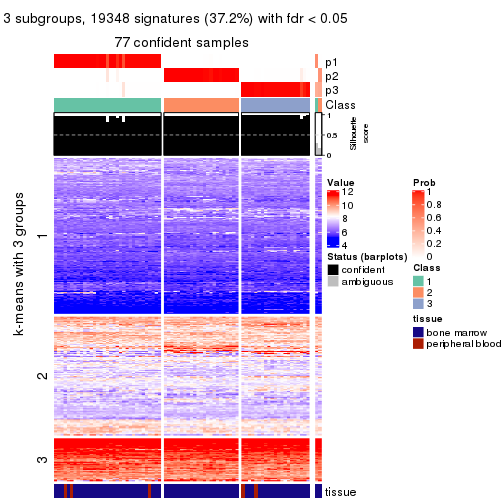</p>

</div>
<div id='tab-CV-skmeans-get-signatures-no-scale-3'>
<pre><code class="r">get_signatures(res, k = 4, scale_rows = FALSE)
</code></pre>

<p>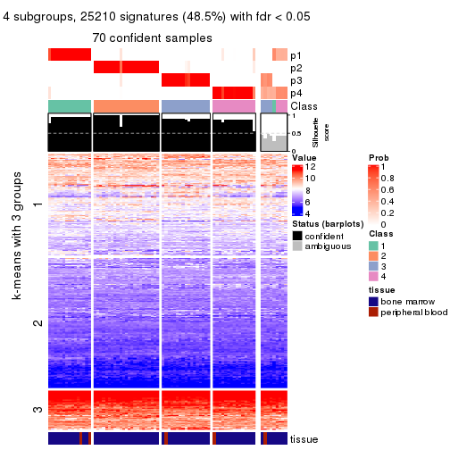</p>

</div>
<div id='tab-CV-skmeans-get-signatures-no-scale-4'>
<pre><code class="r">get_signatures(res, k = 5, scale_rows = FALSE)
</code></pre>

<p>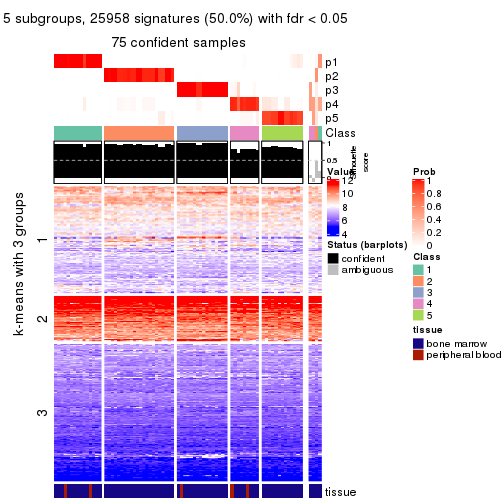</p>

</div>
<div id='tab-CV-skmeans-get-signatures-no-scale-5'>
<pre><code class="r">get_signatures(res, k = 6, scale_rows = FALSE)
</code></pre>

<p>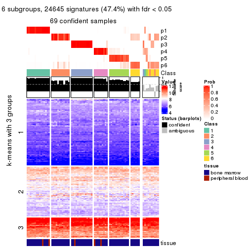</p>

</div>
</div>


Compare the overlap of signatures from different k:

```r
compare_signatures(res)
```

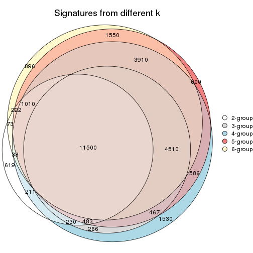

`get_signature()` returns a data frame invisibly. TO get the list of signatures, the function
call should be assigned to a variable explicitly. In following code, if `plot` argument is set
to `FALSE`, no heatmap is plotted while only the differential analysis is performed.

```r
# code only for demonstration
tb = get_signature(res, k = ..., plot = FALSE)
```

An example of the output of `tb` is:

```
#>   which_row         fdr    mean_1    mean_2 scaled_mean_1 scaled_mean_2 km
#> 1        38 0.042760348  8.373488  9.131774    -0.5533452     0.5164555  1
#> 2        40 0.018707592  7.106213  8.469186    -0.6173731     0.5762149  1
#> 3        55 0.019134737 10.221463 11.207825    -0.6159697     0.5749050  1
#> 4        59 0.006059896  5.921854  7.869574    -0.6899429     0.6439467  1
#> 5        60 0.018055526  8.928898 10.211722    -0.6204761     0.5791110  1
#> 6        98 0.009384629 15.714769 14.887706     0.6635654    -0.6193277  2
...
```

The columns in `tb` are:

1. `which_row`: row indices corresponding to the input matrix.
2. `fdr`: FDR for the differential test. 
3. `mean_x`: The mean value in group x.
4. `scaled_mean_x`: The mean value in group x after rows are scaled.
5. `km`: Row groups if k-means clustering is applied to rows.


UMAP plot which shows how samples are separated.


<script>
$( function() {
	$( '#tabs-CV-skmeans-dimension-reduction' ).tabs();
} );
</script>
<div id='tabs-CV-skmeans-dimension-reduction'>
<ul>
<li><a href='#tab-CV-skmeans-dimension-reduction-1'>k = 2</a></li>
<li><a href='#tab-CV-skmeans-dimension-reduction-2'>k = 3</a></li>
<li><a href='#tab-CV-skmeans-dimension-reduction-3'>k = 4</a></li>
<li><a href='#tab-CV-skmeans-dimension-reduction-4'>k = 5</a></li>
<li><a href='#tab-CV-skmeans-dimension-reduction-5'>k = 6</a></li>
</ul>
<div id='tab-CV-skmeans-dimension-reduction-1'>
<pre><code class="r">dimension_reduction(res, k = 2, method = &quot;UMAP&quot;)
</code></pre>

<p>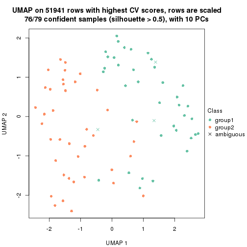</p>

</div>
<div id='tab-CV-skmeans-dimension-reduction-2'>
<pre><code class="r">dimension_reduction(res, k = 3, method = &quot;UMAP&quot;)
</code></pre>

<p>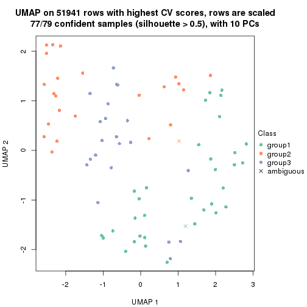</p>

</div>
<div id='tab-CV-skmeans-dimension-reduction-3'>
<pre><code class="r">dimension_reduction(res, k = 4, method = &quot;UMAP&quot;)
</code></pre>

<p>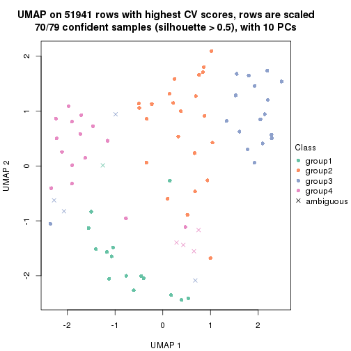</p>

</div>
<div id='tab-CV-skmeans-dimension-reduction-4'>
<pre><code class="r">dimension_reduction(res, k = 5, method = &quot;UMAP&quot;)
</code></pre>

<p>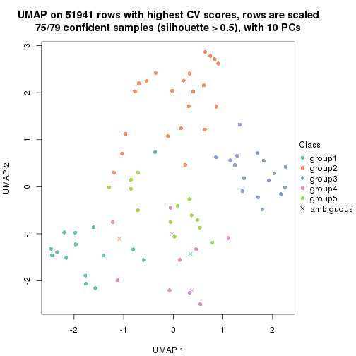</p>

</div>
<div id='tab-CV-skmeans-dimension-reduction-5'>
<pre><code class="r">dimension_reduction(res, k = 6, method = &quot;UMAP&quot;)
</code></pre>

<p>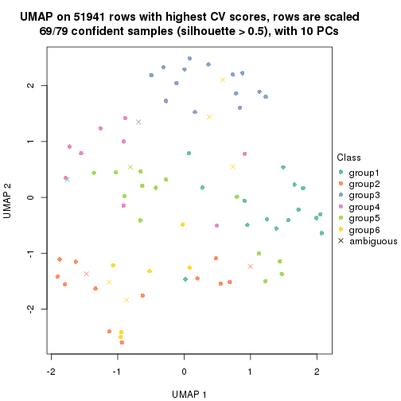</p>

</div>
</div>


Following heatmap shows how subgroups are split when increasing `k`:

```r
collect_classes(res)
```

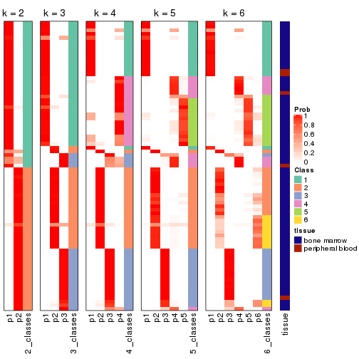


Test correlation between subgroups and known annotations. If the known
annotation is numeric, one-way ANOVA test is applied, and if the known
annotation is discrete, chi-squared contingency table test is applied.

```r
test_to_known_factors(res)
```

```
#>             n tissue(p) k
#> CV:skmeans 76     0.324 2
#> CV:skmeans 77     0.320 3
#> CV:skmeans 70     0.386 4
#> CV:skmeans 75     0.132 5
#> CV:skmeans 69     0.282 6
```


If matrix rows can be associated to genes, consider to use `GO_Enrichment(res,
...)` to perform function enrichment for the signature genes.


 

---------------------------------------------------


### CV:pam*


The object with results only for a single top-value method and a single partition method 
can be extracted as:

```r
res = res_list["CV", "pam"]
# you can also extract it by
# res = res_list["CV:pam"]
```

A summary of `res` and all the functions that can be applied to it:

```r
res
```

```
#> A 'ConsensusPartition' object with k = 2, 3, 4, 5, 6.
#>   On a matrix with 51941 rows and 79 columns.
#>   Top rows (1000, 2000, 3000, 4000, 5000) are extracted by 'CV' method.
#>   Subgroups are detected by 'pam' method.
#>   Performed in total 1250 partitions by row resampling.
#>   Best k for subgroups seems to be 6.
#> 
#> Following methods can be applied to this 'ConsensusPartition' object:
#>  [1] "cola_report"             "collect_classes"         "collect_plots"          
#>  [4] "collect_stats"           "colnames"                "compare_signatures"     
#>  [7] "consensus_heatmap"       "dimension_reduction"     "functional_enrichment"  
#> [10] "get_anno_col"            "get_anno"                "get_classes"            
#> [13] "get_consensus"           "get_matrix"              "get_membership"         
#> [16] "get_param"               "get_signatures"          "get_stats"              
#> [19] "is_best_k"               "is_stable_k"             "membership_heatmap"     
#> [22] "ncol"                    "nrow"                    "plot_ecdf"              
#> [25] "rownames"                "select_partition_number" "show"                   
#> [28] "suggest_best_k"          "test_to_known_factors"
```

`collect_plots()` function collects all the plots made from `res` for all `k` (number of partitions)
into one single page to provide an easy and fast comparison between different `k`.

```r
collect_plots(res)
```

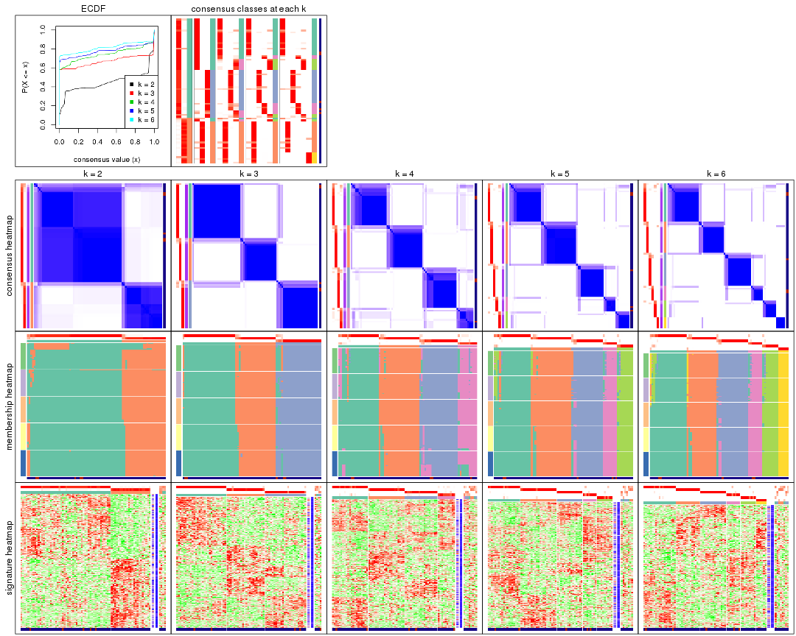

The plots are:

- The first row: a plot of the ECDF (Empirical cumulative distribution
  function) curves of the consensus matrix for each `k` and the heatmap of
  predicted classes for each `k`.
- The second row: heatmaps of the consensus matrix for each `k`.
- The third row: heatmaps of the membership matrix for each `k`.
- The fouth row: heatmaps of the signatures for each `k`.

All the plots in panels can be made by individual functions and they are
plotted later in this section.

`select_partition_number()` produces several plots showing different
statistics for choosing "optimized" `k`. There are following statistics:

- ECDF curves of the consensus matrix for each `k`;
- 1-PAC. [The PAC
  score](https://en.wikipedia.org/wiki/Consensus_clustering#Over-interpretation_potential_of_consensus_clustering)
  measures the proportion of the ambiguous subgrouping.
- Mean silhouette score.
- Concordance. The mean probability of fiting the consensus class ids in all
  partitions.
- Area increased. Denote $A_k$ as the area under the ECDF curve for current
  `k`, the area increased is defined as $A_k - A_{k-1}$.
- Rand index. The percent of pairs of samples that are both in a same cluster
  or both are not in a same cluster in the partition of k and k-1.
- Jaccard index. The ratio of pairs of samples are both in a same cluster in
  the partition of k and k-1 and the pairs of samples are both in a same
  cluster in the partition k or k-1.

The detailed explanations of these statistics can be found in [the cola
vignette](http://bioconductor.org/packages/devel/bioc/vignettes/cola/inst/doc/cola.html#toc_13).

Generally speaking, lower PAC score, higher mean silhouette score or higher
concordance corresponds to better partition. Rand index and Jaccard index
measure how similar the current partition is compared to partition with `k-1`.
If they are too similar, we won't accept `k` is better than `k-1`.

```r
select_partition_number(res)
```

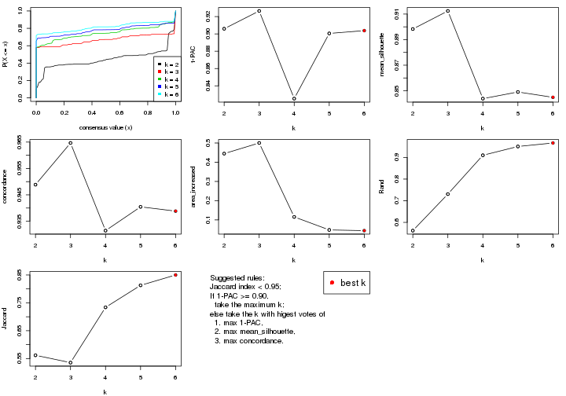

The numeric values for all these statistics can be obtained by `get_stats()`.

```r
get_stats(res)
```

```
#>   k 1-PAC mean_silhouette concordance area_increased  Rand Jaccard
#> 2 2 0.906           0.898       0.949         0.4448 0.562   0.562
#> 3 3 0.926           0.912       0.965         0.5001 0.731   0.536
#> 4 4 0.825           0.844       0.931         0.1154 0.910   0.734
#> 5 5 0.901           0.849       0.940         0.0478 0.951   0.813
#> 6 6 0.904           0.845       0.939         0.0441 0.967   0.850
```

`suggest_best_k()` suggests the best $k$ based on these statistics. The rules are as follows:

- All $k$ with Jaccard index larger than 0.95 are removed because the increase of
  the partition number does not provides enough extra information. If all $k$ are removed,
  the best $k$ is assigned by `NA`.
- For $k$ with 1-PAC larger than 0.9, the maximal $k$ is taken as the "best k". Other $k$ is called "optional k".
- If it does not fit the second rule. The $k$ with the highest vote of highest
  1-PAC, mean silhouette and concordance is taken as the "best k".

```r
suggest_best_k(res)
```

```
#> [1] 6
#> attr(,"optional")
#> [1] 2 3 5
```

There is also optional best $k$ = 2 3 5 that is worth to check.

Following shows the table of the partitions (You need to click the **show/hide
code output** link to see it). The membership matrix (columns with name `p*`)
is inferred by
[`clue::cl_consensus()`](https://www.rdocumentation.org/link/cl_consensus?package=clue)
function with the `SE` method. Basically the value in the membership matrix
represents the probability to belong to a certain group. The finall class
label for an item is determined with the group with highest probability it
belongs to.

In `get_classes()` function, the entropy is calculated from the membership
matrix and the silhouette score is calculated from the consensus matrix.


<script>
$( function() {
	$( '#tabs-CV-pam-get-classes' ).tabs();
} );
</script>
<div id='tabs-CV-pam-get-classes'>
<ul>
<li><a href='#tab-CV-pam-get-classes-1'>k = 2</a></li>
<li><a href='#tab-CV-pam-get-classes-2'>k = 3</a></li>
<li><a href='#tab-CV-pam-get-classes-3'>k = 4</a></li>
<li><a href='#tab-CV-pam-get-classes-4'>k = 5</a></li>
<li><a href='#tab-CV-pam-get-classes-5'>k = 6</a></li>
</ul>

<div id='tab-CV-pam-get-classes-1'>
<p><a id='tab-CV-pam-get-classes-1-a' style='color:#0366d6' href='#'>show/hide code output</a></p>
<pre><code class="r">cbind(get_classes(res, k = 2), get_membership(res, k = 2))
</code></pre>

<pre><code>#&gt;           class entropy silhouette    p1    p2
#&gt; GSM316652     1  0.2948     0.9390 0.948 0.052
#&gt; GSM316653     1  0.0376     0.9503 0.996 0.004
#&gt; GSM316654     1  0.0000     0.9500 1.000 0.000
#&gt; GSM316655     1  0.7453     0.7066 0.788 0.212
#&gt; GSM316656     1  0.9552     0.3439 0.624 0.376
#&gt; GSM316657     1  0.0376     0.9503 0.996 0.004
#&gt; GSM316658     2  0.2948     0.9299 0.052 0.948
#&gt; GSM316659     2  0.0672     0.9341 0.008 0.992
#&gt; GSM316660     1  0.0376     0.9503 0.996 0.004
#&gt; GSM316661     1  0.0376     0.9493 0.996 0.004
#&gt; GSM316662     1  0.2948     0.9390 0.948 0.052
#&gt; GSM316663     1  0.2948     0.9390 0.948 0.052
#&gt; GSM316664     1  0.0376     0.9503 0.996 0.004
#&gt; GSM316665     2  0.0376     0.9306 0.004 0.996
#&gt; GSM316666     1  0.2948     0.9390 0.948 0.052
#&gt; GSM316667     2  0.2948     0.9299 0.052 0.948
#&gt; GSM316668     1  0.2948     0.9390 0.948 0.052
#&gt; GSM316669     1  0.0376     0.9503 0.996 0.004
#&gt; GSM316670     2  0.0376     0.9306 0.004 0.996
#&gt; GSM316671     1  0.2948     0.9390 0.948 0.052
#&gt; GSM316672     1  0.1184     0.9440 0.984 0.016
#&gt; GSM316673     1  0.0376     0.9503 0.996 0.004
#&gt; GSM316674     1  0.2948     0.9390 0.948 0.052
#&gt; GSM316676     1  0.2948     0.9390 0.948 0.052
#&gt; GSM316677     1  0.0376     0.9503 0.996 0.004
#&gt; GSM316678     2  0.2948     0.9299 0.052 0.948
#&gt; GSM316679     1  0.0376     0.9503 0.996 0.004
#&gt; GSM316680     1  0.5842     0.8148 0.860 0.140
#&gt; GSM316681     1  0.2948     0.9390 0.948 0.052
#&gt; GSM316682     1  0.0376     0.9503 0.996 0.004
#&gt; GSM316683     1  0.0376     0.9503 0.996 0.004
#&gt; GSM316684     2  0.1184     0.9351 0.016 0.984
#&gt; GSM316685     2  0.0376     0.9306 0.004 0.996
#&gt; GSM316686     1  0.0376     0.9503 0.996 0.004
#&gt; GSM316687     1  0.2948     0.9390 0.948 0.052
#&gt; GSM316688     1  0.6048     0.8505 0.852 0.148
#&gt; GSM316689     1  0.0376     0.9503 0.996 0.004
#&gt; GSM316690     1  0.2948     0.9390 0.948 0.052
#&gt; GSM316691     2  0.0672     0.9298 0.008 0.992
#&gt; GSM316692     1  0.2948     0.9390 0.948 0.052
#&gt; GSM316693     1  0.0000     0.9500 1.000 0.000
#&gt; GSM316694     1  0.2948     0.9390 0.948 0.052
#&gt; GSM316696     1  0.0376     0.9503 0.996 0.004
#&gt; GSM316697     1  0.2948     0.9390 0.948 0.052
#&gt; GSM316698     2  0.2948     0.9299 0.052 0.948
#&gt; GSM316699     2  0.0376     0.9306 0.004 0.996
#&gt; GSM316700     1  0.0376     0.9503 0.996 0.004
#&gt; GSM316701     1  0.0376     0.9503 0.996 0.004
#&gt; GSM316703     2  0.9881     0.2942 0.436 0.564
#&gt; GSM316704     2  0.2948     0.9299 0.052 0.948
#&gt; GSM316705     1  0.0376     0.9503 0.996 0.004
#&gt; GSM316706     2  0.2948     0.9299 0.052 0.948
#&gt; GSM316707     2  0.0938     0.9348 0.012 0.988
#&gt; GSM316708     2  0.2948     0.9299 0.052 0.948
#&gt; GSM316709     1  0.2948     0.9390 0.948 0.052
#&gt; GSM316710     1  0.0376     0.9493 0.996 0.004
#&gt; GSM316711     2  0.1184     0.9351 0.016 0.984
#&gt; GSM316713     1  0.0376     0.9503 0.996 0.004
#&gt; GSM316714     1  0.2948     0.9390 0.948 0.052
#&gt; GSM316715     1  0.0376     0.9503 0.996 0.004
#&gt; GSM316716     2  0.0376     0.9306 0.004 0.996
#&gt; GSM316717     1  0.0376     0.9503 0.996 0.004
#&gt; GSM316718     2  0.2948     0.9299 0.052 0.948
#&gt; GSM316719     1  0.0376     0.9503 0.996 0.004
#&gt; GSM316720     1  0.0376     0.9503 0.996 0.004
#&gt; GSM316721     2  0.0376     0.9306 0.004 0.996
#&gt; GSM316722     1  0.9933     0.0827 0.548 0.452
#&gt; GSM316723     2  0.0938     0.9349 0.012 0.988
#&gt; GSM316724     2  0.2948     0.9299 0.052 0.948
#&gt; GSM316726     2  0.0672     0.9320 0.008 0.992
#&gt; GSM316727     1  0.0376     0.9503 0.996 0.004
#&gt; GSM316728     1  0.2948     0.9390 0.948 0.052
#&gt; GSM316729     2  0.5294     0.8755 0.120 0.880
#&gt; GSM316730     2  0.9983     0.1657 0.476 0.524
#&gt; GSM316675     1  0.2948     0.9390 0.948 0.052
#&gt; GSM316695     1  0.0376     0.9503 0.996 0.004
#&gt; GSM316702     1  0.2948     0.9390 0.948 0.052
#&gt; GSM316712     1  0.0376     0.9503 0.996 0.004
#&gt; GSM316725     1  0.0000     0.9500 1.000 0.000
</code></pre>

<script>
$('#tab-CV-pam-get-classes-1-a').parent().next().next().hide();
$('#tab-CV-pam-get-classes-1-a').click(function(){
  $('#tab-CV-pam-get-classes-1-a').parent().next().next().toggle();
  return(false);
});
</script>
</div>

<div id='tab-CV-pam-get-classes-2'>
<p><a id='tab-CV-pam-get-classes-2-a' style='color:#0366d6' href='#'>show/hide code output</a></p>
<pre><code class="r">cbind(get_classes(res, k = 3), get_membership(res, k = 3))
</code></pre>

<pre><code>#&gt;           class entropy silhouette    p1    p2    p3
#&gt; GSM316652     3   0.000      0.938 0.000 0.000 1.000
#&gt; GSM316653     1   0.000      0.986 1.000 0.000 0.000
#&gt; GSM316654     3   0.581      0.533 0.336 0.000 0.664
#&gt; GSM316655     1   0.000      0.986 1.000 0.000 0.000
#&gt; GSM316656     3   0.000      0.938 0.000 0.000 1.000
#&gt; GSM316657     1   0.000      0.986 1.000 0.000 0.000
#&gt; GSM316658     2   0.000      0.953 0.000 1.000 0.000
#&gt; GSM316659     2   0.000      0.953 0.000 1.000 0.000
#&gt; GSM316660     1   0.000      0.986 1.000 0.000 0.000
#&gt; GSM316661     3   0.000      0.938 0.000 0.000 1.000
#&gt; GSM316662     3   0.000      0.938 0.000 0.000 1.000
#&gt; GSM316663     3   0.000      0.938 0.000 0.000 1.000
#&gt; GSM316664     1   0.000      0.986 1.000 0.000 0.000
#&gt; GSM316665     2   0.000      0.953 0.000 1.000 0.000
#&gt; GSM316666     3   0.000      0.938 0.000 0.000 1.000
#&gt; GSM316667     2   0.000      0.953 0.000 1.000 0.000
#&gt; GSM316668     3   0.000      0.938 0.000 0.000 1.000
#&gt; GSM316669     1   0.000      0.986 1.000 0.000 0.000
#&gt; GSM316670     2   0.116      0.928 0.000 0.972 0.028
#&gt; GSM316671     3   0.000      0.938 0.000 0.000 1.000
#&gt; GSM316672     1   0.000      0.986 1.000 0.000 0.000
#&gt; GSM316673     1   0.000      0.986 1.000 0.000 0.000
#&gt; GSM316674     3   0.000      0.938 0.000 0.000 1.000
#&gt; GSM316676     3   0.000      0.938 0.000 0.000 1.000
#&gt; GSM316677     1   0.000      0.986 1.000 0.000 0.000
#&gt; GSM316678     2   0.000      0.953 0.000 1.000 0.000
#&gt; GSM316679     1   0.000      0.986 1.000 0.000 0.000
#&gt; GSM316680     1   0.000      0.986 1.000 0.000 0.000
#&gt; GSM316681     3   0.000      0.938 0.000 0.000 1.000
#&gt; GSM316682     1   0.000      0.986 1.000 0.000 0.000
#&gt; GSM316683     1   0.000      0.986 1.000 0.000 0.000
#&gt; GSM316684     2   0.000      0.953 0.000 1.000 0.000
#&gt; GSM316685     2   0.000      0.953 0.000 1.000 0.000
#&gt; GSM316686     1   0.000      0.986 1.000 0.000 0.000
#&gt; GSM316687     3   0.000      0.938 0.000 0.000 1.000
#&gt; GSM316688     3   0.882      0.449 0.188 0.232 0.580
#&gt; GSM316689     1   0.000      0.986 1.000 0.000 0.000
#&gt; GSM316690     3   0.000      0.938 0.000 0.000 1.000
#&gt; GSM316691     2   0.000      0.953 0.000 1.000 0.000
#&gt; GSM316692     3   0.000      0.938 0.000 0.000 1.000
#&gt; GSM316693     3   0.522      0.662 0.260 0.000 0.740
#&gt; GSM316694     3   0.000      0.938 0.000 0.000 1.000
#&gt; GSM316696     1   0.000      0.986 1.000 0.000 0.000
#&gt; GSM316697     3   0.000      0.938 0.000 0.000 1.000
#&gt; GSM316698     2   0.000      0.953 0.000 1.000 0.000
#&gt; GSM316699     2   0.000      0.953 0.000 1.000 0.000
#&gt; GSM316700     1   0.000      0.986 1.000 0.000 0.000
#&gt; GSM316701     1   0.000      0.986 1.000 0.000 0.000
#&gt; GSM316703     2   0.000      0.953 0.000 1.000 0.000
#&gt; GSM316704     2   0.000      0.953 0.000 1.000 0.000
#&gt; GSM316705     1   0.000      0.986 1.000 0.000 0.000
#&gt; GSM316706     2   0.429      0.759 0.180 0.820 0.000
#&gt; GSM316707     2   0.000      0.953 0.000 1.000 0.000
#&gt; GSM316708     2   0.576      0.523 0.328 0.672 0.000
#&gt; GSM316709     3   0.000      0.938 0.000 0.000 1.000
#&gt; GSM316710     3   0.000      0.938 0.000 0.000 1.000
#&gt; GSM316711     2   0.000      0.953 0.000 1.000 0.000
#&gt; GSM316713     1   0.000      0.986 1.000 0.000 0.000
#&gt; GSM316714     3   0.000      0.938 0.000 0.000 1.000
#&gt; GSM316715     1   0.000      0.986 1.000 0.000 0.000
#&gt; GSM316716     2   0.000      0.953 0.000 1.000 0.000
#&gt; GSM316717     1   0.000      0.986 1.000 0.000 0.000
#&gt; GSM316718     2   0.613      0.355 0.400 0.600 0.000
#&gt; GSM316719     1   0.000      0.986 1.000 0.000 0.000
#&gt; GSM316720     1   0.000      0.986 1.000 0.000 0.000
#&gt; GSM316721     2   0.000      0.953 0.000 1.000 0.000
#&gt; GSM316722     1   0.000      0.986 1.000 0.000 0.000
#&gt; GSM316723     2   0.000      0.953 0.000 1.000 0.000
#&gt; GSM316724     2   0.000      0.953 0.000 1.000 0.000
#&gt; GSM316726     2   0.000      0.953 0.000 1.000 0.000
#&gt; GSM316727     1   0.000      0.986 1.000 0.000 0.000
#&gt; GSM316728     3   0.000      0.938 0.000 0.000 1.000
#&gt; GSM316729     1   0.000      0.986 1.000 0.000 0.000
#&gt; GSM316730     1   0.608      0.305 0.612 0.388 0.000
#&gt; GSM316675     3   0.000      0.938 0.000 0.000 1.000
#&gt; GSM316695     1   0.000      0.986 1.000 0.000 0.000
#&gt; GSM316702     3   0.000      0.938 0.000 0.000 1.000
#&gt; GSM316712     1   0.000      0.986 1.000 0.000 0.000
#&gt; GSM316725     3   0.627      0.244 0.452 0.000 0.548
</code></pre>

<script>
$('#tab-CV-pam-get-classes-2-a').parent().next().next().hide();
$('#tab-CV-pam-get-classes-2-a').click(function(){
  $('#tab-CV-pam-get-classes-2-a').parent().next().next().toggle();
  return(false);
});
</script>
</div>

<div id='tab-CV-pam-get-classes-3'>
<p><a id='tab-CV-pam-get-classes-3-a' style='color:#0366d6' href='#'>show/hide code output</a></p>
<pre><code class="r">cbind(get_classes(res, k = 4), get_membership(res, k = 4))
</code></pre>

<pre><code>#&gt;           class entropy silhouette    p1    p2    p3    p4
#&gt; GSM316652     3  0.0000      0.919 0.000 0.000 1.000 0.000
#&gt; GSM316653     4  0.4843      0.444 0.396 0.000 0.000 0.604
#&gt; GSM316654     3  0.7300      0.343 0.196 0.000 0.528 0.276
#&gt; GSM316655     1  0.0000      0.920 1.000 0.000 0.000 0.000
#&gt; GSM316656     4  0.3056      0.828 0.000 0.040 0.072 0.888
#&gt; GSM316657     1  0.0000      0.920 1.000 0.000 0.000 0.000
#&gt; GSM316658     2  0.0000      0.942 0.000 1.000 0.000 0.000
#&gt; GSM316659     2  0.0000      0.942 0.000 1.000 0.000 0.000
#&gt; GSM316660     1  0.0000      0.920 1.000 0.000 0.000 0.000
#&gt; GSM316661     4  0.4008      0.588 0.000 0.000 0.244 0.756
#&gt; GSM316662     3  0.0000      0.919 0.000 0.000 1.000 0.000
#&gt; GSM316663     3  0.2281      0.864 0.000 0.000 0.904 0.096
#&gt; GSM316664     1  0.2530      0.814 0.888 0.000 0.000 0.112
#&gt; GSM316665     2  0.0000      0.942 0.000 1.000 0.000 0.000
#&gt; GSM316666     3  0.0000      0.919 0.000 0.000 1.000 0.000
#&gt; GSM316667     2  0.0000      0.942 0.000 1.000 0.000 0.000
#&gt; GSM316668     3  0.0000      0.919 0.000 0.000 1.000 0.000
#&gt; GSM316669     4  0.2589      0.852 0.116 0.000 0.000 0.884
#&gt; GSM316670     2  0.0817      0.922 0.000 0.976 0.024 0.000
#&gt; GSM316671     3  0.0000      0.919 0.000 0.000 1.000 0.000
#&gt; GSM316672     1  0.0000      0.920 1.000 0.000 0.000 0.000
#&gt; GSM316673     1  0.0000      0.920 1.000 0.000 0.000 0.000
#&gt; GSM316674     3  0.0000      0.919 0.000 0.000 1.000 0.000
#&gt; GSM316676     3  0.0000      0.919 0.000 0.000 1.000 0.000
#&gt; GSM316677     1  0.2530      0.814 0.888 0.000 0.000 0.112
#&gt; GSM316678     2  0.0000      0.942 0.000 1.000 0.000 0.000
#&gt; GSM316679     1  0.0000      0.920 1.000 0.000 0.000 0.000
#&gt; GSM316680     1  0.4866      0.303 0.596 0.000 0.000 0.404
#&gt; GSM316681     3  0.0000      0.919 0.000 0.000 1.000 0.000
#&gt; GSM316682     4  0.0000      0.860 0.000 0.000 0.000 1.000
#&gt; GSM316683     4  0.0000      0.860 0.000 0.000 0.000 1.000
#&gt; GSM316684     2  0.0000      0.942 0.000 1.000 0.000 0.000
#&gt; GSM316685     2  0.0000      0.942 0.000 1.000 0.000 0.000
#&gt; GSM316686     1  0.1792      0.859 0.932 0.000 0.068 0.000
#&gt; GSM316687     3  0.1637      0.887 0.000 0.000 0.940 0.060
#&gt; GSM316688     3  0.6991      0.421 0.188 0.232 0.580 0.000
#&gt; GSM316689     1  0.0000      0.920 1.000 0.000 0.000 0.000
#&gt; GSM316690     3  0.0000      0.919 0.000 0.000 1.000 0.000
#&gt; GSM316691     2  0.0000      0.942 0.000 1.000 0.000 0.000
#&gt; GSM316692     3  0.0000      0.919 0.000 0.000 1.000 0.000
#&gt; GSM316693     4  0.0000      0.860 0.000 0.000 0.000 1.000
#&gt; GSM316694     3  0.0000      0.919 0.000 0.000 1.000 0.000
#&gt; GSM316696     1  0.0000      0.920 1.000 0.000 0.000 0.000
#&gt; GSM316697     3  0.0000      0.919 0.000 0.000 1.000 0.000
#&gt; GSM316698     2  0.0000      0.942 0.000 1.000 0.000 0.000
#&gt; GSM316699     2  0.0000      0.942 0.000 1.000 0.000 0.000
#&gt; GSM316700     4  0.2530      0.854 0.112 0.000 0.000 0.888
#&gt; GSM316701     4  0.2530      0.854 0.112 0.000 0.000 0.888
#&gt; GSM316703     2  0.0000      0.942 0.000 1.000 0.000 0.000
#&gt; GSM316704     2  0.0000      0.942 0.000 1.000 0.000 0.000
#&gt; GSM316705     1  0.0000      0.920 1.000 0.000 0.000 0.000
#&gt; GSM316706     2  0.2704      0.815 0.124 0.876 0.000 0.000
#&gt; GSM316707     2  0.0000      0.942 0.000 1.000 0.000 0.000
#&gt; GSM316708     2  0.4564      0.496 0.328 0.672 0.000 0.000
#&gt; GSM316709     3  0.0000      0.919 0.000 0.000 1.000 0.000
#&gt; GSM316710     3  0.4804      0.447 0.000 0.000 0.616 0.384
#&gt; GSM316711     2  0.0000      0.942 0.000 1.000 0.000 0.000
#&gt; GSM316713     1  0.0000      0.920 1.000 0.000 0.000 0.000
#&gt; GSM316714     3  0.0000      0.919 0.000 0.000 1.000 0.000
#&gt; GSM316715     1  0.0000      0.920 1.000 0.000 0.000 0.000
#&gt; GSM316716     2  0.0000      0.942 0.000 1.000 0.000 0.000
#&gt; GSM316717     1  0.1940      0.861 0.924 0.000 0.000 0.076
#&gt; GSM316718     2  0.4855      0.316 0.400 0.600 0.000 0.000
#&gt; GSM316719     1  0.0000      0.920 1.000 0.000 0.000 0.000
#&gt; GSM316720     1  0.0000      0.920 1.000 0.000 0.000 0.000
#&gt; GSM316721     2  0.0000      0.942 0.000 1.000 0.000 0.000
#&gt; GSM316722     1  0.4406      0.543 0.700 0.000 0.000 0.300
#&gt; GSM316723     2  0.0000      0.942 0.000 1.000 0.000 0.000
#&gt; GSM316724     2  0.3486      0.736 0.000 0.812 0.000 0.188
#&gt; GSM316726     2  0.0000      0.942 0.000 1.000 0.000 0.000
#&gt; GSM316727     1  0.0000      0.920 1.000 0.000 0.000 0.000
#&gt; GSM316728     3  0.2530      0.852 0.000 0.000 0.888 0.112
#&gt; GSM316729     4  0.2530      0.854 0.112 0.000 0.000 0.888
#&gt; GSM316730     1  0.4817      0.342 0.612 0.388 0.000 0.000
#&gt; GSM316675     3  0.0000      0.919 0.000 0.000 1.000 0.000
#&gt; GSM316695     1  0.0000      0.920 1.000 0.000 0.000 0.000
#&gt; GSM316702     3  0.2530      0.852 0.000 0.000 0.888 0.112
#&gt; GSM316712     1  0.0000      0.920 1.000 0.000 0.000 0.000
#&gt; GSM316725     4  0.1151      0.857 0.024 0.000 0.008 0.968
</code></pre>

<script>
$('#tab-CV-pam-get-classes-3-a').parent().next().next().hide();
$('#tab-CV-pam-get-classes-3-a').click(function(){
  $('#tab-CV-pam-get-classes-3-a').parent().next().next().toggle();
  return(false);
});
</script>
</div>

<div id='tab-CV-pam-get-classes-4'>
<p><a id='tab-CV-pam-get-classes-4-a' style='color:#0366d6' href='#'>show/hide code output</a></p>
<pre><code class="r">cbind(get_classes(res, k = 5), get_membership(res, k = 5))
</code></pre>

<pre><code>#&gt;           class entropy silhouette    p1    p2    p3    p4    p5
#&gt; GSM316652     3  0.0000     0.9129 0.000 0.000 1.000 0.000 0.000
#&gt; GSM316653     5  0.3707     0.5895 0.284 0.000 0.000 0.000 0.716
#&gt; GSM316654     4  0.0162     0.9023 0.000 0.000 0.000 0.996 0.004
#&gt; GSM316655     1  0.0000     0.9274 1.000 0.000 0.000 0.000 0.000
#&gt; GSM316656     5  0.0000     0.9165 0.000 0.000 0.000 0.000 1.000
#&gt; GSM316657     1  0.0000     0.9274 1.000 0.000 0.000 0.000 0.000
#&gt; GSM316658     2  0.0000     0.9434 0.000 1.000 0.000 0.000 0.000
#&gt; GSM316659     2  0.0000     0.9434 0.000 1.000 0.000 0.000 0.000
#&gt; GSM316660     1  0.0000     0.9274 1.000 0.000 0.000 0.000 0.000
#&gt; GSM316661     5  0.4021     0.6608 0.000 0.000 0.200 0.036 0.764
#&gt; GSM316662     3  0.0000     0.9129 0.000 0.000 1.000 0.000 0.000
#&gt; GSM316663     3  0.4074     0.4118 0.000 0.000 0.636 0.364 0.000
#&gt; GSM316664     4  0.3949     0.5359 0.332 0.000 0.000 0.668 0.000
#&gt; GSM316665     2  0.0162     0.9420 0.000 0.996 0.000 0.004 0.000
#&gt; GSM316666     3  0.0000     0.9129 0.000 0.000 1.000 0.000 0.000
#&gt; GSM316667     2  0.0000     0.9434 0.000 1.000 0.000 0.000 0.000
#&gt; GSM316668     3  0.0000     0.9129 0.000 0.000 1.000 0.000 0.000
#&gt; GSM316669     5  0.0162     0.9137 0.004 0.000 0.000 0.000 0.996
#&gt; GSM316670     2  0.0000     0.9434 0.000 1.000 0.000 0.000 0.000
#&gt; GSM316671     3  0.0000     0.9129 0.000 0.000 1.000 0.000 0.000
#&gt; GSM316672     1  0.0000     0.9274 1.000 0.000 0.000 0.000 0.000
#&gt; GSM316673     1  0.0000     0.9274 1.000 0.000 0.000 0.000 0.000
#&gt; GSM316674     3  0.0000     0.9129 0.000 0.000 1.000 0.000 0.000
#&gt; GSM316676     3  0.0000     0.9129 0.000 0.000 1.000 0.000 0.000
#&gt; GSM316677     4  0.0162     0.9020 0.004 0.000 0.000 0.996 0.000
#&gt; GSM316678     2  0.0000     0.9434 0.000 1.000 0.000 0.000 0.000
#&gt; GSM316679     1  0.0000     0.9274 1.000 0.000 0.000 0.000 0.000
#&gt; GSM316680     1  0.4192     0.3831 0.596 0.000 0.000 0.000 0.404
#&gt; GSM316681     3  0.0000     0.9129 0.000 0.000 1.000 0.000 0.000
#&gt; GSM316682     5  0.0000     0.9165 0.000 0.000 0.000 0.000 1.000
#&gt; GSM316683     5  0.0000     0.9165 0.000 0.000 0.000 0.000 1.000
#&gt; GSM316684     2  0.0162     0.9420 0.000 0.996 0.000 0.004 0.000
#&gt; GSM316685     2  0.0000     0.9434 0.000 1.000 0.000 0.000 0.000
#&gt; GSM316686     1  0.1908     0.8382 0.908 0.000 0.092 0.000 0.000
#&gt; GSM316687     3  0.4060     0.4207 0.000 0.000 0.640 0.360 0.000
#&gt; GSM316688     3  0.6694     0.0634 0.348 0.244 0.408 0.000 0.000
#&gt; GSM316689     1  0.0000     0.9274 1.000 0.000 0.000 0.000 0.000
#&gt; GSM316690     3  0.0000     0.9129 0.000 0.000 1.000 0.000 0.000
#&gt; GSM316691     2  0.0000     0.9434 0.000 1.000 0.000 0.000 0.000
#&gt; GSM316692     3  0.0000     0.9129 0.000 0.000 1.000 0.000 0.000
#&gt; GSM316693     4  0.0162     0.9023 0.000 0.000 0.000 0.996 0.004
#&gt; GSM316694     3  0.0000     0.9129 0.000 0.000 1.000 0.000 0.000
#&gt; GSM316696     1  0.0000     0.9274 1.000 0.000 0.000 0.000 0.000
#&gt; GSM316697     3  0.0000     0.9129 0.000 0.000 1.000 0.000 0.000
#&gt; GSM316698     2  0.0000     0.9434 0.000 1.000 0.000 0.000 0.000
#&gt; GSM316699     2  0.0000     0.9434 0.000 1.000 0.000 0.000 0.000
#&gt; GSM316700     5  0.0000     0.9165 0.000 0.000 0.000 0.000 1.000
#&gt; GSM316701     5  0.0000     0.9165 0.000 0.000 0.000 0.000 1.000
#&gt; GSM316703     2  0.0162     0.9420 0.000 0.996 0.000 0.004 0.000
#&gt; GSM316704     2  0.0162     0.9420 0.000 0.996 0.000 0.004 0.000
#&gt; GSM316705     1  0.0000     0.9274 1.000 0.000 0.000 0.000 0.000
#&gt; GSM316706     2  0.2179     0.8415 0.100 0.896 0.000 0.004 0.000
#&gt; GSM316707     2  0.0000     0.9434 0.000 1.000 0.000 0.000 0.000
#&gt; GSM316708     2  0.3932     0.4882 0.328 0.672 0.000 0.000 0.000
#&gt; GSM316709     3  0.0000     0.9129 0.000 0.000 1.000 0.000 0.000
#&gt; GSM316710     4  0.0162     0.9037 0.000 0.000 0.004 0.996 0.000
#&gt; GSM316711     2  0.0000     0.9434 0.000 1.000 0.000 0.000 0.000
#&gt; GSM316713     1  0.0000     0.9274 1.000 0.000 0.000 0.000 0.000
#&gt; GSM316714     3  0.0000     0.9129 0.000 0.000 1.000 0.000 0.000
#&gt; GSM316715     1  0.0000     0.9274 1.000 0.000 0.000 0.000 0.000
#&gt; GSM316716     2  0.0000     0.9434 0.000 1.000 0.000 0.000 0.000
#&gt; GSM316717     1  0.1732     0.8652 0.920 0.000 0.000 0.000 0.080
#&gt; GSM316718     2  0.4182     0.3052 0.400 0.600 0.000 0.000 0.000
#&gt; GSM316719     1  0.0000     0.9274 1.000 0.000 0.000 0.000 0.000
#&gt; GSM316720     1  0.0000     0.9274 1.000 0.000 0.000 0.000 0.000
#&gt; GSM316721     2  0.0000     0.9434 0.000 1.000 0.000 0.000 0.000
#&gt; GSM316722     1  0.4485     0.5676 0.680 0.000 0.000 0.028 0.292
#&gt; GSM316723     2  0.0162     0.9420 0.000 0.996 0.000 0.004 0.000
#&gt; GSM316724     2  0.3123     0.7436 0.000 0.812 0.000 0.004 0.184
#&gt; GSM316726     2  0.0000     0.9434 0.000 1.000 0.000 0.000 0.000
#&gt; GSM316727     1  0.0000     0.9274 1.000 0.000 0.000 0.000 0.000
#&gt; GSM316728     4  0.2929     0.7329 0.000 0.000 0.180 0.820 0.000
#&gt; GSM316729     5  0.0000     0.9165 0.000 0.000 0.000 0.000 1.000
#&gt; GSM316730     1  0.4288     0.3488 0.612 0.384 0.000 0.004 0.000
#&gt; GSM316675     3  0.0000     0.9129 0.000 0.000 1.000 0.000 0.000
#&gt; GSM316695     1  0.0000     0.9274 1.000 0.000 0.000 0.000 0.000
#&gt; GSM316702     4  0.0290     0.9018 0.000 0.000 0.008 0.992 0.000
#&gt; GSM316712     1  0.0000     0.9274 1.000 0.000 0.000 0.000 0.000
#&gt; GSM316725     4  0.0162     0.9037 0.000 0.000 0.004 0.996 0.000
</code></pre>

<script>
$('#tab-CV-pam-get-classes-4-a').parent().next().next().hide();
$('#tab-CV-pam-get-classes-4-a').click(function(){
  $('#tab-CV-pam-get-classes-4-a').parent().next().next().toggle();
  return(false);
});
</script>
</div>

<div id='tab-CV-pam-get-classes-5'>
<p><a id='tab-CV-pam-get-classes-5-a' style='color:#0366d6' href='#'>show/hide code output</a></p>
<pre><code class="r">cbind(get_classes(res, k = 6), get_membership(res, k = 6))
</code></pre>

<pre><code>#&gt;           class entropy silhouette    p1    p2    p3    p4    p5    p6
#&gt; GSM316652     3  0.0000      0.914 0.000 0.000 1.000 0.000 0.000 0.000
#&gt; GSM316653     5  0.3330      0.594 0.284 0.000 0.000 0.000 0.716 0.000
#&gt; GSM316654     4  0.0000      0.902 0.000 0.000 0.000 1.000 0.000 0.000
#&gt; GSM316655     1  0.0000      0.929 1.000 0.000 0.000 0.000 0.000 0.000
#&gt; GSM316656     5  0.0000      0.915 0.000 0.000 0.000 0.000 1.000 0.000
#&gt; GSM316657     1  0.0000      0.929 1.000 0.000 0.000 0.000 0.000 0.000
#&gt; GSM316658     2  0.0000      0.913 0.000 1.000 0.000 0.000 0.000 0.000
#&gt; GSM316659     2  0.0000      0.913 0.000 1.000 0.000 0.000 0.000 0.000
#&gt; GSM316660     1  0.0000      0.929 1.000 0.000 0.000 0.000 0.000 0.000
#&gt; GSM316661     5  0.3612      0.665 0.000 0.000 0.200 0.036 0.764 0.000
#&gt; GSM316662     3  0.0000      0.914 0.000 0.000 1.000 0.000 0.000 0.000
#&gt; GSM316663     3  0.3659      0.416 0.000 0.000 0.636 0.364 0.000 0.000
#&gt; GSM316664     4  0.3547      0.533 0.332 0.000 0.000 0.668 0.000 0.000
#&gt; GSM316665     6  0.0000      1.000 0.000 0.000 0.000 0.000 0.000 1.000
#&gt; GSM316666     3  0.0000      0.914 0.000 0.000 1.000 0.000 0.000 0.000
#&gt; GSM316667     2  0.0000      0.913 0.000 1.000 0.000 0.000 0.000 0.000
#&gt; GSM316668     3  0.0000      0.914 0.000 0.000 1.000 0.000 0.000 0.000
#&gt; GSM316669     5  0.0146      0.913 0.004 0.000 0.000 0.000 0.996 0.000
#&gt; GSM316670     2  0.0000      0.913 0.000 1.000 0.000 0.000 0.000 0.000
#&gt; GSM316671     3  0.0000      0.914 0.000 0.000 1.000 0.000 0.000 0.000
#&gt; GSM316672     1  0.0000      0.929 1.000 0.000 0.000 0.000 0.000 0.000
#&gt; GSM316673     1  0.0000      0.929 1.000 0.000 0.000 0.000 0.000 0.000
#&gt; GSM316674     3  0.0000      0.914 0.000 0.000 1.000 0.000 0.000 0.000
#&gt; GSM316676     3  0.0000      0.914 0.000 0.000 1.000 0.000 0.000 0.000
#&gt; GSM316677     4  0.0000      0.902 0.000 0.000 0.000 1.000 0.000 0.000
#&gt; GSM316678     2  0.0146      0.910 0.000 0.996 0.000 0.000 0.000 0.004
#&gt; GSM316679     1  0.0000      0.929 1.000 0.000 0.000 0.000 0.000 0.000
#&gt; GSM316680     1  0.3765      0.398 0.596 0.000 0.000 0.000 0.404 0.000
#&gt; GSM316681     3  0.0000      0.914 0.000 0.000 1.000 0.000 0.000 0.000
#&gt; GSM316682     5  0.0000      0.915 0.000 0.000 0.000 0.000 1.000 0.000
#&gt; GSM316683     5  0.0000      0.915 0.000 0.000 0.000 0.000 1.000 0.000
#&gt; GSM316684     6  0.0000      1.000 0.000 0.000 0.000 0.000 0.000 1.000
#&gt; GSM316685     2  0.0000      0.913 0.000 1.000 0.000 0.000 0.000 0.000
#&gt; GSM316686     1  0.1957      0.820 0.888 0.000 0.112 0.000 0.000 0.000
#&gt; GSM316687     3  0.3647      0.425 0.000 0.000 0.640 0.360 0.000 0.000
#&gt; GSM316688     3  0.6012      0.076 0.348 0.244 0.408 0.000 0.000 0.000
#&gt; GSM316689     1  0.0000      0.929 1.000 0.000 0.000 0.000 0.000 0.000
#&gt; GSM316690     3  0.0000      0.914 0.000 0.000 1.000 0.000 0.000 0.000
#&gt; GSM316691     2  0.0000      0.913 0.000 1.000 0.000 0.000 0.000 0.000
#&gt; GSM316692     3  0.0000      0.914 0.000 0.000 1.000 0.000 0.000 0.000
#&gt; GSM316693     4  0.0000      0.902 0.000 0.000 0.000 1.000 0.000 0.000
#&gt; GSM316694     3  0.0000      0.914 0.000 0.000 1.000 0.000 0.000 0.000
#&gt; GSM316696     1  0.0000      0.929 1.000 0.000 0.000 0.000 0.000 0.000
#&gt; GSM316697     3  0.0000      0.914 0.000 0.000 1.000 0.000 0.000 0.000
#&gt; GSM316698     2  0.0000      0.913 0.000 1.000 0.000 0.000 0.000 0.000
#&gt; GSM316699     2  0.0000      0.913 0.000 1.000 0.000 0.000 0.000 0.000
#&gt; GSM316700     5  0.0000      0.915 0.000 0.000 0.000 0.000 1.000 0.000
#&gt; GSM316701     5  0.0000      0.915 0.000 0.000 0.000 0.000 1.000 0.000
#&gt; GSM316703     6  0.0000      1.000 0.000 0.000 0.000 0.000 0.000 1.000
#&gt; GSM316704     2  0.3717      0.325 0.000 0.616 0.000 0.000 0.000 0.384
#&gt; GSM316705     1  0.0000      0.929 1.000 0.000 0.000 0.000 0.000 0.000
#&gt; GSM316706     6  0.0000      1.000 0.000 0.000 0.000 0.000 0.000 1.000
#&gt; GSM316707     2  0.0000      0.913 0.000 1.000 0.000 0.000 0.000 0.000
#&gt; GSM316708     2  0.3531      0.486 0.328 0.672 0.000 0.000 0.000 0.000
#&gt; GSM316709     3  0.0000      0.914 0.000 0.000 1.000 0.000 0.000 0.000
#&gt; GSM316710     4  0.0000      0.902 0.000 0.000 0.000 1.000 0.000 0.000
#&gt; GSM316711     2  0.0000      0.913 0.000 1.000 0.000 0.000 0.000 0.000
#&gt; GSM316713     1  0.0000      0.929 1.000 0.000 0.000 0.000 0.000 0.000
#&gt; GSM316714     3  0.0000      0.914 0.000 0.000 1.000 0.000 0.000 0.000
#&gt; GSM316715     1  0.0000      0.929 1.000 0.000 0.000 0.000 0.000 0.000
#&gt; GSM316716     2  0.0000      0.913 0.000 1.000 0.000 0.000 0.000 0.000
#&gt; GSM316717     1  0.1663      0.862 0.912 0.000 0.000 0.000 0.088 0.000
#&gt; GSM316718     2  0.3756      0.309 0.400 0.600 0.000 0.000 0.000 0.000
#&gt; GSM316719     1  0.0000      0.929 1.000 0.000 0.000 0.000 0.000 0.000
#&gt; GSM316720     1  0.0000      0.929 1.000 0.000 0.000 0.000 0.000 0.000
#&gt; GSM316721     2  0.0000      0.913 0.000 1.000 0.000 0.000 0.000 0.000
#&gt; GSM316722     1  0.4117      0.566 0.672 0.000 0.000 0.032 0.296 0.000
#&gt; GSM316723     6  0.0000      1.000 0.000 0.000 0.000 0.000 0.000 1.000
#&gt; GSM316724     6  0.0000      1.000 0.000 0.000 0.000 0.000 0.000 1.000
#&gt; GSM316726     2  0.0000      0.913 0.000 1.000 0.000 0.000 0.000 0.000
#&gt; GSM316727     1  0.0000      0.929 1.000 0.000 0.000 0.000 0.000 0.000
#&gt; GSM316728     4  0.2597      0.725 0.000 0.000 0.176 0.824 0.000 0.000
#&gt; GSM316729     5  0.0000      0.915 0.000 0.000 0.000 0.000 1.000 0.000
#&gt; GSM316730     1  0.5241      0.374 0.568 0.120 0.000 0.000 0.000 0.312
#&gt; GSM316675     3  0.0000      0.914 0.000 0.000 1.000 0.000 0.000 0.000
#&gt; GSM316695     1  0.0000      0.929 1.000 0.000 0.000 0.000 0.000 0.000
#&gt; GSM316702     4  0.0146      0.899 0.000 0.000 0.004 0.996 0.000 0.000
#&gt; GSM316712     1  0.0000      0.929 1.000 0.000 0.000 0.000 0.000 0.000
#&gt; GSM316725     4  0.0000      0.902 0.000 0.000 0.000 1.000 0.000 0.000
</code></pre>

<script>
$('#tab-CV-pam-get-classes-5-a').parent().next().next().hide();
$('#tab-CV-pam-get-classes-5-a').click(function(){
  $('#tab-CV-pam-get-classes-5-a').parent().next().next().toggle();
  return(false);
});
</script>
</div>
</div>

Heatmaps for the consensus matrix. It visualizes the probability of two
samples to be in a same group.


<script>
$( function() {
	$( '#tabs-CV-pam-consensus-heatmap' ).tabs();
} );
</script>
<div id='tabs-CV-pam-consensus-heatmap'>
<ul>
<li><a href='#tab-CV-pam-consensus-heatmap-1'>k = 2</a></li>
<li><a href='#tab-CV-pam-consensus-heatmap-2'>k = 3</a></li>
<li><a href='#tab-CV-pam-consensus-heatmap-3'>k = 4</a></li>
<li><a href='#tab-CV-pam-consensus-heatmap-4'>k = 5</a></li>
<li><a href='#tab-CV-pam-consensus-heatmap-5'>k = 6</a></li>
</ul>
<div id='tab-CV-pam-consensus-heatmap-1'>
<pre><code class="r">consensus_heatmap(res, k = 2)
</code></pre>

<p>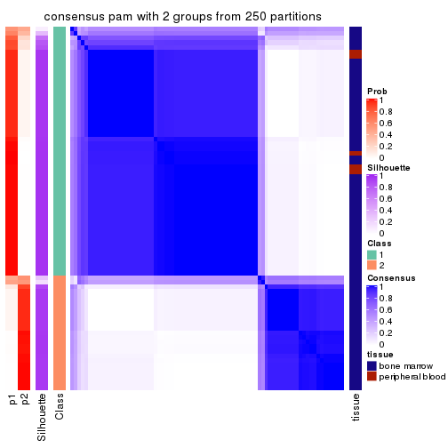</p>

</div>
<div id='tab-CV-pam-consensus-heatmap-2'>
<pre><code class="r">consensus_heatmap(res, k = 3)
</code></pre>

<p>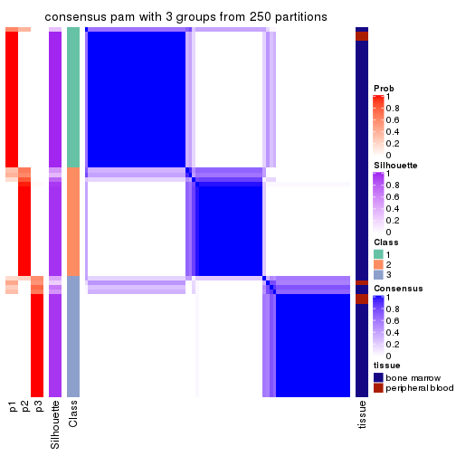</p>

</div>
<div id='tab-CV-pam-consensus-heatmap-3'>
<pre><code class="r">consensus_heatmap(res, k = 4)
</code></pre>

<p>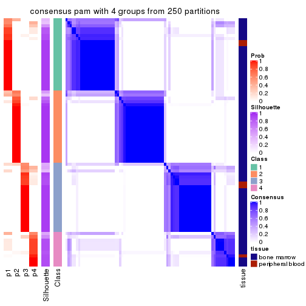</p>

</div>
<div id='tab-CV-pam-consensus-heatmap-4'>
<pre><code class="r">consensus_heatmap(res, k = 5)
</code></pre>

<p>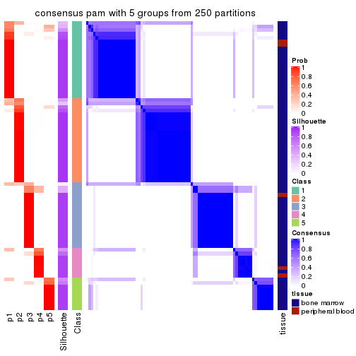</p>

</div>
<div id='tab-CV-pam-consensus-heatmap-5'>
<pre><code class="r">consensus_heatmap(res, k = 6)
</code></pre>

<p>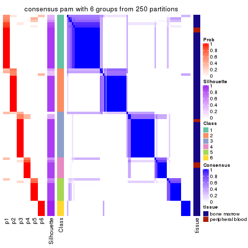</p>

</div>
</div>

Heatmaps for the membership of samples in all partitions to see how consistent they are:


<script>
$( function() {
	$( '#tabs-CV-pam-membership-heatmap' ).tabs();
} );
</script>
<div id='tabs-CV-pam-membership-heatmap'>
<ul>
<li><a href='#tab-CV-pam-membership-heatmap-1'>k = 2</a></li>
<li><a href='#tab-CV-pam-membership-heatmap-2'>k = 3</a></li>
<li><a href='#tab-CV-pam-membership-heatmap-3'>k = 4</a></li>
<li><a href='#tab-CV-pam-membership-heatmap-4'>k = 5</a></li>
<li><a href='#tab-CV-pam-membership-heatmap-5'>k = 6</a></li>
</ul>
<div id='tab-CV-pam-membership-heatmap-1'>
<pre><code class="r">membership_heatmap(res, k = 2)
</code></pre>

<p>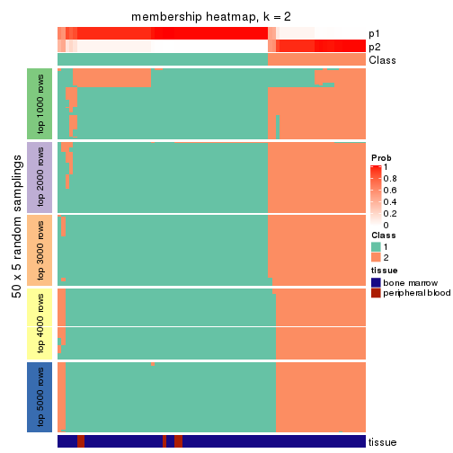</p>

</div>
<div id='tab-CV-pam-membership-heatmap-2'>
<pre><code class="r">membership_heatmap(res, k = 3)
</code></pre>

<p>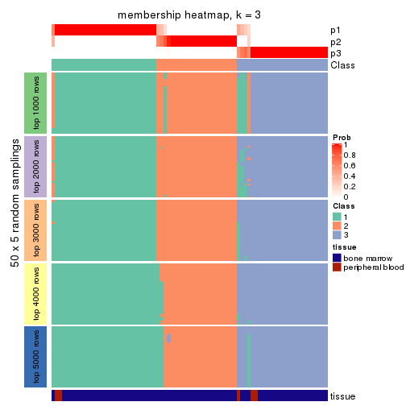</p>

</div>
<div id='tab-CV-pam-membership-heatmap-3'>
<pre><code class="r">membership_heatmap(res, k = 4)
</code></pre>

<p>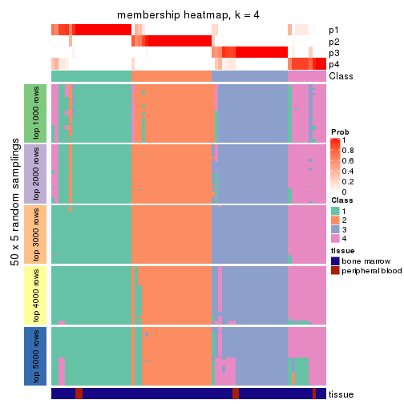</p>

</div>
<div id='tab-CV-pam-membership-heatmap-4'>
<pre><code class="r">membership_heatmap(res, k = 5)
</code></pre>

<p>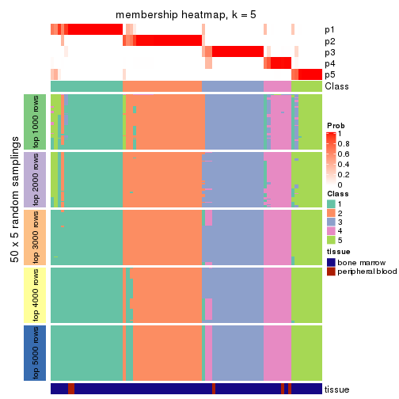</p>

</div>
<div id='tab-CV-pam-membership-heatmap-5'>
<pre><code class="r">membership_heatmap(res, k = 6)
</code></pre>

<p>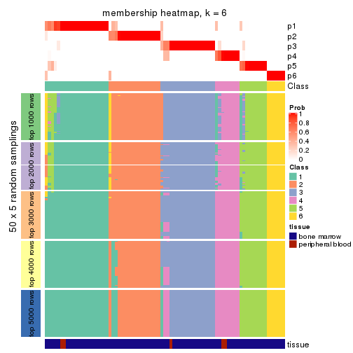</p>

</div>
</div>

As soon as we have had the classes for columns, we can look for signatures
which are significantly different between classes which can be candidate marks
for certain classes. Following are the heatmaps for signatures.


Signature heatmaps where rows are scaled:


<script>
$( function() {
	$( '#tabs-CV-pam-get-signatures' ).tabs();
} );
</script>
<div id='tabs-CV-pam-get-signatures'>
<ul>
<li><a href='#tab-CV-pam-get-signatures-1'>k = 2</a></li>
<li><a href='#tab-CV-pam-get-signatures-2'>k = 3</a></li>
<li><a href='#tab-CV-pam-get-signatures-3'>k = 4</a></li>
<li><a href='#tab-CV-pam-get-signatures-4'>k = 5</a></li>
<li><a href='#tab-CV-pam-get-signatures-5'>k = 6</a></li>
</ul>
<div id='tab-CV-pam-get-signatures-1'>
<pre><code class="r">get_signatures(res, k = 2)
</code></pre>

<p>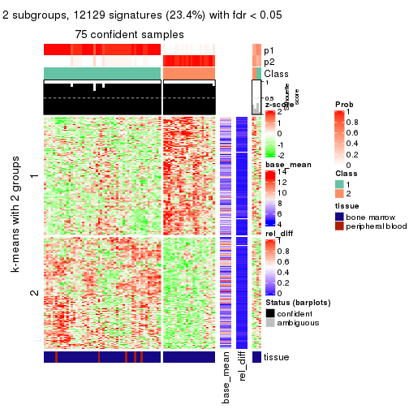</p>

</div>
<div id='tab-CV-pam-get-signatures-2'>
<pre><code class="r">get_signatures(res, k = 3)
</code></pre>

<p>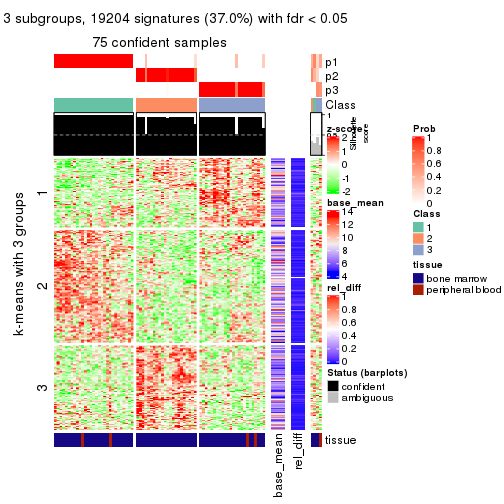</p>

</div>
<div id='tab-CV-pam-get-signatures-3'>
<pre><code class="r">get_signatures(res, k = 4)
</code></pre>

<p>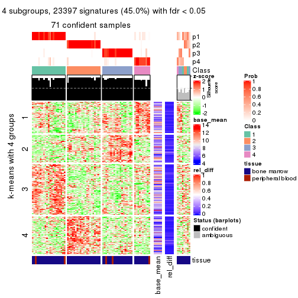</p>

</div>
<div id='tab-CV-pam-get-signatures-4'>
<pre><code class="r">get_signatures(res, k = 5)
</code></pre>

<p>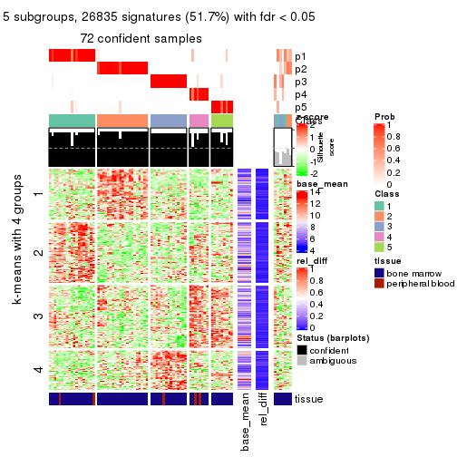</p>

</div>
<div id='tab-CV-pam-get-signatures-5'>
<pre><code class="r">get_signatures(res, k = 6)
</code></pre>

<p>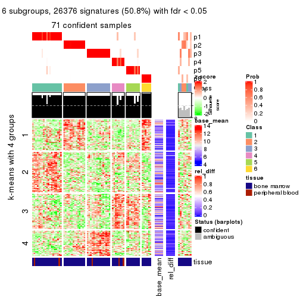</p>

</div>
</div>


Signature heatmaps where rows are not scaled:


<script>
$( function() {
	$( '#tabs-CV-pam-get-signatures-no-scale' ).tabs();
} );
</script>
<div id='tabs-CV-pam-get-signatures-no-scale'>
<ul>
<li><a href='#tab-CV-pam-get-signatures-no-scale-1'>k = 2</a></li>
<li><a href='#tab-CV-pam-get-signatures-no-scale-2'>k = 3</a></li>
<li><a href='#tab-CV-pam-get-signatures-no-scale-3'>k = 4</a></li>
<li><a href='#tab-CV-pam-get-signatures-no-scale-4'>k = 5</a></li>
<li><a href='#tab-CV-pam-get-signatures-no-scale-5'>k = 6</a></li>
</ul>
<div id='tab-CV-pam-get-signatures-no-scale-1'>
<pre><code class="r">get_signatures(res, k = 2, scale_rows = FALSE)
</code></pre>

<p>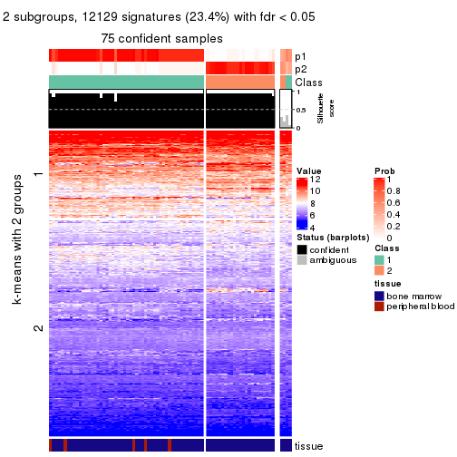</p>

</div>
<div id='tab-CV-pam-get-signatures-no-scale-2'>
<pre><code class="r">get_signatures(res, k = 3, scale_rows = FALSE)
</code></pre>

<p>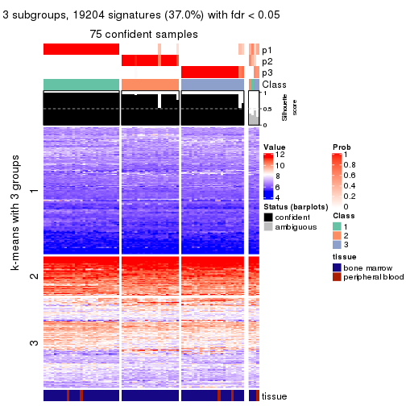</p>

</div>
<div id='tab-CV-pam-get-signatures-no-scale-3'>
<pre><code class="r">get_signatures(res, k = 4, scale_rows = FALSE)
</code></pre>

<p>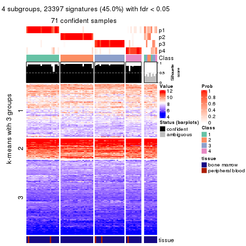</p>

</div>
<div id='tab-CV-pam-get-signatures-no-scale-4'>
<pre><code class="r">get_signatures(res, k = 5, scale_rows = FALSE)
</code></pre>

<p>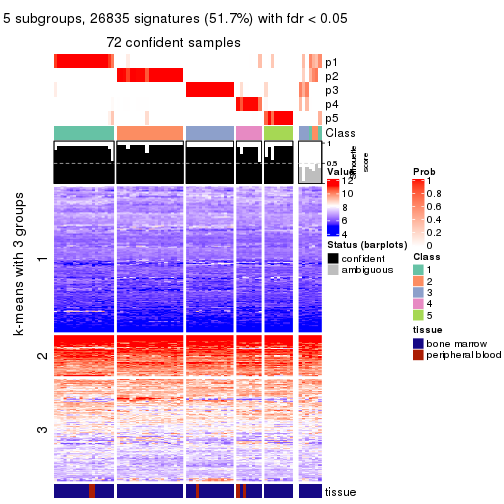</p>

</div>
<div id='tab-CV-pam-get-signatures-no-scale-5'>
<pre><code class="r">get_signatures(res, k = 6, scale_rows = FALSE)
</code></pre>

<p>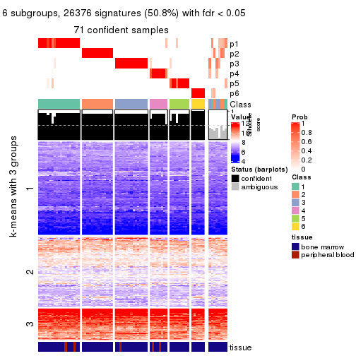</p>

</div>
</div>


Compare the overlap of signatures from different k:

```r
compare_signatures(res)
```

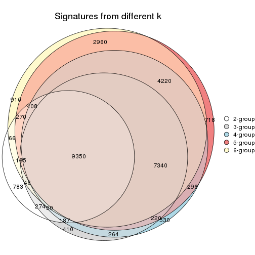

`get_signature()` returns a data frame invisibly. TO get the list of signatures, the function
call should be assigned to a variable explicitly. In following code, if `plot` argument is set
to `FALSE`, no heatmap is plotted while only the differential analysis is performed.

```r
# code only for demonstration
tb = get_signature(res, k = ..., plot = FALSE)
```

An example of the output of `tb` is:

```
#>   which_row         fdr    mean_1    mean_2 scaled_mean_1 scaled_mean_2 km
#> 1        38 0.042760348  8.373488  9.131774    -0.5533452     0.5164555  1
#> 2        40 0.018707592  7.106213  8.469186    -0.6173731     0.5762149  1
#> 3        55 0.019134737 10.221463 11.207825    -0.6159697     0.5749050  1
#> 4        59 0.006059896  5.921854  7.869574    -0.6899429     0.6439467  1
#> 5        60 0.018055526  8.928898 10.211722    -0.6204761     0.5791110  1
#> 6        98 0.009384629 15.714769 14.887706     0.6635654    -0.6193277  2
...
```

The columns in `tb` are:

1. `which_row`: row indices corresponding to the input matrix.
2. `fdr`: FDR for the differential test. 
3. `mean_x`: The mean value in group x.
4. `scaled_mean_x`: The mean value in group x after rows are scaled.
5. `km`: Row groups if k-means clustering is applied to rows.


UMAP plot which shows how samples are separated.


<script>
$( function() {
	$( '#tabs-CV-pam-dimension-reduction' ).tabs();
} );
</script>
<div id='tabs-CV-pam-dimension-reduction'>
<ul>
<li><a href='#tab-CV-pam-dimension-reduction-1'>k = 2</a></li>
<li><a href='#tab-CV-pam-dimension-reduction-2'>k = 3</a></li>
<li><a href='#tab-CV-pam-dimension-reduction-3'>k = 4</a></li>
<li><a href='#tab-CV-pam-dimension-reduction-4'>k = 5</a></li>
<li><a href='#tab-CV-pam-dimension-reduction-5'>k = 6</a></li>
</ul>
<div id='tab-CV-pam-dimension-reduction-1'>
<pre><code class="r">dimension_reduction(res, k = 2, method = &quot;UMAP&quot;)
</code></pre>

<p>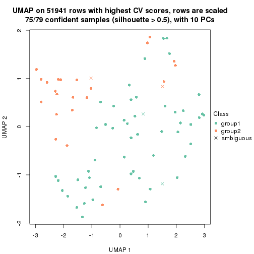</p>

</div>
<div id='tab-CV-pam-dimension-reduction-2'>
<pre><code class="r">dimension_reduction(res, k = 3, method = &quot;UMAP&quot;)
</code></pre>

<p>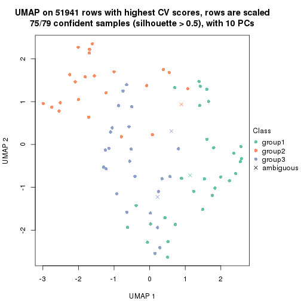</p>

</div>
<div id='tab-CV-pam-dimension-reduction-3'>
<pre><code class="r">dimension_reduction(res, k = 4, method = &quot;UMAP&quot;)
</code></pre>

<p>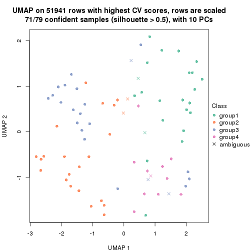</p>

</div>
<div id='tab-CV-pam-dimension-reduction-4'>
<pre><code class="r">dimension_reduction(res, k = 5, method = &quot;UMAP&quot;)
</code></pre>

<p>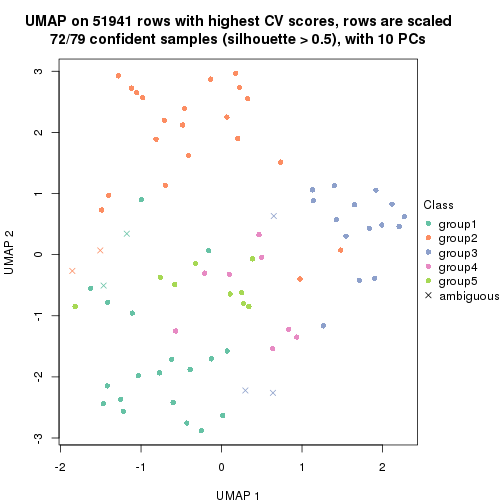</p>

</div>
<div id='tab-CV-pam-dimension-reduction-5'>
<pre><code class="r">dimension_reduction(res, k = 6, method = &quot;UMAP&quot;)
</code></pre>

<p>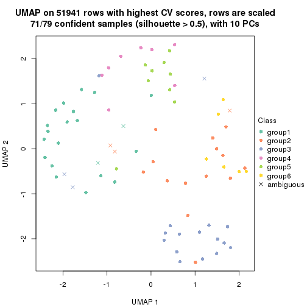</p>

</div>
</div>


Following heatmap shows how subgroups are split when increasing `k`:

```r
collect_classes(res)
```

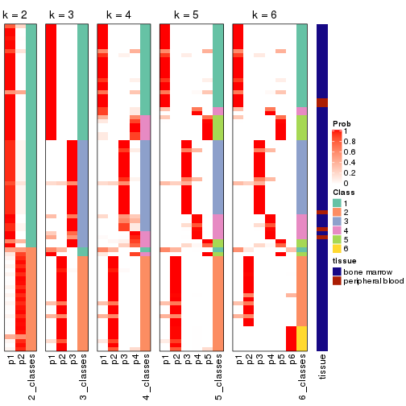


Test correlation between subgroups and known annotations. If the known
annotation is numeric, one-way ANOVA test is applied, and if the known
annotation is discrete, chi-squared contingency table test is applied.

```r
test_to_known_factors(res)
```

```
#>         n tissue(p) k
#> CV:pam 75     0.300 2
#> CV:pam 75     0.405 3
#> CV:pam 71     0.517 4
#> CV:pam 72     0.155 5
#> CV:pam 71     0.261 6
```


If matrix rows can be associated to genes, consider to use `GO_Enrichment(res,
...)` to perform function enrichment for the signature genes.


 

---------------------------------------------------


### CV:mclust


The object with results only for a single top-value method and a single partition method 
can be extracted as:

```r
res = res_list["CV", "mclust"]
# you can also extract it by
# res = res_list["CV:mclust"]
```

A summary of `res` and all the functions that can be applied to it:

```r
res
```

```
#> A 'ConsensusPartition' object with k = 2, 3, 4, 5, 6.
#>   On a matrix with 51941 rows and 79 columns.
#>   Top rows (1000, 2000, 3000, 4000, 5000) are extracted by 'CV' method.
#>   Subgroups are detected by 'mclust' method.
#>   Performed in total 1250 partitions by row resampling.
#>   Best k for subgroups seems to be 4.
#> 
#> Following methods can be applied to this 'ConsensusPartition' object:
#>  [1] "cola_report"             "collect_classes"         "collect_plots"          
#>  [4] "collect_stats"           "colnames"                "compare_signatures"     
#>  [7] "consensus_heatmap"       "dimension_reduction"     "functional_enrichment"  
#> [10] "get_anno_col"            "get_anno"                "get_classes"            
#> [13] "get_consensus"           "get_matrix"              "get_membership"         
#> [16] "get_param"               "get_signatures"          "get_stats"              
#> [19] "is_best_k"               "is_stable_k"             "membership_heatmap"     
#> [22] "ncol"                    "nrow"                    "plot_ecdf"              
#> [25] "rownames"                "select_partition_number" "show"                   
#> [28] "suggest_best_k"          "test_to_known_factors"
```

`collect_plots()` function collects all the plots made from `res` for all `k` (number of partitions)
into one single page to provide an easy and fast comparison between different `k`.

```r
collect_plots(res)
```

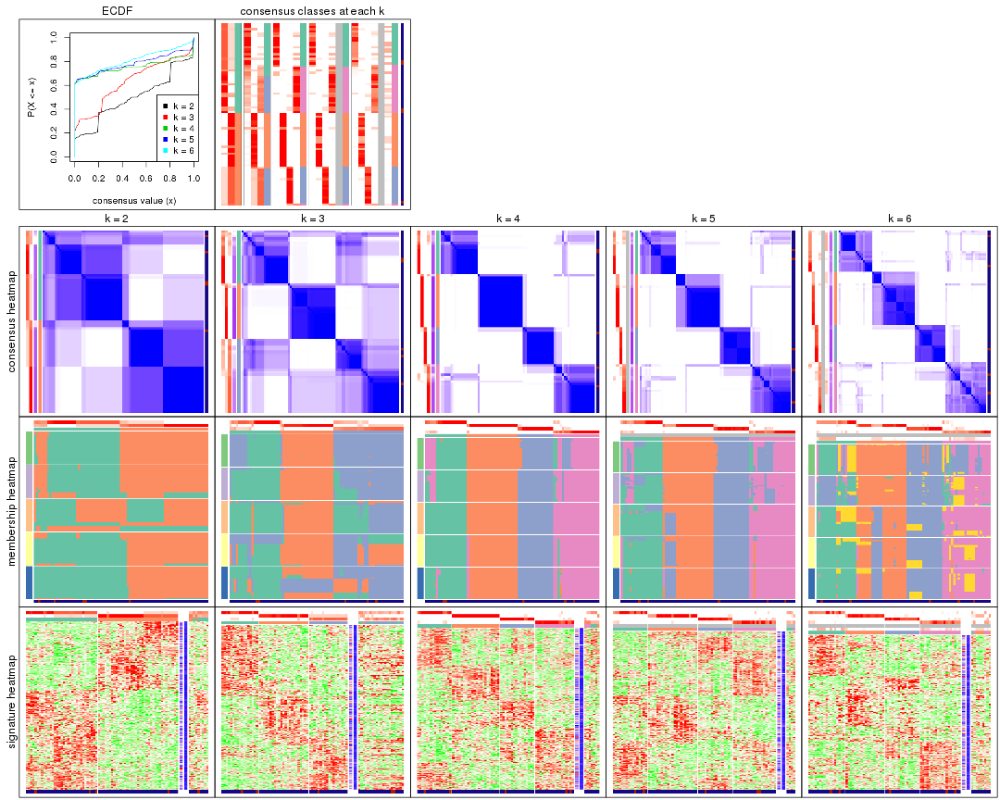

The plots are:

- The first row: a plot of the ECDF (Empirical cumulative distribution
  function) curves of the consensus matrix for each `k` and the heatmap of
  predicted classes for each `k`.
- The second row: heatmaps of the consensus matrix for each `k`.
- The third row: heatmaps of the membership matrix for each `k`.
- The fouth row: heatmaps of the signatures for each `k`.

All the plots in panels can be made by individual functions and they are
plotted later in this section.

`select_partition_number()` produces several plots showing different
statistics for choosing "optimized" `k`. There are following statistics:

- ECDF curves of the consensus matrix for each `k`;
- 1-PAC. [The PAC
  score](https://en.wikipedia.org/wiki/Consensus_clustering#Over-interpretation_potential_of_consensus_clustering)
  measures the proportion of the ambiguous subgrouping.
- Mean silhouette score.
- Concordance. The mean probability of fiting the consensus class ids in all
  partitions.
- Area increased. Denote $A_k$ as the area under the ECDF curve for current
  `k`, the area increased is defined as $A_k - A_{k-1}$.
- Rand index. The percent of pairs of samples that are both in a same cluster
  or both are not in a same cluster in the partition of k and k-1.
- Jaccard index. The ratio of pairs of samples are both in a same cluster in
  the partition of k and k-1 and the pairs of samples are both in a same
  cluster in the partition k or k-1.

The detailed explanations of these statistics can be found in [the cola
vignette](http://bioconductor.org/packages/devel/bioc/vignettes/cola/inst/doc/cola.html#toc_13).

Generally speaking, lower PAC score, higher mean silhouette score or higher
concordance corresponds to better partition. Rand index and Jaccard index
measure how similar the current partition is compared to partition with `k-1`.
If they are too similar, we won't accept `k` is better than `k-1`.

```r
select_partition_number(res)
```

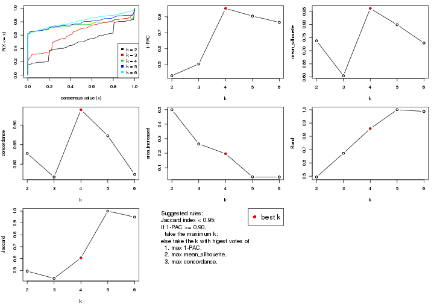

The numeric values for all these statistics can be obtained by `get_stats()`.

```r
get_stats(res)
```

```
#>   k 1-PAC mean_silhouette concordance area_increased  Rand Jaccard
#> 2 2 0.431           0.738       0.827         0.4993 0.494   0.494
#> 3 3 0.504           0.605       0.767         0.2638 0.673   0.433
#> 4 4 0.853           0.861       0.939         0.1964 0.858   0.606
#> 5 5 0.805           0.799       0.873         0.0367 1.000   1.000
#> 6 6 0.765           0.729       0.774         0.0358 0.987   0.950
```

`suggest_best_k()` suggests the best $k$ based on these statistics. The rules are as follows:

- All $k$ with Jaccard index larger than 0.95 are removed because the increase of
  the partition number does not provides enough extra information. If all $k$ are removed,
  the best $k$ is assigned by `NA`.
- For $k$ with 1-PAC larger than 0.9, the maximal $k$ is taken as the "best k". Other $k$ is called "optional k".
- If it does not fit the second rule. The $k$ with the highest vote of highest
  1-PAC, mean silhouette and concordance is taken as the "best k".

```r
suggest_best_k(res)
```

```
#> [1] 4
```


Following shows the table of the partitions (You need to click the **show/hide
code output** link to see it). The membership matrix (columns with name `p*`)
is inferred by
[`clue::cl_consensus()`](https://www.rdocumentation.org/link/cl_consensus?package=clue)
function with the `SE` method. Basically the value in the membership matrix
represents the probability to belong to a certain group. The finall class
label for an item is determined with the group with highest probability it
belongs to.

In `get_classes()` function, the entropy is calculated from the membership
matrix and the silhouette score is calculated from the consensus matrix.


<script>
$( function() {
	$( '#tabs-CV-mclust-get-classes' ).tabs();
} );
</script>
<div id='tabs-CV-mclust-get-classes'>
<ul>
<li><a href='#tab-CV-mclust-get-classes-1'>k = 2</a></li>
<li><a href='#tab-CV-mclust-get-classes-2'>k = 3</a></li>
<li><a href='#tab-CV-mclust-get-classes-3'>k = 4</a></li>
<li><a href='#tab-CV-mclust-get-classes-4'>k = 5</a></li>
<li><a href='#tab-CV-mclust-get-classes-5'>k = 6</a></li>
</ul>

<div id='tab-CV-mclust-get-classes-1'>
<p><a id='tab-CV-mclust-get-classes-1-a' style='color:#0366d6' href='#'>show/hide code output</a></p>
<pre><code class="r">cbind(get_classes(res, k = 2), get_membership(res, k = 2))
</code></pre>

<pre><code>#&gt;           class entropy silhouette    p1    p2
#&gt; GSM316652     2   0.714     0.8158 0.196 0.804
#&gt; GSM316653     1   0.000     0.7779 1.000 0.000
#&gt; GSM316654     1   0.000     0.7779 1.000 0.000
#&gt; GSM316655     1   0.714     0.8204 0.804 0.196
#&gt; GSM316656     1   0.980     0.4889 0.584 0.416
#&gt; GSM316657     1   0.714     0.8204 0.804 0.196
#&gt; GSM316658     2   0.000     0.8432 0.000 1.000
#&gt; GSM316659     2   0.000     0.8432 0.000 1.000
#&gt; GSM316660     1   0.714     0.8204 0.804 0.196
#&gt; GSM316661     1   0.278     0.7493 0.952 0.048
#&gt; GSM316662     2   0.714     0.8158 0.196 0.804
#&gt; GSM316663     1   0.988    -0.0874 0.564 0.436
#&gt; GSM316664     1   0.224     0.7887 0.964 0.036
#&gt; GSM316665     2   0.000     0.8432 0.000 1.000
#&gt; GSM316666     2   0.714     0.8158 0.196 0.804
#&gt; GSM316667     2   0.000     0.8432 0.000 1.000
#&gt; GSM316668     2   0.714     0.8158 0.196 0.804
#&gt; GSM316669     1   0.000     0.7779 1.000 0.000
#&gt; GSM316670     2   0.714     0.8158 0.196 0.804
#&gt; GSM316671     2   0.714     0.8158 0.196 0.804
#&gt; GSM316672     1   0.781     0.7972 0.768 0.232
#&gt; GSM316673     1   0.714     0.8204 0.804 0.196
#&gt; GSM316674     2   0.714     0.8158 0.196 0.804
#&gt; GSM316676     2   0.714     0.8158 0.196 0.804
#&gt; GSM316677     1   0.118     0.7838 0.984 0.016
#&gt; GSM316678     2   0.000     0.8432 0.000 1.000
#&gt; GSM316679     1   0.714     0.8204 0.804 0.196
#&gt; GSM316680     1   0.714     0.8204 0.804 0.196
#&gt; GSM316681     2   0.714     0.8158 0.196 0.804
#&gt; GSM316682     1   0.000     0.7779 1.000 0.000
#&gt; GSM316683     1   0.000     0.7779 1.000 0.000
#&gt; GSM316684     2   0.000     0.8432 0.000 1.000
#&gt; GSM316685     2   0.714     0.8158 0.196 0.804
#&gt; GSM316686     1   0.932     0.3391 0.652 0.348
#&gt; GSM316687     1   0.988    -0.0874 0.564 0.436
#&gt; GSM316688     2   0.932     0.1471 0.348 0.652
#&gt; GSM316689     1   0.714     0.8204 0.804 0.196
#&gt; GSM316690     2   0.714     0.8158 0.196 0.804
#&gt; GSM316691     2   0.000     0.8432 0.000 1.000
#&gt; GSM316692     2   0.714     0.8158 0.196 0.804
#&gt; GSM316693     1   0.000     0.7779 1.000 0.000
#&gt; GSM316694     2   0.714     0.8158 0.196 0.804
#&gt; GSM316696     1   0.714     0.8204 0.804 0.196
#&gt; GSM316697     2   0.714     0.8158 0.196 0.804
#&gt; GSM316698     2   0.000     0.8432 0.000 1.000
#&gt; GSM316699     2   0.000     0.8432 0.000 1.000
#&gt; GSM316700     1   0.000     0.7779 1.000 0.000
#&gt; GSM316701     1   0.000     0.7779 1.000 0.000
#&gt; GSM316703     2   0.000     0.8432 0.000 1.000
#&gt; GSM316704     2   0.000     0.8432 0.000 1.000
#&gt; GSM316705     1   0.714     0.8204 0.804 0.196
#&gt; GSM316706     2   0.000     0.8432 0.000 1.000
#&gt; GSM316707     2   0.000     0.8432 0.000 1.000
#&gt; GSM316708     2   0.925     0.1757 0.340 0.660
#&gt; GSM316709     2   0.714     0.8158 0.196 0.804
#&gt; GSM316710     1   0.000     0.7779 1.000 0.000
#&gt; GSM316711     2   0.000     0.8432 0.000 1.000
#&gt; GSM316713     1   0.714     0.8204 0.804 0.196
#&gt; GSM316714     2   0.861     0.7343 0.284 0.716
#&gt; GSM316715     1   0.714     0.8204 0.804 0.196
#&gt; GSM316716     2   0.000     0.8432 0.000 1.000
#&gt; GSM316717     1   0.714     0.8204 0.804 0.196
#&gt; GSM316718     2   0.921     0.1895 0.336 0.664
#&gt; GSM316719     1   0.714     0.8204 0.804 0.196
#&gt; GSM316720     1   0.714     0.8204 0.804 0.196
#&gt; GSM316721     2   0.000     0.8432 0.000 1.000
#&gt; GSM316722     1   0.706     0.8200 0.808 0.192
#&gt; GSM316723     2   0.000     0.8432 0.000 1.000
#&gt; GSM316724     2   0.000     0.8432 0.000 1.000
#&gt; GSM316726     2   0.000     0.8432 0.000 1.000
#&gt; GSM316727     1   0.714     0.8204 0.804 0.196
#&gt; GSM316728     1   0.988    -0.0874 0.564 0.436
#&gt; GSM316729     1   0.827     0.7719 0.740 0.260
#&gt; GSM316730     2   0.000     0.8432 0.000 1.000
#&gt; GSM316675     2   0.714     0.8158 0.196 0.804
#&gt; GSM316695     1   0.714     0.8204 0.804 0.196
#&gt; GSM316702     1   0.961     0.1056 0.616 0.384
#&gt; GSM316712     1   0.714     0.8204 0.804 0.196
#&gt; GSM316725     1   0.000     0.7779 1.000 0.000
</code></pre>

<script>
$('#tab-CV-mclust-get-classes-1-a').parent().next().next().hide();
$('#tab-CV-mclust-get-classes-1-a').click(function(){
  $('#tab-CV-mclust-get-classes-1-a').parent().next().next().toggle();
  return(false);
});
</script>
</div>

<div id='tab-CV-mclust-get-classes-2'>
<p><a id='tab-CV-mclust-get-classes-2-a' style='color:#0366d6' href='#'>show/hide code output</a></p>
<pre><code class="r">cbind(get_classes(res, k = 3), get_membership(res, k = 3))
</code></pre>

<pre><code>#&gt;           class entropy silhouette    p1    p2    p3
#&gt; GSM316652     3  0.4887     0.6341 0.000 0.228 0.772
#&gt; GSM316653     3  0.6291    -0.1146 0.468 0.000 0.532
#&gt; GSM316654     3  0.6062     0.1628 0.384 0.000 0.616
#&gt; GSM316655     1  0.6244     0.3323 0.560 0.000 0.440
#&gt; GSM316656     1  0.9827    -0.3210 0.380 0.244 0.376
#&gt; GSM316657     1  0.0000     0.7678 1.000 0.000 0.000
#&gt; GSM316658     2  0.0000     0.9378 0.000 1.000 0.000
#&gt; GSM316659     2  0.0000     0.9378 0.000 1.000 0.000
#&gt; GSM316660     1  0.0000     0.7678 1.000 0.000 0.000
#&gt; GSM316661     3  0.5431     0.3266 0.284 0.000 0.716
#&gt; GSM316662     3  0.5138     0.6099 0.000 0.252 0.748
#&gt; GSM316663     3  0.8787     0.5438 0.188 0.228 0.584
#&gt; GSM316664     1  0.5810     0.4860 0.664 0.000 0.336
#&gt; GSM316665     2  0.0000     0.9378 0.000 1.000 0.000
#&gt; GSM316666     3  0.4887     0.6341 0.000 0.228 0.772
#&gt; GSM316667     2  0.1529     0.9250 0.040 0.960 0.000
#&gt; GSM316668     3  0.5138     0.6099 0.000 0.252 0.748
#&gt; GSM316669     3  0.6280    -0.0881 0.460 0.000 0.540
#&gt; GSM316670     3  0.5465     0.5613 0.000 0.288 0.712
#&gt; GSM316671     3  0.4887     0.6341 0.000 0.228 0.772
#&gt; GSM316672     1  0.6204     0.1030 0.576 0.424 0.000
#&gt; GSM316673     1  0.0000     0.7678 1.000 0.000 0.000
#&gt; GSM316674     3  0.4887     0.6341 0.000 0.228 0.772
#&gt; GSM316676     3  0.4887     0.6341 0.000 0.228 0.772
#&gt; GSM316677     1  0.5988     0.4363 0.632 0.000 0.368
#&gt; GSM316678     2  0.1529     0.9250 0.040 0.960 0.000
#&gt; GSM316679     1  0.4702     0.6101 0.788 0.000 0.212
#&gt; GSM316680     1  0.4702     0.6101 0.788 0.000 0.212
#&gt; GSM316681     3  0.4887     0.6341 0.000 0.228 0.772
#&gt; GSM316682     3  0.5926     0.2321 0.356 0.000 0.644
#&gt; GSM316683     3  0.5926     0.2321 0.356 0.000 0.644
#&gt; GSM316684     2  0.0237     0.9374 0.004 0.996 0.000
#&gt; GSM316685     2  0.5529     0.5397 0.000 0.704 0.296
#&gt; GSM316686     3  0.6483    -0.0886 0.452 0.004 0.544
#&gt; GSM316687     3  0.8343     0.4390 0.256 0.132 0.612
#&gt; GSM316688     2  0.9556    -0.2450 0.372 0.432 0.196
#&gt; GSM316689     1  0.0000     0.7678 1.000 0.000 0.000
#&gt; GSM316690     3  0.4887     0.6341 0.000 0.228 0.772
#&gt; GSM316691     2  0.1832     0.9222 0.036 0.956 0.008
#&gt; GSM316692     3  0.4887     0.6341 0.000 0.228 0.772
#&gt; GSM316693     3  0.5926     0.2321 0.356 0.000 0.644
#&gt; GSM316694     3  0.4887     0.6341 0.000 0.228 0.772
#&gt; GSM316696     1  0.0000     0.7678 1.000 0.000 0.000
#&gt; GSM316697     3  0.4887     0.6341 0.000 0.228 0.772
#&gt; GSM316698     2  0.1529     0.9250 0.040 0.960 0.000
#&gt; GSM316699     2  0.0000     0.9378 0.000 1.000 0.000
#&gt; GSM316700     3  0.5926     0.2321 0.356 0.000 0.644
#&gt; GSM316701     3  0.6168     0.0782 0.412 0.000 0.588
#&gt; GSM316703     2  0.0000     0.9378 0.000 1.000 0.000
#&gt; GSM316704     2  0.0000     0.9378 0.000 1.000 0.000
#&gt; GSM316705     1  0.5098     0.6012 0.752 0.000 0.248
#&gt; GSM316706     2  0.0592     0.9331 0.012 0.988 0.000
#&gt; GSM316707     2  0.0000     0.9378 0.000 1.000 0.000
#&gt; GSM316708     2  0.1529     0.9250 0.040 0.960 0.000
#&gt; GSM316709     3  0.4887     0.6341 0.000 0.228 0.772
#&gt; GSM316710     3  0.5926     0.2321 0.356 0.000 0.644
#&gt; GSM316711     2  0.0000     0.9378 0.000 1.000 0.000
#&gt; GSM316713     1  0.0000     0.7678 1.000 0.000 0.000
#&gt; GSM316714     3  0.4887     0.6341 0.000 0.228 0.772
#&gt; GSM316715     1  0.0000     0.7678 1.000 0.000 0.000
#&gt; GSM316716     2  0.0000     0.9378 0.000 1.000 0.000
#&gt; GSM316717     1  0.4702     0.6101 0.788 0.000 0.212
#&gt; GSM316718     2  0.1529     0.9250 0.040 0.960 0.000
#&gt; GSM316719     1  0.1163     0.7563 0.972 0.000 0.028
#&gt; GSM316720     1  0.0000     0.7678 1.000 0.000 0.000
#&gt; GSM316721     2  0.0000     0.9378 0.000 1.000 0.000
#&gt; GSM316722     1  0.4702     0.6101 0.788 0.000 0.212
#&gt; GSM316723     2  0.0237     0.9374 0.004 0.996 0.000
#&gt; GSM316724     2  0.1031     0.9314 0.024 0.976 0.000
#&gt; GSM316726     2  0.0000     0.9378 0.000 1.000 0.000
#&gt; GSM316727     1  0.0000     0.7678 1.000 0.000 0.000
#&gt; GSM316728     3  0.8386     0.5680 0.156 0.224 0.620
#&gt; GSM316729     1  0.9049     0.1178 0.556 0.232 0.212
#&gt; GSM316730     2  0.1529     0.9250 0.040 0.960 0.000
#&gt; GSM316675     3  0.4887     0.6341 0.000 0.228 0.772
#&gt; GSM316695     1  0.0000     0.7678 1.000 0.000 0.000
#&gt; GSM316702     3  0.5431     0.3266 0.284 0.000 0.716
#&gt; GSM316712     1  0.0000     0.7678 1.000 0.000 0.000
#&gt; GSM316725     3  0.5926     0.2321 0.356 0.000 0.644
</code></pre>

<script>
$('#tab-CV-mclust-get-classes-2-a').parent().next().next().hide();
$('#tab-CV-mclust-get-classes-2-a').click(function(){
  $('#tab-CV-mclust-get-classes-2-a').parent().next().next().toggle();
  return(false);
});
</script>
</div>

<div id='tab-CV-mclust-get-classes-3'>
<p><a id='tab-CV-mclust-get-classes-3-a' style='color:#0366d6' href='#'>show/hide code output</a></p>
<pre><code class="r">cbind(get_classes(res, k = 4), get_membership(res, k = 4))
</code></pre>

<pre><code>#&gt;           class entropy silhouette    p1    p2    p3    p4
#&gt; GSM316652     3  0.0000      0.973 0.000 0.000 1.000 0.000
#&gt; GSM316653     4  0.0000      0.872 0.000 0.000 0.000 1.000
#&gt; GSM316654     4  0.0000      0.872 0.000 0.000 0.000 1.000
#&gt; GSM316655     4  0.0000      0.872 0.000 0.000 0.000 1.000
#&gt; GSM316656     4  0.3542      0.746 0.028 0.120 0.000 0.852
#&gt; GSM316657     1  0.0000      0.880 1.000 0.000 0.000 0.000
#&gt; GSM316658     2  0.0000      0.980 0.000 1.000 0.000 0.000
#&gt; GSM316659     2  0.0000      0.980 0.000 1.000 0.000 0.000
#&gt; GSM316660     1  0.0000      0.880 1.000 0.000 0.000 0.000
#&gt; GSM316661     4  0.0000      0.872 0.000 0.000 0.000 1.000
#&gt; GSM316662     3  0.0000      0.973 0.000 0.000 1.000 0.000
#&gt; GSM316663     4  0.0817      0.862 0.000 0.000 0.024 0.976
#&gt; GSM316664     4  0.4761      0.424 0.372 0.000 0.000 0.628
#&gt; GSM316665     2  0.0000      0.980 0.000 1.000 0.000 0.000
#&gt; GSM316666     3  0.0000      0.973 0.000 0.000 1.000 0.000
#&gt; GSM316667     2  0.0000      0.980 0.000 1.000 0.000 0.000
#&gt; GSM316668     3  0.0000      0.973 0.000 0.000 1.000 0.000
#&gt; GSM316669     4  0.0000      0.872 0.000 0.000 0.000 1.000
#&gt; GSM316670     3  0.2868      0.833 0.000 0.136 0.864 0.000
#&gt; GSM316671     3  0.0000      0.973 0.000 0.000 1.000 0.000
#&gt; GSM316672     1  0.0921      0.863 0.972 0.028 0.000 0.000
#&gt; GSM316673     1  0.1211      0.855 0.960 0.000 0.000 0.040
#&gt; GSM316674     3  0.0000      0.973 0.000 0.000 1.000 0.000
#&gt; GSM316676     3  0.0000      0.973 0.000 0.000 1.000 0.000
#&gt; GSM316677     4  0.4730      0.247 0.364 0.000 0.000 0.636
#&gt; GSM316678     2  0.0000      0.980 0.000 1.000 0.000 0.000
#&gt; GSM316679     1  0.3610      0.742 0.800 0.000 0.000 0.200
#&gt; GSM316680     1  0.4830      0.476 0.608 0.000 0.000 0.392
#&gt; GSM316681     3  0.0000      0.973 0.000 0.000 1.000 0.000
#&gt; GSM316682     4  0.0000      0.872 0.000 0.000 0.000 1.000
#&gt; GSM316683     4  0.0000      0.872 0.000 0.000 0.000 1.000
#&gt; GSM316684     2  0.0000      0.980 0.000 1.000 0.000 0.000
#&gt; GSM316685     3  0.3610      0.748 0.000 0.200 0.800 0.000
#&gt; GSM316686     4  0.4008      0.648 0.244 0.000 0.000 0.756
#&gt; GSM316687     4  0.3610      0.745 0.000 0.000 0.200 0.800
#&gt; GSM316688     2  0.4843      0.313 0.000 0.604 0.000 0.396
#&gt; GSM316689     1  0.0000      0.880 1.000 0.000 0.000 0.000
#&gt; GSM316690     3  0.0000      0.973 0.000 0.000 1.000 0.000
#&gt; GSM316691     2  0.0000      0.980 0.000 1.000 0.000 0.000
#&gt; GSM316692     3  0.0000      0.973 0.000 0.000 1.000 0.000
#&gt; GSM316693     4  0.0000      0.872 0.000 0.000 0.000 1.000
#&gt; GSM316694     3  0.0000      0.973 0.000 0.000 1.000 0.000
#&gt; GSM316696     1  0.0000      0.880 1.000 0.000 0.000 0.000
#&gt; GSM316697     3  0.0000      0.973 0.000 0.000 1.000 0.000
#&gt; GSM316698     2  0.0000      0.980 0.000 1.000 0.000 0.000
#&gt; GSM316699     2  0.0000      0.980 0.000 1.000 0.000 0.000
#&gt; GSM316700     4  0.0000      0.872 0.000 0.000 0.000 1.000
#&gt; GSM316701     4  0.0000      0.872 0.000 0.000 0.000 1.000
#&gt; GSM316703     2  0.0000      0.980 0.000 1.000 0.000 0.000
#&gt; GSM316704     2  0.0000      0.980 0.000 1.000 0.000 0.000
#&gt; GSM316705     1  0.3610      0.676 0.800 0.000 0.000 0.200
#&gt; GSM316706     2  0.0000      0.980 0.000 1.000 0.000 0.000
#&gt; GSM316707     2  0.0000      0.980 0.000 1.000 0.000 0.000
#&gt; GSM316708     2  0.0000      0.980 0.000 1.000 0.000 0.000
#&gt; GSM316709     3  0.0000      0.973 0.000 0.000 1.000 0.000
#&gt; GSM316710     4  0.0000      0.872 0.000 0.000 0.000 1.000
#&gt; GSM316711     2  0.0000      0.980 0.000 1.000 0.000 0.000
#&gt; GSM316713     1  0.0000      0.880 1.000 0.000 0.000 0.000
#&gt; GSM316714     4  0.4855      0.399 0.000 0.000 0.400 0.600
#&gt; GSM316715     1  0.0000      0.880 1.000 0.000 0.000 0.000
#&gt; GSM316716     2  0.0000      0.980 0.000 1.000 0.000 0.000
#&gt; GSM316717     1  0.4008      0.697 0.756 0.000 0.000 0.244
#&gt; GSM316718     2  0.0000      0.980 0.000 1.000 0.000 0.000
#&gt; GSM316719     1  0.0000      0.880 1.000 0.000 0.000 0.000
#&gt; GSM316720     1  0.0000      0.880 1.000 0.000 0.000 0.000
#&gt; GSM316721     2  0.0000      0.980 0.000 1.000 0.000 0.000
#&gt; GSM316722     1  0.4855      0.460 0.600 0.000 0.000 0.400
#&gt; GSM316723     2  0.0000      0.980 0.000 1.000 0.000 0.000
#&gt; GSM316724     2  0.0000      0.980 0.000 1.000 0.000 0.000
#&gt; GSM316726     2  0.0000      0.980 0.000 1.000 0.000 0.000
#&gt; GSM316727     1  0.0000      0.880 1.000 0.000 0.000 0.000
#&gt; GSM316728     4  0.3610      0.745 0.000 0.000 0.200 0.800
#&gt; GSM316729     1  0.5582      0.435 0.576 0.024 0.000 0.400
#&gt; GSM316730     2  0.0000      0.980 0.000 1.000 0.000 0.000
#&gt; GSM316675     3  0.0000      0.973 0.000 0.000 1.000 0.000
#&gt; GSM316695     1  0.0000      0.880 1.000 0.000 0.000 0.000
#&gt; GSM316702     4  0.3610      0.745 0.000 0.000 0.200 0.800
#&gt; GSM316712     1  0.0000      0.880 1.000 0.000 0.000 0.000
#&gt; GSM316725     4  0.0000      0.872 0.000 0.000 0.000 1.000
</code></pre>

<script>
$('#tab-CV-mclust-get-classes-3-a').parent().next().next().hide();
$('#tab-CV-mclust-get-classes-3-a').click(function(){
  $('#tab-CV-mclust-get-classes-3-a').parent().next().next().toggle();
  return(false);
});
</script>
</div>

<div id='tab-CV-mclust-get-classes-4'>
<p><a id='tab-CV-mclust-get-classes-4-a' style='color:#0366d6' href='#'>show/hide code output</a></p>
<pre><code class="r">cbind(get_classes(res, k = 5), get_membership(res, k = 5))
</code></pre>

<pre><code>#&gt;           class entropy silhouette    p1    p2    p3    p4 p5
#&gt; GSM316652     3  0.0609     0.9641 0.000 0.000 0.980 0.000 NA
#&gt; GSM316653     4  0.0000     0.8376 0.000 0.000 0.000 1.000 NA
#&gt; GSM316654     4  0.0000     0.8376 0.000 0.000 0.000 1.000 NA
#&gt; GSM316655     4  0.1851     0.7933 0.000 0.000 0.000 0.912 NA
#&gt; GSM316656     4  0.6339     0.2605 0.008 0.360 0.000 0.500 NA
#&gt; GSM316657     1  0.3074     0.8094 0.804 0.000 0.000 0.000 NA
#&gt; GSM316658     2  0.0510     0.8837 0.000 0.984 0.000 0.000 NA
#&gt; GSM316659     2  0.4307     0.5805 0.000 0.504 0.000 0.000 NA
#&gt; GSM316660     1  0.0000     0.8263 1.000 0.000 0.000 0.000 NA
#&gt; GSM316661     4  0.0290     0.8371 0.000 0.000 0.000 0.992 NA
#&gt; GSM316662     3  0.0609     0.9641 0.000 0.000 0.980 0.000 NA
#&gt; GSM316663     4  0.2416     0.8082 0.000 0.000 0.012 0.888 NA
#&gt; GSM316664     4  0.3730     0.6073 0.288 0.000 0.000 0.712 NA
#&gt; GSM316665     2  0.0000     0.8906 0.000 1.000 0.000 0.000 NA
#&gt; GSM316666     3  0.0000     0.9646 0.000 0.000 1.000 0.000 NA
#&gt; GSM316667     2  0.0000     0.8906 0.000 1.000 0.000 0.000 NA
#&gt; GSM316668     3  0.0609     0.9641 0.000 0.000 0.980 0.000 NA
#&gt; GSM316669     4  0.0000     0.8376 0.000 0.000 0.000 1.000 NA
#&gt; GSM316670     3  0.2886     0.8027 0.000 0.148 0.844 0.000 NA
#&gt; GSM316671     3  0.0609     0.9641 0.000 0.000 0.980 0.000 NA
#&gt; GSM316672     1  0.3427     0.8070 0.796 0.012 0.000 0.000 NA
#&gt; GSM316673     1  0.0404     0.8238 0.988 0.000 0.000 0.012 NA
#&gt; GSM316674     3  0.0609     0.9641 0.000 0.000 0.980 0.000 NA
#&gt; GSM316676     3  0.0000     0.9646 0.000 0.000 1.000 0.000 NA
#&gt; GSM316677     4  0.0162     0.8363 0.004 0.000 0.000 0.996 NA
#&gt; GSM316678     2  0.0000     0.8906 0.000 1.000 0.000 0.000 NA
#&gt; GSM316679     1  0.5354     0.7097 0.664 0.000 0.000 0.208 NA
#&gt; GSM316680     1  0.6262     0.6013 0.520 0.000 0.000 0.176 NA
#&gt; GSM316681     3  0.0609     0.9641 0.000 0.000 0.980 0.000 NA
#&gt; GSM316682     4  0.2813     0.7953 0.000 0.000 0.000 0.832 NA
#&gt; GSM316683     4  0.2813     0.7953 0.000 0.000 0.000 0.832 NA
#&gt; GSM316684     2  0.0000     0.8906 0.000 1.000 0.000 0.000 NA
#&gt; GSM316685     3  0.3160     0.7442 0.000 0.188 0.808 0.000 NA
#&gt; GSM316686     4  0.5881     0.5836 0.208 0.000 0.012 0.636 NA
#&gt; GSM316687     4  0.4982     0.7145 0.000 0.000 0.200 0.700 NA
#&gt; GSM316688     2  0.4166     0.6894 0.004 0.780 0.000 0.160 NA
#&gt; GSM316689     1  0.2929     0.8115 0.820 0.000 0.000 0.000 NA
#&gt; GSM316690     3  0.0000     0.9646 0.000 0.000 1.000 0.000 NA
#&gt; GSM316691     2  0.0000     0.8906 0.000 1.000 0.000 0.000 NA
#&gt; GSM316692     3  0.0000     0.9646 0.000 0.000 1.000 0.000 NA
#&gt; GSM316693     4  0.0162     0.8374 0.000 0.000 0.000 0.996 NA
#&gt; GSM316694     3  0.0000     0.9646 0.000 0.000 1.000 0.000 NA
#&gt; GSM316696     1  0.3074     0.8094 0.804 0.000 0.000 0.000 NA
#&gt; GSM316697     3  0.0510     0.9642 0.000 0.000 0.984 0.000 NA
#&gt; GSM316698     2  0.0000     0.8906 0.000 1.000 0.000 0.000 NA
#&gt; GSM316699     2  0.0000     0.8906 0.000 1.000 0.000 0.000 NA
#&gt; GSM316700     4  0.0162     0.8376 0.000 0.000 0.000 0.996 NA
#&gt; GSM316701     4  0.2813     0.7953 0.000 0.000 0.000 0.832 NA
#&gt; GSM316703     2  0.4307     0.5805 0.000 0.504 0.000 0.000 NA
#&gt; GSM316704     2  0.4307     0.5805 0.000 0.504 0.000 0.000 NA
#&gt; GSM316705     1  0.6324     0.0763 0.432 0.000 0.000 0.412 NA
#&gt; GSM316706     2  0.4307     0.5805 0.000 0.504 0.000 0.000 NA
#&gt; GSM316707     2  0.0000     0.8906 0.000 1.000 0.000 0.000 NA
#&gt; GSM316708     2  0.0290     0.8859 0.000 0.992 0.000 0.000 NA
#&gt; GSM316709     3  0.0000     0.9646 0.000 0.000 1.000 0.000 NA
#&gt; GSM316710     4  0.0000     0.8376 0.000 0.000 0.000 1.000 NA
#&gt; GSM316711     2  0.4307     0.5805 0.000 0.504 0.000 0.000 NA
#&gt; GSM316713     1  0.0000     0.8263 1.000 0.000 0.000 0.000 NA
#&gt; GSM316714     4  0.5613     0.5581 0.000 0.000 0.308 0.592 NA
#&gt; GSM316715     1  0.0000     0.8263 1.000 0.000 0.000 0.000 NA
#&gt; GSM316716     2  0.0000     0.8906 0.000 1.000 0.000 0.000 NA
#&gt; GSM316717     1  0.4730     0.6746 0.688 0.000 0.000 0.260 NA
#&gt; GSM316718     2  0.0000     0.8906 0.000 1.000 0.000 0.000 NA
#&gt; GSM316719     1  0.0000     0.8263 1.000 0.000 0.000 0.000 NA
#&gt; GSM316720     1  0.0000     0.8263 1.000 0.000 0.000 0.000 NA
#&gt; GSM316721     2  0.0000     0.8906 0.000 1.000 0.000 0.000 NA
#&gt; GSM316722     1  0.5759     0.4856 0.520 0.000 0.000 0.388 NA
#&gt; GSM316723     2  0.0000     0.8906 0.000 1.000 0.000 0.000 NA
#&gt; GSM316724     2  0.0000     0.8906 0.000 1.000 0.000 0.000 NA
#&gt; GSM316726     2  0.0000     0.8906 0.000 1.000 0.000 0.000 NA
#&gt; GSM316727     1  0.0000     0.8263 1.000 0.000 0.000 0.000 NA
#&gt; GSM316728     4  0.4982     0.7145 0.000 0.000 0.200 0.700 NA
#&gt; GSM316729     1  0.7951     0.4375 0.424 0.104 0.000 0.252 NA
#&gt; GSM316730     2  0.0000     0.8906 0.000 1.000 0.000 0.000 NA
#&gt; GSM316675     3  0.0000     0.9646 0.000 0.000 1.000 0.000 NA
#&gt; GSM316695     1  0.3074     0.8094 0.804 0.000 0.000 0.000 NA
#&gt; GSM316702     4  0.4918     0.7221 0.000 0.000 0.192 0.708 NA
#&gt; GSM316712     1  0.0000     0.8263 1.000 0.000 0.000 0.000 NA
#&gt; GSM316725     4  0.0000     0.8376 0.000 0.000 0.000 1.000 NA
</code></pre>

<script>
$('#tab-CV-mclust-get-classes-4-a').parent().next().next().hide();
$('#tab-CV-mclust-get-classes-4-a').click(function(){
  $('#tab-CV-mclust-get-classes-4-a').parent().next().next().toggle();
  return(false);
});
</script>
</div>

<div id='tab-CV-mclust-get-classes-5'>
<p><a id='tab-CV-mclust-get-classes-5-a' style='color:#0366d6' href='#'>show/hide code output</a></p>
<pre><code class="r">cbind(get_classes(res, k = 6), get_membership(res, k = 6))
</code></pre>

<pre><code>#&gt;           class entropy silhouette    p1    p2    p3    p4 p5    p6
#&gt; GSM316652     3  0.2340      0.901 0.000 0.000 0.852 0.000 NA 0.000
#&gt; GSM316653     4  0.0405      0.729 0.000 0.000 0.000 0.988 NA 0.008
#&gt; GSM316654     4  0.0000      0.730 0.000 0.000 0.000 1.000 NA 0.000
#&gt; GSM316655     4  0.4191      0.655 0.088 0.000 0.000 0.732 NA 0.000
#&gt; GSM316656     4  0.6387      0.487 0.064 0.112 0.000 0.520 NA 0.004
#&gt; GSM316657     1  0.0000      0.709 1.000 0.000 0.000 0.000 NA 0.000
#&gt; GSM316658     2  0.2145      0.807 0.000 0.900 0.000 0.000 NA 0.072
#&gt; GSM316659     2  0.5917      0.479 0.000 0.404 0.000 0.000 NA 0.208
#&gt; GSM316660     1  0.3789      0.759 0.584 0.000 0.000 0.000 NA 0.416
#&gt; GSM316661     4  0.3045      0.738 0.000 0.000 0.000 0.840 NA 0.060
#&gt; GSM316662     3  0.2340      0.901 0.000 0.000 0.852 0.000 NA 0.000
#&gt; GSM316663     4  0.5998      0.698 0.000 0.000 0.072 0.600 NA 0.212
#&gt; GSM316664     4  0.5333      0.522 0.048 0.000 0.000 0.504 NA 0.420
#&gt; GSM316665     2  0.0777      0.834 0.000 0.972 0.000 0.000 NA 0.004
#&gt; GSM316666     3  0.0000      0.912 0.000 0.000 1.000 0.000 NA 0.000
#&gt; GSM316667     2  0.1387      0.831 0.000 0.932 0.000 0.000 NA 0.000
#&gt; GSM316668     3  0.2340      0.901 0.000 0.000 0.852 0.000 NA 0.000
#&gt; GSM316669     4  0.0260      0.729 0.000 0.000 0.000 0.992 NA 0.008
#&gt; GSM316670     3  0.3589      0.775 0.000 0.112 0.816 0.000 NA 0.020
#&gt; GSM316671     3  0.2869      0.895 0.000 0.000 0.832 0.000 NA 0.020
#&gt; GSM316672     1  0.3595      0.614 0.796 0.084 0.000 0.000 NA 0.000
#&gt; GSM316673     1  0.5203      0.701 0.548 0.000 0.000 0.104 NA 0.348
#&gt; GSM316674     3  0.2340      0.901 0.000 0.000 0.852 0.000 NA 0.000
#&gt; GSM316676     3  0.0000      0.912 0.000 0.000 1.000 0.000 NA 0.000
#&gt; GSM316677     4  0.1346      0.718 0.024 0.000 0.000 0.952 NA 0.008
#&gt; GSM316678     2  0.1444      0.832 0.000 0.928 0.000 0.000 NA 0.000
#&gt; GSM316679     1  0.4434      0.670 0.740 0.000 0.000 0.172 NA 0.028
#&gt; GSM316680     1  0.4526      0.601 0.656 0.000 0.000 0.052 NA 0.004
#&gt; GSM316681     3  0.2340      0.901 0.000 0.000 0.852 0.000 NA 0.000
#&gt; GSM316682     4  0.5633      0.652 0.000 0.000 0.000 0.532 NA 0.272
#&gt; GSM316683     4  0.5520      0.653 0.000 0.000 0.000 0.560 NA 0.240
#&gt; GSM316684     2  0.0146      0.839 0.000 0.996 0.000 0.000 NA 0.000
#&gt; GSM316685     3  0.2963      0.752 0.000 0.152 0.828 0.000 NA 0.004
#&gt; GSM316686     4  0.6076      0.613 0.204 0.000 0.060 0.608 NA 0.008
#&gt; GSM316687     4  0.6171      0.635 0.000 0.000 0.188 0.592 NA 0.132
#&gt; GSM316688     2  0.6243      0.420 0.028 0.556 0.000 0.240 NA 0.012
#&gt; GSM316689     1  0.0363      0.713 0.988 0.000 0.000 0.000 NA 0.012
#&gt; GSM316690     3  0.0891      0.901 0.000 0.000 0.968 0.000 NA 0.024
#&gt; GSM316691     2  0.1387      0.831 0.000 0.932 0.000 0.000 NA 0.000
#&gt; GSM316692     3  0.0000      0.912 0.000 0.000 1.000 0.000 NA 0.000
#&gt; GSM316693     4  0.3244      0.679 0.000 0.000 0.000 0.732 NA 0.268
#&gt; GSM316694     3  0.0000      0.912 0.000 0.000 1.000 0.000 NA 0.000
#&gt; GSM316696     1  0.0000      0.709 1.000 0.000 0.000 0.000 NA 0.000
#&gt; GSM316697     3  0.1814      0.908 0.000 0.000 0.900 0.000 NA 0.000
#&gt; GSM316698     2  0.0632      0.839 0.000 0.976 0.000 0.000 NA 0.000
#&gt; GSM316699     2  0.0692      0.834 0.000 0.976 0.000 0.000 NA 0.004
#&gt; GSM316700     4  0.2560      0.736 0.000 0.000 0.000 0.872 NA 0.036
#&gt; GSM316701     4  0.3440      0.716 0.000 0.000 0.000 0.776 NA 0.028
#&gt; GSM316703     2  0.5917      0.479 0.000 0.404 0.000 0.000 NA 0.208
#&gt; GSM316704     2  0.5917      0.479 0.000 0.404 0.000 0.000 NA 0.208
#&gt; GSM316705     4  0.4407      0.295 0.484 0.000 0.000 0.492 NA 0.000
#&gt; GSM316706     2  0.5817      0.540 0.000 0.480 0.000 0.000 NA 0.208
#&gt; GSM316707     2  0.0000      0.839 0.000 1.000 0.000 0.000 NA 0.000
#&gt; GSM316708     2  0.2088      0.819 0.028 0.904 0.000 0.000 NA 0.000
#&gt; GSM316709     3  0.0000      0.912 0.000 0.000 1.000 0.000 NA 0.000
#&gt; GSM316710     4  0.3198      0.681 0.000 0.000 0.000 0.740 NA 0.260
#&gt; GSM316711     2  0.5915      0.480 0.000 0.408 0.000 0.000 NA 0.208
#&gt; GSM316713     1  0.3789      0.759 0.584 0.000 0.000 0.000 NA 0.416
#&gt; GSM316714     4  0.6635      0.467 0.000 0.000 0.324 0.468 NA 0.120
#&gt; GSM316715     1  0.3789      0.759 0.584 0.000 0.000 0.000 NA 0.416
#&gt; GSM316716     2  0.0692      0.834 0.000 0.976 0.000 0.000 NA 0.004
#&gt; GSM316717     1  0.6092      0.638 0.568 0.000 0.000 0.248 NA 0.128
#&gt; GSM316718     2  0.1531      0.830 0.004 0.928 0.000 0.000 NA 0.000
#&gt; GSM316719     1  0.3789      0.759 0.584 0.000 0.000 0.000 NA 0.416
#&gt; GSM316720     1  0.3789      0.759 0.584 0.000 0.000 0.000 NA 0.416
#&gt; GSM316721     2  0.0692      0.834 0.000 0.976 0.000 0.000 NA 0.004
#&gt; GSM316722     1  0.4783      0.532 0.616 0.000 0.000 0.308 NA 0.000
#&gt; GSM316723     2  0.0146      0.839 0.000 0.996 0.000 0.000 NA 0.000
#&gt; GSM316724     2  0.0000      0.839 0.000 1.000 0.000 0.000 NA 0.000
#&gt; GSM316726     2  0.0000      0.839 0.000 1.000 0.000 0.000 NA 0.000
#&gt; GSM316727     1  0.3789      0.759 0.584 0.000 0.000 0.000 NA 0.416
#&gt; GSM316728     4  0.6171      0.635 0.000 0.000 0.188 0.592 NA 0.132
#&gt; GSM316729     1  0.7028      0.375 0.408 0.144 0.000 0.096 NA 0.004
#&gt; GSM316730     2  0.1327      0.832 0.000 0.936 0.000 0.000 NA 0.000
#&gt; GSM316675     3  0.0000      0.912 0.000 0.000 1.000 0.000 NA 0.000
#&gt; GSM316695     1  0.0000      0.709 1.000 0.000 0.000 0.000 NA 0.000
#&gt; GSM316702     4  0.6386      0.634 0.000 0.000 0.188 0.564 NA 0.160
#&gt; GSM316712     1  0.3789      0.759 0.584 0.000 0.000 0.000 NA 0.416
#&gt; GSM316725     4  0.3244      0.679 0.000 0.000 0.000 0.732 NA 0.268
</code></pre>

<script>
$('#tab-CV-mclust-get-classes-5-a').parent().next().next().hide();
$('#tab-CV-mclust-get-classes-5-a').click(function(){
  $('#tab-CV-mclust-get-classes-5-a').parent().next().next().toggle();
  return(false);
});
</script>
</div>
</div>

Heatmaps for the consensus matrix. It visualizes the probability of two
samples to be in a same group.


<script>
$( function() {
	$( '#tabs-CV-mclust-consensus-heatmap' ).tabs();
} );
</script>
<div id='tabs-CV-mclust-consensus-heatmap'>
<ul>
<li><a href='#tab-CV-mclust-consensus-heatmap-1'>k = 2</a></li>
<li><a href='#tab-CV-mclust-consensus-heatmap-2'>k = 3</a></li>
<li><a href='#tab-CV-mclust-consensus-heatmap-3'>k = 4</a></li>
<li><a href='#tab-CV-mclust-consensus-heatmap-4'>k = 5</a></li>
<li><a href='#tab-CV-mclust-consensus-heatmap-5'>k = 6</a></li>
</ul>
<div id='tab-CV-mclust-consensus-heatmap-1'>
<pre><code class="r">consensus_heatmap(res, k = 2)
</code></pre>

<p>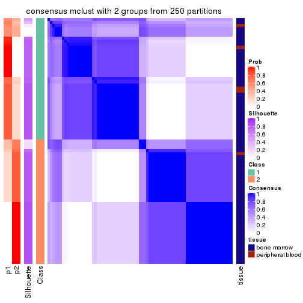</p>

</div>
<div id='tab-CV-mclust-consensus-heatmap-2'>
<pre><code class="r">consensus_heatmap(res, k = 3)
</code></pre>

<p>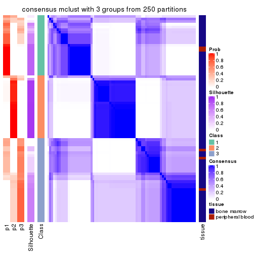</p>

</div>
<div id='tab-CV-mclust-consensus-heatmap-3'>
<pre><code class="r">consensus_heatmap(res, k = 4)
</code></pre>

<p>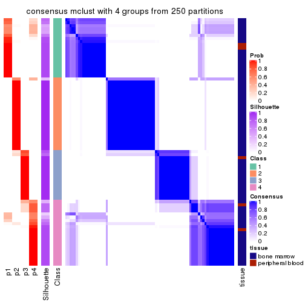</p>

</div>
<div id='tab-CV-mclust-consensus-heatmap-4'>
<pre><code class="r">consensus_heatmap(res, k = 5)
</code></pre>

<p>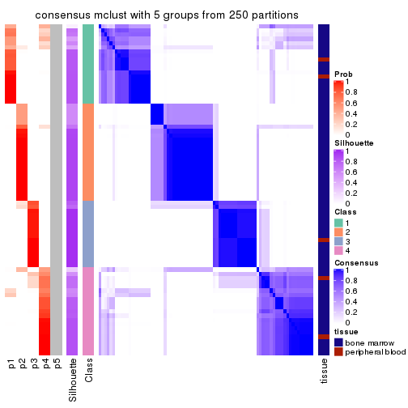</p>

</div>
<div id='tab-CV-mclust-consensus-heatmap-5'>
<pre><code class="r">consensus_heatmap(res, k = 6)
</code></pre>

<p>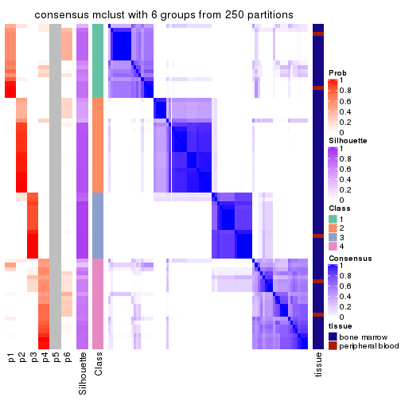</p>

</div>
</div>

Heatmaps for the membership of samples in all partitions to see how consistent they are:


<script>
$( function() {
	$( '#tabs-CV-mclust-membership-heatmap' ).tabs();
} );
</script>
<div id='tabs-CV-mclust-membership-heatmap'>
<ul>
<li><a href='#tab-CV-mclust-membership-heatmap-1'>k = 2</a></li>
<li><a href='#tab-CV-mclust-membership-heatmap-2'>k = 3</a></li>
<li><a href='#tab-CV-mclust-membership-heatmap-3'>k = 4</a></li>
<li><a href='#tab-CV-mclust-membership-heatmap-4'>k = 5</a></li>
<li><a href='#tab-CV-mclust-membership-heatmap-5'>k = 6</a></li>
</ul>
<div id='tab-CV-mclust-membership-heatmap-1'>
<pre><code class="r">membership_heatmap(res, k = 2)
</code></pre>

<p>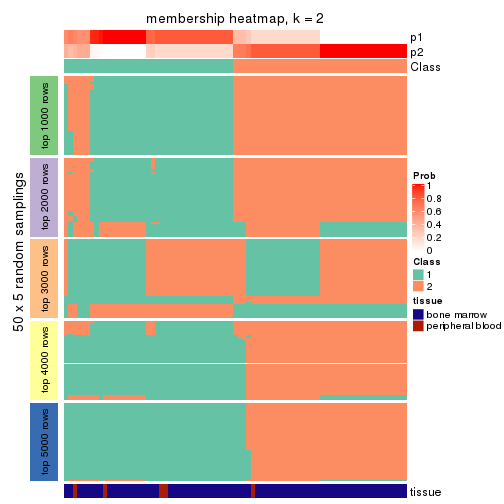</p>

</div>
<div id='tab-CV-mclust-membership-heatmap-2'>
<pre><code class="r">membership_heatmap(res, k = 3)
</code></pre>

<p>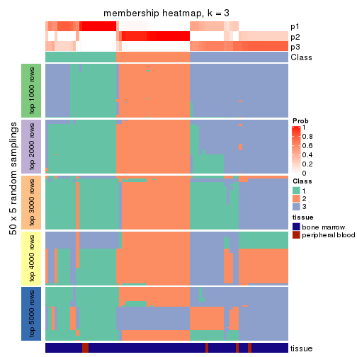</p>

</div>
<div id='tab-CV-mclust-membership-heatmap-3'>
<pre><code class="r">membership_heatmap(res, k = 4)
</code></pre>

<p>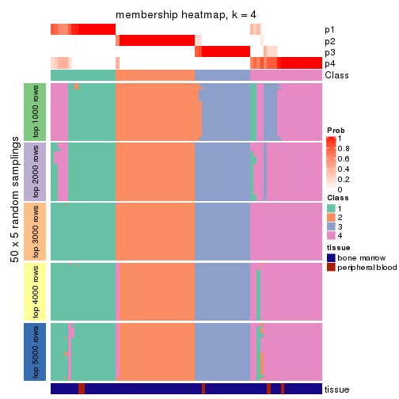</p>

</div>
<div id='tab-CV-mclust-membership-heatmap-4'>
<pre><code class="r">membership_heatmap(res, k = 5)
</code></pre>

<p>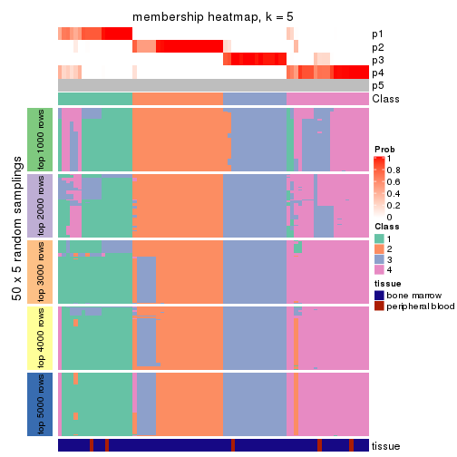</p>

</div>
<div id='tab-CV-mclust-membership-heatmap-5'>
<pre><code class="r">membership_heatmap(res, k = 6)
</code></pre>

<p>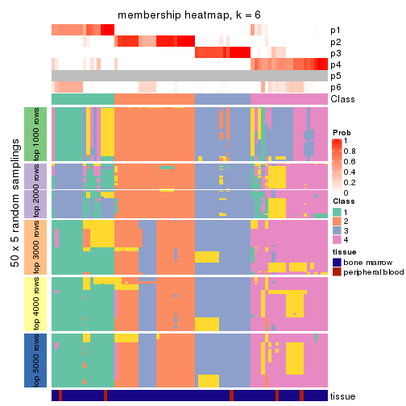</p>

</div>
</div>

As soon as we have had the classes for columns, we can look for signatures
which are significantly different between classes which can be candidate marks
for certain classes. Following are the heatmaps for signatures.


Signature heatmaps where rows are scaled:


<script>
$( function() {
	$( '#tabs-CV-mclust-get-signatures' ).tabs();
} );
</script>
<div id='tabs-CV-mclust-get-signatures'>
<ul>
<li><a href='#tab-CV-mclust-get-signatures-1'>k = 2</a></li>
<li><a href='#tab-CV-mclust-get-signatures-2'>k = 3</a></li>
<li><a href='#tab-CV-mclust-get-signatures-3'>k = 4</a></li>
<li><a href='#tab-CV-mclust-get-signatures-4'>k = 5</a></li>
<li><a href='#tab-CV-mclust-get-signatures-5'>k = 6</a></li>
</ul>
<div id='tab-CV-mclust-get-signatures-1'>
<pre><code class="r">get_signatures(res, k = 2)
</code></pre>

<p>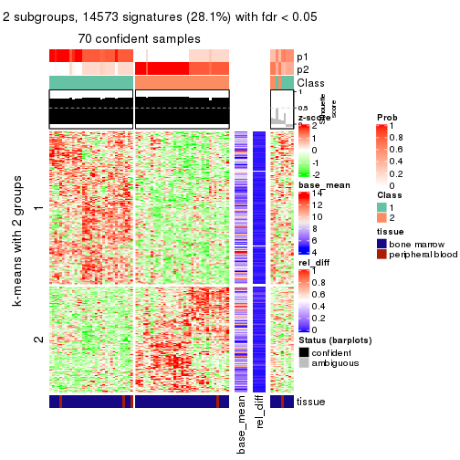</p>

</div>
<div id='tab-CV-mclust-get-signatures-2'>
<pre><code class="r">get_signatures(res, k = 3)
</code></pre>

<p>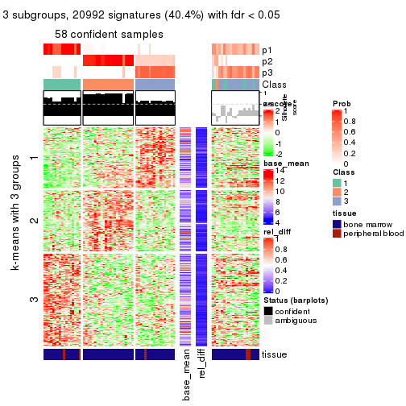</p>

</div>
<div id='tab-CV-mclust-get-signatures-3'>
<pre><code class="r">get_signatures(res, k = 4)
</code></pre>

<p>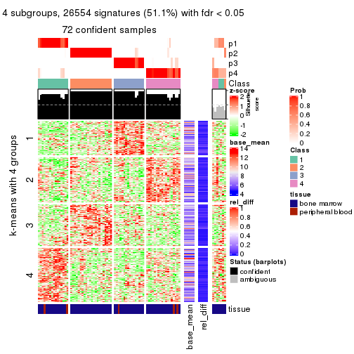</p>

</div>
<div id='tab-CV-mclust-get-signatures-4'>
<pre><code class="r">get_signatures(res, k = 5)
</code></pre>

<p>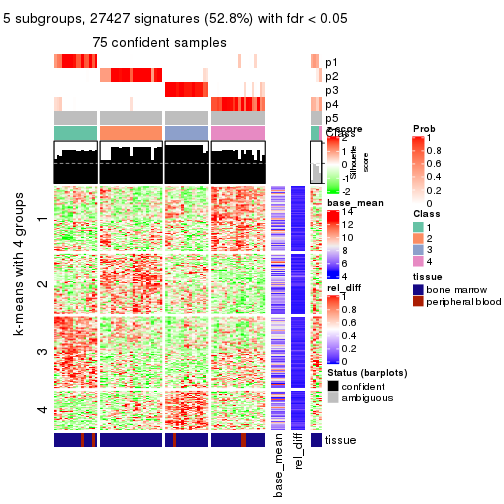</p>

</div>
<div id='tab-CV-mclust-get-signatures-5'>
<pre><code class="r">get_signatures(res, k = 6)
</code></pre>

<p>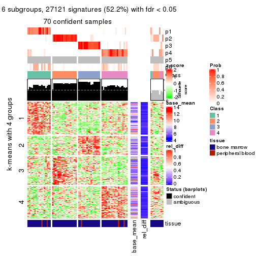</p>

</div>
</div>


Signature heatmaps where rows are not scaled:


<script>
$( function() {
	$( '#tabs-CV-mclust-get-signatures-no-scale' ).tabs();
} );
</script>
<div id='tabs-CV-mclust-get-signatures-no-scale'>
<ul>
<li><a href='#tab-CV-mclust-get-signatures-no-scale-1'>k = 2</a></li>
<li><a href='#tab-CV-mclust-get-signatures-no-scale-2'>k = 3</a></li>
<li><a href='#tab-CV-mclust-get-signatures-no-scale-3'>k = 4</a></li>
<li><a href='#tab-CV-mclust-get-signatures-no-scale-4'>k = 5</a></li>
<li><a href='#tab-CV-mclust-get-signatures-no-scale-5'>k = 6</a></li>
</ul>
<div id='tab-CV-mclust-get-signatures-no-scale-1'>
<pre><code class="r">get_signatures(res, k = 2, scale_rows = FALSE)
</code></pre>

<p>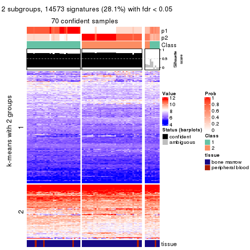</p>

</div>
<div id='tab-CV-mclust-get-signatures-no-scale-2'>
<pre><code class="r">get_signatures(res, k = 3, scale_rows = FALSE)
</code></pre>

<p>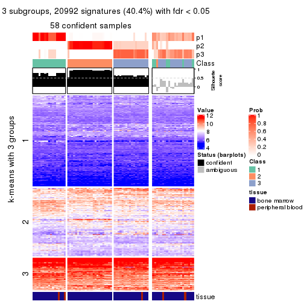</p>

</div>
<div id='tab-CV-mclust-get-signatures-no-scale-3'>
<pre><code class="r">get_signatures(res, k = 4, scale_rows = FALSE)
</code></pre>

<p>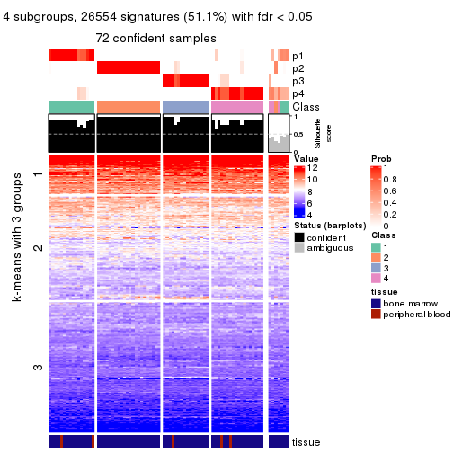</p>

</div>
<div id='tab-CV-mclust-get-signatures-no-scale-4'>
<pre><code class="r">get_signatures(res, k = 5, scale_rows = FALSE)
</code></pre>

<p>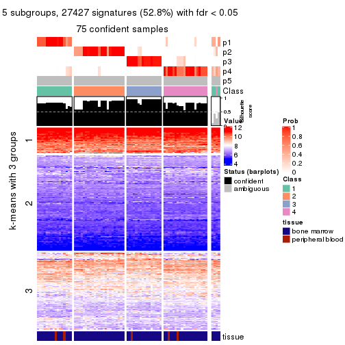</p>

</div>
<div id='tab-CV-mclust-get-signatures-no-scale-5'>
<pre><code class="r">get_signatures(res, k = 6, scale_rows = FALSE)
</code></pre>

<p>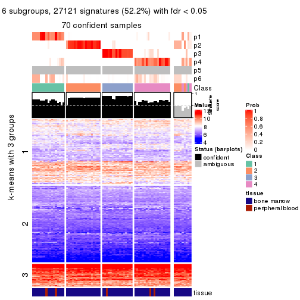</p>

</div>
</div>


Compare the overlap of signatures from different k:

```r
compare_signatures(res)
```

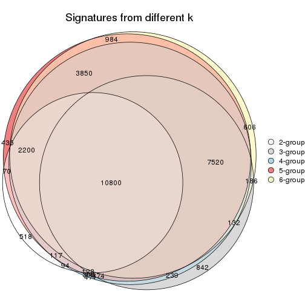

`get_signature()` returns a data frame invisibly. TO get the list of signatures, the function
call should be assigned to a variable explicitly. In following code, if `plot` argument is set
to `FALSE`, no heatmap is plotted while only the differential analysis is performed.

```r
# code only for demonstration
tb = get_signature(res, k = ..., plot = FALSE)
```

An example of the output of `tb` is:

```
#>   which_row         fdr    mean_1    mean_2 scaled_mean_1 scaled_mean_2 km
#> 1        38 0.042760348  8.373488  9.131774    -0.5533452     0.5164555  1
#> 2        40 0.018707592  7.106213  8.469186    -0.6173731     0.5762149  1
#> 3        55 0.019134737 10.221463 11.207825    -0.6159697     0.5749050  1
#> 4        59 0.006059896  5.921854  7.869574    -0.6899429     0.6439467  1
#> 5        60 0.018055526  8.928898 10.211722    -0.6204761     0.5791110  1
#> 6        98 0.009384629 15.714769 14.887706     0.6635654    -0.6193277  2
...
```

The columns in `tb` are:

1. `which_row`: row indices corresponding to the input matrix.
2. `fdr`: FDR for the differential test. 
3. `mean_x`: The mean value in group x.
4. `scaled_mean_x`: The mean value in group x after rows are scaled.
5. `km`: Row groups if k-means clustering is applied to rows.


UMAP plot which shows how samples are separated.


<script>
$( function() {
	$( '#tabs-CV-mclust-dimension-reduction' ).tabs();
} );
</script>
<div id='tabs-CV-mclust-dimension-reduction'>
<ul>
<li><a href='#tab-CV-mclust-dimension-reduction-1'>k = 2</a></li>
<li><a href='#tab-CV-mclust-dimension-reduction-2'>k = 3</a></li>
<li><a href='#tab-CV-mclust-dimension-reduction-3'>k = 4</a></li>
<li><a href='#tab-CV-mclust-dimension-reduction-4'>k = 5</a></li>
<li><a href='#tab-CV-mclust-dimension-reduction-5'>k = 6</a></li>
</ul>
<div id='tab-CV-mclust-dimension-reduction-1'>
<pre><code class="r">dimension_reduction(res, k = 2, method = &quot;UMAP&quot;)
</code></pre>

<p>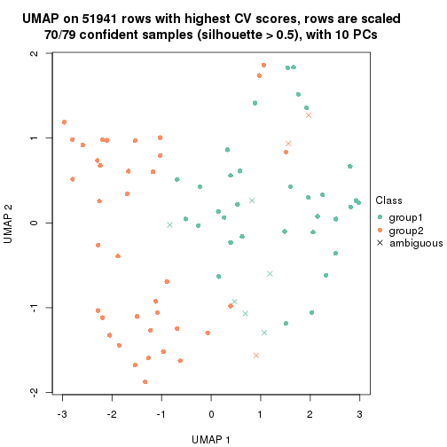</p>

</div>
<div id='tab-CV-mclust-dimension-reduction-2'>
<pre><code class="r">dimension_reduction(res, k = 3, method = &quot;UMAP&quot;)
</code></pre>

<p>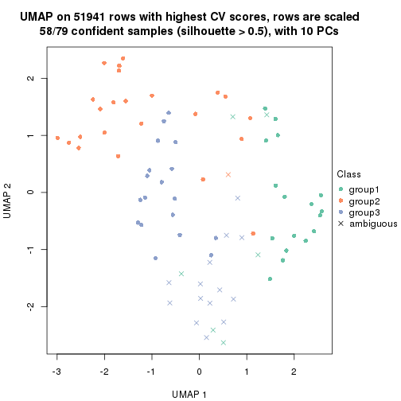</p>

</div>
<div id='tab-CV-mclust-dimension-reduction-3'>
<pre><code class="r">dimension_reduction(res, k = 4, method = &quot;UMAP&quot;)
</code></pre>

<p>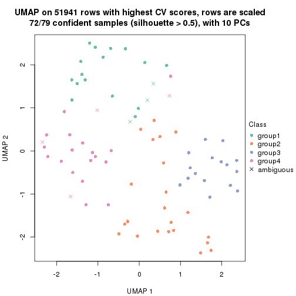</p>

</div>
<div id='tab-CV-mclust-dimension-reduction-4'>
<pre><code class="r">dimension_reduction(res, k = 5, method = &quot;UMAP&quot;)
</code></pre>

<p>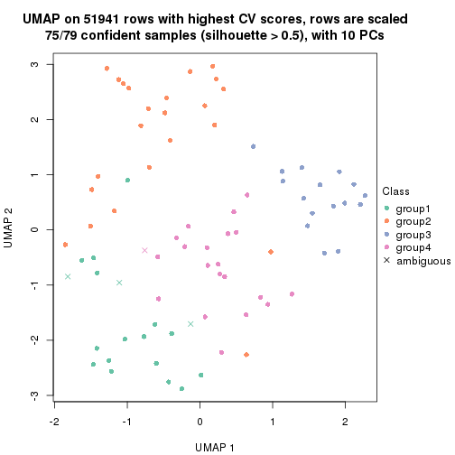</p>

</div>
<div id='tab-CV-mclust-dimension-reduction-5'>
<pre><code class="r">dimension_reduction(res, k = 6, method = &quot;UMAP&quot;)
</code></pre>

<p>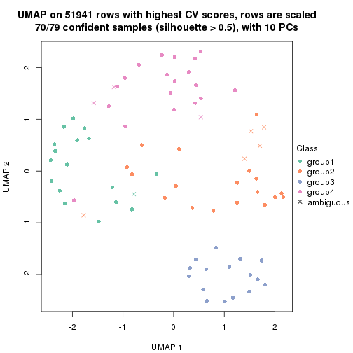</p>

</div>
</div>


Following heatmap shows how subgroups are split when increasing `k`:

```r
collect_classes(res)
```

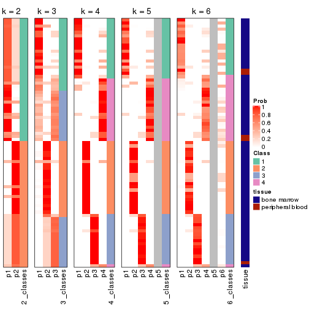


Test correlation between subgroups and known annotations. If the known
annotation is numeric, one-way ANOVA test is applied, and if the known
annotation is discrete, chi-squared contingency table test is applied.

```r
test_to_known_factors(res)
```

```
#>            n tissue(p) k
#> CV:mclust 70     0.526 2
#> CV:mclust 58     0.251 3
#> CV:mclust 72     0.407 4
#> CV:mclust 75     0.411 5
#> CV:mclust 70     0.516 6
```


If matrix rows can be associated to genes, consider to use `GO_Enrichment(res,
...)` to perform function enrichment for the signature genes.


 

---------------------------------------------------


### CV:NMF*


The object with results only for a single top-value method and a single partition method 
can be extracted as:

```r
res = res_list["CV", "NMF"]
# you can also extract it by
# res = res_list["CV:NMF"]
```

A summary of `res` and all the functions that can be applied to it:

```r
res
```

```
#> A 'ConsensusPartition' object with k = 2, 3, 4, 5, 6.
#>   On a matrix with 51941 rows and 79 columns.
#>   Top rows (1000, 2000, 3000, 4000, 5000) are extracted by 'CV' method.
#>   Subgroups are detected by 'NMF' method.
#>   Performed in total 1250 partitions by row resampling.
#>   Best k for subgroups seems to be 5.
#> 
#> Following methods can be applied to this 'ConsensusPartition' object:
#>  [1] "cola_report"             "collect_classes"         "collect_plots"          
#>  [4] "collect_stats"           "colnames"                "compare_signatures"     
#>  [7] "consensus_heatmap"       "dimension_reduction"     "functional_enrichment"  
#> [10] "get_anno_col"            "get_anno"                "get_classes"            
#> [13] "get_consensus"           "get_matrix"              "get_membership"         
#> [16] "get_param"               "get_signatures"          "get_stats"              
#> [19] "is_best_k"               "is_stable_k"             "membership_heatmap"     
#> [22] "ncol"                    "nrow"                    "plot_ecdf"              
#> [25] "rownames"                "select_partition_number" "show"                   
#> [28] "suggest_best_k"          "test_to_known_factors"
```

`collect_plots()` function collects all the plots made from `res` for all `k` (number of partitions)
into one single page to provide an easy and fast comparison between different `k`.

```r
collect_plots(res)
```

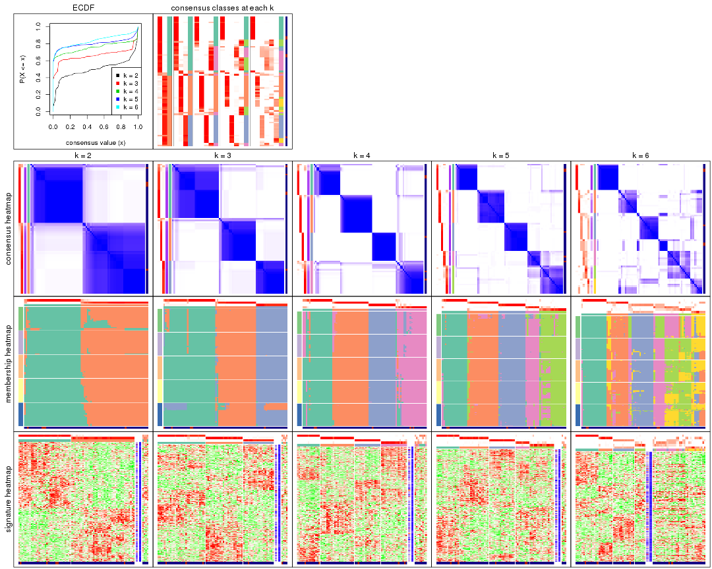

The plots are:

- The first row: a plot of the ECDF (Empirical cumulative distribution
  function) curves of the consensus matrix for each `k` and the heatmap of
  predicted classes for each `k`.
- The second row: heatmaps of the consensus matrix for each `k`.
- The third row: heatmaps of the membership matrix for each `k`.
- The fouth row: heatmaps of the signatures for each `k`.

All the plots in panels can be made by individual functions and they are
plotted later in this section.

`select_partition_number()` produces several plots showing different
statistics for choosing "optimized" `k`. There are following statistics:

- ECDF curves of the consensus matrix for each `k`;
- 1-PAC. [The PAC
  score](https://en.wikipedia.org/wiki/Consensus_clustering#Over-interpretation_potential_of_consensus_clustering)
  measures the proportion of the ambiguous subgrouping.
- Mean silhouette score.
- Concordance. The mean probability of fiting the consensus class ids in all
  partitions.
- Area increased. Denote $A_k$ as the area under the ECDF curve for current
  `k`, the area increased is defined as $A_k - A_{k-1}$.
- Rand index. The percent of pairs of samples that are both in a same cluster
  or both are not in a same cluster in the partition of k and k-1.
- Jaccard index. The ratio of pairs of samples are both in a same cluster in
  the partition of k and k-1 and the pairs of samples are both in a same
  cluster in the partition k or k-1.

The detailed explanations of these statistics can be found in [the cola
vignette](http://bioconductor.org/packages/devel/bioc/vignettes/cola/inst/doc/cola.html#toc_13).

Generally speaking, lower PAC score, higher mean silhouette score or higher
concordance corresponds to better partition. Rand index and Jaccard index
measure how similar the current partition is compared to partition with `k-1`.
If they are too similar, we won't accept `k` is better than `k-1`.

```r
select_partition_number(res)
```

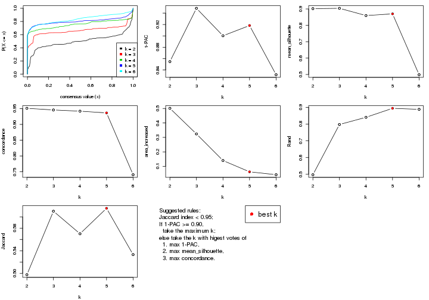

The numeric values for all these statistics can be obtained by `get_stats()`.

```r
get_stats(res)
```

```
#>   k 1-PAC mean_silhouette concordance area_increased  Rand Jaccard
#> 2 2 0.855           0.902       0.951         0.5010 0.498   0.498
#> 3 3 0.948           0.904       0.946         0.3239 0.797   0.610
#> 4 4 0.900           0.860       0.942         0.1400 0.841   0.570
#> 5 5 0.918           0.870       0.936         0.0621 0.894   0.615
#> 6 6 0.832           0.498       0.741         0.0422 0.888   0.533
```

`suggest_best_k()` suggests the best $k$ based on these statistics. The rules are as follows:

- All $k$ with Jaccard index larger than 0.95 are removed because the increase of
  the partition number does not provides enough extra information. If all $k$ are removed,
  the best $k$ is assigned by `NA`.
- For $k$ with 1-PAC larger than 0.9, the maximal $k$ is taken as the "best k". Other $k$ is called "optional k".
- If it does not fit the second rule. The $k$ with the highest vote of highest
  1-PAC, mean silhouette and concordance is taken as the "best k".

```r
suggest_best_k(res)
```

```
#> [1] 5
#> attr(,"optional")
#> [1] 3 4
```

There is also optional best $k$ = 3 4 that is worth to check.

Following shows the table of the partitions (You need to click the **show/hide
code output** link to see it). The membership matrix (columns with name `p*`)
is inferred by
[`clue::cl_consensus()`](https://www.rdocumentation.org/link/cl_consensus?package=clue)
function with the `SE` method. Basically the value in the membership matrix
represents the probability to belong to a certain group. The finall class
label for an item is determined with the group with highest probability it
belongs to.

In `get_classes()` function, the entropy is calculated from the membership
matrix and the silhouette score is calculated from the consensus matrix.


<script>
$( function() {
	$( '#tabs-CV-NMF-get-classes' ).tabs();
} );
</script>
<div id='tabs-CV-NMF-get-classes'>
<ul>
<li><a href='#tab-CV-NMF-get-classes-1'>k = 2</a></li>
<li><a href='#tab-CV-NMF-get-classes-2'>k = 3</a></li>
<li><a href='#tab-CV-NMF-get-classes-3'>k = 4</a></li>
<li><a href='#tab-CV-NMF-get-classes-4'>k = 5</a></li>
<li><a href='#tab-CV-NMF-get-classes-5'>k = 6</a></li>
</ul>

<div id='tab-CV-NMF-get-classes-1'>
<p><a id='tab-CV-NMF-get-classes-1-a' style='color:#0366d6' href='#'>show/hide code output</a></p>
<pre><code class="r">cbind(get_classes(res, k = 2), get_membership(res, k = 2))
</code></pre>

<pre><code>#&gt;           class entropy silhouette    p1    p2
#&gt; GSM316652     2  0.1633      0.934 0.024 0.976
#&gt; GSM316653     1  0.0000      0.965 1.000 0.000
#&gt; GSM316654     1  0.0000      0.965 1.000 0.000
#&gt; GSM316655     1  0.1414      0.952 0.980 0.020
#&gt; GSM316656     2  0.0376      0.932 0.004 0.996
#&gt; GSM316657     1  0.1633      0.949 0.976 0.024
#&gt; GSM316658     2  0.3584      0.918 0.068 0.932
#&gt; GSM316659     2  0.3431      0.920 0.064 0.936
#&gt; GSM316660     1  0.0000      0.965 1.000 0.000
#&gt; GSM316661     1  0.2043      0.938 0.968 0.032
#&gt; GSM316662     2  0.1633      0.934 0.024 0.976
#&gt; GSM316663     2  0.1633      0.934 0.024 0.976
#&gt; GSM316664     1  0.0000      0.965 1.000 0.000
#&gt; GSM316665     2  0.0000      0.932 0.000 1.000
#&gt; GSM316666     2  0.1633      0.934 0.024 0.976
#&gt; GSM316667     2  0.1414      0.932 0.020 0.980
#&gt; GSM316668     2  0.1633      0.934 0.024 0.976
#&gt; GSM316669     1  0.0000      0.965 1.000 0.000
#&gt; GSM316670     2  0.0000      0.932 0.000 1.000
#&gt; GSM316671     2  0.1633      0.934 0.024 0.976
#&gt; GSM316672     1  0.1633      0.949 0.976 0.024
#&gt; GSM316673     1  0.0000      0.965 1.000 0.000
#&gt; GSM316674     2  0.1633      0.934 0.024 0.976
#&gt; GSM316676     2  0.1633      0.934 0.024 0.976
#&gt; GSM316677     1  0.0000      0.965 1.000 0.000
#&gt; GSM316678     2  0.5737      0.860 0.136 0.864
#&gt; GSM316679     1  0.0000      0.965 1.000 0.000
#&gt; GSM316680     1  0.1633      0.949 0.976 0.024
#&gt; GSM316681     2  0.1633      0.934 0.024 0.976
#&gt; GSM316682     1  0.1414      0.952 0.980 0.020
#&gt; GSM316683     1  0.1414      0.952 0.980 0.020
#&gt; GSM316684     2  0.3431      0.920 0.064 0.936
#&gt; GSM316685     2  0.0000      0.932 0.000 1.000
#&gt; GSM316686     1  0.0000      0.965 1.000 0.000
#&gt; GSM316687     1  0.9815      0.250 0.580 0.420
#&gt; GSM316688     2  0.6712      0.814 0.176 0.824
#&gt; GSM316689     1  0.0000      0.965 1.000 0.000
#&gt; GSM316690     2  0.1633      0.934 0.024 0.976
#&gt; GSM316691     2  0.0672      0.933 0.008 0.992
#&gt; GSM316692     2  0.1633      0.934 0.024 0.976
#&gt; GSM316693     1  0.0000      0.965 1.000 0.000
#&gt; GSM316694     2  0.1633      0.934 0.024 0.976
#&gt; GSM316696     1  0.0376      0.963 0.996 0.004
#&gt; GSM316697     2  0.1633      0.934 0.024 0.976
#&gt; GSM316698     2  0.4022      0.910 0.080 0.920
#&gt; GSM316699     2  0.0000      0.932 0.000 1.000
#&gt; GSM316700     1  0.0000      0.965 1.000 0.000
#&gt; GSM316701     1  0.0000      0.965 1.000 0.000
#&gt; GSM316703     2  0.3584      0.918 0.068 0.932
#&gt; GSM316704     2  0.3584      0.918 0.068 0.932
#&gt; GSM316705     1  0.0000      0.965 1.000 0.000
#&gt; GSM316706     1  0.9896      0.135 0.560 0.440
#&gt; GSM316707     2  0.3114      0.923 0.056 0.944
#&gt; GSM316708     2  0.7883      0.733 0.236 0.764
#&gt; GSM316709     2  0.1633      0.934 0.024 0.976
#&gt; GSM316710     1  0.0000      0.965 1.000 0.000
#&gt; GSM316711     2  0.3431      0.920 0.064 0.936
#&gt; GSM316713     1  0.0000      0.965 1.000 0.000
#&gt; GSM316714     2  0.9795      0.314 0.416 0.584
#&gt; GSM316715     1  0.0000      0.965 1.000 0.000
#&gt; GSM316716     2  0.0000      0.932 0.000 1.000
#&gt; GSM316717     1  0.0000      0.965 1.000 0.000
#&gt; GSM316718     2  0.4690      0.897 0.100 0.900
#&gt; GSM316719     1  0.0000      0.965 1.000 0.000
#&gt; GSM316720     1  0.0000      0.965 1.000 0.000
#&gt; GSM316721     2  0.0376      0.932 0.004 0.996
#&gt; GSM316722     1  0.0000      0.965 1.000 0.000
#&gt; GSM316723     2  0.2043      0.930 0.032 0.968
#&gt; GSM316724     2  0.3114      0.923 0.056 0.944
#&gt; GSM316726     2  0.0672      0.933 0.008 0.992
#&gt; GSM316727     1  0.0000      0.965 1.000 0.000
#&gt; GSM316728     2  0.9491      0.446 0.368 0.632
#&gt; GSM316729     2  0.7674      0.744 0.224 0.776
#&gt; GSM316730     2  0.3584      0.918 0.068 0.932
#&gt; GSM316675     2  0.1633      0.934 0.024 0.976
#&gt; GSM316695     1  0.0000      0.965 1.000 0.000
#&gt; GSM316702     1  0.4690      0.872 0.900 0.100
#&gt; GSM316712     1  0.0000      0.965 1.000 0.000
#&gt; GSM316725     1  0.0000      0.965 1.000 0.000
</code></pre>

<script>
$('#tab-CV-NMF-get-classes-1-a').parent().next().next().hide();
$('#tab-CV-NMF-get-classes-1-a').click(function(){
  $('#tab-CV-NMF-get-classes-1-a').parent().next().next().toggle();
  return(false);
});
</script>
</div>

<div id='tab-CV-NMF-get-classes-2'>
<p><a id='tab-CV-NMF-get-classes-2-a' style='color:#0366d6' href='#'>show/hide code output</a></p>
<pre><code class="r">cbind(get_classes(res, k = 3), get_membership(res, k = 3))
</code></pre>

<pre><code>#&gt;           class entropy silhouette    p1    p2    p3
#&gt; GSM316652     3  0.2066     0.9779 0.000 0.060 0.940
#&gt; GSM316653     1  0.2066     0.9300 0.940 0.000 0.060
#&gt; GSM316654     1  0.2066     0.9300 0.940 0.000 0.060
#&gt; GSM316655     1  0.4289     0.8695 0.868 0.092 0.040
#&gt; GSM316656     2  0.7292    -0.0447 0.028 0.500 0.472
#&gt; GSM316657     1  0.0000     0.9399 1.000 0.000 0.000
#&gt; GSM316658     2  0.0000     0.9437 0.000 1.000 0.000
#&gt; GSM316659     2  0.0000     0.9437 0.000 1.000 0.000
#&gt; GSM316660     1  0.0000     0.9399 1.000 0.000 0.000
#&gt; GSM316661     1  0.2261     0.9268 0.932 0.000 0.068
#&gt; GSM316662     3  0.2066     0.9779 0.000 0.060 0.940
#&gt; GSM316663     3  0.0000     0.9432 0.000 0.000 1.000
#&gt; GSM316664     1  0.2066     0.9300 0.940 0.000 0.060
#&gt; GSM316665     2  0.0424     0.9379 0.000 0.992 0.008
#&gt; GSM316666     3  0.2066     0.9779 0.000 0.060 0.940
#&gt; GSM316667     2  0.0000     0.9437 0.000 1.000 0.000
#&gt; GSM316668     3  0.2066     0.9779 0.000 0.060 0.940
#&gt; GSM316669     1  0.2066     0.9300 0.940 0.000 0.060
#&gt; GSM316670     3  0.2066     0.9779 0.000 0.060 0.940
#&gt; GSM316671     3  0.2066     0.9779 0.000 0.060 0.940
#&gt; GSM316672     2  0.2165     0.9018 0.064 0.936 0.000
#&gt; GSM316673     1  0.0000     0.9399 1.000 0.000 0.000
#&gt; GSM316674     3  0.2066     0.9779 0.000 0.060 0.940
#&gt; GSM316676     3  0.2066     0.9779 0.000 0.060 0.940
#&gt; GSM316677     1  0.0237     0.9394 0.996 0.000 0.004
#&gt; GSM316678     2  0.0000     0.9437 0.000 1.000 0.000
#&gt; GSM316679     1  0.0000     0.9399 1.000 0.000 0.000
#&gt; GSM316680     1  0.6026     0.3846 0.624 0.376 0.000
#&gt; GSM316681     3  0.2066     0.9779 0.000 0.060 0.940
#&gt; GSM316682     1  0.6398     0.7461 0.748 0.192 0.060
#&gt; GSM316683     1  0.6245     0.7626 0.760 0.180 0.060
#&gt; GSM316684     2  0.0000     0.9437 0.000 1.000 0.000
#&gt; GSM316685     3  0.2356     0.9679 0.000 0.072 0.928
#&gt; GSM316686     1  0.2066     0.9300 0.940 0.000 0.060
#&gt; GSM316687     3  0.1289     0.9171 0.032 0.000 0.968
#&gt; GSM316688     2  0.8097     0.2334 0.388 0.540 0.072
#&gt; GSM316689     1  0.0000     0.9399 1.000 0.000 0.000
#&gt; GSM316690     3  0.0237     0.9462 0.000 0.004 0.996
#&gt; GSM316691     2  0.0000     0.9437 0.000 1.000 0.000
#&gt; GSM316692     3  0.1964     0.9764 0.000 0.056 0.944
#&gt; GSM316693     1  0.2165     0.9286 0.936 0.000 0.064
#&gt; GSM316694     3  0.2066     0.9779 0.000 0.060 0.940
#&gt; GSM316696     1  0.0000     0.9399 1.000 0.000 0.000
#&gt; GSM316697     3  0.2066     0.9779 0.000 0.060 0.940
#&gt; GSM316698     2  0.0000     0.9437 0.000 1.000 0.000
#&gt; GSM316699     2  0.0000     0.9437 0.000 1.000 0.000
#&gt; GSM316700     1  0.2066     0.9300 0.940 0.000 0.060
#&gt; GSM316701     1  0.2066     0.9300 0.940 0.000 0.060
#&gt; GSM316703     2  0.1031     0.9296 0.000 0.976 0.024
#&gt; GSM316704     2  0.0747     0.9350 0.000 0.984 0.016
#&gt; GSM316705     1  0.0000     0.9399 1.000 0.000 0.000
#&gt; GSM316706     2  0.2066     0.8993 0.000 0.940 0.060
#&gt; GSM316707     2  0.0000     0.9437 0.000 1.000 0.000
#&gt; GSM316708     2  0.1964     0.9081 0.056 0.944 0.000
#&gt; GSM316709     3  0.2066     0.9779 0.000 0.060 0.940
#&gt; GSM316710     1  0.2165     0.9286 0.936 0.000 0.064
#&gt; GSM316711     2  0.0000     0.9437 0.000 1.000 0.000
#&gt; GSM316713     1  0.0000     0.9399 1.000 0.000 0.000
#&gt; GSM316714     3  0.0000     0.9432 0.000 0.000 1.000
#&gt; GSM316715     1  0.0000     0.9399 1.000 0.000 0.000
#&gt; GSM316716     2  0.0000     0.9437 0.000 1.000 0.000
#&gt; GSM316717     1  0.0000     0.9399 1.000 0.000 0.000
#&gt; GSM316718     2  0.1860     0.9114 0.052 0.948 0.000
#&gt; GSM316719     1  0.0000     0.9399 1.000 0.000 0.000
#&gt; GSM316720     1  0.0000     0.9399 1.000 0.000 0.000
#&gt; GSM316721     2  0.0000     0.9437 0.000 1.000 0.000
#&gt; GSM316722     1  0.0000     0.9399 1.000 0.000 0.000
#&gt; GSM316723     2  0.0000     0.9437 0.000 1.000 0.000
#&gt; GSM316724     2  0.0000     0.9437 0.000 1.000 0.000
#&gt; GSM316726     2  0.0000     0.9437 0.000 1.000 0.000
#&gt; GSM316727     1  0.0000     0.9399 1.000 0.000 0.000
#&gt; GSM316728     3  0.0000     0.9432 0.000 0.000 1.000
#&gt; GSM316729     2  0.1860     0.9114 0.052 0.948 0.000
#&gt; GSM316730     2  0.0000     0.9437 0.000 1.000 0.000
#&gt; GSM316675     3  0.1529     0.9683 0.000 0.040 0.960
#&gt; GSM316695     1  0.0000     0.9399 1.000 0.000 0.000
#&gt; GSM316702     1  0.6079     0.4869 0.612 0.000 0.388
#&gt; GSM316712     1  0.0000     0.9399 1.000 0.000 0.000
#&gt; GSM316725     1  0.2165     0.9286 0.936 0.000 0.064
</code></pre>

<script>
$('#tab-CV-NMF-get-classes-2-a').parent().next().next().hide();
$('#tab-CV-NMF-get-classes-2-a').click(function(){
  $('#tab-CV-NMF-get-classes-2-a').parent().next().next().toggle();
  return(false);
});
</script>
</div>

<div id='tab-CV-NMF-get-classes-3'>
<p><a id='tab-CV-NMF-get-classes-3-a' style='color:#0366d6' href='#'>show/hide code output</a></p>
<pre><code class="r">cbind(get_classes(res, k = 4), get_membership(res, k = 4))
</code></pre>

<pre><code>#&gt;           class entropy silhouette    p1    p2    p3    p4
#&gt; GSM316652     3  0.0000      0.999 0.000 0.000 1.000 0.000
#&gt; GSM316653     4  0.0469      0.859 0.012 0.000 0.000 0.988
#&gt; GSM316654     4  0.0817      0.853 0.024 0.000 0.000 0.976
#&gt; GSM316655     4  0.1022      0.847 0.032 0.000 0.000 0.968
#&gt; GSM316656     4  0.6426      0.369 0.000 0.080 0.352 0.568
#&gt; GSM316657     1  0.0000      0.895 1.000 0.000 0.000 0.000
#&gt; GSM316658     2  0.0000      0.972 0.000 1.000 0.000 0.000
#&gt; GSM316659     2  0.0000      0.972 0.000 1.000 0.000 0.000
#&gt; GSM316660     1  0.0000      0.895 1.000 0.000 0.000 0.000
#&gt; GSM316661     4  0.0000      0.864 0.000 0.000 0.000 1.000
#&gt; GSM316662     3  0.0000      0.999 0.000 0.000 1.000 0.000
#&gt; GSM316663     4  0.0592      0.859 0.000 0.000 0.016 0.984
#&gt; GSM316664     4  0.4916      0.234 0.424 0.000 0.000 0.576
#&gt; GSM316665     2  0.0000      0.972 0.000 1.000 0.000 0.000
#&gt; GSM316666     3  0.0000      0.999 0.000 0.000 1.000 0.000
#&gt; GSM316667     2  0.0000      0.972 0.000 1.000 0.000 0.000
#&gt; GSM316668     3  0.0000      0.999 0.000 0.000 1.000 0.000
#&gt; GSM316669     4  0.0000      0.864 0.000 0.000 0.000 1.000
#&gt; GSM316670     3  0.0000      0.999 0.000 0.000 1.000 0.000
#&gt; GSM316671     3  0.0000      0.999 0.000 0.000 1.000 0.000
#&gt; GSM316672     1  0.4941      0.235 0.564 0.436 0.000 0.000
#&gt; GSM316673     1  0.0000      0.895 1.000 0.000 0.000 0.000
#&gt; GSM316674     3  0.0000      0.999 0.000 0.000 1.000 0.000
#&gt; GSM316676     3  0.0000      0.999 0.000 0.000 1.000 0.000
#&gt; GSM316677     4  0.3400      0.691 0.180 0.000 0.000 0.820
#&gt; GSM316678     2  0.0000      0.972 0.000 1.000 0.000 0.000
#&gt; GSM316679     1  0.0188      0.892 0.996 0.000 0.000 0.004
#&gt; GSM316680     1  0.5150      0.328 0.596 0.008 0.000 0.396
#&gt; GSM316681     3  0.0000      0.999 0.000 0.000 1.000 0.000
#&gt; GSM316682     4  0.0000      0.864 0.000 0.000 0.000 1.000
#&gt; GSM316683     4  0.0000      0.864 0.000 0.000 0.000 1.000
#&gt; GSM316684     2  0.0000      0.972 0.000 1.000 0.000 0.000
#&gt; GSM316685     3  0.0000      0.999 0.000 0.000 1.000 0.000
#&gt; GSM316686     1  0.4406      0.500 0.700 0.000 0.000 0.300
#&gt; GSM316687     4  0.4406      0.566 0.000 0.000 0.300 0.700
#&gt; GSM316688     4  0.9319      0.143 0.268 0.228 0.104 0.400
#&gt; GSM316689     1  0.0000      0.895 1.000 0.000 0.000 0.000
#&gt; GSM316690     3  0.0188      0.995 0.000 0.000 0.996 0.004
#&gt; GSM316691     2  0.2814      0.832 0.000 0.868 0.000 0.132
#&gt; GSM316692     3  0.0000      0.999 0.000 0.000 1.000 0.000
#&gt; GSM316693     4  0.0000      0.864 0.000 0.000 0.000 1.000
#&gt; GSM316694     3  0.0000      0.999 0.000 0.000 1.000 0.000
#&gt; GSM316696     1  0.0000      0.895 1.000 0.000 0.000 0.000
#&gt; GSM316697     3  0.0000      0.999 0.000 0.000 1.000 0.000
#&gt; GSM316698     2  0.0000      0.972 0.000 1.000 0.000 0.000
#&gt; GSM316699     2  0.0000      0.972 0.000 1.000 0.000 0.000
#&gt; GSM316700     4  0.0000      0.864 0.000 0.000 0.000 1.000
#&gt; GSM316701     4  0.0000      0.864 0.000 0.000 0.000 1.000
#&gt; GSM316703     2  0.0000      0.972 0.000 1.000 0.000 0.000
#&gt; GSM316704     2  0.0000      0.972 0.000 1.000 0.000 0.000
#&gt; GSM316705     1  0.0336      0.889 0.992 0.000 0.000 0.008
#&gt; GSM316706     2  0.0188      0.969 0.000 0.996 0.000 0.004
#&gt; GSM316707     2  0.0000      0.972 0.000 1.000 0.000 0.000
#&gt; GSM316708     2  0.0000      0.972 0.000 1.000 0.000 0.000
#&gt; GSM316709     3  0.0000      0.999 0.000 0.000 1.000 0.000
#&gt; GSM316710     4  0.0000      0.864 0.000 0.000 0.000 1.000
#&gt; GSM316711     2  0.0000      0.972 0.000 1.000 0.000 0.000
#&gt; GSM316713     1  0.0000      0.895 1.000 0.000 0.000 0.000
#&gt; GSM316714     3  0.0469      0.987 0.000 0.000 0.988 0.012
#&gt; GSM316715     1  0.0000      0.895 1.000 0.000 0.000 0.000
#&gt; GSM316716     2  0.0000      0.972 0.000 1.000 0.000 0.000
#&gt; GSM316717     1  0.2011      0.830 0.920 0.000 0.000 0.080
#&gt; GSM316718     2  0.1118      0.940 0.000 0.964 0.000 0.036
#&gt; GSM316719     1  0.0000      0.895 1.000 0.000 0.000 0.000
#&gt; GSM316720     1  0.0000      0.895 1.000 0.000 0.000 0.000
#&gt; GSM316721     2  0.0000      0.972 0.000 1.000 0.000 0.000
#&gt; GSM316722     1  0.4855      0.328 0.600 0.000 0.000 0.400
#&gt; GSM316723     2  0.0000      0.972 0.000 1.000 0.000 0.000
#&gt; GSM316724     2  0.0000      0.972 0.000 1.000 0.000 0.000
#&gt; GSM316726     2  0.0000      0.972 0.000 1.000 0.000 0.000
#&gt; GSM316727     1  0.0000      0.895 1.000 0.000 0.000 0.000
#&gt; GSM316728     4  0.4040      0.647 0.000 0.000 0.248 0.752
#&gt; GSM316729     2  0.6000      0.347 0.052 0.592 0.000 0.356
#&gt; GSM316730     2  0.0000      0.972 0.000 1.000 0.000 0.000
#&gt; GSM316675     3  0.0000      0.999 0.000 0.000 1.000 0.000
#&gt; GSM316695     1  0.0000      0.895 1.000 0.000 0.000 0.000
#&gt; GSM316702     4  0.2281      0.810 0.000 0.000 0.096 0.904
#&gt; GSM316712     1  0.0000      0.895 1.000 0.000 0.000 0.000
#&gt; GSM316725     4  0.0000      0.864 0.000 0.000 0.000 1.000
</code></pre>

<script>
$('#tab-CV-NMF-get-classes-3-a').parent().next().next().hide();
$('#tab-CV-NMF-get-classes-3-a').click(function(){
  $('#tab-CV-NMF-get-classes-3-a').parent().next().next().toggle();
  return(false);
});
</script>
</div>

<div id='tab-CV-NMF-get-classes-4'>
<p><a id='tab-CV-NMF-get-classes-4-a' style='color:#0366d6' href='#'>show/hide code output</a></p>
<pre><code class="r">cbind(get_classes(res, k = 5), get_membership(res, k = 5))
</code></pre>

<pre><code>#&gt;           class entropy silhouette    p1    p2    p3    p4    p5
#&gt; GSM316652     3  0.0000     0.9847 0.000 0.000 1.000 0.000 0.000
#&gt; GSM316653     5  0.3086     0.7452 0.004 0.000 0.000 0.180 0.816
#&gt; GSM316654     4  0.1671     0.8717 0.000 0.000 0.000 0.924 0.076
#&gt; GSM316655     5  0.0162     0.8289 0.000 0.000 0.000 0.004 0.996
#&gt; GSM316656     5  0.0162     0.8277 0.000 0.000 0.004 0.000 0.996
#&gt; GSM316657     1  0.0000     0.9541 1.000 0.000 0.000 0.000 0.000
#&gt; GSM316658     2  0.0510     0.9394 0.000 0.984 0.000 0.016 0.000
#&gt; GSM316659     2  0.0290     0.9394 0.000 0.992 0.000 0.008 0.000
#&gt; GSM316660     1  0.0000     0.9541 1.000 0.000 0.000 0.000 0.000
#&gt; GSM316661     5  0.3636     0.6412 0.000 0.000 0.000 0.272 0.728
#&gt; GSM316662     3  0.0000     0.9847 0.000 0.000 1.000 0.000 0.000
#&gt; GSM316663     4  0.3353     0.7488 0.000 0.000 0.008 0.796 0.196
#&gt; GSM316664     1  0.4437     0.0916 0.532 0.000 0.000 0.464 0.004
#&gt; GSM316665     2  0.0609     0.9342 0.000 0.980 0.020 0.000 0.000
#&gt; GSM316666     3  0.0162     0.9837 0.000 0.000 0.996 0.004 0.000
#&gt; GSM316667     2  0.4387     0.7127 0.000 0.744 0.004 0.044 0.208
#&gt; GSM316668     3  0.0000     0.9847 0.000 0.000 1.000 0.000 0.000
#&gt; GSM316669     5  0.3366     0.6996 0.000 0.000 0.000 0.232 0.768
#&gt; GSM316670     3  0.1121     0.9529 0.000 0.000 0.956 0.044 0.000
#&gt; GSM316671     3  0.0963     0.9569 0.000 0.000 0.964 0.000 0.036
#&gt; GSM316672     1  0.2074     0.8457 0.896 0.104 0.000 0.000 0.000
#&gt; GSM316673     1  0.0000     0.9541 1.000 0.000 0.000 0.000 0.000
#&gt; GSM316674     3  0.0000     0.9847 0.000 0.000 1.000 0.000 0.000
#&gt; GSM316676     3  0.0162     0.9837 0.000 0.000 0.996 0.004 0.000
#&gt; GSM316677     4  0.3517     0.8361 0.100 0.000 0.000 0.832 0.068
#&gt; GSM316678     2  0.0000     0.9383 0.000 1.000 0.000 0.000 0.000
#&gt; GSM316679     5  0.4594     0.5334 0.284 0.000 0.000 0.036 0.680
#&gt; GSM316680     5  0.0162     0.8278 0.004 0.000 0.000 0.000 0.996
#&gt; GSM316681     3  0.0000     0.9847 0.000 0.000 1.000 0.000 0.000
#&gt; GSM316682     5  0.4273     0.2180 0.000 0.000 0.000 0.448 0.552
#&gt; GSM316683     5  0.3636     0.6415 0.000 0.000 0.000 0.272 0.728
#&gt; GSM316684     2  0.0000     0.9383 0.000 1.000 0.000 0.000 0.000
#&gt; GSM316685     3  0.0955     0.9633 0.000 0.004 0.968 0.028 0.000
#&gt; GSM316686     1  0.1544     0.8965 0.932 0.000 0.000 0.068 0.000
#&gt; GSM316687     4  0.1197     0.9045 0.000 0.000 0.048 0.952 0.000
#&gt; GSM316688     5  0.1638     0.8116 0.000 0.000 0.004 0.064 0.932
#&gt; GSM316689     1  0.0000     0.9541 1.000 0.000 0.000 0.000 0.000
#&gt; GSM316690     3  0.0609     0.9770 0.000 0.000 0.980 0.020 0.000
#&gt; GSM316691     5  0.1569     0.8122 0.000 0.008 0.004 0.044 0.944
#&gt; GSM316692     3  0.0162     0.9837 0.000 0.000 0.996 0.004 0.000
#&gt; GSM316693     4  0.1197     0.9180 0.000 0.000 0.000 0.952 0.048
#&gt; GSM316694     3  0.0000     0.9847 0.000 0.000 1.000 0.000 0.000
#&gt; GSM316696     1  0.0000     0.9541 1.000 0.000 0.000 0.000 0.000
#&gt; GSM316697     3  0.0000     0.9847 0.000 0.000 1.000 0.000 0.000
#&gt; GSM316698     2  0.0000     0.9383 0.000 1.000 0.000 0.000 0.000
#&gt; GSM316699     2  0.0880     0.9368 0.000 0.968 0.000 0.032 0.000
#&gt; GSM316700     5  0.2424     0.7828 0.000 0.000 0.000 0.132 0.868
#&gt; GSM316701     5  0.0290     0.8288 0.000 0.000 0.000 0.008 0.992
#&gt; GSM316703     2  0.0794     0.9304 0.000 0.972 0.000 0.028 0.000
#&gt; GSM316704     2  0.0703     0.9321 0.000 0.976 0.000 0.024 0.000
#&gt; GSM316705     1  0.0000     0.9541 1.000 0.000 0.000 0.000 0.000
#&gt; GSM316706     2  0.0703     0.9321 0.000 0.976 0.000 0.024 0.000
#&gt; GSM316707     2  0.1121     0.9329 0.000 0.956 0.000 0.044 0.000
#&gt; GSM316708     2  0.4304     0.1064 0.000 0.516 0.000 0.000 0.484
#&gt; GSM316709     3  0.0000     0.9847 0.000 0.000 1.000 0.000 0.000
#&gt; GSM316710     4  0.1197     0.9180 0.000 0.000 0.000 0.952 0.048
#&gt; GSM316711     2  0.1121     0.9329 0.000 0.956 0.000 0.044 0.000
#&gt; GSM316713     1  0.0000     0.9541 1.000 0.000 0.000 0.000 0.000
#&gt; GSM316714     3  0.1908     0.9020 0.000 0.000 0.908 0.092 0.000
#&gt; GSM316715     1  0.0000     0.9541 1.000 0.000 0.000 0.000 0.000
#&gt; GSM316716     2  0.0794     0.9377 0.000 0.972 0.000 0.028 0.000
#&gt; GSM316717     5  0.0963     0.8189 0.036 0.000 0.000 0.000 0.964
#&gt; GSM316718     5  0.2077     0.7785 0.000 0.084 0.000 0.008 0.908
#&gt; GSM316719     1  0.0000     0.9541 1.000 0.000 0.000 0.000 0.000
#&gt; GSM316720     1  0.0000     0.9541 1.000 0.000 0.000 0.000 0.000
#&gt; GSM316721     2  0.1121     0.9329 0.000 0.956 0.000 0.044 0.000
#&gt; GSM316722     5  0.2848     0.7305 0.004 0.000 0.000 0.156 0.840
#&gt; GSM316723     2  0.0000     0.9383 0.000 1.000 0.000 0.000 0.000
#&gt; GSM316724     2  0.0609     0.9344 0.000 0.980 0.000 0.000 0.020
#&gt; GSM316726     2  0.1121     0.9329 0.000 0.956 0.000 0.044 0.000
#&gt; GSM316727     1  0.0000     0.9541 1.000 0.000 0.000 0.000 0.000
#&gt; GSM316728     4  0.0963     0.9111 0.000 0.000 0.036 0.964 0.000
#&gt; GSM316729     5  0.0000     0.8282 0.000 0.000 0.000 0.000 1.000
#&gt; GSM316730     2  0.0963     0.9232 0.000 0.964 0.000 0.000 0.036
#&gt; GSM316675     3  0.0162     0.9837 0.000 0.000 0.996 0.004 0.000
#&gt; GSM316695     1  0.0000     0.9541 1.000 0.000 0.000 0.000 0.000
#&gt; GSM316702     4  0.1300     0.9174 0.000 0.000 0.028 0.956 0.016
#&gt; GSM316712     1  0.0000     0.9541 1.000 0.000 0.000 0.000 0.000
#&gt; GSM316725     4  0.0794     0.9177 0.000 0.000 0.000 0.972 0.028
</code></pre>

<script>
$('#tab-CV-NMF-get-classes-4-a').parent().next().next().hide();
$('#tab-CV-NMF-get-classes-4-a').click(function(){
  $('#tab-CV-NMF-get-classes-4-a').parent().next().next().toggle();
  return(false);
});
</script>
</div>

<div id='tab-CV-NMF-get-classes-5'>
<p><a id='tab-CV-NMF-get-classes-5-a' style='color:#0366d6' href='#'>show/hide code output</a></p>
<pre><code class="r">cbind(get_classes(res, k = 6), get_membership(res, k = 6))
</code></pre>

<pre><code>#&gt;           class entropy silhouette    p1    p2    p3    p4    p5    p6
#&gt; GSM316652     3  0.4057    0.78364 0.000 0.000 0.600 0.000 0.012 0.388
#&gt; GSM316653     4  0.4264   -0.01505 0.000 0.000 0.000 0.636 0.332 0.032
#&gt; GSM316654     3  0.7422   -0.40497 0.000 0.000 0.356 0.300 0.200 0.144
#&gt; GSM316655     4  0.4838   -0.12047 0.000 0.000 0.000 0.564 0.372 0.064
#&gt; GSM316656     4  0.3862   -0.28264 0.000 0.000 0.000 0.524 0.476 0.000
#&gt; GSM316657     1  0.0000    0.95921 1.000 0.000 0.000 0.000 0.000 0.000
#&gt; GSM316658     2  0.2912    0.46869 0.000 0.784 0.000 0.000 0.000 0.216
#&gt; GSM316659     2  0.0547    0.72160 0.000 0.980 0.000 0.000 0.000 0.020
#&gt; GSM316660     1  0.0000    0.95921 1.000 0.000 0.000 0.000 0.000 0.000
#&gt; GSM316661     4  0.3741    0.01120 0.000 0.000 0.000 0.672 0.320 0.008
#&gt; GSM316662     3  0.4932    0.73002 0.000 0.000 0.600 0.000 0.088 0.312
#&gt; GSM316663     4  0.3595    0.19711 0.000 0.000 0.144 0.796 0.004 0.056
#&gt; GSM316664     1  0.5974    0.11175 0.440 0.000 0.312 0.248 0.000 0.000
#&gt; GSM316665     2  0.0777    0.71846 0.000 0.972 0.024 0.000 0.000 0.004
#&gt; GSM316666     3  0.3866    0.74725 0.000 0.000 0.516 0.000 0.000 0.484
#&gt; GSM316667     6  0.5388    0.41010 0.000 0.168 0.000 0.228 0.004 0.600
#&gt; GSM316668     3  0.3756    0.78747 0.000 0.000 0.600 0.000 0.000 0.400
#&gt; GSM316669     4  0.4749    0.01218 0.000 0.000 0.000 0.648 0.260 0.092
#&gt; GSM316670     6  0.0405    0.32973 0.000 0.000 0.000 0.008 0.004 0.988
#&gt; GSM316671     3  0.5227    0.54533 0.000 0.000 0.600 0.000 0.252 0.148
#&gt; GSM316672     1  0.0363    0.94758 0.988 0.012 0.000 0.000 0.000 0.000
#&gt; GSM316673     1  0.0000    0.95921 1.000 0.000 0.000 0.000 0.000 0.000
#&gt; GSM316674     3  0.3765    0.78778 0.000 0.000 0.596 0.000 0.000 0.404
#&gt; GSM316676     3  0.3804    0.78422 0.000 0.000 0.576 0.000 0.000 0.424
#&gt; GSM316677     3  0.6322   -0.45478 0.012 0.000 0.380 0.364 0.244 0.000
#&gt; GSM316678     2  0.0865    0.72560 0.000 0.964 0.000 0.000 0.036 0.000
#&gt; GSM316679     5  0.2549    0.59946 0.072 0.000 0.008 0.036 0.884 0.000
#&gt; GSM316680     5  0.3499    0.59291 0.000 0.000 0.000 0.320 0.680 0.000
#&gt; GSM316681     3  0.3881    0.78667 0.000 0.000 0.600 0.000 0.004 0.396
#&gt; GSM316682     4  0.3348    0.08139 0.000 0.000 0.016 0.768 0.216 0.000
#&gt; GSM316683     4  0.3652    0.00582 0.000 0.000 0.004 0.672 0.324 0.000
#&gt; GSM316684     2  0.0000    0.72889 0.000 1.000 0.000 0.000 0.000 0.000
#&gt; GSM316685     6  0.1141    0.23307 0.000 0.000 0.052 0.000 0.000 0.948
#&gt; GSM316686     1  0.0363    0.94953 0.988 0.000 0.000 0.012 0.000 0.000
#&gt; GSM316687     4  0.5802    0.33495 0.000 0.000 0.400 0.420 0.180 0.000
#&gt; GSM316688     5  0.3502    0.56477 0.000 0.000 0.020 0.008 0.780 0.192
#&gt; GSM316689     1  0.0000    0.95921 1.000 0.000 0.000 0.000 0.000 0.000
#&gt; GSM316690     6  0.3938   -0.21310 0.000 0.000 0.228 0.044 0.000 0.728
#&gt; GSM316691     6  0.4569    0.21436 0.000 0.000 0.000 0.396 0.040 0.564
#&gt; GSM316692     3  0.3828    0.77590 0.000 0.000 0.560 0.000 0.000 0.440
#&gt; GSM316693     4  0.5819    0.33639 0.000 0.000 0.396 0.420 0.184 0.000
#&gt; GSM316694     3  0.3765    0.78778 0.000 0.000 0.596 0.000 0.000 0.404
#&gt; GSM316696     1  0.0000    0.95921 1.000 0.000 0.000 0.000 0.000 0.000
#&gt; GSM316697     3  0.3797    0.78526 0.000 0.000 0.580 0.000 0.000 0.420
#&gt; GSM316698     2  0.0632    0.72884 0.000 0.976 0.000 0.000 0.024 0.000
#&gt; GSM316699     2  0.3864   -0.27496 0.000 0.520 0.000 0.000 0.000 0.480
#&gt; GSM316700     4  0.4057   -0.10439 0.000 0.000 0.000 0.600 0.388 0.012
#&gt; GSM316701     4  0.3817   -0.18337 0.000 0.000 0.000 0.568 0.432 0.000
#&gt; GSM316703     2  0.5291    0.39610 0.000 0.600 0.300 0.080 0.020 0.000
#&gt; GSM316704     2  0.0458    0.72858 0.000 0.984 0.000 0.016 0.000 0.000
#&gt; GSM316705     1  0.0000    0.95921 1.000 0.000 0.000 0.000 0.000 0.000
#&gt; GSM316706     2  0.4254    0.47359 0.000 0.680 0.272 0.048 0.000 0.000
#&gt; GSM316707     6  0.3868    0.21316 0.000 0.492 0.000 0.000 0.000 0.508
#&gt; GSM316708     5  0.3830    0.26972 0.000 0.376 0.000 0.004 0.620 0.000
#&gt; GSM316709     3  0.3756    0.78747 0.000 0.000 0.600 0.000 0.000 0.400
#&gt; GSM316710     4  0.5819    0.33639 0.000 0.000 0.396 0.420 0.184 0.000
#&gt; GSM316711     6  0.3854    0.27360 0.000 0.464 0.000 0.000 0.000 0.536
#&gt; GSM316713     1  0.0000    0.95921 1.000 0.000 0.000 0.000 0.000 0.000
#&gt; GSM316714     3  0.4524    0.72324 0.000 0.000 0.560 0.036 0.000 0.404
#&gt; GSM316715     1  0.0000    0.95921 1.000 0.000 0.000 0.000 0.000 0.000
#&gt; GSM316716     6  0.3860    0.25525 0.000 0.472 0.000 0.000 0.000 0.528
#&gt; GSM316717     5  0.3619    0.59836 0.004 0.000 0.000 0.316 0.680 0.000
#&gt; GSM316718     5  0.4420    0.59108 0.000 0.036 0.000 0.320 0.640 0.004
#&gt; GSM316719     1  0.0000    0.95921 1.000 0.000 0.000 0.000 0.000 0.000
#&gt; GSM316720     1  0.0000    0.95921 1.000 0.000 0.000 0.000 0.000 0.000
#&gt; GSM316721     2  0.3854   -0.22851 0.000 0.536 0.000 0.000 0.000 0.464
#&gt; GSM316722     5  0.0603    0.55615 0.000 0.000 0.016 0.004 0.980 0.000
#&gt; GSM316723     2  0.0000    0.72889 0.000 1.000 0.000 0.000 0.000 0.000
#&gt; GSM316724     2  0.3244    0.51930 0.000 0.732 0.000 0.000 0.268 0.000
#&gt; GSM316726     6  0.3851    0.28188 0.000 0.460 0.000 0.000 0.000 0.540
#&gt; GSM316727     1  0.0000    0.95921 1.000 0.000 0.000 0.000 0.000 0.000
#&gt; GSM316728     4  0.5819    0.33639 0.000 0.000 0.396 0.420 0.184 0.000
#&gt; GSM316729     5  0.3126    0.64380 0.000 0.000 0.000 0.248 0.752 0.000
#&gt; GSM316730     2  0.1789    0.70542 0.000 0.924 0.000 0.032 0.044 0.000
#&gt; GSM316675     3  0.3838    0.77373 0.000 0.000 0.552 0.000 0.000 0.448
#&gt; GSM316695     1  0.0000    0.95921 1.000 0.000 0.000 0.000 0.000 0.000
#&gt; GSM316702     4  0.5819    0.33639 0.000 0.000 0.396 0.420 0.184 0.000
#&gt; GSM316712     1  0.0000    0.95921 1.000 0.000 0.000 0.000 0.000 0.000
#&gt; GSM316725     4  0.5819    0.33639 0.000 0.000 0.396 0.420 0.184 0.000
</code></pre>

<script>
$('#tab-CV-NMF-get-classes-5-a').parent().next().next().hide();
$('#tab-CV-NMF-get-classes-5-a').click(function(){
  $('#tab-CV-NMF-get-classes-5-a').parent().next().next().toggle();
  return(false);
});
</script>
</div>
</div>

Heatmaps for the consensus matrix. It visualizes the probability of two
samples to be in a same group.


<script>
$( function() {
	$( '#tabs-CV-NMF-consensus-heatmap' ).tabs();
} );
</script>
<div id='tabs-CV-NMF-consensus-heatmap'>
<ul>
<li><a href='#tab-CV-NMF-consensus-heatmap-1'>k = 2</a></li>
<li><a href='#tab-CV-NMF-consensus-heatmap-2'>k = 3</a></li>
<li><a href='#tab-CV-NMF-consensus-heatmap-3'>k = 4</a></li>
<li><a href='#tab-CV-NMF-consensus-heatmap-4'>k = 5</a></li>
<li><a href='#tab-CV-NMF-consensus-heatmap-5'>k = 6</a></li>
</ul>
<div id='tab-CV-NMF-consensus-heatmap-1'>
<pre><code class="r">consensus_heatmap(res, k = 2)
</code></pre>

<p>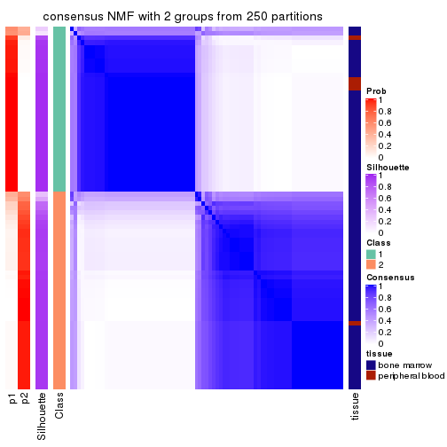</p>

</div>
<div id='tab-CV-NMF-consensus-heatmap-2'>
<pre><code class="r">consensus_heatmap(res, k = 3)
</code></pre>

<p>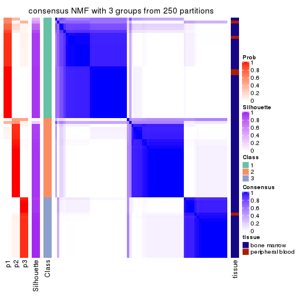</p>

</div>
<div id='tab-CV-NMF-consensus-heatmap-3'>
<pre><code class="r">consensus_heatmap(res, k = 4)
</code></pre>

<p>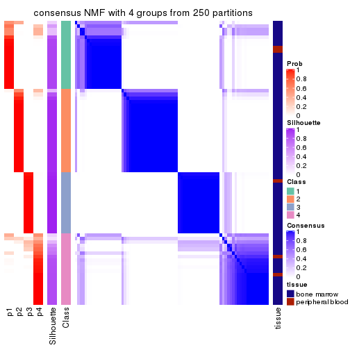</p>

</div>
<div id='tab-CV-NMF-consensus-heatmap-4'>
<pre><code class="r">consensus_heatmap(res, k = 5)
</code></pre>

<p>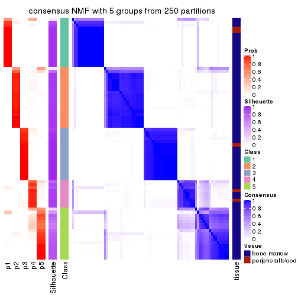</p>

</div>
<div id='tab-CV-NMF-consensus-heatmap-5'>
<pre><code class="r">consensus_heatmap(res, k = 6)
</code></pre>

<p>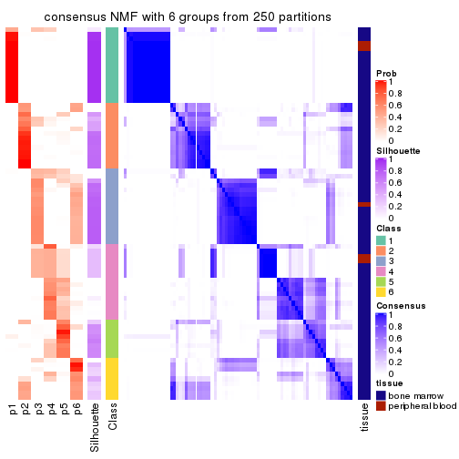</p>

</div>
</div>

Heatmaps for the membership of samples in all partitions to see how consistent they are:


<script>
$( function() {
	$( '#tabs-CV-NMF-membership-heatmap' ).tabs();
} );
</script>
<div id='tabs-CV-NMF-membership-heatmap'>
<ul>
<li><a href='#tab-CV-NMF-membership-heatmap-1'>k = 2</a></li>
<li><a href='#tab-CV-NMF-membership-heatmap-2'>k = 3</a></li>
<li><a href='#tab-CV-NMF-membership-heatmap-3'>k = 4</a></li>
<li><a href='#tab-CV-NMF-membership-heatmap-4'>k = 5</a></li>
<li><a href='#tab-CV-NMF-membership-heatmap-5'>k = 6</a></li>
</ul>
<div id='tab-CV-NMF-membership-heatmap-1'>
<pre><code class="r">membership_heatmap(res, k = 2)
</code></pre>

<p>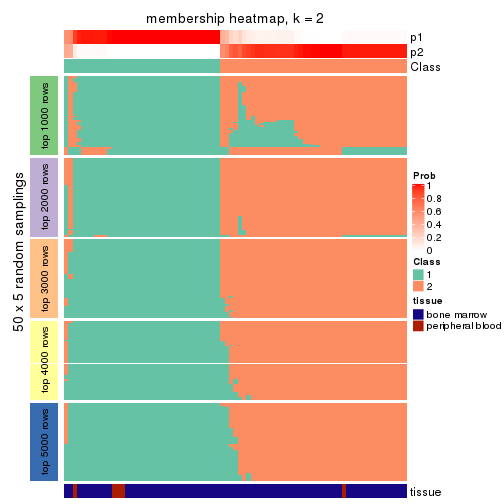</p>

</div>
<div id='tab-CV-NMF-membership-heatmap-2'>
<pre><code class="r">membership_heatmap(res, k = 3)
</code></pre>

<p>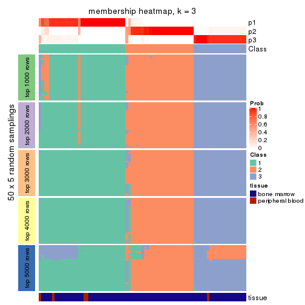</p>

</div>
<div id='tab-CV-NMF-membership-heatmap-3'>
<pre><code class="r">membership_heatmap(res, k = 4)
</code></pre>

<p>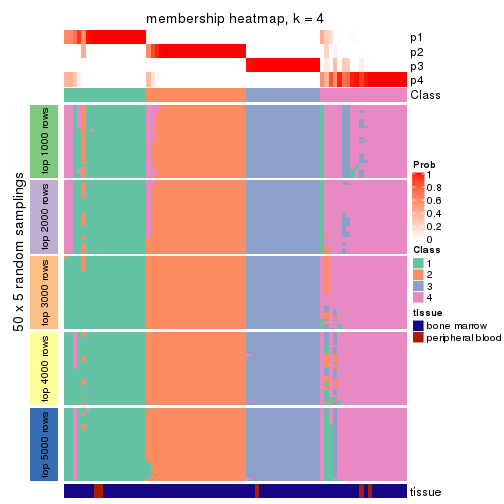</p>

</div>
<div id='tab-CV-NMF-membership-heatmap-4'>
<pre><code class="r">membership_heatmap(res, k = 5)
</code></pre>

<p>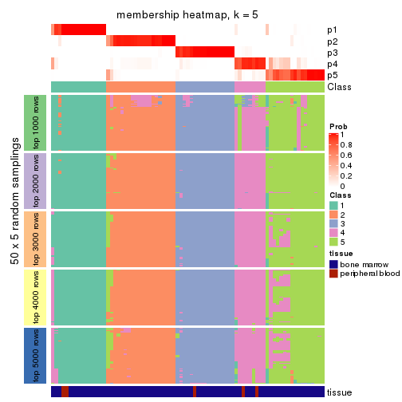</p>

</div>
<div id='tab-CV-NMF-membership-heatmap-5'>
<pre><code class="r">membership_heatmap(res, k = 6)
</code></pre>

<p>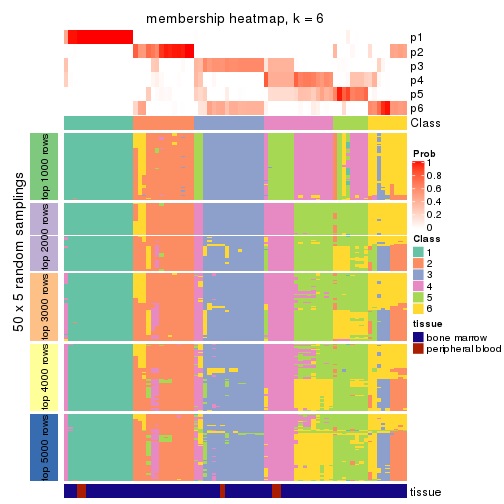</p>

</div>
</div>

As soon as we have had the classes for columns, we can look for signatures
which are significantly different between classes which can be candidate marks
for certain classes. Following are the heatmaps for signatures.


Signature heatmaps where rows are scaled:


<script>
$( function() {
	$( '#tabs-CV-NMF-get-signatures' ).tabs();
} );
</script>
<div id='tabs-CV-NMF-get-signatures'>
<ul>
<li><a href='#tab-CV-NMF-get-signatures-1'>k = 2</a></li>
<li><a href='#tab-CV-NMF-get-signatures-2'>k = 3</a></li>
<li><a href='#tab-CV-NMF-get-signatures-3'>k = 4</a></li>
<li><a href='#tab-CV-NMF-get-signatures-4'>k = 5</a></li>
<li><a href='#tab-CV-NMF-get-signatures-5'>k = 6</a></li>
</ul>
<div id='tab-CV-NMF-get-signatures-1'>
<pre><code class="r">get_signatures(res, k = 2)
</code></pre>

<p>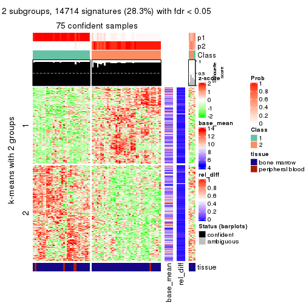</p>

</div>
<div id='tab-CV-NMF-get-signatures-2'>
<pre><code class="r">get_signatures(res, k = 3)
</code></pre>

<p>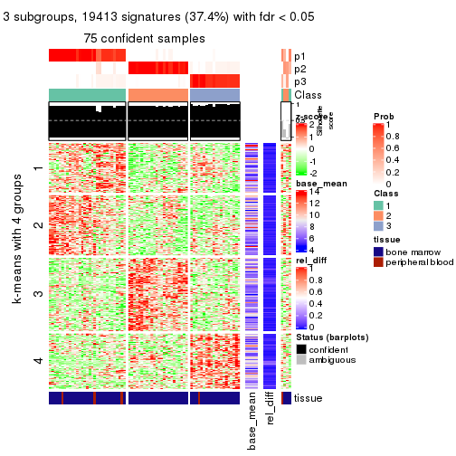</p>

</div>
<div id='tab-CV-NMF-get-signatures-3'>
<pre><code class="r">get_signatures(res, k = 4)
</code></pre>

<p>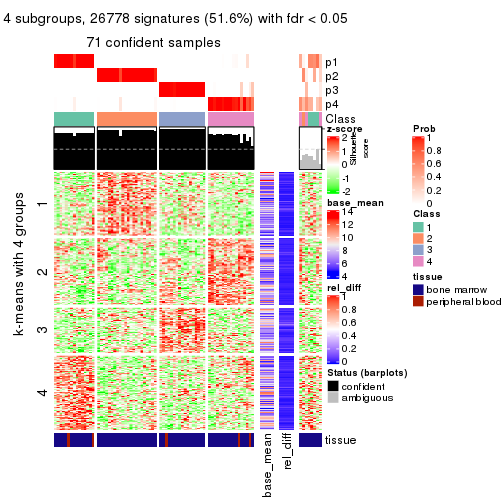</p>

</div>
<div id='tab-CV-NMF-get-signatures-4'>
<pre><code class="r">get_signatures(res, k = 5)
</code></pre>

<p>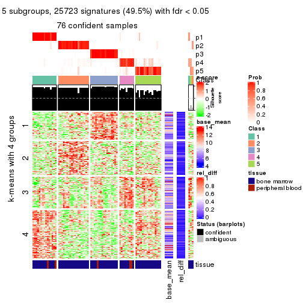</p>

</div>
<div id='tab-CV-NMF-get-signatures-5'>
<pre><code class="r">get_signatures(res, k = 6)
</code></pre>

<p>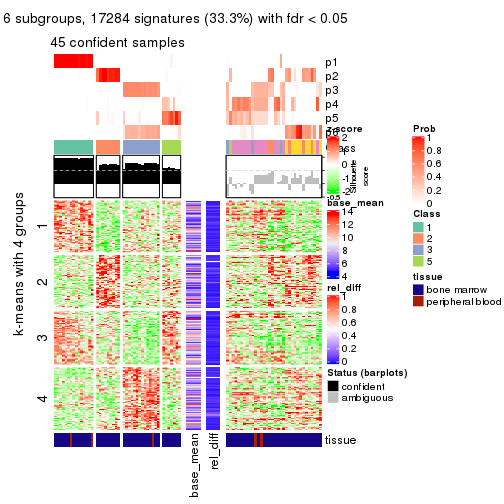</p>

</div>
</div>


Signature heatmaps where rows are not scaled:


<script>
$( function() {
	$( '#tabs-CV-NMF-get-signatures-no-scale' ).tabs();
} );
</script>
<div id='tabs-CV-NMF-get-signatures-no-scale'>
<ul>
<li><a href='#tab-CV-NMF-get-signatures-no-scale-1'>k = 2</a></li>
<li><a href='#tab-CV-NMF-get-signatures-no-scale-2'>k = 3</a></li>
<li><a href='#tab-CV-NMF-get-signatures-no-scale-3'>k = 4</a></li>
<li><a href='#tab-CV-NMF-get-signatures-no-scale-4'>k = 5</a></li>
<li><a href='#tab-CV-NMF-get-signatures-no-scale-5'>k = 6</a></li>
</ul>
<div id='tab-CV-NMF-get-signatures-no-scale-1'>
<pre><code class="r">get_signatures(res, k = 2, scale_rows = FALSE)
</code></pre>

<p>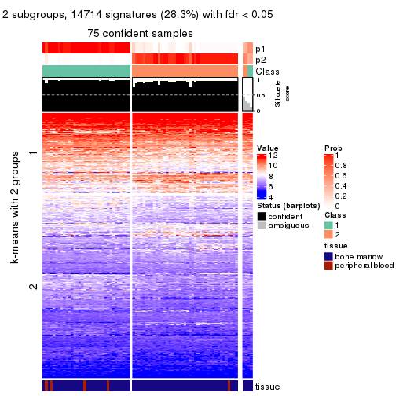</p>

</div>
<div id='tab-CV-NMF-get-signatures-no-scale-2'>
<pre><code class="r">get_signatures(res, k = 3, scale_rows = FALSE)
</code></pre>

<p>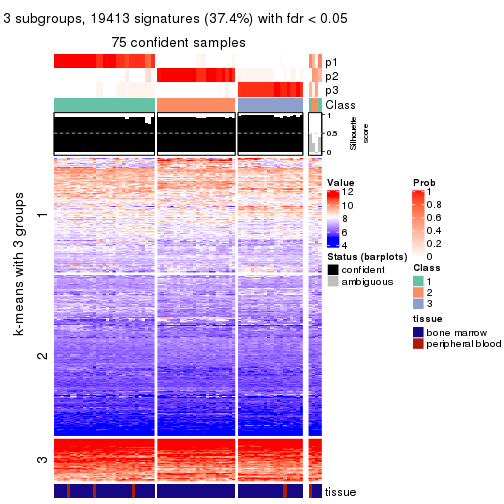</p>

</div>
<div id='tab-CV-NMF-get-signatures-no-scale-3'>
<pre><code class="r">get_signatures(res, k = 4, scale_rows = FALSE)
</code></pre>

<p>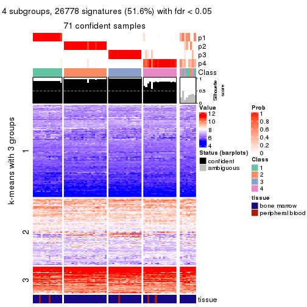</p>

</div>
<div id='tab-CV-NMF-get-signatures-no-scale-4'>
<pre><code class="r">get_signatures(res, k = 5, scale_rows = FALSE)
</code></pre>

<p>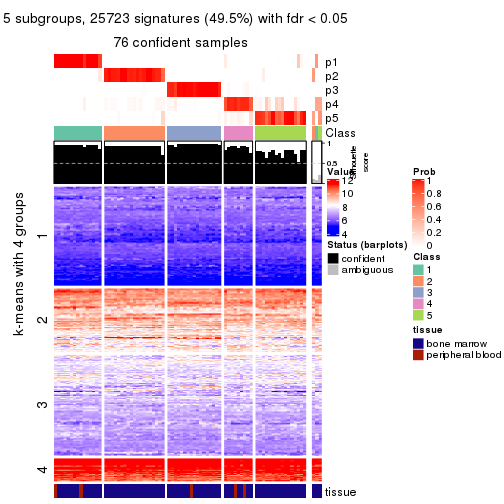</p>

</div>
<div id='tab-CV-NMF-get-signatures-no-scale-5'>
<pre><code class="r">get_signatures(res, k = 6, scale_rows = FALSE)
</code></pre>

<p>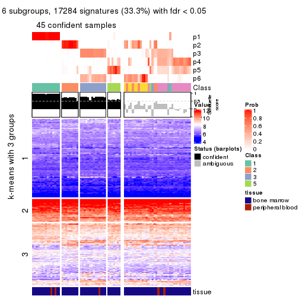</p>

</div>
</div>


Compare the overlap of signatures from different k:

```r
compare_signatures(res)
```

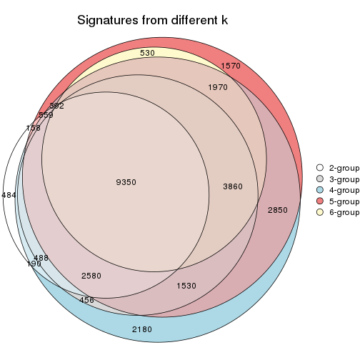

`get_signature()` returns a data frame invisibly. TO get the list of signatures, the function
call should be assigned to a variable explicitly. In following code, if `plot` argument is set
to `FALSE`, no heatmap is plotted while only the differential analysis is performed.

```r
# code only for demonstration
tb = get_signature(res, k = ..., plot = FALSE)
```

An example of the output of `tb` is:

```
#>   which_row         fdr    mean_1    mean_2 scaled_mean_1 scaled_mean_2 km
#> 1        38 0.042760348  8.373488  9.131774    -0.5533452     0.5164555  1
#> 2        40 0.018707592  7.106213  8.469186    -0.6173731     0.5762149  1
#> 3        55 0.019134737 10.221463 11.207825    -0.6159697     0.5749050  1
#> 4        59 0.006059896  5.921854  7.869574    -0.6899429     0.6439467  1
#> 5        60 0.018055526  8.928898 10.211722    -0.6204761     0.5791110  1
#> 6        98 0.009384629 15.714769 14.887706     0.6635654    -0.6193277  2
...
```

The columns in `tb` are:

1. `which_row`: row indices corresponding to the input matrix.
2. `fdr`: FDR for the differential test. 
3. `mean_x`: The mean value in group x.
4. `scaled_mean_x`: The mean value in group x after rows are scaled.
5. `km`: Row groups if k-means clustering is applied to rows.


UMAP plot which shows how samples are separated.


<script>
$( function() {
	$( '#tabs-CV-NMF-dimension-reduction' ).tabs();
} );
</script>
<div id='tabs-CV-NMF-dimension-reduction'>
<ul>
<li><a href='#tab-CV-NMF-dimension-reduction-1'>k = 2</a></li>
<li><a href='#tab-CV-NMF-dimension-reduction-2'>k = 3</a></li>
<li><a href='#tab-CV-NMF-dimension-reduction-3'>k = 4</a></li>
<li><a href='#tab-CV-NMF-dimension-reduction-4'>k = 5</a></li>
<li><a href='#tab-CV-NMF-dimension-reduction-5'>k = 6</a></li>
</ul>
<div id='tab-CV-NMF-dimension-reduction-1'>
<pre><code class="r">dimension_reduction(res, k = 2, method = &quot;UMAP&quot;)
</code></pre>

<p>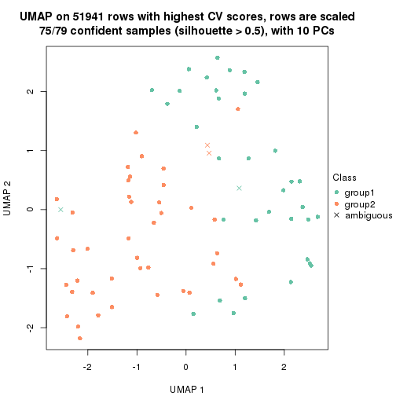</p>

</div>
<div id='tab-CV-NMF-dimension-reduction-2'>
<pre><code class="r">dimension_reduction(res, k = 3, method = &quot;UMAP&quot;)
</code></pre>

<p>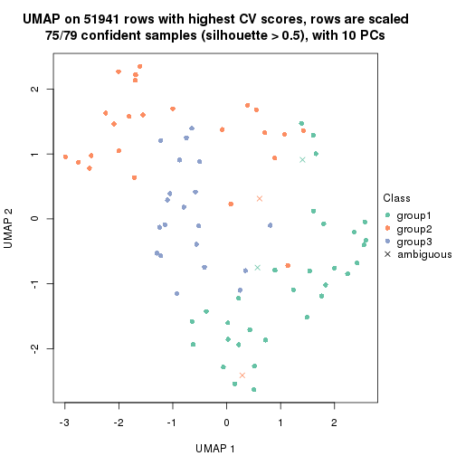</p>

</div>
<div id='tab-CV-NMF-dimension-reduction-3'>
<pre><code class="r">dimension_reduction(res, k = 4, method = &quot;UMAP&quot;)
</code></pre>

<p>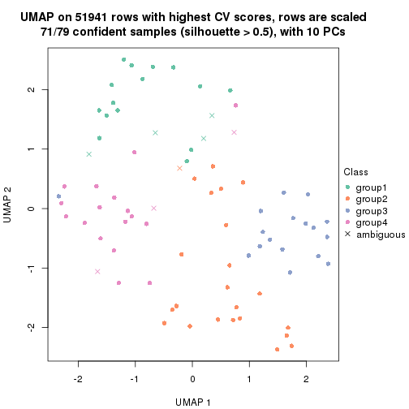</p>

</div>
<div id='tab-CV-NMF-dimension-reduction-4'>
<pre><code class="r">dimension_reduction(res, k = 5, method = &quot;UMAP&quot;)
</code></pre>

<p>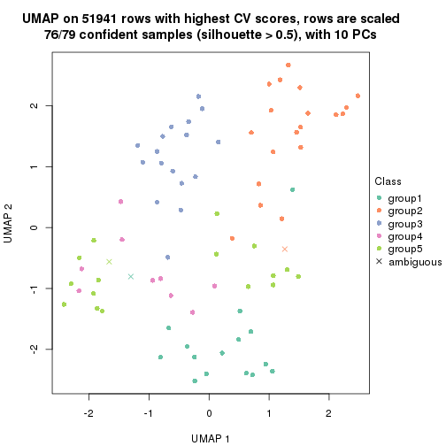</p>

</div>
<div id='tab-CV-NMF-dimension-reduction-5'>
<pre><code class="r">dimension_reduction(res, k = 6, method = &quot;UMAP&quot;)
</code></pre>

<p>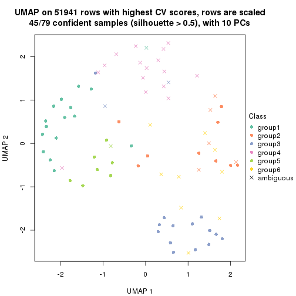</p>

</div>
</div>


Following heatmap shows how subgroups are split when increasing `k`:

```r
collect_classes(res)
```

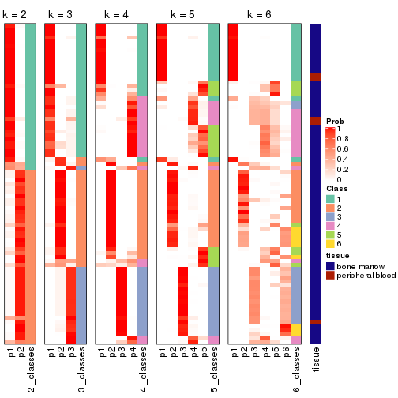


Test correlation between subgroups and known annotations. If the known
annotation is numeric, one-way ANOVA test is applied, and if the known
annotation is discrete, chi-squared contingency table test is applied.

```r
test_to_known_factors(res)
```

```
#>         n tissue(p) k
#> CV:NMF 75     0.251 2
#> CV:NMF 75     0.284 3
#> CV:NMF 71     0.364 4
#> CV:NMF 76     0.127 5
#> CV:NMF 45     0.528 6
```


If matrix rows can be associated to genes, consider to use `GO_Enrichment(res,
...)` to perform function enrichment for the signature genes.


 

---------------------------------------------------


### MAD:hclust


The object with results only for a single top-value method and a single partition method 
can be extracted as:

```r
res = res_list["MAD", "hclust"]
# you can also extract it by
# res = res_list["MAD:hclust"]
```

A summary of `res` and all the functions that can be applied to it:

```r
res
```

```
#> A 'ConsensusPartition' object with k = 2, 3, 4, 5, 6.
#>   On a matrix with 51941 rows and 79 columns.
#>   Top rows (1000, 2000, 3000, 4000, 5000) are extracted by 'MAD' method.
#>   Subgroups are detected by 'hclust' method.
#>   Performed in total 1250 partitions by row resampling.
#>   Best k for subgroups seems to be 3.
#> 
#> Following methods can be applied to this 'ConsensusPartition' object:
#>  [1] "cola_report"             "collect_classes"         "collect_plots"          
#>  [4] "collect_stats"           "colnames"                "compare_signatures"     
#>  [7] "consensus_heatmap"       "dimension_reduction"     "functional_enrichment"  
#> [10] "get_anno_col"            "get_anno"                "get_classes"            
#> [13] "get_consensus"           "get_matrix"              "get_membership"         
#> [16] "get_param"               "get_signatures"          "get_stats"              
#> [19] "is_best_k"               "is_stable_k"             "membership_heatmap"     
#> [22] "ncol"                    "nrow"                    "plot_ecdf"              
#> [25] "rownames"                "select_partition_number" "show"                   
#> [28] "suggest_best_k"          "test_to_known_factors"
```

`collect_plots()` function collects all the plots made from `res` for all `k` (number of partitions)
into one single page to provide an easy and fast comparison between different `k`.

```r
collect_plots(res)
```

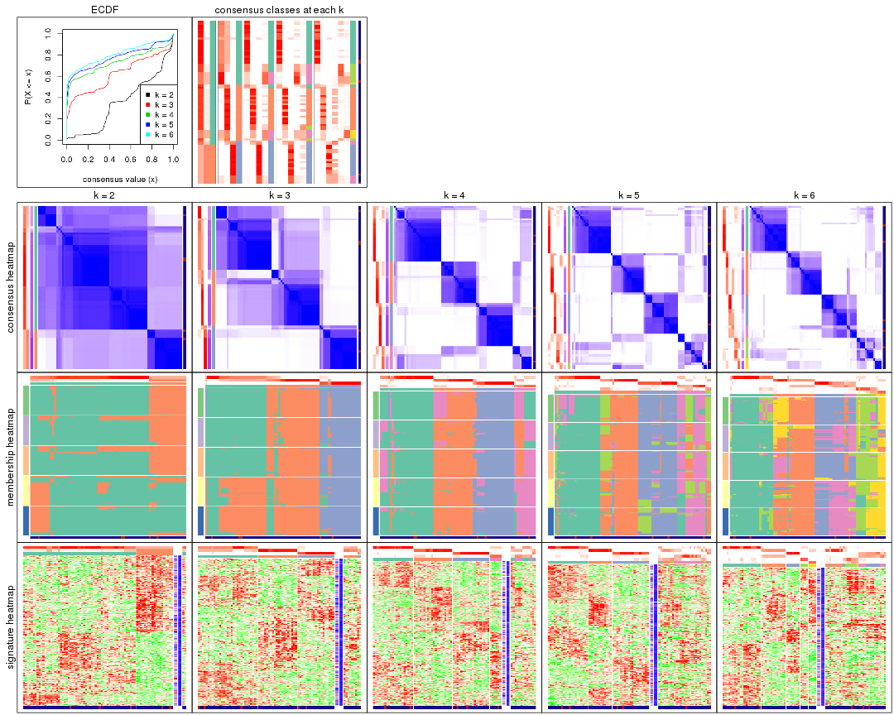

The plots are:

- The first row: a plot of the ECDF (Empirical cumulative distribution
  function) curves of the consensus matrix for each `k` and the heatmap of
  predicted classes for each `k`.
- The second row: heatmaps of the consensus matrix for each `k`.
- The third row: heatmaps of the membership matrix for each `k`.
- The fouth row: heatmaps of the signatures for each `k`.

All the plots in panels can be made by individual functions and they are
plotted later in this section.

`select_partition_number()` produces several plots showing different
statistics for choosing "optimized" `k`. There are following statistics:

- ECDF curves of the consensus matrix for each `k`;
- 1-PAC. [The PAC
  score](https://en.wikipedia.org/wiki/Consensus_clustering#Over-interpretation_potential_of_consensus_clustering)
  measures the proportion of the ambiguous subgrouping.
- Mean silhouette score.
- Concordance. The mean probability of fiting the consensus class ids in all
  partitions.
- Area increased. Denote $A_k$ as the area under the ECDF curve for current
  `k`, the area increased is defined as $A_k - A_{k-1}$.
- Rand index. The percent of pairs of samples that are both in a same cluster
  or both are not in a same cluster in the partition of k and k-1.
- Jaccard index. The ratio of pairs of samples are both in a same cluster in
  the partition of k and k-1 and the pairs of samples are both in a same
  cluster in the partition k or k-1.

The detailed explanations of these statistics can be found in [the cola
vignette](http://bioconductor.org/packages/devel/bioc/vignettes/cola/inst/doc/cola.html#toc_13).

Generally speaking, lower PAC score, higher mean silhouette score or higher
concordance corresponds to better partition. Rand index and Jaccard index
measure how similar the current partition is compared to partition with `k-1`.
If they are too similar, we won't accept `k` is better than `k-1`.

```r
select_partition_number(res)
```

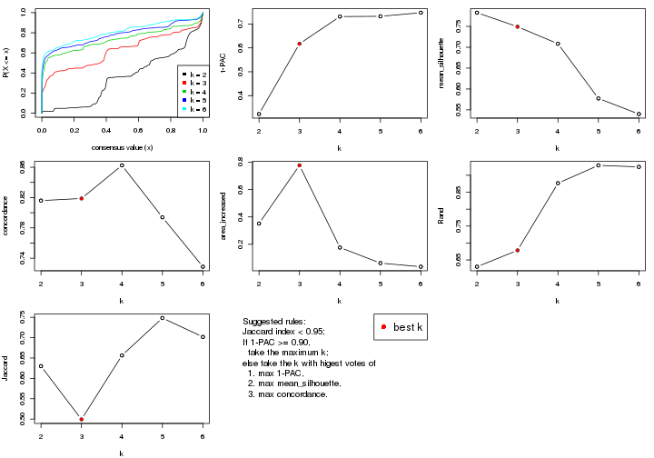

The numeric values for all these statistics can be obtained by `get_stats()`.

```r
get_stats(res)
```

```
#>   k 1-PAC mean_silhouette concordance area_increased  Rand Jaccard
#> 2 2 0.323           0.783       0.816         0.3515 0.630   0.630
#> 3 3 0.617           0.749       0.819         0.7766 0.678   0.499
#> 4 4 0.731           0.708       0.862         0.1763 0.877   0.656
#> 5 5 0.732           0.577       0.794         0.0624 0.929   0.748
#> 6 6 0.747           0.540       0.729         0.0360 0.925   0.702
```

`suggest_best_k()` suggests the best $k$ based on these statistics. The rules are as follows:

- All $k$ with Jaccard index larger than 0.95 are removed because the increase of
  the partition number does not provides enough extra information. If all $k$ are removed,
  the best $k$ is assigned by `NA`.
- For $k$ with 1-PAC larger than 0.9, the maximal $k$ is taken as the "best k". Other $k$ is called "optional k".
- If it does not fit the second rule. The $k$ with the highest vote of highest
  1-PAC, mean silhouette and concordance is taken as the "best k".

```r
suggest_best_k(res)
```

```
#> [1] 3
```


Following shows the table of the partitions (You need to click the **show/hide
code output** link to see it). The membership matrix (columns with name `p*`)
is inferred by
[`clue::cl_consensus()`](https://www.rdocumentation.org/link/cl_consensus?package=clue)
function with the `SE` method. Basically the value in the membership matrix
represents the probability to belong to a certain group. The finall class
label for an item is determined with the group with highest probability it
belongs to.

In `get_classes()` function, the entropy is calculated from the membership
matrix and the silhouette score is calculated from the consensus matrix.


<script>
$( function() {
	$( '#tabs-MAD-hclust-get-classes' ).tabs();
} );
</script>
<div id='tabs-MAD-hclust-get-classes'>
<ul>
<li><a href='#tab-MAD-hclust-get-classes-1'>k = 2</a></li>
<li><a href='#tab-MAD-hclust-get-classes-2'>k = 3</a></li>
<li><a href='#tab-MAD-hclust-get-classes-3'>k = 4</a></li>
<li><a href='#tab-MAD-hclust-get-classes-4'>k = 5</a></li>
<li><a href='#tab-MAD-hclust-get-classes-5'>k = 6</a></li>
</ul>

<div id='tab-MAD-hclust-get-classes-1'>
<p><a id='tab-MAD-hclust-get-classes-1-a' style='color:#0366d6' href='#'>show/hide code output</a></p>
<pre><code class="r">cbind(get_classes(res, k = 2), get_membership(res, k = 2))
</code></pre>

<pre><code>#&gt;           class entropy silhouette    p1    p2
#&gt; GSM316652     2  0.9732      0.956 0.404 0.596
#&gt; GSM316653     1  0.0938      0.813 0.988 0.012
#&gt; GSM316654     1  0.3274      0.791 0.940 0.060
#&gt; GSM316655     1  0.4562      0.769 0.904 0.096
#&gt; GSM316656     1  0.5294      0.779 0.880 0.120
#&gt; GSM316657     1  0.0000      0.814 1.000 0.000
#&gt; GSM316658     1  0.4939      0.803 0.892 0.108
#&gt; GSM316659     1  0.9732      0.523 0.596 0.404
#&gt; GSM316660     1  0.0000      0.814 1.000 0.000
#&gt; GSM316661     1  0.4690      0.767 0.900 0.100
#&gt; GSM316662     2  0.9732      0.956 0.404 0.596
#&gt; GSM316663     2  0.9732      0.955 0.404 0.596
#&gt; GSM316664     1  0.9170      0.535 0.668 0.332
#&gt; GSM316665     1  0.4939      0.803 0.892 0.108
#&gt; GSM316666     2  0.9732      0.956 0.404 0.596
#&gt; GSM316667     1  0.4939      0.808 0.892 0.108
#&gt; GSM316668     2  0.9754      0.954 0.408 0.592
#&gt; GSM316669     1  0.0938      0.813 0.988 0.012
#&gt; GSM316670     1  0.7528      0.571 0.784 0.216
#&gt; GSM316671     2  0.9732      0.956 0.404 0.596
#&gt; GSM316672     1  0.1184      0.816 0.984 0.016
#&gt; GSM316673     1  0.0000      0.814 1.000 0.000
#&gt; GSM316674     2  0.9732      0.956 0.404 0.596
#&gt; GSM316676     2  0.9732      0.955 0.404 0.596
#&gt; GSM316677     1  0.1414      0.810 0.980 0.020
#&gt; GSM316678     1  0.4161      0.813 0.916 0.084
#&gt; GSM316679     1  0.0672      0.816 0.992 0.008
#&gt; GSM316680     1  0.3584      0.817 0.932 0.068
#&gt; GSM316681     2  0.9732      0.956 0.404 0.596
#&gt; GSM316682     1  0.9170      0.535 0.668 0.332
#&gt; GSM316683     1  0.9170      0.535 0.668 0.332
#&gt; GSM316684     1  0.4939      0.803 0.892 0.108
#&gt; GSM316685     1  0.9087      0.029 0.676 0.324
#&gt; GSM316686     1  0.7139      0.403 0.804 0.196
#&gt; GSM316687     2  0.9710      0.837 0.400 0.600
#&gt; GSM316688     1  0.4690      0.815 0.900 0.100
#&gt; GSM316689     1  0.0000      0.814 1.000 0.000
#&gt; GSM316690     2  0.9732      0.955 0.404 0.596
#&gt; GSM316691     1  0.4815      0.807 0.896 0.104
#&gt; GSM316692     2  0.9732      0.955 0.404 0.596
#&gt; GSM316693     1  0.9170      0.535 0.668 0.332
#&gt; GSM316694     2  0.9754      0.954 0.408 0.592
#&gt; GSM316696     1  0.0000      0.814 1.000 0.000
#&gt; GSM316697     2  0.9732      0.956 0.404 0.596
#&gt; GSM316698     1  0.4161      0.813 0.916 0.084
#&gt; GSM316699     1  0.4939      0.803 0.892 0.108
#&gt; GSM316700     1  0.4690      0.767 0.900 0.100
#&gt; GSM316701     1  0.4562      0.769 0.904 0.096
#&gt; GSM316703     1  0.9732      0.523 0.596 0.404
#&gt; GSM316704     1  0.9732      0.523 0.596 0.404
#&gt; GSM316705     1  0.0000      0.814 1.000 0.000
#&gt; GSM316706     1  0.9732      0.523 0.596 0.404
#&gt; GSM316707     1  0.4939      0.803 0.892 0.108
#&gt; GSM316708     1  0.4161      0.813 0.916 0.084
#&gt; GSM316709     2  0.9732      0.956 0.404 0.596
#&gt; GSM316710     1  0.9170      0.535 0.668 0.332
#&gt; GSM316711     1  0.4939      0.803 0.892 0.108
#&gt; GSM316713     1  0.0000      0.814 1.000 0.000
#&gt; GSM316714     2  0.9710      0.837 0.400 0.600
#&gt; GSM316715     1  0.0000      0.814 1.000 0.000
#&gt; GSM316716     1  0.4939      0.803 0.892 0.108
#&gt; GSM316717     1  0.0000      0.814 1.000 0.000
#&gt; GSM316718     1  0.4161      0.813 0.916 0.084
#&gt; GSM316719     1  0.0000      0.814 1.000 0.000
#&gt; GSM316720     1  0.0000      0.814 1.000 0.000
#&gt; GSM316721     1  0.4939      0.803 0.892 0.108
#&gt; GSM316722     1  0.0376      0.815 0.996 0.004
#&gt; GSM316723     1  0.4939      0.803 0.892 0.108
#&gt; GSM316724     1  0.4562      0.809 0.904 0.096
#&gt; GSM316726     1  0.4939      0.803 0.892 0.108
#&gt; GSM316727     1  0.0000      0.814 1.000 0.000
#&gt; GSM316728     2  0.9710      0.837 0.400 0.600
#&gt; GSM316729     1  0.4562      0.809 0.904 0.096
#&gt; GSM316730     1  0.4161      0.813 0.916 0.084
#&gt; GSM316675     2  0.9710      0.954 0.400 0.600
#&gt; GSM316695     1  0.0000      0.814 1.000 0.000
#&gt; GSM316702     2  0.9580      0.816 0.380 0.620
#&gt; GSM316712     1  0.0000      0.814 1.000 0.000
#&gt; GSM316725     1  0.9170      0.535 0.668 0.332
</code></pre>

<script>
$('#tab-MAD-hclust-get-classes-1-a').parent().next().next().hide();
$('#tab-MAD-hclust-get-classes-1-a').click(function(){
  $('#tab-MAD-hclust-get-classes-1-a').parent().next().next().toggle();
  return(false);
});
</script>
</div>

<div id='tab-MAD-hclust-get-classes-2'>
<p><a id='tab-MAD-hclust-get-classes-2-a' style='color:#0366d6' href='#'>show/hide code output</a></p>
<pre><code class="r">cbind(get_classes(res, k = 3), get_membership(res, k = 3))
</code></pre>

<pre><code>#&gt;           class entropy silhouette    p1    p2    p3
#&gt; GSM316652     3  0.0000      0.919 0.000 0.000 1.000
#&gt; GSM316653     1  0.6026      0.813 0.624 0.376 0.000
#&gt; GSM316654     1  0.5902      0.783 0.680 0.316 0.004
#&gt; GSM316655     1  0.5363      0.760 0.724 0.276 0.000
#&gt; GSM316656     2  0.5706      0.376 0.320 0.680 0.000
#&gt; GSM316657     1  0.6111      0.816 0.604 0.396 0.000
#&gt; GSM316658     2  0.1031      0.833 0.000 0.976 0.024
#&gt; GSM316659     2  0.6126      0.495 0.400 0.600 0.000
#&gt; GSM316660     1  0.6111      0.816 0.604 0.396 0.000
#&gt; GSM316661     1  0.5588      0.758 0.720 0.276 0.004
#&gt; GSM316662     3  0.0000      0.919 0.000 0.000 1.000
#&gt; GSM316663     3  0.0475      0.918 0.004 0.004 0.992
#&gt; GSM316664     1  0.0000      0.549 1.000 0.000 0.000
#&gt; GSM316665     2  0.1031      0.833 0.000 0.976 0.024
#&gt; GSM316666     3  0.0000      0.919 0.000 0.000 1.000
#&gt; GSM316667     2  0.1919      0.822 0.020 0.956 0.024
#&gt; GSM316668     3  0.0237      0.918 0.000 0.004 0.996
#&gt; GSM316669     1  0.6026      0.813 0.624 0.376 0.000
#&gt; GSM316670     3  0.7674      0.075 0.044 0.472 0.484
#&gt; GSM316671     3  0.0000      0.919 0.000 0.000 1.000
#&gt; GSM316672     2  0.5948     -0.198 0.360 0.640 0.000
#&gt; GSM316673     1  0.6111      0.816 0.604 0.396 0.000
#&gt; GSM316674     3  0.0000      0.919 0.000 0.000 1.000
#&gt; GSM316676     3  0.0475      0.918 0.004 0.004 0.992
#&gt; GSM316677     1  0.5968      0.810 0.636 0.364 0.000
#&gt; GSM316678     2  0.0000      0.826 0.000 1.000 0.000
#&gt; GSM316679     1  0.6215      0.778 0.572 0.428 0.000
#&gt; GSM316680     2  0.5835     -0.133 0.340 0.660 0.000
#&gt; GSM316681     3  0.0000      0.919 0.000 0.000 1.000
#&gt; GSM316682     1  0.0424      0.546 0.992 0.008 0.000
#&gt; GSM316683     1  0.0424      0.546 0.992 0.008 0.000
#&gt; GSM316684     2  0.1031      0.833 0.000 0.976 0.024
#&gt; GSM316685     3  0.5905      0.472 0.000 0.352 0.648
#&gt; GSM316686     1  0.9576      0.542 0.408 0.396 0.196
#&gt; GSM316687     3  0.5180      0.812 0.156 0.032 0.812
#&gt; GSM316688     2  0.3031      0.769 0.076 0.912 0.012
#&gt; GSM316689     1  0.6111      0.816 0.604 0.396 0.000
#&gt; GSM316690     3  0.0475      0.918 0.004 0.004 0.992
#&gt; GSM316691     2  0.3213      0.785 0.060 0.912 0.028
#&gt; GSM316692     3  0.0475      0.918 0.004 0.004 0.992
#&gt; GSM316693     1  0.0000      0.549 1.000 0.000 0.000
#&gt; GSM316694     3  0.0237      0.918 0.000 0.004 0.996
#&gt; GSM316696     1  0.6111      0.816 0.604 0.396 0.000
#&gt; GSM316697     3  0.0000      0.919 0.000 0.000 1.000
#&gt; GSM316698     2  0.0000      0.826 0.000 1.000 0.000
#&gt; GSM316699     2  0.1031      0.833 0.000 0.976 0.024
#&gt; GSM316700     1  0.5588      0.758 0.720 0.276 0.004
#&gt; GSM316701     1  0.5363      0.760 0.724 0.276 0.000
#&gt; GSM316703     2  0.6126      0.495 0.400 0.600 0.000
#&gt; GSM316704     2  0.6126      0.495 0.400 0.600 0.000
#&gt; GSM316705     1  0.6111      0.816 0.604 0.396 0.000
#&gt; GSM316706     2  0.6126      0.495 0.400 0.600 0.000
#&gt; GSM316707     2  0.1031      0.833 0.000 0.976 0.024
#&gt; GSM316708     2  0.0000      0.826 0.000 1.000 0.000
#&gt; GSM316709     3  0.0000      0.919 0.000 0.000 1.000
#&gt; GSM316710     1  0.0000      0.549 1.000 0.000 0.000
#&gt; GSM316711     2  0.1031      0.833 0.000 0.976 0.024
#&gt; GSM316713     1  0.6111      0.816 0.604 0.396 0.000
#&gt; GSM316714     3  0.5180      0.812 0.156 0.032 0.812
#&gt; GSM316715     1  0.6111      0.816 0.604 0.396 0.000
#&gt; GSM316716     2  0.1031      0.833 0.000 0.976 0.024
#&gt; GSM316717     1  0.6111      0.816 0.604 0.396 0.000
#&gt; GSM316718     2  0.0000      0.826 0.000 1.000 0.000
#&gt; GSM316719     1  0.6111      0.816 0.604 0.396 0.000
#&gt; GSM316720     1  0.6111      0.816 0.604 0.396 0.000
#&gt; GSM316721     2  0.1031      0.833 0.000 0.976 0.024
#&gt; GSM316722     1  0.6168      0.799 0.588 0.412 0.000
#&gt; GSM316723     2  0.1031      0.833 0.000 0.976 0.024
#&gt; GSM316724     2  0.0592      0.831 0.000 0.988 0.012
#&gt; GSM316726     2  0.1031      0.833 0.000 0.976 0.024
#&gt; GSM316727     1  0.6111      0.816 0.604 0.396 0.000
#&gt; GSM316728     3  0.5180      0.812 0.156 0.032 0.812
#&gt; GSM316729     2  0.0829      0.831 0.004 0.984 0.012
#&gt; GSM316730     2  0.0000      0.826 0.000 1.000 0.000
#&gt; GSM316675     3  0.0237      0.918 0.004 0.000 0.996
#&gt; GSM316695     1  0.6111      0.816 0.604 0.396 0.000
#&gt; GSM316702     3  0.4755      0.810 0.184 0.008 0.808
#&gt; GSM316712     1  0.6111      0.816 0.604 0.396 0.000
#&gt; GSM316725     1  0.0000      0.549 1.000 0.000 0.000
</code></pre>

<script>
$('#tab-MAD-hclust-get-classes-2-a').parent().next().next().hide();
$('#tab-MAD-hclust-get-classes-2-a').click(function(){
  $('#tab-MAD-hclust-get-classes-2-a').parent().next().next().toggle();
  return(false);
});
</script>
</div>

<div id='tab-MAD-hclust-get-classes-3'>
<p><a id='tab-MAD-hclust-get-classes-3-a' style='color:#0366d6' href='#'>show/hide code output</a></p>
<pre><code class="r">cbind(get_classes(res, k = 4), get_membership(res, k = 4))
</code></pre>

<pre><code>#&gt;           class entropy silhouette    p1    p2    p3    p4
#&gt; GSM316652     3  0.0000     0.9078 0.000 0.000 1.000 0.000
#&gt; GSM316653     1  0.0895     0.8271 0.976 0.004 0.000 0.020
#&gt; GSM316654     1  0.3345     0.7281 0.860 0.012 0.004 0.124
#&gt; GSM316655     1  0.5268     0.2997 0.592 0.012 0.000 0.396
#&gt; GSM316656     4  0.7152     0.2913 0.284 0.172 0.000 0.544
#&gt; GSM316657     1  0.0000     0.8352 1.000 0.000 0.000 0.000
#&gt; GSM316658     2  0.0524     0.8699 0.000 0.988 0.008 0.004
#&gt; GSM316659     4  0.4866     0.1174 0.000 0.404 0.000 0.596
#&gt; GSM316660     1  0.0188     0.8349 0.996 0.000 0.000 0.004
#&gt; GSM316661     1  0.5279     0.2948 0.588 0.012 0.000 0.400
#&gt; GSM316662     3  0.0000     0.9078 0.000 0.000 1.000 0.000
#&gt; GSM316663     3  0.0524     0.9059 0.000 0.008 0.988 0.004
#&gt; GSM316664     4  0.4103     0.5614 0.256 0.000 0.000 0.744
#&gt; GSM316665     2  0.1042     0.8694 0.000 0.972 0.008 0.020
#&gt; GSM316666     3  0.0000     0.9078 0.000 0.000 1.000 0.000
#&gt; GSM316667     2  0.1262     0.8528 0.008 0.968 0.008 0.016
#&gt; GSM316668     3  0.0188     0.9070 0.000 0.004 0.996 0.000
#&gt; GSM316669     1  0.0895     0.8271 0.976 0.004 0.000 0.020
#&gt; GSM316670     3  0.6370     0.0802 0.016 0.476 0.476 0.032
#&gt; GSM316671     3  0.0000     0.9078 0.000 0.000 1.000 0.000
#&gt; GSM316672     1  0.7506    -0.1052 0.440 0.376 0.000 0.184
#&gt; GSM316673     1  0.0188     0.8349 0.996 0.000 0.000 0.004
#&gt; GSM316674     3  0.0000     0.9078 0.000 0.000 1.000 0.000
#&gt; GSM316676     3  0.0376     0.9070 0.000 0.004 0.992 0.004
#&gt; GSM316677     1  0.1557     0.8072 0.944 0.000 0.000 0.056
#&gt; GSM316678     2  0.4399     0.7786 0.016 0.760 0.000 0.224
#&gt; GSM316679     1  0.2002     0.8008 0.936 0.044 0.000 0.020
#&gt; GSM316680     1  0.6968     0.1729 0.552 0.308 0.000 0.140
#&gt; GSM316681     3  0.0000     0.9078 0.000 0.000 1.000 0.000
#&gt; GSM316682     4  0.4422     0.5586 0.256 0.008 0.000 0.736
#&gt; GSM316683     4  0.4422     0.5586 0.256 0.008 0.000 0.736
#&gt; GSM316684     2  0.1042     0.8694 0.000 0.972 0.008 0.020
#&gt; GSM316685     3  0.4697     0.4631 0.000 0.356 0.644 0.000
#&gt; GSM316686     1  0.3850     0.5958 0.804 0.004 0.188 0.004
#&gt; GSM316687     3  0.4424     0.7739 0.036 0.008 0.808 0.148
#&gt; GSM316688     2  0.4484     0.6634 0.120 0.812 0.004 0.064
#&gt; GSM316689     1  0.0000     0.8352 1.000 0.000 0.000 0.000
#&gt; GSM316690     3  0.0524     0.9059 0.000 0.008 0.988 0.004
#&gt; GSM316691     2  0.2421     0.8123 0.020 0.924 0.008 0.048
#&gt; GSM316692     3  0.0376     0.9070 0.000 0.004 0.992 0.004
#&gt; GSM316693     4  0.4103     0.5614 0.256 0.000 0.000 0.744
#&gt; GSM316694     3  0.0188     0.9070 0.000 0.004 0.996 0.000
#&gt; GSM316696     1  0.0000     0.8352 1.000 0.000 0.000 0.000
#&gt; GSM316697     3  0.0000     0.9078 0.000 0.000 1.000 0.000
#&gt; GSM316698     2  0.4399     0.7786 0.016 0.760 0.000 0.224
#&gt; GSM316699     2  0.0336     0.8687 0.000 0.992 0.008 0.000
#&gt; GSM316700     1  0.5279     0.2948 0.588 0.012 0.000 0.400
#&gt; GSM316701     1  0.5383     0.1593 0.536 0.012 0.000 0.452
#&gt; GSM316703     4  0.4866     0.1174 0.000 0.404 0.000 0.596
#&gt; GSM316704     4  0.4898     0.0913 0.000 0.416 0.000 0.584
#&gt; GSM316705     1  0.0000     0.8352 1.000 0.000 0.000 0.000
#&gt; GSM316706     4  0.4866     0.1174 0.000 0.404 0.000 0.596
#&gt; GSM316707     2  0.0524     0.8699 0.000 0.988 0.008 0.004
#&gt; GSM316708     2  0.4706     0.7694 0.028 0.748 0.000 0.224
#&gt; GSM316709     3  0.0000     0.9078 0.000 0.000 1.000 0.000
#&gt; GSM316710     4  0.4103     0.5614 0.256 0.000 0.000 0.744
#&gt; GSM316711     2  0.0524     0.8699 0.000 0.988 0.008 0.004
#&gt; GSM316713     1  0.0188     0.8349 0.996 0.000 0.000 0.004
#&gt; GSM316714     3  0.4424     0.7739 0.036 0.008 0.808 0.148
#&gt; GSM316715     1  0.0000     0.8352 1.000 0.000 0.000 0.000
#&gt; GSM316716     2  0.0336     0.8687 0.000 0.992 0.008 0.000
#&gt; GSM316717     1  0.0707     0.8257 0.980 0.020 0.000 0.000
#&gt; GSM316718     2  0.4706     0.7694 0.028 0.748 0.000 0.224
#&gt; GSM316719     1  0.0000     0.8352 1.000 0.000 0.000 0.000
#&gt; GSM316720     1  0.0000     0.8352 1.000 0.000 0.000 0.000
#&gt; GSM316721     2  0.0336     0.8687 0.000 0.992 0.008 0.000
#&gt; GSM316722     1  0.1489     0.8102 0.952 0.044 0.000 0.004
#&gt; GSM316723     2  0.1042     0.8694 0.000 0.972 0.008 0.020
#&gt; GSM316724     2  0.4040     0.7718 0.000 0.752 0.000 0.248
#&gt; GSM316726     2  0.0336     0.8687 0.000 0.992 0.008 0.000
#&gt; GSM316727     1  0.0000     0.8352 1.000 0.000 0.000 0.000
#&gt; GSM316728     3  0.4424     0.7739 0.036 0.008 0.808 0.148
#&gt; GSM316729     2  0.4188     0.7716 0.004 0.752 0.000 0.244
#&gt; GSM316730     2  0.4507     0.7764 0.020 0.756 0.000 0.224
#&gt; GSM316675     3  0.0524     0.9055 0.000 0.004 0.988 0.008
#&gt; GSM316695     1  0.0469     0.8305 0.988 0.012 0.000 0.000
#&gt; GSM316702     3  0.4035     0.7661 0.020 0.000 0.804 0.176
#&gt; GSM316712     1  0.0000     0.8352 1.000 0.000 0.000 0.000
#&gt; GSM316725     4  0.4103     0.5614 0.256 0.000 0.000 0.744
</code></pre>

<script>
$('#tab-MAD-hclust-get-classes-3-a').parent().next().next().hide();
$('#tab-MAD-hclust-get-classes-3-a').click(function(){
  $('#tab-MAD-hclust-get-classes-3-a').parent().next().next().toggle();
  return(false);
});
</script>
</div>

<div id='tab-MAD-hclust-get-classes-4'>
<p><a id='tab-MAD-hclust-get-classes-4-a' style='color:#0366d6' href='#'>show/hide code output</a></p>
<pre><code class="r">cbind(get_classes(res, k = 5), get_membership(res, k = 5))
</code></pre>

<pre><code>#&gt;           class entropy silhouette    p1    p2    p3    p4    p5
#&gt; GSM316652     3  0.3003     0.8359 0.000 0.000 0.812 0.000 0.188
#&gt; GSM316653     1  0.3400     0.7730 0.828 0.000 0.000 0.136 0.036
#&gt; GSM316654     1  0.4908     0.6041 0.692 0.004 0.000 0.244 0.060
#&gt; GSM316655     4  0.6353     0.2403 0.348 0.000 0.000 0.480 0.172
#&gt; GSM316656     5  0.7746    -0.1786 0.260 0.080 0.000 0.220 0.440
#&gt; GSM316657     1  0.0162     0.8537 0.996 0.000 0.000 0.004 0.000
#&gt; GSM316658     2  0.0290     0.7088 0.000 0.992 0.000 0.000 0.008
#&gt; GSM316659     4  0.6755    -0.0547 0.000 0.264 0.000 0.376 0.360
#&gt; GSM316660     1  0.0290     0.8529 0.992 0.000 0.000 0.008 0.000
#&gt; GSM316661     4  0.6344     0.2460 0.344 0.000 0.000 0.484 0.172
#&gt; GSM316662     3  0.3039     0.8344 0.000 0.000 0.808 0.000 0.192
#&gt; GSM316663     3  0.0693     0.8645 0.000 0.008 0.980 0.000 0.012
#&gt; GSM316664     4  0.3196     0.4384 0.192 0.000 0.000 0.804 0.004
#&gt; GSM316665     2  0.0609     0.7031 0.000 0.980 0.000 0.000 0.020
#&gt; GSM316666     3  0.0000     0.8657 0.000 0.000 1.000 0.000 0.000
#&gt; GSM316667     2  0.0992     0.6894 0.008 0.968 0.000 0.000 0.024
#&gt; GSM316668     3  0.3010     0.8410 0.000 0.004 0.824 0.000 0.172
#&gt; GSM316669     1  0.3400     0.7730 0.828 0.000 0.000 0.136 0.036
#&gt; GSM316670     2  0.5876    -0.0659 0.004 0.468 0.464 0.016 0.048
#&gt; GSM316671     3  0.3039     0.8344 0.000 0.000 0.808 0.000 0.192
#&gt; GSM316672     1  0.6712    -0.2718 0.436 0.348 0.000 0.004 0.212
#&gt; GSM316673     1  0.0290     0.8529 0.992 0.000 0.000 0.008 0.000
#&gt; GSM316674     3  0.3039     0.8344 0.000 0.000 0.808 0.000 0.192
#&gt; GSM316676     3  0.0566     0.8651 0.000 0.004 0.984 0.000 0.012
#&gt; GSM316677     1  0.3779     0.7173 0.776 0.000 0.000 0.200 0.024
#&gt; GSM316678     2  0.4696    -0.0332 0.016 0.556 0.000 0.000 0.428
#&gt; GSM316679     1  0.3857     0.7747 0.820 0.016 0.000 0.120 0.044
#&gt; GSM316680     1  0.7354     0.0873 0.420 0.048 0.000 0.176 0.356
#&gt; GSM316681     3  0.3039     0.8344 0.000 0.000 0.808 0.000 0.192
#&gt; GSM316682     4  0.3452     0.4758 0.032 0.000 0.000 0.820 0.148
#&gt; GSM316683     4  0.3452     0.4758 0.032 0.000 0.000 0.820 0.148
#&gt; GSM316684     2  0.0609     0.7031 0.000 0.980 0.000 0.000 0.020
#&gt; GSM316685     3  0.4511     0.4077 0.000 0.356 0.628 0.000 0.016
#&gt; GSM316686     1  0.3595     0.6671 0.796 0.004 0.188 0.004 0.008
#&gt; GSM316687     3  0.4250     0.7588 0.008 0.004 0.796 0.124 0.068
#&gt; GSM316688     2  0.5615     0.3251 0.096 0.668 0.000 0.020 0.216
#&gt; GSM316689     1  0.0162     0.8537 0.996 0.000 0.000 0.004 0.000
#&gt; GSM316690     3  0.0693     0.8645 0.000 0.008 0.980 0.000 0.012
#&gt; GSM316691     2  0.2060     0.6438 0.008 0.924 0.000 0.016 0.052
#&gt; GSM316692     3  0.0566     0.8651 0.000 0.004 0.984 0.000 0.012
#&gt; GSM316693     4  0.1571     0.4975 0.060 0.000 0.000 0.936 0.004
#&gt; GSM316694     3  0.3010     0.8410 0.000 0.004 0.824 0.000 0.172
#&gt; GSM316696     1  0.0162     0.8537 0.996 0.000 0.000 0.004 0.000
#&gt; GSM316697     3  0.0510     0.8657 0.000 0.000 0.984 0.000 0.016
#&gt; GSM316698     2  0.4696    -0.0332 0.016 0.556 0.000 0.000 0.428
#&gt; GSM316699     2  0.0162     0.7082 0.000 0.996 0.000 0.000 0.004
#&gt; GSM316700     4  0.6344     0.2460 0.344 0.000 0.000 0.484 0.172
#&gt; GSM316701     4  0.6191     0.3260 0.292 0.000 0.000 0.536 0.172
#&gt; GSM316703     4  0.6755    -0.0547 0.000 0.264 0.000 0.376 0.360
#&gt; GSM316704     4  0.6781    -0.0703 0.000 0.280 0.000 0.376 0.344
#&gt; GSM316705     1  0.0451     0.8522 0.988 0.000 0.000 0.004 0.008
#&gt; GSM316706     4  0.6755    -0.0547 0.000 0.264 0.000 0.376 0.360
#&gt; GSM316707     2  0.0290     0.7088 0.000 0.992 0.000 0.000 0.008
#&gt; GSM316708     2  0.4917    -0.0437 0.028 0.556 0.000 0.000 0.416
#&gt; GSM316709     3  0.0510     0.8657 0.000 0.000 0.984 0.000 0.016
#&gt; GSM316710     4  0.1571     0.4973 0.060 0.000 0.000 0.936 0.004
#&gt; GSM316711     2  0.0290     0.7088 0.000 0.992 0.000 0.000 0.008
#&gt; GSM316713     1  0.0162     0.8534 0.996 0.000 0.000 0.004 0.000
#&gt; GSM316714     3  0.4250     0.7588 0.008 0.004 0.796 0.124 0.068
#&gt; GSM316715     1  0.0000     0.8539 1.000 0.000 0.000 0.000 0.000
#&gt; GSM316716     2  0.0162     0.7082 0.000 0.996 0.000 0.000 0.004
#&gt; GSM316717     1  0.3053     0.7923 0.852 0.012 0.000 0.128 0.008
#&gt; GSM316718     2  0.4917    -0.0437 0.028 0.556 0.000 0.000 0.416
#&gt; GSM316719     1  0.0000     0.8539 1.000 0.000 0.000 0.000 0.000
#&gt; GSM316720     1  0.0000     0.8539 1.000 0.000 0.000 0.000 0.000
#&gt; GSM316721     2  0.0000     0.7084 0.000 1.000 0.000 0.000 0.000
#&gt; GSM316722     1  0.3943     0.7519 0.800 0.016 0.000 0.156 0.028
#&gt; GSM316723     2  0.0609     0.7031 0.000 0.980 0.000 0.000 0.020
#&gt; GSM316724     5  0.4674     0.3209 0.000 0.416 0.000 0.016 0.568
#&gt; GSM316726     2  0.0000     0.7084 0.000 1.000 0.000 0.000 0.000
#&gt; GSM316727     1  0.0000     0.8539 1.000 0.000 0.000 0.000 0.000
#&gt; GSM316728     3  0.4250     0.7588 0.008 0.004 0.796 0.124 0.068
#&gt; GSM316729     5  0.4760     0.3257 0.000 0.416 0.000 0.020 0.564
#&gt; GSM316730     2  0.4781    -0.0433 0.020 0.552 0.000 0.000 0.428
#&gt; GSM316675     3  0.0727     0.8639 0.000 0.004 0.980 0.004 0.012
#&gt; GSM316695     1  0.0566     0.8486 0.984 0.000 0.000 0.004 0.012
#&gt; GSM316702     3  0.3550     0.7518 0.000 0.000 0.796 0.184 0.020
#&gt; GSM316712     1  0.0000     0.8539 1.000 0.000 0.000 0.000 0.000
#&gt; GSM316725     4  0.1571     0.4975 0.060 0.000 0.000 0.936 0.004
</code></pre>

<script>
$('#tab-MAD-hclust-get-classes-4-a').parent().next().next().hide();
$('#tab-MAD-hclust-get-classes-4-a').click(function(){
  $('#tab-MAD-hclust-get-classes-4-a').parent().next().next().toggle();
  return(false);
});
</script>
</div>

<div id='tab-MAD-hclust-get-classes-5'>
<p><a id='tab-MAD-hclust-get-classes-5-a' style='color:#0366d6' href='#'>show/hide code output</a></p>
<pre><code class="r">cbind(get_classes(res, k = 6), get_membership(res, k = 6))
</code></pre>

<pre><code>#&gt;           class entropy silhouette    p1    p2    p3    p4    p5    p6
#&gt; GSM316652     3  0.0260    0.55476 0.000 0.000 0.992 0.008 0.000 0.000
#&gt; GSM316653     1  0.4423    0.61055 0.668 0.000 0.000 0.000 0.272 0.060
#&gt; GSM316654     1  0.6071    0.31623 0.520 0.000 0.000 0.044 0.324 0.112
#&gt; GSM316655     5  0.3183    0.57405 0.200 0.000 0.000 0.008 0.788 0.004
#&gt; GSM316656     5  0.7096    0.14301 0.144 0.292 0.000 0.008 0.452 0.104
#&gt; GSM316657     1  0.0146    0.83861 0.996 0.000 0.000 0.004 0.000 0.000
#&gt; GSM316658     2  0.4845    0.72297 0.000 0.560 0.000 0.388 0.008 0.044
#&gt; GSM316659     6  0.3290    0.79260 0.000 0.252 0.000 0.000 0.004 0.744
#&gt; GSM316660     1  0.0622    0.83696 0.980 0.000 0.000 0.012 0.000 0.008
#&gt; GSM316661     5  0.3281    0.57421 0.200 0.000 0.000 0.012 0.784 0.004
#&gt; GSM316662     3  0.0000    0.55260 0.000 0.000 1.000 0.000 0.000 0.000
#&gt; GSM316663     3  0.4559    0.19466 0.000 0.000 0.512 0.460 0.020 0.008
#&gt; GSM316664     6  0.6716   -0.27782 0.168 0.000 0.000 0.060 0.384 0.388
#&gt; GSM316665     2  0.4697    0.72132 0.000 0.584 0.000 0.368 0.004 0.044
#&gt; GSM316666     3  0.4366    0.23705 0.000 0.000 0.540 0.440 0.016 0.004
#&gt; GSM316667     2  0.5304    0.70853 0.004 0.536 0.000 0.392 0.024 0.044
#&gt; GSM316668     3  0.0790    0.55447 0.000 0.000 0.968 0.032 0.000 0.000
#&gt; GSM316669     1  0.4423    0.61055 0.668 0.000 0.000 0.000 0.272 0.060
#&gt; GSM316670     4  0.5726    0.21339 0.000 0.088 0.164 0.672 0.036 0.040
#&gt; GSM316671     3  0.0000    0.55260 0.000 0.000 1.000 0.000 0.000 0.000
#&gt; GSM316672     2  0.4291    0.00726 0.436 0.548 0.000 0.008 0.000 0.008
#&gt; GSM316673     1  0.0622    0.83696 0.980 0.000 0.000 0.012 0.000 0.008
#&gt; GSM316674     3  0.0000    0.55260 0.000 0.000 1.000 0.000 0.000 0.000
#&gt; GSM316676     3  0.4450    0.22365 0.000 0.000 0.528 0.448 0.020 0.004
#&gt; GSM316677     1  0.4475    0.62621 0.700 0.000 0.000 0.000 0.200 0.100
#&gt; GSM316678     2  0.1053    0.48669 0.012 0.964 0.000 0.000 0.004 0.020
#&gt; GSM316679     1  0.4837    0.71093 0.744 0.016 0.000 0.036 0.124 0.080
#&gt; GSM316680     1  0.8008    0.01503 0.368 0.252 0.000 0.072 0.236 0.072
#&gt; GSM316681     3  0.0000    0.55260 0.000 0.000 1.000 0.000 0.000 0.000
#&gt; GSM316682     5  0.2823    0.48290 0.000 0.000 0.000 0.000 0.796 0.204
#&gt; GSM316683     5  0.2823    0.48290 0.000 0.000 0.000 0.000 0.796 0.204
#&gt; GSM316684     2  0.4697    0.72132 0.000 0.584 0.000 0.368 0.004 0.044
#&gt; GSM316685     4  0.4989    0.17534 0.000 0.076 0.328 0.592 0.004 0.000
#&gt; GSM316686     1  0.3404    0.67130 0.792 0.000 0.184 0.008 0.012 0.004
#&gt; GSM316687     4  0.6332    0.33625 0.004 0.000 0.408 0.424 0.128 0.036
#&gt; GSM316688     2  0.7047    0.53061 0.088 0.516 0.000 0.264 0.080 0.052
#&gt; GSM316689     1  0.0146    0.83861 0.996 0.000 0.000 0.004 0.000 0.000
#&gt; GSM316690     3  0.4559    0.19466 0.000 0.000 0.512 0.460 0.020 0.008
#&gt; GSM316691     2  0.5786    0.67746 0.004 0.492 0.000 0.404 0.052 0.048
#&gt; GSM316692     3  0.4456    0.21199 0.000 0.000 0.520 0.456 0.020 0.004
#&gt; GSM316693     5  0.5031    0.28916 0.008 0.000 0.000 0.052 0.488 0.452
#&gt; GSM316694     3  0.0790    0.55447 0.000 0.000 0.968 0.032 0.000 0.000
#&gt; GSM316696     1  0.0146    0.83861 0.996 0.000 0.000 0.004 0.000 0.000
#&gt; GSM316697     3  0.3390    0.40913 0.000 0.000 0.704 0.296 0.000 0.000
#&gt; GSM316698     2  0.1053    0.48669 0.012 0.964 0.000 0.000 0.004 0.020
#&gt; GSM316699     2  0.4853    0.72177 0.000 0.556 0.000 0.392 0.008 0.044
#&gt; GSM316700     5  0.3281    0.57421 0.200 0.000 0.000 0.012 0.784 0.004
#&gt; GSM316701     5  0.2442    0.57979 0.144 0.000 0.000 0.000 0.852 0.004
#&gt; GSM316703     6  0.3290    0.79260 0.000 0.252 0.000 0.000 0.004 0.744
#&gt; GSM316704     6  0.3383    0.77786 0.000 0.268 0.000 0.000 0.004 0.728
#&gt; GSM316705     1  0.0508    0.83641 0.984 0.000 0.000 0.004 0.012 0.000
#&gt; GSM316706     6  0.3290    0.79260 0.000 0.252 0.000 0.000 0.004 0.744
#&gt; GSM316707     2  0.4845    0.72297 0.000 0.560 0.000 0.388 0.008 0.044
#&gt; GSM316708     2  0.1180    0.48527 0.024 0.960 0.000 0.004 0.004 0.008
#&gt; GSM316709     3  0.3390    0.40913 0.000 0.000 0.704 0.296 0.000 0.000
#&gt; GSM316710     5  0.5027    0.29511 0.008 0.000 0.000 0.052 0.496 0.444
#&gt; GSM316711     2  0.4845    0.72297 0.000 0.560 0.000 0.388 0.008 0.044
#&gt; GSM316713     1  0.0508    0.83800 0.984 0.000 0.000 0.012 0.000 0.004
#&gt; GSM316714     4  0.6332    0.33625 0.004 0.000 0.408 0.424 0.128 0.036
#&gt; GSM316715     1  0.0291    0.83956 0.992 0.000 0.000 0.004 0.000 0.004
#&gt; GSM316716     2  0.4853    0.72177 0.000 0.556 0.000 0.392 0.008 0.044
#&gt; GSM316717     1  0.3968    0.71175 0.756 0.000 0.000 0.004 0.180 0.060
#&gt; GSM316718     2  0.1180    0.48527 0.024 0.960 0.000 0.004 0.004 0.008
#&gt; GSM316719     1  0.0291    0.83956 0.992 0.000 0.000 0.004 0.000 0.004
#&gt; GSM316720     1  0.0291    0.83956 0.992 0.000 0.000 0.004 0.000 0.004
#&gt; GSM316721     2  0.4743    0.72309 0.000 0.564 0.000 0.388 0.004 0.044
#&gt; GSM316722     1  0.4984    0.67025 0.724 0.016 0.000 0.028 0.144 0.088
#&gt; GSM316723     2  0.4697    0.72132 0.000 0.584 0.000 0.368 0.004 0.044
#&gt; GSM316724     2  0.4190    0.23927 0.000 0.776 0.000 0.072 0.032 0.120
#&gt; GSM316726     2  0.4743    0.72309 0.000 0.564 0.000 0.388 0.004 0.044
#&gt; GSM316727     1  0.0291    0.83956 0.992 0.000 0.000 0.004 0.000 0.004
#&gt; GSM316728     4  0.6332    0.33625 0.004 0.000 0.408 0.424 0.128 0.036
#&gt; GSM316729     2  0.4260    0.23775 0.000 0.772 0.000 0.072 0.036 0.120
#&gt; GSM316730     2  0.1293    0.49007 0.016 0.956 0.000 0.004 0.004 0.020
#&gt; GSM316675     3  0.4559    0.18385 0.000 0.000 0.512 0.460 0.020 0.008
#&gt; GSM316695     1  0.0508    0.83482 0.984 0.000 0.000 0.004 0.000 0.012
#&gt; GSM316702     4  0.6499    0.26006 0.000 0.000 0.408 0.412 0.092 0.088
#&gt; GSM316712     1  0.0291    0.83956 0.992 0.000 0.000 0.004 0.000 0.004
#&gt; GSM316725     5  0.5031    0.28916 0.008 0.000 0.000 0.052 0.488 0.452
</code></pre>

<script>
$('#tab-MAD-hclust-get-classes-5-a').parent().next().next().hide();
$('#tab-MAD-hclust-get-classes-5-a').click(function(){
  $('#tab-MAD-hclust-get-classes-5-a').parent().next().next().toggle();
  return(false);
});
</script>
</div>
</div>

Heatmaps for the consensus matrix. It visualizes the probability of two
samples to be in a same group.


<script>
$( function() {
	$( '#tabs-MAD-hclust-consensus-heatmap' ).tabs();
} );
</script>
<div id='tabs-MAD-hclust-consensus-heatmap'>
<ul>
<li><a href='#tab-MAD-hclust-consensus-heatmap-1'>k = 2</a></li>
<li><a href='#tab-MAD-hclust-consensus-heatmap-2'>k = 3</a></li>
<li><a href='#tab-MAD-hclust-consensus-heatmap-3'>k = 4</a></li>
<li><a href='#tab-MAD-hclust-consensus-heatmap-4'>k = 5</a></li>
<li><a href='#tab-MAD-hclust-consensus-heatmap-5'>k = 6</a></li>
</ul>
<div id='tab-MAD-hclust-consensus-heatmap-1'>
<pre><code class="r">consensus_heatmap(res, k = 2)
</code></pre>

<p>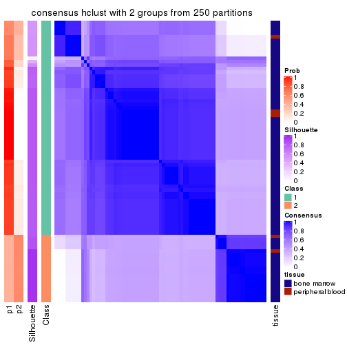</p>

</div>
<div id='tab-MAD-hclust-consensus-heatmap-2'>
<pre><code class="r">consensus_heatmap(res, k = 3)
</code></pre>

<p>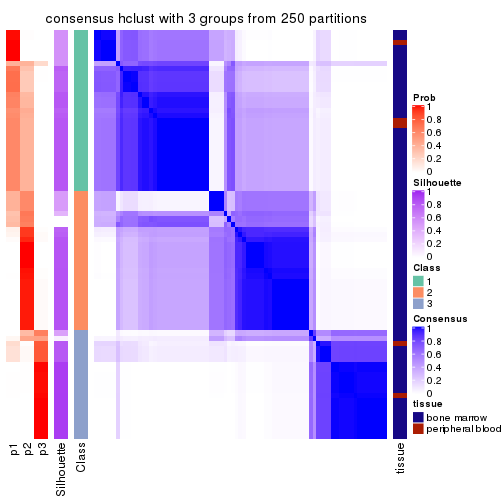</p>

</div>
<div id='tab-MAD-hclust-consensus-heatmap-3'>
<pre><code class="r">consensus_heatmap(res, k = 4)
</code></pre>

<p>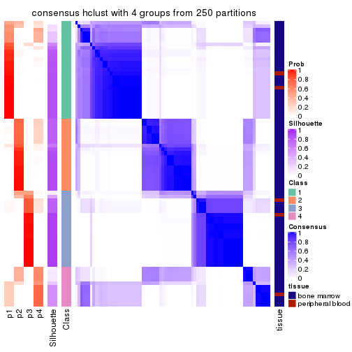</p>

</div>
<div id='tab-MAD-hclust-consensus-heatmap-4'>
<pre><code class="r">consensus_heatmap(res, k = 5)
</code></pre>

<p>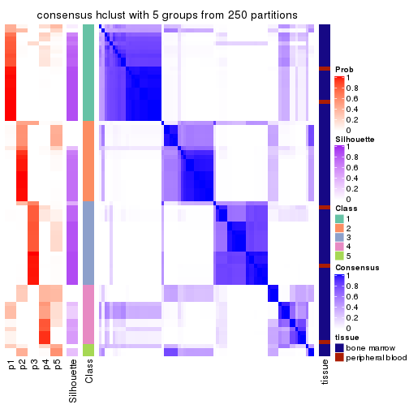</p>

</div>
<div id='tab-MAD-hclust-consensus-heatmap-5'>
<pre><code class="r">consensus_heatmap(res, k = 6)
</code></pre>

<p>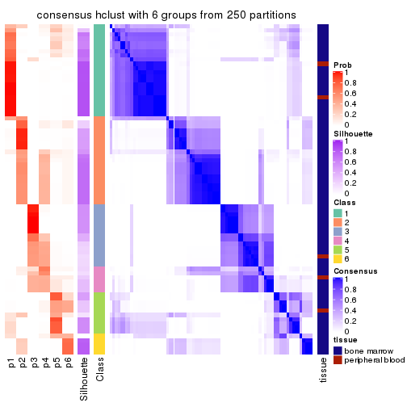</p>

</div>
</div>

Heatmaps for the membership of samples in all partitions to see how consistent they are:


<script>
$( function() {
	$( '#tabs-MAD-hclust-membership-heatmap' ).tabs();
} );
</script>
<div id='tabs-MAD-hclust-membership-heatmap'>
<ul>
<li><a href='#tab-MAD-hclust-membership-heatmap-1'>k = 2</a></li>
<li><a href='#tab-MAD-hclust-membership-heatmap-2'>k = 3</a></li>
<li><a href='#tab-MAD-hclust-membership-heatmap-3'>k = 4</a></li>
<li><a href='#tab-MAD-hclust-membership-heatmap-4'>k = 5</a></li>
<li><a href='#tab-MAD-hclust-membership-heatmap-5'>k = 6</a></li>
</ul>
<div id='tab-MAD-hclust-membership-heatmap-1'>
<pre><code class="r">membership_heatmap(res, k = 2)
</code></pre>

<p>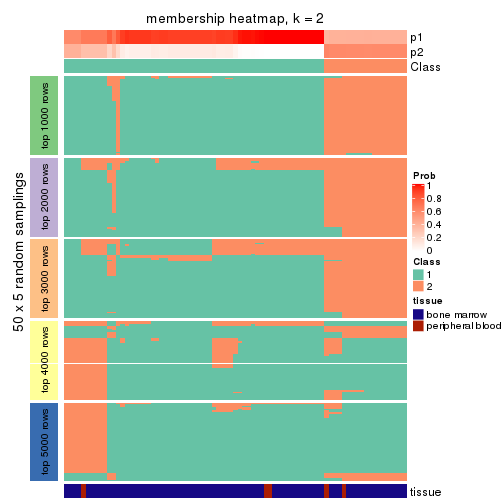</p>

</div>
<div id='tab-MAD-hclust-membership-heatmap-2'>
<pre><code class="r">membership_heatmap(res, k = 3)
</code></pre>

<p>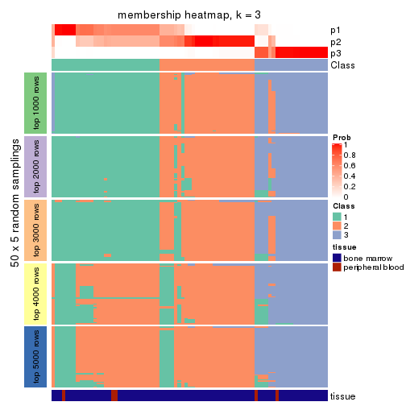</p>

</div>
<div id='tab-MAD-hclust-membership-heatmap-3'>
<pre><code class="r">membership_heatmap(res, k = 4)
</code></pre>

<p>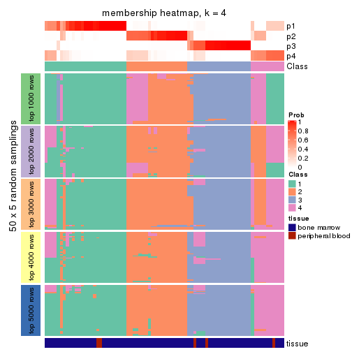</p>

</div>
<div id='tab-MAD-hclust-membership-heatmap-4'>
<pre><code class="r">membership_heatmap(res, k = 5)
</code></pre>

<p>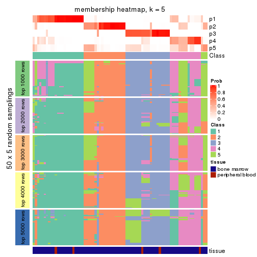</p>

</div>
<div id='tab-MAD-hclust-membership-heatmap-5'>
<pre><code class="r">membership_heatmap(res, k = 6)
</code></pre>

<p>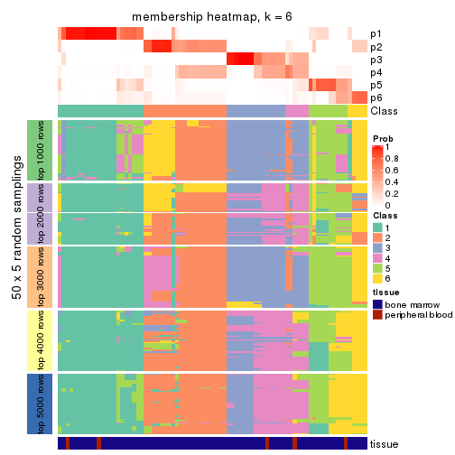</p>

</div>
</div>

As soon as we have had the classes for columns, we can look for signatures
which are significantly different between classes which can be candidate marks
for certain classes. Following are the heatmaps for signatures.


Signature heatmaps where rows are scaled:


<script>
$( function() {
	$( '#tabs-MAD-hclust-get-signatures' ).tabs();
} );
</script>
<div id='tabs-MAD-hclust-get-signatures'>
<ul>
<li><a href='#tab-MAD-hclust-get-signatures-1'>k = 2</a></li>
<li><a href='#tab-MAD-hclust-get-signatures-2'>k = 3</a></li>
<li><a href='#tab-MAD-hclust-get-signatures-3'>k = 4</a></li>
<li><a href='#tab-MAD-hclust-get-signatures-4'>k = 5</a></li>
<li><a href='#tab-MAD-hclust-get-signatures-5'>k = 6</a></li>
</ul>
<div id='tab-MAD-hclust-get-signatures-1'>
<pre><code class="r">get_signatures(res, k = 2)
</code></pre>

<p>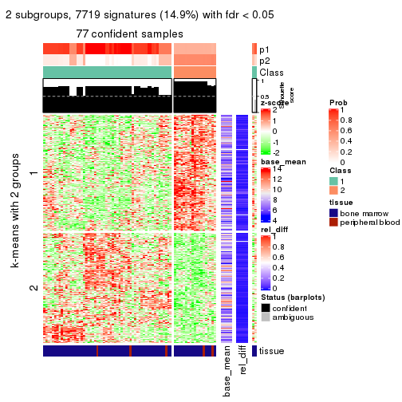</p>

</div>
<div id='tab-MAD-hclust-get-signatures-2'>
<pre><code class="r">get_signatures(res, k = 3)
</code></pre>

<p>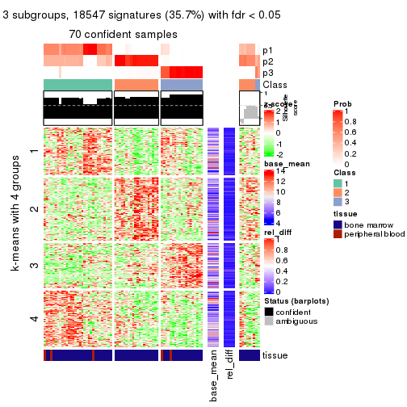</p>

</div>
<div id='tab-MAD-hclust-get-signatures-3'>
<pre><code class="r">get_signatures(res, k = 4)
</code></pre>

<p>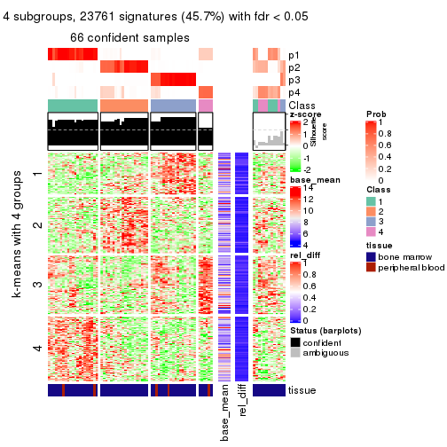</p>

</div>
<div id='tab-MAD-hclust-get-signatures-4'>
<pre><code class="r">get_signatures(res, k = 5)
</code></pre>

<p>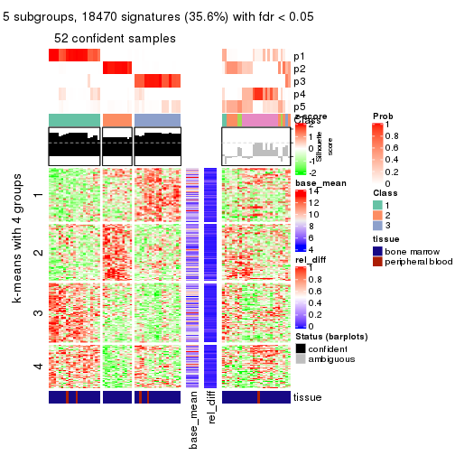</p>

</div>
<div id='tab-MAD-hclust-get-signatures-5'>
<pre><code class="r">get_signatures(res, k = 6)
</code></pre>

<p>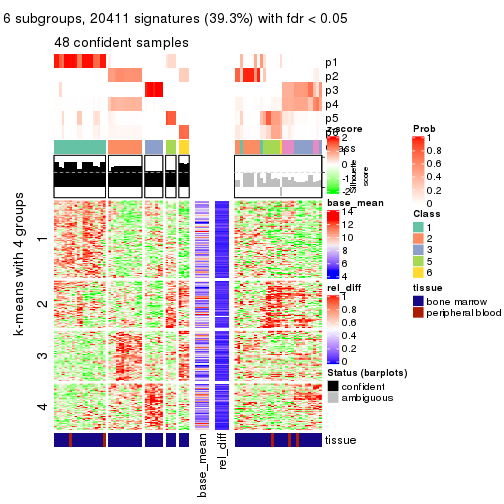</p>

</div>
</div>


Signature heatmaps where rows are not scaled:


<script>
$( function() {
	$( '#tabs-MAD-hclust-get-signatures-no-scale' ).tabs();
} );
</script>
<div id='tabs-MAD-hclust-get-signatures-no-scale'>
<ul>
<li><a href='#tab-MAD-hclust-get-signatures-no-scale-1'>k = 2</a></li>
<li><a href='#tab-MAD-hclust-get-signatures-no-scale-2'>k = 3</a></li>
<li><a href='#tab-MAD-hclust-get-signatures-no-scale-3'>k = 4</a></li>
<li><a href='#tab-MAD-hclust-get-signatures-no-scale-4'>k = 5</a></li>
<li><a href='#tab-MAD-hclust-get-signatures-no-scale-5'>k = 6</a></li>
</ul>
<div id='tab-MAD-hclust-get-signatures-no-scale-1'>
<pre><code class="r">get_signatures(res, k = 2, scale_rows = FALSE)
</code></pre>

<p>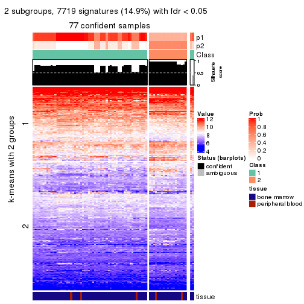</p>

</div>
<div id='tab-MAD-hclust-get-signatures-no-scale-2'>
<pre><code class="r">get_signatures(res, k = 3, scale_rows = FALSE)
</code></pre>

<p>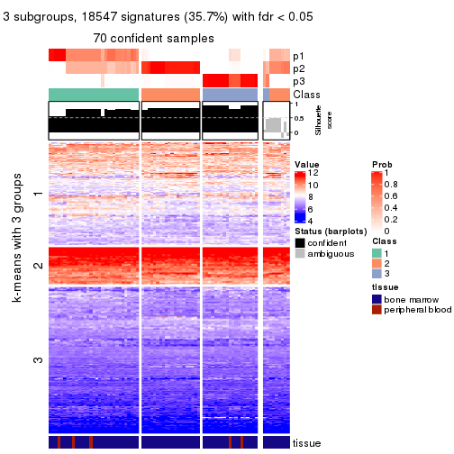</p>

</div>
<div id='tab-MAD-hclust-get-signatures-no-scale-3'>
<pre><code class="r">get_signatures(res, k = 4, scale_rows = FALSE)
</code></pre>

<p>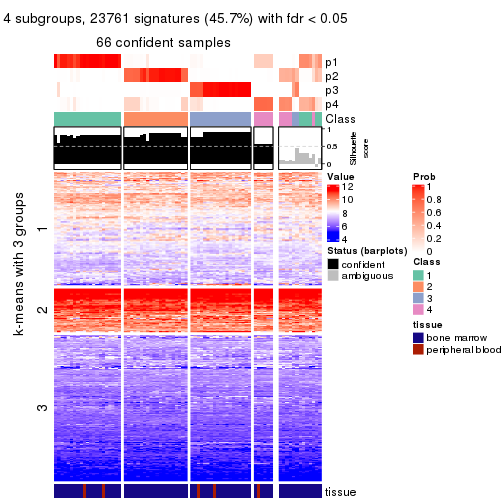</p>

</div>
<div id='tab-MAD-hclust-get-signatures-no-scale-4'>
<pre><code class="r">get_signatures(res, k = 5, scale_rows = FALSE)
</code></pre>

<p>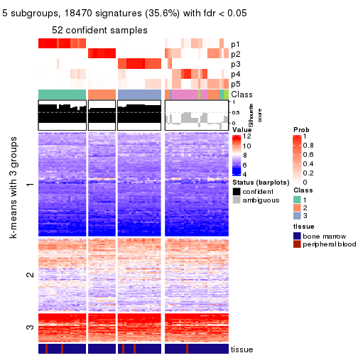</p>

</div>
<div id='tab-MAD-hclust-get-signatures-no-scale-5'>
<pre><code class="r">get_signatures(res, k = 6, scale_rows = FALSE)
</code></pre>

<p>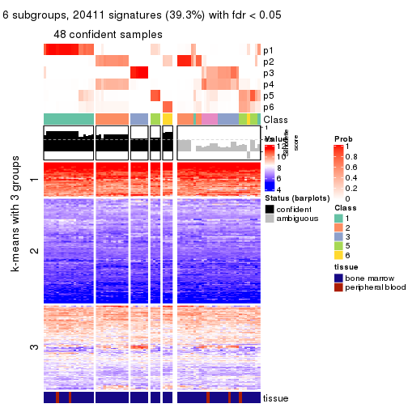</p>

</div>
</div>


Compare the overlap of signatures from different k:

```r
compare_signatures(res)
```

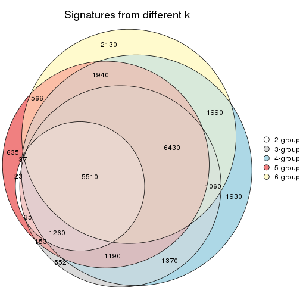

`get_signature()` returns a data frame invisibly. TO get the list of signatures, the function
call should be assigned to a variable explicitly. In following code, if `plot` argument is set
to `FALSE`, no heatmap is plotted while only the differential analysis is performed.

```r
# code only for demonstration
tb = get_signature(res, k = ..., plot = FALSE)
```

An example of the output of `tb` is:

```
#>   which_row         fdr    mean_1    mean_2 scaled_mean_1 scaled_mean_2 km
#> 1        38 0.042760348  8.373488  9.131774    -0.5533452     0.5164555  1
#> 2        40 0.018707592  7.106213  8.469186    -0.6173731     0.5762149  1
#> 3        55 0.019134737 10.221463 11.207825    -0.6159697     0.5749050  1
#> 4        59 0.006059896  5.921854  7.869574    -0.6899429     0.6439467  1
#> 5        60 0.018055526  8.928898 10.211722    -0.6204761     0.5791110  1
#> 6        98 0.009384629 15.714769 14.887706     0.6635654    -0.6193277  2
...
```

The columns in `tb` are:

1. `which_row`: row indices corresponding to the input matrix.
2. `fdr`: FDR for the differential test. 
3. `mean_x`: The mean value in group x.
4. `scaled_mean_x`: The mean value in group x after rows are scaled.
5. `km`: Row groups if k-means clustering is applied to rows.


UMAP plot which shows how samples are separated.


<script>
$( function() {
	$( '#tabs-MAD-hclust-dimension-reduction' ).tabs();
} );
</script>
<div id='tabs-MAD-hclust-dimension-reduction'>
<ul>
<li><a href='#tab-MAD-hclust-dimension-reduction-1'>k = 2</a></li>
<li><a href='#tab-MAD-hclust-dimension-reduction-2'>k = 3</a></li>
<li><a href='#tab-MAD-hclust-dimension-reduction-3'>k = 4</a></li>
<li><a href='#tab-MAD-hclust-dimension-reduction-4'>k = 5</a></li>
<li><a href='#tab-MAD-hclust-dimension-reduction-5'>k = 6</a></li>
</ul>
<div id='tab-MAD-hclust-dimension-reduction-1'>
<pre><code class="r">dimension_reduction(res, k = 2, method = &quot;UMAP&quot;)
</code></pre>

<p>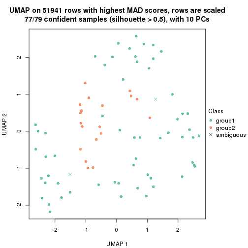</p>

</div>
<div id='tab-MAD-hclust-dimension-reduction-2'>
<pre><code class="r">dimension_reduction(res, k = 3, method = &quot;UMAP&quot;)
</code></pre>

<p>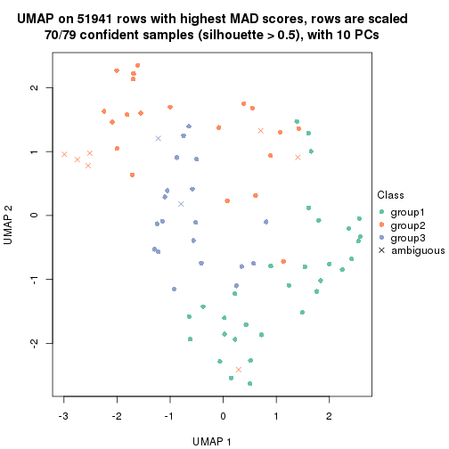</p>

</div>
<div id='tab-MAD-hclust-dimension-reduction-3'>
<pre><code class="r">dimension_reduction(res, k = 4, method = &quot;UMAP&quot;)
</code></pre>

<p>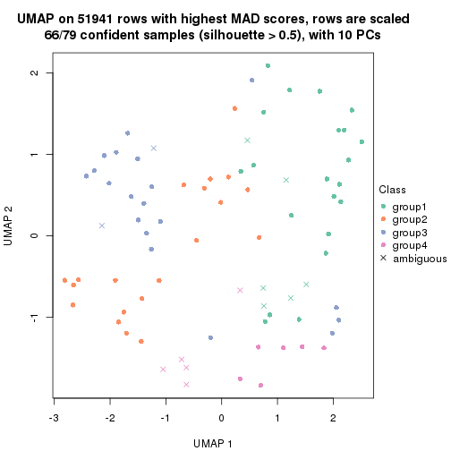</p>

</div>
<div id='tab-MAD-hclust-dimension-reduction-4'>
<pre><code class="r">dimension_reduction(res, k = 5, method = &quot;UMAP&quot;)
</code></pre>

<p>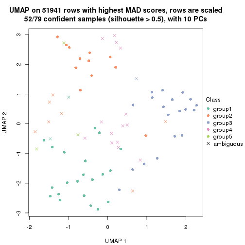</p>

</div>
<div id='tab-MAD-hclust-dimension-reduction-5'>
<pre><code class="r">dimension_reduction(res, k = 6, method = &quot;UMAP&quot;)
</code></pre>

<p>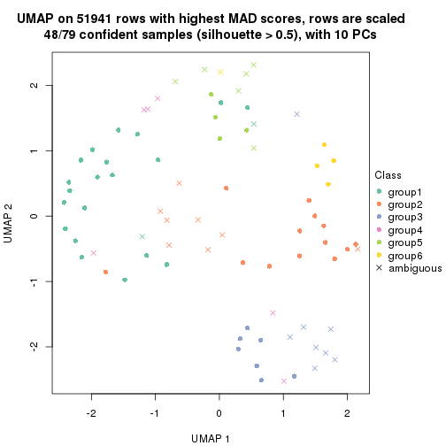</p>

</div>
</div>


Following heatmap shows how subgroups are split when increasing `k`:

```r
collect_classes(res)
```

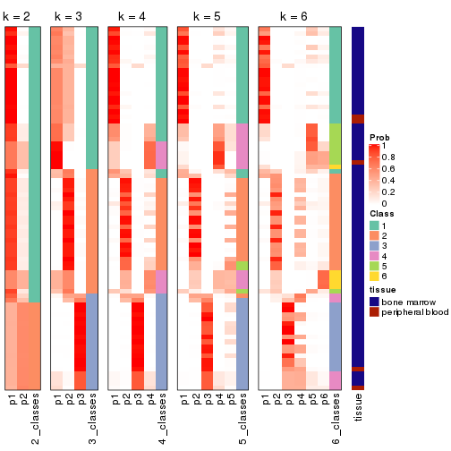


Test correlation between subgroups and known annotations. If the known
annotation is numeric, one-way ANOVA test is applied, and if the known
annotation is discrete, chi-squared contingency table test is applied.

```r
test_to_known_factors(res)
```

```
#>             n tissue(p) k
#> MAD:hclust 77     0.775 2
#> MAD:hclust 70     0.338 3
#> MAD:hclust 66     0.441 4
#> MAD:hclust 52     0.518 5
#> MAD:hclust 48     0.571 6
```


If matrix rows can be associated to genes, consider to use `GO_Enrichment(res,
...)` to perform function enrichment for the signature genes.


 

---------------------------------------------------


### MAD:kmeans


The object with results only for a single top-value method and a single partition method 
can be extracted as:

```r
res = res_list["MAD", "kmeans"]
# you can also extract it by
# res = res_list["MAD:kmeans"]
```

A summary of `res` and all the functions that can be applied to it:

```r
res
```

```
#> A 'ConsensusPartition' object with k = 2, 3, 4, 5, 6.
#>   On a matrix with 51941 rows and 79 columns.
#>   Top rows (1000, 2000, 3000, 4000, 5000) are extracted by 'MAD' method.
#>   Subgroups are detected by 'kmeans' method.
#>   Performed in total 1250 partitions by row resampling.
#>   Best k for subgroups seems to be 4.
#> 
#> Following methods can be applied to this 'ConsensusPartition' object:
#>  [1] "cola_report"             "collect_classes"         "collect_plots"          
#>  [4] "collect_stats"           "colnames"                "compare_signatures"     
#>  [7] "consensus_heatmap"       "dimension_reduction"     "functional_enrichment"  
#> [10] "get_anno_col"            "get_anno"                "get_classes"            
#> [13] "get_consensus"           "get_matrix"              "get_membership"         
#> [16] "get_param"               "get_signatures"          "get_stats"              
#> [19] "is_best_k"               "is_stable_k"             "membership_heatmap"     
#> [22] "ncol"                    "nrow"                    "plot_ecdf"              
#> [25] "rownames"                "select_partition_number" "show"                   
#> [28] "suggest_best_k"          "test_to_known_factors"
```

`collect_plots()` function collects all the plots made from `res` for all `k` (number of partitions)
into one single page to provide an easy and fast comparison between different `k`.

```r
collect_plots(res)
```

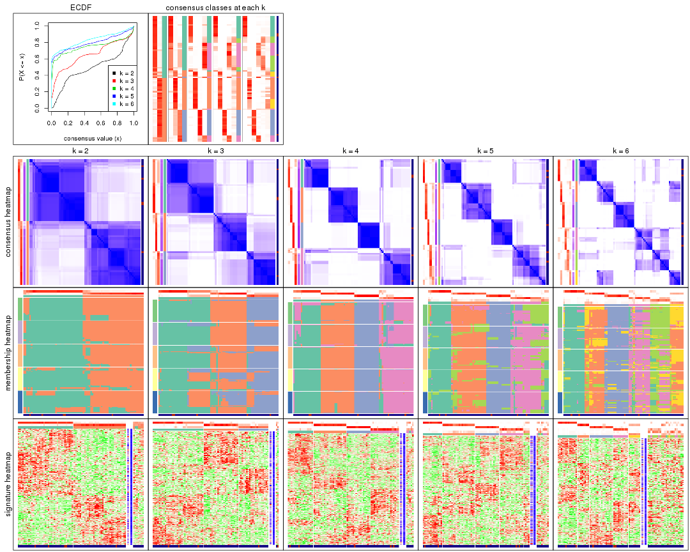

The plots are:

- The first row: a plot of the ECDF (Empirical cumulative distribution
  function) curves of the consensus matrix for each `k` and the heatmap of
  predicted classes for each `k`.
- The second row: heatmaps of the consensus matrix for each `k`.
- The third row: heatmaps of the membership matrix for each `k`.
- The fouth row: heatmaps of the signatures for each `k`.

All the plots in panels can be made by individual functions and they are
plotted later in this section.

`select_partition_number()` produces several plots showing different
statistics for choosing "optimized" `k`. There are following statistics:

- ECDF curves of the consensus matrix for each `k`;
- 1-PAC. [The PAC
  score](https://en.wikipedia.org/wiki/Consensus_clustering#Over-interpretation_potential_of_consensus_clustering)
  measures the proportion of the ambiguous subgrouping.
- Mean silhouette score.
- Concordance. The mean probability of fiting the consensus class ids in all
  partitions.
- Area increased. Denote $A_k$ as the area under the ECDF curve for current
  `k`, the area increased is defined as $A_k - A_{k-1}$.
- Rand index. The percent of pairs of samples that are both in a same cluster
  or both are not in a same cluster in the partition of k and k-1.
- Jaccard index. The ratio of pairs of samples are both in a same cluster in
  the partition of k and k-1 and the pairs of samples are both in a same
  cluster in the partition k or k-1.

The detailed explanations of these statistics can be found in [the cola
vignette](http://bioconductor.org/packages/devel/bioc/vignettes/cola/inst/doc/cola.html#toc_13).

Generally speaking, lower PAC score, higher mean silhouette score or higher
concordance corresponds to better partition. Rand index and Jaccard index
measure how similar the current partition is compared to partition with `k-1`.
If they are too similar, we won't accept `k` is better than `k-1`.

```r
select_partition_number(res)
```

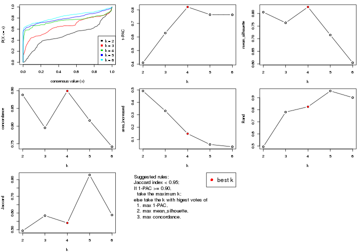

The numeric values for all these statistics can be obtained by `get_stats()`.

```r
get_stats(res)
```

```
#>   k 1-PAC mean_silhouette concordance area_increased  Rand Jaccard
#> 2 2 0.410           0.805       0.888         0.4920 0.494   0.494
#> 3 3 0.629           0.763       0.795         0.3312 0.781   0.584
#> 4 4 0.822           0.826       0.899         0.1471 0.825   0.541
#> 5 5 0.765           0.715       0.816         0.0600 0.956   0.828
#> 6 6 0.764           0.605       0.742         0.0416 0.901   0.588
```

`suggest_best_k()` suggests the best $k$ based on these statistics. The rules are as follows:

- All $k$ with Jaccard index larger than 0.95 are removed because the increase of
  the partition number does not provides enough extra information. If all $k$ are removed,
  the best $k$ is assigned by `NA`.
- For $k$ with 1-PAC larger than 0.9, the maximal $k$ is taken as the "best k". Other $k$ is called "optional k".
- If it does not fit the second rule. The $k$ with the highest vote of highest
  1-PAC, mean silhouette and concordance is taken as the "best k".

```r
suggest_best_k(res)
```

```
#> [1] 4
```


Following shows the table of the partitions (You need to click the **show/hide
code output** link to see it). The membership matrix (columns with name `p*`)
is inferred by
[`clue::cl_consensus()`](https://www.rdocumentation.org/link/cl_consensus?package=clue)
function with the `SE` method. Basically the value in the membership matrix
represents the probability to belong to a certain group. The finall class
label for an item is determined with the group with highest probability it
belongs to.

In `get_classes()` function, the entropy is calculated from the membership
matrix and the silhouette score is calculated from the consensus matrix.


<script>
$( function() {
	$( '#tabs-MAD-kmeans-get-classes' ).tabs();
} );
</script>
<div id='tabs-MAD-kmeans-get-classes'>
<ul>
<li><a href='#tab-MAD-kmeans-get-classes-1'>k = 2</a></li>
<li><a href='#tab-MAD-kmeans-get-classes-2'>k = 3</a></li>
<li><a href='#tab-MAD-kmeans-get-classes-3'>k = 4</a></li>
<li><a href='#tab-MAD-kmeans-get-classes-4'>k = 5</a></li>
<li><a href='#tab-MAD-kmeans-get-classes-5'>k = 6</a></li>
</ul>

<div id='tab-MAD-kmeans-get-classes-1'>
<p><a id='tab-MAD-kmeans-get-classes-1-a' style='color:#0366d6' href='#'>show/hide code output</a></p>
<pre><code class="r">cbind(get_classes(res, k = 2), get_membership(res, k = 2))
</code></pre>

<pre><code>#&gt;           class entropy silhouette    p1    p2
#&gt; GSM316652     2  0.2778     0.8609 0.048 0.952
#&gt; GSM316653     1  0.4022     0.8798 0.920 0.080
#&gt; GSM316654     1  0.4022     0.8798 0.920 0.080
#&gt; GSM316655     1  0.3733     0.8820 0.928 0.072
#&gt; GSM316656     1  0.8207     0.6961 0.744 0.256
#&gt; GSM316657     1  0.2948     0.8946 0.948 0.052
#&gt; GSM316658     2  0.5629     0.8296 0.132 0.868
#&gt; GSM316659     2  0.6148     0.8379 0.152 0.848
#&gt; GSM316660     1  0.2778     0.8953 0.952 0.048
#&gt; GSM316661     1  0.4022     0.8798 0.920 0.080
#&gt; GSM316662     2  0.1414     0.8596 0.020 0.980
#&gt; GSM316663     2  0.5059     0.8510 0.112 0.888
#&gt; GSM316664     1  0.2948     0.8834 0.948 0.052
#&gt; GSM316665     2  0.1843     0.8586 0.028 0.972
#&gt; GSM316666     2  0.4161     0.8532 0.084 0.916
#&gt; GSM316667     2  0.5178     0.8398 0.116 0.884
#&gt; GSM316668     2  0.0672     0.8619 0.008 0.992
#&gt; GSM316669     1  0.4022     0.8798 0.920 0.080
#&gt; GSM316670     2  0.3431     0.8547 0.064 0.936
#&gt; GSM316671     2  0.2948     0.8626 0.052 0.948
#&gt; GSM316672     1  0.4161     0.8721 0.916 0.084
#&gt; GSM316673     1  0.0938     0.8873 0.988 0.012
#&gt; GSM316674     2  0.4022     0.8547 0.080 0.920
#&gt; GSM316676     2  0.4022     0.8547 0.080 0.920
#&gt; GSM316677     1  0.2043     0.8945 0.968 0.032
#&gt; GSM316678     1  0.9963     0.0664 0.536 0.464
#&gt; GSM316679     1  0.3114     0.8937 0.944 0.056
#&gt; GSM316680     1  0.3114     0.8937 0.944 0.056
#&gt; GSM316681     2  0.2423     0.8633 0.040 0.960
#&gt; GSM316682     1  0.4022     0.8798 0.920 0.080
#&gt; GSM316683     1  0.3879     0.8812 0.924 0.076
#&gt; GSM316684     2  0.5629     0.8296 0.132 0.868
#&gt; GSM316685     2  0.0000     0.8618 0.000 1.000
#&gt; GSM316686     1  0.7815     0.6861 0.768 0.232
#&gt; GSM316687     2  0.9988     0.1499 0.480 0.520
#&gt; GSM316688     2  0.9866     0.2977 0.432 0.568
#&gt; GSM316689     1  0.2948     0.8946 0.948 0.052
#&gt; GSM316690     2  0.4161     0.8532 0.084 0.916
#&gt; GSM316691     2  0.2948     0.8625 0.052 0.948
#&gt; GSM316692     2  0.4161     0.8532 0.084 0.916
#&gt; GSM316693     1  0.4022     0.8798 0.920 0.080
#&gt; GSM316694     2  0.4022     0.8547 0.080 0.920
#&gt; GSM316696     1  0.2948     0.8946 0.948 0.052
#&gt; GSM316697     2  0.4022     0.8547 0.080 0.920
#&gt; GSM316698     2  0.6973     0.7852 0.188 0.812
#&gt; GSM316699     2  0.1184     0.8611 0.016 0.984
#&gt; GSM316700     1  0.4022     0.8798 0.920 0.080
#&gt; GSM316701     1  0.3879     0.8812 0.924 0.076
#&gt; GSM316703     2  0.6148     0.8379 0.152 0.848
#&gt; GSM316704     2  0.6048     0.8379 0.148 0.852
#&gt; GSM316705     1  0.0938     0.8873 0.988 0.012
#&gt; GSM316706     1  0.5294     0.8667 0.880 0.120
#&gt; GSM316707     2  0.5629     0.8296 0.132 0.868
#&gt; GSM316708     1  0.9977     0.0178 0.528 0.472
#&gt; GSM316709     2  0.4022     0.8547 0.080 0.920
#&gt; GSM316710     1  0.4022     0.8798 0.920 0.080
#&gt; GSM316711     2  0.6148     0.8379 0.152 0.848
#&gt; GSM316713     1  0.2043     0.8945 0.968 0.032
#&gt; GSM316714     2  0.9491     0.4638 0.368 0.632
#&gt; GSM316715     1  0.3114     0.8937 0.944 0.056
#&gt; GSM316716     2  0.1843     0.8586 0.028 0.972
#&gt; GSM316717     1  0.3114     0.8937 0.944 0.056
#&gt; GSM316718     2  0.9977     0.1668 0.472 0.528
#&gt; GSM316719     1  0.2948     0.8947 0.948 0.052
#&gt; GSM316720     1  0.3114     0.8937 0.944 0.056
#&gt; GSM316721     2  0.1843     0.8586 0.028 0.972
#&gt; GSM316722     1  0.3114     0.8937 0.944 0.056
#&gt; GSM316723     2  0.4815     0.8432 0.104 0.896
#&gt; GSM316724     2  0.6247     0.8139 0.156 0.844
#&gt; GSM316726     2  0.1843     0.8586 0.028 0.972
#&gt; GSM316727     1  0.3114     0.8937 0.944 0.056
#&gt; GSM316728     2  0.9686     0.4194 0.396 0.604
#&gt; GSM316729     1  0.3431     0.8936 0.936 0.064
#&gt; GSM316730     2  0.6048     0.8176 0.148 0.852
#&gt; GSM316675     2  0.4161     0.8532 0.084 0.916
#&gt; GSM316695     1  0.2948     0.8946 0.948 0.052
#&gt; GSM316702     1  0.5946     0.8212 0.856 0.144
#&gt; GSM316712     1  0.2778     0.8953 0.952 0.048
#&gt; GSM316725     1  0.4022     0.8798 0.920 0.080
</code></pre>

<script>
$('#tab-MAD-kmeans-get-classes-1-a').parent().next().next().hide();
$('#tab-MAD-kmeans-get-classes-1-a').click(function(){
  $('#tab-MAD-kmeans-get-classes-1-a').parent().next().next().toggle();
  return(false);
});
</script>
</div>

<div id='tab-MAD-kmeans-get-classes-2'>
<p><a id='tab-MAD-kmeans-get-classes-2-a' style='color:#0366d6' href='#'>show/hide code output</a></p>
<pre><code class="r">cbind(get_classes(res, k = 3), get_membership(res, k = 3))
</code></pre>

<pre><code>#&gt;           class entropy silhouette    p1    p2    p3
#&gt; GSM316652     3  0.5529     0.8450 0.000 0.296 0.704
#&gt; GSM316653     1  0.6954     0.7450 0.620 0.028 0.352
#&gt; GSM316654     1  0.7065     0.7439 0.616 0.032 0.352
#&gt; GSM316655     1  0.7065     0.7439 0.616 0.032 0.352
#&gt; GSM316656     1  0.8637     0.6261 0.596 0.236 0.168
#&gt; GSM316657     1  0.1031     0.7969 0.976 0.024 0.000
#&gt; GSM316658     2  0.0000     0.8399 0.000 1.000 0.000
#&gt; GSM316659     2  0.2229     0.8238 0.012 0.944 0.044
#&gt; GSM316660     1  0.1031     0.7969 0.976 0.024 0.000
#&gt; GSM316661     1  0.7065     0.7439 0.616 0.032 0.352
#&gt; GSM316662     3  0.5650     0.8301 0.000 0.312 0.688
#&gt; GSM316663     3  0.3181     0.6205 0.024 0.064 0.912
#&gt; GSM316664     1  0.6193     0.7562 0.692 0.016 0.292
#&gt; GSM316665     2  0.1411     0.8153 0.000 0.964 0.036
#&gt; GSM316666     3  0.5397     0.8474 0.000 0.280 0.720
#&gt; GSM316667     2  0.0000     0.8399 0.000 1.000 0.000
#&gt; GSM316668     3  0.5650     0.8301 0.000 0.312 0.688
#&gt; GSM316669     1  0.6954     0.7450 0.620 0.028 0.352
#&gt; GSM316670     3  0.5497     0.8462 0.000 0.292 0.708
#&gt; GSM316671     3  0.5815     0.8359 0.004 0.304 0.692
#&gt; GSM316672     2  0.6062     0.5360 0.384 0.616 0.000
#&gt; GSM316673     1  0.0237     0.8013 0.996 0.000 0.004
#&gt; GSM316674     3  0.5529     0.8450 0.000 0.296 0.704
#&gt; GSM316676     3  0.5497     0.8462 0.000 0.292 0.708
#&gt; GSM316677     1  0.2590     0.8039 0.924 0.004 0.072
#&gt; GSM316678     2  0.4974     0.7006 0.236 0.764 0.000
#&gt; GSM316679     1  0.2187     0.8000 0.948 0.024 0.028
#&gt; GSM316680     1  0.2313     0.8003 0.944 0.024 0.032
#&gt; GSM316681     3  0.5591     0.8384 0.000 0.304 0.696
#&gt; GSM316682     1  0.7065     0.7439 0.616 0.032 0.352
#&gt; GSM316683     1  0.7065     0.7439 0.616 0.032 0.352
#&gt; GSM316684     2  0.0000     0.8399 0.000 1.000 0.000
#&gt; GSM316685     3  0.5678     0.8249 0.000 0.316 0.684
#&gt; GSM316686     1  0.7705     0.6945 0.592 0.060 0.348
#&gt; GSM316687     3  0.5094     0.5149 0.112 0.056 0.832
#&gt; GSM316688     2  0.7481     0.3738 0.356 0.596 0.048
#&gt; GSM316689     1  0.1031     0.7969 0.976 0.024 0.000
#&gt; GSM316690     3  0.5397     0.8474 0.000 0.280 0.720
#&gt; GSM316691     2  0.0424     0.8365 0.000 0.992 0.008
#&gt; GSM316692     3  0.5397     0.8474 0.000 0.280 0.720
#&gt; GSM316693     1  0.7065     0.7439 0.616 0.032 0.352
#&gt; GSM316694     3  0.5529     0.8450 0.000 0.296 0.704
#&gt; GSM316696     1  0.1031     0.7969 0.976 0.024 0.000
#&gt; GSM316697     3  0.5397     0.8474 0.000 0.280 0.720
#&gt; GSM316698     2  0.2959     0.8029 0.100 0.900 0.000
#&gt; GSM316699     2  0.1411     0.8153 0.000 0.964 0.036
#&gt; GSM316700     1  0.7065     0.7439 0.616 0.032 0.352
#&gt; GSM316701     1  0.6954     0.7450 0.620 0.028 0.352
#&gt; GSM316703     2  0.3528     0.7895 0.016 0.892 0.092
#&gt; GSM316704     2  0.3528     0.7895 0.016 0.892 0.092
#&gt; GSM316705     1  0.4351     0.7833 0.828 0.004 0.168
#&gt; GSM316706     2  0.6976     0.6110 0.064 0.700 0.236
#&gt; GSM316707     2  0.0000     0.8399 0.000 1.000 0.000
#&gt; GSM316708     2  0.5291     0.6747 0.268 0.732 0.000
#&gt; GSM316709     3  0.5397     0.8474 0.000 0.280 0.720
#&gt; GSM316710     1  0.7065     0.7439 0.616 0.032 0.352
#&gt; GSM316711     2  0.2229     0.8238 0.012 0.944 0.044
#&gt; GSM316713     1  0.0592     0.7995 0.988 0.012 0.000
#&gt; GSM316714     3  0.2187     0.6337 0.024 0.028 0.948
#&gt; GSM316715     1  0.1031     0.7969 0.976 0.024 0.000
#&gt; GSM316716     2  0.1411     0.8153 0.000 0.964 0.036
#&gt; GSM316717     1  0.2313     0.8003 0.944 0.024 0.032
#&gt; GSM316718     2  0.5098     0.6915 0.248 0.752 0.000
#&gt; GSM316719     1  0.1031     0.7969 0.976 0.024 0.000
#&gt; GSM316720     1  0.1031     0.7969 0.976 0.024 0.000
#&gt; GSM316721     2  0.0892     0.8282 0.000 0.980 0.020
#&gt; GSM316722     1  0.2434     0.8007 0.940 0.024 0.036
#&gt; GSM316723     2  0.0237     0.8383 0.000 0.996 0.004
#&gt; GSM316724     2  0.0424     0.8398 0.008 0.992 0.000
#&gt; GSM316726     2  0.0892     0.8282 0.000 0.980 0.020
#&gt; GSM316727     1  0.1031     0.7969 0.976 0.024 0.000
#&gt; GSM316728     3  0.4665     0.5235 0.100 0.048 0.852
#&gt; GSM316729     1  0.4676     0.7649 0.848 0.112 0.040
#&gt; GSM316730     2  0.3039     0.8233 0.036 0.920 0.044
#&gt; GSM316675     3  0.5397     0.8474 0.000 0.280 0.720
#&gt; GSM316695     1  0.1031     0.7969 0.976 0.024 0.000
#&gt; GSM316702     3  0.6355    -0.0305 0.280 0.024 0.696
#&gt; GSM316712     1  0.1031     0.7969 0.976 0.024 0.000
#&gt; GSM316725     1  0.7065     0.7439 0.616 0.032 0.352
</code></pre>

<script>
$('#tab-MAD-kmeans-get-classes-2-a').parent().next().next().hide();
$('#tab-MAD-kmeans-get-classes-2-a').click(function(){
  $('#tab-MAD-kmeans-get-classes-2-a').parent().next().next().toggle();
  return(false);
});
</script>
</div>

<div id='tab-MAD-kmeans-get-classes-3'>
<p><a id='tab-MAD-kmeans-get-classes-3-a' style='color:#0366d6' href='#'>show/hide code output</a></p>
<pre><code class="r">cbind(get_classes(res, k = 4), get_membership(res, k = 4))
</code></pre>

<pre><code>#&gt;           class entropy silhouette    p1    p2    p3    p4
#&gt; GSM316652     3  0.0188      0.989 0.000 0.004 0.996 0.000
#&gt; GSM316653     4  0.1396      0.784 0.032 0.004 0.004 0.960
#&gt; GSM316654     4  0.0188      0.789 0.000 0.000 0.004 0.996
#&gt; GSM316655     4  0.1396      0.784 0.032 0.004 0.004 0.960
#&gt; GSM316656     4  0.1262      0.784 0.008 0.016 0.008 0.968
#&gt; GSM316657     1  0.1940      0.893 0.924 0.000 0.000 0.076
#&gt; GSM316658     2  0.1059      0.958 0.012 0.972 0.016 0.000
#&gt; GSM316659     2  0.0188      0.956 0.000 0.996 0.004 0.000
#&gt; GSM316660     1  0.1940      0.893 0.924 0.000 0.000 0.076
#&gt; GSM316661     4  0.0188      0.789 0.000 0.000 0.004 0.996
#&gt; GSM316662     3  0.0188      0.989 0.000 0.004 0.996 0.000
#&gt; GSM316663     4  0.4599      0.641 0.000 0.016 0.248 0.736
#&gt; GSM316664     4  0.4804      0.550 0.276 0.016 0.000 0.708
#&gt; GSM316665     2  0.2174      0.953 0.052 0.928 0.020 0.000
#&gt; GSM316666     3  0.0188      0.988 0.000 0.000 0.996 0.004
#&gt; GSM316667     2  0.2256      0.953 0.056 0.924 0.020 0.000
#&gt; GSM316668     3  0.0188      0.989 0.000 0.004 0.996 0.000
#&gt; GSM316669     4  0.1396      0.784 0.032 0.004 0.004 0.960
#&gt; GSM316670     3  0.1938      0.939 0.052 0.012 0.936 0.000
#&gt; GSM316671     3  0.0000      0.987 0.000 0.000 1.000 0.000
#&gt; GSM316672     1  0.3157      0.737 0.852 0.144 0.004 0.000
#&gt; GSM316673     1  0.1940      0.893 0.924 0.000 0.000 0.076
#&gt; GSM316674     3  0.0188      0.989 0.000 0.004 0.996 0.000
#&gt; GSM316676     3  0.0188      0.989 0.000 0.004 0.996 0.000
#&gt; GSM316677     4  0.4994     -0.282 0.480 0.000 0.000 0.520
#&gt; GSM316678     2  0.1209      0.948 0.032 0.964 0.004 0.000
#&gt; GSM316679     1  0.4431      0.744 0.740 0.004 0.004 0.252
#&gt; GSM316680     1  0.4786      0.672 0.688 0.004 0.004 0.304
#&gt; GSM316681     3  0.0188      0.989 0.000 0.004 0.996 0.000
#&gt; GSM316682     4  0.1396      0.784 0.032 0.004 0.004 0.960
#&gt; GSM316683     4  0.1209      0.782 0.032 0.004 0.000 0.964
#&gt; GSM316684     2  0.1059      0.956 0.012 0.972 0.016 0.000
#&gt; GSM316685     3  0.1938      0.939 0.052 0.012 0.936 0.000
#&gt; GSM316686     4  0.4809      0.565 0.252 0.016 0.004 0.728
#&gt; GSM316687     4  0.4599      0.640 0.000 0.016 0.248 0.736
#&gt; GSM316688     4  0.8113      0.283 0.200 0.328 0.020 0.452
#&gt; GSM316689     1  0.1940      0.893 0.924 0.000 0.000 0.076
#&gt; GSM316690     3  0.0188      0.988 0.000 0.000 0.996 0.004
#&gt; GSM316691     2  0.2256      0.953 0.056 0.924 0.020 0.000
#&gt; GSM316692     3  0.0188      0.988 0.000 0.000 0.996 0.004
#&gt; GSM316693     4  0.0779      0.789 0.000 0.016 0.004 0.980
#&gt; GSM316694     3  0.0188      0.989 0.000 0.004 0.996 0.000
#&gt; GSM316696     1  0.1940      0.893 0.924 0.000 0.000 0.076
#&gt; GSM316697     3  0.0188      0.988 0.000 0.000 0.996 0.004
#&gt; GSM316698     2  0.1284      0.953 0.024 0.964 0.012 0.000
#&gt; GSM316699     2  0.2256      0.953 0.056 0.924 0.020 0.000
#&gt; GSM316700     4  0.0376      0.789 0.000 0.004 0.004 0.992
#&gt; GSM316701     4  0.1396      0.784 0.032 0.004 0.004 0.960
#&gt; GSM316703     2  0.0469      0.953 0.012 0.988 0.000 0.000
#&gt; GSM316704     2  0.0469      0.953 0.012 0.988 0.000 0.000
#&gt; GSM316705     1  0.4817      0.366 0.612 0.000 0.000 0.388
#&gt; GSM316706     2  0.0469      0.953 0.012 0.988 0.000 0.000
#&gt; GSM316707     2  0.2060      0.954 0.052 0.932 0.016 0.000
#&gt; GSM316708     2  0.2944      0.865 0.128 0.868 0.004 0.000
#&gt; GSM316709     3  0.0188      0.988 0.000 0.000 0.996 0.004
#&gt; GSM316710     4  0.0779      0.789 0.000 0.016 0.004 0.980
#&gt; GSM316711     2  0.1807      0.953 0.052 0.940 0.008 0.000
#&gt; GSM316713     1  0.1940      0.893 0.924 0.000 0.000 0.076
#&gt; GSM316714     4  0.5217      0.418 0.000 0.012 0.380 0.608
#&gt; GSM316715     1  0.1867      0.892 0.928 0.000 0.000 0.072
#&gt; GSM316716     2  0.2256      0.953 0.056 0.924 0.020 0.000
#&gt; GSM316717     1  0.4661      0.706 0.708 0.004 0.004 0.284
#&gt; GSM316718     2  0.2944      0.865 0.128 0.868 0.004 0.000
#&gt; GSM316719     1  0.1867      0.892 0.928 0.000 0.000 0.072
#&gt; GSM316720     1  0.1867      0.892 0.928 0.000 0.000 0.072
#&gt; GSM316721     2  0.2256      0.953 0.056 0.924 0.020 0.000
#&gt; GSM316722     1  0.5030      0.599 0.640 0.004 0.004 0.352
#&gt; GSM316723     2  0.1174      0.956 0.012 0.968 0.020 0.000
#&gt; GSM316724     2  0.1406      0.954 0.024 0.960 0.016 0.000
#&gt; GSM316726     2  0.2256      0.953 0.056 0.924 0.020 0.000
#&gt; GSM316727     1  0.1867      0.892 0.928 0.000 0.000 0.072
#&gt; GSM316728     4  0.4567      0.644 0.000 0.016 0.244 0.740
#&gt; GSM316729     4  0.7960     -0.211 0.372 0.248 0.004 0.376
#&gt; GSM316730     2  0.0927      0.955 0.016 0.976 0.008 0.000
#&gt; GSM316675     3  0.0188      0.988 0.000 0.000 0.996 0.004
#&gt; GSM316695     1  0.1940      0.893 0.924 0.000 0.000 0.076
#&gt; GSM316702     4  0.4095      0.697 0.000 0.016 0.192 0.792
#&gt; GSM316712     1  0.1940      0.893 0.924 0.000 0.000 0.076
#&gt; GSM316725     4  0.0779      0.789 0.000 0.016 0.004 0.980
</code></pre>

<script>
$('#tab-MAD-kmeans-get-classes-3-a').parent().next().next().hide();
$('#tab-MAD-kmeans-get-classes-3-a').click(function(){
  $('#tab-MAD-kmeans-get-classes-3-a').parent().next().next().toggle();
  return(false);
});
</script>
</div>

<div id='tab-MAD-kmeans-get-classes-4'>
<p><a id='tab-MAD-kmeans-get-classes-4-a' style='color:#0366d6' href='#'>show/hide code output</a></p>
<pre><code class="r">cbind(get_classes(res, k = 5), get_membership(res, k = 5))
</code></pre>

<pre><code>#&gt;           class entropy silhouette    p1    p2    p3    p4    p5
#&gt; GSM316652     3  0.1197      0.931 0.000 0.000 0.952 0.000 0.048
#&gt; GSM316653     4  0.4541      0.568 0.032 0.000 0.000 0.680 0.288
#&gt; GSM316654     4  0.1251      0.679 0.008 0.000 0.000 0.956 0.036
#&gt; GSM316655     4  0.4565      0.532 0.028 0.000 0.000 0.664 0.308
#&gt; GSM316656     5  0.5037      0.318 0.000 0.048 0.000 0.336 0.616
#&gt; GSM316657     1  0.0609      0.862 0.980 0.000 0.000 0.000 0.020
#&gt; GSM316658     2  0.2280      0.811 0.000 0.880 0.000 0.000 0.120
#&gt; GSM316659     2  0.1341      0.809 0.000 0.944 0.000 0.000 0.056
#&gt; GSM316660     1  0.0000      0.864 1.000 0.000 0.000 0.000 0.000
#&gt; GSM316661     4  0.2707      0.657 0.008 0.000 0.000 0.860 0.132
#&gt; GSM316662     3  0.1121      0.931 0.000 0.000 0.956 0.000 0.044
#&gt; GSM316663     4  0.3401      0.637 0.000 0.000 0.096 0.840 0.064
#&gt; GSM316664     4  0.3876      0.446 0.316 0.000 0.000 0.684 0.000
#&gt; GSM316665     2  0.3274      0.806 0.000 0.780 0.000 0.000 0.220
#&gt; GSM316666     3  0.1830      0.928 0.000 0.000 0.924 0.008 0.068
#&gt; GSM316667     2  0.3534      0.800 0.000 0.744 0.000 0.000 0.256
#&gt; GSM316668     3  0.1121      0.931 0.000 0.000 0.956 0.000 0.044
#&gt; GSM316669     4  0.4541      0.568 0.032 0.000 0.000 0.680 0.288
#&gt; GSM316670     3  0.3421      0.828 0.000 0.000 0.788 0.008 0.204
#&gt; GSM316671     3  0.1197      0.931 0.000 0.000 0.952 0.000 0.048
#&gt; GSM316672     1  0.5699      0.330 0.624 0.156 0.000 0.000 0.220
#&gt; GSM316673     1  0.0000      0.864 1.000 0.000 0.000 0.000 0.000
#&gt; GSM316674     3  0.1121      0.931 0.000 0.000 0.956 0.000 0.044
#&gt; GSM316676     3  0.1830      0.928 0.000 0.000 0.924 0.008 0.068
#&gt; GSM316677     4  0.5045      0.115 0.308 0.000 0.000 0.636 0.056
#&gt; GSM316678     2  0.1792      0.789 0.000 0.916 0.000 0.000 0.084
#&gt; GSM316679     1  0.5948     -0.460 0.484 0.000 0.000 0.108 0.408
#&gt; GSM316680     5  0.6232      0.632 0.372 0.000 0.000 0.148 0.480
#&gt; GSM316681     3  0.1197      0.931 0.000 0.000 0.952 0.000 0.048
#&gt; GSM316682     4  0.4442      0.565 0.028 0.000 0.000 0.688 0.284
#&gt; GSM316683     4  0.4442      0.565 0.028 0.000 0.000 0.688 0.284
#&gt; GSM316684     2  0.1197      0.806 0.000 0.952 0.000 0.000 0.048
#&gt; GSM316685     3  0.2648      0.834 0.000 0.000 0.848 0.000 0.152
#&gt; GSM316686     4  0.5316      0.456 0.256 0.000 0.004 0.656 0.084
#&gt; GSM316687     4  0.3354      0.636 0.000 0.000 0.088 0.844 0.068
#&gt; GSM316688     2  0.8303     -0.134 0.140 0.352 0.000 0.228 0.280
#&gt; GSM316689     1  0.0609      0.862 0.980 0.000 0.000 0.000 0.020
#&gt; GSM316690     3  0.1830      0.928 0.000 0.000 0.924 0.008 0.068
#&gt; GSM316691     2  0.3534      0.800 0.000 0.744 0.000 0.000 0.256
#&gt; GSM316692     3  0.1830      0.928 0.000 0.000 0.924 0.008 0.068
#&gt; GSM316693     4  0.0290      0.681 0.008 0.000 0.000 0.992 0.000
#&gt; GSM316694     3  0.0000      0.934 0.000 0.000 1.000 0.000 0.000
#&gt; GSM316696     1  0.0609      0.862 0.980 0.000 0.000 0.000 0.020
#&gt; GSM316697     3  0.0162      0.934 0.000 0.000 0.996 0.000 0.004
#&gt; GSM316698     2  0.1792      0.789 0.000 0.916 0.000 0.000 0.084
#&gt; GSM316699     2  0.3395      0.803 0.000 0.764 0.000 0.000 0.236
#&gt; GSM316700     4  0.3957      0.581 0.008 0.000 0.000 0.712 0.280
#&gt; GSM316701     4  0.4638      0.506 0.028 0.000 0.000 0.648 0.324
#&gt; GSM316703     2  0.1626      0.803 0.000 0.940 0.000 0.016 0.044
#&gt; GSM316704     2  0.1626      0.803 0.000 0.940 0.000 0.016 0.044
#&gt; GSM316705     1  0.2915      0.691 0.860 0.000 0.000 0.116 0.024
#&gt; GSM316706     2  0.1981      0.797 0.000 0.920 0.000 0.016 0.064
#&gt; GSM316707     2  0.2813      0.809 0.000 0.832 0.000 0.000 0.168
#&gt; GSM316708     2  0.4880      0.535 0.036 0.616 0.000 0.000 0.348
#&gt; GSM316709     3  0.1764      0.928 0.000 0.000 0.928 0.008 0.064
#&gt; GSM316710     4  0.0290      0.681 0.008 0.000 0.000 0.992 0.000
#&gt; GSM316711     2  0.3039      0.800 0.000 0.808 0.000 0.000 0.192
#&gt; GSM316713     1  0.0000      0.864 1.000 0.000 0.000 0.000 0.000
#&gt; GSM316714     4  0.4820      0.491 0.000 0.000 0.236 0.696 0.068
#&gt; GSM316715     1  0.1544      0.839 0.932 0.000 0.000 0.000 0.068
#&gt; GSM316716     2  0.3395      0.803 0.000 0.764 0.000 0.000 0.236
#&gt; GSM316717     5  0.6118      0.578 0.404 0.000 0.000 0.128 0.468
#&gt; GSM316718     2  0.4836      0.555 0.036 0.628 0.000 0.000 0.336
#&gt; GSM316719     1  0.1544      0.839 0.932 0.000 0.000 0.000 0.068
#&gt; GSM316720     1  0.1544      0.839 0.932 0.000 0.000 0.000 0.068
#&gt; GSM316721     2  0.3424      0.802 0.000 0.760 0.000 0.000 0.240
#&gt; GSM316722     5  0.6392      0.650 0.356 0.000 0.000 0.176 0.468
#&gt; GSM316723     2  0.1671      0.816 0.000 0.924 0.000 0.000 0.076
#&gt; GSM316724     2  0.3508      0.721 0.000 0.748 0.000 0.000 0.252
#&gt; GSM316726     2  0.3395      0.803 0.000 0.764 0.000 0.000 0.236
#&gt; GSM316727     1  0.1544      0.839 0.932 0.000 0.000 0.000 0.068
#&gt; GSM316728     4  0.3297      0.639 0.000 0.000 0.084 0.848 0.068
#&gt; GSM316729     5  0.6449      0.546 0.072 0.116 0.000 0.180 0.632
#&gt; GSM316730     2  0.2377      0.779 0.000 0.872 0.000 0.000 0.128
#&gt; GSM316675     3  0.1830      0.928 0.000 0.000 0.924 0.008 0.068
#&gt; GSM316695     1  0.0609      0.862 0.980 0.000 0.000 0.000 0.020
#&gt; GSM316702     4  0.3180      0.643 0.000 0.000 0.076 0.856 0.068
#&gt; GSM316712     1  0.0000      0.864 1.000 0.000 0.000 0.000 0.000
#&gt; GSM316725     4  0.0290      0.681 0.008 0.000 0.000 0.992 0.000
</code></pre>

<script>
$('#tab-MAD-kmeans-get-classes-4-a').parent().next().next().hide();
$('#tab-MAD-kmeans-get-classes-4-a').click(function(){
  $('#tab-MAD-kmeans-get-classes-4-a').parent().next().next().toggle();
  return(false);
});
</script>
</div>

<div id='tab-MAD-kmeans-get-classes-5'>
<p><a id='tab-MAD-kmeans-get-classes-5-a' style='color:#0366d6' href='#'>show/hide code output</a></p>
<pre><code class="r">cbind(get_classes(res, k = 6), get_membership(res, k = 6))
</code></pre>

<pre><code>#&gt;           class entropy silhouette    p1    p2    p3    p4    p5    p6
#&gt; GSM316652     3  0.2329     0.8838 0.000 0.004 0.904 0.008 0.036 0.048
#&gt; GSM316653     5  0.4266     0.4327 0.004 0.000 0.000 0.356 0.620 0.020
#&gt; GSM316654     4  0.3290     0.5659 0.000 0.000 0.000 0.776 0.208 0.016
#&gt; GSM316655     5  0.3668     0.4614 0.000 0.000 0.000 0.328 0.668 0.004
#&gt; GSM316656     5  0.3680     0.4914 0.000 0.076 0.000 0.024 0.816 0.084
#&gt; GSM316657     1  0.1700     0.9006 0.936 0.000 0.000 0.024 0.012 0.028
#&gt; GSM316658     2  0.3817    -0.3917 0.000 0.568 0.000 0.000 0.000 0.432
#&gt; GSM316659     6  0.3828     0.6484 0.000 0.440 0.000 0.000 0.000 0.560
#&gt; GSM316660     1  0.0146     0.9082 0.996 0.000 0.000 0.000 0.000 0.004
#&gt; GSM316661     4  0.3937     0.1278 0.000 0.000 0.000 0.572 0.424 0.004
#&gt; GSM316662     3  0.2217     0.8841 0.000 0.004 0.908 0.004 0.036 0.048
#&gt; GSM316663     4  0.2520     0.6659 0.000 0.000 0.052 0.888 0.008 0.052
#&gt; GSM316664     4  0.4985     0.4939 0.252 0.000 0.000 0.660 0.056 0.032
#&gt; GSM316665     2  0.1524     0.5998 0.000 0.932 0.000 0.000 0.008 0.060
#&gt; GSM316666     3  0.2186     0.8811 0.000 0.000 0.908 0.036 0.008 0.048
#&gt; GSM316667     2  0.1585     0.6013 0.000 0.940 0.000 0.012 0.012 0.036
#&gt; GSM316668     3  0.2074     0.8849 0.000 0.004 0.912 0.000 0.036 0.048
#&gt; GSM316669     5  0.4266     0.4327 0.004 0.000 0.000 0.356 0.620 0.020
#&gt; GSM316670     3  0.5851     0.5932 0.000 0.264 0.600 0.068 0.008 0.060
#&gt; GSM316671     3  0.2329     0.8838 0.000 0.004 0.904 0.008 0.036 0.048
#&gt; GSM316672     1  0.6848     0.3686 0.496 0.032 0.000 0.040 0.148 0.284
#&gt; GSM316673     1  0.0260     0.9078 0.992 0.000 0.000 0.000 0.000 0.008
#&gt; GSM316674     3  0.1930     0.8854 0.000 0.000 0.916 0.000 0.036 0.048
#&gt; GSM316676     3  0.2251     0.8801 0.000 0.000 0.904 0.036 0.008 0.052
#&gt; GSM316677     4  0.6412     0.2924 0.232 0.000 0.000 0.536 0.168 0.064
#&gt; GSM316678     6  0.5068     0.5973 0.000 0.420 0.000 0.016 0.044 0.520
#&gt; GSM316679     5  0.5743     0.2578 0.300 0.000 0.000 0.004 0.520 0.176
#&gt; GSM316680     5  0.5428     0.4645 0.184 0.000 0.000 0.016 0.628 0.172
#&gt; GSM316681     3  0.2329     0.8838 0.000 0.004 0.904 0.008 0.036 0.048
#&gt; GSM316682     5  0.3967     0.4320 0.000 0.000 0.000 0.356 0.632 0.012
#&gt; GSM316683     5  0.3954     0.4343 0.000 0.000 0.000 0.352 0.636 0.012
#&gt; GSM316684     6  0.4062     0.6566 0.000 0.440 0.000 0.000 0.008 0.552
#&gt; GSM316685     3  0.4633     0.6372 0.000 0.272 0.668 0.004 0.008 0.048
#&gt; GSM316686     4  0.4810     0.5013 0.216 0.000 0.000 0.692 0.028 0.064
#&gt; GSM316687     4  0.2039     0.6762 0.000 0.000 0.052 0.916 0.012 0.020
#&gt; GSM316688     4  0.8722    -0.1566 0.092 0.236 0.000 0.244 0.196 0.232
#&gt; GSM316689     1  0.1700     0.9006 0.936 0.000 0.000 0.024 0.012 0.028
#&gt; GSM316690     3  0.2321     0.8786 0.000 0.000 0.900 0.040 0.008 0.052
#&gt; GSM316691     2  0.1851     0.5918 0.000 0.928 0.000 0.012 0.024 0.036
#&gt; GSM316692     3  0.2321     0.8786 0.000 0.000 0.900 0.040 0.008 0.052
#&gt; GSM316693     4  0.2696     0.6424 0.000 0.000 0.000 0.856 0.116 0.028
#&gt; GSM316694     3  0.0291     0.8924 0.000 0.004 0.992 0.000 0.000 0.004
#&gt; GSM316696     1  0.1700     0.9006 0.936 0.000 0.000 0.024 0.012 0.028
#&gt; GSM316697     3  0.0260     0.8921 0.000 0.000 0.992 0.008 0.000 0.000
#&gt; GSM316698     6  0.5072     0.6003 0.000 0.424 0.000 0.016 0.044 0.516
#&gt; GSM316699     2  0.0363     0.6285 0.000 0.988 0.000 0.000 0.000 0.012
#&gt; GSM316700     5  0.3769     0.4330 0.000 0.000 0.000 0.356 0.640 0.004
#&gt; GSM316701     5  0.3244     0.4825 0.000 0.000 0.000 0.268 0.732 0.000
#&gt; GSM316703     6  0.3993     0.6994 0.000 0.400 0.000 0.008 0.000 0.592
#&gt; GSM316704     6  0.4002     0.6971 0.000 0.404 0.000 0.008 0.000 0.588
#&gt; GSM316705     1  0.2677     0.8637 0.884 0.000 0.000 0.056 0.024 0.036
#&gt; GSM316706     6  0.3955     0.6901 0.000 0.384 0.000 0.008 0.000 0.608
#&gt; GSM316707     2  0.1863     0.5457 0.000 0.896 0.000 0.000 0.000 0.104
#&gt; GSM316708     6  0.6435     0.0142 0.008 0.392 0.000 0.016 0.188 0.396
#&gt; GSM316709     3  0.1265     0.8876 0.000 0.000 0.948 0.044 0.000 0.008
#&gt; GSM316710     4  0.2536     0.6446 0.000 0.000 0.000 0.864 0.116 0.020
#&gt; GSM316711     2  0.3371     0.1580 0.000 0.708 0.000 0.000 0.000 0.292
#&gt; GSM316713     1  0.0146     0.9082 0.996 0.000 0.000 0.000 0.000 0.004
#&gt; GSM316714     4  0.3622     0.5900 0.000 0.000 0.164 0.792 0.020 0.024
#&gt; GSM316715     1  0.1934     0.8839 0.916 0.000 0.000 0.000 0.044 0.040
#&gt; GSM316716     2  0.0000     0.6308 0.000 1.000 0.000 0.000 0.000 0.000
#&gt; GSM316717     5  0.5476     0.4500 0.200 0.000 0.000 0.012 0.612 0.176
#&gt; GSM316718     2  0.6435    -0.1903 0.008 0.396 0.000 0.016 0.188 0.392
#&gt; GSM316719     1  0.1934     0.8839 0.916 0.000 0.000 0.000 0.044 0.040
#&gt; GSM316720     1  0.1934     0.8839 0.916 0.000 0.000 0.000 0.044 0.040
#&gt; GSM316721     2  0.0622     0.6273 0.000 0.980 0.000 0.000 0.008 0.012
#&gt; GSM316722     5  0.5555     0.4660 0.176 0.000 0.000 0.024 0.624 0.176
#&gt; GSM316723     2  0.3819    -0.1363 0.000 0.652 0.000 0.000 0.008 0.340
#&gt; GSM316724     2  0.5535    -0.1436 0.000 0.520 0.000 0.008 0.112 0.360
#&gt; GSM316726     2  0.0000     0.6308 0.000 1.000 0.000 0.000 0.000 0.000
#&gt; GSM316727     1  0.1934     0.8839 0.916 0.000 0.000 0.000 0.044 0.040
#&gt; GSM316728     4  0.2039     0.6762 0.000 0.000 0.052 0.916 0.012 0.020
#&gt; GSM316729     5  0.5163     0.4619 0.012 0.096 0.000 0.020 0.688 0.184
#&gt; GSM316730     6  0.4245     0.6695 0.000 0.376 0.000 0.016 0.004 0.604
#&gt; GSM316675     3  0.2321     0.8786 0.000 0.000 0.900 0.040 0.008 0.052
#&gt; GSM316695     1  0.1851     0.8985 0.928 0.000 0.000 0.024 0.012 0.036
#&gt; GSM316702     4  0.1500     0.6774 0.000 0.000 0.052 0.936 0.000 0.012
#&gt; GSM316712     1  0.0000     0.9080 1.000 0.000 0.000 0.000 0.000 0.000
#&gt; GSM316725     4  0.2536     0.6446 0.000 0.000 0.000 0.864 0.116 0.020
</code></pre>

<script>
$('#tab-MAD-kmeans-get-classes-5-a').parent().next().next().hide();
$('#tab-MAD-kmeans-get-classes-5-a').click(function(){
  $('#tab-MAD-kmeans-get-classes-5-a').parent().next().next().toggle();
  return(false);
});
</script>
</div>
</div>

Heatmaps for the consensus matrix. It visualizes the probability of two
samples to be in a same group.


<script>
$( function() {
	$( '#tabs-MAD-kmeans-consensus-heatmap' ).tabs();
} );
</script>
<div id='tabs-MAD-kmeans-consensus-heatmap'>
<ul>
<li><a href='#tab-MAD-kmeans-consensus-heatmap-1'>k = 2</a></li>
<li><a href='#tab-MAD-kmeans-consensus-heatmap-2'>k = 3</a></li>
<li><a href='#tab-MAD-kmeans-consensus-heatmap-3'>k = 4</a></li>
<li><a href='#tab-MAD-kmeans-consensus-heatmap-4'>k = 5</a></li>
<li><a href='#tab-MAD-kmeans-consensus-heatmap-5'>k = 6</a></li>
</ul>
<div id='tab-MAD-kmeans-consensus-heatmap-1'>
<pre><code class="r">consensus_heatmap(res, k = 2)
</code></pre>

<p>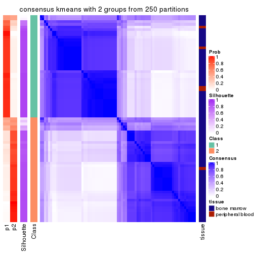</p>

</div>
<div id='tab-MAD-kmeans-consensus-heatmap-2'>
<pre><code class="r">consensus_heatmap(res, k = 3)
</code></pre>

<p>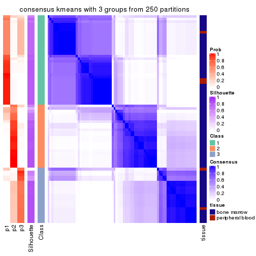</p>

</div>
<div id='tab-MAD-kmeans-consensus-heatmap-3'>
<pre><code class="r">consensus_heatmap(res, k = 4)
</code></pre>

<p>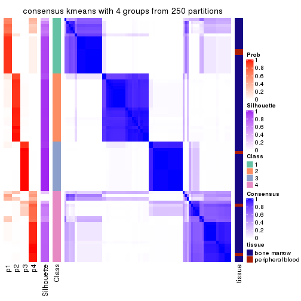</p>

</div>
<div id='tab-MAD-kmeans-consensus-heatmap-4'>
<pre><code class="r">consensus_heatmap(res, k = 5)
</code></pre>

<p>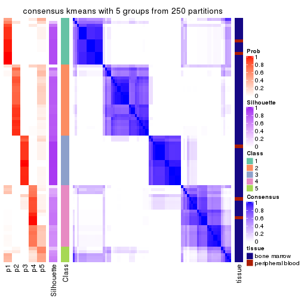</p>

</div>
<div id='tab-MAD-kmeans-consensus-heatmap-5'>
<pre><code class="r">consensus_heatmap(res, k = 6)
</code></pre>

<p>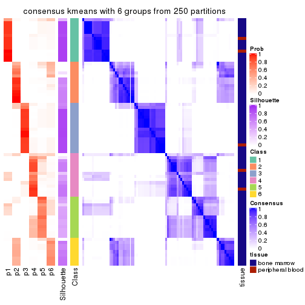</p>

</div>
</div>

Heatmaps for the membership of samples in all partitions to see how consistent they are:


<script>
$( function() {
	$( '#tabs-MAD-kmeans-membership-heatmap' ).tabs();
} );
</script>
<div id='tabs-MAD-kmeans-membership-heatmap'>
<ul>
<li><a href='#tab-MAD-kmeans-membership-heatmap-1'>k = 2</a></li>
<li><a href='#tab-MAD-kmeans-membership-heatmap-2'>k = 3</a></li>
<li><a href='#tab-MAD-kmeans-membership-heatmap-3'>k = 4</a></li>
<li><a href='#tab-MAD-kmeans-membership-heatmap-4'>k = 5</a></li>
<li><a href='#tab-MAD-kmeans-membership-heatmap-5'>k = 6</a></li>
</ul>
<div id='tab-MAD-kmeans-membership-heatmap-1'>
<pre><code class="r">membership_heatmap(res, k = 2)
</code></pre>

<p>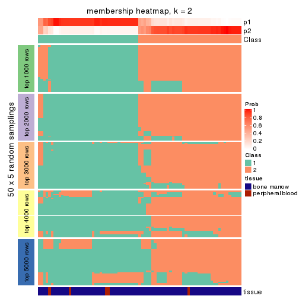</p>

</div>
<div id='tab-MAD-kmeans-membership-heatmap-2'>
<pre><code class="r">membership_heatmap(res, k = 3)
</code></pre>

<p>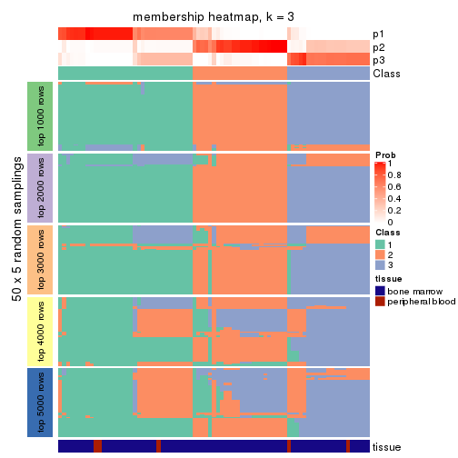</p>

</div>
<div id='tab-MAD-kmeans-membership-heatmap-3'>
<pre><code class="r">membership_heatmap(res, k = 4)
</code></pre>

<p>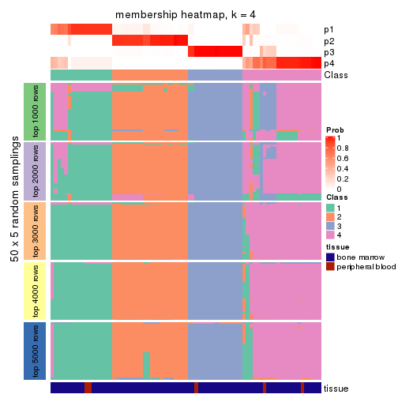</p>

</div>
<div id='tab-MAD-kmeans-membership-heatmap-4'>
<pre><code class="r">membership_heatmap(res, k = 5)
</code></pre>

<p>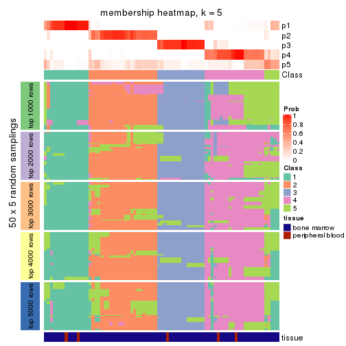</p>

</div>
<div id='tab-MAD-kmeans-membership-heatmap-5'>
<pre><code class="r">membership_heatmap(res, k = 6)
</code></pre>

<p>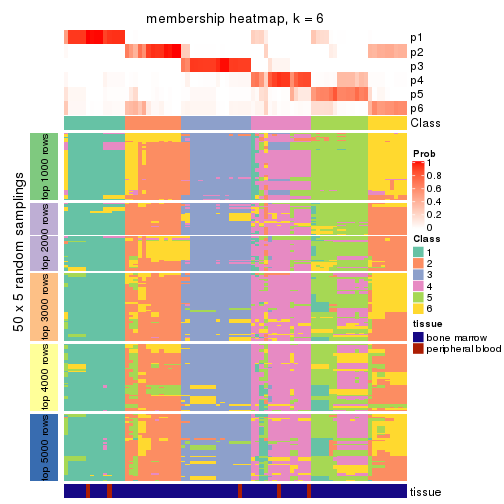</p>

</div>
</div>

As soon as we have had the classes for columns, we can look for signatures
which are significantly different between classes which can be candidate marks
for certain classes. Following are the heatmaps for signatures.


Signature heatmaps where rows are scaled:


<script>
$( function() {
	$( '#tabs-MAD-kmeans-get-signatures' ).tabs();
} );
</script>
<div id='tabs-MAD-kmeans-get-signatures'>
<ul>
<li><a href='#tab-MAD-kmeans-get-signatures-1'>k = 2</a></li>
<li><a href='#tab-MAD-kmeans-get-signatures-2'>k = 3</a></li>
<li><a href='#tab-MAD-kmeans-get-signatures-3'>k = 4</a></li>
<li><a href='#tab-MAD-kmeans-get-signatures-4'>k = 5</a></li>
<li><a href='#tab-MAD-kmeans-get-signatures-5'>k = 6</a></li>
</ul>
<div id='tab-MAD-kmeans-get-signatures-1'>
<pre><code class="r">get_signatures(res, k = 2)
</code></pre>

<p>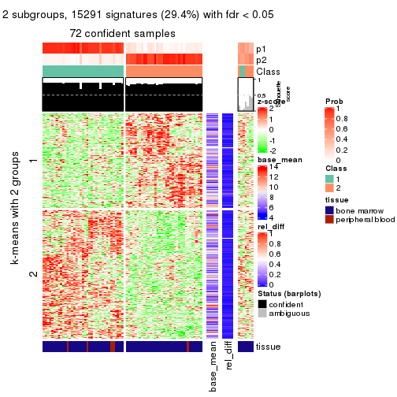</p>

</div>
<div id='tab-MAD-kmeans-get-signatures-2'>
<pre><code class="r">get_signatures(res, k = 3)
</code></pre>

<p>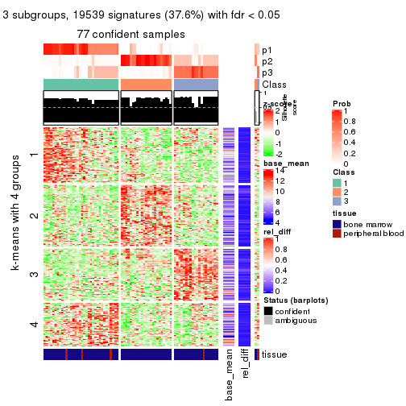</p>

</div>
<div id='tab-MAD-kmeans-get-signatures-3'>
<pre><code class="r">get_signatures(res, k = 4)
</code></pre>

<p>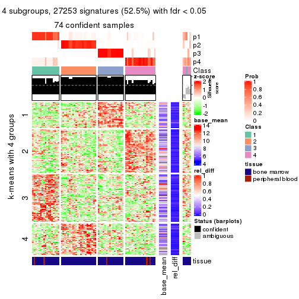</p>

</div>
<div id='tab-MAD-kmeans-get-signatures-4'>
<pre><code class="r">get_signatures(res, k = 5)
</code></pre>

<p>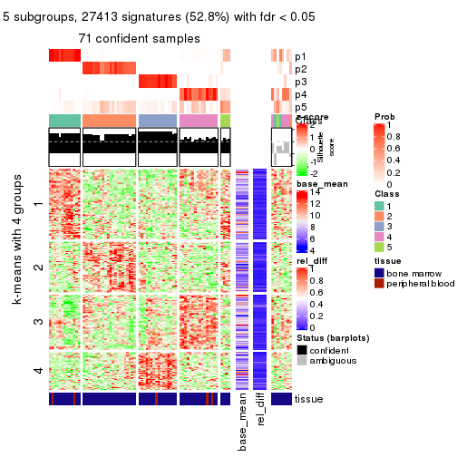</p>

</div>
<div id='tab-MAD-kmeans-get-signatures-5'>
<pre><code class="r">get_signatures(res, k = 6)
</code></pre>

<p>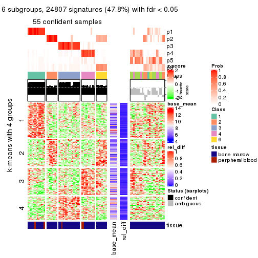</p>

</div>
</div>


Signature heatmaps where rows are not scaled:


<script>
$( function() {
	$( '#tabs-MAD-kmeans-get-signatures-no-scale' ).tabs();
} );
</script>
<div id='tabs-MAD-kmeans-get-signatures-no-scale'>
<ul>
<li><a href='#tab-MAD-kmeans-get-signatures-no-scale-1'>k = 2</a></li>
<li><a href='#tab-MAD-kmeans-get-signatures-no-scale-2'>k = 3</a></li>
<li><a href='#tab-MAD-kmeans-get-signatures-no-scale-3'>k = 4</a></li>
<li><a href='#tab-MAD-kmeans-get-signatures-no-scale-4'>k = 5</a></li>
<li><a href='#tab-MAD-kmeans-get-signatures-no-scale-5'>k = 6</a></li>
</ul>
<div id='tab-MAD-kmeans-get-signatures-no-scale-1'>
<pre><code class="r">get_signatures(res, k = 2, scale_rows = FALSE)
</code></pre>

<p>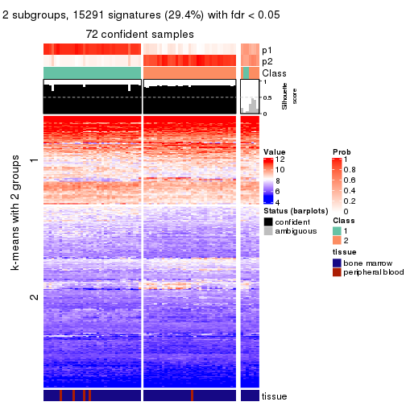</p>

</div>
<div id='tab-MAD-kmeans-get-signatures-no-scale-2'>
<pre><code class="r">get_signatures(res, k = 3, scale_rows = FALSE)
</code></pre>

<p>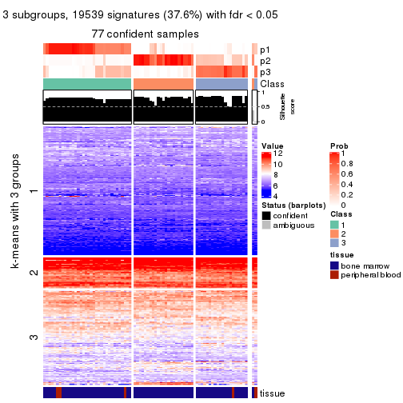</p>

</div>
<div id='tab-MAD-kmeans-get-signatures-no-scale-3'>
<pre><code class="r">get_signatures(res, k = 4, scale_rows = FALSE)
</code></pre>

<p>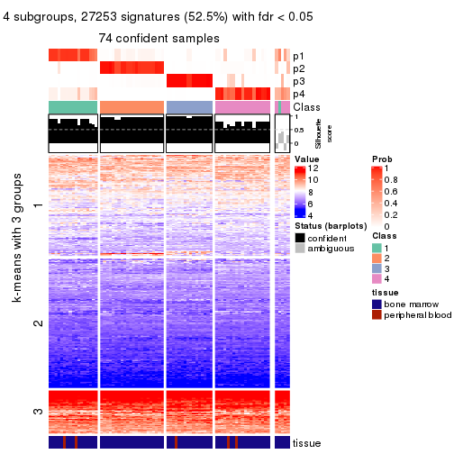</p>

</div>
<div id='tab-MAD-kmeans-get-signatures-no-scale-4'>
<pre><code class="r">get_signatures(res, k = 5, scale_rows = FALSE)
</code></pre>

<p>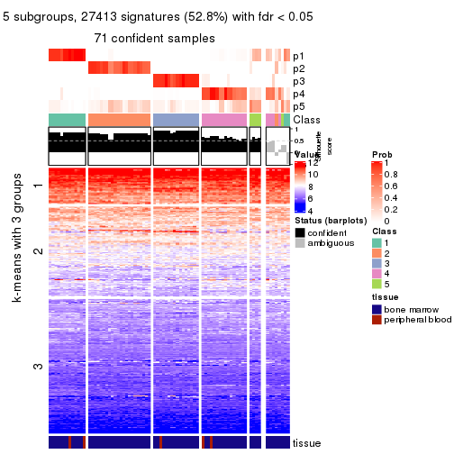</p>

</div>
<div id='tab-MAD-kmeans-get-signatures-no-scale-5'>
<pre><code class="r">get_signatures(res, k = 6, scale_rows = FALSE)
</code></pre>

<p>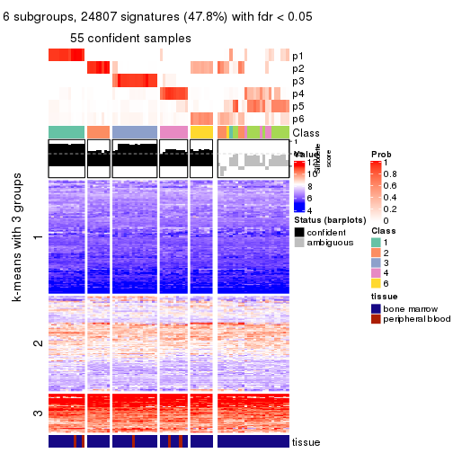</p>

</div>
</div>


Compare the overlap of signatures from different k:

```r
compare_signatures(res)
```

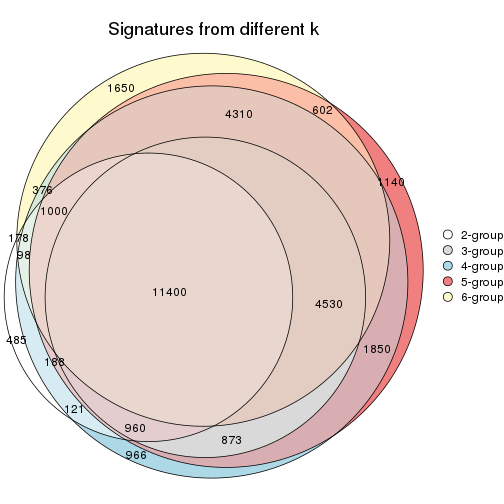

`get_signature()` returns a data frame invisibly. TO get the list of signatures, the function
call should be assigned to a variable explicitly. In following code, if `plot` argument is set
to `FALSE`, no heatmap is plotted while only the differential analysis is performed.

```r
# code only for demonstration
tb = get_signature(res, k = ..., plot = FALSE)
```

An example of the output of `tb` is:

```
#>   which_row         fdr    mean_1    mean_2 scaled_mean_1 scaled_mean_2 km
#> 1        38 0.042760348  8.373488  9.131774    -0.5533452     0.5164555  1
#> 2        40 0.018707592  7.106213  8.469186    -0.6173731     0.5762149  1
#> 3        55 0.019134737 10.221463 11.207825    -0.6159697     0.5749050  1
#> 4        59 0.006059896  5.921854  7.869574    -0.6899429     0.6439467  1
#> 5        60 0.018055526  8.928898 10.211722    -0.6204761     0.5791110  1
#> 6        98 0.009384629 15.714769 14.887706     0.6635654    -0.6193277  2
...
```

The columns in `tb` are:

1. `which_row`: row indices corresponding to the input matrix.
2. `fdr`: FDR for the differential test. 
3. `mean_x`: The mean value in group x.
4. `scaled_mean_x`: The mean value in group x after rows are scaled.
5. `km`: Row groups if k-means clustering is applied to rows.


UMAP plot which shows how samples are separated.


<script>
$( function() {
	$( '#tabs-MAD-kmeans-dimension-reduction' ).tabs();
} );
</script>
<div id='tabs-MAD-kmeans-dimension-reduction'>
<ul>
<li><a href='#tab-MAD-kmeans-dimension-reduction-1'>k = 2</a></li>
<li><a href='#tab-MAD-kmeans-dimension-reduction-2'>k = 3</a></li>
<li><a href='#tab-MAD-kmeans-dimension-reduction-3'>k = 4</a></li>
<li><a href='#tab-MAD-kmeans-dimension-reduction-4'>k = 5</a></li>
<li><a href='#tab-MAD-kmeans-dimension-reduction-5'>k = 6</a></li>
</ul>
<div id='tab-MAD-kmeans-dimension-reduction-1'>
<pre><code class="r">dimension_reduction(res, k = 2, method = &quot;UMAP&quot;)
</code></pre>

<p>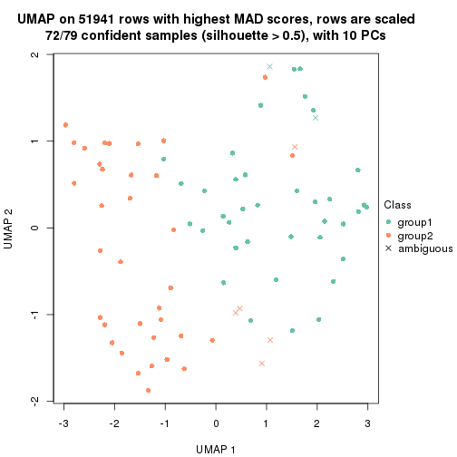</p>

</div>
<div id='tab-MAD-kmeans-dimension-reduction-2'>
<pre><code class="r">dimension_reduction(res, k = 3, method = &quot;UMAP&quot;)
</code></pre>

<p>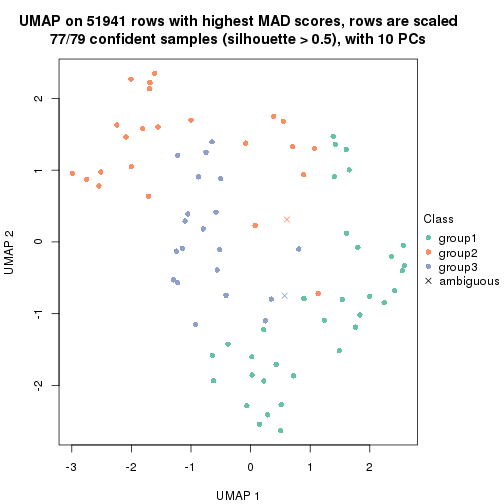</p>

</div>
<div id='tab-MAD-kmeans-dimension-reduction-3'>
<pre><code class="r">dimension_reduction(res, k = 4, method = &quot;UMAP&quot;)
</code></pre>

<p>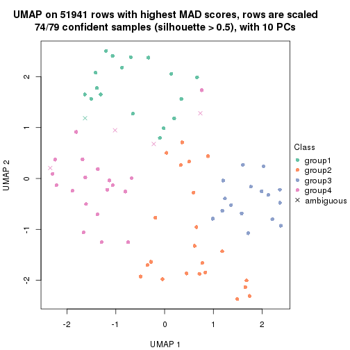</p>

</div>
<div id='tab-MAD-kmeans-dimension-reduction-4'>
<pre><code class="r">dimension_reduction(res, k = 5, method = &quot;UMAP&quot;)
</code></pre>

<p>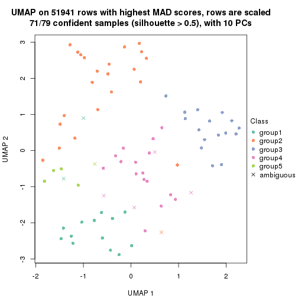</p>

</div>
<div id='tab-MAD-kmeans-dimension-reduction-5'>
<pre><code class="r">dimension_reduction(res, k = 6, method = &quot;UMAP&quot;)
</code></pre>

<p>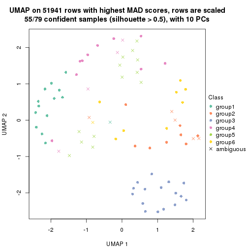</p>

</div>
</div>


Following heatmap shows how subgroups are split when increasing `k`:

```r
collect_classes(res)
```

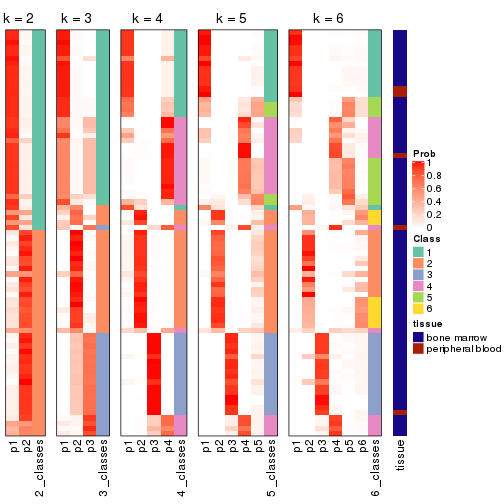


Test correlation between subgroups and known annotations. If the known
annotation is numeric, one-way ANOVA test is applied, and if the known
annotation is discrete, chi-squared contingency table test is applied.

```r
test_to_known_factors(res)
```

```
#>             n tissue(p) k
#> MAD:kmeans 72     0.388 2
#> MAD:kmeans 77     0.338 3
#> MAD:kmeans 74     0.439 4
#> MAD:kmeans 71     0.393 5
#> MAD:kmeans 55     0.431 6
```


If matrix rows can be associated to genes, consider to use `GO_Enrichment(res,
...)` to perform function enrichment for the signature genes.


 

---------------------------------------------------


### MAD:skmeans


The object with results only for a single top-value method and a single partition method 
can be extracted as:

```r
res = res_list["MAD", "skmeans"]
# you can also extract it by
# res = res_list["MAD:skmeans"]
```

A summary of `res` and all the functions that can be applied to it:

```r
res
```

```
#> A 'ConsensusPartition' object with k = 2, 3, 4, 5, 6.
#>   On a matrix with 51941 rows and 79 columns.
#>   Top rows (1000, 2000, 3000, 4000, 5000) are extracted by 'MAD' method.
#>   Subgroups are detected by 'skmeans' method.
#>   Performed in total 1250 partitions by row resampling.
#>   Best k for subgroups seems to be 2.
#> 
#> Following methods can be applied to this 'ConsensusPartition' object:
#>  [1] "cola_report"             "collect_classes"         "collect_plots"          
#>  [4] "collect_stats"           "colnames"                "compare_signatures"     
#>  [7] "consensus_heatmap"       "dimension_reduction"     "functional_enrichment"  
#> [10] "get_anno_col"            "get_anno"                "get_classes"            
#> [13] "get_consensus"           "get_matrix"              "get_membership"         
#> [16] "get_param"               "get_signatures"          "get_stats"              
#> [19] "is_best_k"               "is_stable_k"             "membership_heatmap"     
#> [22] "ncol"                    "nrow"                    "plot_ecdf"              
#> [25] "rownames"                "select_partition_number" "show"                   
#> [28] "suggest_best_k"          "test_to_known_factors"
```

`collect_plots()` function collects all the plots made from `res` for all `k` (number of partitions)
into one single page to provide an easy and fast comparison between different `k`.

```r
collect_plots(res)
```

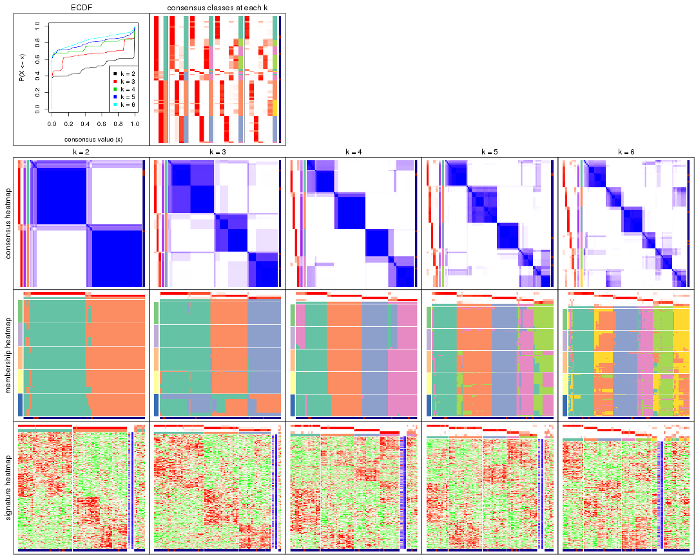

The plots are:

- The first row: a plot of the ECDF (Empirical cumulative distribution
  function) curves of the consensus matrix for each `k` and the heatmap of
  predicted classes for each `k`.
- The second row: heatmaps of the consensus matrix for each `k`.
- The third row: heatmaps of the membership matrix for each `k`.
- The fouth row: heatmaps of the signatures for each `k`.

All the plots in panels can be made by individual functions and they are
plotted later in this section.

`select_partition_number()` produces several plots showing different
statistics for choosing "optimized" `k`. There are following statistics:

- ECDF curves of the consensus matrix for each `k`;
- 1-PAC. [The PAC
  score](https://en.wikipedia.org/wiki/Consensus_clustering#Over-interpretation_potential_of_consensus_clustering)
  measures the proportion of the ambiguous subgrouping.
- Mean silhouette score.
- Concordance. The mean probability of fiting the consensus class ids in all
  partitions.
- Area increased. Denote $A_k$ as the area under the ECDF curve for current
  `k`, the area increased is defined as $A_k - A_{k-1}$.
- Rand index. The percent of pairs of samples that are both in a same cluster
  or both are not in a same cluster in the partition of k and k-1.
- Jaccard index. The ratio of pairs of samples are both in a same cluster in
  the partition of k and k-1 and the pairs of samples are both in a same
  cluster in the partition k or k-1.

The detailed explanations of these statistics can be found in [the cola
vignette](http://bioconductor.org/packages/devel/bioc/vignettes/cola/inst/doc/cola.html#toc_13).

Generally speaking, lower PAC score, higher mean silhouette score or higher
concordance corresponds to better partition. Rand index and Jaccard index
measure how similar the current partition is compared to partition with `k-1`.
If they are too similar, we won't accept `k` is better than `k-1`.

```r
select_partition_number(res)
```

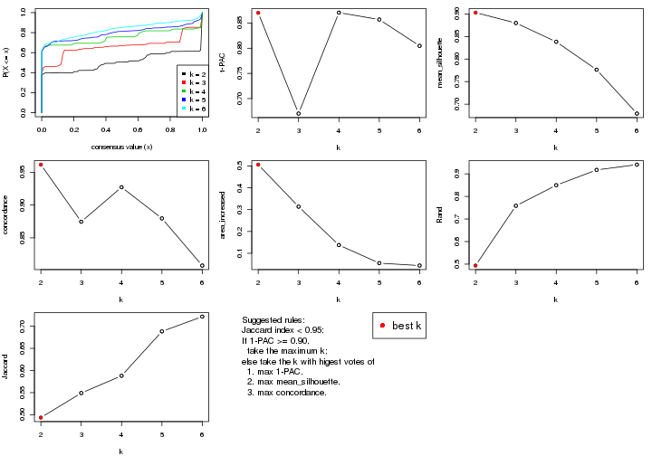

The numeric values for all these statistics can be obtained by `get_stats()`.

```r
get_stats(res)
```

```
#>   k 1-PAC mean_silhouette concordance area_increased  Rand Jaccard
#> 2 2 0.870           0.903       0.962         0.5062 0.494   0.494
#> 3 3 0.670           0.880       0.875         0.3137 0.759   0.549
#> 4 4 0.871           0.838       0.927         0.1376 0.850   0.588
#> 5 5 0.857           0.776       0.880         0.0549 0.918   0.688
#> 6 6 0.805           0.679       0.808         0.0437 0.941   0.722
```

`suggest_best_k()` suggests the best $k$ based on these statistics. The rules are as follows:

- All $k$ with Jaccard index larger than 0.95 are removed because the increase of
  the partition number does not provides enough extra information. If all $k$ are removed,
  the best $k$ is assigned by `NA`.
- For $k$ with 1-PAC larger than 0.9, the maximal $k$ is taken as the "best k". Other $k$ is called "optional k".
- If it does not fit the second rule. The $k$ with the highest vote of highest
  1-PAC, mean silhouette and concordance is taken as the "best k".

```r
suggest_best_k(res)
```

```
#> [1] 2
```


Following shows the table of the partitions (You need to click the **show/hide
code output** link to see it). The membership matrix (columns with name `p*`)
is inferred by
[`clue::cl_consensus()`](https://www.rdocumentation.org/link/cl_consensus?package=clue)
function with the `SE` method. Basically the value in the membership matrix
represents the probability to belong to a certain group. The finall class
label for an item is determined with the group with highest probability it
belongs to.

In `get_classes()` function, the entropy is calculated from the membership
matrix and the silhouette score is calculated from the consensus matrix.


<script>
$( function() {
	$( '#tabs-MAD-skmeans-get-classes' ).tabs();
} );
</script>
<div id='tabs-MAD-skmeans-get-classes'>
<ul>
<li><a href='#tab-MAD-skmeans-get-classes-1'>k = 2</a></li>
<li><a href='#tab-MAD-skmeans-get-classes-2'>k = 3</a></li>
<li><a href='#tab-MAD-skmeans-get-classes-3'>k = 4</a></li>
<li><a href='#tab-MAD-skmeans-get-classes-4'>k = 5</a></li>
<li><a href='#tab-MAD-skmeans-get-classes-5'>k = 6</a></li>
</ul>

<div id='tab-MAD-skmeans-get-classes-1'>
<p><a id='tab-MAD-skmeans-get-classes-1-a' style='color:#0366d6' href='#'>show/hide code output</a></p>
<pre><code class="r">cbind(get_classes(res, k = 2), get_membership(res, k = 2))
</code></pre>

<pre><code>#&gt;           class entropy silhouette    p1    p2
#&gt; GSM316652     2  0.0000      0.963 0.000 1.000
#&gt; GSM316653     1  0.0000      0.954 1.000 0.000
#&gt; GSM316654     1  0.0000      0.954 1.000 0.000
#&gt; GSM316655     1  0.0000      0.954 1.000 0.000
#&gt; GSM316656     1  0.0938      0.944 0.988 0.012
#&gt; GSM316657     1  0.0000      0.954 1.000 0.000
#&gt; GSM316658     2  0.0000      0.963 0.000 1.000
#&gt; GSM316659     2  0.0000      0.963 0.000 1.000
#&gt; GSM316660     1  0.0000      0.954 1.000 0.000
#&gt; GSM316661     1  0.0000      0.954 1.000 0.000
#&gt; GSM316662     2  0.0000      0.963 0.000 1.000
#&gt; GSM316663     2  0.0000      0.963 0.000 1.000
#&gt; GSM316664     1  0.0000      0.954 1.000 0.000
#&gt; GSM316665     2  0.0000      0.963 0.000 1.000
#&gt; GSM316666     2  0.0000      0.963 0.000 1.000
#&gt; GSM316667     2  0.0000      0.963 0.000 1.000
#&gt; GSM316668     2  0.0000      0.963 0.000 1.000
#&gt; GSM316669     1  0.0000      0.954 1.000 0.000
#&gt; GSM316670     2  0.0000      0.963 0.000 1.000
#&gt; GSM316671     2  0.0000      0.963 0.000 1.000
#&gt; GSM316672     1  0.0000      0.954 1.000 0.000
#&gt; GSM316673     1  0.0000      0.954 1.000 0.000
#&gt; GSM316674     2  0.0000      0.963 0.000 1.000
#&gt; GSM316676     2  0.0000      0.963 0.000 1.000
#&gt; GSM316677     1  0.0000      0.954 1.000 0.000
#&gt; GSM316678     2  0.9358      0.456 0.352 0.648
#&gt; GSM316679     1  0.0000      0.954 1.000 0.000
#&gt; GSM316680     1  0.0000      0.954 1.000 0.000
#&gt; GSM316681     2  0.0000      0.963 0.000 1.000
#&gt; GSM316682     1  0.0000      0.954 1.000 0.000
#&gt; GSM316683     1  0.0000      0.954 1.000 0.000
#&gt; GSM316684     2  0.0000      0.963 0.000 1.000
#&gt; GSM316685     2  0.0000      0.963 0.000 1.000
#&gt; GSM316686     1  0.7219      0.734 0.800 0.200
#&gt; GSM316687     1  0.9286      0.482 0.656 0.344
#&gt; GSM316688     2  0.9661      0.340 0.392 0.608
#&gt; GSM316689     1  0.0000      0.954 1.000 0.000
#&gt; GSM316690     2  0.0000      0.963 0.000 1.000
#&gt; GSM316691     2  0.0000      0.963 0.000 1.000
#&gt; GSM316692     2  0.0000      0.963 0.000 1.000
#&gt; GSM316693     1  0.0000      0.954 1.000 0.000
#&gt; GSM316694     2  0.0000      0.963 0.000 1.000
#&gt; GSM316696     1  0.0000      0.954 1.000 0.000
#&gt; GSM316697     2  0.0000      0.963 0.000 1.000
#&gt; GSM316698     2  0.0000      0.963 0.000 1.000
#&gt; GSM316699     2  0.0000      0.963 0.000 1.000
#&gt; GSM316700     1  0.0000      0.954 1.000 0.000
#&gt; GSM316701     1  0.0000      0.954 1.000 0.000
#&gt; GSM316703     2  0.0000      0.963 0.000 1.000
#&gt; GSM316704     2  0.0000      0.963 0.000 1.000
#&gt; GSM316705     1  0.0000      0.954 1.000 0.000
#&gt; GSM316706     1  0.9129      0.492 0.672 0.328
#&gt; GSM316707     2  0.0000      0.963 0.000 1.000
#&gt; GSM316708     2  0.9460      0.431 0.364 0.636
#&gt; GSM316709     2  0.0000      0.963 0.000 1.000
#&gt; GSM316710     1  0.0000      0.954 1.000 0.000
#&gt; GSM316711     2  0.0000      0.963 0.000 1.000
#&gt; GSM316713     1  0.0000      0.954 1.000 0.000
#&gt; GSM316714     1  0.9393      0.460 0.644 0.356
#&gt; GSM316715     1  0.0000      0.954 1.000 0.000
#&gt; GSM316716     2  0.0000      0.963 0.000 1.000
#&gt; GSM316717     1  0.0000      0.954 1.000 0.000
#&gt; GSM316718     2  0.7674      0.699 0.224 0.776
#&gt; GSM316719     1  0.0000      0.954 1.000 0.000
#&gt; GSM316720     1  0.0000      0.954 1.000 0.000
#&gt; GSM316721     2  0.0000      0.963 0.000 1.000
#&gt; GSM316722     1  0.0000      0.954 1.000 0.000
#&gt; GSM316723     2  0.0000      0.963 0.000 1.000
#&gt; GSM316724     2  0.0000      0.963 0.000 1.000
#&gt; GSM316726     2  0.0000      0.963 0.000 1.000
#&gt; GSM316727     1  0.0000      0.954 1.000 0.000
#&gt; GSM316728     1  0.9954      0.176 0.540 0.460
#&gt; GSM316729     1  0.0000      0.954 1.000 0.000
#&gt; GSM316730     2  0.0000      0.963 0.000 1.000
#&gt; GSM316675     2  0.0000      0.963 0.000 1.000
#&gt; GSM316695     1  0.0000      0.954 1.000 0.000
#&gt; GSM316702     1  0.0376      0.950 0.996 0.004
#&gt; GSM316712     1  0.0000      0.954 1.000 0.000
#&gt; GSM316725     1  0.0000      0.954 1.000 0.000
</code></pre>

<script>
$('#tab-MAD-skmeans-get-classes-1-a').parent().next().next().hide();
$('#tab-MAD-skmeans-get-classes-1-a').click(function(){
  $('#tab-MAD-skmeans-get-classes-1-a').parent().next().next().toggle();
  return(false);
});
</script>
</div>

<div id='tab-MAD-skmeans-get-classes-2'>
<p><a id='tab-MAD-skmeans-get-classes-2-a' style='color:#0366d6' href='#'>show/hide code output</a></p>
<pre><code class="r">cbind(get_classes(res, k = 3), get_membership(res, k = 3))
</code></pre>

<pre><code>#&gt;           class entropy silhouette    p1    p2    p3
#&gt; GSM316652     3  0.3482      0.933 0.000 0.128 0.872
#&gt; GSM316653     1  0.3551      0.903 0.868 0.000 0.132
#&gt; GSM316654     1  0.3551      0.903 0.868 0.000 0.132
#&gt; GSM316655     1  0.3482      0.904 0.872 0.000 0.128
#&gt; GSM316656     1  0.6307      0.560 0.660 0.328 0.012
#&gt; GSM316657     1  0.0000      0.921 1.000 0.000 0.000
#&gt; GSM316658     2  0.0000      0.916 0.000 1.000 0.000
#&gt; GSM316659     2  0.0000      0.916 0.000 1.000 0.000
#&gt; GSM316660     1  0.0000      0.921 1.000 0.000 0.000
#&gt; GSM316661     1  0.4842      0.820 0.776 0.000 0.224
#&gt; GSM316662     3  0.3551      0.930 0.000 0.132 0.868
#&gt; GSM316663     3  0.0000      0.855 0.000 0.000 1.000
#&gt; GSM316664     1  0.3551      0.903 0.868 0.000 0.132
#&gt; GSM316665     2  0.0000      0.916 0.000 1.000 0.000
#&gt; GSM316666     3  0.3482      0.933 0.000 0.128 0.872
#&gt; GSM316667     2  0.0000      0.916 0.000 1.000 0.000
#&gt; GSM316668     3  0.3551      0.930 0.000 0.132 0.868
#&gt; GSM316669     1  0.3551      0.903 0.868 0.000 0.132
#&gt; GSM316670     3  0.3482      0.933 0.000 0.128 0.872
#&gt; GSM316671     3  0.3715      0.930 0.004 0.128 0.868
#&gt; GSM316672     2  0.3551      0.862 0.132 0.868 0.000
#&gt; GSM316673     1  0.0237      0.921 0.996 0.000 0.004
#&gt; GSM316674     3  0.3482      0.933 0.000 0.128 0.872
#&gt; GSM316676     3  0.3482      0.933 0.000 0.128 0.872
#&gt; GSM316677     1  0.0000      0.921 1.000 0.000 0.000
#&gt; GSM316678     2  0.3482      0.865 0.128 0.872 0.000
#&gt; GSM316679     1  0.0000      0.921 1.000 0.000 0.000
#&gt; GSM316680     1  0.0000      0.921 1.000 0.000 0.000
#&gt; GSM316681     3  0.3482      0.933 0.000 0.128 0.872
#&gt; GSM316682     1  0.3551      0.903 0.868 0.000 0.132
#&gt; GSM316683     1  0.3551      0.903 0.868 0.000 0.132
#&gt; GSM316684     2  0.0000      0.916 0.000 1.000 0.000
#&gt; GSM316685     3  0.3551      0.930 0.000 0.132 0.868
#&gt; GSM316686     3  0.6079      0.107 0.388 0.000 0.612
#&gt; GSM316687     3  0.0000      0.855 0.000 0.000 1.000
#&gt; GSM316688     2  0.9805      0.228 0.256 0.424 0.320
#&gt; GSM316689     1  0.0000      0.921 1.000 0.000 0.000
#&gt; GSM316690     3  0.3482      0.933 0.000 0.128 0.872
#&gt; GSM316691     2  0.0000      0.916 0.000 1.000 0.000
#&gt; GSM316692     3  0.3482      0.933 0.000 0.128 0.872
#&gt; GSM316693     1  0.3551      0.903 0.868 0.000 0.132
#&gt; GSM316694     3  0.3482      0.933 0.000 0.128 0.872
#&gt; GSM316696     1  0.0000      0.921 1.000 0.000 0.000
#&gt; GSM316697     3  0.3482      0.933 0.000 0.128 0.872
#&gt; GSM316698     2  0.3482      0.865 0.128 0.872 0.000
#&gt; GSM316699     2  0.0000      0.916 0.000 1.000 0.000
#&gt; GSM316700     1  0.3551      0.903 0.868 0.000 0.132
#&gt; GSM316701     1  0.3482      0.904 0.872 0.000 0.128
#&gt; GSM316703     2  0.3267      0.851 0.000 0.884 0.116
#&gt; GSM316704     2  0.3116      0.857 0.000 0.892 0.108
#&gt; GSM316705     1  0.3482      0.904 0.872 0.000 0.128
#&gt; GSM316706     2  0.3482      0.841 0.000 0.872 0.128
#&gt; GSM316707     2  0.0000      0.916 0.000 1.000 0.000
#&gt; GSM316708     2  0.3482      0.865 0.128 0.872 0.000
#&gt; GSM316709     3  0.3482      0.933 0.000 0.128 0.872
#&gt; GSM316710     1  0.3551      0.903 0.868 0.000 0.132
#&gt; GSM316711     2  0.0000      0.916 0.000 1.000 0.000
#&gt; GSM316713     1  0.0000      0.921 1.000 0.000 0.000
#&gt; GSM316714     3  0.0000      0.855 0.000 0.000 1.000
#&gt; GSM316715     1  0.0000      0.921 1.000 0.000 0.000
#&gt; GSM316716     2  0.0000      0.916 0.000 1.000 0.000
#&gt; GSM316717     1  0.0000      0.921 1.000 0.000 0.000
#&gt; GSM316718     2  0.3482      0.865 0.128 0.872 0.000
#&gt; GSM316719     1  0.0000      0.921 1.000 0.000 0.000
#&gt; GSM316720     1  0.0000      0.921 1.000 0.000 0.000
#&gt; GSM316721     2  0.0000      0.916 0.000 1.000 0.000
#&gt; GSM316722     1  0.0000      0.921 1.000 0.000 0.000
#&gt; GSM316723     2  0.0000      0.916 0.000 1.000 0.000
#&gt; GSM316724     2  0.0237      0.915 0.004 0.996 0.000
#&gt; GSM316726     2  0.0000      0.916 0.000 1.000 0.000
#&gt; GSM316727     1  0.0000      0.921 1.000 0.000 0.000
#&gt; GSM316728     3  0.0000      0.855 0.000 0.000 1.000
#&gt; GSM316729     1  0.4887      0.646 0.772 0.228 0.000
#&gt; GSM316730     2  0.3482      0.865 0.128 0.872 0.000
#&gt; GSM316675     3  0.3482      0.933 0.000 0.128 0.872
#&gt; GSM316695     1  0.0000      0.921 1.000 0.000 0.000
#&gt; GSM316702     3  0.0237      0.852 0.004 0.000 0.996
#&gt; GSM316712     1  0.0000      0.921 1.000 0.000 0.000
#&gt; GSM316725     1  0.3551      0.903 0.868 0.000 0.132
</code></pre>

<script>
$('#tab-MAD-skmeans-get-classes-2-a').parent().next().next().hide();
$('#tab-MAD-skmeans-get-classes-2-a').click(function(){
  $('#tab-MAD-skmeans-get-classes-2-a').parent().next().next().toggle();
  return(false);
});
</script>
</div>

<div id='tab-MAD-skmeans-get-classes-3'>
<p><a id='tab-MAD-skmeans-get-classes-3-a' style='color:#0366d6' href='#'>show/hide code output</a></p>
<pre><code class="r">cbind(get_classes(res, k = 4), get_membership(res, k = 4))
</code></pre>

<pre><code>#&gt;           class entropy silhouette    p1    p2    p3    p4
#&gt; GSM316652     3  0.0000      0.997 0.000 0.000 1.000 0.000
#&gt; GSM316653     4  0.0188      0.830 0.004 0.000 0.000 0.996
#&gt; GSM316654     4  0.0000      0.830 0.000 0.000 0.000 1.000
#&gt; GSM316655     4  0.0188      0.830 0.004 0.000 0.000 0.996
#&gt; GSM316656     4  0.0817      0.810 0.024 0.000 0.000 0.976
#&gt; GSM316657     1  0.0000      0.849 1.000 0.000 0.000 0.000
#&gt; GSM316658     2  0.0000      0.961 0.000 1.000 0.000 0.000
#&gt; GSM316659     2  0.0000      0.961 0.000 1.000 0.000 0.000
#&gt; GSM316660     1  0.0000      0.849 1.000 0.000 0.000 0.000
#&gt; GSM316661     4  0.0000      0.830 0.000 0.000 0.000 1.000
#&gt; GSM316662     3  0.0000      0.997 0.000 0.000 1.000 0.000
#&gt; GSM316663     4  0.4855      0.416 0.000 0.000 0.400 0.600
#&gt; GSM316664     4  0.4804      0.399 0.384 0.000 0.000 0.616
#&gt; GSM316665     2  0.0000      0.961 0.000 1.000 0.000 0.000
#&gt; GSM316666     3  0.0000      0.997 0.000 0.000 1.000 0.000
#&gt; GSM316667     2  0.0000      0.961 0.000 1.000 0.000 0.000
#&gt; GSM316668     3  0.0000      0.997 0.000 0.000 1.000 0.000
#&gt; GSM316669     4  0.0188      0.830 0.004 0.000 0.000 0.996
#&gt; GSM316670     3  0.0000      0.997 0.000 0.000 1.000 0.000
#&gt; GSM316671     3  0.0000      0.997 0.000 0.000 1.000 0.000
#&gt; GSM316672     1  0.0336      0.843 0.992 0.008 0.000 0.000
#&gt; GSM316673     1  0.0000      0.849 1.000 0.000 0.000 0.000
#&gt; GSM316674     3  0.0000      0.997 0.000 0.000 1.000 0.000
#&gt; GSM316676     3  0.0000      0.997 0.000 0.000 1.000 0.000
#&gt; GSM316677     1  0.4855      0.544 0.600 0.000 0.000 0.400
#&gt; GSM316678     2  0.0000      0.961 0.000 1.000 0.000 0.000
#&gt; GSM316679     1  0.4697      0.595 0.644 0.000 0.000 0.356
#&gt; GSM316680     1  0.4776      0.573 0.624 0.000 0.000 0.376
#&gt; GSM316681     3  0.0000      0.997 0.000 0.000 1.000 0.000
#&gt; GSM316682     4  0.0188      0.830 0.004 0.000 0.000 0.996
#&gt; GSM316683     4  0.0188      0.830 0.004 0.000 0.000 0.996
#&gt; GSM316684     2  0.0000      0.961 0.000 1.000 0.000 0.000
#&gt; GSM316685     3  0.0000      0.997 0.000 0.000 1.000 0.000
#&gt; GSM316686     4  0.5039      0.359 0.404 0.000 0.004 0.592
#&gt; GSM316687     4  0.4855      0.415 0.000 0.000 0.400 0.600
#&gt; GSM316688     2  0.5290      0.309 0.404 0.584 0.012 0.000
#&gt; GSM316689     1  0.0000      0.849 1.000 0.000 0.000 0.000
#&gt; GSM316690     3  0.0000      0.997 0.000 0.000 1.000 0.000
#&gt; GSM316691     2  0.0000      0.961 0.000 1.000 0.000 0.000
#&gt; GSM316692     3  0.0000      0.997 0.000 0.000 1.000 0.000
#&gt; GSM316693     4  0.0000      0.830 0.000 0.000 0.000 1.000
#&gt; GSM316694     3  0.0000      0.997 0.000 0.000 1.000 0.000
#&gt; GSM316696     1  0.0000      0.849 1.000 0.000 0.000 0.000
#&gt; GSM316697     3  0.0000      0.997 0.000 0.000 1.000 0.000
#&gt; GSM316698     2  0.0000      0.961 0.000 1.000 0.000 0.000
#&gt; GSM316699     2  0.0000      0.961 0.000 1.000 0.000 0.000
#&gt; GSM316700     4  0.0000      0.830 0.000 0.000 0.000 1.000
#&gt; GSM316701     4  0.0188      0.830 0.004 0.000 0.000 0.996
#&gt; GSM316703     2  0.0000      0.961 0.000 1.000 0.000 0.000
#&gt; GSM316704     2  0.0000      0.961 0.000 1.000 0.000 0.000
#&gt; GSM316705     1  0.3569      0.630 0.804 0.000 0.000 0.196
#&gt; GSM316706     2  0.0000      0.961 0.000 1.000 0.000 0.000
#&gt; GSM316707     2  0.0000      0.961 0.000 1.000 0.000 0.000
#&gt; GSM316708     2  0.3569      0.751 0.196 0.804 0.000 0.000
#&gt; GSM316709     3  0.0000      0.997 0.000 0.000 1.000 0.000
#&gt; GSM316710     4  0.0000      0.830 0.000 0.000 0.000 1.000
#&gt; GSM316711     2  0.0000      0.961 0.000 1.000 0.000 0.000
#&gt; GSM316713     1  0.0000      0.849 1.000 0.000 0.000 0.000
#&gt; GSM316714     3  0.1302      0.946 0.000 0.000 0.956 0.044
#&gt; GSM316715     1  0.0000      0.849 1.000 0.000 0.000 0.000
#&gt; GSM316716     2  0.0000      0.961 0.000 1.000 0.000 0.000
#&gt; GSM316717     1  0.4730      0.587 0.636 0.000 0.000 0.364
#&gt; GSM316718     2  0.3486      0.762 0.188 0.812 0.000 0.000
#&gt; GSM316719     1  0.0000      0.849 1.000 0.000 0.000 0.000
#&gt; GSM316720     1  0.0000      0.849 1.000 0.000 0.000 0.000
#&gt; GSM316721     2  0.0000      0.961 0.000 1.000 0.000 0.000
#&gt; GSM316722     1  0.4843      0.546 0.604 0.000 0.000 0.396
#&gt; GSM316723     2  0.0000      0.961 0.000 1.000 0.000 0.000
#&gt; GSM316724     2  0.0000      0.961 0.000 1.000 0.000 0.000
#&gt; GSM316726     2  0.0000      0.961 0.000 1.000 0.000 0.000
#&gt; GSM316727     1  0.0000      0.849 1.000 0.000 0.000 0.000
#&gt; GSM316728     4  0.4843      0.422 0.000 0.000 0.396 0.604
#&gt; GSM316729     1  0.5150      0.540 0.596 0.008 0.000 0.396
#&gt; GSM316730     2  0.0000      0.961 0.000 1.000 0.000 0.000
#&gt; GSM316675     3  0.0000      0.997 0.000 0.000 1.000 0.000
#&gt; GSM316695     1  0.0000      0.849 1.000 0.000 0.000 0.000
#&gt; GSM316702     4  0.4776      0.458 0.000 0.000 0.376 0.624
#&gt; GSM316712     1  0.0000      0.849 1.000 0.000 0.000 0.000
#&gt; GSM316725     4  0.0000      0.830 0.000 0.000 0.000 1.000
</code></pre>

<script>
$('#tab-MAD-skmeans-get-classes-3-a').parent().next().next().hide();
$('#tab-MAD-skmeans-get-classes-3-a').click(function(){
  $('#tab-MAD-skmeans-get-classes-3-a').parent().next().next().toggle();
  return(false);
});
</script>
</div>

<div id='tab-MAD-skmeans-get-classes-4'>
<p><a id='tab-MAD-skmeans-get-classes-4-a' style='color:#0366d6' href='#'>show/hide code output</a></p>
<pre><code class="r">cbind(get_classes(res, k = 5), get_membership(res, k = 5))
</code></pre>

<pre><code>#&gt;           class entropy silhouette    p1    p2    p3    p4    p5
#&gt; GSM316652     3  0.0000      0.989 0.000 0.000 1.000 0.000 0.000
#&gt; GSM316653     5  0.4101      0.550 0.000 0.000 0.000 0.372 0.628
#&gt; GSM316654     4  0.1768      0.718 0.004 0.000 0.000 0.924 0.072
#&gt; GSM316655     5  0.4101      0.550 0.000 0.000 0.000 0.372 0.628
#&gt; GSM316656     5  0.0404      0.555 0.000 0.000 0.000 0.012 0.988
#&gt; GSM316657     1  0.0000      0.924 1.000 0.000 0.000 0.000 0.000
#&gt; GSM316658     2  0.0162      0.899 0.000 0.996 0.000 0.000 0.004
#&gt; GSM316659     2  0.0000      0.899 0.000 1.000 0.000 0.000 0.000
#&gt; GSM316660     1  0.0000      0.924 1.000 0.000 0.000 0.000 0.000
#&gt; GSM316661     4  0.4268     -0.157 0.000 0.000 0.000 0.556 0.444
#&gt; GSM316662     3  0.0000      0.989 0.000 0.000 1.000 0.000 0.000
#&gt; GSM316663     4  0.3274      0.601 0.000 0.000 0.220 0.780 0.000
#&gt; GSM316664     4  0.4196      0.363 0.356 0.000 0.000 0.640 0.004
#&gt; GSM316665     2  0.1661      0.895 0.000 0.940 0.000 0.036 0.024
#&gt; GSM316666     3  0.0162      0.989 0.000 0.000 0.996 0.004 0.000
#&gt; GSM316667     2  0.2491      0.889 0.000 0.896 0.000 0.036 0.068
#&gt; GSM316668     3  0.0000      0.989 0.000 0.000 1.000 0.000 0.000
#&gt; GSM316669     5  0.4101      0.550 0.000 0.000 0.000 0.372 0.628
#&gt; GSM316670     3  0.1630      0.936 0.000 0.016 0.944 0.036 0.004
#&gt; GSM316671     3  0.0000      0.989 0.000 0.000 1.000 0.000 0.000
#&gt; GSM316672     1  0.3019      0.802 0.864 0.016 0.000 0.012 0.108
#&gt; GSM316673     1  0.0000      0.924 1.000 0.000 0.000 0.000 0.000
#&gt; GSM316674     3  0.0000      0.989 0.000 0.000 1.000 0.000 0.000
#&gt; GSM316676     3  0.0162      0.989 0.000 0.000 0.996 0.004 0.000
#&gt; GSM316677     1  0.5473      0.186 0.520 0.000 0.000 0.416 0.064
#&gt; GSM316678     2  0.1522      0.886 0.000 0.944 0.000 0.012 0.044
#&gt; GSM316679     5  0.4045      0.308 0.356 0.000 0.000 0.000 0.644
#&gt; GSM316680     5  0.3424      0.521 0.240 0.000 0.000 0.000 0.760
#&gt; GSM316681     3  0.0000      0.989 0.000 0.000 1.000 0.000 0.000
#&gt; GSM316682     5  0.4101      0.550 0.000 0.000 0.000 0.372 0.628
#&gt; GSM316683     5  0.4101      0.550 0.000 0.000 0.000 0.372 0.628
#&gt; GSM316684     2  0.0566      0.898 0.000 0.984 0.000 0.012 0.004
#&gt; GSM316685     3  0.1630      0.936 0.000 0.016 0.944 0.036 0.004
#&gt; GSM316686     1  0.3969      0.504 0.692 0.000 0.004 0.304 0.000
#&gt; GSM316687     4  0.1410      0.740 0.000 0.000 0.060 0.940 0.000
#&gt; GSM316688     2  0.8519      0.233 0.256 0.416 0.040 0.080 0.208
#&gt; GSM316689     1  0.0000      0.924 1.000 0.000 0.000 0.000 0.000
#&gt; GSM316690     3  0.0162      0.989 0.000 0.000 0.996 0.004 0.000
#&gt; GSM316691     2  0.2491      0.889 0.000 0.896 0.000 0.036 0.068
#&gt; GSM316692     3  0.0162      0.989 0.000 0.000 0.996 0.004 0.000
#&gt; GSM316693     4  0.1270      0.733 0.000 0.000 0.000 0.948 0.052
#&gt; GSM316694     3  0.0000      0.989 0.000 0.000 1.000 0.000 0.000
#&gt; GSM316696     1  0.0000      0.924 1.000 0.000 0.000 0.000 0.000
#&gt; GSM316697     3  0.0162      0.989 0.000 0.000 0.996 0.004 0.000
#&gt; GSM316698     2  0.1012      0.895 0.000 0.968 0.000 0.012 0.020
#&gt; GSM316699     2  0.2426      0.890 0.000 0.900 0.000 0.036 0.064
#&gt; GSM316700     5  0.4101      0.550 0.000 0.000 0.000 0.372 0.628
#&gt; GSM316701     5  0.4060      0.553 0.000 0.000 0.000 0.360 0.640
#&gt; GSM316703     2  0.0566      0.898 0.000 0.984 0.000 0.012 0.004
#&gt; GSM316704     2  0.0566      0.898 0.000 0.984 0.000 0.012 0.004
#&gt; GSM316705     1  0.0963      0.896 0.964 0.000 0.000 0.036 0.000
#&gt; GSM316706     2  0.0566      0.898 0.000 0.984 0.000 0.012 0.004
#&gt; GSM316707     2  0.1251      0.894 0.000 0.956 0.000 0.036 0.008
#&gt; GSM316708     2  0.4812      0.610 0.012 0.612 0.000 0.012 0.364
#&gt; GSM316709     3  0.0162      0.989 0.000 0.000 0.996 0.004 0.000
#&gt; GSM316710     4  0.1357      0.735 0.004 0.000 0.000 0.948 0.048
#&gt; GSM316711     2  0.1251      0.894 0.000 0.956 0.000 0.036 0.008
#&gt; GSM316713     1  0.0000      0.924 1.000 0.000 0.000 0.000 0.000
#&gt; GSM316714     4  0.4262      0.155 0.000 0.000 0.440 0.560 0.000
#&gt; GSM316715     1  0.0290      0.922 0.992 0.000 0.000 0.000 0.008
#&gt; GSM316716     2  0.2491      0.889 0.000 0.896 0.000 0.036 0.068
#&gt; GSM316717     5  0.3366      0.529 0.232 0.000 0.000 0.000 0.768
#&gt; GSM316718     2  0.4772      0.626 0.012 0.624 0.000 0.012 0.352
#&gt; GSM316719     1  0.0290      0.922 0.992 0.000 0.000 0.000 0.008
#&gt; GSM316720     1  0.0290      0.922 0.992 0.000 0.000 0.000 0.008
#&gt; GSM316721     2  0.2491      0.889 0.000 0.896 0.000 0.036 0.068
#&gt; GSM316722     5  0.3700      0.517 0.240 0.000 0.000 0.008 0.752
#&gt; GSM316723     2  0.1012      0.899 0.000 0.968 0.000 0.012 0.020
#&gt; GSM316724     2  0.3890      0.755 0.000 0.736 0.000 0.012 0.252
#&gt; GSM316726     2  0.2491      0.889 0.000 0.896 0.000 0.036 0.068
#&gt; GSM316727     1  0.0703      0.912 0.976 0.000 0.000 0.000 0.024
#&gt; GSM316728     4  0.1270      0.743 0.000 0.000 0.052 0.948 0.000
#&gt; GSM316729     5  0.0671      0.554 0.016 0.004 0.000 0.000 0.980
#&gt; GSM316730     2  0.1012      0.895 0.000 0.968 0.000 0.012 0.020
#&gt; GSM316675     3  0.0162      0.989 0.000 0.000 0.996 0.004 0.000
#&gt; GSM316695     1  0.0000      0.924 1.000 0.000 0.000 0.000 0.000
#&gt; GSM316702     4  0.1197      0.744 0.000 0.000 0.048 0.952 0.000
#&gt; GSM316712     1  0.0000      0.924 1.000 0.000 0.000 0.000 0.000
#&gt; GSM316725     4  0.1357      0.735 0.004 0.000 0.000 0.948 0.048
</code></pre>

<script>
$('#tab-MAD-skmeans-get-classes-4-a').parent().next().next().hide();
$('#tab-MAD-skmeans-get-classes-4-a').click(function(){
  $('#tab-MAD-skmeans-get-classes-4-a').parent().next().next().toggle();
  return(false);
});
</script>
</div>

<div id='tab-MAD-skmeans-get-classes-5'>
<p><a id='tab-MAD-skmeans-get-classes-5-a' style='color:#0366d6' href='#'>show/hide code output</a></p>
<pre><code class="r">cbind(get_classes(res, k = 6), get_membership(res, k = 6))
</code></pre>

<pre><code>#&gt;           class entropy silhouette    p1    p2    p3    p4    p5    p6
#&gt; GSM316652     3  0.0146     0.9479 0.000 0.000 0.996 0.000 0.000 0.004
#&gt; GSM316653     5  0.2311     0.7627 0.000 0.000 0.000 0.104 0.880 0.016
#&gt; GSM316654     4  0.2743     0.6929 0.000 0.000 0.000 0.828 0.164 0.008
#&gt; GSM316655     5  0.2214     0.7651 0.000 0.000 0.000 0.096 0.888 0.016
#&gt; GSM316656     5  0.1444     0.7215 0.000 0.000 0.000 0.000 0.928 0.072
#&gt; GSM316657     1  0.0508     0.8537 0.984 0.000 0.000 0.004 0.000 0.012
#&gt; GSM316658     2  0.3737     0.0612 0.000 0.608 0.000 0.000 0.000 0.392
#&gt; GSM316659     2  0.3866    -0.2813 0.000 0.516 0.000 0.000 0.000 0.484
#&gt; GSM316660     1  0.0000     0.8550 1.000 0.000 0.000 0.000 0.000 0.000
#&gt; GSM316661     5  0.3445     0.6057 0.000 0.000 0.000 0.244 0.744 0.012
#&gt; GSM316662     3  0.0146     0.9479 0.000 0.000 0.996 0.000 0.000 0.004
#&gt; GSM316663     4  0.3480     0.7112 0.000 0.000 0.200 0.776 0.008 0.016
#&gt; GSM316664     4  0.3804     0.4455 0.336 0.000 0.000 0.656 0.008 0.000
#&gt; GSM316665     2  0.0547     0.7522 0.000 0.980 0.000 0.000 0.000 0.020
#&gt; GSM316666     3  0.0622     0.9436 0.000 0.000 0.980 0.008 0.000 0.012
#&gt; GSM316667     2  0.0653     0.7521 0.000 0.980 0.000 0.004 0.004 0.012
#&gt; GSM316668     3  0.0146     0.9479 0.000 0.000 0.996 0.000 0.000 0.004
#&gt; GSM316669     5  0.2311     0.7627 0.000 0.000 0.000 0.104 0.880 0.016
#&gt; GSM316670     3  0.3788     0.6454 0.000 0.280 0.704 0.004 0.000 0.012
#&gt; GSM316671     3  0.0405     0.9439 0.000 0.000 0.988 0.000 0.008 0.004
#&gt; GSM316672     1  0.4130     0.5488 0.672 0.000 0.000 0.004 0.024 0.300
#&gt; GSM316673     1  0.0000     0.8550 1.000 0.000 0.000 0.000 0.000 0.000
#&gt; GSM316674     3  0.0146     0.9479 0.000 0.000 0.996 0.000 0.000 0.004
#&gt; GSM316676     3  0.0508     0.9448 0.000 0.000 0.984 0.004 0.000 0.012
#&gt; GSM316677     1  0.5820     0.0608 0.444 0.000 0.000 0.432 0.024 0.100
#&gt; GSM316678     6  0.3351     0.6030 0.000 0.288 0.000 0.000 0.000 0.712
#&gt; GSM316679     1  0.6252    -0.1905 0.336 0.000 0.000 0.004 0.328 0.332
#&gt; GSM316680     5  0.5529     0.4854 0.148 0.000 0.000 0.000 0.516 0.336
#&gt; GSM316681     3  0.0146     0.9479 0.000 0.000 0.996 0.000 0.000 0.004
#&gt; GSM316682     5  0.1863     0.7627 0.000 0.000 0.000 0.104 0.896 0.000
#&gt; GSM316683     5  0.1863     0.7627 0.000 0.000 0.000 0.104 0.896 0.000
#&gt; GSM316684     6  0.3817     0.4506 0.000 0.432 0.000 0.000 0.000 0.568
#&gt; GSM316685     3  0.3733     0.6350 0.000 0.288 0.700 0.004 0.000 0.008
#&gt; GSM316686     1  0.4289     0.1498 0.556 0.000 0.000 0.424 0.000 0.020
#&gt; GSM316687     4  0.1007     0.8343 0.000 0.000 0.044 0.956 0.000 0.000
#&gt; GSM316688     6  0.6507     0.2295 0.128 0.260 0.008 0.016 0.036 0.552
#&gt; GSM316689     1  0.0508     0.8537 0.984 0.000 0.000 0.004 0.000 0.012
#&gt; GSM316690     3  0.0622     0.9436 0.000 0.000 0.980 0.008 0.000 0.012
#&gt; GSM316691     2  0.0653     0.7521 0.000 0.980 0.000 0.004 0.004 0.012
#&gt; GSM316692     3  0.0622     0.9436 0.000 0.000 0.980 0.008 0.000 0.012
#&gt; GSM316693     4  0.0458     0.8397 0.000 0.000 0.000 0.984 0.016 0.000
#&gt; GSM316694     3  0.0146     0.9479 0.000 0.000 0.996 0.000 0.000 0.004
#&gt; GSM316696     1  0.0508     0.8537 0.984 0.000 0.000 0.004 0.000 0.012
#&gt; GSM316697     3  0.0000     0.9477 0.000 0.000 1.000 0.000 0.000 0.000
#&gt; GSM316698     6  0.3390     0.6002 0.000 0.296 0.000 0.000 0.000 0.704
#&gt; GSM316699     2  0.0458     0.7533 0.000 0.984 0.000 0.000 0.000 0.016
#&gt; GSM316700     5  0.2053     0.7615 0.000 0.000 0.000 0.108 0.888 0.004
#&gt; GSM316701     5  0.1610     0.7646 0.000 0.000 0.000 0.084 0.916 0.000
#&gt; GSM316703     6  0.4093     0.4765 0.000 0.404 0.000 0.012 0.000 0.584
#&gt; GSM316704     6  0.4152     0.3957 0.000 0.440 0.000 0.012 0.000 0.548
#&gt; GSM316705     1  0.0993     0.8419 0.964 0.000 0.000 0.024 0.000 0.012
#&gt; GSM316706     6  0.4084     0.4831 0.000 0.400 0.000 0.012 0.000 0.588
#&gt; GSM316707     2  0.1610     0.7123 0.000 0.916 0.000 0.000 0.000 0.084
#&gt; GSM316708     6  0.4307     0.4515 0.012 0.164 0.000 0.000 0.080 0.744
#&gt; GSM316709     3  0.0146     0.9472 0.000 0.000 0.996 0.004 0.000 0.000
#&gt; GSM316710     4  0.0458     0.8397 0.000 0.000 0.000 0.984 0.016 0.000
#&gt; GSM316711     2  0.2527     0.6205 0.000 0.832 0.000 0.000 0.000 0.168
#&gt; GSM316713     1  0.0000     0.8550 1.000 0.000 0.000 0.000 0.000 0.000
#&gt; GSM316714     4  0.3707     0.5632 0.000 0.000 0.312 0.680 0.000 0.008
#&gt; GSM316715     1  0.1007     0.8456 0.956 0.000 0.000 0.000 0.000 0.044
#&gt; GSM316716     2  0.0405     0.7551 0.000 0.988 0.000 0.000 0.004 0.008
#&gt; GSM316717     5  0.5627     0.5162 0.164 0.000 0.000 0.004 0.544 0.288
#&gt; GSM316718     6  0.4352     0.4664 0.008 0.188 0.000 0.000 0.076 0.728
#&gt; GSM316719     1  0.1007     0.8456 0.956 0.000 0.000 0.000 0.000 0.044
#&gt; GSM316720     1  0.1007     0.8456 0.956 0.000 0.000 0.000 0.000 0.044
#&gt; GSM316721     2  0.0508     0.7537 0.000 0.984 0.000 0.000 0.004 0.012
#&gt; GSM316722     5  0.6070     0.4725 0.160 0.000 0.000 0.020 0.488 0.332
#&gt; GSM316723     2  0.3804    -0.2491 0.000 0.576 0.000 0.000 0.000 0.424
#&gt; GSM316724     6  0.4769     0.4873 0.000 0.364 0.000 0.000 0.060 0.576
#&gt; GSM316726     2  0.0405     0.7551 0.000 0.988 0.000 0.000 0.004 0.008
#&gt; GSM316727     1  0.1075     0.8441 0.952 0.000 0.000 0.000 0.000 0.048
#&gt; GSM316728     4  0.0458     0.8427 0.000 0.000 0.016 0.984 0.000 0.000
#&gt; GSM316729     5  0.4650     0.5296 0.012 0.032 0.000 0.000 0.608 0.348
#&gt; GSM316730     6  0.3309     0.5983 0.000 0.280 0.000 0.000 0.000 0.720
#&gt; GSM316675     3  0.0622     0.9436 0.000 0.000 0.980 0.008 0.000 0.012
#&gt; GSM316695     1  0.0508     0.8537 0.984 0.000 0.000 0.004 0.000 0.012
#&gt; GSM316702     4  0.0363     0.8430 0.000 0.000 0.012 0.988 0.000 0.000
#&gt; GSM316712     1  0.0000     0.8550 1.000 0.000 0.000 0.000 0.000 0.000
#&gt; GSM316725     4  0.0458     0.8397 0.000 0.000 0.000 0.984 0.016 0.000
</code></pre>

<script>
$('#tab-MAD-skmeans-get-classes-5-a').parent().next().next().hide();
$('#tab-MAD-skmeans-get-classes-5-a').click(function(){
  $('#tab-MAD-skmeans-get-classes-5-a').parent().next().next().toggle();
  return(false);
});
</script>
</div>
</div>

Heatmaps for the consensus matrix. It visualizes the probability of two
samples to be in a same group.


<script>
$( function() {
	$( '#tabs-MAD-skmeans-consensus-heatmap' ).tabs();
} );
</script>
<div id='tabs-MAD-skmeans-consensus-heatmap'>
<ul>
<li><a href='#tab-MAD-skmeans-consensus-heatmap-1'>k = 2</a></li>
<li><a href='#tab-MAD-skmeans-consensus-heatmap-2'>k = 3</a></li>
<li><a href='#tab-MAD-skmeans-consensus-heatmap-3'>k = 4</a></li>
<li><a href='#tab-MAD-skmeans-consensus-heatmap-4'>k = 5</a></li>
<li><a href='#tab-MAD-skmeans-consensus-heatmap-5'>k = 6</a></li>
</ul>
<div id='tab-MAD-skmeans-consensus-heatmap-1'>
<pre><code class="r">consensus_heatmap(res, k = 2)
</code></pre>

<p>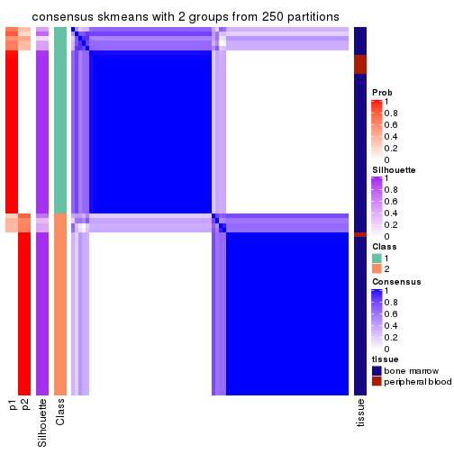</p>

</div>
<div id='tab-MAD-skmeans-consensus-heatmap-2'>
<pre><code class="r">consensus_heatmap(res, k = 3)
</code></pre>

<p>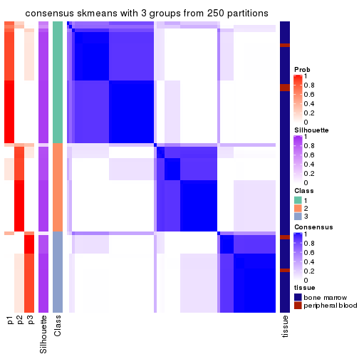</p>

</div>
<div id='tab-MAD-skmeans-consensus-heatmap-3'>
<pre><code class="r">consensus_heatmap(res, k = 4)
</code></pre>

<p>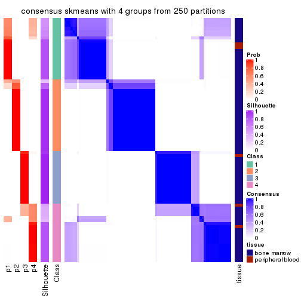</p>

</div>
<div id='tab-MAD-skmeans-consensus-heatmap-4'>
<pre><code class="r">consensus_heatmap(res, k = 5)
</code></pre>

<p>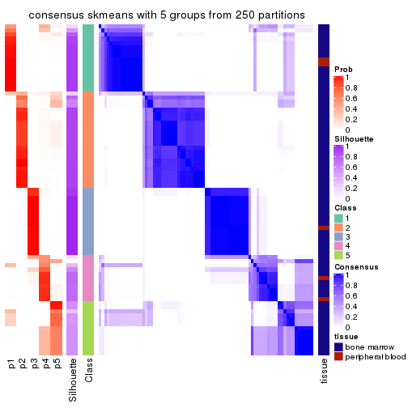</p>

</div>
<div id='tab-MAD-skmeans-consensus-heatmap-5'>
<pre><code class="r">consensus_heatmap(res, k = 6)
</code></pre>

<p>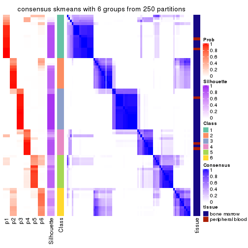</p>

</div>
</div>

Heatmaps for the membership of samples in all partitions to see how consistent they are:


<script>
$( function() {
	$( '#tabs-MAD-skmeans-membership-heatmap' ).tabs();
} );
</script>
<div id='tabs-MAD-skmeans-membership-heatmap'>
<ul>
<li><a href='#tab-MAD-skmeans-membership-heatmap-1'>k = 2</a></li>
<li><a href='#tab-MAD-skmeans-membership-heatmap-2'>k = 3</a></li>
<li><a href='#tab-MAD-skmeans-membership-heatmap-3'>k = 4</a></li>
<li><a href='#tab-MAD-skmeans-membership-heatmap-4'>k = 5</a></li>
<li><a href='#tab-MAD-skmeans-membership-heatmap-5'>k = 6</a></li>
</ul>
<div id='tab-MAD-skmeans-membership-heatmap-1'>
<pre><code class="r">membership_heatmap(res, k = 2)
</code></pre>

<p>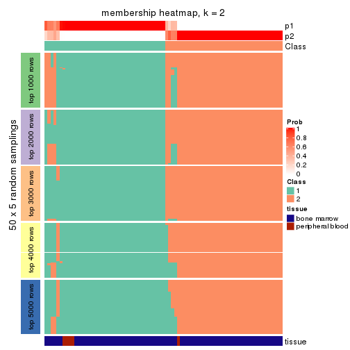</p>

</div>
<div id='tab-MAD-skmeans-membership-heatmap-2'>
<pre><code class="r">membership_heatmap(res, k = 3)
</code></pre>

<p>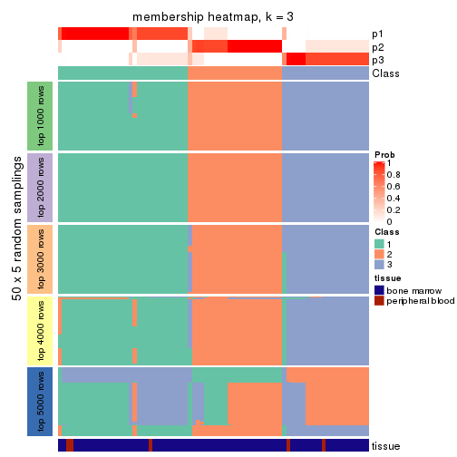</p>

</div>
<div id='tab-MAD-skmeans-membership-heatmap-3'>
<pre><code class="r">membership_heatmap(res, k = 4)
</code></pre>

<p>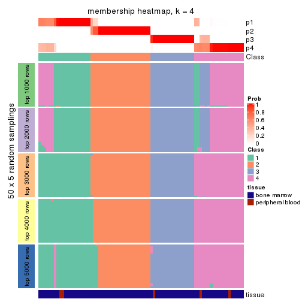</p>

</div>
<div id='tab-MAD-skmeans-membership-heatmap-4'>
<pre><code class="r">membership_heatmap(res, k = 5)
</code></pre>

<p>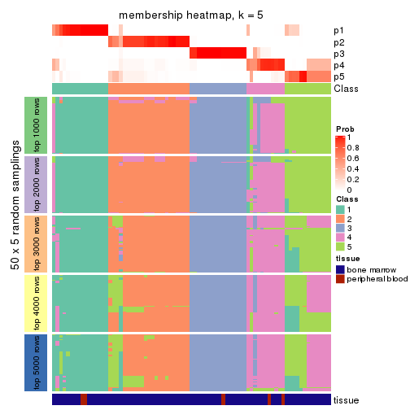</p>

</div>
<div id='tab-MAD-skmeans-membership-heatmap-5'>
<pre><code class="r">membership_heatmap(res, k = 6)
</code></pre>

<p>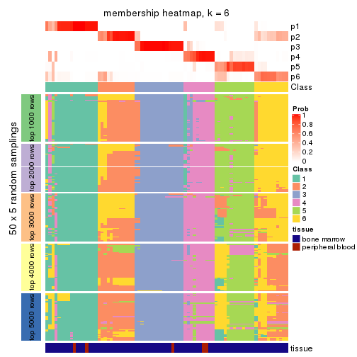</p>

</div>
</div>

As soon as we have had the classes for columns, we can look for signatures
which are significantly different between classes which can be candidate marks
for certain classes. Following are the heatmaps for signatures.


Signature heatmaps where rows are scaled:


<script>
$( function() {
	$( '#tabs-MAD-skmeans-get-signatures' ).tabs();
} );
</script>
<div id='tabs-MAD-skmeans-get-signatures'>
<ul>
<li><a href='#tab-MAD-skmeans-get-signatures-1'>k = 2</a></li>
<li><a href='#tab-MAD-skmeans-get-signatures-2'>k = 3</a></li>
<li><a href='#tab-MAD-skmeans-get-signatures-3'>k = 4</a></li>
<li><a href='#tab-MAD-skmeans-get-signatures-4'>k = 5</a></li>
<li><a href='#tab-MAD-skmeans-get-signatures-5'>k = 6</a></li>
</ul>
<div id='tab-MAD-skmeans-get-signatures-1'>
<pre><code class="r">get_signatures(res, k = 2)
</code></pre>

<p>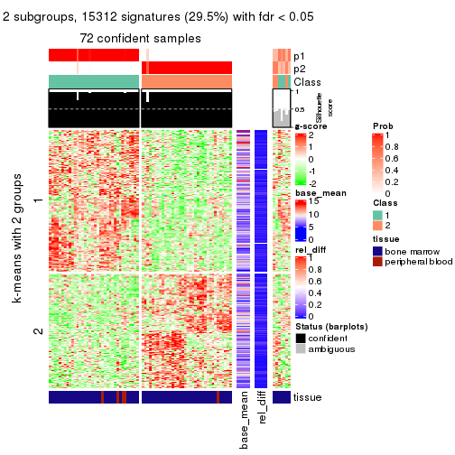</p>

</div>
<div id='tab-MAD-skmeans-get-signatures-2'>
<pre><code class="r">get_signatures(res, k = 3)
</code></pre>

<p>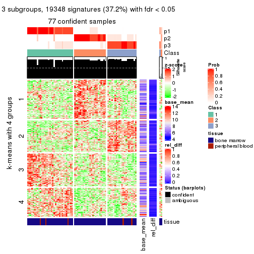</p>

</div>
<div id='tab-MAD-skmeans-get-signatures-3'>
<pre><code class="r">get_signatures(res, k = 4)
</code></pre>

<p>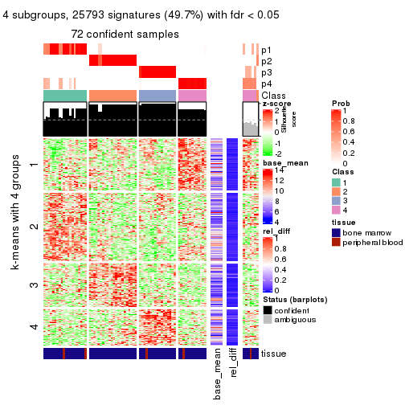</p>

</div>
<div id='tab-MAD-skmeans-get-signatures-4'>
<pre><code class="r">get_signatures(res, k = 5)
</code></pre>

<p>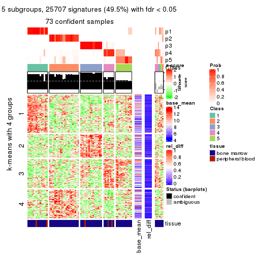</p>

</div>
<div id='tab-MAD-skmeans-get-signatures-5'>
<pre><code class="r">get_signatures(res, k = 6)
</code></pre>

<p>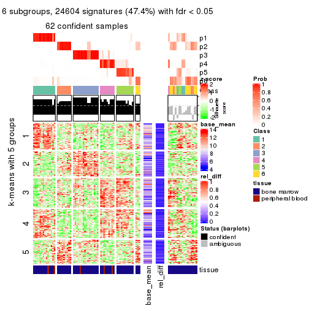</p>

</div>
</div>


Signature heatmaps where rows are not scaled:


<script>
$( function() {
	$( '#tabs-MAD-skmeans-get-signatures-no-scale' ).tabs();
} );
</script>
<div id='tabs-MAD-skmeans-get-signatures-no-scale'>
<ul>
<li><a href='#tab-MAD-skmeans-get-signatures-no-scale-1'>k = 2</a></li>
<li><a href='#tab-MAD-skmeans-get-signatures-no-scale-2'>k = 3</a></li>
<li><a href='#tab-MAD-skmeans-get-signatures-no-scale-3'>k = 4</a></li>
<li><a href='#tab-MAD-skmeans-get-signatures-no-scale-4'>k = 5</a></li>
<li><a href='#tab-MAD-skmeans-get-signatures-no-scale-5'>k = 6</a></li>
</ul>
<div id='tab-MAD-skmeans-get-signatures-no-scale-1'>
<pre><code class="r">get_signatures(res, k = 2, scale_rows = FALSE)
</code></pre>

<p>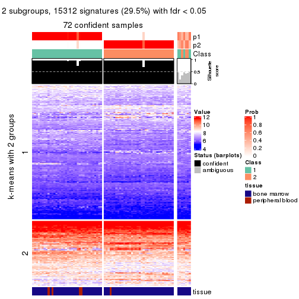</p>

</div>
<div id='tab-MAD-skmeans-get-signatures-no-scale-2'>
<pre><code class="r">get_signatures(res, k = 3, scale_rows = FALSE)
</code></pre>

<p>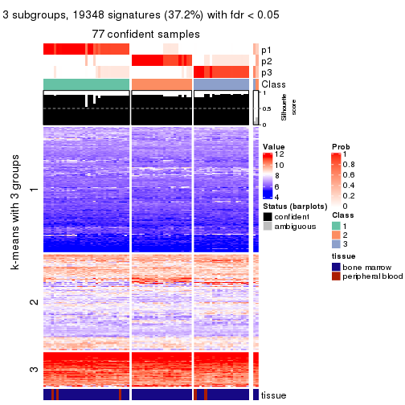</p>

</div>
<div id='tab-MAD-skmeans-get-signatures-no-scale-3'>
<pre><code class="r">get_signatures(res, k = 4, scale_rows = FALSE)
</code></pre>

<p>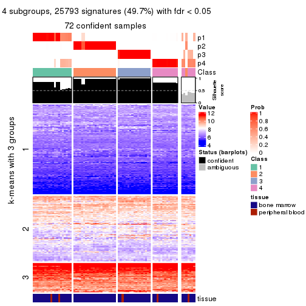</p>

</div>
<div id='tab-MAD-skmeans-get-signatures-no-scale-4'>
<pre><code class="r">get_signatures(res, k = 5, scale_rows = FALSE)
</code></pre>

<p>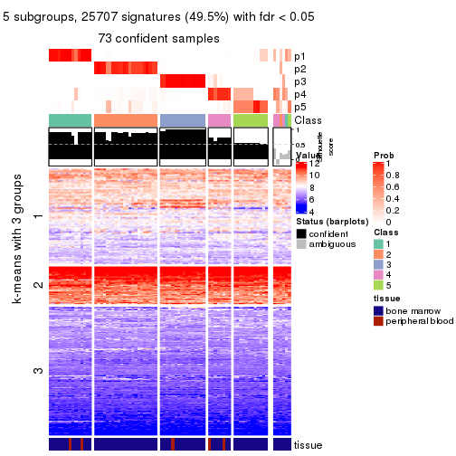</p>

</div>
<div id='tab-MAD-skmeans-get-signatures-no-scale-5'>
<pre><code class="r">get_signatures(res, k = 6, scale_rows = FALSE)
</code></pre>

<p>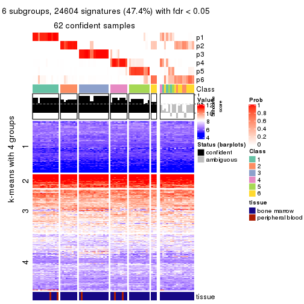</p>

</div>
</div>


Compare the overlap of signatures from different k:

```r
compare_signatures(res)
```

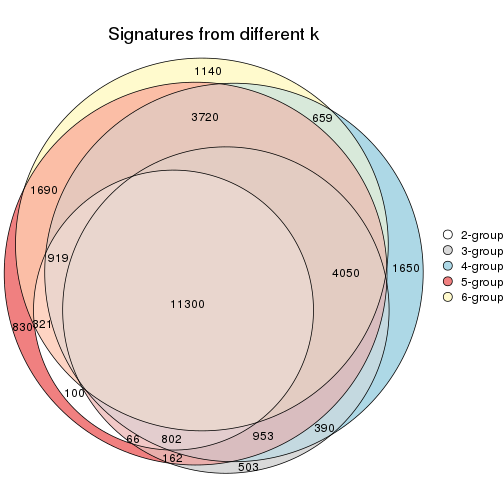

`get_signature()` returns a data frame invisibly. TO get the list of signatures, the function
call should be assigned to a variable explicitly. In following code, if `plot` argument is set
to `FALSE`, no heatmap is plotted while only the differential analysis is performed.

```r
# code only for demonstration
tb = get_signature(res, k = ..., plot = FALSE)
```

An example of the output of `tb` is:

```
#>   which_row         fdr    mean_1    mean_2 scaled_mean_1 scaled_mean_2 km
#> 1        38 0.042760348  8.373488  9.131774    -0.5533452     0.5164555  1
#> 2        40 0.018707592  7.106213  8.469186    -0.6173731     0.5762149  1
#> 3        55 0.019134737 10.221463 11.207825    -0.6159697     0.5749050  1
#> 4        59 0.006059896  5.921854  7.869574    -0.6899429     0.6439467  1
#> 5        60 0.018055526  8.928898 10.211722    -0.6204761     0.5791110  1
#> 6        98 0.009384629 15.714769 14.887706     0.6635654    -0.6193277  2
...
```

The columns in `tb` are:

1. `which_row`: row indices corresponding to the input matrix.
2. `fdr`: FDR for the differential test. 
3. `mean_x`: The mean value in group x.
4. `scaled_mean_x`: The mean value in group x after rows are scaled.
5. `km`: Row groups if k-means clustering is applied to rows.


UMAP plot which shows how samples are separated.


<script>
$( function() {
	$( '#tabs-MAD-skmeans-dimension-reduction' ).tabs();
} );
</script>
<div id='tabs-MAD-skmeans-dimension-reduction'>
<ul>
<li><a href='#tab-MAD-skmeans-dimension-reduction-1'>k = 2</a></li>
<li><a href='#tab-MAD-skmeans-dimension-reduction-2'>k = 3</a></li>
<li><a href='#tab-MAD-skmeans-dimension-reduction-3'>k = 4</a></li>
<li><a href='#tab-MAD-skmeans-dimension-reduction-4'>k = 5</a></li>
<li><a href='#tab-MAD-skmeans-dimension-reduction-5'>k = 6</a></li>
</ul>
<div id='tab-MAD-skmeans-dimension-reduction-1'>
<pre><code class="r">dimension_reduction(res, k = 2, method = &quot;UMAP&quot;)
</code></pre>

<p>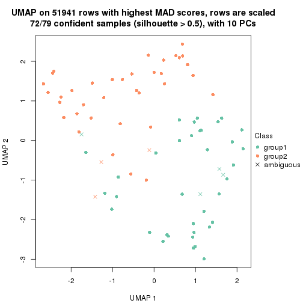</p>

</div>
<div id='tab-MAD-skmeans-dimension-reduction-2'>
<pre><code class="r">dimension_reduction(res, k = 3, method = &quot;UMAP&quot;)
</code></pre>

<p>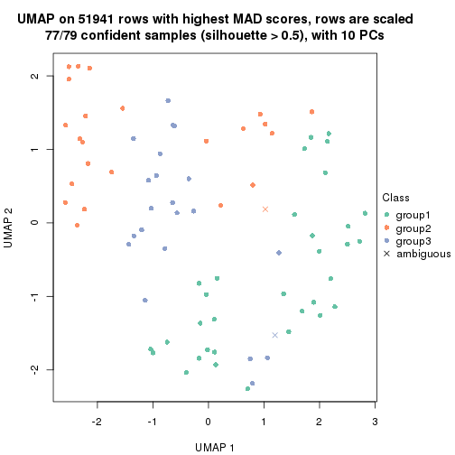</p>

</div>
<div id='tab-MAD-skmeans-dimension-reduction-3'>
<pre><code class="r">dimension_reduction(res, k = 4, method = &quot;UMAP&quot;)
</code></pre>

<p>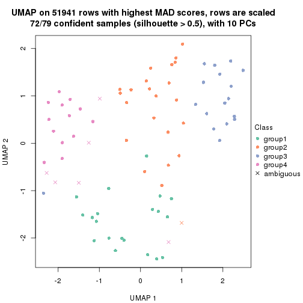</p>

</div>
<div id='tab-MAD-skmeans-dimension-reduction-4'>
<pre><code class="r">dimension_reduction(res, k = 5, method = &quot;UMAP&quot;)
</code></pre>

<p>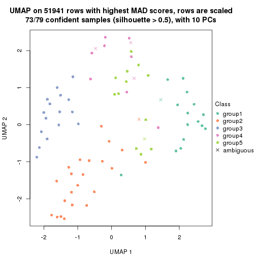</p>

</div>
<div id='tab-MAD-skmeans-dimension-reduction-5'>
<pre><code class="r">dimension_reduction(res, k = 6, method = &quot;UMAP&quot;)
</code></pre>

<p>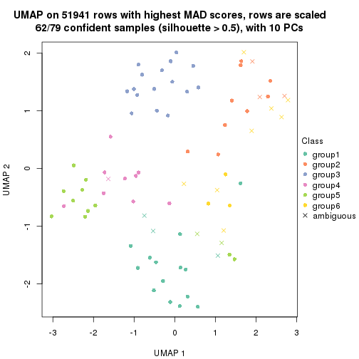</p>

</div>
</div>


Following heatmap shows how subgroups are split when increasing `k`:

```r
collect_classes(res)
```

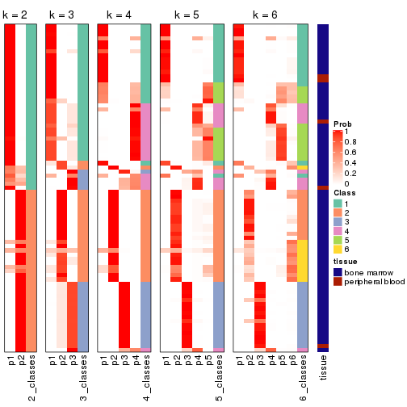


Test correlation between subgroups and known annotations. If the known
annotation is numeric, one-way ANOVA test is applied, and if the known
annotation is discrete, chi-squared contingency table test is applied.

```r
test_to_known_factors(res)
```

```
#>              n tissue(p) k
#> MAD:skmeans 72     0.354 2
#> MAD:skmeans 77     0.320 3
#> MAD:skmeans 72     0.539 4
#> MAD:skmeans 73     0.106 5
#> MAD:skmeans 62     0.386 6
```


If matrix rows can be associated to genes, consider to use `GO_Enrichment(res,
...)` to perform function enrichment for the signature genes.


 

---------------------------------------------------


### MAD:pam


The object with results only for a single top-value method and a single partition method 
can be extracted as:

```r
res = res_list["MAD", "pam"]
# you can also extract it by
# res = res_list["MAD:pam"]
```

A summary of `res` and all the functions that can be applied to it:

```r
res
```

```
#> A 'ConsensusPartition' object with k = 2, 3, 4, 5, 6.
#>   On a matrix with 51941 rows and 79 columns.
#>   Top rows (1000, 2000, 3000, 4000, 5000) are extracted by 'MAD' method.
#>   Subgroups are detected by 'pam' method.
#>   Performed in total 1250 partitions by row resampling.
#>   Best k for subgroups seems to be 3.
#> 
#> Following methods can be applied to this 'ConsensusPartition' object:
#>  [1] "cola_report"             "collect_classes"         "collect_plots"          
#>  [4] "collect_stats"           "colnames"                "compare_signatures"     
#>  [7] "consensus_heatmap"       "dimension_reduction"     "functional_enrichment"  
#> [10] "get_anno_col"            "get_anno"                "get_classes"            
#> [13] "get_consensus"           "get_matrix"              "get_membership"         
#> [16] "get_param"               "get_signatures"          "get_stats"              
#> [19] "is_best_k"               "is_stable_k"             "membership_heatmap"     
#> [22] "ncol"                    "nrow"                    "plot_ecdf"              
#> [25] "rownames"                "select_partition_number" "show"                   
#> [28] "suggest_best_k"          "test_to_known_factors"
```

`collect_plots()` function collects all the plots made from `res` for all `k` (number of partitions)
into one single page to provide an easy and fast comparison between different `k`.

```r
collect_plots(res)
```

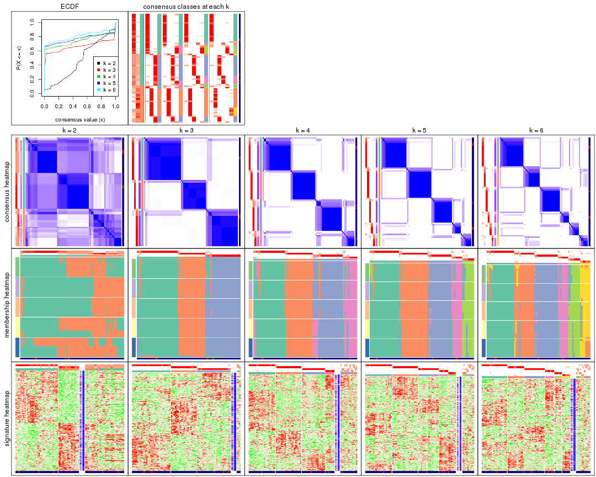

The plots are:

- The first row: a plot of the ECDF (Empirical cumulative distribution
  function) curves of the consensus matrix for each `k` and the heatmap of
  predicted classes for each `k`.
- The second row: heatmaps of the consensus matrix for each `k`.
- The third row: heatmaps of the membership matrix for each `k`.
- The fouth row: heatmaps of the signatures for each `k`.

All the plots in panels can be made by individual functions and they are
plotted later in this section.

`select_partition_number()` produces several plots showing different
statistics for choosing "optimized" `k`. There are following statistics:

- ECDF curves of the consensus matrix for each `k`;
- 1-PAC. [The PAC
  score](https://en.wikipedia.org/wiki/Consensus_clustering#Over-interpretation_potential_of_consensus_clustering)
  measures the proportion of the ambiguous subgrouping.
- Mean silhouette score.
- Concordance. The mean probability of fiting the consensus class ids in all
  partitions.
- Area increased. Denote $A_k$ as the area under the ECDF curve for current
  `k`, the area increased is defined as $A_k - A_{k-1}$.
- Rand index. The percent of pairs of samples that are both in a same cluster
  or both are not in a same cluster in the partition of k and k-1.
- Jaccard index. The ratio of pairs of samples are both in a same cluster in
  the partition of k and k-1 and the pairs of samples are both in a same
  cluster in the partition k or k-1.

The detailed explanations of these statistics can be found in [the cola
vignette](http://bioconductor.org/packages/devel/bioc/vignettes/cola/inst/doc/cola.html#toc_13).

Generally speaking, lower PAC score, higher mean silhouette score or higher
concordance corresponds to better partition. Rand index and Jaccard index
measure how similar the current partition is compared to partition with `k-1`.
If they are too similar, we won't accept `k` is better than `k-1`.

```r
select_partition_number(res)
```

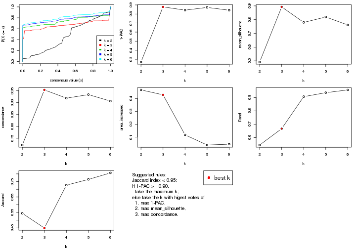

The numeric values for all these statistics can be obtained by `get_stats()`.

```r
get_stats(res)
```

```
#>   k 1-PAC mean_silhouette concordance area_increased  Rand Jaccard
#> 2 2 0.270           0.492       0.722         0.4661 0.544   0.544
#> 3 3 0.878           0.893       0.954         0.4280 0.667   0.449
#> 4 4 0.843           0.780       0.919         0.1175 0.907   0.727
#> 5 5 0.872           0.819       0.934         0.0388 0.936   0.764
#> 6 6 0.842           0.761       0.907         0.0451 0.957   0.806
```

`suggest_best_k()` suggests the best $k$ based on these statistics. The rules are as follows:

- All $k$ with Jaccard index larger than 0.95 are removed because the increase of
  the partition number does not provides enough extra information. If all $k$ are removed,
  the best $k$ is assigned by `NA`.
- For $k$ with 1-PAC larger than 0.9, the maximal $k$ is taken as the "best k". Other $k$ is called "optional k".
- If it does not fit the second rule. The $k$ with the highest vote of highest
  1-PAC, mean silhouette and concordance is taken as the "best k".

```r
suggest_best_k(res)
```

```
#> [1] 3
```


Following shows the table of the partitions (You need to click the **show/hide
code output** link to see it). The membership matrix (columns with name `p*`)
is inferred by
[`clue::cl_consensus()`](https://www.rdocumentation.org/link/cl_consensus?package=clue)
function with the `SE` method. Basically the value in the membership matrix
represents the probability to belong to a certain group. The finall class
label for an item is determined with the group with highest probability it
belongs to.

In `get_classes()` function, the entropy is calculated from the membership
matrix and the silhouette score is calculated from the consensus matrix.


<script>
$( function() {
	$( '#tabs-MAD-pam-get-classes' ).tabs();
} );
</script>
<div id='tabs-MAD-pam-get-classes'>
<ul>
<li><a href='#tab-MAD-pam-get-classes-1'>k = 2</a></li>
<li><a href='#tab-MAD-pam-get-classes-2'>k = 3</a></li>
<li><a href='#tab-MAD-pam-get-classes-3'>k = 4</a></li>
<li><a href='#tab-MAD-pam-get-classes-4'>k = 5</a></li>
<li><a href='#tab-MAD-pam-get-classes-5'>k = 6</a></li>
</ul>

<div id='tab-MAD-pam-get-classes-1'>
<p><a id='tab-MAD-pam-get-classes-1-a' style='color:#0366d6' href='#'>show/hide code output</a></p>
<pre><code class="r">cbind(get_classes(res, k = 2), get_membership(res, k = 2))
</code></pre>

<pre><code>#&gt;           class entropy silhouette    p1    p2
#&gt; GSM316652     1   0.993    0.44492 0.548 0.452
#&gt; GSM316653     1   0.000    0.64159 1.000 0.000
#&gt; GSM316654     1   0.821    0.53972 0.744 0.256
#&gt; GSM316655     1   0.000    0.64159 1.000 0.000
#&gt; GSM316656     2   0.958    0.20014 0.380 0.620
#&gt; GSM316657     1   0.000    0.64159 1.000 0.000
#&gt; GSM316658     2   0.833    0.58161 0.264 0.736
#&gt; GSM316659     2   0.844    0.57494 0.272 0.728
#&gt; GSM316660     1   0.000    0.64159 1.000 0.000
#&gt; GSM316661     1   0.904    0.51448 0.680 0.320
#&gt; GSM316662     2   0.788    0.26766 0.236 0.764
#&gt; GSM316663     1   0.993    0.44492 0.548 0.452
#&gt; GSM316664     1   0.000    0.64159 1.000 0.000
#&gt; GSM316665     2   0.430    0.55776 0.088 0.912
#&gt; GSM316666     1   0.993    0.44492 0.548 0.452
#&gt; GSM316667     2   0.961    0.53595 0.384 0.616
#&gt; GSM316668     1   0.993    0.44492 0.548 0.452
#&gt; GSM316669     1   0.000    0.64159 1.000 0.000
#&gt; GSM316670     2   0.430    0.55776 0.088 0.912
#&gt; GSM316671     2   0.995   -0.36055 0.460 0.540
#&gt; GSM316672     1   0.506    0.53868 0.888 0.112
#&gt; GSM316673     1   0.000    0.64159 1.000 0.000
#&gt; GSM316674     1   0.993    0.44492 0.548 0.452
#&gt; GSM316676     1   0.993    0.44492 0.548 0.452
#&gt; GSM316677     1   0.000    0.64159 1.000 0.000
#&gt; GSM316678     2   0.993    0.45308 0.452 0.548
#&gt; GSM316679     1   0.430    0.56827 0.912 0.088
#&gt; GSM316680     1   0.482    0.55068 0.896 0.104
#&gt; GSM316681     2   0.995   -0.36055 0.460 0.540
#&gt; GSM316682     1   0.518    0.60209 0.884 0.116
#&gt; GSM316683     1   0.000    0.64159 1.000 0.000
#&gt; GSM316684     2   0.993    0.45308 0.452 0.548
#&gt; GSM316685     2   0.430    0.55776 0.088 0.912
#&gt; GSM316686     1   0.000    0.64159 1.000 0.000
#&gt; GSM316687     1   0.993    0.44492 0.548 0.452
#&gt; GSM316688     1   0.866    0.52084 0.712 0.288
#&gt; GSM316689     1   0.000    0.64159 1.000 0.000
#&gt; GSM316690     1   0.993    0.44492 0.548 0.452
#&gt; GSM316691     2   0.456    0.56087 0.096 0.904
#&gt; GSM316692     1   0.993    0.44492 0.548 0.452
#&gt; GSM316693     1   0.814    0.54077 0.748 0.252
#&gt; GSM316694     1   0.993    0.44492 0.548 0.452
#&gt; GSM316696     1   0.000    0.64159 1.000 0.000
#&gt; GSM316697     1   0.993    0.44492 0.548 0.452
#&gt; GSM316698     2   0.993    0.45308 0.452 0.548
#&gt; GSM316699     2   0.000    0.58385 0.000 1.000
#&gt; GSM316700     1   0.662    0.58095 0.828 0.172
#&gt; GSM316701     1   0.204    0.61905 0.968 0.032
#&gt; GSM316703     2   1.000    0.28395 0.488 0.512
#&gt; GSM316704     2   0.958    0.53379 0.380 0.620
#&gt; GSM316705     1   0.000    0.64159 1.000 0.000
#&gt; GSM316706     1   0.995   -0.41752 0.540 0.460
#&gt; GSM316707     2   0.416    0.61208 0.084 0.916
#&gt; GSM316708     2   0.993    0.45308 0.452 0.548
#&gt; GSM316709     1   0.993    0.44492 0.548 0.452
#&gt; GSM316710     1   0.895    0.51831 0.688 0.312
#&gt; GSM316711     2   0.760    0.58533 0.220 0.780
#&gt; GSM316713     1   0.000    0.64159 1.000 0.000
#&gt; GSM316714     1   0.993    0.44492 0.548 0.452
#&gt; GSM316715     1   0.402    0.57654 0.920 0.080
#&gt; GSM316716     2   0.000    0.58385 0.000 1.000
#&gt; GSM316717     1   0.430    0.56827 0.912 0.088
#&gt; GSM316718     2   0.993    0.45308 0.452 0.548
#&gt; GSM316719     1   0.000    0.64159 1.000 0.000
#&gt; GSM316720     1   0.430    0.56827 0.912 0.088
#&gt; GSM316721     2   0.000    0.58385 0.000 1.000
#&gt; GSM316722     1   0.913   -0.00224 0.672 0.328
#&gt; GSM316723     2   0.722    0.59999 0.200 0.800
#&gt; GSM316724     2   0.900    0.55277 0.316 0.684
#&gt; GSM316726     2   0.278    0.60426 0.048 0.952
#&gt; GSM316727     1   0.430    0.56827 0.912 0.088
#&gt; GSM316728     1   0.993    0.44492 0.548 0.452
#&gt; GSM316729     2   0.993    0.45308 0.452 0.548
#&gt; GSM316730     1   0.615    0.40653 0.848 0.152
#&gt; GSM316675     1   0.993    0.44492 0.548 0.452
#&gt; GSM316695     1   0.000    0.64159 1.000 0.000
#&gt; GSM316702     1   0.993    0.44492 0.548 0.452
#&gt; GSM316712     1   0.000    0.64159 1.000 0.000
#&gt; GSM316725     1   0.821    0.53972 0.744 0.256
</code></pre>

<script>
$('#tab-MAD-pam-get-classes-1-a').parent().next().next().hide();
$('#tab-MAD-pam-get-classes-1-a').click(function(){
  $('#tab-MAD-pam-get-classes-1-a').parent().next().next().toggle();
  return(false);
});
</script>
</div>

<div id='tab-MAD-pam-get-classes-2'>
<p><a id='tab-MAD-pam-get-classes-2-a' style='color:#0366d6' href='#'>show/hide code output</a></p>
<pre><code class="r">cbind(get_classes(res, k = 3), get_membership(res, k = 3))
</code></pre>

<pre><code>#&gt;           class entropy silhouette    p1    p2    p3
#&gt; GSM316652     3  0.0000      0.931 0.000 0.000 1.000
#&gt; GSM316653     1  0.0000      0.958 1.000 0.000 0.000
#&gt; GSM316654     3  0.4702      0.739 0.212 0.000 0.788
#&gt; GSM316655     1  0.0000      0.958 1.000 0.000 0.000
#&gt; GSM316656     3  0.0747      0.924 0.000 0.016 0.984
#&gt; GSM316657     1  0.0000      0.958 1.000 0.000 0.000
#&gt; GSM316658     2  0.0000      0.954 0.000 1.000 0.000
#&gt; GSM316659     2  0.0747      0.950 0.016 0.984 0.000
#&gt; GSM316660     1  0.0000      0.958 1.000 0.000 0.000
#&gt; GSM316661     3  0.0747      0.927 0.016 0.000 0.984
#&gt; GSM316662     3  0.0000      0.931 0.000 0.000 1.000
#&gt; GSM316663     3  0.0747      0.927 0.016 0.000 0.984
#&gt; GSM316664     1  0.0000      0.958 1.000 0.000 0.000
#&gt; GSM316665     2  0.0747      0.952 0.000 0.984 0.016
#&gt; GSM316666     3  0.0000      0.931 0.000 0.000 1.000
#&gt; GSM316667     2  0.0747      0.952 0.000 0.984 0.016
#&gt; GSM316668     3  0.0000      0.931 0.000 0.000 1.000
#&gt; GSM316669     1  0.0000      0.958 1.000 0.000 0.000
#&gt; GSM316670     3  0.6295      0.115 0.000 0.472 0.528
#&gt; GSM316671     3  0.0237      0.929 0.000 0.004 0.996
#&gt; GSM316672     1  0.0747      0.953 0.984 0.016 0.000
#&gt; GSM316673     1  0.0000      0.958 1.000 0.000 0.000
#&gt; GSM316674     3  0.0000      0.931 0.000 0.000 1.000
#&gt; GSM316676     3  0.0000      0.931 0.000 0.000 1.000
#&gt; GSM316677     1  0.0000      0.958 1.000 0.000 0.000
#&gt; GSM316678     2  0.0000      0.954 0.000 1.000 0.000
#&gt; GSM316679     1  0.0747      0.953 0.984 0.016 0.000
#&gt; GSM316680     1  0.0747      0.953 0.984 0.016 0.000
#&gt; GSM316681     3  0.0000      0.931 0.000 0.000 1.000
#&gt; GSM316682     1  0.4555      0.718 0.800 0.000 0.200
#&gt; GSM316683     1  0.0000      0.958 1.000 0.000 0.000
#&gt; GSM316684     2  0.0000      0.954 0.000 1.000 0.000
#&gt; GSM316685     2  0.0747      0.952 0.000 0.984 0.016
#&gt; GSM316686     1  0.0000      0.958 1.000 0.000 0.000
#&gt; GSM316687     3  0.0747      0.927 0.016 0.000 0.984
#&gt; GSM316688     3  0.7949      0.569 0.252 0.108 0.640
#&gt; GSM316689     1  0.0000      0.958 1.000 0.000 0.000
#&gt; GSM316690     3  0.0000      0.931 0.000 0.000 1.000
#&gt; GSM316691     2  0.0747      0.952 0.000 0.984 0.016
#&gt; GSM316692     3  0.0000      0.931 0.000 0.000 1.000
#&gt; GSM316693     3  0.5098      0.689 0.248 0.000 0.752
#&gt; GSM316694     3  0.0000      0.931 0.000 0.000 1.000
#&gt; GSM316696     1  0.0000      0.958 1.000 0.000 0.000
#&gt; GSM316697     3  0.0000      0.931 0.000 0.000 1.000
#&gt; GSM316698     2  0.0000      0.954 0.000 1.000 0.000
#&gt; GSM316699     2  0.0747      0.952 0.000 0.984 0.016
#&gt; GSM316700     1  0.5621      0.517 0.692 0.000 0.308
#&gt; GSM316701     1  0.0424      0.956 0.992 0.008 0.000
#&gt; GSM316703     2  0.0747      0.950 0.016 0.984 0.000
#&gt; GSM316704     2  0.0747      0.950 0.016 0.984 0.000
#&gt; GSM316705     1  0.0000      0.958 1.000 0.000 0.000
#&gt; GSM316706     2  0.5178      0.643 0.256 0.744 0.000
#&gt; GSM316707     2  0.0000      0.954 0.000 1.000 0.000
#&gt; GSM316708     2  0.6126      0.311 0.400 0.600 0.000
#&gt; GSM316709     3  0.0000      0.931 0.000 0.000 1.000
#&gt; GSM316710     3  0.0747      0.927 0.016 0.000 0.984
#&gt; GSM316711     2  0.0747      0.950 0.016 0.984 0.000
#&gt; GSM316713     1  0.0000      0.958 1.000 0.000 0.000
#&gt; GSM316714     3  0.0000      0.931 0.000 0.000 1.000
#&gt; GSM316715     1  0.0592      0.955 0.988 0.012 0.000
#&gt; GSM316716     2  0.0747      0.952 0.000 0.984 0.016
#&gt; GSM316717     1  0.0747      0.953 0.984 0.016 0.000
#&gt; GSM316718     1  0.6111      0.323 0.604 0.396 0.000
#&gt; GSM316719     1  0.0000      0.958 1.000 0.000 0.000
#&gt; GSM316720     1  0.0747      0.953 0.984 0.016 0.000
#&gt; GSM316721     2  0.0000      0.954 0.000 1.000 0.000
#&gt; GSM316722     1  0.0747      0.953 0.984 0.016 0.000
#&gt; GSM316723     2  0.0000      0.954 0.000 1.000 0.000
#&gt; GSM316724     2  0.0000      0.954 0.000 1.000 0.000
#&gt; GSM316726     2  0.0424      0.954 0.000 0.992 0.008
#&gt; GSM316727     1  0.0747      0.953 0.984 0.016 0.000
#&gt; GSM316728     3  0.0747      0.927 0.016 0.000 0.984
#&gt; GSM316729     1  0.0747      0.953 0.984 0.016 0.000
#&gt; GSM316730     1  0.2625      0.881 0.916 0.084 0.000
#&gt; GSM316675     3  0.0747      0.927 0.016 0.000 0.984
#&gt; GSM316695     1  0.0000      0.958 1.000 0.000 0.000
#&gt; GSM316702     3  0.0747      0.927 0.016 0.000 0.984
#&gt; GSM316712     1  0.0000      0.958 1.000 0.000 0.000
#&gt; GSM316725     3  0.5397      0.638 0.280 0.000 0.720
</code></pre>

<script>
$('#tab-MAD-pam-get-classes-2-a').parent().next().next().hide();
$('#tab-MAD-pam-get-classes-2-a').click(function(){
  $('#tab-MAD-pam-get-classes-2-a').parent().next().next().toggle();
  return(false);
});
</script>
</div>

<div id='tab-MAD-pam-get-classes-3'>
<p><a id='tab-MAD-pam-get-classes-3-a' style='color:#0366d6' href='#'>show/hide code output</a></p>
<pre><code class="r">cbind(get_classes(res, k = 4), get_membership(res, k = 4))
</code></pre>

<pre><code>#&gt;           class entropy silhouette    p1    p2    p3    p4
#&gt; GSM316652     3  0.0000     0.8671 0.000 0.000 1.000 0.000
#&gt; GSM316653     4  0.4985     0.1232 0.468 0.000 0.000 0.532
#&gt; GSM316654     3  0.5109     0.5746 0.196 0.000 0.744 0.060
#&gt; GSM316655     1  0.4790     0.2601 0.620 0.000 0.000 0.380
#&gt; GSM316656     4  0.4746     0.2924 0.000 0.000 0.368 0.632
#&gt; GSM316657     1  0.0000     0.9119 1.000 0.000 0.000 0.000
#&gt; GSM316658     2  0.0000     0.9592 0.000 1.000 0.000 0.000
#&gt; GSM316659     2  0.0000     0.9592 0.000 1.000 0.000 0.000
#&gt; GSM316660     1  0.0000     0.9119 1.000 0.000 0.000 0.000
#&gt; GSM316661     4  0.4843     0.1823 0.000 0.000 0.396 0.604
#&gt; GSM316662     3  0.0000     0.8671 0.000 0.000 1.000 0.000
#&gt; GSM316663     3  0.4790     0.3798 0.000 0.000 0.620 0.380
#&gt; GSM316664     1  0.4790     0.2601 0.620 0.000 0.000 0.380
#&gt; GSM316665     2  0.0000     0.9592 0.000 1.000 0.000 0.000
#&gt; GSM316666     3  0.0000     0.8671 0.000 0.000 1.000 0.000
#&gt; GSM316667     2  0.0000     0.9592 0.000 1.000 0.000 0.000
#&gt; GSM316668     3  0.0000     0.8671 0.000 0.000 1.000 0.000
#&gt; GSM316669     4  0.3074     0.6953 0.152 0.000 0.000 0.848
#&gt; GSM316670     3  0.4989     0.0657 0.000 0.472 0.528 0.000
#&gt; GSM316671     3  0.0000     0.8671 0.000 0.000 1.000 0.000
#&gt; GSM316672     1  0.0000     0.9119 1.000 0.000 0.000 0.000
#&gt; GSM316673     1  0.0000     0.9119 1.000 0.000 0.000 0.000
#&gt; GSM316674     3  0.0000     0.8671 0.000 0.000 1.000 0.000
#&gt; GSM316676     3  0.0000     0.8671 0.000 0.000 1.000 0.000
#&gt; GSM316677     1  0.0000     0.9119 1.000 0.000 0.000 0.000
#&gt; GSM316678     2  0.0000     0.9592 0.000 1.000 0.000 0.000
#&gt; GSM316679     1  0.0000     0.9119 1.000 0.000 0.000 0.000
#&gt; GSM316680     1  0.3610     0.6976 0.800 0.000 0.000 0.200
#&gt; GSM316681     3  0.0000     0.8671 0.000 0.000 1.000 0.000
#&gt; GSM316682     4  0.0000     0.7805 0.000 0.000 0.000 1.000
#&gt; GSM316683     4  0.0000     0.7805 0.000 0.000 0.000 1.000
#&gt; GSM316684     2  0.0000     0.9592 0.000 1.000 0.000 0.000
#&gt; GSM316685     2  0.0000     0.9592 0.000 1.000 0.000 0.000
#&gt; GSM316686     1  0.0000     0.9119 1.000 0.000 0.000 0.000
#&gt; GSM316687     3  0.0000     0.8671 0.000 0.000 1.000 0.000
#&gt; GSM316688     3  0.7156     0.1972 0.008 0.108 0.504 0.380
#&gt; GSM316689     1  0.0000     0.9119 1.000 0.000 0.000 0.000
#&gt; GSM316690     3  0.0000     0.8671 0.000 0.000 1.000 0.000
#&gt; GSM316691     2  0.0000     0.9592 0.000 1.000 0.000 0.000
#&gt; GSM316692     3  0.0000     0.8671 0.000 0.000 1.000 0.000
#&gt; GSM316693     4  0.0000     0.7805 0.000 0.000 0.000 1.000
#&gt; GSM316694     3  0.0000     0.8671 0.000 0.000 1.000 0.000
#&gt; GSM316696     1  0.0000     0.9119 1.000 0.000 0.000 0.000
#&gt; GSM316697     3  0.0000     0.8671 0.000 0.000 1.000 0.000
#&gt; GSM316698     2  0.0000     0.9592 0.000 1.000 0.000 0.000
#&gt; GSM316699     2  0.0000     0.9592 0.000 1.000 0.000 0.000
#&gt; GSM316700     4  0.0000     0.7805 0.000 0.000 0.000 1.000
#&gt; GSM316701     4  0.0000     0.7805 0.000 0.000 0.000 1.000
#&gt; GSM316703     2  0.0000     0.9592 0.000 1.000 0.000 0.000
#&gt; GSM316704     2  0.0000     0.9592 0.000 1.000 0.000 0.000
#&gt; GSM316705     1  0.0000     0.9119 1.000 0.000 0.000 0.000
#&gt; GSM316706     2  0.3975     0.6369 0.240 0.760 0.000 0.000
#&gt; GSM316707     2  0.0000     0.9592 0.000 1.000 0.000 0.000
#&gt; GSM316708     2  0.4898     0.2597 0.416 0.584 0.000 0.000
#&gt; GSM316709     3  0.0000     0.8671 0.000 0.000 1.000 0.000
#&gt; GSM316710     3  0.4830     0.3546 0.000 0.000 0.608 0.392
#&gt; GSM316711     2  0.0000     0.9592 0.000 1.000 0.000 0.000
#&gt; GSM316713     1  0.0000     0.9119 1.000 0.000 0.000 0.000
#&gt; GSM316714     3  0.0000     0.8671 0.000 0.000 1.000 0.000
#&gt; GSM316715     1  0.0000     0.9119 1.000 0.000 0.000 0.000
#&gt; GSM316716     2  0.0000     0.9592 0.000 1.000 0.000 0.000
#&gt; GSM316717     1  0.0000     0.9119 1.000 0.000 0.000 0.000
#&gt; GSM316718     1  0.4790     0.3539 0.620 0.380 0.000 0.000
#&gt; GSM316719     1  0.0000     0.9119 1.000 0.000 0.000 0.000
#&gt; GSM316720     1  0.0000     0.9119 1.000 0.000 0.000 0.000
#&gt; GSM316721     2  0.0000     0.9592 0.000 1.000 0.000 0.000
#&gt; GSM316722     1  0.3074     0.7621 0.848 0.000 0.000 0.152
#&gt; GSM316723     2  0.0000     0.9592 0.000 1.000 0.000 0.000
#&gt; GSM316724     2  0.0000     0.9592 0.000 1.000 0.000 0.000
#&gt; GSM316726     2  0.0000     0.9592 0.000 1.000 0.000 0.000
#&gt; GSM316727     1  0.0000     0.9119 1.000 0.000 0.000 0.000
#&gt; GSM316728     3  0.0000     0.8671 0.000 0.000 1.000 0.000
#&gt; GSM316729     4  0.4790     0.2499 0.380 0.000 0.000 0.620
#&gt; GSM316730     1  0.2081     0.8270 0.916 0.084 0.000 0.000
#&gt; GSM316675     3  0.0000     0.8671 0.000 0.000 1.000 0.000
#&gt; GSM316695     1  0.0000     0.9119 1.000 0.000 0.000 0.000
#&gt; GSM316702     3  0.4790     0.3798 0.000 0.000 0.620 0.380
#&gt; GSM316712     1  0.0000     0.9119 1.000 0.000 0.000 0.000
#&gt; GSM316725     4  0.0921     0.7738 0.028 0.000 0.000 0.972
</code></pre>

<script>
$('#tab-MAD-pam-get-classes-3-a').parent().next().next().hide();
$('#tab-MAD-pam-get-classes-3-a').click(function(){
  $('#tab-MAD-pam-get-classes-3-a').parent().next().next().toggle();
  return(false);
});
</script>
</div>

<div id='tab-MAD-pam-get-classes-4'>
<p><a id='tab-MAD-pam-get-classes-4-a' style='color:#0366d6' href='#'>show/hide code output</a></p>
<pre><code class="r">cbind(get_classes(res, k = 5), get_membership(res, k = 5))
</code></pre>

<pre><code>#&gt;           class entropy silhouette    p1    p2    p3    p4    p5
#&gt; GSM316652     3  0.0000      0.930 0.000 0.000 1.000 0.000 0.000
#&gt; GSM316653     5  0.4294      0.185 0.468 0.000 0.000 0.000 0.532
#&gt; GSM316654     4  0.0000      0.807 0.000 0.000 0.000 1.000 0.000
#&gt; GSM316655     1  0.0000      0.951 1.000 0.000 0.000 0.000 0.000
#&gt; GSM316656     5  0.3949      0.438 0.000 0.000 0.332 0.000 0.668
#&gt; GSM316657     1  0.0000      0.951 1.000 0.000 0.000 0.000 0.000
#&gt; GSM316658     2  0.0000      0.936 0.000 1.000 0.000 0.000 0.000
#&gt; GSM316659     2  0.0000      0.936 0.000 1.000 0.000 0.000 0.000
#&gt; GSM316660     1  0.0000      0.951 1.000 0.000 0.000 0.000 0.000
#&gt; GSM316661     5  0.4171      0.302 0.000 0.000 0.396 0.000 0.604
#&gt; GSM316662     3  0.0000      0.930 0.000 0.000 1.000 0.000 0.000
#&gt; GSM316663     3  0.4227      0.262 0.000 0.000 0.580 0.420 0.000
#&gt; GSM316664     4  0.3109      0.629 0.200 0.000 0.000 0.800 0.000
#&gt; GSM316665     2  0.0000      0.936 0.000 1.000 0.000 0.000 0.000
#&gt; GSM316666     3  0.0000      0.930 0.000 0.000 1.000 0.000 0.000
#&gt; GSM316667     2  0.0000      0.936 0.000 1.000 0.000 0.000 0.000
#&gt; GSM316668     3  0.0000      0.930 0.000 0.000 1.000 0.000 0.000
#&gt; GSM316669     5  0.2648      0.656 0.152 0.000 0.000 0.000 0.848
#&gt; GSM316670     2  0.4242      0.243 0.000 0.572 0.428 0.000 0.000
#&gt; GSM316671     3  0.0000      0.930 0.000 0.000 1.000 0.000 0.000
#&gt; GSM316672     1  0.0000      0.951 1.000 0.000 0.000 0.000 0.000
#&gt; GSM316673     1  0.0000      0.951 1.000 0.000 0.000 0.000 0.000
#&gt; GSM316674     3  0.0000      0.930 0.000 0.000 1.000 0.000 0.000
#&gt; GSM316676     3  0.0000      0.930 0.000 0.000 1.000 0.000 0.000
#&gt; GSM316677     4  0.4210      0.227 0.412 0.000 0.000 0.588 0.000
#&gt; GSM316678     2  0.0000      0.936 0.000 1.000 0.000 0.000 0.000
#&gt; GSM316679     1  0.0000      0.951 1.000 0.000 0.000 0.000 0.000
#&gt; GSM316680     1  0.3109      0.729 0.800 0.000 0.000 0.000 0.200
#&gt; GSM316681     3  0.0000      0.930 0.000 0.000 1.000 0.000 0.000
#&gt; GSM316682     5  0.0000      0.748 0.000 0.000 0.000 0.000 1.000
#&gt; GSM316683     5  0.0000      0.748 0.000 0.000 0.000 0.000 1.000
#&gt; GSM316684     2  0.0000      0.936 0.000 1.000 0.000 0.000 0.000
#&gt; GSM316685     2  0.0000      0.936 0.000 1.000 0.000 0.000 0.000
#&gt; GSM316686     1  0.0000      0.951 1.000 0.000 0.000 0.000 0.000
#&gt; GSM316687     3  0.2424      0.803 0.000 0.000 0.868 0.132 0.000
#&gt; GSM316688     3  0.5811      0.282 0.340 0.108 0.552 0.000 0.000
#&gt; GSM316689     1  0.0000      0.951 1.000 0.000 0.000 0.000 0.000
#&gt; GSM316690     3  0.0000      0.930 0.000 0.000 1.000 0.000 0.000
#&gt; GSM316691     2  0.0000      0.936 0.000 1.000 0.000 0.000 0.000
#&gt; GSM316692     3  0.0000      0.930 0.000 0.000 1.000 0.000 0.000
#&gt; GSM316693     4  0.0000      0.807 0.000 0.000 0.000 1.000 0.000
#&gt; GSM316694     3  0.0000      0.930 0.000 0.000 1.000 0.000 0.000
#&gt; GSM316696     1  0.0000      0.951 1.000 0.000 0.000 0.000 0.000
#&gt; GSM316697     3  0.0000      0.930 0.000 0.000 1.000 0.000 0.000
#&gt; GSM316698     2  0.0000      0.936 0.000 1.000 0.000 0.000 0.000
#&gt; GSM316699     2  0.0000      0.936 0.000 1.000 0.000 0.000 0.000
#&gt; GSM316700     5  0.0000      0.748 0.000 0.000 0.000 0.000 1.000
#&gt; GSM316701     5  0.0000      0.748 0.000 0.000 0.000 0.000 1.000
#&gt; GSM316703     2  0.0000      0.936 0.000 1.000 0.000 0.000 0.000
#&gt; GSM316704     2  0.0000      0.936 0.000 1.000 0.000 0.000 0.000
#&gt; GSM316705     1  0.0000      0.951 1.000 0.000 0.000 0.000 0.000
#&gt; GSM316706     2  0.3424      0.620 0.240 0.760 0.000 0.000 0.000
#&gt; GSM316707     2  0.0000      0.936 0.000 1.000 0.000 0.000 0.000
#&gt; GSM316708     2  0.4219      0.237 0.416 0.584 0.000 0.000 0.000
#&gt; GSM316709     3  0.0000      0.930 0.000 0.000 1.000 0.000 0.000
#&gt; GSM316710     4  0.0000      0.807 0.000 0.000 0.000 1.000 0.000
#&gt; GSM316711     2  0.0000      0.936 0.000 1.000 0.000 0.000 0.000
#&gt; GSM316713     1  0.0000      0.951 1.000 0.000 0.000 0.000 0.000
#&gt; GSM316714     3  0.0000      0.930 0.000 0.000 1.000 0.000 0.000
#&gt; GSM316715     1  0.0000      0.951 1.000 0.000 0.000 0.000 0.000
#&gt; GSM316716     2  0.0000      0.936 0.000 1.000 0.000 0.000 0.000
#&gt; GSM316717     1  0.0000      0.951 1.000 0.000 0.000 0.000 0.000
#&gt; GSM316718     1  0.4126      0.376 0.620 0.380 0.000 0.000 0.000
#&gt; GSM316719     1  0.0000      0.951 1.000 0.000 0.000 0.000 0.000
#&gt; GSM316720     1  0.0000      0.951 1.000 0.000 0.000 0.000 0.000
#&gt; GSM316721     2  0.0000      0.936 0.000 1.000 0.000 0.000 0.000
#&gt; GSM316722     1  0.3477      0.786 0.832 0.000 0.000 0.056 0.112
#&gt; GSM316723     2  0.0000      0.936 0.000 1.000 0.000 0.000 0.000
#&gt; GSM316724     2  0.0000      0.936 0.000 1.000 0.000 0.000 0.000
#&gt; GSM316726     2  0.0000      0.936 0.000 1.000 0.000 0.000 0.000
#&gt; GSM316727     1  0.0000      0.951 1.000 0.000 0.000 0.000 0.000
#&gt; GSM316728     4  0.3707      0.504 0.000 0.000 0.284 0.716 0.000
#&gt; GSM316729     5  0.1478      0.718 0.064 0.000 0.000 0.000 0.936
#&gt; GSM316730     1  0.1792      0.859 0.916 0.084 0.000 0.000 0.000
#&gt; GSM316675     3  0.0000      0.930 0.000 0.000 1.000 0.000 0.000
#&gt; GSM316695     1  0.0000      0.951 1.000 0.000 0.000 0.000 0.000
#&gt; GSM316702     4  0.0162      0.806 0.000 0.000 0.004 0.996 0.000
#&gt; GSM316712     1  0.0000      0.951 1.000 0.000 0.000 0.000 0.000
#&gt; GSM316725     4  0.0000      0.807 0.000 0.000 0.000 1.000 0.000
</code></pre>

<script>
$('#tab-MAD-pam-get-classes-4-a').parent().next().next().hide();
$('#tab-MAD-pam-get-classes-4-a').click(function(){
  $('#tab-MAD-pam-get-classes-4-a').parent().next().next().toggle();
  return(false);
});
</script>
</div>

<div id='tab-MAD-pam-get-classes-5'>
<p><a id='tab-MAD-pam-get-classes-5-a' style='color:#0366d6' href='#'>show/hide code output</a></p>
<pre><code class="r">cbind(get_classes(res, k = 6), get_membership(res, k = 6))
</code></pre>

<pre><code>#&gt;           class entropy silhouette    p1    p2    p3    p4    p5    p6
#&gt; GSM316652     3  0.0000      0.930 0.000 0.000 1.000 0.000 0.000 0.000
#&gt; GSM316653     5  0.3854      0.203 0.464 0.000 0.000 0.000 0.536 0.000
#&gt; GSM316654     4  0.0000      0.807 0.000 0.000 0.000 1.000 0.000 0.000
#&gt; GSM316655     1  0.0972      0.928 0.964 0.000 0.000 0.000 0.008 0.028
#&gt; GSM316656     5  0.3547      0.442 0.000 0.000 0.332 0.000 0.668 0.000
#&gt; GSM316657     1  0.0000      0.949 1.000 0.000 0.000 0.000 0.000 0.000
#&gt; GSM316658     2  0.0000      0.841 0.000 1.000 0.000 0.000 0.000 0.000
#&gt; GSM316659     2  0.2762      0.645 0.000 0.804 0.000 0.000 0.000 0.196
#&gt; GSM316660     1  0.0000      0.949 1.000 0.000 0.000 0.000 0.000 0.000
#&gt; GSM316661     5  0.3747      0.306 0.000 0.000 0.396 0.000 0.604 0.000
#&gt; GSM316662     3  0.0000      0.930 0.000 0.000 1.000 0.000 0.000 0.000
#&gt; GSM316663     3  0.3797      0.261 0.000 0.000 0.580 0.420 0.000 0.000
#&gt; GSM316664     4  0.2793      0.642 0.200 0.000 0.000 0.800 0.000 0.000
#&gt; GSM316665     6  0.2969      0.717 0.000 0.224 0.000 0.000 0.000 0.776
#&gt; GSM316666     3  0.0000      0.930 0.000 0.000 1.000 0.000 0.000 0.000
#&gt; GSM316667     2  0.0000      0.841 0.000 1.000 0.000 0.000 0.000 0.000
#&gt; GSM316668     3  0.0000      0.930 0.000 0.000 1.000 0.000 0.000 0.000
#&gt; GSM316669     5  0.2300      0.670 0.144 0.000 0.000 0.000 0.856 0.000
#&gt; GSM316670     2  0.3810      0.245 0.000 0.572 0.428 0.000 0.000 0.000
#&gt; GSM316671     3  0.0000      0.930 0.000 0.000 1.000 0.000 0.000 0.000
#&gt; GSM316672     1  0.1141      0.914 0.948 0.000 0.000 0.000 0.000 0.052
#&gt; GSM316673     1  0.0000      0.949 1.000 0.000 0.000 0.000 0.000 0.000
#&gt; GSM316674     3  0.0000      0.930 0.000 0.000 1.000 0.000 0.000 0.000
#&gt; GSM316676     3  0.0000      0.930 0.000 0.000 1.000 0.000 0.000 0.000
#&gt; GSM316677     4  0.3782      0.211 0.412 0.000 0.000 0.588 0.000 0.000
#&gt; GSM316678     2  0.2996      0.529 0.000 0.772 0.000 0.000 0.000 0.228
#&gt; GSM316679     1  0.0000      0.949 1.000 0.000 0.000 0.000 0.000 0.000
#&gt; GSM316680     1  0.2793      0.747 0.800 0.000 0.000 0.000 0.200 0.000
#&gt; GSM316681     3  0.0000      0.930 0.000 0.000 1.000 0.000 0.000 0.000
#&gt; GSM316682     5  0.0000      0.749 0.000 0.000 0.000 0.000 1.000 0.000
#&gt; GSM316683     5  0.0000      0.749 0.000 0.000 0.000 0.000 1.000 0.000
#&gt; GSM316684     6  0.2762      0.728 0.000 0.196 0.000 0.000 0.000 0.804
#&gt; GSM316685     2  0.0000      0.841 0.000 1.000 0.000 0.000 0.000 0.000
#&gt; GSM316686     1  0.1141      0.902 0.948 0.000 0.052 0.000 0.000 0.000
#&gt; GSM316687     3  0.2178      0.803 0.000 0.000 0.868 0.132 0.000 0.000
#&gt; GSM316688     3  0.5688      0.276 0.340 0.092 0.540 0.000 0.000 0.028
#&gt; GSM316689     1  0.0000      0.949 1.000 0.000 0.000 0.000 0.000 0.000
#&gt; GSM316690     3  0.0000      0.930 0.000 0.000 1.000 0.000 0.000 0.000
#&gt; GSM316691     2  0.0000      0.841 0.000 1.000 0.000 0.000 0.000 0.000
#&gt; GSM316692     3  0.0000      0.930 0.000 0.000 1.000 0.000 0.000 0.000
#&gt; GSM316693     4  0.0000      0.807 0.000 0.000 0.000 1.000 0.000 0.000
#&gt; GSM316694     3  0.0000      0.930 0.000 0.000 1.000 0.000 0.000 0.000
#&gt; GSM316696     1  0.0000      0.949 1.000 0.000 0.000 0.000 0.000 0.000
#&gt; GSM316697     3  0.0000      0.930 0.000 0.000 1.000 0.000 0.000 0.000
#&gt; GSM316698     2  0.2793      0.622 0.000 0.800 0.000 0.000 0.000 0.200
#&gt; GSM316699     2  0.0000      0.841 0.000 1.000 0.000 0.000 0.000 0.000
#&gt; GSM316700     5  0.0000      0.749 0.000 0.000 0.000 0.000 1.000 0.000
#&gt; GSM316701     5  0.0000      0.749 0.000 0.000 0.000 0.000 1.000 0.000
#&gt; GSM316703     6  0.0000      0.675 0.000 0.000 0.000 0.000 0.000 1.000
#&gt; GSM316704     6  0.3810      0.171 0.000 0.428 0.000 0.000 0.000 0.572
#&gt; GSM316705     1  0.0000      0.949 1.000 0.000 0.000 0.000 0.000 0.000
#&gt; GSM316706     6  0.0000      0.675 0.000 0.000 0.000 0.000 0.000 1.000
#&gt; GSM316707     2  0.0000      0.841 0.000 1.000 0.000 0.000 0.000 0.000
#&gt; GSM316708     2  0.4417      0.193 0.416 0.556 0.000 0.000 0.000 0.028
#&gt; GSM316709     3  0.0000      0.930 0.000 0.000 1.000 0.000 0.000 0.000
#&gt; GSM316710     4  0.0000      0.807 0.000 0.000 0.000 1.000 0.000 0.000
#&gt; GSM316711     2  0.0000      0.841 0.000 1.000 0.000 0.000 0.000 0.000
#&gt; GSM316713     1  0.0000      0.949 1.000 0.000 0.000 0.000 0.000 0.000
#&gt; GSM316714     3  0.0000      0.930 0.000 0.000 1.000 0.000 0.000 0.000
#&gt; GSM316715     1  0.0000      0.949 1.000 0.000 0.000 0.000 0.000 0.000
#&gt; GSM316716     2  0.0000      0.841 0.000 1.000 0.000 0.000 0.000 0.000
#&gt; GSM316717     1  0.0000      0.949 1.000 0.000 0.000 0.000 0.000 0.000
#&gt; GSM316718     1  0.4264      0.399 0.620 0.352 0.000 0.000 0.000 0.028
#&gt; GSM316719     1  0.0000      0.949 1.000 0.000 0.000 0.000 0.000 0.000
#&gt; GSM316720     1  0.0000      0.949 1.000 0.000 0.000 0.000 0.000 0.000
#&gt; GSM316721     2  0.0000      0.841 0.000 1.000 0.000 0.000 0.000 0.000
#&gt; GSM316722     1  0.3183      0.798 0.828 0.000 0.000 0.060 0.112 0.000
#&gt; GSM316723     6  0.2969      0.717 0.000 0.224 0.000 0.000 0.000 0.776
#&gt; GSM316724     6  0.2762      0.728 0.000 0.196 0.000 0.000 0.000 0.804
#&gt; GSM316726     2  0.0000      0.841 0.000 1.000 0.000 0.000 0.000 0.000
#&gt; GSM316727     1  0.0000      0.949 1.000 0.000 0.000 0.000 0.000 0.000
#&gt; GSM316728     4  0.3330      0.507 0.000 0.000 0.284 0.716 0.000 0.000
#&gt; GSM316729     5  0.1327      0.719 0.064 0.000 0.000 0.000 0.936 0.000
#&gt; GSM316730     6  0.3789      0.127 0.416 0.000 0.000 0.000 0.000 0.584
#&gt; GSM316675     3  0.0000      0.930 0.000 0.000 1.000 0.000 0.000 0.000
#&gt; GSM316695     1  0.0000      0.949 1.000 0.000 0.000 0.000 0.000 0.000
#&gt; GSM316702     4  0.0146      0.806 0.000 0.000 0.004 0.996 0.000 0.000
#&gt; GSM316712     1  0.0000      0.949 1.000 0.000 0.000 0.000 0.000 0.000
#&gt; GSM316725     4  0.0000      0.807 0.000 0.000 0.000 1.000 0.000 0.000
</code></pre>

<script>
$('#tab-MAD-pam-get-classes-5-a').parent().next().next().hide();
$('#tab-MAD-pam-get-classes-5-a').click(function(){
  $('#tab-MAD-pam-get-classes-5-a').parent().next().next().toggle();
  return(false);
});
</script>
</div>
</div>

Heatmaps for the consensus matrix. It visualizes the probability of two
samples to be in a same group.


<script>
$( function() {
	$( '#tabs-MAD-pam-consensus-heatmap' ).tabs();
} );
</script>
<div id='tabs-MAD-pam-consensus-heatmap'>
<ul>
<li><a href='#tab-MAD-pam-consensus-heatmap-1'>k = 2</a></li>
<li><a href='#tab-MAD-pam-consensus-heatmap-2'>k = 3</a></li>
<li><a href='#tab-MAD-pam-consensus-heatmap-3'>k = 4</a></li>
<li><a href='#tab-MAD-pam-consensus-heatmap-4'>k = 5</a></li>
<li><a href='#tab-MAD-pam-consensus-heatmap-5'>k = 6</a></li>
</ul>
<div id='tab-MAD-pam-consensus-heatmap-1'>
<pre><code class="r">consensus_heatmap(res, k = 2)
</code></pre>

<p>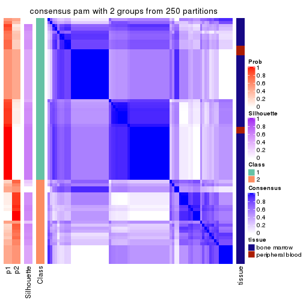</p>

</div>
<div id='tab-MAD-pam-consensus-heatmap-2'>
<pre><code class="r">consensus_heatmap(res, k = 3)
</code></pre>

<p>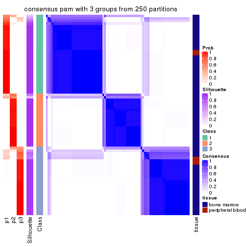</p>

</div>
<div id='tab-MAD-pam-consensus-heatmap-3'>
<pre><code class="r">consensus_heatmap(res, k = 4)
</code></pre>

<p>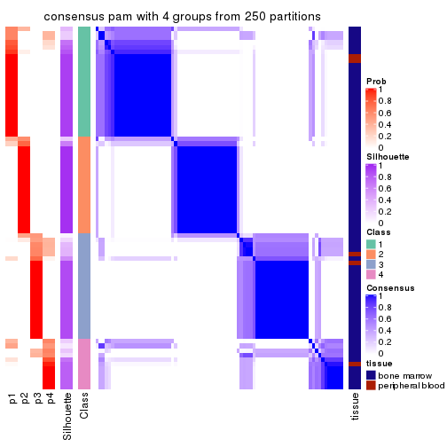</p>

</div>
<div id='tab-MAD-pam-consensus-heatmap-4'>
<pre><code class="r">consensus_heatmap(res, k = 5)
</code></pre>

<p>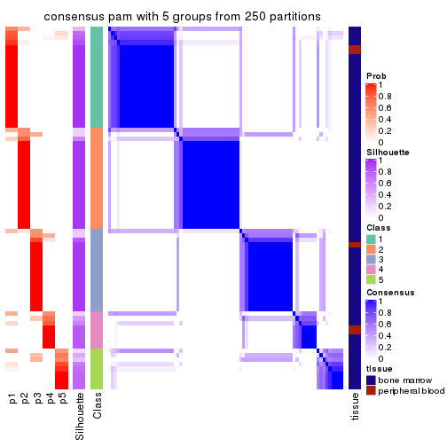</p>

</div>
<div id='tab-MAD-pam-consensus-heatmap-5'>
<pre><code class="r">consensus_heatmap(res, k = 6)
</code></pre>

<p>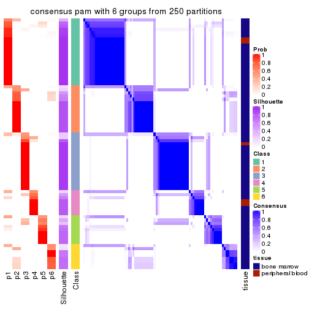</p>

</div>
</div>

Heatmaps for the membership of samples in all partitions to see how consistent they are:


<script>
$( function() {
	$( '#tabs-MAD-pam-membership-heatmap' ).tabs();
} );
</script>
<div id='tabs-MAD-pam-membership-heatmap'>
<ul>
<li><a href='#tab-MAD-pam-membership-heatmap-1'>k = 2</a></li>
<li><a href='#tab-MAD-pam-membership-heatmap-2'>k = 3</a></li>
<li><a href='#tab-MAD-pam-membership-heatmap-3'>k = 4</a></li>
<li><a href='#tab-MAD-pam-membership-heatmap-4'>k = 5</a></li>
<li><a href='#tab-MAD-pam-membership-heatmap-5'>k = 6</a></li>
</ul>
<div id='tab-MAD-pam-membership-heatmap-1'>
<pre><code class="r">membership_heatmap(res, k = 2)
</code></pre>

<p>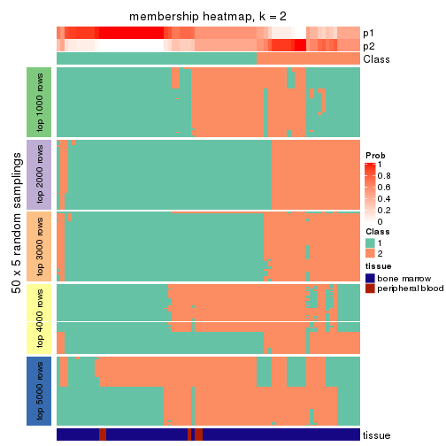</p>

</div>
<div id='tab-MAD-pam-membership-heatmap-2'>
<pre><code class="r">membership_heatmap(res, k = 3)
</code></pre>

<p>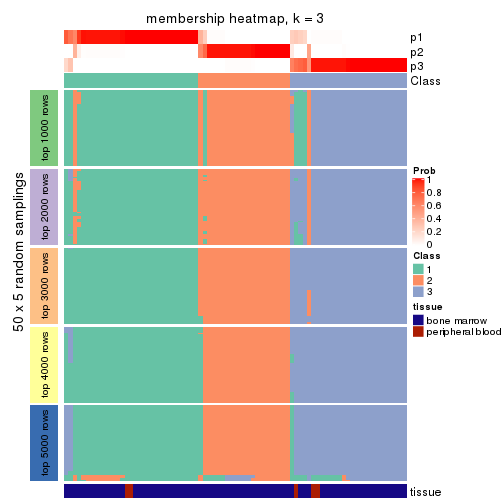</p>

</div>
<div id='tab-MAD-pam-membership-heatmap-3'>
<pre><code class="r">membership_heatmap(res, k = 4)
</code></pre>

<p>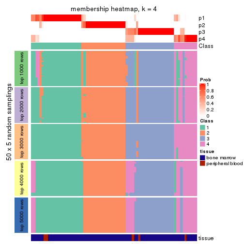</p>

</div>
<div id='tab-MAD-pam-membership-heatmap-4'>
<pre><code class="r">membership_heatmap(res, k = 5)
</code></pre>

<p>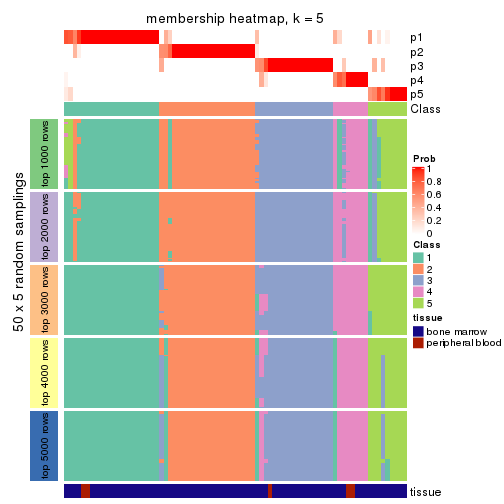</p>

</div>
<div id='tab-MAD-pam-membership-heatmap-5'>
<pre><code class="r">membership_heatmap(res, k = 6)
</code></pre>

<p>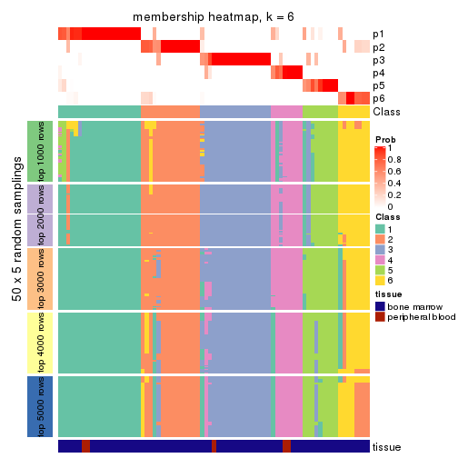</p>

</div>
</div>

As soon as we have had the classes for columns, we can look for signatures
which are significantly different between classes which can be candidate marks
for certain classes. Following are the heatmaps for signatures.


Signature heatmaps where rows are scaled:


<script>
$( function() {
	$( '#tabs-MAD-pam-get-signatures' ).tabs();
} );
</script>
<div id='tabs-MAD-pam-get-signatures'>
<ul>
<li><a href='#tab-MAD-pam-get-signatures-1'>k = 2</a></li>
<li><a href='#tab-MAD-pam-get-signatures-2'>k = 3</a></li>
<li><a href='#tab-MAD-pam-get-signatures-3'>k = 4</a></li>
<li><a href='#tab-MAD-pam-get-signatures-4'>k = 5</a></li>
<li><a href='#tab-MAD-pam-get-signatures-5'>k = 6</a></li>
</ul>
<div id='tab-MAD-pam-get-signatures-1'>
<pre><code class="r">get_signatures(res, k = 2)
</code></pre>

<p>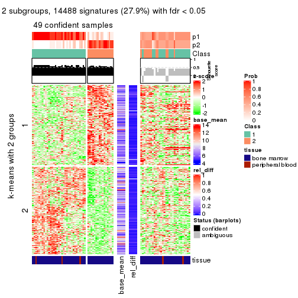</p>

</div>
<div id='tab-MAD-pam-get-signatures-2'>
<pre><code class="r">get_signatures(res, k = 3)
</code></pre>

<p>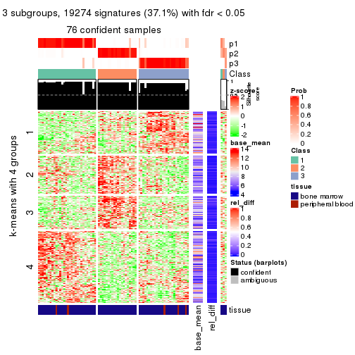</p>

</div>
<div id='tab-MAD-pam-get-signatures-3'>
<pre><code class="r">get_signatures(res, k = 4)
</code></pre>

<p>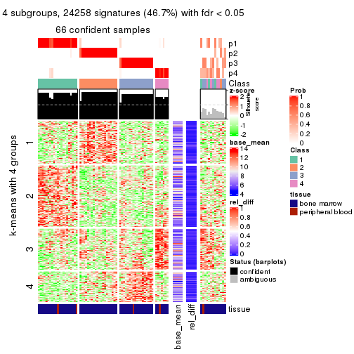</p>

</div>
<div id='tab-MAD-pam-get-signatures-4'>
<pre><code class="r">get_signatures(res, k = 5)
</code></pre>

<p>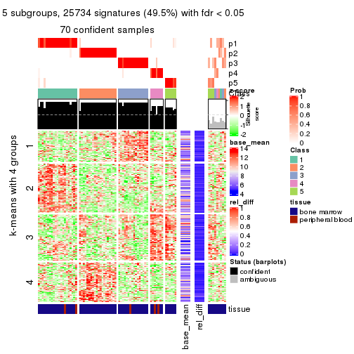</p>

</div>
<div id='tab-MAD-pam-get-signatures-5'>
<pre><code class="r">get_signatures(res, k = 6)
</code></pre>

<p>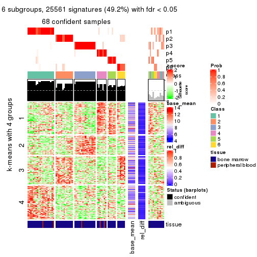</p>

</div>
</div>


Signature heatmaps where rows are not scaled:


<script>
$( function() {
	$( '#tabs-MAD-pam-get-signatures-no-scale' ).tabs();
} );
</script>
<div id='tabs-MAD-pam-get-signatures-no-scale'>
<ul>
<li><a href='#tab-MAD-pam-get-signatures-no-scale-1'>k = 2</a></li>
<li><a href='#tab-MAD-pam-get-signatures-no-scale-2'>k = 3</a></li>
<li><a href='#tab-MAD-pam-get-signatures-no-scale-3'>k = 4</a></li>
<li><a href='#tab-MAD-pam-get-signatures-no-scale-4'>k = 5</a></li>
<li><a href='#tab-MAD-pam-get-signatures-no-scale-5'>k = 6</a></li>
</ul>
<div id='tab-MAD-pam-get-signatures-no-scale-1'>
<pre><code class="r">get_signatures(res, k = 2, scale_rows = FALSE)
</code></pre>

<p>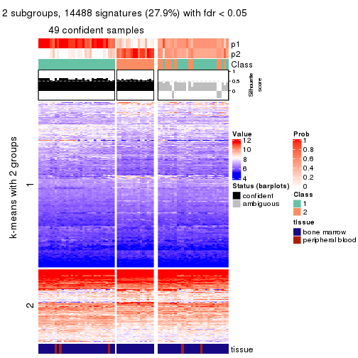</p>

</div>
<div id='tab-MAD-pam-get-signatures-no-scale-2'>
<pre><code class="r">get_signatures(res, k = 3, scale_rows = FALSE)
</code></pre>

<p>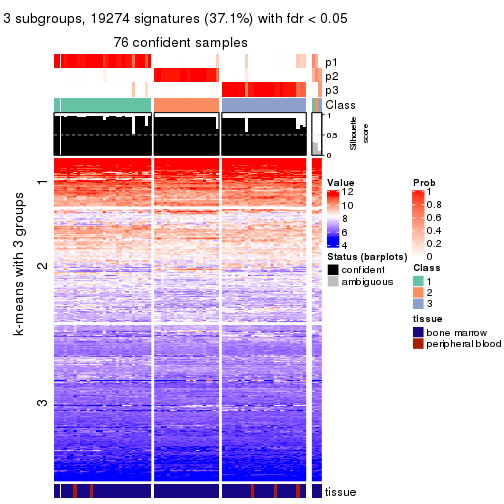</p>

</div>
<div id='tab-MAD-pam-get-signatures-no-scale-3'>
<pre><code class="r">get_signatures(res, k = 4, scale_rows = FALSE)
</code></pre>

<p>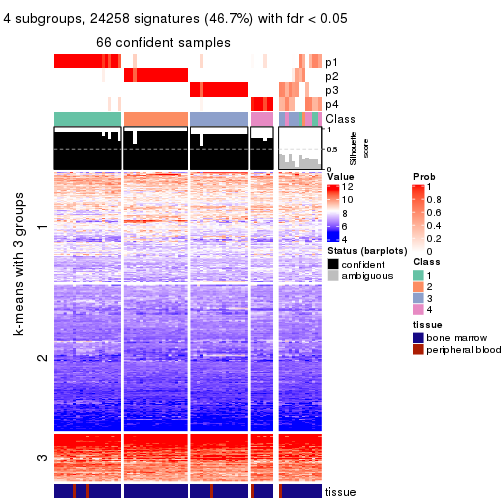</p>

</div>
<div id='tab-MAD-pam-get-signatures-no-scale-4'>
<pre><code class="r">get_signatures(res, k = 5, scale_rows = FALSE)
</code></pre>

<p>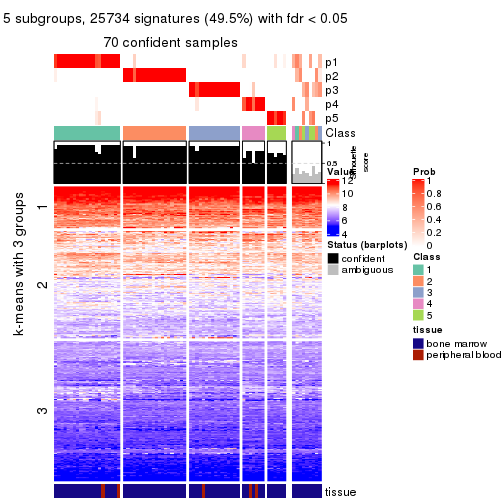</p>

</div>
<div id='tab-MAD-pam-get-signatures-no-scale-5'>
<pre><code class="r">get_signatures(res, k = 6, scale_rows = FALSE)
</code></pre>

<p>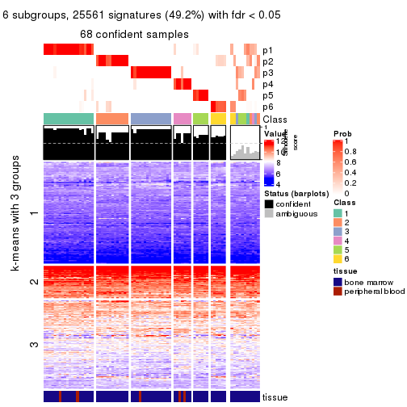</p>

</div>
</div>


Compare the overlap of signatures from different k:

```r
compare_signatures(res)
```

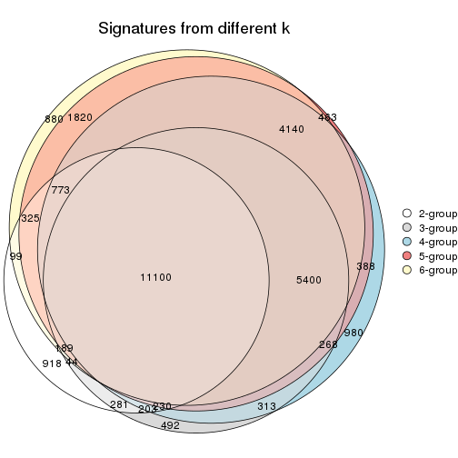

`get_signature()` returns a data frame invisibly. TO get the list of signatures, the function
call should be assigned to a variable explicitly. In following code, if `plot` argument is set
to `FALSE`, no heatmap is plotted while only the differential analysis is performed.

```r
# code only for demonstration
tb = get_signature(res, k = ..., plot = FALSE)
```

An example of the output of `tb` is:

```
#>   which_row         fdr    mean_1    mean_2 scaled_mean_1 scaled_mean_2 km
#> 1        38 0.042760348  8.373488  9.131774    -0.5533452     0.5164555  1
#> 2        40 0.018707592  7.106213  8.469186    -0.6173731     0.5762149  1
#> 3        55 0.019134737 10.221463 11.207825    -0.6159697     0.5749050  1
#> 4        59 0.006059896  5.921854  7.869574    -0.6899429     0.6439467  1
#> 5        60 0.018055526  8.928898 10.211722    -0.6204761     0.5791110  1
#> 6        98 0.009384629 15.714769 14.887706     0.6635654    -0.6193277  2
...
```

The columns in `tb` are:

1. `which_row`: row indices corresponding to the input matrix.
2. `fdr`: FDR for the differential test. 
3. `mean_x`: The mean value in group x.
4. `scaled_mean_x`: The mean value in group x after rows are scaled.
5. `km`: Row groups if k-means clustering is applied to rows.


UMAP plot which shows how samples are separated.


<script>
$( function() {
	$( '#tabs-MAD-pam-dimension-reduction' ).tabs();
} );
</script>
<div id='tabs-MAD-pam-dimension-reduction'>
<ul>
<li><a href='#tab-MAD-pam-dimension-reduction-1'>k = 2</a></li>
<li><a href='#tab-MAD-pam-dimension-reduction-2'>k = 3</a></li>
<li><a href='#tab-MAD-pam-dimension-reduction-3'>k = 4</a></li>
<li><a href='#tab-MAD-pam-dimension-reduction-4'>k = 5</a></li>
<li><a href='#tab-MAD-pam-dimension-reduction-5'>k = 6</a></li>
</ul>
<div id='tab-MAD-pam-dimension-reduction-1'>
<pre><code class="r">dimension_reduction(res, k = 2, method = &quot;UMAP&quot;)
</code></pre>

<p>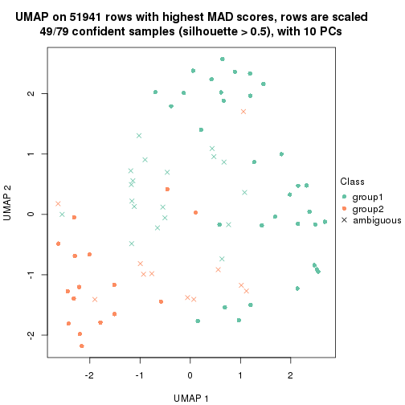</p>

</div>
<div id='tab-MAD-pam-dimension-reduction-2'>
<pre><code class="r">dimension_reduction(res, k = 3, method = &quot;UMAP&quot;)
</code></pre>

<p>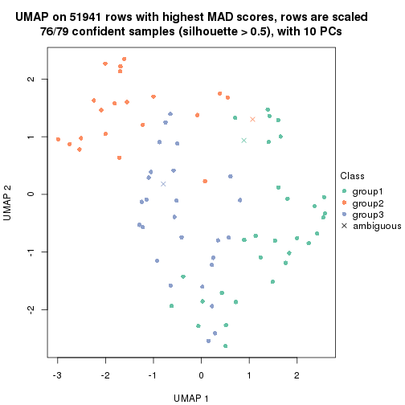</p>

</div>
<div id='tab-MAD-pam-dimension-reduction-3'>
<pre><code class="r">dimension_reduction(res, k = 4, method = &quot;UMAP&quot;)
</code></pre>

<p>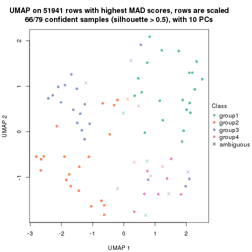</p>

</div>
<div id='tab-MAD-pam-dimension-reduction-4'>
<pre><code class="r">dimension_reduction(res, k = 5, method = &quot;UMAP&quot;)
</code></pre>

<p>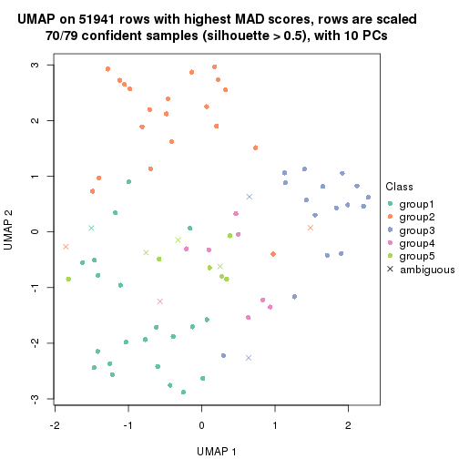</p>

</div>
<div id='tab-MAD-pam-dimension-reduction-5'>
<pre><code class="r">dimension_reduction(res, k = 6, method = &quot;UMAP&quot;)
</code></pre>

<p>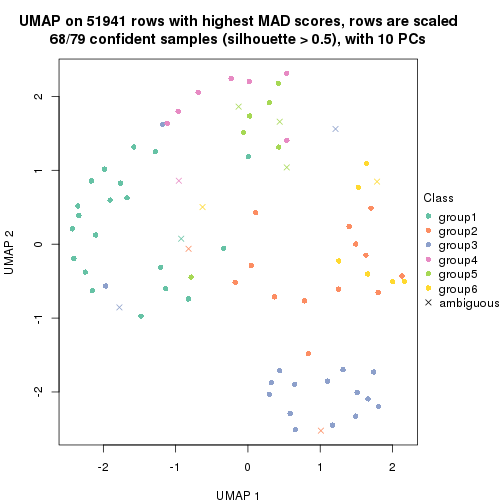</p>

</div>
</div>


Following heatmap shows how subgroups are split when increasing `k`:

```r
collect_classes(res)
```

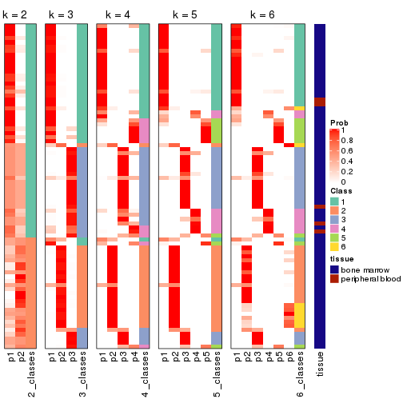


Test correlation between subgroups and known annotations. If the known
annotation is numeric, one-way ANOVA test is applied, and if the known
annotation is discrete, chi-squared contingency table test is applied.

```r
test_to_known_factors(res)
```

```
#>          n tissue(p) k
#> MAD:pam 49     0.542 2
#> MAD:pam 76     0.294 3
#> MAD:pam 66     0.462 4
#> MAD:pam 70     0.134 5
#> MAD:pam 68     0.232 6
```


If matrix rows can be associated to genes, consider to use `GO_Enrichment(res,
...)` to perform function enrichment for the signature genes.


 

---------------------------------------------------


### MAD:mclust


The object with results only for a single top-value method and a single partition method 
can be extracted as:

```r
res = res_list["MAD", "mclust"]
# you can also extract it by
# res = res_list["MAD:mclust"]
```

A summary of `res` and all the functions that can be applied to it:

```r
res
```

```
#> A 'ConsensusPartition' object with k = 2, 3, 4, 5, 6.
#>   On a matrix with 51941 rows and 79 columns.
#>   Top rows (1000, 2000, 3000, 4000, 5000) are extracted by 'MAD' method.
#>   Subgroups are detected by 'mclust' method.
#>   Performed in total 1250 partitions by row resampling.
#>   Best k for subgroups seems to be 4.
#> 
#> Following methods can be applied to this 'ConsensusPartition' object:
#>  [1] "cola_report"             "collect_classes"         "collect_plots"          
#>  [4] "collect_stats"           "colnames"                "compare_signatures"     
#>  [7] "consensus_heatmap"       "dimension_reduction"     "functional_enrichment"  
#> [10] "get_anno_col"            "get_anno"                "get_classes"            
#> [13] "get_consensus"           "get_matrix"              "get_membership"         
#> [16] "get_param"               "get_signatures"          "get_stats"              
#> [19] "is_best_k"               "is_stable_k"             "membership_heatmap"     
#> [22] "ncol"                    "nrow"                    "plot_ecdf"              
#> [25] "rownames"                "select_partition_number" "show"                   
#> [28] "suggest_best_k"          "test_to_known_factors"
```

`collect_plots()` function collects all the plots made from `res` for all `k` (number of partitions)
into one single page to provide an easy and fast comparison between different `k`.

```r
collect_plots(res)
```

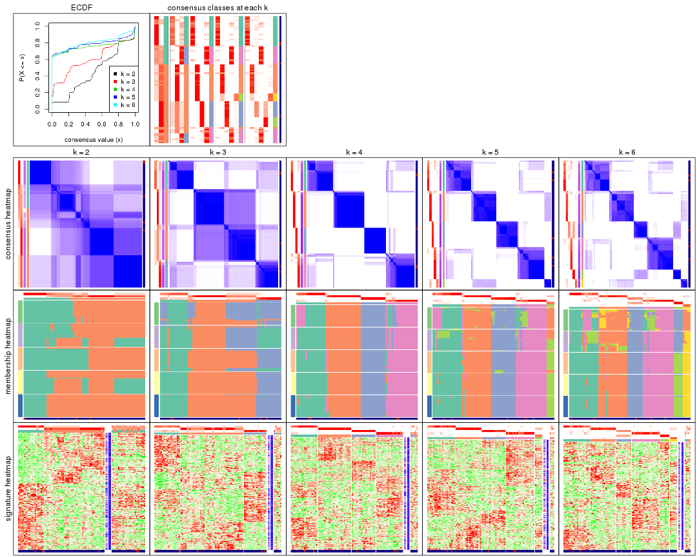

The plots are:

- The first row: a plot of the ECDF (Empirical cumulative distribution
  function) curves of the consensus matrix for each `k` and the heatmap of
  predicted classes for each `k`.
- The second row: heatmaps of the consensus matrix for each `k`.
- The third row: heatmaps of the membership matrix for each `k`.
- The fouth row: heatmaps of the signatures for each `k`.

All the plots in panels can be made by individual functions and they are
plotted later in this section.

`select_partition_number()` produces several plots showing different
statistics for choosing "optimized" `k`. There are following statistics:

- ECDF curves of the consensus matrix for each `k`;
- 1-PAC. [The PAC
  score](https://en.wikipedia.org/wiki/Consensus_clustering#Over-interpretation_potential_of_consensus_clustering)
  measures the proportion of the ambiguous subgrouping.
- Mean silhouette score.
- Concordance. The mean probability of fiting the consensus class ids in all
  partitions.
- Area increased. Denote $A_k$ as the area under the ECDF curve for current
  `k`, the area increased is defined as $A_k - A_{k-1}$.
- Rand index. The percent of pairs of samples that are both in a same cluster
  or both are not in a same cluster in the partition of k and k-1.
- Jaccard index. The ratio of pairs of samples are both in a same cluster in
  the partition of k and k-1 and the pairs of samples are both in a same
  cluster in the partition k or k-1.

The detailed explanations of these statistics can be found in [the cola
vignette](http://bioconductor.org/packages/devel/bioc/vignettes/cola/inst/doc/cola.html#toc_13).

Generally speaking, lower PAC score, higher mean silhouette score or higher
concordance corresponds to better partition. Rand index and Jaccard index
measure how similar the current partition is compared to partition with `k-1`.
If they are too similar, we won't accept `k` is better than `k-1`.

```r
select_partition_number(res)
```

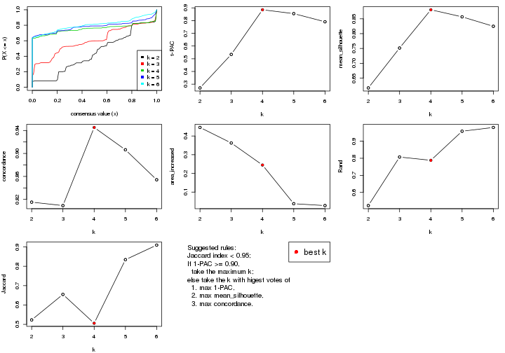

The numeric values for all these statistics can be obtained by `get_stats()`.

```r
get_stats(res)
```

```
#>   k 1-PAC mean_silhouette concordance area_increased  Rand Jaccard
#> 2 2 0.271           0.617       0.815         0.4457 0.523   0.523
#> 3 3 0.534           0.751       0.809         0.3625 0.807   0.655
#> 4 4 0.885           0.880       0.945         0.2447 0.788   0.506
#> 5 5 0.855           0.857       0.906         0.0379 0.958   0.834
#> 6 6 0.791           0.825       0.854         0.0279 0.981   0.909
```

`suggest_best_k()` suggests the best $k$ based on these statistics. The rules are as follows:

- All $k$ with Jaccard index larger than 0.95 are removed because the increase of
  the partition number does not provides enough extra information. If all $k$ are removed,
  the best $k$ is assigned by `NA`.
- For $k$ with 1-PAC larger than 0.9, the maximal $k$ is taken as the "best k". Other $k$ is called "optional k".
- If it does not fit the second rule. The $k$ with the highest vote of highest
  1-PAC, mean silhouette and concordance is taken as the "best k".

```r
suggest_best_k(res)
```

```
#> [1] 4
```


Following shows the table of the partitions (You need to click the **show/hide
code output** link to see it). The membership matrix (columns with name `p*`)
is inferred by
[`clue::cl_consensus()`](https://www.rdocumentation.org/link/cl_consensus?package=clue)
function with the `SE` method. Basically the value in the membership matrix
represents the probability to belong to a certain group. The finall class
label for an item is determined with the group with highest probability it
belongs to.

In `get_classes()` function, the entropy is calculated from the membership
matrix and the silhouette score is calculated from the consensus matrix.


<script>
$( function() {
	$( '#tabs-MAD-mclust-get-classes' ).tabs();
} );
</script>
<div id='tabs-MAD-mclust-get-classes'>
<ul>
<li><a href='#tab-MAD-mclust-get-classes-1'>k = 2</a></li>
<li><a href='#tab-MAD-mclust-get-classes-2'>k = 3</a></li>
<li><a href='#tab-MAD-mclust-get-classes-3'>k = 4</a></li>
<li><a href='#tab-MAD-mclust-get-classes-4'>k = 5</a></li>
<li><a href='#tab-MAD-mclust-get-classes-5'>k = 6</a></li>
</ul>

<div id='tab-MAD-mclust-get-classes-1'>
<p><a id='tab-MAD-mclust-get-classes-1-a' style='color:#0366d6' href='#'>show/hide code output</a></p>
<pre><code class="r">cbind(get_classes(res, k = 2), get_membership(res, k = 2))
</code></pre>

<pre><code>#&gt;           class entropy silhouette    p1    p2
#&gt; GSM316652     2  0.0000      0.738 0.000 1.000
#&gt; GSM316653     1  0.9993      0.461 0.516 0.484
#&gt; GSM316654     2  1.0000     -0.454 0.500 0.500
#&gt; GSM316655     1  0.8861      0.472 0.696 0.304
#&gt; GSM316656     2  0.9963      0.314 0.464 0.536
#&gt; GSM316657     1  0.0000      0.718 1.000 0.000
#&gt; GSM316658     2  0.7453      0.741 0.212 0.788
#&gt; GSM316659     2  0.7453      0.741 0.212 0.788
#&gt; GSM316660     1  0.0000      0.718 1.000 0.000
#&gt; GSM316661     2  0.8909      0.229 0.308 0.692
#&gt; GSM316662     2  0.0000      0.738 0.000 1.000
#&gt; GSM316663     2  0.7056      0.532 0.192 0.808
#&gt; GSM316664     1  0.9993      0.461 0.516 0.484
#&gt; GSM316665     2  0.7453      0.741 0.212 0.788
#&gt; GSM316666     2  0.0000      0.738 0.000 1.000
#&gt; GSM316667     2  0.7453      0.741 0.212 0.788
#&gt; GSM316668     2  0.0000      0.738 0.000 1.000
#&gt; GSM316669     1  0.9993      0.461 0.516 0.484
#&gt; GSM316670     2  0.0000      0.738 0.000 1.000
#&gt; GSM316671     2  0.0000      0.738 0.000 1.000
#&gt; GSM316672     1  0.9248      0.395 0.660 0.340
#&gt; GSM316673     1  0.8443      0.523 0.728 0.272
#&gt; GSM316674     2  0.0000      0.738 0.000 1.000
#&gt; GSM316676     2  0.0000      0.738 0.000 1.000
#&gt; GSM316677     1  0.9323      0.518 0.652 0.348
#&gt; GSM316678     2  0.7453      0.741 0.212 0.788
#&gt; GSM316679     1  0.0000      0.718 1.000 0.000
#&gt; GSM316680     1  0.0000      0.718 1.000 0.000
#&gt; GSM316681     2  0.0000      0.738 0.000 1.000
#&gt; GSM316682     1  0.9993      0.461 0.516 0.484
#&gt; GSM316683     1  0.9993      0.461 0.516 0.484
#&gt; GSM316684     2  0.7453      0.741 0.212 0.788
#&gt; GSM316685     2  0.0000      0.738 0.000 1.000
#&gt; GSM316686     2  0.8081      0.410 0.248 0.752
#&gt; GSM316687     2  0.7056      0.532 0.192 0.808
#&gt; GSM316688     2  0.9732      0.477 0.404 0.596
#&gt; GSM316689     1  0.0000      0.718 1.000 0.000
#&gt; GSM316690     2  0.0000      0.738 0.000 1.000
#&gt; GSM316691     2  0.7453      0.741 0.212 0.788
#&gt; GSM316692     2  0.0000      0.738 0.000 1.000
#&gt; GSM316693     1  0.9993      0.461 0.516 0.484
#&gt; GSM316694     2  0.0000      0.738 0.000 1.000
#&gt; GSM316696     1  0.0000      0.718 1.000 0.000
#&gt; GSM316697     2  0.0000      0.738 0.000 1.000
#&gt; GSM316698     2  0.7453      0.741 0.212 0.788
#&gt; GSM316699     2  0.7453      0.741 0.212 0.788
#&gt; GSM316700     2  0.9944     -0.339 0.456 0.544
#&gt; GSM316701     1  0.9993      0.461 0.516 0.484
#&gt; GSM316703     2  0.7453      0.741 0.212 0.788
#&gt; GSM316704     2  0.7453      0.741 0.212 0.788
#&gt; GSM316705     1  0.9732      0.499 0.596 0.404
#&gt; GSM316706     2  0.7453      0.741 0.212 0.788
#&gt; GSM316707     2  0.7453      0.741 0.212 0.788
#&gt; GSM316708     2  0.9732      0.477 0.404 0.596
#&gt; GSM316709     2  0.0000      0.738 0.000 1.000
#&gt; GSM316710     1  0.9996      0.452 0.512 0.488
#&gt; GSM316711     2  0.7453      0.741 0.212 0.788
#&gt; GSM316713     1  0.0000      0.718 1.000 0.000
#&gt; GSM316714     2  0.0938      0.732 0.012 0.988
#&gt; GSM316715     1  0.0000      0.718 1.000 0.000
#&gt; GSM316716     2  0.7453      0.741 0.212 0.788
#&gt; GSM316717     1  0.0000      0.718 1.000 0.000
#&gt; GSM316718     2  0.9732      0.477 0.404 0.596
#&gt; GSM316719     1  0.0000      0.718 1.000 0.000
#&gt; GSM316720     1  0.0000      0.718 1.000 0.000
#&gt; GSM316721     2  0.7453      0.741 0.212 0.788
#&gt; GSM316722     1  0.0000      0.718 1.000 0.000
#&gt; GSM316723     2  0.7453      0.741 0.212 0.788
#&gt; GSM316724     2  0.7453      0.741 0.212 0.788
#&gt; GSM316726     2  0.7453      0.741 0.212 0.788
#&gt; GSM316727     1  0.0000      0.718 1.000 0.000
#&gt; GSM316728     2  0.7056      0.532 0.192 0.808
#&gt; GSM316729     1  0.9248      0.395 0.660 0.340
#&gt; GSM316730     2  0.7453      0.741 0.212 0.788
#&gt; GSM316675     2  0.0000      0.738 0.000 1.000
#&gt; GSM316695     1  0.0000      0.718 1.000 0.000
#&gt; GSM316702     2  0.7453      0.493 0.212 0.788
#&gt; GSM316712     1  0.0000      0.718 1.000 0.000
#&gt; GSM316725     1  0.9993      0.461 0.516 0.484
</code></pre>

<script>
$('#tab-MAD-mclust-get-classes-1-a').parent().next().next().hide();
$('#tab-MAD-mclust-get-classes-1-a').click(function(){
  $('#tab-MAD-mclust-get-classes-1-a').parent().next().next().toggle();
  return(false);
});
</script>
</div>

<div id='tab-MAD-mclust-get-classes-2'>
<p><a id='tab-MAD-mclust-get-classes-2-a' style='color:#0366d6' href='#'>show/hide code output</a></p>
<pre><code class="r">cbind(get_classes(res, k = 3), get_membership(res, k = 3))
</code></pre>

<pre><code>#&gt;           class entropy silhouette    p1    p2    p3
#&gt; GSM316652     2  0.8638      0.737 0.216 0.600 0.184
#&gt; GSM316653     3  0.0592      0.879 0.000 0.012 0.988
#&gt; GSM316654     3  0.0592      0.879 0.000 0.012 0.988
#&gt; GSM316655     3  0.1620      0.851 0.024 0.012 0.964
#&gt; GSM316656     2  0.7056      0.452 0.024 0.572 0.404
#&gt; GSM316657     1  0.4750      0.863 0.784 0.000 0.216
#&gt; GSM316658     2  0.0000      0.774 0.000 1.000 0.000
#&gt; GSM316659     2  0.0000      0.774 0.000 1.000 0.000
#&gt; GSM316660     1  0.4750      0.863 0.784 0.000 0.216
#&gt; GSM316661     3  0.0592      0.879 0.000 0.012 0.988
#&gt; GSM316662     2  0.8595      0.738 0.216 0.604 0.180
#&gt; GSM316663     2  0.8525      0.730 0.200 0.612 0.188
#&gt; GSM316664     3  0.4399      0.560 0.188 0.000 0.812
#&gt; GSM316665     2  0.0000      0.774 0.000 1.000 0.000
#&gt; GSM316666     2  0.8638      0.737 0.216 0.600 0.184
#&gt; GSM316667     2  0.3482      0.760 0.000 0.872 0.128
#&gt; GSM316668     2  0.8595      0.738 0.216 0.604 0.180
#&gt; GSM316669     3  0.0592      0.879 0.000 0.012 0.988
#&gt; GSM316670     2  0.8504      0.737 0.216 0.612 0.172
#&gt; GSM316671     2  0.8638      0.737 0.216 0.600 0.184
#&gt; GSM316672     1  0.6008      0.396 0.628 0.372 0.000
#&gt; GSM316673     1  0.4931      0.850 0.768 0.000 0.232
#&gt; GSM316674     2  0.8638      0.737 0.216 0.600 0.184
#&gt; GSM316676     2  0.8638      0.737 0.216 0.600 0.184
#&gt; GSM316677     1  0.6771      0.597 0.548 0.012 0.440
#&gt; GSM316678     2  0.0237      0.774 0.004 0.996 0.000
#&gt; GSM316679     1  0.6661      0.662 0.588 0.012 0.400
#&gt; GSM316680     1  0.6675      0.655 0.584 0.012 0.404
#&gt; GSM316681     2  0.8638      0.737 0.216 0.600 0.184
#&gt; GSM316682     3  0.0592      0.879 0.000 0.012 0.988
#&gt; GSM316683     3  0.0592      0.879 0.000 0.012 0.988
#&gt; GSM316684     2  0.0000      0.774 0.000 1.000 0.000
#&gt; GSM316685     2  0.8259      0.744 0.216 0.632 0.152
#&gt; GSM316686     3  0.2165      0.818 0.000 0.064 0.936
#&gt; GSM316687     3  0.9457     -0.197 0.192 0.340 0.468
#&gt; GSM316688     2  0.6750      0.568 0.024 0.640 0.336
#&gt; GSM316689     1  0.4750      0.863 0.784 0.000 0.216
#&gt; GSM316690     2  0.8550      0.737 0.216 0.608 0.176
#&gt; GSM316691     2  0.3816      0.755 0.000 0.852 0.148
#&gt; GSM316692     2  0.8638      0.737 0.216 0.600 0.184
#&gt; GSM316693     3  0.0592      0.879 0.000 0.012 0.988
#&gt; GSM316694     2  0.8638      0.737 0.216 0.600 0.184
#&gt; GSM316696     1  0.4750      0.863 0.784 0.000 0.216
#&gt; GSM316697     2  0.8638      0.737 0.216 0.600 0.184
#&gt; GSM316698     2  0.0237      0.774 0.004 0.996 0.000
#&gt; GSM316699     2  0.0000      0.774 0.000 1.000 0.000
#&gt; GSM316700     3  0.0592      0.879 0.000 0.012 0.988
#&gt; GSM316701     3  0.1482      0.856 0.020 0.012 0.968
#&gt; GSM316703     2  0.0000      0.774 0.000 1.000 0.000
#&gt; GSM316704     2  0.0000      0.774 0.000 1.000 0.000
#&gt; GSM316705     3  0.4931      0.479 0.232 0.000 0.768
#&gt; GSM316706     2  0.0000      0.774 0.000 1.000 0.000
#&gt; GSM316707     2  0.0000      0.774 0.000 1.000 0.000
#&gt; GSM316708     2  0.0237      0.774 0.004 0.996 0.000
#&gt; GSM316709     2  0.8638      0.737 0.216 0.600 0.184
#&gt; GSM316710     3  0.0592      0.879 0.000 0.012 0.988
#&gt; GSM316711     2  0.0000      0.774 0.000 1.000 0.000
#&gt; GSM316713     1  0.4750      0.863 0.784 0.000 0.216
#&gt; GSM316714     2  0.8512      0.736 0.212 0.612 0.176
#&gt; GSM316715     1  0.4750      0.863 0.784 0.000 0.216
#&gt; GSM316716     2  0.0000      0.774 0.000 1.000 0.000
#&gt; GSM316717     1  0.6675      0.655 0.584 0.012 0.404
#&gt; GSM316718     2  0.0237      0.774 0.004 0.996 0.000
#&gt; GSM316719     1  0.4750      0.863 0.784 0.000 0.216
#&gt; GSM316720     1  0.4750      0.863 0.784 0.000 0.216
#&gt; GSM316721     2  0.0000      0.774 0.000 1.000 0.000
#&gt; GSM316722     1  0.6675      0.655 0.584 0.012 0.404
#&gt; GSM316723     2  0.0000      0.774 0.000 1.000 0.000
#&gt; GSM316724     2  0.0237      0.774 0.004 0.996 0.000
#&gt; GSM316726     2  0.0000      0.774 0.000 1.000 0.000
#&gt; GSM316727     1  0.4750      0.863 0.784 0.000 0.216
#&gt; GSM316728     2  0.8650      0.719 0.200 0.600 0.200
#&gt; GSM316729     2  0.7043      0.460 0.024 0.576 0.400
#&gt; GSM316730     2  0.0237      0.774 0.004 0.996 0.000
#&gt; GSM316675     2  0.8638      0.737 0.216 0.600 0.184
#&gt; GSM316695     1  0.4750      0.863 0.784 0.000 0.216
#&gt; GSM316702     3  0.3481      0.786 0.044 0.052 0.904
#&gt; GSM316712     1  0.4750      0.863 0.784 0.000 0.216
#&gt; GSM316725     3  0.0592      0.879 0.000 0.012 0.988
</code></pre>

<script>
$('#tab-MAD-mclust-get-classes-2-a').parent().next().next().hide();
$('#tab-MAD-mclust-get-classes-2-a').click(function(){
  $('#tab-MAD-mclust-get-classes-2-a').parent().next().next().toggle();
  return(false);
});
</script>
</div>

<div id='tab-MAD-mclust-get-classes-3'>
<p><a id='tab-MAD-mclust-get-classes-3-a' style='color:#0366d6' href='#'>show/hide code output</a></p>
<pre><code class="r">cbind(get_classes(res, k = 4), get_membership(res, k = 4))
</code></pre>

<pre><code>#&gt;           class entropy silhouette    p1    p2    p3    p4
#&gt; GSM316652     3  0.0000      1.000 0.000 0.000 1.000 0.000
#&gt; GSM316653     4  0.0000      0.889 0.000 0.000 0.000 1.000
#&gt; GSM316654     4  0.0000      0.889 0.000 0.000 0.000 1.000
#&gt; GSM316655     4  0.0000      0.889 0.000 0.000 0.000 1.000
#&gt; GSM316656     4  0.6517      0.324 0.288 0.108 0.000 0.604
#&gt; GSM316657     1  0.0000      0.900 1.000 0.000 0.000 0.000
#&gt; GSM316658     2  0.0000      0.969 0.000 1.000 0.000 0.000
#&gt; GSM316659     2  0.0000      0.969 0.000 1.000 0.000 0.000
#&gt; GSM316660     1  0.0000      0.900 1.000 0.000 0.000 0.000
#&gt; GSM316661     4  0.0000      0.889 0.000 0.000 0.000 1.000
#&gt; GSM316662     3  0.0000      1.000 0.000 0.000 1.000 0.000
#&gt; GSM316663     4  0.0000      0.889 0.000 0.000 0.000 1.000
#&gt; GSM316664     4  0.3610      0.731 0.200 0.000 0.000 0.800
#&gt; GSM316665     2  0.0000      0.969 0.000 1.000 0.000 0.000
#&gt; GSM316666     3  0.0000      1.000 0.000 0.000 1.000 0.000
#&gt; GSM316667     2  0.0000      0.969 0.000 1.000 0.000 0.000
#&gt; GSM316668     3  0.0000      1.000 0.000 0.000 1.000 0.000
#&gt; GSM316669     4  0.0000      0.889 0.000 0.000 0.000 1.000
#&gt; GSM316670     3  0.0000      1.000 0.000 0.000 1.000 0.000
#&gt; GSM316671     3  0.0000      1.000 0.000 0.000 1.000 0.000
#&gt; GSM316672     1  0.0921      0.883 0.972 0.028 0.000 0.000
#&gt; GSM316673     1  0.2760      0.789 0.872 0.000 0.000 0.128
#&gt; GSM316674     3  0.0000      1.000 0.000 0.000 1.000 0.000
#&gt; GSM316676     3  0.0000      1.000 0.000 0.000 1.000 0.000
#&gt; GSM316677     1  0.4855      0.453 0.600 0.000 0.000 0.400
#&gt; GSM316678     2  0.0000      0.969 0.000 1.000 0.000 0.000
#&gt; GSM316679     1  0.3569      0.792 0.804 0.000 0.000 0.196
#&gt; GSM316680     1  0.3610      0.788 0.800 0.000 0.000 0.200
#&gt; GSM316681     3  0.0000      1.000 0.000 0.000 1.000 0.000
#&gt; GSM316682     4  0.0000      0.889 0.000 0.000 0.000 1.000
#&gt; GSM316683     4  0.0000      0.889 0.000 0.000 0.000 1.000
#&gt; GSM316684     2  0.0000      0.969 0.000 1.000 0.000 0.000
#&gt; GSM316685     3  0.0000      1.000 0.000 0.000 1.000 0.000
#&gt; GSM316686     4  0.3610      0.731 0.200 0.000 0.000 0.800
#&gt; GSM316687     4  0.3610      0.732 0.000 0.000 0.200 0.800
#&gt; GSM316688     2  0.7726     -0.069 0.228 0.404 0.000 0.368
#&gt; GSM316689     1  0.0000      0.900 1.000 0.000 0.000 0.000
#&gt; GSM316690     3  0.0000      1.000 0.000 0.000 1.000 0.000
#&gt; GSM316691     2  0.0000      0.969 0.000 1.000 0.000 0.000
#&gt; GSM316692     3  0.0000      1.000 0.000 0.000 1.000 0.000
#&gt; GSM316693     4  0.0000      0.889 0.000 0.000 0.000 1.000
#&gt; GSM316694     3  0.0000      1.000 0.000 0.000 1.000 0.000
#&gt; GSM316696     1  0.0000      0.900 1.000 0.000 0.000 0.000
#&gt; GSM316697     3  0.0000      1.000 0.000 0.000 1.000 0.000
#&gt; GSM316698     2  0.0000      0.969 0.000 1.000 0.000 0.000
#&gt; GSM316699     2  0.0000      0.969 0.000 1.000 0.000 0.000
#&gt; GSM316700     4  0.0000      0.889 0.000 0.000 0.000 1.000
#&gt; GSM316701     4  0.0000      0.889 0.000 0.000 0.000 1.000
#&gt; GSM316703     2  0.0000      0.969 0.000 1.000 0.000 0.000
#&gt; GSM316704     2  0.0000      0.969 0.000 1.000 0.000 0.000
#&gt; GSM316705     4  0.4941      0.313 0.436 0.000 0.000 0.564
#&gt; GSM316706     2  0.0000      0.969 0.000 1.000 0.000 0.000
#&gt; GSM316707     2  0.0000      0.969 0.000 1.000 0.000 0.000
#&gt; GSM316708     2  0.1557      0.918 0.056 0.944 0.000 0.000
#&gt; GSM316709     3  0.0000      1.000 0.000 0.000 1.000 0.000
#&gt; GSM316710     4  0.0000      0.889 0.000 0.000 0.000 1.000
#&gt; GSM316711     2  0.0000      0.969 0.000 1.000 0.000 0.000
#&gt; GSM316713     1  0.0000      0.900 1.000 0.000 0.000 0.000
#&gt; GSM316714     4  0.4776      0.441 0.000 0.000 0.376 0.624
#&gt; GSM316715     1  0.0000      0.900 1.000 0.000 0.000 0.000
#&gt; GSM316716     2  0.0000      0.969 0.000 1.000 0.000 0.000
#&gt; GSM316717     1  0.3610      0.788 0.800 0.000 0.000 0.200
#&gt; GSM316718     2  0.1557      0.918 0.056 0.944 0.000 0.000
#&gt; GSM316719     1  0.0000      0.900 1.000 0.000 0.000 0.000
#&gt; GSM316720     1  0.0000      0.900 1.000 0.000 0.000 0.000
#&gt; GSM316721     2  0.0000      0.969 0.000 1.000 0.000 0.000
#&gt; GSM316722     1  0.3610      0.788 0.800 0.000 0.000 0.200
#&gt; GSM316723     2  0.0000      0.969 0.000 1.000 0.000 0.000
#&gt; GSM316724     2  0.0000      0.969 0.000 1.000 0.000 0.000
#&gt; GSM316726     2  0.0000      0.969 0.000 1.000 0.000 0.000
#&gt; GSM316727     1  0.0000      0.900 1.000 0.000 0.000 0.000
#&gt; GSM316728     4  0.2921      0.798 0.000 0.000 0.140 0.860
#&gt; GSM316729     1  0.5486      0.731 0.720 0.080 0.000 0.200
#&gt; GSM316730     2  0.0000      0.969 0.000 1.000 0.000 0.000
#&gt; GSM316675     3  0.0000      1.000 0.000 0.000 1.000 0.000
#&gt; GSM316695     1  0.0000      0.900 1.000 0.000 0.000 0.000
#&gt; GSM316702     4  0.1118      0.870 0.000 0.000 0.036 0.964
#&gt; GSM316712     1  0.0000      0.900 1.000 0.000 0.000 0.000
#&gt; GSM316725     4  0.0000      0.889 0.000 0.000 0.000 1.000
</code></pre>

<script>
$('#tab-MAD-mclust-get-classes-3-a').parent().next().next().hide();
$('#tab-MAD-mclust-get-classes-3-a').click(function(){
  $('#tab-MAD-mclust-get-classes-3-a').parent().next().next().toggle();
  return(false);
});
</script>
</div>

<div id='tab-MAD-mclust-get-classes-4'>
<p><a id='tab-MAD-mclust-get-classes-4-a' style='color:#0366d6' href='#'>show/hide code output</a></p>
<pre><code class="r">cbind(get_classes(res, k = 5), get_membership(res, k = 5))
</code></pre>

<pre><code>#&gt;           class entropy silhouette    p1    p2    p3    p4    p5
#&gt; GSM316652     3  0.0880     0.9728 0.000 0.000 0.968 0.000 0.032
#&gt; GSM316653     4  0.0000     0.8940 0.000 0.000 0.000 1.000 0.000
#&gt; GSM316654     4  0.0000     0.8940 0.000 0.000 0.000 1.000 0.000
#&gt; GSM316655     4  0.0000     0.8940 0.000 0.000 0.000 1.000 0.000
#&gt; GSM316656     2  0.6767     0.0642 0.120 0.460 0.000 0.388 0.032
#&gt; GSM316657     1  0.1851     0.8639 0.912 0.000 0.000 0.000 0.088
#&gt; GSM316658     2  0.0000     0.8932 0.000 1.000 0.000 0.000 0.000
#&gt; GSM316659     5  0.3949     0.9867 0.000 0.332 0.000 0.000 0.668
#&gt; GSM316660     1  0.0000     0.8725 1.000 0.000 0.000 0.000 0.000
#&gt; GSM316661     4  0.0000     0.8940 0.000 0.000 0.000 1.000 0.000
#&gt; GSM316662     3  0.0880     0.9728 0.000 0.000 0.968 0.000 0.032
#&gt; GSM316663     4  0.2561     0.8361 0.000 0.000 0.000 0.856 0.144
#&gt; GSM316664     4  0.3109     0.7604 0.200 0.000 0.000 0.800 0.000
#&gt; GSM316665     2  0.0880     0.8754 0.000 0.968 0.000 0.000 0.032
#&gt; GSM316666     3  0.0000     0.9757 0.000 0.000 1.000 0.000 0.000
#&gt; GSM316667     2  0.0000     0.8932 0.000 1.000 0.000 0.000 0.000
#&gt; GSM316668     3  0.0880     0.9728 0.000 0.000 0.968 0.000 0.032
#&gt; GSM316669     4  0.0000     0.8940 0.000 0.000 0.000 1.000 0.000
#&gt; GSM316670     3  0.2280     0.8863 0.000 0.000 0.880 0.000 0.120
#&gt; GSM316671     3  0.1270     0.9655 0.000 0.000 0.948 0.000 0.052
#&gt; GSM316672     1  0.2233     0.8574 0.892 0.004 0.000 0.000 0.104
#&gt; GSM316673     1  0.0794     0.8618 0.972 0.000 0.000 0.028 0.000
#&gt; GSM316674     3  0.0880     0.9728 0.000 0.000 0.968 0.000 0.032
#&gt; GSM316676     3  0.0000     0.9757 0.000 0.000 1.000 0.000 0.000
#&gt; GSM316677     1  0.4182     0.5080 0.600 0.000 0.000 0.400 0.000
#&gt; GSM316678     2  0.0703     0.8861 0.000 0.976 0.000 0.000 0.024
#&gt; GSM316679     1  0.3656     0.7783 0.784 0.000 0.000 0.196 0.020
#&gt; GSM316680     1  0.4725     0.7672 0.720 0.000 0.000 0.200 0.080
#&gt; GSM316681     3  0.0880     0.9728 0.000 0.000 0.968 0.000 0.032
#&gt; GSM316682     4  0.0162     0.8935 0.000 0.000 0.000 0.996 0.004
#&gt; GSM316683     4  0.0162     0.8935 0.000 0.000 0.000 0.996 0.004
#&gt; GSM316684     2  0.0000     0.8932 0.000 1.000 0.000 0.000 0.000
#&gt; GSM316685     3  0.0880     0.9589 0.000 0.000 0.968 0.000 0.032
#&gt; GSM316686     4  0.3318     0.7612 0.192 0.000 0.000 0.800 0.008
#&gt; GSM316687     4  0.3846     0.7992 0.000 0.000 0.056 0.800 0.144
#&gt; GSM316688     2  0.5845     0.1409 0.256 0.608 0.000 0.132 0.004
#&gt; GSM316689     1  0.1851     0.8639 0.912 0.000 0.000 0.000 0.088
#&gt; GSM316690     3  0.1270     0.9472 0.000 0.000 0.948 0.000 0.052
#&gt; GSM316691     2  0.0162     0.8930 0.000 0.996 0.000 0.000 0.004
#&gt; GSM316692     3  0.0000     0.9757 0.000 0.000 1.000 0.000 0.000
#&gt; GSM316693     4  0.0000     0.8940 0.000 0.000 0.000 1.000 0.000
#&gt; GSM316694     3  0.0000     0.9757 0.000 0.000 1.000 0.000 0.000
#&gt; GSM316696     1  0.1851     0.8639 0.912 0.000 0.000 0.000 0.088
#&gt; GSM316697     3  0.0290     0.9756 0.000 0.000 0.992 0.000 0.008
#&gt; GSM316698     2  0.0703     0.8861 0.000 0.976 0.000 0.000 0.024
#&gt; GSM316699     2  0.0510     0.8882 0.000 0.984 0.000 0.000 0.016
#&gt; GSM316700     4  0.0000     0.8940 0.000 0.000 0.000 1.000 0.000
#&gt; GSM316701     4  0.0162     0.8935 0.000 0.000 0.000 0.996 0.004
#&gt; GSM316703     5  0.3895     0.9816 0.000 0.320 0.000 0.000 0.680
#&gt; GSM316704     5  0.3949     0.9867 0.000 0.332 0.000 0.000 0.668
#&gt; GSM316705     4  0.5409     0.4797 0.316 0.000 0.000 0.604 0.080
#&gt; GSM316706     5  0.3837     0.9697 0.000 0.308 0.000 0.000 0.692
#&gt; GSM316707     2  0.0000     0.8932 0.000 1.000 0.000 0.000 0.000
#&gt; GSM316708     2  0.0794     0.8837 0.000 0.972 0.000 0.000 0.028
#&gt; GSM316709     3  0.0000     0.9757 0.000 0.000 1.000 0.000 0.000
#&gt; GSM316710     4  0.0000     0.8940 0.000 0.000 0.000 1.000 0.000
#&gt; GSM316711     5  0.3949     0.9867 0.000 0.332 0.000 0.000 0.668
#&gt; GSM316713     1  0.0000     0.8725 1.000 0.000 0.000 0.000 0.000
#&gt; GSM316714     4  0.5213     0.5092 0.000 0.000 0.320 0.616 0.064
#&gt; GSM316715     1  0.0000     0.8725 1.000 0.000 0.000 0.000 0.000
#&gt; GSM316716     2  0.0880     0.8754 0.000 0.968 0.000 0.000 0.032
#&gt; GSM316717     1  0.3109     0.7746 0.800 0.000 0.000 0.200 0.000
#&gt; GSM316718     2  0.0794     0.8837 0.000 0.972 0.000 0.000 0.028
#&gt; GSM316719     1  0.0000     0.8725 1.000 0.000 0.000 0.000 0.000
#&gt; GSM316720     1  0.0000     0.8725 1.000 0.000 0.000 0.000 0.000
#&gt; GSM316721     2  0.0510     0.8882 0.000 0.984 0.000 0.000 0.016
#&gt; GSM316722     1  0.4725     0.7672 0.720 0.000 0.000 0.200 0.080
#&gt; GSM316723     2  0.0000     0.8932 0.000 1.000 0.000 0.000 0.000
#&gt; GSM316724     2  0.0404     0.8909 0.000 0.988 0.000 0.000 0.012
#&gt; GSM316726     2  0.0162     0.8930 0.000 0.996 0.000 0.000 0.004
#&gt; GSM316727     1  0.0000     0.8725 1.000 0.000 0.000 0.000 0.000
#&gt; GSM316728     4  0.3710     0.8060 0.000 0.000 0.048 0.808 0.144
#&gt; GSM316729     1  0.7044     0.6154 0.572 0.132 0.000 0.200 0.096
#&gt; GSM316730     2  0.0510     0.8898 0.000 0.984 0.000 0.000 0.016
#&gt; GSM316675     3  0.0000     0.9757 0.000 0.000 1.000 0.000 0.000
#&gt; GSM316695     1  0.1851     0.8639 0.912 0.000 0.000 0.000 0.088
#&gt; GSM316702     4  0.3055     0.8279 0.000 0.000 0.016 0.840 0.144
#&gt; GSM316712     1  0.0000     0.8725 1.000 0.000 0.000 0.000 0.000
#&gt; GSM316725     4  0.0000     0.8940 0.000 0.000 0.000 1.000 0.000
</code></pre>

<script>
$('#tab-MAD-mclust-get-classes-4-a').parent().next().next().hide();
$('#tab-MAD-mclust-get-classes-4-a').click(function(){
  $('#tab-MAD-mclust-get-classes-4-a').parent().next().next().toggle();
  return(false);
});
</script>
</div>

<div id='tab-MAD-mclust-get-classes-5'>
<p><a id='tab-MAD-mclust-get-classes-5-a' style='color:#0366d6' href='#'>show/hide code output</a></p>
<pre><code class="r">cbind(get_classes(res, k = 6), get_membership(res, k = 6))
</code></pre>

<pre><code>#&gt;           class entropy silhouette    p1    p2    p3    p4    p5    p6
#&gt; GSM316652     5  0.0000      0.991 0.000 0.000 0.000 0.000 1.000 0.000
#&gt; GSM316653     4  0.0000      0.888 0.000 0.000 0.000 1.000 0.000 0.000
#&gt; GSM316654     4  0.0000      0.888 0.000 0.000 0.000 1.000 0.000 0.000
#&gt; GSM316655     4  0.0146      0.888 0.004 0.000 0.000 0.996 0.000 0.000
#&gt; GSM316656     2  0.5958      0.243 0.072 0.492 0.056 0.380 0.000 0.000
#&gt; GSM316657     1  0.3210      0.805 0.812 0.000 0.152 0.000 0.000 0.036
#&gt; GSM316658     2  0.1556      0.820 0.000 0.920 0.000 0.000 0.000 0.080
#&gt; GSM316659     6  0.2762      0.945 0.000 0.196 0.000 0.000 0.000 0.804
#&gt; GSM316660     1  0.0000      0.823 1.000 0.000 0.000 0.000 0.000 0.000
#&gt; GSM316661     4  0.0865      0.884 0.000 0.000 0.036 0.964 0.000 0.000
#&gt; GSM316662     5  0.0000      0.991 0.000 0.000 0.000 0.000 1.000 0.000
#&gt; GSM316663     4  0.2454      0.837 0.000 0.000 0.160 0.840 0.000 0.000
#&gt; GSM316664     4  0.3141      0.768 0.200 0.000 0.012 0.788 0.000 0.000
#&gt; GSM316665     2  0.2402      0.785 0.000 0.868 0.012 0.000 0.000 0.120
#&gt; GSM316666     3  0.3804      0.952 0.000 0.000 0.576 0.000 0.424 0.000
#&gt; GSM316667     2  0.0937      0.848 0.000 0.960 0.040 0.000 0.000 0.000
#&gt; GSM316668     5  0.0000      0.991 0.000 0.000 0.000 0.000 1.000 0.000
#&gt; GSM316669     4  0.0000      0.888 0.000 0.000 0.000 1.000 0.000 0.000
#&gt; GSM316670     3  0.3756      0.876 0.000 0.000 0.644 0.000 0.352 0.004
#&gt; GSM316671     5  0.0632      0.954 0.000 0.000 0.024 0.000 0.976 0.000
#&gt; GSM316672     1  0.4982      0.680 0.712 0.120 0.124 0.000 0.000 0.044
#&gt; GSM316673     1  0.2178      0.772 0.868 0.000 0.000 0.132 0.000 0.000
#&gt; GSM316674     5  0.0000      0.991 0.000 0.000 0.000 0.000 1.000 0.000
#&gt; GSM316676     3  0.3804      0.952 0.000 0.000 0.576 0.000 0.424 0.000
#&gt; GSM316677     1  0.3756      0.536 0.600 0.000 0.000 0.400 0.000 0.000
#&gt; GSM316678     2  0.2255      0.831 0.000 0.892 0.080 0.000 0.000 0.028
#&gt; GSM316679     1  0.4456      0.757 0.708 0.000 0.112 0.180 0.000 0.000
#&gt; GSM316680     1  0.4641      0.741 0.684 0.000 0.116 0.200 0.000 0.000
#&gt; GSM316681     5  0.0000      0.991 0.000 0.000 0.000 0.000 1.000 0.000
#&gt; GSM316682     4  0.0993      0.886 0.000 0.000 0.012 0.964 0.000 0.024
#&gt; GSM316683     4  0.0993      0.886 0.000 0.000 0.012 0.964 0.000 0.024
#&gt; GSM316684     2  0.0405      0.846 0.000 0.988 0.008 0.000 0.000 0.004
#&gt; GSM316685     3  0.5164      0.775 0.000 0.000 0.584 0.000 0.300 0.116
#&gt; GSM316686     4  0.4029      0.791 0.096 0.000 0.080 0.792 0.000 0.032
#&gt; GSM316687     4  0.3417      0.811 0.000 0.000 0.160 0.796 0.044 0.000
#&gt; GSM316688     2  0.6245      0.321 0.236 0.576 0.100 0.084 0.000 0.004
#&gt; GSM316689     1  0.3065      0.807 0.820 0.000 0.152 0.000 0.000 0.028
#&gt; GSM316690     3  0.3747      0.926 0.000 0.000 0.604 0.000 0.396 0.000
#&gt; GSM316691     2  0.0777      0.848 0.000 0.972 0.024 0.000 0.000 0.004
#&gt; GSM316692     3  0.3804      0.952 0.000 0.000 0.576 0.000 0.424 0.000
#&gt; GSM316693     4  0.0363      0.886 0.000 0.000 0.012 0.988 0.000 0.000
#&gt; GSM316694     3  0.3804      0.952 0.000 0.000 0.576 0.000 0.424 0.000
#&gt; GSM316696     1  0.3065      0.807 0.820 0.000 0.152 0.000 0.000 0.028
#&gt; GSM316697     3  0.3817      0.943 0.000 0.000 0.568 0.000 0.432 0.000
#&gt; GSM316698     2  0.1867      0.839 0.000 0.916 0.064 0.000 0.000 0.020
#&gt; GSM316699     2  0.2494      0.783 0.000 0.864 0.016 0.000 0.000 0.120
#&gt; GSM316700     4  0.0000      0.888 0.000 0.000 0.000 1.000 0.000 0.000
#&gt; GSM316701     4  0.0632      0.888 0.000 0.000 0.000 0.976 0.000 0.024
#&gt; GSM316703     6  0.2823      0.941 0.000 0.204 0.000 0.000 0.000 0.796
#&gt; GSM316704     6  0.2762      0.947 0.000 0.196 0.000 0.000 0.000 0.804
#&gt; GSM316705     4  0.4549      0.670 0.220 0.000 0.044 0.708 0.000 0.028
#&gt; GSM316706     6  0.3309      0.845 0.000 0.280 0.000 0.000 0.000 0.720
#&gt; GSM316707     2  0.0777      0.842 0.000 0.972 0.004 0.000 0.000 0.024
#&gt; GSM316708     2  0.2094      0.835 0.000 0.900 0.080 0.000 0.000 0.020
#&gt; GSM316709     3  0.3797      0.950 0.000 0.000 0.580 0.000 0.420 0.000
#&gt; GSM316710     4  0.0146      0.888 0.000 0.000 0.004 0.996 0.000 0.000
#&gt; GSM316711     6  0.2762      0.945 0.000 0.196 0.000 0.000 0.000 0.804
#&gt; GSM316713     1  0.0000      0.823 1.000 0.000 0.000 0.000 0.000 0.000
#&gt; GSM316714     4  0.5572      0.368 0.000 0.000 0.188 0.544 0.268 0.000
#&gt; GSM316715     1  0.0000      0.823 1.000 0.000 0.000 0.000 0.000 0.000
#&gt; GSM316716     2  0.2402      0.785 0.000 0.868 0.012 0.000 0.000 0.120
#&gt; GSM316717     1  0.2793      0.751 0.800 0.000 0.000 0.200 0.000 0.000
#&gt; GSM316718     2  0.2094      0.835 0.000 0.900 0.080 0.000 0.000 0.020
#&gt; GSM316719     1  0.0000      0.823 1.000 0.000 0.000 0.000 0.000 0.000
#&gt; GSM316720     1  0.0000      0.823 1.000 0.000 0.000 0.000 0.000 0.000
#&gt; GSM316721     2  0.2118      0.798 0.000 0.888 0.008 0.000 0.000 0.104
#&gt; GSM316722     1  0.4641      0.741 0.684 0.000 0.116 0.200 0.000 0.000
#&gt; GSM316723     2  0.0405      0.844 0.000 0.988 0.008 0.000 0.000 0.004
#&gt; GSM316724     2  0.1807      0.840 0.000 0.920 0.060 0.000 0.000 0.020
#&gt; GSM316726     2  0.0520      0.844 0.000 0.984 0.008 0.000 0.000 0.008
#&gt; GSM316727     1  0.0000      0.823 1.000 0.000 0.000 0.000 0.000 0.000
#&gt; GSM316728     4  0.3417      0.811 0.000 0.000 0.160 0.796 0.044 0.000
#&gt; GSM316729     1  0.7266      0.287 0.392 0.288 0.120 0.200 0.000 0.000
#&gt; GSM316730     2  0.2094      0.835 0.000 0.900 0.080 0.000 0.000 0.020
#&gt; GSM316675     3  0.3804      0.952 0.000 0.000 0.576 0.000 0.424 0.000
#&gt; GSM316695     1  0.3065      0.807 0.820 0.000 0.152 0.000 0.000 0.028
#&gt; GSM316702     4  0.3283      0.817 0.000 0.000 0.160 0.804 0.036 0.000
#&gt; GSM316712     1  0.0000      0.823 1.000 0.000 0.000 0.000 0.000 0.000
#&gt; GSM316725     4  0.0363      0.886 0.000 0.000 0.012 0.988 0.000 0.000
</code></pre>

<script>
$('#tab-MAD-mclust-get-classes-5-a').parent().next().next().hide();
$('#tab-MAD-mclust-get-classes-5-a').click(function(){
  $('#tab-MAD-mclust-get-classes-5-a').parent().next().next().toggle();
  return(false);
});
</script>
</div>
</div>

Heatmaps for the consensus matrix. It visualizes the probability of two
samples to be in a same group.


<script>
$( function() {
	$( '#tabs-MAD-mclust-consensus-heatmap' ).tabs();
} );
</script>
<div id='tabs-MAD-mclust-consensus-heatmap'>
<ul>
<li><a href='#tab-MAD-mclust-consensus-heatmap-1'>k = 2</a></li>
<li><a href='#tab-MAD-mclust-consensus-heatmap-2'>k = 3</a></li>
<li><a href='#tab-MAD-mclust-consensus-heatmap-3'>k = 4</a></li>
<li><a href='#tab-MAD-mclust-consensus-heatmap-4'>k = 5</a></li>
<li><a href='#tab-MAD-mclust-consensus-heatmap-5'>k = 6</a></li>
</ul>
<div id='tab-MAD-mclust-consensus-heatmap-1'>
<pre><code class="r">consensus_heatmap(res, k = 2)
</code></pre>

<p>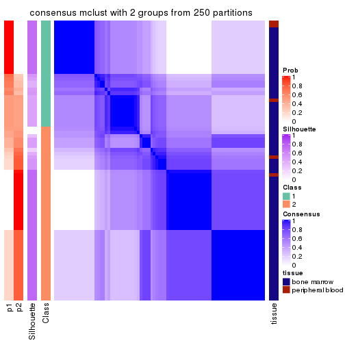</p>

</div>
<div id='tab-MAD-mclust-consensus-heatmap-2'>
<pre><code class="r">consensus_heatmap(res, k = 3)
</code></pre>

<p>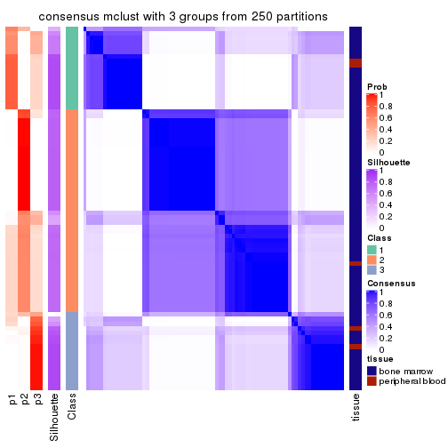</p>

</div>
<div id='tab-MAD-mclust-consensus-heatmap-3'>
<pre><code class="r">consensus_heatmap(res, k = 4)
</code></pre>

<p>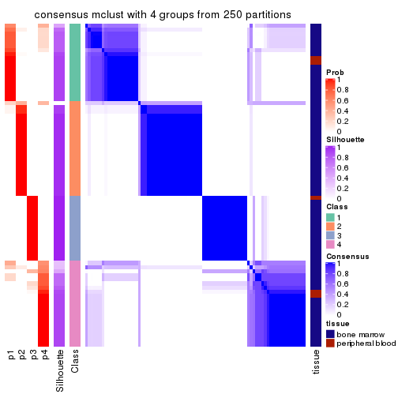</p>

</div>
<div id='tab-MAD-mclust-consensus-heatmap-4'>
<pre><code class="r">consensus_heatmap(res, k = 5)
</code></pre>

<p>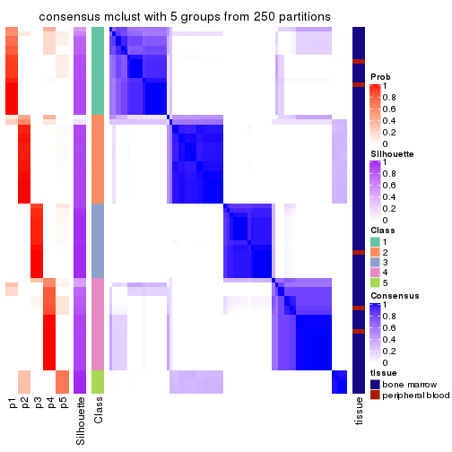</p>

</div>
<div id='tab-MAD-mclust-consensus-heatmap-5'>
<pre><code class="r">consensus_heatmap(res, k = 6)
</code></pre>

<p>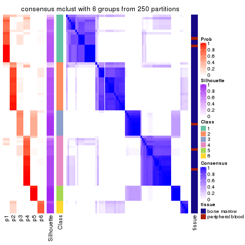</p>

</div>
</div>

Heatmaps for the membership of samples in all partitions to see how consistent they are:


<script>
$( function() {
	$( '#tabs-MAD-mclust-membership-heatmap' ).tabs();
} );
</script>
<div id='tabs-MAD-mclust-membership-heatmap'>
<ul>
<li><a href='#tab-MAD-mclust-membership-heatmap-1'>k = 2</a></li>
<li><a href='#tab-MAD-mclust-membership-heatmap-2'>k = 3</a></li>
<li><a href='#tab-MAD-mclust-membership-heatmap-3'>k = 4</a></li>
<li><a href='#tab-MAD-mclust-membership-heatmap-4'>k = 5</a></li>
<li><a href='#tab-MAD-mclust-membership-heatmap-5'>k = 6</a></li>
</ul>
<div id='tab-MAD-mclust-membership-heatmap-1'>
<pre><code class="r">membership_heatmap(res, k = 2)
</code></pre>

<p>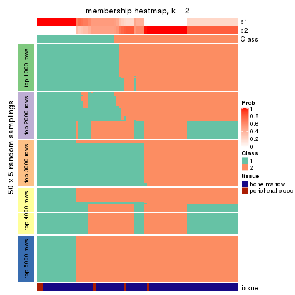</p>

</div>
<div id='tab-MAD-mclust-membership-heatmap-2'>
<pre><code class="r">membership_heatmap(res, k = 3)
</code></pre>

<p>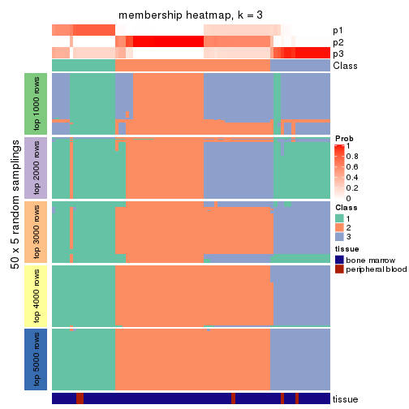</p>

</div>
<div id='tab-MAD-mclust-membership-heatmap-3'>
<pre><code class="r">membership_heatmap(res, k = 4)
</code></pre>

<p>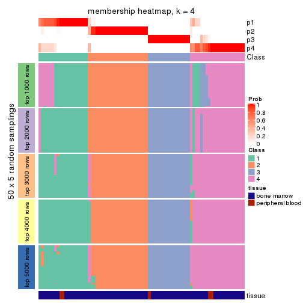</p>

</div>
<div id='tab-MAD-mclust-membership-heatmap-4'>
<pre><code class="r">membership_heatmap(res, k = 5)
</code></pre>

<p>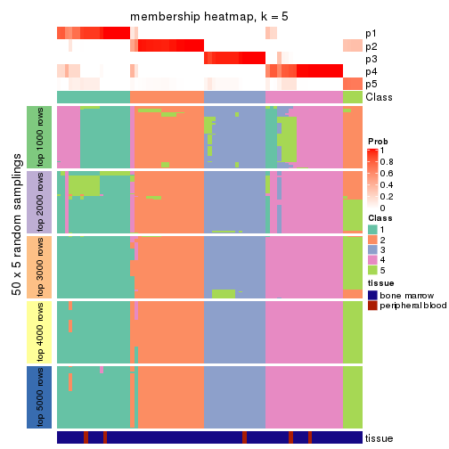</p>

</div>
<div id='tab-MAD-mclust-membership-heatmap-5'>
<pre><code class="r">membership_heatmap(res, k = 6)
</code></pre>

<p>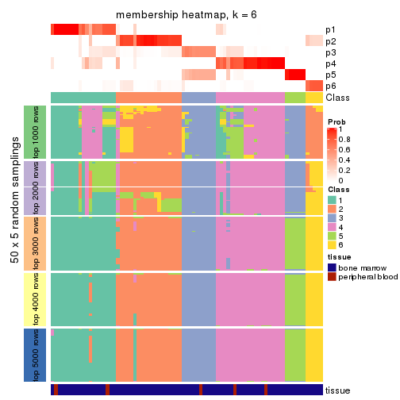</p>

</div>
</div>

As soon as we have had the classes for columns, we can look for signatures
which are significantly different between classes which can be candidate marks
for certain classes. Following are the heatmaps for signatures.


Signature heatmaps where rows are scaled:


<script>
$( function() {
	$( '#tabs-MAD-mclust-get-signatures' ).tabs();
} );
</script>
<div id='tabs-MAD-mclust-get-signatures'>
<ul>
<li><a href='#tab-MAD-mclust-get-signatures-1'>k = 2</a></li>
<li><a href='#tab-MAD-mclust-get-signatures-2'>k = 3</a></li>
<li><a href='#tab-MAD-mclust-get-signatures-3'>k = 4</a></li>
<li><a href='#tab-MAD-mclust-get-signatures-4'>k = 5</a></li>
<li><a href='#tab-MAD-mclust-get-signatures-5'>k = 6</a></li>
</ul>
<div id='tab-MAD-mclust-get-signatures-1'>
<pre><code class="r">get_signatures(res, k = 2)
</code></pre>

<p>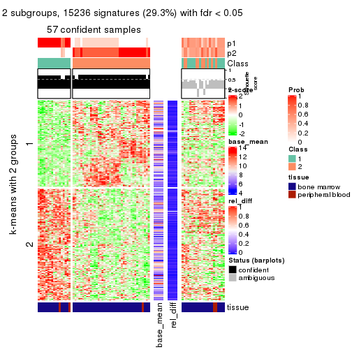</p>

</div>
<div id='tab-MAD-mclust-get-signatures-2'>
<pre><code class="r">get_signatures(res, k = 3)
</code></pre>

<p>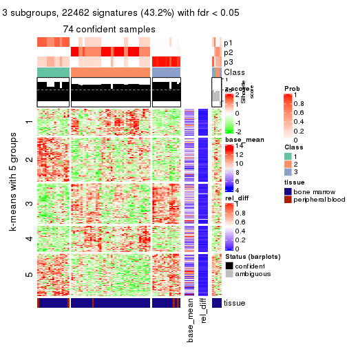</p>

</div>
<div id='tab-MAD-mclust-get-signatures-3'>
<pre><code class="r">get_signatures(res, k = 4)
</code></pre>

<p>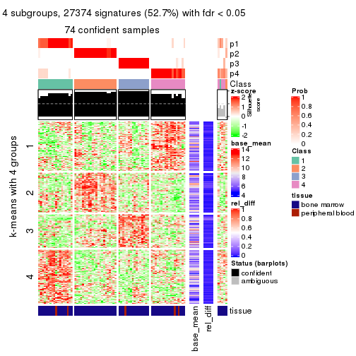</p>

</div>
<div id='tab-MAD-mclust-get-signatures-4'>
<pre><code class="r">get_signatures(res, k = 5)
</code></pre>

<p>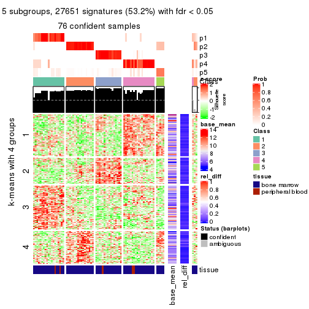</p>

</div>
<div id='tab-MAD-mclust-get-signatures-5'>
<pre><code class="r">get_signatures(res, k = 6)
</code></pre>

<p>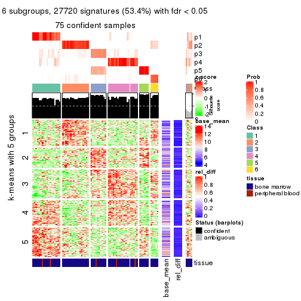</p>

</div>
</div>


Signature heatmaps where rows are not scaled:


<script>
$( function() {
	$( '#tabs-MAD-mclust-get-signatures-no-scale' ).tabs();
} );
</script>
<div id='tabs-MAD-mclust-get-signatures-no-scale'>
<ul>
<li><a href='#tab-MAD-mclust-get-signatures-no-scale-1'>k = 2</a></li>
<li><a href='#tab-MAD-mclust-get-signatures-no-scale-2'>k = 3</a></li>
<li><a href='#tab-MAD-mclust-get-signatures-no-scale-3'>k = 4</a></li>
<li><a href='#tab-MAD-mclust-get-signatures-no-scale-4'>k = 5</a></li>
<li><a href='#tab-MAD-mclust-get-signatures-no-scale-5'>k = 6</a></li>
</ul>
<div id='tab-MAD-mclust-get-signatures-no-scale-1'>
<pre><code class="r">get_signatures(res, k = 2, scale_rows = FALSE)
</code></pre>

<p>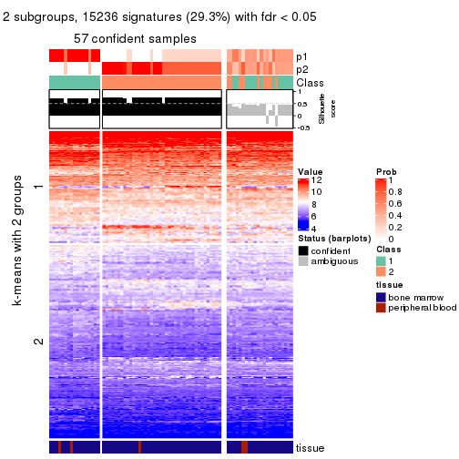</p>

</div>
<div id='tab-MAD-mclust-get-signatures-no-scale-2'>
<pre><code class="r">get_signatures(res, k = 3, scale_rows = FALSE)
</code></pre>

<p>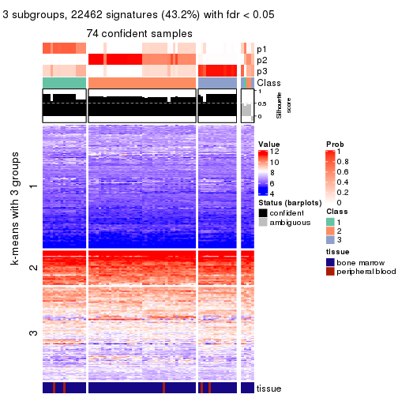</p>

</div>
<div id='tab-MAD-mclust-get-signatures-no-scale-3'>
<pre><code class="r">get_signatures(res, k = 4, scale_rows = FALSE)
</code></pre>

<p>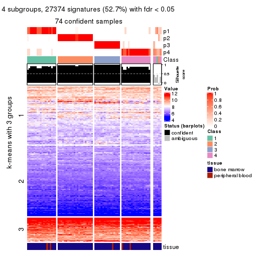</p>

</div>
<div id='tab-MAD-mclust-get-signatures-no-scale-4'>
<pre><code class="r">get_signatures(res, k = 5, scale_rows = FALSE)
</code></pre>

<p>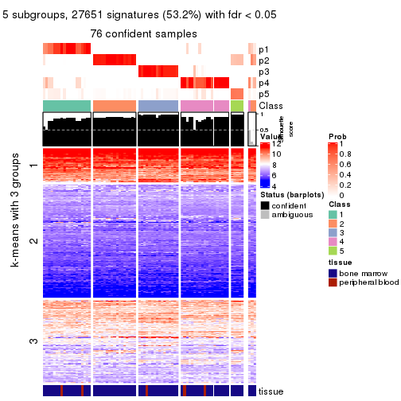</p>

</div>
<div id='tab-MAD-mclust-get-signatures-no-scale-5'>
<pre><code class="r">get_signatures(res, k = 6, scale_rows = FALSE)
</code></pre>

<p>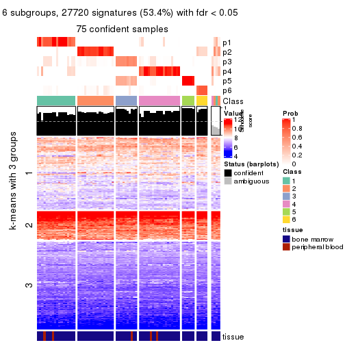</p>

</div>
</div>


Compare the overlap of signatures from different k:

```r
compare_signatures(res)
```

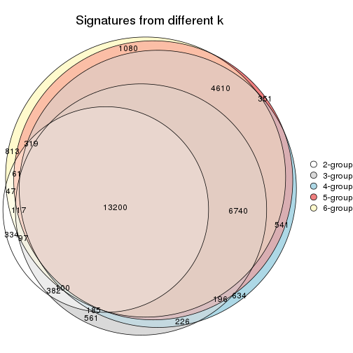

`get_signature()` returns a data frame invisibly. TO get the list of signatures, the function
call should be assigned to a variable explicitly. In following code, if `plot` argument is set
to `FALSE`, no heatmap is plotted while only the differential analysis is performed.

```r
# code only for demonstration
tb = get_signature(res, k = ..., plot = FALSE)
```

An example of the output of `tb` is:

```
#>   which_row         fdr    mean_1    mean_2 scaled_mean_1 scaled_mean_2 km
#> 1        38 0.042760348  8.373488  9.131774    -0.5533452     0.5164555  1
#> 2        40 0.018707592  7.106213  8.469186    -0.6173731     0.5762149  1
#> 3        55 0.019134737 10.221463 11.207825    -0.6159697     0.5749050  1
#> 4        59 0.006059896  5.921854  7.869574    -0.6899429     0.6439467  1
#> 5        60 0.018055526  8.928898 10.211722    -0.6204761     0.5791110  1
#> 6        98 0.009384629 15.714769 14.887706     0.6635654    -0.6193277  2
...
```

The columns in `tb` are:

1. `which_row`: row indices corresponding to the input matrix.
2. `fdr`: FDR for the differential test. 
3. `mean_x`: The mean value in group x.
4. `scaled_mean_x`: The mean value in group x after rows are scaled.
5. `km`: Row groups if k-means clustering is applied to rows.


UMAP plot which shows how samples are separated.


<script>
$( function() {
	$( '#tabs-MAD-mclust-dimension-reduction' ).tabs();
} );
</script>
<div id='tabs-MAD-mclust-dimension-reduction'>
<ul>
<li><a href='#tab-MAD-mclust-dimension-reduction-1'>k = 2</a></li>
<li><a href='#tab-MAD-mclust-dimension-reduction-2'>k = 3</a></li>
<li><a href='#tab-MAD-mclust-dimension-reduction-3'>k = 4</a></li>
<li><a href='#tab-MAD-mclust-dimension-reduction-4'>k = 5</a></li>
<li><a href='#tab-MAD-mclust-dimension-reduction-5'>k = 6</a></li>
</ul>
<div id='tab-MAD-mclust-dimension-reduction-1'>
<pre><code class="r">dimension_reduction(res, k = 2, method = &quot;UMAP&quot;)
</code></pre>

<p>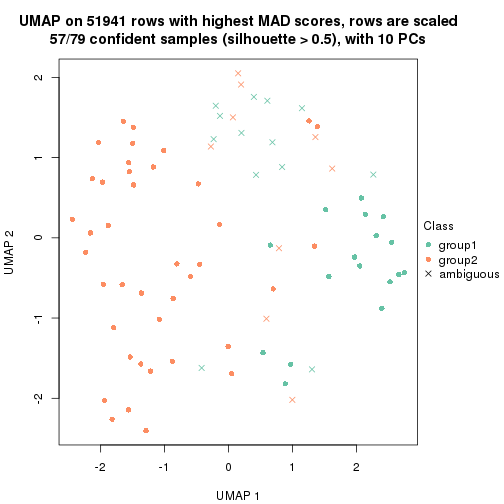</p>

</div>
<div id='tab-MAD-mclust-dimension-reduction-2'>
<pre><code class="r">dimension_reduction(res, k = 3, method = &quot;UMAP&quot;)
</code></pre>

<p>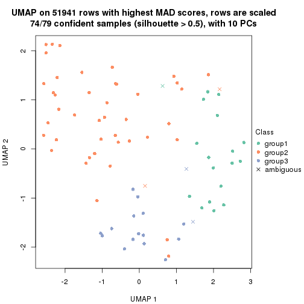</p>

</div>
<div id='tab-MAD-mclust-dimension-reduction-3'>
<pre><code class="r">dimension_reduction(res, k = 4, method = &quot;UMAP&quot;)
</code></pre>

<p>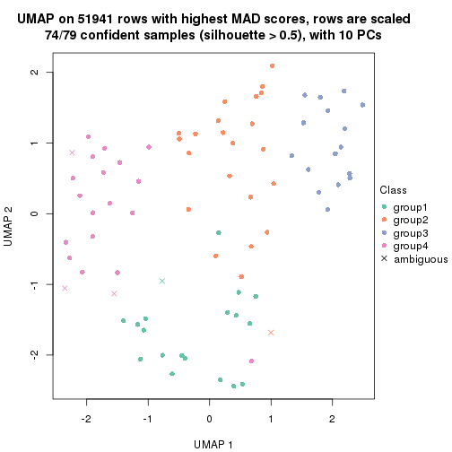</p>

</div>
<div id='tab-MAD-mclust-dimension-reduction-4'>
<pre><code class="r">dimension_reduction(res, k = 5, method = &quot;UMAP&quot;)
</code></pre>

<p>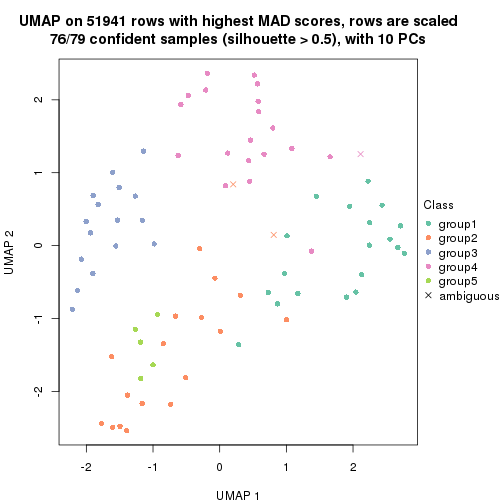</p>

</div>
<div id='tab-MAD-mclust-dimension-reduction-5'>
<pre><code class="r">dimension_reduction(res, k = 6, method = &quot;UMAP&quot;)
</code></pre>

<p>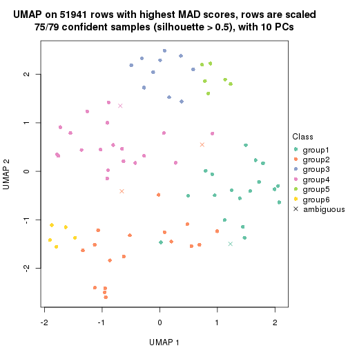</p>

</div>
</div>


Following heatmap shows how subgroups are split when increasing `k`:

```r
collect_classes(res)
```

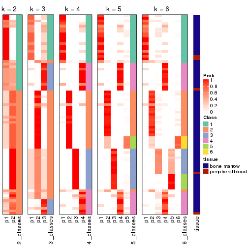


Test correlation between subgroups and known annotations. If the known
annotation is numeric, one-way ANOVA test is applied, and if the known
annotation is discrete, chi-squared contingency table test is applied.

```r
test_to_known_factors(res)
```

```
#>             n tissue(p) k
#> MAD:mclust 57     0.433 2
#> MAD:mclust 74     0.225 3
#> MAD:mclust 74     0.443 4
#> MAD:mclust 76     0.642 5
#> MAD:mclust 75     0.668 6
```


If matrix rows can be associated to genes, consider to use `GO_Enrichment(res,
...)` to perform function enrichment for the signature genes.


 

---------------------------------------------------


### MAD:NMF


The object with results only for a single top-value method and a single partition method 
can be extracted as:

```r
res = res_list["MAD", "NMF"]
# you can also extract it by
# res = res_list["MAD:NMF"]
```

A summary of `res` and all the functions that can be applied to it:

```r
res
```

```
#> A 'ConsensusPartition' object with k = 2, 3, 4, 5, 6.
#>   On a matrix with 51941 rows and 79 columns.
#>   Top rows (1000, 2000, 3000, 4000, 5000) are extracted by 'MAD' method.
#>   Subgroups are detected by 'NMF' method.
#>   Performed in total 1250 partitions by row resampling.
#>   Best k for subgroups seems to be 4.
#> 
#> Following methods can be applied to this 'ConsensusPartition' object:
#>  [1] "cola_report"             "collect_classes"         "collect_plots"          
#>  [4] "collect_stats"           "colnames"                "compare_signatures"     
#>  [7] "consensus_heatmap"       "dimension_reduction"     "functional_enrichment"  
#> [10] "get_anno_col"            "get_anno"                "get_classes"            
#> [13] "get_consensus"           "get_matrix"              "get_membership"         
#> [16] "get_param"               "get_signatures"          "get_stats"              
#> [19] "is_best_k"               "is_stable_k"             "membership_heatmap"     
#> [22] "ncol"                    "nrow"                    "plot_ecdf"              
#> [25] "rownames"                "select_partition_number" "show"                   
#> [28] "suggest_best_k"          "test_to_known_factors"
```

`collect_plots()` function collects all the plots made from `res` for all `k` (number of partitions)
into one single page to provide an easy and fast comparison between different `k`.

```r
collect_plots(res)
```

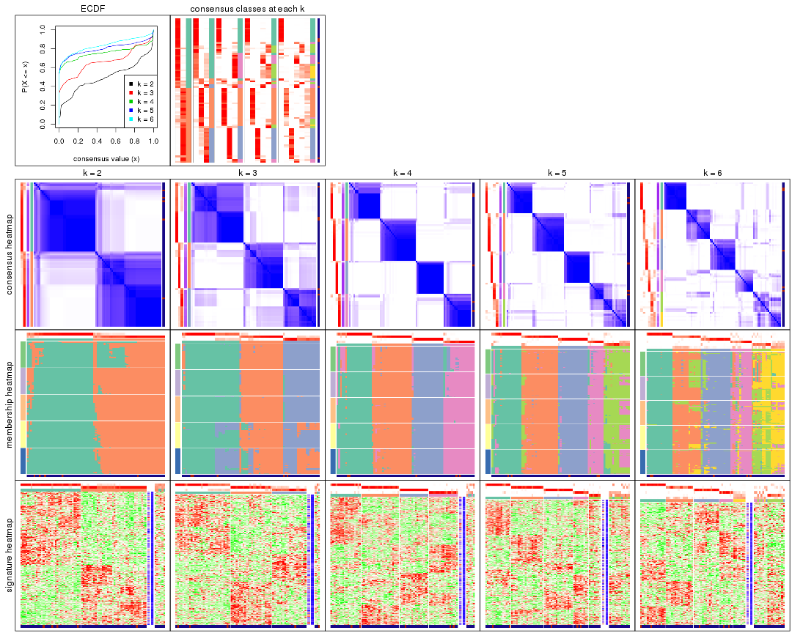

The plots are:

- The first row: a plot of the ECDF (Empirical cumulative distribution
  function) curves of the consensus matrix for each `k` and the heatmap of
  predicted classes for each `k`.
- The second row: heatmaps of the consensus matrix for each `k`.
- The third row: heatmaps of the membership matrix for each `k`.
- The fouth row: heatmaps of the signatures for each `k`.

All the plots in panels can be made by individual functions and they are
plotted later in this section.

`select_partition_number()` produces several plots showing different
statistics for choosing "optimized" `k`. There are following statistics:

- ECDF curves of the consensus matrix for each `k`;
- 1-PAC. [The PAC
  score](https://en.wikipedia.org/wiki/Consensus_clustering#Over-interpretation_potential_of_consensus_clustering)
  measures the proportion of the ambiguous subgrouping.
- Mean silhouette score.
- Concordance. The mean probability of fiting the consensus class ids in all
  partitions.
- Area increased. Denote $A_k$ as the area under the ECDF curve for current
  `k`, the area increased is defined as $A_k - A_{k-1}$.
- Rand index. The percent of pairs of samples that are both in a same cluster
  or both are not in a same cluster in the partition of k and k-1.
- Jaccard index. The ratio of pairs of samples are both in a same cluster in
  the partition of k and k-1 and the pairs of samples are both in a same
  cluster in the partition k or k-1.

The detailed explanations of these statistics can be found in [the cola
vignette](http://bioconductor.org/packages/devel/bioc/vignettes/cola/inst/doc/cola.html#toc_13).

Generally speaking, lower PAC score, higher mean silhouette score or higher
concordance corresponds to better partition. Rand index and Jaccard index
measure how similar the current partition is compared to partition with `k-1`.
If they are too similar, we won't accept `k` is better than `k-1`.

```r
select_partition_number(res)
```

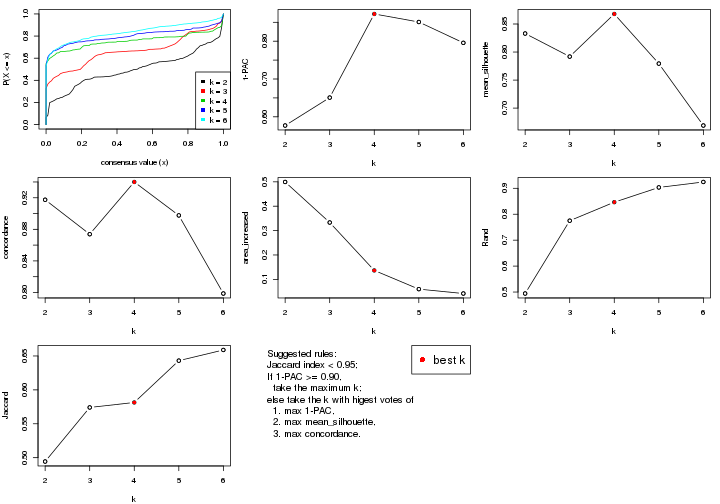

The numeric values for all these statistics can be obtained by `get_stats()`.

```r
get_stats(res)
```

```
#>   k 1-PAC mean_silhouette concordance area_increased  Rand Jaccard
#> 2 2 0.577           0.833       0.917         0.4994 0.494   0.494
#> 3 3 0.651           0.792       0.874         0.3332 0.775   0.574
#> 4 4 0.872           0.868       0.940         0.1366 0.846   0.581
#> 5 5 0.851           0.779       0.898         0.0598 0.903   0.643
#> 6 6 0.796           0.669       0.799         0.0419 0.924   0.659
```

`suggest_best_k()` suggests the best $k$ based on these statistics. The rules are as follows:

- All $k$ with Jaccard index larger than 0.95 are removed because the increase of
  the partition number does not provides enough extra information. If all $k$ are removed,
  the best $k$ is assigned by `NA`.
- For $k$ with 1-PAC larger than 0.9, the maximal $k$ is taken as the "best k". Other $k$ is called "optional k".
- If it does not fit the second rule. The $k$ with the highest vote of highest
  1-PAC, mean silhouette and concordance is taken as the "best k".

```r
suggest_best_k(res)
```

```
#> [1] 4
```


Following shows the table of the partitions (You need to click the **show/hide
code output** link to see it). The membership matrix (columns with name `p*`)
is inferred by
[`clue::cl_consensus()`](https://www.rdocumentation.org/link/cl_consensus?package=clue)
function with the `SE` method. Basically the value in the membership matrix
represents the probability to belong to a certain group. The finall class
label for an item is determined with the group with highest probability it
belongs to.

In `get_classes()` function, the entropy is calculated from the membership
matrix and the silhouette score is calculated from the consensus matrix.


<script>
$( function() {
	$( '#tabs-MAD-NMF-get-classes' ).tabs();
} );
</script>
<div id='tabs-MAD-NMF-get-classes'>
<ul>
<li><a href='#tab-MAD-NMF-get-classes-1'>k = 2</a></li>
<li><a href='#tab-MAD-NMF-get-classes-2'>k = 3</a></li>
<li><a href='#tab-MAD-NMF-get-classes-3'>k = 4</a></li>
<li><a href='#tab-MAD-NMF-get-classes-4'>k = 5</a></li>
<li><a href='#tab-MAD-NMF-get-classes-5'>k = 6</a></li>
</ul>

<div id='tab-MAD-NMF-get-classes-1'>
<p><a id='tab-MAD-NMF-get-classes-1-a' style='color:#0366d6' href='#'>show/hide code output</a></p>
<pre><code class="r">cbind(get_classes(res, k = 2), get_membership(res, k = 2))
</code></pre>

<pre><code>#&gt;           class entropy silhouette    p1    p2
#&gt; GSM316652     2  0.0938      0.887 0.012 0.988
#&gt; GSM316653     1  0.0000      0.935 1.000 0.000
#&gt; GSM316654     1  0.3431      0.887 0.936 0.064
#&gt; GSM316655     1  0.0938      0.930 0.988 0.012
#&gt; GSM316656     2  0.5519      0.852 0.128 0.872
#&gt; GSM316657     1  0.0938      0.930 0.988 0.012
#&gt; GSM316658     2  0.6247      0.835 0.156 0.844
#&gt; GSM316659     2  0.6048      0.840 0.148 0.852
#&gt; GSM316660     1  0.0000      0.935 1.000 0.000
#&gt; GSM316661     1  0.5629      0.818 0.868 0.132
#&gt; GSM316662     2  0.0938      0.887 0.012 0.988
#&gt; GSM316663     2  0.0938      0.887 0.012 0.988
#&gt; GSM316664     1  0.0000      0.935 1.000 0.000
#&gt; GSM316665     2  0.0000      0.885 0.000 1.000
#&gt; GSM316666     2  0.0938      0.887 0.012 0.988
#&gt; GSM316667     2  0.4690      0.862 0.100 0.900
#&gt; GSM316668     2  0.0938      0.887 0.012 0.988
#&gt; GSM316669     1  0.0000      0.935 1.000 0.000
#&gt; GSM316670     2  0.0938      0.887 0.012 0.988
#&gt; GSM316671     2  0.0938      0.887 0.012 0.988
#&gt; GSM316672     1  0.0938      0.930 0.988 0.012
#&gt; GSM316673     1  0.0000      0.935 1.000 0.000
#&gt; GSM316674     2  0.0938      0.887 0.012 0.988
#&gt; GSM316676     2  0.0938      0.887 0.012 0.988
#&gt; GSM316677     1  0.0000      0.935 1.000 0.000
#&gt; GSM316678     2  0.8207      0.730 0.256 0.744
#&gt; GSM316679     1  0.0376      0.934 0.996 0.004
#&gt; GSM316680     1  0.0938      0.930 0.988 0.012
#&gt; GSM316681     2  0.0938      0.887 0.012 0.988
#&gt; GSM316682     1  0.0938      0.930 0.988 0.012
#&gt; GSM316683     1  0.0938      0.930 0.988 0.012
#&gt; GSM316684     2  0.6247      0.835 0.156 0.844
#&gt; GSM316685     2  0.0000      0.885 0.000 1.000
#&gt; GSM316686     1  0.0000      0.935 1.000 0.000
#&gt; GSM316687     1  0.9491      0.464 0.632 0.368
#&gt; GSM316688     1  0.9775      0.199 0.588 0.412
#&gt; GSM316689     1  0.0376      0.934 0.996 0.004
#&gt; GSM316690     2  0.0938      0.887 0.012 0.988
#&gt; GSM316691     2  0.2603      0.879 0.044 0.956
#&gt; GSM316692     2  0.0938      0.887 0.012 0.988
#&gt; GSM316693     1  0.0000      0.935 1.000 0.000
#&gt; GSM316694     2  0.0938      0.887 0.012 0.988
#&gt; GSM316696     1  0.0938      0.930 0.988 0.012
#&gt; GSM316697     2  0.0938      0.887 0.012 0.988
#&gt; GSM316698     2  0.7056      0.804 0.192 0.808
#&gt; GSM316699     2  0.0000      0.885 0.000 1.000
#&gt; GSM316700     1  0.4562      0.857 0.904 0.096
#&gt; GSM316701     1  0.0000      0.935 1.000 0.000
#&gt; GSM316703     2  0.6887      0.812 0.184 0.816
#&gt; GSM316704     2  0.6623      0.822 0.172 0.828
#&gt; GSM316705     1  0.0000      0.935 1.000 0.000
#&gt; GSM316706     1  0.9850      0.102 0.572 0.428
#&gt; GSM316707     2  0.5842      0.845 0.140 0.860
#&gt; GSM316708     2  0.9909      0.346 0.444 0.556
#&gt; GSM316709     2  0.0938      0.887 0.012 0.988
#&gt; GSM316710     1  0.1633      0.920 0.976 0.024
#&gt; GSM316711     2  0.6048      0.840 0.148 0.852
#&gt; GSM316713     1  0.0000      0.935 1.000 0.000
#&gt; GSM316714     2  0.9998     -0.063 0.492 0.508
#&gt; GSM316715     1  0.0000      0.935 1.000 0.000
#&gt; GSM316716     2  0.0000      0.885 0.000 1.000
#&gt; GSM316717     1  0.0000      0.935 1.000 0.000
#&gt; GSM316718     2  0.9970      0.266 0.468 0.532
#&gt; GSM316719     1  0.0000      0.935 1.000 0.000
#&gt; GSM316720     1  0.0000      0.935 1.000 0.000
#&gt; GSM316721     2  0.0672      0.885 0.008 0.992
#&gt; GSM316722     1  0.0000      0.935 1.000 0.000
#&gt; GSM316723     2  0.5737      0.847 0.136 0.864
#&gt; GSM316724     2  0.6247      0.835 0.156 0.844
#&gt; GSM316726     2  0.0938      0.885 0.012 0.988
#&gt; GSM316727     1  0.0000      0.935 1.000 0.000
#&gt; GSM316728     2  0.8327      0.615 0.264 0.736
#&gt; GSM316729     1  0.7815      0.652 0.768 0.232
#&gt; GSM316730     2  0.7299      0.793 0.204 0.796
#&gt; GSM316675     2  0.0938      0.887 0.012 0.988
#&gt; GSM316695     1  0.0938      0.930 0.988 0.012
#&gt; GSM316702     1  0.6801      0.764 0.820 0.180
#&gt; GSM316712     1  0.0000      0.935 1.000 0.000
#&gt; GSM316725     1  0.2603      0.904 0.956 0.044
</code></pre>

<script>
$('#tab-MAD-NMF-get-classes-1-a').parent().next().next().hide();
$('#tab-MAD-NMF-get-classes-1-a').click(function(){
  $('#tab-MAD-NMF-get-classes-1-a').parent().next().next().toggle();
  return(false);
});
</script>
</div>

<div id='tab-MAD-NMF-get-classes-2'>
<p><a id='tab-MAD-NMF-get-classes-2-a' style='color:#0366d6' href='#'>show/hide code output</a></p>
<pre><code class="r">cbind(get_classes(res, k = 3), get_membership(res, k = 3))
</code></pre>

<pre><code>#&gt;           class entropy silhouette    p1    p2    p3
#&gt; GSM316652     3  0.5016     0.8141 0.000 0.240 0.760
#&gt; GSM316653     1  0.4974     0.8089 0.764 0.000 0.236
#&gt; GSM316654     1  0.5138     0.8007 0.748 0.000 0.252
#&gt; GSM316655     1  0.4504     0.8223 0.804 0.000 0.196
#&gt; GSM316656     2  0.8091     0.0478 0.080 0.572 0.348
#&gt; GSM316657     1  0.0000     0.8587 1.000 0.000 0.000
#&gt; GSM316658     2  0.0000     0.8780 0.000 1.000 0.000
#&gt; GSM316659     2  0.1289     0.8630 0.000 0.968 0.032
#&gt; GSM316660     1  0.0000     0.8587 1.000 0.000 0.000
#&gt; GSM316661     1  0.5591     0.7609 0.696 0.000 0.304
#&gt; GSM316662     3  0.5678     0.7320 0.000 0.316 0.684
#&gt; GSM316663     3  0.0000     0.7817 0.000 0.000 1.000
#&gt; GSM316664     1  0.4974     0.8087 0.764 0.000 0.236
#&gt; GSM316665     2  0.1643     0.8433 0.000 0.956 0.044
#&gt; GSM316666     3  0.3941     0.8266 0.000 0.156 0.844
#&gt; GSM316667     2  0.0000     0.8780 0.000 1.000 0.000
#&gt; GSM316668     3  0.5254     0.7968 0.000 0.264 0.736
#&gt; GSM316669     1  0.5098     0.8029 0.752 0.000 0.248
#&gt; GSM316670     3  0.4702     0.8244 0.000 0.212 0.788
#&gt; GSM316671     3  0.5588     0.7798 0.004 0.276 0.720
#&gt; GSM316672     2  0.5254     0.6890 0.264 0.736 0.000
#&gt; GSM316673     1  0.0424     0.8583 0.992 0.000 0.008
#&gt; GSM316674     3  0.5016     0.8141 0.000 0.240 0.760
#&gt; GSM316676     3  0.4796     0.8226 0.000 0.220 0.780
#&gt; GSM316677     1  0.0424     0.8583 0.992 0.000 0.008
#&gt; GSM316678     2  0.1529     0.8616 0.040 0.960 0.000
#&gt; GSM316679     1  0.0000     0.8587 1.000 0.000 0.000
#&gt; GSM316680     1  0.4504     0.6490 0.804 0.196 0.000
#&gt; GSM316681     3  0.5216     0.7999 0.000 0.260 0.740
#&gt; GSM316682     1  0.5397     0.7810 0.720 0.000 0.280
#&gt; GSM316683     1  0.5016     0.8069 0.760 0.000 0.240
#&gt; GSM316684     2  0.0000     0.8780 0.000 1.000 0.000
#&gt; GSM316685     3  0.5291     0.7929 0.000 0.268 0.732
#&gt; GSM316686     1  0.5178     0.7990 0.744 0.000 0.256
#&gt; GSM316687     3  0.0000     0.7817 0.000 0.000 1.000
#&gt; GSM316688     1  0.7363     0.4149 0.656 0.280 0.064
#&gt; GSM316689     1  0.0000     0.8587 1.000 0.000 0.000
#&gt; GSM316690     3  0.0592     0.7879 0.000 0.012 0.988
#&gt; GSM316691     2  0.0424     0.8742 0.000 0.992 0.008
#&gt; GSM316692     3  0.1411     0.7979 0.000 0.036 0.964
#&gt; GSM316693     1  0.5706     0.7428 0.680 0.000 0.320
#&gt; GSM316694     3  0.4931     0.8180 0.000 0.232 0.768
#&gt; GSM316696     1  0.0000     0.8587 1.000 0.000 0.000
#&gt; GSM316697     3  0.4555     0.8264 0.000 0.200 0.800
#&gt; GSM316698     2  0.0424     0.8764 0.008 0.992 0.000
#&gt; GSM316699     2  0.0000     0.8780 0.000 1.000 0.000
#&gt; GSM316700     1  0.5465     0.7751 0.712 0.000 0.288
#&gt; GSM316701     1  0.4796     0.8145 0.780 0.000 0.220
#&gt; GSM316703     2  0.4796     0.7011 0.000 0.780 0.220
#&gt; GSM316704     2  0.5216     0.6594 0.000 0.740 0.260
#&gt; GSM316705     1  0.1411     0.8553 0.964 0.000 0.036
#&gt; GSM316706     2  0.5178     0.6608 0.000 0.744 0.256
#&gt; GSM316707     2  0.0000     0.8780 0.000 1.000 0.000
#&gt; GSM316708     2  0.4605     0.7445 0.204 0.796 0.000
#&gt; GSM316709     3  0.3482     0.8228 0.000 0.128 0.872
#&gt; GSM316710     1  0.5560     0.7639 0.700 0.000 0.300
#&gt; GSM316711     2  0.1643     0.8560 0.000 0.956 0.044
#&gt; GSM316713     1  0.0000     0.8587 1.000 0.000 0.000
#&gt; GSM316714     3  0.0000     0.7817 0.000 0.000 1.000
#&gt; GSM316715     1  0.0000     0.8587 1.000 0.000 0.000
#&gt; GSM316716     2  0.0424     0.8740 0.000 0.992 0.008
#&gt; GSM316717     1  0.0000     0.8587 1.000 0.000 0.000
#&gt; GSM316718     2  0.4654     0.7414 0.208 0.792 0.000
#&gt; GSM316719     1  0.0000     0.8587 1.000 0.000 0.000
#&gt; GSM316720     1  0.0000     0.8587 1.000 0.000 0.000
#&gt; GSM316721     2  0.0000     0.8780 0.000 1.000 0.000
#&gt; GSM316722     1  0.0000     0.8587 1.000 0.000 0.000
#&gt; GSM316723     2  0.0000     0.8780 0.000 1.000 0.000
#&gt; GSM316724     2  0.0237     0.8775 0.004 0.996 0.000
#&gt; GSM316726     2  0.0000     0.8780 0.000 1.000 0.000
#&gt; GSM316727     1  0.0000     0.8587 1.000 0.000 0.000
#&gt; GSM316728     3  0.0000     0.7817 0.000 0.000 1.000
#&gt; GSM316729     2  0.4842     0.7271 0.224 0.776 0.000
#&gt; GSM316730     2  0.0237     0.8775 0.004 0.996 0.000
#&gt; GSM316675     3  0.1031     0.7935 0.000 0.024 0.976
#&gt; GSM316695     1  0.0000     0.8587 1.000 0.000 0.000
#&gt; GSM316702     3  0.5760     0.1070 0.328 0.000 0.672
#&gt; GSM316712     1  0.0000     0.8587 1.000 0.000 0.000
#&gt; GSM316725     1  0.5760     0.7332 0.672 0.000 0.328
</code></pre>

<script>
$('#tab-MAD-NMF-get-classes-2-a').parent().next().next().hide();
$('#tab-MAD-NMF-get-classes-2-a').click(function(){
  $('#tab-MAD-NMF-get-classes-2-a').parent().next().next().toggle();
  return(false);
});
</script>
</div>

<div id='tab-MAD-NMF-get-classes-3'>
<p><a id='tab-MAD-NMF-get-classes-3-a' style='color:#0366d6' href='#'>show/hide code output</a></p>
<pre><code class="r">cbind(get_classes(res, k = 4), get_membership(res, k = 4))
</code></pre>

<pre><code>#&gt;           class entropy silhouette    p1    p2    p3    p4
#&gt; GSM316652     3  0.0000      0.968 0.000 0.000 1.000 0.000
#&gt; GSM316653     4  0.0817      0.911 0.024 0.000 0.000 0.976
#&gt; GSM316654     4  0.0000      0.919 0.000 0.000 0.000 1.000
#&gt; GSM316655     4  0.0707      0.909 0.020 0.000 0.000 0.980
#&gt; GSM316656     3  0.8557      0.218 0.144 0.072 0.472 0.312
#&gt; GSM316657     1  0.0000      0.898 1.000 0.000 0.000 0.000
#&gt; GSM316658     2  0.0000      0.947 0.000 1.000 0.000 0.000
#&gt; GSM316659     2  0.0000      0.947 0.000 1.000 0.000 0.000
#&gt; GSM316660     1  0.0000      0.898 1.000 0.000 0.000 0.000
#&gt; GSM316661     4  0.0000      0.919 0.000 0.000 0.000 1.000
#&gt; GSM316662     3  0.0000      0.968 0.000 0.000 1.000 0.000
#&gt; GSM316663     4  0.1474      0.895 0.000 0.000 0.052 0.948
#&gt; GSM316664     4  0.3649      0.732 0.204 0.000 0.000 0.796
#&gt; GSM316665     2  0.2011      0.891 0.000 0.920 0.080 0.000
#&gt; GSM316666     3  0.0000      0.968 0.000 0.000 1.000 0.000
#&gt; GSM316667     2  0.0336      0.945 0.000 0.992 0.008 0.000
#&gt; GSM316668     3  0.0000      0.968 0.000 0.000 1.000 0.000
#&gt; GSM316669     4  0.0707      0.912 0.020 0.000 0.000 0.980
#&gt; GSM316670     3  0.0000      0.968 0.000 0.000 1.000 0.000
#&gt; GSM316671     3  0.0000      0.968 0.000 0.000 1.000 0.000
#&gt; GSM316672     1  0.4605      0.496 0.664 0.336 0.000 0.000
#&gt; GSM316673     1  0.0000      0.898 1.000 0.000 0.000 0.000
#&gt; GSM316674     3  0.0000      0.968 0.000 0.000 1.000 0.000
#&gt; GSM316676     3  0.0000      0.968 0.000 0.000 1.000 0.000
#&gt; GSM316677     1  0.4972      0.266 0.544 0.000 0.000 0.456
#&gt; GSM316678     2  0.0000      0.947 0.000 1.000 0.000 0.000
#&gt; GSM316679     1  0.0000      0.898 1.000 0.000 0.000 0.000
#&gt; GSM316680     1  0.3791      0.735 0.796 0.004 0.000 0.200
#&gt; GSM316681     3  0.0000      0.968 0.000 0.000 1.000 0.000
#&gt; GSM316682     4  0.0000      0.919 0.000 0.000 0.000 1.000
#&gt; GSM316683     4  0.0000      0.919 0.000 0.000 0.000 1.000
#&gt; GSM316684     2  0.0000      0.947 0.000 1.000 0.000 0.000
#&gt; GSM316685     3  0.0000      0.968 0.000 0.000 1.000 0.000
#&gt; GSM316686     4  0.4843      0.386 0.396 0.000 0.000 0.604
#&gt; GSM316687     4  0.4008      0.686 0.000 0.000 0.244 0.756
#&gt; GSM316688     1  0.7267      0.531 0.600 0.244 0.024 0.132
#&gt; GSM316689     1  0.0000      0.898 1.000 0.000 0.000 0.000
#&gt; GSM316690     3  0.0000      0.968 0.000 0.000 1.000 0.000
#&gt; GSM316691     2  0.3591      0.788 0.000 0.824 0.008 0.168
#&gt; GSM316692     3  0.0000      0.968 0.000 0.000 1.000 0.000
#&gt; GSM316693     4  0.0000      0.919 0.000 0.000 0.000 1.000
#&gt; GSM316694     3  0.0000      0.968 0.000 0.000 1.000 0.000
#&gt; GSM316696     1  0.0000      0.898 1.000 0.000 0.000 0.000
#&gt; GSM316697     3  0.0000      0.968 0.000 0.000 1.000 0.000
#&gt; GSM316698     2  0.0000      0.947 0.000 1.000 0.000 0.000
#&gt; GSM316699     2  0.0707      0.938 0.000 0.980 0.020 0.000
#&gt; GSM316700     4  0.0000      0.919 0.000 0.000 0.000 1.000
#&gt; GSM316701     4  0.0000      0.919 0.000 0.000 0.000 1.000
#&gt; GSM316703     2  0.1474      0.918 0.000 0.948 0.000 0.052
#&gt; GSM316704     2  0.3528      0.760 0.000 0.808 0.000 0.192
#&gt; GSM316705     1  0.3610      0.680 0.800 0.000 0.000 0.200
#&gt; GSM316706     2  0.1389      0.921 0.000 0.952 0.000 0.048
#&gt; GSM316707     2  0.0000      0.947 0.000 1.000 0.000 0.000
#&gt; GSM316708     2  0.0469      0.942 0.012 0.988 0.000 0.000
#&gt; GSM316709     3  0.0000      0.968 0.000 0.000 1.000 0.000
#&gt; GSM316710     4  0.0000      0.919 0.000 0.000 0.000 1.000
#&gt; GSM316711     2  0.0000      0.947 0.000 1.000 0.000 0.000
#&gt; GSM316713     1  0.0000      0.898 1.000 0.000 0.000 0.000
#&gt; GSM316714     3  0.1389      0.919 0.000 0.000 0.952 0.048
#&gt; GSM316715     1  0.0000      0.898 1.000 0.000 0.000 0.000
#&gt; GSM316716     2  0.1211      0.927 0.000 0.960 0.040 0.000
#&gt; GSM316717     1  0.0000      0.898 1.000 0.000 0.000 0.000
#&gt; GSM316718     2  0.1022      0.929 0.032 0.968 0.000 0.000
#&gt; GSM316719     1  0.0000      0.898 1.000 0.000 0.000 0.000
#&gt; GSM316720     1  0.0000      0.898 1.000 0.000 0.000 0.000
#&gt; GSM316721     2  0.0000      0.947 0.000 1.000 0.000 0.000
#&gt; GSM316722     1  0.3649      0.733 0.796 0.000 0.000 0.204
#&gt; GSM316723     2  0.0000      0.947 0.000 1.000 0.000 0.000
#&gt; GSM316724     2  0.0000      0.947 0.000 1.000 0.000 0.000
#&gt; GSM316726     2  0.0000      0.947 0.000 1.000 0.000 0.000
#&gt; GSM316727     1  0.0000      0.898 1.000 0.000 0.000 0.000
#&gt; GSM316728     4  0.3688      0.735 0.000 0.000 0.208 0.792
#&gt; GSM316729     2  0.7336      0.280 0.284 0.520 0.000 0.196
#&gt; GSM316730     2  0.0000      0.947 0.000 1.000 0.000 0.000
#&gt; GSM316675     3  0.0000      0.968 0.000 0.000 1.000 0.000
#&gt; GSM316695     1  0.0000      0.898 1.000 0.000 0.000 0.000
#&gt; GSM316702     4  0.1557      0.893 0.000 0.000 0.056 0.944
#&gt; GSM316712     1  0.0000      0.898 1.000 0.000 0.000 0.000
#&gt; GSM316725     4  0.0000      0.919 0.000 0.000 0.000 1.000
</code></pre>

<script>
$('#tab-MAD-NMF-get-classes-3-a').parent().next().next().hide();
$('#tab-MAD-NMF-get-classes-3-a').click(function(){
  $('#tab-MAD-NMF-get-classes-3-a').parent().next().next().toggle();
  return(false);
});
</script>
</div>

<div id='tab-MAD-NMF-get-classes-4'>
<p><a id='tab-MAD-NMF-get-classes-4-a' style='color:#0366d6' href='#'>show/hide code output</a></p>
<pre><code class="r">cbind(get_classes(res, k = 5), get_membership(res, k = 5))
</code></pre>

<pre><code>#&gt;           class entropy silhouette    p1    p2    p3    p4    p5
#&gt; GSM316652     3  0.0000     0.9723 0.000 0.000 1.000 0.000 0.000
#&gt; GSM316653     5  0.4321     0.4373 0.004 0.000 0.000 0.396 0.600
#&gt; GSM316654     4  0.2929     0.6280 0.000 0.000 0.000 0.820 0.180
#&gt; GSM316655     5  0.2583     0.6357 0.004 0.000 0.000 0.132 0.864
#&gt; GSM316656     5  0.0000     0.6556 0.000 0.000 0.000 0.000 1.000
#&gt; GSM316657     1  0.0000     0.8990 1.000 0.000 0.000 0.000 0.000
#&gt; GSM316658     2  0.0162     0.9183 0.000 0.996 0.000 0.004 0.000
#&gt; GSM316659     2  0.0404     0.9175 0.000 0.988 0.000 0.012 0.000
#&gt; GSM316660     1  0.0000     0.8990 1.000 0.000 0.000 0.000 0.000
#&gt; GSM316661     5  0.4249     0.3809 0.000 0.000 0.000 0.432 0.568
#&gt; GSM316662     3  0.0162     0.9698 0.000 0.000 0.996 0.000 0.004
#&gt; GSM316663     4  0.3495     0.7068 0.000 0.000 0.152 0.816 0.032
#&gt; GSM316664     4  0.3816     0.5134 0.304 0.000 0.000 0.696 0.000
#&gt; GSM316665     2  0.1544     0.8748 0.000 0.932 0.068 0.000 0.000
#&gt; GSM316666     3  0.0000     0.9723 0.000 0.000 1.000 0.000 0.000
#&gt; GSM316667     2  0.1525     0.8989 0.000 0.948 0.036 0.012 0.004
#&gt; GSM316668     3  0.0000     0.9723 0.000 0.000 1.000 0.000 0.000
#&gt; GSM316669     5  0.4390     0.3801 0.004 0.000 0.000 0.428 0.568
#&gt; GSM316670     3  0.0566     0.9616 0.000 0.000 0.984 0.012 0.004
#&gt; GSM316671     3  0.2852     0.7887 0.000 0.000 0.828 0.000 0.172
#&gt; GSM316672     1  0.2280     0.7860 0.880 0.120 0.000 0.000 0.000
#&gt; GSM316673     1  0.0510     0.8921 0.984 0.000 0.000 0.016 0.000
#&gt; GSM316674     3  0.0000     0.9723 0.000 0.000 1.000 0.000 0.000
#&gt; GSM316676     3  0.0000     0.9723 0.000 0.000 1.000 0.000 0.000
#&gt; GSM316677     1  0.5044     0.2513 0.556 0.000 0.000 0.408 0.036
#&gt; GSM316678     2  0.0000     0.9182 0.000 1.000 0.000 0.000 0.000
#&gt; GSM316679     1  0.4306     0.0844 0.508 0.000 0.000 0.000 0.492
#&gt; GSM316680     5  0.2124     0.6282 0.096 0.000 0.000 0.004 0.900
#&gt; GSM316681     3  0.0000     0.9723 0.000 0.000 1.000 0.000 0.000
#&gt; GSM316682     5  0.4304     0.2620 0.000 0.000 0.000 0.484 0.516
#&gt; GSM316683     5  0.4182     0.4434 0.000 0.000 0.000 0.400 0.600
#&gt; GSM316684     2  0.0000     0.9182 0.000 1.000 0.000 0.000 0.000
#&gt; GSM316685     3  0.0162     0.9696 0.000 0.000 0.996 0.004 0.000
#&gt; GSM316686     1  0.3636     0.6006 0.728 0.000 0.000 0.272 0.000
#&gt; GSM316687     4  0.1410     0.8263 0.000 0.000 0.060 0.940 0.000
#&gt; GSM316688     5  0.7824     0.3927 0.220 0.116 0.032 0.100 0.532
#&gt; GSM316689     1  0.0162     0.8978 0.996 0.000 0.000 0.004 0.000
#&gt; GSM316690     3  0.0162     0.9703 0.000 0.000 0.996 0.000 0.004
#&gt; GSM316691     5  0.2685     0.6153 0.000 0.092 0.000 0.028 0.880
#&gt; GSM316692     3  0.0000     0.9723 0.000 0.000 1.000 0.000 0.000
#&gt; GSM316693     4  0.0404     0.8565 0.000 0.000 0.000 0.988 0.012
#&gt; GSM316694     3  0.0000     0.9723 0.000 0.000 1.000 0.000 0.000
#&gt; GSM316696     1  0.0000     0.8990 1.000 0.000 0.000 0.000 0.000
#&gt; GSM316697     3  0.0000     0.9723 0.000 0.000 1.000 0.000 0.000
#&gt; GSM316698     2  0.0000     0.9182 0.000 1.000 0.000 0.000 0.000
#&gt; GSM316699     2  0.0566     0.9156 0.000 0.984 0.012 0.004 0.000
#&gt; GSM316700     5  0.4101     0.4732 0.000 0.000 0.000 0.372 0.628
#&gt; GSM316701     5  0.0703     0.6574 0.000 0.000 0.000 0.024 0.976
#&gt; GSM316703     2  0.0794     0.9093 0.000 0.972 0.000 0.028 0.000
#&gt; GSM316704     2  0.1608     0.8778 0.000 0.928 0.000 0.072 0.000
#&gt; GSM316705     1  0.2020     0.8186 0.900 0.000 0.000 0.100 0.000
#&gt; GSM316706     2  0.0963     0.9043 0.000 0.964 0.000 0.036 0.000
#&gt; GSM316707     2  0.0162     0.9183 0.000 0.996 0.000 0.004 0.000
#&gt; GSM316708     2  0.5044     0.2191 0.032 0.504 0.000 0.000 0.464
#&gt; GSM316709     3  0.0000     0.9723 0.000 0.000 1.000 0.000 0.000
#&gt; GSM316710     4  0.0290     0.8577 0.000 0.000 0.000 0.992 0.008
#&gt; GSM316711     2  0.0290     0.9182 0.000 0.992 0.000 0.008 0.000
#&gt; GSM316713     1  0.0162     0.8978 0.996 0.000 0.000 0.004 0.000
#&gt; GSM316714     3  0.3242     0.7172 0.000 0.000 0.784 0.216 0.000
#&gt; GSM316715     1  0.0000     0.8990 1.000 0.000 0.000 0.000 0.000
#&gt; GSM316716     2  0.1928     0.8720 0.000 0.920 0.072 0.004 0.004
#&gt; GSM316717     5  0.3636     0.4522 0.272 0.000 0.000 0.000 0.728
#&gt; GSM316718     2  0.4658     0.2080 0.012 0.504 0.000 0.000 0.484
#&gt; GSM316719     1  0.0162     0.8977 0.996 0.000 0.000 0.000 0.004
#&gt; GSM316720     1  0.0000     0.8990 1.000 0.000 0.000 0.000 0.000
#&gt; GSM316721     2  0.0162     0.9183 0.000 0.996 0.000 0.004 0.000
#&gt; GSM316722     5  0.3758     0.5974 0.088 0.000 0.000 0.096 0.816
#&gt; GSM316723     2  0.0000     0.9182 0.000 1.000 0.000 0.000 0.000
#&gt; GSM316724     2  0.2852     0.7765 0.000 0.828 0.000 0.000 0.172
#&gt; GSM316726     2  0.0451     0.9175 0.000 0.988 0.000 0.008 0.004
#&gt; GSM316727     1  0.0162     0.8977 0.996 0.000 0.000 0.000 0.004
#&gt; GSM316728     4  0.0510     0.8571 0.000 0.000 0.016 0.984 0.000
#&gt; GSM316729     5  0.0324     0.6554 0.004 0.004 0.000 0.000 0.992
#&gt; GSM316730     2  0.0162     0.9179 0.000 0.996 0.000 0.000 0.004
#&gt; GSM316675     3  0.0000     0.9723 0.000 0.000 1.000 0.000 0.000
#&gt; GSM316695     1  0.0162     0.8978 0.996 0.000 0.000 0.004 0.000
#&gt; GSM316702     4  0.0290     0.8592 0.000 0.000 0.008 0.992 0.000
#&gt; GSM316712     1  0.0000     0.8990 1.000 0.000 0.000 0.000 0.000
#&gt; GSM316725     4  0.0162     0.8579 0.000 0.000 0.000 0.996 0.004
</code></pre>

<script>
$('#tab-MAD-NMF-get-classes-4-a').parent().next().next().hide();
$('#tab-MAD-NMF-get-classes-4-a').click(function(){
  $('#tab-MAD-NMF-get-classes-4-a').parent().next().next().toggle();
  return(false);
});
</script>
</div>

<div id='tab-MAD-NMF-get-classes-5'>
<p><a id='tab-MAD-NMF-get-classes-5-a' style='color:#0366d6' href='#'>show/hide code output</a></p>
<pre><code class="r">cbind(get_classes(res, k = 6), get_membership(res, k = 6))
</code></pre>

<pre><code>#&gt;           class entropy silhouette    p1    p2    p3    p4    p5    p6
#&gt; GSM316652     3  0.0458     0.8822 0.000 0.000 0.984 0.000 0.000 0.016
#&gt; GSM316653     6  0.6027     0.7456 0.024 0.004 0.000 0.128 0.324 0.520
#&gt; GSM316654     4  0.6070     0.3027 0.000 0.220 0.000 0.528 0.020 0.232
#&gt; GSM316655     6  0.4629     0.5717 0.004 0.012 0.000 0.012 0.476 0.496
#&gt; GSM316656     5  0.3727    -0.4076 0.000 0.000 0.000 0.000 0.612 0.388
#&gt; GSM316657     1  0.0260     0.9834 0.992 0.000 0.000 0.000 0.000 0.008
#&gt; GSM316658     2  0.3244     0.7475 0.000 0.732 0.000 0.000 0.000 0.268
#&gt; GSM316659     2  0.3706     0.7412 0.000 0.620 0.000 0.000 0.000 0.380
#&gt; GSM316660     1  0.0000     0.9844 1.000 0.000 0.000 0.000 0.000 0.000
#&gt; GSM316661     6  0.5784     0.7516 0.000 0.000 0.000 0.184 0.356 0.460
#&gt; GSM316662     3  0.1003     0.8739 0.000 0.000 0.964 0.000 0.020 0.016
#&gt; GSM316663     4  0.6121     0.1682 0.000 0.004 0.108 0.568 0.056 0.264
#&gt; GSM316664     4  0.3398     0.5358 0.252 0.000 0.000 0.740 0.000 0.008
#&gt; GSM316665     2  0.4918     0.7102 0.000 0.604 0.088 0.000 0.000 0.308
#&gt; GSM316666     3  0.1267     0.8693 0.000 0.000 0.940 0.000 0.000 0.060
#&gt; GSM316667     2  0.3017     0.5440 0.000 0.816 0.020 0.000 0.000 0.164
#&gt; GSM316668     3  0.0363     0.8832 0.000 0.000 0.988 0.000 0.000 0.012
#&gt; GSM316669     6  0.6093     0.7048 0.028 0.016 0.000 0.124 0.256 0.576
#&gt; GSM316670     3  0.5373     0.4244 0.000 0.384 0.512 0.004 0.000 0.100
#&gt; GSM316671     3  0.4110     0.3757 0.000 0.000 0.608 0.000 0.376 0.016
#&gt; GSM316672     1  0.0909     0.9545 0.968 0.020 0.000 0.000 0.000 0.012
#&gt; GSM316673     1  0.0260     0.9834 0.992 0.000 0.000 0.000 0.000 0.008
#&gt; GSM316674     3  0.0146     0.8845 0.000 0.000 0.996 0.000 0.000 0.004
#&gt; GSM316676     3  0.0458     0.8829 0.000 0.000 0.984 0.000 0.000 0.016
#&gt; GSM316677     4  0.4855     0.5060 0.200 0.000 0.000 0.672 0.124 0.004
#&gt; GSM316678     2  0.4720     0.7077 0.000 0.560 0.000 0.000 0.052 0.388
#&gt; GSM316679     5  0.3290     0.4357 0.252 0.000 0.000 0.004 0.744 0.000
#&gt; GSM316680     5  0.1333     0.4228 0.008 0.000 0.000 0.000 0.944 0.048
#&gt; GSM316681     3  0.0458     0.8822 0.000 0.000 0.984 0.000 0.000 0.016
#&gt; GSM316682     6  0.6014     0.6919 0.000 0.000 0.000 0.264 0.308 0.428
#&gt; GSM316683     6  0.5838     0.7425 0.000 0.000 0.000 0.192 0.368 0.440
#&gt; GSM316684     2  0.3727     0.7377 0.000 0.612 0.000 0.000 0.000 0.388
#&gt; GSM316685     3  0.3483     0.6962 0.000 0.236 0.748 0.000 0.000 0.016
#&gt; GSM316686     1  0.2520     0.8505 0.872 0.000 0.012 0.108 0.000 0.008
#&gt; GSM316687     4  0.1556     0.6754 0.000 0.000 0.080 0.920 0.000 0.000
#&gt; GSM316688     5  0.6522     0.4207 0.044 0.100 0.076 0.080 0.660 0.040
#&gt; GSM316689     1  0.0291     0.9822 0.992 0.000 0.000 0.004 0.000 0.004
#&gt; GSM316690     3  0.3790     0.7566 0.000 0.072 0.772 0.000 0.000 0.156
#&gt; GSM316691     6  0.4879     0.2935 0.000 0.392 0.000 0.000 0.064 0.544
#&gt; GSM316692     3  0.0713     0.8803 0.000 0.000 0.972 0.000 0.000 0.028
#&gt; GSM316693     4  0.0260     0.7009 0.000 0.000 0.000 0.992 0.008 0.000
#&gt; GSM316694     3  0.0000     0.8846 0.000 0.000 1.000 0.000 0.000 0.000
#&gt; GSM316696     1  0.0000     0.9844 1.000 0.000 0.000 0.000 0.000 0.000
#&gt; GSM316697     3  0.0146     0.8843 0.000 0.000 0.996 0.000 0.000 0.004
#&gt; GSM316698     2  0.3955     0.7370 0.000 0.608 0.000 0.000 0.008 0.384
#&gt; GSM316699     2  0.1908     0.6965 0.000 0.900 0.004 0.000 0.000 0.096
#&gt; GSM316700     6  0.5468     0.7418 0.000 0.000 0.000 0.128 0.380 0.492
#&gt; GSM316701     5  0.3961    -0.5381 0.000 0.000 0.000 0.004 0.556 0.440
#&gt; GSM316703     4  0.5529     0.2494 0.000 0.148 0.000 0.516 0.000 0.336
#&gt; GSM316704     2  0.4856     0.7126 0.000 0.572 0.000 0.068 0.000 0.360
#&gt; GSM316705     1  0.0260     0.9818 0.992 0.000 0.000 0.000 0.000 0.008
#&gt; GSM316706     4  0.5807     0.0766 0.000 0.184 0.000 0.440 0.000 0.376
#&gt; GSM316707     2  0.0458     0.6966 0.000 0.984 0.000 0.000 0.000 0.016
#&gt; GSM316708     5  0.4848     0.4781 0.016 0.088 0.000 0.000 0.684 0.212
#&gt; GSM316709     3  0.0146     0.8845 0.000 0.000 0.996 0.000 0.000 0.004
#&gt; GSM316710     4  0.0000     0.7035 0.000 0.000 0.000 1.000 0.000 0.000
#&gt; GSM316711     2  0.1610     0.6610 0.000 0.916 0.000 0.000 0.000 0.084
#&gt; GSM316713     1  0.0000     0.9844 1.000 0.000 0.000 0.000 0.000 0.000
#&gt; GSM316714     3  0.3841     0.7172 0.000 0.000 0.764 0.168 0.000 0.068
#&gt; GSM316715     1  0.0146     0.9837 0.996 0.000 0.000 0.000 0.000 0.004
#&gt; GSM316716     2  0.2009     0.6368 0.000 0.908 0.024 0.000 0.000 0.068
#&gt; GSM316717     5  0.4085     0.4176 0.192 0.000 0.000 0.000 0.736 0.072
#&gt; GSM316718     5  0.5149     0.3899 0.000 0.192 0.000 0.000 0.624 0.184
#&gt; GSM316719     1  0.0000     0.9844 1.000 0.000 0.000 0.000 0.000 0.000
#&gt; GSM316720     1  0.0000     0.9844 1.000 0.000 0.000 0.000 0.000 0.000
#&gt; GSM316721     2  0.1327     0.7144 0.000 0.936 0.000 0.000 0.000 0.064
#&gt; GSM316722     5  0.1542     0.4537 0.008 0.000 0.000 0.052 0.936 0.004
#&gt; GSM316723     2  0.3717     0.7394 0.000 0.616 0.000 0.000 0.000 0.384
#&gt; GSM316724     5  0.6095    -0.2248 0.000 0.280 0.000 0.000 0.360 0.360
#&gt; GSM316726     2  0.0937     0.6726 0.000 0.960 0.000 0.000 0.000 0.040
#&gt; GSM316727     1  0.0000     0.9844 1.000 0.000 0.000 0.000 0.000 0.000
#&gt; GSM316728     4  0.1003     0.6971 0.000 0.020 0.000 0.964 0.000 0.016
#&gt; GSM316729     5  0.0790     0.4334 0.000 0.000 0.000 0.000 0.968 0.032
#&gt; GSM316730     2  0.4593     0.7185 0.000 0.576 0.000 0.000 0.044 0.380
#&gt; GSM316675     3  0.1204     0.8714 0.000 0.000 0.944 0.000 0.000 0.056
#&gt; GSM316695     1  0.0260     0.9834 0.992 0.000 0.000 0.000 0.000 0.008
#&gt; GSM316702     4  0.0146     0.7036 0.000 0.000 0.004 0.996 0.000 0.000
#&gt; GSM316712     1  0.0146     0.9837 0.996 0.000 0.000 0.000 0.000 0.004
#&gt; GSM316725     4  0.0000     0.7035 0.000 0.000 0.000 1.000 0.000 0.000
</code></pre>

<script>
$('#tab-MAD-NMF-get-classes-5-a').parent().next().next().hide();
$('#tab-MAD-NMF-get-classes-5-a').click(function(){
  $('#tab-MAD-NMF-get-classes-5-a').parent().next().next().toggle();
  return(false);
});
</script>
</div>
</div>

Heatmaps for the consensus matrix. It visualizes the probability of two
samples to be in a same group.


<script>
$( function() {
	$( '#tabs-MAD-NMF-consensus-heatmap' ).tabs();
} );
</script>
<div id='tabs-MAD-NMF-consensus-heatmap'>
<ul>
<li><a href='#tab-MAD-NMF-consensus-heatmap-1'>k = 2</a></li>
<li><a href='#tab-MAD-NMF-consensus-heatmap-2'>k = 3</a></li>
<li><a href='#tab-MAD-NMF-consensus-heatmap-3'>k = 4</a></li>
<li><a href='#tab-MAD-NMF-consensus-heatmap-4'>k = 5</a></li>
<li><a href='#tab-MAD-NMF-consensus-heatmap-5'>k = 6</a></li>
</ul>
<div id='tab-MAD-NMF-consensus-heatmap-1'>
<pre><code class="r">consensus_heatmap(res, k = 2)
</code></pre>

<p>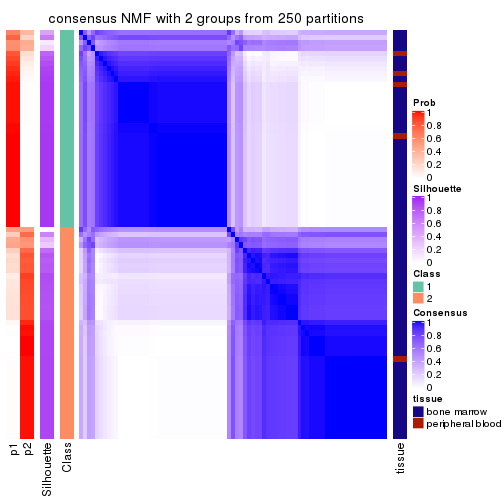</p>

</div>
<div id='tab-MAD-NMF-consensus-heatmap-2'>
<pre><code class="r">consensus_heatmap(res, k = 3)
</code></pre>

<p>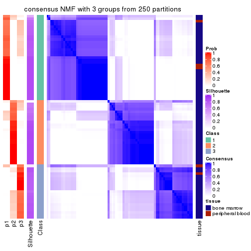</p>

</div>
<div id='tab-MAD-NMF-consensus-heatmap-3'>
<pre><code class="r">consensus_heatmap(res, k = 4)
</code></pre>

<p>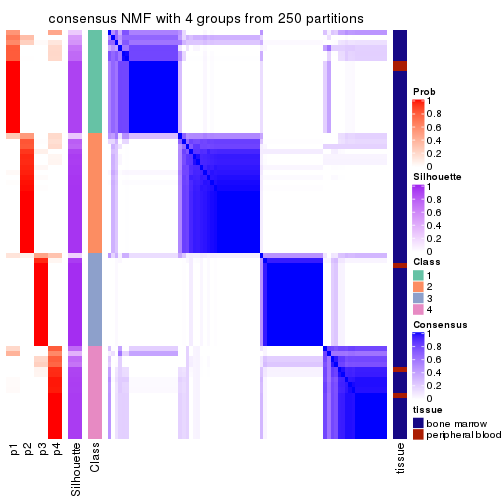</p>

</div>
<div id='tab-MAD-NMF-consensus-heatmap-4'>
<pre><code class="r">consensus_heatmap(res, k = 5)
</code></pre>

<p>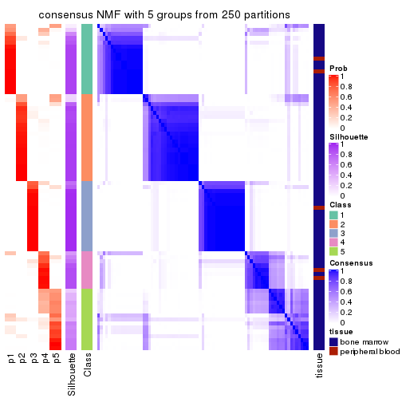</p>

</div>
<div id='tab-MAD-NMF-consensus-heatmap-5'>
<pre><code class="r">consensus_heatmap(res, k = 6)
</code></pre>

<p>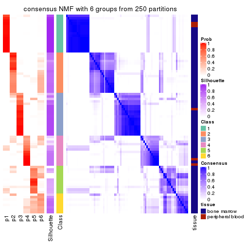</p>

</div>
</div>

Heatmaps for the membership of samples in all partitions to see how consistent they are:


<script>
$( function() {
	$( '#tabs-MAD-NMF-membership-heatmap' ).tabs();
} );
</script>
<div id='tabs-MAD-NMF-membership-heatmap'>
<ul>
<li><a href='#tab-MAD-NMF-membership-heatmap-1'>k = 2</a></li>
<li><a href='#tab-MAD-NMF-membership-heatmap-2'>k = 3</a></li>
<li><a href='#tab-MAD-NMF-membership-heatmap-3'>k = 4</a></li>
<li><a href='#tab-MAD-NMF-membership-heatmap-4'>k = 5</a></li>
<li><a href='#tab-MAD-NMF-membership-heatmap-5'>k = 6</a></li>
</ul>
<div id='tab-MAD-NMF-membership-heatmap-1'>
<pre><code class="r">membership_heatmap(res, k = 2)
</code></pre>

<p>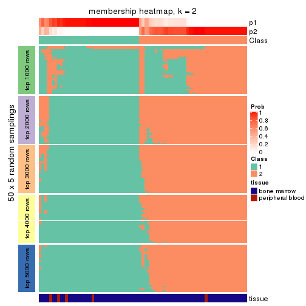</p>

</div>
<div id='tab-MAD-NMF-membership-heatmap-2'>
<pre><code class="r">membership_heatmap(res, k = 3)
</code></pre>

<p>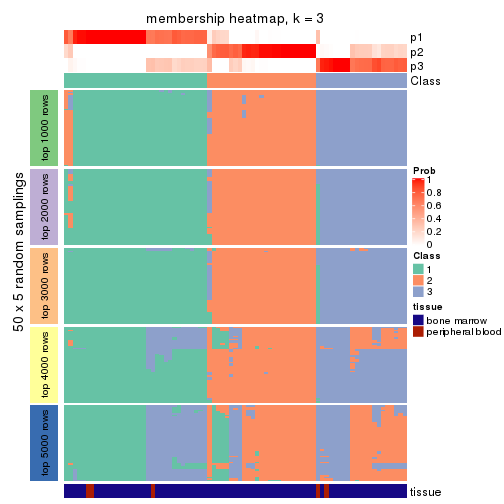</p>

</div>
<div id='tab-MAD-NMF-membership-heatmap-3'>
<pre><code class="r">membership_heatmap(res, k = 4)
</code></pre>

<p>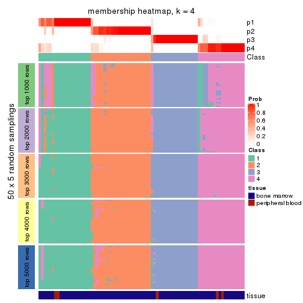</p>

</div>
<div id='tab-MAD-NMF-membership-heatmap-4'>
<pre><code class="r">membership_heatmap(res, k = 5)
</code></pre>

<p>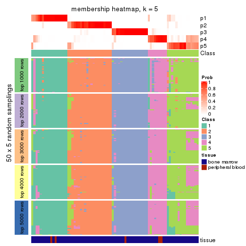</p>

</div>
<div id='tab-MAD-NMF-membership-heatmap-5'>
<pre><code class="r">membership_heatmap(res, k = 6)
</code></pre>

<p>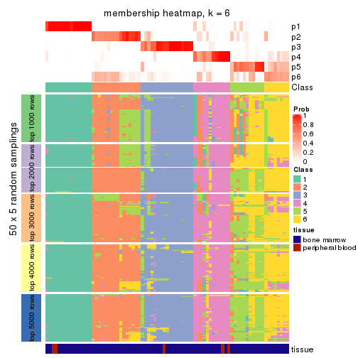</p>

</div>
</div>

As soon as we have had the classes for columns, we can look for signatures
which are significantly different between classes which can be candidate marks
for certain classes. Following are the heatmaps for signatures.


Signature heatmaps where rows are scaled:


<script>
$( function() {
	$( '#tabs-MAD-NMF-get-signatures' ).tabs();
} );
</script>
<div id='tabs-MAD-NMF-get-signatures'>
<ul>
<li><a href='#tab-MAD-NMF-get-signatures-1'>k = 2</a></li>
<li><a href='#tab-MAD-NMF-get-signatures-2'>k = 3</a></li>
<li><a href='#tab-MAD-NMF-get-signatures-3'>k = 4</a></li>
<li><a href='#tab-MAD-NMF-get-signatures-4'>k = 5</a></li>
<li><a href='#tab-MAD-NMF-get-signatures-5'>k = 6</a></li>
</ul>
<div id='tab-MAD-NMF-get-signatures-1'>
<pre><code class="r">get_signatures(res, k = 2)
</code></pre>

<p>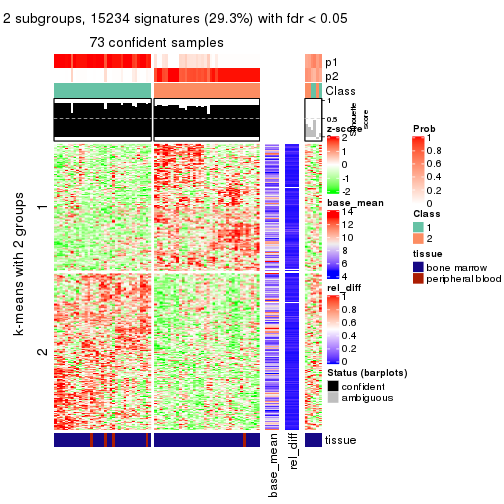</p>

</div>
<div id='tab-MAD-NMF-get-signatures-2'>
<pre><code class="r">get_signatures(res, k = 3)
</code></pre>

<p>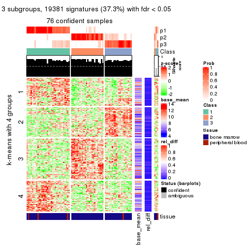</p>

</div>
<div id='tab-MAD-NMF-get-signatures-3'>
<pre><code class="r">get_signatures(res, k = 4)
</code></pre>

<p>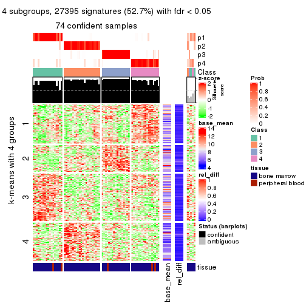</p>

</div>
<div id='tab-MAD-NMF-get-signatures-4'>
<pre><code class="r">get_signatures(res, k = 5)
</code></pre>

<p>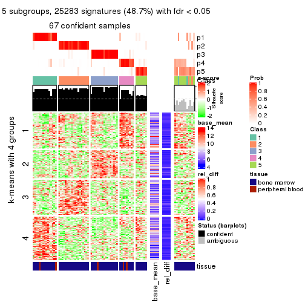</p>

</div>
<div id='tab-MAD-NMF-get-signatures-5'>
<pre><code class="r">get_signatures(res, k = 6)
</code></pre>

<p>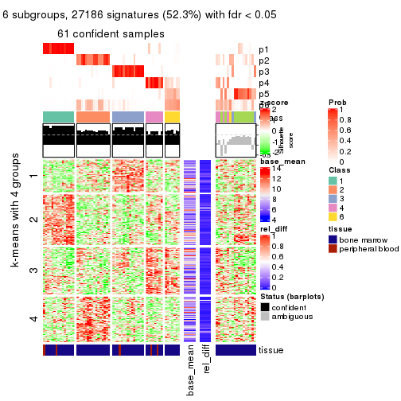</p>

</div>
</div>


Signature heatmaps where rows are not scaled:


<script>
$( function() {
	$( '#tabs-MAD-NMF-get-signatures-no-scale' ).tabs();
} );
</script>
<div id='tabs-MAD-NMF-get-signatures-no-scale'>
<ul>
<li><a href='#tab-MAD-NMF-get-signatures-no-scale-1'>k = 2</a></li>
<li><a href='#tab-MAD-NMF-get-signatures-no-scale-2'>k = 3</a></li>
<li><a href='#tab-MAD-NMF-get-signatures-no-scale-3'>k = 4</a></li>
<li><a href='#tab-MAD-NMF-get-signatures-no-scale-4'>k = 5</a></li>
<li><a href='#tab-MAD-NMF-get-signatures-no-scale-5'>k = 6</a></li>
</ul>
<div id='tab-MAD-NMF-get-signatures-no-scale-1'>
<pre><code class="r">get_signatures(res, k = 2, scale_rows = FALSE)
</code></pre>

<p>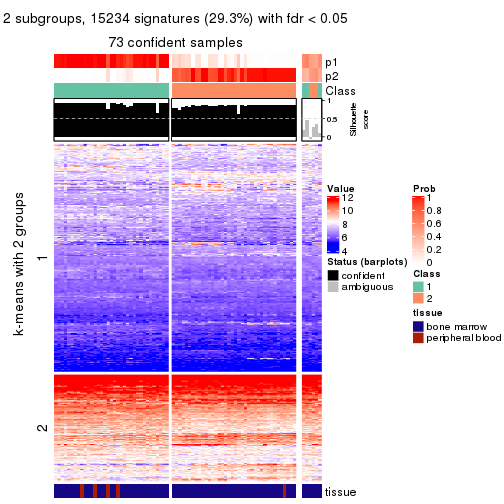</p>

</div>
<div id='tab-MAD-NMF-get-signatures-no-scale-2'>
<pre><code class="r">get_signatures(res, k = 3, scale_rows = FALSE)
</code></pre>

<p>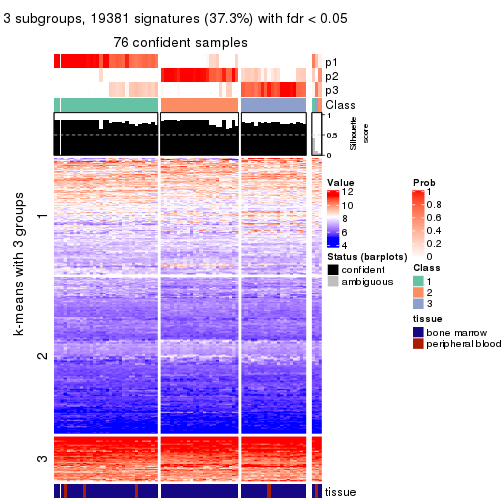</p>

</div>
<div id='tab-MAD-NMF-get-signatures-no-scale-3'>
<pre><code class="r">get_signatures(res, k = 4, scale_rows = FALSE)
</code></pre>

<p>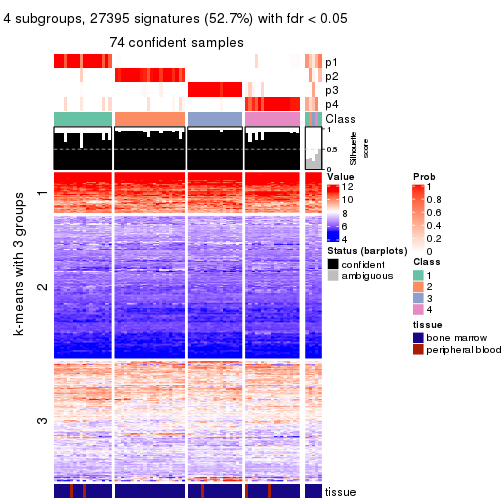</p>

</div>
<div id='tab-MAD-NMF-get-signatures-no-scale-4'>
<pre><code class="r">get_signatures(res, k = 5, scale_rows = FALSE)
</code></pre>

<p>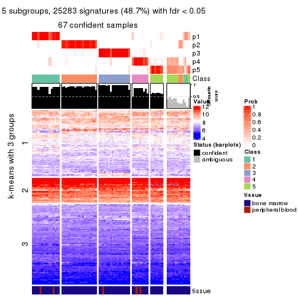</p>

</div>
<div id='tab-MAD-NMF-get-signatures-no-scale-5'>
<pre><code class="r">get_signatures(res, k = 6, scale_rows = FALSE)
</code></pre>

<p>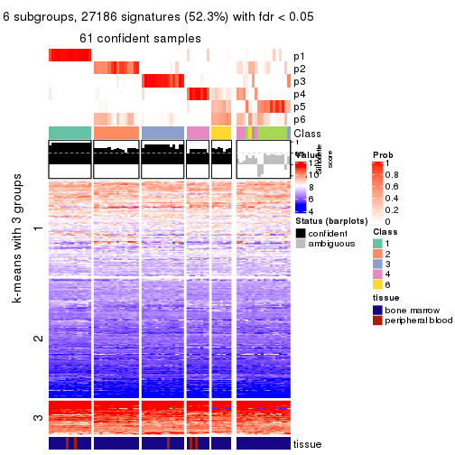</p>

</div>
</div>


Compare the overlap of signatures from different k:

```r
compare_signatures(res)
```

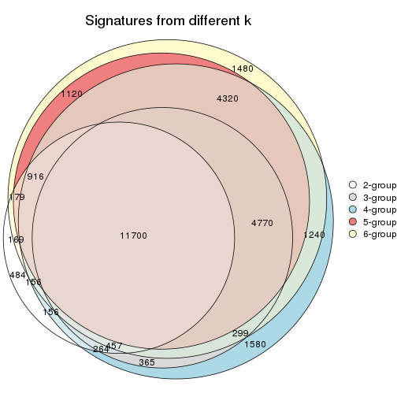

`get_signature()` returns a data frame invisibly. TO get the list of signatures, the function
call should be assigned to a variable explicitly. In following code, if `plot` argument is set
to `FALSE`, no heatmap is plotted while only the differential analysis is performed.

```r
# code only for demonstration
tb = get_signature(res, k = ..., plot = FALSE)
```

An example of the output of `tb` is:

```
#>   which_row         fdr    mean_1    mean_2 scaled_mean_1 scaled_mean_2 km
#> 1        38 0.042760348  8.373488  9.131774    -0.5533452     0.5164555  1
#> 2        40 0.018707592  7.106213  8.469186    -0.6173731     0.5762149  1
#> 3        55 0.019134737 10.221463 11.207825    -0.6159697     0.5749050  1
#> 4        59 0.006059896  5.921854  7.869574    -0.6899429     0.6439467  1
#> 5        60 0.018055526  8.928898 10.211722    -0.6204761     0.5791110  1
#> 6        98 0.009384629 15.714769 14.887706     0.6635654    -0.6193277  2
...
```

The columns in `tb` are:

1. `which_row`: row indices corresponding to the input matrix.
2. `fdr`: FDR for the differential test. 
3. `mean_x`: The mean value in group x.
4. `scaled_mean_x`: The mean value in group x after rows are scaled.
5. `km`: Row groups if k-means clustering is applied to rows.


UMAP plot which shows how samples are separated.


<script>
$( function() {
	$( '#tabs-MAD-NMF-dimension-reduction' ).tabs();
} );
</script>
<div id='tabs-MAD-NMF-dimension-reduction'>
<ul>
<li><a href='#tab-MAD-NMF-dimension-reduction-1'>k = 2</a></li>
<li><a href='#tab-MAD-NMF-dimension-reduction-2'>k = 3</a></li>
<li><a href='#tab-MAD-NMF-dimension-reduction-3'>k = 4</a></li>
<li><a href='#tab-MAD-NMF-dimension-reduction-4'>k = 5</a></li>
<li><a href='#tab-MAD-NMF-dimension-reduction-5'>k = 6</a></li>
</ul>
<div id='tab-MAD-NMF-dimension-reduction-1'>
<pre><code class="r">dimension_reduction(res, k = 2, method = &quot;UMAP&quot;)
</code></pre>

<p>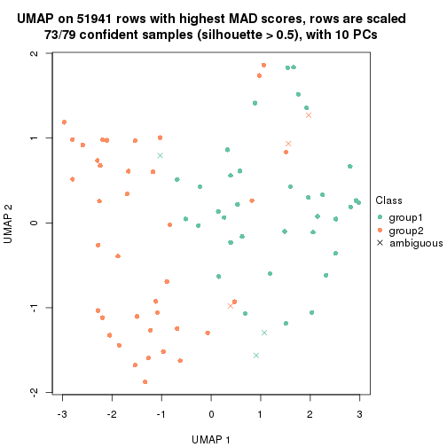</p>

</div>
<div id='tab-MAD-NMF-dimension-reduction-2'>
<pre><code class="r">dimension_reduction(res, k = 3, method = &quot;UMAP&quot;)
</code></pre>

<p>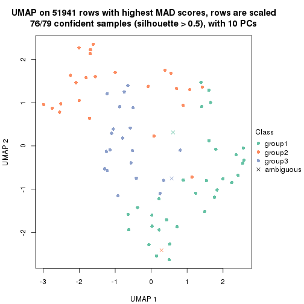</p>

</div>
<div id='tab-MAD-NMF-dimension-reduction-3'>
<pre><code class="r">dimension_reduction(res, k = 4, method = &quot;UMAP&quot;)
</code></pre>

<p>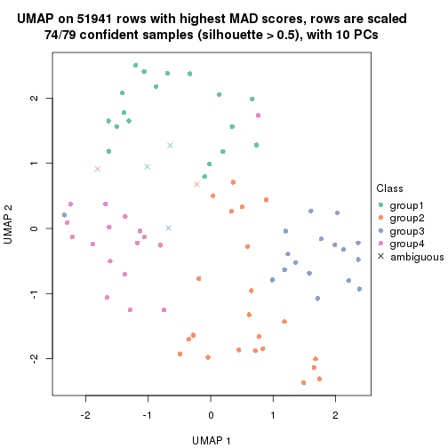</p>

</div>
<div id='tab-MAD-NMF-dimension-reduction-4'>
<pre><code class="r">dimension_reduction(res, k = 5, method = &quot;UMAP&quot;)
</code></pre>

<p>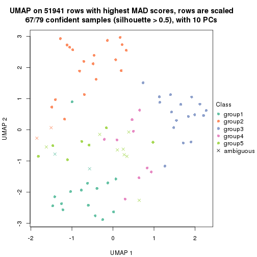</p>

</div>
<div id='tab-MAD-NMF-dimension-reduction-5'>
<pre><code class="r">dimension_reduction(res, k = 6, method = &quot;UMAP&quot;)
</code></pre>

<p>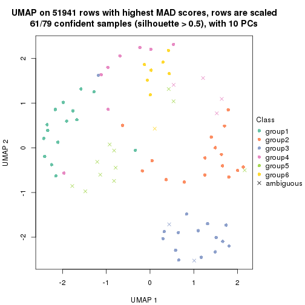</p>

</div>
</div>


Following heatmap shows how subgroups are split when increasing `k`:

```r
collect_classes(res)
```

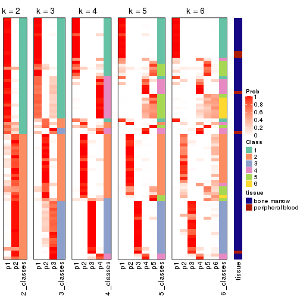


Test correlation between subgroups and known annotations. If the known
annotation is numeric, one-way ANOVA test is applied, and if the known
annotation is discrete, chi-squared contingency table test is applied.

```r
test_to_known_factors(res)
```

```
#>          n tissue(p) k
#> MAD:NMF 73     0.306 2
#> MAD:NMF 76     0.298 3
#> MAD:NMF 74     0.418 4
#> MAD:NMF 67     0.219 5
#> MAD:NMF 61     0.229 6
```


If matrix rows can be associated to genes, consider to use `GO_Enrichment(res,
...)` to perform function enrichment for the signature genes.


 

---------------------------------------------------


### ATC:hclust


The object with results only for a single top-value method and a single partition method 
can be extracted as:

```r
res = res_list["ATC", "hclust"]
# you can also extract it by
# res = res_list["ATC:hclust"]
```

A summary of `res` and all the functions that can be applied to it:

```r
res
```

```
#> A 'ConsensusPartition' object with k = 2, 3, 4, 5, 6.
#>   On a matrix with 51941 rows and 79 columns.
#>   Top rows (1000, 2000, 3000, 4000, 5000) are extracted by 'ATC' method.
#>   Subgroups are detected by 'hclust' method.
#>   Performed in total 1250 partitions by row resampling.
#>   Best k for subgroups seems to be 2.
#> 
#> Following methods can be applied to this 'ConsensusPartition' object:
#>  [1] "cola_report"             "collect_classes"         "collect_plots"          
#>  [4] "collect_stats"           "colnames"                "compare_signatures"     
#>  [7] "consensus_heatmap"       "dimension_reduction"     "functional_enrichment"  
#> [10] "get_anno_col"            "get_anno"                "get_classes"            
#> [13] "get_consensus"           "get_matrix"              "get_membership"         
#> [16] "get_param"               "get_signatures"          "get_stats"              
#> [19] "is_best_k"               "is_stable_k"             "membership_heatmap"     
#> [22] "ncol"                    "nrow"                    "plot_ecdf"              
#> [25] "rownames"                "select_partition_number" "show"                   
#> [28] "suggest_best_k"          "test_to_known_factors"
```

`collect_plots()` function collects all the plots made from `res` for all `k` (number of partitions)
into one single page to provide an easy and fast comparison between different `k`.

```r
collect_plots(res)
```

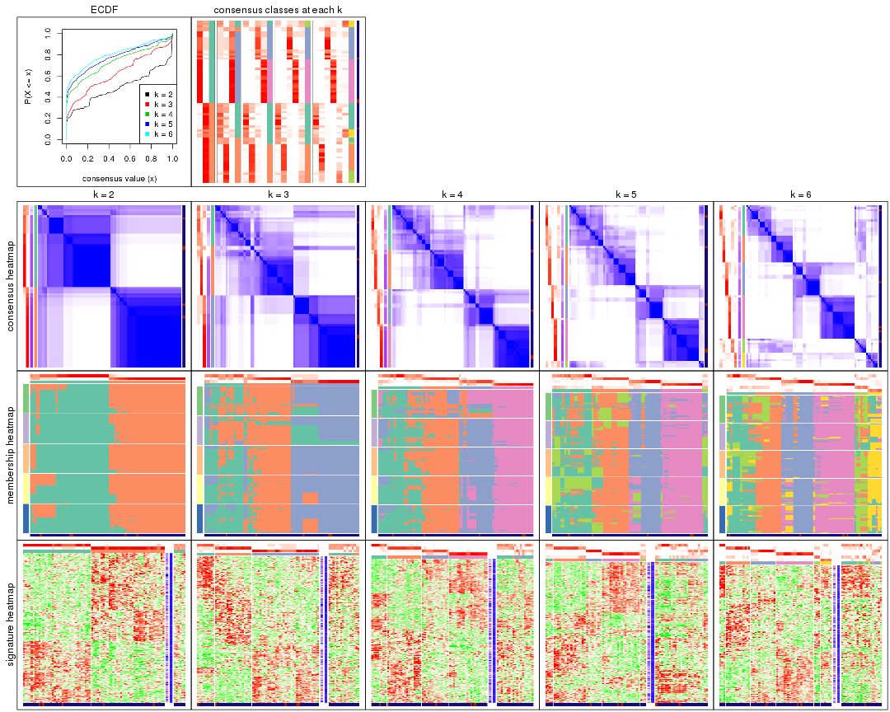

The plots are:

- The first row: a plot of the ECDF (Empirical cumulative distribution
  function) curves of the consensus matrix for each `k` and the heatmap of
  predicted classes for each `k`.
- The second row: heatmaps of the consensus matrix for each `k`.
- The third row: heatmaps of the membership matrix for each `k`.
- The fouth row: heatmaps of the signatures for each `k`.

All the plots in panels can be made by individual functions and they are
plotted later in this section.

`select_partition_number()` produces several plots showing different
statistics for choosing "optimized" `k`. There are following statistics:

- ECDF curves of the consensus matrix for each `k`;
- 1-PAC. [The PAC
  score](https://en.wikipedia.org/wiki/Consensus_clustering#Over-interpretation_potential_of_consensus_clustering)
  measures the proportion of the ambiguous subgrouping.
- Mean silhouette score.
- Concordance. The mean probability of fiting the consensus class ids in all
  partitions.
- Area increased. Denote $A_k$ as the area under the ECDF curve for current
  `k`, the area increased is defined as $A_k - A_{k-1}$.
- Rand index. The percent of pairs of samples that are both in a same cluster
  or both are not in a same cluster in the partition of k and k-1.
- Jaccard index. The ratio of pairs of samples are both in a same cluster in
  the partition of k and k-1 and the pairs of samples are both in a same
  cluster in the partition k or k-1.

The detailed explanations of these statistics can be found in [the cola
vignette](http://bioconductor.org/packages/devel/bioc/vignettes/cola/inst/doc/cola.html#toc_13).

Generally speaking, lower PAC score, higher mean silhouette score or higher
concordance corresponds to better partition. Rand index and Jaccard index
measure how similar the current partition is compared to partition with `k-1`.
If they are too similar, we won't accept `k` is better than `k-1`.

```r
select_partition_number(res)
```

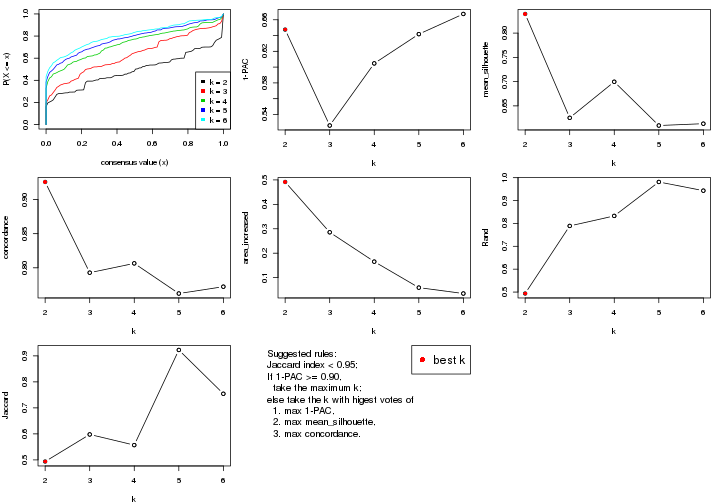

The numeric values for all these statistics can be obtained by `get_stats()`.

```r
get_stats(res)
```

```
#>   k 1-PAC mean_silhouette concordance area_increased  Rand Jaccard
#> 2 2 0.648           0.839       0.926         0.4916 0.494   0.494
#> 3 3 0.526           0.625       0.793         0.2856 0.789   0.598
#> 4 4 0.605           0.700       0.806         0.1655 0.833   0.557
#> 5 5 0.642           0.609       0.762         0.0591 0.981   0.923
#> 6 6 0.667           0.613       0.772         0.0350 0.943   0.754
```

`suggest_best_k()` suggests the best $k$ based on these statistics. The rules are as follows:

- All $k$ with Jaccard index larger than 0.95 are removed because the increase of
  the partition number does not provides enough extra information. If all $k$ are removed,
  the best $k$ is assigned by `NA`.
- For $k$ with 1-PAC larger than 0.9, the maximal $k$ is taken as the "best k". Other $k$ is called "optional k".
- If it does not fit the second rule. The $k$ with the highest vote of highest
  1-PAC, mean silhouette and concordance is taken as the "best k".

```r
suggest_best_k(res)
```

```
#> [1] 2
```


Following shows the table of the partitions (You need to click the **show/hide
code output** link to see it). The membership matrix (columns with name `p*`)
is inferred by
[`clue::cl_consensus()`](https://www.rdocumentation.org/link/cl_consensus?package=clue)
function with the `SE` method. Basically the value in the membership matrix
represents the probability to belong to a certain group. The finall class
label for an item is determined with the group with highest probability it
belongs to.

In `get_classes()` function, the entropy is calculated from the membership
matrix and the silhouette score is calculated from the consensus matrix.


<script>
$( function() {
	$( '#tabs-ATC-hclust-get-classes' ).tabs();
} );
</script>
<div id='tabs-ATC-hclust-get-classes'>
<ul>
<li><a href='#tab-ATC-hclust-get-classes-1'>k = 2</a></li>
<li><a href='#tab-ATC-hclust-get-classes-2'>k = 3</a></li>
<li><a href='#tab-ATC-hclust-get-classes-3'>k = 4</a></li>
<li><a href='#tab-ATC-hclust-get-classes-4'>k = 5</a></li>
<li><a href='#tab-ATC-hclust-get-classes-5'>k = 6</a></li>
</ul>

<div id='tab-ATC-hclust-get-classes-1'>
<p><a id='tab-ATC-hclust-get-classes-1-a' style='color:#0366d6' href='#'>show/hide code output</a></p>
<pre><code class="r">cbind(get_classes(res, k = 2), get_membership(res, k = 2))
</code></pre>

<pre><code>#&gt;           class entropy silhouette    p1    p2
#&gt; GSM316652     2  0.0938      0.946 0.012 0.988
#&gt; GSM316653     1  0.2043      0.872 0.968 0.032
#&gt; GSM316654     1  0.2603      0.868 0.956 0.044
#&gt; GSM316655     1  0.2603      0.868 0.956 0.044
#&gt; GSM316656     2  0.3431      0.905 0.064 0.936
#&gt; GSM316657     2  0.2948      0.915 0.052 0.948
#&gt; GSM316658     2  0.0672      0.949 0.008 0.992
#&gt; GSM316659     1  0.0000      0.879 1.000 0.000
#&gt; GSM316660     2  0.0000      0.953 0.000 1.000
#&gt; GSM316661     1  0.0000      0.879 1.000 0.000
#&gt; GSM316662     2  0.0000      0.953 0.000 1.000
#&gt; GSM316663     1  0.0000      0.879 1.000 0.000
#&gt; GSM316664     1  0.0000      0.879 1.000 0.000
#&gt; GSM316665     2  0.0672      0.949 0.008 0.992
#&gt; GSM316666     1  0.7528      0.759 0.784 0.216
#&gt; GSM316667     2  0.0000      0.953 0.000 1.000
#&gt; GSM316668     1  0.9993      0.218 0.516 0.484
#&gt; GSM316669     1  0.0672      0.878 0.992 0.008
#&gt; GSM316670     1  0.7528      0.759 0.784 0.216
#&gt; GSM316671     2  0.0000      0.953 0.000 1.000
#&gt; GSM316672     2  0.0000      0.953 0.000 1.000
#&gt; GSM316673     1  0.9909      0.304 0.556 0.444
#&gt; GSM316674     1  0.9963      0.283 0.536 0.464
#&gt; GSM316676     1  0.7528      0.759 0.784 0.216
#&gt; GSM316677     2  0.9460      0.359 0.364 0.636
#&gt; GSM316678     2  0.0000      0.953 0.000 1.000
#&gt; GSM316679     2  0.0000      0.953 0.000 1.000
#&gt; GSM316680     2  0.0000      0.953 0.000 1.000
#&gt; GSM316681     2  0.0000      0.953 0.000 1.000
#&gt; GSM316682     1  0.0000      0.879 1.000 0.000
#&gt; GSM316683     1  0.0000      0.879 1.000 0.000
#&gt; GSM316684     2  0.0672      0.949 0.008 0.992
#&gt; GSM316685     2  0.0000      0.953 0.000 1.000
#&gt; GSM316686     1  0.0000      0.879 1.000 0.000
#&gt; GSM316687     1  1.0000      0.138 0.504 0.496
#&gt; GSM316688     2  0.6438      0.777 0.164 0.836
#&gt; GSM316689     2  0.8763      0.533 0.296 0.704
#&gt; GSM316690     1  0.0000      0.879 1.000 0.000
#&gt; GSM316691     1  0.7528      0.759 0.784 0.216
#&gt; GSM316692     1  0.0000      0.879 1.000 0.000
#&gt; GSM316693     1  0.0000      0.879 1.000 0.000
#&gt; GSM316694     1  0.7528      0.759 0.784 0.216
#&gt; GSM316696     2  0.8763      0.533 0.296 0.704
#&gt; GSM316697     1  0.7528      0.759 0.784 0.216
#&gt; GSM316698     2  0.0000      0.953 0.000 1.000
#&gt; GSM316699     1  0.6438      0.786 0.836 0.164
#&gt; GSM316700     1  0.0000      0.879 1.000 0.000
#&gt; GSM316701     1  0.2603      0.868 0.956 0.044
#&gt; GSM316703     1  0.0000      0.879 1.000 0.000
#&gt; GSM316704     1  0.0000      0.879 1.000 0.000
#&gt; GSM316705     1  0.0000      0.879 1.000 0.000
#&gt; GSM316706     1  0.0000      0.879 1.000 0.000
#&gt; GSM316707     2  0.0672      0.949 0.008 0.992
#&gt; GSM316708     2  0.0000      0.953 0.000 1.000
#&gt; GSM316709     1  0.7528      0.759 0.784 0.216
#&gt; GSM316710     1  0.0000      0.879 1.000 0.000
#&gt; GSM316711     1  0.1633      0.874 0.976 0.024
#&gt; GSM316713     2  0.5408      0.836 0.124 0.876
#&gt; GSM316714     1  0.0000      0.879 1.000 0.000
#&gt; GSM316715     2  0.0000      0.953 0.000 1.000
#&gt; GSM316716     2  0.0000      0.953 0.000 1.000
#&gt; GSM316717     2  0.0000      0.953 0.000 1.000
#&gt; GSM316718     2  0.0000      0.953 0.000 1.000
#&gt; GSM316719     2  0.0000      0.953 0.000 1.000
#&gt; GSM316720     2  0.0000      0.953 0.000 1.000
#&gt; GSM316721     2  0.0000      0.953 0.000 1.000
#&gt; GSM316722     2  0.0000      0.953 0.000 1.000
#&gt; GSM316723     2  0.0000      0.953 0.000 1.000
#&gt; GSM316724     2  0.0000      0.953 0.000 1.000
#&gt; GSM316726     2  0.0000      0.953 0.000 1.000
#&gt; GSM316727     2  0.0000      0.953 0.000 1.000
#&gt; GSM316728     1  0.0000      0.879 1.000 0.000
#&gt; GSM316729     2  0.3274      0.909 0.060 0.940
#&gt; GSM316730     1  0.9552      0.466 0.624 0.376
#&gt; GSM316675     1  0.7528      0.759 0.784 0.216
#&gt; GSM316695     2  0.0000      0.953 0.000 1.000
#&gt; GSM316702     1  0.0000      0.879 1.000 0.000
#&gt; GSM316712     2  0.2948      0.915 0.052 0.948
#&gt; GSM316725     1  0.0000      0.879 1.000 0.000
</code></pre>

<script>
$('#tab-ATC-hclust-get-classes-1-a').parent().next().next().hide();
$('#tab-ATC-hclust-get-classes-1-a').click(function(){
  $('#tab-ATC-hclust-get-classes-1-a').parent().next().next().toggle();
  return(false);
});
</script>
</div>

<div id='tab-ATC-hclust-get-classes-2'>
<p><a id='tab-ATC-hclust-get-classes-2-a' style='color:#0366d6' href='#'>show/hide code output</a></p>
<pre><code class="r">cbind(get_classes(res, k = 3), get_membership(res, k = 3))
</code></pre>

<pre><code>#&gt;           class entropy silhouette    p1    p2    p3
#&gt; GSM316652     2  0.2878     0.7500 0.096 0.904 0.000
#&gt; GSM316653     3  0.4521     0.7953 0.180 0.004 0.816
#&gt; GSM316654     3  0.4915     0.7897 0.184 0.012 0.804
#&gt; GSM316655     3  0.4915     0.7897 0.184 0.012 0.804
#&gt; GSM316656     1  0.7828     0.3017 0.500 0.448 0.052
#&gt; GSM316657     1  0.7085     0.4576 0.612 0.356 0.032
#&gt; GSM316658     2  0.1289     0.7785 0.032 0.968 0.000
#&gt; GSM316659     3  0.0592     0.8614 0.012 0.000 0.988
#&gt; GSM316660     2  0.5138     0.5119 0.252 0.748 0.000
#&gt; GSM316661     3  0.0000     0.8626 0.000 0.000 1.000
#&gt; GSM316662     2  0.0747     0.7829 0.016 0.984 0.000
#&gt; GSM316663     3  0.0000     0.8626 0.000 0.000 1.000
#&gt; GSM316664     3  0.0000     0.8626 0.000 0.000 1.000
#&gt; GSM316665     2  0.1289     0.7785 0.032 0.968 0.000
#&gt; GSM316666     3  0.8355     0.6573 0.184 0.188 0.628
#&gt; GSM316667     2  0.1529     0.7767 0.040 0.960 0.000
#&gt; GSM316668     2  0.8932    -0.1429 0.124 0.456 0.420
#&gt; GSM316669     3  0.1529     0.8526 0.040 0.000 0.960
#&gt; GSM316670     3  0.8355     0.6573 0.184 0.188 0.628
#&gt; GSM316671     2  0.0747     0.7829 0.016 0.984 0.000
#&gt; GSM316672     2  0.6244    -0.0969 0.440 0.560 0.000
#&gt; GSM316673     1  0.6468     0.0391 0.552 0.004 0.444
#&gt; GSM316674     2  0.9151    -0.1897 0.144 0.436 0.420
#&gt; GSM316676     3  0.8355     0.6573 0.184 0.188 0.628
#&gt; GSM316677     1  0.6798     0.4761 0.696 0.048 0.256
#&gt; GSM316678     2  0.1529     0.7767 0.040 0.960 0.000
#&gt; GSM316679     1  0.6302     0.2338 0.520 0.480 0.000
#&gt; GSM316680     1  0.6267     0.2058 0.548 0.452 0.000
#&gt; GSM316681     2  0.2356     0.7598 0.072 0.928 0.000
#&gt; GSM316682     3  0.0000     0.8626 0.000 0.000 1.000
#&gt; GSM316683     3  0.0000     0.8626 0.000 0.000 1.000
#&gt; GSM316684     2  0.1289     0.7785 0.032 0.968 0.000
#&gt; GSM316685     2  0.1031     0.7817 0.024 0.976 0.000
#&gt; GSM316686     3  0.0000     0.8626 0.000 0.000 1.000
#&gt; GSM316687     1  0.6314     0.2080 0.604 0.004 0.392
#&gt; GSM316688     1  0.8355     0.5393 0.616 0.244 0.140
#&gt; GSM316689     1  0.6059     0.5517 0.764 0.048 0.188
#&gt; GSM316690     3  0.0000     0.8626 0.000 0.000 1.000
#&gt; GSM316691     3  0.8355     0.6573 0.184 0.188 0.628
#&gt; GSM316692     3  0.0000     0.8626 0.000 0.000 1.000
#&gt; GSM316693     3  0.0000     0.8626 0.000 0.000 1.000
#&gt; GSM316694     3  0.8355     0.6573 0.184 0.188 0.628
#&gt; GSM316696     1  0.6059     0.5517 0.764 0.048 0.188
#&gt; GSM316697     3  0.8355     0.6573 0.184 0.188 0.628
#&gt; GSM316698     2  0.1529     0.7767 0.040 0.960 0.000
#&gt; GSM316699     3  0.7493     0.6892 0.168 0.136 0.696
#&gt; GSM316700     3  0.0000     0.8626 0.000 0.000 1.000
#&gt; GSM316701     3  0.4915     0.7897 0.184 0.012 0.804
#&gt; GSM316703     3  0.0592     0.8614 0.012 0.000 0.988
#&gt; GSM316704     3  0.0592     0.8614 0.012 0.000 0.988
#&gt; GSM316705     3  0.0000     0.8626 0.000 0.000 1.000
#&gt; GSM316706     3  0.0424     0.8617 0.008 0.000 0.992
#&gt; GSM316707     2  0.1289     0.7785 0.032 0.968 0.000
#&gt; GSM316708     1  0.6305     0.2259 0.516 0.484 0.000
#&gt; GSM316709     3  0.8355     0.6573 0.184 0.188 0.628
#&gt; GSM316710     3  0.0000     0.8626 0.000 0.000 1.000
#&gt; GSM316711     3  0.4453     0.8082 0.152 0.012 0.836
#&gt; GSM316713     1  0.4058     0.5853 0.880 0.076 0.044
#&gt; GSM316714     3  0.0000     0.8626 0.000 0.000 1.000
#&gt; GSM316715     1  0.4121     0.5723 0.832 0.168 0.000
#&gt; GSM316716     2  0.0892     0.7826 0.020 0.980 0.000
#&gt; GSM316717     1  0.6302     0.2338 0.520 0.480 0.000
#&gt; GSM316718     2  0.6244    -0.0969 0.440 0.560 0.000
#&gt; GSM316719     1  0.4235     0.5710 0.824 0.176 0.000
#&gt; GSM316720     1  0.4235     0.5710 0.824 0.176 0.000
#&gt; GSM316721     2  0.0237     0.7837 0.004 0.996 0.000
#&gt; GSM316722     2  0.6286    -0.0691 0.464 0.536 0.000
#&gt; GSM316723     2  0.0237     0.7837 0.004 0.996 0.000
#&gt; GSM316724     2  0.0237     0.7837 0.004 0.996 0.000
#&gt; GSM316726     2  0.0237     0.7837 0.004 0.996 0.000
#&gt; GSM316727     1  0.4291     0.5695 0.820 0.180 0.000
#&gt; GSM316728     3  0.0000     0.8626 0.000 0.000 1.000
#&gt; GSM316729     1  0.7740     0.3092 0.508 0.444 0.048
#&gt; GSM316730     1  0.7292    -0.1919 0.500 0.028 0.472
#&gt; GSM316675     3  0.8355     0.6573 0.184 0.188 0.628
#&gt; GSM316695     2  0.3816     0.6582 0.148 0.852 0.000
#&gt; GSM316702     3  0.0000     0.8626 0.000 0.000 1.000
#&gt; GSM316712     1  0.5940     0.5765 0.760 0.204 0.036
#&gt; GSM316725     3  0.0000     0.8626 0.000 0.000 1.000
</code></pre>

<script>
$('#tab-ATC-hclust-get-classes-2-a').parent().next().next().hide();
$('#tab-ATC-hclust-get-classes-2-a').click(function(){
  $('#tab-ATC-hclust-get-classes-2-a').parent().next().next().toggle();
  return(false);
});
</script>
</div>

<div id='tab-ATC-hclust-get-classes-3'>
<p><a id='tab-ATC-hclust-get-classes-3-a' style='color:#0366d6' href='#'>show/hide code output</a></p>
<pre><code class="r">cbind(get_classes(res, k = 4), get_membership(res, k = 4))
</code></pre>

<pre><code>#&gt;           class entropy silhouette    p1    p2    p3    p4
#&gt; GSM316652     2  0.3894     0.8164 0.088 0.844 0.068 0.000
#&gt; GSM316653     3  0.4677     0.6782 0.004 0.000 0.680 0.316
#&gt; GSM316654     3  0.4560     0.7020 0.004 0.000 0.700 0.296
#&gt; GSM316655     3  0.4560     0.7020 0.004 0.000 0.700 0.296
#&gt; GSM316656     1  0.6953     0.4823 0.536 0.336 0.128 0.000
#&gt; GSM316657     1  0.5825     0.5916 0.664 0.268 0.068 0.000
#&gt; GSM316658     2  0.1716     0.8635 0.000 0.936 0.064 0.000
#&gt; GSM316659     4  0.1302     0.9169 0.000 0.000 0.044 0.956
#&gt; GSM316660     2  0.4699     0.4807 0.320 0.676 0.004 0.000
#&gt; GSM316661     4  0.0592     0.9332 0.000 0.000 0.016 0.984
#&gt; GSM316662     2  0.3312     0.8602 0.052 0.876 0.072 0.000
#&gt; GSM316663     4  0.0817     0.9286 0.000 0.000 0.024 0.976
#&gt; GSM316664     4  0.0000     0.9342 0.000 0.000 0.000 1.000
#&gt; GSM316665     2  0.1716     0.8635 0.000 0.936 0.064 0.000
#&gt; GSM316666     3  0.2867     0.7910 0.000 0.012 0.884 0.104
#&gt; GSM316667     2  0.2053     0.8545 0.072 0.924 0.004 0.000
#&gt; GSM316668     3  0.4576     0.4804 0.020 0.232 0.748 0.000
#&gt; GSM316669     4  0.5163    -0.2941 0.004 0.000 0.480 0.516
#&gt; GSM316670     3  0.2408     0.7963 0.000 0.000 0.896 0.104
#&gt; GSM316671     2  0.3312     0.8602 0.052 0.876 0.072 0.000
#&gt; GSM316672     1  0.5163     0.2908 0.516 0.480 0.004 0.000
#&gt; GSM316673     1  0.7630    -0.0378 0.428 0.000 0.364 0.208
#&gt; GSM316674     3  0.3873     0.5141 0.000 0.228 0.772 0.000
#&gt; GSM316676     3  0.2408     0.7963 0.000 0.000 0.896 0.104
#&gt; GSM316677     1  0.5582     0.3614 0.620 0.000 0.348 0.032
#&gt; GSM316678     2  0.2053     0.8545 0.072 0.924 0.004 0.000
#&gt; GSM316679     1  0.4872     0.4792 0.640 0.356 0.004 0.000
#&gt; GSM316680     1  0.4560     0.4414 0.700 0.296 0.004 0.000
#&gt; GSM316681     2  0.3935     0.8399 0.100 0.840 0.060 0.000
#&gt; GSM316682     4  0.0000     0.9342 0.000 0.000 0.000 1.000
#&gt; GSM316683     4  0.0336     0.9341 0.000 0.000 0.008 0.992
#&gt; GSM316684     2  0.1716     0.8635 0.000 0.936 0.064 0.000
#&gt; GSM316685     2  0.1474     0.8671 0.000 0.948 0.052 0.000
#&gt; GSM316686     4  0.0592     0.9332 0.000 0.000 0.016 0.984
#&gt; GSM316687     1  0.7432     0.1171 0.480 0.000 0.336 0.184
#&gt; GSM316688     1  0.6476     0.6097 0.644 0.176 0.180 0.000
#&gt; GSM316689     1  0.4844     0.4648 0.688 0.000 0.300 0.012
#&gt; GSM316690     4  0.2704     0.8215 0.000 0.000 0.124 0.876
#&gt; GSM316691     3  0.2408     0.7963 0.000 0.000 0.896 0.104
#&gt; GSM316692     4  0.2704     0.8215 0.000 0.000 0.124 0.876
#&gt; GSM316693     4  0.0000     0.9342 0.000 0.000 0.000 1.000
#&gt; GSM316694     3  0.2408     0.7963 0.000 0.000 0.896 0.104
#&gt; GSM316696     1  0.4844     0.4648 0.688 0.000 0.300 0.012
#&gt; GSM316697     3  0.2408     0.7963 0.000 0.000 0.896 0.104
#&gt; GSM316698     2  0.2053     0.8545 0.072 0.924 0.004 0.000
#&gt; GSM316699     3  0.6483     0.5045 0.000 0.092 0.584 0.324
#&gt; GSM316700     4  0.0592     0.9332 0.000 0.000 0.016 0.984
#&gt; GSM316701     3  0.4560     0.7020 0.004 0.000 0.700 0.296
#&gt; GSM316703     4  0.1302     0.9169 0.000 0.000 0.044 0.956
#&gt; GSM316704     4  0.1302     0.9169 0.000 0.000 0.044 0.956
#&gt; GSM316705     4  0.0592     0.9332 0.000 0.000 0.016 0.984
#&gt; GSM316706     4  0.1211     0.9197 0.000 0.000 0.040 0.960
#&gt; GSM316707     2  0.1716     0.8635 0.000 0.936 0.064 0.000
#&gt; GSM316708     1  0.4889     0.4749 0.636 0.360 0.004 0.000
#&gt; GSM316709     3  0.2408     0.7963 0.000 0.000 0.896 0.104
#&gt; GSM316710     4  0.0000     0.9342 0.000 0.000 0.000 1.000
#&gt; GSM316711     3  0.5151     0.3484 0.000 0.004 0.532 0.464
#&gt; GSM316713     1  0.2921     0.6168 0.860 0.000 0.140 0.000
#&gt; GSM316714     4  0.0336     0.9348 0.000 0.000 0.008 0.992
#&gt; GSM316715     1  0.0188     0.6539 0.996 0.000 0.004 0.000
#&gt; GSM316716     2  0.1474     0.8694 0.000 0.948 0.052 0.000
#&gt; GSM316717     1  0.4872     0.4792 0.640 0.356 0.004 0.000
#&gt; GSM316718     1  0.5163     0.2908 0.516 0.480 0.004 0.000
#&gt; GSM316719     1  0.0188     0.6542 0.996 0.004 0.000 0.000
#&gt; GSM316720     1  0.0188     0.6542 0.996 0.004 0.000 0.000
#&gt; GSM316721     2  0.2376     0.8636 0.016 0.916 0.068 0.000
#&gt; GSM316722     1  0.5536     0.2846 0.592 0.384 0.024 0.000
#&gt; GSM316723     2  0.2376     0.8636 0.016 0.916 0.068 0.000
#&gt; GSM316724     2  0.2376     0.8636 0.016 0.916 0.068 0.000
#&gt; GSM316726     2  0.2376     0.8636 0.016 0.916 0.068 0.000
#&gt; GSM316727     1  0.0336     0.6541 0.992 0.008 0.000 0.000
#&gt; GSM316728     4  0.0336     0.9348 0.000 0.000 0.008 0.992
#&gt; GSM316729     1  0.6868     0.4864 0.544 0.336 0.120 0.000
#&gt; GSM316730     3  0.8343     0.2466 0.328 0.024 0.420 0.228
#&gt; GSM316675     3  0.2408     0.7963 0.000 0.000 0.896 0.104
#&gt; GSM316695     2  0.5172     0.6990 0.188 0.744 0.068 0.000
#&gt; GSM316702     4  0.0000     0.9342 0.000 0.000 0.000 1.000
#&gt; GSM316712     1  0.3474     0.6622 0.868 0.068 0.064 0.000
#&gt; GSM316725     4  0.0000     0.9342 0.000 0.000 0.000 1.000
</code></pre>

<script>
$('#tab-ATC-hclust-get-classes-3-a').parent().next().next().hide();
$('#tab-ATC-hclust-get-classes-3-a').click(function(){
  $('#tab-ATC-hclust-get-classes-3-a').parent().next().next().toggle();
  return(false);
});
</script>
</div>

<div id='tab-ATC-hclust-get-classes-4'>
<p><a id='tab-ATC-hclust-get-classes-4-a' style='color:#0366d6' href='#'>show/hide code output</a></p>
<pre><code class="r">cbind(get_classes(res, k = 5), get_membership(res, k = 5))
</code></pre>

<pre><code>#&gt;           class entropy silhouette    p1    p2    p3    p4    p5
#&gt; GSM316652     2  0.6355      0.523 0.080 0.512 0.032 0.000 0.376
#&gt; GSM316653     3  0.5756      0.453 0.000 0.000 0.620 0.204 0.176
#&gt; GSM316654     3  0.5546      0.489 0.000 0.000 0.648 0.176 0.176
#&gt; GSM316655     3  0.5546      0.489 0.000 0.000 0.648 0.176 0.176
#&gt; GSM316656     1  0.7142      0.473 0.524 0.256 0.060 0.000 0.160
#&gt; GSM316657     1  0.6238      0.511 0.624 0.204 0.032 0.000 0.140
#&gt; GSM316658     2  0.2362      0.747 0.000 0.900 0.024 0.000 0.076
#&gt; GSM316659     4  0.3003      0.854 0.000 0.000 0.092 0.864 0.044
#&gt; GSM316660     2  0.6714      0.163 0.268 0.420 0.000 0.000 0.312
#&gt; GSM316661     4  0.1331      0.901 0.000 0.000 0.040 0.952 0.008
#&gt; GSM316662     2  0.4958      0.590 0.032 0.568 0.000 0.000 0.400
#&gt; GSM316663     4  0.1597      0.889 0.000 0.000 0.048 0.940 0.012
#&gt; GSM316664     4  0.0000      0.901 0.000 0.000 0.000 1.000 0.000
#&gt; GSM316665     2  0.2362      0.747 0.000 0.900 0.024 0.000 0.076
#&gt; GSM316666     3  0.1026      0.705 0.000 0.004 0.968 0.004 0.024
#&gt; GSM316667     2  0.2922      0.717 0.056 0.872 0.000 0.000 0.072
#&gt; GSM316668     3  0.5303      0.441 0.020 0.176 0.708 0.000 0.096
#&gt; GSM316669     4  0.6399     -0.102 0.000 0.000 0.360 0.464 0.176
#&gt; GSM316670     3  0.0162      0.719 0.000 0.000 0.996 0.004 0.000
#&gt; GSM316671     2  0.4958      0.590 0.032 0.568 0.000 0.000 0.400
#&gt; GSM316672     1  0.5867      0.379 0.496 0.404 0.000 0.000 0.100
#&gt; GSM316673     5  0.8050      0.757 0.292 0.000 0.172 0.132 0.404
#&gt; GSM316674     3  0.4748      0.469 0.000 0.172 0.728 0.000 0.100
#&gt; GSM316676     3  0.0162      0.719 0.000 0.000 0.996 0.004 0.000
#&gt; GSM316677     1  0.6256     -0.449 0.480 0.000 0.104 0.012 0.404
#&gt; GSM316678     2  0.2922      0.717 0.056 0.872 0.000 0.000 0.072
#&gt; GSM316679     1  0.5557      0.547 0.624 0.260 0.000 0.000 0.116
#&gt; GSM316680     1  0.4995      0.466 0.668 0.068 0.000 0.000 0.264
#&gt; GSM316681     2  0.5895      0.535 0.084 0.536 0.008 0.000 0.372
#&gt; GSM316682     4  0.0000      0.901 0.000 0.000 0.000 1.000 0.000
#&gt; GSM316683     4  0.0579      0.902 0.000 0.000 0.008 0.984 0.008
#&gt; GSM316684     2  0.2362      0.747 0.000 0.900 0.024 0.000 0.076
#&gt; GSM316685     2  0.2144      0.749 0.000 0.912 0.020 0.000 0.068
#&gt; GSM316686     4  0.1331      0.901 0.000 0.000 0.040 0.952 0.008
#&gt; GSM316687     5  0.8006      0.719 0.340 0.000 0.180 0.112 0.368
#&gt; GSM316688     1  0.6788      0.199 0.528 0.140 0.036 0.000 0.296
#&gt; GSM316689     1  0.5717     -0.230 0.572 0.000 0.104 0.000 0.324
#&gt; GSM316690     4  0.3039      0.794 0.000 0.000 0.152 0.836 0.012
#&gt; GSM316691     3  0.0162      0.719 0.000 0.000 0.996 0.004 0.000
#&gt; GSM316692     4  0.2771      0.815 0.000 0.000 0.128 0.860 0.012
#&gt; GSM316693     4  0.0000      0.901 0.000 0.000 0.000 1.000 0.000
#&gt; GSM316694     3  0.0162      0.719 0.000 0.000 0.996 0.004 0.000
#&gt; GSM316696     1  0.5717     -0.230 0.572 0.000 0.104 0.000 0.324
#&gt; GSM316697     3  0.0162      0.719 0.000 0.000 0.996 0.004 0.000
#&gt; GSM316698     2  0.2922      0.717 0.056 0.872 0.000 0.000 0.072
#&gt; GSM316699     3  0.6621      0.392 0.000 0.080 0.556 0.300 0.064
#&gt; GSM316700     4  0.1331      0.901 0.000 0.000 0.040 0.952 0.008
#&gt; GSM316701     3  0.5546      0.489 0.000 0.000 0.648 0.176 0.176
#&gt; GSM316703     4  0.3003      0.854 0.000 0.000 0.092 0.864 0.044
#&gt; GSM316704     4  0.3003      0.854 0.000 0.000 0.092 0.864 0.044
#&gt; GSM316705     4  0.1331      0.901 0.000 0.000 0.040 0.952 0.008
#&gt; GSM316706     4  0.2376      0.881 0.000 0.000 0.052 0.904 0.044
#&gt; GSM316707     2  0.2362      0.747 0.000 0.900 0.024 0.000 0.076
#&gt; GSM316708     1  0.5579      0.546 0.620 0.264 0.000 0.000 0.116
#&gt; GSM316709     3  0.0162      0.719 0.000 0.000 0.996 0.004 0.000
#&gt; GSM316710     4  0.0000      0.901 0.000 0.000 0.000 1.000 0.000
#&gt; GSM316711     3  0.4961      0.373 0.000 0.004 0.596 0.372 0.028
#&gt; GSM316713     1  0.4125      0.277 0.772 0.000 0.056 0.000 0.172
#&gt; GSM316714     4  0.1043      0.903 0.000 0.000 0.040 0.960 0.000
#&gt; GSM316715     1  0.0609      0.466 0.980 0.000 0.000 0.000 0.020
#&gt; GSM316716     2  0.2110      0.751 0.000 0.912 0.016 0.000 0.072
#&gt; GSM316717     1  0.5557      0.547 0.624 0.260 0.000 0.000 0.116
#&gt; GSM316718     1  0.5867      0.379 0.496 0.404 0.000 0.000 0.100
#&gt; GSM316719     1  0.0162      0.478 0.996 0.000 0.000 0.000 0.004
#&gt; GSM316720     1  0.0162      0.478 0.996 0.000 0.000 0.000 0.004
#&gt; GSM316721     2  0.2068      0.744 0.004 0.904 0.000 0.000 0.092
#&gt; GSM316722     1  0.6119      0.435 0.544 0.160 0.000 0.000 0.296
#&gt; GSM316723     2  0.2068      0.744 0.004 0.904 0.000 0.000 0.092
#&gt; GSM316724     2  0.2068      0.744 0.004 0.904 0.000 0.000 0.092
#&gt; GSM316726     2  0.1892      0.747 0.004 0.916 0.000 0.000 0.080
#&gt; GSM316727     1  0.0290      0.480 0.992 0.000 0.000 0.000 0.008
#&gt; GSM316728     4  0.1043      0.903 0.000 0.000 0.040 0.960 0.000
#&gt; GSM316729     1  0.7057      0.479 0.532 0.256 0.056 0.000 0.156
#&gt; GSM316730     5  0.8805      0.633 0.212 0.024 0.280 0.140 0.344
#&gt; GSM316675     3  0.0162      0.719 0.000 0.000 0.996 0.004 0.000
#&gt; GSM316695     2  0.5992      0.443 0.112 0.472 0.000 0.000 0.416
#&gt; GSM316702     4  0.0162      0.902 0.000 0.000 0.004 0.996 0.000
#&gt; GSM316712     1  0.3823      0.454 0.836 0.064 0.028 0.000 0.072
#&gt; GSM316725     4  0.0000      0.901 0.000 0.000 0.000 1.000 0.000
</code></pre>

<script>
$('#tab-ATC-hclust-get-classes-4-a').parent().next().next().hide();
$('#tab-ATC-hclust-get-classes-4-a').click(function(){
  $('#tab-ATC-hclust-get-classes-4-a').parent().next().next().toggle();
  return(false);
});
</script>
</div>

<div id='tab-ATC-hclust-get-classes-5'>
<p><a id='tab-ATC-hclust-get-classes-5-a' style='color:#0366d6' href='#'>show/hide code output</a></p>
<pre><code class="r">cbind(get_classes(res, k = 6), get_membership(res, k = 6))
</code></pre>

<pre><code>#&gt;           class entropy silhouette    p1    p2    p3    p4    p5    p6
#&gt; GSM316652     5  0.5285      0.424 0.060 0.436 0.016 0.000 0.488 0.000
#&gt; GSM316653     3  0.5617      0.555 0.000 0.000 0.608 0.184 0.020 0.188
#&gt; GSM316654     3  0.5383      0.584 0.000 0.000 0.640 0.152 0.020 0.188
#&gt; GSM316655     3  0.5383      0.584 0.000 0.000 0.640 0.152 0.020 0.188
#&gt; GSM316656     1  0.7238      0.411 0.484 0.260 0.032 0.000 0.136 0.088
#&gt; GSM316657     1  0.7190      0.436 0.488 0.148 0.012 0.000 0.136 0.216
#&gt; GSM316658     2  0.0405      0.771 0.000 0.988 0.008 0.000 0.000 0.004
#&gt; GSM316659     4  0.4147      0.811 0.000 0.004 0.064 0.796 0.056 0.080
#&gt; GSM316660     5  0.5587      0.438 0.160 0.224 0.000 0.000 0.600 0.016
#&gt; GSM316661     4  0.1564      0.878 0.000 0.000 0.040 0.936 0.000 0.024
#&gt; GSM316662     5  0.3653      0.513 0.008 0.300 0.000 0.000 0.692 0.000
#&gt; GSM316663     4  0.2685      0.853 0.000 0.000 0.052 0.884 0.040 0.024
#&gt; GSM316664     4  0.0000      0.884 0.000 0.000 0.000 1.000 0.000 0.000
#&gt; GSM316665     2  0.0405      0.771 0.000 0.988 0.008 0.000 0.000 0.004
#&gt; GSM316666     3  0.1464      0.733 0.000 0.016 0.944 0.000 0.004 0.036
#&gt; GSM316667     2  0.4245      0.510 0.044 0.696 0.000 0.000 0.256 0.004
#&gt; GSM316668     3  0.4476      0.483 0.016 0.256 0.692 0.000 0.032 0.004
#&gt; GSM316669     4  0.6307     -0.116 0.000 0.000 0.348 0.432 0.020 0.200
#&gt; GSM316670     3  0.0000      0.757 0.000 0.000 1.000 0.000 0.000 0.000
#&gt; GSM316671     5  0.3653      0.513 0.008 0.300 0.000 0.000 0.692 0.000
#&gt; GSM316672     1  0.6413      0.282 0.456 0.212 0.000 0.000 0.304 0.028
#&gt; GSM316673     6  0.4148      0.668 0.032 0.000 0.072 0.116 0.000 0.780
#&gt; GSM316674     3  0.4026      0.517 0.000 0.252 0.712 0.000 0.032 0.004
#&gt; GSM316676     3  0.0000      0.757 0.000 0.000 1.000 0.000 0.000 0.000
#&gt; GSM316677     6  0.3702      0.668 0.208 0.000 0.024 0.008 0.000 0.760
#&gt; GSM316678     2  0.4245      0.510 0.044 0.696 0.000 0.000 0.256 0.004
#&gt; GSM316679     1  0.5156      0.457 0.600 0.128 0.000 0.000 0.272 0.000
#&gt; GSM316680     1  0.3881      0.316 0.600 0.000 0.000 0.000 0.396 0.004
#&gt; GSM316681     5  0.4569      0.545 0.060 0.304 0.000 0.000 0.636 0.000
#&gt; GSM316682     4  0.0000      0.884 0.000 0.000 0.000 1.000 0.000 0.000
#&gt; GSM316683     4  0.0622      0.884 0.000 0.000 0.008 0.980 0.000 0.012
#&gt; GSM316684     2  0.0405      0.771 0.000 0.988 0.008 0.000 0.000 0.004
#&gt; GSM316685     2  0.0291      0.772 0.000 0.992 0.004 0.000 0.004 0.000
#&gt; GSM316686     4  0.1572      0.878 0.000 0.000 0.036 0.936 0.000 0.028
#&gt; GSM316687     6  0.4762      0.677 0.032 0.000 0.056 0.100 0.048 0.764
#&gt; GSM316688     6  0.6909      0.364 0.200 0.108 0.016 0.000 0.140 0.536
#&gt; GSM316689     6  0.4193      0.574 0.352 0.000 0.024 0.000 0.000 0.624
#&gt; GSM316690     4  0.3917      0.760 0.000 0.000 0.156 0.780 0.040 0.024
#&gt; GSM316691     3  0.0000      0.757 0.000 0.000 1.000 0.000 0.000 0.000
#&gt; GSM316692     4  0.3648      0.788 0.000 0.000 0.128 0.808 0.040 0.024
#&gt; GSM316693     4  0.0000      0.884 0.000 0.000 0.000 1.000 0.000 0.000
#&gt; GSM316694     3  0.0000      0.757 0.000 0.000 1.000 0.000 0.000 0.000
#&gt; GSM316696     6  0.4193      0.574 0.352 0.000 0.024 0.000 0.000 0.624
#&gt; GSM316697     3  0.0000      0.757 0.000 0.000 1.000 0.000 0.000 0.000
#&gt; GSM316698     2  0.4245      0.510 0.044 0.696 0.000 0.000 0.256 0.004
#&gt; GSM316699     3  0.6817      0.498 0.000 0.120 0.540 0.244 0.056 0.040
#&gt; GSM316700     4  0.1564      0.878 0.000 0.000 0.040 0.936 0.000 0.024
#&gt; GSM316701     3  0.5383      0.584 0.000 0.000 0.640 0.152 0.020 0.188
#&gt; GSM316703     4  0.4147      0.811 0.000 0.004 0.064 0.796 0.056 0.080
#&gt; GSM316704     4  0.4147      0.811 0.000 0.004 0.064 0.796 0.056 0.080
#&gt; GSM316705     4  0.1572      0.878 0.000 0.000 0.036 0.936 0.000 0.028
#&gt; GSM316706     4  0.3406      0.835 0.000 0.004 0.020 0.840 0.056 0.080
#&gt; GSM316707     2  0.0405      0.771 0.000 0.988 0.008 0.000 0.000 0.004
#&gt; GSM316708     1  0.5190      0.453 0.596 0.132 0.000 0.000 0.272 0.000
#&gt; GSM316709     3  0.0000      0.757 0.000 0.000 1.000 0.000 0.000 0.000
#&gt; GSM316710     4  0.0146      0.884 0.000 0.000 0.000 0.996 0.000 0.004
#&gt; GSM316711     3  0.5934      0.405 0.000 0.008 0.560 0.312 0.052 0.068
#&gt; GSM316713     1  0.5025     -0.263 0.532 0.000 0.012 0.000 0.048 0.408
#&gt; GSM316714     4  0.1408      0.880 0.000 0.000 0.036 0.944 0.000 0.020
#&gt; GSM316715     1  0.0790      0.483 0.968 0.000 0.000 0.000 0.000 0.032
#&gt; GSM316716     2  0.0603      0.773 0.000 0.980 0.004 0.000 0.016 0.000
#&gt; GSM316717     1  0.5156      0.457 0.600 0.128 0.000 0.000 0.272 0.000
#&gt; GSM316718     1  0.6413      0.282 0.456 0.212 0.000 0.000 0.304 0.028
#&gt; GSM316719     1  0.0146      0.510 0.996 0.000 0.000 0.000 0.000 0.004
#&gt; GSM316720     1  0.0146      0.510 0.996 0.000 0.000 0.000 0.000 0.004
#&gt; GSM316721     2  0.2854      0.699 0.000 0.792 0.000 0.000 0.208 0.000
#&gt; GSM316722     5  0.4392     -0.289 0.476 0.016 0.000 0.000 0.504 0.004
#&gt; GSM316723     2  0.2854      0.699 0.000 0.792 0.000 0.000 0.208 0.000
#&gt; GSM316724     2  0.2854      0.699 0.000 0.792 0.000 0.000 0.208 0.000
#&gt; GSM316726     2  0.2697      0.714 0.000 0.812 0.000 0.000 0.188 0.000
#&gt; GSM316727     1  0.0260      0.516 0.992 0.000 0.000 0.000 0.008 0.000
#&gt; GSM316728     4  0.1408      0.880 0.000 0.000 0.036 0.944 0.000 0.020
#&gt; GSM316729     1  0.7137      0.418 0.492 0.260 0.028 0.000 0.136 0.084
#&gt; GSM316730     6  0.5732      0.540 0.024 0.024 0.148 0.136 0.004 0.664
#&gt; GSM316675     3  0.0000      0.757 0.000 0.000 1.000 0.000 0.000 0.000
#&gt; GSM316695     5  0.4338      0.399 0.004 0.164 0.000 0.000 0.732 0.100
#&gt; GSM316702     4  0.0260      0.884 0.000 0.000 0.000 0.992 0.000 0.008
#&gt; GSM316712     1  0.4726      0.341 0.712 0.056 0.012 0.000 0.016 0.204
#&gt; GSM316725     4  0.0000      0.884 0.000 0.000 0.000 1.000 0.000 0.000
</code></pre>

<script>
$('#tab-ATC-hclust-get-classes-5-a').parent().next().next().hide();
$('#tab-ATC-hclust-get-classes-5-a').click(function(){
  $('#tab-ATC-hclust-get-classes-5-a').parent().next().next().toggle();
  return(false);
});
</script>
</div>
</div>

Heatmaps for the consensus matrix. It visualizes the probability of two
samples to be in a same group.


<script>
$( function() {
	$( '#tabs-ATC-hclust-consensus-heatmap' ).tabs();
} );
</script>
<div id='tabs-ATC-hclust-consensus-heatmap'>
<ul>
<li><a href='#tab-ATC-hclust-consensus-heatmap-1'>k = 2</a></li>
<li><a href='#tab-ATC-hclust-consensus-heatmap-2'>k = 3</a></li>
<li><a href='#tab-ATC-hclust-consensus-heatmap-3'>k = 4</a></li>
<li><a href='#tab-ATC-hclust-consensus-heatmap-4'>k = 5</a></li>
<li><a href='#tab-ATC-hclust-consensus-heatmap-5'>k = 6</a></li>
</ul>
<div id='tab-ATC-hclust-consensus-heatmap-1'>
<pre><code class="r">consensus_heatmap(res, k = 2)
</code></pre>

<p>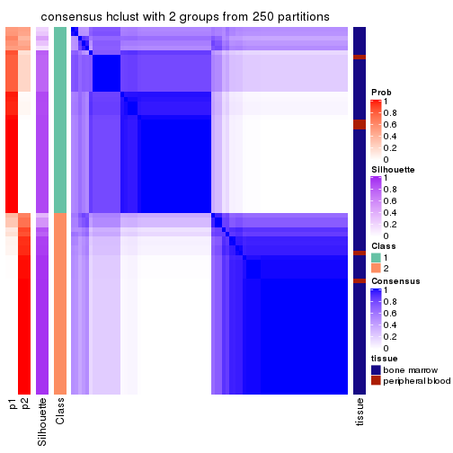</p>

</div>
<div id='tab-ATC-hclust-consensus-heatmap-2'>
<pre><code class="r">consensus_heatmap(res, k = 3)
</code></pre>

<p>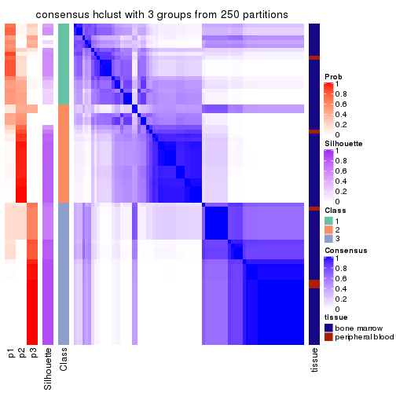</p>

</div>
<div id='tab-ATC-hclust-consensus-heatmap-3'>
<pre><code class="r">consensus_heatmap(res, k = 4)
</code></pre>

<p>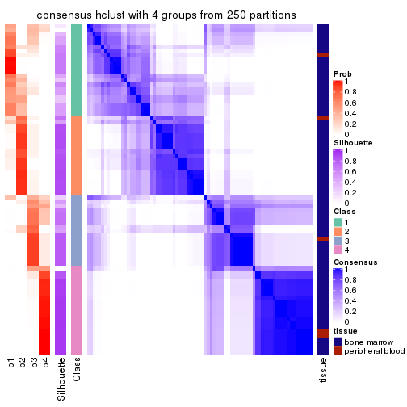</p>

</div>
<div id='tab-ATC-hclust-consensus-heatmap-4'>
<pre><code class="r">consensus_heatmap(res, k = 5)
</code></pre>

<p>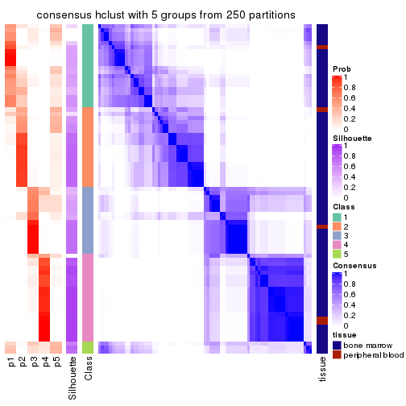</p>

</div>
<div id='tab-ATC-hclust-consensus-heatmap-5'>
<pre><code class="r">consensus_heatmap(res, k = 6)
</code></pre>

<p>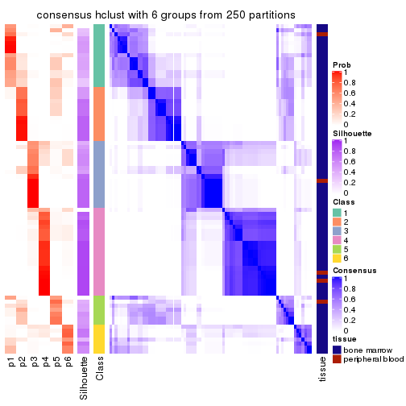</p>

</div>
</div>

Heatmaps for the membership of samples in all partitions to see how consistent they are:


<script>
$( function() {
	$( '#tabs-ATC-hclust-membership-heatmap' ).tabs();
} );
</script>
<div id='tabs-ATC-hclust-membership-heatmap'>
<ul>
<li><a href='#tab-ATC-hclust-membership-heatmap-1'>k = 2</a></li>
<li><a href='#tab-ATC-hclust-membership-heatmap-2'>k = 3</a></li>
<li><a href='#tab-ATC-hclust-membership-heatmap-3'>k = 4</a></li>
<li><a href='#tab-ATC-hclust-membership-heatmap-4'>k = 5</a></li>
<li><a href='#tab-ATC-hclust-membership-heatmap-5'>k = 6</a></li>
</ul>
<div id='tab-ATC-hclust-membership-heatmap-1'>
<pre><code class="r">membership_heatmap(res, k = 2)
</code></pre>

<p>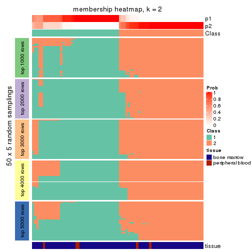</p>

</div>
<div id='tab-ATC-hclust-membership-heatmap-2'>
<pre><code class="r">membership_heatmap(res, k = 3)
</code></pre>

<p>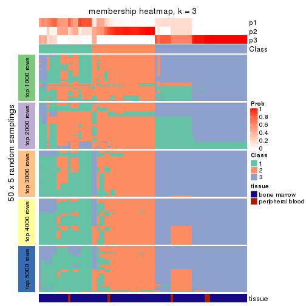</p>

</div>
<div id='tab-ATC-hclust-membership-heatmap-3'>
<pre><code class="r">membership_heatmap(res, k = 4)
</code></pre>

<p>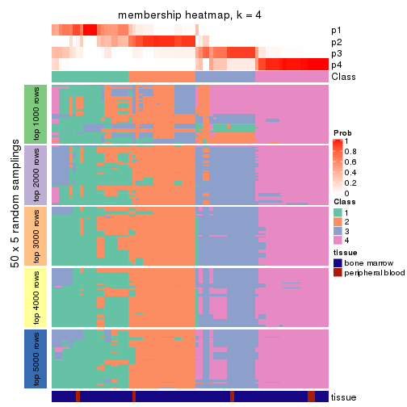</p>

</div>
<div id='tab-ATC-hclust-membership-heatmap-4'>
<pre><code class="r">membership_heatmap(res, k = 5)
</code></pre>

<p>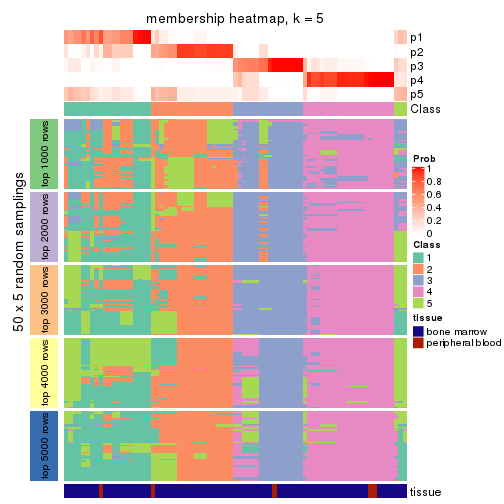</p>

</div>
<div id='tab-ATC-hclust-membership-heatmap-5'>
<pre><code class="r">membership_heatmap(res, k = 6)
</code></pre>

<p>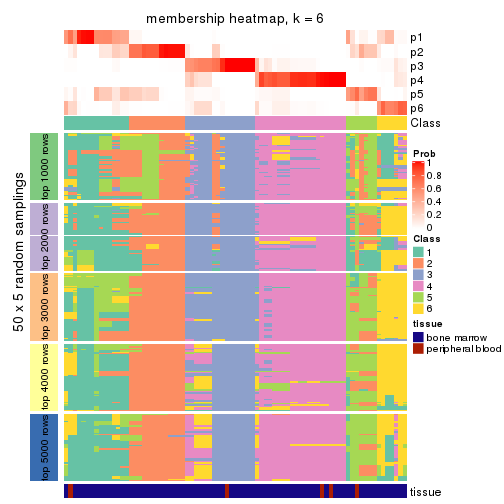</p>

</div>
</div>

As soon as we have had the classes for columns, we can look for signatures
which are significantly different between classes which can be candidate marks
for certain classes. Following are the heatmaps for signatures.


Signature heatmaps where rows are scaled:


<script>
$( function() {
	$( '#tabs-ATC-hclust-get-signatures' ).tabs();
} );
</script>
<div id='tabs-ATC-hclust-get-signatures'>
<ul>
<li><a href='#tab-ATC-hclust-get-signatures-1'>k = 2</a></li>
<li><a href='#tab-ATC-hclust-get-signatures-2'>k = 3</a></li>
<li><a href='#tab-ATC-hclust-get-signatures-3'>k = 4</a></li>
<li><a href='#tab-ATC-hclust-get-signatures-4'>k = 5</a></li>
<li><a href='#tab-ATC-hclust-get-signatures-5'>k = 6</a></li>
</ul>
<div id='tab-ATC-hclust-get-signatures-1'>
<pre><code class="r">get_signatures(res, k = 2)
</code></pre>

<p>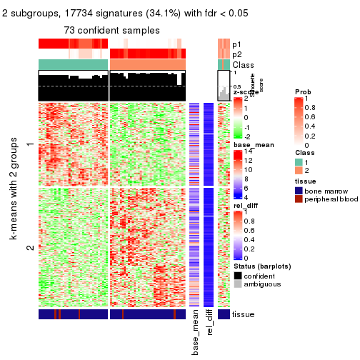</p>

</div>
<div id='tab-ATC-hclust-get-signatures-2'>
<pre><code class="r">get_signatures(res, k = 3)
</code></pre>

<p>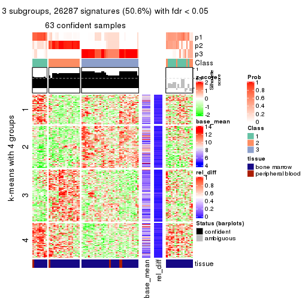</p>

</div>
<div id='tab-ATC-hclust-get-signatures-3'>
<pre><code class="r">get_signatures(res, k = 4)
</code></pre>

<p>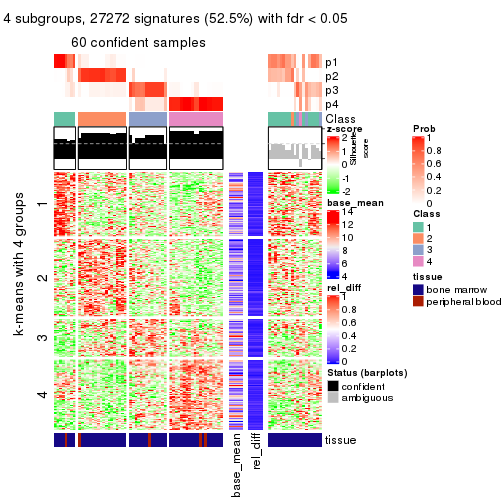</p>

</div>
<div id='tab-ATC-hclust-get-signatures-4'>
<pre><code class="r">get_signatures(res, k = 5)
</code></pre>

<p>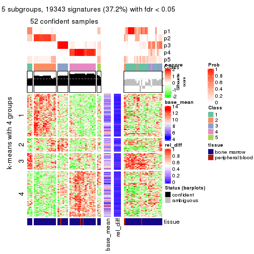</p>

</div>
<div id='tab-ATC-hclust-get-signatures-5'>
<pre><code class="r">get_signatures(res, k = 6)
</code></pre>

<p>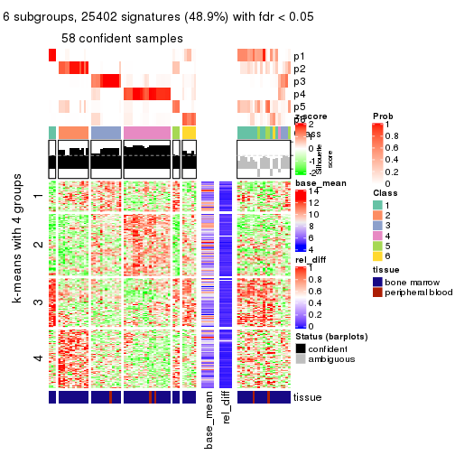</p>

</div>
</div>


Signature heatmaps where rows are not scaled:


<script>
$( function() {
	$( '#tabs-ATC-hclust-get-signatures-no-scale' ).tabs();
} );
</script>
<div id='tabs-ATC-hclust-get-signatures-no-scale'>
<ul>
<li><a href='#tab-ATC-hclust-get-signatures-no-scale-1'>k = 2</a></li>
<li><a href='#tab-ATC-hclust-get-signatures-no-scale-2'>k = 3</a></li>
<li><a href='#tab-ATC-hclust-get-signatures-no-scale-3'>k = 4</a></li>
<li><a href='#tab-ATC-hclust-get-signatures-no-scale-4'>k = 5</a></li>
<li><a href='#tab-ATC-hclust-get-signatures-no-scale-5'>k = 6</a></li>
</ul>
<div id='tab-ATC-hclust-get-signatures-no-scale-1'>
<pre><code class="r">get_signatures(res, k = 2, scale_rows = FALSE)
</code></pre>

<p>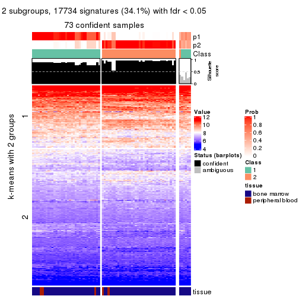</p>

</div>
<div id='tab-ATC-hclust-get-signatures-no-scale-2'>
<pre><code class="r">get_signatures(res, k = 3, scale_rows = FALSE)
</code></pre>

<p>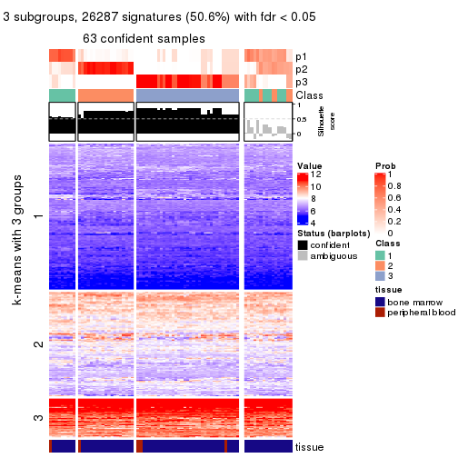</p>

</div>
<div id='tab-ATC-hclust-get-signatures-no-scale-3'>
<pre><code class="r">get_signatures(res, k = 4, scale_rows = FALSE)
</code></pre>

<p>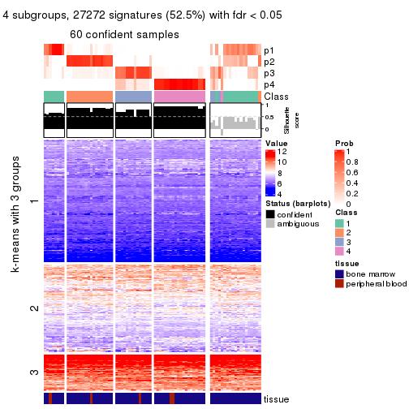</p>

</div>
<div id='tab-ATC-hclust-get-signatures-no-scale-4'>
<pre><code class="r">get_signatures(res, k = 5, scale_rows = FALSE)
</code></pre>

<p>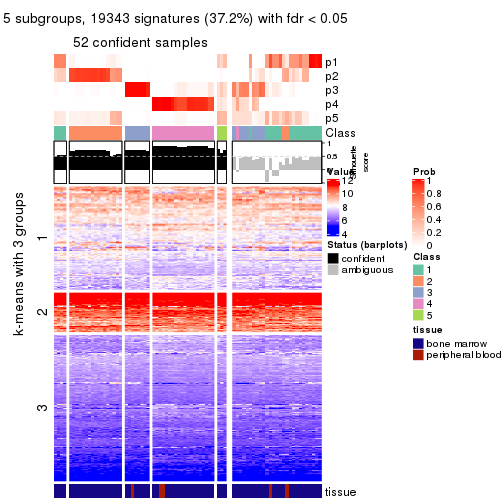</p>

</div>
<div id='tab-ATC-hclust-get-signatures-no-scale-5'>
<pre><code class="r">get_signatures(res, k = 6, scale_rows = FALSE)
</code></pre>

<p>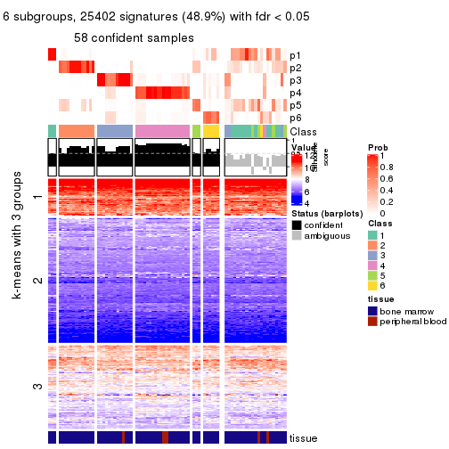</p>

</div>
</div>


Compare the overlap of signatures from different k:

```r
compare_signatures(res)
```

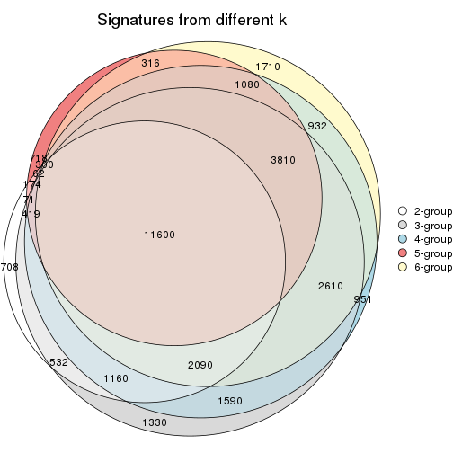

`get_signature()` returns a data frame invisibly. TO get the list of signatures, the function
call should be assigned to a variable explicitly. In following code, if `plot` argument is set
to `FALSE`, no heatmap is plotted while only the differential analysis is performed.

```r
# code only for demonstration
tb = get_signature(res, k = ..., plot = FALSE)
```

An example of the output of `tb` is:

```
#>   which_row         fdr    mean_1    mean_2 scaled_mean_1 scaled_mean_2 km
#> 1        38 0.042760348  8.373488  9.131774    -0.5533452     0.5164555  1
#> 2        40 0.018707592  7.106213  8.469186    -0.6173731     0.5762149  1
#> 3        55 0.019134737 10.221463 11.207825    -0.6159697     0.5749050  1
#> 4        59 0.006059896  5.921854  7.869574    -0.6899429     0.6439467  1
#> 5        60 0.018055526  8.928898 10.211722    -0.6204761     0.5791110  1
#> 6        98 0.009384629 15.714769 14.887706     0.6635654    -0.6193277  2
...
```

The columns in `tb` are:

1. `which_row`: row indices corresponding to the input matrix.
2. `fdr`: FDR for the differential test. 
3. `mean_x`: The mean value in group x.
4. `scaled_mean_x`: The mean value in group x after rows are scaled.
5. `km`: Row groups if k-means clustering is applied to rows.


UMAP plot which shows how samples are separated.


<script>
$( function() {
	$( '#tabs-ATC-hclust-dimension-reduction' ).tabs();
} );
</script>
<div id='tabs-ATC-hclust-dimension-reduction'>
<ul>
<li><a href='#tab-ATC-hclust-dimension-reduction-1'>k = 2</a></li>
<li><a href='#tab-ATC-hclust-dimension-reduction-2'>k = 3</a></li>
<li><a href='#tab-ATC-hclust-dimension-reduction-3'>k = 4</a></li>
<li><a href='#tab-ATC-hclust-dimension-reduction-4'>k = 5</a></li>
<li><a href='#tab-ATC-hclust-dimension-reduction-5'>k = 6</a></li>
</ul>
<div id='tab-ATC-hclust-dimension-reduction-1'>
<pre><code class="r">dimension_reduction(res, k = 2, method = &quot;UMAP&quot;)
</code></pre>

<p>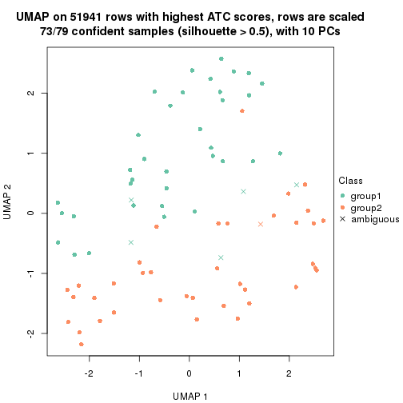</p>

</div>
<div id='tab-ATC-hclust-dimension-reduction-2'>
<pre><code class="r">dimension_reduction(res, k = 3, method = &quot;UMAP&quot;)
</code></pre>

<p>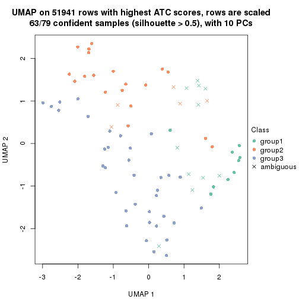</p>

</div>
<div id='tab-ATC-hclust-dimension-reduction-3'>
<pre><code class="r">dimension_reduction(res, k = 4, method = &quot;UMAP&quot;)
</code></pre>

<p>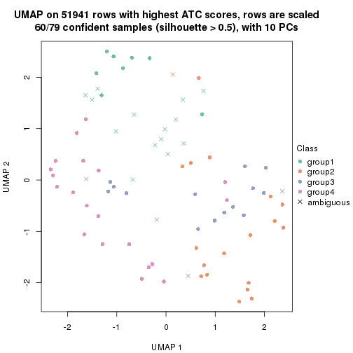</p>

</div>
<div id='tab-ATC-hclust-dimension-reduction-4'>
<pre><code class="r">dimension_reduction(res, k = 5, method = &quot;UMAP&quot;)
</code></pre>

<p>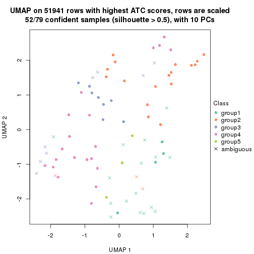</p>

</div>
<div id='tab-ATC-hclust-dimension-reduction-5'>
<pre><code class="r">dimension_reduction(res, k = 6, method = &quot;UMAP&quot;)
</code></pre>

<p>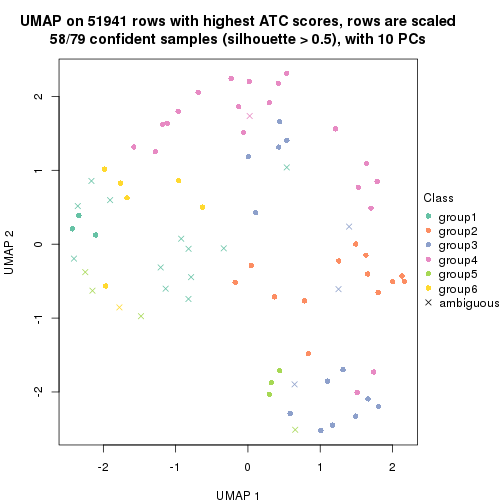</p>

</div>
</div>


Following heatmap shows how subgroups are split when increasing `k`:

```r
collect_classes(res)
```

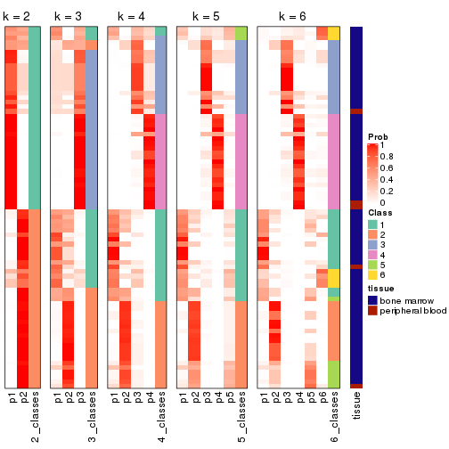


Test correlation between subgroups and known annotations. If the known
annotation is numeric, one-way ANOVA test is applied, and if the known
annotation is discrete, chi-squared contingency table test is applied.

```r
test_to_known_factors(res)
```

```
#>             n tissue(p) k
#> ATC:hclust 73     0.924 2
#> ATC:hclust 63     0.848 3
#> ATC:hclust 60     0.927 4
#> ATC:hclust 52     0.593 5
#> ATC:hclust 58     0.779 6
```


If matrix rows can be associated to genes, consider to use `GO_Enrichment(res,
...)` to perform function enrichment for the signature genes.


 

---------------------------------------------------


### ATC:kmeans**


The object with results only for a single top-value method and a single partition method 
can be extracted as:

```r
res = res_list["ATC", "kmeans"]
# you can also extract it by
# res = res_list["ATC:kmeans"]
```

A summary of `res` and all the functions that can be applied to it:

```r
res
```

```
#> A 'ConsensusPartition' object with k = 2, 3, 4, 5, 6.
#>   On a matrix with 51941 rows and 79 columns.
#>   Top rows (1000, 2000, 3000, 4000, 5000) are extracted by 'ATC' method.
#>   Subgroups are detected by 'kmeans' method.
#>   Performed in total 1250 partitions by row resampling.
#>   Best k for subgroups seems to be 2.
#> 
#> Following methods can be applied to this 'ConsensusPartition' object:
#>  [1] "cola_report"             "collect_classes"         "collect_plots"          
#>  [4] "collect_stats"           "colnames"                "compare_signatures"     
#>  [7] "consensus_heatmap"       "dimension_reduction"     "functional_enrichment"  
#> [10] "get_anno_col"            "get_anno"                "get_classes"            
#> [13] "get_consensus"           "get_matrix"              "get_membership"         
#> [16] "get_param"               "get_signatures"          "get_stats"              
#> [19] "is_best_k"               "is_stable_k"             "membership_heatmap"     
#> [22] "ncol"                    "nrow"                    "plot_ecdf"              
#> [25] "rownames"                "select_partition_number" "show"                   
#> [28] "suggest_best_k"          "test_to_known_factors"
```

`collect_plots()` function collects all the plots made from `res` for all `k` (number of partitions)
into one single page to provide an easy and fast comparison between different `k`.

```r
collect_plots(res)
```

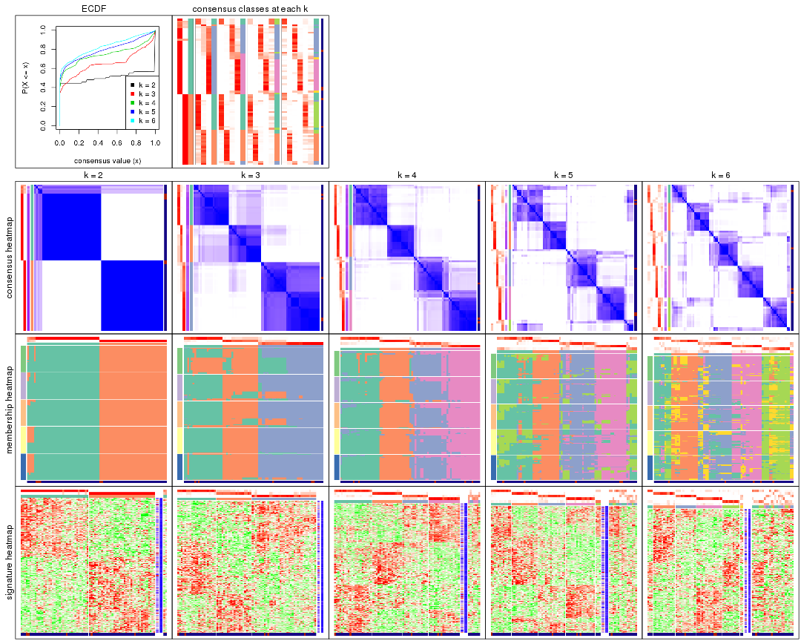

The plots are:

- The first row: a plot of the ECDF (Empirical cumulative distribution
  function) curves of the consensus matrix for each `k` and the heatmap of
  predicted classes for each `k`.
- The second row: heatmaps of the consensus matrix for each `k`.
- The third row: heatmaps of the membership matrix for each `k`.
- The fouth row: heatmaps of the signatures for each `k`.

All the plots in panels can be made by individual functions and they are
plotted later in this section.

`select_partition_number()` produces several plots showing different
statistics for choosing "optimized" `k`. There are following statistics:

- ECDF curves of the consensus matrix for each `k`;
- 1-PAC. [The PAC
  score](https://en.wikipedia.org/wiki/Consensus_clustering#Over-interpretation_potential_of_consensus_clustering)
  measures the proportion of the ambiguous subgrouping.
- Mean silhouette score.
- Concordance. The mean probability of fiting the consensus class ids in all
  partitions.
- Area increased. Denote $A_k$ as the area under the ECDF curve for current
  `k`, the area increased is defined as $A_k - A_{k-1}$.
- Rand index. The percent of pairs of samples that are both in a same cluster
  or both are not in a same cluster in the partition of k and k-1.
- Jaccard index. The ratio of pairs of samples are both in a same cluster in
  the partition of k and k-1 and the pairs of samples are both in a same
  cluster in the partition k or k-1.

The detailed explanations of these statistics can be found in [the cola
vignette](http://bioconductor.org/packages/devel/bioc/vignettes/cola/inst/doc/cola.html#toc_13).

Generally speaking, lower PAC score, higher mean silhouette score or higher
concordance corresponds to better partition. Rand index and Jaccard index
measure how similar the current partition is compared to partition with `k-1`.
If they are too similar, we won't accept `k` is better than `k-1`.

```r
select_partition_number(res)
```

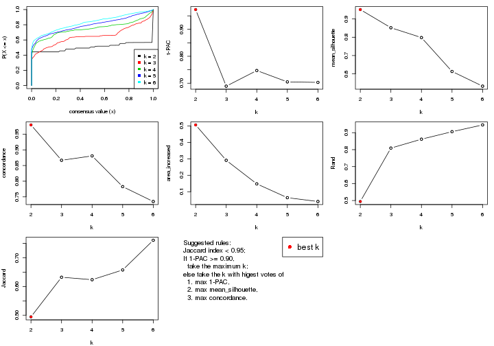

The numeric values for all these statistics can be obtained by `get_stats()`.

```r
get_stats(res)
```

```
#>   k 1-PAC mean_silhouette concordance area_increased  Rand Jaccard
#> 2 2 0.973           0.951       0.980         0.5059 0.494   0.494
#> 3 3 0.689           0.852       0.867         0.2909 0.809   0.632
#> 4 4 0.747           0.798       0.881         0.1477 0.862   0.624
#> 5 5 0.705           0.613       0.783         0.0637 0.906   0.658
#> 6 6 0.703           0.533       0.735         0.0406 0.946   0.761
```

`suggest_best_k()` suggests the best $k$ based on these statistics. The rules are as follows:

- All $k$ with Jaccard index larger than 0.95 are removed because the increase of
  the partition number does not provides enough extra information. If all $k$ are removed,
  the best $k$ is assigned by `NA`.
- For $k$ with 1-PAC larger than 0.9, the maximal $k$ is taken as the "best k". Other $k$ is called "optional k".
- If it does not fit the second rule. The $k$ with the highest vote of highest
  1-PAC, mean silhouette and concordance is taken as the "best k".

```r
suggest_best_k(res)
```

```
#> [1] 2
```


Following shows the table of the partitions (You need to click the **show/hide
code output** link to see it). The membership matrix (columns with name `p*`)
is inferred by
[`clue::cl_consensus()`](https://www.rdocumentation.org/link/cl_consensus?package=clue)
function with the `SE` method. Basically the value in the membership matrix
represents the probability to belong to a certain group. The finall class
label for an item is determined with the group with highest probability it
belongs to.

In `get_classes()` function, the entropy is calculated from the membership
matrix and the silhouette score is calculated from the consensus matrix.


<script>
$( function() {
	$( '#tabs-ATC-kmeans-get-classes' ).tabs();
} );
</script>
<div id='tabs-ATC-kmeans-get-classes'>
<ul>
<li><a href='#tab-ATC-kmeans-get-classes-1'>k = 2</a></li>
<li><a href='#tab-ATC-kmeans-get-classes-2'>k = 3</a></li>
<li><a href='#tab-ATC-kmeans-get-classes-3'>k = 4</a></li>
<li><a href='#tab-ATC-kmeans-get-classes-4'>k = 5</a></li>
<li><a href='#tab-ATC-kmeans-get-classes-5'>k = 6</a></li>
</ul>

<div id='tab-ATC-kmeans-get-classes-1'>
<p><a id='tab-ATC-kmeans-get-classes-1-a' style='color:#0366d6' href='#'>show/hide code output</a></p>
<pre><code class="r">cbind(get_classes(res, k = 2), get_membership(res, k = 2))
</code></pre>

<pre><code>#&gt;           class entropy silhouette    p1    p2
#&gt; GSM316652     2   0.000      1.000 0.000 1.000
#&gt; GSM316653     1   0.000      0.959 1.000 0.000
#&gt; GSM316654     1   0.000      0.959 1.000 0.000
#&gt; GSM316655     1   0.000      0.959 1.000 0.000
#&gt; GSM316656     2   0.000      1.000 0.000 1.000
#&gt; GSM316657     2   0.000      1.000 0.000 1.000
#&gt; GSM316658     2   0.000      1.000 0.000 1.000
#&gt; GSM316659     1   0.000      0.959 1.000 0.000
#&gt; GSM316660     2   0.000      1.000 0.000 1.000
#&gt; GSM316661     1   0.000      0.959 1.000 0.000
#&gt; GSM316662     2   0.000      1.000 0.000 1.000
#&gt; GSM316663     1   0.000      0.959 1.000 0.000
#&gt; GSM316664     1   0.000      0.959 1.000 0.000
#&gt; GSM316665     2   0.000      1.000 0.000 1.000
#&gt; GSM316666     1   0.000      0.959 1.000 0.000
#&gt; GSM316667     2   0.000      1.000 0.000 1.000
#&gt; GSM316668     2   0.000      1.000 0.000 1.000
#&gt; GSM316669     1   0.000      0.959 1.000 0.000
#&gt; GSM316670     1   0.000      0.959 1.000 0.000
#&gt; GSM316671     2   0.000      1.000 0.000 1.000
#&gt; GSM316672     2   0.000      1.000 0.000 1.000
#&gt; GSM316673     1   0.000      0.959 1.000 0.000
#&gt; GSM316674     2   0.000      1.000 0.000 1.000
#&gt; GSM316676     1   0.000      0.959 1.000 0.000
#&gt; GSM316677     1   0.000      0.959 1.000 0.000
#&gt; GSM316678     2   0.000      1.000 0.000 1.000
#&gt; GSM316679     2   0.000      1.000 0.000 1.000
#&gt; GSM316680     2   0.000      1.000 0.000 1.000
#&gt; GSM316681     2   0.000      1.000 0.000 1.000
#&gt; GSM316682     1   0.000      0.959 1.000 0.000
#&gt; GSM316683     1   0.000      0.959 1.000 0.000
#&gt; GSM316684     2   0.000      1.000 0.000 1.000
#&gt; GSM316685     2   0.000      1.000 0.000 1.000
#&gt; GSM316686     1   0.000      0.959 1.000 0.000
#&gt; GSM316687     1   0.000      0.959 1.000 0.000
#&gt; GSM316688     2   0.000      1.000 0.000 1.000
#&gt; GSM316689     1   0.939      0.487 0.644 0.356
#&gt; GSM316690     1   0.000      0.959 1.000 0.000
#&gt; GSM316691     1   0.999      0.150 0.520 0.480
#&gt; GSM316692     1   0.000      0.959 1.000 0.000
#&gt; GSM316693     1   0.000      0.959 1.000 0.000
#&gt; GSM316694     1   0.000      0.959 1.000 0.000
#&gt; GSM316696     1   0.850      0.639 0.724 0.276
#&gt; GSM316697     1   0.000      0.959 1.000 0.000
#&gt; GSM316698     2   0.000      1.000 0.000 1.000
#&gt; GSM316699     1   0.767      0.716 0.776 0.224
#&gt; GSM316700     1   0.000      0.959 1.000 0.000
#&gt; GSM316701     1   0.000      0.959 1.000 0.000
#&gt; GSM316703     1   0.000      0.959 1.000 0.000
#&gt; GSM316704     1   0.000      0.959 1.000 0.000
#&gt; GSM316705     1   0.000      0.959 1.000 0.000
#&gt; GSM316706     1   0.000      0.959 1.000 0.000
#&gt; GSM316707     2   0.000      1.000 0.000 1.000
#&gt; GSM316708     2   0.000      1.000 0.000 1.000
#&gt; GSM316709     1   0.000      0.959 1.000 0.000
#&gt; GSM316710     1   0.000      0.959 1.000 0.000
#&gt; GSM316711     1   0.000      0.959 1.000 0.000
#&gt; GSM316713     2   0.000      1.000 0.000 1.000
#&gt; GSM316714     1   0.000      0.959 1.000 0.000
#&gt; GSM316715     2   0.000      1.000 0.000 1.000
#&gt; GSM316716     2   0.000      1.000 0.000 1.000
#&gt; GSM316717     2   0.000      1.000 0.000 1.000
#&gt; GSM316718     2   0.000      1.000 0.000 1.000
#&gt; GSM316719     2   0.000      1.000 0.000 1.000
#&gt; GSM316720     2   0.000      1.000 0.000 1.000
#&gt; GSM316721     2   0.000      1.000 0.000 1.000
#&gt; GSM316722     2   0.000      1.000 0.000 1.000
#&gt; GSM316723     2   0.000      1.000 0.000 1.000
#&gt; GSM316724     2   0.000      1.000 0.000 1.000
#&gt; GSM316726     2   0.000      1.000 0.000 1.000
#&gt; GSM316727     2   0.000      1.000 0.000 1.000
#&gt; GSM316728     1   0.000      0.959 1.000 0.000
#&gt; GSM316729     2   0.000      1.000 0.000 1.000
#&gt; GSM316730     1   0.855      0.633 0.720 0.280
#&gt; GSM316675     1   0.000      0.959 1.000 0.000
#&gt; GSM316695     2   0.000      1.000 0.000 1.000
#&gt; GSM316702     1   0.000      0.959 1.000 0.000
#&gt; GSM316712     2   0.000      1.000 0.000 1.000
#&gt; GSM316725     1   0.000      0.959 1.000 0.000
</code></pre>

<script>
$('#tab-ATC-kmeans-get-classes-1-a').parent().next().next().hide();
$('#tab-ATC-kmeans-get-classes-1-a').click(function(){
  $('#tab-ATC-kmeans-get-classes-1-a').parent().next().next().toggle();
  return(false);
});
</script>
</div>

<div id='tab-ATC-kmeans-get-classes-2'>
<p><a id='tab-ATC-kmeans-get-classes-2-a' style='color:#0366d6' href='#'>show/hide code output</a></p>
<pre><code class="r">cbind(get_classes(res, k = 3), get_membership(res, k = 3))
</code></pre>

<pre><code>#&gt;           class entropy silhouette    p1    p2    p3
#&gt; GSM316652     1  0.4235      0.696 0.824 0.176 0.000
#&gt; GSM316653     3  0.3752      0.863 0.000 0.144 0.856
#&gt; GSM316654     3  0.6148      0.826 0.028 0.244 0.728
#&gt; GSM316655     3  0.6373      0.816 0.028 0.268 0.704
#&gt; GSM316656     2  0.4931      0.833 0.232 0.768 0.000
#&gt; GSM316657     1  0.0000      0.915 1.000 0.000 0.000
#&gt; GSM316658     2  0.1753      0.765 0.048 0.952 0.000
#&gt; GSM316659     3  0.5016      0.833 0.000 0.240 0.760
#&gt; GSM316660     1  0.1753      0.904 0.952 0.048 0.000
#&gt; GSM316661     3  0.0000      0.880 0.000 0.000 1.000
#&gt; GSM316662     2  0.5363      0.855 0.276 0.724 0.000
#&gt; GSM316663     3  0.0237      0.880 0.000 0.004 0.996
#&gt; GSM316664     3  0.0000      0.880 0.000 0.000 1.000
#&gt; GSM316665     2  0.4291      0.867 0.180 0.820 0.000
#&gt; GSM316666     3  0.6322      0.816 0.024 0.276 0.700
#&gt; GSM316667     2  0.5291      0.858 0.268 0.732 0.000
#&gt; GSM316668     2  0.4291      0.867 0.180 0.820 0.000
#&gt; GSM316669     3  0.0892      0.881 0.000 0.020 0.980
#&gt; GSM316670     3  0.6441      0.814 0.028 0.276 0.696
#&gt; GSM316671     2  0.5363      0.855 0.276 0.724 0.000
#&gt; GSM316672     1  0.2625      0.868 0.916 0.084 0.000
#&gt; GSM316673     3  0.2773      0.876 0.024 0.048 0.928
#&gt; GSM316674     2  0.1753      0.742 0.048 0.952 0.000
#&gt; GSM316676     3  0.6287      0.818 0.024 0.272 0.704
#&gt; GSM316677     1  0.5659      0.715 0.796 0.152 0.052
#&gt; GSM316678     2  0.5363      0.855 0.276 0.724 0.000
#&gt; GSM316679     1  0.1163      0.918 0.972 0.028 0.000
#&gt; GSM316680     1  0.1163      0.918 0.972 0.028 0.000
#&gt; GSM316681     2  0.5363      0.855 0.276 0.724 0.000
#&gt; GSM316682     3  0.0237      0.880 0.000 0.004 0.996
#&gt; GSM316683     3  0.0000      0.880 0.000 0.000 1.000
#&gt; GSM316684     2  0.4291      0.867 0.180 0.820 0.000
#&gt; GSM316685     2  0.2537      0.806 0.080 0.920 0.000
#&gt; GSM316686     3  0.0892      0.881 0.000 0.020 0.980
#&gt; GSM316687     3  0.4999      0.853 0.028 0.152 0.820
#&gt; GSM316688     1  0.0000      0.915 1.000 0.000 0.000
#&gt; GSM316689     1  0.4291      0.757 0.840 0.152 0.008
#&gt; GSM316690     3  0.1753      0.877 0.000 0.048 0.952
#&gt; GSM316691     3  0.8862      0.682 0.164 0.272 0.564
#&gt; GSM316692     3  0.0237      0.880 0.000 0.004 0.996
#&gt; GSM316693     3  0.0237      0.880 0.000 0.004 0.996
#&gt; GSM316694     3  0.6373      0.816 0.028 0.268 0.704
#&gt; GSM316696     1  0.5235      0.732 0.812 0.152 0.036
#&gt; GSM316697     3  0.6441      0.814 0.028 0.276 0.696
#&gt; GSM316698     2  0.5363      0.855 0.276 0.724 0.000
#&gt; GSM316699     2  0.1163      0.703 0.028 0.972 0.000
#&gt; GSM316700     3  0.0892      0.881 0.000 0.020 0.980
#&gt; GSM316701     3  0.6148      0.826 0.028 0.244 0.728
#&gt; GSM316703     3  0.0892      0.879 0.000 0.020 0.980
#&gt; GSM316704     3  0.1753      0.877 0.000 0.048 0.952
#&gt; GSM316705     3  0.0892      0.881 0.000 0.020 0.980
#&gt; GSM316706     3  0.0237      0.880 0.000 0.004 0.996
#&gt; GSM316707     2  0.2537      0.806 0.080 0.920 0.000
#&gt; GSM316708     1  0.1163      0.918 0.972 0.028 0.000
#&gt; GSM316709     3  0.6407      0.816 0.028 0.272 0.700
#&gt; GSM316710     3  0.0000      0.880 0.000 0.000 1.000
#&gt; GSM316711     3  0.5502      0.828 0.008 0.248 0.744
#&gt; GSM316713     1  0.2301      0.859 0.936 0.060 0.004
#&gt; GSM316714     3  0.0892      0.881 0.000 0.020 0.980
#&gt; GSM316715     1  0.0000      0.915 1.000 0.000 0.000
#&gt; GSM316716     2  0.4291      0.867 0.180 0.820 0.000
#&gt; GSM316717     1  0.1163      0.918 0.972 0.028 0.000
#&gt; GSM316718     1  0.1163      0.918 0.972 0.028 0.000
#&gt; GSM316719     1  0.0747      0.918 0.984 0.016 0.000
#&gt; GSM316720     1  0.1031      0.919 0.976 0.024 0.000
#&gt; GSM316721     2  0.5363      0.855 0.276 0.724 0.000
#&gt; GSM316722     1  0.1289      0.916 0.968 0.032 0.000
#&gt; GSM316723     2  0.4702      0.868 0.212 0.788 0.000
#&gt; GSM316724     2  0.5363      0.855 0.276 0.724 0.000
#&gt; GSM316726     2  0.5327      0.857 0.272 0.728 0.000
#&gt; GSM316727     1  0.1163      0.918 0.972 0.028 0.000
#&gt; GSM316728     3  0.0000      0.880 0.000 0.000 1.000
#&gt; GSM316729     1  0.0000      0.915 1.000 0.000 0.000
#&gt; GSM316730     3  0.8880      0.681 0.168 0.268 0.564
#&gt; GSM316675     3  0.6027      0.821 0.016 0.272 0.712
#&gt; GSM316695     1  0.2878      0.852 0.904 0.096 0.000
#&gt; GSM316702     3  0.0000      0.880 0.000 0.000 1.000
#&gt; GSM316712     1  0.0000      0.915 1.000 0.000 0.000
#&gt; GSM316725     3  0.0000      0.880 0.000 0.000 1.000
</code></pre>

<script>
$('#tab-ATC-kmeans-get-classes-2-a').parent().next().next().hide();
$('#tab-ATC-kmeans-get-classes-2-a').click(function(){
  $('#tab-ATC-kmeans-get-classes-2-a').parent().next().next().toggle();
  return(false);
});
</script>
</div>

<div id='tab-ATC-kmeans-get-classes-3'>
<p><a id='tab-ATC-kmeans-get-classes-3-a' style='color:#0366d6' href='#'>show/hide code output</a></p>
<pre><code class="r">cbind(get_classes(res, k = 4), get_membership(res, k = 4))
</code></pre>

<pre><code>#&gt;           class entropy silhouette    p1    p2    p3    p4
#&gt; GSM316652     1  0.5156     0.7246 0.720 0.044 0.236 0.000
#&gt; GSM316653     4  0.5000    -0.2343 0.000 0.000 0.496 0.504
#&gt; GSM316654     3  0.4331     0.7061 0.000 0.000 0.712 0.288
#&gt; GSM316655     3  0.3539     0.8159 0.000 0.004 0.820 0.176
#&gt; GSM316656     3  0.7573     0.1484 0.208 0.332 0.460 0.000
#&gt; GSM316657     1  0.2773     0.9019 0.880 0.004 0.116 0.000
#&gt; GSM316658     2  0.0592     0.9512 0.000 0.984 0.016 0.000
#&gt; GSM316659     3  0.4399     0.7933 0.000 0.020 0.768 0.212
#&gt; GSM316660     1  0.2586     0.8951 0.912 0.048 0.040 0.000
#&gt; GSM316661     4  0.0188     0.8556 0.000 0.000 0.004 0.996
#&gt; GSM316662     2  0.2214     0.9447 0.044 0.928 0.028 0.000
#&gt; GSM316663     4  0.0376     0.8539 0.000 0.004 0.004 0.992
#&gt; GSM316664     4  0.0000     0.8560 0.000 0.000 0.000 1.000
#&gt; GSM316665     2  0.0469     0.9533 0.000 0.988 0.012 0.000
#&gt; GSM316666     3  0.3946     0.8209 0.000 0.020 0.812 0.168
#&gt; GSM316667     2  0.2227     0.9485 0.036 0.928 0.036 0.000
#&gt; GSM316668     2  0.1576     0.9469 0.004 0.948 0.048 0.000
#&gt; GSM316669     4  0.1389     0.8386 0.000 0.000 0.048 0.952
#&gt; GSM316670     3  0.3946     0.8209 0.000 0.020 0.812 0.168
#&gt; GSM316671     2  0.4105     0.8399 0.156 0.812 0.032 0.000
#&gt; GSM316672     1  0.3307     0.8545 0.868 0.104 0.028 0.000
#&gt; GSM316673     4  0.3668     0.7104 0.004 0.000 0.188 0.808
#&gt; GSM316674     3  0.4741     0.4646 0.004 0.328 0.668 0.000
#&gt; GSM316676     3  0.4035     0.8193 0.000 0.020 0.804 0.176
#&gt; GSM316677     1  0.3863     0.8652 0.812 0.004 0.176 0.008
#&gt; GSM316678     2  0.1677     0.9511 0.040 0.948 0.012 0.000
#&gt; GSM316679     1  0.0804     0.9166 0.980 0.012 0.008 0.000
#&gt; GSM316680     1  0.0469     0.9177 0.988 0.012 0.000 0.000
#&gt; GSM316681     2  0.3497     0.8933 0.104 0.860 0.036 0.000
#&gt; GSM316682     4  0.0188     0.8552 0.000 0.000 0.004 0.996
#&gt; GSM316683     4  0.0000     0.8560 0.000 0.000 0.000 1.000
#&gt; GSM316684     2  0.0469     0.9533 0.000 0.988 0.012 0.000
#&gt; GSM316685     2  0.0592     0.9512 0.000 0.984 0.016 0.000
#&gt; GSM316686     4  0.1716     0.8329 0.000 0.000 0.064 0.936
#&gt; GSM316687     3  0.4985     0.0888 0.000 0.000 0.532 0.468
#&gt; GSM316688     1  0.2888     0.9039 0.872 0.004 0.124 0.000
#&gt; GSM316689     1  0.3585     0.8756 0.828 0.004 0.164 0.004
#&gt; GSM316690     4  0.5137    -0.0149 0.000 0.004 0.452 0.544
#&gt; GSM316691     3  0.1443     0.7464 0.004 0.008 0.960 0.028
#&gt; GSM316692     4  0.2714     0.7572 0.000 0.004 0.112 0.884
#&gt; GSM316693     4  0.0188     0.8552 0.000 0.000 0.004 0.996
#&gt; GSM316694     3  0.2944     0.8045 0.000 0.004 0.868 0.128
#&gt; GSM316696     1  0.3863     0.8652 0.812 0.004 0.176 0.008
#&gt; GSM316697     3  0.3946     0.8209 0.000 0.020 0.812 0.168
#&gt; GSM316698     2  0.1767     0.9501 0.044 0.944 0.012 0.000
#&gt; GSM316699     3  0.3486     0.7040 0.000 0.188 0.812 0.000
#&gt; GSM316700     4  0.1302     0.8406 0.000 0.000 0.044 0.956
#&gt; GSM316701     3  0.4331     0.7061 0.000 0.000 0.712 0.288
#&gt; GSM316703     4  0.4837     0.3351 0.000 0.004 0.348 0.648
#&gt; GSM316704     4  0.5151    -0.0626 0.000 0.004 0.464 0.532
#&gt; GSM316705     4  0.1716     0.8329 0.000 0.000 0.064 0.936
#&gt; GSM316706     4  0.0524     0.8525 0.000 0.004 0.008 0.988
#&gt; GSM316707     2  0.0592     0.9512 0.000 0.984 0.016 0.000
#&gt; GSM316708     1  0.1406     0.9143 0.960 0.016 0.024 0.000
#&gt; GSM316709     3  0.3539     0.8153 0.000 0.004 0.820 0.176
#&gt; GSM316710     4  0.0000     0.8560 0.000 0.000 0.000 1.000
#&gt; GSM316711     3  0.4204     0.8089 0.000 0.020 0.788 0.192
#&gt; GSM316713     1  0.2944     0.8943 0.868 0.004 0.128 0.000
#&gt; GSM316714     4  0.1389     0.8417 0.000 0.000 0.048 0.952
#&gt; GSM316715     1  0.1940     0.9103 0.924 0.000 0.076 0.000
#&gt; GSM316716     2  0.0469     0.9533 0.000 0.988 0.012 0.000
#&gt; GSM316717     1  0.1182     0.9139 0.968 0.016 0.016 0.000
#&gt; GSM316718     1  0.0804     0.9187 0.980 0.008 0.012 0.000
#&gt; GSM316719     1  0.0921     0.9177 0.972 0.000 0.028 0.000
#&gt; GSM316720     1  0.0921     0.9177 0.972 0.000 0.028 0.000
#&gt; GSM316721     2  0.0921     0.9559 0.028 0.972 0.000 0.000
#&gt; GSM316722     1  0.1297     0.9126 0.964 0.020 0.016 0.000
#&gt; GSM316723     2  0.0707     0.9569 0.020 0.980 0.000 0.000
#&gt; GSM316724     2  0.0921     0.9559 0.028 0.972 0.000 0.000
#&gt; GSM316726     2  0.0817     0.9568 0.024 0.976 0.000 0.000
#&gt; GSM316727     1  0.1059     0.9186 0.972 0.012 0.016 0.000
#&gt; GSM316728     4  0.0000     0.8560 0.000 0.000 0.000 1.000
#&gt; GSM316729     1  0.0895     0.9198 0.976 0.004 0.020 0.000
#&gt; GSM316730     3  0.2433     0.7613 0.012 0.008 0.920 0.060
#&gt; GSM316675     3  0.4035     0.8193 0.000 0.020 0.804 0.176
#&gt; GSM316695     1  0.4549     0.7375 0.776 0.188 0.036 0.000
#&gt; GSM316702     4  0.0336     0.8534 0.000 0.000 0.008 0.992
#&gt; GSM316712     1  0.2654     0.9027 0.888 0.004 0.108 0.000
#&gt; GSM316725     4  0.0000     0.8560 0.000 0.000 0.000 1.000
</code></pre>

<script>
$('#tab-ATC-kmeans-get-classes-3-a').parent().next().next().hide();
$('#tab-ATC-kmeans-get-classes-3-a').click(function(){
  $('#tab-ATC-kmeans-get-classes-3-a').parent().next().next().toggle();
  return(false);
});
</script>
</div>

<div id='tab-ATC-kmeans-get-classes-4'>
<p><a id='tab-ATC-kmeans-get-classes-4-a' style='color:#0366d6' href='#'>show/hide code output</a></p>
<pre><code class="r">cbind(get_classes(res, k = 5), get_membership(res, k = 5))
</code></pre>

<pre><code>#&gt;           class entropy silhouette    p1    p2    p3    p4    p5
#&gt; GSM316652     1  0.6344     0.3168 0.580 0.064 0.296 0.000 0.060
#&gt; GSM316653     3  0.5711     0.5077 0.000 0.000 0.612 0.252 0.136
#&gt; GSM316654     3  0.4104     0.7053 0.000 0.000 0.788 0.088 0.124
#&gt; GSM316655     3  0.3267     0.7320 0.000 0.000 0.844 0.044 0.112
#&gt; GSM316656     3  0.7258    -0.0208 0.376 0.148 0.424 0.000 0.052
#&gt; GSM316657     1  0.4307    -0.1032 0.500 0.000 0.000 0.000 0.500
#&gt; GSM316658     2  0.0865     0.8833 0.000 0.972 0.024 0.000 0.004
#&gt; GSM316659     3  0.5407     0.6056 0.000 0.008 0.676 0.108 0.208
#&gt; GSM316660     1  0.3463     0.6105 0.860 0.044 0.040 0.000 0.056
#&gt; GSM316661     4  0.1041     0.8593 0.000 0.000 0.004 0.964 0.032
#&gt; GSM316662     2  0.5654     0.7341 0.196 0.684 0.040 0.000 0.080
#&gt; GSM316663     4  0.2852     0.7761 0.000 0.000 0.000 0.828 0.172
#&gt; GSM316664     4  0.0162     0.8661 0.000 0.000 0.000 0.996 0.004
#&gt; GSM316665     2  0.0324     0.8917 0.000 0.992 0.004 0.000 0.004
#&gt; GSM316666     3  0.1710     0.7527 0.000 0.004 0.940 0.040 0.016
#&gt; GSM316667     2  0.4793     0.7584 0.176 0.748 0.040 0.000 0.036
#&gt; GSM316668     2  0.4539     0.8073 0.108 0.788 0.068 0.000 0.036
#&gt; GSM316669     4  0.2864     0.8049 0.000 0.000 0.012 0.852 0.136
#&gt; GSM316670     3  0.1043     0.7559 0.000 0.000 0.960 0.040 0.000
#&gt; GSM316671     1  0.6267     0.0723 0.548 0.340 0.032 0.000 0.080
#&gt; GSM316672     1  0.2677     0.6228 0.896 0.064 0.020 0.000 0.020
#&gt; GSM316673     5  0.4878    -0.0243 0.000 0.000 0.024 0.440 0.536
#&gt; GSM316674     3  0.3725     0.6282 0.008 0.140 0.816 0.000 0.036
#&gt; GSM316676     3  0.1121     0.7560 0.000 0.000 0.956 0.044 0.000
#&gt; GSM316677     5  0.4184     0.5114 0.284 0.000 0.016 0.000 0.700
#&gt; GSM316678     2  0.3768     0.8152 0.156 0.808 0.020 0.000 0.016
#&gt; GSM316679     1  0.1121     0.6451 0.956 0.000 0.000 0.000 0.044
#&gt; GSM316680     1  0.1544     0.6362 0.932 0.000 0.000 0.000 0.068
#&gt; GSM316681     1  0.6696    -0.1312 0.476 0.392 0.056 0.000 0.076
#&gt; GSM316682     4  0.0963     0.8569 0.000 0.000 0.000 0.964 0.036
#&gt; GSM316683     4  0.0703     0.8626 0.000 0.000 0.000 0.976 0.024
#&gt; GSM316684     2  0.0324     0.8917 0.000 0.992 0.004 0.000 0.004
#&gt; GSM316685     2  0.0671     0.8880 0.000 0.980 0.016 0.000 0.004
#&gt; GSM316686     4  0.3081     0.7877 0.000 0.000 0.012 0.832 0.156
#&gt; GSM316687     5  0.6564    -0.0550 0.000 0.000 0.344 0.212 0.444
#&gt; GSM316688     1  0.4341     0.2699 0.628 0.000 0.008 0.000 0.364
#&gt; GSM316689     5  0.4206     0.5105 0.288 0.000 0.016 0.000 0.696
#&gt; GSM316690     3  0.6549     0.1609 0.000 0.000 0.436 0.360 0.204
#&gt; GSM316691     3  0.2763     0.7079 0.000 0.000 0.848 0.004 0.148
#&gt; GSM316692     4  0.4262     0.7341 0.000 0.000 0.100 0.776 0.124
#&gt; GSM316693     4  0.0963     0.8569 0.000 0.000 0.000 0.964 0.036
#&gt; GSM316694     3  0.2900     0.7349 0.000 0.000 0.864 0.028 0.108
#&gt; GSM316696     5  0.4206     0.5105 0.288 0.000 0.016 0.000 0.696
#&gt; GSM316697     3  0.1043     0.7559 0.000 0.000 0.960 0.040 0.000
#&gt; GSM316698     2  0.4665     0.7984 0.168 0.756 0.020 0.000 0.056
#&gt; GSM316699     3  0.1357     0.7350 0.000 0.048 0.948 0.000 0.004
#&gt; GSM316700     4  0.2771     0.8110 0.000 0.000 0.012 0.860 0.128
#&gt; GSM316701     3  0.4104     0.7053 0.000 0.000 0.788 0.088 0.124
#&gt; GSM316703     4  0.6429     0.2303 0.000 0.000 0.296 0.496 0.208
#&gt; GSM316704     3  0.6582     0.0967 0.000 0.000 0.416 0.376 0.208
#&gt; GSM316705     4  0.3123     0.7840 0.000 0.000 0.012 0.828 0.160
#&gt; GSM316706     4  0.3177     0.7512 0.000 0.000 0.000 0.792 0.208
#&gt; GSM316707     2  0.0566     0.8898 0.000 0.984 0.012 0.000 0.004
#&gt; GSM316708     1  0.0579     0.6486 0.984 0.008 0.000 0.000 0.008
#&gt; GSM316709     3  0.2446     0.7502 0.000 0.000 0.900 0.044 0.056
#&gt; GSM316710     4  0.0000     0.8667 0.000 0.000 0.000 1.000 0.000
#&gt; GSM316711     3  0.4815     0.6444 0.000 0.012 0.724 0.056 0.208
#&gt; GSM316713     5  0.4434     0.0410 0.460 0.000 0.004 0.000 0.536
#&gt; GSM316714     4  0.2771     0.8113 0.000 0.000 0.012 0.860 0.128
#&gt; GSM316715     1  0.4235     0.0861 0.576 0.000 0.000 0.000 0.424
#&gt; GSM316716     2  0.0162     0.8921 0.000 0.996 0.004 0.000 0.000
#&gt; GSM316717     1  0.0404     0.6485 0.988 0.012 0.000 0.000 0.000
#&gt; GSM316718     1  0.1197     0.6451 0.952 0.000 0.000 0.000 0.048
#&gt; GSM316719     1  0.3336     0.4983 0.772 0.000 0.000 0.000 0.228
#&gt; GSM316720     1  0.3274     0.5074 0.780 0.000 0.000 0.000 0.220
#&gt; GSM316721     2  0.1992     0.8845 0.032 0.924 0.000 0.000 0.044
#&gt; GSM316722     1  0.1364     0.6404 0.952 0.012 0.000 0.000 0.036
#&gt; GSM316723     2  0.1205     0.8891 0.004 0.956 0.000 0.000 0.040
#&gt; GSM316724     2  0.1992     0.8845 0.032 0.924 0.000 0.000 0.044
#&gt; GSM316726     2  0.1818     0.8871 0.024 0.932 0.000 0.000 0.044
#&gt; GSM316727     1  0.2852     0.5543 0.828 0.000 0.000 0.000 0.172
#&gt; GSM316728     4  0.0000     0.8667 0.000 0.000 0.000 1.000 0.000
#&gt; GSM316729     1  0.1851     0.6328 0.912 0.000 0.000 0.000 0.088
#&gt; GSM316730     3  0.4702     0.1979 0.008 0.000 0.512 0.004 0.476
#&gt; GSM316675     3  0.1522     0.7551 0.000 0.000 0.944 0.044 0.012
#&gt; GSM316695     1  0.5258     0.5225 0.732 0.140 0.040 0.000 0.088
#&gt; GSM316702     4  0.0000     0.8667 0.000 0.000 0.000 1.000 0.000
#&gt; GSM316712     1  0.4307    -0.0991 0.504 0.000 0.000 0.000 0.496
#&gt; GSM316725     4  0.0162     0.8661 0.000 0.000 0.000 0.996 0.004
</code></pre>

<script>
$('#tab-ATC-kmeans-get-classes-4-a').parent().next().next().hide();
$('#tab-ATC-kmeans-get-classes-4-a').click(function(){
  $('#tab-ATC-kmeans-get-classes-4-a').parent().next().next().toggle();
  return(false);
});
</script>
</div>

<div id='tab-ATC-kmeans-get-classes-5'>
<p><a id='tab-ATC-kmeans-get-classes-5-a' style='color:#0366d6' href='#'>show/hide code output</a></p>
<pre><code class="r">cbind(get_classes(res, k = 6), get_membership(res, k = 6))
</code></pre>

<pre><code>#&gt;           class entropy silhouette    p1    p2    p3    p4    p5    p6
#&gt; GSM316652     3  0.8161   -0.01989 0.076 0.080 0.328 0.000 0.268 0.248
#&gt; GSM316653     3  0.6573    0.24878 0.204 0.000 0.528 0.188 0.000 0.080
#&gt; GSM316654     3  0.4696    0.51434 0.212 0.000 0.704 0.036 0.000 0.048
#&gt; GSM316655     3  0.3860    0.54662 0.200 0.000 0.756 0.008 0.000 0.036
#&gt; GSM316656     3  0.7843    0.16270 0.040 0.120 0.412 0.000 0.240 0.188
#&gt; GSM316657     1  0.4658    0.36162 0.580 0.000 0.004 0.000 0.376 0.040
#&gt; GSM316658     2  0.1575    0.77619 0.000 0.936 0.032 0.000 0.000 0.032
#&gt; GSM316659     3  0.4635   -0.40329 0.000 0.012 0.524 0.020 0.000 0.444
#&gt; GSM316660     5  0.4913    0.53458 0.056 0.044 0.000 0.000 0.692 0.208
#&gt; GSM316661     4  0.2294    0.77248 0.036 0.000 0.000 0.892 0.000 0.072
#&gt; GSM316662     2  0.6637    0.47247 0.040 0.432 0.004 0.000 0.180 0.344
#&gt; GSM316663     4  0.3329    0.55638 0.004 0.000 0.008 0.768 0.000 0.220
#&gt; GSM316664     4  0.0508    0.77930 0.004 0.000 0.000 0.984 0.000 0.012
#&gt; GSM316665     2  0.0858    0.78748 0.000 0.968 0.004 0.000 0.000 0.028
#&gt; GSM316666     3  0.0520    0.58175 0.000 0.000 0.984 0.008 0.000 0.008
#&gt; GSM316667     2  0.6114    0.47745 0.028 0.536 0.000 0.000 0.192 0.244
#&gt; GSM316668     2  0.6425    0.55064 0.020 0.576 0.072 0.000 0.096 0.236
#&gt; GSM316669     4  0.4062    0.70040 0.176 0.000 0.000 0.744 0.000 0.080
#&gt; GSM316670     3  0.0260    0.58593 0.000 0.000 0.992 0.008 0.000 0.000
#&gt; GSM316671     5  0.6571    0.18272 0.040 0.172 0.004 0.000 0.456 0.328
#&gt; GSM316672     5  0.4154    0.59382 0.020 0.056 0.004 0.000 0.772 0.148
#&gt; GSM316673     1  0.4051    0.42950 0.728 0.000 0.004 0.224 0.000 0.044
#&gt; GSM316674     3  0.5230    0.35709 0.012 0.132 0.640 0.000 0.000 0.216
#&gt; GSM316676     3  0.0260    0.58593 0.000 0.000 0.992 0.008 0.000 0.000
#&gt; GSM316677     1  0.1753    0.64279 0.912 0.000 0.004 0.000 0.084 0.000
#&gt; GSM316678     2  0.5164    0.64118 0.016 0.676 0.004 0.000 0.160 0.144
#&gt; GSM316679     5  0.1408    0.67039 0.036 0.000 0.000 0.000 0.944 0.020
#&gt; GSM316680     5  0.2442    0.63677 0.048 0.000 0.000 0.000 0.884 0.068
#&gt; GSM316681     5  0.7121    0.01024 0.044 0.240 0.016 0.000 0.392 0.308
#&gt; GSM316682     4  0.1806    0.73592 0.004 0.000 0.000 0.908 0.000 0.088
#&gt; GSM316683     4  0.2179    0.77468 0.036 0.000 0.000 0.900 0.000 0.064
#&gt; GSM316684     2  0.0790    0.78769 0.000 0.968 0.000 0.000 0.000 0.032
#&gt; GSM316685     2  0.1572    0.77728 0.000 0.936 0.028 0.000 0.000 0.036
#&gt; GSM316686     4  0.4008    0.69210 0.196 0.000 0.000 0.740 0.000 0.064
#&gt; GSM316687     1  0.5666    0.36158 0.632 0.000 0.180 0.144 0.000 0.044
#&gt; GSM316688     1  0.5329    0.09105 0.452 0.000 0.000 0.000 0.444 0.104
#&gt; GSM316689     1  0.2361    0.64382 0.880 0.000 0.004 0.000 0.104 0.012
#&gt; GSM316690     3  0.6114   -0.86251 0.004 0.000 0.400 0.232 0.000 0.364
#&gt; GSM316691     3  0.3037    0.57659 0.176 0.000 0.808 0.000 0.000 0.016
#&gt; GSM316692     4  0.4382    0.45944 0.004 0.000 0.104 0.728 0.000 0.164
#&gt; GSM316693     4  0.1644    0.73699 0.004 0.000 0.000 0.920 0.000 0.076
#&gt; GSM316694     3  0.2320    0.59057 0.132 0.000 0.864 0.000 0.000 0.004
#&gt; GSM316696     1  0.2261    0.64461 0.884 0.000 0.004 0.000 0.104 0.008
#&gt; GSM316697     3  0.0260    0.58593 0.000 0.000 0.992 0.008 0.000 0.000
#&gt; GSM316698     2  0.5554    0.63287 0.012 0.596 0.000 0.000 0.164 0.228
#&gt; GSM316699     3  0.1003    0.57390 0.004 0.004 0.964 0.000 0.000 0.028
#&gt; GSM316700     4  0.3946    0.70844 0.168 0.000 0.000 0.756 0.000 0.076
#&gt; GSM316701     3  0.4696    0.51434 0.212 0.000 0.704 0.036 0.000 0.048
#&gt; GSM316703     6  0.6048    0.83677 0.000 0.000 0.296 0.288 0.000 0.416
#&gt; GSM316704     6  0.5925    0.81878 0.000 0.000 0.372 0.212 0.000 0.416
#&gt; GSM316705     4  0.4008    0.69210 0.196 0.000 0.000 0.740 0.000 0.064
#&gt; GSM316706     4  0.4032    0.00863 0.000 0.000 0.008 0.572 0.000 0.420
#&gt; GSM316707     2  0.1334    0.78223 0.000 0.948 0.020 0.000 0.000 0.032
#&gt; GSM316708     5  0.1180    0.67838 0.004 0.008 0.004 0.000 0.960 0.024
#&gt; GSM316709     3  0.2373    0.59332 0.104 0.000 0.880 0.008 0.000 0.008
#&gt; GSM316710     4  0.0146    0.78189 0.000 0.000 0.000 0.996 0.000 0.004
#&gt; GSM316711     3  0.4380   -0.34394 0.000 0.012 0.544 0.008 0.000 0.436
#&gt; GSM316713     1  0.4284    0.49495 0.688 0.000 0.000 0.000 0.256 0.056
#&gt; GSM316714     4  0.3786    0.71389 0.168 0.000 0.000 0.768 0.000 0.064
#&gt; GSM316715     5  0.4985    0.02581 0.400 0.000 0.000 0.000 0.528 0.072
#&gt; GSM316716     2  0.0000    0.78979 0.000 1.000 0.000 0.000 0.000 0.000
#&gt; GSM316717     5  0.0862    0.67972 0.008 0.004 0.000 0.000 0.972 0.016
#&gt; GSM316718     5  0.1218    0.67626 0.028 0.000 0.004 0.000 0.956 0.012
#&gt; GSM316719     5  0.4200    0.48144 0.208 0.000 0.000 0.000 0.720 0.072
#&gt; GSM316720     5  0.4172    0.48707 0.204 0.000 0.000 0.000 0.724 0.072
#&gt; GSM316721     2  0.3351    0.76558 0.028 0.820 0.000 0.000 0.016 0.136
#&gt; GSM316722     5  0.1405    0.67471 0.024 0.004 0.000 0.000 0.948 0.024
#&gt; GSM316723     2  0.2766    0.77199 0.020 0.852 0.000 0.000 0.004 0.124
#&gt; GSM316724     2  0.3351    0.76558 0.028 0.820 0.000 0.000 0.016 0.136
#&gt; GSM316726     2  0.3161    0.76901 0.028 0.828 0.000 0.000 0.008 0.136
#&gt; GSM316727     5  0.3680    0.54756 0.144 0.000 0.000 0.000 0.784 0.072
#&gt; GSM316728     4  0.0000    0.78247 0.000 0.000 0.000 1.000 0.000 0.000
#&gt; GSM316729     5  0.2393    0.65380 0.092 0.000 0.004 0.000 0.884 0.020
#&gt; GSM316730     1  0.4520    0.36322 0.688 0.000 0.248 0.000 0.012 0.052
#&gt; GSM316675     3  0.0260    0.58593 0.000 0.000 0.992 0.008 0.000 0.000
#&gt; GSM316695     5  0.5771    0.46388 0.056 0.080 0.000 0.000 0.584 0.280
#&gt; GSM316702     4  0.0622    0.78227 0.008 0.000 0.000 0.980 0.000 0.012
#&gt; GSM316712     1  0.4538    0.41246 0.624 0.000 0.000 0.000 0.324 0.052
#&gt; GSM316725     4  0.0508    0.77930 0.004 0.000 0.000 0.984 0.000 0.012
</code></pre>

<script>
$('#tab-ATC-kmeans-get-classes-5-a').parent().next().next().hide();
$('#tab-ATC-kmeans-get-classes-5-a').click(function(){
  $('#tab-ATC-kmeans-get-classes-5-a').parent().next().next().toggle();
  return(false);
});
</script>
</div>
</div>

Heatmaps for the consensus matrix. It visualizes the probability of two
samples to be in a same group.


<script>
$( function() {
	$( '#tabs-ATC-kmeans-consensus-heatmap' ).tabs();
} );
</script>
<div id='tabs-ATC-kmeans-consensus-heatmap'>
<ul>
<li><a href='#tab-ATC-kmeans-consensus-heatmap-1'>k = 2</a></li>
<li><a href='#tab-ATC-kmeans-consensus-heatmap-2'>k = 3</a></li>
<li><a href='#tab-ATC-kmeans-consensus-heatmap-3'>k = 4</a></li>
<li><a href='#tab-ATC-kmeans-consensus-heatmap-4'>k = 5</a></li>
<li><a href='#tab-ATC-kmeans-consensus-heatmap-5'>k = 6</a></li>
</ul>
<div id='tab-ATC-kmeans-consensus-heatmap-1'>
<pre><code class="r">consensus_heatmap(res, k = 2)
</code></pre>

<p>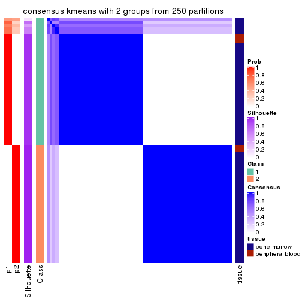</p>

</div>
<div id='tab-ATC-kmeans-consensus-heatmap-2'>
<pre><code class="r">consensus_heatmap(res, k = 3)
</code></pre>

<p>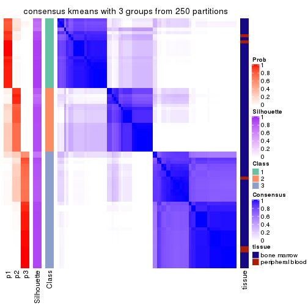</p>

</div>
<div id='tab-ATC-kmeans-consensus-heatmap-3'>
<pre><code class="r">consensus_heatmap(res, k = 4)
</code></pre>

<p>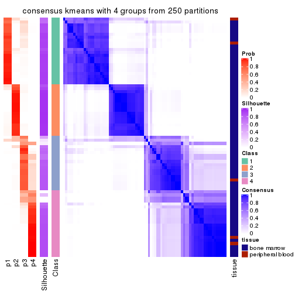</p>

</div>
<div id='tab-ATC-kmeans-consensus-heatmap-4'>
<pre><code class="r">consensus_heatmap(res, k = 5)
</code></pre>

<p>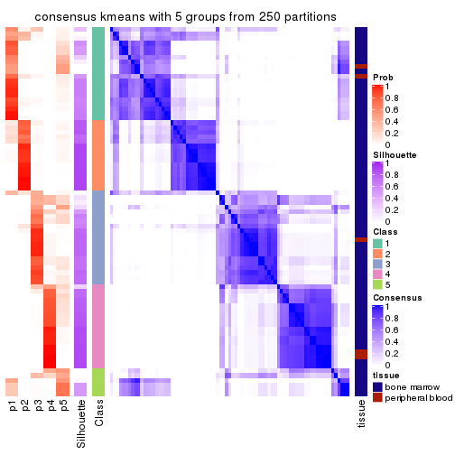</p>

</div>
<div id='tab-ATC-kmeans-consensus-heatmap-5'>
<pre><code class="r">consensus_heatmap(res, k = 6)
</code></pre>

<p>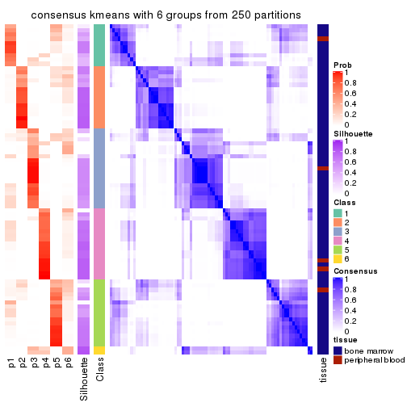</p>

</div>
</div>

Heatmaps for the membership of samples in all partitions to see how consistent they are:


<script>
$( function() {
	$( '#tabs-ATC-kmeans-membership-heatmap' ).tabs();
} );
</script>
<div id='tabs-ATC-kmeans-membership-heatmap'>
<ul>
<li><a href='#tab-ATC-kmeans-membership-heatmap-1'>k = 2</a></li>
<li><a href='#tab-ATC-kmeans-membership-heatmap-2'>k = 3</a></li>
<li><a href='#tab-ATC-kmeans-membership-heatmap-3'>k = 4</a></li>
<li><a href='#tab-ATC-kmeans-membership-heatmap-4'>k = 5</a></li>
<li><a href='#tab-ATC-kmeans-membership-heatmap-5'>k = 6</a></li>
</ul>
<div id='tab-ATC-kmeans-membership-heatmap-1'>
<pre><code class="r">membership_heatmap(res, k = 2)
</code></pre>

<p>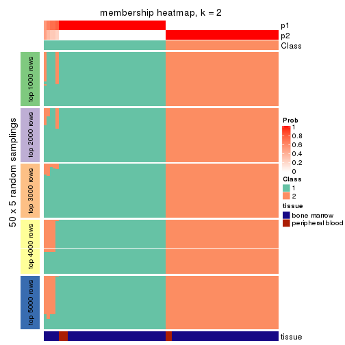</p>

</div>
<div id='tab-ATC-kmeans-membership-heatmap-2'>
<pre><code class="r">membership_heatmap(res, k = 3)
</code></pre>

<p>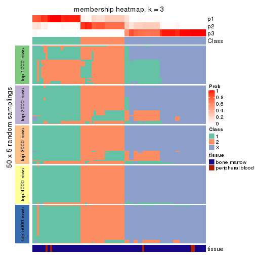</p>

</div>
<div id='tab-ATC-kmeans-membership-heatmap-3'>
<pre><code class="r">membership_heatmap(res, k = 4)
</code></pre>

<p>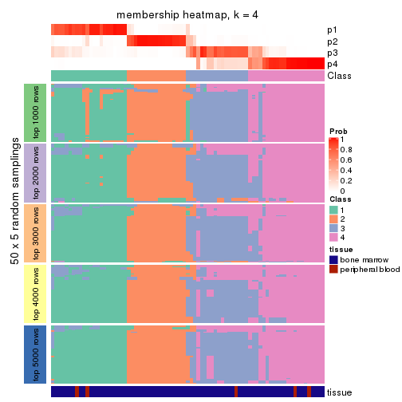</p>

</div>
<div id='tab-ATC-kmeans-membership-heatmap-4'>
<pre><code class="r">membership_heatmap(res, k = 5)
</code></pre>

<p>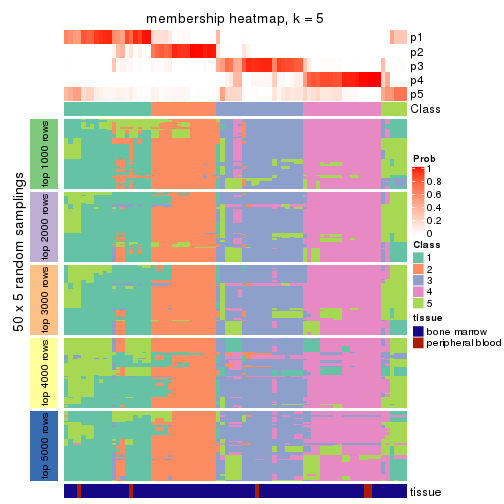</p>

</div>
<div id='tab-ATC-kmeans-membership-heatmap-5'>
<pre><code class="r">membership_heatmap(res, k = 6)
</code></pre>

<p>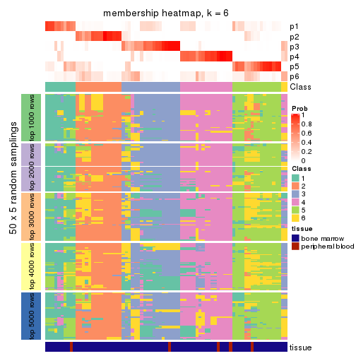</p>

</div>
</div>

As soon as we have had the classes for columns, we can look for signatures
which are significantly different between classes which can be candidate marks
for certain classes. Following are the heatmaps for signatures.


Signature heatmaps where rows are scaled:


<script>
$( function() {
	$( '#tabs-ATC-kmeans-get-signatures' ).tabs();
} );
</script>
<div id='tabs-ATC-kmeans-get-signatures'>
<ul>
<li><a href='#tab-ATC-kmeans-get-signatures-1'>k = 2</a></li>
<li><a href='#tab-ATC-kmeans-get-signatures-2'>k = 3</a></li>
<li><a href='#tab-ATC-kmeans-get-signatures-3'>k = 4</a></li>
<li><a href='#tab-ATC-kmeans-get-signatures-4'>k = 5</a></li>
<li><a href='#tab-ATC-kmeans-get-signatures-5'>k = 6</a></li>
</ul>
<div id='tab-ATC-kmeans-get-signatures-1'>
<pre><code class="r">get_signatures(res, k = 2)
</code></pre>

<p>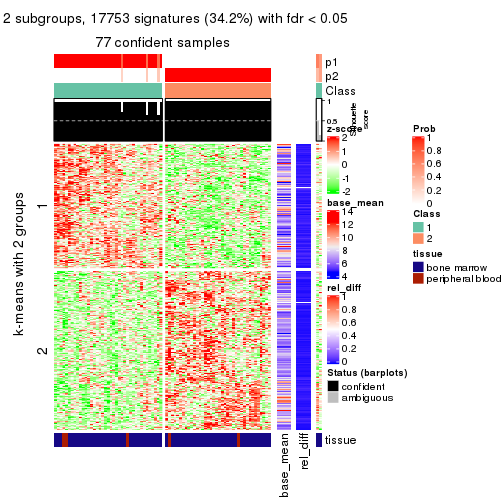</p>

</div>
<div id='tab-ATC-kmeans-get-signatures-2'>
<pre><code class="r">get_signatures(res, k = 3)
</code></pre>

<p>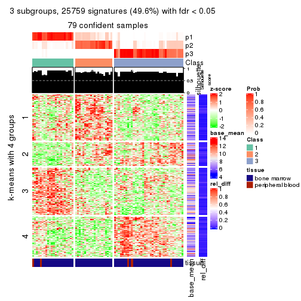</p>

</div>
<div id='tab-ATC-kmeans-get-signatures-3'>
<pre><code class="r">get_signatures(res, k = 4)
</code></pre>

<p>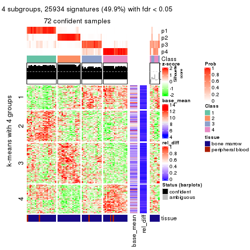</p>

</div>
<div id='tab-ATC-kmeans-get-signatures-4'>
<pre><code class="r">get_signatures(res, k = 5)
</code></pre>

<p>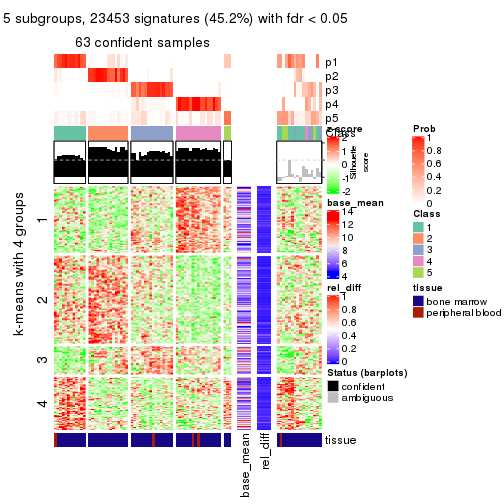</p>

</div>
<div id='tab-ATC-kmeans-get-signatures-5'>
<pre><code class="r">get_signatures(res, k = 6)
</code></pre>

<p>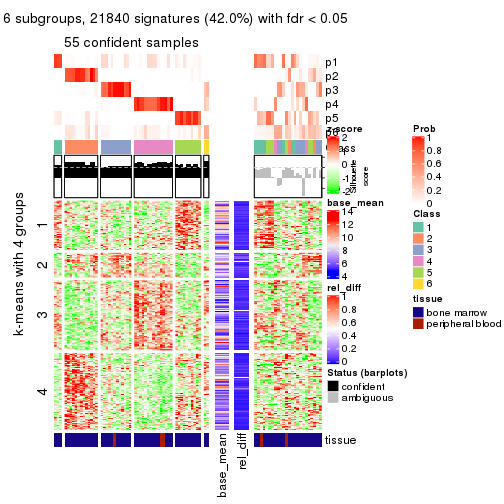</p>

</div>
</div>


Signature heatmaps where rows are not scaled:


<script>
$( function() {
	$( '#tabs-ATC-kmeans-get-signatures-no-scale' ).tabs();
} );
</script>
<div id='tabs-ATC-kmeans-get-signatures-no-scale'>
<ul>
<li><a href='#tab-ATC-kmeans-get-signatures-no-scale-1'>k = 2</a></li>
<li><a href='#tab-ATC-kmeans-get-signatures-no-scale-2'>k = 3</a></li>
<li><a href='#tab-ATC-kmeans-get-signatures-no-scale-3'>k = 4</a></li>
<li><a href='#tab-ATC-kmeans-get-signatures-no-scale-4'>k = 5</a></li>
<li><a href='#tab-ATC-kmeans-get-signatures-no-scale-5'>k = 6</a></li>
</ul>
<div id='tab-ATC-kmeans-get-signatures-no-scale-1'>
<pre><code class="r">get_signatures(res, k = 2, scale_rows = FALSE)
</code></pre>

<p>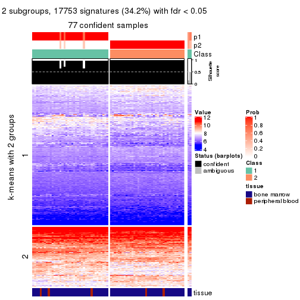</p>

</div>
<div id='tab-ATC-kmeans-get-signatures-no-scale-2'>
<pre><code class="r">get_signatures(res, k = 3, scale_rows = FALSE)
</code></pre>

<p>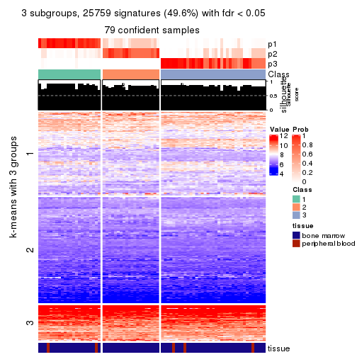</p>

</div>
<div id='tab-ATC-kmeans-get-signatures-no-scale-3'>
<pre><code class="r">get_signatures(res, k = 4, scale_rows = FALSE)
</code></pre>

<p>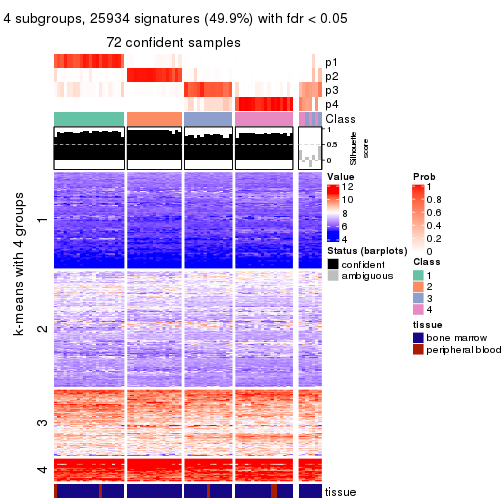</p>

</div>
<div id='tab-ATC-kmeans-get-signatures-no-scale-4'>
<pre><code class="r">get_signatures(res, k = 5, scale_rows = FALSE)
</code></pre>

<p>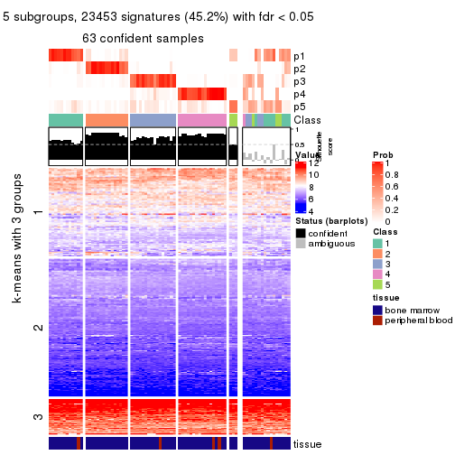</p>

</div>
<div id='tab-ATC-kmeans-get-signatures-no-scale-5'>
<pre><code class="r">get_signatures(res, k = 6, scale_rows = FALSE)
</code></pre>

<p>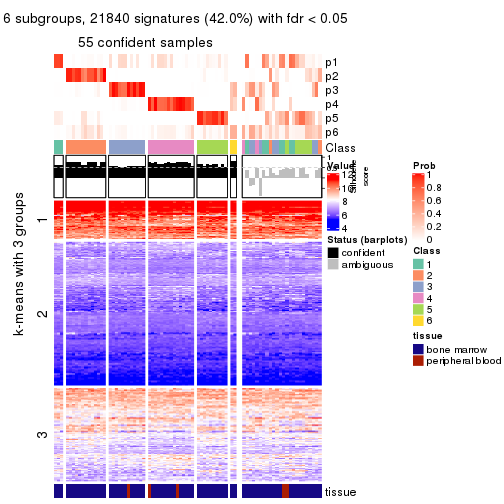</p>

</div>
</div>


Compare the overlap of signatures from different k:

```r
compare_signatures(res)
```

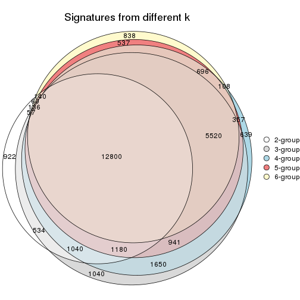

`get_signature()` returns a data frame invisibly. TO get the list of signatures, the function
call should be assigned to a variable explicitly. In following code, if `plot` argument is set
to `FALSE`, no heatmap is plotted while only the differential analysis is performed.

```r
# code only for demonstration
tb = get_signature(res, k = ..., plot = FALSE)
```

An example of the output of `tb` is:

```
#>   which_row         fdr    mean_1    mean_2 scaled_mean_1 scaled_mean_2 km
#> 1        38 0.042760348  8.373488  9.131774    -0.5533452     0.5164555  1
#> 2        40 0.018707592  7.106213  8.469186    -0.6173731     0.5762149  1
#> 3        55 0.019134737 10.221463 11.207825    -0.6159697     0.5749050  1
#> 4        59 0.006059896  5.921854  7.869574    -0.6899429     0.6439467  1
#> 5        60 0.018055526  8.928898 10.211722    -0.6204761     0.5791110  1
#> 6        98 0.009384629 15.714769 14.887706     0.6635654    -0.6193277  2
...
```

The columns in `tb` are:

1. `which_row`: row indices corresponding to the input matrix.
2. `fdr`: FDR for the differential test. 
3. `mean_x`: The mean value in group x.
4. `scaled_mean_x`: The mean value in group x after rows are scaled.
5. `km`: Row groups if k-means clustering is applied to rows.


UMAP plot which shows how samples are separated.


<script>
$( function() {
	$( '#tabs-ATC-kmeans-dimension-reduction' ).tabs();
} );
</script>
<div id='tabs-ATC-kmeans-dimension-reduction'>
<ul>
<li><a href='#tab-ATC-kmeans-dimension-reduction-1'>k = 2</a></li>
<li><a href='#tab-ATC-kmeans-dimension-reduction-2'>k = 3</a></li>
<li><a href='#tab-ATC-kmeans-dimension-reduction-3'>k = 4</a></li>
<li><a href='#tab-ATC-kmeans-dimension-reduction-4'>k = 5</a></li>
<li><a href='#tab-ATC-kmeans-dimension-reduction-5'>k = 6</a></li>
</ul>
<div id='tab-ATC-kmeans-dimension-reduction-1'>
<pre><code class="r">dimension_reduction(res, k = 2, method = &quot;UMAP&quot;)
</code></pre>

<p>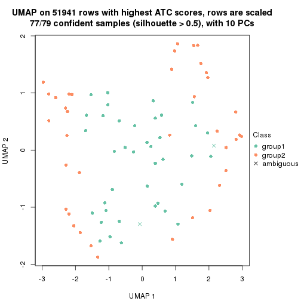</p>

</div>
<div id='tab-ATC-kmeans-dimension-reduction-2'>
<pre><code class="r">dimension_reduction(res, k = 3, method = &quot;UMAP&quot;)
</code></pre>

<p>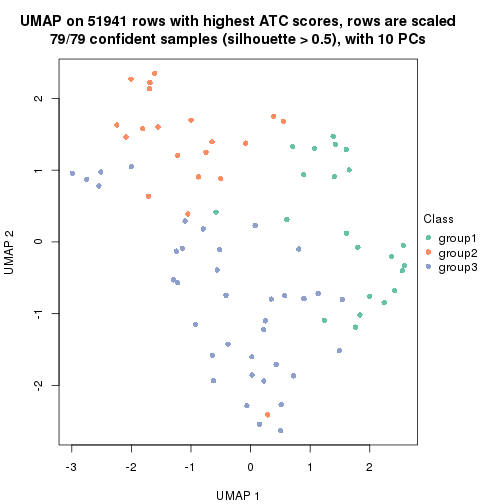</p>

</div>
<div id='tab-ATC-kmeans-dimension-reduction-3'>
<pre><code class="r">dimension_reduction(res, k = 4, method = &quot;UMAP&quot;)
</code></pre>

<p>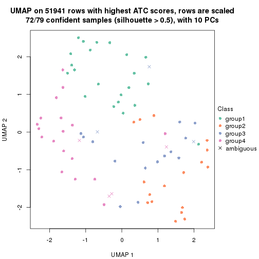</p>

</div>
<div id='tab-ATC-kmeans-dimension-reduction-4'>
<pre><code class="r">dimension_reduction(res, k = 5, method = &quot;UMAP&quot;)
</code></pre>

<p>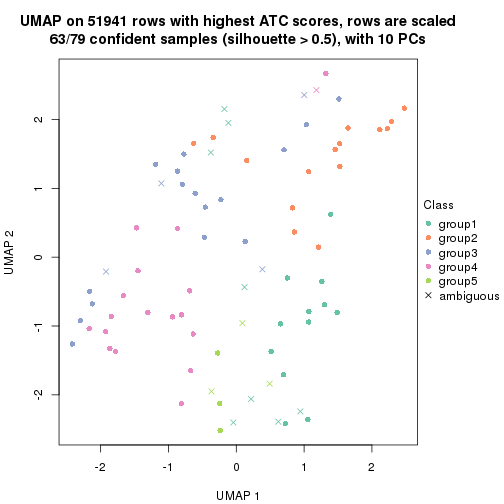</p>

</div>
<div id='tab-ATC-kmeans-dimension-reduction-5'>
<pre><code class="r">dimension_reduction(res, k = 6, method = &quot;UMAP&quot;)
</code></pre>

<p>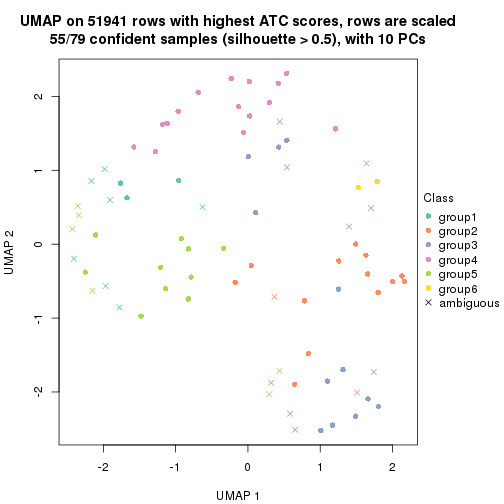</p>

</div>
</div>


Following heatmap shows how subgroups are split when increasing `k`:

```r
collect_classes(res)
```

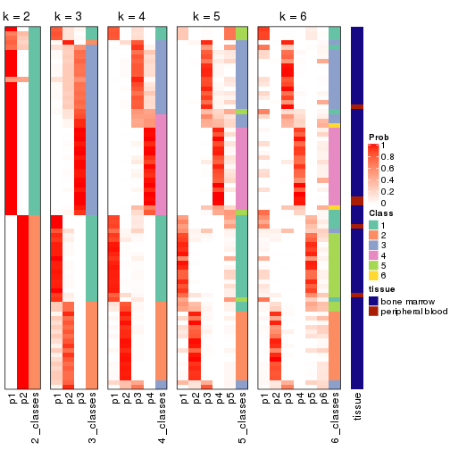


Test correlation between subgroups and known annotations. If the known
annotation is numeric, one-way ANOVA test is applied, and if the known
annotation is discrete, chi-squared contingency table test is applied.

```r
test_to_known_factors(res)
```

```
#>             n tissue(p) k
#> ATC:kmeans 77     1.000 2
#> ATC:kmeans 79     0.400 3
#> ATC:kmeans 72     0.591 4
#> ATC:kmeans 63     0.710 5
#> ATC:kmeans 55     0.606 6
```


If matrix rows can be associated to genes, consider to use `GO_Enrichment(res,
...)` to perform function enrichment for the signature genes.


 

---------------------------------------------------


### ATC:skmeans**


The object with results only for a single top-value method and a single partition method 
can be extracted as:

```r
res = res_list["ATC", "skmeans"]
# you can also extract it by
# res = res_list["ATC:skmeans"]
```

A summary of `res` and all the functions that can be applied to it:

```r
res
```

```
#> A 'ConsensusPartition' object with k = 2, 3, 4, 5, 6.
#>   On a matrix with 51941 rows and 79 columns.
#>   Top rows (1000, 2000, 3000, 4000, 5000) are extracted by 'ATC' method.
#>   Subgroups are detected by 'skmeans' method.
#>   Performed in total 1250 partitions by row resampling.
#>   Best k for subgroups seems to be 3.
#> 
#> Following methods can be applied to this 'ConsensusPartition' object:
#>  [1] "cola_report"             "collect_classes"         "collect_plots"          
#>  [4] "collect_stats"           "colnames"                "compare_signatures"     
#>  [7] "consensus_heatmap"       "dimension_reduction"     "functional_enrichment"  
#> [10] "get_anno_col"            "get_anno"                "get_classes"            
#> [13] "get_consensus"           "get_matrix"              "get_membership"         
#> [16] "get_param"               "get_signatures"          "get_stats"              
#> [19] "is_best_k"               "is_stable_k"             "membership_heatmap"     
#> [22] "ncol"                    "nrow"                    "plot_ecdf"              
#> [25] "rownames"                "select_partition_number" "show"                   
#> [28] "suggest_best_k"          "test_to_known_factors"
```

`collect_plots()` function collects all the plots made from `res` for all `k` (number of partitions)
into one single page to provide an easy and fast comparison between different `k`.

```r
collect_plots(res)
```

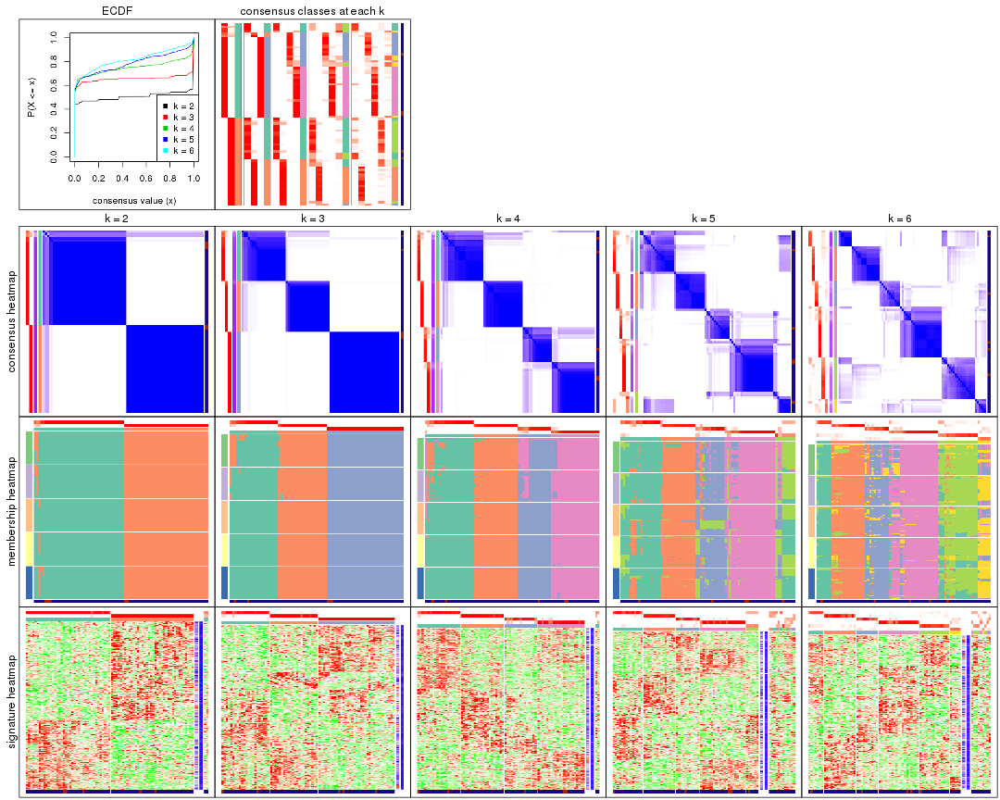

The plots are:

- The first row: a plot of the ECDF (Empirical cumulative distribution
  function) curves of the consensus matrix for each `k` and the heatmap of
  predicted classes for each `k`.
- The second row: heatmaps of the consensus matrix for each `k`.
- The third row: heatmaps of the membership matrix for each `k`.
- The fouth row: heatmaps of the signatures for each `k`.

All the plots in panels can be made by individual functions and they are
plotted later in this section.

`select_partition_number()` produces several plots showing different
statistics for choosing "optimized" `k`. There are following statistics:

- ECDF curves of the consensus matrix for each `k`;
- 1-PAC. [The PAC
  score](https://en.wikipedia.org/wiki/Consensus_clustering#Over-interpretation_potential_of_consensus_clustering)
  measures the proportion of the ambiguous subgrouping.
- Mean silhouette score.
- Concordance. The mean probability of fiting the consensus class ids in all
  partitions.
- Area increased. Denote $A_k$ as the area under the ECDF curve for current
  `k`, the area increased is defined as $A_k - A_{k-1}$.
- Rand index. The percent of pairs of samples that are both in a same cluster
  or both are not in a same cluster in the partition of k and k-1.
- Jaccard index. The ratio of pairs of samples are both in a same cluster in
  the partition of k and k-1 and the pairs of samples are both in a same
  cluster in the partition k or k-1.

The detailed explanations of these statistics can be found in [the cola
vignette](http://bioconductor.org/packages/devel/bioc/vignettes/cola/inst/doc/cola.html#toc_13).

Generally speaking, lower PAC score, higher mean silhouette score or higher
concordance corresponds to better partition. Rand index and Jaccard index
measure how similar the current partition is compared to partition with `k-1`.
If they are too similar, we won't accept `k` is better than `k-1`.

```r
select_partition_number(res)
```

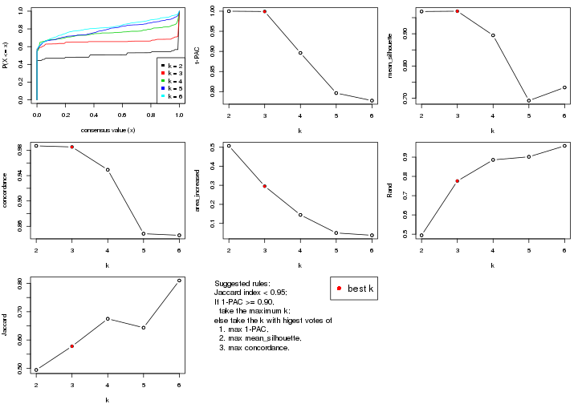

The numeric values for all these statistics can be obtained by `get_stats()`.

```r
get_stats(res)
```

```
#>   k 1-PAC mean_silhouette concordance area_increased  Rand Jaccard
#> 2 2 1.000           0.969       0.987         0.5066 0.494   0.494
#> 3 3 0.999           0.970       0.985         0.2952 0.776   0.578
#> 4 4 0.896           0.895       0.949         0.1447 0.886   0.675
#> 5 5 0.796           0.693       0.848         0.0501 0.902   0.644
#> 6 6 0.778           0.733       0.846         0.0378 0.958   0.810
```

`suggest_best_k()` suggests the best $k$ based on these statistics. The rules are as follows:

- All $k$ with Jaccard index larger than 0.95 are removed because the increase of
  the partition number does not provides enough extra information. If all $k$ are removed,
  the best $k$ is assigned by `NA`.
- For $k$ with 1-PAC larger than 0.9, the maximal $k$ is taken as the "best k". Other $k$ is called "optional k".
- If it does not fit the second rule. The $k$ with the highest vote of highest
  1-PAC, mean silhouette and concordance is taken as the "best k".

```r
suggest_best_k(res)
```

```
#> [1] 3
#> attr(,"optional")
#> [1] 2
```

There is also optional best $k$ = 2 that is worth to check.

Following shows the table of the partitions (You need to click the **show/hide
code output** link to see it). The membership matrix (columns with name `p*`)
is inferred by
[`clue::cl_consensus()`](https://www.rdocumentation.org/link/cl_consensus?package=clue)
function with the `SE` method. Basically the value in the membership matrix
represents the probability to belong to a certain group. The finall class
label for an item is determined with the group with highest probability it
belongs to.

In `get_classes()` function, the entropy is calculated from the membership
matrix and the silhouette score is calculated from the consensus matrix.


<script>
$( function() {
	$( '#tabs-ATC-skmeans-get-classes' ).tabs();
} );
</script>
<div id='tabs-ATC-skmeans-get-classes'>
<ul>
<li><a href='#tab-ATC-skmeans-get-classes-1'>k = 2</a></li>
<li><a href='#tab-ATC-skmeans-get-classes-2'>k = 3</a></li>
<li><a href='#tab-ATC-skmeans-get-classes-3'>k = 4</a></li>
<li><a href='#tab-ATC-skmeans-get-classes-4'>k = 5</a></li>
<li><a href='#tab-ATC-skmeans-get-classes-5'>k = 6</a></li>
</ul>

<div id='tab-ATC-skmeans-get-classes-1'>
<p><a id='tab-ATC-skmeans-get-classes-1-a' style='color:#0366d6' href='#'>show/hide code output</a></p>
<pre><code class="r">cbind(get_classes(res, k = 2), get_membership(res, k = 2))
</code></pre>

<pre><code>#&gt;           class entropy silhouette    p1    p2
#&gt; GSM316652     2   0.000      1.000 0.000 1.000
#&gt; GSM316653     1   0.000      0.974 1.000 0.000
#&gt; GSM316654     1   0.000      0.974 1.000 0.000
#&gt; GSM316655     1   0.000      0.974 1.000 0.000
#&gt; GSM316656     2   0.000      1.000 0.000 1.000
#&gt; GSM316657     2   0.000      1.000 0.000 1.000
#&gt; GSM316658     2   0.000      1.000 0.000 1.000
#&gt; GSM316659     1   0.000      0.974 1.000 0.000
#&gt; GSM316660     2   0.000      1.000 0.000 1.000
#&gt; GSM316661     1   0.000      0.974 1.000 0.000
#&gt; GSM316662     2   0.000      1.000 0.000 1.000
#&gt; GSM316663     1   0.000      0.974 1.000 0.000
#&gt; GSM316664     1   0.000      0.974 1.000 0.000
#&gt; GSM316665     2   0.000      1.000 0.000 1.000
#&gt; GSM316666     1   0.000      0.974 1.000 0.000
#&gt; GSM316667     2   0.000      1.000 0.000 1.000
#&gt; GSM316668     2   0.000      1.000 0.000 1.000
#&gt; GSM316669     1   0.000      0.974 1.000 0.000
#&gt; GSM316670     1   0.000      0.974 1.000 0.000
#&gt; GSM316671     2   0.000      1.000 0.000 1.000
#&gt; GSM316672     2   0.000      1.000 0.000 1.000
#&gt; GSM316673     1   0.000      0.974 1.000 0.000
#&gt; GSM316674     2   0.000      1.000 0.000 1.000
#&gt; GSM316676     1   0.000      0.974 1.000 0.000
#&gt; GSM316677     1   0.000      0.974 1.000 0.000
#&gt; GSM316678     2   0.000      1.000 0.000 1.000
#&gt; GSM316679     2   0.000      1.000 0.000 1.000
#&gt; GSM316680     2   0.000      1.000 0.000 1.000
#&gt; GSM316681     2   0.000      1.000 0.000 1.000
#&gt; GSM316682     1   0.000      0.974 1.000 0.000
#&gt; GSM316683     1   0.000      0.974 1.000 0.000
#&gt; GSM316684     2   0.000      1.000 0.000 1.000
#&gt; GSM316685     2   0.000      1.000 0.000 1.000
#&gt; GSM316686     1   0.000      0.974 1.000 0.000
#&gt; GSM316687     1   0.000      0.974 1.000 0.000
#&gt; GSM316688     2   0.000      1.000 0.000 1.000
#&gt; GSM316689     1   0.949      0.436 0.632 0.368
#&gt; GSM316690     1   0.000      0.974 1.000 0.000
#&gt; GSM316691     1   0.722      0.752 0.800 0.200
#&gt; GSM316692     1   0.000      0.974 1.000 0.000
#&gt; GSM316693     1   0.000      0.974 1.000 0.000
#&gt; GSM316694     1   0.000      0.974 1.000 0.000
#&gt; GSM316696     1   0.327      0.921 0.940 0.060
#&gt; GSM316697     1   0.000      0.974 1.000 0.000
#&gt; GSM316698     2   0.000      1.000 0.000 1.000
#&gt; GSM316699     1   0.946      0.446 0.636 0.364
#&gt; GSM316700     1   0.000      0.974 1.000 0.000
#&gt; GSM316701     1   0.000      0.974 1.000 0.000
#&gt; GSM316703     1   0.000      0.974 1.000 0.000
#&gt; GSM316704     1   0.000      0.974 1.000 0.000
#&gt; GSM316705     1   0.000      0.974 1.000 0.000
#&gt; GSM316706     1   0.000      0.974 1.000 0.000
#&gt; GSM316707     2   0.000      1.000 0.000 1.000
#&gt; GSM316708     2   0.000      1.000 0.000 1.000
#&gt; GSM316709     1   0.000      0.974 1.000 0.000
#&gt; GSM316710     1   0.000      0.974 1.000 0.000
#&gt; GSM316711     1   0.000      0.974 1.000 0.000
#&gt; GSM316713     2   0.000      1.000 0.000 1.000
#&gt; GSM316714     1   0.000      0.974 1.000 0.000
#&gt; GSM316715     2   0.000      1.000 0.000 1.000
#&gt; GSM316716     2   0.000      1.000 0.000 1.000
#&gt; GSM316717     2   0.000      1.000 0.000 1.000
#&gt; GSM316718     2   0.000      1.000 0.000 1.000
#&gt; GSM316719     2   0.000      1.000 0.000 1.000
#&gt; GSM316720     2   0.000      1.000 0.000 1.000
#&gt; GSM316721     2   0.000      1.000 0.000 1.000
#&gt; GSM316722     2   0.000      1.000 0.000 1.000
#&gt; GSM316723     2   0.000      1.000 0.000 1.000
#&gt; GSM316724     2   0.000      1.000 0.000 1.000
#&gt; GSM316726     2   0.000      1.000 0.000 1.000
#&gt; GSM316727     2   0.000      1.000 0.000 1.000
#&gt; GSM316728     1   0.000      0.974 1.000 0.000
#&gt; GSM316729     2   0.000      1.000 0.000 1.000
#&gt; GSM316730     1   0.224      0.944 0.964 0.036
#&gt; GSM316675     1   0.000      0.974 1.000 0.000
#&gt; GSM316695     2   0.000      1.000 0.000 1.000
#&gt; GSM316702     1   0.000      0.974 1.000 0.000
#&gt; GSM316712     2   0.000      1.000 0.000 1.000
#&gt; GSM316725     1   0.000      0.974 1.000 0.000
</code></pre>

<script>
$('#tab-ATC-skmeans-get-classes-1-a').parent().next().next().hide();
$('#tab-ATC-skmeans-get-classes-1-a').click(function(){
  $('#tab-ATC-skmeans-get-classes-1-a').parent().next().next().toggle();
  return(false);
});
</script>
</div>

<div id='tab-ATC-skmeans-get-classes-2'>
<p><a id='tab-ATC-skmeans-get-classes-2-a' style='color:#0366d6' href='#'>show/hide code output</a></p>
<pre><code class="r">cbind(get_classes(res, k = 3), get_membership(res, k = 3))
</code></pre>

<pre><code>#&gt;           class entropy silhouette    p1    p2   p3
#&gt; GSM316652     2  0.1643      0.946 0.044 0.956 0.00
#&gt; GSM316653     3  0.0000      1.000 0.000 0.000 1.00
#&gt; GSM316654     3  0.0000      1.000 0.000 0.000 1.00
#&gt; GSM316655     3  0.0000      1.000 0.000 0.000 1.00
#&gt; GSM316656     2  0.0000      0.990 0.000 1.000 0.00
#&gt; GSM316657     1  0.0000      0.954 1.000 0.000 0.00
#&gt; GSM316658     2  0.0000      0.990 0.000 1.000 0.00
#&gt; GSM316659     3  0.0000      1.000 0.000 0.000 1.00
#&gt; GSM316660     1  0.4504      0.782 0.804 0.196 0.00
#&gt; GSM316661     3  0.0000      1.000 0.000 0.000 1.00
#&gt; GSM316662     2  0.0000      0.990 0.000 1.000 0.00
#&gt; GSM316663     3  0.0000      1.000 0.000 0.000 1.00
#&gt; GSM316664     3  0.0000      1.000 0.000 0.000 1.00
#&gt; GSM316665     2  0.0000      0.990 0.000 1.000 0.00
#&gt; GSM316666     3  0.0000      1.000 0.000 0.000 1.00
#&gt; GSM316667     2  0.0000      0.990 0.000 1.000 0.00
#&gt; GSM316668     2  0.0000      0.990 0.000 1.000 0.00
#&gt; GSM316669     3  0.0000      1.000 0.000 0.000 1.00
#&gt; GSM316670     3  0.0000      1.000 0.000 0.000 1.00
#&gt; GSM316671     2  0.0000      0.990 0.000 1.000 0.00
#&gt; GSM316672     1  0.5926      0.511 0.644 0.356 0.00
#&gt; GSM316673     3  0.0000      1.000 0.000 0.000 1.00
#&gt; GSM316674     2  0.0000      0.990 0.000 1.000 0.00
#&gt; GSM316676     3  0.0000      1.000 0.000 0.000 1.00
#&gt; GSM316677     1  0.0000      0.954 1.000 0.000 0.00
#&gt; GSM316678     2  0.0000      0.990 0.000 1.000 0.00
#&gt; GSM316679     1  0.0747      0.947 0.984 0.016 0.00
#&gt; GSM316680     1  0.0000      0.954 1.000 0.000 0.00
#&gt; GSM316681     2  0.0000      0.990 0.000 1.000 0.00
#&gt; GSM316682     3  0.0000      1.000 0.000 0.000 1.00
#&gt; GSM316683     3  0.0000      1.000 0.000 0.000 1.00
#&gt; GSM316684     2  0.0000      0.990 0.000 1.000 0.00
#&gt; GSM316685     2  0.0000      0.990 0.000 1.000 0.00
#&gt; GSM316686     3  0.0000      1.000 0.000 0.000 1.00
#&gt; GSM316687     3  0.0000      1.000 0.000 0.000 1.00
#&gt; GSM316688     1  0.0000      0.954 1.000 0.000 0.00
#&gt; GSM316689     1  0.0000      0.954 1.000 0.000 0.00
#&gt; GSM316690     3  0.0000      1.000 0.000 0.000 1.00
#&gt; GSM316691     2  0.4615      0.813 0.144 0.836 0.02
#&gt; GSM316692     3  0.0000      1.000 0.000 0.000 1.00
#&gt; GSM316693     3  0.0000      1.000 0.000 0.000 1.00
#&gt; GSM316694     3  0.0000      1.000 0.000 0.000 1.00
#&gt; GSM316696     1  0.0000      0.954 1.000 0.000 0.00
#&gt; GSM316697     3  0.0000      1.000 0.000 0.000 1.00
#&gt; GSM316698     2  0.0000      0.990 0.000 1.000 0.00
#&gt; GSM316699     2  0.0000      0.990 0.000 1.000 0.00
#&gt; GSM316700     3  0.0000      1.000 0.000 0.000 1.00
#&gt; GSM316701     3  0.0000      1.000 0.000 0.000 1.00
#&gt; GSM316703     3  0.0000      1.000 0.000 0.000 1.00
#&gt; GSM316704     3  0.0000      1.000 0.000 0.000 1.00
#&gt; GSM316705     3  0.0000      1.000 0.000 0.000 1.00
#&gt; GSM316706     3  0.0000      1.000 0.000 0.000 1.00
#&gt; GSM316707     2  0.0000      0.990 0.000 1.000 0.00
#&gt; GSM316708     1  0.2066      0.920 0.940 0.060 0.00
#&gt; GSM316709     3  0.0000      1.000 0.000 0.000 1.00
#&gt; GSM316710     3  0.0000      1.000 0.000 0.000 1.00
#&gt; GSM316711     3  0.0000      1.000 0.000 0.000 1.00
#&gt; GSM316713     1  0.0000      0.954 1.000 0.000 0.00
#&gt; GSM316714     3  0.0000      1.000 0.000 0.000 1.00
#&gt; GSM316715     1  0.0000      0.954 1.000 0.000 0.00
#&gt; GSM316716     2  0.0000      0.990 0.000 1.000 0.00
#&gt; GSM316717     1  0.1411      0.937 0.964 0.036 0.00
#&gt; GSM316718     1  0.0000      0.954 1.000 0.000 0.00
#&gt; GSM316719     1  0.0000      0.954 1.000 0.000 0.00
#&gt; GSM316720     1  0.0000      0.954 1.000 0.000 0.00
#&gt; GSM316721     2  0.0000      0.990 0.000 1.000 0.00
#&gt; GSM316722     1  0.1411      0.937 0.964 0.036 0.00
#&gt; GSM316723     2  0.0000      0.990 0.000 1.000 0.00
#&gt; GSM316724     2  0.0000      0.990 0.000 1.000 0.00
#&gt; GSM316726     2  0.0000      0.990 0.000 1.000 0.00
#&gt; GSM316727     1  0.0000      0.954 1.000 0.000 0.00
#&gt; GSM316728     3  0.0000      1.000 0.000 0.000 1.00
#&gt; GSM316729     1  0.0000      0.954 1.000 0.000 0.00
#&gt; GSM316730     1  0.2066      0.903 0.940 0.000 0.06
#&gt; GSM316675     3  0.0000      1.000 0.000 0.000 1.00
#&gt; GSM316695     1  0.4504      0.782 0.804 0.196 0.00
#&gt; GSM316702     3  0.0000      1.000 0.000 0.000 1.00
#&gt; GSM316712     1  0.0000      0.954 1.000 0.000 0.00
#&gt; GSM316725     3  0.0000      1.000 0.000 0.000 1.00
</code></pre>

<script>
$('#tab-ATC-skmeans-get-classes-2-a').parent().next().next().hide();
$('#tab-ATC-skmeans-get-classes-2-a').click(function(){
  $('#tab-ATC-skmeans-get-classes-2-a').parent().next().next().toggle();
  return(false);
});
</script>
</div>

<div id='tab-ATC-skmeans-get-classes-3'>
<p><a id='tab-ATC-skmeans-get-classes-3-a' style='color:#0366d6' href='#'>show/hide code output</a></p>
<pre><code class="r">cbind(get_classes(res, k = 4), get_membership(res, k = 4))
</code></pre>

<pre><code>#&gt;           class entropy silhouette    p1    p2    p3    p4
#&gt; GSM316652     2  0.2589      0.867 0.116 0.884 0.000 0.000
#&gt; GSM316653     4  0.0188      0.956 0.000 0.000 0.004 0.996
#&gt; GSM316654     4  0.3444      0.765 0.000 0.000 0.184 0.816
#&gt; GSM316655     4  0.4103      0.665 0.000 0.000 0.256 0.744
#&gt; GSM316656     2  0.0469      0.982 0.012 0.988 0.000 0.000
#&gt; GSM316657     1  0.0000      0.919 1.000 0.000 0.000 0.000
#&gt; GSM316658     2  0.0188      0.987 0.000 0.996 0.004 0.000
#&gt; GSM316659     3  0.3024      0.822 0.000 0.000 0.852 0.148
#&gt; GSM316660     1  0.3444      0.773 0.816 0.184 0.000 0.000
#&gt; GSM316661     4  0.0000      0.959 0.000 0.000 0.000 1.000
#&gt; GSM316662     2  0.0000      0.989 0.000 1.000 0.000 0.000
#&gt; GSM316663     4  0.1637      0.901 0.000 0.000 0.060 0.940
#&gt; GSM316664     4  0.0000      0.959 0.000 0.000 0.000 1.000
#&gt; GSM316665     2  0.0000      0.989 0.000 1.000 0.000 0.000
#&gt; GSM316666     3  0.0469      0.894 0.000 0.000 0.988 0.012
#&gt; GSM316667     2  0.0000      0.989 0.000 1.000 0.000 0.000
#&gt; GSM316668     2  0.0000      0.989 0.000 1.000 0.000 0.000
#&gt; GSM316669     4  0.0000      0.959 0.000 0.000 0.000 1.000
#&gt; GSM316670     3  0.0469      0.894 0.000 0.000 0.988 0.012
#&gt; GSM316671     2  0.0592      0.979 0.016 0.984 0.000 0.000
#&gt; GSM316672     1  0.4855      0.396 0.600 0.400 0.000 0.000
#&gt; GSM316673     4  0.0469      0.948 0.000 0.000 0.012 0.988
#&gt; GSM316674     2  0.0817      0.971 0.000 0.976 0.024 0.000
#&gt; GSM316676     3  0.0469      0.894 0.000 0.000 0.988 0.012
#&gt; GSM316677     1  0.1059      0.908 0.972 0.000 0.012 0.016
#&gt; GSM316678     2  0.0000      0.989 0.000 1.000 0.000 0.000
#&gt; GSM316679     1  0.0188      0.918 0.996 0.004 0.000 0.000
#&gt; GSM316680     1  0.0000      0.919 1.000 0.000 0.000 0.000
#&gt; GSM316681     2  0.0469      0.982 0.012 0.988 0.000 0.000
#&gt; GSM316682     4  0.0000      0.959 0.000 0.000 0.000 1.000
#&gt; GSM316683     4  0.0000      0.959 0.000 0.000 0.000 1.000
#&gt; GSM316684     2  0.0000      0.989 0.000 1.000 0.000 0.000
#&gt; GSM316685     2  0.0188      0.987 0.000 0.996 0.004 0.000
#&gt; GSM316686     4  0.0000      0.959 0.000 0.000 0.000 1.000
#&gt; GSM316687     4  0.0000      0.959 0.000 0.000 0.000 1.000
#&gt; GSM316688     1  0.0000      0.919 1.000 0.000 0.000 0.000
#&gt; GSM316689     1  0.0469      0.916 0.988 0.000 0.012 0.000
#&gt; GSM316690     3  0.0592      0.894 0.000 0.000 0.984 0.016
#&gt; GSM316691     3  0.1182      0.875 0.016 0.016 0.968 0.000
#&gt; GSM316692     3  0.4697      0.580 0.000 0.000 0.644 0.356
#&gt; GSM316693     4  0.0000      0.959 0.000 0.000 0.000 1.000
#&gt; GSM316694     3  0.3688      0.773 0.000 0.000 0.792 0.208
#&gt; GSM316696     1  0.0937      0.910 0.976 0.000 0.012 0.012
#&gt; GSM316697     3  0.0469      0.894 0.000 0.000 0.988 0.012
#&gt; GSM316698     2  0.0000      0.989 0.000 1.000 0.000 0.000
#&gt; GSM316699     3  0.0592      0.885 0.000 0.016 0.984 0.000
#&gt; GSM316700     4  0.0000      0.959 0.000 0.000 0.000 1.000
#&gt; GSM316701     4  0.3837      0.710 0.000 0.000 0.224 0.776
#&gt; GSM316703     3  0.4776      0.541 0.000 0.000 0.624 0.376
#&gt; GSM316704     3  0.4250      0.701 0.000 0.000 0.724 0.276
#&gt; GSM316705     4  0.0000      0.959 0.000 0.000 0.000 1.000
#&gt; GSM316706     4  0.0000      0.959 0.000 0.000 0.000 1.000
#&gt; GSM316707     2  0.0188      0.987 0.000 0.996 0.004 0.000
#&gt; GSM316708     1  0.1716      0.887 0.936 0.064 0.000 0.000
#&gt; GSM316709     3  0.0592      0.894 0.000 0.000 0.984 0.016
#&gt; GSM316710     4  0.0000      0.959 0.000 0.000 0.000 1.000
#&gt; GSM316711     3  0.0469      0.894 0.000 0.000 0.988 0.012
#&gt; GSM316713     1  0.0469      0.916 0.988 0.000 0.012 0.000
#&gt; GSM316714     4  0.0000      0.959 0.000 0.000 0.000 1.000
#&gt; GSM316715     1  0.0469      0.916 0.988 0.000 0.012 0.000
#&gt; GSM316716     2  0.0000      0.989 0.000 1.000 0.000 0.000
#&gt; GSM316717     1  0.1211      0.901 0.960 0.040 0.000 0.000
#&gt; GSM316718     1  0.0000      0.919 1.000 0.000 0.000 0.000
#&gt; GSM316719     1  0.0000      0.919 1.000 0.000 0.000 0.000
#&gt; GSM316720     1  0.0000      0.919 1.000 0.000 0.000 0.000
#&gt; GSM316721     2  0.0000      0.989 0.000 1.000 0.000 0.000
#&gt; GSM316722     1  0.1557      0.892 0.944 0.056 0.000 0.000
#&gt; GSM316723     2  0.0000      0.989 0.000 1.000 0.000 0.000
#&gt; GSM316724     2  0.0000      0.989 0.000 1.000 0.000 0.000
#&gt; GSM316726     2  0.0000      0.989 0.000 1.000 0.000 0.000
#&gt; GSM316727     1  0.0000      0.919 1.000 0.000 0.000 0.000
#&gt; GSM316728     4  0.0000      0.959 0.000 0.000 0.000 1.000
#&gt; GSM316729     1  0.0000      0.919 1.000 0.000 0.000 0.000
#&gt; GSM316730     1  0.5378      0.202 0.540 0.000 0.012 0.448
#&gt; GSM316675     3  0.0469      0.894 0.000 0.000 0.988 0.012
#&gt; GSM316695     1  0.4103      0.677 0.744 0.256 0.000 0.000
#&gt; GSM316702     4  0.0000      0.959 0.000 0.000 0.000 1.000
#&gt; GSM316712     1  0.0469      0.916 0.988 0.000 0.012 0.000
#&gt; GSM316725     4  0.0000      0.959 0.000 0.000 0.000 1.000
</code></pre>

<script>
$('#tab-ATC-skmeans-get-classes-3-a').parent().next().next().hide();
$('#tab-ATC-skmeans-get-classes-3-a').click(function(){
  $('#tab-ATC-skmeans-get-classes-3-a').parent().next().next().toggle();
  return(false);
});
</script>
</div>

<div id='tab-ATC-skmeans-get-classes-4'>
<p><a id='tab-ATC-skmeans-get-classes-4-a' style='color:#0366d6' href='#'>show/hide code output</a></p>
<pre><code class="r">cbind(get_classes(res, k = 5), get_membership(res, k = 5))
</code></pre>

<pre><code>#&gt;           class entropy silhouette    p1    p2    p3    p4    p5
#&gt; GSM316652     1  0.4863    0.59567 0.748 0.160 0.068 0.000 0.024
#&gt; GSM316653     4  0.0510    0.89526 0.000 0.000 0.000 0.984 0.016
#&gt; GSM316654     4  0.2825    0.79834 0.000 0.000 0.124 0.860 0.016
#&gt; GSM316655     4  0.3724    0.71183 0.000 0.000 0.204 0.776 0.020
#&gt; GSM316656     2  0.4297    0.03097 0.472 0.528 0.000 0.000 0.000
#&gt; GSM316657     1  0.4114   -0.00473 0.624 0.000 0.000 0.000 0.376
#&gt; GSM316658     2  0.0609    0.93317 0.000 0.980 0.000 0.000 0.020
#&gt; GSM316659     3  0.6322    0.41275 0.000 0.004 0.480 0.140 0.376
#&gt; GSM316660     1  0.1485    0.74941 0.948 0.032 0.000 0.000 0.020
#&gt; GSM316661     4  0.0000    0.90304 0.000 0.000 0.000 1.000 0.000
#&gt; GSM316662     2  0.1648    0.92083 0.040 0.940 0.000 0.000 0.020
#&gt; GSM316663     4  0.2344    0.83768 0.000 0.000 0.032 0.904 0.064
#&gt; GSM316664     4  0.0000    0.90304 0.000 0.000 0.000 1.000 0.000
#&gt; GSM316665     2  0.0510    0.93512 0.000 0.984 0.000 0.000 0.016
#&gt; GSM316666     3  0.0000    0.81010 0.000 0.000 1.000 0.000 0.000
#&gt; GSM316667     2  0.1386    0.92823 0.032 0.952 0.000 0.000 0.016
#&gt; GSM316668     2  0.0609    0.93248 0.000 0.980 0.000 0.000 0.020
#&gt; GSM316669     4  0.0000    0.90304 0.000 0.000 0.000 1.000 0.000
#&gt; GSM316670     3  0.0000    0.81010 0.000 0.000 1.000 0.000 0.000
#&gt; GSM316671     1  0.4736    0.24738 0.576 0.404 0.000 0.000 0.020
#&gt; GSM316672     1  0.3305    0.60479 0.776 0.224 0.000 0.000 0.000
#&gt; GSM316673     4  0.4235    0.29647 0.000 0.000 0.000 0.576 0.424
#&gt; GSM316674     3  0.4830    0.02654 0.000 0.488 0.492 0.000 0.020
#&gt; GSM316676     3  0.0290    0.80933 0.000 0.000 0.992 0.000 0.008
#&gt; GSM316677     5  0.4359    0.52411 0.412 0.000 0.000 0.004 0.584
#&gt; GSM316678     2  0.0963    0.93158 0.036 0.964 0.000 0.000 0.000
#&gt; GSM316679     1  0.0000    0.75484 1.000 0.000 0.000 0.000 0.000
#&gt; GSM316680     1  0.0000    0.75484 1.000 0.000 0.000 0.000 0.000
#&gt; GSM316681     1  0.4811    0.10171 0.528 0.452 0.000 0.000 0.020
#&gt; GSM316682     4  0.0000    0.90304 0.000 0.000 0.000 1.000 0.000
#&gt; GSM316683     4  0.0000    0.90304 0.000 0.000 0.000 1.000 0.000
#&gt; GSM316684     2  0.0510    0.93512 0.000 0.984 0.000 0.000 0.016
#&gt; GSM316685     2  0.0510    0.93512 0.000 0.984 0.000 0.000 0.016
#&gt; GSM316686     4  0.0000    0.90304 0.000 0.000 0.000 1.000 0.000
#&gt; GSM316687     4  0.0290    0.89921 0.000 0.000 0.000 0.992 0.008
#&gt; GSM316688     1  0.3534    0.40780 0.744 0.000 0.000 0.000 0.256
#&gt; GSM316689     5  0.4219    0.52154 0.416 0.000 0.000 0.000 0.584
#&gt; GSM316690     3  0.2473    0.78011 0.000 0.000 0.896 0.032 0.072
#&gt; GSM316691     3  0.3594    0.68509 0.004 0.020 0.804 0.000 0.172
#&gt; GSM316692     4  0.5483    0.04772 0.000 0.000 0.424 0.512 0.064
#&gt; GSM316693     4  0.0000    0.90304 0.000 0.000 0.000 1.000 0.000
#&gt; GSM316694     3  0.2813    0.68890 0.000 0.000 0.832 0.168 0.000
#&gt; GSM316696     5  0.4359    0.52411 0.412 0.000 0.000 0.004 0.584
#&gt; GSM316697     3  0.0290    0.80933 0.000 0.000 0.992 0.000 0.008
#&gt; GSM316698     2  0.0963    0.93158 0.036 0.964 0.000 0.000 0.000
#&gt; GSM316699     3  0.2304    0.78948 0.000 0.048 0.908 0.000 0.044
#&gt; GSM316700     4  0.0000    0.90304 0.000 0.000 0.000 1.000 0.000
#&gt; GSM316701     4  0.3304    0.75282 0.000 0.000 0.168 0.816 0.016
#&gt; GSM316703     5  0.6790   -0.25858 0.000 0.000 0.284 0.352 0.364
#&gt; GSM316704     5  0.6779   -0.34183 0.000 0.000 0.360 0.276 0.364
#&gt; GSM316705     4  0.0000    0.90304 0.000 0.000 0.000 1.000 0.000
#&gt; GSM316706     4  0.4211    0.51263 0.000 0.000 0.004 0.636 0.360
#&gt; GSM316707     2  0.0510    0.93512 0.000 0.984 0.000 0.000 0.016
#&gt; GSM316708     1  0.1121    0.75188 0.956 0.044 0.000 0.000 0.000
#&gt; GSM316709     3  0.1484    0.79454 0.000 0.000 0.944 0.048 0.008
#&gt; GSM316710     4  0.0000    0.90304 0.000 0.000 0.000 1.000 0.000
#&gt; GSM316711     3  0.4895    0.53840 0.000 0.004 0.596 0.024 0.376
#&gt; GSM316713     5  0.4210    0.52193 0.412 0.000 0.000 0.000 0.588
#&gt; GSM316714     4  0.0000    0.90304 0.000 0.000 0.000 1.000 0.000
#&gt; GSM316715     5  0.4235    0.51345 0.424 0.000 0.000 0.000 0.576
#&gt; GSM316716     2  0.0404    0.93619 0.000 0.988 0.000 0.000 0.012
#&gt; GSM316717     1  0.0609    0.75662 0.980 0.020 0.000 0.000 0.000
#&gt; GSM316718     1  0.0000    0.75484 1.000 0.000 0.000 0.000 0.000
#&gt; GSM316719     1  0.2690    0.58965 0.844 0.000 0.000 0.000 0.156
#&gt; GSM316720     1  0.2329    0.63485 0.876 0.000 0.000 0.000 0.124
#&gt; GSM316721     2  0.0703    0.93663 0.024 0.976 0.000 0.000 0.000
#&gt; GSM316722     1  0.0703    0.75669 0.976 0.024 0.000 0.000 0.000
#&gt; GSM316723     2  0.0404    0.93619 0.000 0.988 0.000 0.000 0.012
#&gt; GSM316724     2  0.0703    0.93663 0.024 0.976 0.000 0.000 0.000
#&gt; GSM316726     2  0.0703    0.93663 0.024 0.976 0.000 0.000 0.000
#&gt; GSM316727     1  0.0162    0.75301 0.996 0.000 0.000 0.000 0.004
#&gt; GSM316728     4  0.0000    0.90304 0.000 0.000 0.000 1.000 0.000
#&gt; GSM316729     1  0.0162    0.75301 0.996 0.000 0.000 0.000 0.004
#&gt; GSM316730     5  0.1836    0.35136 0.036 0.000 0.000 0.032 0.932
#&gt; GSM316675     3  0.0404    0.80978 0.000 0.000 0.988 0.000 0.012
#&gt; GSM316695     1  0.2824    0.69803 0.864 0.116 0.000 0.000 0.020
#&gt; GSM316702     4  0.0000    0.90304 0.000 0.000 0.000 1.000 0.000
#&gt; GSM316712     5  0.4242    0.50659 0.428 0.000 0.000 0.000 0.572
#&gt; GSM316725     4  0.0000    0.90304 0.000 0.000 0.000 1.000 0.000
</code></pre>

<script>
$('#tab-ATC-skmeans-get-classes-4-a').parent().next().next().hide();
$('#tab-ATC-skmeans-get-classes-4-a').click(function(){
  $('#tab-ATC-skmeans-get-classes-4-a').parent().next().next().toggle();
  return(false);
});
</script>
</div>

<div id='tab-ATC-skmeans-get-classes-5'>
<p><a id='tab-ATC-skmeans-get-classes-5-a' style='color:#0366d6' href='#'>show/hide code output</a></p>
<pre><code class="r">cbind(get_classes(res, k = 6), get_membership(res, k = 6))
</code></pre>

<pre><code>#&gt;           class entropy silhouette    p1    p2    p3    p4    p5    p6
#&gt; GSM316652     5  0.4429     0.6643 0.036 0.024 0.040 0.000 0.776 0.124
#&gt; GSM316653     4  0.4193     0.7092 0.060 0.000 0.056 0.784 0.000 0.100
#&gt; GSM316654     4  0.5509     0.5725 0.060 0.000 0.184 0.656 0.000 0.100
#&gt; GSM316655     4  0.5954     0.4932 0.060 0.000 0.224 0.596 0.000 0.120
#&gt; GSM316656     5  0.5420     0.3915 0.032 0.316 0.000 0.000 0.584 0.068
#&gt; GSM316657     1  0.3563     0.5772 0.664 0.000 0.000 0.000 0.336 0.000
#&gt; GSM316658     2  0.0260     0.9130 0.000 0.992 0.000 0.000 0.000 0.008
#&gt; GSM316659     6  0.4341     0.7072 0.000 0.008 0.168 0.088 0.000 0.736
#&gt; GSM316660     5  0.1924     0.7531 0.028 0.004 0.000 0.000 0.920 0.048
#&gt; GSM316661     4  0.0146     0.8614 0.000 0.000 0.000 0.996 0.000 0.004
#&gt; GSM316662     2  0.5286     0.6754 0.024 0.652 0.000 0.000 0.204 0.120
#&gt; GSM316663     4  0.2450     0.7454 0.000 0.000 0.016 0.868 0.000 0.116
#&gt; GSM316664     4  0.0146     0.8618 0.004 0.000 0.000 0.996 0.000 0.000
#&gt; GSM316665     2  0.0146     0.9138 0.000 0.996 0.000 0.000 0.000 0.004
#&gt; GSM316666     3  0.2346     0.7633 0.008 0.000 0.868 0.000 0.000 0.124
#&gt; GSM316667     2  0.3710     0.8254 0.004 0.788 0.000 0.000 0.144 0.064
#&gt; GSM316668     2  0.3408     0.8332 0.024 0.828 0.000 0.000 0.036 0.112
#&gt; GSM316669     4  0.0260     0.8604 0.000 0.000 0.000 0.992 0.000 0.008
#&gt; GSM316670     3  0.1970     0.7754 0.008 0.000 0.900 0.000 0.000 0.092
#&gt; GSM316671     5  0.3999     0.6679 0.024 0.072 0.000 0.000 0.788 0.116
#&gt; GSM316672     5  0.2366     0.7502 0.020 0.056 0.000 0.000 0.900 0.024
#&gt; GSM316673     4  0.4067     0.2664 0.444 0.000 0.000 0.548 0.000 0.008
#&gt; GSM316674     3  0.6141     0.4805 0.032 0.252 0.576 0.000 0.016 0.124
#&gt; GSM316676     3  0.0146     0.7799 0.000 0.000 0.996 0.000 0.000 0.004
#&gt; GSM316677     1  0.1814     0.9327 0.900 0.000 0.000 0.000 0.100 0.000
#&gt; GSM316678     2  0.2558     0.8766 0.000 0.868 0.000 0.000 0.104 0.028
#&gt; GSM316679     5  0.1444     0.7596 0.072 0.000 0.000 0.000 0.928 0.000
#&gt; GSM316680     5  0.1663     0.7549 0.088 0.000 0.000 0.000 0.912 0.000
#&gt; GSM316681     5  0.4862     0.5998 0.024 0.148 0.000 0.000 0.708 0.120
#&gt; GSM316682     4  0.0146     0.8614 0.000 0.000 0.000 0.996 0.000 0.004
#&gt; GSM316683     4  0.0146     0.8614 0.000 0.000 0.000 0.996 0.000 0.004
#&gt; GSM316684     2  0.0146     0.9138 0.000 0.996 0.000 0.000 0.000 0.004
#&gt; GSM316685     2  0.0260     0.9130 0.000 0.992 0.000 0.000 0.000 0.008
#&gt; GSM316686     4  0.0405     0.8599 0.004 0.000 0.000 0.988 0.000 0.008
#&gt; GSM316687     4  0.1434     0.8297 0.048 0.000 0.000 0.940 0.000 0.012
#&gt; GSM316688     5  0.4532    -0.1515 0.468 0.000 0.000 0.000 0.500 0.032
#&gt; GSM316689     1  0.1814     0.9327 0.900 0.000 0.000 0.000 0.100 0.000
#&gt; GSM316690     3  0.3487     0.6460 0.000 0.000 0.756 0.020 0.000 0.224
#&gt; GSM316691     3  0.3933     0.6782 0.080 0.012 0.784 0.000 0.000 0.124
#&gt; GSM316692     4  0.5058     0.2581 0.000 0.000 0.292 0.600 0.000 0.108
#&gt; GSM316693     4  0.0000     0.8617 0.000 0.000 0.000 1.000 0.000 0.000
#&gt; GSM316694     3  0.3702     0.5677 0.008 0.000 0.760 0.208 0.000 0.024
#&gt; GSM316696     1  0.1814     0.9327 0.900 0.000 0.000 0.000 0.100 0.000
#&gt; GSM316697     3  0.0000     0.7798 0.000 0.000 1.000 0.000 0.000 0.000
#&gt; GSM316698     2  0.2586     0.8772 0.000 0.868 0.000 0.000 0.100 0.032
#&gt; GSM316699     3  0.4357     0.5828 0.000 0.224 0.700 0.000 0.000 0.076
#&gt; GSM316700     4  0.0146     0.8614 0.000 0.000 0.000 0.996 0.000 0.004
#&gt; GSM316701     4  0.5717     0.5304 0.060 0.000 0.216 0.624 0.000 0.100
#&gt; GSM316703     6  0.4328     0.7370 0.000 0.000 0.100 0.180 0.000 0.720
#&gt; GSM316704     6  0.4313     0.7414 0.000 0.000 0.124 0.148 0.000 0.728
#&gt; GSM316705     4  0.0291     0.8611 0.004 0.000 0.000 0.992 0.000 0.004
#&gt; GSM316706     6  0.3684     0.5948 0.000 0.000 0.004 0.332 0.000 0.664
#&gt; GSM316707     2  0.0260     0.9130 0.000 0.992 0.000 0.000 0.000 0.008
#&gt; GSM316708     5  0.1226     0.7664 0.040 0.004 0.000 0.000 0.952 0.004
#&gt; GSM316709     3  0.1485     0.7675 0.004 0.000 0.944 0.028 0.000 0.024
#&gt; GSM316710     4  0.0146     0.8618 0.004 0.000 0.000 0.996 0.000 0.000
#&gt; GSM316711     6  0.3620     0.5790 0.000 0.008 0.248 0.008 0.000 0.736
#&gt; GSM316713     1  0.1765     0.9297 0.904 0.000 0.000 0.000 0.096 0.000
#&gt; GSM316714     4  0.0405     0.8599 0.004 0.000 0.000 0.988 0.000 0.008
#&gt; GSM316715     1  0.2135     0.9241 0.872 0.000 0.000 0.000 0.128 0.000
#&gt; GSM316716     2  0.0000     0.9144 0.000 1.000 0.000 0.000 0.000 0.000
#&gt; GSM316717     5  0.1075     0.7646 0.048 0.000 0.000 0.000 0.952 0.000
#&gt; GSM316718     5  0.1714     0.7536 0.092 0.000 0.000 0.000 0.908 0.000
#&gt; GSM316719     5  0.3828     0.0818 0.440 0.000 0.000 0.000 0.560 0.000
#&gt; GSM316720     5  0.3706     0.2798 0.380 0.000 0.000 0.000 0.620 0.000
#&gt; GSM316721     2  0.1480     0.9111 0.000 0.940 0.000 0.000 0.040 0.020
#&gt; GSM316722     5  0.0806     0.7646 0.020 0.000 0.000 0.000 0.972 0.008
#&gt; GSM316723     2  0.0000     0.9144 0.000 1.000 0.000 0.000 0.000 0.000
#&gt; GSM316724     2  0.1480     0.9111 0.000 0.940 0.000 0.000 0.040 0.020
#&gt; GSM316726     2  0.1480     0.9111 0.000 0.940 0.000 0.000 0.040 0.020
#&gt; GSM316727     5  0.1910     0.7425 0.108 0.000 0.000 0.000 0.892 0.000
#&gt; GSM316728     4  0.0146     0.8618 0.004 0.000 0.000 0.996 0.000 0.000
#&gt; GSM316729     5  0.1958     0.7467 0.100 0.000 0.000 0.000 0.896 0.004
#&gt; GSM316730     6  0.4609     0.3836 0.364 0.000 0.000 0.048 0.000 0.588
#&gt; GSM316675     3  0.2219     0.7530 0.000 0.000 0.864 0.000 0.000 0.136
#&gt; GSM316695     5  0.3306     0.7035 0.020 0.088 0.000 0.000 0.840 0.052
#&gt; GSM316702     4  0.0405     0.8599 0.004 0.000 0.000 0.988 0.000 0.008
#&gt; GSM316712     1  0.2135     0.9241 0.872 0.000 0.000 0.000 0.128 0.000
#&gt; GSM316725     4  0.0146     0.8618 0.004 0.000 0.000 0.996 0.000 0.000
</code></pre>

<script>
$('#tab-ATC-skmeans-get-classes-5-a').parent().next().next().hide();
$('#tab-ATC-skmeans-get-classes-5-a').click(function(){
  $('#tab-ATC-skmeans-get-classes-5-a').parent().next().next().toggle();
  return(false);
});
</script>
</div>
</div>

Heatmaps for the consensus matrix. It visualizes the probability of two
samples to be in a same group.


<script>
$( function() {
	$( '#tabs-ATC-skmeans-consensus-heatmap' ).tabs();
} );
</script>
<div id='tabs-ATC-skmeans-consensus-heatmap'>
<ul>
<li><a href='#tab-ATC-skmeans-consensus-heatmap-1'>k = 2</a></li>
<li><a href='#tab-ATC-skmeans-consensus-heatmap-2'>k = 3</a></li>
<li><a href='#tab-ATC-skmeans-consensus-heatmap-3'>k = 4</a></li>
<li><a href='#tab-ATC-skmeans-consensus-heatmap-4'>k = 5</a></li>
<li><a href='#tab-ATC-skmeans-consensus-heatmap-5'>k = 6</a></li>
</ul>
<div id='tab-ATC-skmeans-consensus-heatmap-1'>
<pre><code class="r">consensus_heatmap(res, k = 2)
</code></pre>

<p>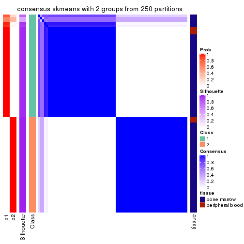</p>

</div>
<div id='tab-ATC-skmeans-consensus-heatmap-2'>
<pre><code class="r">consensus_heatmap(res, k = 3)
</code></pre>

<p>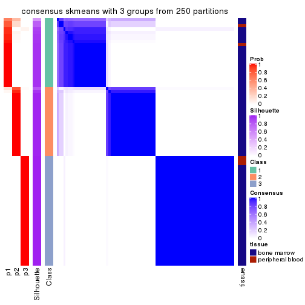</p>

</div>
<div id='tab-ATC-skmeans-consensus-heatmap-3'>
<pre><code class="r">consensus_heatmap(res, k = 4)
</code></pre>

<p>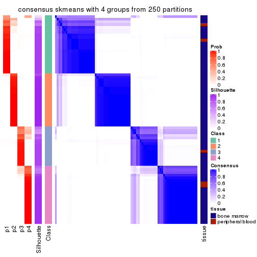</p>

</div>
<div id='tab-ATC-skmeans-consensus-heatmap-4'>
<pre><code class="r">consensus_heatmap(res, k = 5)
</code></pre>

<p>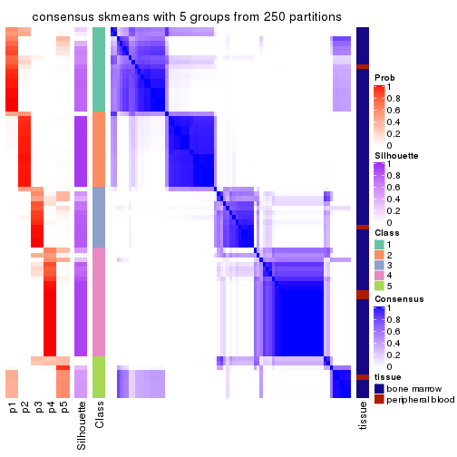</p>

</div>
<div id='tab-ATC-skmeans-consensus-heatmap-5'>
<pre><code class="r">consensus_heatmap(res, k = 6)
</code></pre>

<p>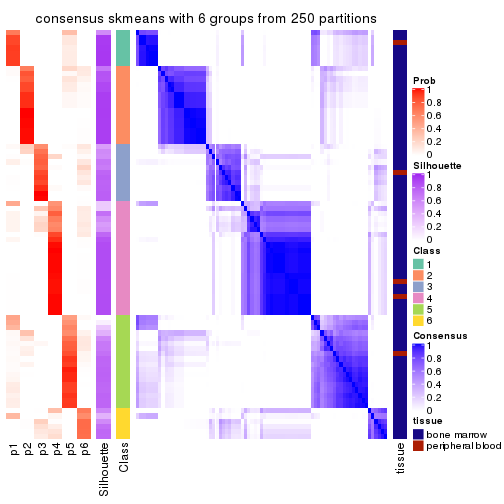</p>

</div>
</div>

Heatmaps for the membership of samples in all partitions to see how consistent they are:


<script>
$( function() {
	$( '#tabs-ATC-skmeans-membership-heatmap' ).tabs();
} );
</script>
<div id='tabs-ATC-skmeans-membership-heatmap'>
<ul>
<li><a href='#tab-ATC-skmeans-membership-heatmap-1'>k = 2</a></li>
<li><a href='#tab-ATC-skmeans-membership-heatmap-2'>k = 3</a></li>
<li><a href='#tab-ATC-skmeans-membership-heatmap-3'>k = 4</a></li>
<li><a href='#tab-ATC-skmeans-membership-heatmap-4'>k = 5</a></li>
<li><a href='#tab-ATC-skmeans-membership-heatmap-5'>k = 6</a></li>
</ul>
<div id='tab-ATC-skmeans-membership-heatmap-1'>
<pre><code class="r">membership_heatmap(res, k = 2)
</code></pre>

<p>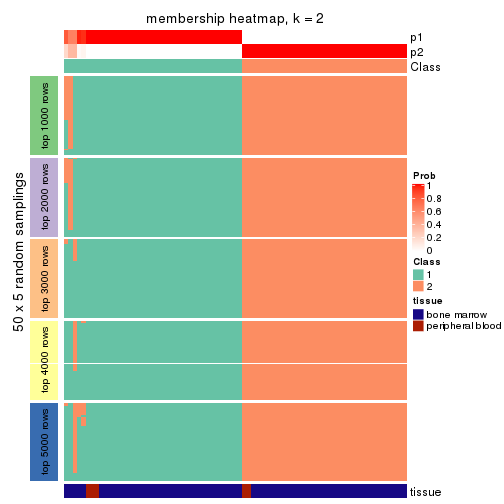</p>

</div>
<div id='tab-ATC-skmeans-membership-heatmap-2'>
<pre><code class="r">membership_heatmap(res, k = 3)
</code></pre>

<p>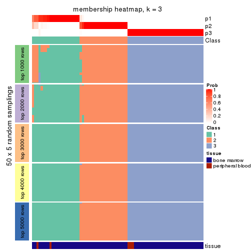</p>

</div>
<div id='tab-ATC-skmeans-membership-heatmap-3'>
<pre><code class="r">membership_heatmap(res, k = 4)
</code></pre>

<p>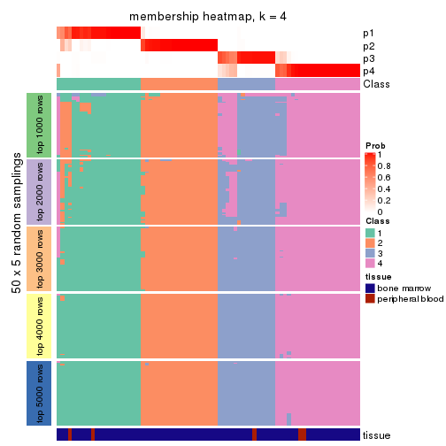</p>

</div>
<div id='tab-ATC-skmeans-membership-heatmap-4'>
<pre><code class="r">membership_heatmap(res, k = 5)
</code></pre>

<p>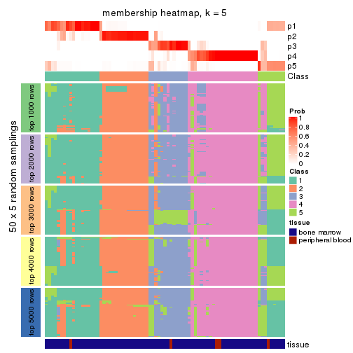</p>

</div>
<div id='tab-ATC-skmeans-membership-heatmap-5'>
<pre><code class="r">membership_heatmap(res, k = 6)
</code></pre>

<p>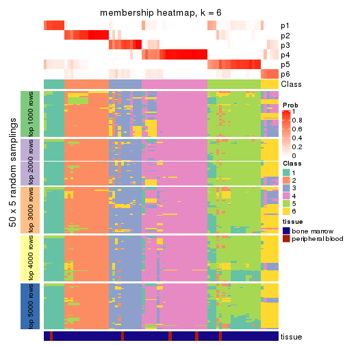</p>

</div>
</div>

As soon as we have had the classes for columns, we can look for signatures
which are significantly different between classes which can be candidate marks
for certain classes. Following are the heatmaps for signatures.


Signature heatmaps where rows are scaled:


<script>
$( function() {
	$( '#tabs-ATC-skmeans-get-signatures' ).tabs();
} );
</script>
<div id='tabs-ATC-skmeans-get-signatures'>
<ul>
<li><a href='#tab-ATC-skmeans-get-signatures-1'>k = 2</a></li>
<li><a href='#tab-ATC-skmeans-get-signatures-2'>k = 3</a></li>
<li><a href='#tab-ATC-skmeans-get-signatures-3'>k = 4</a></li>
<li><a href='#tab-ATC-skmeans-get-signatures-4'>k = 5</a></li>
<li><a href='#tab-ATC-skmeans-get-signatures-5'>k = 6</a></li>
</ul>
<div id='tab-ATC-skmeans-get-signatures-1'>
<pre><code class="r">get_signatures(res, k = 2)
</code></pre>

<p>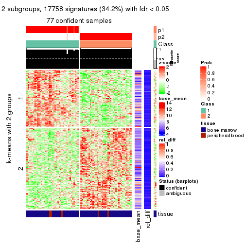</p>

</div>
<div id='tab-ATC-skmeans-get-signatures-2'>
<pre><code class="r">get_signatures(res, k = 3)
</code></pre>

<p>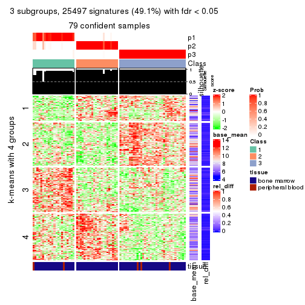</p>

</div>
<div id='tab-ATC-skmeans-get-signatures-3'>
<pre><code class="r">get_signatures(res, k = 4)
</code></pre>

<p>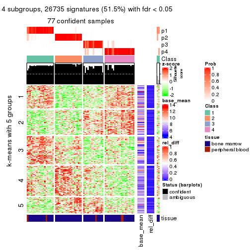</p>

</div>
<div id='tab-ATC-skmeans-get-signatures-4'>
<pre><code class="r">get_signatures(res, k = 5)
</code></pre>

<p>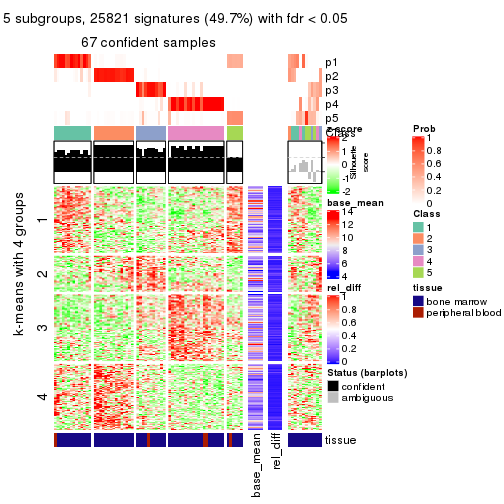</p>

</div>
<div id='tab-ATC-skmeans-get-signatures-5'>
<pre><code class="r">get_signatures(res, k = 6)
</code></pre>

<p>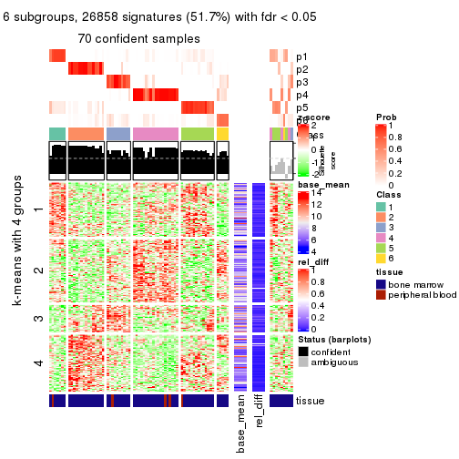</p>

</div>
</div>


Signature heatmaps where rows are not scaled:


<script>
$( function() {
	$( '#tabs-ATC-skmeans-get-signatures-no-scale' ).tabs();
} );
</script>
<div id='tabs-ATC-skmeans-get-signatures-no-scale'>
<ul>
<li><a href='#tab-ATC-skmeans-get-signatures-no-scale-1'>k = 2</a></li>
<li><a href='#tab-ATC-skmeans-get-signatures-no-scale-2'>k = 3</a></li>
<li><a href='#tab-ATC-skmeans-get-signatures-no-scale-3'>k = 4</a></li>
<li><a href='#tab-ATC-skmeans-get-signatures-no-scale-4'>k = 5</a></li>
<li><a href='#tab-ATC-skmeans-get-signatures-no-scale-5'>k = 6</a></li>
</ul>
<div id='tab-ATC-skmeans-get-signatures-no-scale-1'>
<pre><code class="r">get_signatures(res, k = 2, scale_rows = FALSE)
</code></pre>

<p>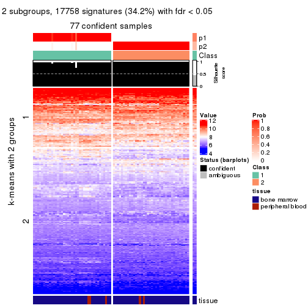</p>

</div>
<div id='tab-ATC-skmeans-get-signatures-no-scale-2'>
<pre><code class="r">get_signatures(res, k = 3, scale_rows = FALSE)
</code></pre>

<p>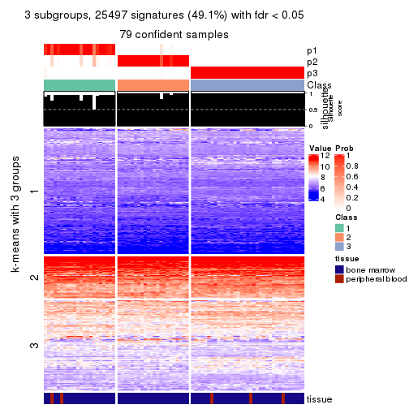</p>

</div>
<div id='tab-ATC-skmeans-get-signatures-no-scale-3'>
<pre><code class="r">get_signatures(res, k = 4, scale_rows = FALSE)
</code></pre>

<p>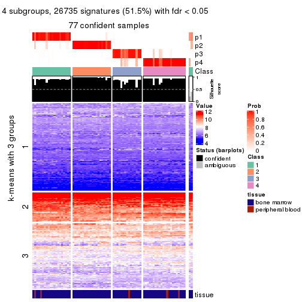</p>

</div>
<div id='tab-ATC-skmeans-get-signatures-no-scale-4'>
<pre><code class="r">get_signatures(res, k = 5, scale_rows = FALSE)
</code></pre>

<p>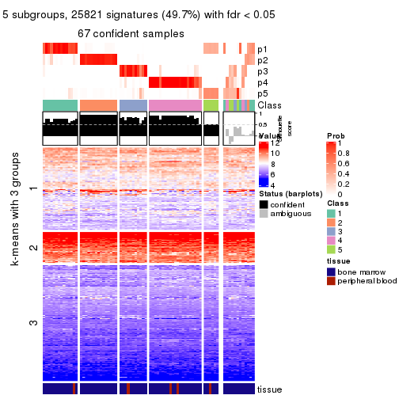</p>

</div>
<div id='tab-ATC-skmeans-get-signatures-no-scale-5'>
<pre><code class="r">get_signatures(res, k = 6, scale_rows = FALSE)
</code></pre>

<p>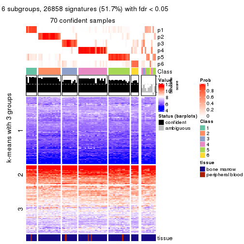</p>

</div>
</div>


Compare the overlap of signatures from different k:

```r
compare_signatures(res)
```

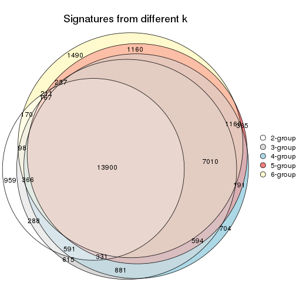

`get_signature()` returns a data frame invisibly. TO get the list of signatures, the function
call should be assigned to a variable explicitly. In following code, if `plot` argument is set
to `FALSE`, no heatmap is plotted while only the differential analysis is performed.

```r
# code only for demonstration
tb = get_signature(res, k = ..., plot = FALSE)
```

An example of the output of `tb` is:

```
#>   which_row         fdr    mean_1    mean_2 scaled_mean_1 scaled_mean_2 km
#> 1        38 0.042760348  8.373488  9.131774    -0.5533452     0.5164555  1
#> 2        40 0.018707592  7.106213  8.469186    -0.6173731     0.5762149  1
#> 3        55 0.019134737 10.221463 11.207825    -0.6159697     0.5749050  1
#> 4        59 0.006059896  5.921854  7.869574    -0.6899429     0.6439467  1
#> 5        60 0.018055526  8.928898 10.211722    -0.6204761     0.5791110  1
#> 6        98 0.009384629 15.714769 14.887706     0.6635654    -0.6193277  2
...
```

The columns in `tb` are:

1. `which_row`: row indices corresponding to the input matrix.
2. `fdr`: FDR for the differential test. 
3. `mean_x`: The mean value in group x.
4. `scaled_mean_x`: The mean value in group x after rows are scaled.
5. `km`: Row groups if k-means clustering is applied to rows.


UMAP plot which shows how samples are separated.


<script>
$( function() {
	$( '#tabs-ATC-skmeans-dimension-reduction' ).tabs();
} );
</script>
<div id='tabs-ATC-skmeans-dimension-reduction'>
<ul>
<li><a href='#tab-ATC-skmeans-dimension-reduction-1'>k = 2</a></li>
<li><a href='#tab-ATC-skmeans-dimension-reduction-2'>k = 3</a></li>
<li><a href='#tab-ATC-skmeans-dimension-reduction-3'>k = 4</a></li>
<li><a href='#tab-ATC-skmeans-dimension-reduction-4'>k = 5</a></li>
<li><a href='#tab-ATC-skmeans-dimension-reduction-5'>k = 6</a></li>
</ul>
<div id='tab-ATC-skmeans-dimension-reduction-1'>
<pre><code class="r">dimension_reduction(res, k = 2, method = &quot;UMAP&quot;)
</code></pre>

<p>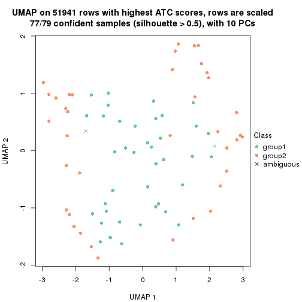</p>

</div>
<div id='tab-ATC-skmeans-dimension-reduction-2'>
<pre><code class="r">dimension_reduction(res, k = 3, method = &quot;UMAP&quot;)
</code></pre>

<p>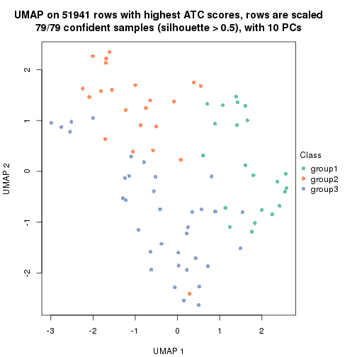</p>

</div>
<div id='tab-ATC-skmeans-dimension-reduction-3'>
<pre><code class="r">dimension_reduction(res, k = 4, method = &quot;UMAP&quot;)
</code></pre>

<p>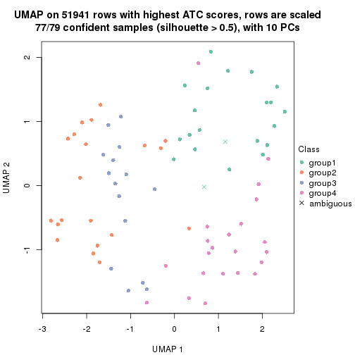</p>

</div>
<div id='tab-ATC-skmeans-dimension-reduction-4'>
<pre><code class="r">dimension_reduction(res, k = 5, method = &quot;UMAP&quot;)
</code></pre>

<p>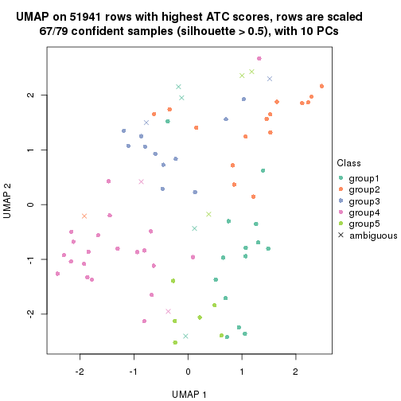</p>

</div>
<div id='tab-ATC-skmeans-dimension-reduction-5'>
<pre><code class="r">dimension_reduction(res, k = 6, method = &quot;UMAP&quot;)
</code></pre>

<p>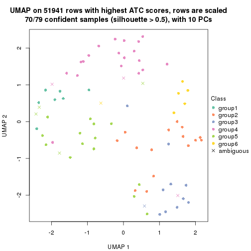</p>

</div>
</div>


Following heatmap shows how subgroups are split when increasing `k`:

```r
collect_classes(res)
```

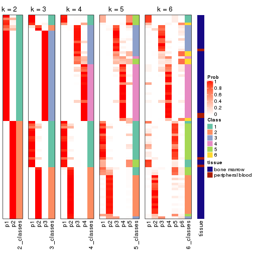


Test correlation between subgroups and known annotations. If the known
annotation is numeric, one-way ANOVA test is applied, and if the known
annotation is discrete, chi-squared contingency table test is applied.

```r
test_to_known_factors(res)
```

```
#>              n tissue(p) k
#> ATC:skmeans 77     1.000 2
#> ATC:skmeans 79     0.356 3
#> ATC:skmeans 77     0.564 4
#> ATC:skmeans 67     0.714 5
#> ATC:skmeans 70     0.772 6
```


If matrix rows can be associated to genes, consider to use `GO_Enrichment(res,
...)` to perform function enrichment for the signature genes.


 

---------------------------------------------------


### ATC:pam


The object with results only for a single top-value method and a single partition method 
can be extracted as:

```r
res = res_list["ATC", "pam"]
# you can also extract it by
# res = res_list["ATC:pam"]
```

A summary of `res` and all the functions that can be applied to it:

```r
res
```

```
#> A 'ConsensusPartition' object with k = 2, 3, 4, 5, 6.
#>   On a matrix with 51941 rows and 79 columns.
#>   Top rows (1000, 2000, 3000, 4000, 5000) are extracted by 'ATC' method.
#>   Subgroups are detected by 'pam' method.
#>   Performed in total 1250 partitions by row resampling.
#>   Best k for subgroups seems to be 6.
#> 
#> Following methods can be applied to this 'ConsensusPartition' object:
#>  [1] "cola_report"             "collect_classes"         "collect_plots"          
#>  [4] "collect_stats"           "colnames"                "compare_signatures"     
#>  [7] "consensus_heatmap"       "dimension_reduction"     "functional_enrichment"  
#> [10] "get_anno_col"            "get_anno"                "get_classes"            
#> [13] "get_consensus"           "get_matrix"              "get_membership"         
#> [16] "get_param"               "get_signatures"          "get_stats"              
#> [19] "is_best_k"               "is_stable_k"             "membership_heatmap"     
#> [22] "ncol"                    "nrow"                    "plot_ecdf"              
#> [25] "rownames"                "select_partition_number" "show"                   
#> [28] "suggest_best_k"          "test_to_known_factors"
```

`collect_plots()` function collects all the plots made from `res` for all `k` (number of partitions)
into one single page to provide an easy and fast comparison between different `k`.

```r
collect_plots(res)
```

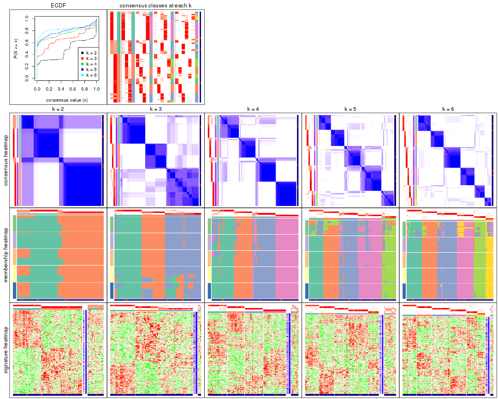

The plots are:

- The first row: a plot of the ECDF (Empirical cumulative distribution
  function) curves of the consensus matrix for each `k` and the heatmap of
  predicted classes for each `k`.
- The second row: heatmaps of the consensus matrix for each `k`.
- The third row: heatmaps of the membership matrix for each `k`.
- The fouth row: heatmaps of the signatures for each `k`.

All the plots in panels can be made by individual functions and they are
plotted later in this section.

`select_partition_number()` produces several plots showing different
statistics for choosing "optimized" `k`. There are following statistics:

- ECDF curves of the consensus matrix for each `k`;
- 1-PAC. [The PAC
  score](https://en.wikipedia.org/wiki/Consensus_clustering#Over-interpretation_potential_of_consensus_clustering)
  measures the proportion of the ambiguous subgrouping.
- Mean silhouette score.
- Concordance. The mean probability of fiting the consensus class ids in all
  partitions.
- Area increased. Denote $A_k$ as the area under the ECDF curve for current
  `k`, the area increased is defined as $A_k - A_{k-1}$.
- Rand index. The percent of pairs of samples that are both in a same cluster
  or both are not in a same cluster in the partition of k and k-1.
- Jaccard index. The ratio of pairs of samples are both in a same cluster in
  the partition of k and k-1 and the pairs of samples are both in a same
  cluster in the partition k or k-1.

The detailed explanations of these statistics can be found in [the cola
vignette](http://bioconductor.org/packages/devel/bioc/vignettes/cola/inst/doc/cola.html#toc_13).

Generally speaking, lower PAC score, higher mean silhouette score or higher
concordance corresponds to better partition. Rand index and Jaccard index
measure how similar the current partition is compared to partition with `k-1`.
If they are too similar, we won't accept `k` is better than `k-1`.

```r
select_partition_number(res)
```

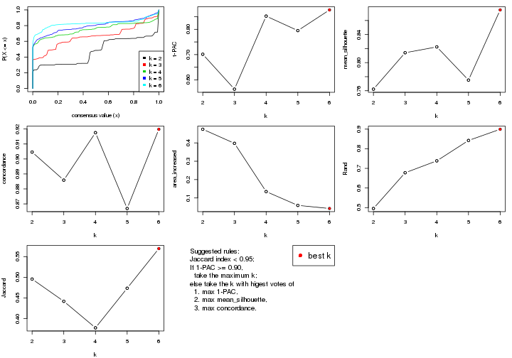

The numeric values for all these statistics can be obtained by `get_stats()`.

```r
get_stats(res)
```

```
#>   k 1-PAC mean_silhouette concordance area_increased  Rand Jaccard
#> 2 2 0.701           0.762       0.905         0.4743 0.496   0.496
#> 3 3 0.563           0.814       0.886         0.3975 0.678   0.442
#> 4 4 0.852           0.822       0.918         0.1347 0.738   0.378
#> 5 5 0.795           0.775       0.867         0.0595 0.842   0.473
#> 6 6 0.877           0.875       0.920         0.0426 0.899   0.569
```

`suggest_best_k()` suggests the best $k$ based on these statistics. The rules are as follows:

- All $k$ with Jaccard index larger than 0.95 are removed because the increase of
  the partition number does not provides enough extra information. If all $k$ are removed,
  the best $k$ is assigned by `NA`.
- For $k$ with 1-PAC larger than 0.9, the maximal $k$ is taken as the "best k". Other $k$ is called "optional k".
- If it does not fit the second rule. The $k$ with the highest vote of highest
  1-PAC, mean silhouette and concordance is taken as the "best k".

```r
suggest_best_k(res)
```

```
#> [1] 6
```


Following shows the table of the partitions (You need to click the **show/hide
code output** link to see it). The membership matrix (columns with name `p*`)
is inferred by
[`clue::cl_consensus()`](https://www.rdocumentation.org/link/cl_consensus?package=clue)
function with the `SE` method. Basically the value in the membership matrix
represents the probability to belong to a certain group. The finall class
label for an item is determined with the group with highest probability it
belongs to.

In `get_classes()` function, the entropy is calculated from the membership
matrix and the silhouette score is calculated from the consensus matrix.


<script>
$( function() {
	$( '#tabs-ATC-pam-get-classes' ).tabs();
} );
</script>
<div id='tabs-ATC-pam-get-classes'>
<ul>
<li><a href='#tab-ATC-pam-get-classes-1'>k = 2</a></li>
<li><a href='#tab-ATC-pam-get-classes-2'>k = 3</a></li>
<li><a href='#tab-ATC-pam-get-classes-3'>k = 4</a></li>
<li><a href='#tab-ATC-pam-get-classes-4'>k = 5</a></li>
<li><a href='#tab-ATC-pam-get-classes-5'>k = 6</a></li>
</ul>

<div id='tab-ATC-pam-get-classes-1'>
<p><a id='tab-ATC-pam-get-classes-1-a' style='color:#0366d6' href='#'>show/hide code output</a></p>
<pre><code class="r">cbind(get_classes(res, k = 2), get_membership(res, k = 2))
</code></pre>

<pre><code>#&gt;           class entropy silhouette    p1    p2
#&gt; GSM316652     2  0.0000     0.9364 0.000 1.000
#&gt; GSM316653     1  0.2603     0.8051 0.956 0.044
#&gt; GSM316654     1  0.9922     0.3756 0.552 0.448
#&gt; GSM316655     1  0.9933     0.3691 0.548 0.452
#&gt; GSM316656     2  0.0000     0.9364 0.000 1.000
#&gt; GSM316657     2  0.0672     0.9289 0.008 0.992
#&gt; GSM316658     2  0.0000     0.9364 0.000 1.000
#&gt; GSM316659     1  0.9933     0.3691 0.548 0.452
#&gt; GSM316660     2  0.0000     0.9364 0.000 1.000
#&gt; GSM316661     1  0.0000     0.8210 1.000 0.000
#&gt; GSM316662     2  0.0000     0.9364 0.000 1.000
#&gt; GSM316663     1  0.0000     0.8210 1.000 0.000
#&gt; GSM316664     1  0.0000     0.8210 1.000 0.000
#&gt; GSM316665     2  0.0000     0.9364 0.000 1.000
#&gt; GSM316666     2  0.9881    -0.0148 0.436 0.564
#&gt; GSM316667     2  0.0000     0.9364 0.000 1.000
#&gt; GSM316668     2  0.0000     0.9364 0.000 1.000
#&gt; GSM316669     1  0.0000     0.8210 1.000 0.000
#&gt; GSM316670     2  0.9896    -0.0312 0.440 0.560
#&gt; GSM316671     2  0.0000     0.9364 0.000 1.000
#&gt; GSM316672     2  0.0000     0.9364 0.000 1.000
#&gt; GSM316673     1  0.0672     0.8188 0.992 0.008
#&gt; GSM316674     2  0.0000     0.9364 0.000 1.000
#&gt; GSM316676     1  0.9954     0.3484 0.540 0.460
#&gt; GSM316677     1  0.2948     0.8012 0.948 0.052
#&gt; GSM316678     2  0.0000     0.9364 0.000 1.000
#&gt; GSM316679     2  0.0000     0.9364 0.000 1.000
#&gt; GSM316680     2  0.0000     0.9364 0.000 1.000
#&gt; GSM316681     2  0.0000     0.9364 0.000 1.000
#&gt; GSM316682     1  0.0000     0.8210 1.000 0.000
#&gt; GSM316683     1  0.0000     0.8210 1.000 0.000
#&gt; GSM316684     2  0.0000     0.9364 0.000 1.000
#&gt; GSM316685     2  0.0000     0.9364 0.000 1.000
#&gt; GSM316686     1  0.0000     0.8210 1.000 0.000
#&gt; GSM316687     1  0.2778     0.8034 0.952 0.048
#&gt; GSM316688     2  0.6801     0.6931 0.180 0.820
#&gt; GSM316689     1  0.9909     0.3838 0.556 0.444
#&gt; GSM316690     1  0.0000     0.8210 1.000 0.000
#&gt; GSM316691     2  0.9881    -0.0148 0.436 0.564
#&gt; GSM316692     1  0.0000     0.8210 1.000 0.000
#&gt; GSM316693     1  0.0000     0.8210 1.000 0.000
#&gt; GSM316694     1  0.9933     0.3691 0.548 0.452
#&gt; GSM316696     1  0.2778     0.8034 0.952 0.048
#&gt; GSM316697     2  0.9881    -0.0148 0.436 0.564
#&gt; GSM316698     2  0.0000     0.9364 0.000 1.000
#&gt; GSM316699     2  0.0000     0.9364 0.000 1.000
#&gt; GSM316700     1  0.0000     0.8210 1.000 0.000
#&gt; GSM316701     1  0.9933     0.3691 0.548 0.452
#&gt; GSM316703     1  0.0000     0.8210 1.000 0.000
#&gt; GSM316704     1  0.0376     0.8200 0.996 0.004
#&gt; GSM316705     1  0.0000     0.8210 1.000 0.000
#&gt; GSM316706     1  0.0000     0.8210 1.000 0.000
#&gt; GSM316707     2  0.0000     0.9364 0.000 1.000
#&gt; GSM316708     2  0.0000     0.9364 0.000 1.000
#&gt; GSM316709     1  0.9933     0.3691 0.548 0.452
#&gt; GSM316710     1  0.0000     0.8210 1.000 0.000
#&gt; GSM316711     1  0.9933     0.3691 0.548 0.452
#&gt; GSM316713     1  0.9358     0.5233 0.648 0.352
#&gt; GSM316714     1  0.0000     0.8210 1.000 0.000
#&gt; GSM316715     2  0.2423     0.8958 0.040 0.960
#&gt; GSM316716     2  0.0000     0.9364 0.000 1.000
#&gt; GSM316717     2  0.0000     0.9364 0.000 1.000
#&gt; GSM316718     2  0.0000     0.9364 0.000 1.000
#&gt; GSM316719     2  0.0000     0.9364 0.000 1.000
#&gt; GSM316720     2  0.0000     0.9364 0.000 1.000
#&gt; GSM316721     2  0.0000     0.9364 0.000 1.000
#&gt; GSM316722     2  0.0000     0.9364 0.000 1.000
#&gt; GSM316723     2  0.0000     0.9364 0.000 1.000
#&gt; GSM316724     2  0.0000     0.9364 0.000 1.000
#&gt; GSM316726     2  0.0000     0.9364 0.000 1.000
#&gt; GSM316727     2  0.0000     0.9364 0.000 1.000
#&gt; GSM316728     1  0.0000     0.8210 1.000 0.000
#&gt; GSM316729     2  0.0000     0.9364 0.000 1.000
#&gt; GSM316730     1  0.9933     0.3691 0.548 0.452
#&gt; GSM316675     1  0.9933     0.3691 0.548 0.452
#&gt; GSM316695     2  0.0000     0.9364 0.000 1.000
#&gt; GSM316702     1  0.0000     0.8210 1.000 0.000
#&gt; GSM316712     2  0.2236     0.9002 0.036 0.964
#&gt; GSM316725     1  0.0000     0.8210 1.000 0.000
</code></pre>

<script>
$('#tab-ATC-pam-get-classes-1-a').parent().next().next().hide();
$('#tab-ATC-pam-get-classes-1-a').click(function(){
  $('#tab-ATC-pam-get-classes-1-a').parent().next().next().toggle();
  return(false);
});
</script>
</div>

<div id='tab-ATC-pam-get-classes-2'>
<p><a id='tab-ATC-pam-get-classes-2-a' style='color:#0366d6' href='#'>show/hide code output</a></p>
<pre><code class="r">cbind(get_classes(res, k = 3), get_membership(res, k = 3))
</code></pre>

<pre><code>#&gt;           class entropy silhouette    p1    p2    p3
#&gt; GSM316652     3  0.4399     0.7611 0.000 0.188 0.812
#&gt; GSM316653     1  0.1643     0.8962 0.956 0.000 0.044
#&gt; GSM316654     3  0.5591     0.6879 0.304 0.000 0.696
#&gt; GSM316655     3  0.4399     0.7606 0.188 0.000 0.812
#&gt; GSM316656     3  0.3192     0.7661 0.000 0.112 0.888
#&gt; GSM316657     3  0.5621     0.7123 0.000 0.308 0.692
#&gt; GSM316658     3  0.0000     0.8119 0.000 0.000 1.000
#&gt; GSM316659     3  0.3192     0.8038 0.112 0.000 0.888
#&gt; GSM316660     3  0.5621     0.7123 0.000 0.308 0.692
#&gt; GSM316661     1  0.0000     0.9271 1.000 0.000 0.000
#&gt; GSM316662     2  0.4399     0.8745 0.000 0.812 0.188
#&gt; GSM316663     1  0.3192     0.8568 0.888 0.000 0.112
#&gt; GSM316664     1  0.0000     0.9271 1.000 0.000 0.000
#&gt; GSM316665     3  0.2959     0.7741 0.000 0.100 0.900
#&gt; GSM316666     3  0.0000     0.8119 0.000 0.000 1.000
#&gt; GSM316667     3  0.1529     0.8026 0.000 0.040 0.960
#&gt; GSM316668     3  0.3192     0.7661 0.000 0.112 0.888
#&gt; GSM316669     1  0.0000     0.9271 1.000 0.000 0.000
#&gt; GSM316670     3  0.2625     0.8170 0.084 0.000 0.916
#&gt; GSM316671     2  0.4399     0.8745 0.000 0.812 0.188
#&gt; GSM316672     2  0.0000     0.8942 0.000 1.000 0.000
#&gt; GSM316673     1  0.0424     0.9227 0.992 0.000 0.008
#&gt; GSM316674     3  0.0000     0.8119 0.000 0.000 1.000
#&gt; GSM316676     3  0.2625     0.8170 0.084 0.000 0.916
#&gt; GSM316677     1  0.9496    -0.0857 0.440 0.188 0.372
#&gt; GSM316678     2  0.4399     0.8745 0.000 0.812 0.188
#&gt; GSM316679     2  0.0000     0.8942 0.000 1.000 0.000
#&gt; GSM316680     2  0.0000     0.8942 0.000 1.000 0.000
#&gt; GSM316681     2  0.4399     0.8745 0.000 0.812 0.188
#&gt; GSM316682     1  0.0000     0.9271 1.000 0.000 0.000
#&gt; GSM316683     1  0.0000     0.9271 1.000 0.000 0.000
#&gt; GSM316684     3  0.3267     0.7630 0.000 0.116 0.884
#&gt; GSM316685     3  0.0000     0.8119 0.000 0.000 1.000
#&gt; GSM316686     1  0.0000     0.9271 1.000 0.000 0.000
#&gt; GSM316687     1  0.1753     0.8930 0.952 0.000 0.048
#&gt; GSM316688     3  0.7365     0.7458 0.112 0.188 0.700
#&gt; GSM316689     3  0.7365     0.7458 0.112 0.188 0.700
#&gt; GSM316690     1  0.3192     0.8568 0.888 0.000 0.112
#&gt; GSM316691     3  0.4399     0.7606 0.188 0.000 0.812
#&gt; GSM316692     1  0.3192     0.8568 0.888 0.000 0.112
#&gt; GSM316693     1  0.0000     0.9271 1.000 0.000 0.000
#&gt; GSM316694     3  0.5560     0.6925 0.300 0.000 0.700
#&gt; GSM316696     1  0.8566     0.4485 0.608 0.188 0.204
#&gt; GSM316697     3  0.2625     0.8170 0.084 0.000 0.916
#&gt; GSM316698     2  0.4399     0.8745 0.000 0.812 0.188
#&gt; GSM316699     3  0.0000     0.8119 0.000 0.000 1.000
#&gt; GSM316700     1  0.0000     0.9271 1.000 0.000 0.000
#&gt; GSM316701     3  0.4399     0.7606 0.188 0.000 0.812
#&gt; GSM316703     1  0.3192     0.8568 0.888 0.000 0.112
#&gt; GSM316704     1  0.3267     0.8541 0.884 0.000 0.116
#&gt; GSM316705     1  0.0000     0.9271 1.000 0.000 0.000
#&gt; GSM316706     1  0.0000     0.9271 1.000 0.000 0.000
#&gt; GSM316707     3  0.0000     0.8119 0.000 0.000 1.000
#&gt; GSM316708     2  0.3482     0.8837 0.000 0.872 0.128
#&gt; GSM316709     3  0.4399     0.7606 0.188 0.000 0.812
#&gt; GSM316710     1  0.0000     0.9271 1.000 0.000 0.000
#&gt; GSM316711     3  0.3038     0.8070 0.104 0.000 0.896
#&gt; GSM316713     3  0.7365     0.7458 0.112 0.188 0.700
#&gt; GSM316714     1  0.0000     0.9271 1.000 0.000 0.000
#&gt; GSM316715     2  0.0000     0.8942 0.000 1.000 0.000
#&gt; GSM316716     3  0.6274    -0.0793 0.000 0.456 0.544
#&gt; GSM316717     2  0.0000     0.8942 0.000 1.000 0.000
#&gt; GSM316718     2  0.0000     0.8942 0.000 1.000 0.000
#&gt; GSM316719     2  0.0000     0.8942 0.000 1.000 0.000
#&gt; GSM316720     2  0.0000     0.8942 0.000 1.000 0.000
#&gt; GSM316721     2  0.4399     0.8745 0.000 0.812 0.188
#&gt; GSM316722     2  0.0000     0.8942 0.000 1.000 0.000
#&gt; GSM316723     2  0.4399     0.8745 0.000 0.812 0.188
#&gt; GSM316724     2  0.4399     0.8745 0.000 0.812 0.188
#&gt; GSM316726     2  0.4399     0.8745 0.000 0.812 0.188
#&gt; GSM316727     2  0.0000     0.8942 0.000 1.000 0.000
#&gt; GSM316728     1  0.0000     0.9271 1.000 0.000 0.000
#&gt; GSM316729     2  0.1031     0.8940 0.000 0.976 0.024
#&gt; GSM316730     3  0.5560     0.6925 0.300 0.000 0.700
#&gt; GSM316675     3  0.4399     0.7606 0.188 0.000 0.812
#&gt; GSM316695     3  0.5591     0.7160 0.000 0.304 0.696
#&gt; GSM316702     1  0.0000     0.9271 1.000 0.000 0.000
#&gt; GSM316712     3  0.5560     0.7191 0.000 0.300 0.700
#&gt; GSM316725     1  0.0000     0.9271 1.000 0.000 0.000
</code></pre>

<script>
$('#tab-ATC-pam-get-classes-2-a').parent().next().next().hide();
$('#tab-ATC-pam-get-classes-2-a').click(function(){
  $('#tab-ATC-pam-get-classes-2-a').parent().next().next().toggle();
  return(false);
});
</script>
</div>

<div id='tab-ATC-pam-get-classes-3'>
<p><a id='tab-ATC-pam-get-classes-3-a' style='color:#0366d6' href='#'>show/hide code output</a></p>
<pre><code class="r">cbind(get_classes(res, k = 4), get_membership(res, k = 4))
</code></pre>

<pre><code>#&gt;           class entropy silhouette    p1    p2    p3    p4
#&gt; GSM316652     3  0.0000     0.8816 0.000 0.000 1.000 0.000
#&gt; GSM316653     3  0.4564     0.4935 0.000 0.000 0.672 0.328
#&gt; GSM316654     3  0.0000     0.8816 0.000 0.000 1.000 0.000
#&gt; GSM316655     3  0.0000     0.8816 0.000 0.000 1.000 0.000
#&gt; GSM316656     3  0.0000     0.8816 0.000 0.000 1.000 0.000
#&gt; GSM316657     1  0.4761     0.5685 0.628 0.000 0.372 0.000
#&gt; GSM316658     2  0.1389     0.8980 0.000 0.952 0.048 0.000
#&gt; GSM316659     2  0.5070     0.4026 0.000 0.620 0.372 0.008
#&gt; GSM316660     1  0.5827     0.6148 0.632 0.052 0.316 0.000
#&gt; GSM316661     4  0.0000     0.9941 0.000 0.000 0.000 1.000
#&gt; GSM316662     2  0.0188     0.9218 0.004 0.996 0.000 0.000
#&gt; GSM316663     4  0.0000     0.9941 0.000 0.000 0.000 1.000
#&gt; GSM316664     4  0.0000     0.9941 0.000 0.000 0.000 1.000
#&gt; GSM316665     2  0.0000     0.9231 0.000 1.000 0.000 0.000
#&gt; GSM316666     3  0.0000     0.8816 0.000 0.000 1.000 0.000
#&gt; GSM316667     2  0.3311     0.7613 0.000 0.828 0.172 0.000
#&gt; GSM316668     2  0.1389     0.8980 0.000 0.952 0.048 0.000
#&gt; GSM316669     4  0.0000     0.9941 0.000 0.000 0.000 1.000
#&gt; GSM316670     3  0.0000     0.8816 0.000 0.000 1.000 0.000
#&gt; GSM316671     2  0.4564     0.5480 0.328 0.672 0.000 0.000
#&gt; GSM316672     1  0.6478     0.4677 0.576 0.336 0.088 0.000
#&gt; GSM316673     4  0.0927     0.9742 0.016 0.000 0.008 0.976
#&gt; GSM316674     3  0.2011     0.8105 0.000 0.080 0.920 0.000
#&gt; GSM316676     3  0.0000     0.8816 0.000 0.000 1.000 0.000
#&gt; GSM316677     1  0.6285     0.6104 0.624 0.000 0.284 0.092
#&gt; GSM316678     2  0.0000     0.9231 0.000 1.000 0.000 0.000
#&gt; GSM316679     1  0.0000     0.8113 1.000 0.000 0.000 0.000
#&gt; GSM316680     1  0.0000     0.8113 1.000 0.000 0.000 0.000
#&gt; GSM316681     3  0.6009    -0.0171 0.040 0.468 0.492 0.000
#&gt; GSM316682     4  0.0000     0.9941 0.000 0.000 0.000 1.000
#&gt; GSM316683     4  0.0000     0.9941 0.000 0.000 0.000 1.000
#&gt; GSM316684     2  0.0000     0.9231 0.000 1.000 0.000 0.000
#&gt; GSM316685     2  0.1389     0.8980 0.000 0.952 0.048 0.000
#&gt; GSM316686     4  0.0000     0.9941 0.000 0.000 0.000 1.000
#&gt; GSM316687     4  0.1716     0.9260 0.000 0.000 0.064 0.936
#&gt; GSM316688     1  0.4761     0.5685 0.628 0.000 0.372 0.000
#&gt; GSM316689     1  0.4936     0.5663 0.624 0.000 0.372 0.004
#&gt; GSM316690     3  0.4817     0.3732 0.000 0.000 0.612 0.388
#&gt; GSM316691     3  0.0000     0.8816 0.000 0.000 1.000 0.000
#&gt; GSM316692     4  0.0000     0.9941 0.000 0.000 0.000 1.000
#&gt; GSM316693     4  0.0000     0.9941 0.000 0.000 0.000 1.000
#&gt; GSM316694     3  0.0000     0.8816 0.000 0.000 1.000 0.000
#&gt; GSM316696     1  0.6653     0.6129 0.624 0.000 0.196 0.180
#&gt; GSM316697     3  0.0000     0.8816 0.000 0.000 1.000 0.000
#&gt; GSM316698     2  0.0000     0.9231 0.000 1.000 0.000 0.000
#&gt; GSM316699     3  0.0000     0.8816 0.000 0.000 1.000 0.000
#&gt; GSM316700     4  0.0000     0.9941 0.000 0.000 0.000 1.000
#&gt; GSM316701     3  0.0000     0.8816 0.000 0.000 1.000 0.000
#&gt; GSM316703     4  0.0336     0.9882 0.000 0.000 0.008 0.992
#&gt; GSM316704     4  0.0469     0.9849 0.000 0.000 0.012 0.988
#&gt; GSM316705     4  0.0000     0.9941 0.000 0.000 0.000 1.000
#&gt; GSM316706     4  0.0000     0.9941 0.000 0.000 0.000 1.000
#&gt; GSM316707     2  0.0000     0.9231 0.000 1.000 0.000 0.000
#&gt; GSM316708     1  0.7225     0.2904 0.512 0.328 0.160 0.000
#&gt; GSM316709     3  0.0000     0.8816 0.000 0.000 1.000 0.000
#&gt; GSM316710     4  0.0000     0.9941 0.000 0.000 0.000 1.000
#&gt; GSM316711     3  0.0000     0.8816 0.000 0.000 1.000 0.000
#&gt; GSM316713     1  0.1474     0.8061 0.948 0.000 0.052 0.000
#&gt; GSM316714     4  0.0000     0.9941 0.000 0.000 0.000 1.000
#&gt; GSM316715     1  0.0000     0.8113 1.000 0.000 0.000 0.000
#&gt; GSM316716     2  0.0000     0.9231 0.000 1.000 0.000 0.000
#&gt; GSM316717     1  0.0000     0.8113 1.000 0.000 0.000 0.000
#&gt; GSM316718     1  0.0000     0.8113 1.000 0.000 0.000 0.000
#&gt; GSM316719     1  0.0000     0.8113 1.000 0.000 0.000 0.000
#&gt; GSM316720     1  0.0000     0.8113 1.000 0.000 0.000 0.000
#&gt; GSM316721     2  0.1211     0.8991 0.040 0.960 0.000 0.000
#&gt; GSM316722     1  0.1211     0.7974 0.960 0.040 0.000 0.000
#&gt; GSM316723     2  0.0000     0.9231 0.000 1.000 0.000 0.000
#&gt; GSM316724     2  0.0188     0.9218 0.004 0.996 0.000 0.000
#&gt; GSM316726     2  0.0000     0.9231 0.000 1.000 0.000 0.000
#&gt; GSM316727     1  0.0000     0.8113 1.000 0.000 0.000 0.000
#&gt; GSM316728     4  0.0000     0.9941 0.000 0.000 0.000 1.000
#&gt; GSM316729     3  0.1211     0.8465 0.040 0.000 0.960 0.000
#&gt; GSM316730     3  0.5000     0.0301 0.000 0.000 0.500 0.500
#&gt; GSM316675     3  0.0000     0.8816 0.000 0.000 1.000 0.000
#&gt; GSM316695     1  0.3528     0.7026 0.808 0.192 0.000 0.000
#&gt; GSM316702     4  0.0000     0.9941 0.000 0.000 0.000 1.000
#&gt; GSM316712     1  0.1474     0.8061 0.948 0.000 0.052 0.000
#&gt; GSM316725     4  0.0000     0.9941 0.000 0.000 0.000 1.000
</code></pre>

<script>
$('#tab-ATC-pam-get-classes-3-a').parent().next().next().hide();
$('#tab-ATC-pam-get-classes-3-a').click(function(){
  $('#tab-ATC-pam-get-classes-3-a').parent().next().next().toggle();
  return(false);
});
</script>
</div>

<div id='tab-ATC-pam-get-classes-4'>
<p><a id='tab-ATC-pam-get-classes-4-a' style='color:#0366d6' href='#'>show/hide code output</a></p>
<pre><code class="r">cbind(get_classes(res, k = 5), get_membership(res, k = 5))
</code></pre>

<pre><code>#&gt;           class entropy silhouette    p1    p2    p3    p4    p5
#&gt; GSM316652     5  0.4219     0.4023 0.000 0.000 0.416 0.000 0.584
#&gt; GSM316653     4  0.3424     0.6379 0.000 0.000 0.240 0.760 0.000
#&gt; GSM316654     4  0.4307     0.1578 0.000 0.000 0.500 0.500 0.000
#&gt; GSM316655     3  0.0000     0.8318 0.000 0.000 1.000 0.000 0.000
#&gt; GSM316656     5  0.4101     0.4876 0.000 0.000 0.372 0.000 0.628
#&gt; GSM316657     1  0.3074     0.8504 0.804 0.000 0.196 0.000 0.000
#&gt; GSM316658     2  0.0703     0.9522 0.000 0.976 0.024 0.000 0.000
#&gt; GSM316659     3  0.2042     0.8137 0.036 0.016 0.932 0.008 0.008
#&gt; GSM316660     1  0.3728     0.8531 0.804 0.024 0.164 0.000 0.008
#&gt; GSM316661     4  0.0000     0.8593 0.000 0.000 0.000 1.000 0.000
#&gt; GSM316662     2  0.1608     0.9333 0.000 0.928 0.000 0.000 0.072
#&gt; GSM316663     3  0.5892     0.3958 0.100 0.000 0.580 0.312 0.008
#&gt; GSM316664     4  0.1908     0.8343 0.092 0.000 0.000 0.908 0.000
#&gt; GSM316665     2  0.0000     0.9659 0.000 1.000 0.000 0.000 0.000
#&gt; GSM316666     3  0.0963     0.8233 0.036 0.000 0.964 0.000 0.000
#&gt; GSM316667     2  0.0000     0.9659 0.000 1.000 0.000 0.000 0.000
#&gt; GSM316668     2  0.0703     0.9522 0.000 0.976 0.024 0.000 0.000
#&gt; GSM316669     4  0.0000     0.8593 0.000 0.000 0.000 1.000 0.000
#&gt; GSM316670     3  0.0000     0.8318 0.000 0.000 1.000 0.000 0.000
#&gt; GSM316671     5  0.0880     0.8114 0.000 0.032 0.000 0.000 0.968
#&gt; GSM316672     5  0.2971     0.7716 0.008 0.156 0.000 0.000 0.836
#&gt; GSM316673     4  0.0955     0.8475 0.028 0.000 0.004 0.968 0.000
#&gt; GSM316674     3  0.2179     0.7586 0.000 0.112 0.888 0.000 0.000
#&gt; GSM316676     3  0.0000     0.8318 0.000 0.000 1.000 0.000 0.000
#&gt; GSM316677     1  0.3074     0.8504 0.804 0.000 0.196 0.000 0.000
#&gt; GSM316678     5  0.4249     0.3450 0.000 0.432 0.000 0.000 0.568
#&gt; GSM316679     5  0.1671     0.7911 0.076 0.000 0.000 0.000 0.924
#&gt; GSM316680     1  0.2424     0.8320 0.868 0.000 0.000 0.000 0.132
#&gt; GSM316681     5  0.2233     0.7934 0.000 0.080 0.016 0.000 0.904
#&gt; GSM316682     4  0.1908     0.8343 0.092 0.000 0.000 0.908 0.000
#&gt; GSM316683     4  0.0000     0.8593 0.000 0.000 0.000 1.000 0.000
#&gt; GSM316684     2  0.0000     0.9659 0.000 1.000 0.000 0.000 0.000
#&gt; GSM316685     2  0.0703     0.9522 0.000 0.976 0.024 0.000 0.000
#&gt; GSM316686     4  0.0000     0.8593 0.000 0.000 0.000 1.000 0.000
#&gt; GSM316687     4  0.1792     0.8128 0.000 0.000 0.084 0.916 0.000
#&gt; GSM316688     1  0.3074     0.8504 0.804 0.000 0.196 0.000 0.000
#&gt; GSM316689     1  0.3074     0.8504 0.804 0.000 0.196 0.000 0.000
#&gt; GSM316690     3  0.4480     0.6956 0.128 0.000 0.772 0.092 0.008
#&gt; GSM316691     3  0.0000     0.8318 0.000 0.000 1.000 0.000 0.000
#&gt; GSM316692     4  0.5773     0.0972 0.092 0.000 0.396 0.512 0.000
#&gt; GSM316693     4  0.1908     0.8343 0.092 0.000 0.000 0.908 0.000
#&gt; GSM316694     4  0.4227     0.3570 0.000 0.000 0.420 0.580 0.000
#&gt; GSM316696     1  0.3282     0.8515 0.804 0.000 0.188 0.008 0.000
#&gt; GSM316697     3  0.0000     0.8318 0.000 0.000 1.000 0.000 0.000
#&gt; GSM316698     2  0.0000     0.9659 0.000 1.000 0.000 0.000 0.000
#&gt; GSM316699     3  0.4192     0.2585 0.000 0.404 0.596 0.000 0.000
#&gt; GSM316700     4  0.0000     0.8593 0.000 0.000 0.000 1.000 0.000
#&gt; GSM316701     3  0.0000     0.8318 0.000 0.000 1.000 0.000 0.000
#&gt; GSM316703     3  0.5345     0.2398 0.036 0.000 0.520 0.436 0.008
#&gt; GSM316704     3  0.5159     0.4273 0.036 0.000 0.604 0.352 0.008
#&gt; GSM316705     4  0.0000     0.8593 0.000 0.000 0.000 1.000 0.000
#&gt; GSM316706     4  0.1251     0.8432 0.036 0.000 0.000 0.956 0.008
#&gt; GSM316707     2  0.0000     0.9659 0.000 1.000 0.000 0.000 0.000
#&gt; GSM316708     5  0.0290     0.8121 0.000 0.008 0.000 0.000 0.992
#&gt; GSM316709     3  0.0000     0.8318 0.000 0.000 1.000 0.000 0.000
#&gt; GSM316710     4  0.1544     0.8429 0.068 0.000 0.000 0.932 0.000
#&gt; GSM316711     3  0.1251     0.8210 0.036 0.000 0.956 0.000 0.008
#&gt; GSM316713     1  0.2914     0.8582 0.872 0.000 0.052 0.000 0.076
#&gt; GSM316714     4  0.0000     0.8593 0.000 0.000 0.000 1.000 0.000
#&gt; GSM316715     1  0.2377     0.8339 0.872 0.000 0.000 0.000 0.128
#&gt; GSM316716     2  0.0000     0.9659 0.000 1.000 0.000 0.000 0.000
#&gt; GSM316717     5  0.0290     0.8101 0.008 0.000 0.000 0.000 0.992
#&gt; GSM316718     5  0.1671     0.7911 0.076 0.000 0.000 0.000 0.924
#&gt; GSM316719     1  0.2377     0.8339 0.872 0.000 0.000 0.000 0.128
#&gt; GSM316720     1  0.2424     0.8320 0.868 0.000 0.000 0.000 0.132
#&gt; GSM316721     2  0.2280     0.8875 0.000 0.880 0.000 0.000 0.120
#&gt; GSM316722     5  0.1012     0.8120 0.012 0.020 0.000 0.000 0.968
#&gt; GSM316723     2  0.0000     0.9659 0.000 1.000 0.000 0.000 0.000
#&gt; GSM316724     2  0.1608     0.9333 0.000 0.928 0.000 0.000 0.072
#&gt; GSM316726     2  0.1544     0.9351 0.000 0.932 0.000 0.000 0.068
#&gt; GSM316727     5  0.2891     0.7034 0.176 0.000 0.000 0.000 0.824
#&gt; GSM316728     4  0.0000     0.8593 0.000 0.000 0.000 1.000 0.000
#&gt; GSM316729     5  0.2773     0.7364 0.000 0.000 0.164 0.000 0.836
#&gt; GSM316730     4  0.4192     0.3892 0.000 0.000 0.404 0.596 0.000
#&gt; GSM316675     3  0.0000     0.8318 0.000 0.000 1.000 0.000 0.000
#&gt; GSM316695     1  0.3888     0.7626 0.804 0.120 0.000 0.000 0.076
#&gt; GSM316702     4  0.0000     0.8593 0.000 0.000 0.000 1.000 0.000
#&gt; GSM316712     1  0.2914     0.8582 0.872 0.000 0.052 0.000 0.076
#&gt; GSM316725     4  0.1908     0.8343 0.092 0.000 0.000 0.908 0.000
</code></pre>

<script>
$('#tab-ATC-pam-get-classes-4-a').parent().next().next().hide();
$('#tab-ATC-pam-get-classes-4-a').click(function(){
  $('#tab-ATC-pam-get-classes-4-a').parent().next().next().toggle();
  return(false);
});
</script>
</div>

<div id='tab-ATC-pam-get-classes-5'>
<p><a id='tab-ATC-pam-get-classes-5-a' style='color:#0366d6' href='#'>show/hide code output</a></p>
<pre><code class="r">cbind(get_classes(res, k = 6), get_membership(res, k = 6))
</code></pre>

<pre><code>#&gt;           class entropy silhouette    p1    p2    p3    p4    p5    p6
#&gt; GSM316652     3  0.1588      0.872 0.000 0.004 0.924 0.000 0.072 0.000
#&gt; GSM316653     3  0.3695      0.419 0.000 0.000 0.624 0.376 0.000 0.000
#&gt; GSM316654     3  0.0000      0.925 0.000 0.000 1.000 0.000 0.000 0.000
#&gt; GSM316655     3  0.0000      0.925 0.000 0.000 1.000 0.000 0.000 0.000
#&gt; GSM316656     3  0.2146      0.831 0.000 0.004 0.880 0.000 0.116 0.000
#&gt; GSM316657     1  0.1501      0.903 0.924 0.000 0.076 0.000 0.000 0.000
#&gt; GSM316658     2  0.0260      0.951 0.000 0.992 0.008 0.000 0.000 0.000
#&gt; GSM316659     6  0.2402      0.847 0.000 0.000 0.140 0.004 0.000 0.856
#&gt; GSM316660     1  0.1643      0.903 0.924 0.008 0.068 0.000 0.000 0.000
#&gt; GSM316661     4  0.0000      0.931 0.000 0.000 0.000 1.000 0.000 0.000
#&gt; GSM316662     2  0.2165      0.893 0.000 0.884 0.000 0.000 0.108 0.008
#&gt; GSM316663     6  0.2264      0.767 0.012 0.000 0.000 0.096 0.004 0.888
#&gt; GSM316664     4  0.2917      0.886 0.016 0.000 0.000 0.840 0.008 0.136
#&gt; GSM316665     2  0.0000      0.954 0.000 1.000 0.000 0.000 0.000 0.000
#&gt; GSM316666     3  0.0790      0.904 0.000 0.000 0.968 0.000 0.000 0.032
#&gt; GSM316667     2  0.0000      0.954 0.000 1.000 0.000 0.000 0.000 0.000
#&gt; GSM316668     2  0.0260      0.951 0.000 0.992 0.008 0.000 0.000 0.000
#&gt; GSM316669     4  0.0000      0.931 0.000 0.000 0.000 1.000 0.000 0.000
#&gt; GSM316670     3  0.0000      0.925 0.000 0.000 1.000 0.000 0.000 0.000
#&gt; GSM316671     5  0.0405      0.884 0.000 0.008 0.000 0.000 0.988 0.004
#&gt; GSM316672     5  0.2100      0.834 0.004 0.112 0.000 0.000 0.884 0.000
#&gt; GSM316673     1  0.3804      0.344 0.576 0.000 0.000 0.424 0.000 0.000
#&gt; GSM316674     3  0.2912      0.702 0.000 0.216 0.784 0.000 0.000 0.000
#&gt; GSM316676     3  0.0000      0.925 0.000 0.000 1.000 0.000 0.000 0.000
#&gt; GSM316677     1  0.1501      0.903 0.924 0.000 0.076 0.000 0.000 0.000
#&gt; GSM316678     5  0.3804      0.343 0.000 0.424 0.000 0.000 0.576 0.000
#&gt; GSM316679     5  0.1501      0.870 0.076 0.000 0.000 0.000 0.924 0.000
#&gt; GSM316680     1  0.1075      0.883 0.952 0.000 0.000 0.000 0.048 0.000
#&gt; GSM316681     5  0.0405      0.885 0.000 0.008 0.004 0.000 0.988 0.000
#&gt; GSM316682     4  0.2917      0.886 0.016 0.000 0.000 0.840 0.008 0.136
#&gt; GSM316683     4  0.0000      0.931 0.000 0.000 0.000 1.000 0.000 0.000
#&gt; GSM316684     2  0.0000      0.954 0.000 1.000 0.000 0.000 0.000 0.000
#&gt; GSM316685     2  0.0260      0.951 0.000 0.992 0.008 0.000 0.000 0.000
#&gt; GSM316686     4  0.0000      0.931 0.000 0.000 0.000 1.000 0.000 0.000
#&gt; GSM316687     3  0.2597      0.755 0.000 0.000 0.824 0.176 0.000 0.000
#&gt; GSM316688     1  0.1501      0.903 0.924 0.000 0.076 0.000 0.000 0.000
#&gt; GSM316689     1  0.1501      0.903 0.924 0.000 0.076 0.000 0.000 0.000
#&gt; GSM316690     6  0.2070      0.861 0.000 0.000 0.092 0.012 0.000 0.896
#&gt; GSM316691     3  0.0000      0.925 0.000 0.000 1.000 0.000 0.000 0.000
#&gt; GSM316692     4  0.2212      0.901 0.008 0.000 0.000 0.880 0.000 0.112
#&gt; GSM316693     4  0.2917      0.886 0.016 0.000 0.000 0.840 0.008 0.136
#&gt; GSM316694     3  0.0000      0.925 0.000 0.000 1.000 0.000 0.000 0.000
#&gt; GSM316696     1  0.1501      0.903 0.924 0.000 0.076 0.000 0.000 0.000
#&gt; GSM316697     3  0.0000      0.925 0.000 0.000 1.000 0.000 0.000 0.000
#&gt; GSM316698     2  0.0000      0.954 0.000 1.000 0.000 0.000 0.000 0.000
#&gt; GSM316699     3  0.0000      0.925 0.000 0.000 1.000 0.000 0.000 0.000
#&gt; GSM316700     4  0.0000      0.931 0.000 0.000 0.000 1.000 0.000 0.000
#&gt; GSM316701     3  0.0000      0.925 0.000 0.000 1.000 0.000 0.000 0.000
#&gt; GSM316703     6  0.2402      0.871 0.000 0.000 0.004 0.140 0.000 0.856
#&gt; GSM316704     6  0.2473      0.872 0.000 0.000 0.008 0.136 0.000 0.856
#&gt; GSM316705     4  0.0000      0.931 0.000 0.000 0.000 1.000 0.000 0.000
#&gt; GSM316706     6  0.2300      0.869 0.000 0.000 0.000 0.144 0.000 0.856
#&gt; GSM316707     2  0.0000      0.954 0.000 1.000 0.000 0.000 0.000 0.000
#&gt; GSM316708     5  0.0260      0.886 0.008 0.000 0.000 0.000 0.992 0.000
#&gt; GSM316709     3  0.0000      0.925 0.000 0.000 1.000 0.000 0.000 0.000
#&gt; GSM316710     4  0.2274      0.909 0.012 0.000 0.000 0.892 0.008 0.088
#&gt; GSM316711     6  0.2300      0.842 0.000 0.000 0.144 0.000 0.000 0.856
#&gt; GSM316713     1  0.0458      0.902 0.984 0.000 0.016 0.000 0.000 0.000
#&gt; GSM316714     4  0.0260      0.926 0.000 0.000 0.008 0.992 0.000 0.000
#&gt; GSM316715     1  0.0458      0.896 0.984 0.000 0.000 0.000 0.016 0.000
#&gt; GSM316716     2  0.0000      0.954 0.000 1.000 0.000 0.000 0.000 0.000
#&gt; GSM316717     5  0.0260      0.886 0.008 0.000 0.000 0.000 0.992 0.000
#&gt; GSM316718     5  0.1957      0.850 0.112 0.000 0.000 0.000 0.888 0.000
#&gt; GSM316719     1  0.0458      0.896 0.984 0.000 0.000 0.000 0.016 0.000
#&gt; GSM316720     1  0.1663      0.852 0.912 0.000 0.000 0.000 0.088 0.000
#&gt; GSM316721     2  0.2882      0.812 0.000 0.812 0.000 0.000 0.180 0.008
#&gt; GSM316722     5  0.0405      0.886 0.004 0.008 0.000 0.000 0.988 0.000
#&gt; GSM316723     2  0.0260      0.953 0.000 0.992 0.000 0.000 0.000 0.008
#&gt; GSM316724     2  0.2165      0.893 0.000 0.884 0.000 0.000 0.108 0.008
#&gt; GSM316726     2  0.2118      0.896 0.000 0.888 0.000 0.000 0.104 0.008
#&gt; GSM316727     5  0.2454      0.804 0.160 0.000 0.000 0.000 0.840 0.000
#&gt; GSM316728     4  0.0000      0.931 0.000 0.000 0.000 1.000 0.000 0.000
#&gt; GSM316729     5  0.2404      0.823 0.036 0.000 0.080 0.000 0.884 0.000
#&gt; GSM316730     3  0.1152      0.895 0.000 0.000 0.952 0.004 0.000 0.044
#&gt; GSM316675     3  0.0000      0.925 0.000 0.000 1.000 0.000 0.000 0.000
#&gt; GSM316695     1  0.2333      0.848 0.884 0.024 0.000 0.000 0.092 0.000
#&gt; GSM316702     4  0.1230      0.924 0.008 0.000 0.000 0.956 0.008 0.028
#&gt; GSM316712     1  0.0458      0.902 0.984 0.000 0.016 0.000 0.000 0.000
#&gt; GSM316725     4  0.2917      0.886 0.016 0.000 0.000 0.840 0.008 0.136
</code></pre>

<script>
$('#tab-ATC-pam-get-classes-5-a').parent().next().next().hide();
$('#tab-ATC-pam-get-classes-5-a').click(function(){
  $('#tab-ATC-pam-get-classes-5-a').parent().next().next().toggle();
  return(false);
});
</script>
</div>
</div>

Heatmaps for the consensus matrix. It visualizes the probability of two
samples to be in a same group.


<script>
$( function() {
	$( '#tabs-ATC-pam-consensus-heatmap' ).tabs();
} );
</script>
<div id='tabs-ATC-pam-consensus-heatmap'>
<ul>
<li><a href='#tab-ATC-pam-consensus-heatmap-1'>k = 2</a></li>
<li><a href='#tab-ATC-pam-consensus-heatmap-2'>k = 3</a></li>
<li><a href='#tab-ATC-pam-consensus-heatmap-3'>k = 4</a></li>
<li><a href='#tab-ATC-pam-consensus-heatmap-4'>k = 5</a></li>
<li><a href='#tab-ATC-pam-consensus-heatmap-5'>k = 6</a></li>
</ul>
<div id='tab-ATC-pam-consensus-heatmap-1'>
<pre><code class="r">consensus_heatmap(res, k = 2)
</code></pre>

<p>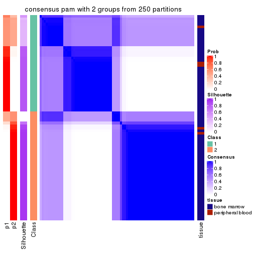</p>

</div>
<div id='tab-ATC-pam-consensus-heatmap-2'>
<pre><code class="r">consensus_heatmap(res, k = 3)
</code></pre>

<p>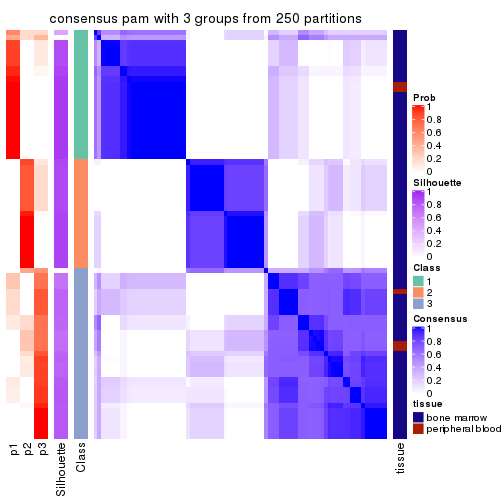</p>

</div>
<div id='tab-ATC-pam-consensus-heatmap-3'>
<pre><code class="r">consensus_heatmap(res, k = 4)
</code></pre>

<p>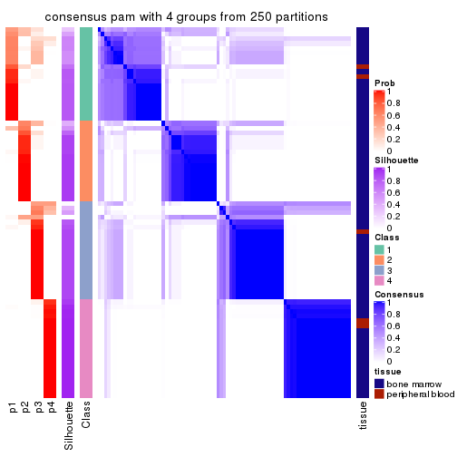</p>

</div>
<div id='tab-ATC-pam-consensus-heatmap-4'>
<pre><code class="r">consensus_heatmap(res, k = 5)
</code></pre>

<p>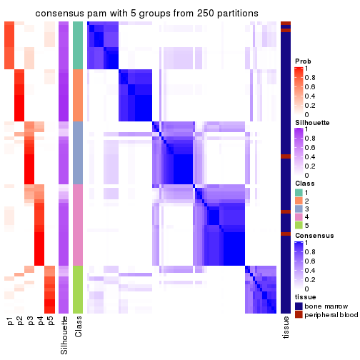</p>

</div>
<div id='tab-ATC-pam-consensus-heatmap-5'>
<pre><code class="r">consensus_heatmap(res, k = 6)
</code></pre>

<p>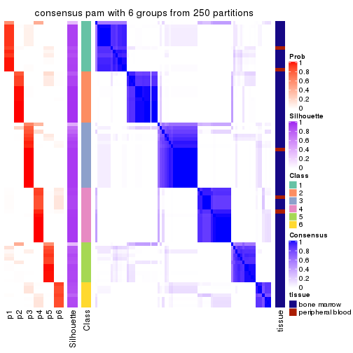</p>

</div>
</div>

Heatmaps for the membership of samples in all partitions to see how consistent they are:


<script>
$( function() {
	$( '#tabs-ATC-pam-membership-heatmap' ).tabs();
} );
</script>
<div id='tabs-ATC-pam-membership-heatmap'>
<ul>
<li><a href='#tab-ATC-pam-membership-heatmap-1'>k = 2</a></li>
<li><a href='#tab-ATC-pam-membership-heatmap-2'>k = 3</a></li>
<li><a href='#tab-ATC-pam-membership-heatmap-3'>k = 4</a></li>
<li><a href='#tab-ATC-pam-membership-heatmap-4'>k = 5</a></li>
<li><a href='#tab-ATC-pam-membership-heatmap-5'>k = 6</a></li>
</ul>
<div id='tab-ATC-pam-membership-heatmap-1'>
<pre><code class="r">membership_heatmap(res, k = 2)
</code></pre>

<p>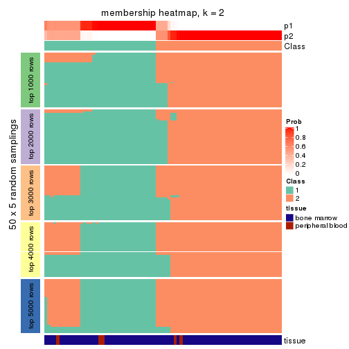</p>

</div>
<div id='tab-ATC-pam-membership-heatmap-2'>
<pre><code class="r">membership_heatmap(res, k = 3)
</code></pre>

<p>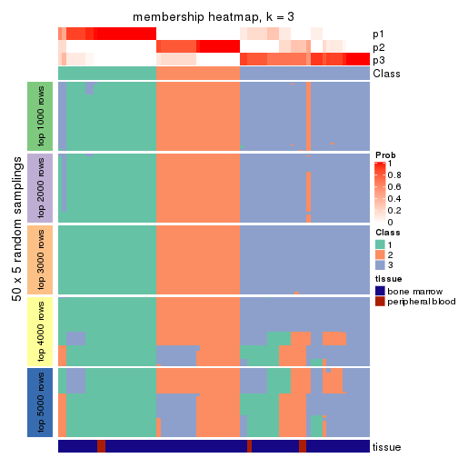</p>

</div>
<div id='tab-ATC-pam-membership-heatmap-3'>
<pre><code class="r">membership_heatmap(res, k = 4)
</code></pre>

<p>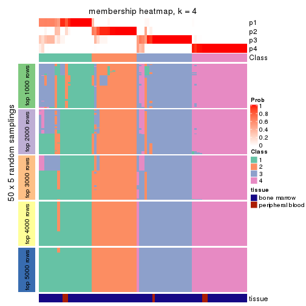</p>

</div>
<div id='tab-ATC-pam-membership-heatmap-4'>
<pre><code class="r">membership_heatmap(res, k = 5)
</code></pre>

<p>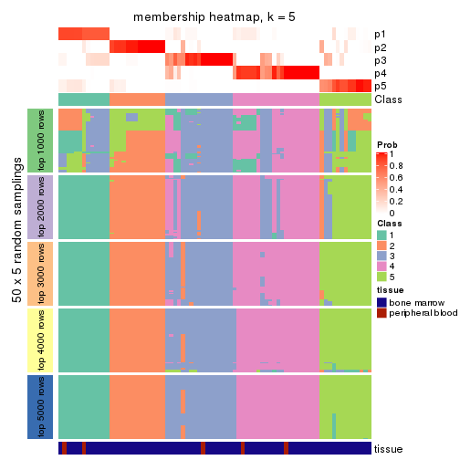</p>

</div>
<div id='tab-ATC-pam-membership-heatmap-5'>
<pre><code class="r">membership_heatmap(res, k = 6)
</code></pre>

<p>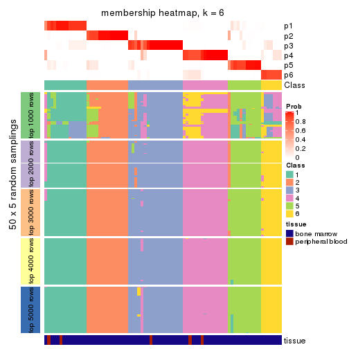</p>

</div>
</div>

As soon as we have had the classes for columns, we can look for signatures
which are significantly different between classes which can be candidate marks
for certain classes. Following are the heatmaps for signatures.


Signature heatmaps where rows are scaled:


<script>
$( function() {
	$( '#tabs-ATC-pam-get-signatures' ).tabs();
} );
</script>
<div id='tabs-ATC-pam-get-signatures'>
<ul>
<li><a href='#tab-ATC-pam-get-signatures-1'>k = 2</a></li>
<li><a href='#tab-ATC-pam-get-signatures-2'>k = 3</a></li>
<li><a href='#tab-ATC-pam-get-signatures-3'>k = 4</a></li>
<li><a href='#tab-ATC-pam-get-signatures-4'>k = 5</a></li>
<li><a href='#tab-ATC-pam-get-signatures-5'>k = 6</a></li>
</ul>
<div id='tab-ATC-pam-get-signatures-1'>
<pre><code class="r">get_signatures(res, k = 2)
</code></pre>

<p>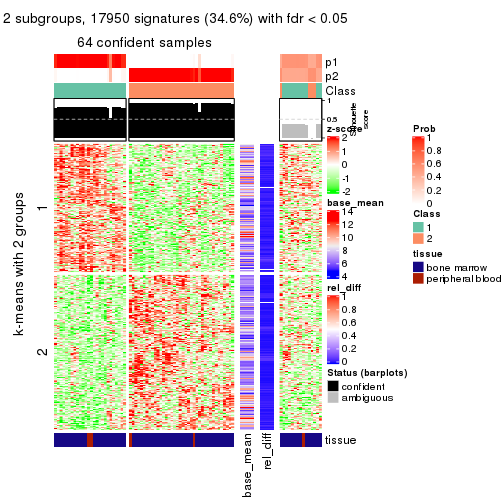</p>

</div>
<div id='tab-ATC-pam-get-signatures-2'>
<pre><code class="r">get_signatures(res, k = 3)
</code></pre>

<p>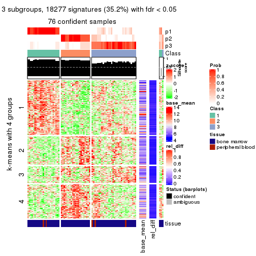</p>

</div>
<div id='tab-ATC-pam-get-signatures-3'>
<pre><code class="r">get_signatures(res, k = 4)
</code></pre>

<p>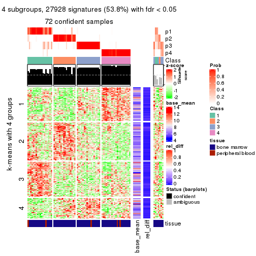</p>

</div>
<div id='tab-ATC-pam-get-signatures-4'>
<pre><code class="r">get_signatures(res, k = 5)
</code></pre>

<p>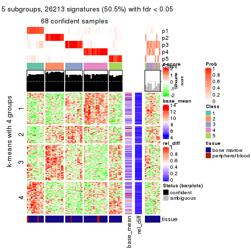</p>

</div>
<div id='tab-ATC-pam-get-signatures-5'>
<pre><code class="r">get_signatures(res, k = 6)
</code></pre>

<p>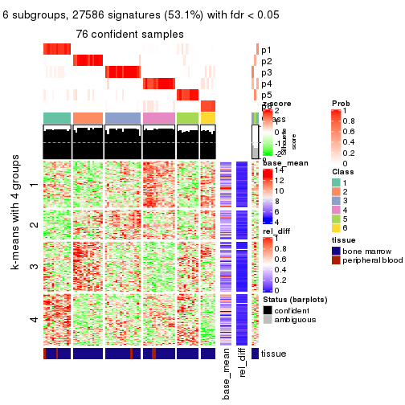</p>

</div>
</div>


Signature heatmaps where rows are not scaled:


<script>
$( function() {
	$( '#tabs-ATC-pam-get-signatures-no-scale' ).tabs();
} );
</script>
<div id='tabs-ATC-pam-get-signatures-no-scale'>
<ul>
<li><a href='#tab-ATC-pam-get-signatures-no-scale-1'>k = 2</a></li>
<li><a href='#tab-ATC-pam-get-signatures-no-scale-2'>k = 3</a></li>
<li><a href='#tab-ATC-pam-get-signatures-no-scale-3'>k = 4</a></li>
<li><a href='#tab-ATC-pam-get-signatures-no-scale-4'>k = 5</a></li>
<li><a href='#tab-ATC-pam-get-signatures-no-scale-5'>k = 6</a></li>
</ul>
<div id='tab-ATC-pam-get-signatures-no-scale-1'>
<pre><code class="r">get_signatures(res, k = 2, scale_rows = FALSE)
</code></pre>

<p>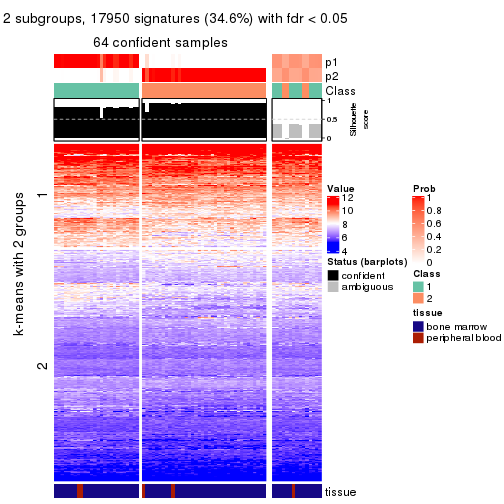</p>

</div>
<div id='tab-ATC-pam-get-signatures-no-scale-2'>
<pre><code class="r">get_signatures(res, k = 3, scale_rows = FALSE)
</code></pre>

<p>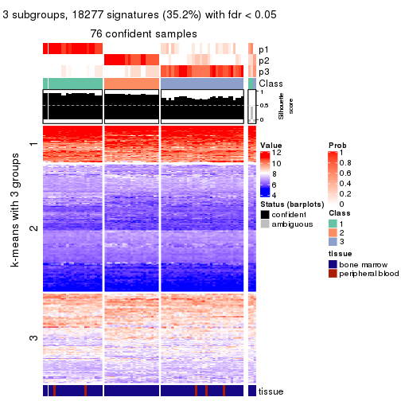</p>

</div>
<div id='tab-ATC-pam-get-signatures-no-scale-3'>
<pre><code class="r">get_signatures(res, k = 4, scale_rows = FALSE)
</code></pre>

<p>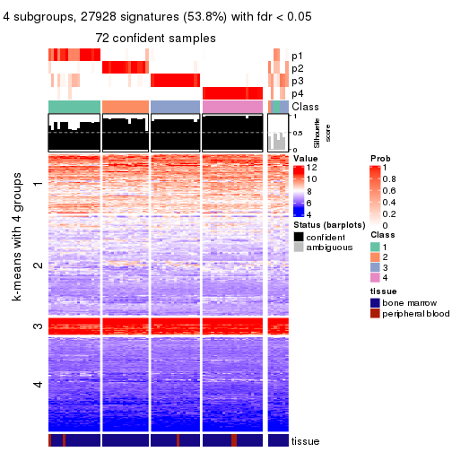</p>

</div>
<div id='tab-ATC-pam-get-signatures-no-scale-4'>
<pre><code class="r">get_signatures(res, k = 5, scale_rows = FALSE)
</code></pre>

<p>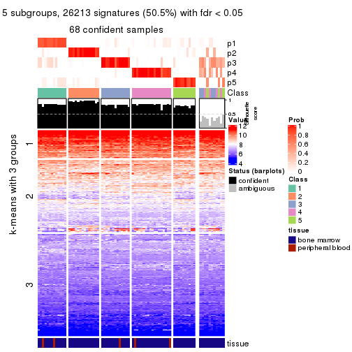</p>

</div>
<div id='tab-ATC-pam-get-signatures-no-scale-5'>
<pre><code class="r">get_signatures(res, k = 6, scale_rows = FALSE)
</code></pre>

<p>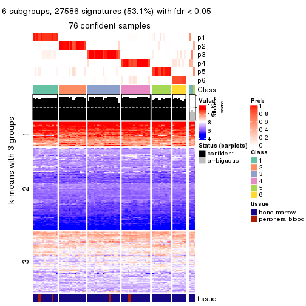</p>

</div>
</div>


Compare the overlap of signatures from different k:

```r
compare_signatures(res)
```

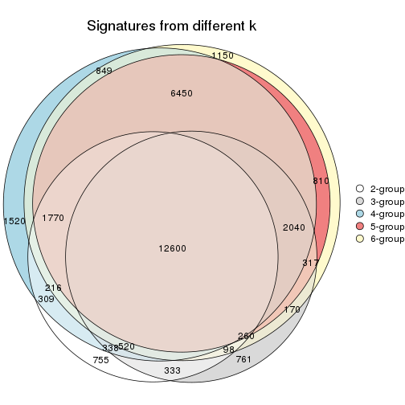

`get_signature()` returns a data frame invisibly. TO get the list of signatures, the function
call should be assigned to a variable explicitly. In following code, if `plot` argument is set
to `FALSE`, no heatmap is plotted while only the differential analysis is performed.

```r
# code only for demonstration
tb = get_signature(res, k = ..., plot = FALSE)
```

An example of the output of `tb` is:

```
#>   which_row         fdr    mean_1    mean_2 scaled_mean_1 scaled_mean_2 km
#> 1        38 0.042760348  8.373488  9.131774    -0.5533452     0.5164555  1
#> 2        40 0.018707592  7.106213  8.469186    -0.6173731     0.5762149  1
#> 3        55 0.019134737 10.221463 11.207825    -0.6159697     0.5749050  1
#> 4        59 0.006059896  5.921854  7.869574    -0.6899429     0.6439467  1
#> 5        60 0.018055526  8.928898 10.211722    -0.6204761     0.5791110  1
#> 6        98 0.009384629 15.714769 14.887706     0.6635654    -0.6193277  2
...
```

The columns in `tb` are:

1. `which_row`: row indices corresponding to the input matrix.
2. `fdr`: FDR for the differential test. 
3. `mean_x`: The mean value in group x.
4. `scaled_mean_x`: The mean value in group x after rows are scaled.
5. `km`: Row groups if k-means clustering is applied to rows.


UMAP plot which shows how samples are separated.


<script>
$( function() {
	$( '#tabs-ATC-pam-dimension-reduction' ).tabs();
} );
</script>
<div id='tabs-ATC-pam-dimension-reduction'>
<ul>
<li><a href='#tab-ATC-pam-dimension-reduction-1'>k = 2</a></li>
<li><a href='#tab-ATC-pam-dimension-reduction-2'>k = 3</a></li>
<li><a href='#tab-ATC-pam-dimension-reduction-3'>k = 4</a></li>
<li><a href='#tab-ATC-pam-dimension-reduction-4'>k = 5</a></li>
<li><a href='#tab-ATC-pam-dimension-reduction-5'>k = 6</a></li>
</ul>
<div id='tab-ATC-pam-dimension-reduction-1'>
<pre><code class="r">dimension_reduction(res, k = 2, method = &quot;UMAP&quot;)
</code></pre>

<p>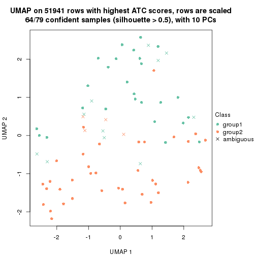</p>

</div>
<div id='tab-ATC-pam-dimension-reduction-2'>
<pre><code class="r">dimension_reduction(res, k = 3, method = &quot;UMAP&quot;)
</code></pre>

<p>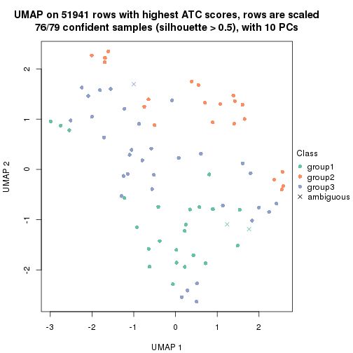</p>

</div>
<div id='tab-ATC-pam-dimension-reduction-3'>
<pre><code class="r">dimension_reduction(res, k = 4, method = &quot;UMAP&quot;)
</code></pre>

<p>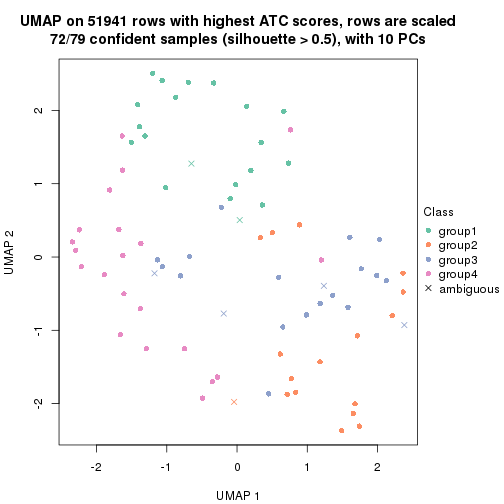</p>

</div>
<div id='tab-ATC-pam-dimension-reduction-4'>
<pre><code class="r">dimension_reduction(res, k = 5, method = &quot;UMAP&quot;)
</code></pre>

<p>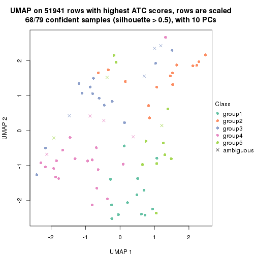</p>

</div>
<div id='tab-ATC-pam-dimension-reduction-5'>
<pre><code class="r">dimension_reduction(res, k = 6, method = &quot;UMAP&quot;)
</code></pre>

<p>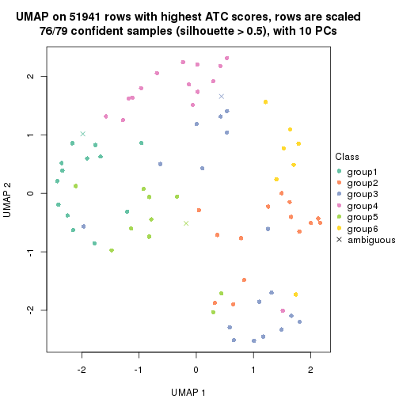</p>

</div>
</div>


Following heatmap shows how subgroups are split when increasing `k`:

```r
collect_classes(res)
```

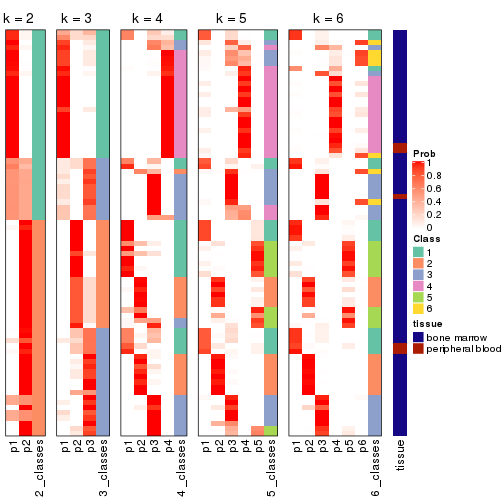


Test correlation between subgroups and known annotations. If the known
annotation is numeric, one-way ANOVA test is applied, and if the known
annotation is discrete, chi-squared contingency table test is applied.

```r
test_to_known_factors(res)
```

```
#>          n tissue(p) k
#> ATC:pam 64     1.000 2
#> ATC:pam 76     0.358 3
#> ATC:pam 72     0.588 4
#> ATC:pam 68     0.476 5
#> ATC:pam 76     0.422 6
```


If matrix rows can be associated to genes, consider to use `GO_Enrichment(res,
...)` to perform function enrichment for the signature genes.


 

---------------------------------------------------


### ATC:mclust


The object with results only for a single top-value method and a single partition method 
can be extracted as:

```r
res = res_list["ATC", "mclust"]
# you can also extract it by
# res = res_list["ATC:mclust"]
```

A summary of `res` and all the functions that can be applied to it:

```r
res
```

```
#> A 'ConsensusPartition' object with k = 2, 3, 4, 5, 6.
#>   On a matrix with 51941 rows and 79 columns.
#>   Top rows (1000, 2000, 3000, 4000, 5000) are extracted by 'ATC' method.
#>   Subgroups are detected by 'mclust' method.
#>   Performed in total 1250 partitions by row resampling.
#>   Best k for subgroups seems to be 4.
#> 
#> Following methods can be applied to this 'ConsensusPartition' object:
#>  [1] "cola_report"             "collect_classes"         "collect_plots"          
#>  [4] "collect_stats"           "colnames"                "compare_signatures"     
#>  [7] "consensus_heatmap"       "dimension_reduction"     "functional_enrichment"  
#> [10] "get_anno_col"            "get_anno"                "get_classes"            
#> [13] "get_consensus"           "get_matrix"              "get_membership"         
#> [16] "get_param"               "get_signatures"          "get_stats"              
#> [19] "is_best_k"               "is_stable_k"             "membership_heatmap"     
#> [22] "ncol"                    "nrow"                    "plot_ecdf"              
#> [25] "rownames"                "select_partition_number" "show"                   
#> [28] "suggest_best_k"          "test_to_known_factors"
```

`collect_plots()` function collects all the plots made from `res` for all `k` (number of partitions)
into one single page to provide an easy and fast comparison between different `k`.

```r
collect_plots(res)
```

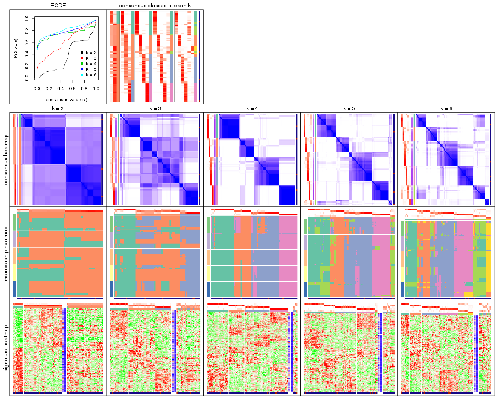

The plots are:

- The first row: a plot of the ECDF (Empirical cumulative distribution
  function) curves of the consensus matrix for each `k` and the heatmap of
  predicted classes for each `k`.
- The second row: heatmaps of the consensus matrix for each `k`.
- The third row: heatmaps of the membership matrix for each `k`.
- The fouth row: heatmaps of the signatures for each `k`.

All the plots in panels can be made by individual functions and they are
plotted later in this section.

`select_partition_number()` produces several plots showing different
statistics for choosing "optimized" `k`. There are following statistics:

- ECDF curves of the consensus matrix for each `k`;
- 1-PAC. [The PAC
  score](https://en.wikipedia.org/wiki/Consensus_clustering#Over-interpretation_potential_of_consensus_clustering)
  measures the proportion of the ambiguous subgrouping.
- Mean silhouette score.
- Concordance. The mean probability of fiting the consensus class ids in all
  partitions.
- Area increased. Denote $A_k$ as the area under the ECDF curve for current
  `k`, the area increased is defined as $A_k - A_{k-1}$.
- Rand index. The percent of pairs of samples that are both in a same cluster
  or both are not in a same cluster in the partition of k and k-1.
- Jaccard index. The ratio of pairs of samples are both in a same cluster in
  the partition of k and k-1 and the pairs of samples are both in a same
  cluster in the partition k or k-1.

The detailed explanations of these statistics can be found in [the cola
vignette](http://bioconductor.org/packages/devel/bioc/vignettes/cola/inst/doc/cola.html#toc_13).

Generally speaking, lower PAC score, higher mean silhouette score or higher
concordance corresponds to better partition. Rand index and Jaccard index
measure how similar the current partition is compared to partition with `k-1`.
If they are too similar, we won't accept `k` is better than `k-1`.

```r
select_partition_number(res)
```

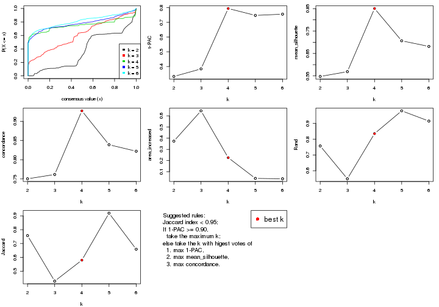

The numeric values for all these statistics can be obtained by `get_stats()`.

```r
get_stats(res)
```

```
#>   k 1-PAC mean_silhouette concordance area_increased  Rand Jaccard
#> 2 2 0.332           0.547       0.750         0.3735 0.757   0.757
#> 3 3 0.384           0.569       0.762         0.6446 0.549   0.428
#> 4 4 0.794           0.851       0.927         0.2258 0.835   0.580
#> 5 5 0.747           0.706       0.839         0.0405 0.980   0.919
#> 6 6 0.756           0.681       0.822         0.0369 0.915   0.659
```

`suggest_best_k()` suggests the best $k$ based on these statistics. The rules are as follows:

- All $k$ with Jaccard index larger than 0.95 are removed because the increase of
  the partition number does not provides enough extra information. If all $k$ are removed,
  the best $k$ is assigned by `NA`.
- For $k$ with 1-PAC larger than 0.9, the maximal $k$ is taken as the "best k". Other $k$ is called "optional k".
- If it does not fit the second rule. The $k$ with the highest vote of highest
  1-PAC, mean silhouette and concordance is taken as the "best k".

```r
suggest_best_k(res)
```

```
#> [1] 4
```


Following shows the table of the partitions (You need to click the **show/hide
code output** link to see it). The membership matrix (columns with name `p*`)
is inferred by
[`clue::cl_consensus()`](https://www.rdocumentation.org/link/cl_consensus?package=clue)
function with the `SE` method. Basically the value in the membership matrix
represents the probability to belong to a certain group. The finall class
label for an item is determined with the group with highest probability it
belongs to.

In `get_classes()` function, the entropy is calculated from the membership
matrix and the silhouette score is calculated from the consensus matrix.


<script>
$( function() {
	$( '#tabs-ATC-mclust-get-classes' ).tabs();
} );
</script>
<div id='tabs-ATC-mclust-get-classes'>
<ul>
<li><a href='#tab-ATC-mclust-get-classes-1'>k = 2</a></li>
<li><a href='#tab-ATC-mclust-get-classes-2'>k = 3</a></li>
<li><a href='#tab-ATC-mclust-get-classes-3'>k = 4</a></li>
<li><a href='#tab-ATC-mclust-get-classes-4'>k = 5</a></li>
<li><a href='#tab-ATC-mclust-get-classes-5'>k = 6</a></li>
</ul>

<div id='tab-ATC-mclust-get-classes-1'>
<p><a id='tab-ATC-mclust-get-classes-1-a' style='color:#0366d6' href='#'>show/hide code output</a></p>
<pre><code class="r">cbind(get_classes(res, k = 2), get_membership(res, k = 2))
</code></pre>

<pre><code>#&gt;           class entropy silhouette    p1    p2
#&gt; GSM316652     2  0.9922      0.401 0.448 0.552
#&gt; GSM316653     2  0.1633      0.625 0.024 0.976
#&gt; GSM316654     2  0.2778      0.624 0.048 0.952
#&gt; GSM316655     2  0.2236      0.625 0.036 0.964
#&gt; GSM316656     2  0.9922      0.401 0.448 0.552
#&gt; GSM316657     2  0.9944      0.396 0.456 0.544
#&gt; GSM316658     2  0.9881      0.407 0.436 0.564
#&gt; GSM316659     2  0.0938      0.629 0.012 0.988
#&gt; GSM316660     2  0.9933      0.397 0.452 0.548
#&gt; GSM316661     2  0.4690      0.601 0.100 0.900
#&gt; GSM316662     2  0.9833      0.413 0.424 0.576
#&gt; GSM316663     2  0.3879      0.601 0.076 0.924
#&gt; GSM316664     2  0.4690      0.601 0.100 0.900
#&gt; GSM316665     2  0.9881      0.407 0.436 0.564
#&gt; GSM316666     2  0.0376      0.629 0.004 0.996
#&gt; GSM316667     2  0.9881      0.407 0.436 0.564
#&gt; GSM316668     2  0.9922      0.401 0.448 0.552
#&gt; GSM316669     2  0.4690      0.601 0.100 0.900
#&gt; GSM316670     2  0.1633      0.625 0.024 0.976
#&gt; GSM316671     2  0.9833      0.413 0.424 0.576
#&gt; GSM316672     2  0.9954      0.395 0.460 0.540
#&gt; GSM316673     2  0.2948      0.611 0.052 0.948
#&gt; GSM316674     2  0.9922      0.401 0.448 0.552
#&gt; GSM316676     2  0.1633      0.625 0.024 0.976
#&gt; GSM316677     2  0.9963     -0.192 0.464 0.536
#&gt; GSM316678     2  0.9881      0.407 0.436 0.564
#&gt; GSM316679     1  0.6887      0.799 0.816 0.184
#&gt; GSM316680     1  0.4939      0.896 0.892 0.108
#&gt; GSM316681     2  0.9922      0.401 0.448 0.552
#&gt; GSM316682     2  0.4690      0.601 0.100 0.900
#&gt; GSM316683     2  0.4690      0.601 0.100 0.900
#&gt; GSM316684     2  0.9881      0.407 0.436 0.564
#&gt; GSM316685     2  0.9866      0.410 0.432 0.568
#&gt; GSM316686     2  0.4690      0.601 0.100 0.900
#&gt; GSM316687     2  0.1633      0.625 0.024 0.976
#&gt; GSM316688     2  0.9933      0.397 0.452 0.548
#&gt; GSM316689     1  0.6712      0.821 0.824 0.176
#&gt; GSM316690     2  0.1633      0.625 0.024 0.976
#&gt; GSM316691     2  0.9635      0.442 0.388 0.612
#&gt; GSM316692     2  0.1633      0.625 0.024 0.976
#&gt; GSM316693     2  0.4690      0.601 0.100 0.900
#&gt; GSM316694     2  0.1633      0.625 0.024 0.976
#&gt; GSM316696     1  0.9209      0.534 0.664 0.336
#&gt; GSM316697     2  0.1633      0.625 0.024 0.976
#&gt; GSM316698     2  0.9881      0.407 0.436 0.564
#&gt; GSM316699     2  0.9552      0.453 0.376 0.624
#&gt; GSM316700     2  0.5059      0.595 0.112 0.888
#&gt; GSM316701     2  0.2778      0.624 0.048 0.952
#&gt; GSM316703     2  0.0938      0.629 0.012 0.988
#&gt; GSM316704     2  0.0938      0.629 0.012 0.988
#&gt; GSM316705     2  0.4690      0.601 0.100 0.900
#&gt; GSM316706     2  0.0938      0.629 0.012 0.988
#&gt; GSM316707     2  0.9881      0.407 0.436 0.564
#&gt; GSM316708     2  0.9933      0.397 0.452 0.548
#&gt; GSM316709     2  0.1633      0.625 0.024 0.976
#&gt; GSM316710     2  0.4690      0.601 0.100 0.900
#&gt; GSM316711     2  0.0938      0.629 0.012 0.988
#&gt; GSM316713     1  0.4939      0.896 0.892 0.108
#&gt; GSM316714     2  0.4562      0.603 0.096 0.904
#&gt; GSM316715     1  0.4939      0.896 0.892 0.108
#&gt; GSM316716     2  0.9881      0.407 0.436 0.564
#&gt; GSM316717     2  0.9933      0.397 0.452 0.548
#&gt; GSM316718     2  0.9944      0.396 0.456 0.544
#&gt; GSM316719     1  0.4939      0.896 0.892 0.108
#&gt; GSM316720     1  0.4939      0.896 0.892 0.108
#&gt; GSM316721     2  0.9881      0.407 0.436 0.564
#&gt; GSM316722     1  0.8955      0.478 0.688 0.312
#&gt; GSM316723     2  0.9881      0.407 0.436 0.564
#&gt; GSM316724     2  0.9881      0.407 0.436 0.564
#&gt; GSM316726     2  0.9881      0.407 0.436 0.564
#&gt; GSM316727     1  0.4939      0.896 0.892 0.108
#&gt; GSM316728     2  0.4690      0.601 0.100 0.900
#&gt; GSM316729     2  0.9944      0.397 0.456 0.544
#&gt; GSM316730     2  0.9710      0.439 0.400 0.600
#&gt; GSM316675     2  0.1414      0.627 0.020 0.980
#&gt; GSM316695     2  0.9954      0.395 0.460 0.540
#&gt; GSM316702     2  0.4690      0.601 0.100 0.900
#&gt; GSM316712     1  0.4939      0.896 0.892 0.108
#&gt; GSM316725     2  0.4690      0.601 0.100 0.900
</code></pre>

<script>
$('#tab-ATC-mclust-get-classes-1-a').parent().next().next().hide();
$('#tab-ATC-mclust-get-classes-1-a').click(function(){
  $('#tab-ATC-mclust-get-classes-1-a').parent().next().next().toggle();
  return(false);
});
</script>
</div>

<div id='tab-ATC-mclust-get-classes-2'>
<p><a id='tab-ATC-mclust-get-classes-2-a' style='color:#0366d6' href='#'>show/hide code output</a></p>
<pre><code class="r">cbind(get_classes(res, k = 3), get_membership(res, k = 3))
</code></pre>

<pre><code>#&gt;           class entropy silhouette    p1    p2    p3
#&gt; GSM316652     2  0.9641     0.4533 0.228 0.456 0.316
#&gt; GSM316653     3  0.4002     0.6635 0.000 0.160 0.840
#&gt; GSM316654     2  0.6280     0.2355 0.000 0.540 0.460
#&gt; GSM316655     2  0.5948     0.3864 0.000 0.640 0.360
#&gt; GSM316656     2  0.7256     0.6290 0.124 0.712 0.164
#&gt; GSM316657     1  0.0424     0.8497 0.992 0.008 0.000
#&gt; GSM316658     2  0.3340     0.6408 0.120 0.880 0.000
#&gt; GSM316659     2  0.5254     0.5229 0.000 0.736 0.264
#&gt; GSM316660     1  0.4796     0.5896 0.780 0.220 0.000
#&gt; GSM316661     3  0.0000     0.8179 0.000 0.000 1.000
#&gt; GSM316662     2  0.4409     0.6312 0.172 0.824 0.004
#&gt; GSM316663     3  0.6192    -0.0678 0.000 0.420 0.580
#&gt; GSM316664     3  0.0237     0.8180 0.004 0.000 0.996
#&gt; GSM316665     2  0.3340     0.6408 0.120 0.880 0.000
#&gt; GSM316666     2  0.6280     0.2355 0.000 0.540 0.460
#&gt; GSM316667     2  0.3752     0.6385 0.144 0.856 0.000
#&gt; GSM316668     2  0.7256     0.6290 0.124 0.712 0.164
#&gt; GSM316669     3  0.0000     0.8179 0.000 0.000 1.000
#&gt; GSM316670     2  0.6280     0.2355 0.000 0.540 0.460
#&gt; GSM316671     2  0.5656     0.5463 0.284 0.712 0.004
#&gt; GSM316672     2  0.6079     0.4346 0.388 0.612 0.000
#&gt; GSM316673     1  0.6235     0.0850 0.564 0.000 0.436
#&gt; GSM316674     2  0.6228     0.4490 0.012 0.672 0.316
#&gt; GSM316676     2  0.6280     0.2355 0.000 0.540 0.460
#&gt; GSM316677     1  0.4281     0.7614 0.872 0.072 0.056
#&gt; GSM316678     2  0.5291     0.5645 0.268 0.732 0.000
#&gt; GSM316679     1  0.0000     0.8524 1.000 0.000 0.000
#&gt; GSM316680     1  0.0000     0.8524 1.000 0.000 0.000
#&gt; GSM316681     2  0.7245     0.6277 0.120 0.712 0.168
#&gt; GSM316682     3  0.5988     0.1182 0.000 0.368 0.632
#&gt; GSM316683     3  0.0237     0.8180 0.004 0.000 0.996
#&gt; GSM316684     2  0.5058     0.5832 0.244 0.756 0.000
#&gt; GSM316685     2  0.4164     0.6420 0.144 0.848 0.008
#&gt; GSM316686     3  0.0237     0.8180 0.004 0.000 0.996
#&gt; GSM316687     3  0.5913     0.6253 0.068 0.144 0.788
#&gt; GSM316688     1  0.2165     0.8032 0.936 0.064 0.000
#&gt; GSM316689     1  0.2743     0.8105 0.928 0.052 0.020
#&gt; GSM316690     3  0.6192    -0.0678 0.000 0.420 0.580
#&gt; GSM316691     2  0.6473     0.4316 0.016 0.652 0.332
#&gt; GSM316692     3  0.6192    -0.0678 0.000 0.420 0.580
#&gt; GSM316693     3  0.2448     0.7508 0.000 0.076 0.924
#&gt; GSM316694     2  0.6280     0.2355 0.000 0.540 0.460
#&gt; GSM316696     1  0.3134     0.8022 0.916 0.052 0.032
#&gt; GSM316697     2  0.6280     0.2355 0.000 0.540 0.460
#&gt; GSM316698     2  0.5291     0.5645 0.268 0.732 0.000
#&gt; GSM316699     2  0.4409     0.5673 0.004 0.824 0.172
#&gt; GSM316700     3  0.0000     0.8179 0.000 0.000 1.000
#&gt; GSM316701     2  0.6280     0.2355 0.000 0.540 0.460
#&gt; GSM316703     2  0.6217     0.5218 0.024 0.712 0.264
#&gt; GSM316704     2  0.5254     0.5229 0.000 0.736 0.264
#&gt; GSM316705     3  0.0237     0.8180 0.004 0.000 0.996
#&gt; GSM316706     2  0.6217     0.5218 0.024 0.712 0.264
#&gt; GSM316707     2  0.3340     0.6408 0.120 0.880 0.000
#&gt; GSM316708     1  0.6410    -0.0990 0.576 0.420 0.004
#&gt; GSM316709     2  0.6280     0.2355 0.000 0.540 0.460
#&gt; GSM316710     3  0.0000     0.8179 0.000 0.000 1.000
#&gt; GSM316711     2  0.4654     0.5542 0.000 0.792 0.208
#&gt; GSM316713     1  0.0000     0.8524 1.000 0.000 0.000
#&gt; GSM316714     3  0.0237     0.8180 0.004 0.000 0.996
#&gt; GSM316715     1  0.0000     0.8524 1.000 0.000 0.000
#&gt; GSM316716     2  0.3983     0.6401 0.144 0.852 0.004
#&gt; GSM316717     1  0.0237     0.8508 0.996 0.004 0.000
#&gt; GSM316718     1  0.3816     0.7008 0.852 0.148 0.000
#&gt; GSM316719     1  0.0000     0.8524 1.000 0.000 0.000
#&gt; GSM316720     1  0.0000     0.8524 1.000 0.000 0.000
#&gt; GSM316721     2  0.5058     0.5832 0.244 0.756 0.000
#&gt; GSM316722     1  0.0000     0.8524 1.000 0.000 0.000
#&gt; GSM316723     2  0.5058     0.5832 0.244 0.756 0.000
#&gt; GSM316724     2  0.5058     0.5832 0.244 0.756 0.000
#&gt; GSM316726     2  0.3983     0.6401 0.144 0.852 0.004
#&gt; GSM316727     1  0.0000     0.8524 1.000 0.000 0.000
#&gt; GSM316728     3  0.0000     0.8179 0.000 0.000 1.000
#&gt; GSM316729     1  0.7767    -0.1815 0.536 0.412 0.052
#&gt; GSM316730     2  0.8340     0.5852 0.236 0.620 0.144
#&gt; GSM316675     2  0.6280     0.2355 0.000 0.540 0.460
#&gt; GSM316695     2  0.5988     0.4492 0.368 0.632 0.000
#&gt; GSM316702     3  0.0237     0.8180 0.004 0.000 0.996
#&gt; GSM316712     1  0.0000     0.8524 1.000 0.000 0.000
#&gt; GSM316725     3  0.0237     0.8180 0.004 0.000 0.996
</code></pre>

<script>
$('#tab-ATC-mclust-get-classes-2-a').parent().next().next().hide();
$('#tab-ATC-mclust-get-classes-2-a').click(function(){
  $('#tab-ATC-mclust-get-classes-2-a').parent().next().next().toggle();
  return(false);
});
</script>
</div>

<div id='tab-ATC-mclust-get-classes-3'>
<p><a id='tab-ATC-mclust-get-classes-3-a' style='color:#0366d6' href='#'>show/hide code output</a></p>
<pre><code class="r">cbind(get_classes(res, k = 4), get_membership(res, k = 4))
</code></pre>

<pre><code>#&gt;           class entropy silhouette    p1    p2    p3    p4
#&gt; GSM316652     3  0.1305    0.84935 0.036 0.000 0.960 0.004
#&gt; GSM316653     4  0.0817    0.97007 0.000 0.000 0.024 0.976
#&gt; GSM316654     3  0.4746    0.45260 0.000 0.000 0.632 0.368
#&gt; GSM316655     3  0.4989    0.17230 0.000 0.000 0.528 0.472
#&gt; GSM316656     3  0.0188    0.86041 0.000 0.000 0.996 0.004
#&gt; GSM316657     1  0.0188    0.95069 0.996 0.000 0.004 0.000
#&gt; GSM316658     2  0.0000    0.87263 0.000 1.000 0.000 0.000
#&gt; GSM316659     2  0.3528    0.77922 0.000 0.808 0.000 0.192
#&gt; GSM316660     1  0.0376    0.94845 0.992 0.004 0.004 0.000
#&gt; GSM316661     4  0.0000    0.99714 0.000 0.000 0.000 1.000
#&gt; GSM316662     3  0.3569    0.75913 0.000 0.196 0.804 0.000
#&gt; GSM316663     4  0.0000    0.99714 0.000 0.000 0.000 1.000
#&gt; GSM316664     4  0.0000    0.99714 0.000 0.000 0.000 1.000
#&gt; GSM316665     2  0.0000    0.87263 0.000 1.000 0.000 0.000
#&gt; GSM316666     3  0.0188    0.86041 0.000 0.000 0.996 0.004
#&gt; GSM316667     3  0.4713    0.51190 0.000 0.360 0.640 0.000
#&gt; GSM316668     3  0.1109    0.85458 0.000 0.028 0.968 0.004
#&gt; GSM316669     4  0.0000    0.99714 0.000 0.000 0.000 1.000
#&gt; GSM316670     3  0.0188    0.86041 0.000 0.000 0.996 0.004
#&gt; GSM316671     3  0.4458    0.76685 0.116 0.076 0.808 0.000
#&gt; GSM316672     1  0.4872    0.45303 0.640 0.356 0.004 0.000
#&gt; GSM316673     1  0.3528    0.73017 0.808 0.000 0.000 0.192
#&gt; GSM316674     3  0.0188    0.86041 0.000 0.000 0.996 0.004
#&gt; GSM316676     3  0.0188    0.86041 0.000 0.000 0.996 0.004
#&gt; GSM316677     1  0.0000    0.95156 1.000 0.000 0.000 0.000
#&gt; GSM316678     2  0.0000    0.87263 0.000 1.000 0.000 0.000
#&gt; GSM316679     1  0.0000    0.95156 1.000 0.000 0.000 0.000
#&gt; GSM316680     1  0.0188    0.95069 0.996 0.000 0.004 0.000
#&gt; GSM316681     3  0.3222    0.82590 0.036 0.076 0.884 0.004
#&gt; GSM316682     4  0.0000    0.99714 0.000 0.000 0.000 1.000
#&gt; GSM316683     4  0.0000    0.99714 0.000 0.000 0.000 1.000
#&gt; GSM316684     2  0.0000    0.87263 0.000 1.000 0.000 0.000
#&gt; GSM316685     3  0.2589    0.81732 0.000 0.116 0.884 0.000
#&gt; GSM316686     4  0.0000    0.99714 0.000 0.000 0.000 1.000
#&gt; GSM316687     4  0.0188    0.99246 0.000 0.000 0.004 0.996
#&gt; GSM316688     1  0.0188    0.95069 0.996 0.000 0.004 0.000
#&gt; GSM316689     1  0.0000    0.95156 1.000 0.000 0.000 0.000
#&gt; GSM316690     3  0.0921    0.85453 0.000 0.000 0.972 0.028
#&gt; GSM316691     3  0.4277    0.61075 0.000 0.000 0.720 0.280
#&gt; GSM316692     3  0.3569    0.73383 0.000 0.000 0.804 0.196
#&gt; GSM316693     4  0.0000    0.99714 0.000 0.000 0.000 1.000
#&gt; GSM316694     3  0.0188    0.86041 0.000 0.000 0.996 0.004
#&gt; GSM316696     1  0.0000    0.95156 1.000 0.000 0.000 0.000
#&gt; GSM316697     3  0.0188    0.86041 0.000 0.000 0.996 0.004
#&gt; GSM316698     2  0.0000    0.87263 0.000 1.000 0.000 0.000
#&gt; GSM316699     3  0.0188    0.86041 0.000 0.000 0.996 0.004
#&gt; GSM316700     4  0.0336    0.98914 0.000 0.000 0.008 0.992
#&gt; GSM316701     3  0.4543    0.53905 0.000 0.000 0.676 0.324
#&gt; GSM316703     2  0.3528    0.77922 0.000 0.808 0.000 0.192
#&gt; GSM316704     2  0.3528    0.77922 0.000 0.808 0.000 0.192
#&gt; GSM316705     4  0.0000    0.99714 0.000 0.000 0.000 1.000
#&gt; GSM316706     2  0.3528    0.77922 0.000 0.808 0.000 0.192
#&gt; GSM316707     2  0.0000    0.87263 0.000 1.000 0.000 0.000
#&gt; GSM316708     1  0.2469    0.85208 0.892 0.000 0.108 0.000
#&gt; GSM316709     3  0.0188    0.86041 0.000 0.000 0.996 0.004
#&gt; GSM316710     4  0.0000    0.99714 0.000 0.000 0.000 1.000
#&gt; GSM316711     2  0.3991    0.74796 0.000 0.808 0.172 0.020
#&gt; GSM316713     1  0.0000    0.95156 1.000 0.000 0.000 0.000
#&gt; GSM316714     4  0.0000    0.99714 0.000 0.000 0.000 1.000
#&gt; GSM316715     1  0.0000    0.95156 1.000 0.000 0.000 0.000
#&gt; GSM316716     3  0.3569    0.76153 0.000 0.196 0.804 0.000
#&gt; GSM316717     1  0.0000    0.95156 1.000 0.000 0.000 0.000
#&gt; GSM316718     1  0.0188    0.95069 0.996 0.000 0.004 0.000
#&gt; GSM316719     1  0.0000    0.95156 1.000 0.000 0.000 0.000
#&gt; GSM316720     1  0.0000    0.95156 1.000 0.000 0.000 0.000
#&gt; GSM316721     2  0.0000    0.87263 0.000 1.000 0.000 0.000
#&gt; GSM316722     1  0.0188    0.95069 0.996 0.000 0.004 0.000
#&gt; GSM316723     2  0.0000    0.87263 0.000 1.000 0.000 0.000
#&gt; GSM316724     2  0.0000    0.87263 0.000 1.000 0.000 0.000
#&gt; GSM316726     3  0.3528    0.76267 0.000 0.192 0.808 0.000
#&gt; GSM316727     1  0.0000    0.95156 1.000 0.000 0.000 0.000
#&gt; GSM316728     4  0.0000    0.99714 0.000 0.000 0.000 1.000
#&gt; GSM316729     1  0.3494    0.76727 0.824 0.000 0.172 0.004
#&gt; GSM316730     2  0.5166    0.72784 0.044 0.736 0.004 0.216
#&gt; GSM316675     3  0.0188    0.86041 0.000 0.000 0.996 0.004
#&gt; GSM316695     2  0.4985   -0.00572 0.468 0.532 0.000 0.000
#&gt; GSM316702     4  0.0000    0.99714 0.000 0.000 0.000 1.000
#&gt; GSM316712     1  0.0000    0.95156 1.000 0.000 0.000 0.000
#&gt; GSM316725     4  0.0000    0.99714 0.000 0.000 0.000 1.000
</code></pre>

<script>
$('#tab-ATC-mclust-get-classes-3-a').parent().next().next().hide();
$('#tab-ATC-mclust-get-classes-3-a').click(function(){
  $('#tab-ATC-mclust-get-classes-3-a').parent().next().next().toggle();
  return(false);
});
</script>
</div>

<div id='tab-ATC-mclust-get-classes-4'>
<p><a id='tab-ATC-mclust-get-classes-4-a' style='color:#0366d6' href='#'>show/hide code output</a></p>
<pre><code class="r">cbind(get_classes(res, k = 5), get_membership(res, k = 5))
</code></pre>

<pre><code>#&gt;           class entropy silhouette    p1    p2    p3    p4    p5
#&gt; GSM316652     3  0.3018     0.7635 0.084 0.008 0.872 0.000 0.036
#&gt; GSM316653     4  0.3656     0.7881 0.000 0.000 0.168 0.800 0.032
#&gt; GSM316654     3  0.4886     0.3056 0.000 0.000 0.596 0.372 0.032
#&gt; GSM316655     3  0.4291     0.0775 0.000 0.000 0.536 0.464 0.000
#&gt; GSM316656     3  0.2937     0.7894 0.016 0.060 0.884 0.000 0.040
#&gt; GSM316657     1  0.4196     0.5617 0.640 0.004 0.000 0.000 0.356
#&gt; GSM316658     2  0.0609     0.7525 0.000 0.980 0.000 0.000 0.020
#&gt; GSM316659     2  0.6082     0.4570 0.000 0.624 0.100 0.032 0.244
#&gt; GSM316660     1  0.3421     0.7373 0.788 0.008 0.000 0.000 0.204
#&gt; GSM316661     4  0.1732     0.9282 0.000 0.000 0.000 0.920 0.080
#&gt; GSM316662     3  0.3452     0.6932 0.000 0.244 0.756 0.000 0.000
#&gt; GSM316663     4  0.1942     0.8987 0.000 0.012 0.068 0.920 0.000
#&gt; GSM316664     4  0.0000     0.9444 0.000 0.000 0.000 1.000 0.000
#&gt; GSM316665     2  0.0510     0.7452 0.000 0.984 0.000 0.000 0.016
#&gt; GSM316666     3  0.0000     0.8005 0.000 0.000 1.000 0.000 0.000
#&gt; GSM316667     3  0.4651     0.4943 0.000 0.372 0.608 0.000 0.020
#&gt; GSM316668     3  0.2824     0.7812 0.000 0.096 0.872 0.000 0.032
#&gt; GSM316669     4  0.1732     0.9282 0.000 0.000 0.000 0.920 0.080
#&gt; GSM316670     3  0.0000     0.8005 0.000 0.000 1.000 0.000 0.000
#&gt; GSM316671     3  0.4198     0.7155 0.132 0.032 0.800 0.000 0.036
#&gt; GSM316672     5  0.6192     0.3343 0.300 0.168 0.000 0.000 0.532
#&gt; GSM316673     1  0.4049     0.6295 0.792 0.000 0.000 0.124 0.084
#&gt; GSM316674     3  0.1197     0.7991 0.000 0.048 0.952 0.000 0.000
#&gt; GSM316676     3  0.0000     0.8005 0.000 0.000 1.000 0.000 0.000
#&gt; GSM316677     1  0.1908     0.7675 0.908 0.000 0.000 0.000 0.092
#&gt; GSM316678     2  0.3816     0.5136 0.000 0.696 0.000 0.000 0.304
#&gt; GSM316679     1  0.3003     0.7483 0.812 0.000 0.000 0.000 0.188
#&gt; GSM316680     1  0.0000     0.7970 1.000 0.000 0.000 0.000 0.000
#&gt; GSM316681     3  0.3018     0.7822 0.008 0.084 0.872 0.000 0.036
#&gt; GSM316682     4  0.0000     0.9444 0.000 0.000 0.000 1.000 0.000
#&gt; GSM316683     4  0.0000     0.9444 0.000 0.000 0.000 1.000 0.000
#&gt; GSM316684     2  0.1043     0.7467 0.000 0.960 0.000 0.000 0.040
#&gt; GSM316685     3  0.3409     0.7588 0.000 0.144 0.824 0.000 0.032
#&gt; GSM316686     4  0.0000     0.9444 0.000 0.000 0.000 1.000 0.000
#&gt; GSM316687     4  0.4677     0.7979 0.020 0.024 0.072 0.796 0.088
#&gt; GSM316688     1  0.3074     0.7432 0.804 0.000 0.000 0.000 0.196
#&gt; GSM316689     1  0.1908     0.7675 0.908 0.000 0.000 0.000 0.092
#&gt; GSM316690     3  0.1965     0.7736 0.000 0.000 0.904 0.096 0.000
#&gt; GSM316691     3  0.3999     0.4214 0.000 0.000 0.656 0.344 0.000
#&gt; GSM316692     3  0.2891     0.7213 0.000 0.000 0.824 0.176 0.000
#&gt; GSM316693     4  0.0000     0.9444 0.000 0.000 0.000 1.000 0.000
#&gt; GSM316694     3  0.0000     0.8005 0.000 0.000 1.000 0.000 0.000
#&gt; GSM316696     1  0.1908     0.7675 0.908 0.000 0.000 0.000 0.092
#&gt; GSM316697     3  0.0000     0.8005 0.000 0.000 1.000 0.000 0.000
#&gt; GSM316698     2  0.3586     0.5568 0.000 0.736 0.000 0.000 0.264
#&gt; GSM316699     3  0.0510     0.7988 0.000 0.000 0.984 0.000 0.016
#&gt; GSM316700     4  0.2903     0.8978 0.000 0.000 0.048 0.872 0.080
#&gt; GSM316701     3  0.4794     0.3770 0.000 0.000 0.624 0.344 0.032
#&gt; GSM316703     2  0.6146     0.1943 0.000 0.488 0.000 0.136 0.376
#&gt; GSM316704     2  0.6154     0.4388 0.000 0.620 0.036 0.100 0.244
#&gt; GSM316705     4  0.0000     0.9444 0.000 0.000 0.000 1.000 0.000
#&gt; GSM316706     5  0.6162    -0.3283 0.000 0.428 0.000 0.132 0.440
#&gt; GSM316707     2  0.0000     0.7536 0.000 1.000 0.000 0.000 0.000
#&gt; GSM316708     1  0.5300     0.5270 0.604 0.000 0.068 0.000 0.328
#&gt; GSM316709     3  0.0000     0.8005 0.000 0.000 1.000 0.000 0.000
#&gt; GSM316710     4  0.0404     0.9429 0.000 0.000 0.000 0.988 0.012
#&gt; GSM316711     2  0.4926     0.5586 0.000 0.716 0.132 0.000 0.152
#&gt; GSM316713     1  0.1792     0.7706 0.916 0.000 0.000 0.000 0.084
#&gt; GSM316714     4  0.1894     0.9285 0.000 0.000 0.008 0.920 0.072
#&gt; GSM316715     1  0.1197     0.7854 0.952 0.000 0.000 0.000 0.048
#&gt; GSM316716     3  0.4384     0.5943 0.000 0.324 0.660 0.000 0.016
#&gt; GSM316717     1  0.3177     0.7389 0.792 0.000 0.000 0.000 0.208
#&gt; GSM316718     1  0.3966     0.6005 0.664 0.000 0.000 0.000 0.336
#&gt; GSM316719     1  0.0000     0.7970 1.000 0.000 0.000 0.000 0.000
#&gt; GSM316720     1  0.0000     0.7970 1.000 0.000 0.000 0.000 0.000
#&gt; GSM316721     2  0.0510     0.7452 0.000 0.984 0.000 0.000 0.016
#&gt; GSM316722     1  0.3109     0.7416 0.800 0.000 0.000 0.000 0.200
#&gt; GSM316723     2  0.0000     0.7536 0.000 1.000 0.000 0.000 0.000
#&gt; GSM316724     2  0.0000     0.7536 0.000 1.000 0.000 0.000 0.000
#&gt; GSM316726     3  0.4503     0.6675 0.000 0.256 0.704 0.000 0.040
#&gt; GSM316727     1  0.0000     0.7970 1.000 0.000 0.000 0.000 0.000
#&gt; GSM316728     4  0.1732     0.9282 0.000 0.000 0.000 0.920 0.080
#&gt; GSM316729     1  0.6607     0.4036 0.564 0.000 0.204 0.024 0.208
#&gt; GSM316730     5  0.6051     0.5078 0.056 0.096 0.092 0.040 0.716
#&gt; GSM316675     3  0.0000     0.8005 0.000 0.000 1.000 0.000 0.000
#&gt; GSM316695     5  0.4964     0.5450 0.132 0.156 0.000 0.000 0.712
#&gt; GSM316702     4  0.0000     0.9444 0.000 0.000 0.000 1.000 0.000
#&gt; GSM316712     1  0.0794     0.7918 0.972 0.000 0.000 0.000 0.028
#&gt; GSM316725     4  0.0000     0.9444 0.000 0.000 0.000 1.000 0.000
</code></pre>

<script>
$('#tab-ATC-mclust-get-classes-4-a').parent().next().next().hide();
$('#tab-ATC-mclust-get-classes-4-a').click(function(){
  $('#tab-ATC-mclust-get-classes-4-a').parent().next().next().toggle();
  return(false);
});
</script>
</div>

<div id='tab-ATC-mclust-get-classes-5'>
<p><a id='tab-ATC-mclust-get-classes-5-a' style='color:#0366d6' href='#'>show/hide code output</a></p>
<pre><code class="r">cbind(get_classes(res, k = 6), get_membership(res, k = 6))
</code></pre>

<pre><code>#&gt;           class entropy silhouette    p1    p2    p3    p4    p5    p6
#&gt; GSM316652     3  0.2446     0.7415 0.000 0.012 0.864 0.000 0.124 0.000
#&gt; GSM316653     4  0.3539     0.6812 0.000 0.000 0.220 0.756 0.000 0.024
#&gt; GSM316654     3  0.4355     0.2469 0.000 0.000 0.556 0.420 0.000 0.024
#&gt; GSM316655     3  0.2969     0.6277 0.000 0.000 0.776 0.224 0.000 0.000
#&gt; GSM316656     3  0.2860     0.7508 0.000 0.040 0.876 0.012 0.064 0.008
#&gt; GSM316657     5  0.2260     0.5807 0.140 0.000 0.000 0.000 0.860 0.000
#&gt; GSM316658     2  0.0937     0.7910 0.000 0.960 0.000 0.000 0.000 0.040
#&gt; GSM316659     6  0.2898     0.9760 0.000 0.072 0.040 0.020 0.000 0.868
#&gt; GSM316660     5  0.3797     0.5864 0.420 0.000 0.000 0.000 0.580 0.000
#&gt; GSM316661     4  0.1138     0.9014 0.000 0.000 0.012 0.960 0.004 0.024
#&gt; GSM316662     3  0.6494     0.2101 0.000 0.256 0.472 0.000 0.236 0.036
#&gt; GSM316663     4  0.1663     0.8656 0.000 0.000 0.088 0.912 0.000 0.000
#&gt; GSM316664     4  0.2389     0.9006 0.000 0.000 0.000 0.888 0.052 0.060
#&gt; GSM316665     2  0.0260     0.7895 0.000 0.992 0.000 0.000 0.000 0.008
#&gt; GSM316666     3  0.0547     0.7767 0.000 0.000 0.980 0.000 0.000 0.020
#&gt; GSM316667     3  0.6285     0.0407 0.000 0.332 0.388 0.000 0.272 0.008
#&gt; GSM316668     3  0.4063     0.6563 0.000 0.052 0.736 0.000 0.208 0.004
#&gt; GSM316669     4  0.1138     0.9014 0.000 0.000 0.012 0.960 0.004 0.024
#&gt; GSM316670     3  0.0000     0.7803 0.000 0.000 1.000 0.000 0.000 0.000
#&gt; GSM316671     3  0.4933     0.2875 0.000 0.020 0.500 0.000 0.452 0.028
#&gt; GSM316672     5  0.2830     0.5462 0.068 0.064 0.000 0.000 0.864 0.004
#&gt; GSM316673     1  0.4331     0.0877 0.516 0.000 0.020 0.464 0.000 0.000
#&gt; GSM316674     3  0.1616     0.7634 0.000 0.048 0.932 0.000 0.020 0.000
#&gt; GSM316676     3  0.0146     0.7802 0.000 0.000 0.996 0.000 0.004 0.000
#&gt; GSM316677     1  0.0000     0.7672 1.000 0.000 0.000 0.000 0.000 0.000
#&gt; GSM316678     2  0.4152     0.5962 0.000 0.664 0.000 0.000 0.304 0.032
#&gt; GSM316679     5  0.3810     0.5733 0.428 0.000 0.000 0.000 0.572 0.000
#&gt; GSM316680     1  0.3843    -0.3461 0.548 0.000 0.000 0.000 0.452 0.000
#&gt; GSM316681     3  0.3770     0.6461 0.000 0.028 0.728 0.000 0.244 0.000
#&gt; GSM316682     4  0.2389     0.9006 0.000 0.000 0.000 0.888 0.052 0.060
#&gt; GSM316683     4  0.2066     0.9037 0.000 0.000 0.000 0.908 0.052 0.040
#&gt; GSM316684     2  0.0937     0.7910 0.000 0.960 0.000 0.000 0.000 0.040
#&gt; GSM316685     2  0.5165     0.0108 0.000 0.484 0.448 0.000 0.056 0.012
#&gt; GSM316686     4  0.1196     0.9103 0.000 0.000 0.000 0.952 0.008 0.040
#&gt; GSM316687     4  0.4122     0.7216 0.016 0.000 0.036 0.776 0.016 0.156
#&gt; GSM316688     5  0.3810     0.5772 0.428 0.000 0.000 0.000 0.572 0.000
#&gt; GSM316689     1  0.0000     0.7672 1.000 0.000 0.000 0.000 0.000 0.000
#&gt; GSM316690     3  0.0935     0.7752 0.000 0.000 0.964 0.032 0.000 0.004
#&gt; GSM316691     3  0.2146     0.7252 0.000 0.000 0.880 0.116 0.004 0.000
#&gt; GSM316692     3  0.3847     0.2004 0.000 0.000 0.544 0.456 0.000 0.000
#&gt; GSM316693     4  0.2389     0.9006 0.000 0.000 0.000 0.888 0.052 0.060
#&gt; GSM316694     3  0.0000     0.7803 0.000 0.000 1.000 0.000 0.000 0.000
#&gt; GSM316696     1  0.0000     0.7672 1.000 0.000 0.000 0.000 0.000 0.000
#&gt; GSM316697     3  0.0260     0.7798 0.000 0.000 0.992 0.000 0.008 0.000
#&gt; GSM316698     2  0.4352     0.6149 0.000 0.668 0.000 0.000 0.280 0.052
#&gt; GSM316699     3  0.1149     0.7755 0.000 0.024 0.960 0.000 0.008 0.008
#&gt; GSM316700     4  0.1232     0.9000 0.000 0.000 0.016 0.956 0.004 0.024
#&gt; GSM316701     3  0.3766     0.5723 0.000 0.000 0.720 0.256 0.000 0.024
#&gt; GSM316703     6  0.2898     0.9664 0.000 0.072 0.020 0.040 0.000 0.868
#&gt; GSM316704     6  0.2898     0.9760 0.000 0.072 0.040 0.020 0.000 0.868
#&gt; GSM316705     4  0.2001     0.9050 0.000 0.000 0.000 0.912 0.048 0.040
#&gt; GSM316706     6  0.3096     0.9648 0.000 0.068 0.020 0.040 0.008 0.864
#&gt; GSM316707     2  0.0865     0.7913 0.000 0.964 0.000 0.000 0.000 0.036
#&gt; GSM316708     5  0.3766     0.6184 0.304 0.000 0.012 0.000 0.684 0.000
#&gt; GSM316709     3  0.0000     0.7803 0.000 0.000 1.000 0.000 0.000 0.000
#&gt; GSM316710     4  0.0000     0.9080 0.000 0.000 0.000 1.000 0.000 0.000
#&gt; GSM316711     6  0.2978     0.9613 0.000 0.072 0.056 0.012 0.000 0.860
#&gt; GSM316713     1  0.0790     0.7772 0.968 0.000 0.000 0.000 0.032 0.000
#&gt; GSM316714     4  0.1092     0.9008 0.000 0.000 0.020 0.960 0.000 0.020
#&gt; GSM316715     1  0.1075     0.7783 0.952 0.000 0.000 0.000 0.048 0.000
#&gt; GSM316716     2  0.3000     0.7074 0.000 0.852 0.096 0.000 0.044 0.008
#&gt; GSM316717     5  0.3797     0.5864 0.420 0.000 0.000 0.000 0.580 0.000
#&gt; GSM316718     5  0.3390     0.6242 0.296 0.000 0.000 0.000 0.704 0.000
#&gt; GSM316719     1  0.1204     0.7738 0.944 0.000 0.000 0.000 0.056 0.000
#&gt; GSM316720     1  0.1204     0.7738 0.944 0.000 0.000 0.000 0.056 0.000
#&gt; GSM316721     2  0.0713     0.7874 0.000 0.972 0.000 0.000 0.000 0.028
#&gt; GSM316722     5  0.3797     0.5864 0.420 0.000 0.000 0.000 0.580 0.000
#&gt; GSM316723     2  0.1204     0.7888 0.000 0.944 0.000 0.000 0.000 0.056
#&gt; GSM316724     2  0.1267     0.7879 0.000 0.940 0.000 0.000 0.000 0.060
#&gt; GSM316726     2  0.5064     0.5026 0.000 0.648 0.260 0.000 0.064 0.028
#&gt; GSM316727     1  0.3023     0.4853 0.768 0.000 0.000 0.000 0.232 0.000
#&gt; GSM316728     4  0.0922     0.9029 0.000 0.000 0.004 0.968 0.004 0.024
#&gt; GSM316729     5  0.5916     0.3831 0.336 0.000 0.220 0.000 0.444 0.000
#&gt; GSM316730     5  0.5650     0.2685 0.060 0.024 0.032 0.008 0.660 0.216
#&gt; GSM316675     3  0.0000     0.7803 0.000 0.000 1.000 0.000 0.000 0.000
#&gt; GSM316695     5  0.5040     0.3023 0.056 0.228 0.000 0.000 0.672 0.044
#&gt; GSM316702     4  0.1644     0.9091 0.000 0.000 0.000 0.932 0.028 0.040
#&gt; GSM316712     1  0.1075     0.7783 0.952 0.000 0.000 0.000 0.048 0.000
#&gt; GSM316725     4  0.2389     0.9006 0.000 0.000 0.000 0.888 0.052 0.060
</code></pre>

<script>
$('#tab-ATC-mclust-get-classes-5-a').parent().next().next().hide();
$('#tab-ATC-mclust-get-classes-5-a').click(function(){
  $('#tab-ATC-mclust-get-classes-5-a').parent().next().next().toggle();
  return(false);
});
</script>
</div>
</div>

Heatmaps for the consensus matrix. It visualizes the probability of two
samples to be in a same group.


<script>
$( function() {
	$( '#tabs-ATC-mclust-consensus-heatmap' ).tabs();
} );
</script>
<div id='tabs-ATC-mclust-consensus-heatmap'>
<ul>
<li><a href='#tab-ATC-mclust-consensus-heatmap-1'>k = 2</a></li>
<li><a href='#tab-ATC-mclust-consensus-heatmap-2'>k = 3</a></li>
<li><a href='#tab-ATC-mclust-consensus-heatmap-3'>k = 4</a></li>
<li><a href='#tab-ATC-mclust-consensus-heatmap-4'>k = 5</a></li>
<li><a href='#tab-ATC-mclust-consensus-heatmap-5'>k = 6</a></li>
</ul>
<div id='tab-ATC-mclust-consensus-heatmap-1'>
<pre><code class="r">consensus_heatmap(res, k = 2)
</code></pre>

<p>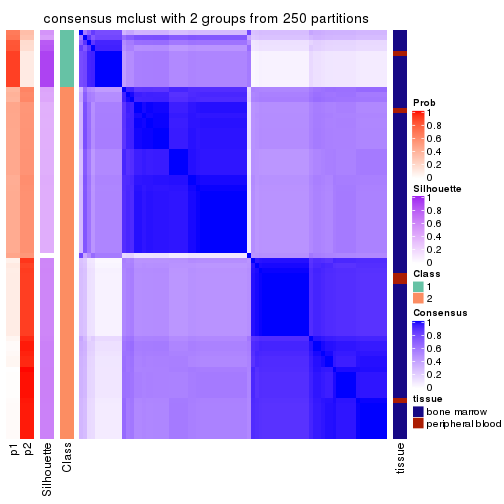</p>

</div>
<div id='tab-ATC-mclust-consensus-heatmap-2'>
<pre><code class="r">consensus_heatmap(res, k = 3)
</code></pre>

<p>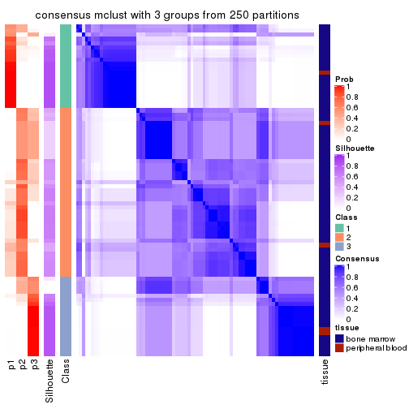</p>

</div>
<div id='tab-ATC-mclust-consensus-heatmap-3'>
<pre><code class="r">consensus_heatmap(res, k = 4)
</code></pre>

<p>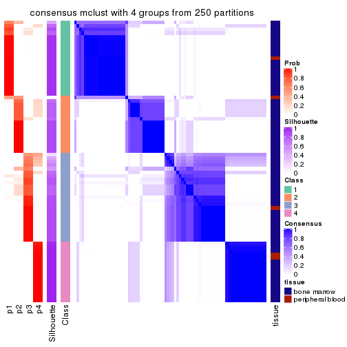</p>

</div>
<div id='tab-ATC-mclust-consensus-heatmap-4'>
<pre><code class="r">consensus_heatmap(res, k = 5)
</code></pre>

<p>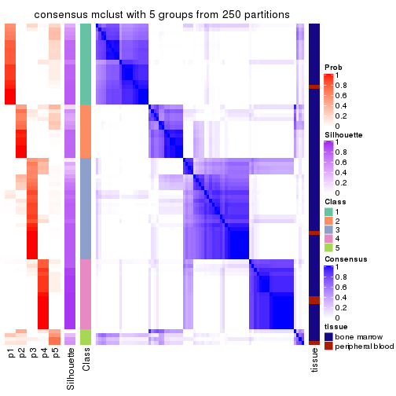</p>

</div>
<div id='tab-ATC-mclust-consensus-heatmap-5'>
<pre><code class="r">consensus_heatmap(res, k = 6)
</code></pre>

<p>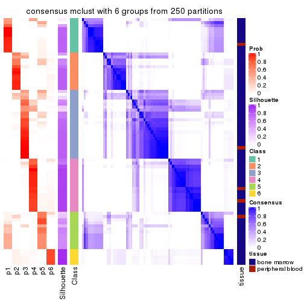</p>

</div>
</div>

Heatmaps for the membership of samples in all partitions to see how consistent they are:


<script>
$( function() {
	$( '#tabs-ATC-mclust-membership-heatmap' ).tabs();
} );
</script>
<div id='tabs-ATC-mclust-membership-heatmap'>
<ul>
<li><a href='#tab-ATC-mclust-membership-heatmap-1'>k = 2</a></li>
<li><a href='#tab-ATC-mclust-membership-heatmap-2'>k = 3</a></li>
<li><a href='#tab-ATC-mclust-membership-heatmap-3'>k = 4</a></li>
<li><a href='#tab-ATC-mclust-membership-heatmap-4'>k = 5</a></li>
<li><a href='#tab-ATC-mclust-membership-heatmap-5'>k = 6</a></li>
</ul>
<div id='tab-ATC-mclust-membership-heatmap-1'>
<pre><code class="r">membership_heatmap(res, k = 2)
</code></pre>

<p>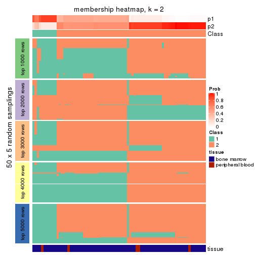</p>

</div>
<div id='tab-ATC-mclust-membership-heatmap-2'>
<pre><code class="r">membership_heatmap(res, k = 3)
</code></pre>

<p>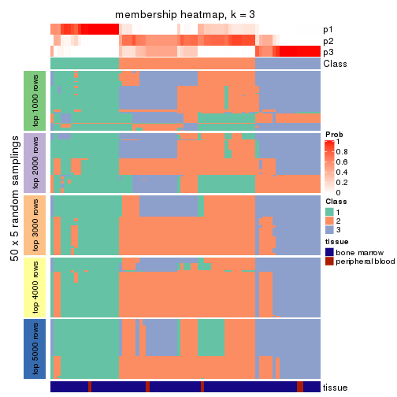</p>

</div>
<div id='tab-ATC-mclust-membership-heatmap-3'>
<pre><code class="r">membership_heatmap(res, k = 4)
</code></pre>

<p>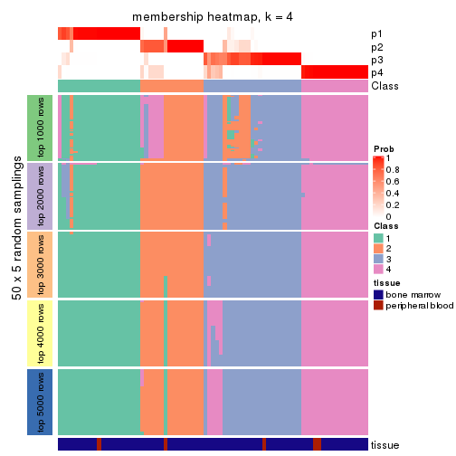</p>

</div>
<div id='tab-ATC-mclust-membership-heatmap-4'>
<pre><code class="r">membership_heatmap(res, k = 5)
</code></pre>

<p>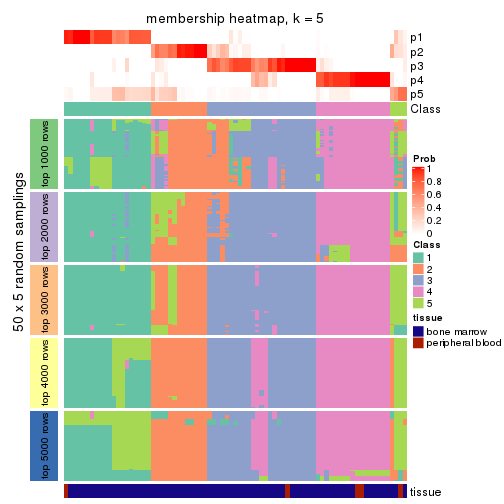</p>

</div>
<div id='tab-ATC-mclust-membership-heatmap-5'>
<pre><code class="r">membership_heatmap(res, k = 6)
</code></pre>

<p>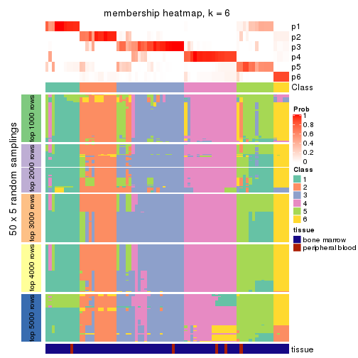</p>

</div>
</div>

As soon as we have had the classes for columns, we can look for signatures
which are significantly different between classes which can be candidate marks
for certain classes. Following are the heatmaps for signatures.


Signature heatmaps where rows are scaled:


<script>
$( function() {
	$( '#tabs-ATC-mclust-get-signatures' ).tabs();
} );
</script>
<div id='tabs-ATC-mclust-get-signatures'>
<ul>
<li><a href='#tab-ATC-mclust-get-signatures-1'>k = 2</a></li>
<li><a href='#tab-ATC-mclust-get-signatures-2'>k = 3</a></li>
<li><a href='#tab-ATC-mclust-get-signatures-3'>k = 4</a></li>
<li><a href='#tab-ATC-mclust-get-signatures-4'>k = 5</a></li>
<li><a href='#tab-ATC-mclust-get-signatures-5'>k = 6</a></li>
</ul>
<div id='tab-ATC-mclust-get-signatures-1'>
<pre><code class="r">get_signatures(res, k = 2)
</code></pre>

<p>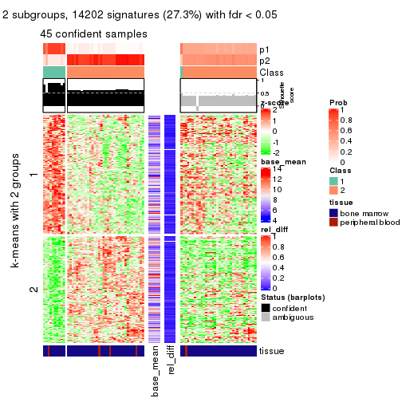</p>

</div>
<div id='tab-ATC-mclust-get-signatures-2'>
<pre><code class="r">get_signatures(res, k = 3)
</code></pre>

<p>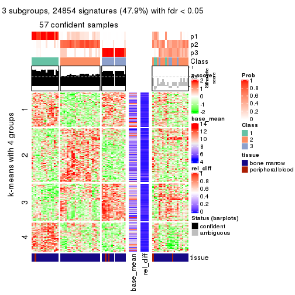</p>

</div>
<div id='tab-ATC-mclust-get-signatures-3'>
<pre><code class="r">get_signatures(res, k = 4)
</code></pre>

<p>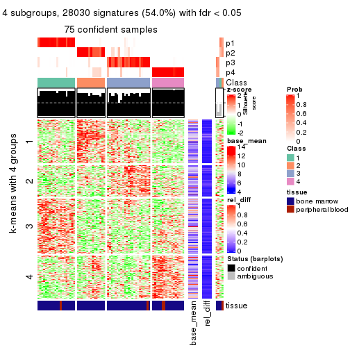</p>

</div>
<div id='tab-ATC-mclust-get-signatures-4'>
<pre><code class="r">get_signatures(res, k = 5)
</code></pre>

<p>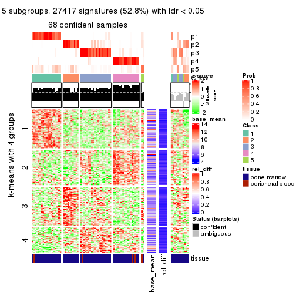</p>

</div>
<div id='tab-ATC-mclust-get-signatures-5'>
<pre><code class="r">get_signatures(res, k = 6)
</code></pre>

<p>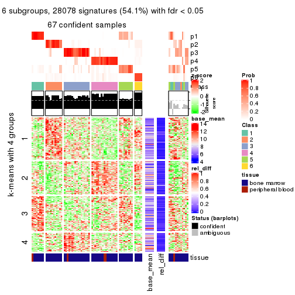</p>

</div>
</div>


Signature heatmaps where rows are not scaled:


<script>
$( function() {
	$( '#tabs-ATC-mclust-get-signatures-no-scale' ).tabs();
} );
</script>
<div id='tabs-ATC-mclust-get-signatures-no-scale'>
<ul>
<li><a href='#tab-ATC-mclust-get-signatures-no-scale-1'>k = 2</a></li>
<li><a href='#tab-ATC-mclust-get-signatures-no-scale-2'>k = 3</a></li>
<li><a href='#tab-ATC-mclust-get-signatures-no-scale-3'>k = 4</a></li>
<li><a href='#tab-ATC-mclust-get-signatures-no-scale-4'>k = 5</a></li>
<li><a href='#tab-ATC-mclust-get-signatures-no-scale-5'>k = 6</a></li>
</ul>
<div id='tab-ATC-mclust-get-signatures-no-scale-1'>
<pre><code class="r">get_signatures(res, k = 2, scale_rows = FALSE)
</code></pre>

<p>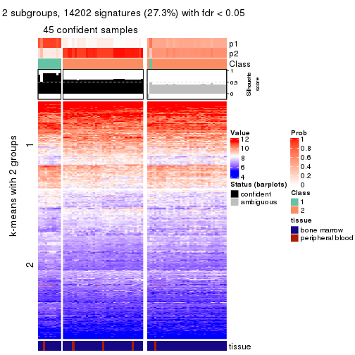</p>

</div>
<div id='tab-ATC-mclust-get-signatures-no-scale-2'>
<pre><code class="r">get_signatures(res, k = 3, scale_rows = FALSE)
</code></pre>

<p>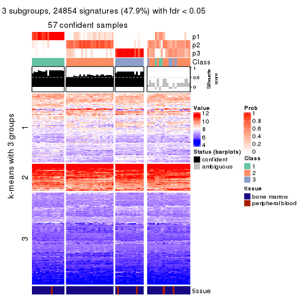</p>

</div>
<div id='tab-ATC-mclust-get-signatures-no-scale-3'>
<pre><code class="r">get_signatures(res, k = 4, scale_rows = FALSE)
</code></pre>

<p>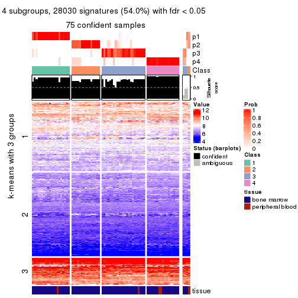</p>

</div>
<div id='tab-ATC-mclust-get-signatures-no-scale-4'>
<pre><code class="r">get_signatures(res, k = 5, scale_rows = FALSE)
</code></pre>

<p></p>

</div>
<div id='tab-ATC-mclust-get-signatures-no-scale-5'>
<pre><code class="r">get_signatures(res, k = 6, scale_rows = FALSE)
</code></pre>

<p>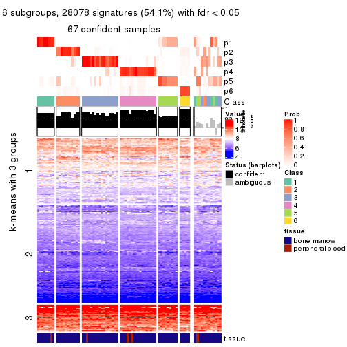</p>

</div>
</div>


Compare the overlap of signatures from different k:

```r
compare_signatures(res)
```

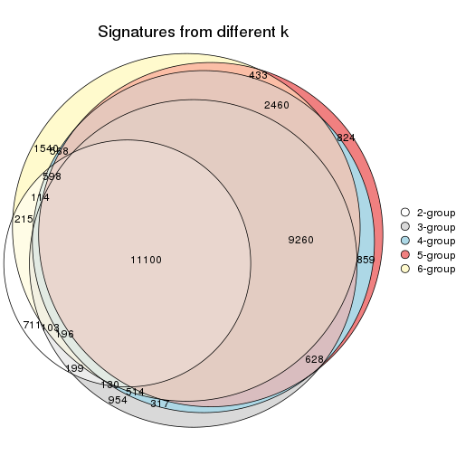

`get_signature()` returns a data frame invisibly. TO get the list of signatures, the function
call should be assigned to a variable explicitly. In following code, if `plot` argument is set
to `FALSE`, no heatmap is plotted while only the differential analysis is performed.

```r
# code only for demonstration
tb = get_signature(res, k = ..., plot = FALSE)
```

An example of the output of `tb` is:

```
#>   which_row         fdr    mean_1    mean_2 scaled_mean_1 scaled_mean_2 km
#> 1        38 0.042760348  8.373488  9.131774    -0.5533452     0.5164555  1
#> 2        40 0.018707592  7.106213  8.469186    -0.6173731     0.5762149  1
#> 3        55 0.019134737 10.221463 11.207825    -0.6159697     0.5749050  1
#> 4        59 0.006059896  5.921854  7.869574    -0.6899429     0.6439467  1
#> 5        60 0.018055526  8.928898 10.211722    -0.6204761     0.5791110  1
#> 6        98 0.009384629 15.714769 14.887706     0.6635654    -0.6193277  2
...
```

The columns in `tb` are:

1. `which_row`: row indices corresponding to the input matrix.
2. `fdr`: FDR for the differential test. 
3. `mean_x`: The mean value in group x.
4. `scaled_mean_x`: The mean value in group x after rows are scaled.
5. `km`: Row groups if k-means clustering is applied to rows.


UMAP plot which shows how samples are separated.


<script>
$( function() {
	$( '#tabs-ATC-mclust-dimension-reduction' ).tabs();
} );
</script>
<div id='tabs-ATC-mclust-dimension-reduction'>
<ul>
<li><a href='#tab-ATC-mclust-dimension-reduction-1'>k = 2</a></li>
<li><a href='#tab-ATC-mclust-dimension-reduction-2'>k = 3</a></li>
<li><a href='#tab-ATC-mclust-dimension-reduction-3'>k = 4</a></li>
<li><a href='#tab-ATC-mclust-dimension-reduction-4'>k = 5</a></li>
<li><a href='#tab-ATC-mclust-dimension-reduction-5'>k = 6</a></li>
</ul>
<div id='tab-ATC-mclust-dimension-reduction-1'>
<pre><code class="r">dimension_reduction(res, k = 2, method = &quot;UMAP&quot;)
</code></pre>

<p>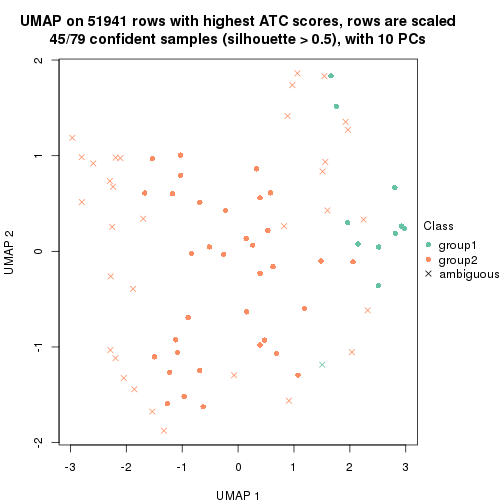</p>

</div>
<div id='tab-ATC-mclust-dimension-reduction-2'>
<pre><code class="r">dimension_reduction(res, k = 3, method = &quot;UMAP&quot;)
</code></pre>

<p>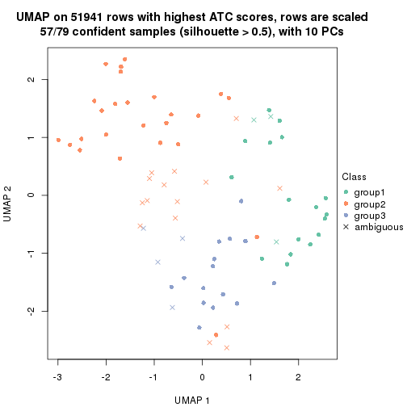</p>

</div>
<div id='tab-ATC-mclust-dimension-reduction-3'>
<pre><code class="r">dimension_reduction(res, k = 4, method = &quot;UMAP&quot;)
</code></pre>

<p>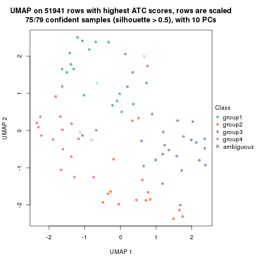</p>

</div>
<div id='tab-ATC-mclust-dimension-reduction-4'>
<pre><code class="r">dimension_reduction(res, k = 5, method = &quot;UMAP&quot;)
</code></pre>

<p>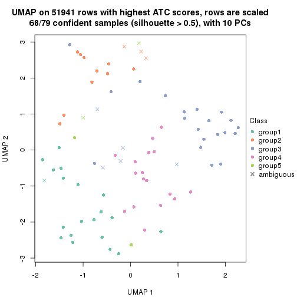</p>

</div>
<div id='tab-ATC-mclust-dimension-reduction-5'>
<pre><code class="r">dimension_reduction(res, k = 6, method = &quot;UMAP&quot;)
</code></pre>

<p>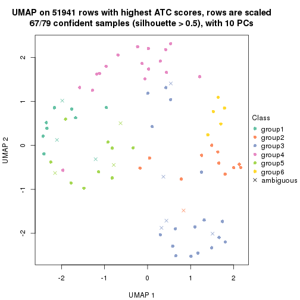</p>

</div>
</div>


Following heatmap shows how subgroups are split when increasing `k`:

```r
collect_classes(res)
```

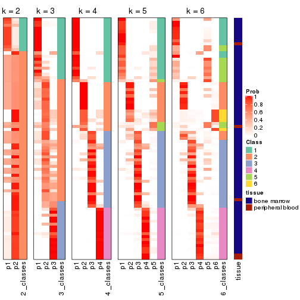


Test correlation between subgroups and known annotations. If the known
annotation is numeric, one-way ANOVA test is applied, and if the known
annotation is discrete, chi-squared contingency table test is applied.

```r
test_to_known_factors(res)
```

```
#>             n tissue(p) k
#> ATC:mclust 45     1.000 2
#> ATC:mclust 57     0.186 3
#> ATC:mclust 75     0.515 4
#> ATC:mclust 68     0.141 5
#> ATC:mclust 67     0.667 6
```


If matrix rows can be associated to genes, consider to use `GO_Enrichment(res,
...)` to perform function enrichment for the signature genes.


 

---------------------------------------------------


### ATC:NMF**


The object with results only for a single top-value method and a single partition method 
can be extracted as:

```r
res = res_list["ATC", "NMF"]
# you can also extract it by
# res = res_list["ATC:NMF"]
```

A summary of `res` and all the functions that can be applied to it:

```r
res
```

```
#> A 'ConsensusPartition' object with k = 2, 3, 4, 5, 6.
#>   On a matrix with 51941 rows and 79 columns.
#>   Top rows (1000, 2000, 3000, 4000, 5000) are extracted by 'ATC' method.
#>   Subgroups are detected by 'NMF' method.
#>   Performed in total 1250 partitions by row resampling.
#>   Best k for subgroups seems to be 3.
#> 
#> Following methods can be applied to this 'ConsensusPartition' object:
#>  [1] "cola_report"             "collect_classes"         "collect_plots"          
#>  [4] "collect_stats"           "colnames"                "compare_signatures"     
#>  [7] "consensus_heatmap"       "dimension_reduction"     "functional_enrichment"  
#> [10] "get_anno_col"            "get_anno"                "get_classes"            
#> [13] "get_consensus"           "get_matrix"              "get_membership"         
#> [16] "get_param"               "get_signatures"          "get_stats"              
#> [19] "is_best_k"               "is_stable_k"             "membership_heatmap"     
#> [22] "ncol"                    "nrow"                    "plot_ecdf"              
#> [25] "rownames"                "select_partition_number" "show"                   
#> [28] "suggest_best_k"          "test_to_known_factors"
```

`collect_plots()` function collects all the plots made from `res` for all `k` (number of partitions)
into one single page to provide an easy and fast comparison between different `k`.

```r
collect_plots(res)
```

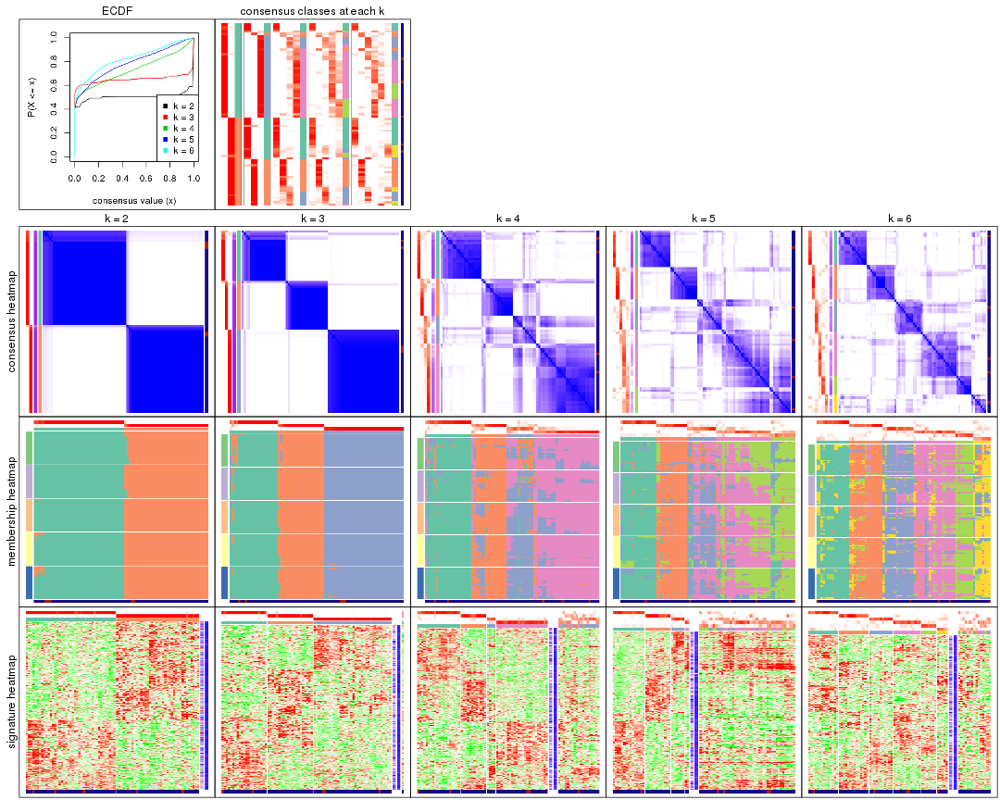

The plots are:

- The first row: a plot of the ECDF (Empirical cumulative distribution
  function) curves of the consensus matrix for each `k` and the heatmap of
  predicted classes for each `k`.
- The second row: heatmaps of the consensus matrix for each `k`.
- The third row: heatmaps of the membership matrix for each `k`.
- The fouth row: heatmaps of the signatures for each `k`.

All the plots in panels can be made by individual functions and they are
plotted later in this section.

`select_partition_number()` produces several plots showing different
statistics for choosing "optimized" `k`. There are following statistics:

- ECDF curves of the consensus matrix for each `k`;
- 1-PAC. [The PAC
  score](https://en.wikipedia.org/wiki/Consensus_clustering#Over-interpretation_potential_of_consensus_clustering)
  measures the proportion of the ambiguous subgrouping.
- Mean silhouette score.
- Concordance. The mean probability of fiting the consensus class ids in all
  partitions.
- Area increased. Denote $A_k$ as the area under the ECDF curve for current
  `k`, the area increased is defined as $A_k - A_{k-1}$.
- Rand index. The percent of pairs of samples that are both in a same cluster
  or both are not in a same cluster in the partition of k and k-1.
- Jaccard index. The ratio of pairs of samples are both in a same cluster in
  the partition of k and k-1 and the pairs of samples are both in a same
  cluster in the partition k or k-1.

The detailed explanations of these statistics can be found in [the cola
vignette](http://bioconductor.org/packages/devel/bioc/vignettes/cola/inst/doc/cola.html#toc_13).

Generally speaking, lower PAC score, higher mean silhouette score or higher
concordance corresponds to better partition. Rand index and Jaccard index
measure how similar the current partition is compared to partition with `k-1`.
If they are too similar, we won't accept `k` is better than `k-1`.

```r
select_partition_number(res)
```

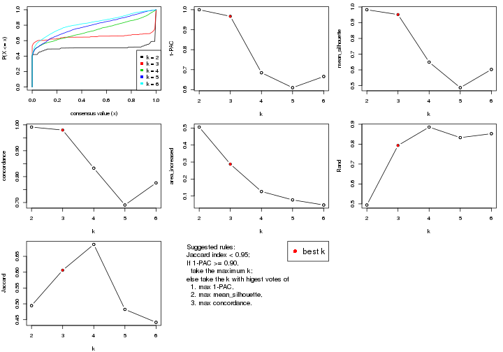

The numeric values for all these statistics can be obtained by `get_stats()`.

```r
get_stats(res)
```

```
#>   k 1-PAC mean_silhouette concordance area_increased  Rand Jaccard
#> 2 2 1.000           0.982       0.991         0.5056 0.494   0.494
#> 3 3 0.967           0.952       0.980         0.2877 0.794   0.606
#> 4 4 0.685           0.649       0.833         0.1265 0.886   0.688
#> 5 5 0.610           0.487       0.690         0.0772 0.833   0.482
#> 6 6 0.666           0.603       0.776         0.0472 0.853   0.442
```

`suggest_best_k()` suggests the best $k$ based on these statistics. The rules are as follows:

- All $k$ with Jaccard index larger than 0.95 are removed because the increase of
  the partition number does not provides enough extra information. If all $k$ are removed,
  the best $k$ is assigned by `NA`.
- For $k$ with 1-PAC larger than 0.9, the maximal $k$ is taken as the "best k". Other $k$ is called "optional k".
- If it does not fit the second rule. The $k$ with the highest vote of highest
  1-PAC, mean silhouette and concordance is taken as the "best k".

```r
suggest_best_k(res)
```

```
#> [1] 3
#> attr(,"optional")
#> [1] 2
```

There is also optional best $k$ = 2 that is worth to check.

Following shows the table of the partitions (You need to click the **show/hide
code output** link to see it). The membership matrix (columns with name `p*`)
is inferred by
[`clue::cl_consensus()`](https://www.rdocumentation.org/link/cl_consensus?package=clue)
function with the `SE` method. Basically the value in the membership matrix
represents the probability to belong to a certain group. The finall class
label for an item is determined with the group with highest probability it
belongs to.

In `get_classes()` function, the entropy is calculated from the membership
matrix and the silhouette score is calculated from the consensus matrix.


<script>
$( function() {
	$( '#tabs-ATC-NMF-get-classes' ).tabs();
} );
</script>
<div id='tabs-ATC-NMF-get-classes'>
<ul>
<li><a href='#tab-ATC-NMF-get-classes-1'>k = 2</a></li>
<li><a href='#tab-ATC-NMF-get-classes-2'>k = 3</a></li>
<li><a href='#tab-ATC-NMF-get-classes-3'>k = 4</a></li>
<li><a href='#tab-ATC-NMF-get-classes-4'>k = 5</a></li>
<li><a href='#tab-ATC-NMF-get-classes-5'>k = 6</a></li>
</ul>

<div id='tab-ATC-NMF-get-classes-1'>
<p><a id='tab-ATC-NMF-get-classes-1-a' style='color:#0366d6' href='#'>show/hide code output</a></p>
<pre><code class="r">cbind(get_classes(res, k = 2), get_membership(res, k = 2))
</code></pre>

<pre><code>#&gt;           class entropy silhouette    p1    p2
#&gt; GSM316652     2  0.0000      0.992 0.000 1.000
#&gt; GSM316653     1  0.0000      0.990 1.000 0.000
#&gt; GSM316654     1  0.0000      0.990 1.000 0.000
#&gt; GSM316655     1  0.0000      0.990 1.000 0.000
#&gt; GSM316656     2  0.0000      0.992 0.000 1.000
#&gt; GSM316657     2  0.0000      0.992 0.000 1.000
#&gt; GSM316658     2  0.0000      0.992 0.000 1.000
#&gt; GSM316659     1  0.0000      0.990 1.000 0.000
#&gt; GSM316660     2  0.0000      0.992 0.000 1.000
#&gt; GSM316661     1  0.0000      0.990 1.000 0.000
#&gt; GSM316662     2  0.0000      0.992 0.000 1.000
#&gt; GSM316663     1  0.0000      0.990 1.000 0.000
#&gt; GSM316664     1  0.0000      0.990 1.000 0.000
#&gt; GSM316665     2  0.0000      0.992 0.000 1.000
#&gt; GSM316666     1  0.0000      0.990 1.000 0.000
#&gt; GSM316667     2  0.0000      0.992 0.000 1.000
#&gt; GSM316668     2  0.0000      0.992 0.000 1.000
#&gt; GSM316669     1  0.0000      0.990 1.000 0.000
#&gt; GSM316670     1  0.0000      0.990 1.000 0.000
#&gt; GSM316671     2  0.0000      0.992 0.000 1.000
#&gt; GSM316672     2  0.0000      0.992 0.000 1.000
#&gt; GSM316673     1  0.0000      0.990 1.000 0.000
#&gt; GSM316674     2  0.2778      0.945 0.048 0.952
#&gt; GSM316676     1  0.0000      0.990 1.000 0.000
#&gt; GSM316677     1  0.0000      0.990 1.000 0.000
#&gt; GSM316678     2  0.0000      0.992 0.000 1.000
#&gt; GSM316679     2  0.0000      0.992 0.000 1.000
#&gt; GSM316680     2  0.0000      0.992 0.000 1.000
#&gt; GSM316681     2  0.0000      0.992 0.000 1.000
#&gt; GSM316682     1  0.0000      0.990 1.000 0.000
#&gt; GSM316683     1  0.0000      0.990 1.000 0.000
#&gt; GSM316684     2  0.0000      0.992 0.000 1.000
#&gt; GSM316685     2  0.0000      0.992 0.000 1.000
#&gt; GSM316686     1  0.0000      0.990 1.000 0.000
#&gt; GSM316687     1  0.0000      0.990 1.000 0.000
#&gt; GSM316688     2  0.0672      0.985 0.008 0.992
#&gt; GSM316689     1  0.4690      0.897 0.900 0.100
#&gt; GSM316690     1  0.0000      0.990 1.000 0.000
#&gt; GSM316691     1  0.5059      0.883 0.888 0.112
#&gt; GSM316692     1  0.0000      0.990 1.000 0.000
#&gt; GSM316693     1  0.0000      0.990 1.000 0.000
#&gt; GSM316694     1  0.0000      0.990 1.000 0.000
#&gt; GSM316696     1  0.3274      0.939 0.940 0.060
#&gt; GSM316697     1  0.0000      0.990 1.000 0.000
#&gt; GSM316698     2  0.0000      0.992 0.000 1.000
#&gt; GSM316699     1  0.2778      0.950 0.952 0.048
#&gt; GSM316700     1  0.0000      0.990 1.000 0.000
#&gt; GSM316701     1  0.0000      0.990 1.000 0.000
#&gt; GSM316703     1  0.0000      0.990 1.000 0.000
#&gt; GSM316704     1  0.0000      0.990 1.000 0.000
#&gt; GSM316705     1  0.0000      0.990 1.000 0.000
#&gt; GSM316706     1  0.0000      0.990 1.000 0.000
#&gt; GSM316707     2  0.0000      0.992 0.000 1.000
#&gt; GSM316708     2  0.0000      0.992 0.000 1.000
#&gt; GSM316709     1  0.0000      0.990 1.000 0.000
#&gt; GSM316710     1  0.0000      0.990 1.000 0.000
#&gt; GSM316711     1  0.0000      0.990 1.000 0.000
#&gt; GSM316713     2  0.7674      0.708 0.224 0.776
#&gt; GSM316714     1  0.0000      0.990 1.000 0.000
#&gt; GSM316715     2  0.0000      0.992 0.000 1.000
#&gt; GSM316716     2  0.0000      0.992 0.000 1.000
#&gt; GSM316717     2  0.0000      0.992 0.000 1.000
#&gt; GSM316718     2  0.0000      0.992 0.000 1.000
#&gt; GSM316719     2  0.0000      0.992 0.000 1.000
#&gt; GSM316720     2  0.0000      0.992 0.000 1.000
#&gt; GSM316721     2  0.0000      0.992 0.000 1.000
#&gt; GSM316722     2  0.0000      0.992 0.000 1.000
#&gt; GSM316723     2  0.0000      0.992 0.000 1.000
#&gt; GSM316724     2  0.0000      0.992 0.000 1.000
#&gt; GSM316726     2  0.0000      0.992 0.000 1.000
#&gt; GSM316727     2  0.0000      0.992 0.000 1.000
#&gt; GSM316728     1  0.0000      0.990 1.000 0.000
#&gt; GSM316729     2  0.0000      0.992 0.000 1.000
#&gt; GSM316730     1  0.3879      0.923 0.924 0.076
#&gt; GSM316675     1  0.0000      0.990 1.000 0.000
#&gt; GSM316695     2  0.0000      0.992 0.000 1.000
#&gt; GSM316702     1  0.0000      0.990 1.000 0.000
#&gt; GSM316712     2  0.0000      0.992 0.000 1.000
#&gt; GSM316725     1  0.0000      0.990 1.000 0.000
</code></pre>

<script>
$('#tab-ATC-NMF-get-classes-1-a').parent().next().next().hide();
$('#tab-ATC-NMF-get-classes-1-a').click(function(){
  $('#tab-ATC-NMF-get-classes-1-a').parent().next().next().toggle();
  return(false);
});
</script>
</div>

<div id='tab-ATC-NMF-get-classes-2'>
<p><a id='tab-ATC-NMF-get-classes-2-a' style='color:#0366d6' href='#'>show/hide code output</a></p>
<pre><code class="r">cbind(get_classes(res, k = 3), get_membership(res, k = 3))
</code></pre>

<pre><code>#&gt;           class entropy silhouette    p1    p2    p3
#&gt; GSM316652     1  0.4555      0.746 0.800 0.200 0.000
#&gt; GSM316653     3  0.0000      0.996 0.000 0.000 1.000
#&gt; GSM316654     3  0.0000      0.996 0.000 0.000 1.000
#&gt; GSM316655     3  0.0000      0.996 0.000 0.000 1.000
#&gt; GSM316656     2  0.0000      0.976 0.000 1.000 0.000
#&gt; GSM316657     1  0.0000      0.948 1.000 0.000 0.000
#&gt; GSM316658     2  0.0000      0.976 0.000 1.000 0.000
#&gt; GSM316659     3  0.0892      0.980 0.000 0.020 0.980
#&gt; GSM316660     1  0.3038      0.859 0.896 0.104 0.000
#&gt; GSM316661     3  0.0000      0.996 0.000 0.000 1.000
#&gt; GSM316662     2  0.0000      0.976 0.000 1.000 0.000
#&gt; GSM316663     3  0.0000      0.996 0.000 0.000 1.000
#&gt; GSM316664     3  0.0000      0.996 0.000 0.000 1.000
#&gt; GSM316665     2  0.0000      0.976 0.000 1.000 0.000
#&gt; GSM316666     3  0.1643      0.957 0.000 0.044 0.956
#&gt; GSM316667     2  0.0000      0.976 0.000 1.000 0.000
#&gt; GSM316668     2  0.0000      0.976 0.000 1.000 0.000
#&gt; GSM316669     3  0.0000      0.996 0.000 0.000 1.000
#&gt; GSM316670     3  0.0000      0.996 0.000 0.000 1.000
#&gt; GSM316671     2  0.1163      0.951 0.028 0.972 0.000
#&gt; GSM316672     2  0.5178      0.631 0.256 0.744 0.000
#&gt; GSM316673     1  0.4931      0.687 0.768 0.000 0.232
#&gt; GSM316674     2  0.0000      0.976 0.000 1.000 0.000
#&gt; GSM316676     3  0.0000      0.996 0.000 0.000 1.000
#&gt; GSM316677     1  0.0000      0.948 1.000 0.000 0.000
#&gt; GSM316678     2  0.0000      0.976 0.000 1.000 0.000
#&gt; GSM316679     1  0.0000      0.948 1.000 0.000 0.000
#&gt; GSM316680     1  0.0000      0.948 1.000 0.000 0.000
#&gt; GSM316681     2  0.0000      0.976 0.000 1.000 0.000
#&gt; GSM316682     3  0.0000      0.996 0.000 0.000 1.000
#&gt; GSM316683     3  0.0000      0.996 0.000 0.000 1.000
#&gt; GSM316684     2  0.0000      0.976 0.000 1.000 0.000
#&gt; GSM316685     2  0.0000      0.976 0.000 1.000 0.000
#&gt; GSM316686     3  0.0000      0.996 0.000 0.000 1.000
#&gt; GSM316687     3  0.0592      0.986 0.012 0.000 0.988
#&gt; GSM316688     1  0.0000      0.948 1.000 0.000 0.000
#&gt; GSM316689     1  0.0000      0.948 1.000 0.000 0.000
#&gt; GSM316690     3  0.0000      0.996 0.000 0.000 1.000
#&gt; GSM316691     3  0.0424      0.990 0.000 0.008 0.992
#&gt; GSM316692     3  0.0000      0.996 0.000 0.000 1.000
#&gt; GSM316693     3  0.0000      0.996 0.000 0.000 1.000
#&gt; GSM316694     3  0.0000      0.996 0.000 0.000 1.000
#&gt; GSM316696     1  0.0000      0.948 1.000 0.000 0.000
#&gt; GSM316697     3  0.0237      0.993 0.000 0.004 0.996
#&gt; GSM316698     2  0.0000      0.976 0.000 1.000 0.000
#&gt; GSM316699     2  0.3551      0.818 0.000 0.868 0.132
#&gt; GSM316700     3  0.0000      0.996 0.000 0.000 1.000
#&gt; GSM316701     3  0.0000      0.996 0.000 0.000 1.000
#&gt; GSM316703     3  0.0000      0.996 0.000 0.000 1.000
#&gt; GSM316704     3  0.0000      0.996 0.000 0.000 1.000
#&gt; GSM316705     3  0.0000      0.996 0.000 0.000 1.000
#&gt; GSM316706     3  0.0000      0.996 0.000 0.000 1.000
#&gt; GSM316707     2  0.0000      0.976 0.000 1.000 0.000
#&gt; GSM316708     1  0.6291      0.132 0.532 0.468 0.000
#&gt; GSM316709     3  0.0000      0.996 0.000 0.000 1.000
#&gt; GSM316710     3  0.0000      0.996 0.000 0.000 1.000
#&gt; GSM316711     3  0.1031      0.977 0.000 0.024 0.976
#&gt; GSM316713     1  0.0000      0.948 1.000 0.000 0.000
#&gt; GSM316714     3  0.0000      0.996 0.000 0.000 1.000
#&gt; GSM316715     1  0.0000      0.948 1.000 0.000 0.000
#&gt; GSM316716     2  0.0000      0.976 0.000 1.000 0.000
#&gt; GSM316717     1  0.0237      0.946 0.996 0.004 0.000
#&gt; GSM316718     1  0.0000      0.948 1.000 0.000 0.000
#&gt; GSM316719     1  0.0000      0.948 1.000 0.000 0.000
#&gt; GSM316720     1  0.0000      0.948 1.000 0.000 0.000
#&gt; GSM316721     2  0.0000      0.976 0.000 1.000 0.000
#&gt; GSM316722     1  0.0237      0.946 0.996 0.004 0.000
#&gt; GSM316723     2  0.0000      0.976 0.000 1.000 0.000
#&gt; GSM316724     2  0.0000      0.976 0.000 1.000 0.000
#&gt; GSM316726     2  0.0000      0.976 0.000 1.000 0.000
#&gt; GSM316727     1  0.0000      0.948 1.000 0.000 0.000
#&gt; GSM316728     3  0.0000      0.996 0.000 0.000 1.000
#&gt; GSM316729     1  0.0000      0.948 1.000 0.000 0.000
#&gt; GSM316730     3  0.1529      0.958 0.040 0.000 0.960
#&gt; GSM316675     3  0.0000      0.996 0.000 0.000 1.000
#&gt; GSM316695     1  0.0237      0.946 0.996 0.004 0.000
#&gt; GSM316702     3  0.0000      0.996 0.000 0.000 1.000
#&gt; GSM316712     1  0.0000      0.948 1.000 0.000 0.000
#&gt; GSM316725     3  0.0000      0.996 0.000 0.000 1.000
</code></pre>

<script>
$('#tab-ATC-NMF-get-classes-2-a').parent().next().next().hide();
$('#tab-ATC-NMF-get-classes-2-a').click(function(){
  $('#tab-ATC-NMF-get-classes-2-a').parent().next().next().toggle();
  return(false);
});
</script>
</div>

<div id='tab-ATC-NMF-get-classes-3'>
<p><a id='tab-ATC-NMF-get-classes-3-a' style='color:#0366d6' href='#'>show/hide code output</a></p>
<pre><code class="r">cbind(get_classes(res, k = 4), get_membership(res, k = 4))
</code></pre>

<pre><code>#&gt;           class entropy silhouette    p1    p2    p3    p4
#&gt; GSM316652     3  0.4656    0.49884 0.160 0.056 0.784 0.000
#&gt; GSM316653     4  0.4304    0.62920 0.000 0.000 0.284 0.716
#&gt; GSM316654     4  0.4855    0.42793 0.000 0.000 0.400 0.600
#&gt; GSM316655     4  0.3837    0.70421 0.000 0.000 0.224 0.776
#&gt; GSM316656     3  0.4737    0.55102 0.048 0.092 0.820 0.040
#&gt; GSM316657     1  0.1389    0.88729 0.952 0.000 0.048 0.000
#&gt; GSM316658     2  0.0000    0.77477 0.000 1.000 0.000 0.000
#&gt; GSM316659     2  0.5163    0.00258 0.000 0.516 0.004 0.480
#&gt; GSM316660     1  0.5788    0.61821 0.688 0.084 0.228 0.000
#&gt; GSM316661     4  0.1867    0.80449 0.000 0.000 0.072 0.928
#&gt; GSM316662     2  0.5168    0.16150 0.004 0.500 0.496 0.000
#&gt; GSM316663     4  0.2011    0.80242 0.000 0.000 0.080 0.920
#&gt; GSM316664     4  0.0817    0.79734 0.000 0.000 0.024 0.976
#&gt; GSM316665     2  0.0000    0.77477 0.000 1.000 0.000 0.000
#&gt; GSM316666     3  0.4040    0.50952 0.000 0.000 0.752 0.248
#&gt; GSM316667     2  0.4948    0.28823 0.000 0.560 0.440 0.000
#&gt; GSM316668     3  0.4277    0.35650 0.000 0.280 0.720 0.000
#&gt; GSM316669     4  0.2408    0.79388 0.000 0.000 0.104 0.896
#&gt; GSM316670     3  0.4985   -0.03598 0.000 0.000 0.532 0.468
#&gt; GSM316671     3  0.7554    0.14257 0.316 0.212 0.472 0.000
#&gt; GSM316672     2  0.2334    0.71454 0.088 0.908 0.004 0.000
#&gt; GSM316673     1  0.6707    0.16229 0.468 0.000 0.088 0.444
#&gt; GSM316674     3  0.3108    0.54657 0.000 0.112 0.872 0.016
#&gt; GSM316676     3  0.4543    0.34993 0.000 0.000 0.676 0.324
#&gt; GSM316677     1  0.1297    0.89097 0.964 0.000 0.016 0.020
#&gt; GSM316678     2  0.0000    0.77477 0.000 1.000 0.000 0.000
#&gt; GSM316679     1  0.0707    0.89471 0.980 0.000 0.020 0.000
#&gt; GSM316680     1  0.0336    0.89703 0.992 0.000 0.008 0.000
#&gt; GSM316681     3  0.5226    0.45070 0.076 0.180 0.744 0.000
#&gt; GSM316682     4  0.1118    0.80909 0.000 0.000 0.036 0.964
#&gt; GSM316683     4  0.0336    0.80580 0.000 0.000 0.008 0.992
#&gt; GSM316684     2  0.0000    0.77477 0.000 1.000 0.000 0.000
#&gt; GSM316685     3  0.4730    0.17750 0.000 0.364 0.636 0.000
#&gt; GSM316686     4  0.1938    0.77401 0.012 0.000 0.052 0.936
#&gt; GSM316687     4  0.3037    0.72418 0.020 0.000 0.100 0.880
#&gt; GSM316688     1  0.3758    0.82394 0.848 0.000 0.104 0.048
#&gt; GSM316689     1  0.0188    0.89707 0.996 0.000 0.000 0.004
#&gt; GSM316690     4  0.4522    0.57525 0.000 0.000 0.320 0.680
#&gt; GSM316691     4  0.4348    0.71539 0.024 0.000 0.196 0.780
#&gt; GSM316692     4  0.2408    0.79367 0.000 0.000 0.104 0.896
#&gt; GSM316693     4  0.0817    0.80846 0.000 0.000 0.024 0.976
#&gt; GSM316694     4  0.4877    0.36733 0.000 0.000 0.408 0.592
#&gt; GSM316696     1  0.1510    0.88661 0.956 0.000 0.016 0.028
#&gt; GSM316697     3  0.3444    0.56571 0.000 0.000 0.816 0.184
#&gt; GSM316698     2  0.0336    0.77246 0.000 0.992 0.008 0.000
#&gt; GSM316699     2  0.7382    0.09693 0.000 0.520 0.260 0.220
#&gt; GSM316700     4  0.2589    0.78803 0.000 0.000 0.116 0.884
#&gt; GSM316701     4  0.4961    0.30643 0.000 0.000 0.448 0.552
#&gt; GSM316703     4  0.1182    0.79650 0.000 0.016 0.016 0.968
#&gt; GSM316704     4  0.0817    0.80023 0.000 0.024 0.000 0.976
#&gt; GSM316705     4  0.1488    0.78787 0.012 0.000 0.032 0.956
#&gt; GSM316706     4  0.1677    0.78583 0.000 0.012 0.040 0.948
#&gt; GSM316707     2  0.0188    0.77392 0.000 0.996 0.004 0.000
#&gt; GSM316708     1  0.4842    0.70285 0.760 0.192 0.048 0.000
#&gt; GSM316709     3  0.4961   -0.02445 0.000 0.000 0.552 0.448
#&gt; GSM316710     4  0.1940    0.80356 0.000 0.000 0.076 0.924
#&gt; GSM316711     4  0.5639    0.45771 0.000 0.324 0.040 0.636
#&gt; GSM316713     1  0.2466    0.86311 0.900 0.000 0.096 0.004
#&gt; GSM316714     4  0.1302    0.80877 0.000 0.000 0.044 0.956
#&gt; GSM316715     1  0.0188    0.89675 0.996 0.000 0.004 0.000
#&gt; GSM316716     2  0.4406    0.53930 0.000 0.700 0.300 0.000
#&gt; GSM316717     1  0.1940    0.86736 0.924 0.000 0.076 0.000
#&gt; GSM316718     1  0.0188    0.89719 0.996 0.000 0.004 0.000
#&gt; GSM316719     1  0.0336    0.89703 0.992 0.000 0.008 0.000
#&gt; GSM316720     1  0.0469    0.89638 0.988 0.000 0.012 0.000
#&gt; GSM316721     2  0.1867    0.74921 0.000 0.928 0.072 0.000
#&gt; GSM316722     1  0.1867    0.86918 0.928 0.000 0.072 0.000
#&gt; GSM316723     2  0.0592    0.77290 0.000 0.984 0.016 0.000
#&gt; GSM316724     2  0.0707    0.77199 0.000 0.980 0.020 0.000
#&gt; GSM316726     2  0.4008    0.60806 0.000 0.756 0.244 0.000
#&gt; GSM316727     1  0.0469    0.89638 0.988 0.000 0.012 0.000
#&gt; GSM316728     4  0.0921    0.80895 0.000 0.000 0.028 0.972
#&gt; GSM316729     1  0.1356    0.88908 0.960 0.008 0.032 0.000
#&gt; GSM316730     4  0.7289    0.20772 0.032 0.344 0.080 0.544
#&gt; GSM316675     4  0.4907    0.36022 0.000 0.000 0.420 0.580
#&gt; GSM316695     1  0.5109    0.70096 0.744 0.196 0.060 0.000
#&gt; GSM316702     4  0.1722    0.78009 0.008 0.000 0.048 0.944
#&gt; GSM316712     1  0.1022    0.89240 0.968 0.000 0.032 0.000
#&gt; GSM316725     4  0.0707    0.79879 0.000 0.000 0.020 0.980
</code></pre>

<script>
$('#tab-ATC-NMF-get-classes-3-a').parent().next().next().hide();
$('#tab-ATC-NMF-get-classes-3-a').click(function(){
  $('#tab-ATC-NMF-get-classes-3-a').parent().next().next().toggle();
  return(false);
});
</script>
</div>

<div id='tab-ATC-NMF-get-classes-4'>
<p><a id='tab-ATC-NMF-get-classes-4-a' style='color:#0366d6' href='#'>show/hide code output</a></p>
<pre><code class="r">cbind(get_classes(res, k = 5), get_membership(res, k = 5))
</code></pre>

<pre><code>#&gt;           class entropy silhouette    p1    p2    p3    p4    p5
#&gt; GSM316652     3  0.1168     0.6542 0.000 0.000 0.960 0.008 0.032
#&gt; GSM316653     4  0.2540     0.5000 0.000 0.000 0.088 0.888 0.024
#&gt; GSM316654     4  0.3645     0.4665 0.004 0.000 0.168 0.804 0.024
#&gt; GSM316655     4  0.2270     0.4989 0.000 0.000 0.076 0.904 0.020
#&gt; GSM316656     4  0.7647     0.0630 0.172 0.004 0.184 0.520 0.120
#&gt; GSM316657     1  0.2439     0.8410 0.876 0.000 0.004 0.000 0.120
#&gt; GSM316658     2  0.0000     0.8550 0.000 1.000 0.000 0.000 0.000
#&gt; GSM316659     2  0.4719     0.4968 0.000 0.696 0.000 0.248 0.056
#&gt; GSM316660     3  0.6797     0.3319 0.240 0.020 0.520 0.000 0.220
#&gt; GSM316661     4  0.2852     0.4042 0.000 0.000 0.000 0.828 0.172
#&gt; GSM316662     3  0.5641     0.4838 0.004 0.216 0.644 0.000 0.136
#&gt; GSM316663     4  0.3508     0.3340 0.000 0.000 0.000 0.748 0.252
#&gt; GSM316664     5  0.4297     0.2893 0.000 0.000 0.000 0.472 0.528
#&gt; GSM316665     2  0.0000     0.8550 0.000 1.000 0.000 0.000 0.000
#&gt; GSM316666     3  0.4808     0.2232 0.000 0.000 0.620 0.348 0.032
#&gt; GSM316667     3  0.4959     0.5758 0.000 0.128 0.712 0.000 0.160
#&gt; GSM316668     3  0.1485     0.6609 0.000 0.032 0.948 0.000 0.020
#&gt; GSM316669     4  0.1892     0.4586 0.000 0.000 0.004 0.916 0.080
#&gt; GSM316670     3  0.4948     0.3465 0.000 0.000 0.676 0.256 0.068
#&gt; GSM316671     3  0.7335     0.4314 0.152 0.176 0.548 0.000 0.124
#&gt; GSM316672     2  0.4237     0.7191 0.112 0.796 0.012 0.000 0.080
#&gt; GSM316673     5  0.5480     0.4658 0.176 0.000 0.000 0.168 0.656
#&gt; GSM316674     3  0.1153     0.6425 0.000 0.004 0.964 0.024 0.008
#&gt; GSM316676     4  0.4559     0.0355 0.000 0.000 0.480 0.512 0.008
#&gt; GSM316677     1  0.1430     0.8718 0.944 0.000 0.004 0.000 0.052
#&gt; GSM316678     2  0.0404     0.8541 0.000 0.988 0.012 0.000 0.000
#&gt; GSM316679     1  0.2249     0.8369 0.896 0.000 0.008 0.000 0.096
#&gt; GSM316680     1  0.2795     0.8338 0.872 0.000 0.028 0.000 0.100
#&gt; GSM316681     3  0.4473     0.6197 0.012 0.084 0.792 0.008 0.104
#&gt; GSM316682     4  0.3876     0.2032 0.000 0.000 0.000 0.684 0.316
#&gt; GSM316683     4  0.4161    -0.0199 0.000 0.000 0.000 0.608 0.392
#&gt; GSM316684     2  0.0000     0.8550 0.000 1.000 0.000 0.000 0.000
#&gt; GSM316685     3  0.3714     0.5926 0.000 0.132 0.812 0.056 0.000
#&gt; GSM316686     5  0.4327     0.4600 0.008 0.000 0.000 0.360 0.632
#&gt; GSM316687     5  0.3916     0.4413 0.096 0.000 0.012 0.072 0.820
#&gt; GSM316688     5  0.6655    -0.2552 0.260 0.000 0.296 0.000 0.444
#&gt; GSM316689     1  0.1043     0.8745 0.960 0.000 0.000 0.000 0.040
#&gt; GSM316690     4  0.3921     0.5009 0.000 0.000 0.172 0.784 0.044
#&gt; GSM316691     4  0.6980     0.3981 0.112 0.000 0.200 0.580 0.108
#&gt; GSM316692     4  0.3456     0.4143 0.000 0.000 0.016 0.800 0.184
#&gt; GSM316693     4  0.4074     0.1067 0.000 0.000 0.000 0.636 0.364
#&gt; GSM316694     4  0.5966     0.1671 0.000 0.000 0.432 0.460 0.108
#&gt; GSM316696     1  0.1845     0.8653 0.928 0.000 0.000 0.016 0.056
#&gt; GSM316697     3  0.4617     0.0395 0.000 0.000 0.552 0.436 0.012
#&gt; GSM316698     2  0.2280     0.7926 0.000 0.880 0.120 0.000 0.000
#&gt; GSM316699     4  0.7046     0.0239 0.000 0.364 0.128 0.460 0.048
#&gt; GSM316700     4  0.1697     0.4715 0.000 0.000 0.008 0.932 0.060
#&gt; GSM316701     4  0.5138     0.3637 0.016 0.000 0.192 0.712 0.080
#&gt; GSM316703     5  0.6239     0.2910 0.000 0.144 0.000 0.404 0.452
#&gt; GSM316704     4  0.6424    -0.2588 0.000 0.176 0.000 0.444 0.380
#&gt; GSM316705     5  0.4565     0.4164 0.012 0.000 0.000 0.408 0.580
#&gt; GSM316706     5  0.4547     0.4255 0.000 0.012 0.000 0.400 0.588
#&gt; GSM316707     2  0.0000     0.8550 0.000 1.000 0.000 0.000 0.000
#&gt; GSM316708     1  0.4654     0.7355 0.768 0.112 0.008 0.004 0.108
#&gt; GSM316709     4  0.4627     0.1432 0.000 0.000 0.444 0.544 0.012
#&gt; GSM316710     4  0.3636     0.2999 0.000 0.000 0.000 0.728 0.272
#&gt; GSM316711     2  0.4873     0.3963 0.000 0.644 0.000 0.312 0.044
#&gt; GSM316713     5  0.5178    -0.3702 0.480 0.000 0.040 0.000 0.480
#&gt; GSM316714     4  0.3932     0.2403 0.000 0.000 0.000 0.672 0.328
#&gt; GSM316715     1  0.1121     0.8735 0.956 0.000 0.000 0.000 0.044
#&gt; GSM316716     2  0.2773     0.8002 0.000 0.868 0.112 0.000 0.020
#&gt; GSM316717     1  0.2470     0.8305 0.884 0.000 0.012 0.000 0.104
#&gt; GSM316718     1  0.1845     0.8629 0.928 0.056 0.000 0.000 0.016
#&gt; GSM316719     1  0.0290     0.8759 0.992 0.000 0.000 0.000 0.008
#&gt; GSM316720     1  0.0162     0.8748 0.996 0.000 0.000 0.000 0.004
#&gt; GSM316721     2  0.2520     0.8261 0.000 0.896 0.048 0.000 0.056
#&gt; GSM316722     1  0.5989     0.3047 0.536 0.000 0.336 0.000 0.128
#&gt; GSM316723     2  0.0162     0.8550 0.000 0.996 0.004 0.000 0.000
#&gt; GSM316724     2  0.1670     0.8396 0.000 0.936 0.012 0.000 0.052
#&gt; GSM316726     2  0.3953     0.7146 0.000 0.784 0.168 0.000 0.048
#&gt; GSM316727     1  0.1571     0.8577 0.936 0.000 0.004 0.000 0.060
#&gt; GSM316728     4  0.4126     0.1032 0.000 0.000 0.000 0.620 0.380
#&gt; GSM316729     1  0.3056     0.8172 0.860 0.000 0.008 0.020 0.112
#&gt; GSM316730     5  0.6510     0.4689 0.072 0.116 0.000 0.188 0.624
#&gt; GSM316675     4  0.4968     0.1327 0.000 0.000 0.456 0.516 0.028
#&gt; GSM316695     3  0.7918     0.2959 0.208 0.096 0.412 0.000 0.284
#&gt; GSM316702     5  0.4171     0.4292 0.000 0.000 0.000 0.396 0.604
#&gt; GSM316712     1  0.2583     0.8328 0.864 0.000 0.004 0.000 0.132
#&gt; GSM316725     4  0.4304    -0.2497 0.000 0.000 0.000 0.516 0.484
</code></pre>

<script>
$('#tab-ATC-NMF-get-classes-4-a').parent().next().next().hide();
$('#tab-ATC-NMF-get-classes-4-a').click(function(){
  $('#tab-ATC-NMF-get-classes-4-a').parent().next().next().toggle();
  return(false);
});
</script>
</div>

<div id='tab-ATC-NMF-get-classes-5'>
<p><a id='tab-ATC-NMF-get-classes-5-a' style='color:#0366d6' href='#'>show/hide code output</a></p>
<pre><code class="r">cbind(get_classes(res, k = 6), get_membership(res, k = 6))
</code></pre>

<pre><code>#&gt;           class entropy silhouette    p1    p2    p3    p4    p5    p6
#&gt; GSM316652     3  0.1327     0.6238 0.000 0.000 0.936 0.000 0.000 0.064
#&gt; GSM316653     5  0.2809     0.8369 0.000 0.000 0.020 0.128 0.848 0.004
#&gt; GSM316654     5  0.2581     0.8360 0.000 0.000 0.020 0.120 0.860 0.000
#&gt; GSM316655     5  0.2667     0.8371 0.000 0.000 0.020 0.128 0.852 0.000
#&gt; GSM316656     5  0.1874     0.6375 0.016 0.000 0.028 0.000 0.928 0.028
#&gt; GSM316657     1  0.4062     0.5526 0.652 0.000 0.004 0.008 0.004 0.332
#&gt; GSM316658     2  0.0000     0.7952 0.000 1.000 0.000 0.000 0.000 0.000
#&gt; GSM316659     2  0.3050     0.5817 0.000 0.764 0.000 0.236 0.000 0.000
#&gt; GSM316660     6  0.4308     0.6305 0.032 0.008 0.180 0.000 0.028 0.752
#&gt; GSM316661     5  0.4010     0.3618 0.000 0.000 0.008 0.408 0.584 0.000
#&gt; GSM316662     6  0.6702     0.5344 0.000 0.128 0.296 0.000 0.096 0.480
#&gt; GSM316663     4  0.3543     0.6022 0.000 0.000 0.032 0.768 0.200 0.000
#&gt; GSM316664     4  0.2494     0.6553 0.000 0.000 0.000 0.864 0.120 0.016
#&gt; GSM316665     2  0.0000     0.7952 0.000 1.000 0.000 0.000 0.000 0.000
#&gt; GSM316666     3  0.2494     0.7093 0.000 0.000 0.864 0.120 0.000 0.016
#&gt; GSM316667     6  0.4621     0.5949 0.000 0.056 0.256 0.000 0.012 0.676
#&gt; GSM316668     3  0.1801     0.6192 0.000 0.004 0.924 0.000 0.016 0.056
#&gt; GSM316669     5  0.3431     0.7671 0.000 0.000 0.016 0.228 0.756 0.000
#&gt; GSM316670     3  0.2643     0.7127 0.000 0.000 0.856 0.128 0.008 0.008
#&gt; GSM316671     6  0.7547     0.5074 0.040 0.112 0.248 0.000 0.140 0.460
#&gt; GSM316672     2  0.3817     0.7245 0.088 0.796 0.000 0.000 0.104 0.012
#&gt; GSM316673     4  0.5757     0.2468 0.188 0.000 0.004 0.572 0.008 0.228
#&gt; GSM316674     3  0.1082     0.6435 0.000 0.000 0.956 0.000 0.004 0.040
#&gt; GSM316676     3  0.3912     0.6904 0.000 0.000 0.760 0.076 0.164 0.000
#&gt; GSM316677     1  0.2278     0.7736 0.868 0.000 0.004 0.000 0.000 0.128
#&gt; GSM316678     2  0.4203     0.6259 0.000 0.720 0.004 0.000 0.056 0.220
#&gt; GSM316679     1  0.3150     0.7385 0.832 0.000 0.000 0.000 0.104 0.064
#&gt; GSM316680     1  0.2730     0.7240 0.808 0.000 0.000 0.000 0.000 0.192
#&gt; GSM316681     3  0.6709    -0.3199 0.036 0.024 0.456 0.000 0.132 0.352
#&gt; GSM316682     4  0.3852     0.2795 0.000 0.000 0.004 0.612 0.384 0.000
#&gt; GSM316683     4  0.5487    -0.1261 0.000 0.000 0.004 0.456 0.432 0.108
#&gt; GSM316684     2  0.0000     0.7952 0.000 1.000 0.000 0.000 0.000 0.000
#&gt; GSM316685     3  0.1980     0.6471 0.000 0.048 0.920 0.000 0.016 0.016
#&gt; GSM316686     4  0.0909     0.6496 0.000 0.000 0.000 0.968 0.012 0.020
#&gt; GSM316687     4  0.4782     0.2913 0.016 0.000 0.024 0.620 0.008 0.332
#&gt; GSM316688     6  0.4678     0.4800 0.048 0.000 0.036 0.176 0.008 0.732
#&gt; GSM316689     1  0.0935     0.8146 0.964 0.000 0.004 0.000 0.000 0.032
#&gt; GSM316690     3  0.5146     0.2676 0.000 0.000 0.516 0.396 0.088 0.000
#&gt; GSM316691     3  0.7438     0.4276 0.140 0.000 0.484 0.108 0.228 0.040
#&gt; GSM316692     4  0.4184    -0.1605 0.000 0.000 0.484 0.504 0.012 0.000
#&gt; GSM316693     4  0.3053     0.6322 0.000 0.000 0.020 0.812 0.168 0.000
#&gt; GSM316694     3  0.3595     0.5985 0.000 0.000 0.704 0.288 0.008 0.000
#&gt; GSM316696     1  0.1958     0.7902 0.896 0.000 0.004 0.000 0.000 0.100
#&gt; GSM316697     3  0.2877     0.6773 0.000 0.000 0.820 0.012 0.168 0.000
#&gt; GSM316698     2  0.4523     0.3832 0.000 0.592 0.016 0.000 0.016 0.376
#&gt; GSM316699     2  0.4387     0.6043 0.000 0.704 0.036 0.012 0.244 0.004
#&gt; GSM316700     5  0.3509     0.7510 0.000 0.000 0.016 0.240 0.744 0.000
#&gt; GSM316701     5  0.2491     0.8310 0.000 0.000 0.020 0.112 0.868 0.000
#&gt; GSM316703     4  0.3354     0.5760 0.000 0.240 0.004 0.752 0.004 0.000
#&gt; GSM316704     4  0.3884     0.5787 0.000 0.232 0.020 0.736 0.012 0.000
#&gt; GSM316705     4  0.4760     0.5434 0.020 0.000 0.004 0.720 0.092 0.164
#&gt; GSM316706     4  0.1780     0.6660 0.000 0.048 0.000 0.924 0.028 0.000
#&gt; GSM316707     2  0.0146     0.7947 0.000 0.996 0.000 0.000 0.004 0.000
#&gt; GSM316708     1  0.3992     0.7162 0.800 0.056 0.000 0.000 0.088 0.056
#&gt; GSM316709     3  0.4261     0.6205 0.000 0.000 0.692 0.252 0.056 0.000
#&gt; GSM316710     4  0.3558     0.5521 0.000 0.000 0.016 0.736 0.248 0.000
#&gt; GSM316711     2  0.2778     0.6673 0.000 0.824 0.000 0.168 0.008 0.000
#&gt; GSM316713     6  0.6092    -0.0806 0.348 0.000 0.000 0.204 0.008 0.440
#&gt; GSM316714     4  0.4351     0.5645 0.012 0.000 0.196 0.728 0.064 0.000
#&gt; GSM316715     1  0.0260     0.8183 0.992 0.000 0.000 0.000 0.000 0.008
#&gt; GSM316716     2  0.4305     0.7246 0.000 0.776 0.052 0.000 0.076 0.096
#&gt; GSM316717     1  0.5336     0.4070 0.616 0.000 0.012 0.000 0.124 0.248
#&gt; GSM316718     1  0.1480     0.8092 0.940 0.040 0.000 0.000 0.000 0.020
#&gt; GSM316719     1  0.0146     0.8184 0.996 0.000 0.000 0.000 0.000 0.004
#&gt; GSM316720     1  0.0363     0.8165 0.988 0.000 0.000 0.000 0.000 0.012
#&gt; GSM316721     2  0.4375     0.7249 0.000 0.760 0.032 0.000 0.128 0.080
#&gt; GSM316722     6  0.7135     0.4662 0.216 0.012 0.136 0.000 0.140 0.496
#&gt; GSM316723     2  0.0603     0.7954 0.000 0.980 0.000 0.000 0.004 0.016
#&gt; GSM316724     2  0.3223     0.7676 0.000 0.836 0.008 0.000 0.104 0.052
#&gt; GSM316726     2  0.4364     0.7303 0.000 0.772 0.064 0.000 0.100 0.064
#&gt; GSM316727     1  0.1578     0.8019 0.936 0.000 0.004 0.000 0.012 0.048
#&gt; GSM316728     4  0.2942     0.6512 0.000 0.000 0.032 0.836 0.132 0.000
#&gt; GSM316729     1  0.2923     0.7538 0.848 0.000 0.000 0.000 0.100 0.052
#&gt; GSM316730     4  0.4469     0.4668 0.028 0.264 0.000 0.688 0.008 0.012
#&gt; GSM316675     3  0.4125     0.6864 0.000 0.000 0.736 0.184 0.080 0.000
#&gt; GSM316695     6  0.3774     0.6133 0.024 0.012 0.120 0.032 0.000 0.812
#&gt; GSM316702     4  0.0725     0.6610 0.000 0.000 0.012 0.976 0.012 0.000
#&gt; GSM316712     1  0.3789     0.5719 0.668 0.000 0.000 0.004 0.004 0.324
#&gt; GSM316725     4  0.2613     0.6493 0.000 0.000 0.012 0.848 0.140 0.000
</code></pre>

<script>
$('#tab-ATC-NMF-get-classes-5-a').parent().next().next().hide();
$('#tab-ATC-NMF-get-classes-5-a').click(function(){
  $('#tab-ATC-NMF-get-classes-5-a').parent().next().next().toggle();
  return(false);
});
</script>
</div>
</div>

Heatmaps for the consensus matrix. It visualizes the probability of two
samples to be in a same group.


<script>
$( function() {
	$( '#tabs-ATC-NMF-consensus-heatmap' ).tabs();
} );
</script>
<div id='tabs-ATC-NMF-consensus-heatmap'>
<ul>
<li><a href='#tab-ATC-NMF-consensus-heatmap-1'>k = 2</a></li>
<li><a href='#tab-ATC-NMF-consensus-heatmap-2'>k = 3</a></li>
<li><a href='#tab-ATC-NMF-consensus-heatmap-3'>k = 4</a></li>
<li><a href='#tab-ATC-NMF-consensus-heatmap-4'>k = 5</a></li>
<li><a href='#tab-ATC-NMF-consensus-heatmap-5'>k = 6</a></li>
</ul>
<div id='tab-ATC-NMF-consensus-heatmap-1'>
<pre><code class="r">consensus_heatmap(res, k = 2)
</code></pre>

<p>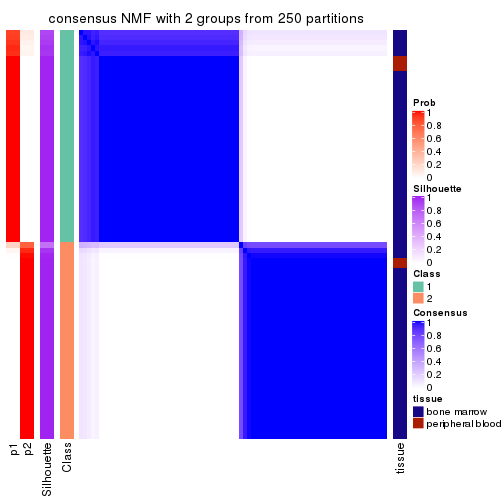</p>

</div>
<div id='tab-ATC-NMF-consensus-heatmap-2'>
<pre><code class="r">consensus_heatmap(res, k = 3)
</code></pre>

<p>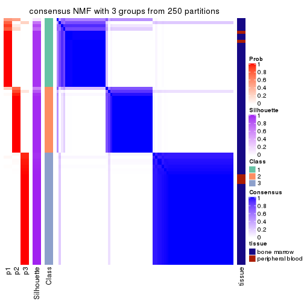</p>

</div>
<div id='tab-ATC-NMF-consensus-heatmap-3'>
<pre><code class="r">consensus_heatmap(res, k = 4)
</code></pre>

<p>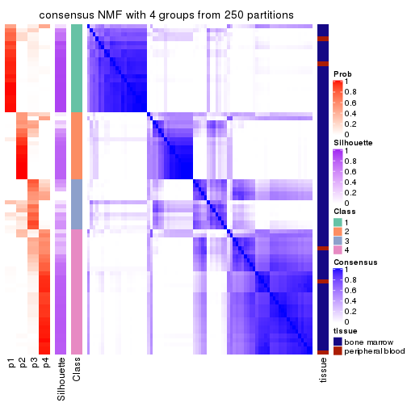</p>

</div>
<div id='tab-ATC-NMF-consensus-heatmap-4'>
<pre><code class="r">consensus_heatmap(res, k = 5)
</code></pre>

<p>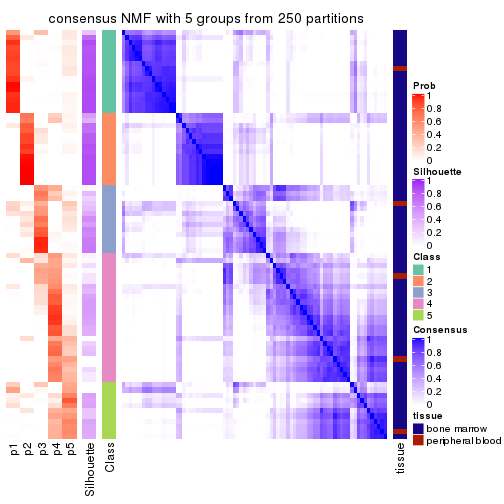</p>

</div>
<div id='tab-ATC-NMF-consensus-heatmap-5'>
<pre><code class="r">consensus_heatmap(res, k = 6)
</code></pre>

<p>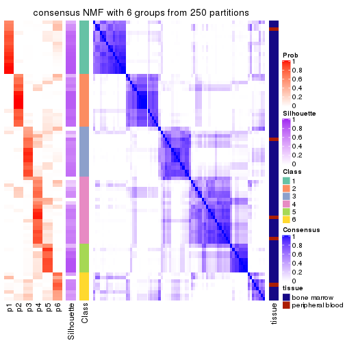</p>

</div>
</div>

Heatmaps for the membership of samples in all partitions to see how consistent they are:


<script>
$( function() {
	$( '#tabs-ATC-NMF-membership-heatmap' ).tabs();
} );
</script>
<div id='tabs-ATC-NMF-membership-heatmap'>
<ul>
<li><a href='#tab-ATC-NMF-membership-heatmap-1'>k = 2</a></li>
<li><a href='#tab-ATC-NMF-membership-heatmap-2'>k = 3</a></li>
<li><a href='#tab-ATC-NMF-membership-heatmap-3'>k = 4</a></li>
<li><a href='#tab-ATC-NMF-membership-heatmap-4'>k = 5</a></li>
<li><a href='#tab-ATC-NMF-membership-heatmap-5'>k = 6</a></li>
</ul>
<div id='tab-ATC-NMF-membership-heatmap-1'>
<pre><code class="r">membership_heatmap(res, k = 2)
</code></pre>

<p>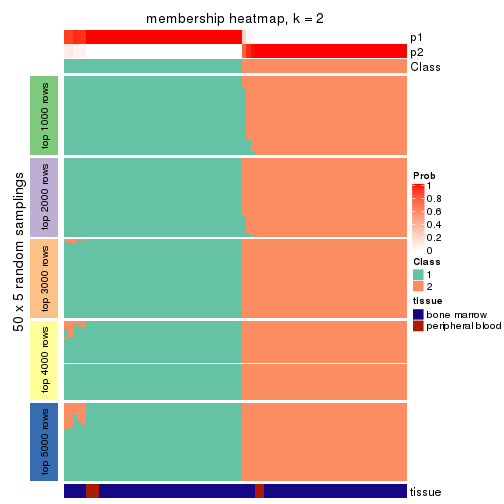</p>

</div>
<div id='tab-ATC-NMF-membership-heatmap-2'>
<pre><code class="r">membership_heatmap(res, k = 3)
</code></pre>

<p>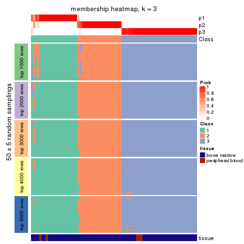</p>

</div>
<div id='tab-ATC-NMF-membership-heatmap-3'>
<pre><code class="r">membership_heatmap(res, k = 4)
</code></pre>

<p>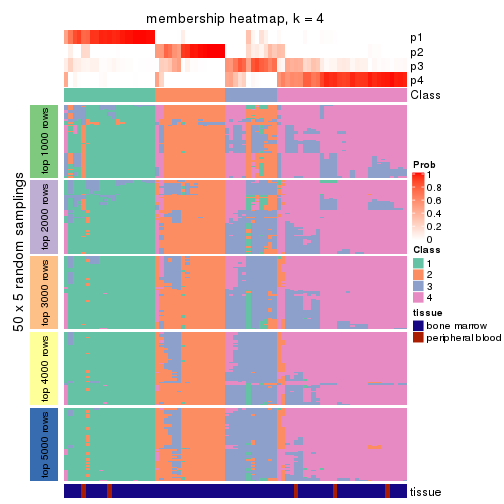</p>

</div>
<div id='tab-ATC-NMF-membership-heatmap-4'>
<pre><code class="r">membership_heatmap(res, k = 5)
</code></pre>

<p>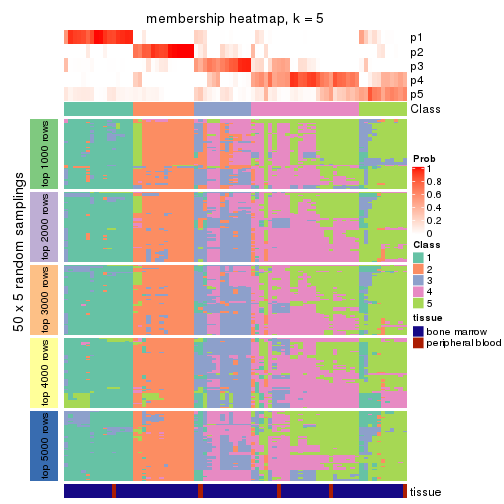</p>

</div>
<div id='tab-ATC-NMF-membership-heatmap-5'>
<pre><code class="r">membership_heatmap(res, k = 6)
</code></pre>

<p>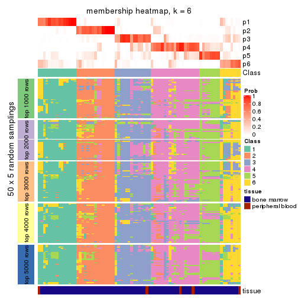</p>

</div>
</div>

As soon as we have had the classes for columns, we can look for signatures
which are significantly different between classes which can be candidate marks
for certain classes. Following are the heatmaps for signatures.


Signature heatmaps where rows are scaled:


<script>
$( function() {
	$( '#tabs-ATC-NMF-get-signatures' ).tabs();
} );
</script>
<div id='tabs-ATC-NMF-get-signatures'>
<ul>
<li><a href='#tab-ATC-NMF-get-signatures-1'>k = 2</a></li>
<li><a href='#tab-ATC-NMF-get-signatures-2'>k = 3</a></li>
<li><a href='#tab-ATC-NMF-get-signatures-3'>k = 4</a></li>
<li><a href='#tab-ATC-NMF-get-signatures-4'>k = 5</a></li>
<li><a href='#tab-ATC-NMF-get-signatures-5'>k = 6</a></li>
</ul>
<div id='tab-ATC-NMF-get-signatures-1'>
<pre><code class="r">get_signatures(res, k = 2)
</code></pre>

<p>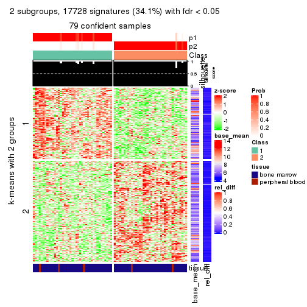</p>

</div>
<div id='tab-ATC-NMF-get-signatures-2'>
<pre><code class="r">get_signatures(res, k = 3)
</code></pre>

<p>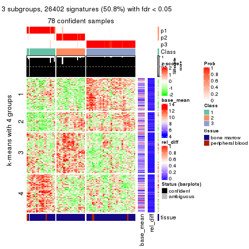</p>

</div>
<div id='tab-ATC-NMF-get-signatures-3'>
<pre><code class="r">get_signatures(res, k = 4)
</code></pre>

<p>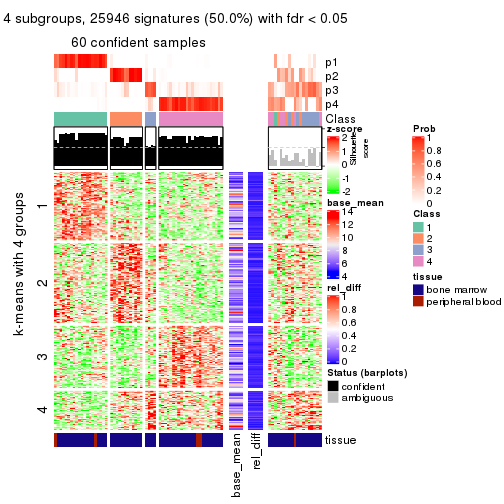</p>

</div>
<div id='tab-ATC-NMF-get-signatures-4'>
<pre><code class="r">get_signatures(res, k = 5)
</code></pre>

<p>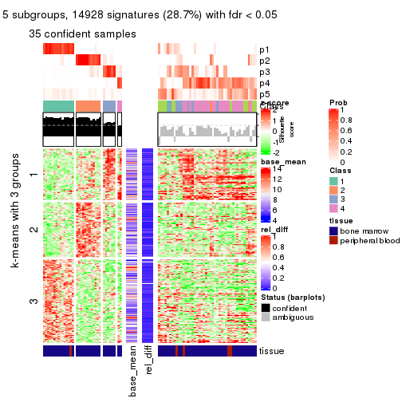</p>

</div>
<div id='tab-ATC-NMF-get-signatures-5'>
<pre><code class="r">get_signatures(res, k = 6)
</code></pre>

<p>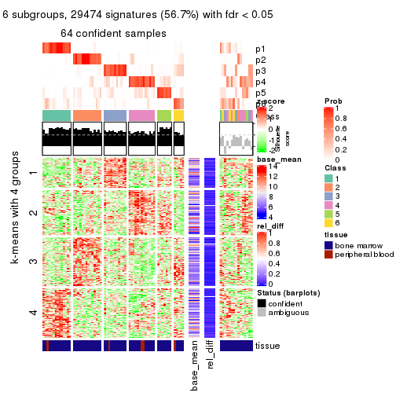</p>

</div>
</div>


Signature heatmaps where rows are not scaled:


<script>
$( function() {
	$( '#tabs-ATC-NMF-get-signatures-no-scale' ).tabs();
} );
</script>
<div id='tabs-ATC-NMF-get-signatures-no-scale'>
<ul>
<li><a href='#tab-ATC-NMF-get-signatures-no-scale-1'>k = 2</a></li>
<li><a href='#tab-ATC-NMF-get-signatures-no-scale-2'>k = 3</a></li>
<li><a href='#tab-ATC-NMF-get-signatures-no-scale-3'>k = 4</a></li>
<li><a href='#tab-ATC-NMF-get-signatures-no-scale-4'>k = 5</a></li>
<li><a href='#tab-ATC-NMF-get-signatures-no-scale-5'>k = 6</a></li>
</ul>
<div id='tab-ATC-NMF-get-signatures-no-scale-1'>
<pre><code class="r">get_signatures(res, k = 2, scale_rows = FALSE)
</code></pre>

<p>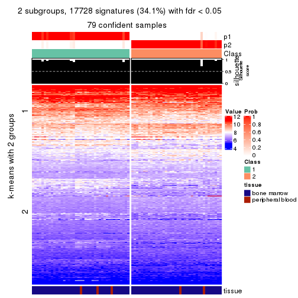</p>

</div>
<div id='tab-ATC-NMF-get-signatures-no-scale-2'>
<pre><code class="r">get_signatures(res, k = 3, scale_rows = FALSE)
</code></pre>

<p>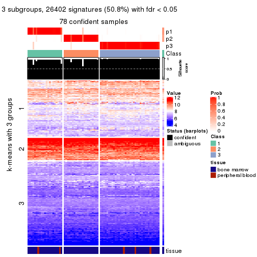</p>

</div>
<div id='tab-ATC-NMF-get-signatures-no-scale-3'>
<pre><code class="r">get_signatures(res, k = 4, scale_rows = FALSE)
</code></pre>

<p>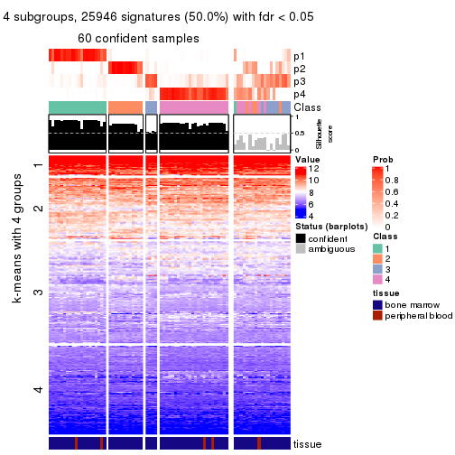</p>

</div>
<div id='tab-ATC-NMF-get-signatures-no-scale-4'>
<pre><code class="r">get_signatures(res, k = 5, scale_rows = FALSE)
</code></pre>

<p>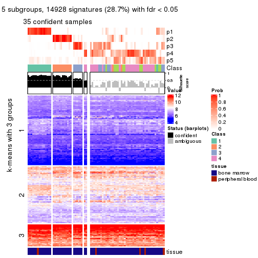</p>

</div>
<div id='tab-ATC-NMF-get-signatures-no-scale-5'>
<pre><code class="r">get_signatures(res, k = 6, scale_rows = FALSE)
</code></pre>

<p>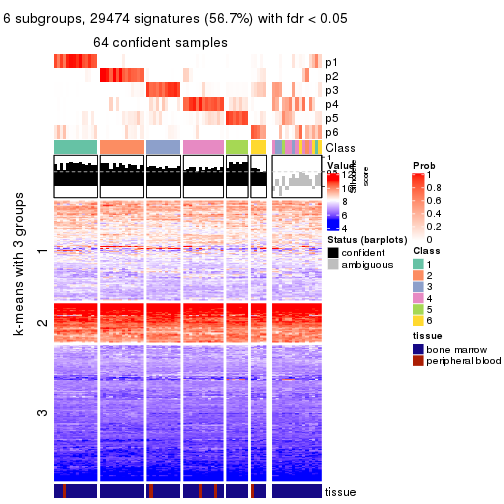</p>

</div>
</div>


Compare the overlap of signatures from different k:

```r
compare_signatures(res)
```

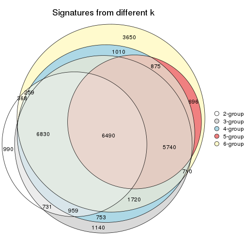

`get_signature()` returns a data frame invisibly. TO get the list of signatures, the function
call should be assigned to a variable explicitly. In following code, if `plot` argument is set
to `FALSE`, no heatmap is plotted while only the differential analysis is performed.

```r
# code only for demonstration
tb = get_signature(res, k = ..., plot = FALSE)
```

An example of the output of `tb` is:

```
#>   which_row         fdr    mean_1    mean_2 scaled_mean_1 scaled_mean_2 km
#> 1        38 0.042760348  8.373488  9.131774    -0.5533452     0.5164555  1
#> 2        40 0.018707592  7.106213  8.469186    -0.6173731     0.5762149  1
#> 3        55 0.019134737 10.221463 11.207825    -0.6159697     0.5749050  1
#> 4        59 0.006059896  5.921854  7.869574    -0.6899429     0.6439467  1
#> 5        60 0.018055526  8.928898 10.211722    -0.6204761     0.5791110  1
#> 6        98 0.009384629 15.714769 14.887706     0.6635654    -0.6193277  2
...
```

The columns in `tb` are:

1. `which_row`: row indices corresponding to the input matrix.
2. `fdr`: FDR for the differential test. 
3. `mean_x`: The mean value in group x.
4. `scaled_mean_x`: The mean value in group x after rows are scaled.
5. `km`: Row groups if k-means clustering is applied to rows.


UMAP plot which shows how samples are separated.


<script>
$( function() {
	$( '#tabs-ATC-NMF-dimension-reduction' ).tabs();
} );
</script>
<div id='tabs-ATC-NMF-dimension-reduction'>
<ul>
<li><a href='#tab-ATC-NMF-dimension-reduction-1'>k = 2</a></li>
<li><a href='#tab-ATC-NMF-dimension-reduction-2'>k = 3</a></li>
<li><a href='#tab-ATC-NMF-dimension-reduction-3'>k = 4</a></li>
<li><a href='#tab-ATC-NMF-dimension-reduction-4'>k = 5</a></li>
<li><a href='#tab-ATC-NMF-dimension-reduction-5'>k = 6</a></li>
</ul>
<div id='tab-ATC-NMF-dimension-reduction-1'>
<pre><code class="r">dimension_reduction(res, k = 2, method = &quot;UMAP&quot;)
</code></pre>

<p>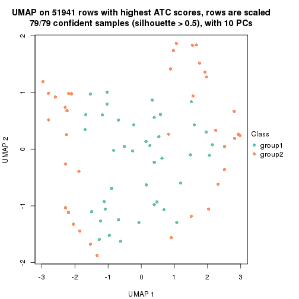</p>

</div>
<div id='tab-ATC-NMF-dimension-reduction-2'>
<pre><code class="r">dimension_reduction(res, k = 3, method = &quot;UMAP&quot;)
</code></pre>

<p>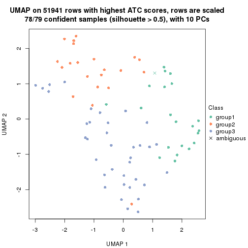</p>

</div>
<div id='tab-ATC-NMF-dimension-reduction-3'>
<pre><code class="r">dimension_reduction(res, k = 4, method = &quot;UMAP&quot;)
</code></pre>

<p>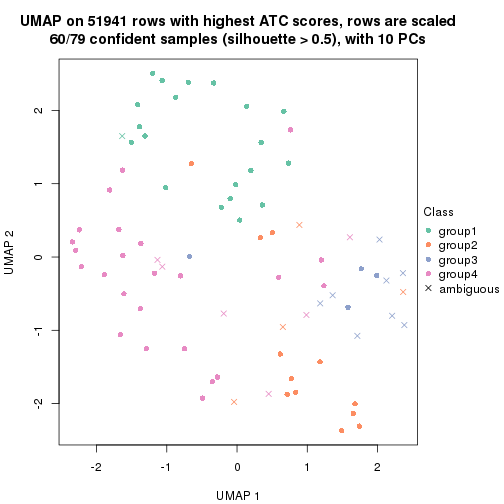</p>

</div>
<div id='tab-ATC-NMF-dimension-reduction-4'>
<pre><code class="r">dimension_reduction(res, k = 5, method = &quot;UMAP&quot;)
</code></pre>

<p>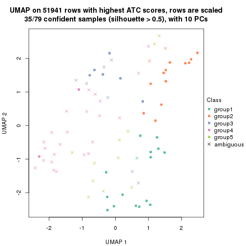</p>

</div>
<div id='tab-ATC-NMF-dimension-reduction-5'>
<pre><code class="r">dimension_reduction(res, k = 6, method = &quot;UMAP&quot;)
</code></pre>

<p>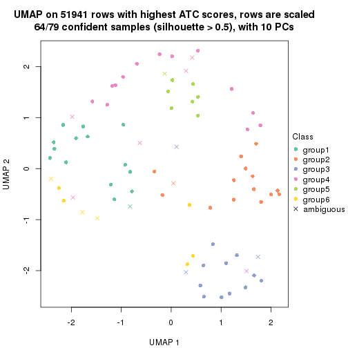</p>

</div>
</div>


Following heatmap shows how subgroups are split when increasing `k`:

```r
collect_classes(res)
```

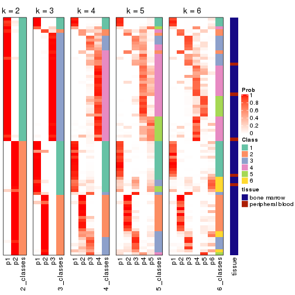


Test correlation between subgroups and known annotations. If the known
annotation is numeric, one-way ANOVA test is applied, and if the known
annotation is discrete, chi-squared contingency table test is applied.

```r
test_to_known_factors(res)
```

```
#>          n tissue(p) k
#> ATC:NMF 79     1.000 2
#> ATC:NMF 78     0.368 3
#> ATC:NMF 60     0.658 4
#> ATC:NMF 35     0.712 5
#> ATC:NMF 64     0.567 6
```


If matrix rows can be associated to genes, consider to use `GO_Enrichment(res,
...)` to perform function enrichment for the signature genes.


 

## Session info


```r
sessionInfo()
```

```
#> R version 3.6.0 (2019-04-26)
#> Platform: x86_64-pc-linux-gnu (64-bit)
#> Running under: CentOS Linux 7 (Core)
#> 
#> Matrix products: default
#> BLAS:   /usr/lib64/libblas.so.3.4.2
#> LAPACK: /usr/lib64/liblapack.so.3.4.2
#> 
#> locale:
#>  [1] LC_CTYPE=en_GB.UTF-8       LC_NUMERIC=C               LC_TIME=en_GB.UTF-8       
#>  [4] LC_COLLATE=en_GB.UTF-8     LC_MONETARY=en_GB.UTF-8    LC_MESSAGES=en_GB.UTF-8   
#>  [7] LC_PAPER=en_GB.UTF-8       LC_NAME=C                  LC_ADDRESS=C              
#> [10] LC_TELEPHONE=C             LC_MEASUREMENT=en_GB.UTF-8 LC_IDENTIFICATION=C       
#> 
#> attached base packages:
#> [1] grid      parallel  stats     graphics  grDevices utils     datasets  methods   base     
#> 
#> other attached packages:
#>  [1] genefilter_1.66.0     ComplexHeatmap_2.1.1  markdown_1.1          knitr_1.26           
#>  [5] preprocessCore_1.46.0 cola_1.3.2            GEOquery_2.52.0       Biobase_2.44.0       
#>  [9] BiocGenerics_0.30.0   GetoptLong_0.1.7     
#> 
#> loaded via a namespace (and not attached):
#>  [1] bitops_1.0-6         matrixStats_0.55.0   bit64_0.9-7          doParallel_1.0.15   
#>  [5] RColorBrewer_1.1-2   httr_1.4.1           tools_3.6.0          backports_1.1.5     
#>  [9] R6_2.4.1             DBI_1.0.0            lazyeval_0.2.2       colorspace_1.4-1    
#> [13] withr_2.1.2          tidyselect_0.2.5     gridExtra_2.3        bit_1.1-14          
#> [17] compiler_3.6.0       xml2_1.2.2           microbenchmark_1.4-7 pkgmaker_0.28       
#> [21] slam_0.1-46          scales_1.1.0         readr_1.3.1          NMF_0.23.6          
#> [25] stringr_1.4.0        digest_0.6.23        pkgconfig_2.0.3      bibtex_0.4.2        
#> [29] highr_0.8            limma_3.40.6         rlang_0.4.2          GlobalOptions_0.1.1 
#> [33] RSQLite_2.1.2        impute_1.58.0        shape_1.4.4          mclust_5.4.5        
#> [37] dendextend_1.12.0    dplyr_0.8.3          RCurl_1.95-4.12      magrittr_1.5        
#> [41] Matrix_1.2-17        Rcpp_1.0.3           munsell_0.5.0        S4Vectors_0.22.1    
#> [45] viridis_0.5.1        lifecycle_0.1.0      stringi_1.4.3        plyr_1.8.4          
#> [49] blob_1.2.0           crayon_1.3.4         lattice_0.20-38      splines_3.6.0       
#> [53] annotate_1.62.0      circlize_0.4.9       hms_0.5.2            zeallot_0.1.0       
#> [57] pillar_1.4.2         rjson_0.2.20         rngtools_1.4         reshape2_1.4.3      
#> [61] codetools_0.2-16     stats4_3.6.0         XML_3.98-1.20        glue_1.3.1          
#> [65] evaluate_0.14        png_0.1-7            vctrs_0.2.0          foreach_1.4.7       
#> [69] polyclip_1.10-0      gtable_0.3.0         purrr_0.3.3          tidyr_1.0.0         
#> [73] clue_0.3-57          assertthat_0.2.1     ggplot2_3.2.1        xfun_0.11           
#> [77] gridBase_0.4-7       eulerr_6.0.0         xtable_1.8-4         skmeans_0.2-11      
#> [81] survival_2.44-1.1    viridisLite_0.3.0    tibble_2.1.3         iterators_1.0.12    
#> [85] AnnotationDbi_1.46.1 registry_0.5-1       memoise_1.1.0        IRanges_2.18.3      
#> [89] cluster_2.1.0        brew_1.0-6
```


